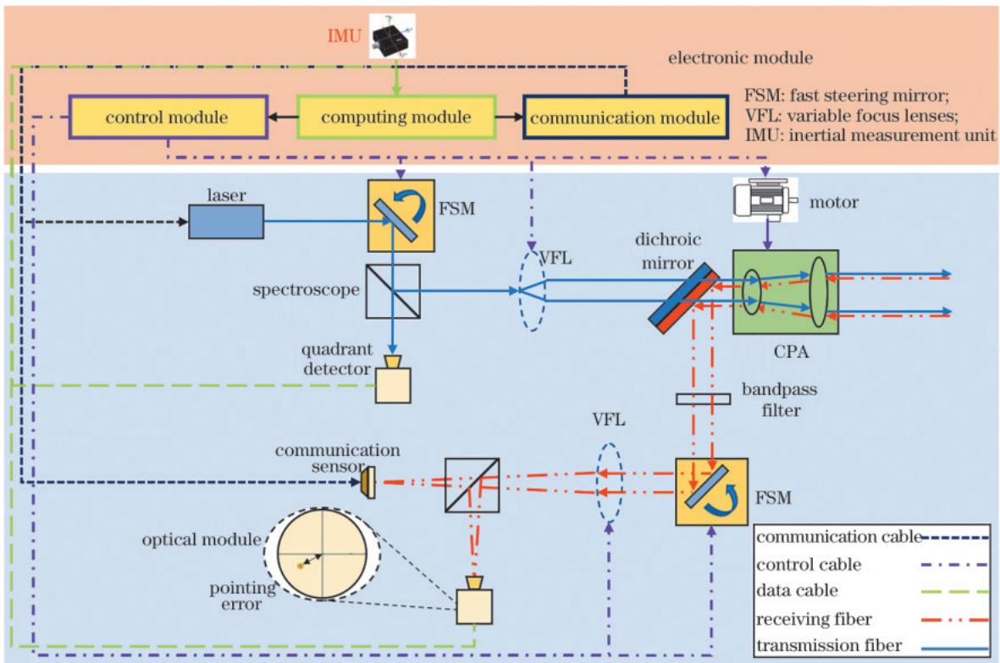
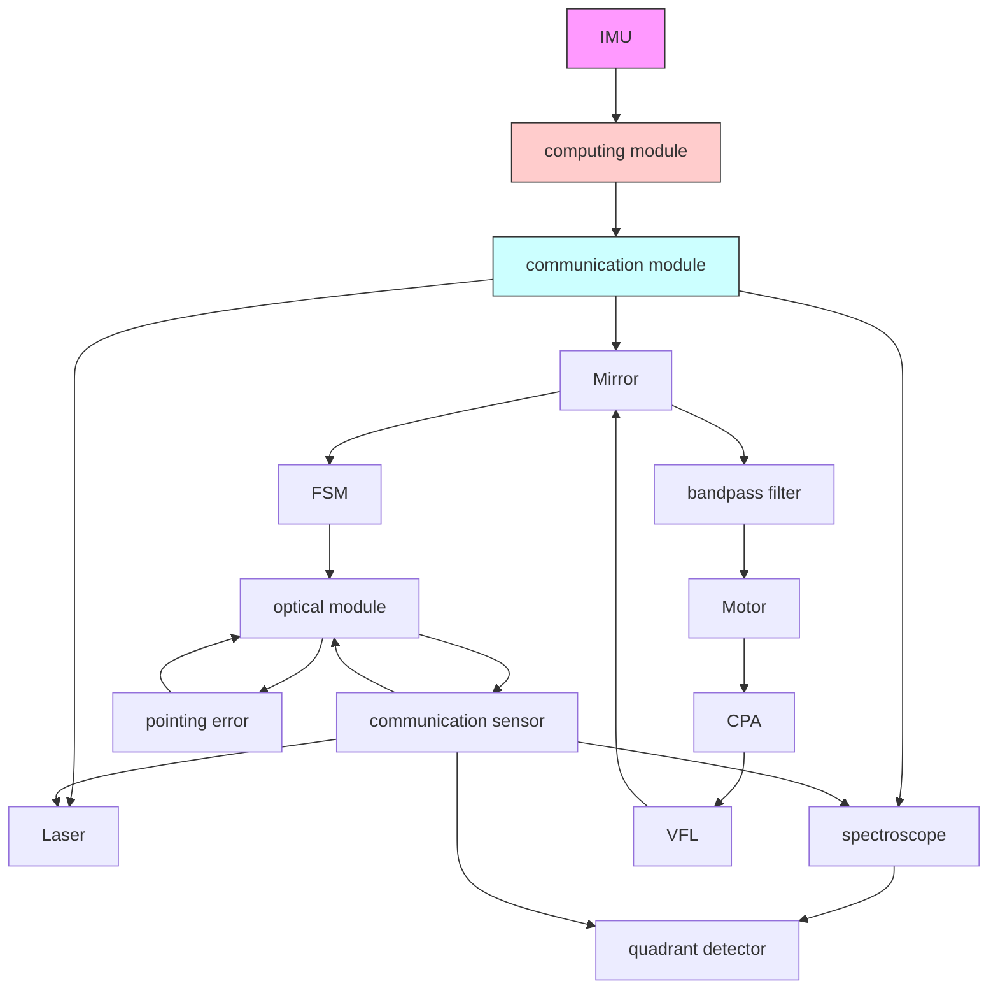
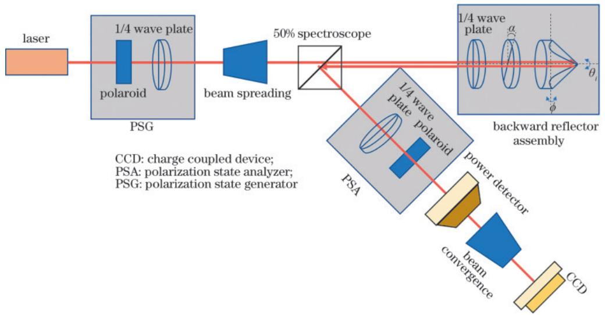
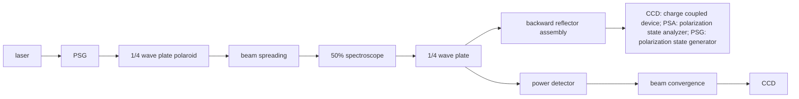
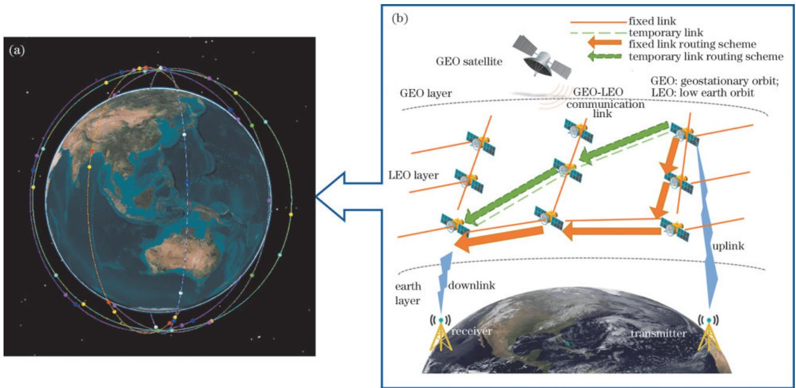
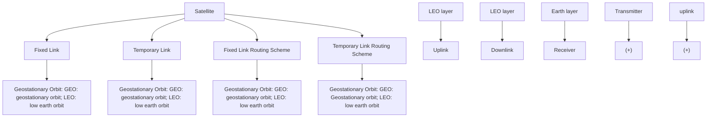
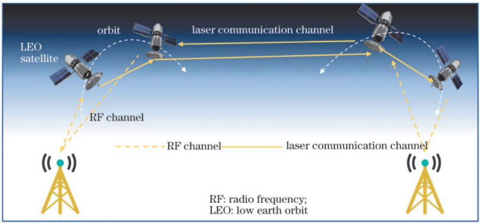

# 激光与光电子学进展

# 星间激光通信关键技术与展望

王浩楠 1 ，刘峻峰 2 ，南卓江 1 ，陶卫 1，3\*

1 上海交通大学电子信息与电气工程学院，上海 200240；

2 上海航天技术基础研究所，上海 201109；

3 微米纳米加工技术全国重点实验室，上海 200240

摘要 激光通信因其传输速率高、通信容量大的优势，被视为新一代通信技术的发展方向，有望在第六代通信技术中发挥重要作用，构建星间激光通信链路成为卫星网络的研究重点之一。本文首先介绍星间激光通信链路相比传统卫星网络的优势，然后从星间激光通信的架构搭建依次阐述捕获技术、通信传输技术和星间路由技术研究热点与发展现状，并介绍现有激光与射频通信融合的技术方法，最后对星间激光通信的未来发展进行展望。

关键词 星间激光通信；捕获、指向与跟踪系统；偏振复用；激光/射频融合；卫星路由

中图分类号 V19

文献标志码 A

DOI：10.3788/LOP241861

# Key Technology and Prospect of Inter-satellite Laser Communication

Wang Haonan1 , Liu Junfeng2 , Nan Zhuojiang1 , Tao Wei1 ,3\*

1 School of Electronic Information and Electrical Engineering, Shanghai Jiao Tong University, Shanghai 200240, China;

2 Shanghai Basic Research Institute of Spaceflight Technology, Shanghai 201109, China;

3 National Key Laboratory of Advanced Micro and Nano Manufacture Technology, Shanghai 200240, China

Abstract Laser communication is regarded as the development direction of the new generation communication technology due to its advantages of high transmission rate and large communication capacity. It is expected to play an important role in the sixth-generation communication technology, and building inter satellite laser communication links has become one of the research focuses of satellite networks. This article first introduces the advantages of inter satellite laser communication links compared to traditional satellite networks. It elaborates on the research hotspots and development status of capture technology, communication transmission technology, and inter satellite routing technology from the architecture construction of inter satellite laser communication. It also introduces the existing technology methods for integrating laser and RF communication. Finally, it looks forward to the future development of inter satellite laser communication.

Key words inter-satellite laser communication; acquisition pointing and tracking; polarization multiplexing; laser/radio frequency fusion; satellite routing

# 1　引 言

卫星通信技术能够有效提高通信的实时性和便利性［1］ ，目前卫星大多利用微波进行通信。由于微波技术频段低、频段资源紧张，传统的微波通信卫星已无法满足现代通信对大容量、广覆盖的需求［2］ ，而激光通信能够很好地解决这些问题［3-4］ 。

激光通信在星间4000 km的距离可以实现10 Gb/s的通信速率［5］ ，与传统微波卫星通信相比，其传播延迟也将大大降低［6］ 。此外激光卫星通信还具有吞吐量大、保密性好、质量轻、功耗小等特点［7］ 。选择激光作为信息载体，实现在自由空间内点对点通信，可以广泛应用于卫星与卫星、卫星与地面站，以及卫星与车载、机载设备之间的无线实时通信［8］ 。激光相较于射频通信，其发散角更小，可有效降低信息传输时泄露的可能性。并且利用激光的自准直性，能够实现激光通信卫星的测距功能［9］ ，进而可应用于卫星编队的自主定轨和对空间星体的探测。未来，通过星间激光通信和自主定轨，可以实现天地一体化高速通信网络［10］ ，也可用于超远卫星通信距离的空间引力波探测等研究领域［11］。因此，卫星激光通信不仅可以助力国民经济的发展，还将在占领未来国防科技制高点中发挥关键作用［12］ 。

自美国在20世纪70年代研制出世界首台激光通信终端以来，全球各国研究人员相继投入到激光通信系 统 的 研 发 工 作 中［13］。 2023 年 ，美 国 航 空 航 天 局（NASA）的深空光通信（DSOC）项目成功实施，在飞船距地球 3100万 km 处以 267 Mb/s的最高速率传回超高清视频，彰显了激光通信的超远距离传输和超高数据速率［14］ 。欧洲在 20 世纪 80 年代也开始开展激光通信技术研究和实验，在21世纪初相干激光通信在轨实验成功后，欧洲航天局（ESA）正式启动了欧洲数据中继系统计划（EDRS）。2019 年，EDRS-A 和 EDRS-C 卫星在 45000 km 的链路上实现了 1. 8 Gb/s 的通信速率［15］ ，并在2024年开展深空激光通信实验，在1 AU（天文长度单位，表示地球到太阳的平均距离）的距离实 现 了 10 Mb/s 的 传 输 速 率［16］ 。 我 国 于 2020 年 首 次开展低轨星间激光通信技术实验，由 LaserFleet公司研制激光通信载荷，能够实现 3000 km以上的通信距离，速率可达 100 Mb/s。2024年 5月，由上海光学精密机械研究所研制的激光通信载荷随智慧天网一号01星升空，该载荷能够实现中轨星间万公里级的高速信息互联。预计在2026年，我国将利用嫦娥7号开展月-地激光通信技术验证［17］ 。

本文首先阐述星载激光终端抑制卫星平台振动和温度变化等干扰因素对捕获效果影响的技术方法，进而介绍星间激光通信复用方法的设计以及对多普勒效应等通信干扰因素的仿真研究，然后介绍星间通信路由中的波长分配、动态链路，以及卫星调度等技术，对激光/射频融合网络的技术发展与应用场景进行论述，最后对未来星间激光通信的发展方向进行讨论，探究天地网络融合等开放性问题。

# 2　星间激光通信捕获技术

由于具有能量集中、方向性强的特点，激光能在低功率条件下高效率地实现远距离信息传递。但极窄的通信波束以及卫星内外环境的干扰也对星间通信中的捕获、指向和跟踪系统（APT）提出了更高的要求［18］ 。

APT系统的主要功能是在卫星进行通信前捕获传递信息的光束，并在通信过程中保持光束对准，保障通信链路的畅通。图1为典型的APT系统框图，在发射端通信模块对激光发射器进行调制，控制模块驱动快速转向镜（FSM）和变焦透镜（VFL），根据通信链路情况对发射光束方向和束腰大小进行自适应的精密调节。最后通过进一步增宽透镜，发射到太空中。在接收端卫星激光终端利用粗指向组件（CPA）根据星历对可能区域进行大范围扫描，捕获到信标光束后对杂光进行滤除。根据接收端摄像头采集到的光斑指向误差，在计算和控制模块的驱动下，快速转向镜能够实现高精度、快响应的光束跟踪，从而搭建稳定的通信链路［19］ 。在接收端同样利用同焦距的VFL对信号光束进行接收，由通信传感器将光信号转换为电信号，并由通信模块解调完成通信过程。

flowchart

图1捕获、指向和跟踪系统框图  
Fig. 1 Acquisition, pointing, and tracking system block diagram

但在自由空间之中，卫星的自振动和巨大的温度变化会导致光束指向产生误差，光束捕获概率降低，显著降低通信性能［20-21］ 。研究人员从 APT 系统的软件模拟分析和硬件控制技术两个角度抑制抖动的影响，提出光束自适应控制技术，并建立模型。

# 2. 1 APT的软件分析与硬件控制

在克服卫星自身抖动的影响过程中，研究人员对振动特性进行分析，推导振动对通信性能影响，并提出改进方法。Song等［22］ 研究了指向误差对星间激光通信链路平均误码率的影响，利用 Marcum Q函数推导出平均误比特率（ABEP）的可逆表达式，对抖动条件下的通信损失给出有效的误差预测方法。Ma等［23］ 将扫描参数、驻留时间、初始指向误差和振动角度等关键参数综合建模，提出了一种利用振动偏差和扫描参数的解析表达式计算振动对星间光通信捕获系统影响的新方法。Li等［24］ 利用欧洲半导体激光星间链路实验（SILEX）振动模型，推导了振动环境下的耦合效率，采用高斯模型来近似实际光纤耦合效率模型，提出了无参数光纤耦合方法。该方法提高了平均耦合效率，显著了降低误码率并提高了通信可靠性。

在模拟分析的基础之上，还有一些研究人员通过改进APT的硬件控制技术，抑制卫星平台振动造成的影响。Lü等［25］ 提出积分时间自适应控制的高精度亚像素细分技术，利用高谐振频率伺服执行器驱动FSM，实现高精度、快速的波束指向，能够达到3 μrad的跟踪精度。Lu等［26］ 利用旋转双棱镜控制激光方向，结合象限雪崩光电二极管提取入射光束和通信信号的角偏差，进行闭环跟踪，对 5 Hz 以下的平台抖动实现了有效抑制。Baeck等［27］ 采用综合指向控制分析方法，对控制系统进行改进。将粗、精两指向阶段功率谱密度（PSD）插值组合，并对控制器反馈增益进行指导，使得指向误差最小化。高运普等［28］ 对一对多激光通信端机的控制决策进行研究，针对内外部扰动，根据自抗扰控制并结合卡尔曼滤波状态观测器设计控制算法，并进行仿真和平台实验搭建，将主从镜的控制精度分别提升34%和40%。

# 2. 2　光束自适应技术

研究人员不仅通过改进 APT控制技术实现对振动影响的抑制，还采取自适应光束控制技术（ABC）进行自适应调整［29］ ，该技术已被证明可以减轻光束错位的不利影响［30-31］ 。相比于机械校正，通过捕获时间内扫描波束最佳发散角实现校正［32-33］ ，具有更高的分辨率和校正速度［34］ 。Song 等［35］ 提出一种基于对瞬时指向误差角的连续检测进行波束腰调整的动态束腰调整方案，并推导出了最佳动态光束腰的简单代数解，该方法比固定束腰激光星间链路的性能有所提高。Lee等［34，36］ 分析了卫星振动条件下的采集时间与最佳光束发散角的解析表达式，利用VFL自适应调节光束发散角以适应链路条件，进行仿真验证并通过自适应调整波束发散角使捕获时间最小化。

# 2. 3　光天线形变分析

在卫星平台中，除振动造成的光束指向误差影响APT捕获性能之外，太空环境中巨大的温度变化也容易造成光天线的形变，造成波前畸变相位和光斑定位误差。Tan 等［37］ 用 Zernike 椭圆多项式拟合热变形引起的 SiC材料的椭圆反射器的波前像差，研究了椭圆反射面指向误差与温度分布的关系。背固定方法能更好缓解温差造成的形变，减小指向误差。在此基础上，Xie等［38］ 建立了基于小波分析的变形模型，且数值分析表明，通过小波重构局部不规则变形，在一定程度上远优于Zernike多项式，并利用该模型推导了各种天线变形对接收信号强度的影响程度。Wang等［39］ 提出一种描述低频波前变形的高斯随机相位屏（GRPS）模型，其可用于研究由低频变形引起的指向误差和跟踪误差。实验结果表明，指向和跟踪误差与光天线抖动振幅和标度长度正相关。Wang等［40］ 提出一种恢复算法来校正信标质心。在 Fraunhofer衍射区，采用 Zernike 多项式来描述波前畸变相位，建立畸变光斑的远场分布模型。根据坐标标定的目标函数，采用共轭梯度法求解Zernike多项式系数，实现畸变光斑的位置校正。

# 2. 4　不同APT技术方案对比

随着 APT技术的发展，其指向精度逐步提升，体积和质量不断减小，可实现的星间激光通信的距离也在逐渐增加，目前常见的 APT技术方案有万向架式、摆镜式、潜望式和 型转台式，其具体性能对比如表所示［41］ 。

表 技术方案对比  
Table 1 Comparison of APT technology solutions 

<table><tr><td>Index</td><td>Gimbal frame</td><td>Oscillating mirror</td><td>Periscope</td><td>L-shaped turntable</td></tr><tr><td>Pointing accuracy</td><td>High</td><td>Low</td><td>Medium</td><td>High</td></tr><tr><td>Volume and weight</td><td>Large</td><td>Small</td><td>Large</td><td>Small</td></tr><tr><td>Other advantage</td><td>Large-aperture antenna</td><td></td><td>Low temperature control requirements</td><td>High research value</td></tr></table>

# 3　星间激光通信的通信技术

高精度的捕获与跟踪是实现星间通信的前提。星间激光通信能以 Gb/s的传输速率进行数千公里的通信，不光得益于激光波段的大带宽，也与先进的复用技术有关［42-43］ 。在太空环境中，星间激光通信的干扰也同样存在。卫星之间的相对高速移动也会导致多普勒频移的产生［44-45］ ，并且在多跳卫星通信中累积［46］ ，使通

信的可靠性下降。

# 3. 1　偏振复用

激光通信中常用的复用技术有频率复用和偏振复用。相比于偏振复用，频率复用需要使用两个激光器，对于体积和质量有严格要求的卫星通信并不适用。而偏振复用的低复杂度和收发终端灵活切换的特点使其广泛应用于星间激光通信中。研究人员从理论分析、系统改造等角度出发，提升星间激光通信中偏振复用的性能，并将其应用到空间目标识别当中。Chen 等［47］提出一种基于Jones矩阵的光线追迹计算偏振框架，该框架采用矢量光线追踪法确定角立方反射器（CCR）空间坐标，利用Jones矩阵描述系统偏振特性，实现了对任意输入偏振态和入射角的校准反射系统的光线追踪，并分析接收光中 p偏振分量的强度比与不同偏振态的入射光以及圆偏振光之间的关系。实验结果与理论模拟非常吻合，对偏振复用的理论建模计算具有指导意义。Wang等［48］ 建立光学表面的偏振散射模型来模拟和分析激光通信终端（LCT）的杂散光，并将 1/4波片和半波片组合成双波片，对传统的偏振发射系统进行改进，开发了包含离轴光学天线的收发器系统。通过实验验证，该系统将信号收发器的隔离度提高了7 dB \~8 dB，也降低了太阳光导致的温度变化影响，提高了系统对杂散光的抑制能力。Bartels 等［49］ 提出基于偏振调制的卫星激光测距（SLR），如图2所示，激光经由偏振状态发生器（PSG），光束扩展后对后向反射器组件均匀照明，通过后向反射器组件中偏振片不同的旋转角度，反射不同偏振状态激光，利用偏振状态分析仪（PSA）实现卫星识别。通过实验验证，即使地面测量站只测量衍射光束的一小部分，也可高精度地获得卫星参数。

flowchart

图2 激光偏振复用识别示意图  
Fig. 2 Laser polarization multiplexing recognition diagram

# 3. 2　多普勒分析

与地面光纤通信不同，激光通信卫星通信时，卫星周期性地围绕地球运动。当两颗卫星之间存在速度差时，接收到的光信号会受到多普勒效应的影响导致频移，降低接收信号的信噪比，增加系统的误码率［50-51］ 。对此，研究人员从通信接收机仿真测试、多跳卫星通信多普勒频移累积，以及多普勒频移模拟器等方面进行研究。Yue等［52］ 采用改进的决策驱动Costas 光锁相环（OPLL）和数字控制算法实现了对100 MHz/s速度以下的多普勒频移跟踪，实验表明该系统在最低信号功率在−59.2 dBm以上时具有较强的自适应能力，且在1 Gb/s的数据速率下可实现10−3 以下的误码率。Tan等［46］ 推导了光学接收机的平衡差分相移键控（DPSK）［53］ 检测系统的剩余多普勒频移与误码率之间的关系，采用等效Q因子来计算多普勒对DPSK光学系统的影响，发现通信误码率不仅与多普勒的阶跃变化有关，还对多普勒频移的累积敏感，当剩余多普勒频移 $\Delta f _ { \mathrm { r e s } } / R _ { \mathrm { b } }$ 为 0. 05、0. 10 和 0. 15 时 ，误 码 率 从 10−17 分 别 增 长 到10−14、10−11 和 10−6 。 Zhang 等［54］ 提 出 一 种 基 于 双 并 行马赫-曾德尔调制器（DP-MZM）的空间光通信载波多普勒频移仿真方法，实现了±18 GHz范围内可控的光载波频移，边带抑制比可达40 dB以上，为星间激光通信链路地面综合测试提供了方案。

# 4　星间激光通信路由技术

随着星间激光通信技术的不断发展，卫星网络路由变得越来越复杂［55］ 。但从网络角度来看，大量的激光星间链路（LISL）是冗余的［56-57］ ，激光终端保持活动状态将导致体卫星产生额外的能量消耗［58］ ，能量利用效率低下。可以利用机器学习在寻找最优策略方面的优势，将其应用到卫星的资源调度算法中［59］ 。因此，动态卫星链路的调度也是值得研究的问题。

# 4. 1　路由和波长分配问题

随着火箭发射成本的不断降低，卫星通信网络也在快速发展，激光通信卫星的数量也在不断增长。由于卫星终端的载荷资源有限以及卫星之间的相对运动，如何降低卫星建立通信链路的成本成为研究人员关心的问题。对此，Sun等［60］ 提出基于计算和存储功能的超级卫星节点的路由和波长分配（RWA）算法，其在相同连通性的条件下可以节省50%的波长需求，降低星上激光器、相关调制器，以及建立LISL的成本，该算法对于未来卫星光网络节点如何进行波长配置具有参考价值。Li等［61］ 提出一种基于跳数松散约束的自适应负载均衡小窗口蚁群优化算法（ACO-ALB-SWS-HNLC），其对解决星间激光通信网络拓扑中的RWA问题有较强的鲁棒性。该算法保持了良好的收敛速度和通信时延，实现了通信跳数和阻塞概率的降低。

# 4. 2　动态链路算法

研究人员针对传统星间激光通信网络链路单一、传播时延长、传输损耗大的问题，提出动态临时链路算法，使激光通信链路更加灵活，也可有效降低空闲链路的通信能耗成本。Chaudhry等［62］ 提出永久星间链路（PLs）和临时星间链路（TLs）并存的自由空间光学卫星网络，并利用卫星星座模拟器Systems Tool Kit搭建卫星星座进行模拟分析，如图 3所示。根据仿真结果可知，在1500\~2500 km的洲际连接范围内，平均网络延时可改善15\~23 ms，TLs对下下一代自由空间光学卫星网络（NNG-FSOSNs）提供即时设置的LISL具有推动作用。Wang等［63］ 提出一种结合特定路由策略的动态LISL调度算法，其将减少跳数和关闭空闲激光终端之间进行权衡这一优化目标转化为马尔可夫决策过程（MDP），仿真结果表明，该算法能够降低卫星网络平均时延约2跳、降低能耗约15%，可充分发挥星载激光终端远程通信的潜力。

flowchart

图3 星间激光通信路由链路图。（a）Systems Tool Kit搭建的星座；（b）固定链路与临时链路对比图  
Fig. 3 Routing link diagrams of inter-satellite laser communication. (a) Constellation built using Systems Tool Kit; (b) fixed link and temporary link comparison

# 4. 3　卫星调度管理策略

针对不同链路通信条件和网络流量等通信条件的变化，研究人员提出不同策略进行卫星调度和管理，提升对通信条件变化的适应性，并降低卫星能源消耗［64］ 。Erdogan 等［65］ 提出了高空台站（HAPS）辅助星间激光通信合作模型，以减小通信损耗对通信性能的影响。并对HAPS节点选择天顶角最小卫星和选择瞬时信噪比最高卫星两种策略进行性能分析和仿真比较。根据仿真结果可知，两种调度方法的理论曲线和模拟曲线高度吻合， 内的火山活动导致两种调度方法的通信中断概率相近，但 22 km以上选择瞬时信噪比最高策略的中断概率更小。该方法能够有效地解决星间激光通信的跟踪和精确瞄准问题。Wang等［66］ 提出基于重力的网络流量抽象（GNTA）模型来评估每个激光链路的重要性，并进一步提出一种基于GNTA的开关控制（GOOC）算法。数值仿真表明，利用GOOC算法关闭20%激光终端可以提高10%的能源效率，并且GOOC算法能够缓解通信性能下降的问题，为星间激光通信的通信终端管理和提高能源利用效率提供支持。

# 5　激光/射频融合技术

对于星地通信链路，由于激光通信对地面多用户的覆盖性差［67-68］ 和对雾、尘、沙尘暴等大气湍流非常敏感［69-71］，因此研究人员将激光通信和射频通信技术（RF）融合。如图4所示，把星间激光通信与星地微波链路进行融合能更好满足多种通信需求和复杂环境下的通信性能要求，也能够提高卫星通信网络的吞吐量［72］ 。对此，Zong［73］ 设计出一种具有双边带抑制载波调制（DSB-SC）和相干差检测（CD）的透明传输通信系统，将该系统与相位调制码分复用（PM/CD）的透明多波段链路性能进行对比，并推导出两种通信方式的射频增益、噪声系数与三阶无杂散动态范围（SFDR）。结果表明，该系统相比于PM/CD系统，具有更高的线性度和更高的灵敏度，当有限消光比为30 dB、光前置放大器增益为 30 dB、子通道数为 7时，DSB-SC 的总射频增益 $G _ { \mathrm { R F } }$ 和三阶无杂散动态范围（SFDR）分别提高 5. 92 dB 和 4. 36 dB·Hz2/3 ，噪 声 指 数（NF）值 下 降6.39 dB。移动通信用户终端通过微波链路接入卫星互联网，需要在微波和激光链路间进行会集和分发［74］ 。对此，Arienzo［75］ 提出一种基于认知中继的卫星间和卫星对地通信架构，其能够有效对抗自由空间光通信（FSO）中湍流影响。中继架构下 RF/FSO 通信提高了吞吐量和实时接收能力，在同样为 10跳转发时，该架构光学部分比现有通信系统的吞吐量提升12 Gb/s，RF部分提升4 Gb/s，并且网络能量消耗也有所下降。这为提高数据中继系统的吞吐量和实时接收能力以及降低网络能耗提供了指导。Liu等［76］ 提出一种 FSO/RF星间链路网络兼容方案，通过多目标模拟退火算法，优化激光网络的拓扑结构和时隙调度方案。最终在北斗卫星导航系统中进行方法验证，结果表明相较于无线电星间链路，混合网络具有超过 125 Mb/s的吞吐量、小于 10 s的下行时延，且倾斜地球同步轨道（IGSOs）和中地球轨道（MEOs）的激光卫星加权位置精度因子（WPDOP）分别小于 1.5和 1。上述方法的比较如表2所示。

```mermaid
graph TD
    A["LEO satellite"] -->|RF channel| B["(())<br>"]
    B --> C["laser communication channel"]
    C --> D["({})<br>"]
    D --> E["({})<br>"]
    E --> F["({})<br>"]
    F --> G["({})<br>"]
    G --> H["({})<br>"]
    H --> I["({})<br>"]
    I --> J["({})<br>"]
    J --> K["({})<br>"]
    K --> L["({})<br>"]
    L --> M["({})<br>"]
    M --> N["({})<br>"]
    N --> O["({})<br>"]
    O --> P["({})<br>"]
    P --> Q["({})<br>"]
    Q --> R["({})<br>"]
    R --> S["({})<br>"]
    S --> T["({})<br>"]
    T --> U["({})<br>"]
    U --> V["({})<br>"]
    V --> W["({})<br>"]
    W --> X["({})<br>"]
    X --> Y["({})<br>"]
    Y --> Z["({})<br>"]
    Z --> A
    style A fill:#f9f,stroke:#333
    style B fill:#ccf,stroke:#333
    style C fill:#cfc,stroke:#333
    style D fill:#fcc,stroke:#333
    style E fill:#cff,stroke:#333
    style F fill:#ffc,stroke:#333
    style G fill:#cfc,stroke:#333
    style H fill:#fcc,stroke:#333
    style I fill:#cfc,stroke:#333
    style J fill:#fcc,stroke:#333
    style K fill:#cfc,stroke:#333
    style L fill:#fcc,stroke:#333
    style M fill:#cfc,stroke:#333
    style N fill:#fcc,stroke:#333
    style O fill:#cfc,stroke:#333
    style P fill:#fcc,stroke:#333
    style Q fill:#cfc,stroke:#333
    style R fill:#fcc,stroke:#333
    style S fill:#cfc,stroke:#333
```

flowchart

图 激光 射频融合网络示意图  
Fig. 4 Laser/RF fusion network diagram

表2 激光/射频融合技术比较  
Table 2 Comparison of laser/RF fusion technology 

<table><tr><td>Proposed methodology</td><td>DSB-SC/CD[73]</td><td>RF/FSO communication architecture[75]</td><td>Scheduling schemes[76]</td></tr><tr><td>Experimental content</td><td>Compare with PM/CD</td><td>Compare with existing systems</td><td>Algorithm performance testing</td></tr><tr><td>Contribution</td><td> $G_{\text{RF}}$  increased by 5.92 dB, SFDR3increased by 4.36 dB·Hz2/3and NF decreased by 6.39 dB</td><td>Throughput increased by 12 Gb/s (optics) and 4 Gb/s(RF)</td><td>Throughput&gt;125 Mb/s, downlink delay&lt;10 s and PDOP (IGSOs&lt;1.5, MEOs&lt;1)</td></tr></table>

# 6　未来发展热点

未来，随着星间激光通信技术的不断成熟，该技术将促进通信系统的整体性能和功能性提升，以满足日益增长的通信需求和应用场景的多样化。星间激光通信技术的未来发展热点可概括为以下 个方面。

# 6. 1　空天地网络融合

星间激光通信并不能完全替代目前的通信网络，其应作为现有通信系统的补充并增强通信系统功能。星间激光通信链路可以实现低时延的远距离通信，将由卫星和地面组成的异构网络进行空天地网络融合，通过算法和标准设计进行切换，可以根据不同的任务需求和质量要求提供不同质量的服务［77］ 。

# 6. 2　传感与通信融合

通信与传感方面的器件结构与信号处理方法有相似之处，星间激光通信的器件能够实现精确的光束引导与捕获，也可用于对地形地貌、云层厚度与空气污染等信息的感知，有助于对地空通信链路状态的实时分析，提高通信质量。目前我国已经成功发射首颗用于地球观测的星载激光高度计系统的卫星［78］ ，未来可将激光高度计系统与激光通信系统融合，实现星间激光通信卫星的传感通信功能融合。

# 6. 3　先进激光通信终端

在目前的星载激光通信终端中，光束转向台占据了较大的体积和质量。随着光学器件制造技术的发展，新的光束转向方案将更加紧凑灵活，如新型微机电系统（MEMS）驱动移相器的大规模二维光相控阵（OPA）方案［79-80］ 利用光学特性对光束进行转向［81］ ，取代之前机械转向方案。Sun等［82］ 证明大规模二维纳米光子相控阵（NPA）可以实现有源相位可调性，拓展了光相控阵的功能，为激光通信的发展开辟了新的可能。还可将光放大器集成化［83］ ，同时集成高功率放大器（HPA）和低噪声放大器（LNA）的优异性能，更有利于卫星间激光通信的稳定。未来随着光学器件设计制造技术的不断提高，卫星激光通信终端的精度将更加高，体积也将不断缩小。

# 6. 4　纳米卫星通信架构

现阶段，星间激光通信的实现主要依赖于大型卫星提供高效的通信服务，但这种方式存在诸多挑战，包括高昂的发射和维护成本，以及较大的能源消耗。根据过去10年对发射入轨卫星平台的统计数据，纳米卫星的需求持续上升，显示出对其潜力的认可［84］ 。这种趋势使得使用多颗纳米卫星来取代单一大型卫星成为一种理想选择，这不仅能显著降低使用成本［85］ ，还能有效减少运营过程中的能耗。尤其值得一提的是，一枚火箭能够搭载多颗纳米卫星，其发射成本甚至低于传统低轨道卫星的 1‰［86］ ，这一点极大地提升了发射的经济性。目前，学术界和工业界已经开始进行相关研究，致力于设计高效的纳米卫星光通信终端［87］ ，并建立完善的通信架构［88］ 。这些努力为纳米卫星在星间激光通信中的应用奠定了基础。随着一箭多星技术的不断进步和激光通信设备的小型化，纳米卫星的灵活性和成本效益将使其在未来的星间激光通信发展中扮演越来越重要的角色。这一发展不仅将推动相关技术的创新，也将为全球通信网络的构建提供新的解决方案，最终改变我们对卫星通信的传统认知。

# 6. 5　深空激光通信

深空探测无疑是人类探索宇宙的重要前沿领域。这是因为在深空探测的过程中，存在着诸多极具挑战性的难题。一方面，链路距离极其遥远，空间损耗也极为巨大；另一方面，又受到载波频率和功耗的严格限制。在这样的情况下，激光通信展现出了相较于微波通信更为显著的优势，它更加适合超远距离的空间通信［89］ 。现阶段，我国正全力以赴地开展地月深空激光通信的关键技术攻关工作。按照计划，预计在2026年由嫦娥7号进行筹划演示验证工作。这一举措将为我国未来的深空探测事业奠定坚实的基础。在可以预见的未来，深空激光通信在多个方面都有着巨大的发展应用潜力。例如，在天基望远镜的全天候观测方面，它能够为天基望远镜提供高速、稳定的数据传输通道，使得天基望远镜能够更加高效地进行观测工作。同时，在围绕各行星的中继网络建设方面，深空激光通信也能够发挥重要作用，为行星间的数据传输和通信提供可靠的保障。

# 6. 6　人工智能技术的迁移应用

历经数10年的发展，人工智能技术在通信领域已然获得了广泛的应用。人工智能技术凭借其强大的信息处理能力，在信道估计、资源配置等方面成功实现了应用。现阶段，已有研究人员将人工智能技术应用于星间激光通信的信道建模、数据路由，以及卫星调度等方面。然而，目前仍存在数据获取困难、模型训练复杂等问题。针对这些问题，可以采用集成学习或迁移学习等技术来解决当前深度学习所面临的困境。例如，在基于生成对抗网络训练的激光通信信道模型中，利用迁移学习能够更好地适应信道的剧烈变化，少量数据在线训练的模型性能与仅利用生成对抗网络的离线大量数据训练结果相近［90］ 。此外，还可以在卫星编队控制［91］ 、最优避让策略方面引入迁移学习，以提高网络在不同场景下的泛化能力［92］ 。未来，利用集成学习或迁移学习还能够在发射功率和通信带宽等领域进行自适应的动态调整。

# 7　结束语

星间激光通信是一种高速率大容量的全新卫星间通信方式。随着激光引导和捕获技术的进步，以及激光调制与复用技术的发展，星间激光通信技术逐渐成熟和完善，激光通信卫星不断被部署到太空进行实验与应用。本文介绍了目前星间激光通信中的捕获机构如何克服内部振动和外界环境等不利因素的影响，以及通信阶段的复用方法和抗干扰分析，阐述星间通信路由技术和激光/射频融合网络的发展现状。未来的星间激光通信技术在空天地网络融合、传感与通信融合、先进激光通信终端和纳米卫星通信架构等方向有广阔的研究前景。

# 参 考 文 献

[1] Gui G, Liu M, Tang F X, et al. 6G: opening new horizons for integration of comfort, security, and intelligence[J]. IEEE Wireless Communications, 2020, 27(5): 126-132.   
[2] Nie S, Akyildiz I F. Channel modeling and analysis of inter-small-satellite links in terahertz band space networks [J]. IEEE Transactions on Communications, 2021, 69 (12): 8585-8599.   
[3] Ahmmed T, Alidadi A, Zhang Z C, et al. The digital divide in Canada and the role of LEO satellites in bridging the gap[J]. IEEE Communications Magazine, 2022, 60(6): 24-30.   
[4] Mao B M, Zhou X M, Liu J J, et al. On an intelligent hierarchical routing strategy for ultra-dense free space optical low earth orbit satellite networks[J]. IEEE Journal on Selected Areas in Communications， 2O24， 42(5): 1219-1230.   
[5] Grover A, Sheetal A. A 2×40 Gbps mode division

multiplexing based inter-satellite optical wireless communication (IsOWC) system[J]. Wireless Personal Communications, 2020, 114(3): 2449-2460.   
[6] Yang J K, Ran Q W, Ma J. Queuing delay analysis for wavelength routing optical satellite networks over duallayer constellation[J]. IEEE Photonics Journal, 2024, 16 (3): 7301508.   
[7] Chaudhry A U, Yanikomeroglu H. Free space optics for next-generation satellite networks[J]. IEEE Consumer Electronics Magazine, 2021, 10(6): 21-31.   
[8] Kodheli O, Lagunas E, Maturo N, et al. Satellite communications in the new space era: a survey and future challenges[J]. IEEE Communications Surveys & Tutorials, 2021, 23(1): 70-109.   
[9] Wang Y K, Meng L Q, Xu X S, et al. Research on semiphysical simulation testing of inter-satellite laser interference in the China taiji space gravitational wave detection program[J]. Applied Sciences, 2021, 11(17): 7872.   
[10] del Portillo I, Cameron B G, Crawley E F. A technical comparison of three low earth orbit satellite constellation systems to provide global broadband[J]. Acta Astronautica, 2019, 159: 123-135.   
[11] 张艺斌, 邓汝杰, 刘河山, 等 . 太极计划星间激光通信参 数 设 计 及 实 验 验 证 [J]. 中 国 激 光 , 2023, 50(23):2306002.  
Zhang Y B, Deng R J, Liu H S, et al. Parameter design and experimental verification of Taiji program intersatellite laser communication[J]. Chinese Journal of Lasers, 2023, 50(23): 2306002.   
[12] Ding S H, San X G, Gao S J, et al. Laser communication pointing errors caused by bending deformation of the altitude axis of a T-shaped altitudeazimuth mount[J]. Applied Optics, 2019, 58(30): 8141- 8147.   
[13] Liu Y, Li X, Li D X, et al. Green laser inter-satellite link planning in satellite optical networks: trading off the battery lifetime and network throughput using numerical quantization[J]. Journal of Optical Communications and Networking, 2024, 16(9): 868-880.   
[14] 刘超, 李学莹, 张开河, 等 . 深空激光通信研究进展及发展方向(特邀)[J]. 激光与光电子学进展, 2024, 61(7):0706007.  
Liu C, Li X Y, Zhang K H, et al. Research progress and future directions in deep space optical communication (invited)[J]. Laser & Optoelectronics Progress, 2024, 61 (7): 0706007.   
[15] Poncet D, Glynn S, Heine F. Hosting the first EDRS payload[J]. Proceedings of SPIE, 2017, 10563: 105630D.   
[16] Sodnik Z, Heese C, Arapoglou P D, et al. European deep-space optical communication program [J]. Proceedings of SPIE，2018，10524: 105240Q.   
[17] 高铎瑞, 孙名扬, 何明泽, 等 . 深空激光通信发展现状与趋势分析（封面文章·特邀）[J]. 红外与激光工程,2024，53(7);20240247.  
Gao D R, Sun M Y, He M Z, et al. Development

current status and trends analysis of deep space laser communication (cover paper·invited) [J]. Infrared and Laser Engineering, 2024, 53(7): 20240247.   
[18] Zhang F R, Ruan P, Han J F, et al. Analysis and correction of geometrical error-induced pointing errors of a space laser communication APT system[J]. International Journal of Optomechatronics, 2021, 15(1): 19-31.   
[19] Zhang F R, Ruan P, Han J F. Optical path pointing error and coaxiality analysis of APT system of space laser communication terminal[J]. Optica Applicata, 2021, 51 (2): 203-222.   
[20] Wang X, Su X Q, Liu G Z, et al. Laser beam jitter control of the link in free space optical communication systems[J]. Optics Express, 2021, 29(25): 41582-41599.   
[21] Hu S Q, Yu H H, Duan Z, et al. Multi-parameter influenced acquisition model with an in-orbit jitter for inter-satellite laser communication of the LCES system [J]. Optics Express, 2022, 30(19): 34362-34377.   
[22] Song T Y, Wang Q, Wu M W, et al. Impact of pointing errors on the error performance of intersatellite laser communications[J]. Journal of Lightwave Technology, 2017, 35(14): 3082-3091.   
[23] Ma J, Lu G Y, Tan L Y, et al. Satellite platform vibration influence on acquisition system for intersatellite optical communications[J]. Optics & Laser Technology, 2021, 138: 106874.   
[24] Li Z Q, Pan Z T, Li Y T, et al. Parameter-free fiber coupling method for inter-satellite laser communications based on Gaussian approximation[J]. Journal of Optical Communications and Networking, 2024, 16(3): 258-269.   
[25] Lü C L, Li Y, Zhang Y F, et al. Realization of FTA with high tracking accuracy in FSO[J]. Asian Journal of Control, 2015, 17(6): 2345-2353.   
[26] Lu S W, Gao M, Yang Y, et al. Inter-satellite laser communication system based on double Risley prisms beam steering[J]. Applied Optics, 2019, 58(27): 7517- 7522.   
[27] Baeck K, Wi J, Yoon H. Analytic pointing error evaluation on nano-satellite laser communication system [J]. Optics Communications, 2024, 559: 130419.   
[28] 高运普, 刘洋, 滕云杰, 等 . 星间激光通信组网中改进 自抗扰控制研究[J]. 光学学报, 2024, 44(21): 2106001. Gao Y P, Liu Y, Teng Y J,et al. Research on improved active disturbance rejection control in intersatellite laser communication networking[J]. Acta Optica Sinica, 2024, 44(21);2106001.   
[29] Mai V V, Kim H. Non-mechanical beam steering and adaptive beam control using variable focus lenses for freespace optical communications[J]. Journal of Lightwave Technology, 2021, 39(24): 7600-7608.   
[30] Do P X, Carrasco-Casado A, Vu T V, et al. Numerical and analytical approaches to dynamic beam waist optimization for LEO-to-GEO laser communication[J]. OSA Continuum，2020，3(12):3508-3522.   
[31] Mai V V, Kim H. Beam size optimization and adaptation for high-altitude airborne free-space optical communication

systems[J]. IEEE Photonics Journal, 2019, 11(2): 7902213.   
[32] Mai V V, Kim H. Beaconless PAT and adaptive beam control using variable focus lens for free-space optical communication systems[J]. APL Photonics, 2021, 6(2): 020801.   
[33] Mai V V, Kim H. Adaptive beam control techniques for airborne free-space optical communication systems[J]. Applied Optics, 2018, 57(26): 7462-7471.   
[34] Lee K, Mai V, Kim H. Dynamic adaptive beam control system using variable focus lenses for laser inter-satellite link[J]. IEEE Photonics Journal, 2022, 14(4): 7337108.   
[35] Song T Y, Wang Q, Wu M W, et al. Performance of laser inter-satellite links with dynamic beam waist adjustment[J]. Optics Express, 2016, 24(11): 11950- 11960.   
[36] Lee K, Mai V, Kim H. Acquisition time in laser intersatellite link under satellite vibrations[J]. IEEE Photonics Journal, 2023, 15(4): 7303009.   
[37] Tan L Y, Song Y W, Ma J, et al. Pointing error due to temperature distribution of SiC reflectors in intersatellite laser communications[J]. Applied Optics, 2010, 49(22): 4168-4174.   
[38] Xie W Q, Tan L Y, Ma J. Received signal strength reduction analysis based on the wavelet model in intersatellite laser communications[J]. Journal of Lightwave Technology, 2011, 29(15): 2327-2332.   
[39] Wang C, Zhang T, Tong S F, et al. Pointing and tracking errors due to low-frequency deformation in intersatellite laser communication[J]. Journal of Modern Optics，2019，66(4): 430-437.   
[40] Wang Q, Tan L Y, Ma J. Beacon correction method for inter-satellite laser com m unication[J]. Optics Communications, 2021, 493: 127035.   
[41] 张福瑞 . 星间激光通信指向与捕获机构研究[D]. 西安:中国科学院西安光学精密机械研究所, 2019.Zhang F R. Study on pointing and capturing mechanismof intersatellite laser communication[D]. Xi’an: Xi’anInstitute of Optics and Precision Mechanics, ChineseAcademy of Sciences, 2019.  
[42] Sharma V, Sushank. High speed CO-OFDM-FSO transmission system[J]. Optik, 2014, 125(6): 1761-1763.   
[43] Puntsri K. Experimental demonstration of high spectral efficiency SC-FDMA with soft clipping for optical wireless communication systems[J]. IET Optoelectronics, 2018, 12(2): 80-85.   
[44] Khalid M, Ji W, Li D, et al. Characterization of Doppler shift in inter-satellite laser link between LEO, MEO, and GEO orbits[J]. Optics & Laser Technology, 2024, 177: 111033.   
[45] Li M, Wang X, Wang Y S, et al. Investigation of Doppler frequency shift effect on the performance of fourchannel space chaotic laser communication[J]. IEEE Photonics Journal, 2023, 15(4): 7302709.   
[46] Tan L Y, Wang X L, Cheng S X, et al. Effect of Doppler shift on preamplifier DPSK receivers using balanced detection for optical satellite networks[J].

Applied Optics, 2022, 61(16): 4932-4938.   
[47] Chen G Q, Xue B, Yang J F, et al. Polarization properties of calibration reflector system in the polarization-modulated space laser communication[J]. Optics Communications, 2019, 430: 311-317.   
[48] Wang J, Xue J J, Qu E S, et al. Doublet-waveplate polarization transceiver system for backscattering suppression in laser communication terminal[J]. Optics Communications, 2020, 466: 125621.   
[49] Bartels N, Allenspacher P, Hampf D, et al. Space object identification via polarimetric satellite laser ranging[J]. Communications Engineering, 2022, 1: 5.   
[50] Sharma V, Kumar N. Improved analysis of 2.5Gbpsinter-satellite link (ISL) in inter-satellite optical-wireless communication (IsOWC) system[J]. Optics Communications, 2013, 286: 99-102.   
[51] Zheng Z L, Hua N, Zhong Z Z, et al. Time-sliced flexible resource allocation for optical low earth orbit satellite networks[J]. IEEE Access, 2019, 7: 56753- 56759.   
[52] Yue C L, Li J W, Sun J F, et al. Homodyne coherent optical receiver for intersatellite communication[J]. Applied Optics, 2018, 57(27): 7915-7923.   
[53] Tang X K, Kumar R, Sun C M, et al. Towards underwater coherent optical wireless communications using a simplified detection scheme[J]. Optics Express, 2021, 29(13): 19340-19351.   
[54] Zhang W R, Yan X, Cao C Q, et al. Research on simulation methods for Doppler frequency shift of a coherent inter-satellite laser link in a ground test system [J]. Infrared Physics & Technology, 2021, 113: 103627.   
[55] Chen Q, Giambene G, Yang L, et al. Analysis of intersatellite link paths for LEO mega-constellation networks [J]. IEEE Transactions on Vehicular Technology, 2021, 70(3): 2743-2755.   
[56] Wang W, Zhao Y L, Zhang Y J, et al. Intersatellite laser link planning for reliable topology design in optical satellite networks: a networking perspective[J]. IEEE Transactions on Network and Service Management, 2022, 19(3): 2612-2624.   
[57] Chaudhry A U, Yanikomeroglu H. Laser intersatellite links in a starlink constellation: a classification and analysis[J]. IEEE Vehicular Technology Magazine, 2021, 16(2): 48-56.   
[58] Yang Y, Xu M W, Wang D, et al. Towards energyefficient routing in satellite networks[J]. IEEE Journal on Selected Areas in Communications, 2016, 34(12): 3869- 3886.   
[59] Zhou D, Sheng M, Wang Y X, et al. Machine learningbased resource allocation in satellite networks supporting Internet of remote things[J]. IEEE Transactions on Wireless Communications, 2021, 20(10): 6606-6621.   
[60] Sun X, Cao S Z. A routing and wavelength assignment algorithm based on two types of LEO constellations in optical satellite networks[J]. Journal of Lightwave Technology, 2020, 38(8): 2106-2113.   
[61] Li Y F, Zhang Q, Yao H P, et al. Swarm-intelligence-

based routing and wavelength assignment in optical satellite networks[J]. IEEE Transactions on Network Science and Engineering, 2024, 11(1): 1303-1319.   
[62] Chaudhry A U, Yanikomeroglu H. Temporary laser inter-satellite links in free-space optical satellite networks [J]. IEEE Open Journal of the Communications Society, 2022, 3: 1413-1427.   
[63] Wang G H, Yang F, Song J, et al. Optimization for dynamic laser inter-satellite link scheduling with routing: a multi-agent deep reinforcement learning approach[J]. IEEE Transactions on Communications, 2024, 72(5): 2762-2778.   
[64] Hussein M, Abu-Issa A, Tumar I, et al. Reducing power consumption in LEO satellite network[J]. International Journal of Electrical and Computer Engineering (IJECE), 2021, 11(3): 2256.   
[65] Erdogan E, Altunbas I, Kurt G K, et al. Cooperation in space: HAPS-aided optical inter-satellite connectivity with opportunistic scheduling[J]. IEEE Communications Letters, 2022, 26(4): 882-886.   
[66] Wang W, Zhang Y J, Zhao Y L, et al. Gravity-based network traffic abstraction and laser ON/OFF control in optical satellite networks[J]. Journal of Optical Communications and Networking, 2023, 15(12): 958- 968.   
[67] Lee J H, Park J, Bennis M, et al. Integrating LEO satellites and multi-UAV reinforcement learning for hybrid FSO/RF non-terrestrial networks[J]. IEEE Transactions on Vehicular Technology, 2023, 72(3): 3647-3662.   
[68] Bag B, Das A, Ansari I S, et al. Performance analysis of hybrid FSO systems using FSO/RF-FSO link adaptation [J]. IEEE Photonics Journal, 2018, 10(3): 7904417.   
[69] Rakia T, Yang H C, Gebali F, et al. Power adaptation based on truncated channel inversion for hybrid FSO/RF transmission with adaptive combining[J]. IEEE Photonics Journal, 2015, 7(4): 7903012.   
[70] Lei H J, Luo H L, Park K H, et al. Secrecy outage analysis of mixed RF-FSO systems with channel imperfection[J]. IEEE Photonics Journal, 2018, 10(3): 7904113.   
[71] Henna S, Minhas A A, Khan M S, et al. Ensemble consensus representation deep reinforcement learning for hybrid FSO/RF communication systems[J]. Optics Communications, 2023, 530: 129186.   
[72] Kondrateva O, Döbler H, Sparka H, et al. Throughputoptimal joint routing and scheduling for low-earth-orbit satellite networks[C]∥2018 14th Annual Conference on Wireless On-demand Network Systems and Services (WONS), February 6-8, 2018, Isola 2000, France. New York: IEEE Press, 2018: 59-66.   
[73] Zong K. Transparent intersatellite optical wireless communication link with double sideband-suppressed carrier modulation and coherent homodyne detection[J]. Applied Optics, 2018, 57(31): 9464-9470.   
[74] 常呈武, 刘宏阳. 卫星互联网星间激光通信链路传输与路由交换技术研究(特邀)[J]. 激光与光电子学进展,2024，61(7):0706005.

Chang C W, Liu H Y. Research on inter-satellite laser communication link transmission and routing switching technology of satellite Internet(invited) [J]. Laser & Optoelectronics Progress, 2024, 61(7): 0706005.   
[75] Arienzo L. Green RF/FSO communications in cognitive relay-based space information networks for maritime surveillance[J]. IEEE Transactions on Cognitive Communications and Networking, 2019, 5(4): 1182- 1193.   
[76] Liu S Y, Yang J, Guo X Y, et al. Inter-satellite link assignment for the laser/radio hybrid network in navigation satellite systems[J]. GPS Solutions, 2020, 24(2): 49.   
[77] Zhang P Y, Li Y J, Kumar N, et al. Distributed deep reinforcement learning assisted resource allocation algorithm for space-air-ground integrated networks [J]. IEEE Transactions on Network and Service Management, 2023, 20(3): 3348-3358.   
[78] Xie J F, Huang G H, Liu R, et al. Design and data processing of China’s first spaceborne laser altimeter system for earth observation: GaoFen-7[J]. IEEE Journal of Selected Topics in Applied Earth Observations and Remote Sensing, 2020, 13: 1034-1044.   
[79] Wang Y M, Zhou G Y, Zhang X S, et al. 2D broadband beamsteering with large-scale MEMS optical phased array [J]. Optica, 2019, 6(5): 557-562.   
[80] Sun C M, Yang L S, Li B H, et al. Parallel emitted silicon nitride nanophotonic phased arrays for twodimensional beam steering[J]. Optics Letters, 2021, 46 (22): 5699-5702.   
[81] Sun C M, Li B H, Shi W, et al. Large-scale and broadband silicon nitride optical phased arrays[J]. IEEE Journal of Selected Topics in Quantum Electronics, 2022, 28(6): 8200710.   
[82] Sun J, Timurdogan E, Yaacobi A, et al. Large-scale nanophotonic phased array[J]. Nature, 2013, 493(7431): 195-199.   
[83] Bai Z F, Meng J C, Su Y L, et al. On-orbit demonstration of inter-satellite free-space optical stable communication enabled by integrated optical amplification of HPA and LNA[J]. Applied Optics, 2023, 62(23): G18-G25.   
[84] Hasanov M H, Atayev N A. Early conceptual model of nanosatellite with laser beam control and active transponder system[C]∥2022 Systems of Signal Synchronization, Generating and Processing in Telecommunications (SYNCHROINFO), June 29-July 1, 2022, Arkhangelsk, Russian Federation. New York: IEEE Press, 2022.   
[85] Ciaramella E, Cossu G, Ertunc E, et al. Prospects of visible light communications in satellites[C]∥2020 22nd International Conference on Transparent Optical Networks (ICTON), July 19-23, 2020, Bari, Italy. New York: IEEE Press, 2020.   
[86] Saeed N, Elzanaty A, Almorad H, et al. CubeSat communications: recent advances and future challenges [J]. IEEE Communications Surveys & Tutorials, 2020, 22(3): 1839-1862.   
[87] Singh N, Keshavappa R, Sonali, et al. Design of

# 综 述

transmitter communication module for nanosatellite optical communication terminal[C]∥2020 IEEE International Conference on Advanced Networks and Telecommunications Systems (ANTS), December 14- 17, 2020, New Delhi, India. New York: IEEE Press, 2020.   
[88] Huang X, Peng M G, Song J. Heterogeneous network for inter-NanoSat communication with novel modulation schemes and power control[J]. IEEE Communications Letters, 2024, 28(4): 897-901.   
[89] 文轩, 王根成, 高欣, 等 . Ce 掺杂对空间激光通信掺铒光纤的耐辐照影响研究[J]. 红外与激光工程, 2023, 52(3): 20220871.  
Wen X, Wang G C, Gao X, et al. Effect of Ce doping on radiation resistance of erbium-doped fiber for space

laser communication[J]. Infrared and Laser Engineering, 2023, 52(3): 20220871.   
[90] Chen W B, Zhang M, Wang D D, et al. Deep learningbased channel modeling for free space optical communications[J]. Journal of Lightwave Technology, 2023, 41(1): 183-198.   
[91] Wang H M, Qiu T H, Liu Z, et al. Multi-agent formation control with obstacles avoidance under restricted communication through graph reinforcement learning[J]. IFAC-PapersOnLine, 2020, 53(2): 8150-8156.   
[92] Sui Z Z, Pu Z Q, Yi J Q, et al. Formation control with collision avoidance through deep reinforcement learning using model-guided demonstration[J]. IEEE Transactions on Neural Networks and Learning Systems, 2021, 32(6): 2358-2372.