军工组

分析师：杨晨（执业 S1130522060001）

yangchen＠gjzq.com.cn

分析师：任旭欢（执业 S1130524070004）

renxuhuan＠gjzq.com.cn

# 可回收火箭从 0 到 1 迈入黄金发展期——商业航天系列报告火箭篇

# 投资逻辑：

国内可复用火箭进入密集发射期，开启商业航天低成本探索新阶段：1）新华社北京12月 3日电，朱雀三号遥一运载火箭在东风商业航天创新试验区发射升空，首飞成功，回收失败。“朱雀三号”火箭是蓝箭航天研制的新一代低成本、大运力、高频次、可重复使用液氧甲烷运载火箭，其发射成功，开启了我国可复用火箭探索发展的全新阶段。2）长征12 号甲作为第二款首飞即尝试回收液氧甲烷运载火箭，接力朱雀三号，于 12月23日首飞成功。3）可重复使用是降低运载器成本的主要途经之一，亦是克服商业航天发展瓶颈的重要一环，据 TrendForce 数据，目前一次性火箭平均发射成本（报价）落在 1.1-1.8 亿元之间，部分可回收火箭成本（报价）为 6700 万美元左右，随着全球主要大厂积极发展可回收技术，在达成全面回收的情况下，有望将发射成本（报价）降低至200-500 万美元。

美国可回收火箭发展一马当先，猎鹰-9成本优势显著：1）猎鹰-9火箭是世界上第一个轨道级可重复使用火箭，2010年首飞，2015年首次实现一级火箭陆地回收，2018年实现常态化复用，截至 2025年12月 23日，猎鹰-9 已完成580次发射任务，着陆 534 次，其中复用 501 次。2）猎鹰-9 实现常态化可复用之后，SpaceX 发射次数显著增加：2019-2024 年 SpaceX 年度发射活动次数自 13 次增至 138 次，2018-2024 年猎鹰-9 Block 5 一子级平均复用次数自 1.67 次提升至 7.33次。3）猎鹰-9具有较强的成本优势：其近地轨道发射成本约为 1.8万元/kg，猎鹰-重型火箭发射成本约0.9 万元/kg；若猎鹰-9 实现完全可复用，其发射成本将降至 0.5 万元/kg，远低于世界上现役运载火箭的发射成本。

卫星互联网建设牵引商业火箭旺盛需求，我国商业火箭公司百舸争流：1）我国卫星互联网建设提速：2024年12月以来 GW 星座开启批量发射组网阶段，2025 下半年发射提速，7 月 27 日-12 月 26 日，共发射 5 组-17 组共 13 组卫星互联网低轨卫星。2）卫星互联网建设催生商业火箭旺盛需求：考虑 GW星座、G60 星座、鸿鹄-3、鸿雁工程、虹云工程、行云工程、九天微星星座、翔云、吉林一号、天启、吉利星座计划，合计共计划发射44816颗卫星，假设卫星寿命为5年，则每年需要置换约 8963颗卫星，以猎鹰-9一箭 60星运力测算，稳态下由卫星互联网建设与运维新增的商业火箭发射需求可达到 150次/年。3）我国政策支持商业火箭产业发展，上交所发布商业火箭企业使用科创板第五套上市标准审核指引，目前蓝箭航天、星际荣耀、中科宇航、星河动力、天兵科技等商业火箭公司已开启 IPO 进程。4）我们认为，当前商业火箭产业已从 0到 1迈入工程化、产业化发展新阶段，未来将与卫星产业相辅相成携手进入黄金发展期。

# 投资建议

我们判断，随着可复用火箭密集发射与探索，商业火箭产业已经从 0到 1进入快速迭代发展的黄金发展期，商业火箭由产业链由动力系统、箭体结构、控制系统等环节组成。1)在可复用火箭试验发展早期，由于复用成功率较低，火箭制造的需求量较大，动力系统、箭体结构和控制系统有望同步受益。2）当火箭可复用技术成熟时，液体火箭发动机逐步回收利用，箭体结构和控制系统有望持续受益。

从市场空间、业绩弹性、核心竞争力、长期成长空间等维度，我们建议关注商业火箭动力系统和箭体结构相关标的。

# 风险提示

卫星互联网建设不及预期，火箭回收技术发展不及预期

# 内容目录

# 1 我国可回收火箭开启密集发射探索新阶段，万亿商业航天赛道扬帆启航. 4

1.1 朱雀3号与长征12甲接续发力，开启我国可复用火箭探索新阶段.  
1.2 美国猎鹰9号尝试多年才实现常态化可复用，复用火箭降本成效明显. 5

# 2 卫星互联网建设牵引商业火箭旺盛需求，我国商业火箭公司百舸争流..

2.1 卫星互联网建设如火如荼，商业火箭需求旺盛.  
2.2 我国商业航天发展迅猛，商业火箭百舸争流..

# 3 商业火箭产业链梳理：关注发动机、箭体结构、控制系统三大环节. 10

3.1 火箭发射产业链梳理. 10  
3.2 发动机系统.. 12  
3.3 箭体结构.. 14  
3.4 控制系统. 15

# 4 商业火箭产业链投资建议与标的梳理. 17

4.1 投资建议. 17  
4.2 标的梳理. 17

# 5 风险提示.. 18

# 图表目录

图表 1： 朱雀三号发射升空 4  
图表 2： 长征12甲运载火箭首发成功 4  
图表 3： 各式火箭技术、优缺点比较 . 4  
图表 4： 国外运载火箭发射技术创新发展路线 5  
图表 5： 猎鹰9号 . 5  
图表 6： 猎鹰9号火箭自首飞到实现复用耗时 5年半 5  
图表 7： “猎鹰”9 号一级火箭着陆.. 6  
图表 8： 猎鹰9号垂直回收过程示意图 . 6  
图表 9： SpaceX公布的“猎鹰”9火箭成本构成信息 . 6  
图表 10： 可回收运载火箭运力与成本数据 . 6  
图表 11： 2024年全球商业航天发射数量分布..  
图表 12： 猎鹰9号 Block 5 一子级平均复用次数逐年提升..  
图表 13： 星链发射卫星数量及里程碑事件 8  
图表 14： 我国部分卫星互联网建设计划 8

图表 15： GW（国网）星座建设整体规划 9

图表 16： GW（国网）星座商用卫星组网进度 . 9

图表 17： 中国商业航天行业发展阶段及关键事件 . 。

图表 18： 国内商业火箭公司在可回收火箭方面的进展 10

图表 19： 火箭发射服务产业链示意图 11

图表 20： 典型运载火箭一级硬件成本构成 11

图表 21： 典型运载火箭二级硬件成本构成 11

图表 22： 美国主发动机发展脉络及主要液体火箭主动力发动机参数 12

图表 23： 重复使用发动机主要参数 . 12

图表 24： 运载火箭箭体组成结构 14

图表 25： 运载火箭主体结构生产全工艺流程 . 14

图表 26： 液体火箭结构组成及介绍 14

图表 27： 火箭控制系统由飞行控制系统和测试发控系统组成 . 15

图表 28： 飞行控制系统一般结构图 16

图表 29： 火箭测试发射系统一般结构图 16

图表 30： 商用火箭产业链受益标的梳理 17

# 1 我国可回收火箭开启密集发射探索新阶段，万亿商业航天赛道扬帆启航

# 1.1 朱雀 3号与长征12 甲接续发力，开启我国可复用火箭探索新阶段

“朱雀 3 号”火箭发射成功，开启我国可复用火箭探索发展新阶段：新华社北京 12 月 3日电，朱雀三号遥一运载火箭在东风商业航天创新试验区发射升空，按程序完成了飞行任务，火箭二级进入预定轨道。朱雀三号是蓝箭航天空间科技股份有限公司自主研制的新一代低成本、大运力、高频次、可重复使用液氧甲烷运载火箭，其动力系统基于揽件航天自主研制的天鹊系列液氧甲烷发动机，火箭一级装有反作用控制系统、珊格舵与着陆支腿，可在完成轨道发射后实施垂直返回回收与再利用。此次任务同时开展了火箭一级回收验证，但过程中发生异常燃烧，未实现在回收场坪的软着陆，回收试验失败。

我国第二款首飞即尝试回收液氧甲烷运载火箭长征12 甲接力朱雀三号，首发成功：12 月23日上午，长征12甲运载火箭在酒泉卫星发射中心执行首次飞行任务，并同步尝试一级火箭垂直回收，此次发射成功实现二级入轨目标，运载火箭二子级进入预定轨道，但一子级未能成功回收，飞行试验任务获得基本成功。作为我国第二款首飞即尝试回收的液氧甲烷运载火箭，此次任务为后续相关技术迭代优化积累了宝贵数据与实践经验。作为我国新一代中型液体运载火箭，长征十二号甲是在长征十二号统一技术体系下，面向低轨卫星星座高频次发射需求，重点强化一级回收能力的一型可回收构型。其首飞不仅意味着这一新构型的首次亮相，也标志着国家航天体系在“入轨级可回收运载火箭工程化应用”方向迈出关键一步。

图表1：朱雀三号发射升空  
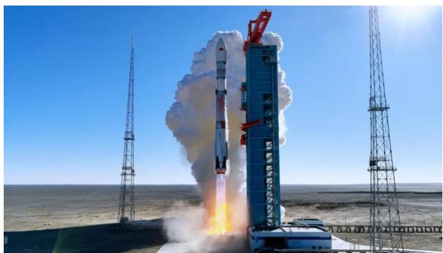

natural_image

Rocket launch in a desert environment with smoke plume and launch tower (no visible text or symbols)

来源：蓝箭航天微信公众号，国金证券研究所

图表2：长征12甲运载火箭首发成功  
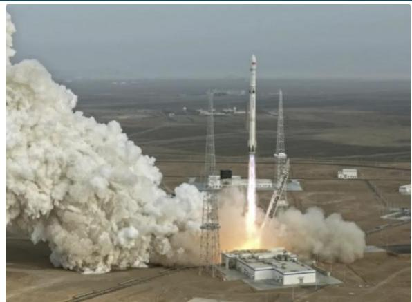

natural_image

Rocket launch in progress with massive smoke plume and launch infrastructure visible (no text or symbols)

来源：腾讯科技，国金证券研究所

“可重复使用”是降低运载器成本的主要途径之一，亦是克服商业航天发展瓶颈的重要一环：随着航天活动规模越来越大，发射越来越频繁，运载火箭的成本成为制约航天发展的一项非常重要的因素。“可重复使用”是降低运载器成本的主要途径之一。据TrendForce介绍，目前一次性火箭平均发射成本（报价）落在1.1亿-1.8亿美元之间，部分回收火箭发射成本（报价）为 6700 万美元左右，随着全球主要大厂积极发展可回收技术，目标在达成全面回收的情况下，有望将发射成本（报价）降低至200-500万美元。

图表3：各式火箭技术、优缺点比较

<table><tr><td>产品举例</td><td>Atlas V</td><td>猎鹰-9 (Falcon 9)</td><td>Starship</td></tr><tr><td>技术特点</td><td>本体结构复杂度相较回收火箭低,无须预留回收燃料,能运载较多通信有效载荷</td><td>仅回收第一级火箭,以垂直降落方式回收本体</td><td>第一级火箭、第二级火箭全部回收第一级火箭回收采用垂直降落或臂塔捕捉技术</td></tr><tr><td>平均发射报价</td><td>1.1-1.8亿美元</td><td>约6700万美元</td><td>约200-500万美元</td></tr><tr><td>优点</td><td>无须建置专用回收台</td><td>发射成本稍低,为现阶段火箭大厂主流技术</td><td>发射成本较部分回收火箭大幅下降</td></tr><tr><td>缺点</td><td>成本显著高于回收火箭</td><td>能运载较少通信有效载荷</td><td>须额外建置专用回收台</td></tr><tr><td>主要发射大厂举例</td><td>ULA、中国航天、Arianespace</td><td>SpaceX</td><td>SpaceX</td></tr></table>

来源：TrendForce，国金证券研究所

回收复用，即通过对发射出去的火箭主要部分进行回收，继续用于下一次发射活动，以此来实现降低发射成本、提升快速响应时间的目的。目前 SpaceX 公司的猎鹰-9（Falcon-9）火箭、RocketLab的“电子”（Electron）火箭、“中子”（Neutron）火箭等均选择回收复用技术路线。按照火箭回收部分的不同，可以分为一子级/助推器回收、整流罩回收、组合体回收等。其中，一子级/助推器回收、整流罩回收，是指对运载火箭的某一部分进行回收再利用，SpaceX 公司的猎鹰-9 系列火箭已成功实现了百余次芯一级回收、多次助推器和整流罩回收，领跑全球技术发展方向；组合体回收，是指将火箭的某些部分组合进行一体设计、一体回收再利用，RocketLab公司的“中子”火箭即该类技术的典型代表。

图表4：国外运载火箭发射技术创新发展路线  
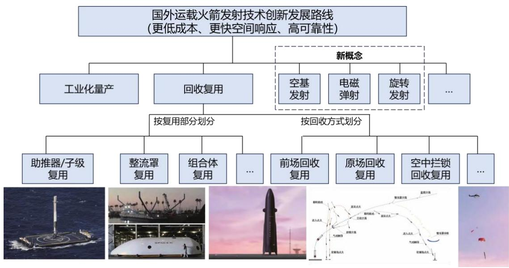

flowchart

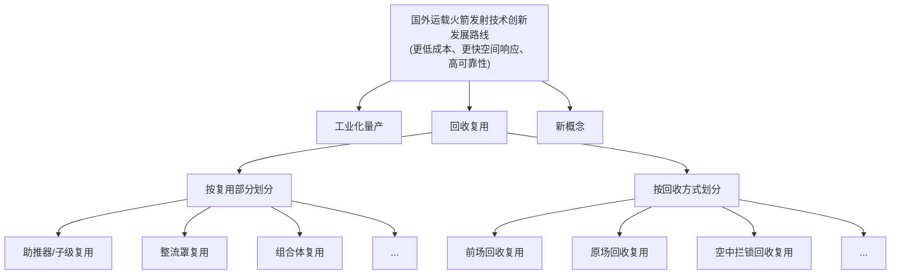

来源：王铁兵《国外运载火箭发射技术创新发展路线分析》，国金证券研究所

# 1.2 美国猎鹰 9号尝试多年才实现常态化可复用，复用火箭降本成效明显

猎鹰 9 号是一款可重复使用的两级火箭，由 SpaceX 设计和制造，旨在确保可靠且安全将人员和有效载荷运入地球轨道及更远，猎鹰 9 号是世界上第一个轨道级别可重复使用火箭，可重复使用使 SpaceX 能够回收火箭最昂贵的部件，而这些部件反过来也降低了火箭发射成本。

猎鹰 9 号火箭从首飞到实现常态化可复用用了多年时间，经历了漫长的技术演进过程：2010 年 6 月 4 日猎鹰 9 号完成首次发射，最早的猎鹰 9 号 v1.0 和 v1.1 版本在 2013-2015年期间多次尝试海上和陆地回收，但全部失败，直到 2015 年 12 月 21 日，全推力版猎鹰9 号才首次成功实现一级火箭陆地回收；从首次回收成功到 2018 年实现常态化复用，SpaceX 又用了约 3 年的时间，这一历程说明，可回收技术的成熟需要大量飞行数据积累和持续改进。截至 2025年 12 月 23 日，猎鹰9 号已完成 580 次发射任务，着陆534 次，其中复飞 501次。

图表5：猎鹰9号  
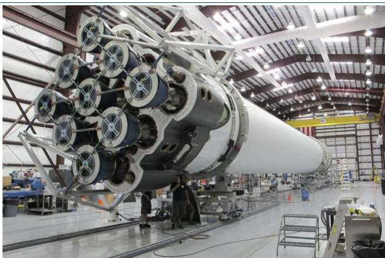

natural_image

Interior of a large industrial facility featuring a massive cylindrical rocket assembly mounted on a platform, with no visible text or symbols.

来源：SPACE，国金证券研究所

图表6：猎鹰9号火箭自首飞到实现复用耗时5年半  
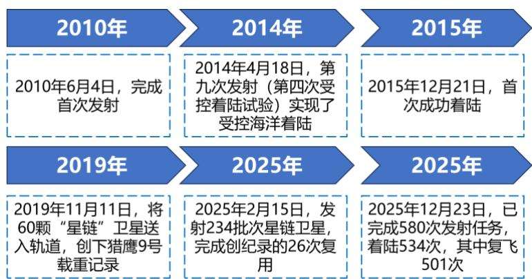

flowchart

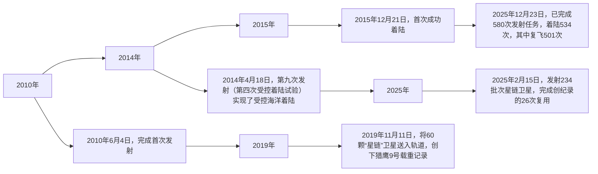

来源：SPACEX，SPACE，中新网，快科技，国金证券研究所

“猎鹰”火箭助推器回收程序共有 3 个步骤：1）一级火箭和二级火箭分离后，火箭会自动调姿并向后翻转，9台发动机中 1台开始工作，执行“回推”动作，此时火箭一级顶部的栅格翼展开调整姿态。2）在进入大气之后，3 台发动机执行“再入”点火，为火箭再入阶段减速。3）最后，在接近地面时，1台发动机执行着陆点火，实现火箭着陆前的反推，通过着陆腿实现“猎鹰”火箭的软着陆。4）火箭一子级垂直回收在其与二级分离后实施，先后经过调姿段、动力回飞段、滑行段、动力再入段和着陆下降段等五个阶段，在高精度控制下最终以预定的速度和姿态返回预定的回收地点。

图表7：“猎鹰”9号一级火箭着陆  
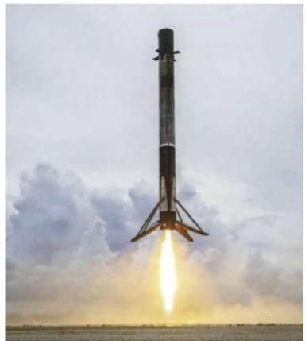

natural_image

Rocket launch in progress with visible flame and smoke against cloudy sky (no text or symbols)

来源：刘哲等《运载火箭可重复使用总体技术研究》，国金证券研究所

图表8：猎鹰9号垂直回收过程示意图  
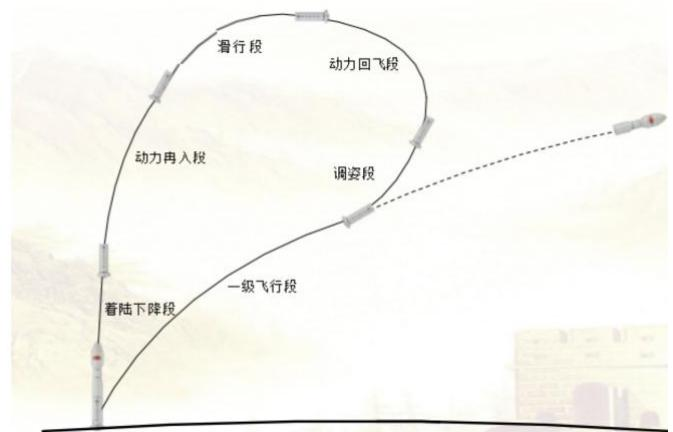

flowchart

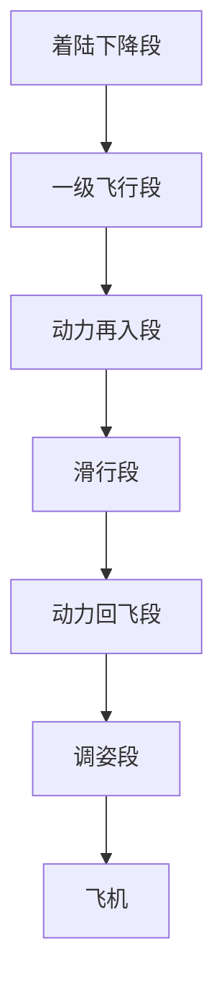

来源：中国科学院力学研究所，国金证券研究所

“猎鹰”9 火箭是迄今为止研发投入、成本分配、价格构成和价格策略、价格变化等信息最为丰富的运载火箭。经过不到 10 年的时间，SPACEX 实现了“猎鹰”9 火箭从首飞到一级回收、一级复用、整流罩回收和整流罩复用。根据马斯克公开的成本数据：猎鹰9号运载火箭的复用成本为 1500 万美元，其中制造不可复用的二子级成本 1000 万美元，整流罩、推进剂、氦气、维修一子级等成本约 500万美元，维修一子级成本仅约合 25万美元。据刘洁等《“猎鹰”9 火箭的发射成本与价格策略分析》一文测算，SpaceX 全新“猎鹰”9火箭发射成本约为5000万美元，复用型“猎鹰”9火箭发射的边际成本为1500万美元。

图表9：SpaceX公布的“猎鹰”9火箭成本构成信息

<table><tr><td>时间</td><td>信息公布人</td><td>信息内容</td></tr><tr><td>2015年</td><td>马斯克</td><td>复用型“猎鹰”9火箭的制造成本为1600万美元,其中推进剂成本为20万美元</td></tr><tr><td>2018年</td><td>马斯克</td><td>火箭一级成本占比60%,上面级20%,整流罩10%,其余10%为推进剂、复用等发射相关成本,其中推进剂成本为30万美元,也可以算作40万美元,整流罩成本约600万美元。未来如果可以实现二级复用,可复用型“猎鹰”9火箭的边际发射成本将有望降低到500万-600万美元</td></tr><tr><td>2020年</td><td>库鲁斯</td><td>“猎鹰”9发射服务费用为2800万美元</td></tr><tr><td>2020年</td><td>马斯克</td><td>回收“猎鹰”9火箭一级和整流罩带来的载荷容量损失不超过40%,回收和修整费用不超过10%,2次回收一级的火箭发射任务载荷容量与1次不回收一级的发射基本持平,3次发射则优于一次性发射</td></tr><tr><td>2020年</td><td>马斯克</td><td>发射一枚复用型“猎鹰”9火箭边际成本约为1500万美元,其中1000万美元用于制造不能回收的新上面级,500万美元用于采购氦气、燃料、氧气、回收火箭一级和整流罩等发射相关费用,其中修整回收型火箭一级的成本为25万美元。火箭一级成本为3000万美元,新整流罩的成本为500万美元</td></tr></table>

来源：刘洁等《“猎鹰”9 火箭的发射成本与价格策略分析》，国金证券研究所

运载火箭发射成本表征发射 1kg 载荷到指定轨道的成本，猎鹰-9 发射成本占据优势：据美国国家航空航天局艾姆斯研究中心的运载火箭发射成本统计数据，猎鹰-9 运载火箭近地轨道发射成本约 1.8 万元/kg，同样承担国际商业发射任务的主力运载火箭阿里安-5G近地轨道发射成本约 8.5 万元/kg，“联盟”近地轨道发射成本约 4.9 万元/kg，质子 SL-13近地轨道发射成本约 2.6万元/kg，猎鹰-9 运载火箭发射成本占据明显优势，作为猎鹰-9 系列运载火箭，“猎鹰重型”运载火箭近地轨道发射成本约 0.9 万元/kg，是世界现役运载火箭中唯一一型近地轨道发射成本低于 1.0 万元/kg 的运载火箭；而按照复用 10 次以上情况计算猎鹰-9 的发射成本将降至 0.5万元/kg，该成本远低于世界上现役运载火箭的发射成本，也是支撑其“星链”卫星大规模高频次组网的必由手段。

来源：“太空与网络”微信公众号，国金证券研究所  
图表10：可回收运载火箭运力与成本数据

<table><tr><td>型号</td><td>公司</td><td>运力</td><td>单位发射价格</td></tr><tr><td>猎鹰-9</td><td>SPACEX</td><td>LEO: 17.5吨</td><td>1000美元/千克以下</td></tr><tr><td>中子号</td><td>火箭实验室</td><td>LEO: 13吨</td><td>3800美元/千克</td></tr><tr><td>新格伦</td><td>蓝色起源</td><td>LEO: 45吨</td><td>1500美元/千克</td></tr><tr><td>人族R</td><td>相对论航天</td><td>LEO: 33.5吨</td><td>1640美元/千克</td></tr><tr><td>朱雀三号</td><td>蓝箭航天</td><td>航区回收: 18.3吨返场回收: 12.5吨</td><td>3万元/千克(约合4200美元/千克)</td></tr><tr><td>力箭二号</td><td>中科宇航</td><td>LEO: 22吨500km SSO: 15吨</td><td rowspan="2">一次性火箭3万元/千克(约合4200美元/千克)重复使用火箭1.5万元/千克(约合2100美元/千克)</td></tr><tr><td>力箭二号重型</td><td>中科宇航</td><td>LEO: 22吨500km SSO: 15吨</td></tr><tr><td>智神星一号</td><td>星河动力</td><td>LEO: 8吨17.5吨(两级半构型)</td><td>1-2万元/千克(约合1400-2800美元/千克)</td></tr><tr><td>天龙三号</td><td>天兵科技</td><td>LEO: 17吨500km SSO: 14吨</td><td>3万元/千克(约合4200美元/千克)</td></tr><tr><td>星舰</td><td>SPACEX</td><td>超100吨</td><td>初期200美元/千克,后期成熟后20美元/千克</td></tr><tr><td>二级完全复用火箭/轨道转移飞行器</td><td>STOKE空间</td><td>LEO: 3吨</td><td>200美元/千克</td></tr></table>

商业航天发射次数和占比显著提升：2024年全球共执行263次发射任务，较 2023年增长18%，商业航天发射次数和占比显著增加，非商业发射次数和占比均减少。中美两国发射次数最多，占全球发射总数的 86%，其中 SpaceX 发射 138 次，中国航天科技集团发射 51次；2024年全球商业航天发射任务由美国、中国和日本研制的火箭执行，其中，美国发射132次（占比 75.4%）、中国发射41 次（占比23.4%）、日本进行了 2 次发射（占比1.2%）。

猎鹰-9号实现常态化可复用后，SpaceX商业航天发射次数显著增加：2019-2024年，SpaceX年度发射活动次数由13次增至138次。猎鹰-9火箭Block5版一子级复用率亦逐年提升：2018-2024 年，猎鹰-9 Block 5 一子级平均复用次数自 1.67 次提升至 7.33 次。

图表11：2024年全球商业航天发射数量分布  
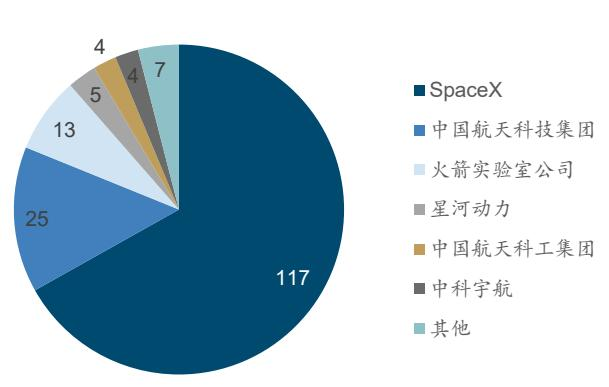

pie

| 类别 | 数值 |
|---|---|
| SpaceX | 117 |
| 中国航天科技集团 | 25 |
| 火箭实验室公司 | 13 |
| 星河动力 | 5 |
| 中国航天科工集团 | 4 |
| 中科宇航 | 4 |
| 其他 | 7 |

来源：刘洁等《2024 年全球航天发射活动总结》，国金证券研究所

图表12：猎鹰9号Block5一子级平均复用次数逐年提升  
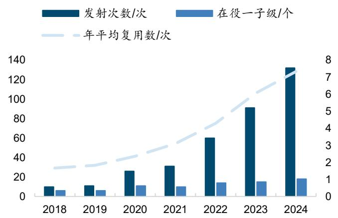

bar_line

| Year | 发射次数/次 | 在役一子级/个 |
|------|-------------|--------------|
| 2018 | 10          | 5            |
| 2019 | 12          | 6            |
| 2020 | 25          | 10           |
| 2021 | 30          | 10           |
| 2022 | 60          | 15           |
| 2023 | 90          | 15           |
| 2024 | 130         | 18           |

来源：徐侃等《猎鹰-9火箭高密度商业发射经验分析》，国金证券研究所

# 2 卫星互联网建设牵引商业火箭旺盛需求，我国商业火箭公司百舸争流

# 2.1 卫星互联网建设如火如荼，商业火箭需求旺盛

星链（Starlink）是美国太空探索公司（SpaceX）于 2015 年推出的近地轨道卫星群互联网系统。截至目前，该系统已发射近 9000 颗低轨卫星，构建了目前全球规模最大的低轨宽带卫星互联网星座，为超过 130 个国家和地区、逾 540 万用户提供卫星互联网接入服务。星链总体规划约 4.2颗卫星，主要部署在 300-600 公里高度的近地轨道，自 2019年第一组卫星升空至今，累计发射 4 种版本卫星共8949颗。其中，一代星座规划1.2万颗，可为全球提供宽带中继网络连接服务，已发射 V0.9、V1.0、V1.5 卫星超 4700 颗，预计2027年前完成部署；二代星座规划超 3万颗，自V2.0Mini卫星发射开始组建，已发射超4200颗，为全球用户提供包含手机直连卫星等更加多元的网络连接选择。

图表13：星链发射卫星数量及里程碑事件  
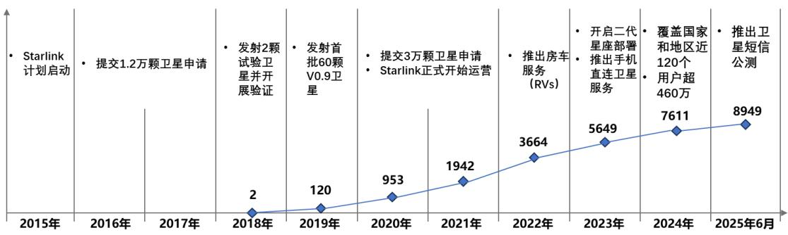

line

| 年份 | 数量 |
| :--- | :--- |
| 2015年 |  |
| 2016年 | 提交1.2万颗卫星申请 |
| 2017年 | 发射2颗试验卫星并开展验证 |
| 2018年 | 2 |
| 2019年 | 120 |
| 2020年 | 953 |
| 2021年 | 1942 |
| 2022年 | 3664 |
| 2023年 | 5649 |
| 2024年 | 7611 |
| 2025年6月 | 8949 |

| 指标 | 数量 |
| :--- | :--- |
| Starlink计划启动 | |
| 提交1.2万颗卫星申请 | |
| 发射首批60颗V0.9卫星 | |
| 提交3万颗卫星申请 | |
| Starlink正式开始运营 | |
| 推出房车服务(RVs) | |
| 开启二代星座部署推出手机直连卫星服务 | |
| 覆盖国家和地区近120个用户超460万 | |
| 推出卫星短信公测 | |

来源：申碧霄等《星链发展历程研究及电信运营商布局建议》,国金证券研究所

我国已有多个卫星互联网星座在建，其中以 GW 星座、G60 星座和鸿鹄-3 星座为主力，分别计划发射 12992 颗、15000 颗和 10000 颗卫星；加上鸿雁工程、虹云工程、行云工程、九天微星星座、翔云、吉林一号、天启、吉利星座等相关发射计划，合计共 44816颗卫星。据新华社信息，“星链”等低轨卫星的设计寿命一般为 5 年，我们据此测算，以上星座达到稳态后，每年需要置换约 8963颗卫星，以“猎鹰-9”一箭 60 星的运力测算，则稳态下由卫星互联网建设、运维而新增的商业火箭发射需求可达到 150 次。

图表14：我国部分卫星互联网建设计划

<table><tr><td>星座名称</td><td>运营主体/牵头方</td><td>规划总卫星数量</td><td>目标与进度概况</td></tr><tr><td>GW星座</td><td>中国卫星网络集团有限公司</td><td>12992</td><td>我国首个巨型卫星互联网技术,包含两个子星座,已于2024年底启动规模化组网发射</td></tr><tr><td>G60星座</td><td>上海垣信卫星技术有限公司</td><td>15000</td><td>计划于2027年完成一期建设,截至2025年10月已有6批组网卫星成功发射</td></tr><tr><td>鸿鹄-3星座</td><td>蓝箭航天旗下鸿擎科技</td><td>10000</td><td>已向国际电信联盟提交星座计划</td></tr><tr><td>鸿雁星座</td><td>航天科技集团</td><td>300</td><td>2023年已进入骨干星座系统建设阶段</td></tr><tr><td>虹云工程</td><td>航天科工集团</td><td>156</td><td>-</td></tr><tr><td>行云工程</td><td>航天科工集团</td><td>80</td><td>-</td></tr><tr><td>九天微星星座</td><td>九天微星</td><td>72</td><td>2025年1月公开了一项关于“大规模星座自主轨道控制”的专利</td></tr><tr><td>翔云</td><td>欧科微</td><td>28</td><td>-</td></tr><tr><td>吉林一号</td><td>长光卫星</td><td>138</td><td>2025年10月成功发射新卫星,在轨卫星数量增至141颗,成为全球最大的亚米级商业遥感卫星星座</td></tr><tr><td>天启</td><td>国电高科</td><td>38</td><td>2025年5月成功发射了4颗新卫星(16、17、18、20星)</td></tr><tr><td>吉利星座</td><td>时空道宇</td><td>6012</td><td>2025年9月第6次成功发射,已完成64颗卫星的一期组网,实现除南北极外全球实时通信覆盖</td></tr></table>

来源：物联网智库，中国电子报，中国通信协会，新华网，澎湃新闻，吉林大学，金融界，上海市嘉定区人民政府，中工网，北京日报，山东宣传网，“投资界”微信公众号，新华网，人民网，人民日报，经济观察报，大众日报，“上海国资”微信公众号，国金证券研究所

我国卫星互联网建设提速：据甲子光年智库介绍，1）“国网星座”建设提速：GW（国网）卫星星座规划由中国星网集团建设，目标是部署约 12992颗卫星，形成一个覆盖全球的低轨卫星互联网星座，包括 GW-A59（约 6080 颗，500km 以下极低轨道）和 GW-A2（约 6912颗，1145km 近地轨道）两个子星座，旨在提供全球可用的卫星通信服务。2）GW 星座正处于快速建设和组网阶段，2025H2 发射提速：2025 年 7 月 27 日-8 月 26 日，GW 星座在 30日内实现 6连发，将05 组-10 组卫星发射升空，截至 2025年8月，GW星座在轨运营卫星数量已超 80颗；12月26日第 17 组卫星发射升空。

图表15：GW（国网）星座建设整体规划  
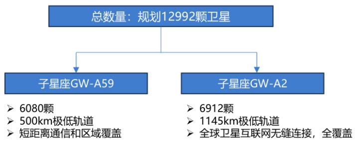

flowchart

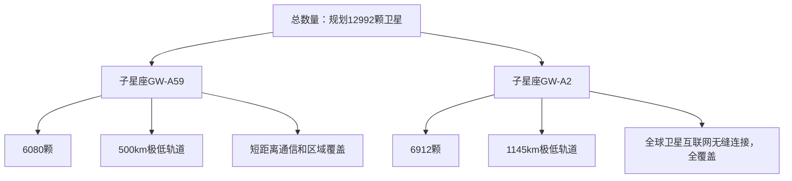

来源：甲子光年智库，国金证券研究所

图表16：GW（国网）星座商用卫星组网进度

<table><tr><td>发射批次</td><td>发射时间</td><td>发射地点</td><td>发射方式</td></tr><tr><td>01组</td><td>2024年12月16日</td><td>文昌航天发射场</td><td>长征五号乙运载火箭</td></tr><tr><td>02组</td><td>2025年2月11日</td><td>文昌航天发射场</td><td>长征八号改运载火箭</td></tr><tr><td>03组</td><td>2025年4月29日</td><td>文昌航天发射场</td><td>长征五号乙运载火箭</td></tr><tr><td>4组</td><td>2025年6月6日</td><td>太原航天发射场</td><td>长征六号甲运载火箭</td></tr><tr><td>5组</td><td>2025年7月27日</td><td>太原航天发射场</td><td>长征六号甲运载火箭</td></tr><tr><td>6组</td><td>2025年7月30日</td><td>海南商业航天发射场</td><td>长征八号改甲运载火箭</td></tr><tr><td>7组</td><td>2025年8月4日</td><td>海南商业航天发射场</td><td>长征十二号运载火箭</td></tr><tr><td>8组</td><td>2025年8月13日</td><td>文昌航天发射场</td><td>长征五号乙运载火箭</td></tr><tr><td>9组</td><td>2025年8月17日</td><td>太原卫星发射中心</td><td>长征六号甲运载火箭</td></tr><tr><td>10组</td><td>2025年8月26日</td><td>海南商业航天发射场</td><td>长征八号甲运载火箭</td></tr><tr><td>11组</td><td>2025年9月27日</td><td>太原卫星发射中心</td><td>长征六号甲运载火箭</td></tr><tr><td>12组</td><td>2025年10月16日</td><td>海南商业航天发射场</td><td>长征八号甲运载火箭</td></tr><tr><td>13组</td><td>2025年11月10日</td><td>海南商业航天发射场</td><td>长征十二号运载火箭</td></tr><tr><td>14组</td><td>2025年12月6日</td><td>海南商业航天发射场</td><td>长征八号甲运载火箭</td></tr><tr><td>15组</td><td>2025年12月9日</td><td>太原卫星发射中心</td><td>长征十二号运载火箭</td></tr><tr><td>16组</td><td>2025年12月12日</td><td>海南商业航天发射场</td><td>长征十二号运载火箭</td></tr><tr><td>17组</td><td>2025年12月26日</td><td>海南商业航天发射场</td><td>长征八号甲运载火箭</td></tr></table>

来源：甲子光年智库，C114通信网，国金证券研究所

# 2.2 我国商业航天发展迅猛，商业火箭百舸争流

我国商业航天历经多年发展，如今已迈入规模化、商业化发展新阶段。2025年以来，我国商业火箭发射频次持续加密，千帆星座、GW 星座等大型星座加速组网，海南商业航天发射场进入常态化运行，全产业链呈现多点突破的格局。我国商业航天发展迅猛，仅用 10 年左右的时间便完成从“跟跑”到“并跑”的跨越式发展，为全球商业航天竞争格局注入强劲动能。我国商业航天发展呈现以下特点：1）市场规模持续扩大：从 2015 年的 3764.2亿元增值 2024 年超过 2.3 万亿元，2025 年或将进一步突破 2.5 万亿元。2）产业生态加快形成：已形成长三角、珠三角、京津冀三大商业航天产业集群。3）应用领域不断拓展：呈现多元化、规模化特征。

图表17：中国商业航天行业发展阶段及关键事件  
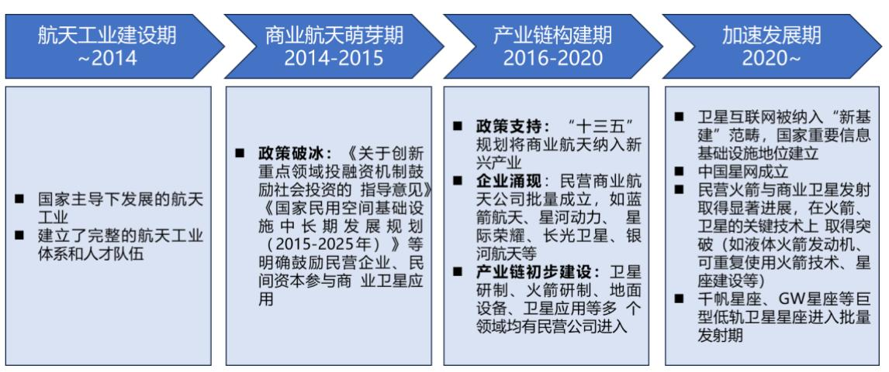

flowchart

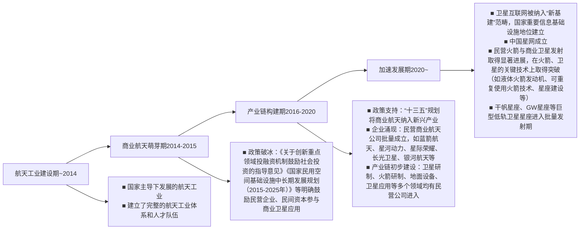

来源：甲子光年智库，国金证券研究所

2025年亦是政策顶层设计集中落地之年：党的四中全会将“航天强国”纳入现代化产业体系建设，“十五五”规划明确航天产业集群发展方向，国家航天局发布《推进商业航天高质量安全发展行动计划（2025-2027 年）》，同年 11 月商业航天司正式设立，标志着商业航天专职管理机制落地。系列顶层设计筑牢产业发展政策保障，推动产业完成从“培育期”向“战略支柱产业”的关键转型，迈入高质量安全发展与服务航天强国建设并行的新阶段。

上交所发布商业火箭企业适用科创板第五套上市标准审核指引：商业火箭研制及发射业务作为商业航天中游核心环节，承担“承上启下”的关键枢纽职能，受到产品技术复杂度高、资金投入大、研发周期长等多种因素影响，我国商业火箭企业正处于大规模商业化进程的关键时期，亟需发挥资本市场的支持作用。《指引》遵循科创板第五套上市标准相关要求，结合商业火箭领域科技创新实际情况，对明显技术优势、阶段性成果、取得国家有关部门批准及市场空间大等四方面做出具体规定，其中，将使用科创板第五套上市标准的阶段性成果明确为：“在申报时至少实现可重复使用技术的中大型运载火箭载荷首次成功入轨”。

我国开展商业火箭业务的公司主要包括航天科技集团、航天科工集团、蓝箭航天、天兵科技、深蓝航天、星际荣耀、星河动力、中科宇航等。其中，1）蓝箭航天：致力于构建以中大型液氧甲烷运载火箭为中心的“研发、制造、试验、发射”全产业链条，打造航天领域的科技综合体，为全球市场提供高性价比、高可靠性的航天运输服务；核心产品朱雀 3号已实现首飞，LEO航区返回运力 18.3吨。2）天兵科技：我国商业航天领域领先开展新一代液体火箭发动机及中大型液体运载火箭研制的高新技术企业，核心产品天龙3号采用液氧煤油推进机，LEO运力 17-22 吨。3）据《科创板日报》消息，蓝箭航天、星际荣耀、中科宇航、星河动力、天兵科技等商业火箭公司已开启 IPO进程。

图表18：国内商业火箭公司在可回收火箭方面的进展

<table><tr><td>公司/机构</td><td>主要项目</td><td>推进剂</td><td>起飞推力</td><td>发动机</td><td>运载能力</td><td>可重复使用次数</td><td>关键技术与成果</td><td>发展规划</td></tr><tr><td>航天科技集团</td><td>长征十二号甲</td><td>液氧甲烷</td><td>—</td><td>龙云</td><td>LEO运力 $\geqslant$ 10t;700km太阳同步轨道运力 $\geqslant$ 6t</td><td>—</td><td>2024年完成10公里级垂直起降回收试飞</td><td>2025年已完成首飞</td></tr><tr><td>航天科工集团</td><td>快舟六号</td><td>液氧甲烷</td><td>—</td><td>鸣凤</td><td>—</td><td>—</td><td>2024年完成悬停控制实验</td><td>计划2026年首飞</td></tr><tr><td>天兵科技</td><td>天龙三号</td><td>液氧煤油</td><td>840t</td><td>TH-12</td><td>LEO运力17-22tSSO运力10-17t</td><td> $\geqslant$ 20次</td><td>2025年完成归零后的九机联合静力试验</td><td>计划2025年首飞</td></tr><tr><td>深蓝航天</td><td>星云一号</td><td>液氧煤油</td><td>180t</td><td>雷霆R</td><td>LEO运力:2t</td><td>—</td><td>2022年完成公里级VTVL回收;2025年完成一级动力系统试车</td><td>计划2025年首飞</td></tr><tr><td>蓝箭航天</td><td>朱雀三号</td><td>液氧甲烷</td><td>900t</td><td>TQ-12A</td><td>LEO(450km)一次性回收任务:21.3t;航区回收任务:18.3t;返场回收任务:12.5t</td><td> $\geqslant$ 20次</td><td>2024年完成10公里级VTVL回收;2025年首飞成功、回收失败</td><td>2025年已完成首飞</td></tr><tr><td>星际荣耀</td><td>双曲线二号/三号</td><td>液氧甲烷</td><td>—</td><td>JD-1/JD-2</td><td>双曲线三号:200kmLEO航道回收运力8.5t一次性使用运力14t</td><td> $\geqslant$ 30次</td><td>2023年底双曲线二号完成国内首次复用飞行;2025年双曲线三号完成低温静力试验</td><td>计划2025年首飞</td></tr><tr><td>星河动力</td><td>智神星一号</td><td>液氧煤油</td><td>—</td><td>苍穹发动机</td><td>200kmLEO运力8t/17.5t(两级半构型)</td><td> $\geqslant$ 50次</td><td>2025年完成发动机多次长程热试车</td><td>计划2025年首飞</td></tr><tr><td>中科宇航</td><td>力箭二号</td><td>—</td><td>766t</td><td>—</td><td>8t(500km/SSO);12t(LEO)</td><td> $\geqslant$ 20次</td><td>2025年完成海上回收验证;2025年力箭二号完成一级、二级动力系统试车</td><td>计划2025年首飞</td></tr></table>

来源：甲子光年智库，航天科技集团官网，湖北日报，卫星百科，蓝箭航天，天兵科技，深蓝航天，星际荣耀，星河动力，中科宇航，航空产业网，腾讯科技，新华网，国金证券研究所

# 3 商业火箭产业链梳理：关注发动机、箭体结构、控制系统三大环节

# 3.1 火箭发射产业链梳理

火箭发射服务的整个链条涉及单位和环节众多，是一个复杂的系统工程。发射服务产业链包括上游火箭零部件制造商提供动力系统、控制系统、火箭箭体等部件给中游的火箭公司（大部分火箭公司会自研动力系统等核心系统），火箭公司为卫星制造商提供发射服务，最终实现在轨交付给卫星运营商。此外，运载火箭上还有一些不直接影响飞行成败并由箭上设备与地面设备共同组成的系统，例如遥测系统、外弹道测量系统、安全系统和瞄准系统等；发射环节还涉及到使用发射场资源、火箭及卫星需要购买发射保险等。

上游：基础材料和元器件等，包括运载火箭结构、发动机所用的金属材料、复合材料等，以及电子设备所需的元器件等。  
◼ 中游：1）火箭制造及发射服务商主要是为下游卫星制造商和卫星运营商提供完整的卫星发射服务，负责运载火箭的整体设计、发动机设计、总体安装、试验及发射工作。2）发射保险公司主要是为商业发射提供保险服务，保险公司可以与卫星制造商直接签订保险协议，也可以通过火箭制造商签订，但无论哪种方式，保险成本最终作为市场价格的一部分。3）发射场服务商主要是为火箭发射提供发射工位和地面测控服务。  
下游：1）卫星制造商主要承担卫星生产制造任务。2）卫星运营商主要承担卫星的运营任务，近年来，卫星应用场景多样化，分为卫星大数据、卫星通信、遥感探测、导航定位、消费级应用、小行星采矿等。

图表19：火箭发射服务产业链示意图  
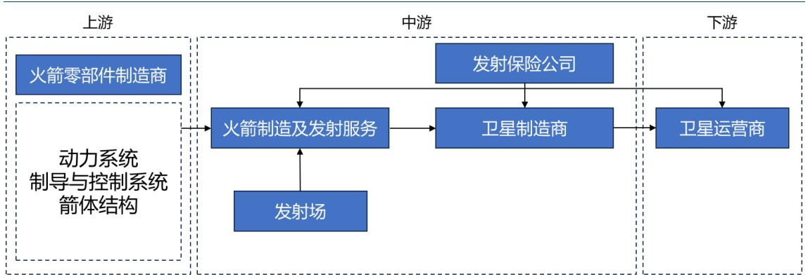

flowchart

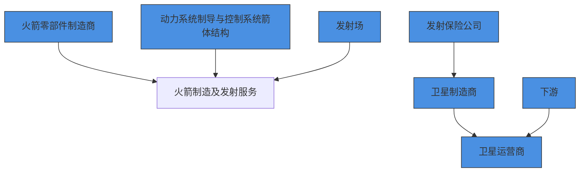

来源：中商产业研究院，国金证券研究所

据朱雄峰《猎鹰9运载火箭发射成本研究》一文介绍，运载火箭的硬件成本主要包括发动机、箭体结构、电气设备、阀门机构、火工品、推进剂等。其中一型火箭无论是一级还是二级，其发动机和箭体结构占总硬件成本比例最大，其中占一级比例约 77.8%，占二级比例约58.1%，相反推进剂占总硬件比例较小，其中占一级比例约0.7%，占二级比例约0.2%。运载火箭垂直着陆回收能收回包括发动机、箭体结构、电气设备、阀门机构等绝大部分硬件，因此，无论是一级回收还是二级回收，均能产生十分可观的经济效益。

猎鹰-9 火箭通过一子级回收，实现了一子级大部分硬件的重复使用，这为其超低成本实施发射奠定了坚实的基础，此外，火箭重复使用降低了硬件成本，不仅体现在直接降低了运载火箭的硬件成本，还体现在大幅降低了配套产保条件的成本。以猎鹰-9 一子级重复使用 15 次为例，为满足该任务，仅需生产 9 台灰背隼-1D 发动机；相反，在一子级一次使用情况下，为满足该任务，需生产 135台灰背隼-1D 发动机。生产发动机是整个火箭研制过程耗时最长、经费开支最大的一项工作，仅发动机数量这一项，带来的配套产保条件降低也是相当可观的，发动机产保条件可能不会分摊到每一次航天发射任务上，但至少会体现在型号研发的总投入，带来总投入的增加。

图表20：典型运载火箭一级硬件成本构成  
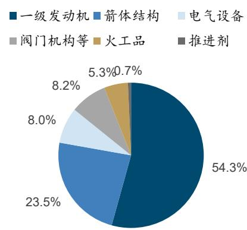

pie

| 类别 | 占比 (%) |
| :--- | :--- |
| 一级发动机 | 54.3 |
| 箭体结构 | 23.5 |
| 电气设备 | 8.0 |
| 阀门机构等 | 8.2 |
| 火工品 | 5.3 |
| 推进剂 | 0.7 |

图表21：典型运载火箭二级硬件成本构成  
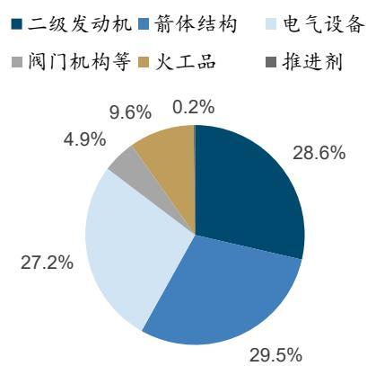

pie

| Category | Percentage (%) |
|---|---|
| 二级发动机 | 28.6 |
| 箭体结构 | 29.5 |
| 电气设备 | 27.2 |
| 阀门机构等 | 4.9 |
| 火工品 | 9.6 |
| 推进剂 | 0.2 |

来源：朱雄峰《猎鹰9 运载火箭发射成本研究》，国金证券研究所

来源：朱雄峰《猎鹰9 运载火箭发射成本研究》，国金证券研究所

# 3.2 发动机系统

液体火箭一级主动力发动机为运载火箭提供初始动力，具有推力量级大、研发费用高、研发周期长的特点，其功能、性能、成本对火箭的重复使用至关重要。美国的液体火箭主发动机发展经历了 4 个阶段：1）20 世纪 60 年代，以土星 5 号火箭主动力 F-1 发动机为代表的一次使用阶段；2）20世纪70 年代，以航天飞机主发动机（RS-25）为代表的重复使用阶段；3）20世纪90 年代至21 世纪初，以德尔塔4 火箭主动力 RS-68 氢氧发动机及宇宙神 5 火箭主动力 RD-180液氧煤油发动机为代表的低成本一次使用阶段；4）进入 21 世纪，以猎鹰 9号、重型猎鹰火箭主动力 Merlin-1D++发动机及“超重-星舰”组合体主动力Raptor 发动机（“猛禽”发动机）为代表的低成本重复使用阶段。

图表22：美国主发动机发展脉络及主要液体火箭主动力发动机参数  
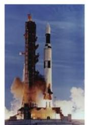

natural_image

Rocket launch with smoke and flames against a blue sky (no visible text or symbols)

土星5号

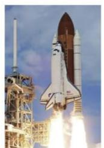

natural_image

Rocket launch with visible exhaust plume and launch tower (no text or symbols)

航天飞机

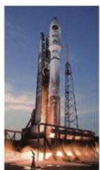  
宇宙神3/5

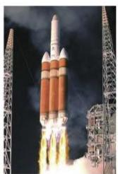

natural_image

Rocket launch with visible exhaust plume and launch tower in background (no text or symbols)

德尔塔4

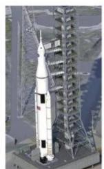

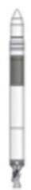  
猎鹰1

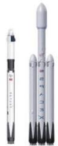  
猎鹰9/重型

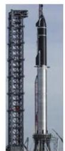  
超重-星舰  
21世纪

20世纪60年代  
20世纪70年代\~90年代  
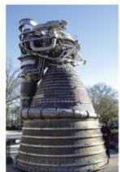  
一次使用

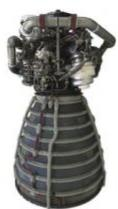  
RS-25   
重复使用

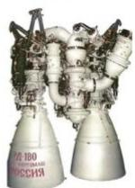  
RD-180

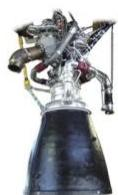  
RS-68

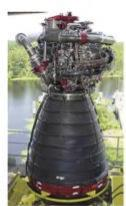  
RS-25D/E

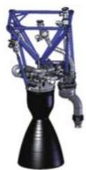  
Merlin-1A

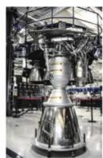  
Merlin-1D++

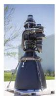  
Raptor

低成本一次使用  
低成本重复使用

<table><tr><td>发动机名称</td><td>推进剂</td><td>循环方式</td><td>推力/kN</td><td>比冲/(m/s)</td><td>室压/Mpa</td><td>服役年份</td><td>推力调节范围/%</td><td>应用火箭</td></tr><tr><td>F-1</td><td>液氧/煤油</td><td>燃气发生器</td><td>6771</td><td>2579</td><td>7</td><td>1967</td><td>-</td><td>土星5号</td></tr><tr><td>RS-25/D/E</td><td>液氢/液氧</td><td>富燃补燃</td><td>1860</td><td>3589</td><td>20.6</td><td>1981</td><td>65-109</td><td>航天飞机SLS</td></tr><tr><td>RS-68</td><td>液氢/液氧</td><td>燃气发生器</td><td>3123</td><td>3570</td><td>10.3</td><td>2002</td><td>58-102</td><td>德尔塔4</td></tr><tr><td>Merlin-1D</td><td>液氧/煤油</td><td>燃气发生器</td><td>845</td><td>2827</td><td>10.8</td><td>2014</td><td>38.5-100</td><td>猎鹰9号/重型猎鹰</td></tr><tr><td>Raptor 1/2/3</td><td>液氧/甲烷</td><td>全流量补燃</td><td>1813/2254/2744</td><td>3430/3401/3430</td><td>25/30/35</td><td>2020/2022/-</td><td>30-100</td><td>超重-星舰</td></tr></table>

来源：杨亚龙等《液体火箭主动力发动机发展思考》，国金证券研究所

国内商业航天公司相继提出了基于垂直起降技术的重复使用运载火箭，开展了重复使用液氧/煤油和液氧/甲烷发动机研制。其中蓝箭提出了朱雀三号运载火箭，一子级按重复使用20 次设计，4.5m 箭径安装 9 台 TQ-12B 液氧/甲烷发动机；星际荣耀提出了双曲线三号运载火箭，一子级按重复使用 20次设计，4.2m箭径安装9台JD-2液氧/甲烷发动机；天兵科技提出了天龙三号运载火箭，一子级按重复使用 10 次设计，3.8m 箭径安装 7 台 TH-12液氧/煤油发动机。此外，深蓝航天、东方空间等公司亦提出了各自的方案。

来源：李斌等《重复使用运载火箭液体动力技术发展》，国金证券研究所  
图表23：重复使用发动机主要参数

<table><tr><td>火箭</td><td>发动机</td><td>推进剂</td><td>循环方式</td><td>海平面推力/Kn</td><td>海平面比冲/s</td><td>推力室室压/Mpa</td><td>推力调节范围/%</td><td>启动次数</td></tr><tr><td>猎鹰9</td><td>Merlin 1D+</td><td>液氧煤油</td><td>燃气发生器</td><td>845</td><td>288.5</td><td>10.8</td><td>40-110</td><td>3</td></tr><tr><td>商业火箭</td><td>YF-102R</td><td>液氧煤油</td><td>燃气发生器</td><td>835</td><td>282.0</td><td>8.5</td><td>65-110</td><td>≥3</td></tr><tr><td>长征十号甲</td><td>YF-100N</td><td>液氧煤油</td><td>富氧补燃</td><td>1250</td><td>301.6</td><td>18.7</td><td>65-105</td><td>2</td></tr><tr><td>天龙三号</td><td>TH-12</td><td>液氧煤油</td><td>燃气发生器</td><td>1090</td><td>285.0</td><td>10.0</td><td>40-110</td><td>&gt;3</td></tr><tr><td>星云一号</td><td>雷霆-R1</td><td>液氧煤油</td><td>燃气发生器</td><td>441</td><td>274.8</td><td>-</td><td>30-110</td><td>3</td></tr><tr><td>智神星一号</td><td>CQ-80</td><td>液氧煤油</td><td>燃气发生器</td><td>735</td><td>269.0</td><td>-</td><td>40-110</td><td>-</td></tr><tr><td>引力二号</td><td>原力-85</td><td>液氧煤油</td><td>燃气发生器</td><td>690</td><td>278.4</td><td>10.0</td><td>50-110</td><td>-</td></tr><tr><td>超重-星舰</td><td>Raptor</td><td>液氧甲烷</td><td>全流量补燃</td><td>2450</td><td>333.7</td><td>30.0</td><td>20-100</td><td>≥10</td></tr><tr><td>新格伦</td><td>BE-4</td><td>液氧甲烷</td><td>富氧补燃</td><td>2450</td><td>310.0</td><td>13.4</td><td>45-100</td><td>-</td></tr><tr><td>商业火箭</td><td>YF-209</td><td>液氧甲烷</td><td>燃气发生器</td><td>735</td><td>293.0</td><td>-</td><td>30-100</td><td>3-4</td></tr><tr><td>朱雀三号</td><td>TQ-12B</td><td>液氧甲烷</td><td>燃气发生器</td><td>1000</td><td>-</td><td>-</td><td>55-105</td><td>-</td></tr><tr><td>双曲线三号</td><td>JD-2</td><td>液氧甲烷</td><td>燃气发生器</td><td>834</td><td>286.6</td><td>10.0</td><td>35-110</td><td>&gt;3</td></tr><tr><td>元行者一号</td><td>LY-70</td><td>液氧甲烷</td><td>燃气发生器</td><td>676</td><td>290.0</td><td>-</td><td>32-106</td><td>≥3</td></tr></table>

据李斌《液体火箭主发动机技术现状与发展建议》介绍，运载火箭对主发动机的要求包括大推力、高比冲、高推重比、高可靠、低成本等。这些要求高且相互矛盾的指标，决定了发动机以用尽材料极限性能的极端参数运行，在较小结构空间实现高水平能量剧烈释放与转化的工作特点。液体火箭主发动机呈现独特的技术特点：1）工作过程机理复杂，有效预示和控制难度大；2）载荷环境复杂恶劣，结构强度和疲劳问题突出；3）系统和结构复杂度高，制造和使用维护难度大。先进发动机的发展需要先进材料与制造技术的支撑。

火箭发动机系统产业链参与公司主要包括新材料（斯瑞新材、西部材料），零部件加工（铂力特、航宇科技、派克新材、中航重机），总装（航天动力）等。

# 新材料：

斯瑞新材：高强高导铜合金材料龙头，液体火箭发动机推力室内壁材料及零部件产品已进入量产阶段，完成了年产 150台（套）液体火箭发动机推力室内、外壁成品加工产能的打造。公司生产的发动机推力室内壁产品用于液体火箭发动机，是火箭发动机推力室的一个重要装置。  
西部材料：国内最早从事难熔金属材料深加工企业之一，公司航天用铌合金广泛用于火箭、卫星等航天装备，为“长征火箭”“天宫空间站”及探月、探火等重大航天工程的顺利实施提供了关键原材料；公司开发的WCu、TZM合金材料制品组件，作为核心关键耐高温部件应用于航天、深空探测项目。

# 零部件加工：

◼ 铂力特：金属 3D打印龙头，已助力蓝箭航天、东方空间、九州云箭、星际荣耀、星众空间、天回航天等多个商业航天客户完成发射、飞行任务，参与的多个商业航天项目已进入批量生产阶段；参与的商业航天典型应用场景包括可重复使用液氧甲烷火箭、固体运载火箭、液体运载火箭，立方星部署器、实验卫星、商业通信卫星等。深度参与星际荣耀JD-2液氧甲烷发动机的研制与批产，为发动机制造了涡轮泵类、管路类等零件。  
航宇科技：航空环锻件龙头，深度进入九州云箭、星河动力、蓝箭航天、天兵科技、东方空间、中科宇航等头部火箭厂商，覆盖谷神星、朱雀、力箭、天龙等主力型号。配套产品包括涡轮盘、泵、壳体、法兰等各类环锻件、模锻件，并正向精加工交付 +小系统级装配延伸，材料体系涵盖高温合金、钛合金、铝合金等。  
派克新材：国内少数几家可为航空发动机、航天运载火箭及卫星、燃气轮机、深海装备等高端装备提供配套特种合金精密环形锻件产品和精密模锻件产品的民营企业之一。在商业航天领域主要为运载火箭和卫星提供箭体结构件、发动机和卫星结构件。  
◼ 中航重机：航空锻造龙头，旗下重机宇航深耕商业火箭锻件市场多年，已为东方空间“引力一号”、星际荣耀卫星支架、星河动力“谷神星”、九州云箭发动机等多型商业火箭稳定供应关键锻件；安吉精铸则聚焦发动机高温结构件，五年来持续为蓝箭航天“天雀 12”发动机、东方空间“引力一号”等提供高性能铸件。目前，公司已形成覆盖主流商业火箭企业的锻铸配套能力，初步构建起面向商业航天的专用基础结构件供应体系。

# 发动机总装：

航天动力：航天科技集团六院唯一上市平台，以航天军工流体技术（包括液体、气体）和惯性导航技术为核心技术，以从事系列民用产品的设计、开发、生产和销售为主营业务的技术密集型公司。航天推进技术研究院（航天科技集团六院）先后为我国大型液体火箭配套液体火箭发动机 50余种，研制的大型液体火箭发动机在神舟系列飞船、国内外卫星近百次发射中，始终保持着 100%的成功率。

# 3.3 箭体结构

运载火箭的箭体结构是运载火箭的基体，它把运载火箭各系统组合在一起形成一个完整的整体。运载火箭的箭体结构应使箭体具有良好的气动外形，以有利于保证运载火箭的飞行性能，在保证箭体结构有足够的强度和刚度条件下，重量要轻；在满足使用要求和可靠的情况下，结构应简单；要有足够的空间用来安装仪器、设备，并满足它们正常工作所需的环境条件，如压力、温度和抗振要求；此外，箭体结构还要便于在地面操作过程中检查、测试、维修和更换箭上一起设备，满足在制造过程中有良好的工艺性和经济性。

图表24：运载火箭箭体组成结构  
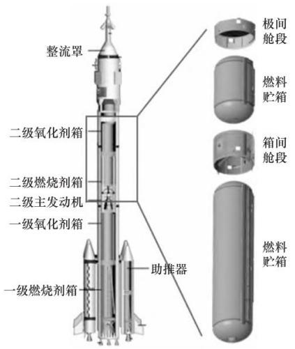

text_image

整流罩
二级氧化剂箱
二级燃烧剂箱
二级主发动机
一级氧化剂箱
一级燃烧剂箱
助推器
极间舱段
燃料贮箱
箱间舱段
燃料贮箱

来源：刘冬《运载火箭箭体制造关键装备与技术现状及发展》，国金证券研究所

图表25：运载火箭主体结构生产全工艺流程  
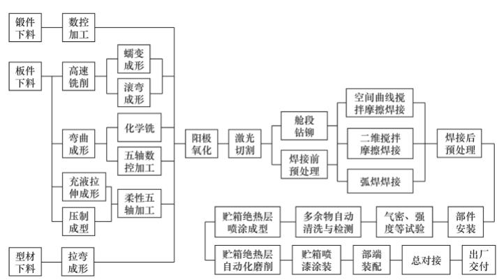

flowchart

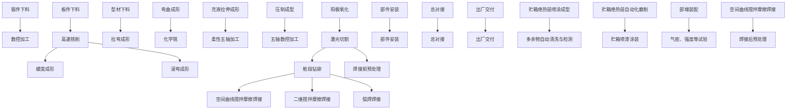

来源：刘冬《运载火箭箭体制造关键装备与技术现状及发展》，国金证券研究所

运载火箭的箭体结构是火箭的主体，主要包括整流罩、级间段、尾段等部段，而液体运载火箭还包括压力容器部件即推进剂贮箱等。以美国的宇宙神5火箭为例，箭体结构成本约占火箭总成本的 25%-30%。其中，典型贮箱结构包括箱底和筒段两部分，箱底包括椭球、球形、锥形等多种底型，一般由曲板拼焊而成，筒段一般为光壳和网格加筋结构，网格类型包括正置正交、斜置正交和等边三角形，主要采用铝合金材料；推进剂贮箱的成型工艺主要包括钣金成型工艺、拼焊工艺以及铣削工艺。整流罩、级间段、尾段等干部段结构大多采用铝合金铆接结构、整体铸造后机加结构或复合材料夹芯结构，主要涉及到的成型工艺包括铆接、铸造、钣金成型、热压罐固化等工艺。

图表26：液体火箭结构组成及介绍

<table><tr><td>相关部位</td><td>介绍</td></tr><tr><td>头部整流罩</td><td>具有一定刚度的可抛掷薄壁结构,是卫星或运载火箭末级的包封部件,在大气层内飞行时保护卫星或最后一级火箭,承受气动载荷和热流。整流罩一般具有良好的无线电波穿透性,同时结构重量小,有足够的刚度,在气动外形上具有较小的抖振载荷和迎面阻力。</td></tr><tr><td>推进剂贮箱</td><td>贮箱占火箭体积的大部分,除了贮存推进剂外,还是火箭的承力结构,主要承受轴向载荷、弯矩和内压力。贮箱一般是薄壁结构,壁厚小于或等于箱体曲率半径的二十分之一,箱壁结构形式取决于载荷类型。</td></tr><tr><td>仪器舱</td><td>用以安装飞行控制仪器、遥测仪器和热调节设备,承受轴向载荷和弯矩,安所处位置的不同,仪器舱有截锥和圆筒两种形式。</td></tr><tr><td>级间段</td><td>多级火箭级间的连接部件,其结构形式与分离方式有关。冷分离方式的级间段采用半硬壳结构;热分离方式的级间段可采用合金钢管焊接成形的杆系结构,便于上面级发动机燃气流顺畅排出;也可采用开有排气舱口的网络结构。</td></tr><tr><td>发动机推力结构</td><td>安装发动机并把推力传给贮箱的承力构件,是发动机零组件的安装支持部件,大型运载火箭发动机推力结构为杆系结构或半硬壳结构,后者有圆筒形和截锥形两种形式,它们能均匀地传递推力。</td></tr><tr><td>尾舱</td><td>位于火箭的尾部。是火箭竖立在发射台上的承力构件,又是发动机的保护罩。当火箭有尾翼时,它是尾翼的支持部件。尾舱一般是多开口半硬壳圆筒形(或截锥形)铆接结构。尾舱的结构材料一般选用普通硬铝和超硬铝,尾舱底部由于温度较高必须采用防热材料,如耐热不锈钢、石墨、复合材料等。</td></tr></table>

来源：中国知网，国金证券研究所

国内参与可复用火箭箭体结构加工制造的公司主要有超捷股份、广联航空、国机精工等。

超捷股份：汽车精密紧固件、异形连接件龙头，布局商业火箭箭体结构件制造业务，包括箭体大部段（壳段）、整流罩、燃料贮箱、发动机阀门等，客户涵盖国内多家头部民营火箭公司。  
广联航空：航空工装和零部件核心供应商，前瞻布局商业航天领域。拟收购的天津跃峰深耕航天装备制造领域多年，在核心部件全流程制造、特种工艺攻坚等方面积淀了深厚能力，与公司在航空精密制造、复合材料应用领域的技术优势形成互补。  
国机精工：特种轴承领军企业，为商业航天领域提供的轴承主要包括卫星动量轮用轴承组件、卫星电池帆板用轴承、火箭燃料涡轮泵轴承等产品。公司是我国长征系列火箭所用特种轴承重要供应商，在传统航天领域所用的轴承中，公司市占率在90%以上，在商业航天领域有相当部分火箭公司是公司的客户。

# 3.4 控制系统

运载火箭控制系统由箭上飞行控制系统和地面测试发控系统两部分组成，前者在火箭上，后者在发射场的发射塔、塔地下电源间和测试发射控制室中。

图表27：火箭控制系统由飞行控制系统和测试发控系统组成  
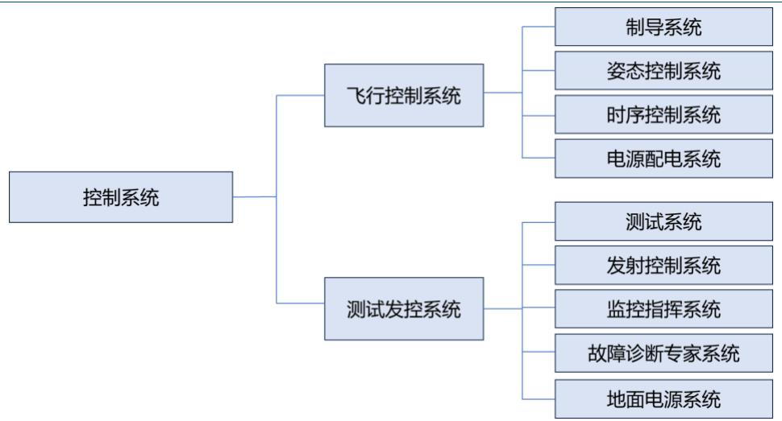

flowchart

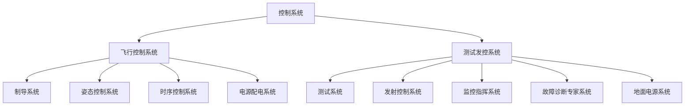

来源：冉隆燧《高可靠性火箭控制技术概论（上）》，国金证券研究所

箭上飞行控制系统由制导系统、姿态控制系统、时序控制系统和电源配电系统四部分组成。其中，1）制导系统的任务是，克服火箭沿预定轨道飞行中的各种干扰，适时发出关机指令和导引指令，保证火箭和飞船（卫星）的入轨精度。2）姿态控制系统的任务是，克服火箭飞行中的各种干扰，确保火箭按预定轨道稳定飞行，使起飞火箭的漂移量、姿态角偏差、姿态角速度、发动机摆角、攻角等控制在允许的范围内，并按飞行程序和制导系统导引信号，改变火箭姿态，实现制造系统对火箭质心运动的控制。3）时序控制系统的任务是，按要求引爆各火工品，实现发动机点火、关机、分离、箱体补压，提供电路需要控制时间。4）电源配电系统：提供控制系统各装置所用电源并按要求的形式配电，实现箭地电源转换。

图表28：飞行控制系统一般结构图  
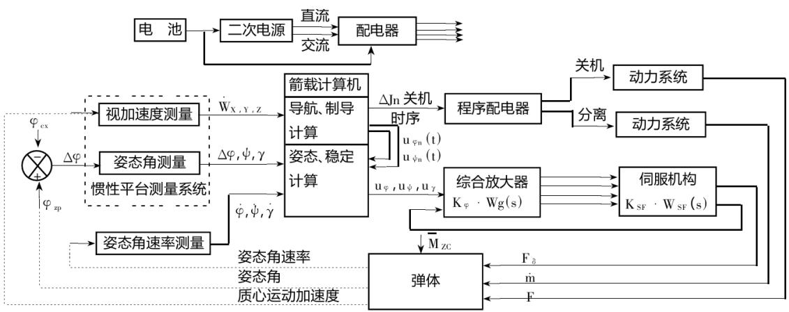

flowchart

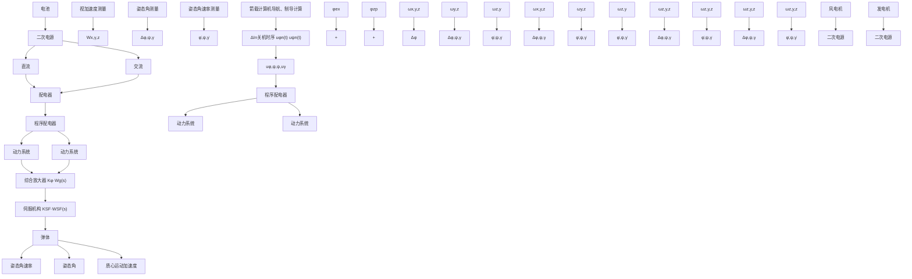

来源：冉隆燧《高可靠性火箭控制技术概论（上）》，国金证券研究所

测试发控系统由测试系统、发射控制系统、监控指挥系统、故障诊断专家系统和地面电源系统五部分组成。箭上设备的性能参数与状态信号的数据采集系统、各类电缆光缆和数传设备组成测试系统；配转机柜的火箭状态控制组成发射控制系统；地面计算机网络、数据与话音通信、多屏显示等组成监控指挥系统；各系统的地面测试计算机和地面计算机网络及其故障诊断软件系统组成火箭故障诊断专家系统；控制、遥测、外测安全的地面电源（一次电源），一、二级伺服机构马达地面供电电源、配电转接机柜和发控台供配电组合组成地面电源系统。该系统在发射场技术阵地完成火箭的分系统测试、分系统间匹配测试和总检查，以及与火箭有关系统的联合检查等；在发射阵地完成火箭与外系统的发射演练、射前检查和发射控制等任务。

图表29：火箭测试发射系统一般结构图  
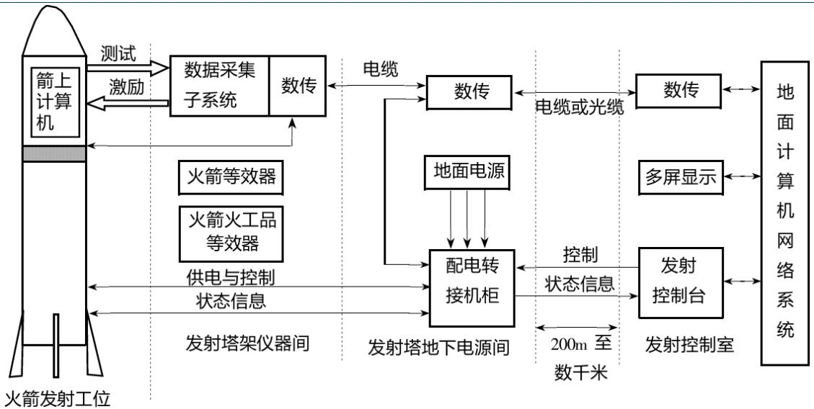

flowchart

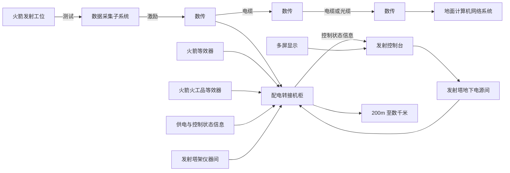

来源：冉隆燧《高可靠性火箭控制技术概论（上）》，国金证券研究所

火箭控制系统产业链相关公司包括电子元器件（鸿远电子、航天电器、中航光电、高华科技），线缆（华菱线缆、全信股份），模块组件（航天电子、智明达、新雷能、雷电微力、理工导航）。

电子元器件：

鸿远电子：军工被动电子元器件龙头，核心产品高可靠电容器、滤波器、微波模块及微纳系统集成陶瓷管壳等产品，具备商业航天领域的适配能力。  
航天电器：军用连接器龙头，在可回收火箭领域，公司可匹配的产品包括连接器及线缆、继电器、微特电机等产品。  
中航光电：连接器龙头，在商业航天（含卫星、火箭）领域深度配套，且是连接器及光电液综合互连组件的统型和优选供应商。

高华科技：传感器龙头，积极投身于航天事业发展，公司高可靠性传感器及传感器网络系统产品陆续在长征二号 F、长征三甲系列、长征五号B、长征六号改、长征七号A、长征八号甲等多型号火箭配套应用，已与中国运载火箭技术研究院、中国航天推进技术研究院、上海航天技术研究院等重点客户建立长期合作。

线缆：

华菱线缆：火箭领域，公司产品包括地面发射场用点火缆和火箭本体用高温导线等；卫星领域，参与参与模块化、批量化卫星生产的电装设计。另外，为解决传统 FPC在太阳翼弯折中涂层脱落导致失效不稳定的问题，公司开发了扁平柔性展收电缆。  
全信股份：主要从事军用光电线缆及组件、光电元器件、FC 光纤高速网络及多协议网络解决方案、光电系统集成等系列产品的研发、生产、销售和服务等业务；在航天领域主要配套宇航用低频安装线、数据总线、控制缆及部分射频缆等多类型产品。

模块组件：

◼ 航天电子：航天科技九院唯一上市平台，公司航天产品在商业航天领域已有应用。  
理工导航：惯性导航系统核心供应商，公司目前研发、设计以及生产的某些产品如高精度高可靠性惯导系统、加速度测量模块、速率陀螺组合系统等产品可用于商业航天领域，公司已与国内某商业航天企业签订了某型惯导系统配套合同。  
智明达：嵌入式计算机龙头，产品已经应用于卫星载荷、卫星地面设备和运载火箭综合控制等多领域。

# 4 商业火箭产业链投资建议与标的梳理

# 4.1 投资建议

我们认为，当前卫星互联网建设如火如荼，太空算力等亦补足商业航天赛道想象空间，进入2025 年12月以来，朱雀三号、长征 12甲等可复用火箭陆续开启发射任务及回收试验，随着行业不断发展，我国可复用火箭技术将日趋成熟，并逐渐进入工程化、产业化发展新阶段。

# 4.2 标的梳理

发动机系统：

1）新材料：斯瑞新材、西部材料等；  
2）零部件加工：铂力特、航宇科技、派克新材、中航重机等；  
3）发动机总装：航天动力等。

箭体结构：

箭体结构加工：超捷股份、广联航空、国机精工等。

控制系统：

1）电子元器件：鸿远电子、航天电器、中航光电、高华科技等；  
2）线缆：华菱线缆、全信股份等；  
3）模组组件：航天电子、理工导航、智明达等。

航天国家队：

航天工程、航天机电、航天智装、航天智造、航天科技、航天发展等。

来源：iFinD，国金证券研究所 \*注：标\*的 EPS预测值为国金证券预测，其余盈利预测取iFinD一致预期，股价取2025年12月31 日收盘价  
图表30：商用火箭产业链受益标的梳理

<table><tr><td rowspan="2">产业链环节</td><td rowspan="2">证券代码</td><td rowspan="2">证券简称</td><td rowspan="2">股价(元)</td><td rowspan="2">总市值(亿元)</td><td rowspan="2">2024年营收(亿元)</td><td rowspan="2">2024年归母净利润(亿元)</td><td colspan="4">EPS</td><td colspan="4">PE</td></tr><tr><td>2024A</td><td>2025E</td><td>2026E</td><td>2027E</td><td>2024A</td><td>2025E</td><td>2026E</td><td>2027E</td></tr><tr><td rowspan="4">发动机系统</td><td>688102</td><td>斯瑞新材</td><td>38.74</td><td>299.67</td><td>13.30</td><td>1.14</td><td>0.16</td><td>0.20</td><td>0.26</td><td>0.34</td><td>245.97</td><td>193.70</td><td>148.03</td><td>113.37</td></tr><tr><td>002149</td><td>西部材料</td><td>45.51</td><td>222.19</td><td>29.46</td><td>1.58</td><td>0.32</td><td>0.51</td><td>0.66</td><td>0.90</td><td>140.81</td><td>90.12</td><td>69.48</td><td>50.85</td></tr><tr><td>688333</td><td>铂力特</td><td>111.51</td><td>305.90</td><td>13.26</td><td>1.04</td><td>0.38</td><td>0.82</td><td>1.20</td><td>1.62</td><td>292.06</td><td>136.15</td><td>93.31</td><td>69.00</td></tr><tr><td>688239</td><td>*航宇科技</td><td>67.67</td><td>129.00</td><td>18.05</td><td>1.89</td><td>1.28</td><td>1.14</td><td>1.62</td><td>2.09</td><td>52.87</td><td>59.57</td><td>41.80</td><td>32.42</td></tr><tr><td rowspan="3"></td><td>605123</td><td>派克新材</td><td>103.90</td><td>125.90</td><td>32.13</td><td>2.64</td><td>2.18</td><td>2.77</td><td>3.48</td><td>4.30</td><td>47.70</td><td>37.53</td><td>29.88</td><td>24.19</td></tr><tr><td>600765</td><td>*中航重机</td><td>19.16</td><td>299.58</td><td>103.55</td><td>6.40</td><td>0.43</td><td>0.65</td><td>0.83</td><td>1.00</td><td>44.56</td><td>29.71</td><td>23.08</td><td>19.22</td></tr><tr><td>600343</td><td>航天动力</td><td>48.97</td><td>312.53</td><td>9.25</td><td>-1.87</td><td>-0.29</td><td>-</td><td>-</td><td>-</td><td>-166.91</td><td>-</td><td>-</td><td>-</td></tr><tr><td rowspan="3">箭体结构</td><td>301005</td><td>超捷股份</td><td>155.27</td><td>208.48</td><td>6.30</td><td>0.11</td><td>0.08</td><td>0.36</td><td>0.45</td><td>0.69</td><td>1940.88</td><td>431.31</td><td>345.04</td><td>225.03</td></tr><tr><td>300900</td><td>广联航空</td><td>39.07</td><td>116.10</td><td>10.48</td><td>-0.49</td><td>-0.17</td><td>0.13</td><td>0.38</td><td>0.62</td><td>-235.22</td><td>300.54</td><td>102.82</td><td>63.02</td></tr><tr><td>002046</td><td>国机精工</td><td>43.18</td><td>231.56</td><td>26.58</td><td>2.80</td><td>0.53</td><td>0.54</td><td>0.72</td><td>0.99</td><td>81.23</td><td>80.71</td><td>60.39</td><td>43.84</td></tr><tr><td rowspan="9">控制系统</td><td>603267</td><td>鸿远电子</td><td>54.43</td><td>125.78</td><td>14.92</td><td>1.54</td><td>0.67</td><td>1.43</td><td>1.97</td><td>2.51</td><td>81.24</td><td>38.11</td><td>27.58</td><td>21.71</td></tr><tr><td>002025</td><td>*航天电器</td><td>50.13</td><td>228.31</td><td>50.25</td><td>3.47</td><td>0.76</td><td>1.57</td><td>1.99</td><td>2.45</td><td>65.96</td><td>31.97</td><td>25.20</td><td>20.45</td></tr><tr><td>002179</td><td>中航光电</td><td>35.44</td><td>750.72</td><td>206.86</td><td>33.54</td><td>1.58</td><td>1.46</td><td>1.70</td><td>1.96</td><td>22.44</td><td>24.26</td><td>20.89</td><td>18.09</td></tr><tr><td>688539</td><td>高华科技</td><td>49.51</td><td>92.05</td><td>3.46</td><td>0.56</td><td>0.30</td><td>0.36</td><td>0.48</td><td>0.61</td><td>165.03</td><td>137.53</td><td>103.15</td><td>81.16</td></tr><tr><td>001208</td><td>华菱线缆</td><td>24.04</td><td>153.46</td><td>41.58</td><td>1.09</td><td>0.20</td><td>0.35</td><td>0.48</td><td>0.68</td><td>120.20</td><td>68.69</td><td>50.08</td><td>35.35</td></tr><tr><td>300447</td><td>全信股份</td><td>18.08</td><td>56.47</td><td>9.10</td><td>0.18</td><td>0.06</td><td>-</td><td>-</td><td>-</td><td>316.08</td><td>-</td><td>-</td><td>-</td></tr><tr><td>600879</td><td>*航天电子</td><td>21.32</td><td>703.41</td><td>142.80</td><td>5.48</td><td>0.17</td><td>0.18</td><td>0.25</td><td>0.33</td><td>128.43</td><td>119.78</td><td>86.32</td><td>65.40</td></tr><tr><td>688282</td><td>理工导航</td><td>63.50</td><td>55.88</td><td>1.71</td><td>-0.05</td><td>-0.05</td><td>-</td><td>-</td><td>-</td><td>-1270.00</td><td>-</td><td>-</td><td>-</td></tr><tr><td>688636</td><td>智明达</td><td>42.84</td><td>74.50</td><td>4.38</td><td>0.19</td><td>0.17</td><td>0.66</td><td>0.94</td><td>1.18</td><td>246.77</td><td>65.00</td><td>45.53</td><td>36.39</td></tr><tr><td rowspan="6">航天国家队</td><td>603698</td><td>航天工程</td><td>38.75</td><td>207.70</td><td>34.10</td><td>1.89</td><td>0.35</td><td>0.53</td><td>0.68</td><td>0.80</td><td>110.71</td><td>73.11</td><td>57.41</td><td>48.74</td></tr><tr><td>600151</td><td>航天机电</td><td>17.55</td><td>251.71</td><td>53.49</td><td>-0.71</td><td>-0.05</td><td>-</td><td>-</td><td>-</td><td>-353.83</td><td>-</td><td>-</td><td>-</td></tr><tr><td>300455</td><td>航天智装</td><td>30.04</td><td>215.62</td><td>13.29</td><td>0.71</td><td>0.10</td><td>0.11</td><td>0.14</td><td>0.16</td><td>302.82</td><td>273.09</td><td>214.57</td><td>187.75</td></tr><tr><td>300446</td><td>航天智造</td><td>25.34</td><td>214.23</td><td>77.81</td><td>7.92</td><td>0.94</td><td>1.10</td><td>1.32</td><td>1.57</td><td>27.06</td><td>22.99</td><td>19.23</td><td>16.14</td></tr><tr><td>000901</td><td>航天科技</td><td>28.47</td><td>227.25</td><td>68.98</td><td>0.12</td><td>0.02</td><td>-</td><td>-</td><td>-</td><td>1848.70</td><td>-</td><td>-</td><td>-</td></tr><tr><td>000547</td><td>航天发展</td><td>33.01</td><td>527.65</td><td>18.69</td><td>-16.73</td><td>-1.05</td><td>-</td><td>-</td><td>-</td><td>-31.44</td><td>-</td><td>-</td><td>-</td></tr></table>

# 5 风险提示

1）卫星互联网建设不及预期：当前卫星互联网建设是商业火箭发射等经营活动的直接下游需求来源，若卫星互联网建设进度不及预期，或将对商业火箭行业发展造成不利影响。  
2）火箭回收技术发展不及预期：火箭回收利用是商业航天降本的重要环节，若火箭回收技术发展不及预期，可能对商业火箭行业发展造成不利影响。

# 行业投资评级的说明：

买入：预期未来 3－6 个月内该行业上涨幅度超过大盘在 15%以上；

增持：预期未来 3－6 个月内该行业上涨幅度超过大盘在 5%－15%；

中性：预期未来 3－6 个月内该行业变动幅度相对大盘在 -5%－5%；

减持：预期未来 3－6 个月内该行业下跌幅度超过大盘在 5%以上。

# 特别声明：

国金证券股份有限公司经中国证券监督管理委员会批准，已具备证券投资咨询业务资格。

形式的复制、转发、转载、引用、修改、仿制、刊发，或以任何侵犯本公司版权的其他方式使用。经过书面授权的引用、刊发，需注明出处为“国金证券股份有限公司”，且不得对本报告进行任何有悖原意的删节和修改。

本报告的产生基于国金证券及其研究人员认为可信的公开资料或实地调研资料，但国金证券及其研究人员对这些信息的准确性和完整性不作任何保证。本报告反映撰写研究人员的不同设想、见解及分析方法，故本报告所载观点可能与其他类似研究报告的观点及市场实际情况不一致，国金证券不对使用本报告所包含的材料产生的任何直接或间接损失或与此有关的其他任何损失承担任何责任。且本报告中的资料、意见、预测均反映报告初次公开发布时的判断，在不作事先通知的情况下，可能会随时调整，亦可因使用不同假设和标准、采用不同观点和分析方法而与国金证券其它业务部门、单位或附属机构在制作类似的其他材料时所给出的意见不同或者相反。

本报告仅为参考之用，在任何地区均不应被视为买卖任何证券、金融工具的要约或要约邀请。本报告提及的任何证券或金融工具均可能含有重大的风险，可能不易变卖以及不适合所有投资者。本报告所提及的证券或金融工具的价格、价值及收益可能会受汇率影响而波动。过往的业绩并不能代表未来的表现。

客户应当考虑到国金证券存在可能影响本报告客观性的利益冲突，而不应视本报告为作出投资决策的唯一因素。证券研究报告是用于服务具备专业知识的投资者和投资顾问的专业产品，使用时必须经专业人士进行解读。国金证券建议获取报告人员应考虑本报告的任何意见或建议是否符合其特定状况，以及（若有必要）咨询独立投资顾问。报告本身、报告中的信息或所表达意见也不构成投资、法律、会计或税务的最终操作建议，国金证券不就报告中的内容对最终操作建议做出任何担保，在任何时候均不构成对任何人的个人推荐。

在法律允许的情况下，国金证券的关联机构可能会持有报告中涉及的公司所发行的证券并进行交易，并可能为这些公司正在提供或争取提供多种金融服务。

本报告并非意图发送、发布给在当地法律或监管规则下不允许向其发送、发布该研究报告的人员。国金证券并不因收件人收到本报告而视其为国金证券的客户。本报告对于收件人而言属高度机密，只有符合条件的收件人才能使用。根据《证券期货投资者适当性管理办法》，本报告仅供国金证券股份有限公司客户中风险评级高于C3 级(含C3 级）的投资者使用；本报告所包含的观点及建议并未考虑个别客户的特殊状况、目标或需要，不应被视为对特定客户关于特定证券或金融工具的建议或策略。对于本报告中提及的任何证券或金融工具，本报告的收件人须保持自身的独立判断。使用国金证券研究报告进行投资，遭受任何损失，国金证券不承担相关法律责任。

若国金证券以外的任何机构或个人发送本报告，则由该机构或个人为此发送行为承担全部责任。本报告不构成国金证券向发送本报告机构或个人的收件人提供投资建议，国金证券不为此承担任何责任。

此报告仅限于中国境内使用。国金证券版权所有，保留一切权利。

上海

电话：021-80234211

邮箱：researchsh@gjzq.com.cn

邮编：201204

地址：上海浦东新区芳甸路1088 号紫竹国际大厦5 楼

北京

电话：010-85950438

邮箱：researchbj@gjzq.com.cn

邮编：100005

地址：北京市东城区建内大街26 号新闻大厦8 层南侧

深圳

电话：0755-86695353

邮箱：researchsz@gjzq.com.cn

邮编：518000

地址：深圳市福田区金田路2028 号皇岗商务中心18 楼 1806

text_image

国金证券
研究服务

【小程序】国金证券研究服务

text_image

QR code with embedded circular logo containing Chinese text and a small emblem

【公众号】国金证券研究