行业研究/行业深度

2026 年 01 月 21 日

行业及产业

机械设备

# 强于大市

一年内行业指数与沪深 300 指数对比走势：  
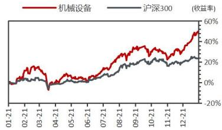

line

| Date | 机械设备 (%) | 沪深300 (%) |
|---|---|---|
| 01-21 | 0 | 0 |
| 02-21 | 15 | 5 |
| 03-21 | -5 | -10 |
| 04-21 | 5 | 0 |
| 05-21 | 10 | 5 |
| 06-21 | 15 | 10 |
| 07-21 | 20 | 15 |
| 08-21 | 25 | 20 |
| 09-21 | 30 | 25 |
| 10-21 | 25 | 20 |
| 11-21 | 35 | 25 |
| 12-21 | 50 | 30 |

资料来源：聚源数据，爱建证券研究所

# 相关研究

《智能制造行业周报：看好 2026 年中国商业航天产业拐点确立》2026-01-20

《神开股份（002278.SZ）首次覆盖报告：深海装备国产化破局，AI 驱动数字油服商业模式升级》2025-12-20

《芯碁微装（688630.SH）首次覆盖：PCB 与先进封装共振，直写光刻龙头乘势起》2025-12-12

《智能制造行业周报：晶圆产能持续扩张，看好薄膜沉积设备需求上行》2025-12-02

《智能制造行业周报：人形机器人：产业链协同开启规模化时代》2025-11-24

# 证券分析师

王凯

S0820524120002

021-32229888-25522

wangkai526@ajzq.com

# 以第一性原理推演中国商业航天降本革命

# 商业航天行业深度系列（一）

# 投资要点：

 本报告核心结论：2026 年中国商业航天进入运力降本拐点。低轨星座集中部署带动高频发射常态化，可复用火箭临近突破推动单位入轨成本阶梯下行。行业商业模式将从国家任务驱动转向市场盈利驱动，随应用场景与商业模式重构，产业估值逻辑向“空间基础设施”切换。

 2026 年有望成为中国商业航天景气元年，多星座发射节奏加速转向规模化部署，火箭发射频次有望快速抬升。我们预计 1）中国商业火箭发射服务市场规模将由 2025 年 102.6 亿元提升至 2030年 473.9 亿元，对应 CAGR约 35.8%，主要受低轨星座密集部署带来的高频发射需求拉动。从价值量结构看，发动机（54%）与箭体结构（24%）合计在火箭发射服务环节价值量占比达 78%。2）行业景气度具备中长期延续性：中国已申报低轨星座中，超23.7 万颗卫星需按 ITU 规则在 2039 年前完成部署；Starlink 当前在轨卫星超过 9,000 颗，频轨资源持续收紧，后续发射需求具备较强刚性。

 本质上，商业火箭是“太空物流”生意，核心变量在于效率提升与运力降本，路径主要来自全流量发动机技术突破、高频复用回收能力形成以及制造端工业化爬坡。参考猎鹰 9 号的技术演进路径，商业火箭单位入轨成本呈阶梯式下行：1）一次性发射阶段单位成本约 5.5 万元/kg；2）2026 年前后一子级实现复用后，发动机与结构件制造成本被多次摊薄，单位入轨成本降至约 2.5 万元/kg；3）随着铝合金向不锈钢箭体升级，耐热性与结构强度提升、回收阶段燃料与隔热需求下降，单位成本进一步降至约 1.9 万元/kg；4）在“夹筷子”回收方式成熟后，着陆腿等冗余结构被削减、回收运力损失明显收敛，单位入轨成本有望降至约 1.3万元/kg；5）远期二子级实现复用，在液氧/甲烷路线支撑下发动机翻修周期大幅缩短、发射频率提升，核心硬件与运力机会成本压缩，单位入轨成本有望逼近 0.5万元/kg。

 沿上述降本路径，中国商业火箭制造有望在三方面加速演进：1）通过耐高温、耐疲劳材料延长关键部件寿命，支撑运载能力提升与可复用；2）在复杂结构件与轻量化环节应用 3D 增材，以一体化成形减少零部件装配；3）结构件工艺向工业化转型，通过规模化生产实现单位制造成本系统性下降。随着发动机可复用、箭体结构优化及回收方式升级，运载火箭正由低频、定制化交付向更高发射节奏与更稳定交付升级，动力系统、结构件与材料、测试验证等关键环节直接决定可复用水平与运行效率，有望率先受益；在运力供给持续提升的带动下，发射频次提高将进一步推动下游卫星发射需求释放，卫星通信系统相关环节有望进入放量阶段。

 中国民营火箭公司整体仍处于行业成长与估值演进的早期阶段，参照 SpaceX发展路径，我们认为中国商业航天板块估值抬升的核心催化在：1）可复用火箭实现大规模低轨卫星组网；2）在可复用基础上，通过绑定低轨星座长期批量任务，推动发射由定制走向标准化；3）高频与规模效应兑现后，火箭发射将由项目型产品升级为空间运力基础设施与技术服务，商业航天公司的估值逻辑由制造导向转向平台型、基础设施型科技企业，覆盖载人飞行、深空探测等多元化长期空间任务需求。

 投资建议：火箭发动机是运载火箭的核心环节，主要技术壁垒集中在推力室、涡轮泵等关键部件；卫星制造的价值量则主要集中于通信载荷（TR）组件。建议关注 1）动力系统：应流股份（603308）、斯瑞新材（688102）、国机精工（002046）；2）卫星通信系统：上海瀚讯（300762）；航天电子（600879）、国博电子（688375）；3）材料与结构件：西部材料（002149）；派克新材（605123）、国机重装（601399）、华曙高科（688433）；4）测试与验证环节：西测测试（301306）、苏试试验（300416）。

 风险提示：1）可复用火箭关键技术突破及工程验证进度不及预期；2）发射需求释放节奏低于预期；3）产业链整合与规模化制造推进受阻；4）政策审批、发射资源及发射场保障能力存在不确定性。

图表 1：建议关注公司

<table><tr><td>系统</td><td>代表性企业</td><td>代码</td><td>相关业务</td><td>最新进展</td></tr><tr><td rowspan="7">动力系统</td><td rowspan="2">应流股份</td><td rowspan="2">603308</td><td rowspan="2">涡轮叶片、导向叶片、机匣</td><td>业务:公司为火箭提供高温合金铸件,包含航空发动机高温合金涡轮叶片、导向叶片、机匣,燃气轮机高温合金透平叶片,其他耐高压、耐腐蚀泵阀铸件等。</td></tr><tr><td>客户:为中国航天科技、中国航天科工、蓝箭航天等持续供货。</td></tr><tr><td rowspan="3">斯瑞新材</td><td rowspan="3">688102</td><td rowspan="3">推力室内壁</td><td>收入:25H1公司实现营业收入0.77亿元(液体火箭发动机推力室业务收入约0.23亿元,占比30%);</td></tr><tr><td>客户:已进入蓝箭航天、九州云箭等民营火箭客户供应体系。</td></tr><tr><td>产能:2024年启动推力室产业化项目,一期达产后预计形成年产200吨锻件、200套喷注器面板、500套推力室内外壁产能。</td></tr><tr><td rowspan="2">国机精工</td><td rowspan="2">2046</td><td rowspan="2">轴承</td><td>业务:在卫星和运载火箭轴承生产上(传统航天领域所用轴承中,公司市占率约90%);</td></tr><tr><td>客户:长征系列火箭所用特种轴承供应商,客户已涵盖中国主流民营火箭公司。</td></tr><tr><td rowspan="4">卫星通信系统</td><td>上海瀚讯</td><td>300762</td><td>箭载卫星通信系统</td><td>业务:G60垣信星座供应商,已中标其海外布局所需的一体化信关站项目,预计2025年交付2-3个批次卫星载荷。</td></tr><tr><td rowspan="2">航天电子</td><td rowspan="2">600879</td><td rowspan="2">惯性导航、测控通信</td><td>股权:中国航天科技集团旗下公司</td></tr><tr><td>业务:在惯性导航、测控通信、微电子等航天电子信息领域具备核心技术能力,承担了神舟二十号、长征八号改进型、天问二号、天舟九号等多项国家重大航天型号的测控通信任务。</td></tr><tr><td>国博电子</td><td>688375</td><td>有源相控阵T/R组件、射频</td><td>业务:中国最大的有源相控阵T/R组件和射频芯片核心供应商,积极布局低轨卫星和商业航天领域。</td></tr><tr><td rowspan="4">材料与结构件</td><td>西部材料</td><td>2149</td><td>钛合金、铌合金</td><td>业务:航天用钛合金中厚板、宽幅钛合金薄板供应商,控股子公司西诺稀贵为航天提供钽铌材料,已为“神舟”、“嫦娥”、“长征”、“天宫”、“华龙一号”等重点工程提供大量配套产品。</td></tr><tr><td>派克新材</td><td>605123</td><td>航空航天锻件</td><td>合作伙伴:蓝箭航天、星际荣耀、天兵科技、中科宇航等。</td></tr><tr><td>国机重装</td><td>601399</td><td>成型装备集成</td><td>业务:可为航天企业提供金属材料成型装备集成供货服务,正在积极对接商业航天相关单位与项目。</td></tr><tr><td>华曙高科</td><td>688433</td><td>3D增材结构件</td><td>业务:大尺寸件、超薄壁件、复杂内流道结构、异形结构等工件打印,已实现火箭发动机收扩段、推力室、低空飞行器电动转子马达等多场景应用</td></tr><tr><td rowspan="4">测试与验证</td><td rowspan="2">西测测试</td><td rowspan="2">301306</td><td rowspan="2">环境与可靠性试验</td><td>业务:可为火箭客户提供环境与可靠性试验、电磁兼容试验、电子元器件检测与装联等“一站式”验证服务;</td></tr><tr><td>资质:已取得AS9100D、Nadcap、SPCAP等航空航天相关资质。</td></tr><tr><td rowspan="2">苏试试验</td><td rowspan="2">300416</td><td rowspan="2">结构与环境试验</td><td>业务:具备振动、冲击、力学、热真空、气候、综合环境、电磁兼容(EMC)等全谱系环境与可靠性试验能力,可为火箭发射与回收阶段提供结构强度、振动环境适应性、可靠性与失效分析相关试验支持。</td></tr><tr><td>装备:自研60吨级电动振动试验系统,支持高频、高精度、大承载振动测试,适用于大型结构件及组合体。</td></tr></table>

资料来源：各公司公告，爱建证券研究所整理

# 目录

# 1. 频轨时限迫近推动卫星需求释放，而发射成本仍高.

1.1商业航天产业中，火箭承担运力供给，卫星载荷完成任务 6  
1.2 中国低轨星座进入集中部署期，超二十万颗卫星需求在途. 8  
1.3 运力不足叠加成本高企掣肘组网，大推力与可回收是关键. 12

# 2. 航天运力降本三件套：全流量发动机、高复用、工业化..................14

2.1火箭成本结构拆解：发动机与结构件占据主要价值量. . 14  
2.2火箭发动机的演进方向：全流量分级与液氧甲烷燃料. 17  
2.3 从 SpaceX 火箭回收看关键技术点.. .. 21  
2.4运载火箭成本下行空间测算与路径推演. . 24

# 3. 中国火箭产业链会如何重构？ .... .29

3.1 一次性火箭产业链特征：高度分散、国家主导. . 29  
3.2 火箭供应链生产方式革新，系统性推动效率提升. . 33

# 4. 商业航天产业投资. ..35

4.1SpaceX 估值成长启示录：由发射服务向空间扩展平台演进. ..35  
4.2 投资建议.. .. 37

# 5. 风险提示 ... ..38

# 图表目录

图表 1 ：建议关注公司. 2

图表 2 ：商业航天产业组成. 6

图表 3 ：2015-2024 年全球商业航天市场规模（亿美元） .6

图表 4 ：2015-2024 年中国商业航天市场规模（亿元） .6

图表 5 ：卫星制造环节各部件价值量占比.

图表 6 ：火箭发射服务环节价值量占比.

图表 7 ：2025–2034E中国商业航天制造环节细分市场规模测算

图表 8 ：全球在轨卫星所有权格局，当下 SpaceX 占据主导 .8

图表 9 ：2024 年全球商业航天发射数量分布. 9

图表 10 ：国内外主流运载火箭发射服务价格汇总表.

图表 11 ：2025-2034E中国商业航天产业卫星制造和火箭发射市场空间测算 .10

图表 12 ：星座单颗重量及建设成本. . 11

图表 13 ：典型火箭飞行任务剖面示意图. . 12

图表 14 ：全世界运载火箭图示（部分） .. 13

图表 15 ：我国代表性民营航天公司与 SpaceX 运载能力对比. . 13

图表 16 ：猎鹰-9运载火箭一级硬件成本结构.. .14

图表 17 ：猎鹰-9运载火箭二级硬件成本结构.. .14

图表 18 ：运载火箭结构示意以及各部分价值量. 15

图表 19 ：猎鹰-9 运载火箭成本测算（非复用） .15

图表 20 ：运载火箭推进系统结构示意图 . 16

图表 21 ：猛禽液氧甲烷发动机系统构成示意图. . 16

图表 22 ：火箭发动机工作原理示意图 17

图表 23 ：运载火箭发动机构造图. .. 18

图表 24 ：超高压富氧燃烧发动机温度与流速仿真 19

图表 25 ：超高压富氧燃烧发动机仿真温度结果 . 19

图表 26 ：合金材料耐热性能对比. . 19

图表 27 ：常用推进剂对比. .. 20

图表 28 ：著名企业液氧甲烷发动机参数对比.. . 20

图表 29 ：全流量补燃循环技术原理 . 20

图表 30 ：火箭可回收的七个技术难点. . 21

图表 31 ：运载火箭回收复用技术分类与发展. . 22

图表 32 ：航天动力装置增材制造应用（部分展示 1） .. 23

图表 33 ：航天动力装置增材制造应用（部分展示 2） . 23

图表 34 ：太空发射成本革命.. .. 24

图表 35 ：SpaceX 星舰综合飞行试验（IFT）情况统计.. .25

图表 36 ：猎鹰 9号一级推进器使用情况. .. 26

图表 37 ：典型可回收复用火箭发射成本降本路线推演 27

图表 38 ：中国典型可回收火箭降本路径推演.. .. 28

图表 39 ：中国火箭产业链图谱 . 29

图表 40 ：液体火箭生产测试产业链部分参与单位. .. 30

图表 41 ：中国商业航天市场参与主体. .. 31

图表 42 ：我国代表性商业火箭公司及其主要业务 .. 31

图表 43 ：中国主要民营企业代表火箭参数. . 32

图表 44 ：蓝箭航天“朱雀”系列液氧甲烷运载火箭生产工艺流程 .. 33

图表 45 ：助推器脉动式总装站位划分. .. 33

图表 46 ：由定制走向工业化，成本在逐渐下降. .. 34

图表 47 ：SpaceX估值演进历程 ..35

图表 48 ：SpaceX 发展历程及关键时间. ... 35

图表 49 ：建议关注公司. .. 37

# 1. 频轨时限迫近推动卫星需求释放，而发射成本仍高

商业航天是在国家政策法规指导下，通过社会资本投资，按市场机制运行，利用市场规则向各类用户提供航天产品和服务的活动，主要包括航天器及运载火箭的研发制造、航天器的发射、航天器的运营及应用三大组成环节。

图表 2：商业航天产业组成

<table><tr><td>产业环节</td><td>定义</td></tr><tr><td>研发制造</td><td>航天器及运载火箭的设计、研发、试验和制造环节,包括卫星、运载火箭等航天装备的研制。</td></tr><tr><td>发射</td><td>将航天器送入预定轨道的发射服务环节,包括火箭发射组织与实施。</td></tr><tr><td>运营应用</td><td>航天器在轨运行管理及其应用服务环节,包括通信、遥感、导航等在轨运营与数据应用。</td></tr></table>

资料来源：蓝箭航天招股说明书，爱建证券研究所

从全球视角看，根据美国航天基金会 2025 年发布的《Space Report》，2024 年全球航天经济规模达 6,120 亿美元，其中商业航天收入约 4,800 亿美元，占比约 78%。2015—2024 年间，全球商业航天收入保持 7.7%的年均复合增长率，在卫星通信、对地观测与商业发射需求驱动下呈现稳步扩张态势。聚焦中国市场，根据蓝箭航天招股说明书披露，2024 年中国商业航天市场规模约为 2.3 万亿元人民币，2015—2024 年年均复合增长率达 22.5%，显著高于全球平均水平。

图表 3：2015-2024 年全球商业航天市场规模（亿美元）  
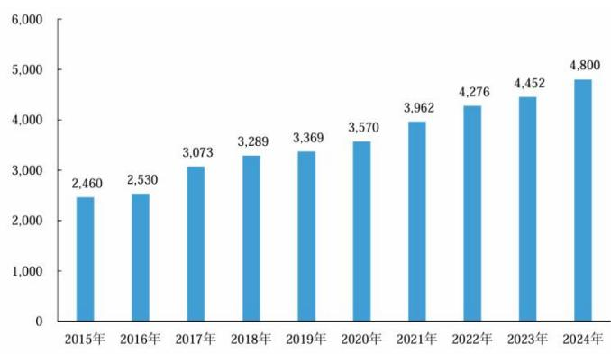

bar

| 年份 | 数值 |
|---|---|
| 2015年 | 2,460 |
| 2016年 | 2,530 |
| 2017年 | 3,073 |
| 2018年 | 3,289 |
| 2019年 | 3,369 |
| 2020年 | 3,570 |
| 2021年 | 3,962 |
| 2022年 | 4,276 |
| 2023年 | 4,452 |
| 2024年 | 4,800 |

资料来源：蓝箭航天招股书，美国航天基金会，爱建证券研究所

图表 4：2015-2024 年中国商业航天市场规模（亿元）  
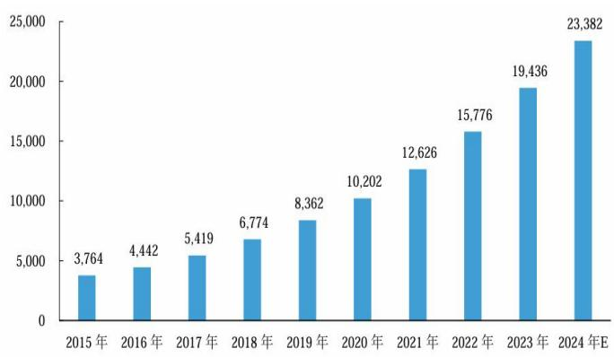

bar

| 年份 | 数值 |
|---|---|
| 2015年 | 3,764 |
| 2016年 | 4,442 |
| 2017年 | 5,419 |
| 2018年 | 6,774 |
| 2019年 | 8,362 |
| 2020年 | 10,202 |
| 2021年 | 12,626 |
| 2022年 | 15,776 |
| 2023年 | 19,436 |
| 2024年E | 23,382 |

资料来源：蓝箭航天招股书，中国航天工业质量协会、艾媒咨询、华经产业研究院、中投产业研究院，爱建证券研究所

# 1.1商业航天产业中，火箭承担运力供给，卫星载荷完成任务

在中国商业航天产业链环节中，火箭发射服务与卫星制造环节有望率先受益于星座组网带来的发射需求。我们预计，1）中国商业火箭发射服务市场规模将由 2025 年 102.6亿元提升至 2034 年 462.1 亿元，对应 CAGR 约 18.2%，主要受低轨星座密集部署带来的高频发射需求拉动。从价值量结构看，火箭产业链高度集中于核心部件，发动机（54%）与箭体结构（24%）合计在火箭发射服务环节价值量占比达 78%。2）卫星制造方面，我们预计中国卫星制造市场规模将由2025年60.9亿元增长至2034年的1,579.6亿元，对应 2025–2034ECAGR 约 43.6%，随着星座建设迈向规模化组网，整星及载荷的批量交付有望进入加速期。结构上，卫星制造价值量高度集中在通信载荷环节，相控阵天线（33%）、转发器（17%）、星间激光通信终端（16%）及星载处理器/基带模块（5%）合计在卫星制造环节价值量占比约 71%。

图表 5：卫星制造环节各部件价值量占比  
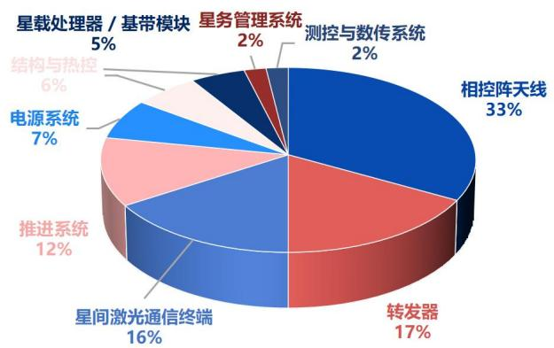

pie

| 类别 | 占比 (%) |
|---|---|
| 相控阵天线 | 33 |
| 转发器 | 17 |
| 星间激光通信终端 | 16 |
| 推进系统 | 12 |
| 电源系统 | 7 |
| 结构与热控 | 6 |
| 星载处理器 / 基带模块 | 5 |
| 测控与数传系统 | 2 |
| 星务管理系统 | 2 |

资料来源：你好太空，爱建证券研究所

图表 6：火箭发射服务环节价值量占比  
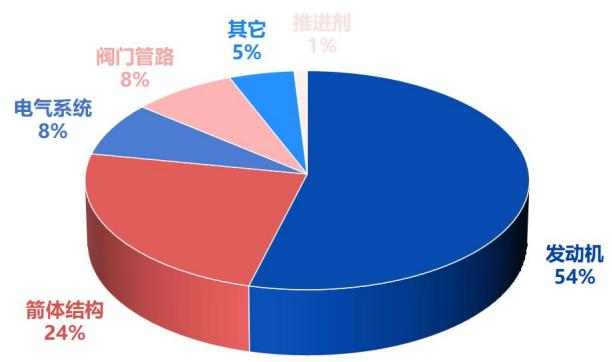

pie

| 类别 | 占比 (%) |
|---|---|
| 发动机 | 54 |
| 箭体结构 | 24 |
| 电气系统 | 8 |
| 阀门管路 | 8 |
| 其它 | 5 |
| 推进剂 | 1 |

资料来源：《猎鹰9号火箭发射及箭体复用的分析》-刘敏华，爱建证券研究所

图表 7：2025–2034E 中国商业航天制造环节细分市场规模测算

<table><tr><td>单位:亿人民币</td><td>价值量占比</td><td>2025</td><td>2026E</td><td>2027E</td><td>2028E</td><td>2029E</td><td>2030E</td><td>2031E</td><td>2032E</td><td>2033E</td><td>2034E</td></tr><tr><td>中国火箭发射服务市场规模</td><td></td><td>102.6</td><td>140.2</td><td>198.5</td><td>343.1</td><td>370.6</td><td>473.9</td><td>481.6</td><td>482.1</td><td>476.0</td><td>462.1</td></tr><tr><td>其中:</td><td>100%</td><td></td><td></td><td></td><td></td><td></td><td></td><td></td><td></td><td></td><td></td></tr><tr><td>发动机</td><td>54%</td><td>55.4</td><td>75.7</td><td>107.2</td><td>185.2</td><td>200.1</td><td>255.9</td><td>260.1</td><td>260.3</td><td>257.0</td><td>249.6</td></tr><tr><td>箭体结构</td><td>24%</td><td>24.6</td><td>33.7</td><td>47.6</td><td>82.3</td><td>88.9</td><td>113.7</td><td>115.6</td><td>115.7</td><td>114.2</td><td>110.9</td></tr><tr><td>电气系统</td><td>8%</td><td>8.2</td><td>11.2</td><td>15.9</td><td>27.4</td><td>29.6</td><td>37.9</td><td>38.5</td><td>38.6</td><td>38.1</td><td>37.0</td></tr><tr><td>阀门管路</td><td>8%</td><td>8.2</td><td>11.2</td><td>15.9</td><td>27.4</td><td>29.6</td><td>37.9</td><td>38.5</td><td>38.6</td><td>38.1</td><td>37.0</td></tr><tr><td>其它</td><td>5%</td><td>5.1</td><td>7.0</td><td>9.9</td><td>17.2</td><td>18.5</td><td>23.7</td><td>24.1</td><td>24.1</td><td>23.8</td><td>23.1</td></tr><tr><td>推进剂</td><td>1%</td><td>1.0</td><td>1.4</td><td>2.0</td><td>3.4</td><td>3.7</td><td>4.7</td><td>4.8</td><td>4.8</td><td>4.8</td><td>4.6</td></tr><tr><td>中国卫星制造市场规模</td><td></td><td>60.9</td><td>171.0</td><td>283.9</td><td>618.8</td><td>1,256.3</td><td>1,559.2</td><td>1,606.9</td><td>1,626.8</td><td>1,619.3</td><td>1,579.6</td></tr><tr><td>其中:</td><td>100%</td><td></td><td></td><td></td><td></td><td></td><td></td><td></td><td></td><td></td><td></td></tr><tr><td>1通信载荷</td><td></td><td></td><td></td><td></td><td></td><td></td><td></td><td></td><td></td><td></td><td></td></tr><tr><td>相控阵天线</td><td>33%</td><td>20.1</td><td>56.4</td><td>93.7</td><td>204.2</td><td>414.6</td><td>514.5</td><td>530.3</td><td>536.9</td><td>534.4</td><td>521.3</td></tr><tr><td>转发器</td><td>17%</td><td>10.4</td><td>29.1</td><td>48.3</td><td>105.2</td><td>213.6</td><td>265.1</td><td>273.2</td><td>276.6</td><td>275.3</td><td>268.5</td></tr><tr><td>星间激光通信终端</td><td>16%</td><td>9.7</td><td>27.4</td><td>45.4</td><td>99.0</td><td>201.0</td><td>249.5</td><td>257.1</td><td>260.3</td><td>259.1</td><td>252.7</td></tr><tr><td>星载处理器/基带模块</td><td>5%</td><td>3.0</td><td>8.6</td><td>14.2</td><td>30.9</td><td>62.8</td><td>78.0</td><td>80.3</td><td>81.3</td><td>81.0</td><td>79.0</td></tr><tr><td>2卫星平台</td><td></td><td></td><td></td><td></td><td></td><td></td><td></td><td></td><td></td><td></td><td></td></tr><tr><td>推进系统</td><td>12%</td><td>7.3</td><td>20.5</td><td>34.1</td><td>74.3</td><td>150.8</td><td>187.1</td><td>192.8</td><td>195.2</td><td>194.3</td><td>189.5</td></tr><tr><td>电源系统</td><td>7%</td><td>4.3</td><td>12.0</td><td>19.9</td><td>43.3</td><td>87.9</td><td>109.1</td><td>112.5</td><td>113.9</td><td>113.3</td><td>110.6</td></tr><tr><td>结构与热控</td><td>6%</td><td>3.7</td><td>10.3</td><td>17.0</td><td>37.1</td><td>75.4</td><td>93.6</td><td>96.4</td><td>97.6</td><td>97.2</td><td>94.8</td></tr><tr><td>星务管理系统</td><td>2%</td><td>1.2</td><td>3.4</td><td>5.7</td><td>12.4</td><td>25.1</td><td>31.2</td><td>32.1</td><td>32.5</td><td>32.4</td><td>31.6</td></tr><tr><td>测控与数传系统</td><td>2%</td><td>1.2</td><td>3.4</td><td>5.7</td><td>12.4</td><td>25.1</td><td>31.2</td><td>32.1</td><td>32.5</td><td>32.4</td><td>31.6</td></tr></table>

资料来源：界面新闻引用的《中国商业航天产业研究报告》，你好太空，前瞻产业研究院，智研咨询，爱建证券研究所测算

# 1.2 中国低轨星座进入集中部署期，超二十万颗卫星需求在途

展望 2025 年后发射规划，中国低轨卫星互联网星座仍处于部署初期。在全球卫星领域，低轨卫星互联网星座建设和运营为主要发展方向。2020 年我国将卫星互联网纳入“新基建”，截至 2025 年 12 月，GW 星座和千帆星座在轨卫星数量分别为 136 颗和 108 颗，仅占总体规划约 0.87%：①中国星网规划“GW 星座”拟发射 12,992 颗卫星，覆盖 500–600km 极低轨道及 1,145km 近地轨道；②垣信卫星规划“千帆星座”拟发射约 15,000 颗卫星，计划于 2027 年前实现初步全球覆盖、2030 年前完成组网。③2025 年 12 月，中国提交超 20.3 万颗卫星频轨资源申请，覆盖 14 个星座，其中无线电创新院旗下，CTC-1 和 CTC-2 两个星座各申请 96,000 多颗；④中国移动、垣信卫星、国电高科等也纷纷下场，各申请 1,000—2,000 颗不等。

全球低轨频轨资源竞争已进入白热化阶段，倒逼星座加快部署节奏，发射需求呈现高度刚性。在国际电信联盟（ITU）“先申报、先使用”制度下，运营方需在严格时限内完成卫星发射与部署，否则频轨资源将自动失效。同时，受覆盖范围、轨道高度及同频干扰等因素制约，近地轨道安全可承载卫星规模约为 6—10 万颗，美国 SpaceX的星链（Starlink）在轨卫星数量2025 年底超过 9,000 颗，已占用相当体量低轨资源。相比之下，中国低轨星座部署起步较晚，留给后续集中申报与加快部署的时间窗口正逐步收紧。

图表 8：全球在轨卫星所有权格局，当下 SpaceX占据主导  
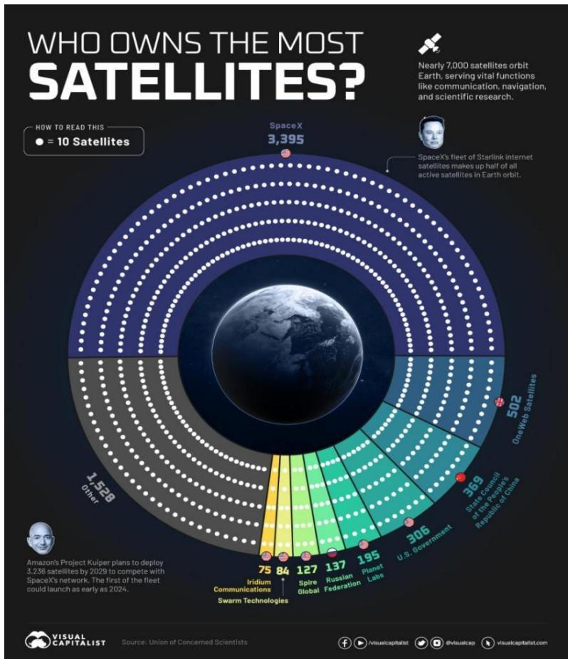

polar_bar

| Entity | Satellite Count |
| --- | --- |
| SpaceX | 3,395 |
| OneWeb Satellites | 502 |
| U.S. Government | 306 |
| State Council of the People's Republic of China | 369 |
| Russian Federation | 137 |
| Planet Lab | 195 |
| Iridium Communications Swarm Technologies | 75 |
| Other | 1,528 |
| Amazon's Project Kuiper plans to deploy 3,236 satellites by 2029 to compete with SpaceX's network. The first of the fleet could launch as early as 2024. |

资料来源：Visual Capitalist，爱建证券研究所

在单箭更强运载能力与可重复使用技术加持下，SpaceX 显著压低单位载荷发射成本，从而在同等预算下实现更高频、更大规模的密集部署，强化低轨星座的快速铺设与轨道/频谱资源抢占能力。基于官方公布的全新火箭报价并按对应运载能力测算，猎鹰 9号的 LEO 单位载荷价格约 3070 美元/kg，猎鹰 9 重型在满载条件下约 1,411 美元/kg，均显著低于传统一次性运载火箭普遍 8,000–1,5000 美元/kg 成本水平。

图表 9：2024 年全球商业航天发射数量分布  
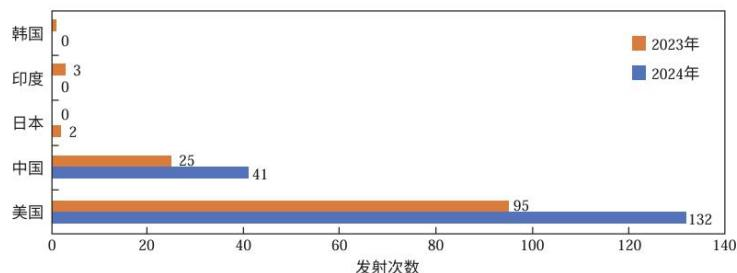

bar

| 国家 | 2023年 | 2024年 |
|---|---|---|
| 韩国 | 0 | 0 |
| 印度 | 3 | 0 |
| 日本 | 2 | 0 |
| 中国 | 25 | 41 |
| 美国 | 95 | 132 |

图72023一2024年全球商业航天发射国家和数量分布

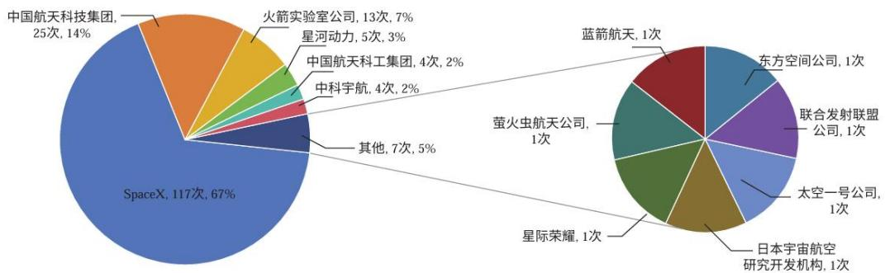

pie

| Company | Count | Percentage (%) |
| :--- | :--- | :--- |
| SpaceX | 117 | 67 |
| 中国航天科技集团 | 25 | 14 |
| 火箭实验室公司 | 13 | 7 |
| 星河动力 | 5 | 3 |
| 中国航天科工集团 | 4 | 2 |
| 中科宇航 | 4 | 2 |
| 其他 | 7 | 5 |
蓝箭航天 | 1 | 1次 |
| 萤火虫航天公司 | 1 | 1次 |
| 联合发射联盟公司 | 1 | 1次 |
| 太空一号公司 | 1 | 1次 |
| 日本宇宙航空研究开发机构 | 1 | 1次 |

资料来源：《2024年全球航天发射活动总结》刘洁，爱建证券研究所

图表 10：国内外主流运载火箭发射服务价格汇总表

<table><tr><td rowspan="2">国家</td><td rowspan="2">公司</td><td rowspan="2">运载火箭</td><td colspan="2">运载能力/t</td><td rowspan="2">全新火箭发射成本(万美元)</td><td rowspan="2">LEO单位载荷价格(美元/kg)</td><td rowspan="2">GTO单位载荷价格(美元/kg)</td><td rowspan="2">备注</td></tr><tr><td>LEO</td><td>GTO</td></tr><tr><td>美国</td><td>Space X</td><td>星舰</td><td>100</td><td>-</td><td>-</td><td>-</td><td>-</td><td>可重复使用</td></tr><tr><td>美国</td><td>Space X</td><td>猎鹰-9</td><td>22.8</td><td>8.3</td><td>7,000</td><td>3,070</td><td>8,434</td><td>可重复使用</td></tr><tr><td>美国</td><td>Space X</td><td>猎鹰-9重型</td><td>63.8</td><td>26.7</td><td>9,000</td><td>1,411</td><td>3,371</td><td>可重复使用</td></tr><tr><td>美国</td><td>洛马</td><td>宇宙神5</td><td>18.5</td><td>8.9</td><td>15,000</td><td>8,108</td><td>16,854</td><td>-</td></tr><tr><td>美国</td><td>ULA</td><td>德尔塔4H</td><td>23</td><td>13</td><td>35,000</td><td>15,217</td><td>26,923</td><td>-</td></tr><tr><td>俄罗斯</td><td>-</td><td>质子M</td><td>6.27</td><td>-</td><td>6,500</td><td>10,367</td><td>-</td><td>-</td></tr><tr><td>俄罗斯</td><td>-</td><td>联盟2</td><td>8.2</td><td>3.25</td><td>8,000</td><td>9,756</td><td>24,615</td><td>-</td></tr><tr><td>欧洲</td><td>DLA</td><td>阿里安6A62</td><td>21.6</td><td>11.5</td><td>8,200</td><td>3,796</td><td>7,130</td><td>-</td></tr><tr><td>中国</td><td>星河动力</td><td>谷神星一号</td><td>0.4</td><td>-</td><td>500</td><td>12,500</td><td>-</td><td>-</td></tr><tr><td>中国</td><td>科工火箭</td><td>快舟一号甲</td><td>0.28</td><td>-</td><td>271</td><td>9,694</td><td>-</td><td>-</td></tr></table>

资料来源：中国长城工业集团有限公司，北京航天长征科技信息研究所，国家航天局发布，空天信息研究，爱建证券研究所

我们认为 2026 年有望成为中国商业航天景气元年，多星座并行推进，发射节奏加速转向规模化部署，火箭发射频次有望快速抬升。基于公开申报信息与现有星座建设规划测算，我们认为 1）2026 年我国低轨星座年度发射量较 2025 年将出现倍数级增长：2026年我国低轨星座计划发射卫星有望达约900颗，较2025年同比增长197.0%，对应火箭发射次数预计由 49 次提升至 141 次。2）行业景气度具备较强的中长期延续性：预计 2030 年中国低轨星座计划发射卫星约 15,592 颗，对应火箭发射有望达到约 2,134 次；展望 2034年，中国卫星年发射数量预计约 19,745颗，火箭发射次数有望提升至约 2,223次。

图表 11：2025-2034E 中国商业航天产业卫星制造和火箭发射市场空间测算

<table><tr><td>申报时间</td><td>星座</td><td colspan="2">目前部署发射量(颗)</td><td>2025</td><td>2026E</td><td>2027E</td><td>2028E</td><td>2029E</td><td>2030E</td><td>2031E</td><td>2032E</td><td>2033E</td><td>2034E</td></tr><tr><td rowspan="2">2020年</td><td rowspan="2">GW星座</td><td rowspan="2">12,992</td><td>新增</td><td rowspan="2">136</td><td rowspan="2">310</td><td rowspan="2">900</td><td rowspan="2">3,500</td><td>3,600</td><td>3,600</td><td>1,500</td><td>2,700</td><td>3,000</td><td>3,500</td></tr><tr><td>补网</td><td>27</td><td>144</td><td>393</td><td>1,302</td><td>3,005</td><td>3,625</td></tr><tr><td rowspan="2">2023年8月</td><td rowspan="2">G60星链(千帆星座)</td><td rowspan="2">15,000</td><td>新增</td><td rowspan="2">108</td><td rowspan="2">540</td><td rowspan="2">540</td><td rowspan="2">580</td><td>2,200</td><td>3,000</td><td>3,500</td><td>3,000</td><td>1,500</td><td>1,000</td></tr><tr><td>补网</td><td>22</td><td>173</td><td>454</td><td>548</td><td>900</td><td>2,084</td></tr><tr><td rowspan="10">2025年12月</td><td rowspan="2">鸿鹄-3号星座</td><td rowspan="2">10,000</td><td>新增</td><td rowspan="2">-</td><td rowspan="2"></td><td rowspan="2">30</td><td rowspan="2">50</td><td rowspan="2">2,000</td><td rowspan="2">2,500</td><td>2,400</td><td>2,000</td><td>1,500</td><td>500</td></tr><tr><td>补网</td><td>6</td><td>28</td><td>436</td><td>1,710</td></tr><tr><td rowspan="2">CTC-1、CTC-2</td><td rowspan="2">193,428</td><td>新增</td><td rowspan="2">-</td><td rowspan="2"></td><td rowspan="2">60</td><td rowspan="2">80</td><td rowspan="2">3,000</td><td rowspan="2">5,000</td><td>7,000</td><td>7,200</td><td>7,200</td><td>3,600</td></tr><tr><td>补网</td><td>12</td><td>52</td><td>660</td><td>2,816</td></tr><tr><td rowspan="2">CHINAMOBILE-L1、M1</td><td rowspan="2">2,664</td><td>新增</td><td rowspan="2">-</td><td rowspan="2"></td><td rowspan="2">40</td><td rowspan="2">70</td><td rowspan="2">300</td><td rowspan="2">600</td><td>800</td><td>550</td><td>300</td><td>80</td></tr><tr><td>补网</td><td>8</td><td>38</td><td>110</td><td>314</td></tr><tr><td rowspan="2">SAILSPACE-1</td><td rowspan="2">1,296</td><td>新增</td><td rowspan="2">-</td><td rowspan="2"></td><td rowspan="2">30</td><td rowspan="2">50</td><td rowspan="2">100</td><td rowspan="2">300</td><td>380</td><td>280</td><td>100</td><td>50</td></tr><tr><td>补网</td><td>6</td><td>28</td><td>56</td><td>130</td></tr><tr><td rowspan="2">TIANQI-3G</td><td rowspan="2">1,132</td><td>新增</td><td rowspan="2">-</td><td rowspan="2"></td><td rowspan="2">20</td><td rowspan="2">40</td><td rowspan="2">100</td><td rowspan="2">150</td><td>300</td><td>200</td><td>100</td><td>80</td></tr><tr><td>补网</td><td>4</td><td>20</td><td>48</td><td>98</td></tr><tr><td rowspan="2" colspan="2">其它(截至2025年12月)</td><td rowspan="2">-</td><td>新增</td><td rowspan="2">59</td><td rowspan="2">50</td><td rowspan="2">50</td><td rowspan="2">50</td><td>60</td><td>80</td><td>100</td><td>80</td><td>80</td><td>80</td></tr><tr><td>补网</td><td>12</td><td>45</td><td>52</td><td>50</td><td>54</td><td>78</td></tr><tr><td colspan="2">商业航天卫星数量总计</td><td>236,512</td><td></td><td>303</td><td>900</td><td>1,670</td><td>4,420</td><td>11,421</td><td>15,592</td><td>16,915</td><td>18,076</td><td>19,050</td><td>19,745</td></tr><tr><td colspan="4">YoY</td><td></td><td>197.0%</td><td>85.6%</td><td>164.7%</td><td>158.4%</td><td>36.5%</td><td>8.5%</td><td>6.9%</td><td>5.4%</td><td>3.6%</td></tr><tr><td colspan="4">卫星制造成本假设(万元/颗)</td><td>2,010</td><td>1,900</td><td>1,700</td><td>1,400</td><td>1,100</td><td>1,000</td><td>950</td><td>900</td><td>850</td><td>800</td></tr><tr><td colspan="4">对应卫星制造费空间(亿元)</td><td>60.9</td><td>171.0</td><td>283.9</td><td>618.8</td><td>1,256.3</td><td>1,559.2</td><td>1,606.9</td><td>1,626.8</td><td>1,619.3</td><td>1,579.6</td></tr><tr><td colspan="4">YoY</td><td></td><td>180.7%</td><td>66.0%</td><td>118.0%</td><td>103.0%</td><td>24.1%</td><td>3.1%</td><td>1.2%</td><td>-0.5%</td><td>-2.5%</td></tr><tr><td colspan="4">采用单星质量616kg,入轨卫星质量总计(吨)</td><td>186.6</td><td>554.3</td><td>1,028.6</td><td>2,722.4</td><td>7,034.3</td><td>9,603.5</td><td>10,418.2</td><td>11,133.6</td><td>11,733.6</td><td>12,161.4</td></tr><tr><td colspan="4">单枚火箭平均LEO轨道运力(kg)</td><td>3,809</td><td>3,923</td><td>4,041</td><td>4,162</td><td>4,287</td><td>4,501</td><td>4,726</td><td>4,962</td><td>5,211</td><td>5,471</td></tr><tr><td colspan="4">商业火箭发射次数</td><td>49</td><td>141</td><td>255</td><td>654</td><td>1,641</td><td>2,134</td><td>2,204</td><td>2,244</td><td>2,252</td><td>2,223</td></tr><tr><td colspan="4">单位入轨成本假设(元/kg)</td><td>55,000</td><td>25,300</td><td>19,300</td><td>12,601</td><td>5,268</td><td>4,935</td><td>4,623</td><td>4,330</td><td>4,057</td><td>3,800</td></tr><tr><td colspan="4">对应火箭发射费空间(亿元)</td><td>102.6</td><td>140.2</td><td>198.5</td><td>343.1</td><td>370.6</td><td>473.9</td><td>481.6</td><td>482.1</td><td>476.0</td><td>462.1</td></tr><tr><td colspan="4">YoY</td><td></td><td>36.6%</td><td>41.6%</td><td>72.8%</td><td>8.0%</td><td>27.9%</td><td>1.6%</td><td>0.1%</td><td>-1.3%</td><td>-2.9%</td></tr><tr><td colspan="4">卫星制造费+火箭发射费</td><td>163.6</td><td>311.2</td><td>482.4</td><td>961.9</td><td>1,626.8</td><td>2,033.1</td><td>2,088.5</td><td>2,109.0</td><td>2,095.2</td><td>2,041.7</td></tr><tr><td colspan="4">YoY</td><td></td><td>90.3%</td><td>55.0%</td><td>99.4%</td><td>69.1%</td><td>25.0%</td><td>2.7%</td><td>1.0%</td><td>-0.7%</td><td>-2.6%</td></tr></table>

资料来源：蓝箭航天招股说明书，未来天玑，电脑报少年派，你好太空，爱建证券研究所测算  
注：已发射数量为截至 2025年12月的商业航天数据

测算核心假设：

# 1）对 GW、千帆、CTC 等星座采用“先验证、后放量、再补网”的节奏假设：

①参考 ITU 对非 GSO 星座“分阶段部署”的里程碑要求（启动发射/分阶段完成一定比例部署），星座需在一定期限内完成关键节点，以锁定频轨资源与商业窗口；  
②星座建设通常经历“样星验证—小批量—规模化批产与密集发射”的爬坡过程，前期受制于卫星批产、火箭供给、地面站与测控资源，中后期逐步进入稳定放量；  
③补网：我们将 LEO 卫星的补网节奏设定为第 4/5/6 年分别补网 20%/60%/20%（第 5年为峰值）。一般来说，LEO卫星标称寿命通常为 5–7 年，但卫星进入寿命后半段后，推进剂与姿轨控余量趋紧，叠加辐射、原子氧与热循环导致功率与器件性能衰减，部分卫星从第 4 年起开始触及可用率与性能边界；同时太阳活动的周期性增强会抬升高层大气密度、放大气动阻力并加速轨道衰减，假设替换需求在第 5 年集中释放，第 6年完成兜底清退。测算期内我们亦考虑了补网卫星的二次补网需求（例如 2029E 补网星在 2034E 前后进入下一轮补网窗口），并沿用同样的补网逻辑与节奏假设。

# 2）对单颗卫星重量、制造成本的假设：

①单星重量：参考中国典型星座单星重量与成本参数，并按申报数量加权，取单星平均重量约 616kg 作为测算基准，据此推算年度入轨质量（年度发射颗数 × 616kg）；  
②单星成本：以中国主要中大型星座组网计划为基础，对单星制造成本进行数量加权测算，对应单星制造成本约 2,010 万元、每公斤成本约 3.92 万元/kg 为基准。在此基础上，考虑卫星平台标准化、批量化生产放量及供应链成熟带来的降本效应，模型假设单星制造成本自 2025 年起持续下行，由约 2,010 万元/颗下降至 2030 年约 1,000 万元/颗，并在 2034 年进一步降至约 800 万元/颗。

图表 12：星座单颗重量及建设成本

<table><tr><td>星座名称</td><td>星座卫星数量(颗)</td><td>单星重量(kg)</td><td>单星制造成本(万元)</td><td>每kg成本(万元/kg)</td></tr><tr><td>G60星链(千帆星座)</td><td>15,000</td><td>300</td><td>1,500</td><td>5.0</td></tr><tr><td>GW星座</td><td>12,992</td><td>1,000</td><td>2,650</td><td>2.7</td></tr><tr><td>银河(Galaxy)</td><td>650</td><td>230</td><td>1,000</td><td>4.3</td></tr><tr><td>加权平均</td><td></td><td>616</td><td>2,010</td><td>3.92</td></tr></table>

资料来源：中国航天官网，界面新闻，爱建证券研究所测算

# 3）对单位入轨成本（元/kg）的假设：2025 年约 55,000 元/kg，2030 年降至约 4,935元/kg，2034 年进一步降至约 3,800 元/kg。

运力降本节奏主要基于三方面考虑：①低轨星座建设由试验与验证阶段转向规模化组网，发射任务频次提升，有助于固定成本摊薄；②随着“一箭多星”能力增强及运载火箭性能持续提升，单次任务的有效入轨质量提高，单位载荷成本下降；③可重复使用火箭逐步工程化并进入商业运营阶段，边际发射成本显著下移，单位入轨成本逐步向国际先进水平收敛。

# 1.3 运力不足叠加成本高企掣肘组网，大推力与可回收是关键

随着低轨星座进入规模化部署阶段，可回收火箭供给能力、发射资源及发射工位将逐步成为制约星座建设进度的关键瓶颈。运载火箭是将卫星等航天器从地面送入预定轨道的运输工具，是航天活动中不可替代的基础运力。

运载火箭发射过程主要有两阶段：1）一级火箭阶段：火箭点火起飞后，由一级火箭提供主要推力，完成绝大部分速度提升并将箭体送入高空，随后一级火箭关机并分离；2）二级火箭阶段：二级火箭在高空或近真空环境中点火，完成轨道精确注入，并最终实现星箭分离，将航天器送入预定轨道。

图表 13：典型火箭飞行任务剖面示意图  
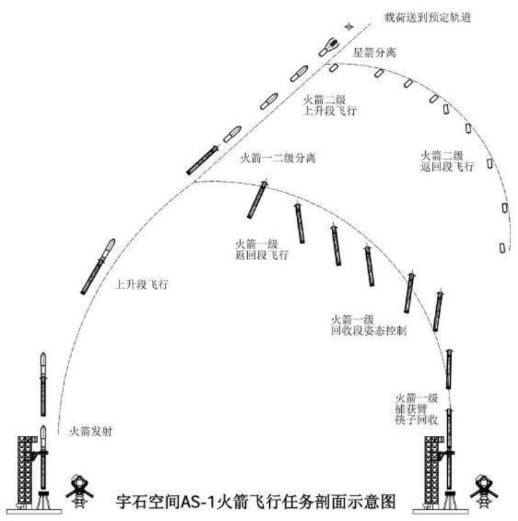

text_image

载荷送到预定轨道
星箭分离
火箭二级
上升段飞行
火箭一二级分离
火箭二级
返回段飞行
上升段飞行
火箭一级
返回段飞行
火箭一级
回收段姿态控制
火箭发射
火箭一级
捕获臂
筷子回收
宇石空间AS-1火箭飞行任务剖面示意图

资料来源：甲子光年，爱建证券研究所

SpaceX 的星舰是目前全球运力最大的运载火箭，而中国现役与在研运载火箭在体量与运载能力上仍存在明显差距。实现火箭可回收、提升火箭运载能力及摊薄单位发射成本，是我国商业航天实现规模化部署与提升发射效率的关键方向，具备较强的现实紧迫性。

图表 14：全世界运载火箭图示（部分）  
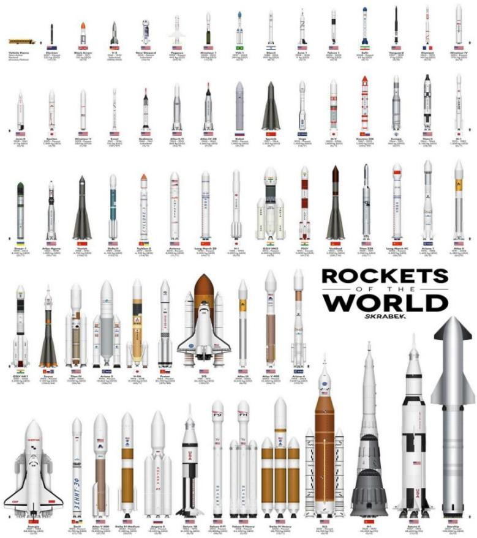  
资料来源：Visual Capitalist，爱建证券研究所

运载火箭的商业本质是太空物流，其收费方式与物流行业类似，通常按运送载荷重量计价，并可通过“包箭”等方式提升运输效率。单位载荷价格差异主要受两方面影响：1）火箭的运载能力规模；2）火箭是否具备重复使用能力。一次性运载火箭由于具有不可回收、小批量生产、风险高等特点，发射服务价格水平始终较高。按照单位载荷价格测算，美国 SpaceX 猎鹰-9 系列在具备可回收能力下，LEO 单位载荷价格已降至约 3,000 美元/kg。德尔塔 IV 重型和宇宙神 V 等单位载荷成本仍普遍在 8,000–15,000美元/kg 以上。

图表 15：我国代表性民营航天公司与 SpaceX 运载能力对比

<table><tr><td colspan="2"></td><td colspan="2">SpaceX</td><td colspan="2">星际荣耀</td><td>蓝箭航天</td><td colspan="2">星河动力</td><td>科工火箭</td></tr><tr><td>型号</td><td>Falcon9</td><td>FalconHeavy</td><td>Starship</td><td>双曲线一号</td><td>双曲线二号</td><td>朱雀二号</td><td>谷神星一号</td><td>智神星一号</td><td>快舟一号</td></tr><tr><td>首发时间</td><td>2010</td><td>2018</td><td>2020</td><td>2019</td><td>2022</td><td>2022</td><td>2020</td><td>2023</td><td>2017</td></tr><tr><td>LEO运力(t)</td><td>22.8</td><td>63.8</td><td>100以上</td><td>0.3</td><td>1.9</td><td>6</td><td>0.4</td><td>7</td><td>0.45</td></tr><tr><td>发动机</td><td>Merlin-1D++</td><td>27台Merlin-1D</td><td>39台Raptor</td><td>1台GT-1</td><td>10台焦点1号</td><td>天鹊12-A</td><td>1台光年GS-1</td><td>7台苍穹</td><td>固体发动机</td></tr><tr><td>推进剂</td><td>液氧煤油</td><td>液氧煤油</td><td>液氧甲烷</td><td>丁羟三组元</td><td>液氧甲烷</td><td>液氧甲烷</td><td>固体</td><td>液氧煤油</td><td>固体</td></tr><tr><td>发动机推力(kN)</td><td>776(海平面)</td><td>845(海平面)</td><td>2200(海平面)</td><td>790(海平面)</td><td>1060(海平面)</td><td>327(海平面)</td><td>588(海平面)</td><td>490(海平面)</td><td>-</td></tr><tr><td>是否可复用</td><td>是</td><td>是</td><td>是</td><td>否</td><td>是</td><td>是</td><td>否</td><td>是</td><td>否</td></tr></table>

资料来源：国家航天局发布，中国航天报，你好太空，爱建证券研究所整理

# 2. 航天运力降本三件套：全流量发动机、高复用、工业化

# 2.1火箭成本结构拆解：发动机与结构件占据主要价值量

# 2.1.1 火箭本体是运载火箭系统的成本核心

从系统工程视角看，运载火箭系统可划分为三个层级。

1）运载火箭本体：包括箭体结构、推进系统、控制系统以及飞行测量与安全系统，是完成入轨任务的核心载体；  
2）发射系统：包括发射台、地面支持与保障系统，负责火箭发射准备、起飞及地面配套保障；  
3）测控设备：包括测量、跟踪与控制系统，用于对火箭飞行过程进行监测与指令控制，保障任务安全与可靠实施。

对于运载火箭层面，运载火箭通常由①结构系统、②动力装置系统和③控制系统三大核心部分构成，这三大系统统称为运载火箭的主系统。

从整箭视角看，火箭本体成本高度集中于发动机与结构件环节。以猎鹰-9 运载火箭为例，一级火箭中发动机成本占比约 54.3%，箭体结构占比约 23.5%，两者合计接近78%；二级火箭中，发动机与箭体结构占比分别为 28.6%、29.5%，合计 58.1%，其余成本主要分布于电气设备与控制系统。

图表 16：猎鹰-9 运载火箭一级硬件成本结构  
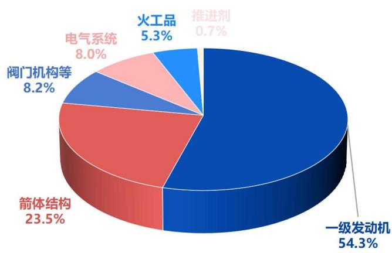

pie

| 类别 | 占比 (%) |
|---|---|
| 一级发动机 | 54.3 |
| 箭体结构 | 23.5 |
| 阀门机构等 | 8.2 |
| 电气系统 | 8.0 |
| 火工品 | 5.3 |
| 推进剂 | 0.7 |

资料来源：《猎鹰-9 运载火箭发射成本研究》——朱雄峰，爱建证券研究所

图表 17：猎鹰-9 运载火箭二级硬件成本结构  
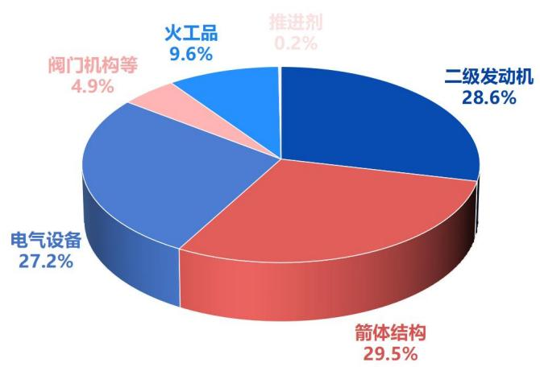

pie

| 类别 | 占比 (%) |
| :--- | :--- |
| 二级发动机 | 28.6 |
| 箭体结构 | 29.5 |
| 电气设备 | 27.2 |
| 火工品 | 9.6 |
| 阀门机构等 | 4.9 |
| 推进剂 | 0.2 |

资料来源：《猎鹰-9 运载火箭发射成本研究》——朱雄峰，爱建证券研究所

图表 18：运载火箭结构示意以及各部分价值量  
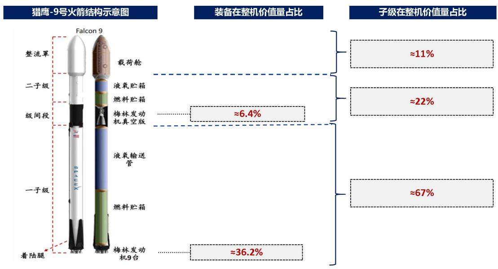

bar

| 管件 | 装备在整机价值量占比 |
| --- | --- |
| 整流罩 | ≈11% |
| 二子级 | ≈22% |
| 级间段 | ≈6.4% |
| 一子级 | ≈67% |
| 着陆腿 | ≈36.2% |

资料来源：《猎鹰-9 运载火箭发射成本研究》朱雄峰，爱建证券研究所

从单次发射报价额看，猎鹰 9 非复用单次发射成本约 5,000万美元，其中一级为主要成本来源，且成本高度集中于一级发动机（约 1,629 万美元，占总成本 36.2%）与箭体结构（705万美元，占总成本 15.7%）。

图表 19：猎鹰-9 运载火箭成本测算（非复用）

<table><tr><td colspan="2">分类</td><td>成本(万美元)</td><td>占总成本比重</td><td>设备</td><td>占总成本占比重</td><td>成本(万美元)</td></tr><tr><td rowspan="13">基本硬件</td><td rowspan="6">一级</td><td rowspan="6">3,000</td><td rowspan="6">60%</td><td>一级发动机</td><td>36.2%</td><td>1,629</td></tr><tr><td>箭体结构</td><td>15.7%</td><td>705</td></tr><tr><td>阀门机构等</td><td>5.5%</td><td>246</td></tr><tr><td>电气系统</td><td>5.3%</td><td>240</td></tr><tr><td>火工品</td><td>3.5%</td><td>159</td></tr><tr><td>推进剂</td><td>0.5%</td><td>21</td></tr><tr><td rowspan="6">二级</td><td rowspan="6">1,000</td><td rowspan="6">20%</td><td>二级发动机</td><td>6.4%</td><td>286</td></tr><tr><td>箭体结构</td><td>6.6%</td><td>295</td></tr><tr><td>电气设备</td><td>6.0%</td><td>272</td></tr><tr><td>阀门机构等</td><td>1.1%</td><td>49</td></tr><tr><td>火工品</td><td>2.1%</td><td>96</td></tr><tr><td>推进剂</td><td>0.0%</td><td>2</td></tr><tr><td>整流罩等</td><td>500</td><td>10%</td><td>-</td><td>-</td><td>500</td></tr><tr><td rowspan="2">服务维护</td><td>推进剂</td><td>40</td><td>0.8%</td><td>-</td><td>-</td><td>40</td></tr><tr><td>发射测控、回收翻修</td><td>460</td><td>9.2%</td><td>-</td><td>-</td><td>460</td></tr><tr><td>总计</td><td></td><td>5,000</td><td>100%</td><td>-</td><td>-</td><td>5,000</td></tr></table>

资料来源：《猎鹰-9运载火箭发射成本研究》朱雄峰，爱建证券研究所测算

# 2.1.2 发动机为火箭本体成本核心，推力室为关键部件

对于商业运载火箭而言，大推力发动机几乎均采用泵压式供应系统，进一步放大发动机系统成本与技术权重。发动机主要由 1）推力室、2）涡轮泵组件、3 预燃室（或燃气发生器）和 4）冷却系统组成，其工作原理是通过涡轮泵将推进剂加压输送至燃烧室，并结合再生冷却与预燃室循环，实现高效率、高推力输出。推进剂系统及其供给与输送系统围绕发动机工作。推进剂系统包括燃料与氧化剂及其贮箱，更多体现为消耗品属性；而供给与输送系统通过泵压方式将推进剂稳定输送至发动机。

图表 20：运载火箭推进系统结构示意图  
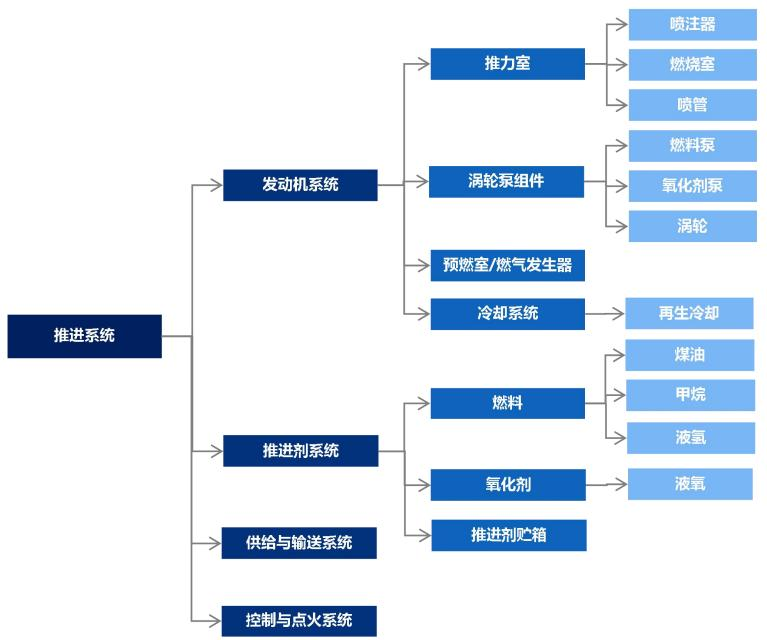

flowchart

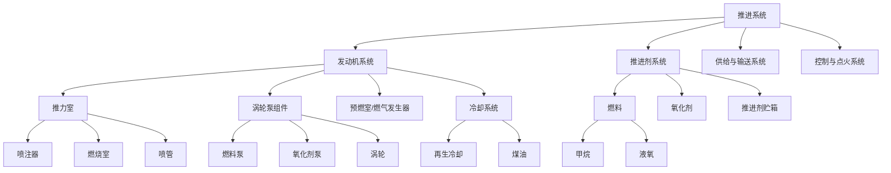
```mermaid
graph TD
    A["推进系统"] --> B["发动机系统"]
    A --> C["推进剂系统"]
    A --> D["供给与输送系统"]
    A --> E["控制与点火系统"]
    
    B --> F["推力室"]
    B --> G["涡轮泵组件"]
    B --> H["预燃室/燃气发生器"]
    B --> I["冷却系统"]
    
    F --> J["喷注器"]
    F --> K["燃烧室"]
    F --> L["喷管"]
    
    G --> M["燃料泵"]
    G --> N["氧化剂泵"]
    G --> O["涡轮"]
    
    I --> P["再生冷却"]
    I --> Q["煤油"]
    
    C --> R["燃料"]
    C --> S["氧化剂"]
    C --> T["推进剂贮箱"]
    
    R --> U["甲烷"]
    R --> V["液氧"]
```

资料来源：爱建证券研究所整理

图表 21：猛禽液氧甲烷发动机系统构成示意图  
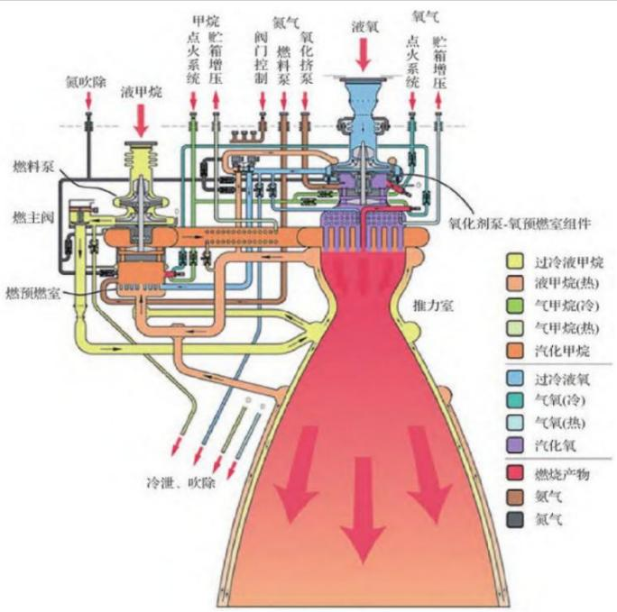

flowchart

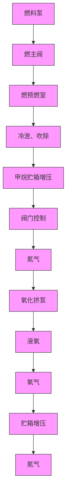
```mermaid
graph TD
    A["燃料泵"] --> B["燃主阀"]
    B --> C["燃预燃室"]
    C --> D["冷泄、吹除"]
    D --> E["甲烷贮箱增压"]
    E --> F["阀门控制"]
    F --> G["氮气"]
    G --> H["氧化挤泵"]
    H --> I["液氧"]
    I --> J["氧气"]
    J --> K["贮箱增压"]
    K --> L["氮气"]
    style A fill:#f9f,stroke:#333
    style B fill:#f9f,stroke:#333
    style C fill:#f9f,stroke:#333
    style D fill:#f9f,stroke:#333
    style E fill:#f9f,stroke:#333
    style F fill:#f9f,stroke:#333
    style G fill:#f9f,stroke:#333
    style H fill:#f9f,stroke:#333
    style I fill:#f9f,stroke:#333
    style J fill:#f9f,stroke:#333
    style K fill:#f9f,stroke:#333
    style L fill:#f9f,stroke:#333
```

资料来源：《美国 SpaceX超重-星舰首飞分析及对中国航天产业的启示》，爱建证券研究所

# 2.2 火箭发动机的演进方向：全流量分级与液氧甲烷燃料

为满足对更大有效荷载的追求，火箭发动机必然朝着更大推力与更高燃料利用效率演进。发动机设计最重要的问题是在材料耐高温与结构重量限制下，寻找性能最优化的方法。

从火箭推力公式来看，火箭推力由推进剂喷出的流量、速度与喷管压力工作情况共同决定。第一项为由燃气喷射产生的动量推力，第二项为由喷管出口压力与环境压力差产生的压力推力。在真空环境下，该公式中环境压力 $P _ { 3 }$ 接近于0，第二项压力推力产生的影响就更加大，增大喷管出口处压力 $P _ { 2 }$ 可以直接增大火箭推力。

$$
F = \dot {m} \cdot v _ {2} + (P _ {2} - P _ {3}) \cdot A _ {2}
$$

其中

F：推力（N）

m：推进剂质量流量（kg/s）

$\nu _ { 2 } .$ ：喷管出口排气速度 $\mathrm { ( m / s ) }$

$P _ { 2 }$ ：喷管出口处压力 $( P _ { 2 } )$

$P _ { 3 }$ ：环境压力 $( P _ { 3 } )$

$A _ { 2 }$ ：喷管出口处流通面积（m²）

图表 22：火箭发动机工作原理示意图  
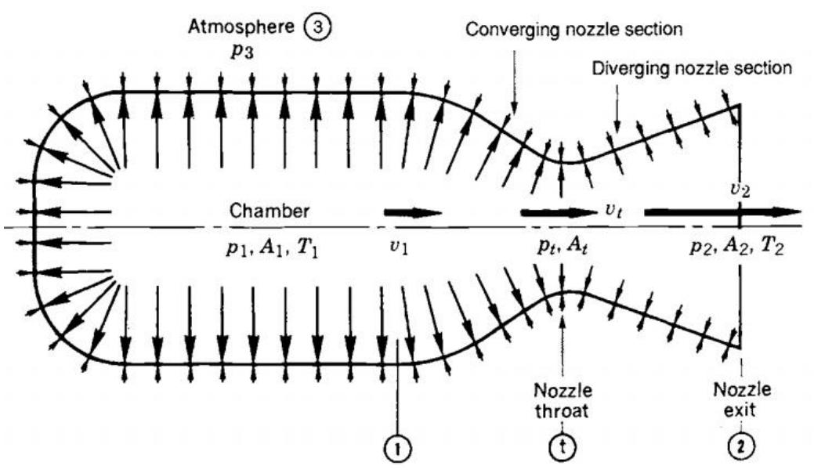

text_image

Atmosphere ③
p3
Converging nozzle section
Diverging nozzle section
Chamber
p1, A1, T1
v1
vt
p2, A2, T2
Nozzle throat
Nozzle exit
①
②

资料来源：《Rocket Propulsion Elements》第九版——G.P.萨顿，爱建证券研究所

燃烧室压强作为发动机性能核心指标，直接影响比冲与推力量级。从喷管出口排气速度的相关公式关系公式来看， $\nu _ { 2 } .$ 与 $\sqrt { \mathrm { T } _ { 1 } }$ 存在正相关关系，并且 $. \nu _ { 2 } .$ 与 $\sqrt { \mathrm { l n P } _ { 1 } }$ 也存在正相关关系。当燃烧室压力翻倍时，对应喷管出口排气速度增大 15%以上。

$$
v _ {2} = \sqrt {\frac {2 k}{k - 1} R T _ {1} (1 - (\frac {P _ {2}}{P _ {1}}) ^ {\frac {k - 1}{k}})}
$$

其中 $\dot { \cdot } _ { 1 \mathrm { c } }$ 为燃烧室温度， $\mathrm { P _ { 1 } }$ 为燃烧室压强。

基于以上分析，增大燃烧室压力与温度是提升火箭推力与效率的必然要求。燃烧室压力的提升同步带来推进剂燃烧效率的提升与压力差距提升，最终同步提升动量推力与压力推力。中国运载火箭 200 吨级液氧甲烷发动机已进入富氧—富燃联合半系统热试考核阶段，若测试进展顺利，2028 年前后有望进入飞行验证阶段。该发动机应用全流量补燃循环方案，可以达到海平面推力 2000kN、海平面比冲 327s。蓝箭航天自主研发“天鹊”系列液氧甲烷发动机，应用燃气发生器循环系统，系统更加简单，对压力、工艺与材料的要求更低。

图表 23：运载火箭发动机构造图  
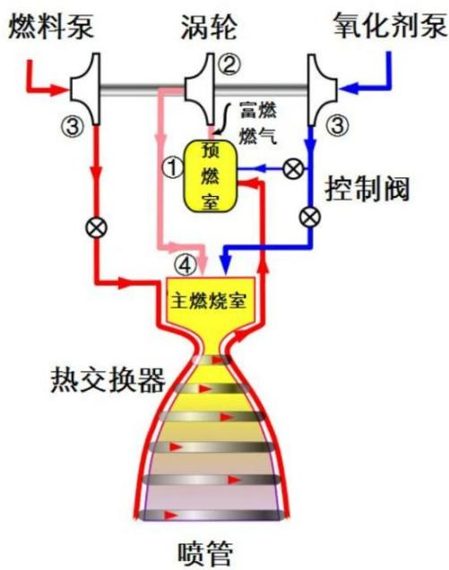

flowchart

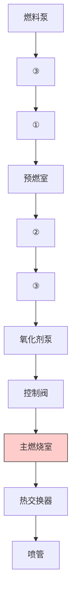
```mermaid
graph TD
    A["燃料泵"] --> B["③"]
    B --> C["①"]
    C --> D["预燃室"]
    D --> E["②"]
    E --> F["③"]
    F --> G["氧化剂泵"]
    G --> H["控制阀"]
    H --> I["主燃烧室"]
    I --> J["热交换器"]
    J --> K["喷管"]
    style I fill:#ffcccc,stroke:#333
```

资料来源：航天爱好者公众号，爱建证券研究所

Space X 选用全流量分级燃烧循环方案，在室压达到 35MPa 的情况下比冲可以达到330s。氧化剂和燃料分别由独立的预燃室供压，形成富氧预燃室和富燃预燃室。在富燃预燃烧室中，大部分燃料与少量氧化剂混合燃烧，产生高温富燃燃气，驱动燃料涡轮泵，将燃料增压后送入主燃烧室。在富氧预燃室中，大部分氧化剂与少量燃料混合燃烧，产生高温富氧燃气，驱动氧化剂涡轮泵，将氧化剂增压后送入主燃烧室。

图表 24：超高压富氧燃烧发动机温度与流速仿真  
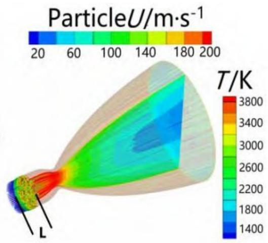

heatmap

| T/K   | Value |
|-------|-------|
| 3800  |       |
| 3400  |       |
| 3000  |       |
| 2600  |       |
| 2200  |       |
| 1800  |       |
| 1400  |       |

资料来源：《基于两步反应模型的超高压富燃燃烧仿真方法研究》刘晨澍等人，爱建证券研究所

图表 25：超高压富氧燃烧发动机仿真温度结果  
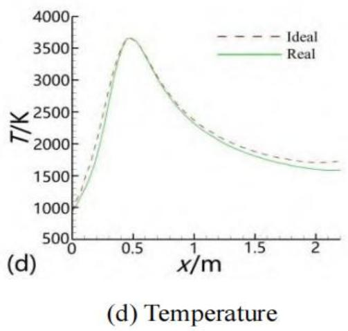

line

| x/m | Ideal | Real |
| --- | --- | --- |
| 0.0 | 1000 | 1000 |
| 0.5 | 3600 | 3600 |
| 1.0 | 2400 | 2400 |
| 1.5 | 1800 | 1750 |
| 2.0 | 1600 | 1550 |

资料来源：《基于两步反应模型的超高压富燃燃烧仿真方法研究》刘晨澍等人，爱建证券研究所

全流量分级燃烧循环超高压高温的工作条件下，对火箭发动机燃烧室与拉法尔管的材料性能提出了极高要求。在对超高压富氧燃烧发动机的仿真模拟计算下，拉法尔喷管的颈部推进剂流速达到 200m/s 以上，温度达到 3800K，这是一个极端高温高压的环境，即便是在喷管末尾，推进剂温度也不低于 1500K。铜铬铌合金在极端高温条件下仍然能保持一定抗压能力与力学性能，是制造发动机燃烧室与喷管的理想材料。

图表 26：合金材料耐热性能对比

<table><tr><td>分类</td><td>合金材料</td><td>耐热性能</td><td>熔点(K)</td></tr><tr><td rowspan="2">基础金属</td><td>铜</td><td>强</td><td>1356</td></tr><tr><td>铌</td><td>极强</td><td>2750</td></tr><tr><td rowspan="3">合金</td><td>银锆铜合金</td><td>中</td><td>873</td></tr><tr><td>锆铜合金</td><td>强</td><td>1423</td></tr><tr><td>铜铬铌合金</td><td>极强</td><td>2003</td></tr></table>

资料来源：铸造装备公众号，铜合金熔铸公众号，爱建证券研究所整理

参考猛禽发动机，其较高的性能表现通常被归因于多项系统性设计选择，其中推进剂体系与发动机循环方案被认为是影响性能与工程适配性的关键因素。

1）液氧+甲烷燃料：在火箭推进剂体系中，相较液氧/液氢或液氧/煤油方案，液氧/甲烷在多项关键指标上体现出较为均衡的工程取舍：1）燃烧特性相对清洁，积碳水平显著低于煤油体系，在工程上有利于降低发动机维护复杂度并支持高频复用；2）推进剂密度明显高于液氢，有助于缩小贮箱体积、提升结构紧凑性，从系统层面改善箭体重量与布局效率；3）在比冲水平与推进剂密度之间形成相对折中的性能组合，使其在综合效率与工程适配性方面具备优势。总体来看，液氧/甲烷更适合面向可复用与规模化发射场景，但其实际效果仍需通过长期运行与复用次数来验证。

图表 27：常用推进剂对比

<table><tr><td>推进剂</td><td>四氧化二氮/偏二甲肼</td><td>液氧煤油</td><td>液氧甲烷</td><td>液氧液氢</td></tr><tr><td>真空比冲/s(在室压20MPa,面积比200条件下)</td><td>353</td><td>381</td><td>397</td><td>491</td></tr><tr><td>燃料贮存特性</td><td>耐贮存</td><td>易贮存</td><td>不易贮存</td><td>难贮存</td></tr><tr><td>燃料价格(万元/t)</td><td>约16</td><td>约1.0</td><td>约0.5</td><td>约35</td></tr><tr><td>密度(kg/m3)</td><td>1312/791</td><td>1140/830</td><td>1140/426</td><td>1140/71</td></tr></table>

资料来源：《130吨级液氧煤油发动机重复使用技术研究进展》吕发正等，爱建证券研究所

图表 28：著名企业液氧甲烷发动机参数对比

<table><tr><td>发动机型号</td><td>所属企业</td><td>真空推力(KN)</td><td>真空比冲(s)</td></tr><tr><td>猛禽三代发动机</td><td>SpaceX</td><td>2530</td><td>363</td></tr><tr><td>BE-4</td><td>BlueOrigin</td><td>2400</td><td>340(推测)</td></tr><tr><td>天鹅12</td><td>蓝箭航天</td><td>800</td><td>337</td></tr></table>

资料来源：星际航行，航化网，爱建证券研究所

2）全流量补燃循环：传统开式循环发动机中，用于驱动涡轮泵的高温燃气在完成做功后直接排出，不参与主喷管做功，导致部分推进剂未转化为有效推力，工质与能量利用率存在天然上限。全流量补燃循环（FFSC）通过将燃料与氧化剂分别以富燃、富氧状态驱动涡轮泵，并在此后全部进入主燃烧室参与燃烧，从工作机理上减少了推进剂损失，有助于提升整体推进效率。

图表 29：全流量补燃循环技术原理  
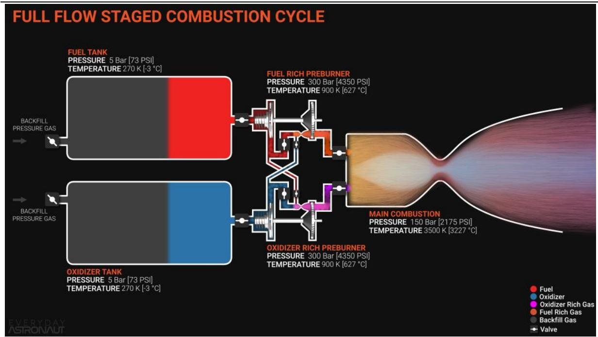

sankey

| Component             | Pressure Level | Pressure [PSI] | Temperature [K] |
|-----------------------|----------------|----------------|-----------------|
| Fuel Tank             | 5 Bar          | 73             | 270             |
| Backfill Pressure Gas | -              | -              | -               |
| Fuel Rich Preburner   | 300            | 4350           | 900             |
| Main Combustion        | 150            | 2175           | 3500            |
| Oxidizer Tank         | 5 Bar          | 73             | 270             |
| Oxidizer              | -              | -              | -               |
| Oxidizer Rich Gas     | -              | -              | -               |
| Oxidizer Rich Preburner| -            | 300            | 4350            |
| Main Combustion        | -              | -              | 3227            |
| Valve                 | -              | -              | -               |
| Valve                 | -              | -              | -               |
| Valve                 | -              | -              | -               |
| Valve                 | -              | -              | -               |
| Valve                 | -              | -              | -               |
| Valve                 | -              | -              | -               |
| Valve                 | -              | -              | -               |
| Valve                 | -              | -              | -               |
| Valve                 | -              | 900            | 627             |
| Valve                 | -              | -              | -               |
| Valve                 | -              | -              | -               |
| Valve                 | -              | -              | -               |
| Valve                 | -              | -              | -               |
| Valve                 | -              | -              | -               |
| Valve                 | -              | -              | -               |
| Valve                 | -              | -              | -               |
| Valve                 | -              | ~627           | ~627            |
| Valve                 | -              | ~627           | ~627            |
| Valve                 | -              | ~627           | ~627            |
| Valve                 | -              | ~627           | ~627            |
| Valve                 | -              | ~627           | ~627            |
| Valve                 | -              | ~627           | ~627            |
| Valve                 --> Main Combustion    |
| Valve                 --> Oxidizer      |
| Valve                 --> Oxidizer Rich Gas|
| Valve                 --> Oxidizer Rich Gas|
| Valve                 --> Oxidizer Rich Gas|
| Valve                 --> Oxidizer Rich Gas|
| Valve                 --> Oxidizer Rich Gas|
| Valve                 --> Oxidizer Rich Gas|
| Valve                 --> Oxidizer Rich Gas|
| Valve                 --> Oxidizer Rich Gas|
| Valve                 --> Oxidizer Rich Gas|
| Valve                 --> Oxidizer Rich Gas|
| Valve                 --> Oxidizer Rich Gas| Main Combustion|
| Valve                 --> Main Combustion|
| Valve                 --> Main Combustion|
| Valve                 --> Main Combustion|
| Valve                 --> Main Combustion|
| Valve                 --> Main Combustion|
| Valve                 --> Main Combustion|
| Valve                 --> Main Combustion|
| Valve                 --> Main Combustion|
| Valve                 --> Main Combustion|
| Valve                 --> Main Combustion|
| Valve                 --> Main Combustion|
| Valve                 --> Primary Combustion |
| Valve                 --> Primary Combustion |
| Valve                 --> Primary Combustion |
| Valve                 --> Primary Combustion |
| Valve                 --> Primary Combustion |
| Valve                 --> Primary Combustion |
| Valve                 --> Primary Combustion |
| Valve                 --> Primary Combustion |
| Valve                 --> Primary Combustion |
| Valve                 --> Primary Combustion |
| Valve                 --> Primary Combustion |
| Valve                 --> Primary Combustion |
|
| Main Combustion       | 150            | 2175           | 3500            |
| Main Combustion       | 150            | 2175           | 3227            |
| Main Combustion       | 150            | 2175           | 3227            |
| Main Combustion       | 150            | 2175           | 3227            |
| Main Combustion       | 150            | 2175           | 3227            |
| Main Combustion       | 150            | 2185           | 3500            |
| Main Combustion       | 150            | 2185           | 3227            |
| Main Combustion       | 150            | 2185           | 3227            |
| Main Combustion       | 150            | 2185           | 3227            |
| Main Combustion       | 150            | 2185           | 3227            |
| Main Combustion       | 150            | 2195           | 3500            |
| Main Combustion       | 150            | 2195           | 3227            |
| Main Combustion       | 150            | 2195           | 3227            |
| Main Combustion       | 150            | 2195           | 3227            |
| Main Combustion       | 150            | 2195           | 3227            |
| Main Combustion       | 150            | 2185           | 3500            |
| Main Combustion       | 150            | 2185           | 3227            |
| Main Combustion       | 150            | 2185           | 3227            |
| Main Combustion       | 244            | 4350           | 900             |
| Main Combustion       | 244            | 4350           | 900             |
| Main Combustion       | 244            | 4350           | 900             |
| Main Combustion       | 244            | 4350           | 900             |
| Main Combustion       | 244            | 4350           |

资料来源：Everyday Astronaut，爱建证券研究所

# 2.3 从SpaceX火箭回收看关键技术点

SpaceX 实现火箭可回收的技术制造难点在哪里？降低火箭成本，核心在于解决动力系统的可回收问题，而这必然要求从设计源头进行重构。SpaceX 在德州麦格雷戈试验场实现多台发动机并行、全天候点火测试，海量试验数据持续反哺设计与工艺迭代，大幅压缩研发周期，使“猛禽”发动机产能提升至接近每日一台。同时，星舰系统采用发射塔机械臂“捕捉式”回收方案，避免助推器携带着陆腿，从结构与质量分配层面进一步优化回收设计，与发动机高频复用目标共同构成实现快速、低成本、高频发射的系统性支撑。

# 2.3.1 垂直回收技术

垂直回收涉及的七大关键技术均对火箭总重量与空间布局产生直接影响，且新增功能组件本身进一步占用质量与空间，倒逼原有系统进行深度优化，因此模块化设计成为可回收火箭的必要前提。

图表 30：火箭可回收的七个技术难点

<table><tr><td>技术名称</td><td>具体内容</td><td>可实践方向</td></tr><tr><td>多次启动深度变推力芯级发动机</td><td>在一二级分离至一级着陆过程中,芯级发动机需多次启动,并在大范围内进行推力动态调节,是运载火箭垂直回收的必要条件。</td><td>研制再点火系统、大范围推力调节器等</td></tr><tr><td>电气一体化</td><td>通过模块化设计实现工程统一,简化箭体内部结构,节省空间和重量,并为其他设备集成提供便利。</td><td>围绕企业能力推进模块化设计</td></tr><tr><td>二级发动机多次点火</td><td>为满足回收需预留燃料,二级分离后飞行距离增加;在低空气阻力条件下,即便短暂关机仍会持续加速,多次点火技术有助于提升二级飞行与控制效率。</td><td>箭载电池的能力需要加强</td></tr><tr><td>结构件的快捷制造</td><td>可复用模式下形成“一级长期使用、二级频繁更换”的结构特征,需提升一级结构件及相关连接机械部件的制造效率。</td><td>结构件3D打印</td></tr><tr><td>深度推力调节反向发动机</td><td>火箭升空过程中,通过箭体四周的电驱发动机维持垂直姿态;借鉴“炸弹飞行”原理,在一级顶部布置发动机,二级分离后启动以辅助一级减速与姿态控制。</td><td>蚱蜢飞行多次实验验证</td></tr><tr><td>栅格舵</td><td>在一、二级火箭连接处附近增加气动控制装置,用于姿态控制与再入稳定。</td><td>——</td></tr><tr><td>辅助动力系统</td><td>在液氧储箱前端增加用于回收姿态控制的辅助动力系统,提高回收阶段控制精度。</td><td>电脑模拟训练算法</td></tr></table>

资料来源：艾瑞咨询，爱建证券研究所

一般来说，运载火箭的回收复用方式可以分为伞降回收、带翼飞回和垂直回收三种。垂直回收因精度高、核心部件保存完整成为全球主流。垂直回收通过重启一级火箭发动机完成减速、姿态调整并精准返回指定区域，能够最大程度保存发动机等高价值核心部件。

根据回收地点和方式不同，垂直回收又可分为三种形态：1）陆上回收，依托固定着陆场实现高精度返回；2）海上回收，通过无人回收船扩展回收窗口；3）“超级筷子”

方案，在发射塔架直接完成捕获，进一步降低运力损失并缩短发射周转周期。

图表 31：运载火箭回收复用技术分类与发展  
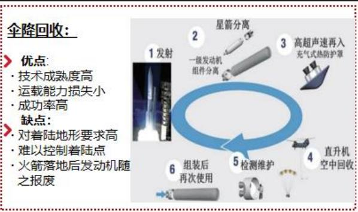

flowchart

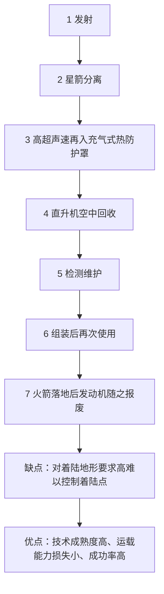
```mermaid
graph TD
    A["1 发射"] --> B["2 星箭分离"]
    B --> C["3 高超声速再入充气式热防护罩"]
    C --> D["4 直升机空中回收"]
    D --> E["5 检测维护"]
    E --> F["6 组装后再次使用"]
    F --> G["7 火箭落地后发动机随之报废"]
    G --> H["缺点：对着陆地形要求高难以控制着陆点"]
    H --> I["优点：技术成熟度高、运载能力损失小、成功率高"]
```

# 带翼飞回：

优点  
·落点精度高，无需搜   
缺点  
目前仍停留在概念涉及阶段  
·增加火箭结构复杂度·运载能力损失大

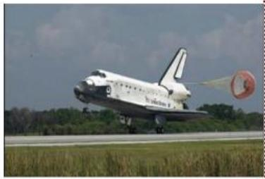

natural_image

Space shuttle landing on runway with a circular object nearby (no visible text or symbols)

垂直回收（以spaceX为例）：  
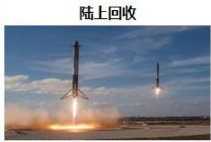

text_image

陆上回收

优点：对火箭设计改动小  
落点精度高  
可回收包括发动机在内的核心部件  
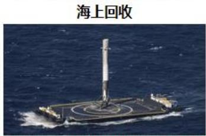

text_image

海上回收

海上回收相较于陆上回收的优势  
·节省燃料，运载能力损失小   
超级筷子”相较于海上回收的优势  
·缩短火箭发射周转周期  
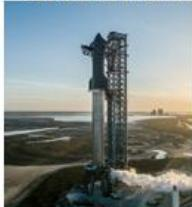

natural_image

Exterior view of a rocket launch tower on a coastal construction site under clear sky (no signage or text visible)

超级筷子  
资料来源：科技产业微观察，界面新闻《首试即成功，SpaceX星舰的“筷子”式回收强在哪？》，爱建证券研究所

# 2.3.2 增材制造（3D 打印）技术

在火箭发动机及其结构件制造中，3D 打印（增材制造）相较传统减材工艺具备工程必然性。1）发动机燃烧室、喷注器、冷却通道等核心部件普遍具有复杂内腔、随形流道和高度一体化结构，采用数控机床等减材加工不仅加工路径受限，难以实现封闭或变截面内腔成形，往往需要多零件分拆加工再焊接，工艺复杂、良率低且一致性差；2）即便在可加工场景下，传统机床对高温合金、难加工材料的切削效率极低，材料去除率小、加工周期长、成本高企。

以 SpaceX 将发动机生产逻辑从传统航天工程范式转向工业化制造为范式，SpaceX 借鉴汽车产业的流水线模式，将发动机视为可高频复制的标准化产品，追求高生产节拍与高度一致性。通过 3D 打印工艺，喷注器面板等集成复杂流道与冷却结构的一体化部件得以直接成型，显著减少零部件数量和装配环节，在实现减重的同时提升了结构可靠性与制造一致性。

图表 32：航天动力装置增材制造应用（部分展示 1）  
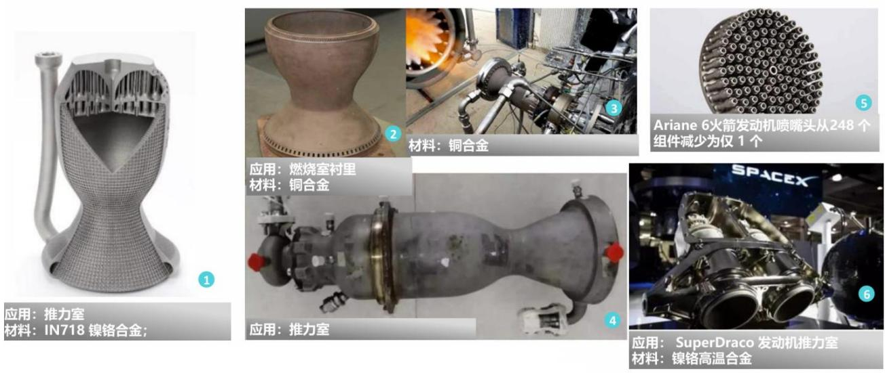  
应用：推力室  
材料：IN718镍铬合金；  
材料：铜合金  
应用：燃烧室衬里  
材料：铜合金  
材料：镍铬高温合金  
资料来源：CellCore & SLM Solutions，NASA，ESA，深蓝航天，铂力特，SpaceX3D 科学谷，爱建证券研究所

图表 33：航天动力装置增材制造应用（部分展示 2）  
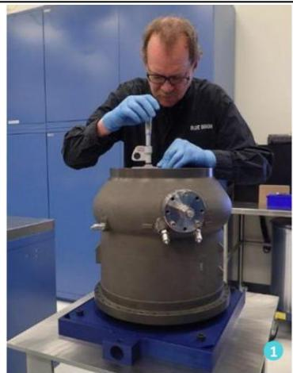

natural_image

Scientist in lab coat and gloves handling a large metallic component on a blue workbench, with blue cabinets in the background (no visible text or symbols)

应用：Ox Boost Pump增压泵

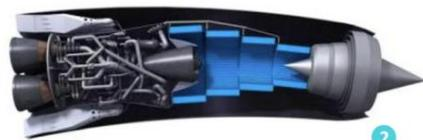

natural_image

Cutaway diagram of a jet engine showing internal components and fluid flow (no text or labels)

应用：3D打印喷油器

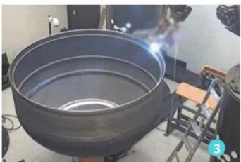

natural_image

Large cylindrical metallic object with a transparent top, placed on a workbench with industrial equipment nearby (no visible text or symbols)

应用：火箭整流罩

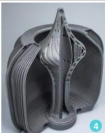

natural_image

3D rendered mechanical component with internal layered structure (no visible text or symbols)

应用：发动机

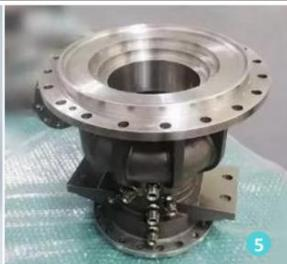

natural_image

Close-up of a metallic mechanical component with flanged ends and bolted joints (no visible text or symbols)

应用：液体火箭发动机涡轮泵

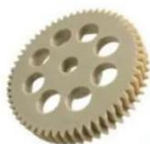  
应用：宇航推进器传动部件  
材料：PEEK  
技术：INTAMSYS远铸智能  
高温材料熔融挤出3D打印技术  
资料来源：Blue Origin，Skylon，Relativity Space，Fraunhofer IWS，宇航推进，INTAMSYS 远铸智能，SpaceX3D 科学谷，爱建证券研究所

# 2.4运载火箭成本下行空间测算与路径推演

从历史演进看，近地轨道单位发射成本下降的关键拐点来自 SpaceX 推动可复用火箭实现商业化。相比航天飞机、德尔塔等传统型号动辄上万美元/kg 的成本区间，Falcon9 已将成本压缩至千美元量级，Starship 已进入百美元级。

火箭降本并非线性过程，而是由关键技术突破触发的阶跃式下降。以猎鹰 9 号为例，通过推进器复用、箭体结构优化、回收方式简化及发动机维护效率提升，其发射成本实现快速下探：在一级推进器价格约 3,000 万美元、二级推进器约 1,000 万美元的情况下，若一级推进器实现 5 次复用，2025 年单次发射对应的火箭硬件成本可降至约1,300 万美元，显著低于全球平均水平。

图表 34：太空发射成本革命  
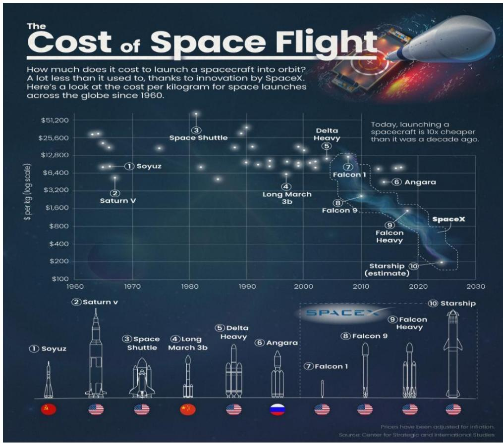

line

| Year | Space Launcher | Cost ($ per kg) |
|------|----------------|-----------------|
| 1960 | Soyuz          | ~$5,000         |
| 1970 | Saturn V       | ~$6,400         |
| 1980 | Space Shuttle   | ~$5,000         |
| 1990 | Long March 3b  | ~$2,500         |
| 2000 | Delta Heavy    | ~$2,000         |
| 2010 | Falcon 1       | ~$1,600         |
| 2020 | Falcon Heavy   | ~$1,200         |
| 2030 | Starship (estimate) | ~$200           |

资料来源：Visual Capitalist，爱建证券研究所

自 2023 年 4 月 20 日首飞以来，SpaceX 星舰沿着关键技术逐步突破，推进可复用降本。 参照其公开测试进展，可对可复用火箭关键技术突破所需时间作出阶段性推演：1）自首发后约 1 年 2 个月：实现推进级受控回收，技术成熟标志为一级助推器完成海上受控溅落；2）自首发后约 1 年 10 个月：实现“夹筷子”式回收的工程化验证，技术成熟信号为助推级多次成功回收；3）截至 2025 年底：飞船级（二级）回收仍未完全成熟，经历约 2 年 5 个月测试后，二级回收技术仍处于持续攻关阶段。

图表 35：SpaceX 星舰综合飞行试验（IFT）情况统计

<table><tr><td>序号</td><td>试飞时间</td><td>原型机</td><td>重点测试内容</td><td>结果</td><td>间隔(天)</td></tr><tr><td>IFT-1</td><td>2023/4/20</td><td>B7/S24</td><td>全面收集火箭、发动机、计算机和地面系统性能等方面数据</td><td>全箭飞离发射台,最大飞行高度9千米;起飞时,3台发动机未启动;起飞后,多台发动机工作异常,速度、高度严重偏离飞行剖面;飞行约4分钟后爆炸解体。</td><td>--</td></tr><tr><td>IFT-2</td><td>2023/11/18</td><td>B9/S25</td><td>全面收集火箭、发动机、计算机和地面系统性能等方面数据;验证级间热分离</td><td>验证了热分离技术;飞船级最大高度达148千米;助推级返回点火后,多发动机异常,引发快速计划外解体;飞行约7分钟后,飞船级按计划排出多余液氧。排气口启动时,星舰后部发生泄漏、起火,星舰解体。</td><td>212</td></tr><tr><td>IFT-3</td><td>2024/3/14</td><td>B10/S28</td><td>验证超重-星舰的“入轨能力”;测试有效载荷舱门的开启和关闭;验证头部贮箱到主贮箱的推进剂转移;尝试发动机在轨重启</td><td>飞船最大高度达到约235千米;首次从太空重返大气层再入;完成有效载荷舱门在轨开关演示;完成在轨推进剂转移演示;助推级着陆点火时发动机提前关机;飞船级返回期间不受控滚转、因此未进行发动机在轨重启;隔热瓦脱落。</td><td>117</td></tr><tr><td>IFT-4</td><td>2024/6/6</td><td>B11/S29</td><td>验证超重-星舰的“返回和重复使用能力”</td><td>两级分别成功返回海上实现受控溅落;上升/返回过程中各有1台发动机异常;前襟翼在返回过程中部分被烧穿;隔热瓦仍有脱落现象。</td><td>84</td></tr><tr><td>IFT-5</td><td>2024/10/13</td><td>B12/S30</td><td>超重助推级返回原场发射塔架回收;星舰飞船级预定位置精准软着陆</td><td>助推级成功返回发射场被“筷子”捕获;飞船级实现精准软着陆;助推级长排罩在返回过程中出现结构破损,脐带接口处起火;助推级返回安全阀值设置错误,险些放弃火箭回收。</td><td>129</td></tr><tr><td>IFT-6</td><td>2024/11/19</td><td>B13/S31</td><td>发动机在轨重启;评估新型隔热瓦和隔热板;评估新的系统设置</td><td>猛禽发动机成功在轨二次启动;飞船级在白天实现精准软着陆;超重助推级被放弃&quot;筷子“捕获</td><td>37</td></tr><tr><td>IFT-7</td><td>2025/1/18</td><td>B14/S33</td><td>尝试一级捕获,二级在印度洋溅落;星链模拟器部署;发动机在轨重启;热防护系统性能</td><td>成功捕获超重助推级;星舰飞船由于推进剂泄漏导致了快速意外解体</td><td>58</td></tr><tr><td>IFT-8</td><td>2025/3/6</td><td>B15/S34</td><td>同上</td><td>实现助推级的“筷子回收”;飞船级失去姿控最终爆炸。</td><td>49</td></tr><tr><td>IFT-9</td><td>2025/5/27</td><td>B14/S35</td><td>首次复用助推级;助推级飞行剖面优化;助推级着陆点火发动机故障冗余能力测试;星链模拟器部署;发动机在轨重启;热防护系统性能</td><td>一级在返回点火时发生异常损毁,未能完成受控降落;飞船虽然工作到了发动机关机,但在滑行段,因主推进剂贮箱泄漏和失压,导致姿态失控,解体</td><td>85</td></tr><tr><td>IFT-10</td><td>2025/8/26</td><td>B16/S37</td><td>助推级飞行剖面优化;助推级着陆点火发动机故障冗余能力测试;星链模拟器部署;发动机在轨重启;热防护系统性能</td><td>实现了全部试验目标</td><td>84</td></tr><tr><td>IFT-11</td><td>2025/10/1</td><td>B12/S30</td><td>同上</td><td>实现了全部试验目标</td><td>48</td></tr></table>

资料来源：中关村商业航天产业联盟，爱建证券研究所

图表 36：猎鹰 9 号一级推进器使用情况

<table><tr><td>箭体</td><td>用途</td><td>首飞时间</td><td>当前状态</td><td>使用次数</td><td>最短周转间隔天数</td><td>平均年复用率</td></tr><tr><td>B1046</td><td>F9一级</td><td>2018-5-11</td><td>2020-01-19 消耗</td><td>4</td><td>88</td><td>1.8</td></tr><tr><td>B1047</td><td>F9一级</td><td>2018-7-22</td><td>2019-08-07 消耗</td><td>3</td><td>117</td><td>2</td></tr><tr><td>B1048</td><td>F9一级</td><td>2018-7-25</td><td>2020-03-18 损毁</td><td>5</td><td>75</td><td>2.4</td></tr><tr><td>B1049</td><td>F9一级</td><td>2018-9-10</td><td>2022-11-23 消耗</td><td>11</td><td>62</td><td>2.4</td></tr><tr><td>B1051</td><td>F9一级</td><td>2019-3-2</td><td>2022-11-12 消耗</td><td>14</td><td>37</td><td>3.6</td></tr><tr><td>B1056</td><td>F9一级</td><td>2019-5-4</td><td>2020-02-17 损毁</td><td>4</td><td>63</td><td>3.8</td></tr><tr><td>B1058</td><td>F9一级</td><td>2020-5-31</td><td>2023-12-27 损毁</td><td>19</td><td>28</td><td>5</td></tr><tr><td>B1059</td><td>F9一级</td><td>2019-12-5</td><td>2021-02-15 损毁</td><td>6</td><td>58</td><td>4.2</td></tr><tr><td>B1060</td><td>F9一级</td><td>2020-7-1</td><td>检修</td><td>17</td><td>27</td><td>4.9</td></tr><tr><td>B1061</td><td>F9一级</td><td>2020-11-15</td><td>检修</td><td>17</td><td>24</td><td>5.2</td></tr><tr><td>B1062</td><td>F9一级</td><td>2020-11-5</td><td>检修</td><td>17</td><td>22</td><td>5.2</td></tr><tr><td>B1063</td><td>F9一级</td><td>2020-11-21</td><td>检修</td><td>15</td><td>36</td><td>4.7</td></tr><tr><td>B1067</td><td>F9一级</td><td>2021-6-3</td><td>检修</td><td>15</td><td>35</td><td>5.8</td></tr><tr><td>B1069</td><td>F9一级</td><td>2021-12-21</td><td>检修</td><td>12</td><td>41</td><td>5.5</td></tr><tr><td>B1071</td><td>F9一级</td><td>2022-2-2</td><td>检修</td><td>13</td><td>27</td><td>6.6</td></tr><tr><td>B1073</td><td>F9一级</td><td>2022-5-14</td><td>检修</td><td>11</td><td>35</td><td>6.7</td></tr><tr><td>B1075</td><td>F9一级</td><td>2023-1-19</td><td>检修</td><td>8</td><td>34</td><td>7.5</td></tr><tr><td>B1076</td><td>F9一级</td><td>2022-11-26</td><td>检修</td><td>9</td><td>26</td><td>8</td></tr><tr><td>B1077</td><td>F9一级</td><td>2022-10-5</td><td>检修</td><td>9</td><td>29</td><td>6.9</td></tr><tr><td>B1078</td><td>F9一级</td><td>2023-3-2</td><td>检修</td><td>6</td><td>37</td><td>6.7</td></tr><tr><td>B1080</td><td>F9一级</td><td>2023-5-21</td><td>检修</td><td>4</td><td>40</td><td>7.1</td></tr><tr><td>B1081</td><td>F9一级</td><td>2023-8-26</td><td>检修</td><td>3</td><td>39</td><td>6.3</td></tr></table>

资料来源：《猎鹰9号火箭发射及箭体复用的分析》-刘敏华，爱建证券研究所

从猎鹰 9 号的推进器使用情况统计结果和星舰的综合飞行试验（IFT）情况来看，可以合理推断：①典型可回收火箭的年均复用率从 1.8 次左右逐渐提高到成熟阶段的 8 次左右；②典型可回收火箭的发动机使用次数从 3 次逐渐提升到成熟阶段 10 次以上；③火箭二级推进器的回收复用难度较大，猎鹰 9 号与星舰都难以达到成熟阶段，在远期的 2030 年以后中国典型运载火箭有实现二子级复用的可能性。

鉴于中国可回收火箭在总体技术路线与工程实现路径上与猎鹰 9 较为接近，本文在降本测算中以猎鹰 9 号作为主要参考对象，并在不同阶段引入关键技术变量。 影响火箭降本速度的核心应用技术主要包括四个重要核心工艺：1）火箭推进器回收复用工艺：一级及二级推进器是否实现可回收复用；2）火箭箭体材料工艺：箭体结构材料是否由铝合金向不锈钢演进；3）火箭回收方式工艺：回收方式采用腿式回收或“夹筷子式”回收。4）发动机翻修工艺：发动机翻修成本水平及维护间隔周期。

火箭推进器回收复用工艺是火箭降本的首要来源，各工艺逐步实现是降本的重要影响因素。在测算中，我们假设典型可回收复用火箭一级、二级推进器复用能力按阶段提升，由早期3 次左右提升到后期 10 次以上，整个测算过程取平均值 10 次，各降本工艺逐步应用：①一次性发射时期（2025）：火箭推进器一次性使用；②一子级复用实现期（2026E）：火箭推进器一子级初步实现复用；③不锈钢箭体实现时期（2027E）：箭体材料升级为不锈钢；④“夹筷子”回收方式实现期（2028E）：回收方式由着陆腿式回收变更为“夹筷子”式回收；⑤二子级复用实现期（2030 年以后）：火箭二子级实现 3 次复用。

发动机维修效率提升是高频发射与持续降本关键，甲烷路线具备明显优势。火箭发动机推进剂将完成由液氧/煤油向液氧/甲烷切换，由于甲烷燃烧几乎不产生积碳，发动机维修工序显著简化，翻新成本与周转时间同步下降。根据猎鹰 9 号实际发射节奏测算，发动机维修周期已由早期接近一年缩短至 1 个月，维修时间成本下降约 90%，直接提升年发射频率并进一步摊薄固定成本。

图表 37：典型可回收复用火箭发射成本降本路线推演

<table><tr><td rowspan="2">单位:万元</td><td rowspan="2">占比</td><td>一次性发射</td><td>一子级复用</td><td>不锈钢箭体</td><td>“夹筷子”回收方式</td><td>二子级复用</td></tr><tr><td>2025</td><td>2026E</td><td>2027E</td><td>2028年以后</td><td>2030年以后</td></tr><tr><td>初始情况:</td><td></td><td></td><td></td><td></td><td></td><td></td></tr><tr><td>基本硬件</td><td></td><td>89,100</td><td>89,100</td><td>89,100</td><td>89,100</td><td>89,100</td></tr><tr><td>一级推进器成本</td><td>60%</td><td>59,400</td><td>59,400</td><td>59,400</td><td>59,400</td><td>59,400</td></tr><tr><td>二级推进器成本</td><td>20%</td><td>19,800</td><td>19,800</td><td>19,800</td><td>19,800</td><td>19,800</td></tr><tr><td>整流罩等</td><td>10%</td><td>9,900</td><td>9,900</td><td>9,900</td><td>9,900</td><td>9,900</td></tr><tr><td>服务维护</td><td></td><td>9,900</td><td>9,900</td><td>9,900</td><td>9,900</td><td>9,900</td></tr><tr><td>燃料</td><td>0.80%</td><td>792</td><td>792</td><td>792</td><td>792</td><td>792</td></tr><tr><td>发射测控、回收翻修</td><td>9.20%</td><td>9,108</td><td>9,108</td><td>9,108</td><td>9,108</td><td>9,108</td></tr><tr><td>初始单次发射总成本(万)</td><td></td><td>99,000</td><td>99,000</td><td>99,000</td><td>99,000</td><td>99,000</td></tr><tr><td>降本路径:</td><td>降本占比</td><td></td><td></td><td></td><td></td><td></td></tr><tr><td>可回收降本</td><td>-67.3%</td><td>-</td><td>-53,460</td><td>-53,460</td><td>-53,460</td><td>-66,660</td></tr><tr><td>一级复用降本(假设10次复用)</td><td>-54.0%</td><td></td><td>-53,460</td><td>-53,460</td><td>-53,460</td><td>-53,460</td></tr><tr><td>二级复用降本(假设3次复用)</td><td>-13.3%</td><td></td><td></td><td></td><td></td><td>-13,200</td></tr><tr><td>有效荷载机会成本降低</td><td>-23.1%</td><td>-</td><td>-</td><td>-10,800</td><td>-22,858</td><td>-22,858</td></tr><tr><td>箭体材料工艺</td><td>-10.9%</td><td></td><td></td><td>-10,800</td><td>-10,800</td><td>-10,800</td></tr><tr><td>增加隔热层造成的相对运力损失(t)</td><td></td><td></td><td></td><td>3.6</td><td>3.6</td><td>3.6</td></tr><tr><td>有效载荷机会成本</td><td></td><td></td><td></td><td>-10,800</td><td>-10,800</td><td>-10,800</td></tr><tr><td>回收方式工艺</td><td>-12.2%</td><td></td><td></td><td></td><td>-12,058</td><td>-12,058</td></tr><tr><td>着陆腿造成的相对运力损失(t)</td><td></td><td></td><td></td><td></td><td>4</td><td>4</td></tr><tr><td>有效载荷机会成本</td><td></td><td></td><td></td><td></td><td>-12,000</td><td>-12,000</td></tr><tr><td>回收硬件单次成本</td><td></td><td></td><td></td><td></td><td>-58</td><td>-58</td></tr><tr><td>最终情况:</td><td></td><td></td><td></td><td></td><td></td><td></td></tr><tr><td>单次发射总成本(万元)</td><td></td><td>99,000</td><td>45,540</td><td>34,740</td><td>22,682</td><td>9,482</td></tr><tr><td>LEO轨道运载能力(t)</td><td></td><td>18.0</td><td>18.0</td><td>18.0</td><td>18.0</td><td>18.0</td></tr><tr><td>发射成本(万元/kg)</td><td></td><td>5.5</td><td>2.5</td><td>1.9</td><td>1.3</td><td>0.5</td></tr></table>

资料来源：AZSPACE太空实验室，航空产业网，环球航天资讯，甲子光年，爱建证券研究所测算  
注：考虑到二级推进器回收技术困难程度，前三阶段不引入二级推进器回收复用的情况，因此二级推进器维修成本为零

# 借鉴猎鹰 9 号的降本路径与星舰测试进展，我们对中国火箭发射成本下降节奏进行情景推演。

1）一次性发射时期（2025 年）：单次发射成本约 9.9 亿元，对应单位成本约 5.5 万元/kg；

2）一子级复用实现期（2026 年）：对应猎鹰 9 号一子级回收技术成熟阶段，假设一子级复用次数逐步成熟并稳定在 10 次，单位入轨成本降至约 2.5 万元/kg，较 2025年下降约 54%；

3）不锈钢箭体实现期（2027 年）：假设 4 米级运载火箭 LEO 轨道运力 18 吨、初始单位入轨成本 5.5 万元/kg，一子级复用次数由早期 3 次提升至 10 次以上，测算期内取平均复用次数 10 次；载荷机会成本统一假设为 3 万元/kg。该阶段火箭进入整体升级迭代期，不锈钢箭体凭借更高耐热性与结构强度，可降低回收过程中的燃料与隔热需求，具备逐步推广应用的基础。相较之下，铝合金箭体在回收过程中需额外消耗约20 吨燃料，对应有效运力损失约 20%，在 18 吨 LEO 运力假设下单次发射运力损失约3.6 吨，按 3万元/kg 测算隐含载荷机会成本约 1.08 亿元，不锈钢箭体更具优势。

4）“夹筷子”回收方式实现期（2028 年以后）：假设回收方式由传统着陆腿切换为“夹筷子式”回收，对标 SpaceX 星舰的技术演进路径。该模式下无需全程携带着陆腿等回收结构，可减少约 4 吨结构重量，从而改善有效载荷能力。在上述假设下，单次发射总成本降至约 2.27 亿元，对应单位入轨成本约 1.3 万元/kg。若采用着陆腿方案，额外 4 吨结构重量将侵蚀有效载荷，按 3 万元/kg 测算对应载荷机会成本约 1.2亿元，“夹筷子”回收方式在经济性上具备相对优势；

5）二子级复用实现期（2030 年以后）：对应 SpaceX 尚未完全实现的二子级成熟复用阶段，假设二子级平均复用次数为3 次。该阶段，二子级制造成本与有效载荷机会成本进一步摊薄，单次发射总成本有望降至约 0.94 亿元，对应单位入轨成本约0.5 万元/kg。

图表 38：中国典型可回收火箭降本路径推演  
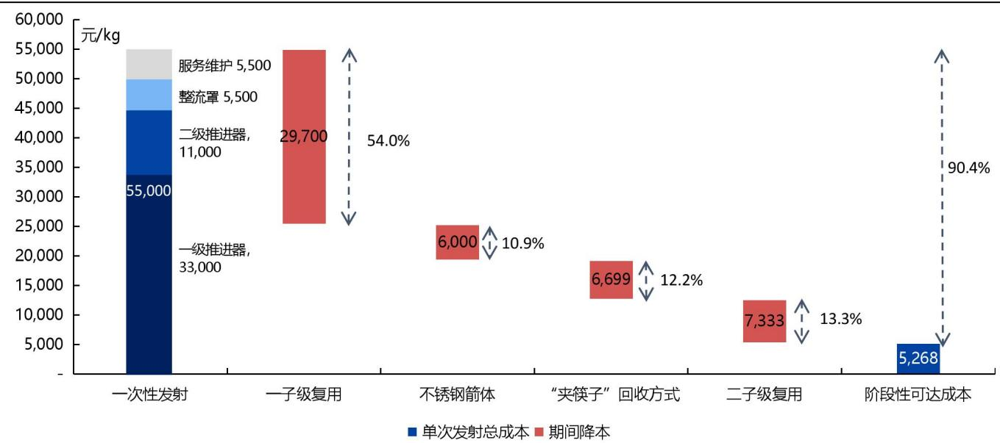

bar_stacked

| 类别 | 单次发射总成本 (元/kg) | 期间降本 (%) |
|---|---|---|
| 一次性发射 | 55,000 | 5,500 |
| 一子级复用 | 29,700 | 11,000 |
| 服务维护 | 33,000 | 5,500 |
| 整流罩 | 25,000 | 5,500 |
| 二级推进器 | 25,000 | 5,500 |
| 不锈钢箭体 | 20,000 | 6,000 |
| “夹筷子”回收方式 | 18,000 | 6,699 |
| 二子级复用 | 12,000 | 7,333 |
| 阶段性可达成本 | 5,268 | 13.3% |
| 服务维护 | 25,000 | 54.0% |
| 一级推进器 | 25,000 | 54.0% |
| 服务维护 | 25,000 | 54.0% |
| 一级推进器 | 25,000 | 54.0% |
| 二级推进器 | 25,000 | 54.0% |
| 二级推进器 | 25,000 | 54.0% |
| 二级推进器 | 25,000 | 54.0% |
| 二级推进器 | 25,000 | 54.0% |
| 二级推进器 | 25,000 | 54.1% |
| 二级推进器 | 25,000 | 54.1% |
| 二级推进器 | 25,000 | 54.1% |
| 二级推进器 | 25,000 | 54.1% |
| 二级推进器 | 25,000 | 54.1% |
| 二级推进器 | 25,000 (未标注) | - |
| 二级推进器 | 25,000 (未标注) | - |
| 二级推进器 | 25,000 (未标注) | - |
| 二级推进器 | 25,000 (未标注) | - |
| 二级推进器 | 25,000 (未标注) | - |
| 二级推进器 | 25,000 (未标注) | 90.4% |
The chart displays a single bar for the '一次发射总成本' and '一子级复用', which are labeled with Chinese characters and percentages respectively. The '阶段性可达成本' is also shown in red text but not explicitly labeled on the bars.

资料来源：航空产业网，经济观察报，澎湃新闻，爱建证券研究所测算

# 3. 中国火箭产业链会如何重构？

火箭产业链上游关键材料与核心元器件环节集中度较高，整体仍由国家体系主导，民营企业主要在局部工艺和细分产品中逐步形成差异化优势；整箭制造环节长期由国家队掌控，中大型运载火箭仍是核心技术路线。部分民营企业通过差异化路径实现突破，在可重复使用等新方向率先落地，例如蓝箭航天已完成可回收火箭的工程化验证。随着中长期发射需求持续放量，行业竞争重心有望由单点能力转向体系效率，推动产业链协同水平提升，横向整合与纵向延伸并行，为火箭产业商业化与规模化发展奠定基础。

展望火箭产业商业化进程中的盈利模式演进，我们认为，率先实现可复用等关键技术的企业，更有可能在商业化初期获得溢价并形成相对主导地位。原因在于，运载能力、可靠性及可重复使用水平直接决定发射成本与交付确定性，技术成熟度较高的企业在发射频次提升与规模化生产过程中，更易实现成本摊薄与效率提升。相应地，率先跑通可复用技术路线的企业（如蓝箭航天），在发射能力与任务密度提升带动下，其发动机、结构件、材料及测试等供应链核心环节有望优先受益。

图表 39：中国火箭产业链图谱  
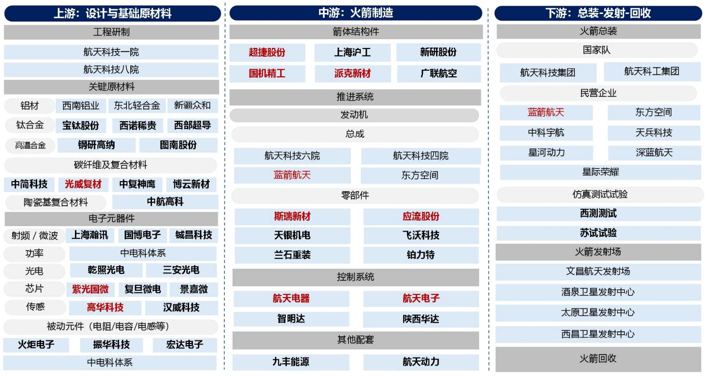

text_image

上游：设计与基础原材料
工程研制
航天科技一院
航天科技八院
关键原材料
铝材 西南铝业 东北轻合金 新疆众和
钛合金 宝钛股份 西诺稀贵 西部超导
高温合金 钢研高纳 图南股份
碳纤维及复合材料
中简科技 光威复材 中复神鹰 博云新材
陶瓷基复合材料 中航高科
电子元器件
射频/微波 上海瀚讯 国博电子 铖昌科技
功率 中电科体系
光电 乾照光电 三安光电
芯片 紫光国微 复旦微电 景嘉微
传感 高华科技 汉威科技
被动元件（电阻/电容/电感等）
火炬电子 振华科技 宏达电子
中电科体系
中游：火箭制造
箭体结构件
超捷股份 上海沪工 新研股份
国机精工 派克新材 广联航空
推进系统
发动机
总成
航天科技六院 航天科技四院
蓝箭航天 东方空间
零部件
斯瑞新材 应流股份
天银机电 飞沃科技
兰石重装 铂力特
控制系统
航天电器 航天电子
智明达 陕西华达
其他配套
九丰能源 航天动力
下游：总装-发射-回收
火箭总装
国家队
航天科技集团 航天科工集团
民营企业
蓝箭航天 东方空间
中科宇航 天兵科技
星河动力 深蓝航天
星际荣耀
仿真测试试验
西测测试
苏试试验
火箭发射场
文昌航天发射场
酒泉卫星发射中心
太原卫星发射中心
西昌卫星发射中心
火箭回收

资料来源：各公司公告，华东装备信息技术研究院公众号，爱建证券研究所整理  
注：标红为已明确披露的蓝箭航天供应链企业（仅部分统计）

# 3.1一次性火箭产业链特征：高度分散、国家主导

发射需求不足、技术难度高共同限制了发射频次提升，发射频次不足又导致规模效应难以形成，单位成本长期居高不下，导致航天需求无法完全释放。在这一结构下，产业链难以从任务型工程交付转向规模化制造。

当前中国火箭产业链中市场化主体占比仍然有限，即便以有限公司形式存在的企业，其市场化程度亦有待提升，行业整体仍处于商业化门槛较高的基础发展阶段。

图表 40：液体火箭生产测试产业链部分参与单位

<table><tr><td>产业链环节</td><td>主要参与单位</td><td>是否有限公司形式</td></tr><tr><td rowspan="2">伺服电机</td><td>北京精密机电控制设备研究所</td><td></td></tr><tr><td>南京晨光机器厂</td><td></td></tr><tr><td rowspan="5">箭载计算机</td><td>山东航天电子技术研究所</td><td></td></tr><tr><td>北京计算机技术及应用研究所</td><td></td></tr><tr><td>西安微电子技术研究所</td><td></td></tr><tr><td>北京微电子技术研究所</td><td></td></tr><tr><td>上海航天计算机技术研究所</td><td></td></tr><tr><td rowspan="5">液体火箭贮箱</td><td>首都航天机械有限公司</td><td>√</td></tr><tr><td>成都长征机械厂</td><td></td></tr><tr><td>上海航天设备制造总厂有限公司</td><td>√</td></tr><tr><td>上海航天精密机械研究所</td><td></td></tr><tr><td>法国液化空气集团</td><td>√</td></tr><tr><td rowspan="3">惯组</td><td>北京航天控制仪器研究所</td><td></td></tr><tr><td>西安航天精密机电研究所</td><td></td></tr><tr><td>北京自动化控制设备研究所</td><td></td></tr><tr><td rowspan="2">液体发动机测试</td><td>西安动力试验技术研究所</td><td></td></tr><tr><td>北京动力试验技术研究所</td><td></td></tr><tr><td rowspan="5">箭体结构</td><td>首都航天机械有限公司</td><td>√</td></tr><tr><td>天津航天长征火箭制造有限公司</td><td>√</td></tr><tr><td>上海航天设备制造总厂</td><td></td></tr><tr><td>天津爱思达航天科技有限公司</td><td>√</td></tr><tr><td>北京航天衡科技有限公司</td><td>√</td></tr><tr><td rowspan="5">火箭总装</td><td>首都航天机械有限公司</td><td>√</td></tr><tr><td>天津航天长征火箭制造有限公司</td><td>√</td></tr><tr><td>西安航天化学动力厂</td><td></td></tr><tr><td>成都长征机械厂</td><td></td></tr><tr><td>上海航天设备制造总厂有限公司</td><td>√</td></tr></table>

资料来源：艾瑞咨询，爱建证券研究所

当前我国运载火箭仍然由国家队主导、民营火箭参与度在不断提升。1）国家队以航天科技、航天科工两大集团为主，在固体燃料、发射场、客户资源等方面具有明显优势。2）民营公司凭借自身灵活优势近年来取得不断进展，其中星际荣耀、蓝箭航天、星河动力、天兵科技、东方空间等以整箭生产为主，而九州云箭等专注于生产火箭发动机。中科宇航和科工火箭采用混合制，其中中科宇航依托中科科学院，科工火箭依托航天科工集团，均实现固体火箭技术完善且多次发射。

图表 41：中国商业航天市场参与主体  
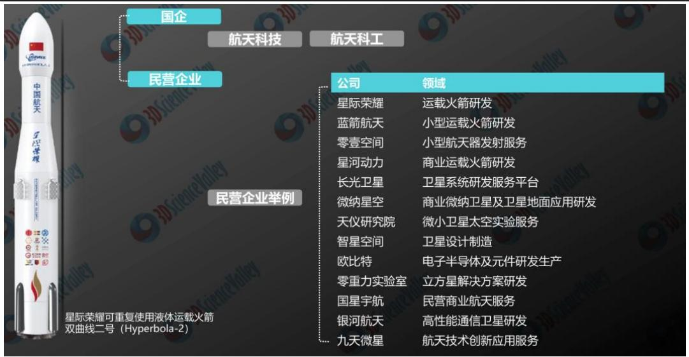

text_image

国企
航天科技 航天科工
民营企业
民营企业举例
星际荣耀可重复使用液体运载火箭双曲线二号（Hyperbola-2）
公司 领域
星际荣耀 运载火箭研发
蓝箭航天 小型运载火箭研发
零壹空间 小型航天器发射服务
星河动力 商业运载火箭研发
长光卫星 卫星系统研发服务平台
微纳星空 商业微纳卫星及卫星地面应用研发
天仪研究院 微小卫星太空实验服务
智星空间 卫星设计制造
欧比特 电子半导体及元件研发生产
零重力实验室 立方星解决方案研发
国星宇航 民营商业航天服务
银河航天 高性能通信卫星研发
九天微星 航天技术创新应用服务

资料来源：3D 科学谷，爱建证券研究所

资料来源：各公司官网，爱建证券研究所整理  
图表 42：我国代表性商业火箭公司及其主要业务

<table><tr><td>成立时间</td><td>公司名称</td><td>主要业务</td><td>重要进展</td><td>技术路线</td></tr><tr><td>2016年</td><td>星际荣耀</td><td>研发优秀的商业运载火箭并提供系统性的发射解决方案</td><td>2019年,成功完成双曲线一号的入轨发射;2020年,液氧甲烷火箭发动机焦点一号成功试车;2023年7月,双曲线2号验证火箭动力系统试车圆满成功。</td><td>小固体+甲烷</td></tr><tr><td>2015年</td><td>蓝箭航天</td><td>致力于研制以液氧甲烷作为推进剂的中大型运载火箭系列产品。</td><td>2018年10月,国内首枚由其研发的民营运载火箭朱雀一号完成首飞;2019年“天鹊”(TQ-12)80吨液氧甲烷发动机试车圆满成功,标志中国民营航天企业大推力液体火箭发动机产品“零的突破”;2023年7月1日,蓝箭航天研制的朱雀二号遥二液氧甲烷运载火箭发射成功,成为全球首枚成功入轨的液氧甲烷火箭。</td><td>甲烷</td></tr><tr><td>2018年</td><td>星河动力</td><td>主要从事低成本商业航天发射业务的民营航天公司。致力于研发下一代可重复使用的商业运载火箭。</td><td>2020年11月,成功发射谷神星一号运载火箭,是中国民营商业火箭首次进入500km太阳同步轨道;2021年12月7日,谷神星一号遥二运载火箭成功实现一箭五星发射,成为中国首家连续成功发射入轨的民营企业;2022年3月,50吨级液氧煤油火箭发动机首次全系统试车成功;2023年9月5日,谷神星一号海遥一运载火箭成功实现一箭四星发射,成为中国首家海上成功发射入轨的民营企业。</td><td>小固体+煤油</td></tr><tr><td>2015年</td><td>天兵科技</td><td>主要开展新一代液体火箭发动机及中大型液体运载火箭的研制。</td><td>2023年4月,天兵科技天龙二号首飞成功,是我国首次实现箭体产品大规模重复使用。</td><td>煤油</td></tr><tr><td>2020年</td><td>东方空间</td><td>运载火箭和新型空天运输工具设计制造服务公司,打造一次性使用、可回收重复使用和载人飞行等空天运输产品。</td><td>2023年东方空间在东方航天港自主设计和组织实施了两次“引力-1号”运载火箭助推分离试验并取得成功,是国内首次商业航天助推分离试验。</td><td>捆绑固体+煤油</td></tr><tr><td>2017年</td><td>九州云箭</td><td>是集液体动力系统设计研发、装配测试、配套飞行全流程服务为一体的国家高新技术企业。</td><td>2023年7月,公司自主研发的龙云发动机完成首轮可靠性热试车考核。</td><td>甲烷</td></tr><tr><td>2018年</td><td>中科宇航</td><td>国内首家混合所有制商业航天火箭企业,覆盖了系列化运载火箭研发、定制化宇航发射、亚轨道太空旅游等业务范围。</td><td>2023年6月,中科宇航成功发射力箭一号遥二运载火箭,将26颗卫星送入轨道,创下了我国一箭多星发射的新纪录;2023年10月,中科宇航中型液体运载火箭力箭二号使用的80L碳纤维复合高压气瓶完成了验收级和鉴定级振动试验。</td><td>大固体+煤油</td></tr><tr><td>2016年</td><td>科工火箭</td><td>是航天科工四院为顺应国家军民融合战略,抢抓市场发展机遇而成立的国内首家专业提供商业航天发射服务的公司,填补了中国固体运载火箭商业化的空白。</td><td>2023年3月,快舟一号甲固体运载火箭以“一箭四星”方式在酒泉卫星发射中心点火升空,将所属系统公司研制的遥感探测卫星天目一号气象星座03-06星送入预定轨道;2023年7月,将天目一号气象星座07-10星送入预定轨道。</td><td>甲烷</td></tr></table>

图表 43：中国主要民营企业代表火箭参数

<table><tr><td>公司</td><td>火箭名称</td><td>首飞日期</td><td>发动机</td><td>燃料类型</td><td>发动机推力</td><td>重复使用</td><td>LEO 运力</td></tr><tr><td rowspan="2">星际荣耀</td><td>双曲线1号</td><td>2019年</td><td>1台GT-1发动机</td><td>丁羟三组元燃料</td><td>550千牛</td><td>不可</td><td>0.3t</td></tr><tr><td>双曲线2号</td><td>2023年</td><td>9台焦点一号发动机</td><td>液氧甲烷燃料</td><td>882千牛</td><td>可</td><td>1.9t</td></tr><tr><td>深蓝航天</td><td>星云-1</td><td>预计2026年</td><td>9台雷霆-R1发动机</td><td>液氧煤油燃料</td><td>200千牛</td><td>可</td><td>2t</td></tr><tr><td rowspan="2">星河动力</td><td>谷神星1号</td><td>2020年</td><td>1台光年GS-1发动机</td><td>固体燃料</td><td>588千牛</td><td>不可</td><td>0.4t</td></tr><tr><td>智神星1号</td><td>预计2026年</td><td>7台苍穹发动机</td><td>液氧煤油燃料</td><td>490千牛</td><td>可</td><td>5t</td></tr><tr><td>蓝箭航天</td><td>朱雀2号</td><td>2023年</td><td>4台天鹊12发动机</td><td>液氧甲烷燃料</td><td>784千牛</td><td>不可</td><td>6t</td></tr><tr><td>东方空间</td><td>引力1号</td><td>2024年</td><td>1台SR-2500固体发动机</td><td>固体燃料</td><td>600千牛</td><td>不可</td><td>4t</td></tr><tr><td>中科宇航</td><td>力箭1号</td><td>2023年</td><td>1台SP70固体发动机</td><td>固体燃料</td><td>2066.8千牛</td><td>不可</td><td>2t</td></tr><tr><td>天兵科技</td><td>天龙2号</td><td>2023年</td><td>3台YF-102发动机</td><td>液氧煤油燃料</td><td>630.89千牛</td><td>可</td><td>2t</td></tr></table>

资料来源：卫星百科，GlobalTimes，各公司官网，商业航天er 公众号，爱建证券研究所整理

# 3.2火箭供应链生产方式革新，系统性推动效率提升

以蓝箭航天“朱雀”系列火箭生产工艺流程为例，火箭供应链：1）采购端高度分散：标准件采购，外协采购（零部件），总装直属件采购等多条采购链路并行，供应商层级多、接口复杂。2）制造端模块化但独立运作：导管、阀门、涡轮泵、推力室分别形成独立生产任务，各自完成加工、装配与性能试验后入库，模块之间信息与节拍并未强耦合。3）总装是“被动接收式”，关键件延期易引发总装停线并放大生产风险。

图表 44：蓝箭航天“朱雀”系列液氧甲烷运载火箭生产工艺流程  
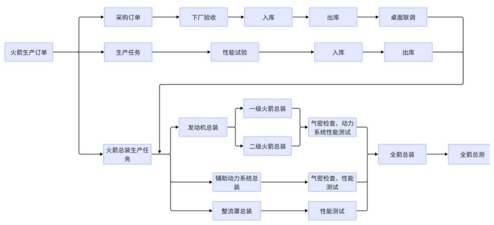

flowchart

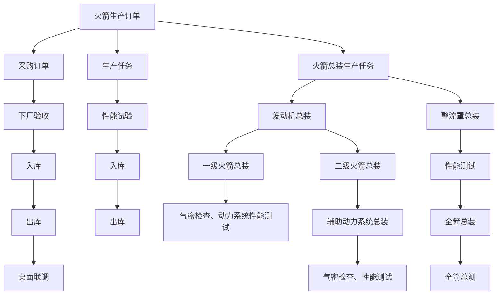
```mermaid
graph TD
    A["火箭生产订单"] --> B["采购订单"]
    A --> C["生产任务"]
    A --> D["火箭总装生产任务"]
    B --> E["下厂验收"]
    E --> F["入库"]
    F --> G["出库"]
    G --> H["桌面联调"]
    C --> I["性能试验"]
    I --> J["入库"]
    J --> K["出库"]
    D --> L["发动机总装"]
    L --> M["一级火箭总装"]
    L --> N["二级火箭总装"]
    M --> O["气密检查、动力系统性能测试"]
    N --> P["辅助动力系统总装"]
    P --> Q["气密检查、性能测试"]
    D --> R["整流罩总装"]
    R --> S["性能测试"]
    S --> T["全箭总装"]
    T --> U["全箭总测"]
```

资料来源：蓝箭航天招股说明书，爱建证券研究所

面向规模化生产需求，脉动式生产线是火箭制造实现效率跃升的最优方案。以某中型液体火箭年产 10 发、需完成助推器 40 个为例，按全年有效工作日 250 天计算，脉动式生产线通过节拍同步与站位均衡设计，将生产节拍精确控制在 6 天/个，相较传统总装节拍约 8–9 天/个（基于行业常见总装周期）提升了约 25%–30%。在该脉动模式下，以总装节拍为核心划分四个连续站位，各站位作业时间与节拍一致，有效避免了传统单一工位集中作业的等待与滞后；壳段、发动机等独立部件装配通过缓冲区支撑，不构成主流程约束。针对贮箱装配难点，将贮箱总装纳入主脉动流程，并将对接作业从单一站位拆分为站位 2（前后箱对接）、站位 3（中段对接）与站位 4（全箭对接），从而实现装配流程的节拍化、高效化推进。

图表 45：助推器脉动式总装站位划分  
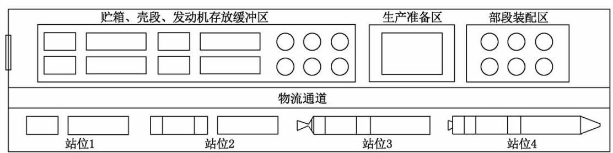

flowchart

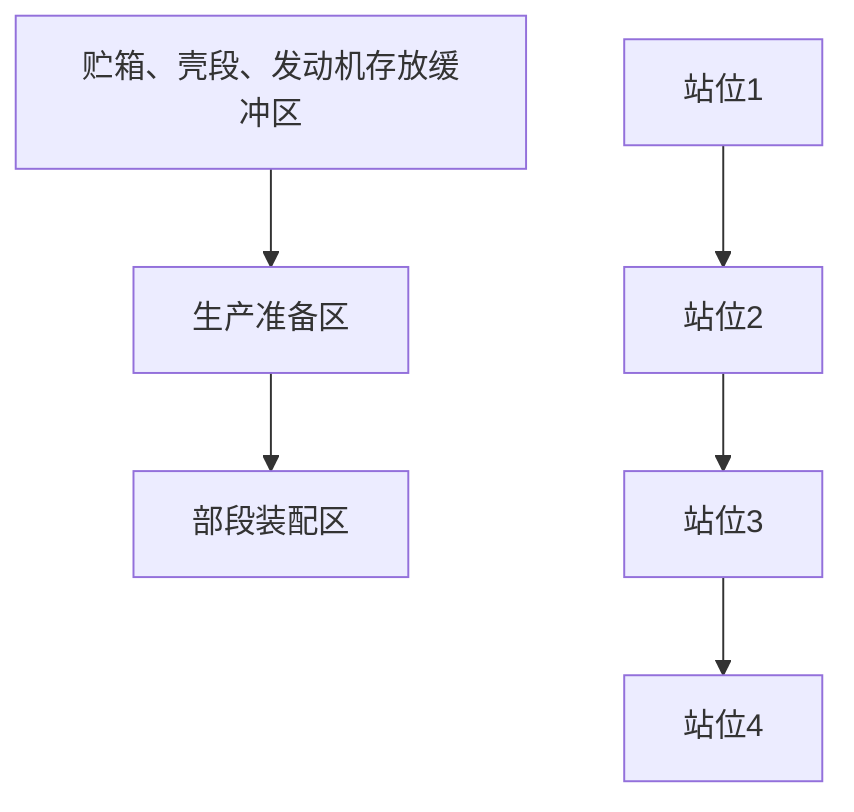
```mermaid
graph TD
    A["贮箱、壳段、发动机存放缓冲区"] --> B["生产准备区"]
    B --> C["部段装配区"]
    D["站位1"] --> E["站位2"]
    E --> F["站位3"]
    F --> G["站位4"]
```

资料来源：《火箭助推器脉动式总装生产线关键技术探讨》国冰等，爱建证券研究所

火箭制造正经历从高度定制化向通用化、标准化和工业化的深刻转型。早期火箭以任务为中心进行“单件定制”，大量零部件专门设计、专门制造，成本高昂、效率低下。随着商业航天发展，行业逐步意识到，通过提升通用化和批量化水平，可以显著降低制造成本并提升生产效率。

图表 46：由定制走向工业化，成本在逐渐下降  
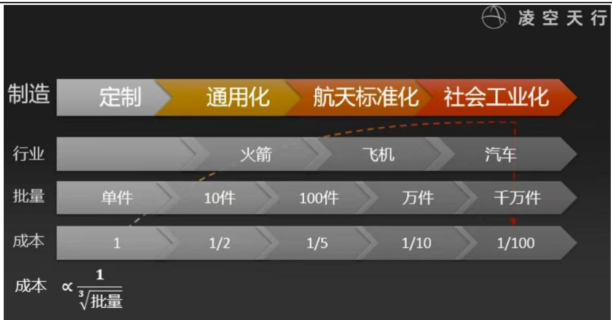

flowchart

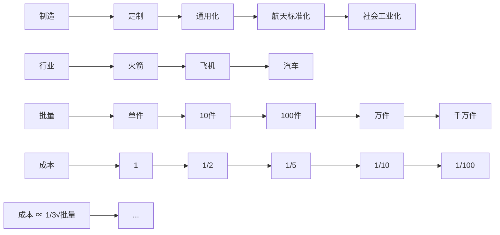
```mermaid
graph LR
    A["制造"] --> B["定制"]
    B --> C["通用化"]
    C --> D["航天标准化"]
    D --> E["社会工业化"]
    
    F["行业"] --> G["火箭"]
    G --> H["飞机"]
    H --> I["汽车"]
    
    J["批量"] --> K["单件"]
    K --> L["10件"]
    L --> M["100件"]
    M --> N["万件"]
    N --> O["千万件"]
    
    P["成本"] --> Q["1"]
    Q --> R["1/2"]
    R --> S["1/5"]
    S --> T["1/10"]
    T --> U["1/100"]
    
    V["成本 ∝ 1/3√批量"] --> W["..."]
```

资料来源：致未来 CTALK，凌空天行，爱建证券研究所

# 4. 商业航天产业投资

# 4.1SpaceX估值成长启示录：由发射服务向空间扩展平台演进

从估值演进看，SpaceX 的价值跃升大致经历了三次关键里程碑：

第一阶段（2019-2023 年），随着星链项目正式启动并持续组网，商业模式从单一发射服务向“发射+卫星互联网”延展；

第二阶段（2023–2025 年），星链完成初步组网并开始验证商业化可行性，现金流与长期增长逻辑逐步清晰，估值水平显著上移；

第三阶段（2025–至今），伴随星舰在可复用技术上的关键突破（如“筷子夹”回收）、超高频次飞行能力逐步兑现，并叠加太空基础设施（如在轨算力、月球基地等）远期想象空间，市场对其技术平台化与长期增长潜力的定价明显重估，推动估值进入新一轮快速扩张阶段。

图表 47：SpaceX 估值演进历程  
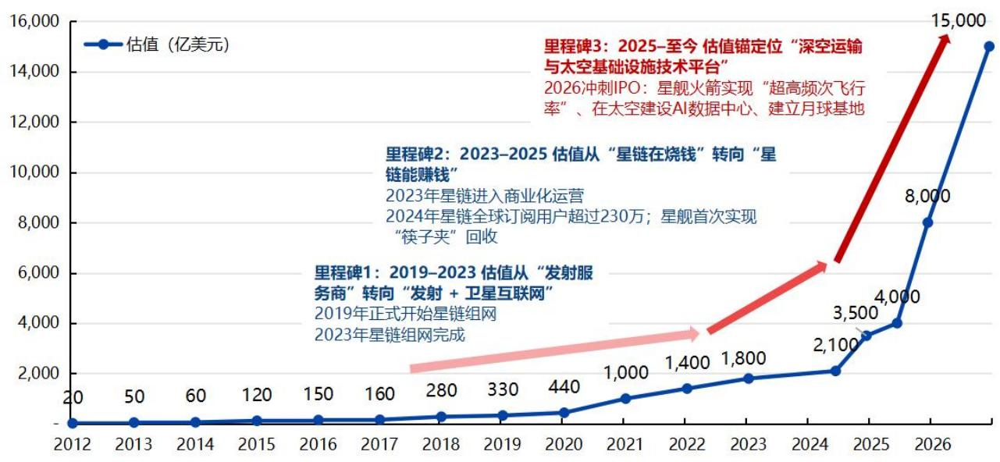

line

| Year | 估值 (亿美元) |
|---|---|
| 2012 | 20 |
| 2013 | 50 |
| 2014 | 60 |
| 2015 | 120 |
| 2016 | 150 |
| 2017 | 160 |
| 2018 | 280 |
| 2019 | 330 |
| 2020 | 440 |
| 2021 | 1,000 |
| 2022 | 1,400 |
| 2023 | 1,800 |
| 2024 | 2,100 |
| 2025 | 3,500 |
| 2026 | 8,000 |
| 2026-至今估值锚定位“深空运输与太空基础设施技术平台”
里程碑3：2025-至今估值锚定位“深空运输与太空基础设施技术平台”
里程碑2：2023-2025估值从“星链在烧钱”转向“星链能赚钱”
2023年星链进入商业化运营
2024年星链全球订阅用户超过230万；星舰首次实现“筷子夹”回收
里程碑1：2019-2023估值从“发射服务商”转向“发射+卫星互联网”
2019年正式开始星链组网
2023年星链组网完成
里程碑3：2025-至今估值锚定位“深空运输与太空基础设施技术平台”
里程碑3：2026冲刺IPO：星舰火箭实现“超高频次飞行率”、在太空建设AI数据中心、建立月球基地
里程碑1：2019-2023估值从“发射服务商”转向“发射+卫星互联网”
里程碑1：2023年星链组网
里程碑1：2026-至今估值锚定位“深空运输与太空基础设施技术平台”
里程碑1：2026-至今估值锚定位“高频次飞行率”、在太空建设AI数据中心、建立月球基地
里程碑1：2019-2023估值从“发射服务商”转向“发射+卫星互联网”
里程碑1：2023年星链组网
里程碑1：2026-至今估值锚定位“深空运输与太空基础设施技术平台”
里程碑1：2026-至今估值锚定位“高频次飞行率”，在太空建设AI数据中心、建立月球基地
里程碑1：2019-2023估值从“发射服务商”转向“发射+卫星互联网”
里程碑1：2023年星链组网
里程碑1：2026-至今估值锚定位“深空运输与太空基础设施技术平台”
里程碑1：2026-至今估值锚定位“高频次飞行率”，在太空建设AI数据中心和建立月球基地
里程碑1：2019-2023估值从“发射服务商”转向“发射+卫星互联网”
里程碑1：2023年星链组网
里程碑1：2026-至今估值锚定位“深空运输与太空基础设施技术平台”
里程碑1：2026-至今估值锚定位“高频次飞行率”，在太空建设AI数据中心、建立月球基地
全程值: 15,000
全程值: 8,000

资料来源：荆楚网，小马估值公众号，爱建证券研究所

资料来源：投资界，36Kr，爱建证券研究所整理  
图表 48：SpaceX 发展历程及关键时间

<table><tr><td>时间</td><td>关键事件</td><td>企业里程碑</td><td>估值(亿美元)</td></tr><tr><td rowspan="2">2002年</td><td rowspan="2">公司成立</td><td>启动了梅林发动机的研制工作;</td><td rowspan="2">0.7</td></tr><tr><td>确定了自主研制的发展策略和猎鹰火箭的研制目标。</td></tr><tr><td rowspan="2">2006年</td><td rowspan="2">猎鹰一号首次飞行验证(失败)</td><td>在麦格雷戈试验基地建立了梅林发动机试车台;</td><td rowspan="2">2.8</td></tr><tr><td>成功研制出梅林1A发动机,真空推力38吨。</td></tr><tr><td rowspan="3">2008年</td><td rowspan="3">猎鹰一号首次飞行验证(成功)</td><td>改装完成了加州霍桑火箭总装工厂;</td><td rowspan="3">5</td></tr><tr><td>梅林发动机优化迭代至1C版本,真空推力49吨;</td></tr><tr><td>实现了猎鹰一号的首次成功飞行。</td></tr><tr><td rowspan="3">2010年</td><td rowspan="3">猎鹰九号首次飞行验证(成功)</td><td>在麦格雷戈试验基地建立了并联发动机试车台;</td><td rowspan="3">10</td></tr><tr><td>梅林1C真空版发动机试车成功;</td></tr><tr><td>实现了猎鹰九号首次飞行验证。</td></tr><tr><td>2012年</td><td>猎鹰九号首次执行运载任务</td><td>梅林1D版发动机试车成功;确定了猛禽发动机全流量补燃的技术路线;</td><td>45</td></tr><tr><td></td><td></td><td>完成了猎鹰九号首次商业运输任务。</td><td></td></tr><tr><td rowspan="4">2015年</td><td rowspan="4">猎鹰九号首次成功回收一级火箭</td><td>在麦格雷戈试验基地新建立了液氧甲烷试车台;</td><td rowspan="4">120</td></tr><tr><td>实现了梅林1D+发动机的研制;</td></tr><tr><td>开始了猛禽发动机的研制工作;</td></tr><tr><td>首次实现了猎鹰九号的一子级回收。</td></tr><tr><td rowspan="5">2019年</td><td rowspan="5">星链正式开始组网</td><td>完成了液氧甲烷试车台的垂直改造;</td><td rowspan="5">350</td></tr><tr><td>完成了猛禽发动机的全系统试车;</td></tr><tr><td>实现了梅林1D真空版发动机的研制并飞行测试;</td></tr><tr><td>实现了猎鹰九号重型火箭的首飞测试;</td></tr><tr><td>正式开始星链计划的组网建设。</td></tr><tr><td rowspan="3">2021年</td><td rowspan="3">龙飞船首次载人飞行</td><td>完成了猛禽发动机v2的研制;</td><td rowspan="3">1,000</td></tr><tr><td>开始了星舰二级飞船的飞行测试;</td></tr><tr><td>顺利完成了首次龙飞船载人飞行任务</td></tr><tr><td rowspan="3">2023年</td><td rowspan="3">星舰火箭飞行验证</td><td>星链阶段性组网完成,进入商业化运营阶段;</td><td rowspan="3">1,000</td></tr><tr><td>星舰完成了首次飞行测试;</td></tr><tr><td>猛禽发动机优化迭代至v3版。</td></tr><tr><td rowspan="3">2024年</td><td rowspan="3">星舰火箭完成5次试飞</td><td>完成134次猎鹰系列火箭发射(占全球轨道发射总量的53%)</td><td rowspan="3">3,500</td></tr><tr><td>2024年底,星链全球订阅用户约230万,正式落地68个国家</td></tr><tr><td>星舰完成5次试飞,2025年第五次试飞首次实现超重型助推器的“筷子夹”回收</td></tr><tr><td>2025年底</td><td>IPO准备</td><td>筹资目标包括为其处于开发阶段的星舰火箭提供“超高频次飞行率”、在太空建设人工智能数据中心以及在月球建立基地。</td><td>8,000</td></tr></table>

对中国民营火箭公司而言，我们认为后续估值空间的打开关键在于：1）由低频定制发射向中高频标准化发射能力演进，提升交付确定性与规模效应；2）通过深度绑定低轨星座、专用星座或长期批量发射任务，逐步实现发射需求内生化；3）在此基础上推动单位发射成本持续下降，使火箭由项目型产品向基础设施型服务转变，推动估值体系向平台型、基础设施型科技企业逻辑切换。

# 4.2投资建议

我们认为，当前商业航天的投资主线在于火箭载荷能力提升与可复用技术落地推动的单位运力成本下降，并由此带来的产业价值重构。随着发动机可复用、箭体结构优化及回收方式升级，运载火箭正由低频、定制化交付向更高发射节奏与更稳定交付升级，动力系统、结构件与材料、测试验证等关键环节直接决定可复用水平与运行效率，有望率先受益；在运力供给持续提升的带动下，发射频次提高将进一步推动下游卫星发射需求释放，卫星通信系统相关环节有望进入放量阶段。

# 建议关注：

1）动力系统：应流股份（603308）、斯瑞新材（688102）、国机精工（002046）；  
2）卫星通信系统：上海瀚讯（300762）；航天电子（600879）、国博电子（688375）；  
3）材料与结构件：西部材料（002149）、国机重装（601399）、派克新材（605123）、华曙高科（688433）；  
4）测试与验证环节：西测测试（301306）、苏试试验（300416）。

图表 49：建议关注公司

<table><tr><td>系统</td><td>公司</td><td>代码</td><td>相关业务</td><td>市值 (亿元)</td><td>近一月 涨跌幅</td><td colspan="4">PE</td></tr><tr><td></td><td></td><td></td><td></td><td></td><td></td><td>TTM</td><td>2025E</td><td>2026E</td><td>2027E</td></tr><tr><td rowspan="3">动力 系统</td><td>应流股份</td><td>603308</td><td>发动机叶片、机匣</td><td>370.3</td><td>24.6%</td><td>104.8</td><td>89.9</td><td>62.9</td><td>46.2</td></tr><tr><td>斯瑞新材</td><td>688102</td><td>推力室内壁</td><td>356.7</td><td>10.3%</td><td>248.1</td><td>230.3</td><td>176.1</td><td>133.1</td></tr><tr><td>国机精工</td><td>002046</td><td>轴承</td><td>252.8</td><td>7.2%</td><td>89.9</td><td>88.2</td><td>66.0</td><td>48.0</td></tr><tr><td></td><td></td><td></td><td></td><td></td><td>均值</td><td>147.6</td><td>136.2</td><td>101.7</td><td>75.7</td></tr><tr><td rowspan="3">卫星通 信系统</td><td>上海瀚讯</td><td>300762</td><td>箭载卫星通信系统</td><td>300.2</td><td>10.4%</td><td>-371.8</td><td>1,853.1</td><td>154.4</td><td>98.2</td></tr><tr><td>航天电子</td><td>600879</td><td>惯性导航、测控通信</td><td>875.3</td><td>23.4%</td><td>448.0</td><td>151.3</td><td>110.1</td><td>88.9</td></tr><tr><td>国博电子</td><td>688375</td><td>有源相控阵T/R组件</td><td>784.9</td><td>36.3%</td><td>184.5</td><td>150.0</td><td>117.9</td><td>91.4</td></tr><tr><td></td><td></td><td></td><td></td><td></td><td>均值</td><td>86.9</td><td>718.1</td><td>127.5</td><td>92.8</td></tr><tr><td rowspan="4">材料与 结构件</td><td>西部材料</td><td>002149</td><td>钛合金、铌合金</td><td>207.8</td><td>-15.8%</td><td>233.0</td><td>103.4</td><td>77.0</td><td>55.7</td></tr><tr><td>国机重装</td><td>601399</td><td>成型装备集成</td><td>407.6</td><td>13.6%</td><td>89.8</td><td>79.5</td><td>65.8</td><td>57.0</td></tr><tr><td>派克新材</td><td>605123</td><td>航空航天锻件</td><td>141.0</td><td>5.2%</td><td>55.4</td><td>42.0</td><td>33.2</td><td>27.1</td></tr><tr><td>华曙高科</td><td>688433</td><td>3D增材结构件</td><td>360.7</td><td>27.9%</td><td>950.2</td><td>412.2</td><td>320.7</td><td>216.0</td></tr><tr><td></td><td></td><td></td><td></td><td></td><td>均值</td><td>332.1</td><td>159.3</td><td>124.2</td><td>89.0</td></tr><tr><td rowspan="2">测试与 验证</td><td>西测测试</td><td>301306</td><td>环境与可靠性试验</td><td>111.8</td><td>1.8%</td><td>-66.0</td><td>-</td><td>-</td><td>-</td></tr><tr><td>苏试试验</td><td>300416</td><td>结构与环境试验</td><td>103.8</td><td>8.8%</td><td>43.3</td><td>36.6</td><td>29.5</td><td>24.2</td></tr><tr><td></td><td></td><td></td><td></td><td></td><td>均值</td><td>-</td><td>36.6</td><td>29.5</td><td>24.2</td></tr></table>

资料来源：Wind，爱建证券研究所  
注：PE 采取 Wind 一致预测，数据截至 2026/1/20

# 5. 风险提示

1）可复用火箭关键技术突破及工程验证进度不及预期。垂直回收、多次点火、深度变推力等核心技术工程难度高，若试飞与验证周期拉长，将直接延缓降本路径兑现。  
2）发射需求释放节奏低于预期。低轨星座与商业应用对发射频次的需求依赖资本开 支，若卫星组网或下游应用推进放缓，发射量增长可能不及预期。   
3）产业链整合与规模化制造推进受阻。可复用要求供应链在质量一致性、交付节拍与成本控制上高度协同，若关键环节集成化与规模化能力不足，将制约整体降本效果。  
4）政策审批、发射资源及发射场保障能力存在不确定性。发射许可、频轨资源及发射场调度具有政策与资源约束，若审批或保障能力滞后，可能限制高频发射的落地节奏。

# 爱建证券有限责任公司

上海市浦东新区前滩大道199 弄 5号

电话：021-32229888传真：021-68728700服务热线：956021

邮政编码：200124邮箱：ajzq@ajzq.com网址：http://www.ajzq.com

# 评级说明

# 投资建议的评级标准

报告中投资建议所涉及的评级分为股票评级和行业评级（另有说明的除外）。评级标准为报告发布日后6 个月内的相对市场表现，也即：以报告发布日后的6个月内的公司股价（或行业指数）相对同期相关证券市场代表性指数的涨跌幅作为基准。其中：A股市场：沪深300指数（000300.SH）；新三板市场：三板成指（899001.CSI）（针对协议转让标的）或三板做市指数（899002.CSI）（针对做市转让标的）；北交所市场：北证 50 指数（899050.BJ）；香港市场：恒生指数（HIS.HI）；美国市场：标普500 指数（SPX.GI）或纳斯达克指数（IXIC.GI）。

股票评级

<table><tr><td>买入</td><td>相对同期相关证券市场代表性指数涨幅大于15%</td></tr><tr><td>增持</td><td>相对同期相关证券市场代表性指数涨幅在5%~15%之间</td></tr><tr><td>持有</td><td>相对同期相关证券市场代表性指数涨幅在-5%~5%之间</td></tr><tr><td>卖出</td><td>相对同期相关证券市场代表性指数涨幅小于-5%</td></tr></table>

行业评级

<table><tr><td>强于大市</td><td>相对表现优于同期相关证券市场代表性指数</td></tr><tr><td>中性</td><td>相对表现与同期相关证券市场代表性指数持平</td></tr><tr><td>弱于大市</td><td>相对表现弱于同期相关证券市场代表性指数</td></tr></table>

# 分析师声明

本报告署名分析师在此声明：我们具有中国证券业协会授予的证券投资咨询执业资格或相当的专业胜任能力，本报告采用信息和数据来自公开、合规渠道，所表述的观点均准确地反映了我们对标的证券和发行人的独立看法。研究报告对所涉及的证券或发行人的评价是分析师本人通过财务分析预测、数量化方法、或行业比较分析所得出的结论，但使用以上信息和分析方法可能存在局限性，请谨慎参考。

# 法律主体声明

本报告由爱建证券有限责任公司（以下统称为“爱建证券”）证券研究所制作，爱建证券具备中国证监会批复的证券投资咨询业务资格，接受中国证监会监管。

本报告是机密的，仅供我们的签约客户使用，爱建证券不因收件人收到本报告而视其为爱建证券的签约客户。本报告中的信息均来源于我们认为可靠的已公开资料，但爱建证券对这些信息的准确性及完整性不作任何保证。本报告中的信息、意见等均仅供签约客户参考，不构成所述证券买卖的出价或征价邀请或要约。该等信息、意见未考虑到获取本报告人员的具体投资目的、财务状况以及特定需求，在任何时候均不构成对任何人的个人推荐。客户应当对本报告中的信息和意见进行独立评估，并应同时考量各自的投资目的、财务状况和特定需求，必要时就法律、商业、财务、税收等方面咨询专家的意见。对依据或者使用本报告所造成的一切后果，爱建证券及其关联人员均不承担任何法律责任。

本报告所载的意见、评估及预测仅为本报告出具日的观点和判断。该等意见、评估及预测后续可随时更改。过往的表现亦不应作为日后表现的预示和担保。在不同时期，爱建证券可能会发出与本报告所载意见、评估及预测不一致的研究报告。

# 版权声明

本报告版权归属爱建证券所有，未经爱建证券事先书面许可，任何机构或个人不得以任何形式翻版、复制、转载、刊登和引用。否则由此造成的一切不良后果及法律责任由私自翻版、复制、转载、刊登和引用者承担。版权所有，违者必究。