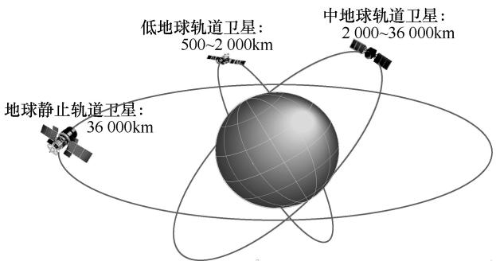
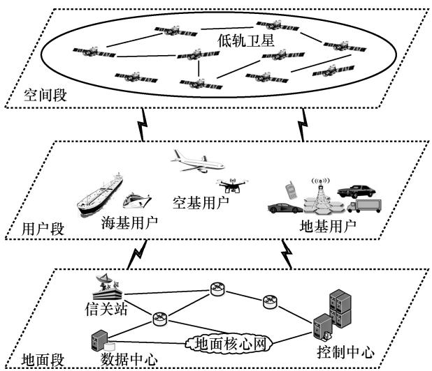
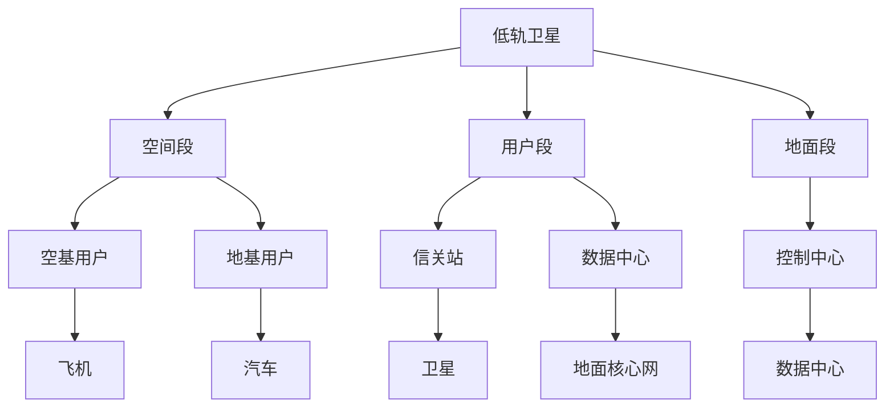

# 面向低轨卫星网络的组网关键技术综述

蒋瑞红 1 ，冯一哲 1 ，孙耀华 1 ，郑海娜 2

（1. 北京邮电大学网络与交换技术国家重点实验室，北京 100876；

2. 华为技术有限公司，广东 深圳 518129）

摘 要：随着信息通信技术的不断发展，人类对于扩大网络覆盖范围和降低通信时延的要求越来越高。低轨卫星网络是一种利用轨道高度较低的卫星构建的网络体系，具有覆盖范围广、通信时延低等优势。基于此，首先概述了低轨卫星网络的国内外发展现状及其组网所面临的挑战，进一步阐述了低轨卫星网络组网关键技术难点及建议，最后结合分布式、博弈论和人工智能等方法，对潜在可行的低轨卫星组网方案进行了探讨。

关键词：低轨卫星组网技术；人工智能；博弈论；6G空间互联网

中图分类号：TP393

文献标志码：A

doi: 10.11959/j.issn.1000–0801.2023032

# A survey on networking key technologies for LEO satellite network

JIANG Ruihong1 , FENG Yizhe1 , SUN Yaohua1 , ZHENG Haina2

1. State Key Laboratory of Networking and Switching Technology,

Beijing University of Posts and Telecommunications, Beijing 100876, China

2. Huawei Technologies Co., Ltd., Shenzhen 518129, China

Abstract: With the continuous development of information and communication technology, the requirements for expanding network coverage and reducing communication delay are becoming higher and higher. Low earth orbit (LEO) satellite networking, as a network system constructed by satellites with low orbital altitudes, has the advantages of wide coverage and small communication delay. Firstly, the development status of LEO satellite network around and the challenges faced by LEO satellite networking were summarized. Then, the key technical difficulties and suggestions of LEO satellite networking were described. Finally, some potentially feasible LEO satellite networking schemes were discussed, combined with the theory and methods of distribution, game and artificial intelligence.

Key words: LEO satellite networking technology, artificial intelligence, game theory, 6G space Internet

# 0 引言

卫星通信的概念最早可追溯到英国物理学家亚瑟·查尔斯·克拉克（Arthur Charles Clarke）1945 年发表在《无线电世界》杂志上的文章“Extra-terrestrial Relay（地球外的中继）”，设想将部署在地球同步轨道上的人造地球卫星作为中继进行通信，并在 20 世纪 60 年代成为现实。时至今日，卫星通信的覆盖范围广、传输距离远、传输容量大、灵活性强、扩展性好、不受地面自然环境灾害影响等优势[1]，使卫星通信网络成为学术界和产业界热议的话题，且与 6G 技术相结合推动了卫星通信网络的发展。

目前卫星网络主要由 3 类轨道卫星组成，卫星轨道示意图如图 1 所示[2]。根据飞行高度，从高到低分别是地球静止轨道（geostationaryearth orbit，GEO）卫星、中地球轨道（mediumearth orbit，MEO）卫星和低地球轨道（low earthoribit，LEO）卫星（以下简称低轨卫星），其中低轨卫星网络通常由多颗低轨卫星协同工作进行组网，数量从数十颗到数万颗不等，其轨道高度通常在 500～2000km，可实现全球无死角覆盖，能够为荒漠、戈壁、森林、高山、海洋等网络盲区提供通信服务。相对于高轨卫星，低轨卫星具有时延小、传输损耗小、速率高、成本低等特点，被认为是提升网络覆盖范围及通信效率的重要手段。

text_image

地球静止轨道卫星
36 000km
低地球轨道卫星:
500~2 000km
中地球轨道卫星:
2 000~36 000km

图1 卫星轨道示意图[2]

在未来 6G 空间互联网发展中，低轨卫星网络展现出了广阔的应用前景[3]。首先，低轨卫星网络可为全球用户提供连续通信服务。由于部分地区的地理位置偏远、地理环境特殊，传统的通信方式难以实现无缝覆盖。低轨卫星组网技术可以通过低轨卫星全面覆盖全球区域，为全球用户提供连续的通信服务。其次，低轨卫星网络可为海量物联终端提供广域泛在接入服务。低轨卫星组网技术可以将较多数量的采用高频段的低轨卫星进行组网，大大提高网络容量，更易于对海量物联终端提供网络连接支持与服务。另外，低轨卫星网络还可为军事通信提供服务，保障军事通信信息的安全性需要加密技术和其他安全措施，低轨卫星组网技术可以满足该要求，为军事通信提供安全可靠的通信服务。

近年来，卫星通信技术迅猛发展，卫星组网融入地面网络已经逐渐成为可能，在应急搜救、无人区广域覆盖、智能船舶、海洋牧场、智能航运和海事监测及国防等业务应用上发挥着重要作用。同时，6G 技术也将以低轨卫星为发展契机，开拓新的研究领域，获取更多的智能应用，实现全球互联、智能网络等功能。因此，对于低轨卫星网络的探究已经成为国内外重点研究趋势之一。

# 1 低轨卫星网络的发展现状

随着航天和空间信息技术的蓬勃发展，低轨卫星网络与 5G/6G 技术、物联网、云计算、人工智能（artificial intelligence，AI）等技术相结合，可实现广域范围内的无缝覆盖。在此愿景下，建设卫星互联网逐渐上升为国家战略，且呈现出越来越激烈的国际竞争态势。

# 1.1 国际现状

1991 年美国摩托罗拉子公司铱星推出“铱星计划”，计划部署 66 颗低轨卫星为地面提供通信服务。1998 年，“铱星计划”正式运行，但因当时设备和通信价格比较昂贵，在与 2G 网络的竞争中落败。到 2016 年，铱星公司提出基于卫星授时与定位的导航服务技术，证明低轨卫星可作为全球定位系统（global positioning sys-tem，GPS）的替代方案，引发全球关注。2019年，美国发射部署了新一代铱星系统，除了通信业务外，该系统还可辅助 GPS 实现室内和峡谷地区的定位导航[4]。

目前美国已形成由太空探索公司、Astra、亚马逊、波音公司等为主要核心成员的强大的低轨卫星网络发展团队。2015 年，特斯拉旗下太空公司 SpaceX 的首席执行官伊隆·马斯克推出“星链（Starlink）”计划，预计总发射低轨卫星数量达 4.2 万颗，以提供覆盖全球的高速互联网接入服务。2021 年，火箭制造商 Astra 计划部署1.3 万颗低轨卫星组成星座，支持通信、环境和自然资源应用，以及国家安全业务。同时，美国联 邦 通 信 委 员 会 （ Federal CommunicationsCommission，FCC）宣布批准波音公司发射和运营 147 颗低轨卫星，为用户提供高速宽带互联网服务。2022年，亚马逊（Amazon）公司推出的“柯伊伯项目（Project Kuiper）”计划，将部署 3 236 颗低轨卫星组成太空卫星网络，为全球提供高速宽带互联网接入服务[5]。

英国/印度太空互联网公司OneWeb，目前拥有世界第二大规模的卫星星座，在轨卫星数量已达540 颗，仅次于 SpaceX 的 Starlink。另外，OneWeb还预计发射32.7万颗小型卫星，数量达到之最。加拿大通信公司 Telesat 在 2016 年宣布推出Lightspeed 计划，预计发射 1 671 颗低轨卫星，提供全球网络服务[6]。欧洲航天局（European SpaceAgency）计划进一步开展对低轨导航卫星进行在轨演示，补充伽利略（Galileo）系统。位于卢森堡的LeoSat 公司推出 LeoSat 星座，利用激光通信的方式部署108颗低轨卫星，以实现高质量的数据服务通信网络，链路速率最大能达 10 Gbit/s。俄罗斯SPUTNIX 公司计划在 2025 年完成部署约 200 颗低轨 卫 星 。 俄 罗 斯 航 天 国 家 集 团 的 “ 球 体（Sfera/Sphere）”的多功能卫星星座项目，计划在17个轨道上发射640颗多用途卫星，其中包含一个由 288 颗卫星构成的低轨通信星座。澳大利亚Fleet（全称 Fleet Space Technologies）公司计划发射 100 颗纳米卫星，主要服务于物联网。2021年6月韩国政府表示在10年内建设100颗微小卫星组成的卫星星座，早期三星公司还制定了由4 600颗微小卫星组成的互联网星座蓝图。

# 1.2 国内现状

我国“十四五”规划和“2035 年远景目标”纲要明确提出要建设高速泛在、天地一体、集成互联、安全高效的卫星互联网产业。为此，中国航天科技集团有限公司和中国航天科工集团有限公司分别制定了面向低轨卫星组网的“鸿雁星座”和“虹云工程”计划，其中“鸿雁星座”由 300 颗低轨道卫星及全球数据业务处理中心组成，“虹云工程”由 156 颗低轨卫星构成[7]。

北京国电高科科技有限公司打造和运营我国首个低轨卫星物联网星座，即“天启星座”，计划部署 38 颗低轨卫星。航天行云科技有限公司推出“行云系统”，预计发射 80 颗低轨道小卫星，建设一个覆盖全球的天基物联网。电子科技大学参与研制的“TFSTAR 号”卫星搭载了 AI 处理载荷，助力了星载能力的提升。中国科学院软件研究所启动的基于软件定义卫星技术的“天智工程”，可用于低轨互联网建设。我国还有民营企业推动的“银河 Galaxy”计划，预计共发射 2 800 颗低轨互联网卫星，如银河航天集团（1 000 颗）、北京九天微星科技发展有限公司（800 颗）、北京星网宇达科技股份有限公司（30 颗）、上海欧科微航天科技有限公司（40 颗）等。

另外，2021年 4 月28 日，中国卫星网络集团有限公司（简称中国星网或星网）正式揭牌，成为中国第 5 家电信运营商，专注于卫星通信，开启了我国卫星互联网发展新征程。

# 2 低轨卫星组网面临的挑战

与其他卫星相比，低轨卫星具有体积小、发射成本低、技术更新快、可全球覆盖等特性，能够提高与地面终端直接通信的能力，在卫星通信网络高速发展的时代，拥有广阔的发展前景。与此同时，低轨卫星在实现星间组网或星地组网等方面也面临诸多问题和挑战。

# 2.1 低轨卫星组网概念

低轨卫星组网是一种利用运行轨道高度较低的卫星建立的网络体系。基于组网体制，低轨卫星既可通过星间链路进行组网，也可同高轨卫星混合组网，均可形成多层空间网络。

根据通信组网方式，卫星网络可划分为 3 类，即无星间链路卫星网络、有星间链路卫星网络和动态星间链路的卫星网络[8]。其中，无星间链路的卫星网络的卫星之间不存在星间链路，通过弯管的方式连接，基于地面设施进行组网，如全球星（Globalstar）系统。有星间链路的卫星网络的卫星之间通过星间链路进行连接且连接方式固定，不进行动态调整，可依托自身链路进行组网，如铱星系统。动态星间链路卫星网络的卫星之间的连接方式不固定，会随着网络拓扑和业务的变化而不断变化，如美国 F6 计划卫星系统；其类似于地面的移动自组织网络，故也称空间移动自组网。

# 2.2 低轨卫星组网特点

低轨卫星网络是通过发射一定规模的卫星进行组网构建具备实时信号处理的空间通信系统，是一种能够向地面及空中终端提供接入等通信服务的新型网络，主要包括以下几个特点[9]。

· 网络可靠性高且灵活：低轨卫星网络中卫星数量相对较多，组网方式相对灵活，单

颗卫星发生故障后易进行网络切换，且不受自然灾害的影响，大部分时间内低轨卫星网络可提供稳定且可靠的通信服务。

· 时延低：低轨卫星通信链路均为视距通信，传输时延和路径损耗相对较小且稳定，能够支持视频通话、网络直播、在线游戏等实时性要求较高的应用。  
· 容量大：低轨卫星网络中卫星数量相对较多且通常采用 Ka/V频段或更高频段，可实现超过 500 Mbit/s 大容量通信，且支持海量终端接入的需求。  
· 地面网络依赖性弱：低轨卫星网络星上处理技术的实现，可通过星间链路提供全球通信服务，而不需要全球部署地面信关站，摆脱对地面基础设施的依赖。  
· 多种技术协同发展：多种相关技术协同应用，如点波束、多址接入、频率复用等技术，可缓解低轨卫星网络中存在的频率资源紧张等问题。  
· 可实现全球覆盖：多颗卫星协同组网，可实现全球无缝覆盖，不受地域限制，能够将网络扩展到远洋、沙漠等信息盲区。

因此，建设新一代低轨卫星网络将是建设 6G空间互联网的重要一部分，是实现全球互联的核心解决方案。尽管低轨卫星网络具有很多优势，但依然存在一些缺陷[10]，具体如下。

· 网络拓扑动态变化：低轨卫星周期性运转，具有高动态性，易导致网络拓扑结构的变化，同时网络路由也随之不断变化。此外，低轨卫星网络的高动态性易引起星间通信链路的中断，致使业务数据传输中断，无法保障终端用户的服务质量。  
· 流量分布不均匀：终端用户分布不均匀，导致卫星网络的流量也具有不均匀性。例如，人口密集的城市区域，需要传输

的流量较大；人口稀疏的偏远地区，需要传输的流量较少；海洋和沙漠地区几乎不产生流量。当某区域对卫星的任务请求量较大时，某些流量增加将会引起服务阻塞。

· 卫星切换频繁：当卫星远离时，终端用户需要与当前卫星断开连接，切换到另一颗靠近的卫星进行连接通信。若不能及时进行切换操作，则无法满足一些对及时性要求比较高的业务需求。  
· 多径传输效应：在低轨卫星网络中，星地之间和星星之间通常存在多条通信路径，需要根据自身的需求（如服务质量需求）进行选择，以保障网络传输质量。  
· 通信链路稳定性差：在低轨卫星网络中，低轨卫星的星地和星间链路都是频繁切换的，链路本身是不稳定的，需要利用合适的移动性管理技术才能保证通信服务的稳定性。  
· 多普勒频移明显：低轨卫星动态性强，通信信号在传送过程中的多普勒频移较大，需要对频偏进行估计并补偿才能实现通信信号的可靠接收。

# 2.3 低轨卫星组网挑战

卫星网络作为地面网络的补充，可提供全球的泛在接入服务，是实现未来 6G的全域无缝覆盖愿景的必经之路，也是实现空天地海一体化战略的重要手段。然而目前卫星网络的发展还未成熟，与地面网络在成本、容量和利用率等方面存在较大差距，面临诸多问题，这也是卫星组网亟待解决和建设的重要部分[11]。

目前，低轨卫星组网面临的主要挑战包括以下几个方面。

# （1）卫星高动态性

低轨卫星高速移动，导致卫星与地面终端的链路切换相对频繁，信号时延与网络不稳定，将对卫星和地面终端位置管理及切换策略的设计带来巨大挑战。可采用卫星定位技术、空间分集技术等减少时延与网络的不稳定性。

# （2）星上资源有限

卫星星载设备不同于地面网络设备，在功率、质量、尺寸方面存在严格的限制，导致其运算及存储能力均有一定的局限性。因此，星间路由及存储能力等的设计面临极简且能满足需求的严苛要求的挑战。可通过增加系统容量如多波束技术和高通量有效载荷、有效的资源管理（如高效的算法和编码技术）、优化地面基础设施等改善星上资源的有限性。

# （3）空间频谱资源有限

现存频谱资源逐渐无法满足日益增高的网络服务需求，低轨卫星网络需要向更高频段开发利用，合理分配频谱。可采用频谱分配技术、调制解调技术等合理利用频谱资源。

# （4）数据安全性

低轨卫星网络将是一个异构混合的空间网络，其安全性需要得到保障，包括网络的鲁棒性、可扩展性、信息安全等方面。同时，星间和星地链路的传输损耗、阴影衰落以及卫星高速移动引起的多普勒效应，也会对通信系统的可靠性带来严峻挑战。可采用数据加密技术、网络安全技术等保护数据安全。

# （5）信号衰落

在低轨卫星环境下，信号需要穿过多个不同的媒介，会造成多径衰落。同时，低轨卫星的轨道高度相对较低，难以避免地球表面干扰。可采用多径信道估计技术、多输入多输出（multiple-inputmultiple-output，MIMO）技术等减少多径衰落的影响，采用干扰消除技术、信号加强技术等提高信号质量。

# （6）应用场景可扩展性

扩展现有的应用场景也是低轨卫星网络发展目标之一，包括灾害预警、生态保护、应急通信、侦察探测等多方面。可开发新的卫星技术及应用、改进星地之间的通信技术、增加卫星数量等有效扩展低轨卫星网络的应用场景。

# 3 低轨卫星组网关键技术

低轨卫星若不进行组网，仅依靠地面网络中继信息，则需要大规模地建设地面网络，实现起来极其困难且成本较高，因此，研究低轨卫星组网技术尤其必要。

# 3.1 体系架构

典型的低轨卫星网络体系架构如图 2 所示，一般包括空间段、地面段和用户段[12]。

flowchart

图 2 低轨卫星网络体系架构

· 空间段，即卫星星座，由多颗低轨卫星和星间链路构成，当卫星采用透明转发技术时，不存在星间链路。卫星在空间中一般均匀对称分布或者多层混合分布，不同轨道多角度交错实现低轨卫星的全球组网，以保障全球范围内无论何时何地至少有一颗低轨卫星提供覆盖接入服务。  
· 用户段，由接入网及接入终端组成，包括综合信息服务平台、业务支撑平台和各类终端设备（如车载、舰载、机载、手机等）等。通过星间链路与星上处理转发，可实

现全球组网和数据交换。

· 地面段，通常由信关站、测控站、综合网管中心、卫星控制中心、移动通信网及地面业务支撑网组成，主要实现对空间段的监测与管理、连接卫星网络到地面核心网，以及用户管理等功能。

从图 2 可以看到，由空间段、用户段和地面段 3 个部分的协同工作才构成完整的空间低轨卫星网络，这也是低轨卫星网络体系结构的特点。其中，空间段利用卫星之间的无线技术等互相作用实现组网，可以提高系统容量和覆盖能力，并可通过不同的组网方案实现对频谱资源的最优利用；用户段是按照用户需求和服务需求进行组网，可根据不同的应用领域进行优化和调整，更加灵活地适应用户需求，以提供快速、高效的服务；地面段通过地面的设置网络的组件进行组网，实现对卫星通信系统的支持和管理，有效地完成卫星通信系统的数据存储、处理和传输。在未来 6G空间互联网中，将多颗低轨卫星组网为数据通信提供服务以及星地融合组网已成为未来发展趋势，合理的低轨卫星组网可实现连续覆盖全球各个角落。然而低轨卫星组网技术涉及诸多方面，如星地网络拓扑设计、星间路由协议、星地链路切换、地面网关路由设计等，下面将对相关组网技术进行阐述。

# 3.2 移动切换技术

在低轨卫星网络中，卫星是终端用户接入的端口。低轨卫星网络的服务区域通常由配置的特定天线波束所决定，但低轨卫星的高速运转将导致网络拓扑高动态变化，星地之间和卫星之间链路产生频繁的切换。例如，由于低轨卫星周期性的飞行移动，终端用户需要随着卫星移动频繁地切换到新的链路上，即发生星内切换；当卫星逐渐远离终端用户时，终端用户需要切换到另一个新的卫星网络，即发生星间切换；当卫星网络拓扑结构发生变化时，在同一卫星波束间或不同卫星波束间，需要重新分配无线信道进行切换以避免干扰，即波束间切换。若网络中所有终端用户频繁切换（如组切换），将会给整个卫星系统带来大量的信令开销并显著增加切换过程冲突的概率，信号延迟和切换成本也会大大增加，严重影响网络的连续性及用户的服务体验[13]。因此，综合考虑低轨卫星移动速度快、网络拓扑动态变化等因素，寻找一种新颖的移动切换方法以简化切换操作、提高切换可靠性是低轨卫星组网的重要研究方向之一。

未来，随着更多的低轨卫星的高速移动，终端用户的切换请求和拥塞将变得更加严峻。为此，终端用户可考虑应用长期效益的深度强化学习方法，无须提前了解动态的卫星网络环境变化，并可做出合理的切换决策，从而使卫星可以较早地配置信令信息以实现快速切换，也就是说，结合组切换和机器学习方法的优势，能够使切换策略更适应高动态的卫星网络环境并具有更强的鲁棒性[14]。另外，从网络架构出发，进行合理有效的组网，可简化切换过程。

# 3.3 组网交换技术

空间卫星高效组网是未来低轨卫星网络发展的必然。为了保障星间连通性，实现数据的接收及解析，并快速完成数据的寻址与分发，动态组网交换技术的研究显得尤其重要[15]，主要有以下几种技术。

· 低时延组网路由与抗毁重构技术：目前低轨卫星规模不断扩大，已无法仅依靠地面站对卫星网络进行管理。需要充分利用星上资源构建一个低时延且灵活分布的网络体系结构，以实现卫星网络的自管理。当某颗卫星或者链路受损时，卫星网络应具备动态组网及重构能力，以保障网络的正常运行。  
· 激光星间链路技术：与射频方式相比，激光星间链路具有低成本、低功耗、大容量、高可靠、抗干扰等优势，已成为未来低轨

卫星网络的标配。其能够促进星间信息的交互，可为实现星座智能协同、分布式计算奠定一定的基础。

· 星间组网协议及互操作技术：为实现未来空间网络的快速响应及协同，贯通各类卫星的大规模互联互通，互操作技术十分必要，网络协议的设计及部署是实现大规模组网的关键问题。

# 3.4 路由组网技术

卫星网络路由技术主要是基于卫星网络自身特性，结合实际应用需求，研究设计稳定且高效的路由算法及协议，以提供可靠的数据传输路径。目前低轨卫星网络一般由多颗卫星构成，每颗卫星均具备星上处理数据的能力，如星上存储、路由、计算等[16]。为了提高低轨卫星网络资源的利用率及路由效率，需要设计能够从多条传输路径中选择较优路径的路由算法。常见的卫星网络路由算法有地面网络动态路由改进算法、基于虚拟拓扑策略路由算法和基于虚拟节点策略路由算法等。

随着低轨卫星网络的快速发展，卫星路由技术日趋成熟。然而日常通信业务的需求愈加繁杂且增多，对低轨卫星网络的要求也大幅提高，这将给卫星路由组网技术带来诸多问题与挑战。因此，低轨卫星组网路由关键技术还需要解决以下难题。

· 抗毁且鲁棒的卫星路由设计：在低轨卫星复杂的空间网络环境中，除了卫星自身硬件受损或自然现象造成的网络节点故障外，还存在军事物理打击等威胁。如何保证在节点受损或出现故障卫星路由的有效性，是未来卫星路由技术研究的关键内容。  
· 承载繁杂业务类型的卫星路由设计：现阶段卫星网络提供的业务服务大多以语音、数据和导航为主，然而随着用户需求的持续提升，未来卫星网络将会承载更加繁多的业务。如何有效地利用卫星网络资源为不同业务提供相应的服务，将是未来卫星

路由技术的重要挑战之一。

· 动静结合的卫星路由设计：如今卫星网络路由技术主要是静态模式，研究动态路由尚少。在未来低轨卫星网络中，卫星数量将日渐增多、网络资源将愈发丰富、网络拓扑也将更为复杂，导致应用静态路由技术的代价也越大。设计一套适用于未来空间动态环境的卫星自适应动态路由或者动静结合的卫星路由组网方案尤为重要。

# 3.5 混合组网技术

随着信息通信技术标准化的进步，卫星通信网络逐渐向多星一网的方向发展。混合卫星组网可以结合不同轨道卫星优势，通过协同自主组网，构建空间动态自组织低轨卫星网络。另外结合卫星网络和地面网络的优势，可构建星地协同一体化网络，以提升网络覆盖率，保障服务质量[17]。因此，针对低轨卫星的混合组网技术的研究主要涉及两大方面，具体如下。

· 星间协同混合组网技术：低轨卫星的周期性运转引起星间邻接关系不断变化，同时卫星规模也在不断扩张，这将给不同类型卫星进行高效自主组网带来一定的难度。结合多轨道卫星网络设计、组网、安全性、抗毁性等技术，构建卫星间自适应组网架构，可实现不同卫星间的互联互通，提升卫星网络的灵活性及可扩展性，降低对地面网络的依赖性。  
· 星地协同混合组网技术：星、地网络属于异构网络，在时延、传输速率等方面存在极大差异，如何取长补短实现星地协同高效组网面临着巨大挑战。目前星地协同组网可通过覆盖增强方式、距离拓展方式、业务融合方式和精准通信方式实现。采用覆盖增强方式，低轨卫星和地面基站可协同覆盖各自特定区域，

消除网络盲区。采用距离拓展方式，低轨卫星可为空中/地面基站提供远程回传链路，增大网络覆盖范围。采用业务融合方式，低轨卫星网络可提供广播服务以实现信息分发，地面网络提供通信服务以实现信息交互。采用精准通信方式，低轨卫星可提供广域覆盖的信令链路，而地面基站可通过定向波束可实现特定区域的精准覆盖，实现高速数据传输。尽管如此，如何将这些协同方式进行有效的组合还待进一步研究。

# 4 低轨卫星组网潜在方案

基于上述低轨卫星组网关键技术，结合不同的数学理论有望设计一些潜在可行的组网方案。

# 4.1 分布式组网方案

分布式的低轨卫星网络通常由互不相连、共同协作完成某个任务的多颗低轨卫星构成，需要对星间组网技术进行研究。常见的分布式组网方式有编队飞行、星座和星群，其主要区别在于是否对星间链路及飞行轨道进行控制操作[18]。

· 编队飞行：编队飞行包括线性模式和绕飞模式。线性模式中卫星在一条轨道上等间隔地线性分布部署；绕飞模式以某颗卫星或虚拟卫星为中心，其他卫星在各自轨道上周期性运转。网络规模及拓扑结构相对较小且单一，不具备层次性，覆盖范围较小。  
· 星座：卫星在预设轨道上稳定且周期性飞行，卫星间采用相同控制机制，对地面特定区域可保障所需通信服务，具有一定抗毁能力。典型的星座如北斗卫星导航系统、GPS 系统和铱星系统等。  
· 星群：通常由数颗同轨或异轨卫星组成，主要负责监控空间环境、地面观测等任

务。在卫星周期性运行过程中，网络拓扑的变化不会对任务的执行带来影响，较为成熟的分布式星群如“吉林一号”。

分布式低轨卫星网络需要卫星之间的协作以共同完成某一任务，如何进行高效的协作组网，则需要综合考虑低轨卫星网络的拓扑结构、路由选择等特性，设计满足时延、带宽以及网络稳定性等多方面需求的分布式卫星网络动态组网方案。

# 4.2 基于博弈的组网方案

近年来，博弈论已经广泛应用于无线通信网络，解决网络的功率、带宽、信道等资源的分配问题。在卫星网络中，大多数节点具有自私性和趋利性，不愿消耗自身的资源协助其他节点转发数据。因此，在低轨卫星网络中，设计的相应路由算法或协议应能够激励网络节点相互协作自主形成一个网络，且能够有效地管理及控制自身网络资源。博弈论是解决个体之间合作与竞争关系的一种成熟数学理论与工具，可借助博弈论对低轨卫星网络协作组网等问题进行研究[19-20]。

· 基于报酬的博弈组网策略：通过引入报酬，可激励卫星网络自私节点为其他节点提供中继等服务，促进节点间的合作。该机制中节点需要主动参与合作为其他节点提供正常的路由转发等服务，才有可能获得足够的报酬用于支付自身所需服务。  
· 基于信任度的博弈组网策略：量化并排序低轨卫星网络的节点对其他节点的信任程度，以作为路由选择优先级的依据。通常网络节点比较容易与信任度高的节点合作，同时信任度高的节点也易于获得其他节点的服务。反之，信任度低的节点则易被孤立，以至于无法获得其所需服务。该机制通过设置奖罚制度以激励网络自私节

点主动地参与协作。

· 多移动动态联盟博弈组网策略：卫星在一定时间内执行多目标协同任务，是一个多目标的多移动动态联盟问题，且联盟之间存在资源竞争。可根据不同目标与卫星网络拓扑定位关系，将网络划分成多个与目标对应的集合，解决联盟之间可能出现的竞争冲突问题。进一步利用合作博弈算法组成联盟，促使卫星理性地自发构成稳定的联盟。

# 4.3 AI赋能的组网方案

AI技术具有从动态环境交互或海量数据中学习的能力，适用于不断高动态变化的空间低轨卫星网络。未来卫星网络结构将会越来越庞大异构，业务类型和应用场景也将越来越繁杂多变，网络要求也将越来越智能化，充分利用 AI 技术以实现未来 6G空间互联网是必然选择[21-22]。

· 异构智能切换技术：随着未来空间低轨卫星网络智能化需求的出现，结合 AI 学习方法的优势，如强化学习的无模型性及自学习性，能够及时完成切换处理，缩短切换中断时间，从而实现无缝切换。  
· 自适应智能组网技术：利用 AI 技术对卫星网络资源及变化规律进行动态建模分析，结合集中或者分布管控的方式，自适应推演卫星网络路由、缓存等策略，以获得高效且可靠的低轨卫星网络。  
· 智能组网协议体系：为高效融合空天地海等多域网络，需要建立完整且强大的智能协议体系。利用深度学习方法分析研究卫星网络的特性，创建相应的神经网络模型，进而提高网络适应性及协同性。

# 5 结束语

低轨卫星组网技术在未来将得到进一步发展和改进。首先，随着卫星技术的不断发展，卫星的载荷能力将得到提升，使得低轨卫星网络能够承载更多的信息，提高网络的传输效率；其次，随着 AI 技术的发展，低轨卫星网络也可利用 AI 技术进行自动化管理和调度，使得低轨卫星组网更加高效且灵活；最后，低轨卫星组网技术在6G空间互联网建设中也发挥着重要作用，具有广阔的应用前景，可为偏远地区、海上航行、军事通信等领域提供服务，为人类提供更好的通信便利。

# 参考文献：

[1] JIA Z Y, SHENG M, LI J D, et al. LEO-satellite-assisted UAV: joint trajectory and data collection for Internet of remote things in 6G aerial access networks[J]. IEEE Internet of Things Journal, 2021, 8(12): 9814-9826.   
[2] DARWISH T, KURT G K, YANIKOMEROGLU H, et al. LEO satellites in 5G and beyond networks: a review from a standardization perspective[J]. IEEE Access, 2022(10): 35040-35060.   
[3] XIAO Z Y, YANG J Y, MAO T Q, et al. LEO satellite access network (LEO-SAN) towards 6G: challenges and approaches[J]. IEEE Wireless Communications, 2022(99): 1-8.   
[4] 方芳, 吴明阁. 全球低轨卫星星座发展研究[J]. 飞航导弹, 2020(5): 88-92, 95. FANG F, WU M G. Research on the development of global LEO satellite constellation[J]. Aerodynamic Missile Journal, 2020(5): 88-92, 95.   
[5] LIN X Q, CIONI S, CHARBIT G, et al. On the path to 6G: embracing the next wave of low earth orbit satellite access[J]. IEEE Communications Magazine, 2021, 59(12): 36-42.   
[6] PROL F S, FERRE R M, SALEEM Z, et al. Position, navigation, and timing (PNT) through low earth orbit (LEO) satellites: a survey on current status, challenges, and opportunities[J]. IEEE Access, 2022, (10): 83971-84002.   
[7] 陈山枝. 关于低轨卫星通信的分析及我国的发展建议[J]. 电 信科学, 2020, 36(6): 1-13. CHEN S Z. Analysis of LEO satellite communication and suggestions for its development strategy in China[J]. Telecommunications Science, 2020, 36(6): 1-13.   
[8] 王璇. 低轨卫星网络高效安全组网研究[D]. 西安: 西安电子科技大学, 2019.WANG X. Research on efficient and secure networking in LEO

satellite networks[D]. Xi’an: Xidian University, 2019.   
[9] 吴炀, 胡谷雨, 金凤林, 等. 卫星网络组网关键技术[J]. 指挥控制与仿真, 2022, 44(2): 88-100.WU Y, HU G Y, JIN F L, et al. Key technologies of satellite net-works[J]. Command Control & Simulation, 2022, 44(2): 88-100.  
[9] 郭一然. 低轨道卫星网络移动性支持问题研究[D]. 西安: 西安电子科技大学, 2021.GUO Y R. Research on mobility support of LEO satellite net-work[D]. Xi’an: Xidian University, 2021.  
[11] 仉陈. 大规模低轨卫星组网方法与性能评估[D]. 南京: 南京 大学, 2021. ZHANG C. The networking method and performance evaluation for large-scale LEO satellite[D]. Nanjing: Nanjing University, 2021.   
[12] 王艳峰, 谷林海, 刘鸿鹏. 低轨卫星移动通信现状与未来发 展[J]. 通信技术, 2020, 53(10): 2447-2453. WANG Y F, GU L H, LIU H P. Status quo and future development of LEO satellite mobile communication[J]. Communications Technology, 2020, 53(10): 2447-2453.   
[13] 朱洪涛, 郭庆. 基于用户群组的低轨卫星网络多星切换策略[J]. 电信科学, 2022, 38(4): 39-48. ZHU H T, GUO Q. User group based multi-satellite handover strategy for LEO satellite networks[J]. Telecommunications Science, 2022, 38(4): 39-48.   
[14] JUAN E, LAURIDSEN M, WIGARD J, et al. Handover solutions for 5G low-earth orbit satellite networks[J]. IEEE Access, 2022, 10: 93309-93325.   
[15] 吉彬, 曹旭源, 阳凯. 基于链路探测机制的卫星组网技术研究及仿真[J]. 电子信息对抗技术, 2022, 37(1): 90-96.JI B, CAO X Y, YANG K. Research and simulation of satellitenetworking technology based on link detection mechanism[J].Electronic Information Warfare Technology, 2022, 37(1): 90-96.  
[16] 吴署光, 王宏艳, 王宇, 等. 低轨卫星网络路由技术研究分析[J]. 卫星与网络, 2021(9): 66-74.WU S G, WANG H Y, WANG Y, et al. Research and analysis onrouting technology of LEO satellite network[J]. Satellite &Network, 2021(9): 66-74.  
[17] DU P P, LI J D, BAI W G, et al. Dual location area based distributed location management for hybrid LEO/MEO mega satellite networks[J]. IEEE Transactions on Vehicular Technology, 2022, PP(99): 1-15.   
[18] 高天旸, 胡笑旋, 夏维. 基于分布式协同进化的星座自主任务 规 划 算 法 [J]. 系 统 工 程 与 电 子 技 术 , 2022, 44(5):

1600-1608.   
GAO T Y, HU X X, XIA W. Constellation autonomous mission planning algorithm based on distributed co-evolution[J]. Systems Engineering and Electronics, 2022, 44(5): 1600-1608.   
[19] 赵力冉, 党朝辉, 张育林. 空间轨道博弈: 概念、原理与方法[J].指挥与控制学报, 2021, 7(3): 215-224.  
ZHAO L R, DANG Z H, ZHANG Y L. Orbital game: concepts, principles and methods[J]. Journal of Command and Control, 2021, 7(3): 215-224.   
[20] XU X S, DANG Z H, SONG B, et al. Method for cluster satellite orbit pursuit-evasion game based on multi-agent deep deterministic policy gradient algorithm[J]. Aerospace Shanghai (Chinese & English), 2022, 39(2): 24-31.   
[21] HUANG J F, YANG Y, YIN L F, et al. Deep reinforcement learning-based power allocation for rate-splitting multiple access in 6G LEO satellite communication system[J]. IEEE Wireless Communications Letters, 2022, 11(10): 2185-2189.   
[22] 刘洋, 王丽娜. 基于树突神经网络的低轨卫星智能感知路由算法[J]. 工程科学学报, 2023, 45(3): 465-474.  
LIU Y, WANG L N. LEO satellite intelligent-sensing routing algorithm based on a dendrite network[J]. Chinese Journal of Engineering, 2023, 45(3): 465-474.

# [作者简介]

natural_image

Portrait photo of a person with short hair wearing a dark jacket and turtleneck (no text or symbols visible)

蒋瑞红（1989- ），女，博士，北京邮电大学网络与交换技术国家重点实验室讲师，主要研究方向为低轨卫星网络的理论性能和关键技术。

natural_image

Portrait photo of a man in formal attire (no text or symbols visible)

冯一哲（2000- ），男，北京邮电大学网络与交换技术国家重点实验室硕士生，主要研究方向为低轨卫星通信系统接入技术。

孙耀华（1992- ），男，博士，北京邮电大学网络与交换技术国家重点实验室副教授，主要研究方向为低轨卫星通信和无线接入网络智能化。

郑海娜（1994- ），女，博士，华为技术有限公司终端 BG 标准专利部研究工程师，主要研究方向为低轨卫星通信关键技术。