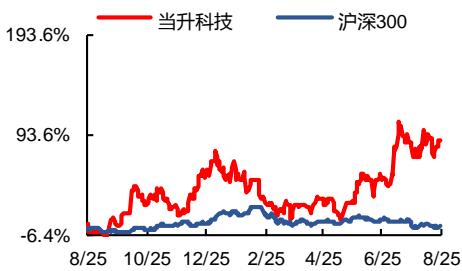

# 当升科技（300073）：量利齐升，产能快速扩张

2021 年 08 月 26 日

推荐/维持

当升科技 公司报告

事件：公司发布 2021 年半年度报告，实现营业收入 29.89 亿元，同比增长174.08%，实现归属上市公司股东的净利润 4.47 亿元，同比增长 206.02%，接近此前业绩预告区间的上限（4.50 亿元），符合预期。

受益于行业高景气度，公司产品实现量利齐升。产品销量方面，2021 年上半年，受益于新能源汽车行业增长，公司实现正极材料产量 1.92 万吨，其中多元材料 1.80 万吨，钴酸锂 0.12 万吨，销量 1.89 万吨，同比增长 131.60%；价格方面，上半年公司正极材料均价约 15 万元/吨，符合行业情况；盈利能力方面，我们预计上半年公司正极材料盈利水平 1.7 万元/吨以上，较 2019年 1.39 万元/吨、2020 年 0.94 万元/吨出现较大幅度提升。

高镍三元产品推进顺利，积极布局新技术路线所需正极材料。报告期内，公司高镍多元材料产品开发进一步加快，实现了多款单晶型和团聚型新产品量产 Ni83、Ni88、Ni90 型高镍多元材料实现向海外大批量出口，成为国际客户的标杆产品，批量应用于日本、韩国、欧洲和美国一线品牌电动汽车。Ni95产品已完成国际客户验证，性能表现优异，即将进入量产阶段。正在开展超高镍多元材料 Ni98 产品的开发。此外，公司布局固态锂电技术及其关键材料，富锂锰基产品完成小试工艺定型，产品性能表现优异。

新产能逐步落地，保障长期供应能力。报告期末，公司具备 3.4 万吨/年正极材料产能，在建产能 1 万吨；新产能方面，公司拟募资投建常州二期 5 万吨/年高镍三元产能、江苏当升 2 万吨/年数码类正极材料生产线；海外产能布局上，公司已启动欧洲 10 万吨高镍动力正极材料生产基地项目的可行性研究和论证工作。如上述所有项目均落地，公司将形成超 20 万吨/年的供应能力。

我们认为，公司作为锂电正极材料头部企业，客户合作基础深厚，具备快速响应客户需求的能力，有望与新能源汽车行业共同成长。

盈利预测与投资建议：我们预计公司 2021-2023 年归母净利润分别为 7.31亿元、9.80 亿元和 11.24 亿元，对应当前股本 EPS 分别为 1.61、2.16 和 2.48元。对应 2021.8.25 收盘价 46.62、34.77 和 30.33 倍 P/E。维持“推荐”评级。

风险提示：产品需求、产能投产进度或不及预期。

财务指标预测 

<table><tr><td>指标</td><td>2019A</td><td>2020A</td><td>2021E</td><td>2022E</td><td>2023E</td></tr><tr><td>营业收入(百万元)</td><td>2,284.18</td><td>3,183.32</td><td>6,968.72</td><td>10,472.35</td><td>13,959.60</td></tr><tr><td>增长率(%)</td><td>-30.37%</td><td>39.36%</td><td>118.91%</td><td>50.28%</td><td>33.30%</td></tr><tr><td>归母净利润(百万元)</td><td>(209.05)</td><td>384.90</td><td>731.10</td><td>980.11</td><td>1,123.50</td></tr><tr><td>增长率(%)</td><td>-166.12%</td><td>-</td><td>89.95%</td><td>34.06%</td><td>14.63%</td></tr><tr><td>净资产收益率(%)</td><td>-6.92%</td><td>10.10%</td><td>7.96%</td><td>9.84%</td><td>10.24%</td></tr><tr><td>每股收益(元)</td><td>-0.46</td><td>0.85</td><td>1.61</td><td>2.16</td><td>2.48</td></tr><tr><td>PE</td><td>-163.03</td><td>88.54</td><td>46.62</td><td>34.77</td><td>30.33</td></tr><tr><td>PB</td><td>11.27</td><td>8.94</td><td>3.71</td><td>3.42</td><td>3.11</td></tr></table>

资料来源：公司财报、东兴证券研究所（截至2021.8.25盘价）

# 公司简介：

公司起源于中央企业矿冶科技集团有限公司的一个课题组，逐步发展成为我国锂电正极材料行业的龙头企业，目前已发展成为锂电正极材料及智能装备领域集自主创新、成果转化、产业运营于一体的最具影响力的企业之一（来自公司官网）

交易数据

<table><tr><td>52周股价区间(元)</td><td>85.38-32.39</td></tr><tr><td>总市值(亿元)</td><td>341.09</td></tr><tr><td>流通市值(亿元)</td><td>327.57</td></tr><tr><td>总股本/流通A股(万股)</td><td>45,362/43,559</td></tr><tr><td>流通B股/H股(万股)</td><td>/</td></tr><tr><td>52周日均换手率</td><td>3.65</td></tr></table>

52 周股价走势图

line

| Date   | 当升科技 | 沪深300 |
|--------|----------|---------|
| 8/25   | -6.4%    | -6.4%   |
| 10/25  | -6.4%    | -6.4%   |
| 12/25  | -6.4%    | -6.4%   |
| 2/25   | -6.4%    | -6.4%   |
| 4/25   | -6.4%    | -6.4%   |
| 6/25   | -6.4%    | -6.4%   |
| 8/25   | -6.4%    | -6.4%   |

资料来源：Wind、东兴证券研究所

# 分析师：张阳

010-66554016 zhangy ang\_yjs@dxzq.net.cn

执业证书编号: S1480521070001

# 分析师：郑丹丹

021-25102903 zhengdd@dxzq.net.cn

执业证书编号: S1480519070001

# 分析师：沈一凡

010-66554108 sheny f@dxzq.net.cn

执业证书编号: S1480520090001

# 分析师：洪一

0755-82832082 hongy i@dxzq.net.cn

执业证书编号: S1480516110001

附表：公司盈利预测表

<table><tr><td>资产负债表</td><td></td><td></td><td></td><td colspan="2">单位:百万元</td><td>利润表</td><td></td><td></td><td></td><td colspan="2">单位:百万元</td></tr><tr><td></td><td>2019A</td><td>2020A</td><td>2021E</td><td>2022E</td><td>2023E</td><td></td><td>2019A</td><td>2020A</td><td>2021E</td><td>2022E</td><td>2023E</td></tr><tr><td>流动资产合计</td><td>3,265.46</td><td>4,185.62</td><td>11,094.7</td><td>11,870.7</td><td>13,097.2</td><td>营业收入</td><td>2,284.</td><td>3,183.32</td><td>6,968.72</td><td>10,472.3</td><td>13,959.6</td></tr><tr><td>货币资金</td><td>2,171.91</td><td>1,726.50</td><td>6,997.33</td><td>6,118.79</td><td>5,674.62</td><td>营业成本</td><td>1,834.</td><td>2,571.71</td><td>5,519.83</td><td>8,343.62</td><td>11,271.3</td></tr><tr><td>应收账款</td><td>571.82</td><td>967.92</td><td>2,118.91</td><td>3,184.23</td><td>4,244.56</td><td>营业税金及附加</td><td>6.13</td><td>8.01</td><td>17.53</td><td>26.34</td><td>35.11</td></tr><tr><td>其他应收款</td><td>10.41</td><td>13.78</td><td>30.16</td><td>45.33</td><td>60.42</td><td>营业费用</td><td>33.06</td><td>28.84</td><td>69.69</td><td>104.72</td><td>139.60</td></tr><tr><td>预付款项</td><td>17.69</td><td>9.87</td><td>9.87</td><td>9.87</td><td>9.87</td><td>管理费用</td><td>51.28</td><td>88.48</td><td>174.22</td><td>261.81</td><td>348.99</td></tr><tr><td>存货</td><td>215.48</td><td>522.85</td><td>1,122.23</td><td>1,696.33</td><td>2,291.56</td><td>财务费用</td><td>-2.72</td><td>49.08</td><td>-43.62</td><td>-65.58</td><td>-58.97</td></tr><tr><td>其他流动资产</td><td>23.58</td><td>84.08</td><td>84.08</td><td>84.08</td><td>84.08</td><td>研发费用</td><td>99.14</td><td>148.29</td><td>411.15</td><td>617.87</td><td>823.62</td></tr><tr><td>非流动资产合计</td><td>1,322.89</td><td>1,755.73</td><td>2,152.77</td><td>3,982.36</td><td>5,659.38</td><td>资产及信用减值损失*</td><td>-294.1</td><td>-43.41</td><td>95.03</td><td>142.80</td><td>190.36</td></tr><tr><td>长期股权投资</td><td>0.00</td><td>0.00</td><td>0.00</td><td>0.00</td><td>0.00</td><td>公允价值变动收益</td><td>67.43</td><td>69.80</td><td>83.00</td><td>50.00</td><td>50.00</td></tr><tr><td>固定资产</td><td>410.80</td><td>1,043.58</td><td>1,391.15</td><td>2,447.27</td><td>4,706.32</td><td>投资净收益</td><td>26.56</td><td>105.57</td><td>32.00</td><td>32.00</td><td>32.00</td></tr><tr><td>无形资产</td><td>118.25</td><td>138.22</td><td>129.93</td><td>122.13</td><td>114.81</td><td>加:其他收益</td><td>16.53</td><td>30.58</td><td>30.00</td><td>30.00</td><td>30.00</td></tr><tr><td>其他非流动资产</td><td>3.92</td><td>5.57</td><td>5.57</td><td>5.57</td><td>5.57</td><td>营业利润</td><td>-201.4</td><td>451.62</td><td>869.89</td><td>1,152.77</td><td>1,321.56</td></tr><tr><td>资产总计</td><td>4,588.35</td><td>5,941.35</td><td>13,247.4</td><td>15,853.1</td><td>18,756.6</td><td>营业外收入</td><td>2.87</td><td>1.76</td><td>0.50</td><td>0.50</td><td>0.50</td></tr><tr><td>流动负债合计</td><td>1,009.05</td><td>1,863.58</td><td>3,807.47</td><td>5,637.30</td><td>7,534.49</td><td>营业外支出</td><td>0.26</td><td>0.34</td><td>0.03</td><td>0.20</td><td>0.30</td></tr><tr><td>短期借款</td><td>31.82</td><td>0.00</td><td>0.00</td><td>0.00</td><td>0.00</td><td>利润总额</td><td>-198.8</td><td>453.04</td><td>870.36</td><td>1,153.07</td><td>1,321.76</td></tr><tr><td>应付账款</td><td>539.06</td><td>726.47</td><td>1,537.92</td><td>2,324.67</td><td>3,140.38</td><td>所得税</td><td>10.24</td><td>64.39</td><td>139.26</td><td>172.96</td><td>198.26</td></tr><tr><td>预收款项</td><td>14.22</td><td>0.97</td><td>0.97</td><td>0.97</td><td>0.97</td><td>净利润</td><td>-209.0</td><td>388.65</td><td>731.10</td><td>980.11</td><td>1,123.50</td></tr><tr><td>一年内到期的非流动负债</td><td>0.00</td><td>0.00</td><td>50.00</td><td>50.00</td><td>50.00</td><td>少数股东损益</td><td>0.00</td><td>3.75</td><td>0.00</td><td>0.00</td><td>0.00</td></tr><tr><td>非流动负债合计</td><td>156.48</td><td>266.93</td><td>253.20</td><td>253.20</td><td>253.20</td><td>归属母公司净利润</td><td>-209.0</td><td>384.90</td><td>731.10</td><td>980.11</td><td>1,123.50</td></tr><tr><td>长期借款</td><td>0.00</td><td>0.00</td><td>0.00</td><td>0.00</td><td>0.00</td><td rowspan="2">主要财务比率</td><td></td><td></td><td></td><td></td><td></td></tr><tr><td>应付债券</td><td>0.00</td><td>0.00</td><td>0.00</td><td>0.00</td><td>0.00</td><td>2019A</td><td>2020A</td><td>2021E</td><td>2022E</td><td>2023E</td></tr><tr><td>负债合计</td><td>1,165.53</td><td>2,130.51</td><td>4,060.67</td><td>5,890.51</td><td>7,787.69</td><td>成长能力</td><td></td><td></td><td></td><td></td><td></td></tr><tr><td>少数股东权益</td><td>400.00</td><td>0.00</td><td>0.00</td><td>0.00</td><td>0.00</td><td>营业收入增长</td><td>-30.37</td><td>39.36%</td><td>118.91%</td><td>50.28%</td><td>33.30%</td></tr><tr><td>实收资本(或股本)</td><td>436.72</td><td>453.62</td><td>453.62</td><td>453.62</td><td>453.62</td><td>营业利润增长</td><td>-154.7</td><td>-</td><td>92.61%</td><td>32.52%</td><td>14.64%</td></tr><tr><td>资本公积</td><td>2,208.02</td><td>2,594.35</td><td>7,239.35</td><td>7,239.35</td><td>7,239.35</td><td>归属于母公司净利润增长</td><td>-166.1</td><td>-</td><td>89.95%</td><td>34.06%</td><td>14.63%</td></tr><tr><td>未分配利润</td><td>311.98</td><td>685.85</td><td>1,425.26</td><td>2,192.70</td><td>3,200.69</td><td>获利能力</td><td></td><td></td><td></td><td></td><td></td></tr><tr><td>归属母公司股东权益合计</td><td>3,022.82</td><td>3,810.84</td><td>9,186.81</td><td>9,962.60</td><td>10,968.9</td><td>毛利率(%)</td><td>19.69%</td><td>19.21%</td><td>20.79%</td><td>20.33%</td><td>19.26%</td></tr><tr><td>负债和所有者权益</td><td>4,588.35</td><td>5,941.35</td><td>13,247.4</td><td>15,853.1</td><td>18,756.6</td><td>净利率(%)</td><td>-9.15%</td><td>12.21%</td><td>10.49%</td><td>9.36%</td><td>8.05%</td></tr><tr><td>现金流量表</td><td></td><td></td><td></td><td colspan="2">单位:百万元</td><td>总资产净利润(%)</td><td>-4.56%</td><td>6.48%</td><td>5.52%</td><td>6.18%</td><td>5.99%</td></tr><tr><td></td><td>2019A</td><td>2020A</td><td>2021E</td><td>2022E</td><td>2023E</td><td>ROE(%)</td><td>-6.92%</td><td>10.10%</td><td>7.96%</td><td>9.84%</td><td>10.24%</td></tr><tr><td>经营活动现金流</td><td>347.42</td><td>661.01</td><td>890.87</td><td>1,328.00</td><td>1,729.39</td><td>偿债能力</td><td></td><td></td><td></td><td></td><td></td></tr><tr><td>净利润</td><td>-209.05</td><td>388.65</td><td>731.10</td><td>980.11</td><td>1,123.50</td><td>资产负债率(%)</td><td>25.40%</td><td>35.86%</td><td>30.65%</td><td>37.16%</td><td>41.52%</td></tr><tr><td>折旧摊销</td><td>169.81</td><td>213.01</td><td>0.00</td><td>168.39</td><td>320.55</td><td>流动比率</td><td>3.24</td><td>2.25</td><td>2.91</td><td>2.11</td><td>1.74</td></tr><tr><td>财务费用</td><td>-2.72</td><td>49.08</td><td>-43.62</td><td>-65.58</td><td>-58.97</td><td>速动比率</td><td>3.02</td><td>1.97</td><td>2.62</td><td>1.80</td><td>1.43</td></tr><tr><td>应收帐款减少</td><td>302.54</td><td>-396.10</td><td>-1,150.9</td><td>-1,065.3</td><td>-1,060.3</td><td>营运能力</td><td></td><td></td><td></td><td></td><td></td></tr><tr><td>预收帐款增加</td><td>-10.82</td><td>-13.25</td><td>0.00</td><td>0.00</td><td>0.00</td><td>总资产周转率</td><td>0.51</td><td>0.60</td><td>0.73</td><td>0.72</td><td>0.81</td></tr><tr><td>投资活动现金流</td><td>-221.75</td><td>-46.16</td><td>-358.63</td><td>-2,067.9</td><td>-2,115.4</td><td>应收账款周转率</td><td>3.16</td><td>4.13</td><td>4.52</td><td>3.95</td><td>3.76</td></tr><tr><td>公允价值变动收益</td><td>67.43</td><td>69.80</td><td>83.00</td><td>50.00</td><td>50.00</td><td>应付账款周转率</td><td>4.73</td><td>5.03</td><td>6.16</td><td>5.42</td><td>5.11</td></tr><tr><td>长期投资减少</td><td>102.43</td><td>1.79</td><td>0.00</td><td>0.00</td><td>0.00</td><td>每股指标(元)</td><td></td><td></td><td></td><td></td><td></td></tr><tr><td>投资收益</td><td>26.56</td><td>105.57</td><td>32.00</td><td>32.00</td><td>32.00</td><td>每股收益(最新摊薄)</td><td>-0.46</td><td>0.85</td><td>1.61</td><td>2.16</td><td>2.48</td></tr><tr><td>筹资活动现金流</td><td>341.08</td><td>-129.30</td><td>4,738.59</td><td>-138.64</td><td>-58.11</td><td>每股净现金流(最新摊薄)</td><td>1.03</td><td>1.07</td><td>11.62</td><td>-1.94</td><td>-0.98</td></tr><tr><td>应付债券增加</td><td>0.00</td><td>0.00</td><td>0.00</td><td>0.00</td><td>0.00</td><td>每股净资产(最新摊薄)</td><td>6.66</td><td>8.40</td><td>20.25</td><td>21.96</td><td>24.18</td></tr><tr><td>长期借款增加</td><td>0.00</td><td>0.00</td><td>0.00</td><td>0.00</td><td>0.00</td><td>估值比率</td><td></td><td></td><td></td><td></td><td></td></tr><tr><td>普通股增加</td><td>0.00</td><td>16.90</td><td>0.00</td><td>0.00</td><td>0.00</td><td>P/E</td><td>-163.0</td><td>88.54</td><td>46.62</td><td>34.77</td><td>30.33</td></tr><tr><td>资本公积增加</td><td>0.00</td><td>386.33</td><td>4,645.00</td><td>0.00</td><td>0.00</td><td>P/B</td><td>11.27</td><td>8.94</td><td>3.71</td><td>3.42</td><td>3.11</td></tr><tr><td>现金净增加额</td><td>466.75</td><td>485.55</td><td>5,270.83</td><td>-878.54</td><td>-444.17</td><td>EV/EBITDA</td><td>-867.2</td><td>44.02</td><td>27.99</td><td>21.43</td><td>17.30</td></tr></table>

\*2021 年及以后资产及信用减值损失记为正值  
资料来源：公司财报、东兴证券研究所

# 分析师简介

# 张阳

中国人民大学经济学硕士，北京科技大学材料科学与工程专业学士，2019 年加入东兴证券，从事电力设备与新能源行业研究，主要负责新能源汽车产业链方向。

# 郑丹丹

华北电力大学学士、上海交通大学硕士、曼彻斯特大学 MBA，2019 年5 月加入东兴证券研究所，任电力设备与新能源行业首席分析师，2020年 12 月起担任制造组组长。此前曾服务于浙商证券、华泰证券及华泰联合证券、ABB 公司。

曾于多项外部评选中上榜，如：金融界网站 2018、2016、2015“慧眼识券商”分析师（电气设备行业）评选，今日投资 2018 “天眼”中国最佳证券分析师（电气设备行业）评选，《证券时报》2017 金翼奖最佳分析师（电气设备行业）评选，第一财经 2016 最佳卖方分析师（电气设备行业）评选，以及中国证券业 2013 年金牛分析师（高端装备行业）评选。

曾带领团队参与编写《中国电池工业年鉴》2016 版、2017 版与 2018-2019 版；受邀担任瑞典绿色交通大会 2018 年度演讲嘉宾。

# 沈一凡

康奈尔大学硕士，纽约大学学士，曾供职于中国能建华东电力设计院，5 年基础设施建设经验，参与过包括火电、核电、水电、燃机、光伏、风电、垃圾发电等多种类型电站设计，2018 年 7 月加盟东兴证券研究所。

# 洪一

中山大学金融学硕士，CPA、CIIA，4 年投资研究经验，2016 年加盟东兴证券研究所，主要覆盖环保、电力设备新能源等研究领域，从业期间获得 2017 年水晶球公募榜入围，2020 年 wind 金牌分析师第 5。

# 分析师承诺

负责本研究报告全部或部分内容的每一位证券分析师，在此申明，本报告的观点、逻辑和论据均为分析师本人研究成果，引用的相关信息和文字均已注明出处。本报告依据公开的信息来源，力求清晰、准确地反映分析师本人的研究观点。本人薪酬的任何部分过去不曾与、现在不与，未来也将不会与本报告中的具体推荐或观点直接或间接相关。

# 风险提示

本证券研究报告所载的信息、观点、结论等内容仅供投资者决策参考。在任何情况下，本公司证券研究报告均不构成对任何机构和个人的投资建议，市场有风险，投资者在决定投资前，务必要审慎。投资者应自主作

出投资决策，自行承担投资风险。

# 免责声明

本研究报告由东兴证券股份有限公司研究所撰写，东兴证券股份有限公司是具有合法证券投资咨询业务资格的机构。本研究报告中所引用信息均来源于公开资料，我公司对这些信息的准确性和完整性不作任何保证，也不保证所包含的信息和建议不会发生任何变更。我们已力求报告内容的客观、公正，但文中的观点、结论和建议仅供参考，报告中的信息或意见并不构成所述证券的买卖出价或征价，投资者据此做出的任何投资决策与本公司和作者无关。

我公司及其所属关联机构可能会持有报告中提到的公司所发行的证券头寸并进行交易，也可能为这些公司提供或者争取提供投资银行、财务顾问或者金融产品等相关服务。本报告版权仅为我公司所有，未经书面许可，任何机构和个人不得以任何形式翻版、复制和发布。如引用、刊发，需注明出处为东兴证券研究所，且不得对本报告进行有悖原意的引用、删节和修改。

本研究报告仅供东兴证券股份有限公司客户和经本公司授权刊载机构的客户使用，未经授权私自刊载研究报告的机构以及其阅读和使用者应慎重使用报告、防止被误导，本公司不承担由于非授权机构私自刊发和非授权客户使用该报告所产生的相关风险和责任。

# 行业评级体系

公司投资评级（以沪深300指数为基准指数）：

以报告日后的 6个月内，公司股价相对于同期市场基准指数的表现为标准定义：

强烈推荐：相对强于市场基准指数收益率 15％以上；

推荐：相对强于市场基准指数收益率5％～15％之间；

中性：相对于市场基准指数收益率介于-5％～+5％之间；

回避：相对弱于市场基准指数收益率5％以上。

行业投资评级（以沪深300指数为基准指数）：

以报告日后的 6个月内，行业指数相对于同期市场基准指数的表现为标准定义：

看好：相对强于市场基准指数收益率5％以上；

中性：相对于市场基准指数收益率介于-5％～+5％之间；

看淡：相对弱于市场基准指数收益率5％以上。

# 东兴证券研究所

北京

西城区金融大街 5 号新盛大厦 B座 16 层

邮编：100033

电话：010-66554070

传真：010-66554008

上海

虹口区杨树浦路 248 号瑞丰国际大厦 5层

邮编：200082

电话：021-25102800

传真：021-25102881

深圳

福田区益田路6009号新世界中心46F

邮编：518038

电话：0755-83239601

传真：0755-23824526