# 卫星互联网：组网加速，卫星载荷和通信终端等核心环节有望充分受益

# —卫星互联网产业系列报告三

# 核心观点

. 卫星互联网是卫星通信的发展热点，中国已规划星座的卫星总数量超过 2.6万颗。卫星通信是利用卫星中的转发器作为中继站，通过反射或转发无线电信号，实现两个或多个地球站之间的通信。与传统的蜂窝通信相比，卫星通信具有波束覆盖范围较广，不受地理环境限制等优点。用于通信的卫星主要有 LEO卫星和 GEO卫星。其中，LEO卫星系统传输延时小、链路损耗低、发射灵活、应用场景丰富、整体制造成本低，非常适合卫星互联网业务的发展。低轨卫星互联网具有广覆盖、低延时、宽带化、低成本等特点。目前各国已开启低轨卫星竞赛，近年来国内外多家企业提出卫星互联网计划，国外的企业主要有 OneWeb、SpaceX、Telesat等。中国也已着手构建低轨卫星通信网，国有企业将牵头发射超过 2.6万颗卫星，通信网络覆盖全球。国内多个近地轨道卫星星座计划相继启动，包括 GW 星座、G60星链、银河 Galaxy等，发展后势强劲。  
⚫ 卫星互联网产业链主要包含了卫星制造、卫星发射、地面设备、卫星服务四大环节。1）卫星制造：产业链上游，包括卫星载荷与卫星平台的制造。目前在定制卫星中载荷和平台的成本各占 50%，但是随着卫星的批量化生产，平台的成本占比能降到 30%，甚至 20%。2）卫星发射：运载火箭将卫星运送到预定轨道的过程。一般来说在发射运载火箭的成本构成中，火箭成本占比最高且是民营火箭公司最重要的可控成本。以SpaceX公司的猎鹰9号火箭为例，火箭成本占比达到了发射总成本的53%。3）地面设备：产业链中游，包括地面站及终端设备两部分。地面设备价值量占比有逐年提升的趋势，2019 年超过卫星服务后便成为了产业链中价值占比最高的环节，到 2022 年时占比已经高达 52%。4）卫星服务：包括卫星移动通信服务、宽带广播服务和卫星固定服务等。国内卫星通信服务属于高度管制行业，需要获得工信部运营牌照才能展开相关经营活动。  
⚫ 相控阵天线是低轨卫星星地通信的标配，通信设备在卫星地面设备中的占比有望提升。与传统机械天线相比，相控阵天线具有波束切换快、抗干扰能力强，输出功率大等优点。相控阵天线可以分为无源相控阵天线和有源相控阵天线。相较于无源相控阵天线，有源相控阵天线的优点是实现了设备的小型化、轻型化，波束指向精度较高且具备一定的波束旁瓣抑制能力。最初相控阵天线只在雷达方向、军事范围内有所应用。随着科技的发展，相控阵天线技术开始在通信等领域发挥作用。比如美国Space X的Starlink卫星及地面终端均采用了有源相控阵天线。据SIA数据，2022年全球卫星地面设备产值为1450亿美元，其中卫星导航设备的占比高达77%，而网络设备只有 11%，大众消费设备也只有 12%。随着卫星互联网产业的迅速发展，大众消费设备和网络设备等卫星通信设备的占比有望得到提升。

# 投资建议与投资标的

基于频轨资源的有限性及其巨大的军事价值，卫星互联网的建设兼具必要性和紧迫性。在国企的牵头带动下，GW星座、G60星链、银河Galaxy等各大星座加速组网，卫星互联网产业链上下游的需求将进入爆发期。卫星载荷和通信终端作为产业链的核心环节，有望充分受益。建议关注相关公司：

国博电子(688375，买入)、上海瀚讯(300762，未评级)、七一二(603712，未评级)、海格通信(002465，未评级)、铖昌科技(001270，未评级)、恪赛科技（未上市）。

# 风险提示

政策支持不及预期；技术发展不及预期；卫星组网进度不及预期

看好（维持）

<table><tr><td>国家/地区</td><td>中国</td></tr><tr><td>行业</td><td>国防军工行业</td></tr><tr><td>报告发布日期</td><td>2024年05月13日</td></tr></table>

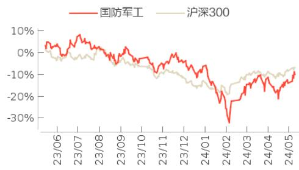

<table><tr><td>王天一</td><td>021-63325888*6126wangtianyi@orientsec.com.cn执业证书编号:S0860510120021</td></tr><tr><td>罗楠</td><td>021-63325888*4036luonan@orientsec.com.cn执业证书编号:S0860518100001</td></tr><tr><td>冯函</td><td>021-63325888*2900fenghan@orientsec.com.cn执业证书编号:S0860520070002</td></tr></table>

<table><tr><td>宁小涵</td><td>ningxiaohan@orientsec.com.cn</td></tr></table>

<table><tr><td>火箭及卫星技术加速迭代,应用端持续落地:——卫星互联网产业月报(2024年4月)</td><td>2024-05-09</td></tr><tr><td>国家队和民营火箭相继取得重大突破,国内卫星互联网发展提速:——卫星互联网产业月报(2024年3月)</td><td>2024-04-03</td></tr><tr><td>板块短暂回调后反弹,卫星互联网星座加速组网:——卫星互联网产业月报(2024年2月)</td><td>2024-03-04</td></tr><tr><td>卫星互联网:蓄势待发,星辰大海:——卫星互联网产业系列报告二</td><td>2023-11-27</td></tr></table>

# 目 录

# 1．卫星互联网是卫星通信的发展热点. 5

1.1 以卫星为中介的通信，LEO卫星系统是必然选择.  
1.2 卫星互联网爆发在即，低轨卫星竞赛已打响. 6   
1.3 卫星互联网产业链包含四大环节. .9

1.3.1 卫星制造：定制卫星中载荷和平台的成本各占 50% 9  
1.3.2 卫星发射：火箭成本占比最高且为最重要的可控成本 11  
1.3.3 地面设备：产业链中游，包括地面站及终端设备两部分 12  
1.3.4 卫星服务：高度管制行业，需要取得工信部运营牌照 13

# 2．相控阵天线是低轨卫星星地通信的标配. .. 14

2.1 与传统机械天线相比，相控阵天线优势明显 .14  
2.2 相控阵天线在低轨卫星通信中发挥重要作用. ..16

# 3．相关公司.. ... 18

3.1 国博电子 . ..18  
3.2 上海瀚讯 . ..19  
3.3 七一二.. ..20  
3.4 海格通信 . ..20  
3.5 铖昌科技 . ..21  
3.6 恪赛科技 . ..22

# 投资建议.. .. 23

# 风险提示.. .23

# 图表目录

图 1：卫星通信系统原理示意图.

图 2：全球卫星市场规模及增速.

图 3：全球新发射卫星数量及增速.

图 4：全球卫星产业链市场规模结构. 8

图 5：中国卫星互联网市场规模及增速. 8

图 6：卫星互联网产业链 9

图 7：卫星结构示意图. 9

图 8：卫星载荷构成.. ...10

图 9：卫星平台成本构成 . .11

图 10：长征六号火箭发射. ..12

图 11：猎鹰 9号火箭发射成本结构图. ..12

图 12：地面设备组成和分类. ..12

图 13：铱星卫星电话 Iridium 9575. ..13

图 14：OneWeb 卫星移动终端.. ...13

图 15：卫星运营服务包含的服务内容. ..13

图 16：无源相控阵和有源相控阵结构对比 ..15

图 17： Starlink 地面终端外形图 . ...16

图 18： Starlink 卫星外形图 . ...16

图 19：Phasor 天线效果图. ..17

图 20：天锐星通相控阵天线发射子阵.. .17

图 21：全球卫星地面设备产值及产业链占比. ..18

图 22：2022年全球卫星地面制造业构成.. ..18

图 23：国博电子 2018-2023年分产品营收（亿元） ..18

图 24：国博电子 2018-2023年分产品毛利率（%） ..18

图 25：上海瀚讯 2018-2023年分产品营收（亿元） ..19

图 26：上海瀚讯 2018-2023年分产品毛利率（%） ..19

图 27：七一二 2018-2023年分产品营收（亿元） .20

图 28：七一二 2018-2023年分产品毛利率（%） .20

图 29：海格通信 2018-2023年分产品营收（亿元） .21

图 30：海格通信 2018-2023年分产品毛利率（%） .21

图 31：铖昌科技 2018-2023年分产品营收（亿元） .21

图 32：铖昌科技 2018-2023年分产品毛利率（%） .21

图33：恪赛科技Ka高低轨卫星互联网相控阵终端 .22

图 34：恪赛科技星载4波束发射相控阵天线实物图 .22

表 1：卫星通信与蜂窝通信对比分析.

表 2：卫星轨道分类.. 6

表 3：LEO卫星系统与 GEO卫星系统对比分析.

表 4：卫星互联网的优势

表 5：各国主要卫星互联网星座部署计划. 8

表 6：国内主要卫星互联网星座计划. .9

表 7：国内卫星通信业务分类及牌照企业 ..14

表 8：传统机械天线与相控阵天线的优缺点对比. ..14

表 9：各种雷达性能对比. ..15

# 1．卫星互联网是卫星通信的发展热点

# 1.1 以卫星为中介的通信，LEO卫星系统是必然选择

卫星通信是利用卫星中的转发器作为中继站，通过反射或转发无线电信号，实现两个或多个地球站之间的通信。卫星通信是现代通信技术与航天技术的结合，并用计算机对其进行控制的先进通信方式，是目前卫星技术最具产业化的应用方向，构成了卫星产业的最主要组成部分。卫星通信可以分为空间段、地面段和运营段，空间段包括各卫星星座，地面段包括关口站和测控站，运营段包括各类用户设备及终端。

图 1：卫星通信系统原理示意图  
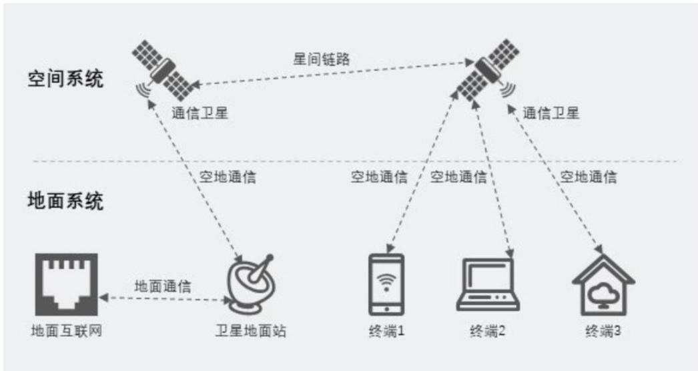  
数据来源：头豹研究院，东方证券研究所

与传统的蜂窝通信相比，卫星通信最大的不同在于中继媒介是卫星而非地面基站。

卫星通信具有如下优势：

➢ 卫星通信波束覆盖范围较广，因而打破了距离限制。  
➢ 卫星通信突破了通信地理环境的限制，甚至不受两点间的自然灾害和人为事件的影响。

表 1：卫星通信与蜂窝通信对比分析

<table><tr><td></td><td>卫星通信</td><td>蜂窝通信</td></tr><tr><td>中继媒介</td><td>通信卫星</td><td>地面基站</td></tr><tr><td>通信距离</td><td>长,最远超过1万公里</td><td>短,需多跳实现远距离传输</td></tr><tr><td>覆盖范围</td><td>大,几十或百颗卫星即可实现全球覆盖</td><td>小,仅中国便需要上百万站基站才能实现大部分覆盖</td></tr><tr><td>传输时延</td><td>几百毫秒</td><td>5G可实现几毫秒的时延</td></tr><tr><td>应用场景</td><td>航空通信;船只通信;应急通信等</td><td></td></tr></table>

数据来源：鲜枣课堂，新华网等，东方证券研究所

用于通信的卫星主要有 LEO 卫星和 GEO 卫星。按照轨道高度，卫星轨道主要可以分为 LEO(低地球轨道)、MEO(中地球轨道)、GEO(地球静止轨道)、SSO(太阳同步轨道)以及 IGSO(倾斜地球同步轨道)。不同的轨道高度对应不同的卫星应用，目前用于卫星通信的轨道主要包括 LEO 和GEO。

表 2：卫星轨道分类

<table><tr><td>卫星轨道类型</td><td>轨道高度</td><td>卫星用途</td></tr><tr><td>LEO(低地球轨道)</td><td>300-2000 千米</td><td>对地观测、测地、通信等</td></tr><tr><td>MEO(中地球轨道)</td><td>2000-35786 千米</td><td>导航</td></tr><tr><td>GEO(地球静止轨道)</td><td>35786 千米</td><td>通信、导航、气象观测等</td></tr><tr><td>SSO(太阳同步轨道)</td><td>高度小于 6000 千米</td><td>观测等</td></tr><tr><td>IGSO(倾斜地球同步轨道)</td><td>35786 千米</td><td>导航</td></tr></table>

数据来源：前瞻产业研究院，东方证券研究所

LEO 卫星系统传输延时小、链路损耗低、发射灵活、应用场景丰富、整体制造成本低，非常适合卫星互联网业务的发展。基于 LEO 和 GEO 这两种不同轨道构建的卫星通信系统，在系统寿命、容量大小、覆盖范围、系统时延、建设成本等方面，具有不同特点。GEO 卫星系统使用寿命较长，频率协调难度低，前期建设投入低，但存在两极盲区，特定场景通信存在难度，整体成本较高。LEO 卫星系统可实现全球覆盖，时延较短，应用场景丰富，是大规模卫星组网及应用卫星联网的必然选择，依靠众多卫星组网即使在单一卫星故障时仍然能提供稳定优质的服务。因此与GEO卫星相比，LEO 卫星具有传输延时小、链路损耗低、发射灵活、应用场景丰富、整体制造成本低等优点。

表 3：LEO卫星系统与 GEO卫星系统对比分析

<table><tr><td>系统轨道分类</td><td>低地球轨道 LEO</td><td>地球静止轨道 GEO</td></tr><tr><td>系统寿命</td><td>受基础器件制约,寿命约 5-10 年</td><td>寿命约 15 年</td></tr><tr><td>容量大小</td><td>单一卫星容量小,系统容量高</td><td>单一卫星容量大</td></tr><tr><td>覆盖范围</td><td>单一卫星覆盖范围极小,多卫星组成的网络可覆盖全球,复杂地形区域的通信也将得到保障</td><td>单一卫星覆盖范围大,但复杂地形通信困难,且南北两极存在通信盲区</td></tr><tr><td>终端协同</td><td>地面终端需配置伺服跟踪系统和抛物面形式的双天线(或相控阵天线)</td><td>地面终端已实现高度集成化,技术水平成熟,并向消费端加速渗透</td></tr><tr><td>系统时延</td><td>时延短,约 20ms,两卫星时间延约为 6.7ms</td><td>时延长,约为 270ms</td></tr><tr><td>链路能力</td><td>上行链路能力是地球静止轨道 GEO 的 10 倍以上</td><td>由于空间链路损耗高,上行链路能力有限</td></tr><tr><td>轨道频率资源</td><td>近地频率协调难度大,设计领地所属权问题</td><td>频率协调机制成熟且完善,协调难度低</td></tr><tr><td>建设成本</td><td>前期建设成本高,但带宽边际效用高,单位成本优势明显</td><td>多步建设系统成本低,但远距离通信成本高</td></tr></table>

数据来源：《高低轨宽带卫星通信系统特点对比分析》，头豹研究院，东方证券研究所

# 1.2 卫星互联网爆发在即，低轨卫星竞赛已打响

低轨卫星互联网具有广覆盖、低延时、宽带化、低成本等特点。卫星互联网是基于卫星通信的互联网，通过发射一定数量的卫星形成规模组网，从而辐射全球，构建具备实时信息处理的大卫星系统，是一种能够完成向地面和空中终端提供宽带互联网接入等通信服务的新型网络，具有广覆盖、低延时、宽带化、低成本等特点。LEO 卫星系统由于具有种种优点，成为了卫星互联网组网的最佳选择。

表 4：卫星互联网的优势

<table><tr><td>广覆盖</td><td>实现全球宽带无缝通信</td><td>作为地面网络的补充和延伸,实现有线电话网和地面移动通信网均无法实现的广域无缝隙覆盖,有效解决通信基础设施匮乏地区互联网接入问题</td></tr><tr><td>低延时</td><td>实现延时与地面网络相当</td><td>卫星网络布置于近地轨道,数据信号在卫星与地面终端往返传输延时被大大降低,达到几十毫秒级别的较低延时</td></tr><tr><td>宽带化</td><td>高通量卫星技术日渐成熟</td><td>高频段、多点波束和频率复用等技术的使用显著提升了通信能力,降低了单位宽带成本,能满足高信息速率业务的需求,极大的拓展了应用场景</td></tr><tr><td>低成本</td><td>建设成本低于地面通信设施</td><td>与地面5G基站和海底光纤光缆等通信基础设施相比,具有显著成本优势。现代小卫星研发制造成本低,软件定义技术又可以进一步延长在轨卫星寿命</td></tr></table>

数据来源：CCID，前瞻产业研究院，东方证券研究所

全球卫星产业规模持续增长，2012-2022年全球新发射卫星数量CAGR为34.2%。近几年全球卫星产业规模稳步增长，根据 trendforce预测 2023年全球卫星产业规模为 3083亿美元，同比增长4.5%。而据摩根士丹利的报告预测，2040 年全球太空经济的价值将达到 1 万亿美元，其中卫星互联网将占市场增长的 50%，最乐观的情况下可达 70%。从每年卫星发射数量来看，根据华经产业研究院，2012年，全球新发射卫星数量仅132颗，2022年全球新发射卫星达到2505颗，期间CAGR 为 34.2%。随着卫星互联网下游端的需求刺激，预计未来全球卫星产值还将持续增长。

图 2：全球卫星市场规模及增速  
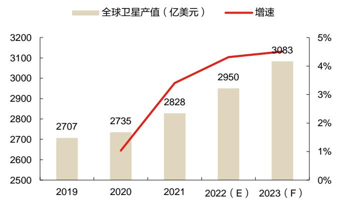  
数据来源：SIA，trend force，东方证券研究所

图 3：全球新发射卫星数量及增速  
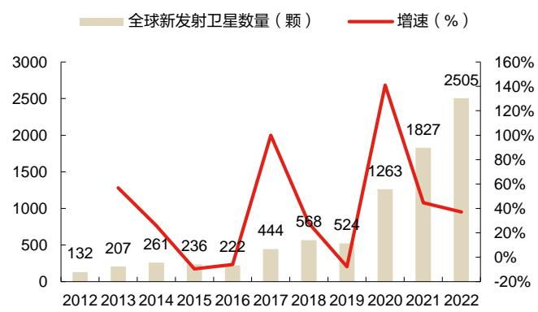  
数据来源：华经产业研究院，东方证券研究所

地面设备价值量占比高且逐年提升，2022 年占全球卫星产业链的 52%。卫星互联网产业链中的地面设备和卫星服务这两大环节价值量占比高，从全球市场来看，近五年这两个环节的价值占比之和均超过90%。且地面设备占比有逐年提升的趋势，2019年超过卫星服务后便成为了产业链中价值占比最高的环节，到2022年时地面设备占比已经高达52%。从侧面可以看出，随着Starlink、OneWeb 等星座的组网，卫星互联网下游应用端的需求逐渐打开，终端等地面设备的需求量增加，价值量占比逐渐提升。

中国卫星互联网体量较小，但发展势头强劲，预计 2021-2025 年市场规模 CAGR 达到 11.2%。据 UCS 卫星数据库统计，截至 2023 年 5 月 1 日，全球在轨运行卫星一共有 7560 颗，其中美国5184颗，中国仅有628颗。从整体规模来看，国内卫星互联网体量较小，尚处于初期发展阶段，但受益于近年来国家出台的多项鼓励推动卫星互联在各行业规模化应用的政策措施，国内卫星互联网市场发展机遇良好。根据华经产业研究院，2021 年中国卫星互联网产业规模约为 292.5 亿元，预计 2025 年将升至 446.92 亿元，2021-2025 年 CAGR 为 11.2%。

图 4：全球卫星产业链市场规模结构  
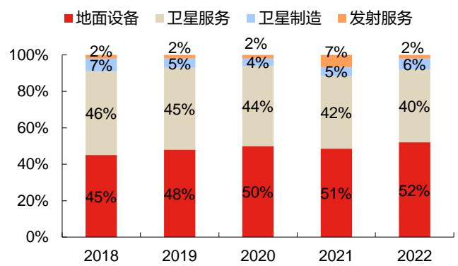  
数据来源：华经产业研究院，东方证券研究所

图 5：中国卫星互联网市场规模及增速  
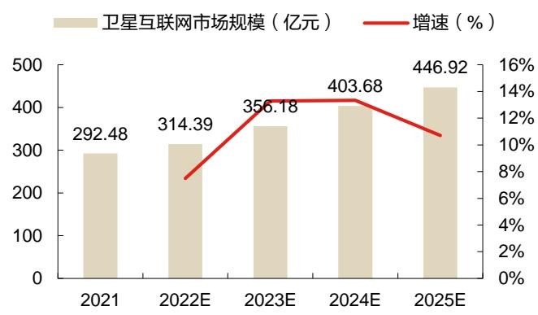  
数据来源：华经产业研究院，东方证券研究所

各国已开启低轨卫星竞赛，中国也积极布局低轨卫星互联网。低轨小卫星的研制周期短、成本低廉，传输延时更短、路径损耗更小，多个卫星组成的星座可以覆盖全球，频率复用更有效。各国已开启低轨卫星竞赛，近年来国内外多家企业提出卫星互联网计划，国外的企业主要有 OneWeb、SpaceX、Telesat等。据报道，中国也已着手构建低轨卫星通信网，国有企业将牵头发射超过 2.6万颗卫星，通信网络覆盖全球。国内多个近地轨道卫星星座计划相继启动，包括 GW 星座、G60星链、银河Galaxy等，发展后势强劲。国有企业与民营企业携手合作，有望推动中国卫星互联网产业迈向跨越式发展，领先实现空天地一体大规模互联。

表 5：各国主要卫星互联网星座部署计划

<table><tr><td>国家</td><td>星座名称</td><td>运营方</td><td>用途</td><td>卫星数量</td></tr><tr><td rowspan="5">美国</td><td>Starlink</td><td>SpaceX</td><td>宽带</td><td>42000</td></tr><tr><td>第二代铱星</td><td>铱星公司</td><td>宽带、STL</td><td>75</td></tr><tr><td>波音</td><td>波音</td><td>宽带</td><td>2956</td></tr><tr><td>Kupier</td><td>亚马逊</td><td>宽带</td><td>3236</td></tr><tr><td>Facebook Athena Project</td><td>Facebook</td><td>-</td><td>77</td></tr><tr><td>英国</td><td>OneWeb</td><td>OneWeb</td><td>宽带</td><td>2468</td></tr><tr><td rowspan="2">加拿大</td><td>Telesat</td><td>Telesat</td><td>宽带</td><td>298</td></tr><tr><td>Kepler</td><td>AAC Clyde</td><td>物联网</td><td>140</td></tr><tr><td>印度</td><td>Space Net</td><td>Astrome</td><td>宽带</td><td>150</td></tr><tr><td>俄罗斯</td><td>Yaliny</td><td>Yaliny</td><td>宽带</td><td>135</td></tr><tr><td>德国</td><td>KLEO</td><td>KLEO Connect</td><td>工业物联网</td><td>624</td></tr><tr><td>韩国</td><td>三星</td><td>三星</td><td>宽带</td><td>4600</td></tr></table>

数据来源：华经产业研究院，东方证券研究所

表 6：国内主要卫星互联网星座计划

<table><tr><td>属性</td><td>星座名称</td><td>运营方</td><td>用途</td><td>卫星数量</td></tr><tr><td rowspan="2">国企</td><td>GW 星座</td><td>中国卫星网络通信集团</td><td>卫星互联网(宽带)</td><td>12992</td></tr><tr><td>千帆星座(G60 星链)</td><td>上海垣信卫星科技有限公司</td><td>卫星互联网(宽带)</td><td>12000</td></tr><tr><td>民企</td><td>银河 Galaxy</td><td>银河航天(北京)科技有限公司</td><td>卫星互联网(宽带)</td><td>1000</td></tr></table>

数据来源：华经产业研究院，同花顺财经，新财富，东方证券研究所

# 1.3 卫星互联网产业链包含四大环节

卫星互联网产业链主要包含了卫星制造、卫星发射、地面设备、运营及服务四大环节。其中卫星制造环节主要包括卫星平台和卫星载荷。卫星平台包括姿控系统、电源系统、结构系统、星务系统、测控系统及热控系统等。卫星载荷包括天线分系统、转发器分系统以及其他金属/非金属材料和电子元器件等。卫星发射环节包括火箭制造以及发射服务。地面设备环节主要包括固定地面站、移动式地面站（静中通、动中通等）以及用户终端。卫星运营及服务主要包括卫星移动通信服务、宽带广播服务以及卫星固定服务。

图 6：卫星互联网产业链  
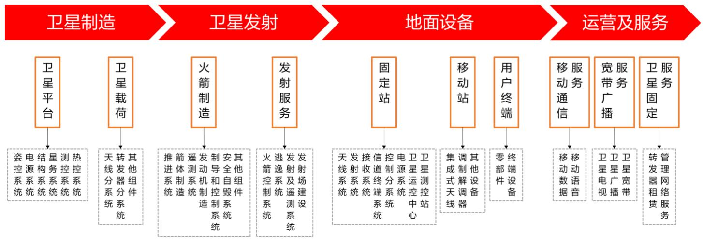  
数据来源：赛迪顾问，东方证券研究所

# 1.3.1 卫星制造：定制卫星中载荷和平台的成本各占 50%

卫星制造处于卫星产业链的上游，包括卫星载荷和卫星平台的制造。单从卫星生产和测试上来看，卫星的生产制造模式与火箭类似，都是由设计、生产、测试、总装组成。但是由于卫星不像火箭那样具备一个非常核心的动力系统，更注重卫星的功能，所以它的系统和供应商均比较复杂。并且和火箭相比，卫星和传统的制造业有更多相似的地方，这就使得卫星产业链的变化趋势具备制造业的特质。卫星一般包括卫星载荷与卫星平台两部分。目前在定制卫星中载荷和平台成本各占50%，但是随着卫星的批量化生产，平台的成本占比能降到 30%，理想状态能到 20%。

图 7：卫星结构示意图

有关分析师的申明，见本报告最后部分。其他重要信息披露见分析师申明之后部分，或请与您的投资代表联系。并请阅读本证券研究报告最后一页的免责申明。

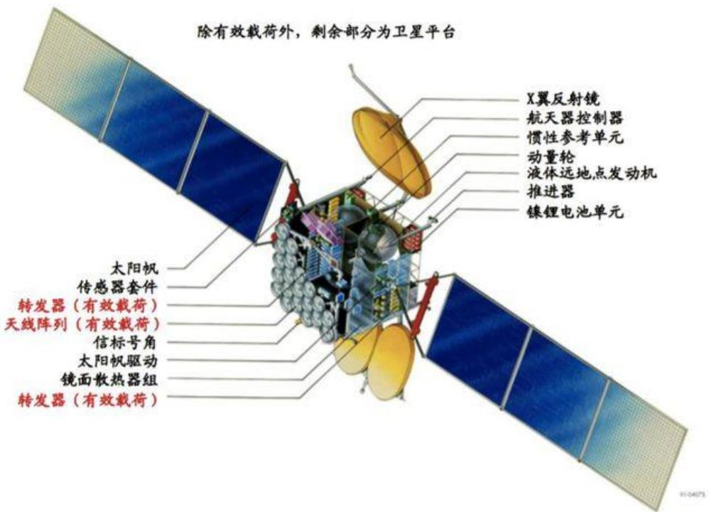  
数据来源：Boeing，东方证券研究所

卫星载荷主要包括转发器分系统和天线分系统。根据电子发烧友测算，如果以通信卫星中平台成本占 30%、载荷成本占70%计算，卫星载荷成本中天线分系统占到大头的 75%。

转发器分系统占卫星载荷总成本的 25%。星载转发器负责将收到的信号经放大、移频后发射给地面。功率放大器是星载转发器的必备器件，其能量转化效率影响星上热处理和有效载荷容量，最终影响飞行器的重量和体积。目前采用的星载放大器主要包括行波管放大器 TWTA、固态功率放大器 SSPA 以及速调管放大器 KPA三类 。其中 SSPA主要应用于低轨通信卫星系统，TWTA主要应用于高轨高通量卫星系统，而 KPA 则广泛应用于电视广播系统的上行站和一些带宽较窄的FDMA 地面站。

天线分系统占卫星载荷总成本的 75%。天线分系统用来实现空间中的电磁波信号与电缆中的电信号的转换，功能上分为接收天线和发射天线。通信卫星的天线分系统主要包括反射面天线、多波束天线和大型可展开天线等。其中多波束天线中的多波束相控阵天线是低轨卫星的核心载荷之一，星载相控阵天线一般为有源相控阵天线。天线中的 T/R 组件负责信号的发射和接收并控制信号的幅度和相位，从而完成波束赋形和波束扫描，其指标直接影响天线的指标，对性能起至关重要的作用。根据电子发烧友，作为有源相控阵天线的核心，T/R 组件的成本可以占据天线成本的 50%以上。

图 8：卫星载荷构成

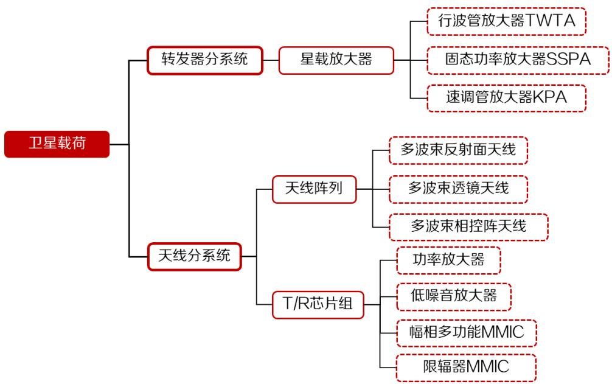  
数据来源：电子发烧友网，东方证券研究所

卫星平台成本占比呈下降趋势，平台中姿控系统和电源系统成本占比高。卫星平台是有效载荷的服务系统，用于保障卫星从运载火箭起飞到工作寿命终止星上所有分系统的正常工作。定制卫星中平台成本占比较高为 50%，在批量卫星中为 30%，而商业公司期待的理想值为 20%。卫星平台一般由姿控系统（占平台成本 40%）、电源系统（22%）、结构系统（12%）、星务系统（10%）、测控系统（9%）、热控系统（7%）等六部分构成。从平台结构上看，为卫星提供机动能力和电力是它的核心作用，所以姿控系统和电源系统的成本占比最大，占卫星平台总成本的60%以上。

图 9：卫星平台成本构成  
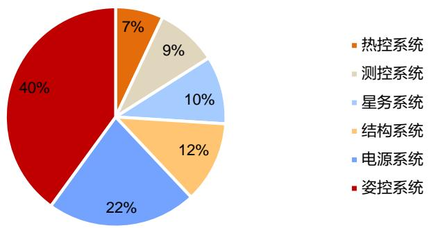  
数据来源：艾瑞咨询，东方证券研究所

# 1.3.2 卫星发射：火箭成本占比最高且为最重要的可控成本

卫星发射是运载火箭运送人造卫星起飞、加速、进入预定轨道的过程。卫星发射服务包括火箭制造和发射服务，卫星发射成本包含火箭成本、发射成本、测控成本、保险费用以及留存利润。一般来说在发射运载火箭的成本构成中，火箭成本占比最高且是民营火箭公司最重要的可控成本。以 SpaceX 公司的猎鹰 9 号火箭为例，火箭成本占比达到了发射总成本的 53%，占比最高。

SpaceX 公司作为在位企业，主要通过对原材料采购成本的控制与对优质生产技术的专控两种方式，降低运载火箭成本获得绝对成本优势，使潜在进入者处于相对劣势。

图 10：长征六号火箭发射  
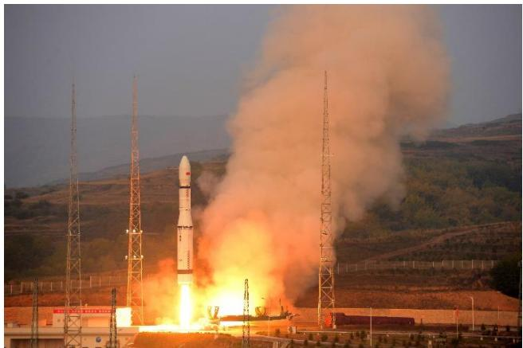  
数据来源：上海航天技术研究院，东方证券研究所

图 11：猎鹰 9号火箭发射成本结构图  
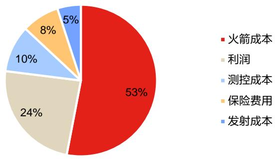  
数据来源：《美国卫星产业组织研究》，东方证券研究所

# 1.3.3 地面设备：产业链中游，包括地面站及终端设备两部分

地面设备处于低轨卫星通信系统的中游，随着低轨卫星通信系统空间段的完善落地，将逐渐带动地面段的投资。卫星地面设备制造环节分为地面站及终端设备两部分。在卫星通信系统中，地面站负责发送和接收卫星信号，并对卫星网络进行管理，通常也称为地球站。根据是否可以移动，将地面站分为固定站、移动站（动中通车载站/船载站/机载站）和可搬移站(静中通车载站、便携站、背负站)。

图 12：地面设备组成和分类  
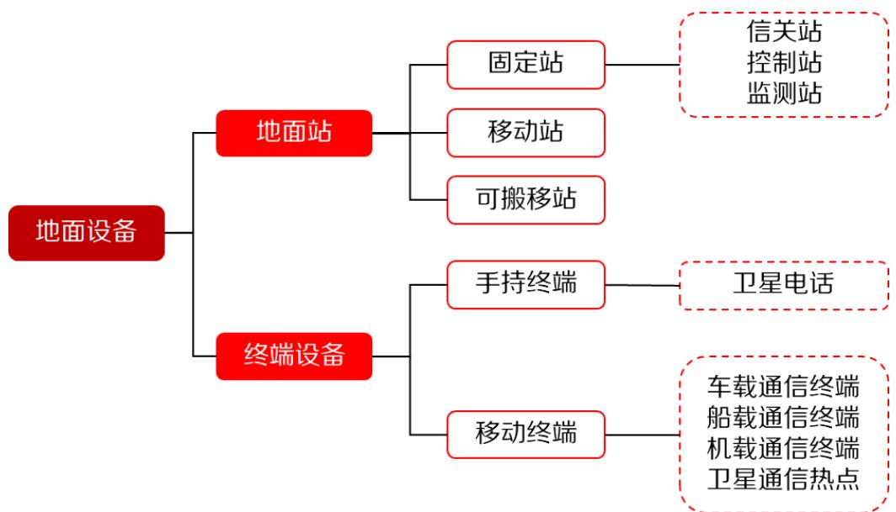  
数据来源：《新基建与高质量发展研究》，东方证券研究所

地面设备中的终端设备主要分为手持终端（卫星电话）和移动终端（车载、船载、机载通信终端、卫星通信热点）等。便携式/车载式卫星移动通信终端一般使用一体化平板天线设计，同时配备与动中通天线接口。终端设备与通信卫星间的链路称为接入链路，用户接入后即可实现卫星实时通信。按照应用场景的不同，可以将卫星移动通信的主要用户分为海上用户、航空用户、陆地用户、

M2M 用户和政府用户。不同用户对应的终端价格有所不同，根据中国信息通信研究院的研究，民用卫星移动通信终端价格在5000元左右，单兵手持终端约2万元，而车载式和便携式终端价格大约为 20 万。

图 13：铱星卫星电话 Iridium 9575  
  
数据来源：铱星官网，东方证券研究所

图 14：OneWeb卫星移动终端  

  
数据来源：OneWeb官网，东方证券研究所

# 1.3.4 卫星服务：高度管制行业，需要取得工信部运营牌照

卫星运营服务包括卫星移动通信服务、宽带广播服务和卫星固定服务等。其中卫星移动通信服务和宽带广播服务属于地面段运营服务，而卫星固定服务则属于空间段运营服务。地面段运营服务是运营者利用合法使用的卫星转发器资源，组建相应类型的卫星通信网设施或通信系统，为用户提供语音、数据、多媒体通信等通信业务。空间段运营服务则包括卫星转发器出租、出售业务，是指将卫星转发器资源向卫星使用者出租或出售，以供卫星使用者利用该卫星资源进行相应应用的业务。

图 15：卫星运营服务包含的服务内容  
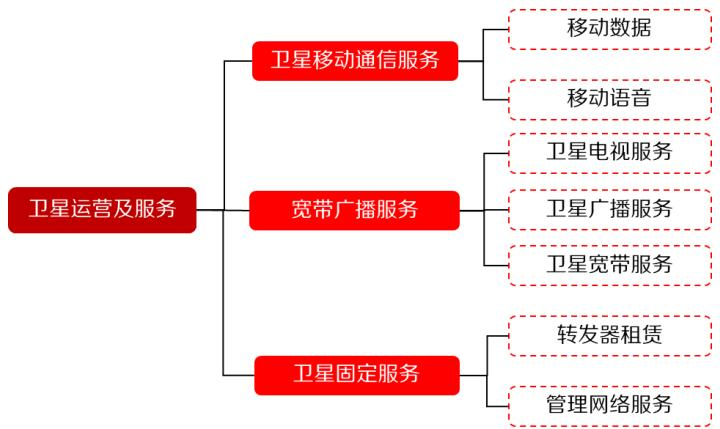  
数据来源：赛迪顾问，东方证券研究所

国内卫星通信服务属于高度管制行业，需要获得工信部运营牌照才能展开相关经营活动。根据《电信业务分类目录（2015 版）》，我国卫星通信业务分为两类，第一类中包括卫星移动通信业务和卫星固定通信业务，第二类中包括卫星转发器出租、出售业务和国内甚小口径终端地球站通信业务。目前国内拥有第一类卫星通信业务牌照的仅有中国卫通、中国电信和中国交通通信信息中心；国内拥有第二类中卫星转发器出租、出售业务牌照的仅有中国卫通、中国电信和中信数字媒体网络有限公司。而取得第二类中的国内甚小口径终端地球站通信业务的企业数量则相对较多。

表 7：国内卫星通信业务分类及牌照企业

<table><tr><td>卫星通信业务</td><td>分类</td><td>牌照企业</td></tr><tr><td rowspan="2">第一类 A13</td><td>A13-1 卫星移动通信业务</td><td rowspan="2">中国卫通、中国电信和中国交通通信信息中心</td></tr><tr><td>A13-2 卫星固定通信业务</td></tr><tr><td rowspan="2">第二类 A23</td><td>A23-1 卫星转发器出租、出售业务</td><td>中国卫通、中国电信和中信数字媒体网络有限公司</td></tr><tr><td>A23-2 国内甚小口径终端地球站通信业务</td><td>企业数量较多</td></tr></table>

数据来源：《电信业务分类目录（2015年版）》，前瞻产业研究院，东方证券研究所

# 2．相控阵天线是低轨卫星星地通信的标配

# 2.1 与传统机械天线相比，相控阵天线优势明显

相控阵天线指的是，通过控制阵列天线中辐射单元的馈电相位，来改变方向图形状的天线。控制相位可以改变天线方向图最大值的指向，以达到波束扫描的目的。在特殊情况下，也可以控制副瓣电平、最小值位置和整个方向图的形状，例如获得余割平方形方向图和对方向图进行自适应控制等。用机械方法旋转天线惯性大、速度慢，相控阵天线则克服了这一缺点，波束的扫描速度很高。它的馈电相位一般用电子计算机控制，相位变化速度很快（毫秒量级），天线方向图最大值指向或其他参数的变化迅速。

# 相控阵天线最突出的特点包括：

1) 多波束成形和快速扫描，相控阵天线可以在一个重复周期内通过转换波束形成多个指向不同的发射波束和接收波束，这些波束可相互独立，且具有快速扫描捷变能力；  
2) 波束赋形，通过调整相控阵阵列中各单元通道内信号幅度与相位，可改变天线方向图函数或天线波束形状；  
3) 抗干扰能力强，相控阵天线可集中多个辐射单元的功率形成大功率模式，也可以通过自适应控制能量和主瓣增益向不同方向发射所需能量，从而提高其抗干扰能力；  
4) 系统可靠性高，相控阵系统的阵列组件较多，且并联使用，即使部分组件功能丧失，系统仍能正常工作，这极大提高了系统的可靠性。

数据来源：《基于相控阵的卫星“动中通”天线现状及展望》，东方证券研究所  
表8：传统机械天线与相控阵天线的优缺点对比

<table><tr><td>对比项</td><td>传统机械天线</td><td>相控阵天线</td></tr><tr><td>优点</td><td>(1)天线效率高,性能好(2)天线的指向角调整范围大,在高纬度地区(低仰角)仍保持与GEO卫星的正常连接</td><td>(1)平板天线只有很少或没有移动部件,不会产生决定天线寿命的移动部件磨损情况(2)可实现瞬间波束切换和对星,从而实现持续稳定和低时延的通信(3)天线低轮廓、重量轻、尺寸小,可与载体平面共形,满足运输通过性要求</td></tr><tr><td>缺点</td><td>(1)机械转动天线的重量重、尺寸大,应用场景局限于对重量和尺寸要求不高的环境(2)机械转动天线有较多的移动部件,长时间的持续工作容易发生机械故障,并且维护困难(3)终端天线一次只能连接一个卫星波束,如果需要跟踪多个卫星,则必须建设多副天线,其切星速度也低</td><td>(1)扫描范围受限,一般在±60度范围内,对于同步轨道卫星,其增益损失较大,效率较低,但对非同步轨道卫星,其扫描受限问题将消失(2)极化隔离度问题(3)功耗、温控(4)当前阶段成本高</td></tr></table>

相控阵天线分为无源相控阵天线和有源相控阵天线。相控阵天线作为阵列天线的分支，通过在每个单元天线通道中集成移相器从而实现波束的快速扫描。因其具有高增益、低旁瓣以及波束赋形等优点，一直是天线领域研究的热点。相控阵天线可以分为无源相控阵天线和有源相控阵天线。相较于无源相控阵天线，有源相控阵天线的优点是使用微波集成的方法，将移相器、滤波器、衰减器、功放和低噪放等集成在芯片中，实现了设备的小型化、轻型化，波束指向精度较高且具备一定的波束旁瓣抑制能力。

图 16：无源相控阵和有源相控阵结构对比  
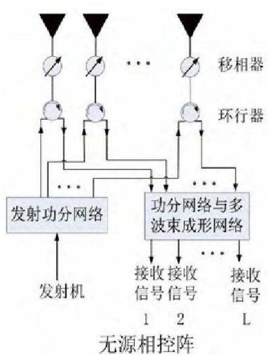

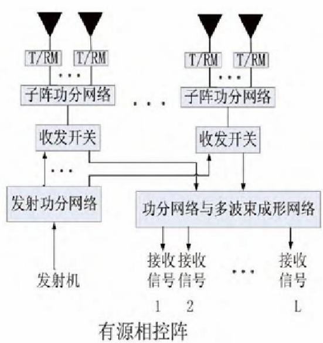  
数据来源：《相控阵天线的基本原理及其典型星载应用》，东方证券研究所

最初相控阵天线只在雷达方向、军事范围内有所应用。有源相控阵雷达波束切换快、抗干扰能力强，输出功率为传统机械扫描雷达的 3-4 倍；同时相比无源相控阵雷达失效率低、可靠性高，在频宽、功率、效率以及冗度设计方面均有更大优势。总之，有源相控阵雷达在相同的孔径与工作波长下，反应速度、目标更新速率、多目标追踪能力、分辨率、多功能性、电子反对抗能力都更为突出。

数据来源：《应用于相控阵收发组件的射频/微波集成电路设计》，东方证券研究所  
表 9：各种雷达性能对比

<table><tr><td></td><td>机械扫描</td><td>无源相控阵</td><td>有源相控阵</td></tr><tr><td>扫描速度</td><td>慢</td><td>快</td><td>快</td></tr><tr><td>孔径利用</td><td>固定</td><td>固定</td><td>可分区</td></tr><tr><td>波束形状</td><td>固定</td><td>固定</td><td>可按功能选取</td></tr><tr><td>馈线损耗</td><td>大</td><td>大</td><td>小</td></tr><tr><td>效率</td><td>低</td><td>较低</td><td>高</td></tr><tr><td>发射功率管理</td><td>不易</td><td>不易</td><td>容易</td></tr><tr><td>数据更新率</td><td>低</td><td>高</td><td>高</td></tr><tr><td>多目标跟踪精度</td><td>低</td><td>高</td><td>高</td></tr><tr><td>变速扫描</td><td>难</td><td>难</td><td>易</td></tr><tr><td>雷达截面积</td><td>大,不利于隐身</td><td>小,利于隐身</td><td>小,利于隐身</td></tr><tr><td>多功能性</td><td>差</td><td>佳</td><td>最佳</td></tr><tr><td>抗干扰性</td><td>差</td><td>佳</td><td>最佳</td></tr><tr><td>数字化程度</td><td>几乎都采用模拟电路</td><td>一般</td><td>较高</td></tr><tr><td>可靠性</td><td>差</td><td>佳</td><td>最佳</td></tr><tr><td>深测距离</td><td>近</td><td>远</td><td>约提高40~50%</td></tr><tr><td>采购费用</td><td>低</td><td>高</td><td>最高</td></tr><tr><td>体积</td><td>大</td><td>较大</td><td>小</td></tr></table>

# 2.2 相控阵天线在低轨卫星通信中发挥重要作用

随着科技的发展，相控阵天线技术开始在通信等领域发挥作用。相控阵平板天线在卫星通信领域越来越受欢迎，但同步轨道应用存在一些限制。主要是由于其扫描角度有限，通常超过60 度会导致天线的增益损失、效率降低。相控阵天线也可以设计为曲面，提高扫描范围，但这会导致天线控制更复杂、成本更高。然而，近几年随着中轨和低轨卫星星座越来越普遍，卫星通信市场正在从静止轨道卫星转向非静止轨道卫星。相控阵天线将不再局限于指向赤道上空的固定静止轨道卫星，可在其高性能的扫描范围内，在不同的非静止轨道卫星之间进行切换，天线扫描角度受限的问题将会消失。

相控阵系统为低轨卫星“星-地”通信的标配。由于低轨卫星相对于地面终端快速移动，机扫天线只能实现单波束的移动，不能改变波束的形状及实现多移动波束模式，机械可移动装置的采用又往往可能导致可靠性下降、重量增加等新问题，因此以抛物面天线为主的传统机械天线进行持续连接非常困难。而相控阵天线主要通过控制阵列天线中辐射单元的馈电相位来改变方向图形状，控制相位可以改变天线方向图最大值的指向，以达到波束扫描的目的，因此相控阵天线可以实现极窄卫星信号波束快速对准，解决“星-地”实时跟踪难题，是卫星互联网规模化应用的必要设备，也是当前低轨卫星商用的重要攻关点。

空间段及用户终端均采用有源相控阵天线。相控阵天线以其小型化、快速扫描、高增益、低旁瓣以及波束赋形等突出优点，已经在卫星及终端中得到广泛应用。比如美国 Space X 的 Starlink 卫星及地面终端均采用了有源相控阵天线。在空间段主要是利用相控阵天线的同时多点波束、敏捷波束和空域滤波能力，在用户终端则是看重其低轮廓、灵活波束形成处理、空域自适应调零滤波以及潜在的低成本等特点。

图 17： Starlink 地面终端外形图

图 18： Starlink 卫星外形图

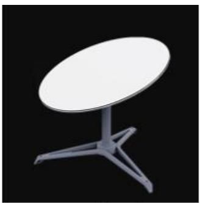  
（a）第一代

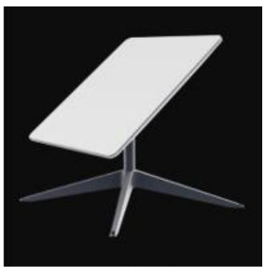  
（b）第二代  
数据来源：Starlink 系统分析及对我国卫星互联网发展的启示，东方证券研究所

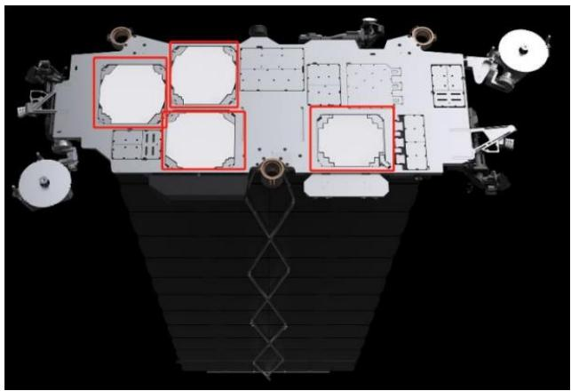  
数据来源：Starlink 官网，东方证券研究所

相控阵天线非常有利于 NGSO卫星通信。相控阵天线运用在卫星用户终端时需要考虑移动卫星通信中的发射多波束切换管理、避免干扰其他卫星、多星信号灵活接收以及 GEO 与 LEO/MEO 系统的相互操作等问题。对于 LEO/MEO 卫星通信，卫星在轨道上不停地快速运动，地面天线要保持跟踪天空中“飞行”的卫星，并能很快地从跟踪一颗卫星切换到另一颗，如果使用传统机械式天线，除非是双天线，否则无法在不造成通信中断的情况下连续跟踪卫星。相控阵天线等电扫描平板天线的应用将大大改善上述情况，由于没有机械部件，且具备低轮廓、高可靠性等特点，甚至一副天线可以支持多星同时工作，相控阵天线非常有利于 NGSO（非地球同步轨道） 卫星通信。

国内外厂商积极推进相控阵天线在卫星通信终端上的应用。国际上几家较有名的电扫描平板天线厂家包括 Phasor 公司、C-COM 公司、Isotropic 公司、SatixFy 公司、ThinKom 公司和 AvL 公司等。Phasor 公司研发的低成本相控阵天线，具有重量轻、面积小、精度高和扩展能力强等特点。其采用共形设计，以便在更大的 180°范围内扫描，双波束技术使 LEO 和 GEO 可互操作。国内方面，恪赛科技、天锐星通等新锐毫米波公司在相控阵天线的研制方面取得了不错的进展。恪赛科技研发的卫星通信产品包括车载、船载、机载和星载相控阵，目前相控阵终端的年产能可达10000 套。天锐星通目前已量产的产品覆盖应用于卫星通信（Ka 和 Ku 频段）和 5G 毫米波场景的 CMOS相控阵芯片、相控阵天线阵面、相控阵快速测试系统。

图 19：Phasor 天线效果图  
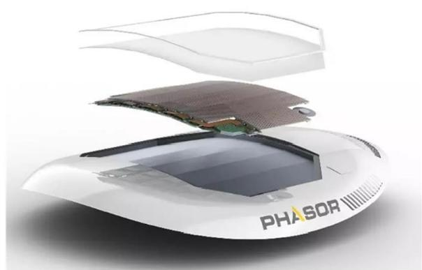  
数据来源：《卫星通信中相控阵天线的应用及展望》，东方证券研究所

图 20：天锐星通相控阵天线发射子阵  
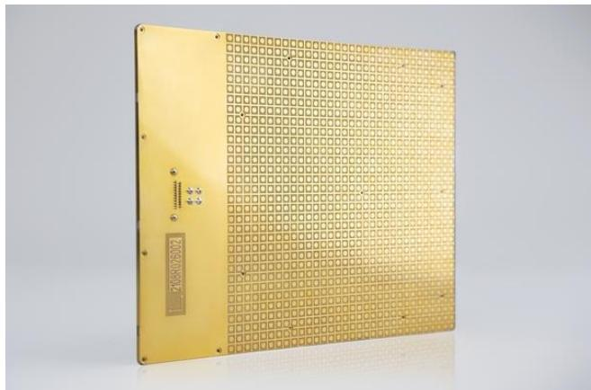  
数据来源：天锐星通官网，东方证券研究所

全球卫星地面设备产值逐年增长，卫星通信终端占比有望提升。其中近年来，随着全球地面设备制造业的快速发展，地面设备制造业逐渐取代卫星服务业，成为卫星产业链内第一大细分领域。据 SIA数据，2022年全球卫星地面设备产值为 1450亿美元，在卫星产业链中占比高达 52%。从制造业的角度看，地面设备又可分为卫星导航设备、网络设备和大众消费设备三大领域。根据SIA 数据，2022 年卫星导航设备在地面设备中的占比高达 77%，而网络设备只有 11%，大众消费设备也只有 12%。随着低轨通信卫星产业的迅速发展，大众消费设备和网络设备的占比有望得到提升。

图 21：全球卫星地面设备产值及产业链占比  
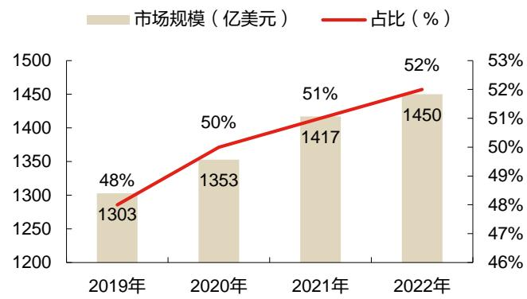  
数据来源：SIA，东方证券研究所

图 22：2022年全球卫星地面制造业构成  
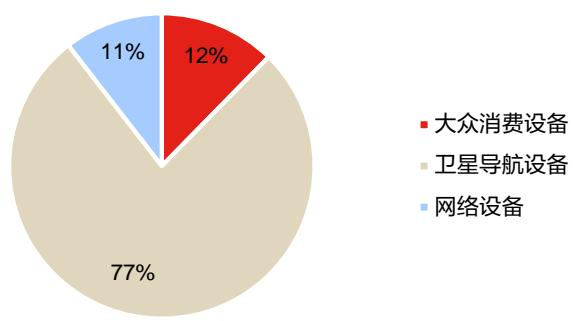  
数据来源：SIA，东方证券研究所

# 3．相关公司

# 3.1 国博电子

有源相控阵 T/R组件领先企业，助力我国构建自主可控产业链。公司成立于 2000年 11月，是目前国内能够批量提供有源相控阵 T/R 组件及系列化射频集成电路产品的领先企业，核心技术达到国内领先、国际先进水平。防务领域，国博电子作为参与国防重点工程的重要单位，长期为陆、海、空、天等各型装备配套大量关键产品，确保了以 T/R 组件为代表的关键军用元器件的国产化自主保障，为我国国防装备发展做出了重要贡献。民用领域，国博电子作为基站射频器件核心供应商，为我国自主可控产业链构建和产业链安全做出了重大贡献。

公司积极向卫星通信领域拓展，多款产品已开始交付客户或被客户引入。卫星网络与地面基站网络的融合发展趋势越来越清晰，它们正从目前独立组网方式，向着未来更加紧密的联合组网、协同服务的方向发展。在这个发展过程中，高性能射频集成电路的作用不容忽视。2023年 3月国博电子在投资者互动平台表示，公司在 6G 相关技术的卫星互联网组件、毫米波芯片等多方向保持研发跟进并具备相关技术储备。据 2023 年年报披露，公司积极开展 T/R 组件应用领域拓展，在低轨卫星和商业航天领域均开展了技术研发和产品开发工作，多款产品已开始交付客户。同时公司已开展卫星通信领域多个射频集成电路的技术研发和产品开发工作，多款产品已被客户引入。

图 23：国博电子 2018-2023年分产品营收（亿元）

图 24：国博电子 2018-2023年分产品毛利率（%）

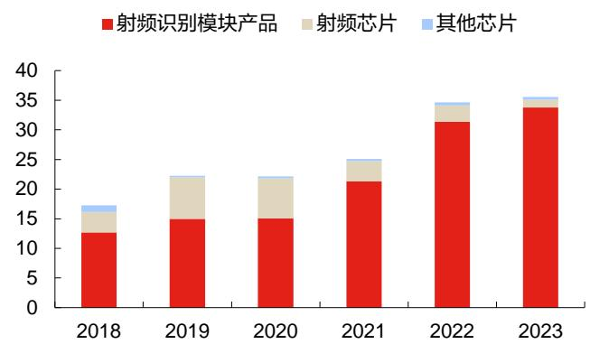  
数据来源：Wind，东方证券研究所

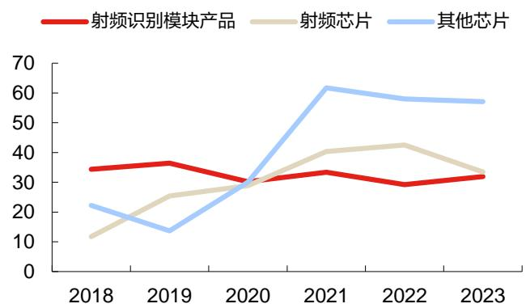  
数据来源：Wind，东方证券研究所

# 3.2 上海瀚讯

专注行业宽带移动通信，实现研发生产自主可控的全产业链布局。公司成立于 2006 年 3 月，是在新一代宽带移动通信领域长期研究积累基础上，聚焦国家 4G/5G 长期技术发展及军队信息化升级等重大战略逐步发展起来的，主要从事行业宽带移动通信设备的研发、制造、销售及工程实施，结合业务应用软件、指挥调度软件等配套产品，向军方客户和铁路等行业客户提供行业宽带移动通信系统的整体解决方案。公司产品覆盖行业宽带通信芯片、通信模块、终端、基站、应用系统等，已形成了“芯片－模块－终端－基站－系统”的全产业链布局，实现了研发生产自主可控，并多次在客户宽带移动通信项目的评比中位列性能第一。在行业宽带移动通信领域，公司在技术储备、产品化能力、型号装备数量和市场占有率方面都处于领先地位。

参与低轨卫星星座建设，公司中标多个低轨卫星相关项目。根据公司 2023 年年报披露，公司已经开始启动低轨卫星通信分系统设备研制工作，参与相关低轨卫星星座项目建设，作为该星座通信分系统承研单位，负责该星座通信分系统的保障与支撑，研制并供给相关卫星通信载荷、卫星通信终端等关键通信设备。公司成功中标相关低轨卫星星座地基基站与测试终端研制项目，首批次产品已于年底顺利交付。公司中标入围低轨卫星星座一期卫星通信载荷产品研制，载荷预计于2024投产，配合相关星座2024年发射规划，实现交付上星。2024年5月6日公布的《低轨卫星星座通信仿真与验证平台项目（第二次）中标结果公示》中也显示上海瀚讯中标，该项目招标人为上海垣信，金额合计 2000万元左右。

图 25：上海瀚讯 2018-2023年分产品营收（亿元）  
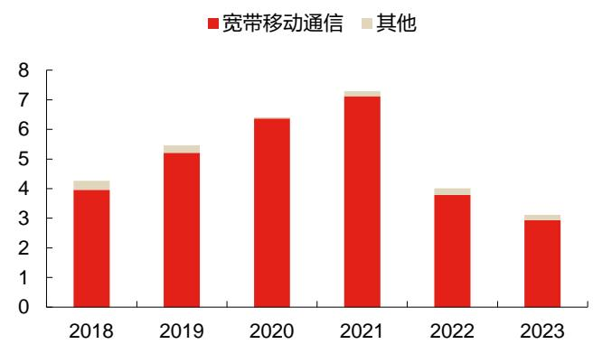  
数据来源：Wind，东方证券研究所

图 26：上海瀚讯 2018-2023年分产品毛利率（%）  
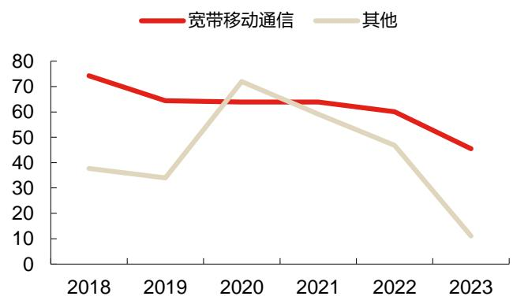  
数据来源：Wind，东方证券研究所

# 3.3 七一二

公司始终服务于国家及国防战略，专注推进我国专网无线通信行业发展。公司成立于 2004 年 10月，是我国专网无线通信领域的核心供应商，拥有国家级企业技术中心和工业设计中心，是国家高新技术企业和国家技术创新示范企业。作为国内专用无线通信领域的奠基者和开拓者，公司创造了多项国内第一。公司率先研制成功第一代超短波通信电台，第一代航空抗干扰电台，第一代铁路列调电台、第一代海事自动识别系统等。公司始终服务于国家及国防战略，专注推进我国专网无线通信行业发展，主营业务包括专用无线通信、民用无线通信等领域。公司深度参与了专用互联网、数据链、卫星通信、卫星导航、铁路及城市轨道交通无线通信等诸多通信体制的制定，打造了核心竞争力。

无线通信领域的核心供应商，公司部分产品应用涉及卫星通信与导航领域。在军用无线通信领域，公司是国内最早的军用无线通信设备的研发、制造企业之一，拥有完整的科研生产资质。公司主要产品包括无线通信终端产品和系统产品，产品形态包括手持、背负、车载、机载、舰载、弹载等系列装备，实现了从短波、超短波到卫星通信等宽领域覆盖。在民用无线通信领域，主要产品包括铁路无线通信和城市轨道交通无线通信终端及系统产品，广泛应用于铁路、地铁和轻轨、海事、石油、矿山等领域。公司在投资者互动平台表示，公司部分产品应用涉及卫星通信与导航领域，产品包括某频段卫星通信设备、某北斗三号卫星导航设备、北斗三号精密进近地面设备、领航仪、便携式差分北斗起降引导设备等多种设备。

图 27：七一二 2018-2023年分产品营收（亿元）  
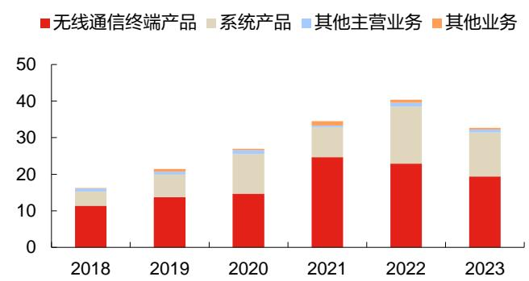  
数据来源：Wind，东方证券研究所

图 28：七一二 2018-2023年分产品毛利率（%）  
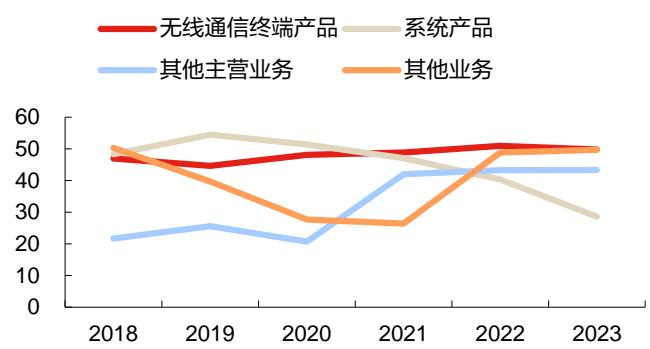  
数据来源：Wind，东方证券研究所

# 3.4 海格通信

公司主要业务覆盖“无线通信、北斗导航、航空航天、数智生态”四大领域，其中在无线通信领域实现天、空、地、海全域布局。公司成立于 2000 年 8 月，是国家创新型企业、全国电子信息百强企业之一的广州数字科技集团的主要成员企业，是全频段覆盖的无线通信与全产业链布局的北斗导航装备研制专家、新一代数智生态建设者。公司是行业内用户覆盖最广、频段覆盖最宽、产品系列最全、最具竞争力的重点电子信息企业之一，主要业务覆盖“无线通信、北斗导航、航空航天、数智生态”四大领域。公司多年来为我国陆军、海军、空军、二炮等各军兵种以及武警、人防等提供通信、导航装备和服务，取得了良好的经济、社会和军事效益。在无线通信领域，公司主导产品覆盖短波通信、超短波通信、卫星通信、数字集群、多模智能终端和系统集成等领域，实现天、空、地、海全域布局。

公司全方位布局卫星通信领域，与多家手机、汽车厂商开展合作。公司正积极参与当前国家快速推进的卫星互联网重大工程项目，全方位布局卫星通信领域。公司是国内拥有全系列卫星（包括天通）终端及芯片的主流厂家和优势企业，是特殊机构市场卫星通信地面终端的主要供应商之一。在民用卫星通信应用领域，公司抓住卫星通导大众化应用的机遇，成为多款支持“手机直连卫星”功能的手机终端关键零部件供应商之一，与多家主流手机厂商建立了良好合作关系，发展势头良好；卫星互联网通信设备在乘用车领域应用稳步推进，“汽车直连卫星”业务取得突破。

图 29：海格通信 2018-2023年分产品营收（亿元）  
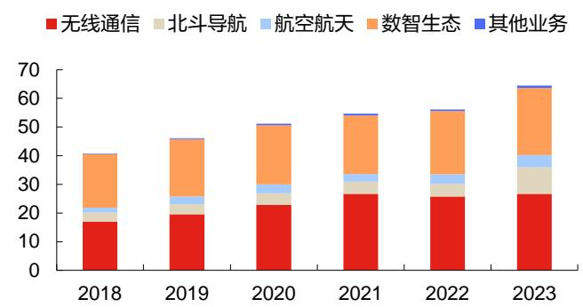  
数据来源：Wind，东方证券研究所

图 30：海格通信 2018-2023年分产品毛利率（%）  
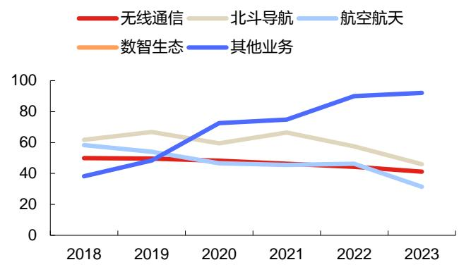  
数据来源：Wind，东方证券研究所

# 3.5 铖昌科技

专注于相控阵 T/R芯片，积极拓展下游应用。公司成立于 2010年 11月，是一家以微波毫米波模拟相控阵 T/R 芯片研发、生产、销售和技术服务为主营业务的公司，是国内少数能够提供相控阵T/R 芯片完整解决方案的企业之一。公司主要向市场提供基于 GaN、GaAs 和硅基工艺的系列化产品以及相关的技术解决方案。公司产品主要包含功率放大器芯片、低噪声放大器芯片、模拟波束赋形芯片及相控阵用无源器件等，频率可覆盖 L波段至W 波段。产品已应用于探测、遥感、通信、导航、电子对抗等领域，在星载、机载、舰载、车载和地面相控阵雷达中列装，亦可应用至卫星互联网、5G毫米波通信、安防雷达等场景。

公司积极参与到卫星互联网领域，助力我国卫星互联网快速、高质量、低成本发展。在卫星互联网方面，公司充分发挥技术创新优势，成功推出星载和地面用卫星互联网相控阵 T/R 芯片全套解决方案；其中值得一提的是，公司研制的硅基毫米波模拟波束赋形芯片系列产品的性能优异，目前已与多家科研院所及优势企业开展合作，从元器件层面助力我国卫星互联网快速、高质量、低成本发展。公司推出的星载相控阵 T/R 芯片系列产品在某系列卫星中实现了大规模应用，该芯片的应用提升了卫星雷达系统的整体性能，达到了国际先进水平。

图 31：铖昌科技 2018-2023年分产品营收（亿元）

图 32：铖昌科技 2018-2023年分产品毛利率（%）

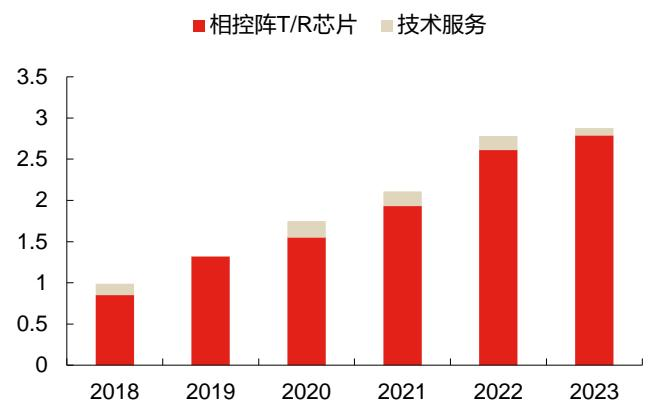  
数据来源：Wind，东方证券研究所

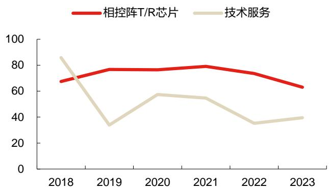  
数据来源：Wind，东方证券研究所

# 3.6 恪赛科技

公司注重技术研发，具备多年技术沉淀，目前研发人员占比超过 60%。成都恪赛科技有限公司成立于 2015 年 4 月，坐落在成都高新西区，是一家专业从事毫米波段低成本卫星通信用相控阵天线、 5G 毫米波 Aip 射频前端模组的研发、生产、销售、服务为一体的高新技术企业。公司现有员工 100 余人，其中研发人员占比超过 60%。恪赛科技拥有国内顶尖的毫米波相控阵技术专家组成的技术团队，国内领先水平的毫米波相控阵研发、测试验证平台和生产基地，具备丰富的理论知识和工程经验，以及多年的技术沉淀，目前公司已经获得国家专利 60余项。

公司采用低成本架构技术研发出多款功能强大的卫星互联网终端和星载相控阵天线。恪赛科技采用基于高低频一体化集成的低成本有源相控阵天线架构技术，具有高速、高精准矢量旋转校准算法，先进阵面技术，低成本多通道MMIC芯片，低成本多层高密度PCB实现工艺技术，并能够高效降低加工、测试成本。公司研发的卫星通信产品包括车载、船载、机载和星载相控阵，目前相控阵终端的年产能可达 10000套。公司研发的 Ka高低轨卫星互联网相控阵终端采用阵面、TR高密度集成设计思想，具有剖面低、重量轻等特点，可以实现图像、语音、视频的实时传输。Ku 卫星互联网相控阵终端能贮存 10 颗以上卫星的星位参数，能够与 Ku 波段卫星资源终端相匹配，并且具备一键式对星、实时程序跟踪或自动跟踪等功能。针对低轨卫星，恪赛科技也研制了多款基于硅基芯片的星载相控阵天线，如公司近日发布的星载 4 波束发射相控阵天线，星载 4 波束接收相控阵天线和星载 Ka频段相控阵天线。

图 33：恪赛科技 Ka高低轨卫星互联网相控阵终端  
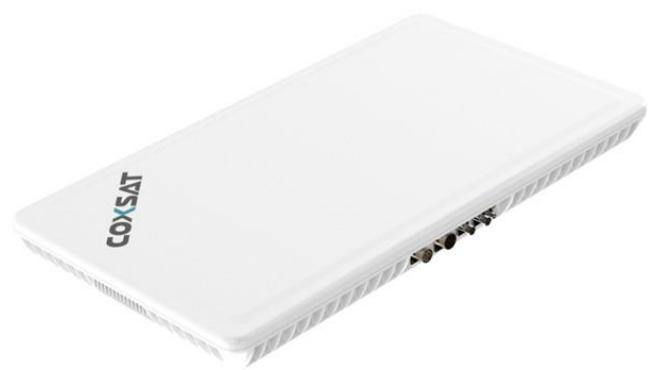  
数据来源：恪赛科技官网，东方证券研究所

图 34：恪赛科技星载4波束发射相控阵天线实物图  
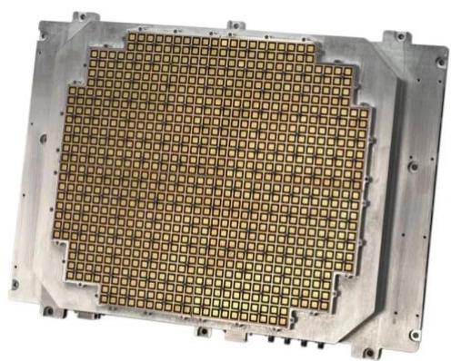  
数据来源：恪赛科技官微，东方证券研究所

# 投资建议

基于频轨资源的有限性及其巨大的军事价值，卫星互联网的建设兼具必要性和紧迫性。在国企的牵头带动下，GW 星座、G60 星链、银河 Galaxy 等各大星座加速组网，卫星互联网产业链上下游的需求将进入爆发期。卫星载荷和通信终端作为产业链的核心环节，有望充分受益。建议关注相关公司：

国博电子(688375，买入)、上海瀚讯(300762，未评级)、七一二(603712，未评级)、海格通信(002465，未评级)、铖昌科技(001270，未评级)、恪赛科技（未上市）

# 风险提示

政策支持不及预期：目前卫星互联网还处于产业发展初期，受政策因素的影响较大，存在政策支持力度不及预期的风险。  
技术发展不及预期：卫星互联网属于前沿技术领域，有诸多技术问题尚待解决，若技术突破不及预期可能影响产业发展进程。  
卫星组网进度不及预期：国内星座规划数量多，发射压力大，目前国内火箭企业发射能力有限，发射成本较高，可能存在卫星组网进度不及预期的风险。

# 分析师Table\_Disclai mer 申明

# 每位负责撰写本研究报告全部或部分内容的研究分析师在此作以下声明：

分析师在本报告中对所提及的证券或发行人发表的任何建议和观点均准确地反映了其个人对该证券或发行人的看法和判断；分析师薪酬的任何组成部分无论是在过去、现在及将来，均与其在本研究报告中所表述的具体建议或观点无任何直接或间接的关系。

# 投资评级和相关定义

报告发布日后的 12 个月内行业或公司的涨跌幅相对同期相关证券市场代表性指数的涨跌幅为基准（A 股市场基准为沪深 300 指数，香港市场基准为恒生指数，美国市场基准为标普 500 指数）；

# 公司投资评级的量化标准

买入：相对强于市场基准指数收益率 15%以上；

增持：相对强于市场基准指数收益率 5%～15%；

中性：相对于市场基准指数收益率在-5%～+5%之间波动；

减持：相对弱于市场基准指数收益率在-5%以下。

未评级 —— 由于在报告发出之时该股票不在本公司研究覆盖范围内，分析师基于当时对该股票的研究状况，未给予投资评级相关信息。

暂停评级 —— 根据监管制度及本公司相关规定，研究报告发布之时该投资对象可能与本公司存在潜在的利益冲突情形；亦或是研究报告发布当时该股票的价值和价格分析存在重大不确定性，缺乏足够的研究依据支持分析师给出明确投资评级；分析师在上述情况下暂停对该股票给予投资评级等信息，投资者需要注意在此报告发布之前曾给予该股票的投资评级、盈利预测及目标价格等信息不再有效。

# 行业投资评级的量化标准：

看好：相对强于市场基准指数收益率 5%以上；

中性：相对于市场基准指数收益率在-5%～+5%之间波动；

看淡：相对于市场基准指数收益率在-5%以下。

未评级：由于在报告发出之时该行业不在本公司研究覆盖范围内，分析师基于当时对该行业的研究状况，未给予投资评级等相关信息。

暂停评级：由于研究报告发布当时该行业的投资价值分析存在重大不确定性，缺乏足够的研究依据支持分析师给出明确行业投资评级；分析师在上述情况下暂停对该行业给予投资评级信息，投资者需要注意在此报告发布之前曾给予该行业的投资评级信息不再有效。

# HeadertTabl e\_Discl ai mer 免责声明

本证券研究报告（以下简称“本报告”）由东方证券股份有限公司（以下简称“本公司”）制作及发布。

本报告仅供本公司的客户使用。本公司不会因接收人收到本报告而视其为本公司的当然客户。本报告的全体接收人应当采取必要措施防止本报告被转发给他人。

本报告是基于本公司认为可靠的且目前已公开的信息撰写，本公司力求但不保证该信息的准确性和完整性，客户也不应该认为该信息是准确和完整的。同时，本公司不保证文中观点或陈述不会发生任何变更，在不同时期，本公司可发出与本报告所载资料、意见及推测不一致的证券研究报告。本公司会适时更新我们的研究，但可能会因某些规定而无法做到。除了一些定期出版的证券研究报告之外，绝大多数证券研究报告是在分析师认为适当的时候不定期地发布。

在任何情况下，本报告中的信息或所表述的意见并不构成对任何人的投资建议，也没有考虑到个别客户特殊的投资目标、财务状况或需求。客户应考虑本报告中的任何意见或建议是否符合其特定状况，若有必要应寻求专家意见。本报告所载的资料、工具、意见及推测只提供给客户作参考之用，并非作为或被视为出售或购买证券或其他投资标的的邀请或向人作出邀请。

本报告中提及的投资价格和价值以及这些投资带来的收入可能会波动。过去的表现并不代表未来的表现，未来的回报也无法保证，投资者可能会损失本金。外汇汇率波动有可能对某些投资的价值或价格或来自这一投资的收入产生不良影响。那些涉及期货、期权及其它衍生工具的交易，因其包括重大的市场风险，因此并不适合所有投资者。

在任何情况下，本公司不对任何人因使用本报告中的任何内容所引致的任何损失负任何责任，投资者自主作出投资决策并自行承担投资风险，任何形式的分享证券投资收益或者分担证券投资损失的书面或口头承诺均为无效。

本报告主要以电子版形式分发，间或也会辅以印刷品形式分发，所有报告版权均归本公司所有。未经本公司事先书面协议授权，任何机构或个人不得以任何形式复制、转发或公开传播本报告的全部或部分内容。不得将报告内容作为诉讼、仲裁、传媒所引用之证明或依据，不得用于营利或用于未经允许的其它用途。

经本公司事先书面协议授权刊载或转发的，被授权机构承担相关刊载或者转发责任。不得对本报告进行任何有悖原意的引用、删节和修改。

提示客户及公众投资者慎重使用未经授权刊载或者转发的本公司证券研究报告，慎重使用公众媒体刊载的证券研究报告。

# 东方证券研究所

地址： 上海市中山南路 318号东方国际金融广场 26楼

电话： 021-63325888

传真： 021-63326786

网址： www.dfzq.com.cn