# 卫星互联网建设与应用推进，商业航天新势力整装待发

2023 年 11 月 17 日

➢ 历经多年发展，卫星互联网于全球居民生活多个领域实现应用。卫星互联网旨在通过多颗卫星建立天基网络，为全球提供互联网接入服务。目前卫星互联网在海外已开始逐步实现商业化应用，不仅能覆盖传统地面基站无法覆盖的偏远地区，在基站建设相对完善的城市地区也可不同幅度提升用户体验。美国 SpaceX与英国 Oneweb 公司目前分别拥有全球第一第二大近地轨道系统，ASTSpaceMobile 已验证可提供手机与卫星直连服务。

➢ 当前尚处 5G-A 阶段逐步向 6G 演绎，下一代通信系统是设施和通信方式的深度融合。从通信标准角度判断当前尚处5G-A阶段，逐步向6G演进。早在3GPPR16 阶段就已研究 5G NR 与非地面网络的融合，R17 版本进一步研究了NB-IoT/eMTC 与非地面网络集成，以支持位于偏远山区的农业、矿业、林业，以及海洋运输等垂直行业的物联网应用。目前 R17 标准已经冻结，R18 研究旨在进一步增强对卫星的 5GS 支持。在“5G 兼容，6G 融合”的星地移动通信建设思路下，下一代的通信系统也将会是“空天地海”泛在接入的一体化网络系统，是各种通信基础设施和方式的深度融合。

➢ 我国卫星产业链布局不断优化，运载火箭相关技术是破局核心要素之一。当前高昂成本是阻碍我国卫星互联网推进的原因之一。我们认为当前降本思路有 2种主要方式：1、卫星生产制造侧整合卫星产业链条，强化生产制造环节，优化卫星设计思路；2、卫星发射层面可进一步加大火箭运力，同时发展迭代火箭回收技术，进而平滑卫星组网成本。

➢ ”商业航天新势力”将有望大幅助力我国卫星互联网建设进程。目前我国以央企领头，逐步推进国内卫星互联网建设。中国星网成立，由中央直接管理，是目前国内唯一一家从事卫星互联网设计建设运营的国有骨干型企业，有望在国家层面统筹规划我国卫星互联网组网进程，抢夺轨道和频率资源，从而加速国内商业航天的发展。同时在国家统筹之下，涌现出以银河航天、微纳星空、蓝箭航天、东方空间等为代表的民营商业航天公司，不断打磨卫星设计生产制造及运载火箭技术，助力我国商业航天事业的发展。我们认为”商业航天新势力”的发展将有望为我国卫星互联网的建设贡献重要力量。

➢ 投资建议：再一次重申卫星互联网有望开启并引领下一轮通信板块基础设施建设，当前我国卫星互联网的发展虽尚处早期起步阶段但发展进程提速显著。短期来看前端卫星生产制造环节将有望依托卫星发射进程提速率先受益，中长期维度随着技术设施建设的逐步完善，下游卫星互联网应用侧相关环节将迎来黄金发展阶段。重点推荐信科移动、创意信息、震有科技，同时建议重点关注天银机电、航天智装、铖昌科技、海格通信、普天科技、南京熊猫等。

➢ 风险提示：我国卫星发射进程不及预期；6G 通信技术迭代不及预期。重点公司盈利预测、估值与评级

<table><tr><td rowspan="2">代码</td><td rowspan="2">简称</td><td rowspan="2">股价(元)</td><td colspan="3">EPS(元)</td><td colspan="3">PE(倍)</td><td rowspan="2">评级</td></tr><tr><td>2022A</td><td>2023E</td><td>2024E</td><td>2022A</td><td>2023E</td><td>2024E</td></tr><tr><td>688387.SH</td><td>信科移动-U</td><td>7.46</td><td>-0.20</td><td>-0.08</td><td>0.03</td><td>\</td><td>\</td><td>252</td><td>推荐</td></tr><tr><td>300366.SZ</td><td>创意信息</td><td>15.79</td><td>-0.06</td><td>0.19</td><td>0.35</td><td>\</td><td>84</td><td>46</td><td>推荐</td></tr><tr><td>300342.SZ</td><td>天银机电</td><td>17.79</td><td>0.02</td><td>0.13</td><td>0.23</td><td>420</td><td>133</td><td>78</td><td>未覆盖</td></tr><tr><td>002465.SZ</td><td>海格通信</td><td>13,49</td><td>0.29</td><td>0.27</td><td>0.32</td><td>47</td><td>50</td><td>42</td><td>推荐</td></tr><tr><td>002544.SZ</td><td>普天科技</td><td>23.29</td><td>0.31</td><td>0.39</td><td>0.45</td><td>75</td><td>60</td><td>52</td><td>推荐</td></tr><tr><td>688418.SH</td><td>震有科技</td><td>23.41</td><td>-1.11</td><td>0.12</td><td>0.49</td><td>\</td><td>187</td><td>48</td><td>推荐</td></tr></table>

资料来源：Wind，民生证券研究院预测;（注：截至 2023 年11月16日，未覆盖公司采用 wind一致预期）

推荐

维持评级

分析师 马天诣

执业证书： S0100521100003

电话： 021-80508466

邮箱： matianyi@mszq.com

分析师 崔若瑜

执业证书： S0100523050001

电话： 021-80508469

邮箱： cuiruoyu@mszq.com

# 相关研究

1.通信行业点评：海外光通信厂商季报符合预期，电信仍待回暖 AI 加速助力-2023/11/14  
2.卫星互联网行业专题报告：为什么我们要重视 SpaceX 星舰进展？-2023/11/13  
3.通信行业事件点评：华为 5.5G 迎来新突破，产业链、应用侧如何展望-2023/09/14  
4.通信行业点评：AI需求火热，为海外光模块厂商注入重要发展动力-2023/08/17  
5.卫星互联网行业点评：我国星座持续扩容， 建议重点关注卫星生产制造侧投资机会-202 3/07/27

# 目录

# 1 卫星通信伴随各大厂商的推进已逐步实现应用. 3

1.1 卫星互联网于全球居民生活多个领域实现应用 . 3

1.2 B 端卫星互联网具备独特优势，重点赋能特殊行业应用 .10

2 “5G 兼容，6G 融合”下的新一代通信系统. 13

# 3 卫星大规模组网的前提是实现大幅度的降本 16

3.1 优化卫星设计制造环节，培育自主高质量供应链. .16

3.2 运载火箭需要进一步加大运力并实现回收技术突破. ..20

# 4 我国商业航天尚处起步阶段，发展势头正盛 24

4.1 银河航天 .. ..24

4.2 微纳星空 . ..25

4.3 蓝箭航天 .. ...26

4.4 东方空间 .. ...28

4.5 天兵科技 .. ..29

4.6 星河动力 .. ..31

4.7 深蓝航天 .. ..32

4.8 星际荣耀 . ..33

4.9 时空道宇 .. ..34

4.10 凯睿星通.. ..36

# 5 投资建议 37

5.1 行业投资建议.. ..37

5.2 信科移动 .. ..37

5.3 创意信息 . ..38

5.4 震有科技 .. ..39

5.5 天银机电 . ..40

5.6 上海瀚讯 .. ..40

5.7 铖昌科技 . ..40

5.8 航天智装 . ...41

5.9 南京熊猫 . ...41

5.10 海格通信.. ..42

5.11 普天科技... ..44

# 6 风险提示 46

# 插图目录 . 47

# 表格目录 . 48

# 1 卫星通信伴随各大厂商的推进已逐步实现应用

# 1.1 卫星互联网于全球居民生活多个领域实现应用

卫星互联网旨在通过多颗卫星建立天基网络，为全球提供互联网接入服务。目前卫星互联网在海外已开始逐步实现大规模商业化应用，美国 SpaceX 与英国Oneweb 公司分别拥有全球第一第二大近地轨道系统，美国铱星是最先提出卫星移动通信星座系统的公司之一，AST SpaceMobile 则是第一个提供手机与卫星直连服务的企业。

# 1.1.1 SpaceX进展神速，已实现大范围商业化应用

SpaceX 是由马斯克建立的美国太空运输公司，是目前全球卫星互联网领域领军企业，凭借 4000 余颗卫星成为全球第一大近地轨道系统。目前 SpaceX 提出的星链计划服务范围已覆盖全球 7 大洲，并计划进一步扩展覆盖范围。SpaceX 的星链”计划，是一项基于自身运载火箭技术发射大量近地轨道卫星并组网，进而提供覆盖全球的高速互联网接入服务。据 SpaceX 官网星链覆盖地图显示，目前星链计划服务范围已经覆盖全球七个大洲，超过 60 个国家和地区，有超 200 万用户，并计划在未来进一步将覆盖范围拓展至埃及、土耳其、沙特阿拉伯等国家。

图1：星链计划网络覆盖范围  
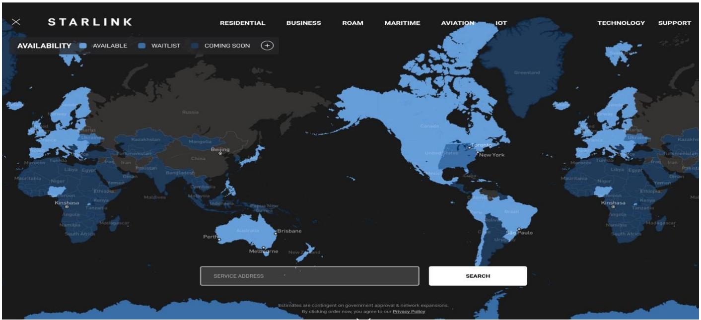  
资料来源：星链官网，民生证券研究院

目前个人用户通过安装星链固件，即可享受全球范围内的卫星互联网服务。通过星链计划覆盖全球的低轨卫星，个人用户可以享受享受全球范围内高速、低延迟的宽带互联网，从而进行直播、视频通话、在线游戏等多种活动。用户在屋顶或墙面上安装星链路由器、电缆等固件后即可通过基站访问低轨卫星，获取卫星通信服务，并可通过星链手机 App 进行个性化定制、获取更新信息、查询实时传输速率及延迟等信息。

卫星互联网不仅能覆盖传统地面基站无法覆盖的偏远地区，在基站建设相对完善的城市地区也可提升用户体验。通过搭载不同的载荷，扩展卫星互联网应用场景，助力万物互联，包括通过搭载数据采集载荷，实时准确获取物流产品位置、温度等信息以及飞机船舶的实时动态。通过高精度定位和卫星互联网结合，提供车道级导航和厘米级定位精度服务，并借助卫星互联网大规模覆盖的优势可加快车联网建设，实时了解道路中其他车辆的位置、状态等信息，逐步实现智能驾驶。

图2：星链设备及应用场景  
  
资料来源：starlink官网，民生证券研究院

在星链计划的性能方面，不同地区的星链卫星互联网的网速有较大差异，大部分地区星链卫星互联网的网速已接近固定宽带。据 Speedtest 报告数据显示，南美、欧洲、大洋洲的大部分国家星链平均下载速率均接近 100Mbps。伴随北美洲国家星链用户数量与密度的迅速增加，星链下载速率略有下降。2021 年Q2Q3 到 2022 年 Q2Q3 这一年内，星链用户从 776 个县扩散至 2399 个县，占美国所有县的 25%和 75%。而仅从美国政府定义的“非大都市”县来看，这一数字从 336 个增长至 1359 个县，分别占所有“非大都市”县的 17%与 69%，同比增长 300%，表明消费者对星链服务的信心。

表1：2022Q3 星链卫星服务性能比较

<table><tr><td rowspan="2">业务落地主要国家</td><td colspan="2">平均下载速率(Mbps)</td><td colspan="2">平均上传速率(Mbps)</td><td colspan="2">平均延迟(ms)</td></tr><tr><td>星链计划</td><td>当地固定宽带</td><td>星链计划</td><td>当地固定宽带</td><td>星链计划</td><td>当地固定宽带</td></tr><tr><td>美国</td><td>53.00</td><td>164.13</td><td>7.22</td><td>22.16</td><td>67</td><td>27</td></tr><tr><td>加拿大</td><td>65.80</td><td>115.18</td><td>9.21</td><td>29.29</td><td>77</td><td>20</td></tr><tr><td>智利</td><td>92.58</td><td>207.04</td><td>20.21</td><td>121.99</td><td>52</td><td>16</td></tr><tr><td>巴西</td><td>112.97</td><td>94.23</td><td>21.95</td><td>54.62</td><td>52</td><td>18</td></tr><tr><td>英国</td><td>82.56</td><td>66.57</td><td>11.76</td><td>18.28</td><td>55</td><td>23</td></tr><tr><td>法国</td><td>92.19</td><td>110.96</td><td>15.50</td><td>89.25</td><td>72</td><td>24</td></tr><tr><td>丹麦</td><td>96.00</td><td>156.53</td><td>15.99</td><td>94.15</td><td>66</td><td>14</td></tr><tr><td>澳大利亚</td><td>98.92</td><td>52.24</td><td>11.76</td><td>17.93</td><td>63</td><td>15</td></tr><tr><td>新西兰</td><td>108.40</td><td>130.36</td><td>17.45</td><td>89.30</td><td>49</td><td>17</td></tr></table>

资料来源：Ookla Insights Articles，民生证券研究院

图3：星链计划用户从 2021 年到 2022 年从美国 776 个县扩散至 2399个县  
Starlink Expansion in U.S. Counties   
Speedtest Intelligence@| Q2-Q3 2021- Q2-Q3 2022   
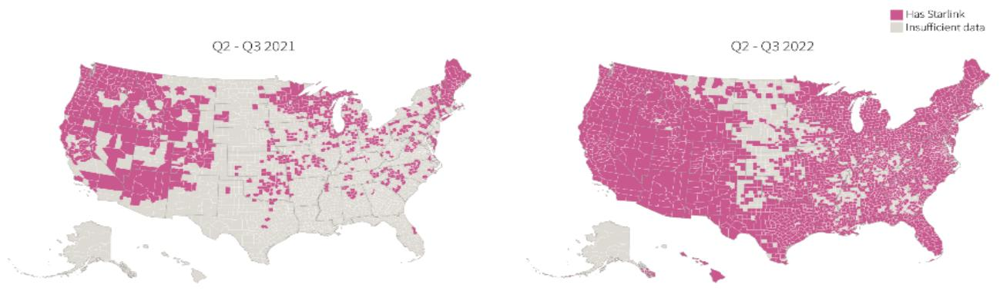  
SPEEDTEST'   
OOKL∧  
资料来源：Ookla Insights Articles，民生证券研究院

尽管目前星链收费标准对个人用户而言相对昂贵，但马斯克也在积极促进费用的下调，使星链服务能够触及更多个人用户。星链针对个人用户推出了普通版和高级版两类服务。以美国地区为例，普通版需要用户首先支付 499 美元的硬件费用，安装完硬件还需缴纳每月 99 美元的服务费。而高级版的月租和硬件费用分别为 500 美元和 2500 美元，是普通版的五倍，并且还需要支付 500 美元的押金，下载速度也相应从 50\~250Mbit/s 增长至 150\~500Mbit/s。另外，星链所有服务均有 30 天的试用期，若使用不满意可以获得硬件的全额退款。

马斯克也在积极促进费用的下调，根据不同市场区域，调价幅度也不尽相同，且降价不附带任何条件，比如英国的月租费用从 89 英镑下调到 75 英镑，德国从100 欧元降至 80 欧元，墨西哥、智利和巴西的用户报告价格下降了约 50%。而法国实行达量限速政策，月租费从 99 欧元降至 50 欧元，但使用超过 250GB 后将进行限速，若用户需要继续使用高速流量，需要额外支付 10 欧元/100GB 的费用，避免个别用户长时间挤占带宽。

表2：星链计划对个人用户收费标准

<table><tr><td rowspan="2">计划名称</td><td colspan="2">收费标准</td><td rowspan="2">下载速度</td><td rowspan="2">上传速度</td><td rowspan="2">延迟</td></tr><tr><td>月租费用</td><td>硬件费用</td></tr><tr><td>星链普通版</td><td>99 美元</td><td>499 美元</td><td>50~250Mbit/s</td><td>10~20Mbit/s</td><td>20~40ms</td></tr><tr><td>星链高级版</td><td>500 美元</td><td>2500 美元</td><td>150~500Mbit/s</td><td>20~40Mbit/s</td><td>20~40ms</td></tr></table>

资料来源：新浪科技，民生证券研究院

目前，星链已支持在移动的房车、飞机上等为个人用户提供稳定的移动互联网服务。2022 年 SpaceX 推出了用于房车的 starlink 互联网服务（Starlink forRVs），要求用户使用特定位置登录，通过卫星群访问天基互联网，适用于去野营或有度假屋的用户，但并不适用与移动车辆。目前，伴随有关监管部门的批准以及更多星链卫星的发射，SpaceX 已经支持在移动的房车、飞机、火车等交通工具上提供稳定的互联网服务，并推出了星链漫游版（Starlink Roam）和星链航空版（Starlink aviation）。以一个月为单位进行计费，用户可以根据自身需求随时暂停或启用服务。目前已经应用于奔驰 Aphavan 星链房车中，实现全车智能化。

图4：用户通过卫星接收器使用星链房车版  

  
资料来源：starlink官网，民生证券研究院

SpaceX 与美国电信运营商 T-mobile US 合作推动卫星和手机终端直连，扩展卫星互联网对个人用户的应用场景。Starlink 的卫星将使用 T-Mobile 的中频段频谱来创建一个全新的网络，使第二代星链卫星可以直连手机，主要借助卫星对日常服务进行补充，消除日常通信死角。每个卫星基站将能直接覆盖一定的地面范围，并提供大约 2-4Mbps 的带宽接入速度，相当于 1000 至 2000 个同时接听的电话，或数十万条同时发送的短信，足以支持该卫星服务区域内的所有T-Mobile 用户发送短信或打电话，甚至包括目前没有无线服务覆盖的偏远地区。这项新服务将从 2023 年年底进入测试阶段，从提供短信服务开始。T-Mobile 表示，其目标是在短信服务测试阶段后实现语音和数据覆盖。

图5：T-mobile CEO 西弗特与 SpaceX CEO 马斯克在活动现场  
  
资料来源：GeekWire，民生证券研究院

目前根据 SpaceX 官网信息，其适用于现有的 LTE 手机。无需更改硬件、固件或特殊应用程序，即可通过星链发送文本、语音和数据。预计 2024 年实现短信发送，2025 年实现语音通话，2025 年实现上网（Data），同年分阶段实现 IOT（物联网）。初期支持的运营商包括：T-MOBILE (美国)、OPTUS (澳大利亚)、ROGERS (加拿大)、ONE NZ (新西兰)、KDDI (日本)、SALT (瑞士)。

图6：SpaceX 发布直连计划  
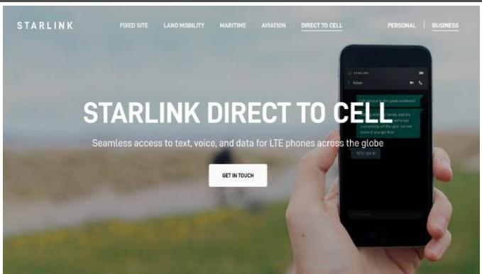  
资料来源：未来宇航，SpaceX官网，民生证券研究院

图7：SpaceX 手机直连概览  
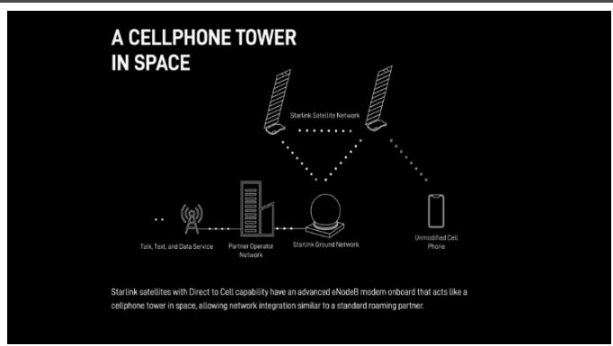  
资料来源：未来宇航，SpaceX官网，民生证券研究院

# 1.1.2 Oneweb 组网提速，已在 B&G 两端重点开展运营服务

Oneweb 已实现全球网络覆盖所需卫星数量，成为仅次于 SpaceX 的第二大近地轨道系统。Oneweb 是 2012 年建立的全球卫星电信网络的初创公司，计划通过发射超过 600 个低轨道卫星创建覆盖全球的高速电信网络。截至 2023 年 3月底，Oneweb 已进行 18 次发射，入轨卫星总数达到 618 颗，实现了全球网络覆盖所需卫星数量，成为目前仅次于星链的第二大近地轨道系统。

图8：Oneweb 成功完成第 18 次发射  
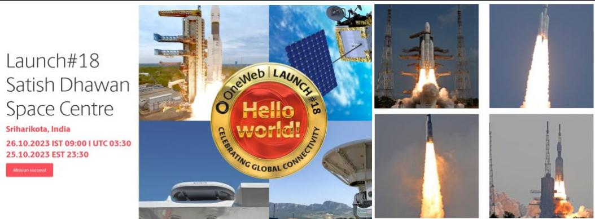  
资料来源：Oneweb官网，民生证券研究院

Oneweb 主要面向政府和企业提供服务，同时也针对个人用户提供海陆空多场景的卫星互联网服务。Oneweb 面对个人用户提供的服务主要包括陆地、海事及航空三方面的互联网通信服务，满足用户随时随地办公及娱乐需求，而不受地面基站影响。面对星链计划 4000 余颗轨道卫星，为占据有利的市场份额，个人用户并非 Oneweb 公司的主要服务对象。据首席执行官尼尔·马斯特森表示星链计划主要瞄准普通消费者，而 Oneweb 公司专注于为企业和政府提供服务。

表3：Oneweb 业务范围 

<table><tr><td>业务板块</td><td>主要产品及服务</td></tr><tr><td>运营商及企业</td><td>为企业扩张提供相应的网络扩张服务;通过移动回传使运营商扩展3G、LTE和5G网络;提供企业级宽带接入;提供企业灾难恢复规划所需的连接、数字服务、技术备份和商业支持。</td></tr><tr><td>政府军事</td><td>为地面部队提供实时通信设备及服务;提供固定翼、旋翼及空中无人驾驶系统的空中对接技术;为海上部队提供舰队内和舰队间的安全、低延迟通信技术。</td></tr><tr><td>海事</td><td>提供海上办公、休闲娱乐所需的网络服务与云服务;为渔船提供数据及实时分析,便于港口活动、贸易监管及渔业可持续性;支持浅水与深水的海上作业网络连接。</td></tr><tr><td>航空</td><td>支持航空旅客商务办公、娱乐等所需的网络服务。</td></tr><tr><td>陆路传输</td><td>支持农业、非政府组织、建筑业、交通运输业、矿业、广播服务等所需的网络通信服务。</td></tr></table>

资料来源：Oneweb官网，民生证券研究院

# 1.1.3 铱星作为最早起商业卫星星座，紧跟产业发展步伐

铱星已可针对个人用户提供全方位的卫星互联网产品与服务，充分满足用户使用需求。铱星作为美国第一代卫星移动通信星座系统，通过覆盖全球的低轨道卫星实现高速、低损耗的卫星通信。目前铱星针对个人用户推出全球通话、加密通话、一键通、窄中宽频带、云通讯等服务，并相应衍生出通讯器、卫星电话、宽带终端、外接天线等多种产品。同时，铱星也研发出配套的手机应用，Iridium GO!可与铱星产品相连接，进行语音通话、GPS 定位，发送短信等功能，Iridium MailApp 则有网页及社交媒体浏览、查看天气预报、发送邮件等，全面覆盖了个人用户日常所需互联网应用场景。

图9：铱星产品及服务概览  
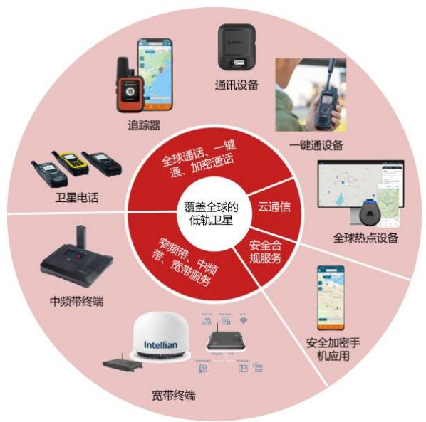  
资料来源：铱星官网，民生证券研究院

图10：Iridium GO!® App 应用界面  
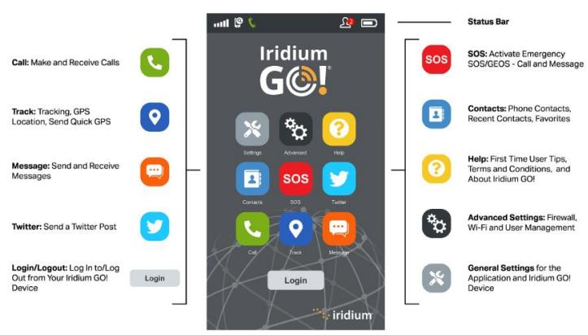  
资料来源：铱星官网，民生证券研究院

铱星与高通合作，推进卫星和手机的直连，丰富个人用户对卫星互联网的使用场景。今年 2 月，铱星与高通达成协议，表示将为下一代安卓旗舰智能手机提供基于卫星的连接，并发布 Snapdragon Satellite。铱星在距地约 780 公里的低轨道上部署的 66 颗卫星将为该服务提供支持。利用铱星公司耐候性强的 L 波段频谱进行上行和下行连接，使智能手机能够提供全球连接，并支持远程、农村和海上的双向紧急信息传递、短信和其他信息传递应用。

图11：Snapdragon Satellite 应用  
  
资料来源：网易，民生证券研究院

# 1.1.4 AST 是第一个可通过标准手机直接访问的天基网络

AST SpaceMobile 卫星设计制造有别于其他企业，天线展开后的巨大面积承载原先地面基站功能，具有高效、低成本的特点。具体而言，AST 发射的在轨测试卫星 BlueWalker 3（BW3）天线展开后达到 693 平方英尺（约 64 平方米），搭载了相控阵天线和星上处理的数字通信载荷技术，使原本需要在地面完成的信号收发和处理等各类功能都能在卫星上直接实现，因此无需大规模建立地面基站，消息传输的实时性也得到增强。

图12：BlueWalker 3 卫星天线展开后超过 64 平方米  
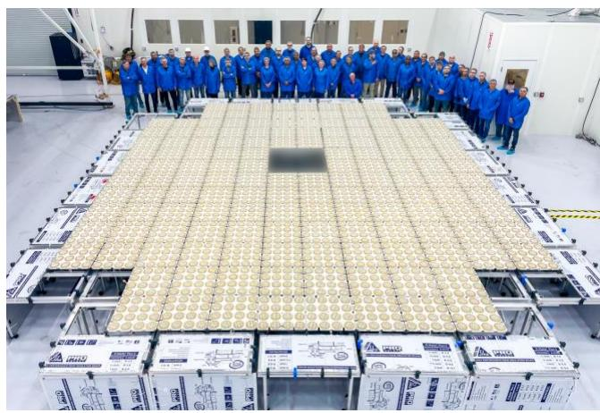

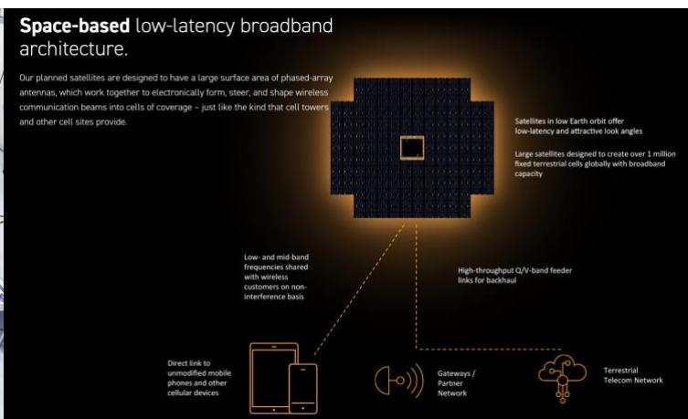  
资料来源：AST SpaceMobile 官网，民生证券研究院

AST SpaceMobile 是目前第一个可通过标准手机直接访问的天基蜂窝宽带网络。通过轨道测试卫星 BW3 的展开，可实现通过 3GPP 标准频率以 5G 速度与蜂窝设备直接通信，旨在为传统网络覆盖不到的地区生活、工作和旅行的客户提供扩展的蜂窝宽带覆盖，消除太空中的蜂窝宽带盲区。目前已与拥有超过 18 亿现有用户的全球移动网络运营商 (“MNO”) 确定了合作关系。2023年4月25日，AST 宣布成功实现存量手机全球首次天基蜂窝双向语音通话。同时，AST 工程师初步测试了各类智能手机和设备的兼容性，确认了 AST 方案支持蜂窝宽带速度和4G/5G 波形的能力。

图13：无需安装即可进行手机卫星直连  
  
资料来源：AST 官网，民生证券研究院

图14：BlueWalker3   
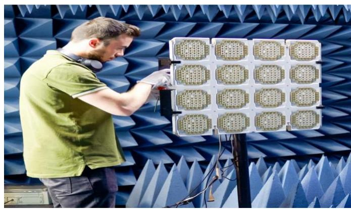  
资料来源：AST 官网，民生证券研究院

# 1.2 B 端卫星互联网具备独特优势，重点赋能特殊行业应用

凭借低成本、高连接速度的优势，卫星互联网已大规模应用于美国军方战斗机。2023 年 3 月，据美国空军远征中心司令约翰·克莱因将军所述，美国空军使用商业版SpaceX星链卫星在印太地区的军机上实现了飞行中的通信。克莱因表示，730 空中机动中队获得了 SpaceX 星链商业用户终端，用于军事基地和飞行中的飞机的通信。机载星链终端已经被安装到了 C-130J 超级大力神飞机上。美国空军将星链系统与他们的安全 Wi-Fi 路由器系统结合起来进行加密通信，相较于美军自己的鹰眼卫星系统，星链的成本更低且连接速度比军事卫星系统快 30 倍左右。另外，SpaceX 还推出星盾系统，使用额外的加密技术专门服务于美国政府和军方，初期主要应用于侦察、通信与载荷托管三个领域。

图15：美国空军在犹他州测试星链卫星通信  
  
资料来源：全球航天事件微信公众号，民生证券研究院

图16：北约盟国在演习中使用了星链互联网服务  
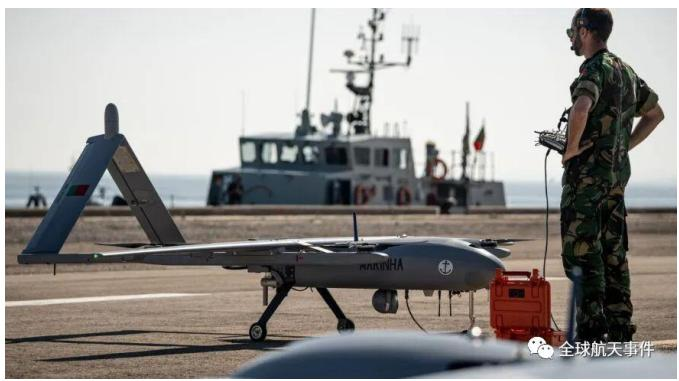  
资料来源：全球航天事件微信公众号，民生证券研究院

卫星互联网可充分应对海上多变天气影响，保证网络传输需求。SpaceX 推出Starlink Maritime，为全球船舶提供星链卫星互联网服务，包括商船、海上钻井平台、游艇。海洋版的硬件占地面积小，安装便捷。开通业务后，用户可以享受最高 350Mbps 的下载速度，并且所安装的天线还能在恶劣天气情况下，依旧保持稳定的网络传输。安全方面，Starlink Maritime 具有点对点加密技术，可以确保使用者的数据安全性和隐私性。用户只需要下载 Starlink App，就能在船上任何地方都能够找出最佳安装位置。2022 年 8 月，SpaceX 还与全球第二大邮轮运营商皇家加勒比集团展开合作，为乘客提供 Starlink 天基互联网服务，改善乘客旅行体验。

图17：Starlink Maritime 产品及应用  

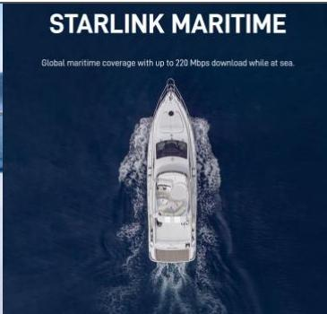

  
资料来源：starlink官网，民生证券研究院

卫星互联网可无视地理位置和天气影响，保障矿业开采的安全高效。目前世界上绝大部分尚未开采的资源均分布在偏远、条件恶劣的区域，这些区域通常不在地面基站覆盖范围之内，而卫星互联网能完美应对此类问题。网络连接对于矿业开采的安全、效率、可持续性及盈利能力等也具有至关重要的作用，包括进行实时遥感勘测、压力测量、液压操作、实时预警、地理围栏等。Oneweb 与铱星的卫星互联网在矿业均有应用。

图18：卫星互联网应用于矿业  
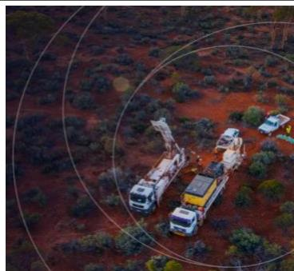

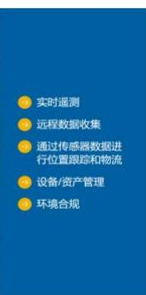

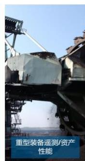

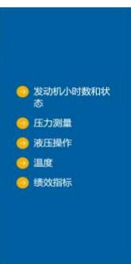

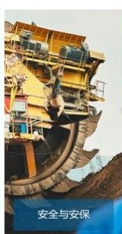

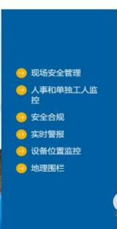  
资料来源：Oneweb官网，铱星官网，民生证券研究院

在金融领域，卫星通信可扩大银行服务覆盖范围，降低信用风险。一方面，卫星通信有效的补充了地面基站覆盖范围不足的问题，可把客户在任意地点的现场数据及时传输至银行的数据处理中心，扩大银行的业务覆盖范围。另一方面，通过通信、导航、遥感等多类卫星与物联网结合，采集产品全生命周期数据，记录在可共享的区块链上，既能打造上下游企业密切协作的高效供应链生态，也便于银行对客户进行风险评估。2020 年末平安银行的金融界首颗物联网卫星“平安1 号”发射，结合平安银行“星云物联网平台”，在卫星发射后的一年内为实体经济提供超 1300 亿元融资。其中，逾 50%投向偏远乡村经济，将金融服务覆盖到供应链末端的长尾客户，从而支持小微、三农等数据覆盖相对薄弱的领域。

图19：金融界首颗物联网卫星“平安 1 号”成功发射  
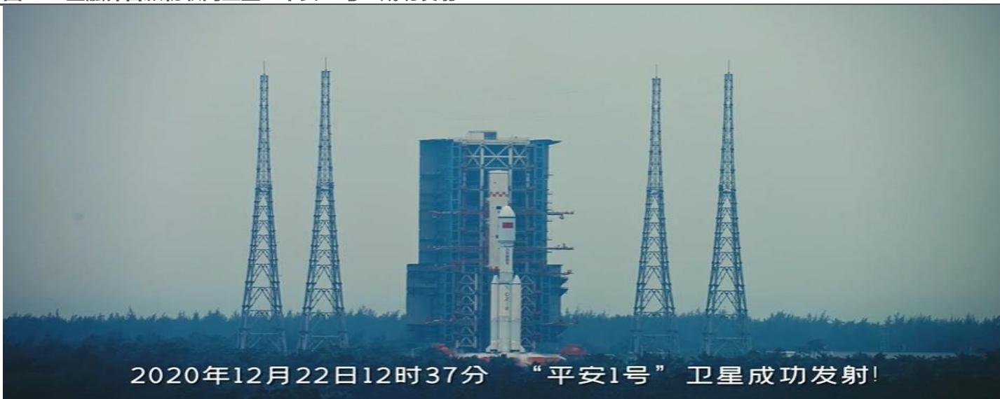  
资料来源：新浪财经，民生证券研究院

卫星互联网有效助力防灾减灾。防灾方面，卫星可对地质、气候等潜在风险进行实时监控，于第一时间向地面传输监测信息。而当灾害发生，地面基站严重损毁时，卫星互联网能够保证可靠的全球卫星通信服务，便于政府与非政府组织、记者、个人等及时对灾害做出反应，进行沟通、协调与应急处理等。2021 年由贵州星耀讯联科技有限公司参与的贵州省 2019 年提升地质灾害监测预警科技能力项目（铜仁市）将北斗 GNSS、智能传感器、卫星通信等技术运用到地质灾害监测体系，顺利通过验收。

图20：卫星互联网在防灾减灾方面的应用  

  
资料来源：铱星官网，民生证券研究院

# 2 “5G 兼容，6G 融合”下的新一代通信系统

从通信标准角度判断，目前尚处 5G Advanced 阶段，逐步向 6G 演进。早在 3GPP R16 阶段就已研究 5G NR 与非地面网络的融合，R17 版本进一步研究了NB-IoT/eMTC 与非地面网络集成，以支持位于偏远山区的农业、矿业、林业，以及海洋运输等垂直行业的物联网应用。目前 R17 标准已经冻结，R18 研究旨在进一步增强对卫星的 5GS 支持，特别关注延迟变化的回程链路，以及对部署在 GEO卫星上的 UPF 和地面支持。

图21：3GPP 标准进程及预期

<table><tr><td>2017</td><td>2018</td><td>2019</td><td>2020</td><td>2021</td><td>2022-2025</td><td>2026-2030</td></tr><tr><td>Initial 5G</td><td colspan="4">5G Evolution</td><td>5G Advanced</td><td>6G</td></tr><tr><td colspan="3">Fundamental Issues</td><td colspan="2">Basic Network Functions</td><td>Enhancements and Inter-Satellite Networking</td><td>Integrated Satellite-Terrestrial Network</td></tr><tr><td colspan="3">Scenarios, service requirements, and network architectureSystem parameters, e.g., satellite altitude and orbitChannel modellingPhysical layer control procedures: timing and frequency synchronization, power control, CSI feedback, beam polarizationDiscussion on mechanisms and procedures of random access, HARQ, paging and scheduling requestsSolutions to the frequent handover led by the movement of LEO satellites</td><td colspan="2">RF requirements for NR terminal in NTN Networks, e.g., frequency band, bandwidth, and transmission powerCellular structures, frequency bands, power control, and interference models under the coexistence of GEO/MEO/LEO satellitesLink budget modeling and energy-saving methods in IoT scenariosNetwork orchestration and management solutions</td><td>Inter-satellite networking architecture and transmission solutionsSatellite backhaul with path transparency and delay variation supportQoS control based on delay and bandwidth estimationEdge computing services based on satellite on-board processingCell search, handover, and power saving mechanisms of UE</td><td>Multi-satellite and satellite-terrestrial cooperative transmissionSpectrum sharing between satellites and terrestrial BSsIntegrated satellite-terrestrial routing and pagingDeployment of network functions among satellites and terrestrial nodes...</td></tr><tr><td>Rel 15</td><td colspan="2">Release 16</td><td colspan="2">Release 17</td><td>Release 18 &amp; 19</td><td>Release 20-22</td></tr></table>

资料来源：全球 6G技术大会，民生证券研究院

我国卫星互联网后续有望朝“5G 兼容，6G 融合”方向演绎。据《关于低轨卫星通信的分析及我国的发展建议》（陈山枝），目前我国 5G 技术成熟度高、产业链完整、项目风险低，利用和分享 5G 规模经济效应，可以更好的适应未来 6G技术和产业发展趋势。6G 融合阶段，陆地移动通信和高中低轨卫星通信将实现有机融合（如架构融合、空口融合、终端融合等），移动通信走向天地一体，实现任何人、任何物在任何时间和地点无缝覆盖和接入。

图22：5G 兼容与 6G 融合  
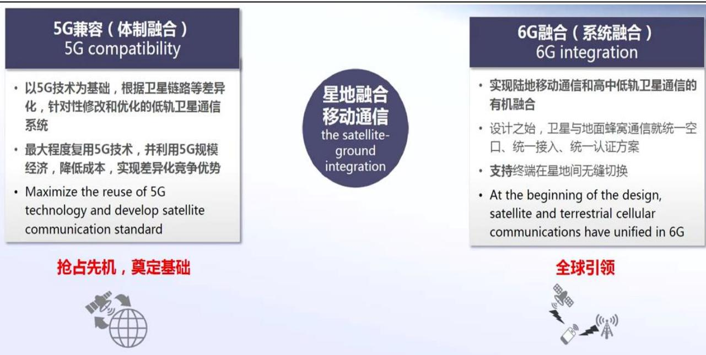  
资料来源：全球 6G 技术大会，中信科移动，民生证券研究院

在“5G 兼容，6G 融合”的星地移动通信建设思路下，下一代的通信系统也将会是“空天地海”泛在接入的一体化网络系统。空天地海一体化网络是以地面网络为基础，以空间网络为延伸，覆盖太空、天空、陆地、海洋等自然空间，为天基（卫星通信网络）、空基（飞机、热气球、无人机等通信网络）、陆基（地面蜂窝网络）、海基（海洋水下无线通信及近海沿岸无线网络）等各类用户的活动提供信息保障的基础设施，目标是扩展通信的覆盖广度和深度，即在传统蜂窝网网络的基础上分别与卫星通信和深海远洋通信（水下通信）深度融合。

图23：空天地海一体化网络  
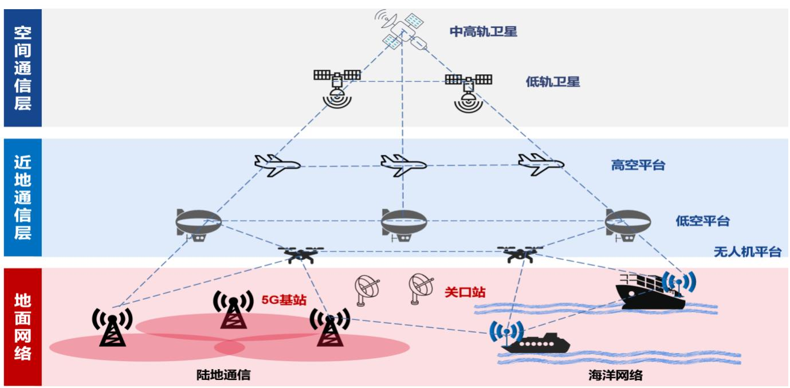  
资料来源：民生证券研究院整理

五大运营商共同推进基于 5G 卫星互联网标准确立。航天通信技术工作委员会航天通信系统工作组(TC12 WG1)第 7 次会议通过了“基于 5G 的卫星互联网第 1部分：总体要求”行业标准立项申请，该标准项目由中国卫星网络集团有限公司总体牵头，中国电信、中国移动、中国卫通、中国联通、中国信息通信研究院联合牵头，十余家相关单位参加，预期完成基于 5G 的卫星互联网总体技术规范，将以地面移动通信网络技术标准、3GPP R17 NTN 技术标准等为标准基线，形成包括核心网、承载网、接入网，以及操作维护系统等在内的总体技术规范。有望推动移动终端直连卫星、物联接入等重要场景的规模应用，切实指导卫星互联网的建设和运营。

图24：星网牵头五大运营商联合制定基于 5G 的卫星互联网标准  
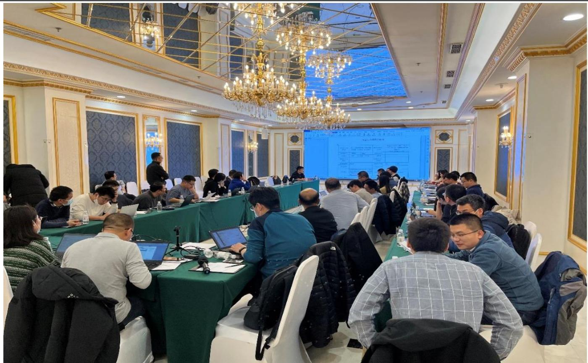  
资料来源：信通院微信公众号，民生证券研究院

# 3 卫星大规模组网的前提是实现大幅度的降本

尽管卫星互联网看似成本高昂，但无论是从国外还是国内的角度来看，卫星行业都是一个高速迭代降本的行业，国内外商业航天企业都在致力于研发新产品与技术以降低卫星成本，从而推动卫星的商业化应用。目前业内主要从卫星侧和火箭侧两方面进行降本设计。

# 3.1 优化卫星设计制造环节，培育自主高质量供应链

# 3.1.1 整合卫星产业链条，强化生产制造环节

政策支持引导产业链优化，促进民营航天企业良性发展。降低卫星成本的方向之一是优化卫星生产供应链，从卫星零部件角度降低成本。我国政策也在促进央企和民营航天企业优化供应链。2022 年 6 月，中国航天科技集团在专题学习大会上也强调了我国产业链供应量自主可控能力的重要性及重点战略方向，并于2023 年 3 月举办“采购管理向供应量管理转型”专业培训。2023 年 4 月，中共中央政治局常委、国务院总理李强在北京市调研独角兽企业发展情况，了解银河航天公司整体情况与在研产品，并提出支持卫星网络相关企业加强关键技术和核心部件研发攻关，同时推动相关产业协同发展。

图25：李强在银河航天公司调研  
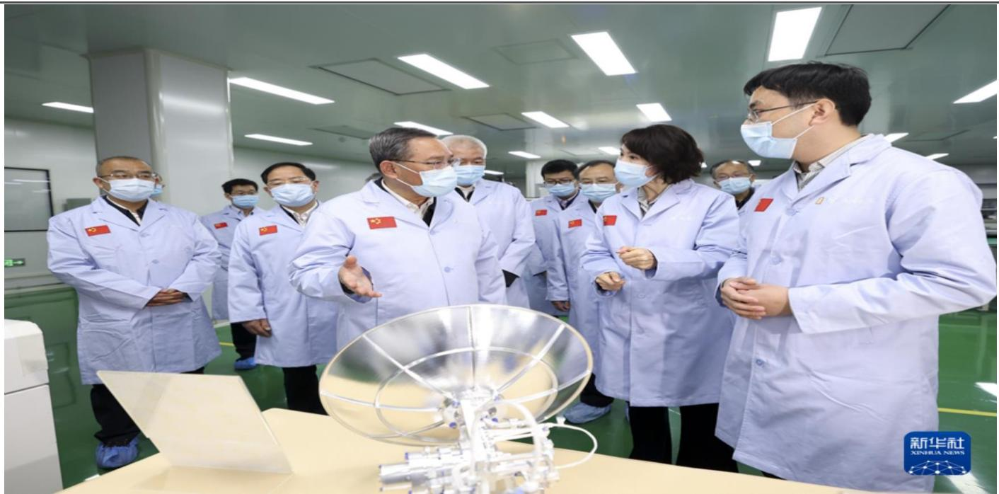  
资料来源：新华社，民生证券研究院

政府引领下多家卫星及航天产业园陆续成立，扶持相关企业技术攻关与成长。目前我国建立了通用航空及卫星产业园、重庆卫星互联网产业园、中集低轨卫星物联网产业园、武汉国家航天产业基地卫星产业园等多家产业园，并通过各类优惠政策吸引相关企业入驻。产业园集合了卫星研发制造、检测检验、融合应用等多种领域，通过集聚产业链各领域的企业，降低仓储运输成本及损耗，改善供应链协作。提高产业链整体效率，实现供应链优化。

图26：武汉国家航天产业基地卫星产业园项目集体开工现场  
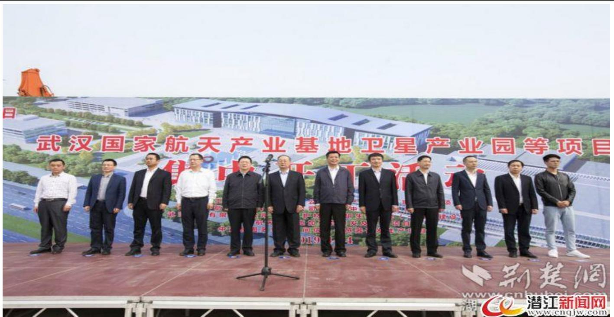  
资料来源：潜江新闻网，民生证券研究院

卫星的批量生产制造既能节约成本，也是星座快速建设的前提。低轨宽带星座要求在轨卫星数量一定要多到能够在任意时间覆盖所有服务区域，最基本的低轨宽带星座也需要几百甚至上千颗。要在卫星寿命期内建成卫星星座，充分发挥其经济效益，就必须具备快速批产和快速发射的能力。实施批量化生产，需要科学合理分解卫星形成过程，具体可分为单机部组件生产、系统测试和总装及环境试验三个环节，总装及环境试验环节形成脉动流水化模式，进行批量化生产、测试，可进一步解放人力、降低成本。

目前随着低轨卫星互联网建设，国内许多商业航天企业已成功研发批量化生产技术。银河航天实现了国内首次批量研制低轨宽带通信卫星，其单星研制成本对比银河航天首发星已下降一半以上；长光卫星起初采用单星生产模式，在卫星系统测试环节，一颗星需要两个人两个月完成。在实施批量化生产后，6 颗星并行测试只需要一个人一个月即可完成，生产效率大幅提升；时空道宇通过功能集成、模块化设计、制造过程规范化标准化、采用自动化机器人和自动化测试系统、构建信息化体系等方式实现卫星批产设计制造。

图27：银河航天首批 6 颗低轨宽带通信卫星  
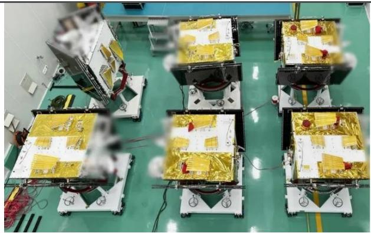  
资料来源：银河航天官网，民生证券研究院

图28：“吉林一号”高分 03 星批量化出厂  
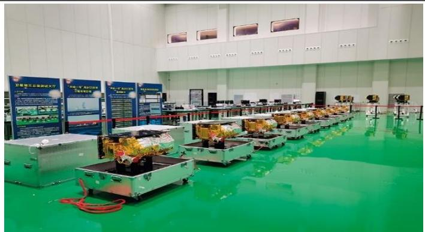  
资料来源：新华网，民生证券研究院

为满足卫星批产条件，多家企业的智能生产线和超级工厂应运而生。卫星从原材料出库到整星检验合格入库，需要经历十余道工序，若所有关键工艺环节全部由机器来替代，生产效率能提高 40%以上。多家企业也开始逐步推进卫星批产建设，2021 年航天二院空间工程公司建成我国首条批产卫星智能生产线，计划年产 240 颗以上小卫星；银河航天计划建设卫星智能制造超级工厂，年产 300-500颗卫星，将是我国首条对标星链的智能生产线；2021 年吉利科技集团旗下卫星工厂台州星空智联投产，年产能可达 500 颗，预计七年内累计生产卫星 1500 颗，可实现产值 98.7 亿元人民币；长三角首个卫星制造的“灯塔工厂”——“G60 星链”产业基地计划将于2023年建成，产能将达到300颗/年，单星成本将下降35%。

图29：在建中的银河航天南通卫星超级工厂  
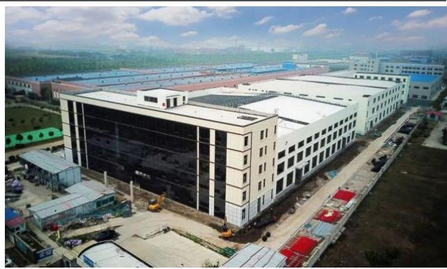  
资料来源：银河航天官网，民生证券研究院

图30：台州星空智联科技有限公司卫星超级工厂  
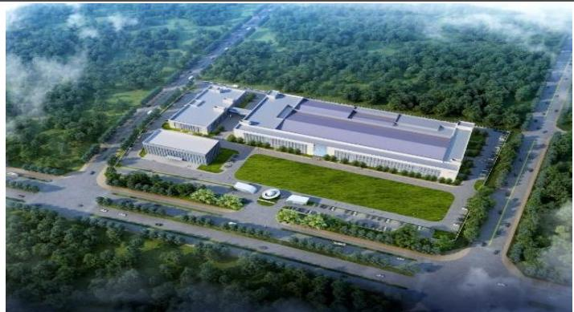  
资料来源：时空道宇官网，民生证券研究院

# 3.1.2 优化卫星设计思路，进而降低发射成本

卫星设计环节，材料方面可进行优化进而提升火箭性能并降低成本。2023 年4 月 20 日 SpaceX 的星舰系统首飞测试，其上下两级要求均可回收，这就要求材料熔点高于 1200 度，是常用的铝合金无法达到的，因此星舰是目前最高最重且是首个全箭结构采用不锈钢材料的运载火箭，其成功离开地面并最高到达 39 千米已是一种成功。SpaceX 最初计划采用的碳纤维材料的稳态下最高工作温度为 150°C，成本为每公斤 135 美元，而钢材料熔点高（1400°C 上下）且成本低，约为每公斤 3 美元，也便于焊接与快速生产安装，可降低重复使用的维护费用。

图31：不锈钢的卓越性能使星际飞船能够应对极高和极低温度  
  
资料来源：世界钢铁协会微信公众号，民生证券研究院

卫星互联网组网的另一大成本在于卫星的发射，而卫星的重量是度量发射成本的关键指标，因而如何在保证卫星功能的前提下降低卫星重量是成本把控的重要方向。据西安日报报道，人造卫星每减轻 1kg，运载火箭减轻 500kg，可节约1000 万美元。航天企业也在进行卫星零部件的优化，降低卫星重量。我国长光卫星研制的“吉林一号”遥感卫星星座通过多个部组件共用一个处理器，大幅减少平台结构，有效载荷比显著提升，成功将卫星从 420 公斤减至约 40 公斤，成本也相应从 8000 万元缩减至 800 万元，同比下降 90%，该技术也有望向通信卫星拓展。太阳翼是卫星能量的主要来源，银河航天研发的柔性太阳翼在相同面积下较传统的刚性太阳翼重量下降 20%以上，并随技术发展可达到 40%，大幅降低卫星发射成本。

图32：银河航天初样柔性太阳翼   
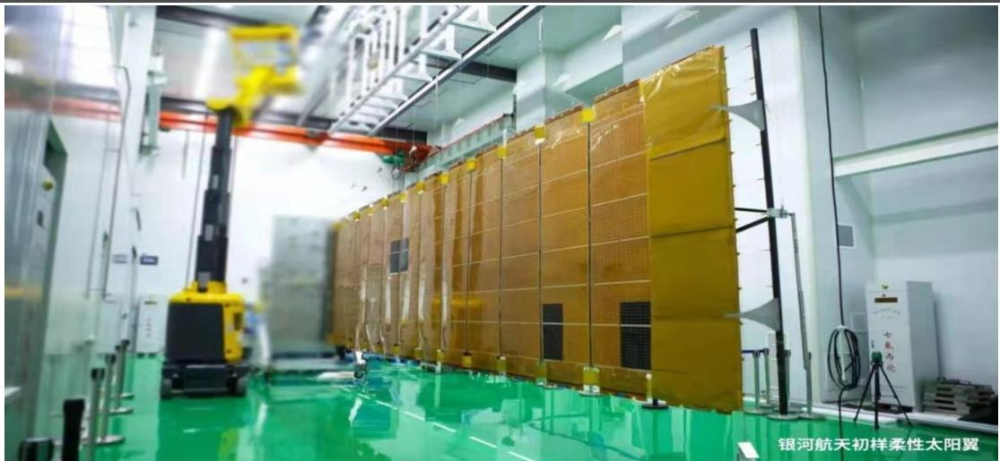  
资料来源：银河航天官网，民生证券研究院

# 3.2 运载火箭需要进一步加大运力并实现回收技术突破

# 3.2.1 加大火箭运力，提升单颗火箭载重

由于每次发射所耗费的火箭和燃料的成本都是固定的，因此每次火箭发射能够运载更多卫星，则单颗卫星的发射成本也会大幅下降，星座建设的周期和成本也相应减少，因此如何加大单次火箭发射的运力，即“一箭多星”，成为了商业航天关注的重点领域之一。要实现“一箭多星”，一方面如前文所述，通过合理设计卫星结构，减轻单星重量，另一方面则是提高火箭的运载能力。

运载能力是火箭性能最直接、最重要的参数指标，要提高火箭运载能力，主要有 4 方面措施。一是通过优化级间比增加助推器加注量。如长征三号甲系列、欧洲的阿里安 5 系列，以及美国的猎鹰九号运载火箭通过这项措施，使运载能力显著提高。二是运载器结构优化减重。长征三号乙运载火箭就是通过减重的方法，将运载能力提升了 50 公斤，以满足发射要求。三是对发动机性能进行优化升级，提高发动机推力和比冲。我国长征五号运载火箭上使用了首次研制的膨胀循环动力方式氢氧发动机，是目前国际上比冲性能最高的火箭发动机，并且具有高空多次启动能力。四是从火箭总体构想进行优化设计。包括尽可能选用推力大的发动机作为基础动力、开展载荷姿控联合设计降低结构载荷条件等。目前我国长五运载火箭以 25 吨的近地轨道最大运载能力和 14 吨的地球同步转移轨道最大运载能力，跃升为世界火箭运载能力第二。

<table><tr><td>国家或地区</td><td>运载火箭名称</td><td>近地轨道最大运载能力</td><td>地球同步转移轨道最大运载能力</td></tr><tr><td>美国</td><td>重型德尔塔-4 (Delta IV Heavy)</td><td>28.8 吨</td><td>14.2 吨</td></tr><tr><td>中国</td><td>长征五号系列火箭</td><td>25 吨</td><td>14 吨</td></tr><tr><td>俄罗斯</td><td>安加拉-A5 (Angara A5)</td><td>24.5 吨</td><td>7.3 吨</td></tr><tr><td>俄罗斯</td><td>质子-M (Proton M)</td><td>23 吨</td><td>6.9 吨</td></tr><tr><td>欧洲</td><td>阿里安-5 (Ariane 5)</td><td>20 吨</td><td>10.5 吨</td></tr></table>

表4：目前国际上仍在服役的大型运载火箭  
资料来源：中国运载火箭技术研究院，民生证券研究院

我国火箭发动机发展迅速，性能不断接近 SpaceX。SpaceX 猎鹰 9 号的第一级包括九台Merlin发动机和装有液氧和火箭级煤油 (RP-1) 推进剂的铝锂合金箱，每台发动机可提供 845 千牛海平面推力，使猎鹰 9 号在海平面产生超过 170 万磅（约 770 吨）的推力。2023 年 4 月成功首飞的天龙二号遥一运载火箭，是全球首次采用煤基航天煤油作为燃料飞行的液体运载火箭。该箭芯一级配备 3 台YF-102 发动机，由航天六院研制，最大海平面推力为 835 千牛，是我国首台开式循环、可重复使用液氧煤油发动机。同样由六院研制的液体火箭发动机也于 2022年 11 月首次整机试车成功，设计推力为 500 吨级，是现役 120 吨级液氧煤油发动机的约四倍。

图33：猎鹰 9 号发动机螺接安装结构 OctaWeb  
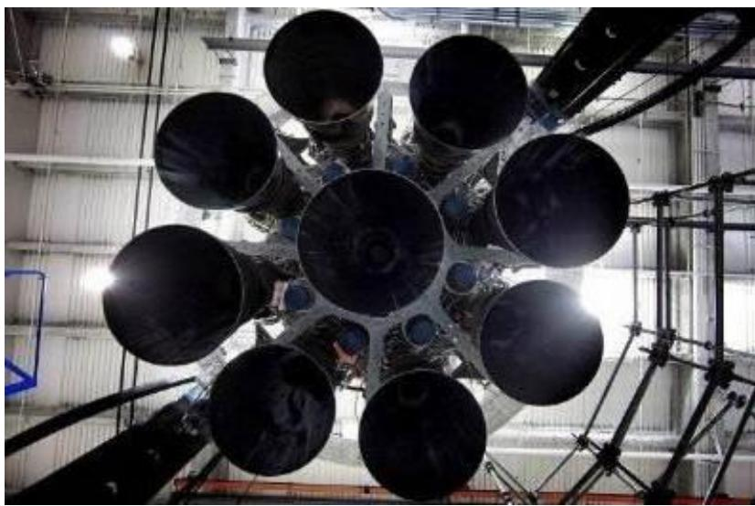  
资料来源：航天三院 306所公众号，民生证券研究院

伴随我国火箭运载能力的快速发展，“一箭多星”技术逐步成熟，未来将向常态化发展。我国早在 1981 年便利用“风暴一号”成功发射三颗卫星，近年我国“一箭多星”技术发展进程加速。2020 年 9 月 15 日，中国在黄海海域用长征十一号海射运载火箭，采取“一箭九星”方式将“吉林一号”高分 03-1 组卫星送入预定轨道。2021 年 4 月 27 日，我国首次通过长征六号遥五火箭在太原卫星发射中心实现“一箭九星”的“共享火箭”商业发射任务。随后在 2022 年 2 月 27 日，长征八号运载火箭再次历史性地完成“一箭 22 星”的发射，创下我国一箭多星发射最高纪录。2022年3月5日，我国在西昌卫星发射中心使用长征二号丙运载火箭，成功将我国首次批量研制的六颗低轨宽带通信卫星——银河航天 02 批卫星成功送入预定轨道，同时搭载发射了一颗商业遥感卫星。

图34：长征八号运载火箭成功将 22 颗卫星发射升空，创造我国一箭多星新纪录  
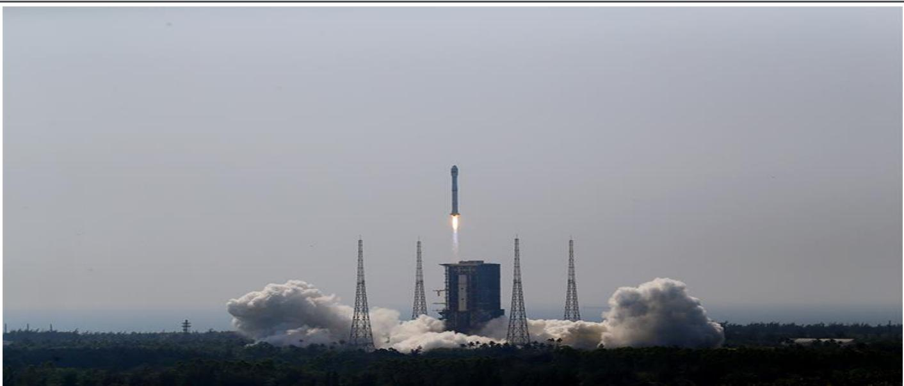  
资料来源：新华社，民生证券研究院

# 3.2.2 掌握火箭回收技术是降低发射成本的关键

火箭回收技术可大幅降低火箭发射成本，并显著提升社会效益。发动机作为火箭中价值最高的部分，其造价往往占火箭研制成本的一半以上，通过火箭回收对发动机进行重复利用，可大幅降低成本。过去需要重新制造一枚火箭，在火箭回收检修后只需加上新的子级便可重新发射，火箭投送能力得到进一步提升。此外，需回收的子级可以准确落在预定区域，自然而然地消解了火箭残骸对落区的安全威胁，且回收和重复利用技术的研发应用可带动产业链上下游的共同发展。

目前火箭回收以 SpaceX 研制的猎鹰九号火箭为代表。在经历过数次回收试验失败后，猎鹰九号火箭于 2016 年 4 月完成难度极高的海上垂直回收任务，并在次年 3 月成功将回收后的火箭再次发射，完成历史性突破。截至 2023 年 4 月，SpaceX 已进行 151 次这样的重复发射。SpaceX 能够回收火箭的第一级助推器和整流罩两个主要部分。2023 年 7 月 9 日，SpaceX 已经创下同一助推器第 16 次成功发射并回收利用的历史性记录。

图35：SpaceX 海上回收过程示意图  
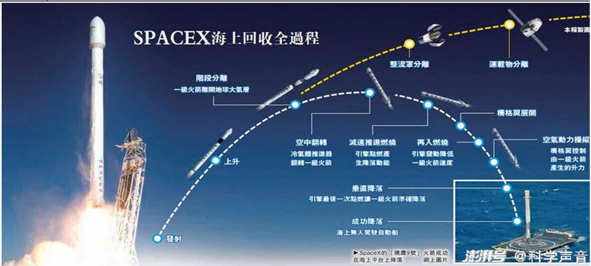  
资料来源：澎湃新闻，民生证券研究院

我国央企与民营商业航天公司也围绕火箭垂直回收进行多次尝试。航天科技集团长八火箭研制团队已经在着陆缓冲机构、低空低速的返回段制导、自主控制等火箭一级回收技术领域做了试验，后续将在回收关键技术进一步攻关。2022 年9 月 15 日，由航空六院自主研制的某型液氧煤油发动机顺利完成重复飞行试验，是我国首次实现了液体火箭发动机的重复使用。民营商业航天公司方面，深蓝航天围绕垂直回收发动机二次起动点火和控制系统精准无误两大难点持续进行过程技术的突破和积累，开发出我国商业航天首次可重复使用液氧煤油发动机“雷霆-R1”。今年深蓝航天计划完成“星云-1”入轨火箭一子级的高空回收试验，并将2024 年择机完成“星云-1”运载火箭的首次入轨发射-回收任务。

图36： “雷霆-R1”首次“二次起动”试车成功  
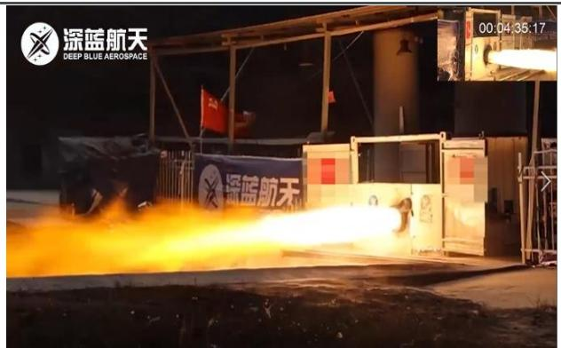  
资料来源：深蓝航天官网，民生证券研究院

图37：深蓝航天三手“星云-M”完成飞行回收任务  
  
资料来源：深蓝航天官网，民生证券研究院

# 4 我国商业航天尚处起步阶段，发展势头正盛

目前我国以央企领头，逐步推进国内卫星互联网建设。“十三五”期间，以中国航天科技和中国航天科工为主的两大央企分别提出了“鸿雁星座”和“虹云工程”低轨卫星互联网计划；随后中国星网成立，由中央直接管理是目前国内唯一一家从事卫星互联网设计建设运营的国有骨干型企业，有望在国家层面统筹规划我国卫星互联网组网进程，抢夺轨道和频率资源，从而加速国内商业航天的发展。

国家统筹之下，“商业航天新势力”的发展为我国卫星互联网的建设贡献重要力量。在国家紧锣密鼓筹备卫星互联网建设之际，也涌现出以银河航天、微纳星空、蓝箭航天、东方空间等为代表的民营商业航天公司，在星网的统筹规划下打磨卫星设计生产制造及运载火箭技术，助力我国商业航天事业的发展。

# 4.1 银河航天

银河航天是我国商业航天领域第一家独角兽公司，研发了包括柔性太阳翼、V频段低轨卫星测控在内的多项国内首发技术。2020 年银河航天成功发射我国首颗通信能力达 10Gbps 的低轨宽带通信卫星银河航天首发星，试验成功后，银河航天又陆续研发了多种通信技术与卫星产品。2021 年公司发布柔性太阳翼使卫星堆叠发射成为可能，在此基础上继续研制可堆叠平板卫星，目前已进入正样研制阶段。2022 年 3 月银河航天在其 02 批共计 6 颗卫星上成功实现了国内首例 V 频段低轨卫星测控，该频段在国际上仍处于起步阶段，具备大带宽、大容量、窄波束和低成本等优势。这 6 颗卫星在轨后将与首发星共同组成我国首个低轨宽带通信试验星座，并构建星地融合 5G 试验网络“小蜘蛛网”，具备单次 30 分钟左右的不间断、低时延宽带通信服务能力。

表5：截至 2022银河航天主要技术推进时间表

<table><tr><td>时间</td><td>事件</td><td>说明</td></tr><tr><td>2020.01</td><td>银河航天首发星发射成功</td><td>该卫星采用Q/V和Ka等通信频段,具备10Gbps速率的透明转发通信能力,是中国首颗通信总容量达到48Gbps的低轨宽带通信卫星。</td></tr><tr><td>2021.01</td><td>首发星完成多种低轨卫星应用场景测试</td><td>银河航天首发星验证了低轨Q/V/Ka频段通信,成功实现低轨宽带通信卫星的山区、滨海地区、雪后湖边等场景的实地应用测试,通过低轨卫星互联网链路完成了运营商公网中5G基站的开通和测试。</td></tr><tr><td>2021.12</td><td>中国商业航天首款柔性太阳翼发布</td><td>发布了银河航天自主研制的柔性太阳翼,具有包络小、重量轻、模块化等特点,可完美契合平板式卫星分层堆叠的包络需求,使大批量卫星堆叠发射成为可能。</td></tr><tr><td>2022.03</td><td>实现我国首例V频段低轨卫星测控</td><td>在其02批卫星上成功实现了国内首例V频段低轨卫星测控。该批卫星于3月5日在西昌卫星发射中心成功发射,是我国首次批量研制的低轨宽带通信卫星。</td></tr><tr><td>2022.09</td><td>新一代可堆叠平板卫星已进入正样研制阶段</td><td>是国内首款平板卫星,将于明年初择机发射,将有助于卫星的批量制造以及大规模星座的快速部署。</td></tr><tr><td>2023.03</td><td>组成国际上首个车轮式卫星编队</td><td>使用长征二号丁运载火箭,以“一箭四星”的方式,成功将银河航天承担研制的四颗干涉合成孔径雷达(InSAR)卫星(宏图一号01组卫星)发射升空。</td></tr></table>

资料来源：银河航天官网，民生证券研究院

2023 年银河航天成功发射国际上首个车轮式卫星编队。2023 年 3 月，由银河航天承担研制的四颗干涉合成孔径雷达（InSAR）卫星（宏图一号 01 组卫星）成功发射升空，由一颗主星及三颗辅星组成，是国际上首个四星编队飞行的 X 波段干涉合成孔径雷达对地成像系统，也是国际上首个车轮式卫星编队。采用星间通信链路和相位同步链路并通过精密的轨道控制，保证卫星编队在轨构型稳定性和空间安全性。相对于传统的干涉卫星系统，具有编队构型相对稳定、干涉基线多、测绘效率高的优势。该组卫星具备 1：5 万比例尺测绘能力、毫米级形变监测能力、亚米级高分宽幅成像能力，从而进行高精度测绘、地质灾害隐患的早期识别、对地高质量成像观测等功能。

图38：车轮式卫星编队在轨模拟图  
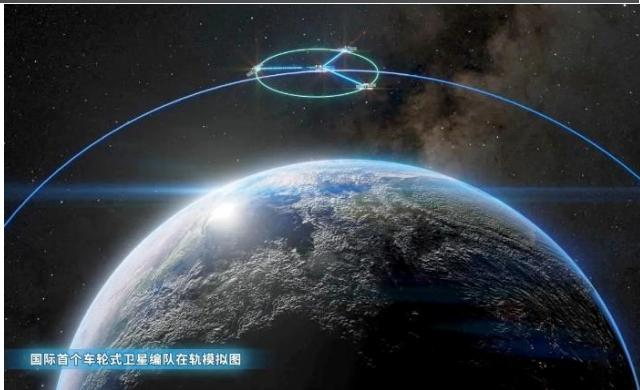  
资料来源：银河航天官网，民生证券研究院

图39：四颗干涉合成孔径雷达（InSAR）卫星  
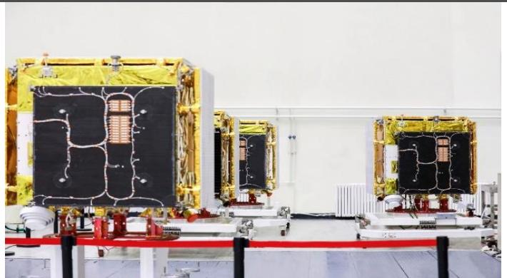  
资料来源：银河航天官网，民生证券研究院

# 4.2 微纳星空

微纳星空是国内最早一批以卫星制造业务为核心的卫星系统研制供应商，目前公司已成功进行十余次发射，累计发射 17 颗卫星。公司主要从事微纳卫星系统的研发制造服务，自主研发微纳卫星平台和核心部组件，拥有卫星整星设计和集成测试能力，具有电子通讯和光学载荷等卫星系统研制经验，具备牵头抓总、统筹协调、统揽全局的能力。公司自主研发卫星地面通信终端，具备卫星通信系统集成经验，可为国防、行业、区域等用户提供基于卫星资源的综合信息系统解决方案。截至目前，北京微纳星空科技有限公司已成功发射 17 颗卫星，涵盖了 10KG—2T 级卫星，包含微纳一号、星时代、天雁、泰景三号 01 星、泰景四号 01 星等光学、遥感卫星，Ka 通信卫星和央视加油向未来节目科学实验卫星。

表6：微纳星空卫星发射记录

<table><tr><td>序号</td><td>时间</td><td>说明</td></tr><tr><td>1</td><td>2018.10.27</td><td>公司自主研发的“未来号”卫星,在酒泉卫星发射中心搭乘“朱雀一号”运载火箭升空。这次任务是中国首次由民营企业执行入轨发射,且民营卫星作为唯一主星完成发射申请,并全部由民营企业设计、生产、制造的纯商业航天项目,开创了中国民营航天的先河。</td></tr><tr><td>2</td><td>2018.10.29</td><td>公司深度参与的某卫星搭乘长征二号丙运载火箭(CZ-2C),在酒泉卫星发射中心顺利升空。微纳星空团队提供了该卫星的“大脑”和“小脑”。</td></tr><tr><td>3</td><td>2018.12.07</td><td>公司自主研制的一颗商业遥感业务卫星“微纳一号”,在酒泉卫星发射中心由 CZ-2D 运载火箭发射升空。遥测数据显示卫星状态良好,标志着公司的微纳卫星平台技术走向成熟。</td></tr><tr><td>4</td><td>2019.08.17</td><td>“星时代-5”微小遥感卫星,在中国酒泉卫星发射中心由“捷龙一号”运载火箭发射升空,12时20分59秒,卫星顺利进入预定轨道,标志着公司的微纳卫星平台在成熟性、可靠性等方面的提升。</td></tr><tr><td>5</td><td>2019.12.20</td><td>公司研制的仪征一号(天雁01)、星时代-8(天雁02)和XX卫星在太原卫星发射中心搭载长征四号乙火箭成功升空,本次任务是微纳星空成立以来的第5次卫星发射,也是其首次一箭多星任务。</td></tr><tr><td>6</td><td>2020.11.06</td><td>公司研制的天雁05星,在山西太原发射中心搭载长征六号遥三火箭成功发射升空。该星是此次长征六号遥三火箭运载的13颗卫星中重量最大的一颗,也是微纳星空成立三年来发射的第8颗卫星。</td></tr><tr><td>7</td><td>2021.04.27</td><td>微纳星空第9颗卫星“泰景二号01星”在太原卫星发射中心用搭载长征六号运载火箭发射成功,同时也是微纳星空MN50平台卫星的第三次发射。</td></tr><tr><td>8</td><td>2021.10.14</td><td>微纳星空参与研发的大学生小卫星北航亚太一号(APSCO-SSS-1)在太原卫星发射中心搭乘长征二号丁运载火箭成功升空。</td></tr><tr><td>9</td><td>2022.02.27</td><td>“长征八号”遥二火箭在海南文昌发射中心执行“一箭22星”拼车发射任务,将微纳星空研制的泰景三号01星、泰景四号01星、文昌一号01星、文昌一号02星以及西电一号等5颗卫星顺利送入预定轨道,实现了微纳星空一箭多星商业发射的新纪录和新突破。</td></tr><tr><td>10</td><td>2022.08.09</td><td>微纳星空在酒泉卫星发射中心采用谷神星遥三火箭,以“一箭双星”的方式,成功将“平安3号卫星(泰景一号01星)”、“泰景一号02卫星”发射入轨。发射任务取得圆满成功,卫星均进入预定轨道。</td></tr><tr><td>11</td><td>2023.01.13</td><td>公司参与研制的试验二十二号B星由长征二号丁遥七十三运载火箭在酒泉卫星发射中心发射升空,卫星顺利进入预定轨道,发射任务取得圆满成功。卫星平台由微纳星空研制,载荷由中科院西安光机所研制,试验二十二号B星也是微纳星空参与的第一个国家任务型号。</td></tr></table>

资料来源：微纳星空公众号，民生证券研究院

# 4.3 蓝箭航天

蓝箭航天是我国领先的航天运输系统创建及运营企业，为全球市场提供可靠的火箭发射服务。蓝箭航天致力于研制以液氧甲烷作为推进器的中大型运载火箭系列产品，是全国首家取得准入资质的民营运载火箭企业。蓝箭航天目前在研的朱雀二号（ZQ-2）是我国在研最大的民营运载火箭，也是第一款液氧甲烷运载火箭。研制的天鹊（TQ-12）80 吨液氧甲烷发动机是国内首台商业航天企业研制的大推力液氧甲烷发动机，推力水平在同技术产品中可达世界第三、亚洲第一。目前公司已与 190 余家企业达成合作，业务范围覆盖欧洲、阿拉伯及东南亚等地区。

表7：蓝箭航天主要技术推进时间表

<table><tr><td>时间</td><td>事件</td><td>说明</td></tr><tr><td>2018.01</td><td>双组元轨控发动机试车成功</td><td>该发动机作为某型号商用火箭姿轨控系统的关键单机,其研制成功为后续系统试车成功奠定了坚实基础另外,以该型发动机为核心研发的姿轨控系统已达成近2亿元金额订单,提前实现了商业化。</td></tr><tr><td>2018.10</td><td>80吨液氧甲烷发动机短喷管状态推力室热试车成功</td><td>自主研发的80吨液氧甲烷发动机“天鹊”(TQ-12)短喷管状态推力室点火试车成功,意味着蓝箭具备了大吨位液体火箭发动机研发、生产、冷试、热试等全方位核心能力。</td></tr><tr><td>2019.01</td><td>蓝箭航天智能制造基地正式交付使用</td><td>将迎接“天鹊”(TQ-12)液氧甲烷发动机及“朱雀”系列液体运载火箭全面试验生产。</td></tr><tr><td>2021.06</td><td>嘉兴蓝箭航天中心首期竣工</td><td>旨在打造集设计仿真、试验检测、智能制造于一体的全产业链顶尖航天产业基地,有力保障朱雀二号运载火箭基本型及拓展型的量产能力。</td></tr><tr><td>2022.08</td><td>天鹊80吨改进型发动机完成二次起动试车</td><td>标志着蓝箭航天“天鹊”系列液氧甲烷发动机已经完全具备了可重复使用能力,有效增强了“朱雀”系列运载火箭各类任务轨道卫星的发射能力,并为子级回收需求及可重复使用提供了基础技术保障。</td></tr><tr><td>2022.10</td><td>“天鹊”真空型发动机TQ-15A完成首次全系统试车</td><td>TQ-15A为目前国内推力最大的真空型液氧甲烷发动机,真空推力达836kN,是朱雀二号火箭第二批次的二级主发动机。</td></tr><tr><td>2022.10</td><td>辅助动力系统首台整机产品完成总装</td><td>辅助动力系统云鹊(YQ-10)完成首台装配及测试工作,配套于朱雀二号液氧甲烷运载火箭第二批次产品,主要用于火箭滚转、俯仰偏航、末速修正、推进剂沉底等控制。</td></tr><tr><td>2023.03</td><td>朱雀二号遥二火箭完成总装</td><td>标志着朱雀二号火箭第一批次产品开始进入量产阶段。后续公司将逐步实现在批产能力、交付能力、运营管理能力上的优化与提升。</td></tr></table>

资料来源：蓝箭航天官网，民生证券研究院

蓝箭航天近年实现多项产品的试车和总装工作，为未来运载火箭商业化奠定坚实基础。在过去一年内，蓝箭航天完成了天鹊 80 吨改进型发动机和“天鹊”真空型发动机 TQ-15A 的试车，为“朱雀”系列运载火箭的发射提供有效的动力保障。未来随着 TQ-15A 的应用，朱雀二号运载火箭成本降低的同时运力也会得到进一步提升，以满足更多种类的发射需求，适应未来运载火箭商业化发展的要求。另外，辅助动力系统整机产品和朱雀二号遥二火箭的总装工作的完成标志着产品开始进入量产阶段。2022 年 11 月蓝箭航天自主研制的朱雀二号液氧甲烷运载火箭（遥二）主要部组件齐套，在嘉兴蓝箭航天中心开始总装工作，这标志着朱雀二号火箭第一批次产品开始进入量产阶段。今年 3 月，遥二完成总装，具备交付总测条件。

图40：朱雀二号遥二运载火箭完成总装  
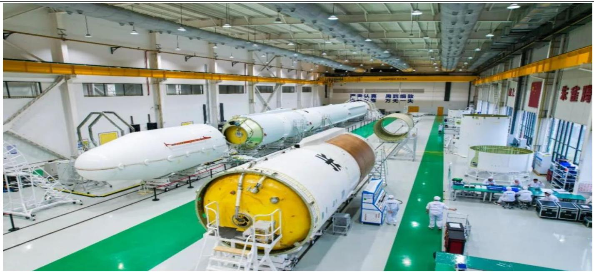  
资料来源：蓝箭航天公众号，民生证券研究院

# 4.4 东方空间

东方空间为运载火箭和新型空天运输工具设计制造服务公司，致力于提供低成本、便捷的火箭制造与发射服务。公司通过研发“引力”系列运载火箭，打造一次性使用、可回收重复使用和载人飞行等系列化、多样化、航班化的空天运输产品，快速形成低成本、规模化、便捷化的发射服务能力。公司倾力打造海上发射基础设施，在东方航天港建设火箭总装集成测试中心（AIT 中心），占地面积近百亩，达产后可实现年产 20 发运载火箭能力，同时形成“一站式”海上发射服务，可实现“出厂即进场”，5 公里内完成总装、测试、发射全流程。

图41：东方空间引力-1 号运载火箭  
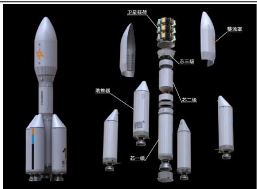  
资料来源：东方空间微信公众号，民生证券研究院

图42：东方空间一站式发射服务  
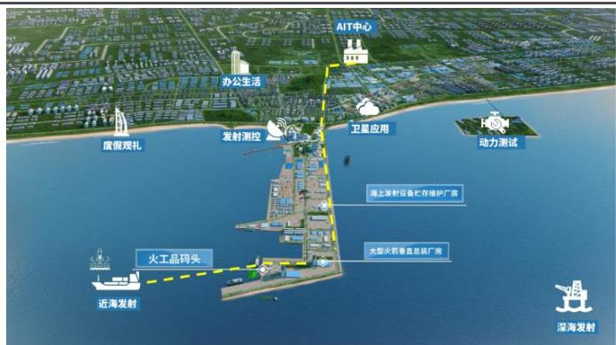  
资料来源：东方空间微信公众号，民生证券研究院

引力-1 号首次发射在即，计划未来发射频率加快，同时引力-2 号研制初见成效。引力-1 号是国内民营航天公司在研运载能力最大的火箭，近地轨道运载能力6.5 吨，太阳同步轨道 500km 运载能力达 4.2 吨，能够满足“一箭多星”的卫星星座组网工作。目前该型号已陆续完成总体系统、末修姿控系统、航电系统联调等多项关键试验及十余项大型地面验证试验。东方空间将于 2023 年第四季度、2024 年第一季度共提供 2 发引力-1 号拼车搭载服务，具备大型创新载荷、中小卫星、微型科研载荷分层搭载能力；2024 年至 2025 年将提供 10 发整箭发射服务，助力各类卫星星座高效组网。“引力-2 号”火箭已完成方案论证。自研的百吨级可重复使用液氧煤油发动机于 2023 年 3 月成功通过首次试车考核，为“引力-2号”芯级可回收提供放心原动力。

表8：东方空间主要技术推进时间表

<table><tr><td>时间</td><td>事件</td><td>说明</td></tr><tr><td>2021.12</td><td>“引力一号”转初样阶段通过评审</td><td>标志“引力一号”(YL-1)运载火箭正式进入工程实施。</td></tr><tr><td>2022.08</td><td>自研700N、50N姿态控制发动机热试车试验圆满成功</td><td>引力-1号末修姿控动力系统共设有4台50N、12台700N发动机,通过发动机工作产生的反作用力,实现火箭部分飞行阶段的俯仰、偏航、滚转等姿态控制及末速修正。</td></tr><tr><td>2022.08</td><td>大推力固体火箭发动机与伺服机构联合热试车成功</td><td>“引力一号”运载火箭的芯一级固体发动机与伺服机构联合热试车成功,为“引力一号”明年首飞奠定了坚实的基础。</td></tr><tr><td>2022.09</td><td>助推级固体发动机与伺服机构联合热试车成功</td><td>参试的固体发动机是“引力一号”运载火箭起飞和助推飞行阶段的主动力系统,也可作为芯级可回收的“引力二号”助推级,标志着“引力一号”运载火箭固体动力系统顺利完成了初样阶段各项地面考核试验,开始进入规模化生产阶段。</td></tr><tr><td>2022.12</td><td>开展海上无线通信系列试验</td><td>海上无线通信技术是实现火箭海上发射的重要技术之一。为保障首飞成功,东方空间在东方航天港开展了海上无线通讯设备相关试验,验证海射无线通信可靠性等关键技术。</td></tr><tr><td>2023.03</td><td>“原力-85”发动机燃气发生器热试车成功</td><td>验证了发生器设计和工艺的正确性,检验了发生器及阀门的制造质量,为后续“原力-85”发动机的发生器-涡轮泵联试和整机试车奠定了坚实基础。</td></tr><tr><td>2023.05</td><td>YL-1噪声试验和末修姿控动力系统热试车试验成功</td><td>充分验证了末修姿控动力系统设计的正确性和环境适应性,标志着火箭总体完成了全部初样研制工作,全力备战首飞任务。</td></tr></table>

资料来源：东方空间官网，民生证券研究院

# 4.5 天兵科技

天兵科技是我国商业航天领域领先开展新一代液体火箭发动机及中大型液体运载火箭研制的高新技术企业。公司自主研发了多型谱液体火箭发动机和液体运载火箭，可为卫星用户提供低成本、高可靠的定制化发射服务，目前已占有国内商业航天最大市场份额。公司将以北京火箭研发中心、西安动力研发中心、郑州综合试验中心和张家港智能制造基地为战略起点，着力形成“三机两箭”的产品发展战略布局，“三大中心五大平台”的航天智造体系，“立足长三角辐射全国”的供应链体系以及“立足全中国面向全世界”的发射市场网络。

表9：天兵科技主要技术推进时间表

<table><tr><td>时间</td><td>事件</td><td>说明</td></tr><tr><td>2021.10</td><td>首飞液体运载火箭低温贮箱成功交付</td><td>首飞液体运载火箭天龙二号(TL-2)一级氧箱考核合格、顺利下线,标志公司成为国内运载火箭领域为数不多的具备低温贮箱独立自主研制能力的民营企业。</td></tr><tr><td>2022.05</td><td>天龙二号二子级全系统摇摆热试车成功</td><td>本次试验所用的发动机,是我国民营航天唯一的可重复使用补燃循环液氧煤油火箭发动机,本次全系统试车,将为天兵科技“TL-2”火箭首飞提供有力支撑。</td></tr><tr><td>2022.08</td><td>首飞箭发射合练试验成功</td><td>本次发射架、发射台起竖、回抱、后倒、回平、调平等功能试验的成功,表明“TL-2”各项测量数据满足设计性能指标,发射流程顺畅,满足发射需求。</td></tr><tr><td>2022.09</td><td>首飞箭三级动力系统热试车完成</td><td>试验过程中,各姿轨控单机运行稳定,时序精准,结构完整,充分验证了首飞箭“TL-2”三级姿轨控动力系统方案的正确性与可靠性。</td></tr><tr><td>2022.11</td><td>天龙二号运载火箭一级动力系统试车圆满成功</td><td>各系统飞行测试数据完整、性能合格稳定,表明天兵科技天龙二号运载火箭及发射支持系统具备了年底入驻发射场执行飞行任务的全部条件。</td></tr><tr><td>2023.01</td><td>110吨液体火箭发动机全系统热试车成功</td><td>“天火十二”发动机(TH-12)完成全系统热试车,是目前国内商业航天推力最大的液体火箭发动机,也是国内最大的3D打印发动机,为天兵科技可重复使用系列液体运载火箭的研制提供强大动力保障</td></tr><tr><td>2023.01</td><td>“TL-2”液体运载火箭整流罩分离试验圆满成功</td><td>试验采用轻质民用材料对罩体进行回收,大幅降低了试验成本。分离过程中时序正确、运动学测量结果与仿真结果一致,试后产品无损坏,可直接参加首飞。</td></tr><tr><td>2023.01</td><td>30吨液氧煤油补燃发动机单台试车累计超2000s</td><td>由公司自主研制的30吨级补燃循环液氧煤油发动机天火十一号(TH-11)台先后完成累计五次2000秒热试车,单台发动机工作时长超7倍飞行任务时间,标志着“TH-11”液体火箭发动机的研制进入到全面应用批产的新阶段。</td></tr><tr><td>2023.01</td><td>天龙二号遥一运载火箭 箭地全系统合练试验圆满完成</td><td>合练历时13天,结果表明箭地各系统满足设计要求、工作稳定、性能可靠,发射流程清晰、操作规范,标志着TL-2首飞箭已具备入场发射的全部技术条件。</td></tr><tr><td>2023.02</td><td>110吨液体火箭发动机第二次全系统热试车圆满成功</td><td>天火十二(TH-12)圆满完成第二次全系统热试车,为天兵科技天龙三号大型液体运载火箭全面转入初样工程研制奠定坚实的技术基础。</td></tr><tr><td>2023.04</td><td>天龙二号首飞成功</td><td>天龙二号为我国商业航天首款成功入轨的液体运载火箭举开创国际航天和国内航天7项新纪录。</td></tr></table>

资料来源：天兵科技官网，民生证券研究院

天兵科技自主研发的天龙二号遥一运载火箭于 2023 年 4 月首飞成功，使公司成为商业航天目前唯一实现成功首飞的液体火箭研制企业。天龙二号运载火箭研制历时三年，完成十余次关键试验，首飞成功一举开创 7 项国际和国内航天新纪录：全球私营航天首家液体运载火箭首次成功入轨飞行；全球首款应用煤基航天煤油飞行的运载火箭；我国首款不依托发射工位的液体运载火箭；我国首款采用 3D 打印高压补燃发动机的运载火箭；我国首款采用 3 机并联发动机技术的运载火箭；我国首款采用全铝合金表面张力贮箱姿轨控系统的运载火箭；我国首款实现箭体结构重复使用的运载火箭。

图43：天龙二号首飞成功  
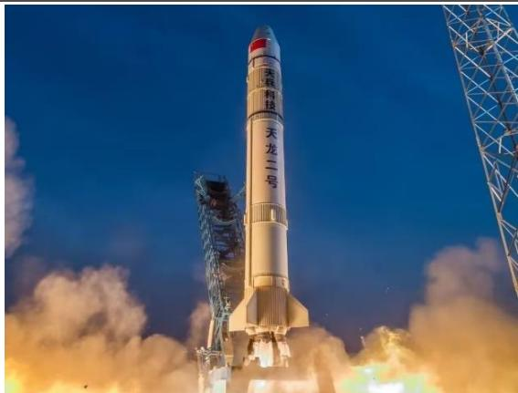  
资料来源：天兵科技官网，民生证券研究院

图44：天兵天火系列液体火箭发动机  
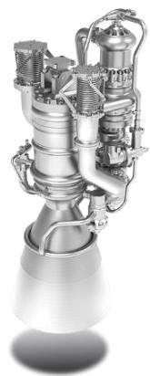  
资料来源：天兵科技官网，民生证券研究院

# 4.6 星河动力

星河动力为从事低成本商业航天发射业务的民营航天公司，目前，主要业务为固体运载火箭技术方向与重复使用液体运载火箭方向。公司是国内首家将商业组网卫星送入 500km 太阳同步轨道、首家实现连续发射成功、首家掌握一箭多星发射能力的商业火箭公司。公司致力于研发下一代可重复使用商业运载火箭，为国内外小卫星发射市场提供低成本、高可靠、快响应的进入太空系统化解决方案。公司核心产品包括“智能星”系列中型重复使用液体运载火箭、“谷神星”系列小型运载火箭等。

图45：谷神星一号运载火箭  
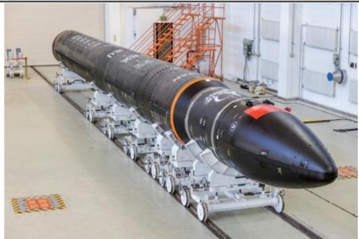  
资料来源：星河动力官网，民生证券研究院

图46：智神星一号液体运载火箭  
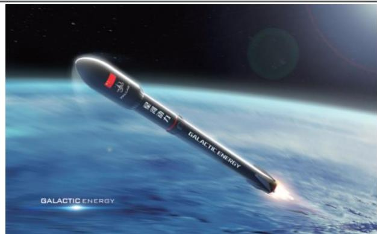  
资料来源：星河动力官网，民生证券研究院

谷神星火箭五发五胜，有望实现常态化发射于稳定交付，智神星火箭首飞在即。2023 年 1 月谷神星一号（遥五）运载火箭的成功发射，一举刷新了中国民营商业火箭发射交付的新纪录。面向 2023 年，星河动力航天计划完成 8-10 次“谷神星”系列运载火箭常态化发射任务。2022 年公司取得了自主研发的“苍穹”50吨级可重复使用液氧/煤油发动机全系统试车成功，是我国民营商业航天领域自主研制最大推力的液氧/煤油发动机，也是国内首款采用针栓式喷注技术的大推力液体火箭发动机，标志着星河动力航天“智神星一号”中型重复使用液体运载火箭研制工作取得关键性技术突破。目前 “智神星一号”液体可重复使用运载火箭具备入轨首飞条件，“首飞准备工作正在稳步推进当中。

表10：星河动力火箭研发、试验及发射时间表

<table><tr><td>时间</td><td>事件</td></tr><tr><td>2018.02</td><td>公司成立,发布“谷神星”“智神星”两型商业运载火箭研制计划。</td></tr><tr><td>2018.05</td><td>完成“谷神星”火箭一级发动机自主设计。</td></tr><tr><td>2018.09</td><td>完成“谷神星”火箭一级发动机加工制造。</td></tr><tr><td>2018.10</td><td>完成“谷神星”火箭200N上面级姿控发动机试车。</td></tr><tr><td>2018.11</td><td>完成“谷神星”火箭一级发动机试车。</td></tr><tr><td>2018.12</td><td>“智神星”液体火箭研制启动,可重复使用液氧/煤油发动机通过内部立项。</td></tr><tr><td>2019.01</td><td>完成“谷神星”火箭25N上面级姿控发动机试车。</td></tr><tr><td>2019.04</td><td>完成“谷神星”火箭2000N轨控发动机试车。</td></tr><tr><td>2019.07</td><td>“谷神星”火箭三合一试验方案通过评审。</td></tr><tr><td>2019.07</td><td>完成“智神星”火箭主发动机(中国“Merlin”)燃气发生器热试车。</td></tr><tr><td>2019.09</td><td>“谷神星”火箭三合一试验圆满成功。</td></tr><tr><td>2019.12</td><td>完成“谷神星”火箭三级发动机试车。</td></tr><tr><td>2020.02</td><td>完成“苍穹”40吨液氧/煤油发动机大范围变工况涡轮泵齐套交付。</td></tr><tr><td>2020.05</td><td>完成Y1火箭上面级轨姿控发动机高空模拟热试车。</td></tr><tr><td>2020.07</td><td>完成“苍穹”液氧/煤油发动机大范围变工况涡轮泵水力试验。</td></tr><tr><td>2020.07</td><td>完成“谷神星一号/Y1”先进上面级姿轨控动力系统全系统热试车。</td></tr><tr><td>2020.07</td><td>完成“谷神星一号/Y1”电气系统全箭发火试验。</td></tr><tr><td>2020.07</td><td>完成“谷神星一号”全箭与地面设备匹配试验圆满成功。</td></tr><tr><td>2020.11</td><td>成功发射“谷神星一号(遥一)”运载火箭,将“天启十一星”送入500km太阳同步轨道。</td></tr><tr><td>2021.03</td><td>“苍穹”发动机重要组件:针栓式喷注器推力室试验件已完成装配交付。</td></tr><tr><td>2021.12</td><td>成功发射谷神星一号(遥二)·平安银行数字口袋号运载火箭,顺利将五颗商业卫星精确送入500km太阳同步轨道。</td></tr><tr><td>2022.03</td><td>公司自主研发的“苍穹”50吨级可重复使用液氧/煤油发动机全系统试车取得圆满成功。</td></tr><tr><td>2022.03</td><td>公司自主研发的300N双组元发动机、50N双组元发动机单机、300N单组元发动机、50N单组元发动机单机地面热试车取得圆满成功。</td></tr><tr><td>2022.08</td><td>“谷神星一号(遥三)”发射圆满成功。</td></tr><tr><td>2022.11</td><td>“谷神星一号(遥四)”发射圆满成功。</td></tr><tr><td>2023.01</td><td>“谷神星一号(遥五)”发射圆满成功。</td></tr></table>

资料来源：星河动力官网，民生证券研究院

# 4.7 深蓝航天

深蓝航天是一家自研自产可回收复用火箭，并向市场提供发射服务的商业航天高新企业。公司主打产品“星云”系列包括“星云-1”中小型液体运载火箭、“星云-1H”中大型液体运载火箭；与之配套的“雷霆”系列液体火箭发动机则分别为“雷霆-R1”液氧煤油发动机和“雷霆-R2”液氧煤油发动机。公司通过对“星云”系列运载火箭一子级的垂直回收和重复使用，大幅度降低火箭发射服务成本，提升发射服务能力。

可重复使用发动机顺利通过数次系统试车，“星云-1”运载火箭预计将于明年完成发射-回收任务。2023 年 6 月，深蓝航天自主研制的可重复使用发动机“雷霆-R1”在深蓝航天新投入使用的立式试车台位整机考台试车成功，本轮试验的同一台“雷霆-R1”发动机共进行了数次整机全系统试车，及数十次不同工况的启动测试和点火测试，凸显其可重复使用的优越性能和稳定性。下一步公司将按计划执行“星云-1”运载火箭的试样箭总装，将会 2024 年年底之前完成“星云-1”运载火箭的第一次入轨发射-回收任务。

表11：深蓝航天主要技术推进时间

<table><tr><td>时间</td><td>事件</td></tr><tr><td>2021.07</td><td>完成国内首次液氧煤油火箭垂直起飞和垂直降落(VTVL)自由飞行,即被称之为“蚱蜢跳”的运载火箭垂直回收飞行试验。</td></tr><tr><td>2021.10</td><td>再次成功完成百米级 VTVL 垂直回收飞行试验</td></tr><tr><td>2022.05</td><td>成功完成公里级 VTVL 垂直回收飞行试验,成为了继 Space X 之后全球第二家完成液氧煤油火箭垂直回收复用全部低空工程试验的公司</td></tr><tr><td>2022.06</td><td>20 吨级液氧煤油发动机“雷霆-R1”试车圆满成功</td></tr><tr><td>2022.09</td><td>完成中国商业航天首次可重复使用液氧煤油发动机二次起动试车。</td></tr><tr><td>2023.06</td><td>自主研制的可重复使用发动机“雷霆-R1”在深蓝航天新投入使用的立式试车台位整机考台试车取得圆满成功.</td></tr></table>

资料来源：深蓝航天官网，民生证券研究院

# 4.8 星际荣耀

星际荣耀是我国商业运载火箭领先企业，创造多个中国民营航天历史的首次。

公司致力于研发优秀的商业运载火箭并提供系统性的发射解决方案，为全球商业航天客户提供更高效、更优质、更具性价比的发射服务。2019 年 7 月，星际荣耀的双曲线一号遥一长安欧尚号运载火箭在中国酒泉卫星发射中心成功发射，创造了中国民营航天历史上的三个首次，即中国民营商业航天运载火箭首次成功发射并高精度入轨、中国民营航天首次一箭多星发射入轨、中国民营商业航天首次实现太空广告并视频回传。

表12：星际荣耀 2022 至 2023 年主要技术推进时间

<table><tr><td>时间</td><td>事件</td><td>说明</td></tr><tr><td>2022.06</td><td>双曲线二号验证火箭圆满完成全系统合练任务</td><td>验证了加注、发射、着陆回收处理流程的正确性和系统间工作的协调性,箭上和地面相关产品在低温环境下的工作适应性,加注供气系统功能与火箭的匹配性,试验使用的技术文件和操作规程的正确性和完整性。</td></tr><tr><td>2022.08</td><td>双曲线二号验证火箭全箭落震试验取得圆满成功</td><td>试验验证了箭上各系统承载着陆冲击载荷的能力、着陆缓冲过程中弹性和阻尼特性与仿真预示的一致性、火箭起飞、下降、着陆判据及判别功能实现的正确性。</td></tr><tr><td>2022.09</td><td>百吨级液氧甲烷发动机完成火炬式点火器+针栓式喷注器燃发器联合点火试验</td><td>验证了火炬式点火器设计方案和针栓喷注器燃气发生器设计方案的合理性,并验证了火炬式点火器和针栓喷注器燃气发生器联合工作的可行性。</td></tr><tr><td>2023.03</td><td>百吨级液氧甲烷发动机完成真实介质半系统联合试验</td><td>考核了发动机点火系统、副系统与涡轮泵的工作匹配性和协调性、电控阀门与其执行机构及控制器之间的匹配协调可靠性等。</td></tr><tr><td>2023.04</td><td>双曲线一号遥六运载火箭飞行试验任务圆满成功</td><td>验证SQX-1 Y4运载火箭飞行失利后归零措施的有效性,验证双曲线一号总体方案和技术的正确性,积累该型火箭飞行数据并实现了成本与效率的新平衡。</td></tr></table>

资料来源：星际荣耀公众号，民生证券研究院

星际荣耀近年主要推动双曲线系列火箭与液氧甲烷发动机的试验工作，为后续全系统试验奠定了坚实的基础。在过去一年内，星际荣耀主要聚焦于双曲线系列火箭以及百吨级液氧甲烷发动机（JD-2）的试验任务，验证产品功能实现的准确性、设计方案的合理性、各部件之间的匹配协调性等，为后续全系统试验的顺利开展和成功奠定了坚实的基础。今年 3 月，JD-2 发动机又顺利完成两次真实介质下的半系统联合试验，各类参数均维持稳定并符合设计预期，目前 JD-2 发动机推力室全系统总装所需条件已基本具备，于 2023 年 3 月中旬开展全系统总装。同时，今年四月公司自主研发的双曲线一号遥六“连云港号”运载火箭（代号“SQX-1 Y6”）飞行试验任务取得圆满成功，为提升产品可靠性奠定基础。

图47：星际荣耀百吨级液氧甲烷发动机  
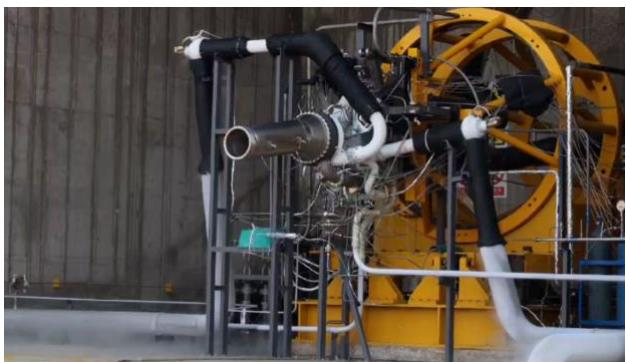  
资料来源：星际荣耀公众号，民生证券研究院

图48：双曲线一号遥六运载火箭飞行试验成功  
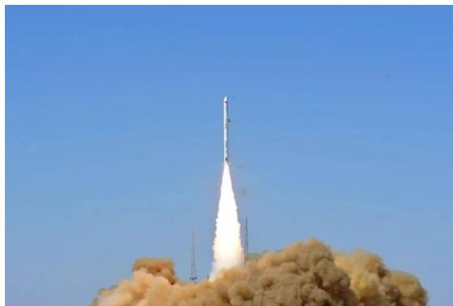  
资料来源：星际荣耀公众号，民生证券研究院

# 4.9 时空道宇

通过建设未来出行星座，时空道宇主要面向智慧出行、消费电子、无人系统等领域的需求，提供不同类型的数据增值服务。时空道宇是吉利科技集团旗下的科技创新企业主要聚焦于卫星制造和卫星应用领域，通过未来出行星座建设，结合北斗卫星系统，提供全球中低速卫星通信服务、星基高精度位置服务、卫星遥感 AI服务。时空道宇正在建设运营全球首个未来出行星座，已于 2022 年 6 月完成首轨九星发射入轨，并将于 2025 年完成一期 72 颗卫星部署，并结合北斗三号系统和天通一号卫星移动系统，为全球地表任何位置的用户提供数据连接服务。

表13：时空道宇主要技术推进时间

<table><tr><td>时间</td><td>事件</td><td>说明</td></tr><tr><td>2020.05</td><td>时空道宇 01/02 星进入总装和测试</td><td>代表时空道宇关键技术的攻克,包括在轨自主实时厘米级高精度定位技术和同频段的 GNSS 卫星导航信号(接收)和低轨导航增强信号(发射)的收发隔离技术。</td></tr><tr><td>2020.06</td><td>正式向市场推出立方体卫星GeeSAT-10(01)星</td><td>具有可量产、大容量、高速率转发等特点,该卫星平台可适应通信、导航、遥感、科学等多种任务需求,并且具备星座组网业务运行能力。</td></tr><tr><td>2020.12</td><td>与京东方传感共同成立卫星互联网车载天线联合实验室</td><td>联合实验室将成为双方技术合作平台,共同推进卫星通信天线、薄膜天线等新型天线在智能网联汽车上的应用。</td></tr><tr><td>2021.04</td><td>加入“蓝星卫士”全球海洋公益行动</td><td>时空道宇将利用自主研制设计的高性能遥感 AI 卫星实现中高分辨率多光谱成像,通过快速星座组网,实现全球覆盖,持续监测海洋生态环境。</td></tr><tr><td>2021.08</td><td>完成“车载卫星互联网”创新探索</td><td>时空道宇“车载卫星互联网”终端实现了卫星互联网与地面移动网络融合互动,测试车辆实现了高速率、高带宽、低延时、安全可靠的通信服务。</td></tr><tr><td>2021.10</td><td>正式发布 GEE-HPM100 系列车规级高精度模组</td><td>时空道宇将助力车端规模应用,打造拥有车道级导航能力的高级别智能驾驶汽车。</td></tr><tr><td>2022.02</td><td>与上远通导达成战略合作,推动北斗三号系列产品大规模商业应用</td><td>旗下公司上合航天与上远通导将共同推进北斗三号系列产品研发及应用,为远洋运输提供全栈式解决方案。</td></tr><tr><td>2022.04</td><td>国内首个北斗三号短报文终端通过入网检验</td><td>北斗三号系列产品(船载北斗卫星导航系统接收机 GS5310)顺利通过北斗卫星导航产品 1001 质量检测中心的北斗三号短报文终端入网检验,正式开启北斗三号系列产品的规模化商用。</td></tr><tr><td>2022.05</td><td>与 u-blox 达成战略合作,推进中欧市场高精定位规模化应用</td><td>与瑞士无线定位模块和芯片企业 u-blox 达成战略合作,合力打造全栈式高精定位软硬件解决方案。</td></tr><tr><td>2022.06</td><td>一箭九星成功入轨</td><td>由时空道宇完全自主研制,设计寿命 5 年,是我国首次在西昌卫星发射中心以“一箭九星”方式成功发射量产商业卫星。</td></tr><tr><td>2022.10</td><td>与远程新能源商用车达成战略合作</td><td>双方将在物流运输、自动驾驶等领域达成深度战略合作,共同推动卫星应用服务在商用车全场景的应用落地。</td></tr></table>

资料来源：时空道宇公众号，民生证券研究院

近年来时空道宇在车载卫星互联网应用方面取得了较大的进展。2020 年与京东方传感共同建立卫星互联网车载台南县联合实验室；于 2021 年 8 月实现卫星互联网与地面移动网络融合互动，完成车载卫星互联网终端测试；同年十月时空道宇发布 GEE-HPM100 系列车规级高精度模组，可提供车道级导航服务；2022年10月又与远程新能源商用车达成战略合作，进一步推广车载卫星互联网的应用；2023 年 1 月，上合航天产业园正式运营，打造国内商业航天首个能承担星座测运控一体化任务的控制中心，作为未来出行星座的全球测运控中心，服务于智能驾驶、智慧物流、智慧海洋等多个领域，推动中国航天技术规模化商业应用。

图49：GEE-HPM100 系列车规级高精度模组  
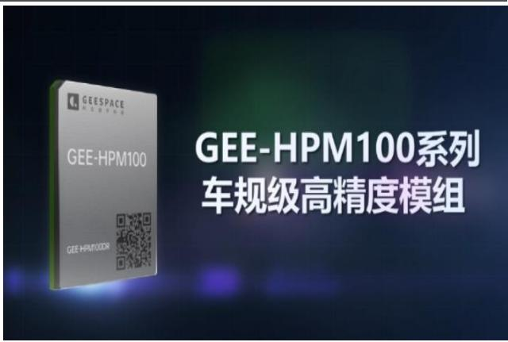  
资料来源：时空道宇官网，民生证券研究院

图50：上合航天产业园大楼  
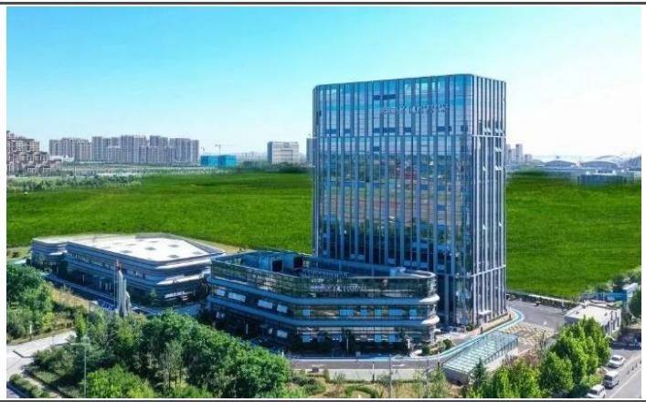  
资料来源：时空道宇官网，民生证券研究院

# 4.10 凯睿星通

凯睿星通是国内领先的卫星通信技术解决方案供应商。凯睿星通已经制定了多个国家重点部门的卫星设备标准，并建设完成国家级部委核心网系统。公司坚持自主研发、持续创新在卫星信道技术、网管技术及应用技术等方面有雄厚实力，相关产品和系统已全面服务于军工、应急通信、卫星互联网、抢险救灾等领域。

# 5 投资建议

# 5.1 行业投资建议

我们再一次重申卫星互联网有望开启并引领下一轮通信板块基础设施建设，当前我国卫星互联网的发展虽尚处早期起步阶段但发展进程提速显著。短期来看前端卫星生产制造环节将有望依托卫星发射进程提速率先受益，中长期维度随着技术设施建设的逐步完善，下游卫星互联网应用侧相关环节将迎来黄金发展阶段。重点推荐信科移动、创意信息、震有科技，同时建议重点关注天银机电、航天智装、海格通信、普天科技等。

# 5.2 信科移动

信科移动是从事移动通信国际标准制定、核心技术研发和产业化的唯一一家央企控股的高新技术企业。成立至今公司始终专注移动通信技术的开发、应用、服务，面向 5G 新生态、面向数字化转型，坚持自主创新驱动价值创造，持续掌握核心技术，打造移动通信领域的“创新高地”和“国之重器”。

公司行业地位显著，技术实力雄厚。公司是我国拥有自主知识产权的第三代移动通信国际标准TD-SCDMA和第四代移动通信国际标准TD-LTE的主要提出者、核心技术开发者及产业化推动者，也是我国在第五代移动通信技术、标准和产业化的重要贡献者。公司目前拥有的已授权国内外专利超 1.2 万件，累计参与制定400 余项国内外行业标准: 截至 2021 年 9 月 30 日公司的 5G 同族专利数量及5G 技术标准贡献度全球排名第七位和第八位。

背靠中国信科，有望充分受益 5G 推进。公司控股股东为中国信科，国务院国资委为公司实际控制人。中国信科是由邮科院和电科院重组而成，居于我国无线通信领域领军位置，同时也是信息通信产品和综合解决方案核心提供商。公司是中信科旗下移动通信业务承载主体，是集团唯一从事 4/5G 移动通信系统设备、天馈设备及室分设备以及移动通信技术服务的企业。2020 年起我国 5G 已进入到规模化商用，我们认为后续伴随 5G 建设稳步推进，公司作为行业领军企业有望充分受益。

投资建议：我们预计公司 2023-2025 年归母净利润分别为-2.71 亿元、1.01亿元、4.68 亿元，2023 年亏损大幅收窄超 3 亿元，2024 年达到业绩拐点实现初步盈利，2025 年开始逐步实现规模性盈利，我们认为公司基本面持续好转，同时公司作为卫星互联网领域领先企业，积极配合国家多个科研项目，具备成熟技术及先发优势，后续具备较强成长性，看好公司后续发展，维持“推荐”评级。

风险提示：6G 建设不及预期；卫星互联网组网进程不及预期；公司下游运营商客户份额占比提升不及预期。

表14：信科移动盈利预测与财务指标

<table><tr><td>项目/年度</td><td>2022A</td><td>2023E</td><td>2024E</td><td>2025E</td></tr><tr><td>营业收入(百万元)</td><td>6,919</td><td>8,748</td><td>10,835</td><td>13,522</td></tr><tr><td>增长率(%)</td><td>22.1</td><td>26.4</td><td>23.8</td><td>24.8</td></tr><tr><td>归属母公司股东净利润(百万元)</td><td>-674</td><td>-271</td><td>101</td><td>468</td></tr><tr><td>增长率(%)</td><td>43.1</td><td>59.9</td><td>137.4</td><td>362.7</td></tr><tr><td>每股收益(元)</td><td>-0.20</td><td>-0.08</td><td>0.03</td><td>0.14</td></tr><tr><td>PE</td><td>\</td><td>\</td><td>252</td><td>55</td></tr><tr><td>PB</td><td>3.7</td><td>3.8</td><td>3.8</td><td>3.5</td></tr></table>

资料来源：Wind，民生证券研究院预测；（注：股价为 2023年 11月 16 日收盘价）

# 5.3 创意信息

创意信息是国内领先的数字化转型服务提供商，服务网络覆盖全国主要城市。公司基于物联网、云边缘计算、大数据、人工智能等技术构建了全栈数字化转型服务能力及竞争优势。目前公司已形成数据采集汇聚、数据处理、数据挖掘分析及数据应用的大数据全栈核心能力。同时公司深化信创产业布局，持续加大在数据库、操作系统和低轨卫星通信载荷等领域的研发投入，不断提升自主可控技术及产品实力。公司参与数十项国际国家标准编制并获取上千件专利和软著，为政府、能源、运营商、金融、交通等领域的近千家客户提供数字化转型服务。旗下公司创智联恒是上市公司创意信息孵化的面向新一代通信的创新型企业。创智联恒拥有基于 5G 的全自研无线通信核心技术，提供 5G 基站、低轨卫星通信载荷等系列自主产品，是专业从事 5G 通信和低轨卫星通信业务的设备商。公司以卫星互联网作为核心业务方向，是低轨卫星宽带演进体制通信领域的先行者。同时创智联合浙江清华长三角研究院成立了联合研发中心，定位为低轨宽带卫星通信载荷的研制单位。从 2020 年开始，公司在 5G 技术基础上，重点研发宽带演进体制的低轨卫星通信核心技术，致力于打造超低成本、快速迭代的低轨卫星通信产品，在低轨卫星宽带演进体制的通信载荷研发上处于国内领先水平。

投资建议：公司数据库业务正处于快速发展阶段，同时公司积极布局卫星互联网业务，看好公司长期成长潜力。预计公司 2023-2025 年归母净利润为1.13/2.10/2.75 亿元，对应 PE 约 84X、46X、35X，维持“推荐”评级。

风险提示：卫星互联网推进进程不及预期；公司客户拓展不及预期。

[表Table\_Forcast] 15：创意信息盈利预测与财务指标 

<table><tr><td>项目/年度</td><td>2022A</td><td>2023E</td><td>2024E</td><td>2025E</td></tr><tr><td>营业收入(百万元)</td><td>2,192</td><td>2,609</td><td>2,967</td><td>3,328</td></tr><tr><td>增长率(%)</td><td>17.4</td><td>19.0</td><td>13.7</td><td>12.2</td></tr><tr><td>归属母公司股东净利润(百万元)</td><td>-39</td><td>113</td><td>210</td><td>275</td></tr><tr><td>增长率(%)</td><td>-79.4</td><td>391.1</td><td>85.4</td><td>30.8</td></tr><tr><td>每股收益(元)</td><td>-0.06</td><td>0.19</td><td>0.35</td><td>0.45</td></tr><tr><td>PE</td><td>\</td><td>84</td><td>46</td><td>35</td></tr><tr><td>PB</td><td>4.1</td><td>3.9</td><td>3.6</td><td>3.2</td></tr></table>

资料来源：Wind，民生证券研究院预测；（注：股价为 2023年 11月 16 日收盘价）

# 5.4 震有科技

公司作为业务范围涵盖公网通信领域和专网通信领域的通信设备商，海外公网板块，2022 年公司中标马来西亚电信 4 个核心网项目，并中标孟加拉电信新增核心网项目，在东南亚、中东和非洲等海外市场加速开拓，创造新的营收增长点；在国内专网领域，公司具备产品定制化服务和技术优势，并且通过多次成功设计并运行大型项目通信系统实现信誉背书，拥有良好的品牌声誉和后续渠道资源，在政府应急、智慧城市、煤矿智能化领域拥有较强客户黏性和转换效率。

2019 年，公司参与承建的天通一号卫星核心网顺利开通，成为国内首个参与卫星核心网建设并成功商用的供应商。此外，公司已成功交付自主卫星移动通信系统项目、卫星互联网核心网项目、定制化 5G 卫星核心网项目、4G 和 5G 融合卫星核心网项目、IMS 融合卫星核心网等相关项目。同时，公司加入 CCSATC12“航天通信技术工作委员会工作组”，参与到“基于 NTN 卫星物联网”的技术标准讨论中。据 Euroconsult 数据，2021-2030 年低轨卫星市场规模复合增速有望超 30%，公司作为国内少数具备卫星互联网核心网技术能力的企业，后续随着我国低轨卫星体系建设，有望深度参与这一市场。

公司创始团队具备多年通信行业技术经验，其中核心高管与技术人员大部分师出华为。为打造产品系列技术优势，公司坚持在研发费用上大量投入，形成了包括 5G 核心网、IMS、RCS、UPF、XG(S)-PON、OTN-CPE、MSAN 等覆盖核心层、汇聚层和接入层的全网络产品体系。公司也是行业内少数提供全系列 10GPON 产品/IMS 核心网/卫星 5G 核心网（并具备项目经验）的厂家之一。

投 资 建 议 ： 我 们 预 测 2023/2024/2025 年 公 司 归 母 净 利 润 实 现0.24/0.95/1.85 亿元，对应 PE 187/48/25 倍，考虑公司在核心网板块存在技术壁垒，同时作为国内少数可以提供卫星网络核心网技术的公司之一，我们看好公司在卫星基建投资下业绩弹性，23 年公司业绩有望经历由负转正阶段，维持“推荐“评级。

风险提示：海外运营商关于移动/固定网络建设规划不及预期；国内 TOB 端政企数字经济基建更新不及预期；卫星通信网络基础建设进程不及预期。

表16：震有科技盈利预测与财务指标

<table><tr><td>项目/年度</td><td>2022A</td><td>2023E</td><td>2024E</td><td>2025E</td></tr><tr><td>营业收入(百万元)</td><td>532</td><td>986</td><td>1,573</td><td>2,210</td></tr><tr><td>增长率(%)</td><td>14.7</td><td>85.2</td><td>59.5</td><td>40.5</td></tr><tr><td>归属母公司股东净利润(百万元)</td><td>-215</td><td>24</td><td>95</td><td>185</td></tr><tr><td>增长率(%)</td><td>-112.1</td><td>111.2</td><td>291.1</td><td>95.3</td></tr><tr><td>每股收益(元)</td><td>-1.11</td><td>0.12</td><td>0.49</td><td>0.95</td></tr><tr><td>PE</td><td>\</td><td>187</td><td>48</td><td>25</td></tr><tr><td>PB</td><td>4.9</td><td>4.8</td><td>4.4</td><td>3.8</td></tr></table>

资料来源：Wind，民生证券研究院预测；（注：股价为 2023年 11月 16 日收盘价）

# 5.5 天银机电

公司控股子公司天银星际目前是国内商业运营的恒星敏感器生产厂商，在国内商业卫星市场占据优势地位。恒星敏感器是航天器、航空器导航系统的重要组成部分，为航天器的姿态控制和天文导航提供高精度测量数据，主要应用于各种卫星、无人机、飞艇等空天设施，一般每颗卫星使用 1-3 个星敏感器。依托清华大学 20 多年空间技术积累，天银星际是国内商业运营的恒星敏感器生产厂商，主要产品包括纳型、皮型两大系列星敏感器，同时天银星际自主研发星模拟器、太阳模拟器、观星转台等专业配套设备，以及纳型卫星及其全物理地面实验系统。天银星际实现了星敏感器的批量化生产，产能达 1,000 台套/年。截至 2022 年年底，累计有 246 台星敏产品在轨运营，在国内商业卫星市场占据优势地位，旗下产品已广泛应用到我国探月工程、高分专项、卫星互联网等国家重大任务实践中。

# 5.6 上海瀚讯

公司定位为军用宽带移动通信系统设备供应商及整体解决方案供应商，目前已实现陆、海、空、火箭军、战略支援部队等全军种列装布局。公司是军用 4G 系统的技术总体单位，该系统在抗干扰、基站自组网、远距离传输、超高速动中通等方面进行了军用化增强改造，实现了军用通信从窄带向宽带的跨越式发展。

公司在军用宽带通信领域处于龙头地位，是业内少数既拥有自主核心知识产权又具备完整资质的供应商。产品型号方面，公司产品全面覆盖固定基站、车载基站、舰载基站、机载基站或背负型基站，以及车载终端、舰载终端、 机载终端、背负终端、手持型终端等装备形态；产业链方面，公司产品包括行业宽带通信芯片、通信模块、终端、基站、应用系统等，已形成了“芯片－模块－终端－基站－系统”的全产业链布局，实现了研发生产自主可控。公司在技术储备、产品化能力、型号装备数量和市场占有率等方面都处于领先地位。

# 5.7 铖昌科技

铖昌科技是一家以微波毫米波模拟相控阵 T/R 芯片（以下简称“相控阵 T/R芯片”）研发、生产、销售和技术服务为主营业务的公司，是国内少数能够提供相控阵 T/R 芯片完整解决方案的企业之一。主要向市场提供基于 GaN、GaAs 和硅基工艺的系列化产品以及相关的技术解决方案。公司产品主要包含功率放大器芯片、低噪声放大器芯片、模拟波束赋形芯片及相控阵用无源器件等，频率可覆盖 L波段至 W 波段。产品已应用于探测、遥感、通信、导航、电子对抗等领域，在星载、机载、舰载、车载和地面相控阵雷达中列装，亦可应用至卫星互联网、5G毫米波通信、安防雷达等场景。公司基于在星载领域的技术积累，公司积极拓展产品应用领域，目前产品已批量列装至地面、车载相控阵雷达等领域。同时，公司加快拓展新兴领域业务。在卫星互联网方面公司充分发挥技术创新优势，成功推出星载和地面用卫星互联网相控阵 T/R 芯片全套解决方案，该芯片的应用提升了卫星雷达系统的整体性能，达到了国际先进水平；5G 毫米波通信方面，公司已经和主流通信设备生产商建立了良好的合作关系，完成芯片多轮迭代开发，支撑 5G毫米波相控阵 T/R 芯片国产化。

# 5.8 航天智装

公司原名康拓红外，隶属于中国航天科技集团有限公司中国空间技术研究院，主营业务涵盖 三大板块：铁路车辆运行安全检测及检修系统、智能测试仿真系统和微系统与控制部组件、核工业及特殊环境自动化装备。

公司子公司轩宇空间产品涵盖智能测试仿真系统和微系统与控制部组件。智能测试仿真系统包括复杂系统和复杂装备在研制、集成和交付运行过程中的仿真验证平台、地面测试平台。产品主要应用于航空航天等复杂智能装备领域，为复杂系统和复杂装备在地面研制过程、大系统集成调试过程、长期连续稳定运行过程提供仿真、测试手段。智能测试仿真系统主要应用于航天、航空、防务装备等领域。微系统及控制部组件业务中，微系统主要包括片上微处理器、存储器等产品，控制部组件主要包括姿轨控液体动力系统、光学惯性组合导航装置、姿态敏感器、微处理器、空间机电等产品。主要应用于航空航天等复杂智能装备的控制系统。微系统集成模块及部组件主要应用于航天领域。

# 5.9 南京熊猫

公司以智能制造、智慧城市和电子制造服务为主业，大力发展智能制造核心装备和智能工厂系统集成业务；大力发展智能交通、平安城市、智能建筑和信息网络设备这四大核心智慧城市业务；大力发展具有一流的供应链管理能力和能够实现智能化、柔性化、精益化生产制造的电子制造服务业务。公司积极开展国际合作，与瑞典爱立信等建立了多家知名合资企业。公司全资子公司熊猫通信成功中标新一代卫星终端项目，中标金额 900 余万元。该项目中标是公司在新一代卫星通信领域迈出的关键一步，开辟了新的业务领域。天地一体化信息网络是国家重大战略发展方向，新一代卫星通信系统是天地一体化信息网络的天基网络，是当今世界各国研究的热点。本次中标的项目是研制新一代卫星通信系统的关键应用终端，需要攻克卫星通信的物理层、协议栈等关键技术，为系统建设和芯片研制提供关键技术保障，具有广阔的市场应用前景。公司拥有低轨卫星移动通信技术，可广泛应用于手机、车载、船载、机载、物联网等。

# 5.10 海格通信

海格通信成立于 2007 年，前身是国家第四机械工业部国营第七五〇厂，于2010 年实现 A股上市。当前公司已发展成全频段覆盖的无线通信与全产业链布局的北斗导航装备研制专家、电子信息系统解决方案提供商，是行业内用户覆盖面最广、频段覆盖最宽、产品系列最全、最具竞争力的重点电子信息企业之一。目前公司主营业务呈现“无线通信、北斗导航、航空航天、数智生态”四大领域的业务布局。

无线通信领域，公司主导产品覆盖短波通信、超短波通信、卫星通信、数字集群、多模智能终端和系统集成等领域，实现天、空、地、海全域布局，是国内拥有全系列天通卫星终端及芯片的主流厂家，是军、警、民用数字集群装备序列和技术体制齐全的主要单位。根据公司半年报，2023H1 公司无线通信业务营收同比增长 37.45%，同时下一代主型短波、超短波产品持续突破新市场领域，卫通卫导产品、5G 产品也获得了重要突破，有望形成长期增量。

北斗导航领域，公司率先实现“芯片、模块、天线、终端、系统、运营”全产业链布局，是国防领域北斗三号芯片型号最多、品类最齐全的单位；根据 2023年半年报，公司北斗三号产品开始在机构用户实现批量订货，并在行业大客户市场取得突破。公司接连中标能源行业北斗三号应用项目——中石化石油工程地球球物理有限公司 2022-2023 年度北斗定位手环及配件框架协议采购项目和中国石油运输有限公司车载终端及主动安全监控设备采购项目，首个实现能源行业批量应用；承担国家北斗产业化重大工程项目，打造北斗产业化应用的新高地、新典范，树立北斗卫星导航系统产业化发展的样板。目前行业处于北斗二号向北斗三号换代期，公司有望抓住行业机遇实现业绩高增。

定增落地，公司加大投入完善产业布局。根据 2023 年 7 月 26 日公告，公司拟定增不超过 18.55 亿元，募集资金将用于“北斗+5G”通导融合研发产业化项目（8 亿元），无人信息产业基地项目（5 亿元），天枢研发中心建设暨卫星互联网研发项目（5.55 亿元）。本次募投项目战略性加大在“北斗+5G”“无人信息产业”“卫星互联网”等领域的投入，进一步加强“产业+资本”双轮驱动，助推未来业绩发展。

# 收入预测：

（1）随着北斗三号开始大规模推广及使用，相关产业链处于快速发展期。公司作为北三先行龙头，已开始在机构用户实现批量供货，中标项目充足。我们预期公司北斗导航业务 2023\~2025 年营收增速为 5%、30%、40%。  
（2）随着国防信息化建设的大力开展，军用无线通信需求快速增长。公司下一代主型短波、超短波产品持续突破新市场领域，卫通卫导产品、5G 产品也获得了重要突破，有望形成长期增量。我们预期公司无线通信产品增速分别为 23%、

20%、19%。

（3）航空航天装备是新型作战力量的重要构成，随着我国国防和军队现代化建设的进程提速，军用飞机需求将加速释放；民用航空方面，我国国产大飞机首飞成功，相关产业链快速发展。我们预期公司泛航空产品增速为 25%、20%、15%。  
（4）软件与信息服务领域，公司是业界具有竞争优势的信息通信技术服务商和系统集成提供商。新一代信息技术飞速发展，社会进入万物智联时代，数字化、智能化已是未来发展的必然趋势。我们预期公司软件与信息服务产品增速为 8%、11%、10%。

表17：海格通信盈利预测

<table><tr><td colspan="2"></td><td>2020A</td><td>2021A</td><td>2022A</td><td>2023E</td><td>2024E</td><td>2025E</td></tr><tr><td rowspan="4">北斗导航业务</td><td>收入</td><td>404.24</td><td>425.03</td><td>439.44</td><td>461.41</td><td>599.83</td><td>839.76</td></tr><tr><td>增长率</td><td>13.41%</td><td>5.14%</td><td>3.39%</td><td>5.00%</td><td>30.00%</td><td>40.00%</td></tr><tr><td>毛利</td><td>240.49</td><td>282.40</td><td>252.94</td><td>267.62</td><td>341.90</td><td>478.67</td></tr><tr><td>毛利率</td><td>59.49%</td><td>66.44%</td><td>57.56%</td><td>58.00%</td><td>57.00%</td><td>57.00%</td></tr><tr><td rowspan="4">无线通信</td><td>收入</td><td>2,284.41</td><td>2,666.22</td><td>2,539.10</td><td>3,123.09</td><td>3,747.71</td><td>4,459.77</td></tr><tr><td>增长率</td><td>16.99%</td><td>16.71%</td><td>-4.77%</td><td>23.00%</td><td>20.00%</td><td>19.00%</td></tr><tr><td>毛利</td><td>1,100.89</td><td>1,234.95</td><td>1,126.57</td><td>1,421.01</td><td>1,705.21</td><td>2,029.20</td></tr><tr><td>毛利率</td><td>48.19%</td><td>46.32%</td><td>44.37%</td><td>45.50%</td><td>45.50%</td><td>45.50%</td></tr><tr><td rowspan="4">泛航空业务</td><td>收入</td><td>310.55</td><td>266.99</td><td>332.30</td><td>415.37</td><td>498.45</td><td>573.22</td></tr><tr><td>增长率</td><td>16.28%</td><td>-14.03%</td><td>24.46%</td><td>25.00%</td><td>20.00%</td><td>15.00%</td></tr><tr><td>毛利</td><td>144.60</td><td>121.54</td><td>153.85</td><td>186.92</td><td>224.30</td><td>257.95</td></tr><tr><td>毛利率</td><td>46.56%</td><td>45.52%</td><td>46.30%</td><td>45.00%</td><td>45.00%</td><td>45.00%</td></tr><tr><td rowspan="4">软件信息与服务</td><td>收入</td><td>2,064.20</td><td>2,043.50</td><td>2,246.19</td><td>2,425.89</td><td>2,692.74</td><td>2,962.01</td></tr><tr><td>增长率</td><td>3.16%</td><td>-1.00%</td><td>9.92%</td><td>8.00%</td><td>11.00%</td><td>10.00%</td></tr><tr><td>毛利</td><td>330.72</td><td>350.77</td><td>377.78</td><td>412.40</td><td>457.77</td><td>533.16</td></tr><tr><td>毛利率</td><td>16.02%</td><td>17.17%</td><td>16.82%</td><td>17.00%</td><td>17.00%</td><td>18.00%</td></tr><tr><td rowspan="4">其他业务</td><td>收入</td><td>58.67</td><td>72.40</td><td>58.59</td><td>64.44</td><td>70.89</td><td>77.98</td></tr><tr><td>增长率</td><td>96.34%</td><td>23.40%</td><td>-19.09%</td><td>10.00%</td><td>10.00%</td><td>10.00%</td></tr><tr><td>毛利</td><td>42.55</td><td>54.18</td><td>52.70</td><td>58.00</td><td>63.80</td><td>70.18</td></tr><tr><td>毛利率</td><td>72.53%</td><td>74.82%</td><td>89.95%</td><td>90.00%</td><td>90.00%</td><td>90.00%</td></tr><tr><td rowspan="4">合计</td><td>收入</td><td>5,122.06</td><td>5,474.15</td><td>5,615.61</td><td>6,490.20</td><td>7,609.61</td><td>8,912.74</td></tr><tr><td>增长率</td><td>11.18%</td><td>6.87%</td><td>2.58%</td><td>15.57%</td><td>17.25%</td><td>17.12%</td></tr><tr><td>毛利</td><td>1,859.26</td><td>2,043.83</td><td>1,963.83</td><td>2,345.94</td><td>2,792.98</td><td>3,369.15</td></tr><tr><td>毛利率</td><td>36.30%</td><td>37.34%</td><td>34.97%</td><td>36.15%</td><td>36.70%</td><td>37.80%</td></tr></table>

资料来源：民生证券研究院预测

投资建议：考虑到国防信息化加速推进，公司无线通信业务有望持续增长，同时军用北斗正处于关键换代期，公司作为军用北斗导航龙头有望充分受益，预计公司 2023-2025 年归母净利润为 6.24/7.33/9.32 亿元，对应 PE 分别为 50X、42X、33X。同时公司积极布局卫星互联网、北斗+5G 及无人信息业务，我们看好公司长期成长潜力，首次覆盖，给予公司“推荐”评级。

风险提示：卫星互联网推进进程不及预期；北斗发展进程不及预期；公司客户拓展不及预期。

[表Table\_Forcast] 18：海格通信盈利预测与财务指标 

<table><tr><td>项目/年度</td><td>2022A</td><td>2023E</td><td>2024E</td><td>2025E</td></tr><tr><td>营业收入(百万元)</td><td>5,616</td><td>6,490</td><td>7,610</td><td>8,913</td></tr><tr><td>增长率(%)</td><td>2.6</td><td>15.6</td><td>17.2</td><td>17.1</td></tr><tr><td>归属母公司股东净利润(百万元)</td><td>668</td><td>624</td><td>733</td><td>932</td></tr><tr><td>增长率(%)</td><td>2.2</td><td>-6.5</td><td>17.4</td><td>27.1</td></tr><tr><td>每股收益(元)</td><td>0.29</td><td>0.27</td><td>0.32</td><td>0.40</td></tr><tr><td>PE</td><td>47</td><td>50</td><td>42</td><td>33</td></tr><tr><td>PB</td><td>2.9</td><td>2.8</td><td>2.7</td><td>2.6</td></tr></table>

资料来源：Wind，民生证券研究院预测；（注：股价为 2023年 11月 16 日收盘价）

# 5.11 普天科技

普天科技原名杰赛科技，为广州中电科 7 所旗下上市公司。普天科技于 2017年完成资产重组，将电科集团 54 所下的远东通信等资产注入上市公司。2017 年中电网络通信集团有限公司（中电网通）成立，整体托管五个电科集团通信类研究所（7 所、34 所、39 所、50 所和 54 所）及所属企业。2018 年上市公司控股股东变更为中电网通，公司是其旗下唯一上市公司平台。2021 年 6 月，中国普天整体无偿划入中国电科。2022 年 6 月，公司由杰赛科技更名为普天科技。

根据中电科 54 所官网，54 所是电子信息领域专业覆盖面最宽、综合性最强的骨干研究所，21 年升格为中国电科网络通信研究院。54 所在急需的卫星通信低成本相控阵天线、新型高集成基带芯片、地面核心网产品和运控管理系统等领域快速发展。根据《石家庄日报》2022 年 7 月报道，54 所将发展卫星互联网产业，突破一批“卡脖子”技术，开展关键技术攻关、生产线测试线建设，将紧抓卫星互联网发展机遇，布局芯片、终端、天线等系列产业。

# 收入预测：

（1）高端装备制造：国防信息化建设持续推进下，军用 PCB 需求有望快速增长，公司作为国内军品 PCB 领军者有望受益行业增长红利。同时公司二期 PCB项目建成投产后届时将迎来较大增长。我们预期公司高端装备制造产品收入增速为 13%、13%、35%。  
（2）专网通信：随着人工智能、大数据、卫星互联网等新一代信息通信技术应用不断加深，各行业数字化转型驶入“快车道”，公司在城市轨道交通、电力、人防等优势行业地位持续稳固，同时重点布局水务、公安、应急等行业，中标项目充足。我们预期公司专网通信相关产品收入增速为 9%、10%、10%。  
（3）公网通信系统：公司保持全国最大独立第三方设计院的行业领先地位，我们预期公司公网通信系统相关产品收入增速为 8%、7%、7%。

表19：普天科技盈利预测

<table><tr><td colspan="2"></td><td>2021A</td><td>2022A</td><td>2023E</td><td>2024E</td><td>2025E</td></tr><tr><td rowspan="4">高端装备制造</td><td>收入</td><td>1,260.85</td><td>1,406.23</td><td>1,589.05</td><td>1,795.62</td><td>2,424.09</td></tr><tr><td>增长率</td><td>20.39%</td><td>11.53%</td><td>13.00%</td><td>13.00%</td><td>35.00%</td></tr><tr><td>毛利</td><td>472.32</td><td>507.69</td><td>583.18</td><td>660.79</td><td>896.91</td></tr><tr><td>毛利率</td><td>37.46%</td><td>36.10%</td><td>36.70%</td><td>36.80%</td><td>37.00%</td></tr><tr><td rowspan="4">专网通信</td><td>收入</td><td>3,856.66</td><td>4,158.78</td><td>4,533.07</td><td>4,986.37</td><td>5,485.01</td></tr><tr><td>增长率</td><td>9.02%</td><td>7.83%</td><td>9.00%</td><td>10.00%</td><td>10.00%</td></tr><tr><td>毛利</td><td>560.86</td><td>632.12</td><td>689.03</td><td>757.93</td><td>833.72</td></tr><tr><td>毛利率</td><td>14.54%</td><td>15.20%</td><td>15.20%</td><td>15.20%</td><td>15.20%</td></tr><tr><td rowspan="4">公网通信系统</td><td>收入</td><td>1,435.12</td><td>1,510.51</td><td>1,631.35</td><td>1,745.55</td><td>1,867.74</td></tr><tr><td>增长率</td><td>-16.11%</td><td>5.25%</td><td>8.00%</td><td>7.00%</td><td>7.00%</td></tr><tr><td>毛利</td><td>192.35</td><td>206.57</td><td>220.23</td><td>237.39</td><td>254.01</td></tr><tr><td>毛利率</td><td>13.40%</td><td>13.68%</td><td>13.50%</td><td>13.60%</td><td>13.60%</td></tr><tr><td rowspan="4">合计</td><td>收入</td><td>6,552.63</td><td>7,075.53</td><td>7,753.47</td><td>8,527.54</td><td>9,776.84</td></tr><tr><td>增长率</td><td>4.09%</td><td>7.98%</td><td>9.58%</td><td>9.98%</td><td>14.65%</td></tr><tr><td>毛利</td><td>1,225.53</td><td>1,346.38</td><td>1,492.44</td><td>1,656.11</td><td>1,984.65</td></tr><tr><td>毛利率</td><td>18.7%</td><td>19.0%</td><td>19.25%</td><td>19.42%</td><td>20.30%</td></tr></table>

资料来源：民生证券研究院预测

投资建议：我们预计公司 2023\~2025 年营业收入有望分别达 77.5 亿元、84.8亿元和 96.8 亿元，归母净利润有望分别达 2.7 亿元、3.1 亿元和 3.6 亿元，对应PE 分别为 60X、52X 和 44X。考虑到公司在特种印制电路板领域的龙头地位及后续产能的释放，首次覆盖，我们给予公司“推荐”评级。

风险提示：卫星互联网建设进程不及预期；集团内相关业务协作不及预期。

[表Table\_Forcast] 20：普天科技盈利预测与财务指标 

<table><tr><td>项目/年度</td><td>2022A</td><td>2023E</td><td>2024E</td><td>2025E</td></tr><tr><td>营业收入(百万元)</td><td>7,076</td><td>7,753</td><td>8,482</td><td>9,678</td></tr><tr><td>增长率(%)</td><td>8.0</td><td>9.6</td><td>9.4</td><td>14.1</td></tr><tr><td>归属母公司股东净利润(百万元)</td><td>213</td><td>266</td><td>308</td><td>361</td></tr><tr><td>增长率(%)</td><td>50.7</td><td>24.7</td><td>15.9</td><td>16.9</td></tr><tr><td>每股收益(元)</td><td>0.31</td><td>0.39</td><td>0.45</td><td>0.53</td></tr><tr><td>PE</td><td>75</td><td>60</td><td>52</td><td>44</td></tr><tr><td>PB</td><td>4.2</td><td>4.1</td><td>3.9</td><td>3.7</td></tr></table>

资料来源：Wind，民生证券研究院预测；（注：股价为 2023年 11月 16 日收盘价）

# 6 风险提示

1）我国卫星发射进程不及预期。若我国卫星发射整体进程不及预期则可能会对上游卫星生产制造环节需求产生影响，进而影响相关公司业绩体现。  
2）6G 通信技术迭代不及预期。6G 技术发展不及预期或将影响卫星互联网组网节奏及下游相关终端产品的研发设计生产销售，进而可能会对部分公司业绩体现产生扰动。

# 插图目录

图 1： 星链计划网络覆盖范围.. . 3

图 2： 星链设备及应用场景 . 4

图 3： 星链计划用户从 2021 年到 2022 年从美国 776 个县扩散至 2399 个县. 5

图 4： 用户通过卫星接收器使用星链房车版

图 5： T-mobile CEO 西弗特与 SpaceX CEO 马斯克在活动现场. . 6

图 6： SpaceX 发布直连计划 ..

图 7： SpaceX 手机直连概览 .

图 8： Oneweb 成功完成第 18 次发射.

图 9： 铱星产品及服务概览 . ... 8

图 10： Iridium GO!® App 应用界面. ........ 8

图 11： Snapdragon Satellite 应用... . 9

图 12： BlueWalker 3 卫星天线展开后超过 64 平方米 . 9

图 13： 无需安装即可进行手机卫星直连. ....... .10

图 14： BlueWalker3.. ........10

图 15： 美国空军在犹他州测试星链卫星通信.. .10

图 16： 北约盟国在演习中使用了星链互联网服务. .10

图 17： Starlink Maritime 产品及应用... .11

图 18： 卫星互联网应用于矿业. .......................................... 11

图 19： 金融界首颗物联网卫星“平安 1 号”成功发射.. .......................... .12

图 20： 卫星互联网在防灾减灾方面的应用. .12

图 21： 3GPP 标准进程及预期. ........ ..13

图 22： 5G 兼容与 6G 融合. ........ ..14

图 23： 空天地海一体化网络. .14

图 24： 星网牵头五大运营商联合制定基于 5G 的卫星互联网标准 .15

图 25： 李强在银河航天公司调研.. ..16

图 26： 武汉国家航天产业基地卫星产业园项目集体开工现场.

图 27： 银河航天首批 6 颗低轨宽带通信卫星 .......18

图 28： “吉林一号”高分 03 星批量化出厂. .......................... .......18

图 29： 在建中的银河航天南通卫星超级工厂 .18

图 30： 台州星空智联科技有限公司卫星超级工厂 .............................................................................. .......18

图 31： 不锈钢的卓越性能使星际飞船能够应对极高和极低温度. .19

图 32： 银河航天初样柔性太阳翼. .19

图 33： 猎鹰 9 号发动机螺接安装结构 OctaWeb..... ............ .21

图 34： 长征八号运载火箭成功将 22 颗卫星发射升空，创造我国一箭多星新纪录. .21

图 35： SpaceX 海上回收过程示意图 .22

图 36： “雷霆-R1”首次“二次起动”试车成功 .23

图 37： 深蓝航天三手“星云-M”完成飞行回收任务 .23

图 38： 车轮式卫星编队在轨模拟图 ................................................................. .25

图 39： 四颗干涉合成孔径雷达（InSAR）卫星. .25

图 40： 朱雀二号遥二运载火箭完成总装. ..28

图 41： 东方空间引力-1 号运载火箭. ......... ..28

图 42： 东方空间一站式发射服务. ............................. ...28

图 43： 天龙二号首飞成功. ......31

图 44： 天兵天火系列液体火箭发动机.. ..31

图 45： 谷神星一号运载火箭. ........... ..31

图 46： 智神星一号液体运载火箭.. ....31

图 47： 星际荣耀百吨级液氧甲烷发动机. .34

图 48： 双曲线一号遥六运载火箭飞行试验成功. .34

图 49： GEE-HPM100 系列车规级高精度模组. ......36

图 50： 上合航天产业园大楼. ............................. ......36

# 表格目录

# 重点公司盈利预测、估值与评级 .....

表 1： 2022Q3 星链卫星服务性能比较. . 4

表 2： 星链计划对个人用户收费标准.. . 5

表 3： Oneweb 业务范围.. ... 8

表 4： 目前国际上仍在服役的大型运载火箭 ...20

表 5： 截至 2022 银河航天主要技术推进时间表.. ..24

表 6： 微纳星空卫星发射记录 ........ ...26

表 7： 蓝箭航天主要技术推进时间表.. ..27

表 8： 东方空间主要技术推进时间表.. ..29

表 9： 天兵科技主要技术推进时间表.. ..30

表 10： 星河动力火箭研发、试验及发射时间表.. ..32

表 11： 深蓝航天主要技术推进时间. ..33

表 12： 星际荣耀 2022 至 2023 年主要技术推进时间. ..33

表 13： 时空道宇主要技术推进时间. .35

表 14： 信科移动盈利预测与财务指标.. ..38

表 15： 创意信息盈利预测与财务指标.. ..38

表 16： 震有科技盈利预测与财务指标... ..39

表 17： 海格通信盈利预测. ...43

表 18： 海格通信盈利预测与财务指标 ................ .44

表 19： 普天科技盈利预测. ..45

表 20： 普天科技盈利预测与财务指标.. ..45

海格通信财务报表数据预测汇总......... .49

普天科技财务报表数据预测汇总......... ...50

海格通信财务报表数据预测汇总

<table><tr><td>利润表(百万元)</td><td>2022A</td><td>2023E</td><td>2024E</td><td>2025E</td></tr><tr><td>营业总收入</td><td>5,616</td><td>6,490</td><td>7,610</td><td>8,913</td></tr><tr><td>营业成本</td><td>3,652</td><td>4,144</td><td>4,817</td><td>5,544</td></tr><tr><td>营业税金及附加</td><td>46</td><td>47</td><td>55</td><td>64</td></tr><tr><td>销售费用</td><td>175</td><td>222</td><td>261</td><td>305</td></tr><tr><td>管理费用</td><td>301</td><td>346</td><td>406</td><td>476</td></tr><tr><td>研发费用</td><td>788</td><td>911</td><td>1,069</td><td>1,252</td></tr><tr><td>EBIT</td><td>717</td><td>858</td><td>1,025</td><td>1,272</td></tr><tr><td>财务费用</td><td>-28</td><td>-6</td><td>0</td><td>2</td></tr><tr><td>资产减值损失</td><td>-77</td><td>-187</td><td>-231</td><td>-258</td></tr><tr><td>投资收益</td><td>42</td><td>8</td><td>9</td><td>11</td></tr><tr><td>营业利润</td><td>720</td><td>685</td><td>805</td><td>1,023</td></tr><tr><td>营业外收支</td><td>3</td><td>0</td><td>0</td><td>0</td></tr><tr><td>利润总额</td><td>723</td><td>685</td><td>805</td><td>1,023</td></tr><tr><td>所得税</td><td>26</td><td>41</td><td>48</td><td>61</td></tr><tr><td>净利润</td><td>697</td><td>644</td><td>757</td><td>962</td></tr><tr><td>归属于母公司净利润</td><td>668</td><td>624</td><td>733</td><td>932</td></tr><tr><td>EBITDA</td><td>869</td><td>1,034</td><td>1,253</td><td>1,552</td></tr></table>

<table><tr><td>资产负债表(百万元)</td><td>2022A</td><td>2023E</td><td>2024E</td><td>2025E</td></tr><tr><td>货币资金</td><td>2,742</td><td>3,027</td><td>2,839</td><td>2,691</td></tr><tr><td>应收账款及票据</td><td>3,919</td><td>4,335</td><td>5,060</td><td>5,899</td></tr><tr><td>预付款项</td><td>137</td><td>140</td><td>163</td><td>187</td></tr><tr><td>存货</td><td>1,635</td><td>2,091</td><td>2,399</td><td>2,756</td></tr><tr><td>其他流动资产</td><td>981</td><td>951</td><td>1,050</td><td>1,165</td></tr><tr><td>流动资产合计</td><td>9,414</td><td>10,544</td><td>11,510</td><td>12,698</td></tr><tr><td>长期股权投资</td><td>300</td><td>300</td><td>300</td><td>300</td></tr><tr><td>固定资产</td><td>1,423</td><td>1,414</td><td>1,442</td><td>1,470</td></tr><tr><td>无形资产</td><td>327</td><td>339</td><td>336</td><td>333</td></tr><tr><td>非流动资产合计</td><td>5,794</td><td>5,911</td><td>5,909</td><td>5,905</td></tr><tr><td>资产合计</td><td>15,208</td><td>16,454</td><td>17,420</td><td>18,603</td></tr><tr><td>短期借款</td><td>319</td><td>719</td><td>719</td><td>719</td></tr><tr><td>应付账款及票据</td><td>2,235</td><td>2,408</td><td>2,799</td><td>3,221</td></tr><tr><td>其他流动负债</td><td>831</td><td>1,154</td><td>1,294</td><td>1,471</td></tr><tr><td>流动负债合计</td><td>3,385</td><td>4,281</td><td>4,812</td><td>5,412</td></tr><tr><td>长期借款</td><td>130</td><td>207</td><td>207</td><td>207</td></tr><tr><td>其他长期负债</td><td>429</td><td>404</td><td>405</td><td>406</td></tr><tr><td>非流动负债合计</td><td>559</td><td>611</td><td>612</td><td>613</td></tr><tr><td>负债合计</td><td>3,945</td><td>4,892</td><td>5,424</td><td>6,025</td></tr><tr><td>股本</td><td>2,304</td><td>2,304</td><td>2,304</td><td>2,304</td></tr><tr><td>少数股东权益</td><td>602</td><td>622</td><td>645</td><td>675</td></tr><tr><td>股东权益合计</td><td>11,263</td><td>11,562</td><td>11,996</td><td>12,578</td></tr><tr><td>负债和股东权益合计</td><td>15,208</td><td>16,454</td><td>17,420</td><td>18,603</td></tr></table>

<table><tr><td>主要财务指标</td><td>2022A</td><td>2023E</td><td>2024E</td><td>2025E</td></tr><tr><td>成长能力(%)</td><td></td><td></td><td></td><td></td></tr><tr><td>营业收入增长率</td><td>2.58</td><td>15.57</td><td>17.25</td><td>17.12</td></tr><tr><td>EBIT 增长率</td><td>5.99</td><td>19.67</td><td>19.54</td><td>24.08</td></tr><tr><td>净利润增长率</td><td>2.23</td><td>-6.54</td><td>17.41</td><td>27.15</td></tr><tr><td>盈利能力(%)</td><td></td><td></td><td></td><td></td></tr><tr><td>毛利率</td><td>34.97</td><td>36.15</td><td>36.70</td><td>37.80</td></tr><tr><td>净利润率</td><td>11.90</td><td>9.62</td><td>9.63</td><td>10.46</td></tr><tr><td>总资产收益率 ROA</td><td>4.39</td><td>3.80</td><td>4.21</td><td>5.01</td></tr><tr><td>净资产收益率 ROE</td><td>6.27</td><td>5.71</td><td>6.46</td><td>7.83</td></tr><tr><td>偿债能力</td><td></td><td></td><td></td><td></td></tr><tr><td>流动比率</td><td>2.78</td><td>2.46</td><td>2.39</td><td>2.35</td></tr><tr><td>速动比率</td><td>2.10</td><td>1.83</td><td>1.74</td><td>1.68</td></tr><tr><td>现金比率</td><td>0.81</td><td>0.71</td><td>0.59</td><td>0.50</td></tr><tr><td>资产负债率(%)</td><td>25.94</td><td>29.73</td><td>31.14</td><td>32.39</td></tr><tr><td>经营效率</td><td></td><td></td><td></td><td></td></tr><tr><td>应收账款周转天数</td><td>223.02</td><td>218.00</td><td>218.00</td><td>218.00</td></tr><tr><td>存货周转天数</td><td>163.45</td><td>191.79</td><td>191.79</td><td>191.79</td></tr><tr><td>总资产周转率</td><td>0.37</td><td>0.41</td><td>0.45</td><td>0.49</td></tr><tr><td>每股指标(元)</td><td></td><td></td><td></td><td></td></tr><tr><td>每股收益</td><td>0.29</td><td>0.27</td><td>0.32</td><td>0.40</td></tr><tr><td>每股净资产</td><td>4.63</td><td>4.75</td><td>4.93</td><td>5.17</td></tr><tr><td>每股经营现金流</td><td>-0.02</td><td>0.25</td><td>0.22</td><td>0.27</td></tr><tr><td>每股股利</td><td>0.15</td><td>0.14</td><td>0.16</td><td>0.21</td></tr><tr><td>估值分析</td><td></td><td></td><td></td><td></td></tr><tr><td>PE</td><td>47</td><td>50</td><td>42</td><td>33</td></tr><tr><td>PB</td><td>2.9</td><td>2.8</td><td>2.7</td><td>2.6</td></tr><tr><td>EV/EBITDA</td><td>34.99</td><td>29.41</td><td>24.26</td><td>19.58</td></tr><tr><td>股息收益率(%)</td><td>1.11</td><td>1.04</td><td>1.22</td><td>1.55</td></tr></table>

<table><tr><td>现金流量表(百万元)</td><td>2022A</td><td>2023E</td><td>2024E</td><td>2025E</td></tr><tr><td>净利润</td><td>697</td><td>644</td><td>757</td><td>962</td></tr><tr><td>折旧和摊销</td><td>152</td><td>176</td><td>228</td><td>280</td></tr><tr><td>营运资金变动</td><td>-1,000</td><td>-515</td><td>-861</td><td>-1,069</td></tr><tr><td>经营活动现金流</td><td>-42</td><td>576</td><td>508</td><td>632</td></tr><tr><td>资本开支</td><td>-390</td><td>-238</td><td>-302</td><td>-355</td></tr><tr><td>投资</td><td>592</td><td>0</td><td>0</td><td>0</td></tr><tr><td>投资活动现金流</td><td>243</td><td>-333</td><td>-293</td><td>-344</td></tr><tr><td>股权募资</td><td>4</td><td>0</td><td>0</td><td>0</td></tr><tr><td>债务募资</td><td>281</td><td>468</td><td>-23</td><td>0</td></tr><tr><td>筹资活动现金流</td><td>-100</td><td>42</td><td>-403</td><td>-436</td></tr><tr><td>现金净流量</td><td>104</td><td>285</td><td>-189</td><td>-148</td></tr></table>

资料来源：公司公告、民生证券研究院预测

普天科技财务报表数据预测汇总

<table><tr><td>利润表(百万元)</td><td>2022A</td><td>2023E</td><td>2024E</td><td>2025E</td></tr><tr><td>营业总收入</td><td>7,076</td><td>7,753</td><td>8,482</td><td>9,678</td></tr><tr><td>营业成本</td><td>5,729</td><td>6,261</td><td>6,828</td><td>7,708</td></tr><tr><td>营业税金及附加</td><td>37</td><td>39</td><td>42</td><td>48</td></tr><tr><td>销售费用</td><td>268</td><td>310</td><td>339</td><td>435</td></tr><tr><td>管理费用</td><td>264</td><td>349</td><td>382</td><td>445</td></tr><tr><td>研发费用</td><td>322</td><td>364</td><td>407</td><td>484</td></tr><tr><td>EBIT</td><td>277</td><td>370</td><td>431</td><td>504</td></tr><tr><td>财务费用</td><td>25</td><td>26</td><td>36</td><td>46</td></tr><tr><td>资产减值损失</td><td>-16</td><td>-16</td><td>-15</td><td>-15</td></tr><tr><td>投资收益</td><td>-6</td><td>0</td><td>1</td><td>1</td></tr><tr><td>营业利润</td><td>246</td><td>328</td><td>381</td><td>445</td></tr><tr><td>营业外收支</td><td>2</td><td>0</td><td>0</td><td>0</td></tr><tr><td>利润总额</td><td>248</td><td>329</td><td>381</td><td>446</td></tr><tr><td>所得税</td><td>23</td><td>39</td><td>46</td><td>53</td></tr><tr><td>净利润</td><td>225</td><td>289</td><td>335</td><td>392</td></tr><tr><td>归属于母公司净利润</td><td>213</td><td>266</td><td>308</td><td>361</td></tr><tr><td>EBITDA</td><td>416</td><td>517</td><td>598</td><td>693</td></tr></table>

<table><tr><td>资产负债表(百万元)</td><td>2022A</td><td>2023E</td><td>2024E</td><td>2025E</td></tr><tr><td>货币资金</td><td>2,361</td><td>2,507</td><td>2,535</td><td>2,784</td></tr><tr><td>应收账款及票据</td><td>4,594</td><td>4,059</td><td>4,269</td><td>4,245</td></tr><tr><td>预付款项</td><td>100</td><td>157</td><td>157</td><td>154</td></tr><tr><td>存货</td><td>1,266</td><td>1,442</td><td>1,482</td><td>1,463</td></tr><tr><td>其他流动资产</td><td>413</td><td>216</td><td>207</td><td>203</td></tr><tr><td>流动资产合计</td><td>8,733</td><td>8,381</td><td>8,650</td><td>8,849</td></tr><tr><td>长期股权投资</td><td>0</td><td>0</td><td>0</td><td>0</td></tr><tr><td>固定资产</td><td>593</td><td>621</td><td>662</td><td>698</td></tr><tr><td>无形资产</td><td>186</td><td>185</td><td>183</td><td>180</td></tr><tr><td>非流动资产合计</td><td>1,094</td><td>1,155</td><td>1,175</td><td>1,168</td></tr><tr><td>资产合计</td><td>9,827</td><td>9,536</td><td>9,825</td><td>10,017</td></tr><tr><td>短期借款</td><td>680</td><td>680</td><td>680</td><td>680</td></tr><tr><td>应付账款及票据</td><td>4,383</td><td>3,688</td><td>3,779</td><td>3,759</td></tr><tr><td>其他流动负债</td><td>631</td><td>776</td><td>769</td><td>753</td></tr><tr><td>流动负债合计</td><td>5,694</td><td>5,145</td><td>5,229</td><td>5,193</td></tr><tr><td>长期借款</td><td>200</td><td>199</td><td>199</td><td>199</td></tr><tr><td>其他长期负债</td><td>35</td><td>109</td><td>111</td><td>101</td></tr><tr><td>非流动负债合计</td><td>235</td><td>308</td><td>311</td><td>300</td></tr><tr><td>负债合计</td><td>5,930</td><td>5,452</td><td>5,539</td><td>5,493</td></tr><tr><td>股本</td><td>683</td><td>683</td><td>683</td><td>683</td></tr><tr><td>少数股东权益</td><td>126</td><td>149</td><td>176</td><td>208</td></tr><tr><td>股东权益合计</td><td>3,898</td><td>4,084</td><td>4,286</td><td>4,524</td></tr><tr><td>负债和股东权益合计</td><td>9,827</td><td>9,536</td><td>9,825</td><td>10,017</td></tr></table>

<table><tr><td>主要财务指标</td><td>2022A</td><td>2023E</td><td>2024E</td><td>2025E</td></tr><tr><td>成长能力(%)</td><td></td><td></td><td></td><td></td></tr><tr><td>营业收入增长率</td><td>7.98</td><td>9.58</td><td>9.40</td><td>14.09</td></tr><tr><td>EBIT 增长率</td><td>28.45</td><td>33.96</td><td>16.27</td><td>17.01</td></tr><tr><td>净利润增长率</td><td>50.73</td><td>24.71</td><td>15.90</td><td>16.95</td></tr><tr><td>盈利能力(%)</td><td></td><td></td><td></td><td></td></tr><tr><td>毛利率</td><td>19.03</td><td>19.25</td><td>19.50</td><td>20.35</td></tr><tr><td>净利润率</td><td>3.02</td><td>3.43</td><td>3.64</td><td>3.73</td></tr><tr><td>总资产收益率 ROA</td><td>2.17</td><td>2.79</td><td>3.14</td><td>3.60</td></tr><tr><td>净资产收益率 ROE</td><td>5.66</td><td>6.76</td><td>7.50</td><td>8.36</td></tr><tr><td>偿债能力</td><td></td><td></td><td></td><td></td></tr><tr><td>流动比率</td><td>1.53</td><td>1.63</td><td>1.65</td><td>1.70</td></tr><tr><td>速动比率</td><td>1.26</td><td>1.31</td><td>1.33</td><td>1.38</td></tr><tr><td>现金比率</td><td>0.41</td><td>0.49</td><td>0.48</td><td>0.54</td></tr><tr><td>资产负债率(%)</td><td>60.34</td><td>57.17</td><td>56.38</td><td>54.84</td></tr><tr><td>经营效率</td><td></td><td></td><td></td><td></td></tr><tr><td>应收账款周转天数</td><td>220.22</td><td>170.00</td><td>165.00</td><td>145.00</td></tr><tr><td>存货周转天数</td><td>80.65</td><td>85.00</td><td>80.00</td><td>70.00</td></tr><tr><td>总资产周转率</td><td>0.76</td><td>0.80</td><td>0.88</td><td>0.98</td></tr><tr><td>每股指标(元)</td><td></td><td></td><td></td><td></td></tr><tr><td>每股收益</td><td>0.31</td><td>0.39</td><td>0.45</td><td>0.53</td></tr><tr><td>每股净资产</td><td>5.52</td><td>5.76</td><td>6.02</td><td>6.32</td></tr><tr><td>每股经营现金流</td><td>0.33</td><td>0.62</td><td>0.56</td><td>0.92</td></tr><tr><td>每股股利</td><td>0.16</td><td>0.20</td><td>0.23</td><td>0.26</td></tr><tr><td>估值分析</td><td></td><td></td><td></td><td></td></tr><tr><td>PE</td><td>75</td><td>60</td><td>52</td><td>44</td></tr><tr><td>PB</td><td>4.2</td><td>4.1</td><td>3.9</td><td>3.7</td></tr><tr><td>EV/EBITDA</td><td>36.93</td><td>29.69</td><td>25.69</td><td>22.15</td></tr><tr><td>股息收益率(%)</td><td>0.67</td><td>0.83</td><td>0.97</td><td>1.13</td></tr></table>

<table><tr><td>现金流量表(百万元)</td><td>2022A</td><td>2023E</td><td>2024E</td><td>2025E</td></tr><tr><td>净利润</td><td>225</td><td>289</td><td>335</td><td>392</td></tr><tr><td>折旧和摊销</td><td>139</td><td>147</td><td>167</td><td>189</td></tr><tr><td>营运资金变动</td><td>-376</td><td>-149</td><td>-249</td><td>-77</td></tr><tr><td>经营活动现金流</td><td>228</td><td>421</td><td>380</td><td>630</td></tr><tr><td>资本开支</td><td>-122</td><td>-123</td><td>-155</td><td>-153</td></tr><tr><td>投资</td><td>110</td><td>0</td><td>0</td><td>0</td></tr><tr><td>投资活动现金流</td><td>-11</td><td>-128</td><td>-154</td><td>-151</td></tr><tr><td>股权募资</td><td>0</td><td>-1</td><td>0</td><td>0</td></tr><tr><td>债务募资</td><td>-12</td><td>-2</td><td>0</td><td>0</td></tr><tr><td>筹资活动现金流</td><td>-154</td><td>-147</td><td>-198</td><td>-230</td></tr><tr><td>现金净流量</td><td>62</td><td>146</td><td>28</td><td>249</td></tr></table>

资料来源：公司公告、民生证券研究院预测

# 分析师承诺

本报告署名分析师具有中国证券业协会授予的证券投资咨询执业资格并登记为注册分析师，基于认真审慎的工作态度、专业严谨的研究方法与分析逻辑得出研究结论，独立、客观地出具本报告，并对本报告的内容和观点负责。本报告清晰准确地反映了研究人员的研究观点，结论不受任何第三方的授意、影响，研究人员不曾因、不因、也将不会因本报告中的具体推荐意见或观点而直接或间接收到任何形式的补偿。

评级说明

<table><tr><td>投资建议评级标准</td><td colspan="2">评级</td><td>说明</td></tr><tr><td rowspan="7">以报告发布日后的12个月内公司股价(或行业指数)相对同期基准指数的涨跌幅为基准。其中:A股以沪深300指数为基准;新三板以三板成指或三板做市指数为基准;港股以恒生指数为基准;美股以纳斯达克综合指数或标普500指数为基准。</td><td rowspan="4">公司评级</td><td>推荐</td><td>相对基准指数涨幅15%以上</td></tr><tr><td>谨慎推荐</td><td>相对基准指数涨幅5%~15%之间</td></tr><tr><td>中性</td><td>相对基准指数涨幅-5%~5%之间</td></tr><tr><td>回避</td><td>相对基准指数跌幅5%以上</td></tr><tr><td rowspan="3">行业评级</td><td>推荐</td><td>相对基准指数涨幅5%以上</td></tr><tr><td>中性</td><td>相对基准指数涨幅-5%~5%之间</td></tr><tr><td>回避</td><td>相对基准指数跌幅5%以上</td></tr></table>

# 免责声明

民生证券股份有限公司（以下简称“本公司”）具有中国证监会许可的证券投资咨询业务资格。

本报告仅供本公司境内客户使用。本公司不会因接收人收到本报告而视其为客户。本报告仅为参考之用，并不构成对客户的投资建议，不应被视为买卖任何证券、金融工具的要约或要约邀请。本报告所包含的观点及建议并未考虑个别客户的特殊状况、目标或需要，客户应当充分考虑自身特定状况，不应单纯依靠本报告所载的内容而取代个人的独立判断。在任何情况下，本公司不对任何人因使用本报告中的任何内容而导致的任何可能的损失负任何责任。

本报告是基于已公开信息撰写，但本公司不保证该等信息的准确性或完整性。本报告所载的资料、意见及预测仅反映本公司于发布本报告当日的判断，且预测方法及结果存在一定程度局限性。在不同时期，本公司可发出与本报告所刊载的意见、预测不一致的报告，但本公司没有义务和责任及时更新本报告所涉及的内容并通知客户。

在法律允许的情况下，本公司及其附属机构可能持有报告中提及的公司所发行证券的头寸并进行交易，也可能为这些公司提供或正在争取提供投资银行、财务顾问、咨询服务等相关服务，本公司的员工可能担任本报告所提及的公司的董事。客户应充分考虑可能存在的利益冲突，勿将本报告作为投资决策的唯一参考依据。

若本公司以外的金融机构发送本报告，则由该金融机构独自为此发送行为负责。该机构的客户应联系该机构以交易本报告提及的证券或要求获悉更详细的信息。本报告不构成本公司向发送本报告金融机构之客户提供的投资建议。本公司不会因任何机构或个人从其他机构获得本报告而将其视为本公司客户。

本报告的版权仅归本公司所有，未经书面许可，任何机构或个人不得以任何形式、任何目的进行翻版、转载、发表、篡改或引用。所有在本报告中使用的商标、服务标识及标记，除非另有说明，均为本公司的商标、服务标识及标记。本公司版权所有并保留一切权利。

# 民生证券研究院：

上海：上海市浦东新区浦明路 8 号财富金融广场 1 幢 5F； 200120

北京：北京市东城区建国门内大街 28 号民生金融中心 A 座18 层； 100005

深圳：广东省深圳市福田区益田路 6001 号太平金融大厦 32层 05 单元； 518026