# 通信

# 低轨卫星互联网专题报告 领先大市-A(维持)

空天一体新质生产力，产业链从 0到1迈入量产阶段

2024 年 7 月 3 日

行业研究/行业深度分析

通信板块近一年市场表现  
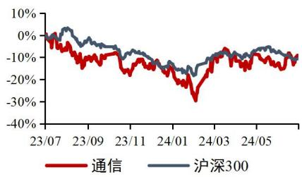  
资料来源：最闻

# 相关报告：

【山证通信】MWC 上海 5G-A 和卫星通信是亮点，垣信千帆或将迎来首发-周跟踪（20240624-20240630） 2024.7.1

【山证通信】——华为发布盘古大模型5.0，光模块 5月出口同环比高速继续增长-周跟踪（20240617-20240621）2024.6.26

# 分析师：

高宇洋

执业登记编码：S0760523050002

邮箱：gaoyuyang@sxzq.com

张天

执业登记编码：S0760523120001

邮箱：zhangtian@sxzq.com

赵天宇

执业登记编码：S0760524060001

邮箱：zhaotianyu@sxzq.com

# 投资要点：

 卫星行业的空间资源包括频率和轨道资源，由于相关法律法规尚未健全，导致世界各国积极抢占。低轨卫星互联网具有服务范围广、可同时服务用户多、长跨距通信时延低等特点，也将是 6G NTN 空天一体的重要组成部分。发展卫星互联网的目的一是抢占宝贵低轨空天资源，二是占领早期市场份额，三是卡位未来通信标准制定话语权。全球各国积极参与星座建设，英国通信公司 OneWeb、亚马逊 Kuiper、加拿大 Telesat、俄罗斯 Sphere、德国 Rivada、韩国三星等相继规划了宏大的卫星发射计划。美国在星座建设中全面领先，Starlink 已成为全球规模最大的卫星互联网星座，是全球卫星发射主力,倒逼我国卫星产业加速升级。

 国内低轨卫星互联网建设步入正轨，GW 星座和 G60 星座加速部署。中国星网公司的 GW 星座预计将发射 12992 颗卫星，并在此基础上再申报5656 颗；G60 星座一期规划 1296 颗，并在原有 1296 颗基础上再申报 2.7808万颗。发射能力方面，海南商发开展“百日攻坚”，二号发射工位计划在 2024年 6月竣工，届时将具备持续高密度发射的能力，两个工位每年的发射能力均为 16 发，届时我国低轨卫星发射能力有望实现可观增长，发射成本大幅下降。预计 2024 年我国将实施 100 次左右发射任务，有望再创新纪录，主要增量来自于低轨通信卫星。

 卫星及终端供应链分析：卫星制造方面，商业航天卫星产业链包括卫星制造、地面服务和终端、卫星运营等环节，在定制卫星中平台和载荷的价值量各占 50%，而在批量卫星中载荷的价值能达到 70%。通信卫星有效载荷包括星载通信天线分系统、转发器、星间链路等。终端方面，手机直连卫星通信发展将经过三个阶段，包括专用芯片和体制通信、基站上星通信、NTN 通信，随着华为首发引爆国产安卓手机卫星通信功能卖点，天通的渗透率有望在旗舰机型上快速提升，未来，NTN 标准化接入方式有望成为主流，卫星通信产业规模有望快速扩增，为 SoC、射频前端、天线等环节带来新增量。

 我们认为，卫星载荷制造将率先迎来快速增长，随后将传导至地面终端。其中，中游天线、激光、通信载荷等相关领域业绩有望率先兑现，随着卫星进入批产阶段快速放量，上游芯片、PCB、零部件有望释放需求弹性，建议关注：铖昌科技、国博电子、雷电微力、亚光科技、盛路通信、盟升电子、金信诺、中航光电、信科移动、创意信息、上海瀚讯、复旦微电、震有科技、航天电子；地面终端环节，我们认为应关注手机芯片增量变化以及取得显著中标成果的公司，建议关注：海格通信、中国卫星、通宇通讯、盟升电子、南京熊猫；手机芯片环节，我们认为将实现从手机直连天通到 NTN 的演化，基带射频、射频前端、天线将依次实现业绩释放，建议关注：国博电子、卓胜微、电科芯片、臻镭科技。

风险提示：产业政策变动的风险；在轨卫星出现重大事故的风险；国际竞争加剧的风险；卫星发射进程不及预期的风险；火箭产能增长不及预期的风险；产业链上游成本下降过快导致毛利率大幅下滑的风险；技术路线不确定风险。

# 目录

# 1. 全球低轨卫星发射快速增长，我国低轨星座将成为重要基础设施... 6

1.1低轨卫星互联网的作用. 6   
1.2 全球低轨卫星互联网军备竞赛开启.  
1.3 我国低轨卫星互联网规划和进展. . 10

# 2 我国低轨卫星互联网卫星制造环节供应链分析. . 14

2.1 卫星制造价值链拆解. . 14   
2.2 通信视角重要环节：通信处理载荷. . 15  
2.3 通信视角重要环节：激光通信终端. . 17  
2.4 通信视角重要环节：相控阵天线. . 20  
2.5 通信视角重要环节：电磁仿真测量工具. . 23

# 3 低轨卫星通信终端系列分析.. . 25

3.1 行业专用终端. . 25  
3.2 天通手机直连卫星：由专用通信芯片向 NTN 演进. .27  
3.3NTN 手机直连卫星：有望成为未来主流. .28

# 4 投资建议... .. 30

# 5 风险提示... ... 31

# 图表目录

图 1： 地面与非地面网络一体化实现低时延长距离通信.. 6

图 2： 星链五种套件价格..

图 3： 星链终端订阅套餐收入测算..

图 4： 全球每年新增在轨卫星数量（颗）. 0

图 5： SpaceX 发射已接近全球卫星发射的一半.... 0

图 6： starlink 总发射数量已超过 6000 颗.... 0

图 7： 全球部分低轨卫星互联网星座代表... .. 10

图 8： G60 星链“125”规划.... 11

图 9： ITU 我国最新申报卫星情况....... 11

图 10： 我国航天发射次数..... .. 13

图 11： 海南商发一号工位主体结构已封顶... .. 13

图 12： 建设中的海南国际商业航天发射中心项目.. . 13

图 13： 卫星平台成本结构（占总成本 30-50%） 14

图 14： 卫星载荷成本结构（占总成本 50-70%） 14

图 15： 卫星转发器系统结构.. . 16

图 16： 星载基站示意图... . 16

图 17： 星载路由设备示意图.. . 16

图 18： NTN 透明转发架构.. 1

图 19： NTN 可再生网络架构.. 1

图 20： 激光通信是构成空间承载网的重要功能部件.. .. 18

图 21： 欧洲数据中继系统搭载的激光通信载荷... .. 18

图 22： 2021年 1月发射的星链卫星搭载了激光载荷... .. 18

图 23： 典型激光通信系统的组成.... .. 19

图 24： 星载激光终端系统结构.. . 20

图 25： 目前主流的星载有源相控阵天线设计.... . 21

图 26： DBF接收机系统组成.. . 22

图 27： 数字波束成型架构... . 22

图 28： 相控阵天线测试示意图.. . 23

图 29： 标准型相控阵天线快速测试系统... . 23

图 30： 卫星工厂自动化测试系统... .. 24

图 31： 矢量网络分析仪图示... . 25

图 32： 电磁特性测试系统图示... . 25

图 33： starlink 两代相控阵天线... .26

图 34： starlink Gen2 PCB 设计.... ..26

图 35： 二代 Starlink 终端制造成本分析... . 26

图 36： 二代及三代 Starlink 终端... . 27

图 37： 手机直连卫星示意图.. . 28

图 38： Mate 60 Pro 的卫星通讯芯片.. . 28

图 39： 5G NTN 应用场景示意图.. 29

表 1： 中国 GW 星座规划.. . 10

表 2： 我国部分星座规划.. 12

表 3： GW 星座空间测算.. . 15

表 4： 相控阵构架分类.. . 22

表 5： 吉林一号高分 03系列卫星自动化测试效率提升统计表..... .24

表 6： 产业链重点公司... .. 30

# 1. 全球低轨卫星发射快速增长，我国低轨星座将成为重要基础设施

# 1.1 低轨卫星互联网的作用

低轨卫星互联网具有服务范围广、可同时服务用户多、长跨距通信时延低等特点。卫星星座覆盖范围广，地球同步轨道上，仅需 3 颗卫星就能覆盖全球；中轨需要 6-7 颗；低轨卫星星座最少也仅需数百颗卫星。低轨卫星星座系统容量大，根据太空与网络，Starlink 规划单星用户侧链路速率可达 17-23Gbps，对于第一阶段 1584 颗卫星在轨的情况下，可达网络容量均值为 2.17Tbps，相当于 2170 个地面 5G 基站。由于路由转发少、天基链路总长度更短，卫星通讯在跨洋长距通信中时延比海缆更低，根据文汇报，以上海到纽约为例，距离约 1.5万公里，卫星通信约 50毫秒时延，光纤网通信比星际传播速度大约慢 1.67倍。

低轨卫星星座也将是 6G NTN 空天一体的重要组成部分。2022 年 6 月，ITU-R 确定 6G 的总体时间表，包括三个阶段：①2023年，WRC-23 召开之前，完成愿景定义；②2026年确定需求和评估方法；③2030年输出规范。2023 年 6 月，ITU-R WP 5D 完成了《IMT 面向 2030 及未来发展的框架和总体目标建议书》（即“6G 愿景”）建议书草案。卫星互联网是 6G 泛在连接场景中的重要补足，基于5G 典型的三大场景，6G 扩展至六大应用场景，包括沉浸式通信、超大规模连接、超高可靠低时延通信、泛在连接、通信 AI 一体化、通信感知一体化。根据 ITU 和国际科技创新中心数据，地面移动通信系统只能覆盖 20%的陆地面积，且全球仍有 33%的人口仍未接入互联网，相较于地面网络，卫星通信可以完成全球覆盖。根据信通院《6G 总体愿景与潜在关键技术白皮书》 ，实现星地一体融合组网是 6G 时代中的关键技术，即地面网络与卫星网相结合，利用地面网络实现城市热点常态化覆盖，天基、空基网络实现偏远地区、海上和空中按需覆盖，最终达到空基、天基、地基网络的深度融合。

图 1：地面与非地面网络一体化实现低时延长距离通信  
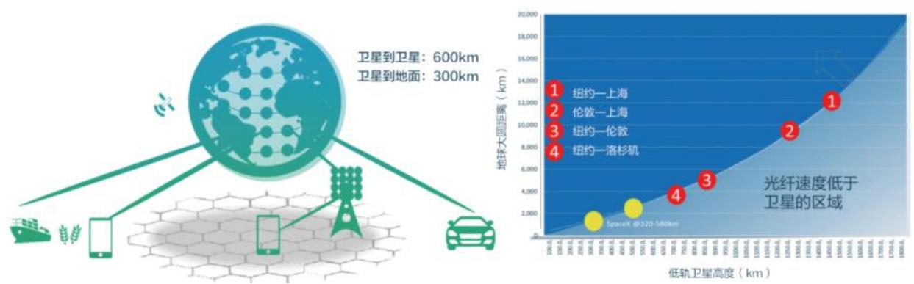  
资料来源：华为《6G：无线通信新征程》山西证券研究所

低轨卫星互联网经济性测算：低轨通信星座运营具有显著的赢者通吃特点。

与卫星星座运维成本比较，5G 宏基站投资与运维成本过高。传统的陆地移动通信服务仅覆盖了不足 6%的地表面积，受固有特性限制，5G/6G 基站的铺设密度需求远高于传统 3G/4G 网络，全面铺设成本过高，短期范围内基本只能保障城市覆盖，而低轨卫星星座最少仅需数百颗卫星就可实现全球覆盖，实现对偏远、海洋等地区的网络补充。根据比科奇微电子的数据，5G 室外宏基站满足同样的覆盖目标至少需要建设 1000万台，运营商采购部署单台 5G 宏基站的成本约 16 万元，对应投资 1.6 万亿元以上；同时，1000 万台 5G宏基站每年消耗电费 1500 亿元。而卫星星座运维成本较低，系统建成后，除非补星，主要运营成本仅包括折旧，以铱星二代为例，耗资 30 亿美金，设计寿命是 10-15 年，每年折旧约 3亿美元。

卫星星座服务区域覆盖全球，随用户规模上升更易实现盈利。太空与网络估算2023年星链实现盈利4.97亿美元：星链的收入主要来源于用户购买套件和订阅套餐，星链在 2023 年内新增用户约 130万，假设所有新增用户均选择购买价格最低的套件（即 599 美元），对应收入 7.8 亿美元；星链系统 2023 年用户数达到230 万，按标准版 120 美元/月价格估算，结合星链终端订阅数量的变化，对应 2023 年内的订阅套餐收入为23.9 亿美元，则合计实现收入 31.7 亿美元。成本端，2023 年，SpaceX 公司发射了 21 批次共 1070 颗 V1.5版本星链卫星和 42 批次共 914 颗 V2.0Mini 版本星链卫星，制造总成本为 14.5 亿美元，火箭发射费用为 12.2亿美元，总成本为 26.7亿美元。

图 2：星链五种套件价格

<table><tr><td>版本</td><td>套件价格</td></tr><tr><td>标准(Standard)</td><td>599 美元</td></tr><tr><td>标准(电机)驱动(Standard Actuated)</td><td>599 美元</td></tr><tr><td>高性能(High Performance)</td><td>2500 美元</td></tr><tr><td>扁平高性能(Flat High Performance)</td><td>2500 美元</td></tr><tr><td>航空(Aviation)</td><td>15 万美元</td></tr></table>

资料来源：太空与网络，山西证券研究所

图 3：星链终端订阅套餐收入测算

<table><tr><td>月份</td><td>订阅用户数 (万)</td><td>月套餐价格 (美元)</td><td>月收入 (万美元)</td></tr><tr><td>1</td><td>100</td><td>120</td><td>12000</td></tr><tr><td>2</td><td>112.5</td><td>120</td><td>13500</td></tr><tr><td>3</td><td>125</td><td>120</td><td>15000</td></tr><tr><td>4</td><td>137.5</td><td>120</td><td>16500</td></tr><tr><td>5</td><td>150</td><td>120</td><td>18000</td></tr><tr><td>6</td><td>161.43</td><td>120</td><td>19371.6</td></tr><tr><td>7</td><td>172.86</td><td>120</td><td>20743.2</td></tr><tr><td>8</td><td>184.29</td><td>120</td><td>22114.8</td></tr><tr><td>9</td><td>195.72</td><td>120</td><td>23486.4</td></tr><tr><td>10</td><td>207.15</td><td>120</td><td>24858</td></tr><tr><td>11</td><td>218.58</td><td>120</td><td>26229.6</td></tr><tr><td>12</td><td>230</td><td>120</td><td>27600</td></tr><tr><td colspan="3">合计</td><td>239403.6</td></tr></table>

资料来源：太空与网络，山西证券研究所

# 1.2 全球低轨卫星互联网军备竞赛开启

我国发展卫星互联网的重要意义：卫星行业的空间资源包括频率和轨道资源，由于相关法律法规尚未健全，导致世界各国积极抢占。低轨卫星互联网轨道高度通常在 300-2000公里，具备低损耗、低成本、低延时、高带宽等优势，使用频段包括 C 频段（4GHz-8GHz）、Ku 频段（12GHz-18GHz）、Ka 频段（26.5GHz-40GHz）以及Q/V 频段，未来主要的应用场景为军事用途（情报侦察）、车联网、手机直连和地面网络补盲（航空航海旅客上网等）。

一是抢占宝贵的低轨空天资源。根据中国科学院软件研究所测算，若同层卫星安全间距为 30-50km，以Starlink 星座轨道高度差 10km 为例，最多仅能容纳卫星 86-171 万颗。根据 ITU“7+7”原则，卫星发射计划批复后 7 年内发首星，9 年内发射 10%，12 年内发射 50%，14 年需全部发射完成，否则将缩减规模。

二是占领早期的市场份额。Starlink 目前除美国境内，已和欧洲、日本多个运营商达成合作，卫星通信服务审批慢、难度大、替换成本高，早期入场的运营商将抢占重要市场份额。在国内，除了野外探险、科学考察、特殊行业、海事渔业等具有卫星通信刚需外，手机直联卫星也点燃了大众消费热情。而在一带一路国家，由于移动基站部署稀疏，疆域辽阔，卫星通信具有极具吸引力市场前景。

三是卡位未来通信标准制定话语权。目前在 5G R17、R18 标准中 NTN 星地一体从透明转发、到星上信号重建、路由转发，标准一步步制订。面向 6G，卫星通信将是天地一体网络重要的组成部分。面对通信网络结构的重大变革，没有产业基础将丢失在国际电信组织标准制订的话语权。目前，包括信科移动、中兴、华为等厂商都积极发布了多个 NTN 卫星通信技术体制和场景展望白皮书，积极参与标准探讨。

全球各国积极参与星座建设，抢占卫星互联网产业先发优势。英国通信公司 OneWeb、亚马逊 Kuiper、加拿大 Telesat、俄罗斯 Sphere、德国 Rivada、韩国三星等相继规划了宏大的卫星发射计划。根据 UCS 数据，自 2017 年以来全球卫星发射数量开始呈现大幅增长趋势，2022 年全球发射卫星 2119颗，同比+32.4%，5 年 CAGR 达 55.9%；截止 2022 年，全球在轨运行卫星总数达 6718 颗，排名前 3 的国家分别为美国 4529颗（67.4%）、中国 596 颗（8.9%）、英国 565 颗（8.4%），美国在星座建设中全面领先，倒逼我国卫星产业加速升级。而从每年新增卫星来看，2015 年以来美国领先份额呈扩大趋势，2022 年美国新增卫星数量占全球的 86%，背后反映以 starlink 和 SpaceX 为代表的商业航天公司在可回收火箭发射成本与卫星制造交付能力的领先。

图 4：全球每年新增在轨卫星数量（颗）  
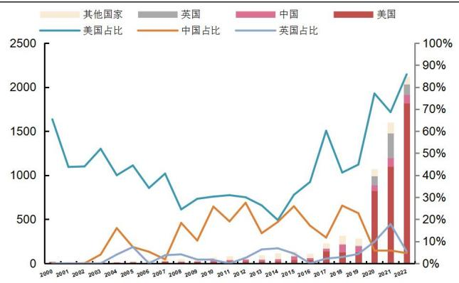  
资料来源：UCS，山西证券研究所

图 5：SpaceX发射已接近全球卫星发射的一半  
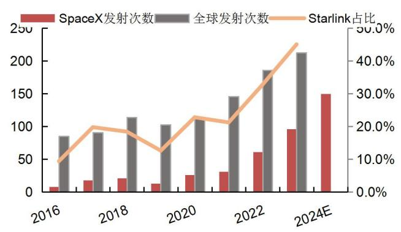  
资 料 来 源 ： Jonathan's Space Pages ， 新 浪 财 经 ，SpaceX，spacexstats，山西证券研究所

当前，Starlink 已成为全球规模最大的卫星互联网星座，是全球卫星发射主力。根据 Star Walk 数据，截至 2024年 5 月 23 日，Starlink 发射卫星总数已达 6482颗，是目前在轨卫星数量最多、发射速度最快、技术变革最大的低轨星座系统。

图 6：starlink 总发射数量已超过 6000 颗  
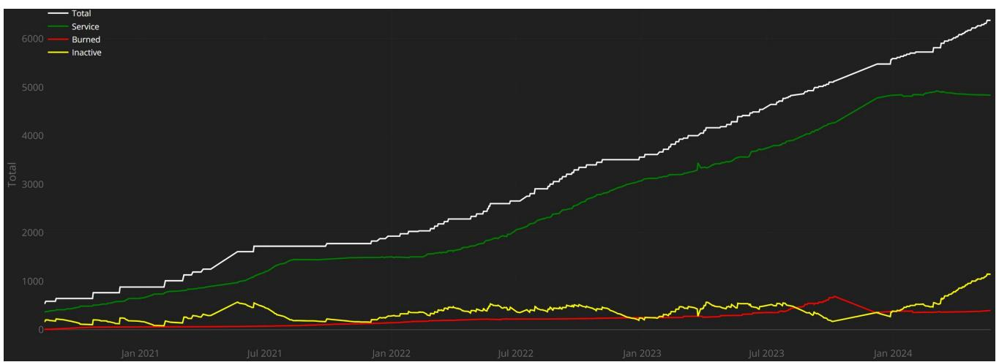  
资料来源：satellitemap，山西证券研究所

轨位资源卡位紧迫、频率资源卡位紧迫、国防军事需求紧迫、产业链降本需求紧迫。空天一体化是 6G重要的标准特性，没有星就没有话语权。根据立鼎产业研究网、前瞻产业研究院等数据，目前国际上最具竞争力的低轨卫星互联网星座有美国 StarLink（在轨超 5000 颗，用户超过 200 万）、英国 OneWeb（在轨 618颗）、 美国 Kuiper（规划 3236 颗）、美国铱星二代（在轨 75 颗）。国内低轨卫星互联网星座的建设也逐渐步入正轨，国家发改委正式批准两张网，包括中国星网以及 G60 星座。

图 7：全球部分低轨卫星互联网星座代表  
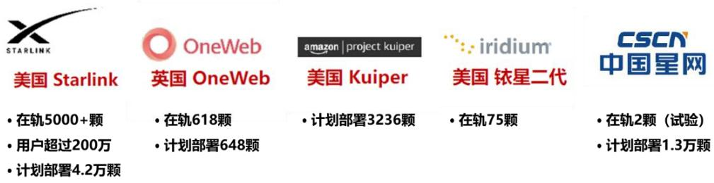  
资料来源：中国网，澎湃新闻，央视网，腾讯网，立鼎产业研究网，前瞻产业研究院，中诚天下，光明日报，卫星互联网百人会，山西证券研究所

# 1.3 我国低轨卫星互联网规划和进展

国内低轨卫星互联网建设步入正轨，GW 星座和 G60 星座加速部署。中国星网公司的 GW 星座包含GW-A59 和 GW-2 2 类子星座。预计 GW-A59 将发射 6080 颗卫星，GW-2 将发射 6912 颗卫星，总计 12992颗。

表 1：中国 GW 星座规划

<table><tr><td>子星座</td><td>高度/千米</td><td>轨道斜角</td><td>轨道面数</td><td>单轨星数</td><td>卫星数量</td></tr><tr><td>GW-A59/1</td><td>590</td><td>85</td><td>16</td><td>30</td><td>480</td></tr><tr><td>GW-A59/2</td><td>600</td><td>50</td><td>40</td><td>50</td><td>2000</td></tr><tr><td>GW-A59/3</td><td>508</td><td>55</td><td>60</td><td>60</td><td>3600</td></tr><tr><td>GW-2/1</td><td>1145</td><td>30</td><td>48</td><td>36</td><td>1728</td></tr><tr><td>GW-2/2</td><td>1145</td><td>40</td><td>48</td><td>36</td><td>1728</td></tr><tr><td>GW-2/3</td><td>1145</td><td>50</td><td>48</td><td>36</td><td>1728</td></tr><tr><td>GW-2/4</td><td>1145</td><td>60</td><td>48</td><td>36</td><td>1728</td></tr><tr><td>总计</td><td></td><td></td><td></td><td></td><td>12992</td></tr></table>

资料来源：中国空间科学技术《低轨巨型星座构型设计与控制研究进展与展望》，山西证券研究所

G60 星链是目前国内除中国星网公司 GW 星座之外，另一重要的卫星互联网发射计划。2023 年 7 月，上海市松江区委书记在新闻发布会上表示，松江打造低轨宽频全球多媒体卫星“G60星链”，实验卫星完成发射并成功组网，一期将实施 1296 颗，未来将实现一万两千多颗卫星的组网，预计将于 2024 年开始批量发射G60 星链第一批次卫星，建设周期为 2024 至 2027年，有望在 2025年底前完成 648颗 GEN1 卫星发射任务，在 2026\~2027 年完成后续 648 颗 GEN2 卫星发射任务。11 月，“G60 星链”产业基地启航仪式在松江举行，一期项目占地面积 120 亩，建筑面积 20 万平方米，将建设数字化卫星制造工厂、卫星在轨测运控中心、卫星互联网运营中心，其中，卫星工厂的设计产能将达到 300 颗/年，单星成本将下降 35%。

图 8：G60 星链“125”规划  
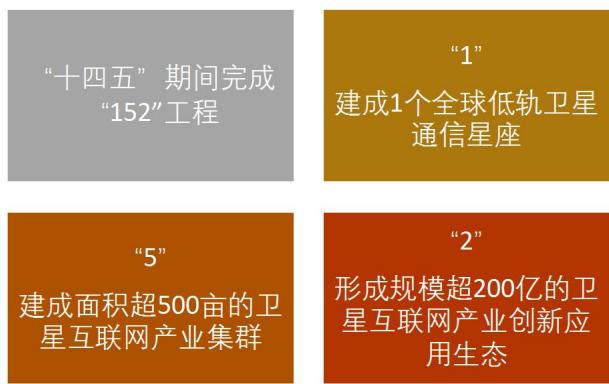  
资料来源：澎湃新闻，中诚天下，山西证券研究所

我国 ITU 最新申报卫星数量超预期。我国最新在 ITU 申报的卫星数量达 5.13万颗，未来十年卫星发射数量有望迎来大幅度增长。中国星网在原有 1.2992 万颗基础上再申报 5656颗；上海垣信在原有 1296 颗基础上再申报 2.7808 万颗；新申报卫星星座不代表最终批复情况，还需经过 ITU 较长时间的审批和协调，但近地轨道容量约 10万颗量级，先到先得。

图 9：ITU 我国最新申报卫星情况

<table><tr><td>组织</td><td>NTC ID</td><td>星座名称</td><td>BR注册日期</td><td>轨道面数量</td><td>卫星数量(颗)</td><td>运行轨道</td></tr><tr><td rowspan="5">New operating agency</td><td>123520116</td><td>SAILSPACE-2-A</td><td>03/08/2023 13:29:10</td><td>49</td><td>2552</td><td>NGSO</td></tr><tr><td>123520115</td><td>SAILSPACE-2-B</td><td>03/08/2023 13:20:11</td><td>66</td><td>5400</td><td>NGSO</td></tr><tr><td>123520114</td><td>SAILSPACE-2-C</td><td>03/08/2023 13:19:50</td><td>48</td><td>5952</td><td>NGSO</td></tr><tr><td>123520113</td><td>SAILSPACE-2-M</td><td>03/08/2023 12:02:49</td><td>163</td><td>13904</td><td>NGSO</td></tr><tr><td>-</td><td>-</td><td>-</td><td>-</td><td>小计27808</td><td>-</td></tr><tr><td rowspan="6">CHINA SATELLITE NETWORK GROUP CO., LTD.</td><td>123545248</td><td>CSN-NT-2</td><td>03/08/2023 10:44:24</td><td>16</td><td>480</td><td>NGSO</td></tr><tr><td>123545247</td><td>CSN-NT-1</td><td>03/08/2023 10:35:12</td><td>60</td><td>3600</td><td>NGSO</td></tr><tr><td>123520048</td><td>CSN-V7</td><td>07/04/2023 15:04:51</td><td>18</td><td>432</td><td>NGSO</td></tr><tr><td>123520047</td><td>CSN-V6</td><td>07/04/2023 14:59:56</td><td>20</td><td>400</td><td>NGSO</td></tr><tr><td>123520046</td><td>CSN-V5</td><td>07/04/2023 14:55:30</td><td>15</td><td>360</td><td>NGSO</td></tr><tr><td>123520045</td><td>CSN-V4</td><td>07/04/2023 14:51:09</td><td>16</td><td>384</td><td>NGSO</td></tr><tr><td rowspan="6">GALAXY SPACE (BEIJING) TECHNOLOGY/GALAXY SPACE (BEIJING) TECHNOLOGY; BEIJING INSTITUTE OF TRACKING AND TELECOMMUNICATIONS TECHNOLOGY</td><td>-</td><td>-</td><td>-</td><td>-</td><td>小计5656</td><td>-</td></tr><tr><td>123545249</td><td>BLACKSPIDER</td><td>03/08/2023 10:51:14</td><td>58</td><td>1804</td><td>NGSO</td></tr><tr><td>123545101</td><td>GALAXY-EESS</td><td>10/04/2023 02:34:12</td><td>1</td><td>9</td><td>NGSO</td></tr><tr><td>123545031</td><td>SPECSTAR-1</td><td>01/02/2023 13:07:18</td><td>470</td><td>16036</td><td>NGSO</td></tr><tr><td>-</td><td>-</td><td>-</td><td>-</td><td>小计17849</td><td>-</td></tr><tr><td>-</td><td>-</td><td>-</td><td>-</td><td>总计51313</td><td>-</td></tr></table>

资料来源：ITU，山西证券研究所

此外，我国自 2018 年起大规模布局的卫星星座计划已进入建设进程。2018 年，航天科技、航天科工、电子科技集团相继推出鸿雁、虹云、天地一体化星座计划。2018 年虹云试验星发射，计划 2025年实现全部156 颗卫星组网运行，为用户构建“通导遥”一体化信息平台。 2018 年鸿雁计划的首颗卫星成功发射；预计 2025 年在低轨道部署 300 颗小卫星，满足海洋、气象、环保等领域的数据传送。2019年，天地一体化网络试验卫星发射，将提供宽带接入、移动通信、天基中继、天基物联等服务。吉利控股集团旗下科技创新企业时空道宇计划建设全球首个商用通信导航遥感一体星座——吉利未来出行星座，计划于 2025年完成星座一期 72 颗卫星部署，实现全球实时数据通信服务；二期将扩展至 168 颗卫星。2024 年 2 月 3 日，吉利未来出行星座第二个轨道面在西昌卫星发射中心以一箭 11 星方式成功发射，刷新该发射场单次发射卫星数量的纪录，发射的卫星由时空道宇通过自有卫星超级工厂实现量产，可实现日产一颗卫星，年产卫星 500颗，卫星生产成本下降 45%左右。2024 年 5 月 4 日，上海蓝箭鸿擎科技有限公司向 ITU 申报了“鸿鹄 3 号”星座计划，共计 10000 颗卫星，是我国继 GW 和 G60 星座后，第三个超万颗卫星的低轨卫星星座。此前的 2023年 12 月 9 日，鸿鹄卫星与天仪 33 卫星使用朱雀二号遥三运载火箭在酒泉卫星发射中心发射升空。

表 2：我国部分星座规划

<table><tr><td>公司</td><td>星座</td><td>服务</td><td>规划</td></tr><tr><td>蓝箭鸿擎</td><td>鸿鹄3号</td><td>低轨卫星</td><td>共计10000颗卫星</td></tr><tr><td>吉利控股旗下时空道宇</td><td>吉利未来出行星座</td><td>未来出行</td><td>一期72颗;二期扩展至168颗</td></tr><tr><td>国电高科</td><td>“天启”</td><td>窄带物联网</td><td>计划2024年完成一代星座全部38颗卫星的发射组网</td></tr><tr><td>航天科工</td><td>“行云”工程</td><td>窄带物联网</td><td>计划发展80颗行云小卫星</td></tr><tr><td>航天科工</td><td>“虹云”工程</td><td>宽带通信</td><td>2025年计划实现全部156颗卫星组网运行,完成业务星座构建</td></tr><tr><td>航天科技</td><td>“鸿雁”工程</td><td>移动通信</td><td>计划发射324颗卫星</td></tr><tr><td>银河航天</td><td>银河Galaxy</td><td>宽带通信</td><td>2025年前发射1000颗</td></tr><tr><td>长光卫星</td><td>吉林一号</td><td>遥感</td><td>截至2024年4月有108颗卫星在轨运行,到2025年底前,在轨卫星数量将增至300颗。</td></tr></table>

资料来源：财联社，澎湃新闻，中国新闻网，新华网，观察者网，中国经营报，吉林日报，山西证券研究所

2024 年我国航天发射次数有望再创新高，主要增量来自于低轨通信卫星。根据《中国航天科技活动蓝皮书（2023 年）》数据，2023 年我国共实施 67 次航天发射任务，位列世界第 2，研制发射 221 个航天器，发射次数及航天器数量刷新我国纪录，预计 2024 年将实施 100次左右发射任务，有望再创新纪录；我国首个商业航天发射场将迎来首次发射任务，多个卫星星座将加速组网建设。

图 10：我国航天发射次数  
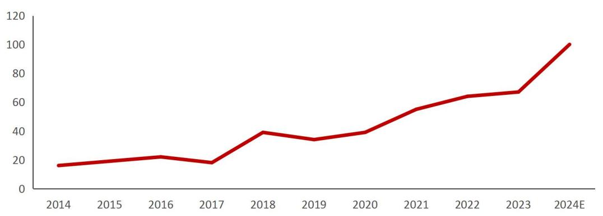  
资料来源：《中国航天科技活动蓝皮书》，中国军网，中国航天科技集团，人民网，山西证券研究所

海南商发开展“百日攻坚”，力争下半年提供批量发射能力。火箭发射一直是制约国内低轨卫星大批量发射的瓶颈之一，2023 年 12 月 29 日海南商发一号发射工位竣工，二号发射工位计划在 2024年 6 月竣工，届时将具备持续高密度发射的能力，两个工位每年的发射能力均为 16 发。通过新建专用于商业航天的海南发射场、增加海上平台发射、进行火箭改型定制以及引入更多民营火箭公司等，我国低轨卫星发射能力有望实现可观增长，发射成本大幅下降。

图 11：海南商发一号工位主体结构已封顶  
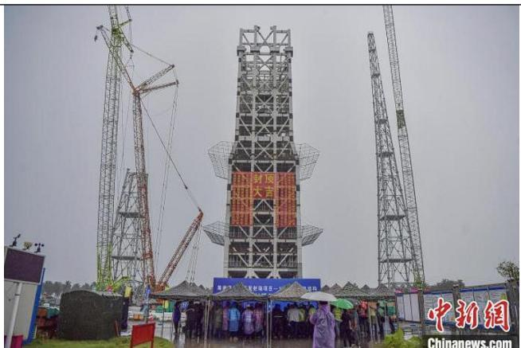  
资料来源：中国新闻网，山西证券研究所

图 12：建设中的海南国际商业航天发射中心项目  
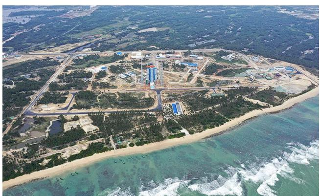  
资料来源：新华社，山西证券研究所

# 2 我国低轨卫星互联网卫星制造环节供应链分析

# 2.1 卫星制造价值链拆解

卫星制造环节主要包含卫星平台与有效载荷，载荷是卫星核心功能部件。商业航天卫星产业链包括卫星制造、地面服务和终端、卫星运营等环节，对于我国低轨卫星互联网，目前仍处于批量组网前期，距离运营和商业模式成熟尚需时间，因此本报告主要聚焦点在卫星制造环节以及地面终端。根据艾瑞咨询和电子发烧友网数据，在定制卫星中平台和载荷的价值量各占 50%，而在批量卫星中载荷的价值能达到 70%。通信卫星有效载荷包括星载通信天线分系统、转发器、星间链路等。其中，天线分系统是通信卫星中载荷的核心，相控阵天线是当前主流技术，T/R 组件是相控阵天线的核心，成本在星载天线分系统里占比超 50%。此外，星载转发器可完成信号的中继转发、星间激光终端搭建星间光通信链路，均为通信载荷的重要组成部分。在卫星平台构成中，姿控系统涉及的元件和单机最复杂，成本占比也最高，达到 40%。在通信处理（转发器）、卫星天线（包括有源相控阵和馈电天线）、激光通信终端、姿控系统等成本占比较大的子系统中，目前主流供应商均为国家队科研院所，随着民营企业的加入降本有望加速。

图 13：卫星平台成本结构（占总成本 30-50%）  
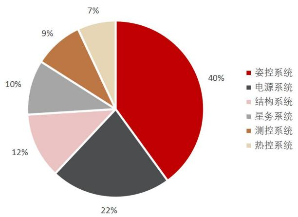  
资料来源：艾瑞咨询《2021年中国商业航天发展报告》，山西证券研究所

图 14：卫星载荷成本结构（占总成本 50-70%）  
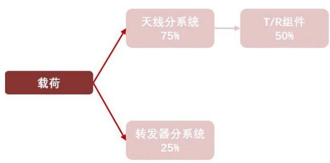  
资料来源：电子发烧友网，山西证券研究所

卫星制造整体和重要通信组件市场空间测算：根据星网规划，GW 星座卫星将在 2024年下半年批量发射，2026年开启加速发射。结合 ITU“7+7”的发射规则以及低轨空天资源的紧张性，我们假设 GW 星座将在 2027 年完成一代星部署，并同时加速二代星发射。我们测算 2025、2030 年仅 GW 星座涉及的卫星制造市场规模分别达 31、197亿元，若按照上文中批量卫星制造成本构成计算，则 2030年对应载荷、平台市场规模分别约 140、60亿元，T/R 组件和激光终端对应的市场空间分别为 52、28亿元。

表 3：GW 星座空间测算

<table><tr><td></td><td>2023</td><td>2024</td><td>2025</td><td>2026</td><td>2027</td><td>2028</td><td>2029</td><td>2030</td></tr><tr><td></td><td>试验卫星</td><td colspan="2">下半年批量发射</td><td colspan="5">加速发射</td></tr><tr><td>发射比例</td><td>0.20%</td><td>1.5%</td><td>2.5%</td><td>6.0%</td><td>10.0%</td><td>17.0%</td><td>27.0%</td><td>35.8%</td></tr><tr><td>1代星(颗)</td><td>10</td><td>70</td><td>100</td><td>200</td><td>100</td><td></td><td></td><td></td></tr><tr><td>2代星(颗)</td><td></td><td>5</td><td>25</td><td>100</td><td>400</td><td>850</td><td>1350</td><td>1790</td></tr><tr><td>合计发射数量(颗)</td><td>10</td><td>75</td><td>125</td><td>300</td><td>500</td><td>850</td><td>1350</td><td>1790</td></tr><tr><td>单星制造价格(万元/颗)</td><td>3500</td><td>3200</td><td>2500</td><td>2000</td><td>1800</td><td>1500</td><td>1250</td><td>1100</td></tr><tr><td>制造总成本(亿元)</td><td>4</td><td>24</td><td>31</td><td>60</td><td>90</td><td>128</td><td>169</td><td>197</td></tr><tr><td>卫星制造 YoY</td><td></td><td>586%</td><td>30%</td><td>92%</td><td>50%</td><td>42%</td><td>32%</td><td>17%</td></tr><tr><td>其中:</td><td></td><td></td><td></td><td></td><td></td><td></td><td></td><td></td></tr><tr><td>载荷成本(亿元)-假设占总成本 70%</td><td></td><td>17</td><td>22</td><td>42</td><td>63</td><td>89</td><td>118</td><td>138</td></tr><tr><td>-T/R 组件(载荷的 38%)</td><td></td><td>6</td><td>8</td><td>16</td><td>24</td><td>34</td><td>45</td><td>52</td></tr><tr><td>-激光终端(载荷的 20%)</td><td></td><td>3</td><td>4</td><td>8</td><td>13</td><td>18</td><td>24</td><td>28</td></tr><tr><td>平台成本(亿元)-假设占总成本 30%</td><td></td><td>7</td><td>9</td><td>18</td><td>27</td><td>38</td><td>51</td><td>59</td></tr></table>

资料来源：财联社，澎湃新闻，氦星光联，山西证券研究所

# 2.2 通信视角重要环节：通信处理载荷

传统的通信卫星多采用转发器作为通信任务核心部件。转发器系统是通信卫星有效载荷的两大分系统之一，功能是接收来自地面的微弱信号，并将信号变换到下行信号和合适的功率电平上。由于需要补偿空间段长距离的空间衰减转发器必须具备高灵敏度的接收能力，拥有高增益的变频能力，以及大功率的发射能力。根据处理信号的方式，转发器可以分为透明转发器和处理转发器，透明转发器仅对上行信号进行滤波、变频和放大，不对信号解调和处理，常见的有一次变频，也有多次变频，主要依据任务的特点和任务要求进行选择。处理转发器是伴随大规模数字处理技术发展的产物，与透明转发的最大区别在于对信号的解调和再生处理，改变了基带的信号形式。

图 15：卫星转发器系统结构  
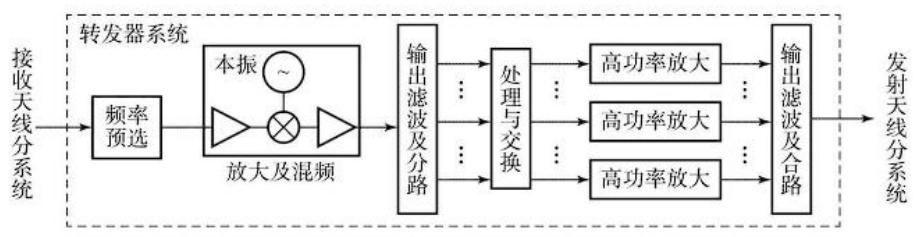  
资料来源：《卫星通信技术》，山西证券研究所

随着低轨通信卫星星上要承担的通信任务更加重要和复杂，专用星载基站、路由设备出现。星载基站用于为终端提供直连卫星的无线网络覆盖服务，是低轨卫星互联网重要网络设备。面向卫星通信场景传播距离远、移动速度快、覆盖范围广以及低成本高可靠等特点，星载基站需要适应太空真空、热、粒子辐照、原子氧等空间环境，采用高可靠设计搭配商用元器件，同时需适配不断演进的 3GPPNR NTN 协议。星载路由是以数字方式实现来自地球站的较低速率突发业务从一个波束到另一个波束的“路由”，实质是一种交换功能，卫星网络由于星上资源受限以及网络拓扑频繁变化等特点，需采用卫星专用的路由协议。

图 16：星载基站示意图  
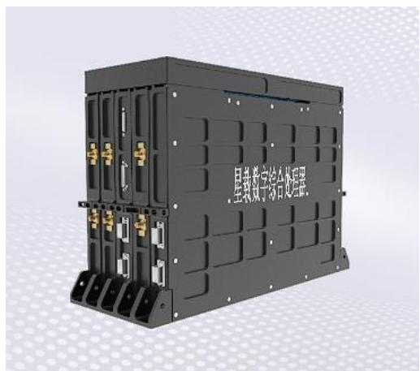  
资料来源：星移联信，山西证券研究所

图 17：星载路由设备示意图  
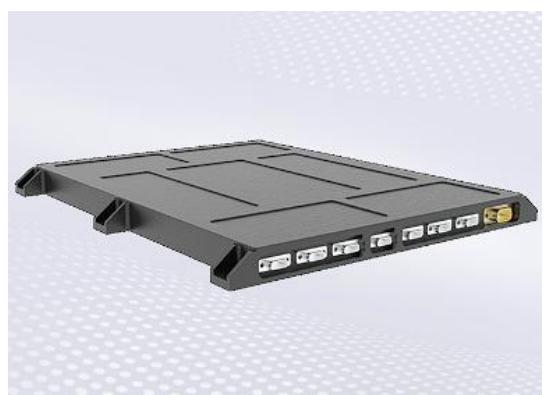  
资料来源：星移联信，山西证券研究所

由透明转发向再生转发演进，通信处理载荷重要性持续提升。3GPP 在 R16 阶段针对核心网，研究了支持卫星透明转发的组网架构；R17 和 R18 两个版本的研究均是聚焦 5GNTN 卫星通信透明转发模式，即终端与地面基站之间通过服务链路和馈线链路连接，卫星提供射频中继转发功能，实体卫星和地面网关对数据流转发过程透明。后续的 R19 版本将重点聚焦再生模式的 NTN 研究，即 5G NTN 基站功能集成到卫星侧,计划攻克用户和通信链路移动性管理难题，利用星间链路加强卫星间的协同，实现全球无缝覆盖、更快数据速率、更大网络容量，助力汽车、无人机等新型终端设备获得可靠连接。同时，R19 版本将增加卫星通信的新场景，包括不连续链路存储和转发的物联网应用、独立运行的 GNSS、卫星接入的定位增强、同一卫星下的 UE 组间通信等。

图 18：NTN 透明转发架构  
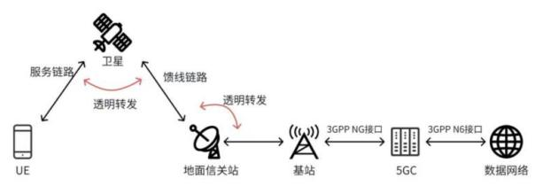  
资料来源：《中国电信 5G NTN 技术白皮书》，山西证券研究所

图 19：NTN 可再生网络架构  
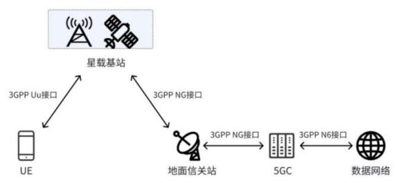  
资料来源：《中国电信 5G NTN 技术白皮书》，山西证券研究所

# 2.3 通信视角重要环节：激光通信终端

激光通信是利用激光作为信号载波，将语音和数据等信息调制到激光上进行传输。卫星激光通信技术是新兴的空间高速数据传输技术，传输容量大，能与其他通信技术充分融合，减少中间的解码过程，为实现高速连接提供新手段。按照激光传输环境的不同，卫星激光通信分为两类：一是真空环境下的激光通信，即星间激光通信，主要应用于卫星与卫星、飞船、空间站等之间的通信；二是在大气环境下进行的激光通信，即星地激光通信，应用于卫星与地面、海上用户及空中飞行器的连接等。由于我国无法在大部分其他国家或地区建设地面站落地卫星信号，故构建星间链路是唯一选择，而激光通信是星间链路的最佳方式。星间激光通信属于全球难题，技术还有待进一步成熟，捕获跟踪瞄准（ATP）算法优化空间较大。

图 20：激光通信是构成空间承载网的重要功能部件  
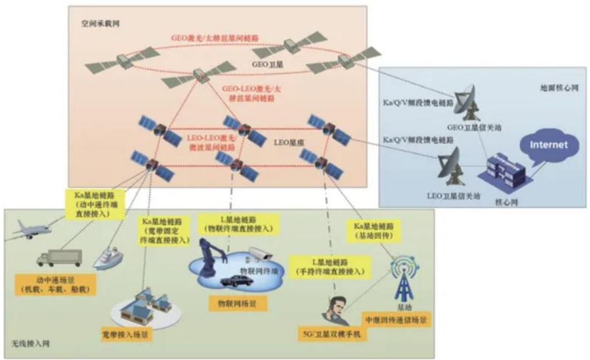  
资料来源：太空与网络，山西证券研究所

图 21：欧洲数据中继系统搭载的激光通信载荷  
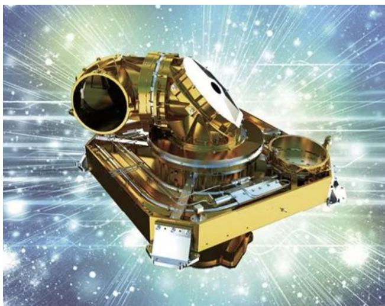  
资料来源：中国航天，山西证券研究所

图 22：2021年1月发射的星链卫星搭载了激光载荷  
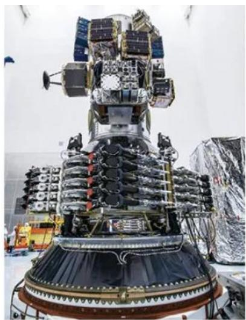  
资料来源：中国航天，山西证券研究所

星载激光通信系统较为复杂，涵盖了光机电等多个领域，子系统包含激光收发系统、捕获跟踪瞄准（ATP）系统和光学系统，还包括配电系统以及热控系统等一些配套系统。激光发射系统包括调制器、激光器、光学发射天线以及准直系统等；激光接收系统包括探测器、光滤波器、解调器和光学接收天线等。ATP 系统是用于建立和保持星地通信链路的关键系统，主要包括粗跟踪机构、精跟踪机构和预瞄准机构。光学系统是通信终端的重要系统，负责准直激光发射的信标光和信号光光束并将其发向其他终端，还负责接收目标终端发射过来的信号光和信标光光束。

图 23：典型激光通信系统的组成  
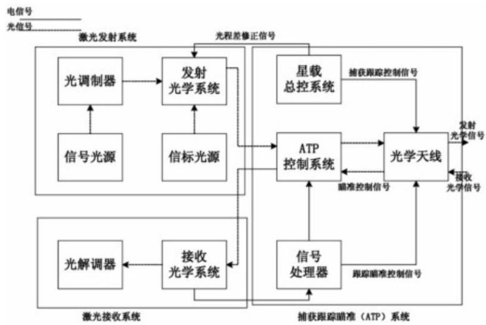  
资料来源：《星载激光通信技术研究进展》，山西证券研究所

中国企业积极开展星载激光技术实验，已取得阶段性成就。2020 年，“实践二十号”卫星与丽江地面站成功建立激光通信链路，实现从卫星到地面站最高 10Gbps 的下行传输速率。2023年 6 月，中国科学院空天信息创新研究院利用自主研制的 500 毫米口径激光通信地面系统，与长光卫星技术股份有限公司所属吉林一号 MF02A04 星成功开展星地激光通信试验，通信速率达到 10Gbps。目前，哈尔滨工业大学、中科院上海光机所、中国航天科技集团五院西安分院均已完成激光通信载荷的在轨验证。中科院长春光机所、中科院空天信息创新研究院、中科院上海技物所、中科院半导体所等单位也有布局，主要聚焦在光学天线、高精度跟瞄技术、激光器等核心价值环节。航天科技九院 704所研制出北斗三号关键载荷导航信号生成器和上行注入处理机、技术水平全国领先的激光星间链路终端、链路跳扩频码设备等重要载荷，是北斗卫星系统的重要组成部分。

图 24：星载激光终端系统结构  
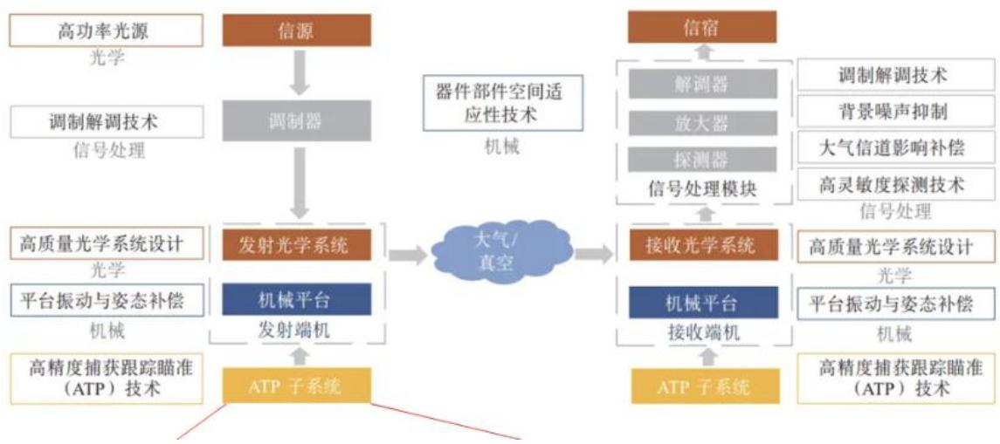  
资料来源：太空与网络，山西证券研究所

# 2.4 通信视角重要环节：相控阵天线

多波束相控阵天线是一种利用波束形成网络，同时实现多个独立的高增益波束的多波束天线，具有高灵活性和宽角度扫描等优点，是低轨通信卫星系统的核心载荷之一。低轨星载多波束相控阵天线的主要关键技术体现在低剖面多波束相控阵天线系统架构设计技术、高密度集成有源通道设计技术、多波束相控阵抗干扰技术和多波束相控阵天线快速测试技术。目前，Starlink 卫星部署的 Ku 频段多波束相控阵天线代表了民商用通信卫星相控阵天线的最新水平，它采用了跳波束覆盖技术，相控阵天线采用由内向外逐渐稀布的方式，采用瓦片式构架，分为天线阵面层、映射层、多工馈电层和波束形成层。波束形成部分使用仅包含移相器的 8 通道 8 波束多功能芯片，多个天线波束和相位扫描功能由多功能芯片实现，振幅加权由阵列排列实现。

图 25：目前主流的星载有源相控阵天线设计  
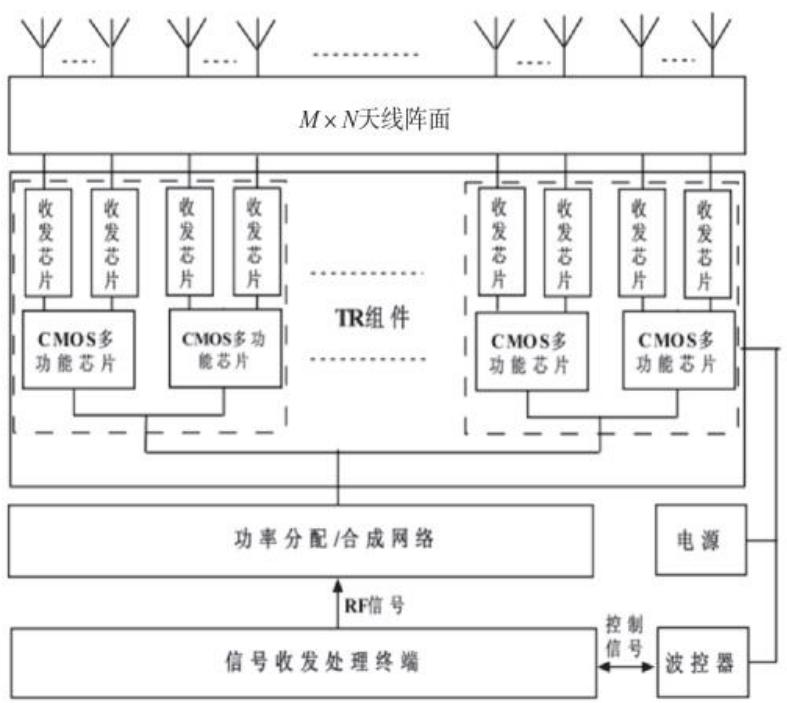  
资料来源：《低轨星座多波束相控阵天线研究进展与发展趋势》，山西证券研究所

针对高频（Ka/Ku）和中低频段（S/C），卫星相控阵天线具有不同设计。Ka Ku 频段具有带宽大、波束指向性好等特点，是目前星链等低轨卫星星座主要使用的通信频段，其天线通常使用模拟或混合相控阵设计。通常相控阵天线单元的间距约为半个波长，若天线工作在 Ka 频段(30GHz)时，则它的单元间距约为5mm，在此空间内要放置功率放大器、低噪放、开关、移相器、多波束芯片等，工艺难度较高，高密度集成须通过多通道集成解决，即以 CMOS 或 SiGe 为代表的硅基半导体工艺为基础，在一个芯片上实现一块TR 组件的功能。而针对 S/C 频段，与目前地面手机通信使用的频段接近，有望最低成本实现手机直连卫星、汽车直连卫星等，相应其需要增益更大的相控阵天线，为了降低成本也引入了 SIPTR 组件和数字 DBF 收发器等（可以直采变频）。

DBF 收发器是数字相控阵天线重要组成部分。数字波束赋型（DBF）可利用卫星上有限的物理空间来产生为了对抗星地通信的路径损耗所需的大规模波束，在数字上实现波束赋形，需要在发射端使用多个可编程脉冲，或者多个同步的 DAC 实现信号发射，在基带端进行调制之后，直接在数字域对信号进行加权处理，然后经过数模转换，再经过后面频率变化或者放大电路，将信号发射出去。在接收端，从天线接收到的信号，经过调理和变频后，信号进入 ADC，在数字域对于获取到的多个通道信号进行数字处理，进行矢量合成。

图 26：DBF 接收机系统组成  
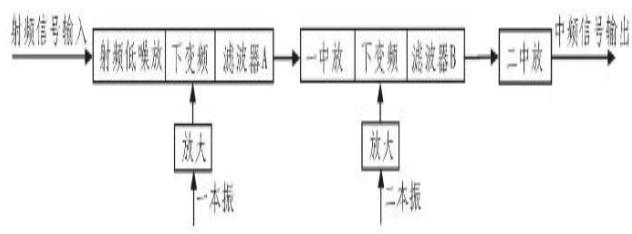  
资料来源：《地面模拟系统 DBF 接收机设计》，山西证券研究所

图 27：数字波束成型架构  
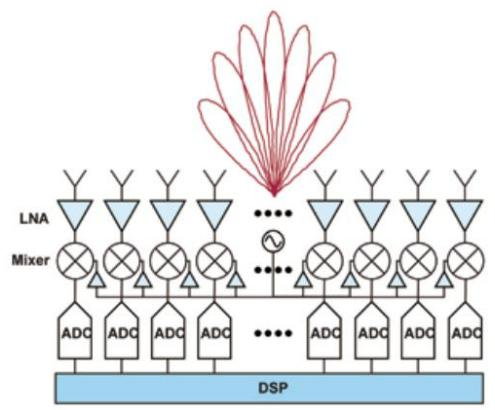  
资料来源：《多波束相控阵接收机混合波束成型功耗优势的定量分析》，山西证券研究所

相控阵天线核心是 T/R 组件。TR 组件包括 TR 腔体、PCB 板或 LTCC 板、软基片、功率放大器、低噪声放大器、移相器、串并转换、滤波器，温度补偿、射频接插件、以及低频接插件等，对有源相控阵天线来说，TR 组件占成本的主要部分。根据《有源相控阵雷达 T/R 组件技术研究》和《卫星通信中相控阵天线的应用及展望》等研究，单星一般需要约 106 个阵元，每个阵元对应单独的 T/R 组件，而国博电子招股说明书中 T/R 组件单价为 1.9 万，因此 T/R 组件单星价值量应该在 200万元左右。

T/R 组件朝小型、轻型、低成本方向发展。相控阵主要构架有三类，砖式构架是最早的结构类型，此后T/R 组件从砖式发展到瓦式, 体积、重量、成本都下降为砖式的 1/5 以下，Aip 结构是目前成本最低，重量和尺寸最小的构架。

表 4：相控阵构架分类

<table><tr><td></td><td>砖式架构</td><td>瓦式架构</td><td>Aip 架构</td></tr><tr><td>结构</td><td>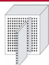</td><td>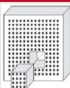</td><td>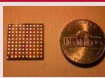</td></tr><tr><td>尺寸(in^3)</td><td>2.80</td><td>0.33</td><td>0.20</td></tr><tr><td>重量(g)</td><td>79.38</td><td>26.37</td><td>15.73</td></tr><tr><td>相对成本</td><td>100%</td><td>24%</td><td>15%</td></tr></table>

资料来源：太空与网络，电子发烧友，《高密度集成有源相控阵天线体系构架与设计方法》，微波仿真论坛，电子工程专辑，山西证券研究所

相控阵天线竞争格局较为集中。铖昌科技、电科 13 所和 55 所是国内微波毫米波 T/R 组件芯片的主要供应商，具备星载 T/R 组件能力的厂家主要有中国电科 13 所、天箭科技、国博电子、雷电微力、亚光科技等，具备星载相控阵天线系统能力的厂家主要有盛路通信、盟升电子、金信诺。

# 2.5 通信视角重要环节：电磁仿真测量工具

低轨卫星互联网行业快速发展带动卫星子系统企业研制需求，对于相控阵校准、测试需求大幅增加。相控阵天线可以通过控制每个辐射单元的馈电相位来改变方向图形状，从而不需要物理转动即可实现天线阵列不同波束指向，以实现探测，搜索、识别、跟踪和制导等目的。根据天锐星通数据，随着国内外高通量卫星和低轨卫星星座的快速发展，对毫米波相控阵天线提出了每年超过 10 亿通道的海量需求。但天线设计完成后由于各种误差，导致每个单元的初始相位并不能保持一致，需将每个单元的初始幅相校准到同一水平才能实现更佳的性能，因此相控阵测试、校准技术成为相控阵测试的热点问题。相控阵天线测试包括波束指向、波束宽度、天线增益、波束零点、副瓣位置及副瓣电平等基本特性的测试，具有待测天线复杂、测试任务量大、测试项目多、测试控制复杂的特点，主要的校准方法有近场扫描测量法、中场校准方法、旋转矢量法（REV）、线性矩阵求逆法、互耦校准法、正交编码校准法、换相法等。

图 28：相控阵天线测试示意图  
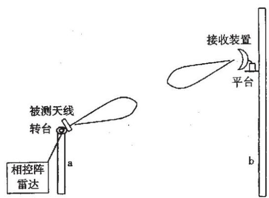  
资料来源：《相控阵天线的测试技术》，山西证券研究所

图 29：标准型相控阵天线快速测试系统  
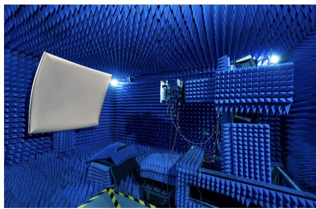  
资料来源：天锐星通，山西证券研究所

多地卫星超级工厂启动建设，自动化测试平台是标准组成部分。在航天器发射前，必须进行全面和彻底的系统级测试，同时由于商业卫星与其他卫星的研制模式存在不同，具有低成本、研制周期紧、组批生产等特点，传统单颗卫星地面测试系统由于集成度低、手动测试操作复杂、数据记录难度高、测试记录准确度低、测试耗费时间长，已不能满足批量化、并行测试的需求。自动化通用测控地面测试平台可满足多星并行测试的需求，兼顾卫星串行测试，具备灵活的可配置性，可根据型号任务需求灵活选择测试卫星的数量，加快卫星型号的研制进度，已经成为卫星工厂的标准组成部分。随着未来卫星并行测试数量增多，综合效率有望得到明显提升，根据《批产卫星自动化测试系统研究与实现》，吉林一号高分 03 系列卫星的脉动式产线采用的全流程自动化测试系统，合计完成了累计 63 颗高分 03 卫星的测试，人工效率提升最高12 倍，时间效率提升最高 27 倍，综合效率提升最高 54倍。

图 30：卫星工厂自动化测试系统  
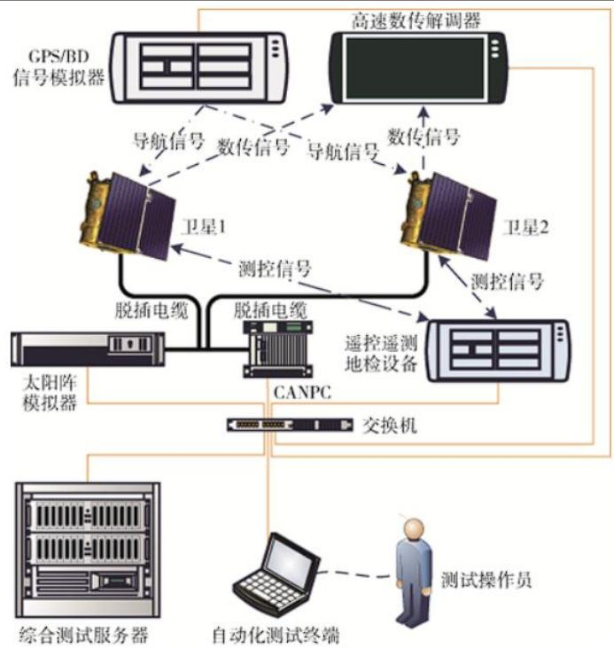  
资料来源：《批产卫星自动化测试系统研究与实现》，山西证券研究所

表 5：吉林一号高分 03系列卫星自动化测试效率提升统计表

<table><tr><td rowspan="2">测试阶段</td><td rowspan="2">最大并行测试数量</td><td colspan="2">人工测试</td><td colspan="2">自动化测试</td><td rowspan="2">人工效率提升/倍</td><td rowspan="2">时间效率提升/倍</td><td rowspan="2">综合效率提升/倍</td></tr><tr><td>人员</td><td>时间/h</td><td>人员</td><td>时间/h</td></tr><tr><td>桌面分系统测试</td><td>6</td><td>2</td><td>36</td><td>1</td><td>2.5</td><td>2</td><td>14.4</td><td>28.8</td></tr><tr><td>总装A状态测试</td><td>2</td><td>2</td><td>12</td><td>1</td><td>2.3</td><td>2</td><td>5.2</td><td>10.4</td></tr><tr><td>总装B状态测试</td><td>2</td><td>3</td><td>3</td><td>2</td><td>1</td><td>1.5</td><td>3</td><td>4.5</td></tr><tr><td>热真空电测试</td><td>12</td><td>12</td><td>1</td><td>1</td><td>0.5</td><td>12</td><td>2</td><td>24</td></tr><tr><td>力学试验电测试</td><td>2</td><td>2</td><td>2</td><td>1</td><td>0.5</td><td>2</td><td>4</td><td>8</td></tr><tr><td>出厂测试</td><td>6</td><td>2</td><td>27</td><td>1</td><td>1.5</td><td>2</td><td>18</td><td>36</td></tr><tr><td>发射场综合电测试</td><td>9</td><td>2</td><td>40.5</td><td>1</td><td>1.5</td><td>2</td><td>27</td><td>54</td></tr></table>

资料来源：《批产卫星自动化测试系统研究与实现》，山西证券研究所

相控阵测试系统和服务以及电子测量仪器行业的国际行业巨头包括是德科技、罗德与施瓦茨、安立、泰克等，国内主要企业包括霍莱沃、电科思仪、鼎阳科技、坤恒顺维等。2021 年，中国电子测量仪器、微波/毫米波测量仪器市场规模分别为 321.0、46.3 亿元，思仪科技以 15.13、6.70 亿元的收入位列国内企业市场份额第一位。

图 31：矢量网络分析仪图示  
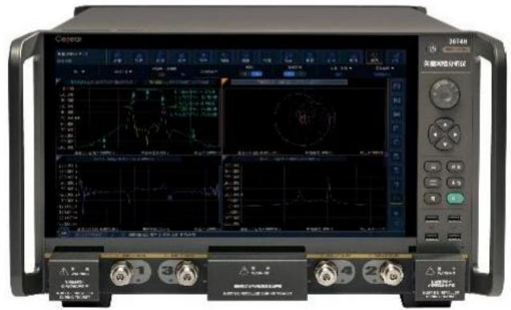  
资料来源：思仪科技招股说明书，山西证券研究所

图 32：电磁特性测试系统图示  
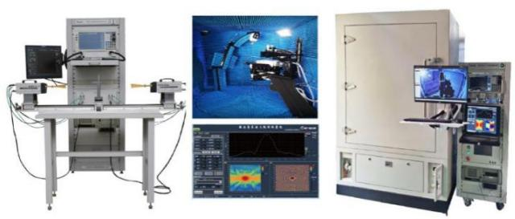  
资料来源：思仪科技招股说明书，山西证券研究所

# 3 低轨卫星通信终端系列分析

# 3.1 行业专用终端

高轨卫星通信多使用动中通天线，低轨卫星互联网或使用低成本相控阵天线为主。传统的高轨通信卫星由于距地球过远，需要大口径的高增益天线精确对准卫星才能进行通信，所以高轨动中通主要需解决在平台运动中，卫星终端天线如何克服运动的方向变化，保持天线指向的问题，动中通天线可自动跟踪、锁定静止通信卫星，能使车辆和船舶在行驶过程中利用传统通信卫星进行移动通信。而低轨卫星天线需要跟踪快速运转的卫星，并具备迅速切换的能力，为了保持信号的稳定性多采用低成本相控阵天线，无需机械转动，只通过遥控信号相位就可以调整信号的方向来对准卫星，并可以实现一副天线支持多颗星同时工作，其优点包括天线厚度薄、信号指向灵活迅速等。

图 33：starlink 两代相控阵天线  
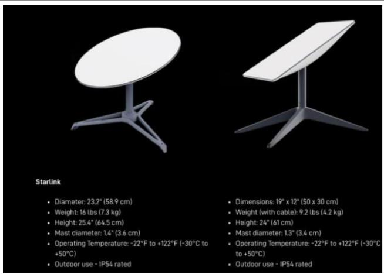  
资料来源：YOLE，山西证券研究所

图 34：starlink Gen2 PCB 设计  
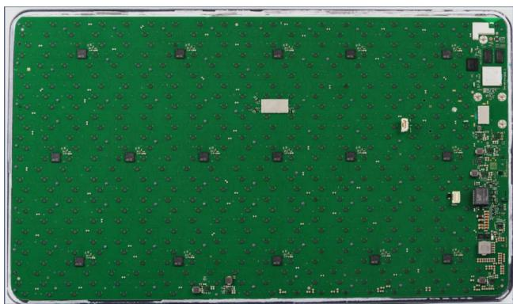  
资料来源：YOLE，山西证券研究所

卫星专用终端方面，对标 SpaceX，未来将是百亿市场。SpaceX 已推出了三代五个版本的星链天线，性能不断增强，应用领域得到不断扩大。Starlink 在 2023 年用户数量增加超 100万，按照 1 比 1.5的终端库存配置以及标准版 600 美金的价格计算，2023 年终端市场价值超 9 亿美元。根据讯石，2021年底全球固定宽带连接数达 12.7 亿，假设只有 1%的渗透率成为 starlink 用户，所需的终端数量市场规模将达到 76 亿美元。二代 Starlink 终端制造成本达 586.89 美元，其中集成电路成本约 334.6 美元，占总成本 57%；模块、分立元件和连接器占总比 11%；非电子零件占比 10%；其他部分包括基材、子系统、组件插入、卡片测试、最终组装和测试合计占比 22%。相控阵天线 RF 芯片二代 16颗，一代为 20颗。

图 35：二代 Starlink 终端制造成本分析  
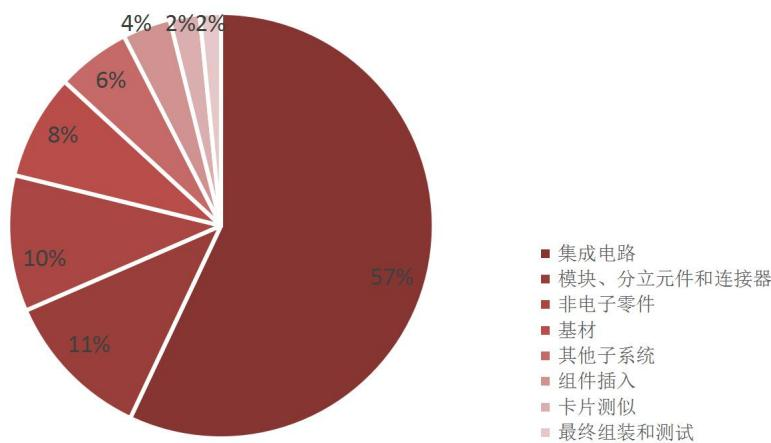  
资料来源：CN-SEC，山西证券研究所

国内卫星终端产业链目前在研发定型阶段，前期将以特种和行业用户为主，2027年后有望逐步开放民用，具备终端环节整机研发能力的公司建议关注海格通信、中国卫星、通宇通讯、盟升电子、南京熊猫等；芯片环节建议关注国博电子、卓胜微、电科芯片、臻镭科技等。

图 36：二代及三代 Starlink 终端  
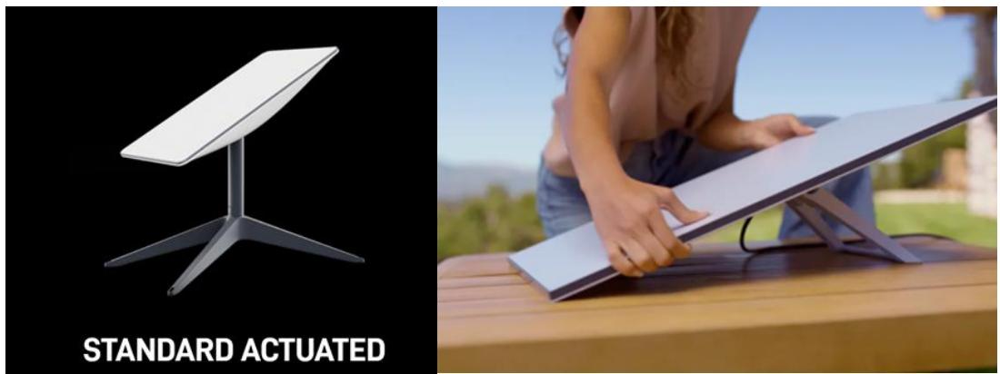  
资料来源：全球技术地图，山西证券研究所

# 3.2 天通手机直连卫星：由专用通信芯片向NTN 演进

手直连卫星技术路线将分为三个阶段：

第一阶段：专用芯片和体制通信。主要为定制化手机直连卫星，一般由卫星运营商、手机厂家、芯片厂商、卫星地面段等共同合作研发，共享卫星频谱，以定制双模手机实现手机直连卫星。例如：华为 Mate50（4G+北斗短消息）、Mate60 Pro（5G+天通语音+短信），苹果 iphone14（5G+Globalstar 短消息）等系列终端均基于该路线，中国公司的进展领先业界。

第二阶段：基站上星通信。即基于 3GPP 体制的存量手机直连卫星技术以及过渡版协议剪裁 5G NTN手机直连卫星技术。存量手机直连路线目前由国外新兴低轨卫星公司主导，通过与移动蜂窝网运营商合作，共享地面蜂窝网络频谱资源，以低轨卫星转发地面蜂窝网信号（或基站上卫星），支持存量手机直连卫星，美国 Starlink、AST 等公司在该线上计划建设星座系统，预计未来两年提供服务，主要解决地广人稀场景下的广覆盖或孤岛覆盖。

第三阶段：基于 5G NTN 体制的星地融合手机直连卫星技术。存量手机直连卫星技术虽然能便捷依赖4/5G 技术体制和本土地面频率，但并不适合于网络拓扑快速变化下的星地网络间位置管理、切换管理等需求，以及卫星共享地面 4/5G 网络频率的跨国协调难度高，因此最终会演进为 5G NTN 直连卫星技术路线。

图 37：手机直连卫星示意图  
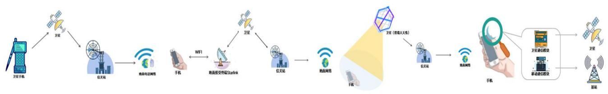  
资料来源：联通泛终端技术，山西证券研究所

华为首发引爆国产安卓手机卫星通信功能卖点，天通的渗透率有望在旗舰机型上快速提升。随着华为推出了支持北斗卫星短报文的 Mate 50 旗舰机、P60 系列，苹果也跟 Globalstar（全球星）合作推出了支持卫星求救的 iPhone14，揭开了卫星通信探索消费领域的序幕。根据 Counterpoint 数据，2022 年我国高端智能手机的销量占比约 26%，2023 年市场整体出货量达 2.8 亿部以上，若未来国产品牌高端机全部实现卫星直连功能，则年市场空间有望超 7000 万部，每部手机均包括基带芯片、射频芯片、射频功放、专用天线等增量部件，相关产业链公司包括电科芯片（短报文基带射频 soc）、华力创通（天通基带）、海格通信（天通射频）等。

图 38：Mate 60 Pro 的卫星通讯芯片  
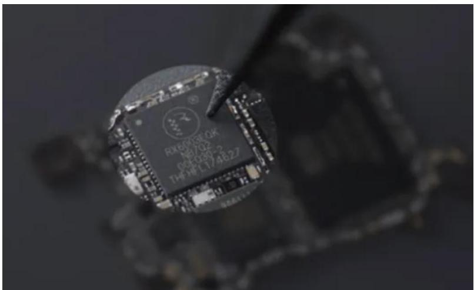  
资料来源：EETOP，山西证券研究所

# 3.3NTN手机直连卫星：有望成为未来主流

未来，NTN 标准化接入方式有望成为主流。5G NTN 通过将“基站搬上天”，在卫星上进行解调/解码、编码/调制等，完成全部或部分基站功能，再通过 NTN gateway 接入 5G 核心网。可实现 5G 从地面走向空间，以及卫星通信与地面通信体制兼容。 5G NTN 主要包括 IoT NTN 和 NR NTN 两条技术路线，IoTNTN基于 NB-IoT 技术演进，侧重支持物联网业务，提供低速数据传输、短消息等功能；NR NTN 基于 5G NR技术演进而来，侧重支持宽带数据、语音和固定无线接入等功能。5G NTN 的目标是达成 6G 一张网，实现统一空口传输、统一接入控制、统一鉴权认证和统一组网架构，实现星地无感切换。

借助手机直连，卫星通信产业规模有望快速扩增，为 SoC、射频前端、天线等环节带来新增量。根据《中国电信 5G NTN 技术白皮书》和 Berg Insight 数据，预计 2024-2025 年业界初步具备支持 IoT NTN 商用的终端、芯片以及网络设备；2026 年国内市场手机总体出货量将达 3.14 亿部，预估 NTN 芯片出货量有望突破 5000 万片； 2024 年 NTN 汽车直连卫星的高端车型达 5 万台，到 2026 年达 52.3 万台；2026 年全国水上运输船舶达 12.68 万艘，其卫星通信技术有望逐步升级为 5GNTN 体制；2026 年支持 NTN 的机载卫星终端达 7 万个；2026年全球卫星物联网用户数将达到 2120万，对应市场规模将达 10亿美元级别。

图 39：5G NTN 应用场景示意图  
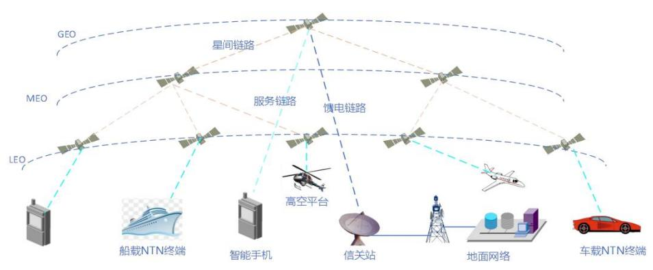  
资料来源：《中国电信 5GNTN 技术白皮书》，山西证券研究所

# 4 投资建议

我们认为，卫星载荷制造将率先迎来快速增长，随后将传导至地面终端。其中，中游天线、激光、通信载荷等相关领域业绩有望率先兑现，随着卫星进入批产阶段快速放量，上游芯片、PCB、零部件有望释放需求弹性，建议关注：铖昌科技、国博电子、雷电微力、亚光科技、盛路通信、盟升电子、金信诺、中航光电、信科移动、创意信息、上海瀚讯、复旦微电、震有科技、航天电子；地面终端环节，我们认为应关注手机芯片增量变化以及取得显著中标成果的公司，建议关注：海格通信、中国卫星、通宇通讯、盟升电子、南京熊猫；手机芯片环节，我们认为将实现从手机直连天通到 NTN 的演化，基带射频、射频前端、天线将依次实现业绩释放，建议关注：国博电子、卓胜微、电科芯片、臻镭科技。

表 6：产业链重点公司

<table><tr><td>环节</td><td>公司</td></tr><tr><td>微波毫米波 T/R 组件芯片</td><td>铖昌科技、电科 13 所、电科 55 所</td></tr><tr><td>具备星载 T/R 组件</td><td>电科 13 所、电科 29 所、航天科技五院、国博电子、雷电微力、亚光科技</td></tr><tr><td>星载相控阵天线系统</td><td>航天科技五院、电科 29 所、盛路通信、盟升电子、金信诺</td></tr><tr><td>相控阵测试以及电子测量仪器</td><td>霍莱沃、电科思仪、鼎阳科技、坤恒顺维</td></tr><tr><td>连接器</td><td>金信诺、中航光电</td></tr><tr><td>行波管</td><td>电科 12 所</td></tr><tr><td>星载通信荷载</td><td>信科移动、创意信息、上海瀚讯、航天科技五院、电科 29 所、复旦微电</td></tr><tr><td>信关站/核心网</td><td>电科 54 所、震有科技、华为</td></tr><tr><td>激光通信终端</td><td>航天科技五院、上海光机所、航天电子、上光通信、氦星光联</td></tr><tr><td>终端环节整机</td><td>海格通信、中国卫星、通宇通讯、盟升电子、南京熊猫</td></tr><tr><td>终端芯片环节</td><td>国博电子、卓胜微、电科芯片、臻镭科技</td></tr></table>

资料来源：山西证券研究所整理

# 5 风险提示

产业政策变动的风险。目前，我国对卫星行业的激励政策较多，驱动力较强，且对卫星行业设置了一定的准入门槛和前置条件。若未来产业准入门槛降低或放宽对外资的限制，可能会对产业内公司带来不利影响。

在轨卫星出现重大事故的风险。在轨卫星长期运行，空间环境较为复杂，可能造成卫星在轨故障的概率增加。若卫星在轨出现重大故障可能导致行业客户流失，对行业发展产生一定的负面影响。

国际竞争加剧的风险。近年来，全球范围内通信卫星运营商数量增加，卫星研制水平不断进步，在境外部分国家和地区出现了传统的 C、Ku 频段资源供给大于需求的情况，市场竞争较为激烈。若未来全球范围内的竞争加剧，卫星行业内相关公司可能面临产品价格下降的风险。

卫星发射进程不及预期的风险。海外的低轨卫星建设进程较为领先，考虑到中国和欧美国家存在的国情差异以及新市场前期开发难度较大，可能存在市场拓展未能达到预期的风险。

火箭产能增长不及预期的风险。如果我国火箭研发和生产进度减慢，可能导致火箭运力不足，造成卫星发射进度不及预期。

产业链上游成本下降过快导致毛利率大幅下滑的风险。卫星产业链仍处于早期，随着批量化生产进度加快，产业链可能迎来成本的大幅降低，进而导致产品售价降低，可能导致相关公司在卫星批产后盈利能力下降。

技术路线不确定风险。当前手机直连卫星方案仍具有不确定性，如果未来相关技术路径发生重大变化，可能导致卫星产业链相关公司业绩不及预期。

# 分析师承诺：

本人已在中国证券业协会登记为证券分析师，本人承诺，以勤勉的职业态度，独立、客观地出具本报告。本人对证券研究报告的内容和观点负责，保证信息来源合法合规，研究方法专业审慎，分析结论具有合理依据。本报告清晰准确地反映本人的研究观点。本人不曾因，不因，也将不会因本报告中的具体推荐意见或观点直接或间接受到任何形式的补偿。本人承诺不利用自己的身份、地位或执业过程中所掌握的信息为自己或他人谋取私利。

# 投资评级的说明：

以报告发布日后的 6--12 个月内公司股价（或行业指数）相对同期基准指数的涨跌幅为基准。其中：A 股以沪深 300 指数为基准；新三板以三板成指或三板做市指数为基准；港股以恒生指数为基准；美股以纳斯达克综合指数或标普 500指数为基准。

无评级：因无法获取必要的资料，或者公司面临无法预见的结果的重大不确定事件，或者其他原因，致使无法给出明确的投资评级。（新股覆盖、新三板覆盖报告及转债报告默认无评级）

# 评级体系：

公司评级

买入： 预计涨幅领先相对基准指数 15%以上；

增持： 预计涨幅领先相对基准指数介于 5%-15%之间；

中性： 预计涨幅领先相对基准指数介于-5%-5%之间；

减持： 预计涨幅落后相对基准指数介于-5%- -15%之间；

卖出： 预计涨幅落后相对基准指数-15%以上。

行业评级

领先大市： 预计涨幅超越相对基准指数 10%以上；

同步大市： 预计涨幅相对基准指数介于-10%-10%之间；

落后大市： 预计涨幅落后相对基准指数-10%以上。

风险评级

A： 预计波动率小于等于相对基准指数；

B： 预计波动率大于相对基准指数。

# 免责声明：

山西证券股份有限公司(以下简称“公司”)具备证券投资咨询业务资格。本报告是基于公司认为可靠的已公开信息，但公司不保证该等信息的准确性和完整性。入市有风险，投资需谨慎。在任何情况下，本报告中的信息或所表述的意见并不构成对任何人的投资建议。在任何情况下，公司不对任何人因使用本报告中的任何内容引致的损失负任何责任。本报告所载的资料、意见及推测仅反映发布当日的判断。在不同时期，公司可发出与本报告所载资料、意见及推测不一致的报告。公司或其关联机构在法律许可的情况下可能持有或交易本报告中提到的上市公司发行的证券或投资标的，还可能为或争取为这些公司提供投资银行或财务顾问服务。客户应当考虑到公司可能存在可能影响本报告客观性的利益冲突。公司在知晓范围内履行披露义务。本报告版权归公司所有。公司对本报告保留一切权利。未经公司事先书面授权，本报告的任何部分均不得以任何方式制作任何形式的拷贝、复印件或复制品，或再次分发给任何其他人，或以任何侵犯公司版权的其他方式使用。否则，公司将保留随时追究其法律责任的权利。

依据《发布证券研究报告执业规范》规定特此声明，禁止公司员工将公司证券研究报告私自提供给未经公司授权的任何媒体或机构；禁止任何媒体或机构未经授权私自刊载或转发公司证券研究报告。刊载或转发公司证券研究报告的授权必须通过签署协议约定，且明确由被授权机构承担相关刊载或者转发责任。

依据《发布证券研究报告执业规范》规定特此提示公司证券研究业务客户不得将公司证券研究报告转发给他人，提示公司证券研究业务客户及公众投资者慎重使用公众媒体刊载的证券研究报告。

依据《证券期货经营机构及其工作人员廉洁从业规定》和《证券经营机构及其工作人员廉洁从业实施细则》规定特此告知公司证券研究业务客户遵守廉洁从业规定。

# 山西证券研究所：

# 上海

上海市浦东新区滨江大道 5159 号陆家嘴滨江中心 N5 座 3 楼

# 太原

太原市府西街 69 号国贸中心 A 座28 层

电话：0351-8686981

http://www.i618.com.cn

# 深圳

广东省深圳市福田区林创路新一代产业园 5 栋 17 层

# 北京

北京市丰台区金泽西路 2 号院 1 号楼丽泽平安金融中心 A 座 25层

