# 应注明“来源：中国信息通信研究院”。违反上述声明者，量子计算发展态势研究报告

(2023 年)

2023 年 12 月中国信息通信研究院技术与标准研究所

2023年12月

# 版权声明

本报告版权属于中国信息通信研究院，并受法律保护。转载、摘编或利用其它方式使用本报告文字或者观点的，应注明“来源：中国信息通信研究院”。违反上述声明者，本院将追究其相关法律责任。

# 前 言

量子计算以量子比特为基本单元，利用量子叠加和干涉等原理实现并行计算，能在某些计算复杂问题上提供指数级加速，是未来计算能力跨越式发展的重要方向。量子计算的发展和应用具有重大战略意义和科学价值，已成为全球主要国家在前沿科技和未来产业领域的政策布局和投资推动的重点方向之一

当前，量子计算处于理论研究、工程研发、应用探索和产业化培育并行发展的关键阶段。超导、离子阱、中性原子、光量子、硅半导体等主要技术路线的基础科研和工程研发亮点成果不断涌现，应用场景探索在化学模拟、量化金融、医疗健康、航空交通等领域广泛开展，科技巨头和初创企业布局以量子计算云平台、软件开源社区、产业联盟等为重点的产业生态建设发展迅速。量子计算云平台是推动应用探索和产业化发展的生态汇聚点和支撑驱动力，国内外不同类型量子计算云平台开放发展竞争激烈，三大服务模式日趋成熟，标准体系建设和基准测评研究逐步成为业界各方的关注热点。

中国信息通信研究院在《量子计算发展态势研究报告》（2022年）的基础上，持续跟踪分析 2023 年国内外量子计算技术研究、应用场景探索和产业生态培育等方面的进展成果和发展演进趋势，并进一步聚焦量子计算云平台，初步提出量子计算云平台功能框架和标准体系建议，分析总结基准测评的研究与实践结果，最后结合量子计算领域发展现状、趋势和问题提出发展建议，为凝聚业界各方共识合力提供参考。

# 目 录

一、量子计算已成为前沿科技和未来产业关注热点.  
二、量子计算科研攻关与软硬件研发保持高度活跃.

（一）多种硬件技术路线并行发展，亮点成果频出.  
（二）量子计算软件持续开放探索，功能各有侧重  
（三）量子纠错突破盈亏平衡点，未来需持续攻关...  
（四）环境测控系统取得新进展，性能指标待提升............. ..13

三、应用探索多领域广泛开展，产业生态初步形成.. .16

（一） 应用探索成业界热点，行业领域趋向多元化 ..16  
（二）实用化落地尚未突破，硬件性能提升是基础 .19   
（三） 产业联盟与开源社区成为生态发展重要助力 ..... ..21  
（四）欧美量子计算企业活跃，产业生态初具雏形. ..23

四、量子计算云平台是构建应用产业生态重要支点.... .28

（一）国内外企业机构加速布局，抢占产业生态位 ..28  
（二）量子计算云平台功能架构可借鉴经典云计算 ..30  
（三）量子计算云平台的服务和业务模式逐步完善 ..32  
（四）云平台成为开展科研与应用探索的重要支撑 ..34

五、量子计算云平台标准和基准测评研究持续开展.. .37

（一）国内外积极布局推动量子计算基准测评研究 ..37  
（二）构建量子计算云平台基准测评体系参考模型 ..39  
（三）开展测评实践验证，验证平台硬件实际能力 ..41  
（四）量子计算云平台标准体系建设需进一步推动. ..46

六、机遇与挑战并存，多策并举加快量子计算发展. .49

# 图 目 录

图1 量子计算主要技术路线代表性研究成果.  
图2量子计算主要硬件技术路线关键指标对比概况.  
图3量子计算软件体系架构图. .8  
图 4 2023 年 Gartner 量子计算技术成熟度预测. ..20  
图5 全球代表性量子信息产业联盟概况 .21  
图6国内外量子计算软件 GitHub开源社区活跃度. 22  
图7量子计算产业生态与国内外代表性企业概况. 25  
图8 中美量子计算产业基础能力对比 27  
图9 国内外代表性量子计算云平台概况.. .28  
图10 量子计算云平台功能架构参考模型 .30  
图11 量子计算云平台三大服务模式. .32  
图12 量子计算云平台脉冲级实验套件功能............ .36  
图13 量子计算云平台基准测评体系参考模型.. .40  
图14 单比特RB测试结果 .42  
图15 双比特RB测试结果 . 42  
图16 量子体积（QV）测试结果..... .43  
图17 DJ算法测试结果 .44  
图18 QFT算法测试结果 ..44  
图19 哈密顿量模拟算法测试结果 .45  
图20 量子计算云平台标准体系架构 .48

# 表 目 录

表1国内外代表性量子计算应用开发软件.  
表2国内外代表性量子计算编译软件..  
表3国内外代表性量子计算 EDA软件.  
表4代表性量子计算测控系统. 15  
表5量子计算应用场景分析. .16  
表6 量子计算云平台基准测评初步测试结果汇总. .41

# 一、量子计算已成为前沿科技和未来产业关注热点

量子计算以量子比特为基本单元，利用量子叠加和干涉等原理实现并行计算，能在某些计算复杂问题上提供指数级加速，是未来计算能力跨越式发展的重要方向，将对传统技术体系产生冲击、进行重构，成为引领新一轮科技革命和产业变革方向的颠覆性创新。

量子计算的发展和应用具有重大战略意义和科学价值，已成为全球主要国家在前沿科技和未来产业领域的关注焦点之一。近年来，全球 30 个国家和地区制定发布了以量子计算为重点的量子信息发展战略或法案，不完全统计投资总额超过 280 亿美元。量子计算领域基础科研和技术创新持续保持活跃，科研论文和专利申请数量近年来屡创新高，初创企业数量和投融资金融也经历一轮爆发式增长。近一年来，全球科技巨头、初创企业和研究机构在量子计算领域的关键技术攻关、软硬件工程研发、应用场景探索和产业生态培育等方面取得了诸多重要进展和亮点成果。

量子计算云平台作为集成量子计算软硬件能力，面向用户提供服务，支撑算法研究、应用探索和产业培育的生态汇聚点，是展现量子计算技术能力和产业化发展水平的重要视角。近年来，国内外各类量子计算云平台持续推出，多方开放竞争，功能框架和服务模式不断丰富和完善，已成为推动量子计算技术产业演进和产学研用合作的关键助推器。基于量子计算云平台开展量子计算软硬件系统的功能和性能测评验证，也是业界关注的热点方向之一，近年来在基准测评指标和测试方法等方面发展演进迅速。

本报告对近一年来量子计算领域基础科研与工程研发的重要进展进行梳理总结，包括量子计算硬件主要技术路线研究成果，软件系统研发动态，量子纠错编码实验，环境测控系统进展。对各领域量子计算应用场景探索进展进行分析，分析杀手级应用落地面临的挑战，探讨量子计算企业、产业生态和开源社区等方面发展动态。对比国内外量子计算云平台发展情况，提出量子计算云平台的参考功能架构、主要功能需求和三大服务模式。此外，报告还提出量子计算云平台基准测评体系框架，开发电路级、系统级和应用级测试用例，对代表性云平台进行了测试验证。最后，报告总结量子计算演进趋势，提出未来发展关注重 点。

# 二、量子计算科研攻关与软硬件研发保持高度活跃

# （一）多种硬件技术路线并行发展，亮点成果频出

量子计算硬件有多种技术路线并行发展，主要可分为两大类：一是以超导和硅半导体等为代表的人造粒子路线，二是以离子阱、光量子和中性原子为代表的天然粒子路线。人造粒子路线可重用半导体集成电路制造工艺，在比特数量扩展方面具有一定优势，但在提升逻辑门精度等指标方面受到基础材料和加工工艺等限制。天然粒子具有长相干时间和高逻辑门精度等优势，但在比特数量扩展等方面面临挑战。近年来，各种主要技术路线均有研究成果不断涌现，呈现开放竞争态势，尚无某种技术路线体现出明显综合优势。2023年量子计算硬件主要技术路线的代表性研究成果如图1所示。

<table><tr><td>技术路线</td><td>超导</td><td>离子阱</td><td>硅半导体</td><td>光量子</td><td>中性原子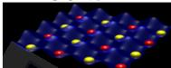</td></tr><tr><td>原理与优势</td><td>➢超导约瑟夫森结形成二能级系统。√保真度较高、门操控速度快、集成电路兼容、可设计性较高。</td><td>➢利用电荷与磁场间所产生的交互作用力约束带电离子。√保真度高、相干时间长、制备读取效率高。</td><td>➢硅同位素量子点电子自旋作为二能级系统。√半导体兼容性、门操作速度快。</td><td>➢使用光子多种自由度构建量子位。√环境友好性、保真度高、相干时间长。</td><td>➢利用光镊或光晶格囚禁原子悬浮在超高真空中。√保真度高、相干时间长、构建多维列阵潜力。</td></tr><tr><td>典型成就</td><td>➢中科院:41位“庄子”芯片模拟侯世达蝴蝶拓扑物态。➢中国科大:“祖冲之二号”可操纵量子比特数达176。➢Rigetti:84位量子处理器Ankaa-1。</td><td>➢华翊量子:37位离子阱量子计算原型机HYQ-A37。➢Quantinuum:H2系统实现32位全连接量子比特;H1-1量子系统量子体积达到524288。</td><td>➢Intel:12位硅基自旋量子芯片Tunnel Falls。➢中科院:实现硅自旋翻转速率超过1.2 GHz的自旋量子比特超快操控。</td><td>➢中国科大:255光子量子计算原型机“九章三号”。➢玻色量子:100比特相干光量子伊辛机“天工量子大脑”。</td><td>➢微尺度国家研究中心:实现光晶格中基于自旋交换的量子纠缠。➢Atom computing:1180量子比特的中性原子量子计算原型机。</td></tr><tr><td>发展趋势</td><td>◆增加比特规模、探索可扩展性机制◆提升保真度◆延长相干时间</td><td>◆更高性能离子阱◆扩展单离子阱计算架构下的比特数量◆研制稳定激光系统</td><td>◆降低测控信号、量子位噪声影响◆提纯材料以延长相干寿命</td><td>◆研制高性能的光源与光子探测器◆改进光子集成芯片◆研制光子间纠缠的方案</td><td>◆提升精确测控能力◆降低原子所受碰撞影响◆研究多维列阵连接方式</td></tr></table>

超导技术路线基于超导约瑟夫森结构造扩展二能级系统，具有可扩展、易操控和集成电路工艺兼容等优势，受到众多科研机构、科技巨头和初创企业重视，科研进展成果丰富。2023年，QuantWare推出 64 位超导量子比特处理器 Tenor1。中科大扩展超导量子处理器“祖冲之二号”可操纵量子比特至 176 位2。苏黎世联邦理工基于超导量子电路完成无漏洞贝尔实验3。谷歌使用超导量子处理器模拟操控非阿贝尔任意子，并通过非阿贝尔编制实现任意子纠缠态4。中科大联合团队实现 51 位超导量子比特簇态制备5。Rigetti 推出 84 位超导量子处理器 Ankaa-16。 中科院物理所利用 41 位超导量子芯片“庄子”

模拟“侯世达蝴蝶”拓扑物态7。日本富士通和 RIKEN 发布 64 比特超导量子计算机8。总体来看，超导量子计算处理器比特规模和保真度等指标逐年稳步提升，在纠缠态制备、拓扑物态模拟等科研实验方面取得诸多进展，是量子计算领域业界关注度最高的发展方向。

离子阱路线利用电荷与磁场间所产生的交互作用力约束带电离子，通过激光或微波进行相干操控，具有比特天然全同、操控精度高和相干时间长等优点。2023年，Quantinuum发布9其全连接量子比特离子阱原型机 Model H2的单比特和双比特量子逻辑门保真度达到99.997%和 99.8%，量子体积指标达到 524288，成为业界最新纪录10。华翊量子发布1137 位离子阱量子计算原型机 HYQ-A37，成为国内代表性成果。需要指出，离子阱路线未来发展需要突破比特规模扩展、高集成度测控和模块化互联等技术瓶颈，未来能否在量子计算技术路线竞争中占据优势仍有待进一步观察。

光量子路线利用可利用光子的偏振、相位等自由度进行量子比特编码，具有相干时间长、室温运行和测控相对简单等优点，可分为逻辑门型光量子计算和专用光量子计算两类，以玻色采样和相干伊辛等为代表的专用光量子计算近年来的研发成果较多。2023 年，中科大联合团队发布12 255 光子的“九章三号”光量子计算原型机，进一步提升了高斯玻色采样速度和量子优越性，基于光量子计算原型机完成稠密子图和Max-Haf两类图论问题求解13，验证计算加速潜在优势。玻色量子发布14100量子比特相干光量子相干伊辛机“天工量子大脑”，与中国移动合作开展算力调度优化等任务可行性验证15。

硅半导体路线利用量子点中囚禁单电子或空穴构造量子比特，通过电脉冲实现对量子比特的驱动和耦合，具有制造和测控与集成电路工艺兼容等优势。2023 年，新南威尔士大学实现16新型触发器（flip-flop）硅量子比特。美国休斯研究中心提出17硅编码自旋量子比特的通用控制方案。中科大实现18硅基锗量子点超快调控，自旋翻转速率超过 1.2 GHz。Intel 发布1912 位硅基自旋量子芯片 Tunnel Falls。浙江大学20在半导体纳米结构中创造了一种新型量子比特。硅半导体路线得到 Intel 等传统半导体制造商支持，由于同位素材料加工和介电层噪声影响等瓶颈限制，比特数量和操控精度等指标提升缓慢。

中性原子路线利用光镊或光晶格囚禁原子，激光激发原子里德堡态进行逻辑门操作或量子模拟演化，相干时间和操控精度等特性与离子阱路线相似，在规模化扩展方面更具优势，未来有望在量子模拟等方面率先突破应用。2023年，加州理工展示21量子橡皮擦纠错新方法，使激光照射下的错误原子发出荧光实现错误定位以便进一步纠错处理，系统纠缠率提升 10 倍。普林斯顿大学22基于相似擦除原理将门操作错误转化为擦除错误，有效提升逻辑门保真度。哈佛大学23基于里德堡阻塞机制控制方案，在60个铷原子阵列实现99.5%双比特纠缠门保真度，超过表面码纠错阈值。Atom Computing 公司发布241225原子阵列中性原子量子计算原型机，成为首个突破千位量子比特的系统。中性原子路线近年来在比特数目扩展和量子纠错等方面进展迅速，有望成为技术路线竞争中的后起之秀。

量子计算多种技术路线研究成果不断涌现，如何分析发展趋势和进行横向对比是业界关注点。图 2 展示了五种主流技术路线关键指标的代表性成果对比情况，超导路线在量子比特数量、逻辑门保真度等指标方面表现较为均衡；离子阱路线在逻辑门保真度和相干时间方面优势明显，但比特数量和门操作速度方面瓶颈也同样突出；光量子和硅半导体路线目前在比特数量、逻辑门保真度和相干时间等指标方面均未展现出明显优势；中性原子近年来在比特数量规模、门保真度和相干时间等指标方面提升迅速。需要指出，当前量子计算各技术路线的性能指标发展水平参差不齐，但距离实现大规模可容错通用量子计算的目标都还有很大差距。

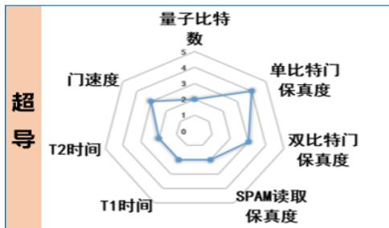

radar

超导
| 维度 | 数值 |
|---|---|
| 量子比特数 | 5 |
| 单比特门保真度 | 4 |
| 双比特门保真度 | 3 |
| SPAM读取保真度 | 2 |
| T1时间 | 1 |
| T2时间 | 0 |
| 门速度 | 3 |

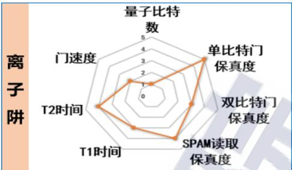

radar

离子阱
| 指标 | 数值 |
|---|---|
| 量子比特数 | 5 |
| 单比特门保真度 | 4 |
| 双比特门保真度 | 3 |
| SPAM读取保真度 | 2 |
| T1时间 | 2 |
| T2时间 | 3 |
| 门速度 | 2 |

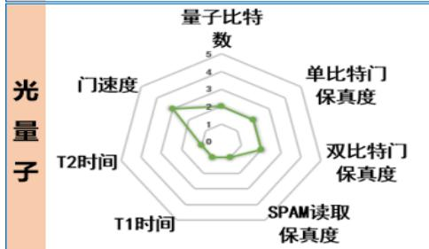

radar

光量子
| 指标 | 数值 |
|---|---|
| 量子比特数 | 5 |
| 单比特门保真度 | 3 |
| 双比特门保真度 | 3 |
| SPAM读取保真度 | 2 |
| T1时间 | 1 |
| T2时间 | 0 |
| 门速度 | 2 |

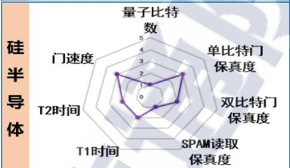

radar

硅半导体
| 指标 | 数值 |
|---|---|
| 量子比特数 | 5 |
| 单比特门保真度 | 4 |
| 双比特门保真度 | 3 |
| SPAM读取保真度 | 2 |
| T1时间 | 1 |
| T2时间 | 0 |
| 门速度 | 2 |

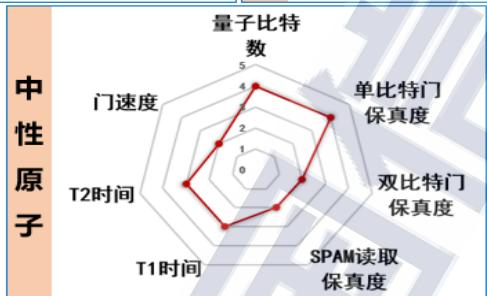

radar

中性原子
| 指标 | 数值 |
|---|---|
| 量子比特数 | 4.0 |
| 单比特门保真度 | 3.5 |
| 双比特门保真度 | 2.0 |
| SPAM读取保真度 | 2.5 |
| T1时间 | 3.0 |
| T2时间 | 2.8 |
| 门速度 | 2.2 |

来源：中国信息通信研究院

图2量子计算主要硬件技术路线关键指标对比概况25

# （二）量子计算软件持续开放探索，功能各有侧重

量子计算软件是连接用户与硬件的关键纽带，在编译运行和应用开发等方面需要根据量子计算原理特性进行全新设计，提供面向不同技术路线的底层编译工具，具备逻辑抽象工程的量子中间表示和指令集，以及支撑不同计算问题的应用软件。目前量子计算软件处于开放研发和生态建设早期阶段，业界在量子计算应用开发软件、编译软件、EDA软件等方向开展布局，如图3所示。

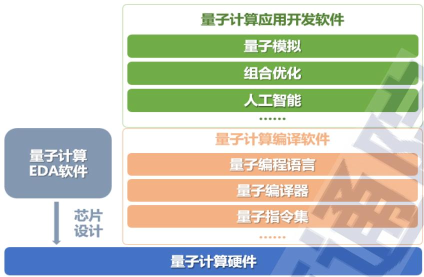

flowchart

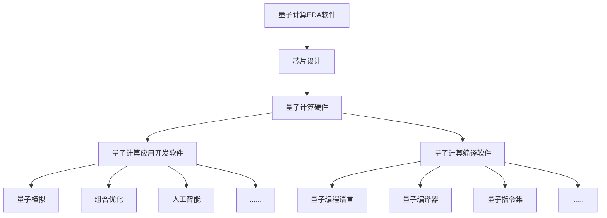

来源：中国信息通信研究院

图 3 量子计算软件体系架构图

应用开发软件为开发者提供创建和操作量子程序的工具集、开发组件以及算法库，业界代表性应用开发软件如表 1 所示。2023 年，QC Ware 推出量子化学软件 SaaS Promethium26。Quantum Brilliance 发布量子计算开发工具Qristal SDK27，用例包括经典量子混合应用、化学模拟以及自动驾驶等。瑞典查尔姆斯理工大学开发量子计算开源软件 SuperConga28，协助用户开展量子物理等领域的研究。未来，量子计算应用开发软件发展需要进一步增加应用场景、计算问题和算法开发的支持能力，以及与不同硬件系统软硬件协同适配性。

表1国内外代表性量子计算应用开发软件

<table><tr><td>类别</td><td>名称</td><td>领域</td><td>发布机构</td></tr><tr><td rowspan="12">量子计算应用开发软件</td><td>OpenFermion</td><td>化学</td><td rowspan="2">Google</td></tr><tr><td>TensorFlow Quantum</td><td>人工智能</td></tr><tr><td>PennyLane</td><td>机器学习</td><td>Xanadu</td></tr><tr><td>InQuanto</td><td>化学</td><td>Quantinuum</td></tr><tr><td>Qristal SDK</td><td>化学、经典量子混合应用、自动驾驶</td><td>Quantum Brilliance</td></tr><tr><td>SuperConga</td><td>量子物理</td><td>Chalmers University of Technology</td></tr><tr><td>ChemiQ</td><td>化学</td><td rowspan="2">本源量子</td></tr><tr><td>VQNet</td><td>人工智能</td></tr><tr><td>HiQ Fermion</td><td>化学</td><td>华为</td></tr><tr><td>Paddle Quantum</td><td>人工智能</td><td>百度</td></tr><tr><td>QuOmics、QuChem、QuDocking、QuSynthesis</td><td>化学、生物制药</td><td rowspan="2">图灵量子</td></tr><tr><td>QuFraudDetection、QuPortfolio</td><td>金融</td></tr></table>

来源：中国信息通信研究院

编译软件用于明确量子编程边界并确保程序编译正确执行，并提供完善且体系化的语法规则用于协调和约束量子操作与经典操作，表 2 梳理了业界代表性量子计算编译软件。2023 年，Pasqal 发布中性原子量子计算软件 Pulser Studio29，使用户能够以图形方式构建量子寄存器并设计脉冲序列。微软发布 Azure 量子开发套件（QDK）预览版30。Pasqal 推出用于数字模拟量子计算软件 Qadence31。量子计算编译软件未来需要持续提升软硬件协同编译、调度和优化能力。

表2国内外代表性量子计算编译软件

<table><tr><td>类别</td><td>名称</td><td>特性</td><td>发布机构</td></tr></table>

29 https://www.pasqal.com/articles/pulser-s-1   
30 https://github.com/microsoft/qsharp/wiki/Installation   
31 https://www.pasqal.com/articles/pasqal-unveils-qadence-a-quantum-programming-library-for-digital-analog-qua ntum-computing

<table><tr><td rowspan="18">量子计算编译软件</td><td>Qiskit</td><td>具有 Terra、Aqua、Ignis、Aer 等四个功能模块,可用于编写、模拟和运行量子程序</td><td>IBM</td></tr><tr><td>Cirq</td><td>针对量子电路精确控制、优化数据结构</td><td>Google</td></tr><tr><td>QDK</td><td>Q#量子编程语言、编译器、资源估计器等</td><td>微软</td></tr><tr><td>Forest</td><td>全栈编程和执行环境,Quil、pyQuil 等组件</td><td>Rigetti</td></tr><tr><td>qbsolv</td><td>协助开发者为 D-Wave 机器开发程序</td><td>D-Wave</td></tr><tr><td>Strawberry Fields</td><td>支持 python 库原型设计和量子电路优化</td><td>Xanadu</td></tr><tr><td>Pulser Studio</td><td>以图形方式构建量子寄存器并设计脉冲序列</td><td rowspan="2">Pasqal</td></tr><tr><td>Qadence</td><td>简化在相互作用的量子比特系统上构建和执行数字模拟量子程序的过程</td></tr><tr><td>Super.tech</td><td>根据硬件的脉冲级原生门自动优化量子程序</td><td>SuperstaQ</td></tr><tr><td>ProjectQ</td><td>基于 python 编译并对量子电路编译优化执行</td><td>ETH Zurich</td></tr><tr><td>Qulacs</td><td>基于 Python/C++编译,可模拟噪声量子门、参数化量子门等</td><td>Kyoto University</td></tr><tr><td>HiQ Pulse</td><td>包含量子最优控制算法和脉冲库,提供快速优化设计的调控解决方案</td><td>华为</td></tr><tr><td>QCompute</td><td>支持 Python/QASM 混合编译和量子电路本地运行</td><td>百度</td></tr><tr><td>TensorCircuit</td><td>支持自动微分、即时编译、向量并行化和 GPU 加速</td><td>腾讯</td></tr><tr><td>QPanda</td><td>支持 Python、QASM、OriginIR、Quil等语言,可用于构建、运行和优化量子算法</td><td>本源量子</td></tr><tr><td>isQ-Core</td><td>支持经典量子混合编程,提供量子电路分解、优化和映射等功能</td><td>中国科学院</td></tr><tr><td>QuTrunk</td><td>具有 QCircuit、Qubit、Qureg 等模块,支持代码的抽象封装和操作执行</td><td>启科量子</td></tr><tr><td>SpinQit</td><td>支持 Python/OpenQASM 2.0 编译以及经典量子混合编程,兼容 Qiskit 语法</td><td>量旋科技</td></tr></table>

来源：中国信息通信研究院

芯片设计 EDA 软件主要用于实现量子芯片的自动化设计、参数标定与优化、封装设计等功能，表 3梳理了业界代表性的 EDA软件。

2023年，亚马逊推出开源软件平台 Palace32，可执行复杂电磁模型的3D模拟并支持量子计算硬件设计。量旋科技发布超导芯片EDA软件天乙33。未来，量子计算芯片 EDA 软件需要在芯片性能验证、设计自主程度、设计效率等方面持续研究和完善。

表3国内外代表性量子计算 EDA软件

<table><tr><td>类别</td><td>名称</td><td>特性</td><td>发布机构</td></tr><tr><td rowspan="5">量子计算 EDA 软件</td><td>Qiskit Metal</td><td>用于超导量子处理器,构建芯片设计图,产生定制组件</td><td>IBM</td></tr><tr><td>KQCircuits</td><td>用于超导量子处理器,可用于生成芯片设计,并在制造器件之前检查信号路由</td><td>IQM</td></tr><tr><td>FeynmanPAQS</td><td>光量子芯片设计辅助系统与光学模拟系统</td><td>图灵量子</td></tr><tr><td>本源坤元</td><td>支持超导和半导体量子芯片版图自动化设计</td><td>本源量子</td></tr><tr><td>天乙</td><td>用于超导量子处理器,通过参数化生成量子器件,可自动布线算法</td><td>量旋科技</td></tr></table>

来源：中国信息通信研究院

总体而言，量子计算软件目前处于开放式探索阶段，不同软件功能各有侧重，但由于硬件技术路线未收敛、应用探索尚未落地使用等原因，软件技术水平基本处于研究工具级，与经典软件成熟度相距尚远。量子编程语言和框架、量子编译器和优化器、量子误差校正模块等关键功能特性仍需要持续研发，构建完善的软硬件技术栈和应用生态还有待业界进一步协同推动。

# （三）量子纠错突破盈亏平衡点，未来需持续攻关

量子纠错可保护量子态免受噪声或退相干影响，是可容错量子信息处理中必不可少的环节。由于量子态的不可克隆、相干性以及差错连续性等特性，导致量子纠错与经典纠错存在本质差异。量子纠错概念提出34以来，已有多类不同原理和构造的量子纠错编码方案，其中表面码是当前研究和实验验证的热点，其优势在于高容错阈值，仅需近邻比特间作用，在超导等技术路线中易实现等。

量子纠错需要执行状态编码、辅助比特制备、错误探测和纠正等多种操作，每个步骤都可能引入额外的错误。为了避免量子纠错陷入“越纠越错”的窘境，需要在各环节均完成高精度的操控。假设在纠错精度高于某个阈值时可以很好地完成量子纠错，即可通过多重级联编码等方式使错误率大幅度降低，从而实现高精度逻辑量子比特。因此突破量子纠错编码的盈亏平衡点， 实现纠错编码规模与相干时间、错误率等性能指标的正增益，具有重要意义。2023 年，谷歌首次突破量子计算纠错编码规模与收益的平衡点35，在纠错编码规模增长的同时降低错误率，验证了量子纠错方案的可行性。南方科大以离散变量编码逻辑量子位突破量子纠错平衡点36，超过盈亏平衡点约 16%。耶鲁大学利用实时量子纠错方案实现盈亏平衡点超越37，利用实时纠错实现稳定的逻辑量子比特。芝加哥大学报通过观察量子比特持续监测量子系统外部噪声38，并实时调制数据量子比特以最小化误差。IBM 报道39在 127 位 Eagle 量子处理器上基于误差缓解技术和量子伊辛模型，在无需量子纠错条件下实现对磁性材料简化系统模型的自旋动态和磁化特性的模拟，并验证其准确性。

量子纠错跨过盈亏平衡点，是实现通用量子计算的重要里程碑之一。但当前量子逻辑门保真度水平距离可容错实用化要求仍有约十个数量级的巨大差距，基于量子纠错实现逻辑量子比特仍是需要长期研究攻关的目标。量子纠错未来发展的主要方向包括：提升逻辑量子比特的可操控性，优化利用高维度量子资源实现逻辑量子比特的纠错编码方案；实现对特定噪声免疫的量子态调控方案，研究分布式量子纠错架构；在考虑计算资源的同时探究切合实际的纠错性能评价指标，实现带量子纠错的量子计算优越性等。在突破量子纠错盈亏平衡点后，业界将持续研究量子纠错理论与实验验证，未来数年将有更多量子纠错研究重要进展和成果出现。

# （四）环境测控系统取得新进展，性能指标待提升

量子计算中的叠加和纠缠等状态极易受到外界影响而退相干，需要极低温、高真空等环境系统支持，同时对大规模量子比特的微波或光学调控与测量，也需要高精度和高集成度的测控系统支持。环境与测控系统是各种技术路线的量子计算原型机必不可少的使能组件，也是当前提升样机工程化水平面临的重要技术瓶颈。

稀释制冷机可为超导、硅半导体等路线的量子计算处理器运行提供 mK 级别的极低温环境，利用氦-3 和氦-4 混合液的浓缩相和稀释相分离和循环转换产生制冷效应，具有可连续工作、操作简单、无振动与电磁干扰、性能稳定等优势。稀释制冷机的技术难点主要在于脉冲管和冷头等预制冷设备研制、制冷量提升、低温设备焊接和检漏工艺等方面。稀释制冷机是量子计算系统的重要装备之一，提升国产化自给能力对于保障科学研究和应用产业发展意义重大。近期国内相关单位持续研发攻关并取得重要进展。2022 年下旬，IBM 发布40“黄金眼”超大稀释制冷机。2023 年，中船重工鹏力发布41稀释制冷机产品，中科院物理所研制的无液氦稀释制冷机样机42，本源量子发布稀释制冷机产品43。未来，稀释制冷机将向更高制冷量、更大样品空间和集成化系统等方面发展。

超高真空腔是离子阱和中性原子量子计算必需环境，用于避免真空腔内气体分子与离子或原子的碰撞导致囚禁脱离，保证束缚时间和操控精度。超高真空腔技术挑战在于高性能吸气剂泵等关键组件的研制、提升气体抽速以及腔内真空度等方面。2022 年底，启科量子发布离子阱低温真空系统44，将低温、真空、电气、光学四大核心要素进行有机整合，为样机系统研制提供环境保障。未来真空腔需要持续提升真空度指标和集成化水平。

量子计算测控系统主要用于操控和测量量子比特，根据技术路线的需求区分大致可分为两类：一是离子阱、中性原子和光量子等技术路线所需的光学测控系统；二是超导、硅半导体等技术路线使用的微波测控系统。主要挑战在于提升同时被测控量子比特的数量、减小测控信息反馈延迟、提升系统内多模块同步性、减小噪声干扰等方面。当前业界代表性量子计算测控系统如表 4 所示。2023 年，苏黎世仪器发布量子计算控制系统 QCCS，启科量子发布离子阱环境控制系统<Aba|Qu|ENV>，玻色量子推出光量子测控一体机量枢，量旋科技发布超导量子测控系统织女星 Vega。未来量子计算测控系统需要提升测控芯片集成度、进行测控系统机箱内扩展、机箱间扩展以及提升系统的通道密度等。

表 4 代表性量子计算测控系统

<table><tr><td>类别</td><td>名称</td><td>发布机构</td><td>技术路线</td></tr><tr><td rowspan="10">量子计算测控系统</td><td>量子计算控制系统(QCCS)</td><td rowspan="2">Zurich Instruments</td><td rowspan="2">超导</td></tr><tr><td>量子测控一体机 SHFQC</td></tr><tr><td>量子控制系统 QCS</td><td>Keysight</td><td>超导</td></tr><tr><td>Cluster</td><td>Qblox</td><td>超导</td></tr><tr><td>量子计算测控系统 QCS1000</td><td>中微达信</td><td>超导</td></tr><tr><td>本源天机 3.0</td><td>本源量子</td><td>超导</td></tr><tr><td>ez-Q Engine</td><td>国盾量子</td><td>超导</td></tr><tr><td></td><td>启科量子</td><td>离子阱</td></tr><tr><td>量枢</td><td>玻色量子</td><td>光量子</td></tr><tr><td>织女星 Vega</td><td>量旋科技</td><td>超导</td></tr></table>

来源：中国信息通信研究院根据公开信息整理

需要指出，当前量子计算环境与测控系统研发也面临一些挑战。一是由于硬件技术路线并行发展导致环境系统、测控装备、关键组件等需求过于分散和碎片化，上游供应商难以聚焦某条技术路线开展集中攻关，制约工程化水平提升。二是未来量子比特规模提升对环境测控系统技术要求提出更严苛要求，例如稀释制冷机需支持数千乃至更大规模比特量级的布线和制冷，真空腔系统实现极高真空环境仍有存在工程挑战，测控系统进一步提高集成度。总体而言，量子计算环境与测控系统发展仍处于工程化研发和性能提升的攻关阶段，未来仍需进一步加强核心组件和系统集成等方面研发投入。

# 三、应用探索多领域广泛开展，产业生态初步形成

# （一）应用探索成业界热点，行业领域趋向多元化

近年来，基于中等规模含噪量子处理器（NISQ）和专用量子计算机的应用案例探索在国内外广泛开展，代表性应用领域和典型场景如表 5 所示，涵盖了化学、金融、人工智能、交运航空、气象等众多行业领域，产业规模估值达到千亿美元级别。量子计算公司普遍期待未来数年，在NISQ系统中完成具有社会经济价值的计算问题加速求解，实现杀手级应用突破。

表5量子计算应用场景分析

<table><tr><td rowspan="2">行业领域</td><td rowspan="2">关键环节</td><td rowspan="2">问题原型</td><td colspan="3">应用时间(+代表影响力)</td><td colspan="2">产业估值(亿美元)</td></tr><tr><td>3~5年</td><td>5~10年</td><td>10年以上</td><td>保守估值</td><td>乐观估值</td></tr><tr><td>金融</td><td>金融服务</td><td>组合优化人工智能</td><td>++</td><td>++</td><td>+++</td><td>~3940</td><td>~7000</td></tr><tr><td rowspan="3">能源与材料</td><td>传统能源</td><td rowspan="3">量子模拟组合优化人工智能</td><td>+</td><td>++</td><td>++</td><td>~100</td><td>~200</td></tr><tr><td>可持续能源</td><td>+</td><td>++</td><td>+++</td><td>~100</td><td>~300</td></tr><tr><td>化工</td><td>++</td><td>++</td><td>+++</td><td>~1230</td><td>~3240</td></tr><tr><td>生命科学</td><td>制药</td><td>量子模拟组合优化人工智能</td><td>++</td><td>++</td><td>+++</td><td>~740</td><td>~1830</td></tr><tr><td rowspan="4">先进工业</td><td>汽车</td><td>人工智能量子模拟组合优化</td><td>++</td><td>++</td><td>+++</td><td>~290</td><td>~630</td></tr><tr><td>航空航天与国防</td><td>因式分解量子模拟组合优化</td><td>+</td><td>++</td><td>++</td><td>~300</td><td>~700</td></tr><tr><td>电子产品</td><td rowspan="2">因式分解量子模拟组合优化</td><td>+</td><td>++</td><td>++</td><td>~100</td><td>~200</td></tr><tr><td>半导体</td><td>+</td><td>++</td><td>++</td><td>~100</td><td>~200</td></tr><tr><td rowspan="2">电信传媒</td><td>电信</td><td rowspan="2">量子模拟组合优化</td><td rowspan="2">+</td><td rowspan="2">+</td><td rowspan="2">++</td><td>~100</td><td>~200</td></tr><tr><td>传媒</td><td>~100</td><td>~200</td></tr><tr><td>出行、运输和物流</td><td>物流</td><td>组合优化量子模拟人工智能因式分解</td><td>+</td><td>++</td><td>++</td><td>~500</td><td>~1000</td></tr></table>

来源：麦肯锡《量子技术监测》、波士顿《量子计算为商业化做好准备》等

化学领域量子计算应用探索主要通过模拟化学反应，达到提高效率、降低资源消耗等目的。2023 年，德国尤利希中心利用量子计算提升寻找蛋白质最低能量结构的成功率45。牛津大学实现基于网格的量子计算化学模拟46，探索基态准备、能量估计到散射和电离动力学等方面能力。QC Ware 展示量子计算帮助检测糖尿病视网膜病变47。IBM 和克利夫兰诊所建立量子计算应用联合研究中心，加速生物医学方面研究48。美国艾姆斯研究中心报道了量子计算在材料模拟应用中的自适应算法，减少计算资源的同时提升模拟稀土材料准确性49。

金融领域量子计算应用有望在优化预测分析、精准定价和资产配置等问题中产生优势。2023 年，法国 CIB、Pasqal 和 Multiverse 联合发布量子计算金融应用解决方案的验证结果50，减少金融衍生品估值计算所耗算力资源，提升评估速度与准确性。摩根大通和 QCWare 使用量子深度学习分析风险模型提升训练有效性51。汇丰银行和 Quantinuum 合作探索在欺诈检测和自然语言处理等方面的量子计算应用优势52，推出用于金融数学问题建模应用的量子蒙特卡罗积分引擎量子算法工具53。

人工智能领域与量子计算结合可能在于机器学习、化学分析、神经网络等领域产生应用。2023 年，Zapata 联合研究表明混合量子人工智能有望生成更理想特性的药物小分子54。慕尼黑大学使用量子神经网络训练小型含噪数据集为化学制药提供解决方案55。清华大学演示反向传播算法训练六层深度量子神经网络56，提升平均保真度达94.8%。Rigetti 联合 ADIA 实验室开发概率分布分类的量子机器学习解决方案57，探索量化金融领域中的投资策略制定新方法。

交通物流领域量子计算应用主要聚焦组合优化问题，以更优方案实现路线规划和物流装配，提升效率降低成本。2023 年，TerraQuantum 和泰雷兹公司使用混合量子计算验证加强卫星任务规划过程并改善卫星运行效率58。英伟达、罗尔斯-罗伊斯和 Classiq 将量子计算用于提升喷气发动机的工作效率59。Amerijet International 和Quantum-South 报道利用量子计算，可以实现飞机货物装载效率优化从而提高航班收入60。

气象预测领域量子计算应用主要体现在求解大数量、多维度的气象数据，协助建模仿真与预测。2023年，德勤举办 2023年量子气候挑战赛61，使用量子计算机模拟从大气中过滤二氧化碳的材料从而减少全球变暖的影响。美国能源部国家能源技术实验室使用量子计算研究胺化学反应62，找寻用于碳捕获的胺化合物。

需要注意的是，近年涌现出众多关于量子计算应用案例报道，基本属于原理验证性质的可行性实验报道，部分应用案例可以取得一定加速优势，但距离业界期待的指数级加速和算力飞跃仍有较大差距。量子计算在应用实际落地和产生商业价值方面仍面临挑战，目前基本处于可行性和实用性探索阶段。

# （二）实用化落地尚未突破，硬件性能提升是基础

2023年7月，美国Gartner发布计算技术成熟度曲线如图 4所示，数年前量子计算技术向着“过高期望”顶点逐渐靠近，现阶段已跨越了“过高期望”顶点，但整体距离“生产力高原”仍需超过十年的时间。NISQ 样机时代能否实现“杀手级”应用突破，是量子计算行业发展的分水岭，如果未来数年内一直无法实现应用落地突破，则量子计算技术产业发展恐将面临“幻灭之谷”的低潮期。

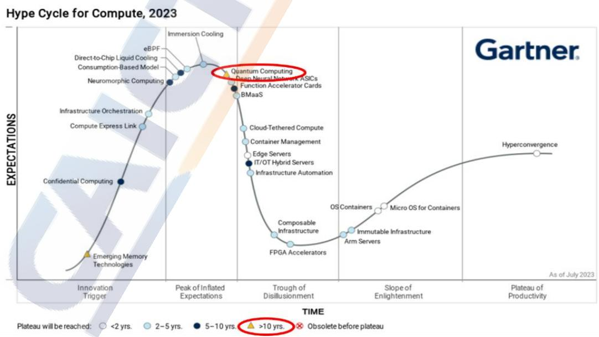

line

| Technology | Expectations | Time Period |
| --- | --- | --- |
| Quantum Computing | Peak of Inflated Expectations | >10 yrs. |
| Cloud-Tethered Compute | Trough of Disillusionment | 5-10 yrs. |
| Engine-Based ASICs | Trough of Disillusionment | 5-10 yrs. |
| Function Accelerator Cards | Trough of Disillusionment | 5-10 yrs. |
| BMAaS | Trough of Disillusionment | 5-10 yrs. |
| Cloud-Tethered Compute | Trough of Disillusionment | 2-5 yrs. |
| Container Management | Trough of Disillusionment | 2-5 yrs. |
| Edge Servers | Trough of Disillusionment | 2-5 yrs. |
| IT/OT Hybrid Servers | Trough of Disillusionment | 5-10 yrs. |
| Infrastructure Automation | Trough of Disillusionment | 5-10 yrs. |
| Composable Infrastructure | Trough of Disillusionment | 5-10 yrs. |
| FPGA Accelerators | Trough of Disillusionment | 5-10 yrs. |
| Arm Servers | Trough of Disillusionment | 2-5 yrs. |
| Micro OS for Containers | Trough of Disillusionment | 2-5 yrs. |
| OS Containers | Trough of Disillusionment | 2-5 yrs. |
| Emerging Memory Technologies | Trough of Disillusionment | <2 yrs. |
| Infrastructure Orchestration | Peak of Inflated Expectations | <2 yrs. |
| Neuromorphic Computing | Peak of Inflated Expectations | <2 yrs. |
| Consumption-Based Model | Peak of Inflated Expectations | <2 yrs. |
| Direct-to-Chip Liquid Cooling | Peak of Inflated Expectations | <2 yrs. |
| eBPF | Peak of Inflated Expectations | <2 yrs. |
| Immersion Cooling | Peak of Inflated Expectations | <2 yrs. |
| Innovation Trigger | Peak of Inflated Expectations | <2 yrs. |
| Plateau of Productivity | As of July 2023 | Hyperconvergence |

62 https://avs.scitation.org/doi/10.1116/5.0137750

来源：Gartner: Hyper Cycle of Compute（2023 年 7 月）

图 42023年Gartner量子计算技术成熟度预测

量子计算系统是十分脆弱的，易受到外部环境噪声、系统中粒子间的相互作用等复杂因素的交互影响而引发退相干效应，导致量子态失真，使算法运行结果的保真度和准确性受到影响。目前量子计算应用难以实用落地的主要原因在于样机的相干操控比特规模、逻辑门保真度和线路深度等关键性能指标仍极为有限，量子算法、量子纠错编码方案等未完全成熟，难以支撑具有明确加速优势的算法实施。未来需要提升 NISQ 样机性能，在解决实际问题时发挥出相较于经典算法的显著算力优势，才能体现出量子计算价值。

量子计算技术发展演进可大致分为三个阶段，阶段一是实现量子计算优越性验证（已完成）；阶段二是实现可在若干具有实用价值的计算难题中展现量子计算优越性并带来社会经济价值的专用量子计算机（下一步重点攻关目标）；三是大规模可容错通用量子计算机（远期目标）。阶段二的专用量子计算机“杀手级”应用，以超导量子路线为例，也可大致分为三步：一是实现数百比特规模的相干操控，逻辑门保真度达 99.9%以上时，能够在运算复杂度和精度要求不高的部分量子组合优化场景中率先实现落地，有望未来3-5年实现；二是实现数千比特规模的相干操控，逻辑门保真度达 99.99%以上时，能够使用量子模拟在多个行业领域实现落地应用，有望未来 5-10 年实现；三是实现数万比特规模的相干操控，逻辑门保真度满足量子纠错阈值要求时，能够在密码分析等计算问题更为复杂的行业领域产生重要影响，预计至少仍需10年以上。

# （三）产业联盟与开源社区成为生态发展重要助力

随着量子计算技术研发和应用探索不断推进，产业生态培育成为热点，业界通过成立产业联盟，建设开源社区等方式，促进量子计算产业生态系统发展。近年来全球多国相继成立量子信息领域产业联盟，成员涵盖量子企业、研究机构以及行业用户，持续推动产学研用多方合作。全球代表性量子信息产业联盟如图5所示。

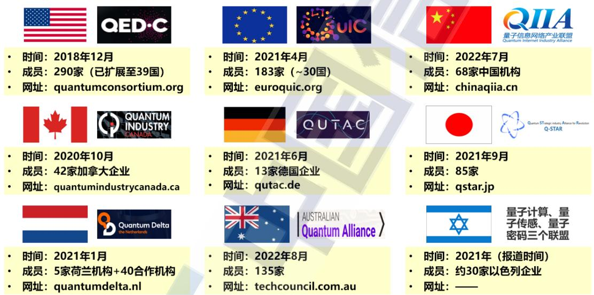

text_image

• 时间：2018年12月
• 成员：290家（已扩展至39国）
• 网址：quantumconsortium.org

• 时间：2021年4月
• 成员：183家（~30国）
• 网址：euroquic.org

• 时间：2022年7月
• 成员：68家中国机构
• 网址：chinaqiia.cn

• 时间：2020年10月
• 成员：42家加拿大企业
• 网址：quantumindustrycanada.ca

• 时间：2021年6月
• 成员：13家德国企业
• 网址：qutac.de

• 时间：2021年9月
• 成员：85家
• 网址：qstar.jp

• 时间：2021年1月
• 成员：5家荷兰机构+40合作机构
• 网址：quantumdelta.nl

• 时间：2022年8月
• 成员：135家
• 网址：techcouncil.com.au

• 时间：2021年（报道时间）
• 成员：约30家以色列企业
• 网址：——

来源：中国信息通信研究院根据公开信息整理（截至 2023年 11月）

图 5 全球代表性量子信息产业联盟概况

2023 年，加拿大量子工业联盟（QIC）、美国量子经济发展联盟（QED-C）、日本量子技术与应用联盟（Q-STAR）和欧洲量子产业联盟（QuIC）签署了谅解备忘录，成立国际量子产业协会理事会，旨在加强成员之间在量子技术发展目标、战略规划、国际规则制定以及知识产权管理等方面的沟通和协作，并将致力于推动全球供应链的可视化。量子信息网络产业联盟（QIIA）目前已有 68 家成员单位，自成立以来组织开展技术交流研讨，已相继启动技术研究、标准预研、测评验证、应用案例征集等方向的二十余个研究项目，并于 2023 年举办了第一届量子信息技术与应用创新大赛。本源量子计算产业联盟（OQIA）已有四十余个成员，共同开展研发制造、应用探索和科普教育等方面合作。量子科技产学研创新联盟由合肥国家实验室牵头成立，旨在全面增强量子科技创新策源能力，推动量子产业集聚发展，引导和拓展量子科技在政务、通信、金融等领域应用示范。此外，电子学会、通信学会、计算机学会、信息协会等行业平台，也成立了量子计算、量子通信等方向委员会，组织开展年度学术交流和产业研讨会议论坛等多学科领域的交流与研讨。

开源软件社区是高效协作打造软件生态的重要模式，有助于促进独立开发者和大型企业积极参与，推动量子计算软件生态发展。国际科技巨头依托 GitHub 等开源软件社区，吸引更多用户学习和使用量子计算产品，积极构建产业生态圈，拓展用户培育途径，在开源社区贡献度、软件工具用户吸引力和生态影响力方面更具优势。

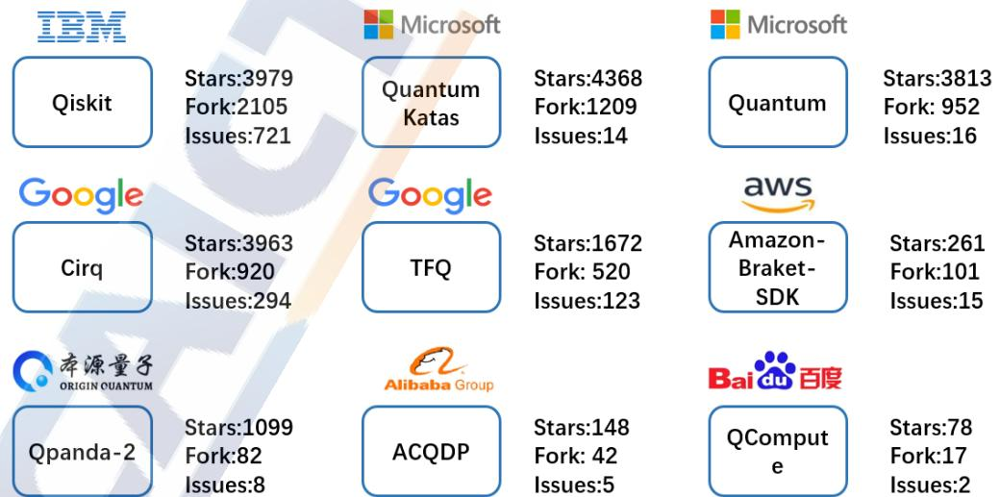

other

| Company | Stock | Value |
| :--- | :--- | :--- |
| IBM | Qiskit | 3979 |
| IBM | Qiskit | 2105 |
| IBM | Qiskit | 721 |
| Microsoft | Quantum Katas | 4368 |
| Microsoft | Quantum | 1209 |
| Microsoft | Quantum | 14 |
| Microsoft | Quantum | 3813 |
| Microsoft | Quantum | 952 |
| Microsoft | Quantum | 16 |
| Google | Cirq | 3963 |
| Google | Cirq | 920 |
| Google | Cirq | 294 |
| Google | TFQ | 1672 |
| Google | TFQ | 520 |
| Google | TFQ | 123 |
| AWS | Amazon-Braket-SDK | 261 |
| AWS | Amazon-Braket-SDK | 101 |
| AWS | Amazon-Braket-SDK | 15 |
| Alibaba Group | Qpanda-2 | 1099 |
| Alibaba Group | Qpanda-2 | 82 |
| Alibaba Group | Qpanda-2 | 8 |
| Alibaba Group | ACQDP | 148 |
| Alibaba Group | ACQDP | 42 |
| Alibaba Group | ACQDP | 5 |
| Baidu 百度 | QCompute e | 78 |
| Baidu 百度 | QCompute e | 17 |
| Baidu 百度 | QCompute e | 2 |

来源：中国信息通信研究院（截至 2023年 11月）  
图 6国内外量子计算软件 GitHub开源社区活跃度

国内外典型量子计算软件开源项目在 GitHub 网站的活跃度对比情况如图 6 所示。我国在量子计算软件项目关注数（Star）、项目分支拷贝数（Fork）、项目问题数（Issue）等方面与国际先进水平存在数量级差距，普遍活跃度较低，生态影响力有限，处于培育期。活跃度差距主要原因是欧美企业在经典计算领域已建立了较为雄厚的开源软件先发优势，用户和企业在量子软件操作和使用习惯受到先入为主的惯性引导，多种软件并发也稀释了开源社区研发力量。

总体而言，全球量子计算生态体系处于早期构建阶段。国内外业界各方通过成立产业联盟，构建开源社区，汇集行业伙伴、探索应用场景、促进创新协同已成为重要趋势。未来我国需要依托产业联盟与开源社区等平台，进一步整合业界各方力量，加快量子计算软硬件协同开发迭代和应用场景探索等产业生态建设工作。

# （四）欧美量子计算企业活跃，产业生态初具雏形

近年来全球主要国家量子计算企业数量和投融资经历了一轮爆发式增长，科技巨头和初创企业成为促进量子计算产业化发展的重要推动力量，欧美成为量子计算企业聚集度和活跃度最高地区。美国代表性量子计算企业包括 IBM、Google、Intel、微软、亚马逊等科技巨头成立的研发部门，IonQ、Rigetti、QCI、QuEra 等多类型初创企业在硬件、软件、算法等领域开展创新，通过资本市场不断获取资金支持，积极研发量子计算原型机及软件算法，加速技术水平提升与成果转化，推动全球量子计算产业发展。欧洲量子计算企业大多为初创企业，如 Quantinuum、IQM、Pasqal、OQC、Qu&Co、

Planqc 等。欧美企业间合作紧密，在技术推进、应用探索和产业培育等方面取得诸多进展。此外，加拿大、澳大利亚、新加坡等国也涌现出一批量子计算企业，典型如 D-Wave（加）、Xanadu（加）、Horizon Quantum Computing（新）、Q-CTRL（澳）等，在硬件系统研发和软件产品开发等方面表现活跃。

我国华为、百度、腾讯等企业近年来相继成立量子实验室，在软硬件研发、算法研究、应用探索、量子计算云平台等方面积极布局，但相对美国科技企业而言投入推动力度仍较为有限。11 月，阿里达摩院裁撤量子计算研究团队，也成为业界热点事件。本源量子、启科量子、国盾量子、玻色量子、图灵量子、量旋科技、弧光量子、中科酷源、幺正量子等量子计算初创企业布局推进量子计算技术研究与应用探索，力争在全球量子计算产业生态中占得一席之地。

量子计算产业生态上中下游各环节已初具雏形，如图 7 所示，目前全球已涌现出百余家量子计算企业，欧美企业聚集度较高，产业生态各环节的参与者逐步增多， 产业培育正在稳步推进。

<table><tr><td colspan="2">产业生态</td><td colspan="7">国际</td><td colspan="3">国内</td></tr><tr><td rowspan="6">上游</td><td rowspan="6">环境与测控</td><td>稀释制冷机</td><td>BLUEFORS</td><td>CLDN DRYOGENICS</td><td>LTLAB</td><td>Cryo Conneight</td><td>JenisULT</td><td>FORMFACTOR ULVAC</td><td>CryoPride</td><td>PHYSIKE</td><td>国睿量子 QuantumCTM</td></tr><tr><td>测控系统</td><td>Xurich Ocean Sciences</td><td>QM QUANTUM MACHINES</td><td>QBLOX</td><td>KEYSIGHT</td><td>MenloSystems</td><td>UNIVIC COWDERENCE INC.</td><td>ZND 中地诺特</td><td>ZND 中地诺特</td><td>FERMI</td></tr><tr><td>低温组件</td><td></td><td>STAR CHYOLLECTRONICS</td><td>Atlantic Microwave</td><td>Lake Shore</td><td>Coax AmpTech+</td><td>AmpTech+</td><td>赋同量子 PROTEC</td><td>ZND 中地诺特</td><td>力美特真空技术(北京)有限公司</td></tr><tr><td>真空系统</td><td></td><td>Joka Sun Photonics</td><td>Kurt L Lesker Company</td><td>Leybold Agilent</td><td>EDWARDS PFEIFFER VACUUM</td><td>Vacuum</td><td>FERMI Preculusors 线上智能</td><td>Lunzi 万美特真空技术(北京)有限公司</td><td></td></tr><tr><td>激光器</td><td></td><td>NKT Photonics</td><td>THORLABS Tortica</td><td>nLIGHT n Light</td><td>OEwaves</td><td>Pixel iThi Photonic</td><td>Accelink HATCH</td><td>Accelink HATCH</td><td></td></tr><tr><td>光学探测器</td><td></td><td>SMALL QUINTUM SCIENTE</td><td></td><td></td><td></td><td></td><td></td><td></td><td></td></tr><tr><td rowspan="7">中游</td><td rowspan="6">原型机</td><td>超导</td><td colspan="6">IBM Google rigetti IQM OQC Bileximo ATLANTIC seeac qci Nerd</td><td colspan="3">有源量子 HIGHTHEMATIA Baidu 百度 CETC SPINO</td></tr><tr><td>离子阱</td><td colspan="6">QUANTINUUM IONQ AOT oxford Ionics eleQtron</td><td></td><td></td><td></td></tr><tr><td>光量子</td><td></td><td></td><td></td><td></td><td></td><td></td><td></td><td></td><td></td></tr><tr><td>硅半导体</td><td></td><td></td><td></td><td></td><td></td><td></td><td></td><td></td><td></td></tr><tr><td>中性原子</td><td></td><td></td><td></td><td></td><td></td><td></td><td></td><td></td><td></td></tr><tr><td>其他</td><td></td><td></td><td></td><td></td><td></td><td></td><td></td><td></td><td></td></tr><tr><td>软件</td><td>HORIZON software Q-CTRL Q-CTRL Q-CTRL Q-CTRL Q-CTRL Q-CTRL Q-CTRL Q-CTRL Q-CTRL Q-CTRL Q-CTRL Q-CTRL Q-CTRL Q-CTRL Q-CTRL Q-CTRL Q-CTRL Q-CTRL Q-CTRL Q-CTRL Q-CTRL Q-CTRL Q-CTRL Q-CTRL Q-CTRL Q-CTRL Q-CTRL Q-CTRL Q-CTRL Q-CTRL Q-CTRL Q-CTRL Q-CTRL Q-CTRLQ1QBit Quemix Qu&amp; Co Qu&amp; Co Qu&amp; Co Qu&amp; Co Qu&amp; Co Qu&amp; Co Qu&amp; Co Qu&amp; Co Qu&amp; Co Qu&amp; Co Qu&amp; Co Qu&amp; Co Qu&amp; Co Qu&amp; Co Qu&amp; Co Qu&amp; Co Qu&amp; Co Qu&amp; Co Qu&amp; Co Qu&amp; Co Qu&amp; Co Qu&amp; Co Qu&amp; Co Qu&amp; Co Qu&amp; Co Qu&amp; Co Qu&amp; Co Qu&amp; Co Qu&amp; Co Qu&amp; Co Qu&amp; Co Qu&amp; Co Qu&amp; Co Qu&amp; CoQu&amp;CoQu&amp;CoQu&amp;CoQu&amp;CoQu&amp;CoQu&amp;CoQu&amp;CoQu&amp;CoQu&amp;CoQu&amp;CoQu&amp;CoQu&amp;CoQu&amp;CoQu&amp;CoQu&amp;CoQu&amp;CoQu&amp;CoQu&amp;CoQu&amp;CoQu&amp;CoQu&amp;CoQu&amp;CoQu&amp;CoQu&amp;CoQu&amp;CoQu&amp;CoQu&amp;CoQu&amp;CoQu&amp;CoQu&amp;CoQu&amp;CoQu&amp;CoQu&amp;CoQu&amp;CoQ&amp;CoCuQ&amp;ApoQ&amp;ApoQ&amp;ApoQ&amp;ApoQ&amp;ApoQ&amp;ApoQ&amp;ApoQ&amp;ApoQ&amp;ApoQ&amp;ApoQ&amp;ApoQ&amp;ApoQ&amp;ApoQ&amp;ApoQ&amp;ApoQ&amp;ApoQ&amp;ApoQ&amp;ApoQ&amp;ApoQ&amp;ApoQ&amp;ApoQ&amp;ApoQ&amp;ApoQ&amp;ApoQ&amp;ApoQ&amp;ApoQ&amp;ApoQ&amp;ApoQ&amp;ApoQ&amp;ApoQ&amp;ApoQ&amp;ApoQ&amp;ApoQ&amp;Apoq&amp;Apoq&amp;Apoq&amp;Apoq&amp;Apoq&amp;Apoq&amp;Apoq&amp;Apoq&amp;Apoq&amp;Apoq&amp;Apoq&amp;Apoq&amp;Apoq&amp;Apoq&amp;Apoq&amp;Apoq&amp;Apoq&amp;Apoq&amp;Apoq&amp;Apoq&amp;Apoq&amp;Apoq&amp;Apoq&amp;Apoq&amp;Apoq&amp;Apoq&amp;Apoq&amp;Apoq&amp;Apoq&amp;Apoq&amp;Apoq&amp;Apoq&amp;Apoq&amp;ApoqCAoQ&amp;ApoQ&amp;ApoQ&amp;ApoQ&amp;ApoQ&amp;ApoQ&amp;ApoQ&amp;ApoQ&amp;ApoQ&amp;ApoQ&amp;ApoQ&amp;ApoQ&amp;ApoQ&amp;ApoQ&amp;ApoQ&amp;ApoQ&amp;ApoQ&amp;ApoQ&amp;ApoQ&amp;ApoQ&amp;ApoQ&amp;ApoQ&amp;ApoQ&amp;ApoQ&amp;ApoQ&amp;ApoQ&amp;ApoQ&amp;ApoQ&amp;ApoQ&amp;ApoQ&amp;ApoQ&amp;ApoQ&amp;ApoQ&amp;Apo0CAoQ&amp;Apo0CAo0CAo0CAo0CAo0CAo0CAo0CAo0CAo0CAo0CAo0CAo0CAo0CAo0CAo0CAo0CAo0CAo0CAo0CAo0CAo0CAo0CAo0CAo0CAo0CAo0CAo0CAo0CAo0CAo0CAo0CAo0CAo0CAo0CAoOCAoOCAoOCAoOCAoOCAoOCAoOCAoOCAoOCAoOCAoOCAoOCAoOCAoOCAoOCAoOCAoOCAoOCAoOCAoOCAoOCAoOCAoOCAoOCAoOCAoOCAoOCAoOCAoOCAoOCAoOCAoOCAoOCAoOCCOA OOC OOC OOC OOC OOC OOC OOC OOC OOC OOC OOC OOC OOC OOC OOC OOC OOC OOC OOC OOC OOC OOC OOC OOC OOC OOC OOC OOC OOC OOC OOC OOC OOC OOC OOC OOC OOC OOC OOC OOC OOC OOC OOC OOC OOC OOC OOC OOC OOC OOC OCCOA OOC OAANADU RIGETTI Quantum Inspire By GuTwin OM ware HUAWEI 国信量子 QuantumCTM ARC RIGHT 22222222222222222222222222222222222222222222222222222222222222222222222222222222222222222222222222224
下游</td><td>应用探索</td><td>DBCLAYS AIRBUS DAIMLER M W S S S S S S S S S S S S S S S S S S S S S S S S S S S S S S S S S S S S S S S S S S S S S S S S S S S S S S S S S S S S S S S S S S S S S S S S S S S S S S S S S S S S S S S S S S S S S S S S S S S S 368888888888888888888888888888888888888888888888888888888888888888888888888888888888888888888888888888BcG accenlure AFORE 建信金科 光大科技有限公司 CSB Finech 中国移动 China Mobile 中国民生银行</td><td></td><td></td><td></td><td></td><td></td><td></td><td></td></tr></table>

来源：中国信息通信研究院

图7量子计算产业生态与国内外代表性企业概况

产业生态上游主要包含环境支撑系统、测控系统、各类关键设备组件以及元器件等，是研制量子计算原型机的必要保障。目前由于技术路线未收敛、硬件研制个性化需求多等原因，上游供应链存在碎片化问题，逐一突破攻关存在难度，一定程度上限制了上游企业的发展。国内外情况对比而言，上游企业以欧美居多，部分龙头企业占据较大市场份额，我国部分关键设备和元器件对外依赖程度较高。

产业生态中游主要涉及量子计算原型机和软件，其中原型机是产业生态的核心部分， 目前超导、离子阱、光量子、硅半导体和中性原子等技术路线发展较快，其中超导路线备受青睐，离子阱、光量子和中性原子路线获得较多初创企业关注。美国原型机研制与软件研发占据一定优势，我国量子计算硬件企业数量有限且技术路线布局较为单一，集中在超导和离子阱路线，量子计算软件企业存在数量规模较少、创新成果有限、应用探索推动力弱等问题。

产业生态下游主要涵盖量子计算云平台以及行业应用，处在早期发展阶段。近年来全球已有数十家公司和研究机构推出了不同类型的量子计算云平台积极争夺产业生态地位。目前量子计算领域应用探索已在金融、化工、人工智能、医药、汽车、能源等领域广泛开展。国外量子计算云平台的优势体现在后端硬件性能、软硬件协同程度、商业服务模式等方面。大量欧美行业龙头企业成立量子计算研究团队，与量子企业联合开展应用研究，我国下游行业用户对量子计算重视程度有限，开展应用探索动力仍需提升。

产业基础能力是观察和分析各国量子计算技术产业发展态势的重要视角之一，本报告从科研基础、政府活动、私营企业、技术成果等四个维度构建产业基础能力分析框架，对比分析中美量子计算领域的产业基础能力情况，具体结果如图8所示。

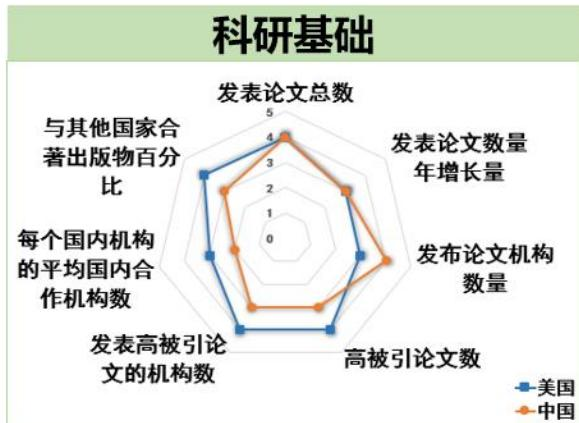

radar

科研基础
| 指标 | 美国 | 中国 |
|---|---|---|
| 发表论文总数 | 4.0 | 4.2 |
| 发表论文数量年增长量 | 3.0 | 3.5 |
| 发布论文机构数量 | 2.8 | 3.2 |
| 高被引论文数 | 3.5 | 2.9 |
| 发表高被引论文的机构数 | 3.2 | 2.7 |
| 每个国内机构的平均国内合作机构数 | 2.5 | 2.3 |
| 与其他国家合著出版物百分比 | 3.0 | 2.6 |

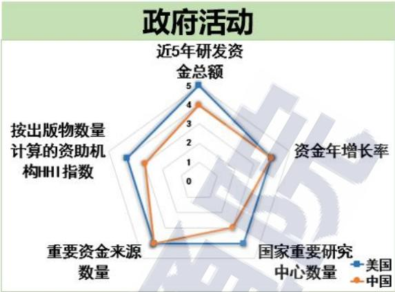

radar

政府活动
| 指标 | 美国 | 中国 |
|---|---|---|
| 近5年研发资金总额 | 5 | 4 |
| 资金年增长率 | 4 | 3.5 |
| 国家重要研究中心数量 | 4 | 3 |
| 重要资金来源数量 | 4 | 4 |
| 按出版物数量计算的资助机构HHI指数 | 4 | 3 |

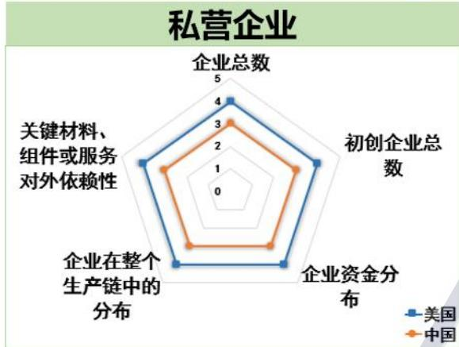

radar

私营企业
| 指标 | 美国 | 中国 |
|---|---|---|
| 企业总数 | 4.0 | 3.2 |
| 初创企业总数 | 3.5 | 2.8 |
| 企业资金分布 | 3.3 | 2.6 |
| 企业在整个生产链中的分布 | 3.1 | 2.4 |
| 关键材料、组件或服务对外依赖性 | 3.0 | 2.2 |

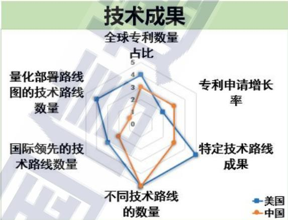

radar

技术成果
| 项目 | 美国 | 中国 |
|---|---|---|
| 全球专利数量占比 | 4.0 | 3.5 |
| 专利申请增长率 | 2.0 | 2.5 |
| 特定技术路线成果 | 4.0 | 2.0 |
| 不同技术路线的数量 | 1.5 | 3.0 |
| 国际领先的技术路线数量 | 2.0 | 1.5 |
| 量化部署路线图的技术路线数量 | 3.0 | 2.0 |

来源：中国信息通信研究院

图8中美量子计算产业基础能力对比

科研基础方面，我国具有较多的发文机构，但高被引论文数、国际合作机构以及合著出版物数量等相对较少，在高水平科研成果和国际合作仍需加强。政府活动方面，中美研发投入资金量级差距不大，我国量子计算重要研究中心的数量有待增加。私营企业方面，美国企业发展较为活跃，在企业数量、资金分布和供应链能力方面全面领先。技术成果方面，我国专利增长率较高，但专利数量、代表性技术成就、产品技术路线图等方面仍存差距，需要加强样机软硬件研发创新性成果输出和样机产品发展路线图规划。综合来看，我国在量子计算领域具有一定的科研基础，但在技术成就、企业发展和产业推动等方面仍有较大提升空间。

# 四、量子计算云平台是构建应用产业生态重要支点

# （一）国内外企业机构加速布局，抢占产业生态位

量子计算云平台将量子计算机硬件、模拟器、软件编译和开发工具，与经典云计算软硬件和通信网络设备相结合，可为用户提供直观和实例化的量子计算接入访问与应用服务。作为集成量子计算软硬件能力，面向用户提供服务，支撑算法研究、应用探索和产业培育的生态汇聚点，量子计算云平台已成为推动应用探索和产业化发展的生态汇聚点和重要驱动力。近年来，科技巨头、初创企业与研究机构为抢占应用产业生态核心地位，加大量子计算云平台建设投入和推广力度。全球已有数十家公司和研究机构推出了不同类型量子计算云平台，其中代表性云平台如图9所示。

<table><tr><td>硬件类型</td><td colspan="3">超导</td><td>离子阱</td><td>光量子</td><td>半导体/超导</td><td>退火</td><td colspan="4">云平台服务</td></tr><tr><td>平台提供者</td><td>IBM</td><td>rigetti</td><td>Google</td><td>IONQ</td><td>XANADU</td><td>QuTech</td><td>D:Wave</td><td>aws</td><td></td><td></td><td>STRANGE WORKS</td></tr><tr><td>平台名称</td><td>IBM Quantum</td><td>Quantum Cloud Services</td><td>Google Cloud</td><td>IonQ Quantum Cloud</td><td>Xanadu Quantum Cloud</td><td>Quantum Inspire</td><td>Leap</td><td>Amazon Braket</td><td>Azure Quantum</td><td>strangeworks QC</td><td></td></tr><tr><td>最新处理器</td><td>sprey</td><td>Ankaa-1</td><td>Sycamore</td><td>Forte</td><td>Borealis</td><td>Spin-2 Starmon-5</td><td>Advantage</td><td>D-Wave、IonQ、OQC、Rigetti、QuEra、Xanadu</td><td>IonQ、QCI Rigetti、Quantinuum、Pasqal</td><td>IBM、Xanadu、Quantinuum、Rigetti、......</td><td></td></tr><tr><td>量子比特数</td><td>433</td><td>84</td><td>72</td><td>32</td><td>216</td><td>2; 5</td><td>5000+</td><td>QPU family</td><td>QPU family</td><td>QPU family</td><td></td></tr><tr><td>硬件类型</td><td colspan="4">超导</td><td colspan="2">超导/离子阱</td><td>光量子</td><td>中性原子</td><td>模拟器</td><td colspan="2">云平台服务</td></tr><tr><td>平台提供者</td><td>中科大 &amp; 国盾量子</td><td>北京量子院 &amp; 物理所</td><td>本源量子</td><td>浙大</td><td>百度</td><td>弧光量子</td><td>图灵</td><td>武汉量子院</td><td>华为</td><td>阿里</td><td>中国移动</td></tr><tr><td>平台名称</td><td>量子计算云平台</td><td>quafu</td><td>本源量子云</td><td>太元一号</td><td>星易伏</td><td>弧光量子云平台</td><td>Soft Qubit</td><td>酷原量子云</td><td>HiQ</td><td>太章</td><td>“五岳”量子计算云平台</td></tr><tr><td>量子处理器</td><td>骁鸿176</td><td>ScQ-P136ScQ-P21ScQ-P18ScQ-P10</td><td>本源悟空本源悟源1号本源悟源2号</td><td>天目1号</td><td>乾中科院物理所QPU中科院精测院QPU</td><td>超导66比特量子芯片离子阱11比特量子芯片</td><td>——</td><td>——</td><td>——</td><td>——</td><td>计划接入玻色量子、量子科技长三角产业创新中心、本源量子、华翊量子的QPU真机</td></tr><tr><td>量子比特数</td><td>176(66计算比特)</td><td>136; 21; 18; 10</td><td>12; 6</td><td>10</td><td>8; 10; 1</td><td>66; 11</td><td>——</td><td>——</td><td>——</td><td>——</td><td>待上线</td></tr></table>

来源：中国信息通信研究院（截至 2023年 11月）

图9国内外代表性量子计算云平台概况

美国以 IBM、亚马逊、谷歌、微软等为代表的科技巨头和以Rigetti、Strangeworks 等为代表的初创企业先后推出了各自的量子计算云平台，对外提供量子计算硬件或量子线路模拟器的接入使用和应用开发等服务。加拿大、欧洲各国也相继推出各自的量子计算云平台。我国在量子计算云平台方面起步晚于欧美，但近年来多家科技公司、初创企业和研究院所陆续推出量子计算云平台，并在编程语言、编译框架、应用服务、接入体验等方面积极推出相关服务，支撑量子计算领域科学研究、科普推广和应用探索。我国云平台提供商既包括华为、百度等传统互联网科技企业，也包括本源量子、量旋科技、弧光量子等量子计算初创企业，还包括北京量子院、中科院等研究机构。相比国外科技巨头，国内量子计算云平台在后端硬件能力，开发运维水平和服务推广能力等方面还有一定差距。

从云平台后端量子计算硬件路线来看，云平台后端的量子计算处理器主要可分为逻辑门型和专用型两类。目前超导路线仍是逻辑门型量子计算处理器的主流方向，此外国内外也上线了部分离子阱、光量子、中性原子、核磁共振等路线的量子处理器。专用型量子计算处理器不具备量子逻辑门操控和量子纠错编码等能力，但可用于求解组合优化、量子退火和玻色采样等专用问题，主要包括量子退火机、玻色采样机和相干伊辛机等类型。D-Wave 是最早进行量子退火机研发的企业，2018 年推出了基于量子退火机的量子计算云平台Leap，近年来基于云平台在运输物流、生命科学、投资金融等领域开展应用探索。2023年，D-Wave基于量子退火机在“自旋玻璃”问题上证明了量子优越性63。玻色量子于发布 100比特相干光量子计算机，与中国移动共建“五岳”量子云平台。

总的来说，国内外诸多研究机构和企业布局推出了量子计算云平台产品和服务，依托云平台加快推动量子计算算法研究、应用探索和产业生态建设已逐渐成为业界共识。

# （二）量子计算云平台功能架构可借鉴经典云计算

量子计算云平台将量子计算与经典云服务融合，通过云端提供量子计算资源，有望成为服务量子计算用户的主要形式。根据量子计算云平台技术特性和发展现状，本报告研究提出量子计算云平台的功能架构参考模型，如图 10 所示，可划分为基础设施层、平台层、服务层，以及云服务所需的运维管理与安全服务等主要部分。

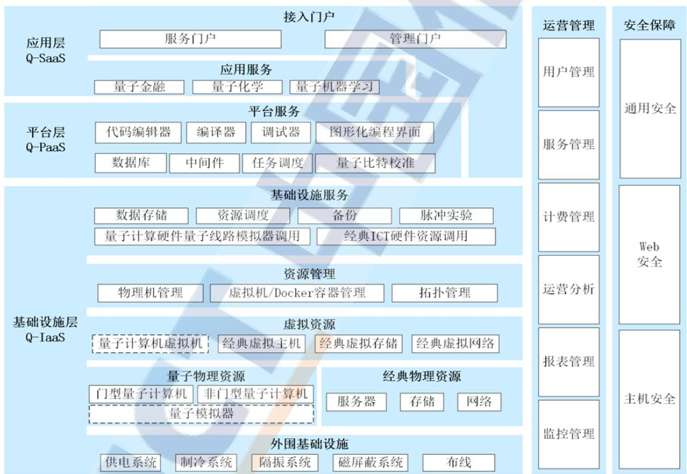

flowchart

```mermaid
graph TD
    A["应用层 Q-SaaS"] --> B["接入门户"]
    B --> C["服务门户"]
    B --> D["管理门户"]
    A --> E["应用服务"]
    E --> F["量子金融"]
    E --> G["量子化学"]
    E --> H["量子机器学习"]
    A --> I["平台服务"]
    I --> J["代码编辑器"]
    I --> K["编译器"]
    I --> L["调试器"]
    I --> M["图形化编程界面"]
    I --> N["数据库"]
    I --> O["中间件"]
    I --> P["任务调度"]
    I --> Q["量子比特校准"]
    A --> R["基础设施服务"]
    R --> S["数据存储"]
    R --> T["资源调度"]
    R --> U["备份"]
    R --> V["脉冲实验"]
    R --> W["量子计算硬件量子线路模拟器调用"]
    R --> X["经典ICT硬件资源调用"]
    A --> Y["资源管理"]
    Y --> Z["物理机管理"]
    Y --> AA["虚拟机/Docker容器管理"]
    Y --> AB["拓扑管理"]
    A --> AC["虚拟资源"]
    AC --> AD["量子计算机虚拟机"]
    AC --> AE["经典虚拟主机"]
    AC --> AF["经典虚拟存储"]
    AC --> AG["经典虚拟网络"]
    A --> AH["外观资源"]
    AH --> AI["门型量子计算机"]
    AH --> AJ["非门型量子计算机"]
    AH --> AK["量子模拟器"]
    AH --> AL["服务器"]
    AH --> AM["存储"]
    AH --> AN["网络"]
    A --> AO["外围基础设施"]
    AO --> AP["供电系统"]
    AO --> AQ["制冷系统"]
    AO --> AR["隔振系统"]
    AO --> AS["磁屏蔽系统"]
    AO --> AT["布线"]
    
    B --> AU["运营管理"]
    AU --> AU1["用户管理"]
    AU --> AU2["服务管理"]
    AU --> AU3["计费管理"]
    AU --> AU4["运营分析"]
    AU --> AU5["报表管理"]
    AU --> AU6["监控管理"]
    
    A --> AV["安全保障"]
    
    A --> AW["通用安全"]
    
    A --> AX["Web 安全"]
    
    A --> AY["主机安全"]
```

来源：中国信息通信研究院

图10量子计算云平台功能架构参考模型

量子计算云平台的应用层主要由接入门户和应用服务等功能模块组成。接入门户层提供用户接口（UI）。用户可以通过 UI 界面访问量子云服务，输入必要的参数和数据，并获取返回结果。目前，用户使用量子计算云平台的方式可分为两类，一类是本地编译、通过应用程序编程接口（API）访问云平台，另一类是直接在云平台上进行开发实践。接入门户功能又可以细分为服务门户和管理门户。应用服务层既可提供拥有图形用户接口（GUI）的量子应用，也可提供算法 API 以及软件开发工具包（SDK）允许用户根据自身需求或特殊应用场景自行开发量子应用。

平台层主要由平台服务功能模块组成。平台服务功能主要包括图形化/代码编程开发、程序编译、程序调试、任务调度、量子比特校准等功能，同时也提供数据库、中间件等必要的经典云平台功能。目前量子计算云平台提供的编程开发方式主要有两种，一种是通过IDE、低代码或无代码等提供可视化、图形化、可拖拽等配置方式进行量子线路创建和运行，运行结果展示。另一种是通过编程语言实现量子线路创建和运行，支持运行结果返回和查询。由于目前量子计算硬件性能尚不稳定，需要定期进行校准，平台层可提供在线或离线方式的比特校准功能，可通过手动或自动形式完成。

基础设施层向云服务用户提供量子计算基础资源，云服务用户在其上部署和运行任意的应用程序。基础设施服务子层可独立为用户提供基于量子计算硬件的服务，如硬件调用、租赁等，也可实现平台层与底层硬件的桥接。资源管理子层为管理员提供资源的新增、统一纳管、信息修改、虚拟化/容器化、删除等全生命周期管理功能。物理资源功能子层是量子计算云平台的核心，提供量子算力和经典算力，此外还需提供必要的经典物理资源，如服务器、存储器、网络设备等。虚拟资源子层将云平台上分布式的物理资源进行虚拟化或容器化，形成资源池，按需动态分配给用户，并保证虚拟机或容器之间的隔离。由于量子计算机硬件尚不成熟，分布式和虚拟化等解决方案尚不具备。外围设施子层为量子计算硬件正常运行提供支撑保障，不同硬件路线对环境保障系统要求有较大差异。

运营管理功能主要由用户管理、服务管理、计费管理、运营管理、报表管理和监测管理等功能模块组成。

安全保障功能主要实现通用安全、主机安全和 Web 安全等功能。其中，用户认证、授权管理、安全审计、经典服务器防护与加固、网络安全等功能可以借鉴经典云计算平台相关能力。

# （三）量子计算云平台的服务和业务模式逐步完善

量子计算云平台具有网络连接、资源共享、弹性且按需服务、服务可测量等特点。按照云平台服务提供资源所在的层次，可分为量子基础设施即服务（Q-IaaS）、量子平台即服务（Q-PaaS）和量子软件即服务（Q-SaaS）三类，如图11所示。

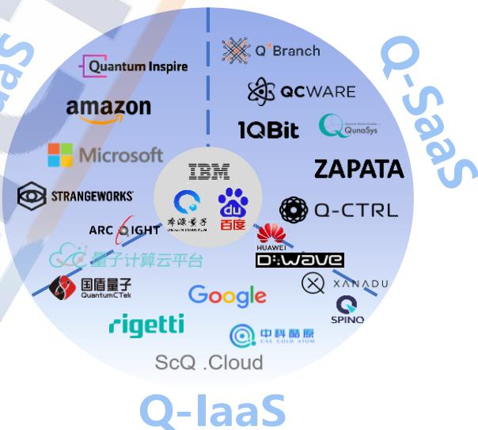

text_image

Quantum Inspire
Q Branch
aqware
1QBit
QunaSys
Strangeworks®
ARC RIGHT
量子计算云平台
国盾量子
QuantumCTek
Google
rigetti
ScQ .Cloud
IBM
百度
ZAPATA
Q-CTRL
HUAWEI
D:Wave
XANADU
SPINO
中科酷原
C4S COLD AGM
Q-IaaS

来源：中国信息通信研究院

图11量子计算云平台三大服务模式

Q-IaaS 将量子计算机硬件及配套设施作为服务在量子计算云平台上提供给用户。用户可调用云平台上的硬件（量子计算机、量子计算模拟器、经典服务器、存储器等）而无需对其进行维护，实现低成本的开发应用。

Q-PaaS 将量子计算相关基础设施和中间件组成的开发平台作为服务在云平台上提供给用户。用户可基于量子计算软件开发平台开发量子编程框架和量子算法库，并通过云服务器连接至不同公司量子计算硬件进行计算。

Q-SaaS 根据特定行业应用场景和应用需求将打包好的应用服务方案作为服务在量子计算云平台上提供给用户。用户可以直接调用量子算力来解决特定领域的实际计算问题，无需全面掌握量子软硬件知识和量子算法等编程能力。

近年来，亚马逊、微软、Strangeworks等欧美量子计算云服务商逐步探索 Q-PaaS 服务模式，提供统一的接入方式和开发平台，调用多公司的量子计算硬件后端。国内大部分云平台介于 Q-IaaS 和 Q-PaaS 之间，可提供基本的量子硬件接入和初级的量子线路编辑、运行等功能，部分平台可提供相对完整的开发环境和算法库。此外，以 IBM、百度、本源量子为代表的量子计算云提供商建立全栈式量子计算云服务，从上层应用软件，到中间开发平台，再到底层硬件后端，用户可根据自身需求完成量子计算研究与开发。

量子计算云平台后端硬件接入和提供方式也有不同合作模式。一类是云平台供应商自身具备量子计算硬件研发能力，将自研的量子计算机或基于经典算力的量子线路模拟器置于云端，典型企业包括 IonQ、Xanadu、Rigetti、本源量子等。另一类是云平台企业凭借其云计算技术与资源，使其云平台可接入其他公司的硬件或软件，典型企业包括微软、亚马逊、Strangeworks 等。此外，部分云平台在接入自研硬件的同时，也支持其他公司硬件资源的调用，如 IBM 量子计算云平台除自研超导量子计算芯片，还可调用 AQT、IonQ 等公司硬件资源。国内百度量易伏平台连接自研的超导量子计算处理器，同时也为中科院物理所的超导量子计算处理器以及中科院精测院的离子阱量子计算处理器提供了云接入服务。

量子计算云平台业务已开始进入商业化探索阶段。计费模式包含即用即付型和按操作付费型两类。即用即付型也称为计时付费，用户按照接入云平台或量子硬件的时长进行计费。按操作付费型是根据基于某一确定后端计算任务的操作次数进行计费的收费模式。某些云平台也提供部分免费服务，即提供一定的免费次数或时长，或云平台中部分资源免费，但对高级功能和应用进行收费。当前以IBM、亚马逊为代表的科技巨头率先推出量子计算云平台的付费型服务模式，付费用户可以获得更高的接入权限和更好的服务体验。未来有望形成商业循环，进一步加强量子计算云平台的技术能力和生态影响力。相比而言，我国量子计算云平台目前尚未形成商业化运营和服务能力，在未来应用和产业生态竞争中可能落后。

# （四）云平台成为开展科研与应用探索的重要支撑

随着量子计算技术的不断发展，基于量子计算云平台开展算法研究和应用探索已经成为业界热点。全球多个研究机构和企业积极探索量子计算云平台的应用并取得初步成果。目前，基于量子计算云平台的应用探索主要面向基础科研和行业应用两个主要方向。

量子计算云平台辅助开展量子信息领域基础科研的有力工具。量子计算云平台提供了方便使用的量子计算资源，使得用户可在其上运行量子算法和量子模拟，有助于深入探究量子现象与性质，更高效地开展量子计算实验，探索量子计算的应用和潜力，为未来更广泛地应用量子计算奠定基础。2023 年，中科院物理所等团队基于Quafu 量子计算云平台实现了 10 比特的 Greenberger-Horne-Zeilinger纠缠态64。河北师范大学、中科院物理所等联合团队提出一种多测量环境下的广义状态依赖熵不确定关系65，并在 Quafu 量子计算云平台进行了实验验证。

此外，部分云平台支持基于量子硬件指令集的实验工具套件，用于产生、编辑、校准和调度任意脉冲波形的测控信号，可实现量子系统动力学、量子门误差分析、表征和缓释、芯片参数标定、门脉冲校准、基准测评等领域的理论和实验研究，逐渐成为量子硬件研究与开发的辅助工具之一 。目前 IBM 的 Qiskit、百度的 Quanlse 等平台支持开放脉冲级别的接口。脉冲级实验套件主要功能模块如图12 所示。用户通过可视化客户端、SDK 或云平台自带的基准测试、错误缓释等工具生成业务实例，标定、校准工具对业务实例进行转译、校准并发送给脉冲发生工具，最终转化为微波或光学脉冲信号序列作用于量子计算机，或将脉冲模型发送给量子线路模拟器，硬件层再将实验结果返回给用户。脉冲级实验套件是量子计算云平台一项特色服务，在硬件成熟之前具有重要应用价值。

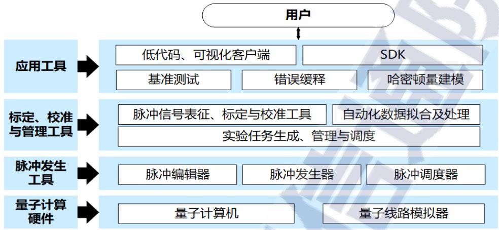

flowchart

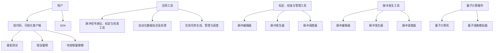

来源：中国信息通信研究院

图12量子计算云平台脉冲级实验套件功能

量子计算云平台在助力量子人工智能、量化金融、生物医药等领域应用探索方面也有重要价值。目前国内外众多量子计算云平台上均已提供大量的应用软件和接口，方便用户使用无代码或低代码的方式开展应用探索。

在人工智能领域，量子计算云平台允许用户进行机器学习、神经网络等算法的应用探索。IBM Quantum 平台上提供了量子人工智能、量子机器学习、量子卷积神经网络的封装函数和代码示例，可用于数据分类、手写识别以及数据回归等。华为 HiQ 云平台上则提供了量子神经网络分类器、自然语言处理等方面的代码示例。

在量化金融领域，量子计算云平台可提供金融数据分析、投资组合优化等实验。本源量子云平台上提供量子期权定价、期权策略收益期望应用、VaR 值应用、投资组合优化等模块，并与建信金科、中国民生银行等金融机构开展合作。百度量易伏云平台中的QFinance 可基于量子蒙特卡洛方法实现期权定价的计算。

在生物医药领域，量子计算云平台可提供分子模拟等服务，有望应用于基因组学、蛋白质组学等领域，为生物医药领域提供更高效准确的工具。日本 QunaSys 的 Qamuy 平台提供分子结构优化、分子动力学模拟、吸收/振动光谱计算等服务，并与 JSR、三菱化学等机构联合开展光化学反应等研究。华为 HiQ 云平台提供面向量子化学的量子变分求解器。本源量子ChemiQ平台提供计算分子能量和结构、计算化学反应、模拟势能曲线、模拟动力学轨迹等功能。

# 五、量子计算云平台标准和基准测评研究持续开展

# （一）国内外积极布局推动量子计算基准测评研究

基准测评通过设计科学的测试方法、工具和系统，对测试对象的性能指标进行定量和可对比。这种客观中立的评价方式已在计算机、人工智能、云计算等领域发挥了重要作用，量子计算基准测评对于表征硬件关键性能指标和评价系统能力有重要意义，也是分析量子计算技术产业发展水平的重要参考。

国内外研究机构和科技企业纷纷布局开展量子计算基准测评研究。美国能源部启动量子科学计算开放用户测试床（QSCOUT）并推出Testbed 1.0，建立了面向离子阱量子计算机的测试床。国防高级研究计划局宣布推出量子基准（Quantum Benchmarking）项目，研究开发量子计算测评指标用于多维度客观评估当前硬件研发与未来实用需求的差距。欧洲 12 家机构联合发起量子计算应用项目，旨在为NISQ应用程序提供一个完整的通用工具集。德国慕尼黑量子谷启动 Bench QC 项目66，重点研究应用驱动的量子计算性能基准。2023年，中国移动成立量子计算应用与评测实验室67，旨在研究设计新型量子算法并形成量子算法库，将为不同技术路线的量子计算机能力与不同量子算法性能提供基准评测。随着量子计算原型机研制、软件研发、应用探索和云平台服务的快速发展，基准测评工作已逐步成为业界各方的关注热点话题。

针对各类量子计算样机和量子计算云平台，开展基准测评技术研究与测试验证，是引导和促进样机工程化研发和应用推广的重要推动力量。量子计算云平台测评是对量子计算技术从硬件层到软件层再到应用层的全栈式检验。首先，通过测评可发现量子计算技术在实际应用中存在的能力差距问题，引导和推动量子计算硬件研发。测试评估结果也为量子计算技术攻关和改进优化提供了重要参考。其次，通过测评可以对云平台服务能力进行全面检测，从而获得其可靠性、可用性和稳定性等性能指标，为云平台改进和提升服务能力提供有力支持，助力提升用户对云平台的信任度，促进用户推广和发展。最后，开展测评可促进云平台标准化发展，通过制定统一的测评标准规范可确保不同平台间的兼容性和可扩展性，降低用户使用门槛，提高云平台易用性，推动行业健康发展。

# （二）构建量子计算云平台基准测评体系参考模型

构建量子计算云平台评价体系和测评基准，需要满足开放性、易用性、客观性、可复现性、科学性、系统性和可追溯性等原则，以确保测评结果的准确性和可靠性。

开放性是指测试的方法和指标是通用的，并可通过公开方式获取。用户还可根据自身需求在源代码的基础上进行修改或增强，适用于特定场景的测试评估。

易用性是指测试套件对于非量子计算专业人士，无需过多的调试与操作，同时测试结果尽可能直观，易于理解，例如采用通过率、正确率、评分等指标对量子计算机的性能进行评价。

客观性是指每一项测评指标和用例具有明确且公认的定义，且 测试结果不依赖于测试人员的主观判断，或将主观因素降到最低。

可复现性，亦称为可靠性，即测试结果不随时间、地点以及人员等因素的变化而变化。重复测试多次，结果误差在一定范围内。

科学性是指测评方法具有理论依据和可操作性，禁得起反复推敲，测试结果具有明确的现实意义。通过对结果的量化分析可定位问题或性能瓶颈。

系统性是指测评性能的指标尽可能完备，能够综合、全面地评估量子计算机的性能；同时边界清晰，每个测试例具有明确的测试目的和适用范围。系统性还包括基准测评方法的可扩展性。

可追溯性是指测试过程中全程留痕，数据归档，方便专业人员从中间数据结果中溯源问题。

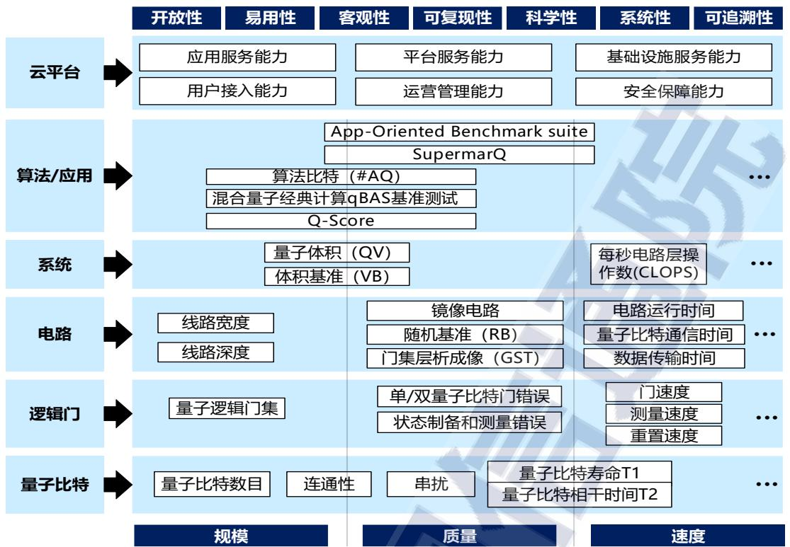

flowchart

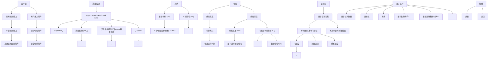

来源：中国信息通信研究院

图13量子计算云平台基准测评体系参考模型

量子计算云平台基准测评处于开放探索阶段，近年来业界提出多种表征指标与测试方法。 本报告梳理总结提出了量子计算云平台的基准测评体系的参考模型如图 13 所示。纵向维度关注云平台的硬件、软件、应用和云平台等不同层面。越靠近硬件层测评越反映量子计算机技术能力，测评指标有较好通用性，适合硬件开发者使用。越靠近应用层测评越能够对量子计算机执行特定任务能力进行综合评估，屏蔽底层硬件细节，适合行业用户或应用开发者使用。云平台层面的测评则是根据量子计算云平台的服务模式从应用服务能力、平台服务能力、基础设施服务能力以及提供云服务必需的用户接入功能、管理运维功能、安全保障功能等维度开展。横向维度从规模、质量、速度三方面划分。其中，规模反映了量子计算机的极限能力，质量反映了执行量子计算任务的准确性和可信度，速度反映了量子计算机单位时间可完成工作量，三者共同支撑量子计算能力评估。

# （三）开展测评实践验证，验证平台硬件实际能力

为有效评估量子计算云平台硬件发展水平，推动引导量子计算云平台技术、产业、服务良性发展，本报告基于基准测评体系框架开展了量子计算云平台的测评实践探索工作，对业界有代表性的量子计算云平台及其后端硬件开展初步测试验证。根据当前量子计算硬件发展现状、测评指标行业认可程度、可操作性等因素，本报告基于云接入的量子计算云平台硬件测试方法，开展了包括电路级、系统级和应用级等级别的测试实践，测试均基于统一的 QASM 测试电路集合，满足开放性、科学性、通用性和可复现性。表 6 展示了在量子计算云平台1和2上运行6个不同测试例的测评结果。

表 6量子计算云平台基准测评初步测试结果汇总

<table><tr><td rowspan="3" colspan="2">测试项</td><td>量子计算云平台1</td><td>量子计算云平台2</td></tr><tr><td>超导量子计算机1</td><td>超导量子计算机2</td></tr><tr><td>测试结果</td><td>测试结果</td></tr><tr><td rowspan="2">电路级</td><td>单比特RB</td><td>0.9948(q1比特结果)见图14(a)</td><td>0.9884(q0比特结果)见图14(b)</td></tr><tr><td>双比特RB</td><td>测试失败68(q1比特结果)见图15(a)</td><td>0.9542(q0比特结果)见图15(b)</td></tr><tr><td>系统级</td><td>QV</td><td>8(2^3)见图16(a)</td><td>8(2^3)见图16(b)</td></tr><tr><td rowspan="3">应用级</td><td>DJ算法</td><td>见图17(a)</td><td>见图17(b)</td></tr><tr><td>QFT算法</td><td>见图18(a)</td><td>见图18(b)</td></tr><tr><td>哈密顿量模拟算法</td><td>见图19(a)</td><td>见图19(b)</td></tr></table>

来源：中国信息通信研究院

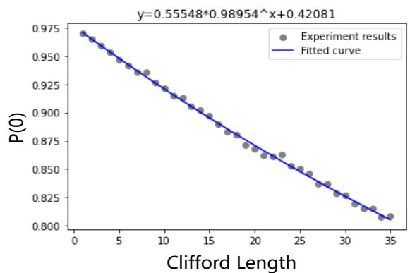

line

| Clifford Length | P(0)   |
| --------------- | ------ |
| 0               | 0.975  |
| 5               | 0.950  |
| 10              | 0.925  |
| 15              | 0.900  |
| 20              | 0.875  |
| 25              | 0.850  |
| 30              | 0.825  |
| 35              | 0.800  |

(a)量子计算云平台1结果 (Q1)

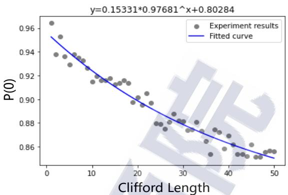

scatter

| Clifford Length | P(0)   |
| --------------- | ------ |
| 0               | 0.96   |
| 5               | 0.94   |
| 10              | 0.92   |
| 15              | 0.91   |
| 20              | 0.90   |
| 25              | 0.89   |
| 30              | 0.88   |
| 35              | 0.87   |
| 40              | 0.86   |
| 45              | 0.85   |
| 50              | 0.84   |

(b)量子计算云平台2结果（Q0)  
来源：中国信息通信研究院

图14单比特RB测试结果  
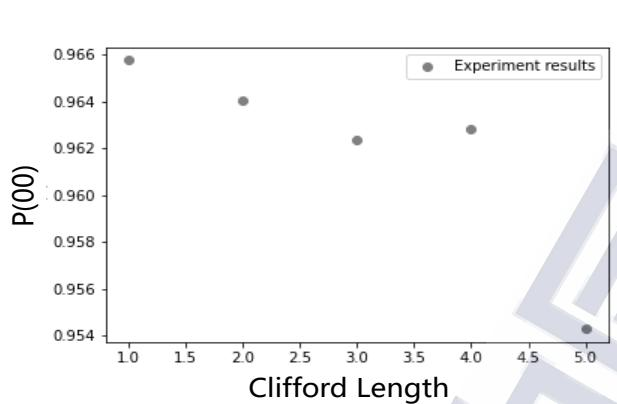

scatter

| Clifford Length | P(00)   |
| --------------- | ------- |
| 1.0             | 0.966   |
| 2.0             | 0.964   |
| 3.0             | 0.962   |
| 4.0             | 0.963   |
| 5.0             | 0.954   |

(a)量子计算云平台1结果 (Q1)

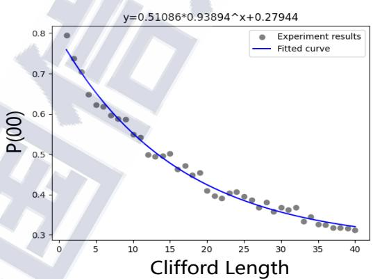

scatter

| Clifford Length | P(00) |
| --------------- | ----- |
| 0               | 0.8   |
| 5               | 0.7   |
| 10              | 0.6   |
| 15              | 0.5   |
| 20              | 0.45  |
| 25              | 0.4   |
| 30              | 0.35  |
| 35              | 0.33  |
| 40              | 0.32  |

(b)量子计算云平台2结果 (Q0)  
来源：中国信息通信研究院

图15双比特RB测试结果

电路级测试结果如图 14 和图 15 所示，单/双比特门保真度等参数实测值和标称值约有 0.3%\~3%的相对偏差，主要是由于目前量子芯片性能不稳定，参数随时间产生一定的波动。另外云平台上通常标称的是整机所有比特平均值或中位值，而同一芯片不同比特之间性能也可能存在一定差异，本报告仅对部分比特进行测试，实测值与标称值存在微小差异属于正常现象。

系统级测试的量子体积（QV）结果如图 16 所示，虽然两个云平台标称的量子比特数目均大于 3 个，但是执行量子体积电路后只能获得QV=8的结果，相当于仅能运行宽度和深度为3的方形电路。

可能有两方面原因：一是由于量子比特本身的保真度不高，当逻辑门序列长度增大时，结果保真度会呈现指数下降的趋势，当序列长度过大时其结果与理想输出结果的差异较大，无法满足重输出判定规则。二是QV基准对于比特连通性要求较高，运算过程中量子比特无法保证全连接时，可通过添加 SWAP 门等方式连接不相邻的比特，但增加逻辑门序列长度导致测试结果劣化。由于超导量子计算处理器中的量子比特只能与周边有限个量子比特连接（比如相邻的 2 个或4个），因此比特连通性会严重限制QV测试最终结果。

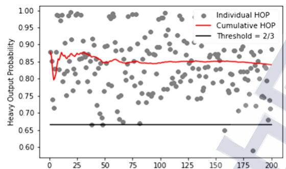

line

| x    | Heavy Output Probability |
| ---- | ------------------------ |
| 0    | 0.87                     |
| 25   | 0.86                     |
| 50   | 0.85                     |
| 75   | 0.84                     |
| 100  | 0.84                     |
| 125  | 0.84                     |
| 150  | 0.84                     |
| 175  | 0.84                     |
| 200  | 0.84                     |

(a)量子计算云平台1结果

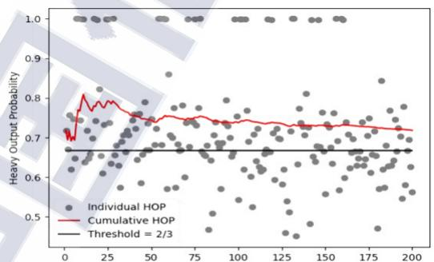

line

| x    | Individual HOP | Cumulative HOP | Threshold = 2/3 |
| ---- | --------------- | -------------- | ---------------- |
| 0    | 0.7             | 0.7            | 0.67             |
| 25   | 0.8             | 0.8            | 0.67             |
| 50   | 0.75            | 0.75           | 0.67             |
| 75   | 0.73            | 0.73           | 0.67             |
| 100  | 0.72            | 0.72           | 0.67             |
| 125  | 0.71            | 0.71           | 0.67             |
| 150  | 0.70            | 0.70           | 0.67             |
| 175  | 0.69            | 0.69           | 0.67             |
| 200  | 0.68            | 0.68           | 0.67             |

(b)量子计算云平台2结果  
来源：中国信息通信研究院

图 16 量子体积（QV）测试结果

应用级测试结果如图17至图19所示，本报告选择了几种典型应用算法作为测试基准，包括演示级算法、子程序级算法和功能级算法。演示级算法是指利用浅深度的量子线路实现简单功能，仅可解决部分抽象出来的特殊问题，一般不具有实用价值，如 DJ 算法等。子程序级算法是指大型功能性应用程序算法中的子程序或功能模块，如 QFT 算法等。功能级算法是指具有完成应用功能的复杂算法，如哈密顿量模拟算法等。Shor 算法、Grover 算法等均具有重要应用价值，但对于量子比特数目和保真度要求较高，现有硬件无法满足，因此本报告中暂不涉及，仅以哈密顿量模拟算法为代表的测试量子计算处理器运行功能级算法的能力。

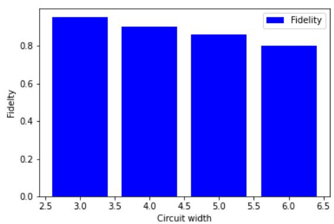

bar

| Circuit width | Fidelity |
| :--- | :--- |
| 3.0 | 0.92 |
| 4.0 | 0.88 |
| 5.0 | 0.85 |
| 6.0 | 0.80 |

(a)量子计算云平台1结果

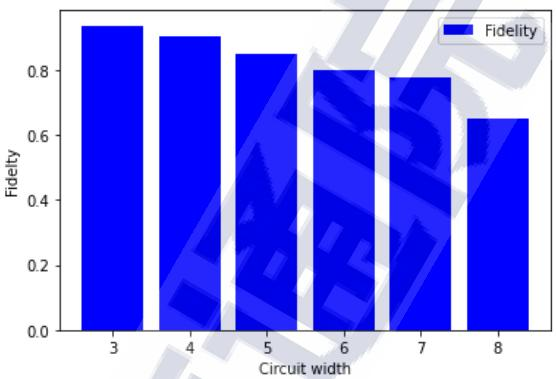

bar

| Circuit width | Fidelity |
| :--- | :--- |
| 3 | 0.92 |
| 4 | 0.90 |
| 5 | 0.85 |
| 6 | 0.81 |
| 7 | 0.79 |
| 8 | 0.65 |

(b)量子计算云平台2结果  
来源：中国信息通信研究院

图17DJ算法测试结果

演示级 DJ 算法测试结果如图 17 所示，由于线路深度较浅，运行结果可保持较高保真度，但随着量子线路宽度和深度的增加，结果保真度略有下降。当线路宽度达到 8 时，保真度小于 70%，由于DJ 算法的执行结果是选取概率最大的量子态，此保真度尚能满足算法需求。但是当线路宽度进一步增大，线路输出保真度低于 50%后，则有一定概率输出错误结果。

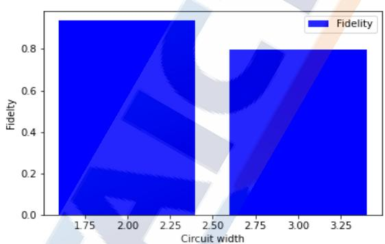

bar

| Circuit width | Fidelity |
| ------------- | -------- |
| 1.75          | 0.9      |
| 2.00          | 0.9      |
| 2.25          | 0.9      |
| 2.50          | 0.8      |
| 2.75          | 0.8      |
| 3.00          | 0.8      |
| 3.25          | 0.8      |

(a)量子计算云平台1结果

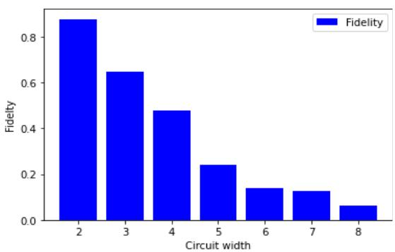

bar

| Circuit width | Fidelity |
| :--- | :--- |
| 2 | 0.88 |
| 3 | 0.65 |
| 4 | 0.48 |
| 5 | 0.24 |
| 6 | 0.14 |
| 7 | 0.13 |
| 8 | 0.06 |

(b)量子计算云平台2结果  
来源：中国信息通信研究院

图18QFT算法测试结果

子程序级QFT算法结果如图18所示，量子线路更为复杂，因此随着比特数的增加，结果保真度迅速下降，当量子比特数较大时已无法满足应用的需求。以Shor算法为例，演示整数15的分解就需要运行至少 8 比特的逆量子傅里叶变换（IQFT）电路，从测评结果来看此时结果保真度已经低于 10%，无法获得有价值的结果。随着待分解整数的增大，需要的量子比特数目和量子线路深度会进一步增加，对量子计算处理器硬件规模和质量提出更高要求。

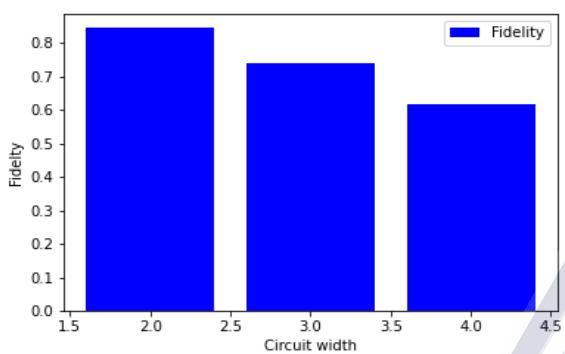

bar

| Circuit width | Fidelity |
| :--- | :--- |
| 1.5 - 2.0 | 0.84 |
| 2.0 - 2.5 | 0.74 |
| 3.0 - 3.5 | 0.62 |
| 4.0 - 4.5 | 0.62 |

(a)量子计算云平台1结果

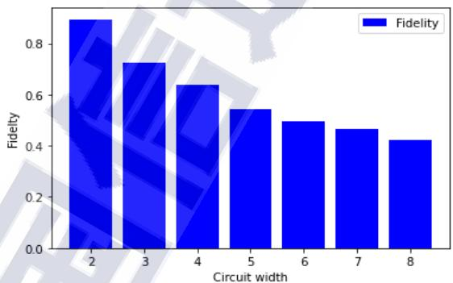

bar

| Circuit width | Fidelity |
| ------------- | -------- |
| 2             | 0.9      |
| 3             | 0.7      |
| 4             | 0.65     |
| 5             | 0.55     |
| 6             | 0.5      |
| 7             | 0.48     |
| 8             | 0.43     |

(b)量子计算云平台2结果  
来源：中国信息通信研究院

图19哈密顿量模拟算法测试结果

功能级哈密顿模拟算法测试结果如图 19 所示，由于哈密顿量模拟算法原理特殊性，量子线路复杂性随比特数目的增加变化不大，因此结果保真度的下降趋势相对缓和，这也是哈密顿量模拟算法被视为当前硬件条件下比较有应用前景的算法的原因。但可以看出当量子比特数增加到 8 个时，结果保真度已下降至 40%左右。然而以化学模拟为例，对于真实的多电子体系的计算化学求解问题，其哈密 顿 量 的 参 数 空 间 为 $C = { \binom { m } { n } } \left[ { \binom { m } { n } } + 1 \right] / 2$ ， 计 算 复 杂 度 约 为$O ( m ^ { 2 n } )$ ，其中 m 为基函数数目，n 为电子数目。可见如要解决计算实际化学问题，当前量子计算云平台提供的硬件在规模和质量上尚难以满足要求。

此外，测试发现部分量子计算云平台对可运行的量子线路深度严格限制，超过门限深度的线路运行会报错。一方面，由于当前硬件性能有限，执行过深的量子线路的返回结果保真度很低，从应用角度看意义不大，限制线路深度可保证用户获得有效的运行结果。但另一方面，对于研究性质的任务（例如研究量子比特保真度对特定应用算法的影响），用户希望获得极限情况下的真实运行结果，人为设定量子线路深度上限将限制用户使用 。

根据上述测试结果可以看出，现阶段我国量子计算云平台处于发展起步阶段，所提供的量子计算硬件能力较为初级，在执行较为复杂的电路时，输出结果保真度下降较快，难以满足算法可靠性的要求。量子计算处理器是量子计算云平台的核心组件，硬件水平是制约着量子计算云平台应用推广的关键瓶颈，未来需要持续研发攻关，提升量子计算硬件的关键性能指标。

# （四）量子计算云平台标准体系建设需进一步推动

量子计算技术研究、样机研制和应用探索正在加速发展，相关技术标准研究和讨论在国内外广泛开展。ISO/IEC、ITU-T、IEEE 等国际性标准组织，以及全国量子计算和测量标准化委员会（TC578）等国内标准化组织，均积极开展量子计算标准化工作布局和标准预研等工作。目前主要关注和研究量子计算相关概念术语和定义，提出量子计算的性能评价的准则和方法等方面。

国际标准化组织（ISO）和国际电工委员会（IEC）第一联合技术委员会（ISO/IEC JTC 1）成立 WG14 量子计算工作组，开展量子计算领域标准研究工作，由我国牵头提出的《信息技术 量子计算 术语和词汇》国际标准提案在 ISO/ IEC JTC 1成功立项，编制量子计算简介技术报告，并在量子计算服务平台框架、量子机器学习数据集、量子模拟器等方面提出预研项目。国际电子电气工程师协会（IEEE）有 10 个工作项目在进行量子计算领域的标准化研究。重点关注澄清概念、定义术语、识别标准化需求并提供性能指标和基准，以及量子计算机和量子模拟器的功能架构、算法开发设计和计算能效测试等方面内容。

全国量子计算与测量标准化技术委员会（TC578）于 2023 年 5月发布量子计算领域首个国家标准《量子计算术语和定义》，规范量子计算通用基础、硬件、软件及应用方面相关术语和定义，为量子计算发展提供指导。近期，进一步推动了量子计算基准测评、云平台功能框架和性能指标测试方法等相关标准立项和研究工作。

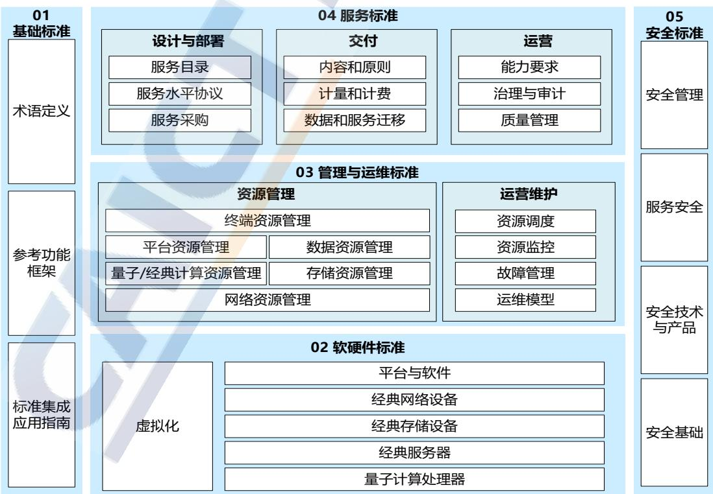

flowchart

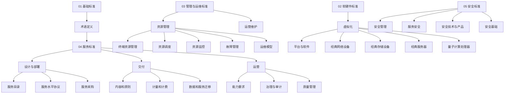

来源：中国信息通信研究院

# 图20量子计算云平台标准体系架构

量子计算云平台目前处于发展起步阶段，相关标准化研究工作相对空白，量子云服务的多样性以及量子计算硬件平台的异构性为不同软硬件之间以及云平台之间的互操作带来了巨大的挑战。根据量子计算云平台体系架构和国内外技术产业生态发展现状，并参考经典云计算的标准体系架构，本报告提出量子计算云平台标准体系架构的初步建议，如图 20 所示。其中，基础标准统一量子计算云平台及相关概念，为其他各部分的标准制定提供支撑。软硬件标准是标准体系架构中的核心部分，规范和引导量子计算云平台中的关键软硬件产品研发，硬件主要包括量子计算处理器、经典服务器、经典存储器、经典网络以及提供和使用云服务的终端设备等，软件主要包括云平台软件和应用服务软件等。为实现软硬件的一致性和互操作性，需要对软硬件的性能、功能、接口及测评等方面进行规范。管理运维标准规范量子/经典计算、存储、网络等资源管理与使用，主要涉及各类资源的管理、调度、监控，以及故障管理等。服务标准规范量子计算计算云平台在提供云服务过程中的各个环节，涉及各类云服务和面向量子计算云平台建设运营的云支撑服务。安全标准是实现量子计算云平台安全的重要保障，主要涉及接入安全、数据安全、用户隐私保护、物理机/虚拟机安全、恶意攻击防范等方面，也是影响量子计算云平台发展的关键因素之一。

鉴于量子计算硬件及云平台尚处于发展初期，建议优先开展量子计算云平台术语定义、功能框架、软硬件基准测评指标和方法、软硬件接口，以及基础的管理运维和安全类标准研究，服务类的标准可待云平台服务和商用模式明确后再开展。开展量子计算云平台标准体系建设，将有助于屏蔽技术差异，实现互联互通，推动量子计算云平台技术、产业和应用的健康发展。

# 六、机遇与挑战并存，多策并举加快量子计算发展

量子计算对未来数字经济产业升级，信息社会发展演进等领域将产生重要变革和驱动，成为全球科技竞争关注焦点之一。当前，量子计算优越性已得到验证，超导、离子阱、中性原子、光量子、硅半导体等技术体系并行发展，基础科研与工程实验成果不断涌现，各领域应用场景加速探索，产业生态逐步构建。国内外量子计算云平台加速发展，成为助力基础科研与应用探索，促进样机研发和应用推广的重要推动力量。量子计算已进入技术攻关、工程研发、应用探索和产业培育一体化推进的关键阶段，未来发展前景可期。

也应看到，量子计算仍有诸多技术工程和应用产业问题需突破。硬件研发方面，需要在研制更高性能量子计算原型机的同时，提升量子态制备、逻辑门操作和量子态测量等关键技术，开发量子纠错编码算法和硬件实现方案。应用探索方面，进一步开发解决实际应用问题的计算模型和量子算法，积极探索重点行业领域的应用场景。产业推进方面，发挥产业联盟、开源社区等平台的生态培育作用，加强企业和产业化培育，进一步推动供应链和生态建设。量子计算云平台方面，需要提升后端硬件性能，持续完善云平台功能和服务模式。基准测评方面，需要进一步完善性能指标体系与测评方法，构建量子计算基准测试验证平台能力。

同时，相比欧美而言，我国量子计算原型机工程化研发水平，供应链自主保障能力，企业界研发投入和创新驱动力，顶层规划设计与发展体制机制，产学研协同合作方式，重点行业领域应用探索和推广等方面，仍有一定差距，未来发展也面临不进则退、慢进亦退的风险。

未来，加快推动我国量子计算领域发展，需要产学研用各方多措并举，形成协同创新合力。一是持续稳定支持科研探索与研发攻关，加强顶层规划设计，掌握和突破量子计算核心技术，加强供应链安全保障能力建设，补齐支撑能力短板。二是加快重点行业领域应用探索，促进量子计算企业与行业企业开展合作研发，提升应用转化能力，建设国家级量子计算云平台，促进应用探索。三是加强产学研协同合作，依托产业联盟等平台加强各方合作，积极开展量子计算系统测试校准、基准测评等验证工作，助力硬件研发与云平台服务能力完善，支撑技术产业发展。

中国信息通信研究院 技术与标准研究所

地址：北京市海淀区花园北路 52号

邮编：100191

电话：010-62300383

传真：010-62304980

网址：www.caict.ac.cn

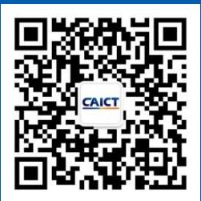

text_image

CAICT

