# Quantum Technology Monitor

June 2025

natural_image

Illustration of three glowing atomic energy storage tanks on a circuit board, symbolizing technology and energy integration (no text or symbols present)

# What can you find in this report?

An overview of the continuously evolving quantum technology (QT) market—including investments, competitive landscape, and economic activities— covering quantum computing (QC), quantum communication (QComm), and quantum sensing (QS); see page 4 for definitions of these areas

Overview of the maturity of the QT ecosystem and the use of QT in the broader industry context, based on current application of the technology and patent and publication activity

Definitive and exhaustive list of start-ups, investment, and economic activities in the QT space

# Sections of the Monitor

Technological innovations and breakthroughs in QT, including view on intellectual property (IP) and publications   
 Revised internal market size and value at stake   
Updated insights on the private and public investment landscape   
 QT innovation clusters and QC start-ups   
QC value chain, particularly on equipment and component manufacturers   
 Deep dive into QComm   
QT impact on cutting-edge technology, including AI and machine learning, robotics, sustainability and climate tech, and cryptography and cybersecurity

# Contents

natural_image

Abstract illustration of a blue 3D chip surrounded by circuit board patterns on a dark background (no text or symbols)

# Introduction

Innovations and breakthroughs

Market size and value at stake

Investment landscape

 Private funding   
 Public announcements

Clusters and start-ups

Value chain

Deep dive into QComm

QT impact on cutting-edge technologies

Methodology and acknowledgments

# Quantum technology encompasses the three subfields of computing, communication, and sensing.

# Quantum computing

A new computing paradigm leveraging the laws of quantum mechanics to provide significant performance improvement for certain applications and enable new territories of computing compared to existing classical computing

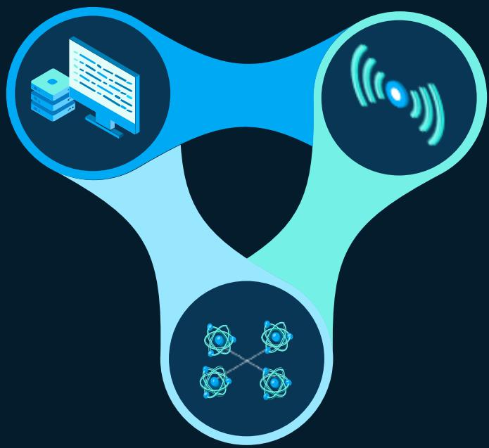

flowchart

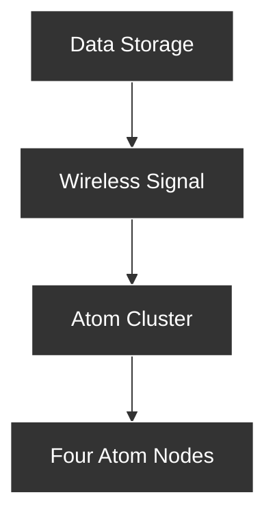
```mermaid
graph TD
    A["Data Storage"] --> B["Wireless Signal"]
    B --> C["Atom Cluster"]
    C --> D["Four Atom Nodes"]
    style A fill:#333,stroke:#fff,color:#fff
    style B fill:#333,stroke:#fff,color:#fff
    style C fill:#333,stroke:#fff,color:#fff
    style D fill:#333,stroke:#fff,color:#fff
```

# Quantum communication

The secure transfer of quantum information across distances and could ensure security of communication even in the face of unlimited (quantum) computing power1

# Quantum sensing

A new generation of sensors, based on quantum systems, that provide measurements of various quantities (eg, electromagnetic fields, gravity, time) and are orders of magnitude more sensitive than classical sensors

# A quantum computer leverages quantum mechanics, making it very powerful.

# Why is quantum computing so powerful?

It leverages the phenomena of quantum mechanics:

Superposition: The possibility of quantum systems to not be in a single defined state (left or right, up or down, etc)   
 Entanglement: The possibility of two or more (even physically separate) systems to form an inseparable combined state   
 Interference: The potential of quantum states to combine

# Which problems can a quantum computer solve?

. Linear algebra (machine learning and AI) for, eg, reduction of large data for better decisions, predictions, and automation   
 Simulation of quantum systems and processes—eg, molecular processes, material sciences, and life sciences   
 Mathematical optimization with algorithms that can enable near real-time optimization for, eg, financial modeling   
Factorization (security) of large numbers with exponential speedup—eg, to break mainstream encryption protocols

# What do potential use cases look like?

natural_image

Electric car charging at a station with illuminated charging port (no visible text or symbols)

# Automotive

Linear algebra for battery optimization: Efficiently predict the lifetime of batteries

natural_image

Close-up of laboratory vials containing colored liquids on a DNA double helix (no text or symbols visible)

# Pharma and chemicals

Simulation of molecules: Simulate molecular processes for drug discovery

natural_image

Person holding a pen and stacks of coins, symbolizing financial or investment (no text visible)

# Finance

Optimization of collaterals: Consider more collaterals and solve with higher accuracy

text_image

068852411808848999
877400251010087822
6468027516973246600
340020
340020
050
901130
25116
1265
602100
30108
60000
3039
110
217

# Security

Factorization: Use quantum random number generators to enhance security

# Key messages: Quantum Technology Monitor 2025

# Section

Innovation and breakthroughs

Market size and value at stake

Investment landscape

Clusters and start-ups

Value chain

Deep dive into QComm

QT impact on cutting-edge technologies

# Key messages

Breakthrough announcements in 2024 from tech players and start-ups show major advances in quantum control, specifically in error correction toward reliable and stable QC

QC companies began a shift toward revenue generation, earning an estimated \$650M–\$750M in 2024, and are expected to surpass \$1B by the end of 2025

Start-up investments in QT grew by \~50% YoY to \$2B in 2024, with public funding showing a significant increase (19 pp1) from 2023

Start-ups are increasingly consolidating into clusters, with emerging hubs in Asia and growing clusters in the US at state level

In 2024, most new start-ups emerged in components and application software, with a value shift moving from components toward application software

Q-Day will be a pivotal shift in security, requiring early adoption of QComm, with \~\$1B total market size in 2023 driving market growth at 22–25% CAGR

QT is a key enabler within the broader disruptive tech ecosystem, offering powerful synergies with other emerging innovations

# Innovation and breakthroughs: Breakthroughs in 2024 include major advances in error correction toward a new era of reliable QC.

# Key insights on breakthroughs

# Shift toward qubit stability

As scalability and reliability become central to quantum system development, quantum control is increasingly recognized as a strategic priority throughout the ecosystem—from hardware to software integration—ensuring stabilization and error mitigation

# Big announcements from key players

In 2024, tech natives—including Google, IBM, and Microsoft— continued to progress in quantum innovation, announcing breakthroughs in processor performance and scalability

# Focus on quantum error correction

Quantum error correction emerged as a central focus (eg, Atom Computing, Google, QuEra, and Riverlane), underscoring that effective error correction is no longer optional; it’s essential to ensure stability and accuracy using error-correction algorithms

natural_image

Illustration of digital finance and technology icons including a lightbulb, bank building, coins, and cloud (no text or symbols)

# Patents and scientific publications

Activity on granted QT patents rose J 13% YoY in 2024, with US leading on total number of QT patents granted

China leads in number of scientific publications (within physical sciences), with \~42% of total publications and a 7-pp increase in share of global publications from 2023 to 2024

# Quantum patent applications

# QComm

US has \~43% global patent applications, driven by the efforts of national labs (eg, NIST) and research institutes

# QS

US has \~45% o global patent applications, largely driven by defense and military priorities

# QC

China holds the global lead in QCspecific patent applications with \~32% of global patent filing activity, ahead of US at \~22%

# Market size and value at stake: QC companies began a shift toward revenue generation, earning an estimated \$650 million to \$750 million in 2024.

Quantum technology market size scenarios in 2035 and 2040   
Based on existing development road maps and assumed adoption curve 

<table><tr><td></td><td>QC</td><td>QComm</td><td>QS1</td></tr><tr><td>2035</td><td>$28B-$72B</td><td>$11B-$15B</td><td>$7B-$10B</td></tr><tr><td>2040</td><td>$45B-$131B</td><td>$24B-$36B</td><td>$18B-$31B</td></tr></table>

# Potential economic value2 from QC in 2035:

# \~\$0.9T–\$2.0T

Potential value driven by four industries by 2035: global energy and materials, pharmaceuticals and medical products, financial industry, and travel, transport, and logistics

Revenue estimates of QC companies, \$ million   
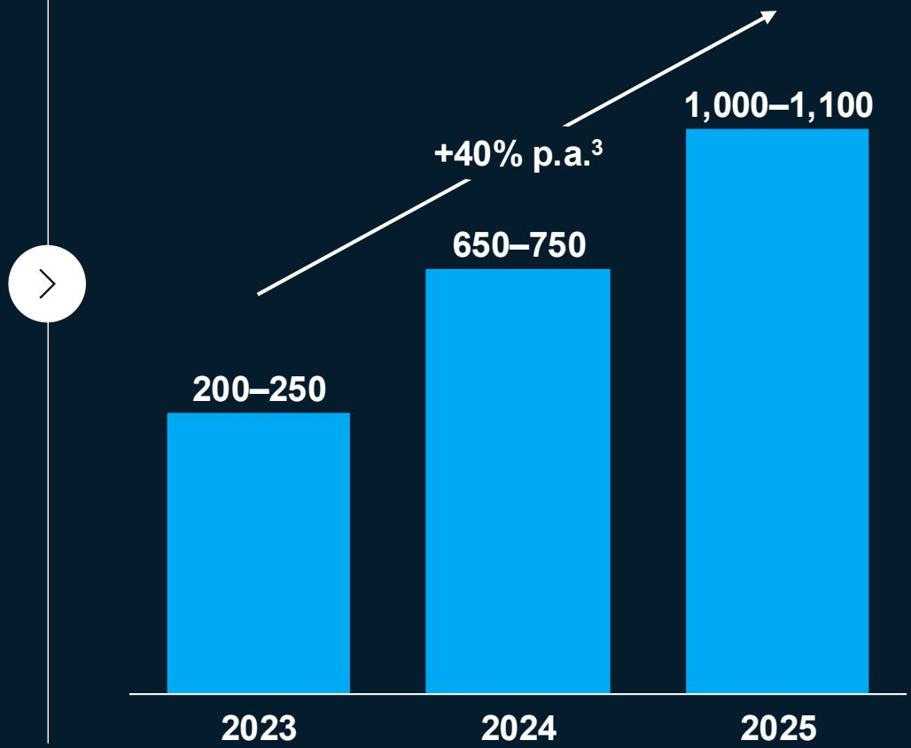

bar

| Year | Value |
| :--- | :--- |
| 2023 | 200-250 |
| 2024 | 650-750 |
| 2025 | 1,000-1,100 |
+40% p.a.³

# Investment landscape: Funding for QT start-ups in 2024 nearly doubled year over year, to \$2 billion.

Total investment,   
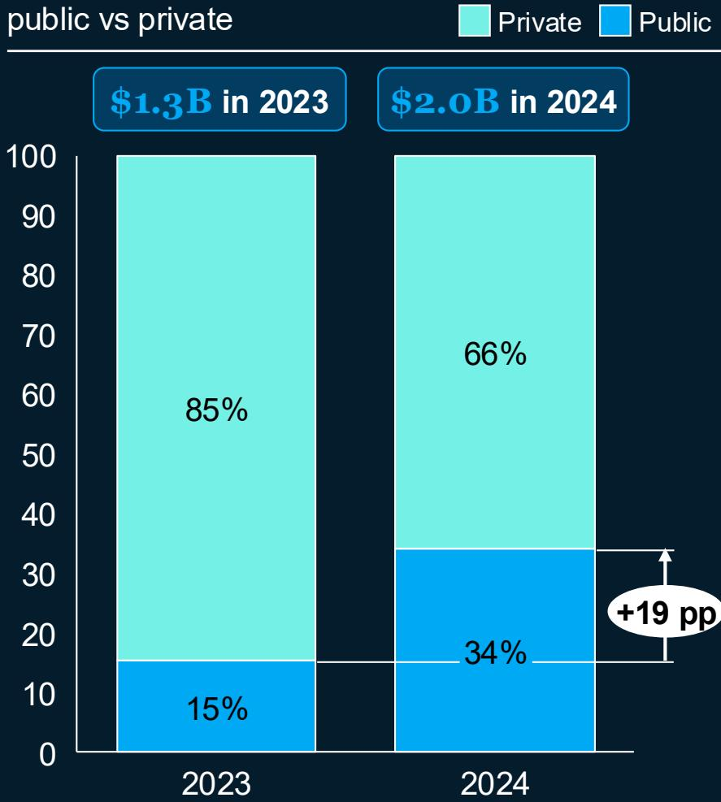

bar_stacked

| Year | Public (%) | Private (%) | Total ($B) |
| :--- | :--- | :--- | :--- |
| 2023 | 15 | 85 | 1.3 |
| 2024 | 34 | 66 | 2.0 |
+19 pp

# Total number of start-ups founded

+42% YoY

# Geographic factors driving start-up creation:

EU fragmentation: 8 of 19 newly founded quantum startups originated in the EU, reflecting the EU’s continuing push to start new companies rather than focusing only on mature start-ups

Asia accelerating: Asian countries are rapidly catching up (with 5 of 19 start-ups), driven by increased government support and strategic partnerships aimed at scaling quantum technologies

# Public announcements

Government announcements totaled \$1.8B in 2024, with early 2025 investments already exceeding \$10.0B—driven largely by Japan’s \$7.4B quantum investment—indicating a breakout year for the sector

# Funding breakdown

Quantum computing accounts for \~80% of total quantum investments, with superconducting technologies receiving the highest funding, followed by photonic networks

# Funding by start-up stage

Funding is shifting away from scaling quantum start-ups as investors focus on early innovation and mature start-ups (\~70% of total investment), driven by a desire to maximize return on innovation or reduce risk

# Clusters and start-ups: Start-ups are increasingly consolidating into clusters, with emerging hubs in Asia and growing clusters in the US.

Number of companies, end of 2023

Additional companies in 2024 Total number of companies

QC start-ups   
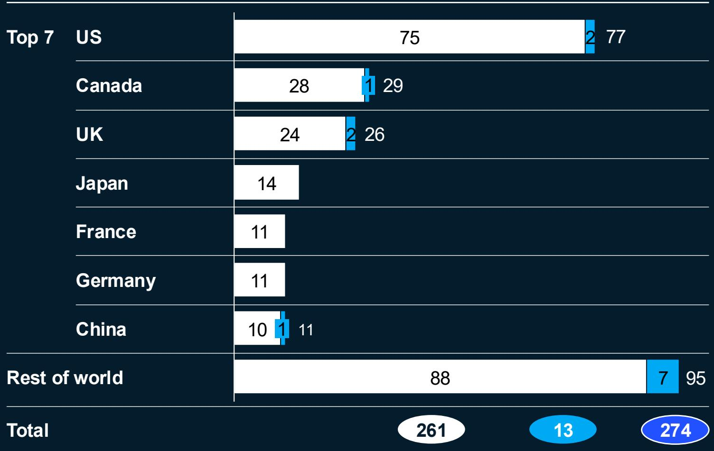

bar_stacked

| Category | Blue Segment | White Segment | Total |
| :--- | :--- | :--- | :--- |
| Top 7 US | 2 | 75 | 261 |
| Canada | 1 | 28 | 13 |
| UK | 2 | 24 | 274 |
| Japan | - | 14 | - |
| France | - | 11 | - |
| Germany | - | 11 | - |
| China | 1 | 10 | 261 |
| Rest of world | 7 | 88 | 274 |
Total

Emerging clusters

<table><tr><td>Tel Aviv</td><td>Tel Aviv hosts Israel&#x27;s leading academic institutions and start-ups, which focus on QT development across the tech stack</td></tr><tr><td>Seoul</td><td>Seoul hub connects local universities and research organizations with emerging start-ups and industry players</td></tr><tr><td>Abu Dhabi</td><td>Abu Dhabi is emerging as a QT hub, supported by institutions such as TII and Khalifa University, with a focus on AI and quantum innovations</td></tr></table>

# Established clusters

US quantum initiatives, including federal and state-level investments, have accelerated the emergence of key QT clusters:

Illinois committed \$500M in 2024 to support quantum infrastructure and partnerships   
Maryland launched an initiative in early 2025, aiming to catalyze over \$1B in public–private investments

# Value chain: Most new start-ups are emerging in equipment and components and application software.

Estimated market value captured per value chain segment   
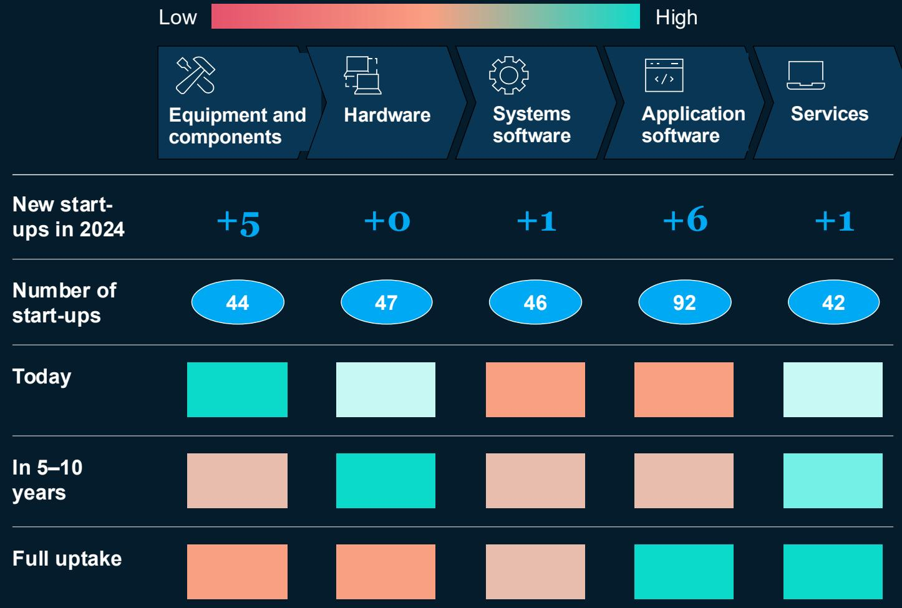

heatmap

| Category | New start-ups in 2024 | +5 | +0 | +1 | +6 | +1 |
| :--- | :--- | :--- | :--- | :--- | :--- | :--- |
| Equipment and components | Number of start-ups | 44 | 47 | 46 | 92 | 42 |
| Hardware | Today | | | | | |
| Systems software | Today | | | | | |
| Systems software | In 5–10 years | | | | | |
| Application software | Full uptake | | | | | |
| Application software | Full uptake | | | | | |
| Services | Full uptake | | | | | |
New start-ups in 2024: +5, +0, +1, +6, +1
Low: High
Medium: High
High: Low

# Key insights

In the hardware segment, big tech players (eg, AWS, Google, IBM, and Microsoft) are making substantial investments, underscoring both the segment’s foundational importance and the capital intensity it demands   
The equipment and components segment has the largest value today, but this is expected to shift toward application software and services over the next decade   
Equipment and components attract investment attention due to lower-risk opportunities, caused by the hardware player–agnostic nature of the segment   
Equipment and components and application software account for a majority of new start-ups in 2024 (11 of 13), indicating a focus from emerging companies

# QComm: Q-Day will introduce a pivotal shift in security, requiring early adoption of QComm and driving market growth.

# Q-Day definition

The point at which quantum computers can break classical encryption, exposing sensitive data and creating an urgent need for quantum-safe security measures

# Impact after Q-Day

Sensitive data using legacy encryption (including critical private information) becomes vulnerable, leading to potentially large economic and societal disruption

# Q-Day drivers

Primary Q-Day driver is innovation affecting system performance, significantly affected by funding, talent, player breakthroughs

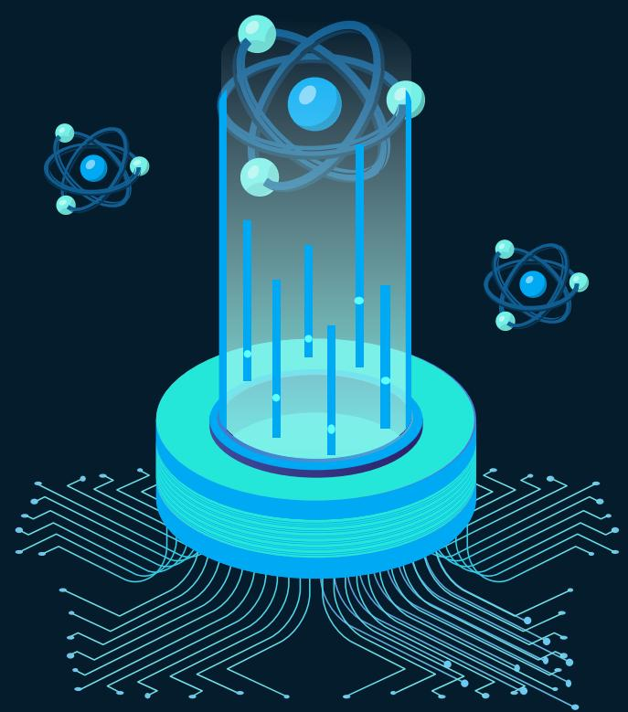

natural_image

Illustration of a futuristic AI concept with glowing spheres, circuit lines, and a central holographic structure (no text or symbols)

# Key insights

Q-Day could be a critical shift in security strategies, requiring early adoption and potential partnerships with early movers in QComm and networks

Total QComm market size was \~\$1.0B in 2023 and is projected to reach \$10.5B–\$14.9B by 2035 with a CAGR of 22–25%

Governments are expected to hold the largest customer share, at 62–66% as of 2023; private sector involvement is projected to grow rapidly

Source: Alice & Bob; Crunchbase; expert interviews; Google; Craig Gidney and Martin Ekerå, “How to factor 2048 bit RSA integers in 8 hours using 20 million noisy qubits,” Quantum, April 2021; IBM; literature review; Microsoft; PitchBook; press search; Quantinuum; Quantum Computing Report; QuEra; S&P Capital IQ; Gabriel Popkin, “The internet goes quantum,” Science, 2021, Volume 372, Number 6546; McKinsey analysis

# QT impact on cutting-edge technologies: QT is a key enabler within the broader disruptive tech ecosystem, offering powerful synergies.

Selected technologies based on McKinsey Technology Trends Outlook

Nonexhaustive

# AI and machine learning

Play a central role in accelerating quantum software and benefit significantly from the computational power quantum computers could offer

natural_image

Illustration of a human head silhouette with a brain inside, symbolizing mental or neural processes (no text or symbols present)

# Robotics

Drives automation in quantum manufacturing and potentially benefits from quantum technology through enhanced computing power, optimized software applications, secure communication and authentication, and improved navigation and sensing precision

natural_image

Illustration of a humanoid robot pointing forward (no text or symbols)

# Sustainability and climate tech

Demand energy-efficient and high-impact solutions, making them both beneficiaries and drivers of innovation in quantum technologies—with significant benefits from boosted computing power, algorithm optimization, and molecular simulation

natural_image

Illustration of renewable energy sources including wind turbines, solar panels, and a light bulb on an electric vehicle (no text or symbols)

# Cryptography and cybersecurity

Face both existential risks and transformative opportunities from quantum capabilities, making this a potential critical area of impact

natural_image

Blue isometric icon of a shield with a padlock symbol (no text or numbers)

# Contents

natural_image

Abstract illustration of a blue 3D chip surrounded by circuit board patterns on a dark background (no text or symbols)

# Introduction

# Innovations and breakthroughs

Market size and value at stake

Investment landscape

 Private funding   
 Public announcements

Clusters and start-ups

Value chain

Deep dive into QComm

QT impact on cutting-edge technologies

Methodology and acknowledgments

# Key players are reaching groundbreaking milestones, reshaping the QC ecosystem toward scalable logical qubits (1/3).

Selected QC announcements

Nonexhaustive

Photonic networks

Superconducting circuits

Spin qubits

Neutral atoms

Trapped ions

Topological qubits

<table><tr><td>Company</td><td>Innovation and claim</td><td>How it works</td><td>What it means</td><td> $Publication^1$ </td></tr><tr><td>GoogleLogical qubit</td><td>Demonstrated 1 logical qubit with a fidelity of ~99.86% (ie, 0.143% error) for a distance-7 surface code (a specific configuration of qubits used for quantum error correction), using 105 physical qubits</td><td>The Willow processor is a 105-qubit superconducting QC processor enabling logical qubits. By encoding logical qubits across increasingly large patches of physical qubits, it illustrates exponential suppression of error rates, a key prediction of quantum error-correction theory</td><td>Google showcases how the error rate can be suppressed exponentially as more physical qubits are added using error-correction algorithms, paving the way for logical qubit computations</td><td>“Quantum error correction below the surface code threshold”</td></tr><tr><td>AWSLogical qubit</td><td>Encoded 1 logical qubit in 5 physical cat qubits for data and 4 ancilla qubits for syndrome detection (ie, 9 physical qubits total), with a fidelity of ~98.35% (ie, ~1.65% error rate) for a distance-5 code, slightly better than a smaller distance-3 code (fidelity of ~98.25%, error rate of ~1.75%)</td><td>Superconducting quantum circuit combines bosonic cat qubits with ancillary transmons to create logical qubit memory, reducing the number of physical qubits required relative to more conventional superconducting (typically rely on large number of transmons for error correction) qubits and correcting cat-qubit phase-flip errors</td><td>AWS chip showcases how cat qubits can be combined with transmon qubits to achieve logical qubits with fewer physical qubits, potentially creating a more efficient way of producing quantum computing hardware</td><td>“Hardware-efficient quantum error correction using concatenated bosonic qubits”</td></tr><tr><td>IBMLogical qubit</td><td>Prepared logical “magic state” in 4 physical qubits (non-Clifford resource state) on a 27-qubit Falcon chip with fidelity above the breakeven point (ie, higher than a single physical qubit&#x27;s fidelity) using a distance-2 code</td><td>Superconducting quantum circuit is being prepared in so-called magic states (ie, states able to complete a universal set of logic gates)Preparing high-fidelity “magic states” is thus essential (in this case, better than for the individual physical qubits)</td><td>High-fidelity “magic states” are essential as they reduce the number of physical qubits required to produce large-scale quantum computing architectures</td><td>“Encoding a magic state with beyond break-even fidelity”</td></tr></table>

1. Publication name as published on ArXiv.

# Key players are reaching groundbreaking milestones, reshaping the QC ecosystem toward scalable logical qubits (2/3).

Selected QC announcements

Nonexhaustive

Photonic networks

Superconducting circuits

Spin qubits

Neutral atoms

Trapped ions

Topological qubits

# Company

# Microsoft

Topological qubit

# Innovation and claim

Claimed the world’s first quantum chip powered by a new topological core architecture that it expects to realize quantum computers capable of solving meaningful, industrial-scale problems in years, not decades

# How it works

The Majorana 1 chip employs nanowires arranged in a specific configuration, each hosting Majorana modes to potentially form a single qubit. These configurations can potentially be connected across the chip, allowing for a scalable and modular design

# What it means

The Majorana 1 chip aims to overcome the challenges of quantum decoherence and error correction that have hindered previous quantum computing efforts and paves the way to large-scale qubits

# Publication1

“Interferometric singleshot parity measurement in an InAs-Al hybrid device”

# QuEra

Logical qubit

Two high-fidelity logical qubits were demonstrated using a reconfigurable neutral atom array of up to 280 physical qubits, achieving improved gate performance by improving the surface code from distance-3 to distance-7 (specific configuration of qubits for quantum error correction)

This achievement was made possible through advancements in error-correction techniques and the development of innovative logical qubit architectures. By improving the fidelity, QuEra has demonstrated the feasibility of more accurate and reliable quantum computations

QuEra chip demonstrates a programmable quantum processor operating with up to 280 physical qubits, indicating neutral atom platform is scalable toward systems with large numbers of logical (physical) qubits

“Logical quantum processor based on reconfigurable atom arrays”

# Key players are reaching groundbreaking milestones, reshaping the QC ecosystem toward scalable logical qubits (3/3).

Selected QC announcements

Nonexhaustive

Photonic networks

Superconducting circuits

Spin qubits

Neutral atoms

Trapped ions

Topological qubits

<table><tr><td>Company</td><td>Innovation and claim</td><td>How it works</td><td>What it means</td><td> $Publication^1$ </td></tr><tr><td>PasqalLogical qubit</td><td>Developed hybrid quantum-classical algorithm that detects conical intersections—critical points where two potential energy surfaces of a molecule cross. These intersections are pivotal in photochemical processes such as vision and photosynthesis</td><td>Pasqal&#x27;s method uses the company&#x27;s quantum computer to detect conical intersections in molecules, key points where energy surfaces cross and chemical reactions often happen. The algorithm works by using a quantum circuit to track how the molecule&#x27;s quantum state changes</td><td>Pasqal&#x27;s method provides a practical quantum algorithm for identifying critical features in molecular systems, paving the way for more efficient simulations of complex chemical processes.</td><td>“A hybrid quantum algorithm to detect conical intersections”</td></tr><tr><td>QuantinuumPost-selection</td><td>Fault-tolerant teleportation of 1 logical qubit with a logical process fidelity of 97.5% encoded with 7 data and 3 ancilla qubits (out of a 30-ion device), using the Steane code</td><td>Trapped ion qubits (mix of data and ancilla qubits) are used for fault-tolerant teleportation of logical qubits (however, no logical gate operations conducted)</td><td>The system showcases fault-tolerant teleportation for trapped ions, as teleportation enables reliable information transfer and entanglement distribution across qubits, critical for scalable QC</td><td>“High-fidelity and fault-tolerant teleportation of a logical qubit using transversal gates and lattice surgery on a trapped-ion quantum computer”</td></tr><tr><td>Atom ComputingLogical qubit</td><td>24-qubit logical entangled state encoded in 48 qubits on a 256-atom neutral-array processor ran a 28-logical-qubit Bernstein-Vazirani algorithm with error rates better than using 28 physical qubits (ie, showcasing error suppression) using a distance-2 code</td><td>Neutral atom quantum processor consisting of 256 Ytterbium atoms leveraged to encode a 24-qubit logical entangled state and showcasing error suppressionSurface-2 codes used provide a proof of concept, showcasing how logical states can be error suppressed</td><td>Array of neutral atoms showcases error suppression (despite small error codes), illustrating how neutral atoms can be a promising modality toward logical qubits</td><td>“Logical computation demonstrated with a neutral atom quantum processor”</td></tr></table>

1. Publication name as published on ArXiv.

# Leading quantum computing companies have road maps toward scalable universal QC.

Nonexhaustive

Technology

Qubit description

Physical qubit count1

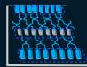

Photonic networks

Occupation of a photonic waveguide

216

Xanadu

Superconducting (SC) circuits

Difference in energy states of Cooper pairs between two sides of a Josephson tunnel junction

1.121

IBM

105

Google

84

Rigetti

64

Fujitsu

16

Alice & Bob

Spin qubits

Electron spins of different materials; eg, an electron trapped within a silicon quantum dot or a color center in an insulator, controlled by laser light or microwave radiation

12

Intel

Road maps selected based on available information; many players don’t publish planned qubit count

Neutral atoms

Internal energy levels of neutral atoms trapped by laser fields

256

QuEra

1.110

Pasqal

1.180

Atom Computing

1.600

Infleqtion

Trapped ions

Internal energy levels of ions trapped by electromagnetic fields

36

IonQ

56

Quantinuum

20

Alpine Quantum Technologies

Example road map1

Logical qubits

Physical qubits

IBM

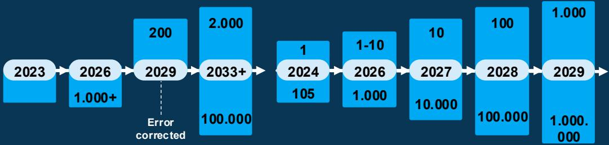

bar

| Year | Value |
| :--- | :--- |
| 2023 | 1.000 |
| 2026 | 1.000+ |
| 2029 | 200 |
| 2033+ | 2.000 |
| Error corrected | - |
| 2024 | 1.05 |
| 2026 | 1-10 |
| 2026 | 1.000 |
| 2027 | 10 |
| 2027 | 10.000 |
| 2028 | 100 |
| 2028 | 100.000 |
| 2029 | 1.000 |
| 2029 | 1.000.000 |

Google

QuEra

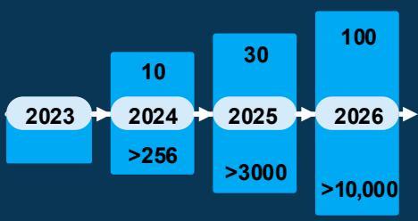

bar

| Year | Value |
| :--- | :--- |
| 2023 | 10 |
| 2024 | >256 |
| 2025 | >3000 |
| 2026 | >10,000 |
| 2027 | 100 |

IonQ

bar

| Year | Value |
|---|---|
| 2024 | 36 |
| 2025 | 64 |
| 2026 | 256 |
| 2027 | 384 |
| 2028 | 1024 |

Road map consisting of algorithmic qubits, not 1–1 comparable to logic qubits

# Quantum control plays a key role in advancing quantum modalities and overcoming their challenges.

Nonexhaustive 

<table><tr><td>Qubit modality</td><td>Photonic networks</td><td>Superconducting (SC) circuits</td><td>Spin qubits</td><td>Neutral atoms</td><td>Trapped ions</td></tr><tr><td>Challenges of modality in control and readout</td><td>Manipulation of light paths, polarization, and phaseDetection of single photons</td><td>Creation of microwave pulses used for control and readoutIntegration of control electronics inside cryostat to meet performance demands</td><td>Creation of microwave pulses used to induce coherent rotations of the spin states in silicon (often enhanced by voltage-controlled nanomagnets that create localized magnetic fields)</td><td>Manipulation and trapping of atoms using focused laser beams (optical tweezers)Capturing emitted light from atoms with camera for readout</td><td>Manipulation of ions through microwave control, using waveguidesDrive qubits through photonic control using lasers</td></tr><tr><td>Cryogenic control</td><td>Not required</td><td>Required</td><td>Required</td><td>Some solutions</td><td>Some solutions</td></tr><tr><td>Technology-specific control challenges</td><td>Develop scalable high-precision laser systems while minimizing the use of active components</td><td>Build a scalable control architecture and improve calibration methods (eg, move from wiring to single flux quantum (SFQ) chip control)</td><td>Adapt SFQ chip control to spin qubits because they are smaller in size than superconducting (SC) qubits, and SFQ size matches the SC scale</td><td>Develop higher-powered lasers for individual qubit control, while also reducing photon loss</td><td>Optimize space in vacuum chamber as high number of individually controlled qubits must be placed here</td></tr></table>

Most specialized control vendors focus on superconducting and spin qubits, with plans to expand their offerings to other modalities in the near term

# Quantum control can combine three techniques across the tech stack to increase the robustness of qubits.

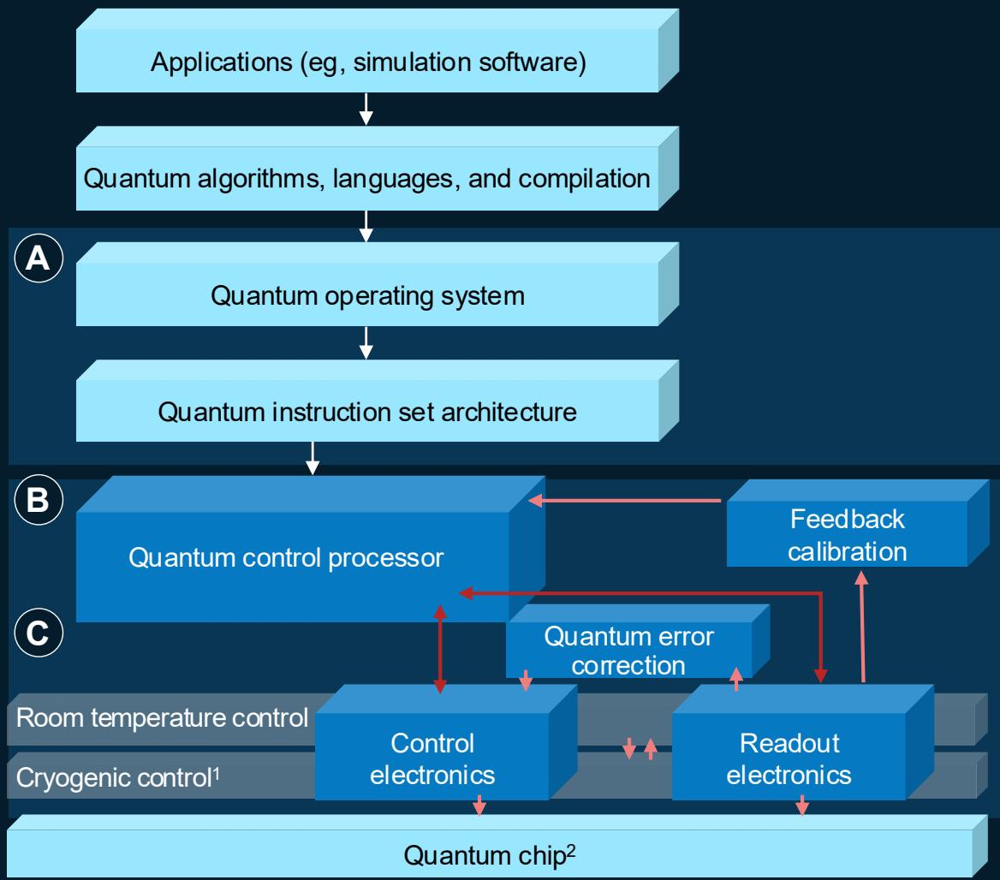

flowchart

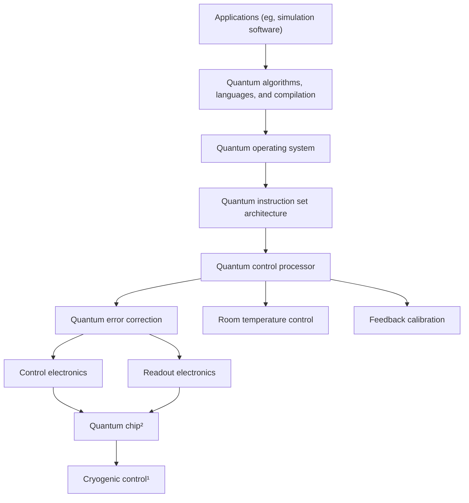
```mermaid
graph TD
    A["Applications (eg, simulation software)"] --> B["Quantum algorithms, languages, and compilation"]
    B --> C["Quantum operating system"]
    C --> D["Quantum instruction set architecture"]
    D --> E["Quantum control processor"]
    E --> F["Quantum error correction"]
    F --> G["Control electronics"]
    F --> H["Readout electronics"]
    G --> I["Quantum chip²"]
    H --> I
    I --> J["Cryogenic control¹"]
    E --> K["Room temperature control"]
    E --> L["Feedback calibration"]
```

1. Only relevant for superconducting and spin qubit technology.   
2. Some qubit technologies do not require a chip—eg, neutral-atom quantum control arranges qubits in array.

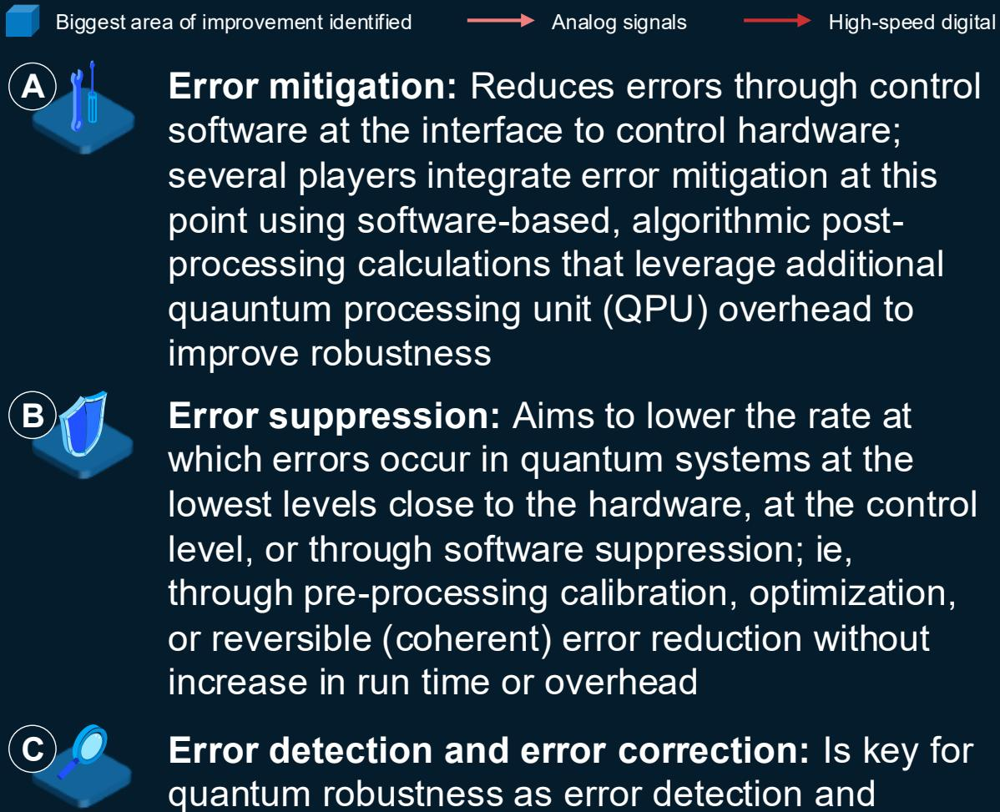  
Biggest area of improvement identified Analog signals High-speed digital

Error mitigation: Reduces errors through control software at the interface to control hardware; several players integrate error mitigation at this point using software-based, algorithmic postprocessing calculations that leverage additional quauntum processing unit (QPU) overhead to improve robustness

Error suppression: Aims to lower the rate at which errors occur in quantum systems at the lowest levels close to the hardware, at the control level, or through software suppression; ie, through pre-processing calibration, optimization, or reversible (coherent) error reduction without increase in run time or overhead

Error detection and error correction: Is key for quantum robustness as error detection and correction are two sides of the same coin enabled by redundancy of physical qubits (ancilla qubits) in defining logical qubits

# The path to fault-tolerant QC requires robustness to mitigate noise and enable effective error correction.

A set of solutions that can work together to reduce noise

Deep dive to follow

Quantum robustness could conquer noise and decoherence through the following: 

<table><tr><td></td><td>Technique</td><td>Timing</td><td>Overhead</td><td>Tech stack</td></tr><tr><td></td><td>Error suppression</td><td>Pre-processing</td><td>No overhead</td><td>Close to hardware</td></tr><tr><td>+</td><td></td><td></td><td></td><td></td></tr><tr><td></td><td>Error detection and error correction (QEC)</td><td>Real time</td><td>Qubit overhead</td><td>Middleware and hardware</td></tr><tr><td>+</td><td></td><td></td><td></td><td></td></tr><tr><td></td><td>Error mitigation</td><td>Post-processing</td><td>QPU overhead</td><td>Middleware and software</td></tr></table>

# Deep dive: Error-correction solutions can be evaluated across six key criteria to provide a holistic view of performance.

Criteria to assess quantum error-correction solutions

# Modality support

Compatibility of the error-correction method with different quantum hardware technologies, such as superconducting qubits, trapped ions, or photonic qubits

# Code distance

Measurement of the minimum number of physical qubit errors required to corrupt a logical qubit irreparably. Higher code distances indicate greater error resistance and stronger fault tolerance

# Architecture support

Alignment with specific qubit connectivity patterns, such as nearest-neighbor or more flexible connectivity, which affects the feasibility of implementing the method on certain quantum processor architectures

# Scaling of QEC

Criterion gauging how effectively the errorcorrection method can be expanded to larger quantum systems while maintaining manageable resource requirements and robust performance

# Qubit overhead

Evaluation of the number of physical qubits needed to represent a single logical qubit; higher overhead indicates more qubits are required to achieve fault tolerance, affecting scalability

# Advancement in recent years

Measurement of progress made in research, development, and implementation of the error-correction method, highlighting how far the solution has evolved toward practical deployment

# QS announcements revolve around industry use cases rather than academic breakthroughs, moving toward commercialization.

# Selected QS announcements

Nonexhaustive

<table><tr><td>Company</td><td>Innovation</td><td>How it works</td><td>What it means</td><td>Announcement1</td></tr><tr><td>NASA</td><td>Demonstrated an ultracool quantum sensor in space (onboard the International Space Station) for the first time</td><td>Using a quantum sensor capable of detecting weak electromagnetic signals</td><td>Enables space missions to use QT to, eg, track water on Earth, explore the composition of moons and other planets, or probe cosmic phenomena</td><td>“NASA demonstrates ‘ultra-cool’ quantum sensor for first time in space”</td></tr><tr><td>Q-CTRL</td><td>Overcame GPS denial through quantum navigation, outperforming traditional systems in areas with no GPS signal</td><td>Using quantum magnetometers and proprietary software for detection of small magnetic variations</td><td>Provides reliable navigation solutions in environments where GPS is unavailable</td><td>“Q-CTRL overcomes GPS-denial with quantum sensing, achieves quantum advantage”</td></tr><tr><td>SandboxAQ</td><td>Launched commercial real-time navigation system powered by AI and quantum sensing</td><td>Leveraging proprietary AI algorithms, powerful quantum sensors, and the Earth’s crustal magnetic field to create a geomagnetic navigation system</td><td>Provides an unjammable, all-weather, terrain-agnostic, real-time navigation solution in situations where GPS signals are unavailable or denied</td><td>“SandboxAQ announces AQNav—world’s first commercial real-time navigation system powered by AI and quantum to address GPS jamming”</td></tr><tr><td>Quantum Diamonds</td><td>Developed quantum device tailored to semiconductor chip failure analysis using diamond-based quantum microscopy</td><td>Leveraging diamond-based quantum microscopy to detect and localize faults in integrated circuits by extracting electrical current information across multiple layers</td><td>Addresses challenges in semiconductor fabrication, improving yields and accelerating production ramp-up</td><td>“Launch of the world’s first commercial quantum device for semiconductor failure analysis”</td></tr></table>

# Key insights

QS announcements are industry-driven and commercial, in contrast to, eg, academic breakthroughs in QC (often missing immediate commercial applications)   
QS commercialization is driven by maturity of the field as multiple use cases are already realized   
QS is spread across multiple industries and use case clusters; however, its adoption is expected to accelerate as QC and QComm mature and make progress toward commercialization

# IP analysis shows a 13 percent year-over-year increase in patent grants; US companies lead in QComm and QS patent applications.

# Key message

# A. Patents granted 1

The activity of patents granted increased in 2024 (13% YoY)

IBM and Google are leading on number of granted patents

US companies are leading patentgranted activity across QT with highest growth in QComm

# Analyses

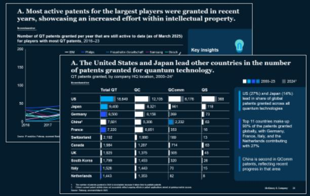

bar

A. Most active patents for the largest players were granted in recent years, showcasing an increased effort within intellectual property.
| Year | Country | Total QT | QC | QComm | QS |
|---|---|---|---|---|---|
| 2018 | US | 18,649 | 12,106 | 6,176 | 388 |
| 2018 | Japan | 9,400 | 4,321 | 441 | 119 |
| 2018 | Germany | 6,590 | 6,156 | 269 | 73 |
| 2018 | China¹ | 7,601 | 5,306 | 2,232 | 63 |
| 2018 | France | 7,220 | 6,651 | 353 | 16 |
| 2018 | Switzerland | 2,192 | 1,990 | 180 | 13 |
| 2018 | Canada | 1,984 | 1,267 | 714 | 63 |
| 2018 | UK | 1,923 | 1,375 | 505 | 45 |
| 2018 | South Korea | 1,799 | 1,493 | 320 | 28 |
| 2018 | Italy | 1,526 | 1,443 | 70 | 15 |
| 2018 | Netherlands | 1,443 | 1,303 | 82 | 8 |
Key Insights
A. The United States and Japan lead other countries in the number of patents granted for quantum technology.
QT patents granted by company HQ location, 2002-24†
US (27%) and Japan (14%) lead in share of global patents granted across all quantum technologies.
Top 11 countries make up 50% of patents granted globally, with Germany, France, Italy, and the Netherlands contributing with 23%
China is second in QComm patents, reflecting recent progress in that area.
Source: F:\mRNA\Fiction\sumit\data\2024*

# B. Patent applications 2

While US companies lead in overall QT patent applications, China leads in QC and consistently ranks second across overall QT

In QComm, US companies own 43% of patent applications

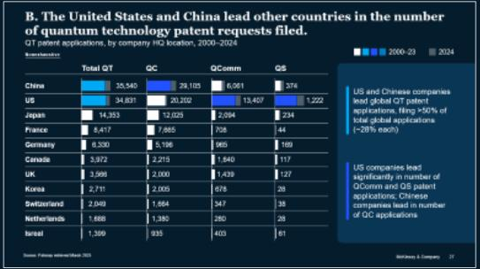

bar

B. The United States and China lead other countries in the number of quantum technology patent requests filed.
| Country | Total QT | QC | QComm | QS |
| :--- | :--- | :--- | :--- | :--- |
| China | 35,540 | 29,103 | 6,061 | 374 |
| US | 34,831 | 20,202 | 13,467 | 1,222 |
| Japan | 14,353 | 12,025 | 2,084 | 234 |
| France | 8,417 | 7,685 | 708 | 44 |
| Germany | 8,530 | 5,196 | 965 | 169 |
| Canada | 3,972 | 2,215 | 1,840 | 117 |
| UK | 1,998 | 2,000 | 1,439 | 127 |
| Korea | 2,711 | 2,005 | 978 | 28 |
| Switzerland | 2,049 | 1,664 | 347 | 38 |
| Netherlands | 1,668 | 1,380 | 280 | 28 |
| Israel | 1,360 | 935 | 403 | 61 |
Source: Tsing et al., March 2003; Netto & Company; US and Chinese companies lead global QT patent applications; filing >50% of total global applications (>28% each)
US companies lead significantly in number of Qcomm and US patent applications; Chinese companies lead in number of QC applications

# C. Publications

China leads in scientific publications with \~42% of the total and a 7-pp share of global publications from 2023 to 2024

US and EU relatively close (\~17% in 2024, \~20% in 2023) in terms of publications through 2023–24

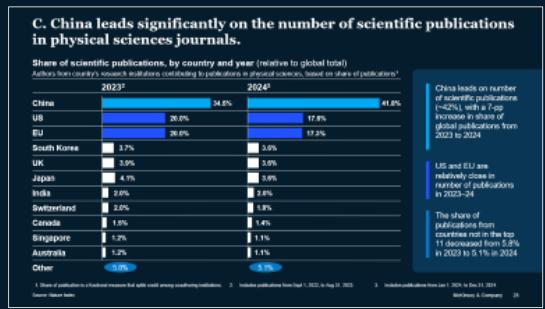

bar

| Country/Year | Share of scientific publications (2023) | Share of scientific publications (2024) |
| --- | --- | --- |
| China | 34.5% | 41.8% |
| US | 26.0% | 17.8% |
| EU | 26.0% | 17.2% |
| South Korea | 3.7% | 3.6% |
| UK | 3.6% | 3.6% |
| Japan | 4.1% | 3.9% |
| India | 2.6% | 2.8% |
| Switzerland | 2.0% | 1.9% |
| Canada | 1.6% | 1.4% |
| Singapore | 1.2% | 1.1% |
| Australia | 1.2% | 1.1% |
| Other | -5.9% | -4.1% |

# A. Most active patents for the largest players were granted in recent years, showcasing an increased effort within intellectual property.

Nonexhaustive

Number of QT patents granted per year that are still active to date (as of March 2025) for players with most QT patents, 2016–23   
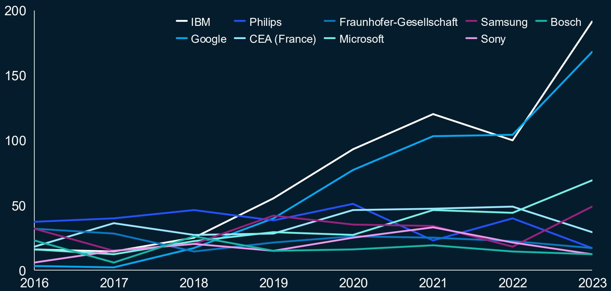

line

| Year | IBM  | Philips | Fraunhofer-Gesellschaft | Samsung | Bosch | Google | CEA (France) | Microsoft | Sony |
|------|------|---------|------------------------|---------|-------|--------|--------------|-----------|------|
| 2016 | 35   | 38      | 32                     | 34      | 25    | 5      | 20           | 18        | 8    |
| 2017 | 36   | 40      | 30                     | 15      | 5     | 5      | 35           | 15        | 12   |
| 2018 | 45   | 48      | 25                     | 25      | 15    | 15     | 30           | 25        | 18   |
| 2019 | 55   | 40      | 35                     | 40      | 15    | 45     | 30           | 30        | 15   |
| 2020 | 95   | 50      | 45                     | 35      | 18    | 75     | 48           | 30        | 25   |
| 2021 | 120  | 25      | 28                     | 35      | 20    | 105    | 48           | 48        | 35   |
| 2022 | 100  | 40      | 25                     | 18      | 15    | 105    | 50           | 45        | 20   |
| 2023 | 190  | 18      | 15                     | 50      | 12    | 170    | 30           | 70        | 15   |

# Key insights

 IBM and Google saw a significant increase in the number of patents granted in 2023, illustrating an increased effort in IP   
 Contrary to trend, CEA and Philips experienced the largest decrease in granted patents from a peak in 2022

# A. The United States and Japan lead other countries in the number of patents granted for quantum technology.

QT patents granted, by company HQ location, 2000–241

Nonexhaustive

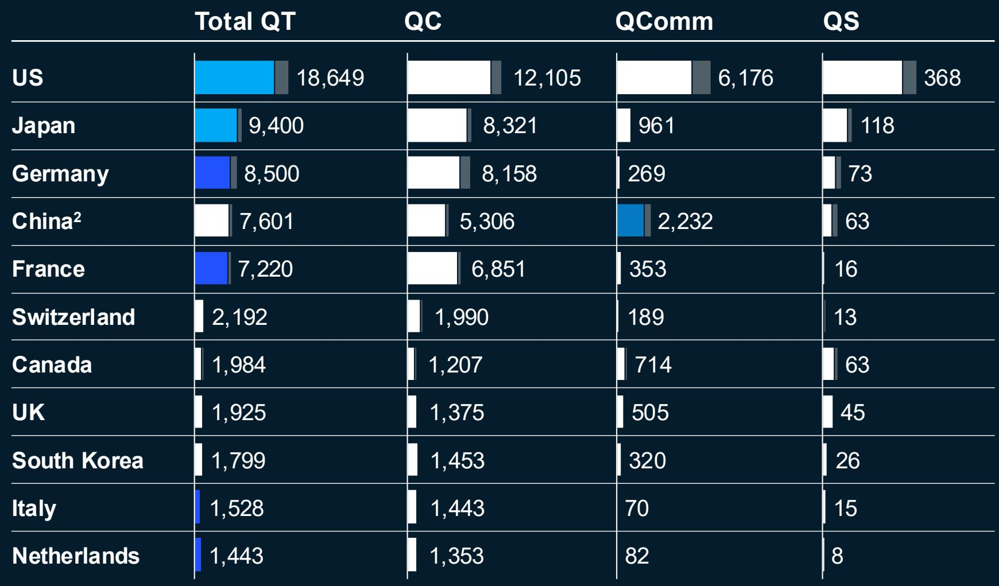

bar_stacked

| Country | Total QT | QC | QComm | QS |
| :--- | :--- | :--- | :--- | :--- |
| US | 18,649 | 12,105 | 6,176 | 368 |
| Japan | 9,400 | 8,321 | 961 | 118 |
| Germany | 8,500 | 8,158 | 269 | 73 |
| China² | 7,601 | 5,306 | 2,232 | 63 |
| France | 7,220 | 6,851 | 353 | 16 |
| Switzerland | 2,192 | 1,990 | 189 | 13 |
| Canada | 1,984 | 1,207 | 714 | 63 |
| UK | 1,925 | 1,375 | 505 | 45 |
| South Korea | 1,799 | 1,453 | 320 | 26 |
| Italy | 1,528 | 1,443 | 70 | 15 |
| Netherlands | 1,443 | 1,353 | 82 | 8 |

US (27%) and Japan (14%) lead in share of global patents granted across all quantum technologies

Top 11 countries make up 90% of the patents granted globally, with Germany, France, Italy, and the Netherlands contributing with 27%

China is second in QComm patents, reflecting recent progress in that area

# B. The United States and China lead other countries in the number of quantum technology patent requests filed.

QT patent applications, by company HQ location, 2000–2024

Nonexhaustive

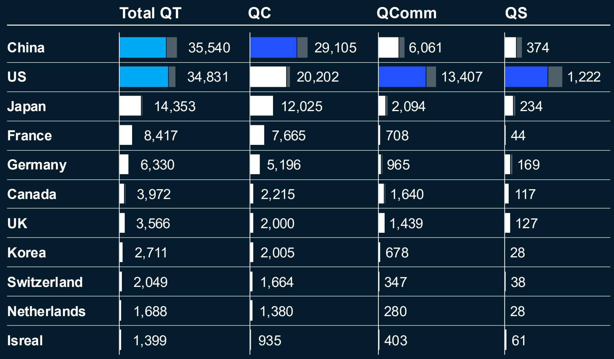

bar_stacked

| Country | Total QT | QC | QComm | QS |
| :--- | :--- | :--- | :--- | :--- |
| China | 35,540 | 29,105 | 6,061 | 374 |
| US | 34,831 | 20,202 | 13,407 | 1,222 |
| Japan | 14,353 | 12,025 | 2,094 | 234 |
| France | 8,417 | 7,665 | 708 | 44 |
| Germany | 6,330 | 5,196 | 965 | 169 |
| Canada | 3,972 | 2,215 | 1,640 | 117 |
| UK | 3,566 | 2,000 | 1,439 | 127 |
| Korea | 2,711 | 2,005 | 678 | 28 |
| Switzerland | 2,049 | 1,664 | 347 | 38 |
| Netherlands | 1,688 | 1,380 | 280 | 28 |
| Isreal | 1,399 | 935 | 403 | 61 |

US and Chinese companies lead global QT patent applications, filing >50% of total global applications (\~28% each)

US companies lead significantly in number of QComm and QS patent applications; Chinese companies lead in number of QC applications

# C. China leads significantly on the number of scientific publications in physical sciences journals.

Share of scientific publications, by country and year (relative to global total)   
Authors from country’s research institutions contributing to publications in physical sciences, based on share of publications1   
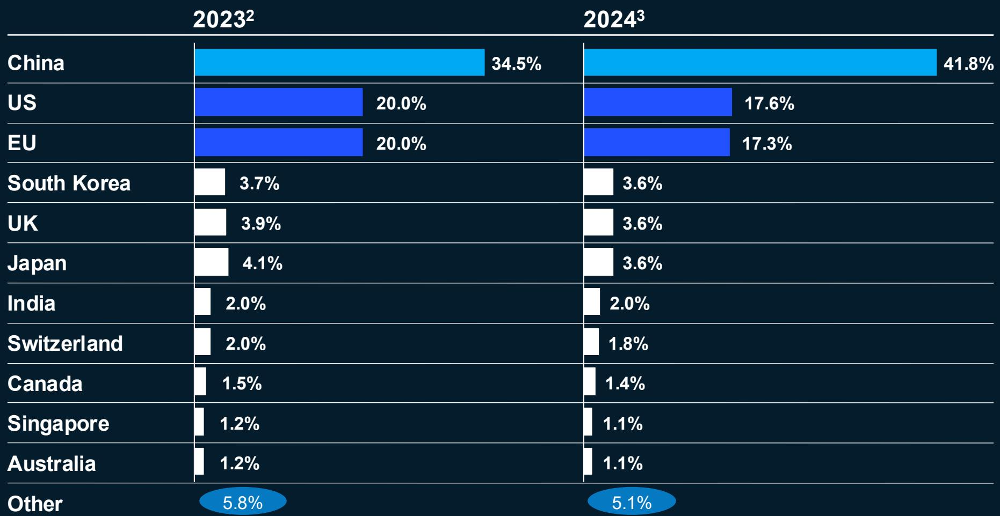

bar

| Category | 2023² (%) | 2024³ (%) |
| :--- | :--- | :--- |
| China | 34.5 | 41.8 |
| US | 20.0 | 17.6 |
| EU | 20.0 | 17.3 |
| South Korea | 3.7 | 3.6 |
| UK | 3.9 | 3.6 |
| Japan | 4.1 | 3.6 |
| India | 2.0 | 2.0 |
| Switzerland | 2.0 | 1.8 |
| Canada | 1.5 | 1.4 |
| Singapore | 1.2 | 1.1 |
| Australia | 1.2 | 1.1 |
| Other | 5.8 | 5.1 |

China leads on number of scientific publications (\~42%), with a 7-pp increase in share of global publications from 2023 to 2024

US and EU are relatively close in number o f publications in 2023–24

The share of publications from countries not in the top 11 decreased from 5.8% in 2023 to 5.1% in 2024

# Contents

natural_image

Abstract illustration of a blue 3D chip surrounded by circuit board traces on a dark background (no text or symbols)

Introduction

Innovations and breakthroughs

# Market size and value at stake

Investment landscape

 Private funding   
 Public announcements

Clusters and start-ups

Value chain

Deep dive into QComm

QT impact on cutting-edge technologies

Methodology and acknowledgments

# To quantify the impact of QT, internal market size and value at stake were considered.

natural_image

Illustration of two people interacting with a large laptop and bar chart elements (no text or symbols)

# Internal market size

Market size of QT infrastructure, hardware, software, and services (ie, entire tech stack for quantum technologies)

QT tech stacks include:

 Physical components   
 Assembled hardware   
 Embedded and application software   
Networking (eg, cloud infrastructure)

natural_image

Illustration of a person using a tablet with financial charts and coins, symbolizing business analytics (no text or symbols present)

# Value at stake

Economic value from impact of quantum technologies on non-QT industries along the respective value chains

Example industries:

 Finance   
 Pharmaceuticals   
 Energy and materials

Example value chain components:

 R&D   
. Logistics and distribution

# The total internal market for quantum technology could reach an estimated \$198 billion by 2040.

Deep dive to follow

Conservative growth rate 1

Optimistic growth rate

QT market-size scenarios in 2035 and 2040   
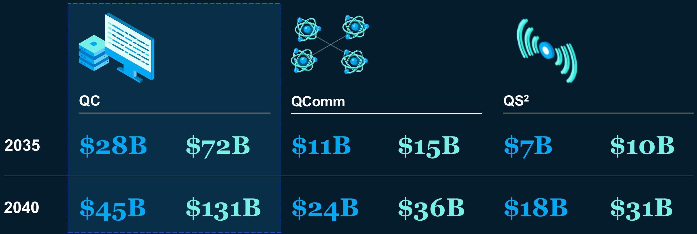

1. Based on existing development road maps and assumed adoption curves per technology.

2. Approach for QS updated through clusters of use cases based on recent development, announcements, and breakthroughs.

# Deep dive: The QC market is expected to reach \$16 billion to \$37 billion by 2030 and \$45 billion to \$131 billion by 2040.

Expected market size (revenue plus external funding) in each scenario, \$ billion   
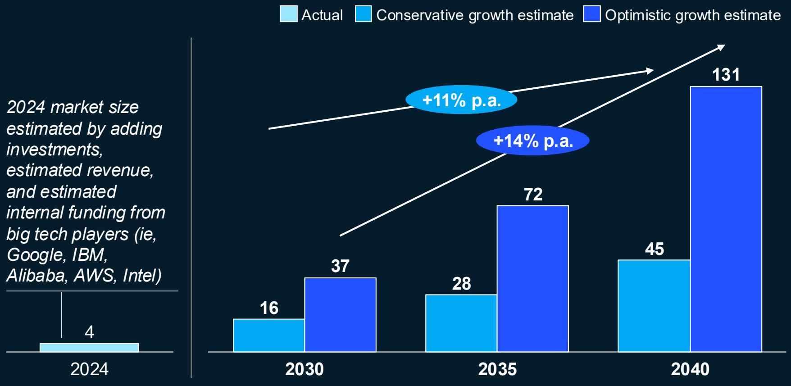

bar

| Year | Actual | Conservative growth estimate | Optimistic growth estimate |
| :--- | :--- | :--- | :--- |
| 2024 | 4 | - | - |
| 2030 | - | 16 | 37 |
| 2035 | - | 28 | 72 |
| 2040 | - | 45 | 131 |
The chart includes a footnote on the left: '2024 market size estimated by adding investments, estimated revenue, and estimated internal funding from big tech players (ie, Google, IBM, Alibaba, AWS, Intel). The data series includes: 'Conservative growth estimate' and 'Optimistic growth estimate'. The arrows indicate percentage changes (+11% p.a. and +14% p.a.).

Numbers include both funding and investment in QC and proceeds to quantum providers

# Key insights

Expected overall market size of \$45B–\$131B in 2040, depending on assumed growth scenario   
Growth rates are expected to be 11–14% per year in the next decade   
The key difference between scenarios is the pace of solving today's challenges combined with higher demand in case of faster progress   
Industry capital expenditures in 2024 were \~32% of overall market size

# Deep dive: Total revenue in QC reached \$650 million to \$750 million in 2024 and is expected to surpass \$1 billion in 2025.

Revenue estimates of QC companies, 2021–24, \$ million   
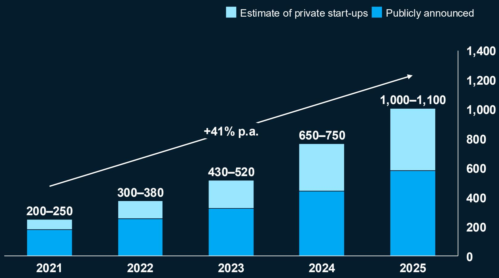

bar_stacked

| Year | Estimate of private start-ups | Publicly announced |
| :--- | :--- | :--- |
| 2021 | 200-250 | 200 |
| 2022 | 300-380 | 250 |
| 2023 | 430-520 | 320 |
| 2024 | 650-750 | 450 |
| 2025 | 1,000-1,100 | 600 |
The chart includes a line annotation indicating a +41% p.a. between the 2023 and 2024 bars, suggesting a projected or cumulative growth trend.

Note: Estimated based on publicly announced revenues of QC start-ups and assuming 30–40% of total revenue is distributed among private companies with less than \$1M revenue according to market reports.

# Key insights

Factors affecting revenue increase:

 Significant increase in revenue primarily driven by the growing deployment of quantum hardware (including cloudbased access), reflecting rising adoption across countries   
Increased government and defense sector funding have fueled the accelerating deployment of both quantum software and hardware solutions   
This estimate excludes system components

# Deep dive: In QC, superconducting and photonic networks have raised the highest funding across quantum modalities.

<table><tr><td>Nonexhaustive Technology</td><td>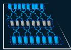 Photonic networks</td><td> Superconducting (SC) circuits</td><td> Spin qubits</td><td>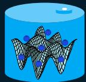 Neutral atoms</td><td> Trapped ions</td></tr><tr><td>Qubit description</td><td>Occupation of a photonic waveguide</td><td>Difference in energy states of Cooper pairs between two sides of a Josephson tunnel junction</td><td>Electron spins of different materials—eg, an electron trapped within a silicon quantum dot or a color center in an insulator, controlled by laser light or microwave radiation</td><td>Internal energy levels of neutral atoms trapped by laser fields</td><td>Internal energy levels of ions trapped by electromagnetic fields</td></tr><tr><td rowspan="4">Funding, 2023–24, $ million</td><td>886</td><td>1,033</td><td></td><td></td><td></td></tr><tr><td>312</td><td></td><td></td><td></td><td></td></tr><tr><td>386</td><td></td><td></td><td></td><td></td></tr><tr><td>339</td><td></td><td></td><td></td><td></td></tr></table>

# Deep dive: QC presents a \$1 trillion to \$2 trillion use case opportunity, with rapid acceleration expected in the next five to ten years.

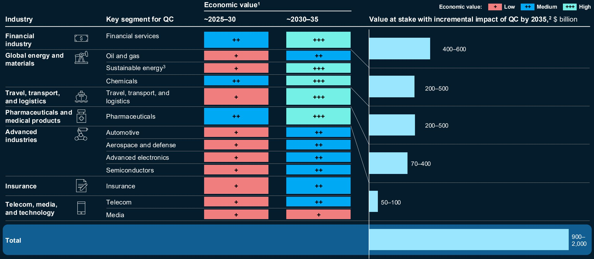

bar

| Industry | Key segment for QC | Economic value1 | Value at stake with incremental impact of QC by 2035, $ billion |
| :--- | :--- | :--- | :--- |
| Financial industry | Financial services | ++ | 400-600 |
| Global energy and materials | Oil and gas | + | |
| Global energy and materials | Sustainable energy³ | + | |
| Global energy and materials | Chemicals | ++ | 200-500 |
| Travel, transport, and logistics | Travel, transport, and logistics | + | |
| Pharmaceuticals and medical products | Pharmaceuticals | ++ | 200-500 |
| Pharmaceuticals and medical products | Pharmaceuticals | ++ | |
| Advanced industries | Automotive | + | |
| Advanced industries | Aerospace and defense | + | |
| Advanced industries | Advanced electronics | + | 70-400 |
| Advanced industries | Semiconductors | + | |
| Insurance | Insurance | + | |
| Telecom, media, and technology | Telecom | + | 50-100 |
| Telecom, media, and technology | Media | + | |
| Total | | | 900-2,000 |

1. Economic value are examined in more depth.   
2. Value estimates are approximative, not definitive projections for business value.   
3. Sustainable energy market is expected to grow rapidly from 2022 to 2035. However, the 2035 market size is influenced by numerous factors and challenging to predict.

# Contents

natural_image

Abstract illustration of a blue 3D chip surrounded by circuit board patterns on a dark background (no text or symbols)

Introduction

Innovations and breakthroughs

Market size and value at stake

Investment landscape

# Private funding

Public announcements

Clusters and start-ups

Value chain

Deep dive into QComm

QT impact on cutting-edge technologies

Methodology and acknowledgments

# QT start-up creation increased by 46 percent in 2024, with notable activity seen in the European Union and Asia.

Cumulative number of start-ups founded Number of start-ups founded per year

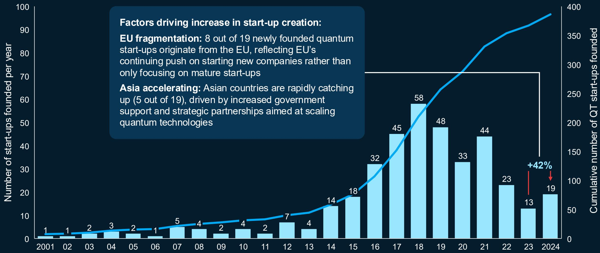

bar_line

| Year | Number of start-ups founded per year | Cumulative number of QT start-ups founded |
|------|--------------------------------------|-------------------------------------------|
| 2001 | 1                                    | 1                                         |
| 2002 | 1                                    | 1                                         |
| 2003 | 2                                    | 2                                         |
| 2004 | 3                                    | 3                                         |
| 2005 | 2                                    | 2                                         |
| 2006 | 1                                    | 1                                         |
| 2007 | 5                                    | 5                                         |
| 2008 | 4                                    | 4                                         |
| 2009 | 2                                    | 2                                         |
| 2010 | 4                                    | 4                                         |
| 2011 | 2                                    | 2                                         |
| 2012 | 7                                    | 7                                         |
| 2013 | 4                                    | 4                                         |
| 2014 | 14                                   | 14                                        |
| 2015 | 18                                   | 18                                        |
| 2016 | 32                                   | 32                                        |
| 2017 | 45                                   | 45                                        |
| 2018 | 58                                   | 58                                        |
| 2019 | 48                                   | 48                                        |
| 2020 | 33                                   | 33                                        |
| 2021 | 44                                   | 44                                        |
| 2022 | 23                                   | 23                                        |
| 2023 | 13                                   | 13                                        |
| 2024 | 19                                   | 19                                        |

# Total investments in quantum technology start-ups increased by about 50 percent year over year in 2024, reaching \$2 billion.

Annual raised start-up investment Annual change in QT start-up investment

Volume of raised investment in the indicated year,
1 \$ million   
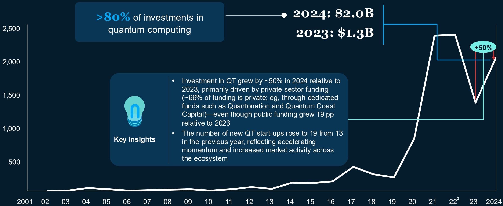

line

| Year | Investment ($B) |
|------|-----------------|
| 2024 | $2.0B           |
| 2023 | $1.3B           |

1. Based on investment data recorded in PitchBook; actual investment likely higher (excludes investments with missing details on investment types); data availability on start-up investment in China is limited.   
2. Excludes other uncategorized funding data.

# Public investment in quantum technology start-ups increased 19 percentage points from 2023 to 2024.

QT investments by funding type, 2014–24,1 \$ million   
Private2 Public3   
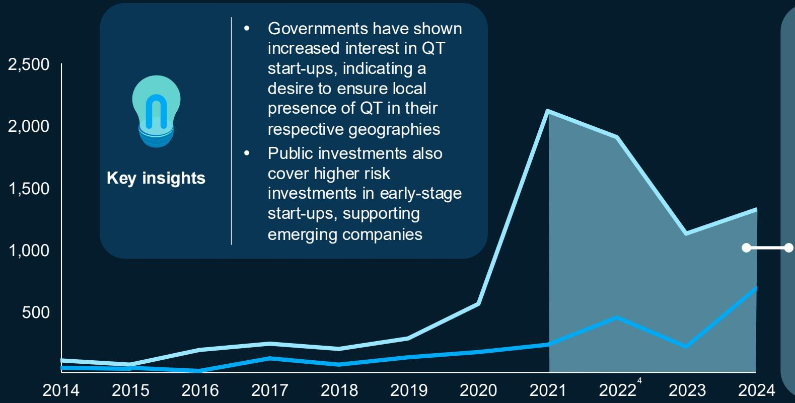

line

| Year | Government Interest | Public Investment |
|------|---------------------|-------------------|
| 2014 | ~100                | ~50               |
| 2015 | ~150                | ~50               |
| 2016 | ~200                | ~50               |
| 2017 | ~250                | ~100              |
| 2018 | ~200                | ~50               |
| 2019 | ~300                | ~100              |
| 2020 | ~550                | ~150              |
| 2021 | ~2100               | ~250              |
| 2022 | ~1900               | ~450              |
| 2023 | ~1150               | ~200              |
| 2024 | ~1350               | ~700              |

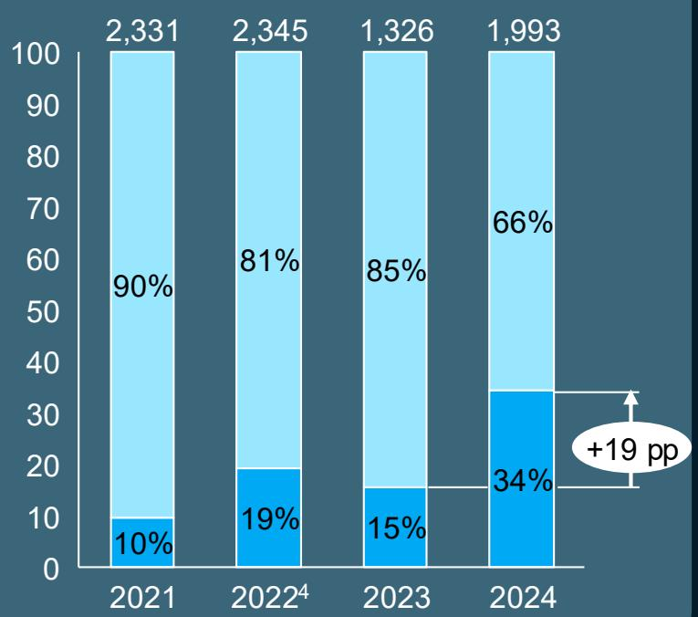

bar_stacked

| Year | Value | Percentage (%) |
| :--- | :--- | :--- |
| 2021 | 2,331 | 90 |
| 2022⁴ | 2,345 | 81 |
| 2023 | 1,326 | 85 |
| 2024 | 1,993 | 66 |
| +19 pp (bottom label) | 10 | 10 |
| +19 pp (bottom label) | 19 | 19 |
| +19 pp (bottom label) | 15 | 15 |
| +19 pp (bottom label) | 34 | 34 |
The chart displays a stacked bar chart with two segments: the lower blue segment represents the percentage contribution of one component, and the upper light blue segment represents the percentage contribution of another component. The data for 2024 is explicitly labeled as '2024'.

1. Based on investment data recorded in PitchBook; actual investment likely higher (excludes investments with missing details on investment types); data availability on start-up investment in China is limited.   
2. Includes investments from venture capital funds, hedge funds, corporations, angel investors, and accelerators.   
3. Includes investments from governments, sovereign wealth funds, and universities.   
4. Excludes other uncategorized funding data.

# The combined value of the top two deals in 2024 was about \$925 million, representing almost half of the total deal value in 2024.

Top 10 investments in QT start-ups in 2024, by deal size (descending)

<table><tr><td>Company</td><td>Start-up HQ location</td><td>Segment</td><td>Deal size, $ million</td><td>Deal type</td></tr><tr><td>1 PsiQuantum</td><td>US</td><td>Hardware manufacturing</td><td></td><td>Later-stage VC</td></tr><tr><td>2 Quantinuum</td><td>US</td><td>Hardware manufacturing</td><td></td><td>Early-stage VC</td></tr><tr><td>3 Zapata Computing1</td><td>US</td><td>Systems software</td><td></td><td>Reverse merger</td></tr><tr><td>4 Q-CTRL</td><td>Australia</td><td>Systems software</td><td></td><td>Series B</td></tr><tr><td>5 Riverlane</td><td>UK</td><td>Systems software</td><td></td><td>Series C</td></tr><tr><td>6 Quantum Circuits</td><td>US</td><td>Hardware manufacturing</td><td></td><td>Series B</td></tr><tr><td>7 Planqc</td><td>Germany</td><td>Hardware manufacturing</td><td></td><td>Series A</td></tr><tr><td>8 Quantum Source</td><td>Israel</td><td>Application software</td><td></td><td>Series A</td></tr><tr><td>9 Maybell</td><td>US</td><td>Component manufacturing</td><td></td><td>Series A</td></tr><tr><td>10 SEEQC</td><td>US</td><td>Hardware manufacturing</td><td></td><td>Series A2</td></tr></table>

# A majority of QT start-up investment in 2024 was directed toward US-based companies, primarily driven by government funding.

Total investment in QT by start-up location and primary investor type, 2024, \$ million1

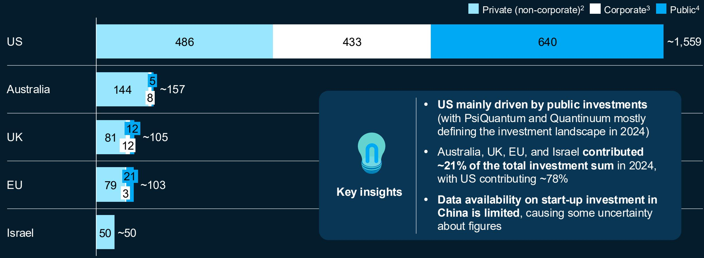

bar_stacked

| Region | Private (non-corporate)² | Corporate³ | Public⁴ |
| :--- | :--- | :--- | :--- |
| US | 486 | 433 | 640 |
| Australia | 144 | 8 | ~5 |
| UK | 81 | 12 | ~105 |
| EU | 79 | 3 | ~103 |
| Israel | 50 | ~50 | - |
Key insights
- US mainly driven by public investments (with PsiQuantum and Quantinuum mostly defining the investment landscape in 2024)
- Australia, UK, EU, and Israel contributed ~21% of the total investment sum in 2024, with US contributing ~78%
- Data availability on start-up investment in China is limited, causing some uncertainty about figures

1. Based on pu estment in China is limited.   
2. Investments from VC funds, hedge funds, angel investors, and accelerators.   
3. Includes investments from corporations and corporate venture capital in external start-ups; excludes corporate investments in internal QT programs.   
4. Includes investments by governments, sovereign wealth funds, and universities.

# Funding is shifting away from scaling start-ups; investors are favoring emerging start-ups and mature companies with lower risk.

QT investment split based on founding years of start-ups in 2021–24,1 %   
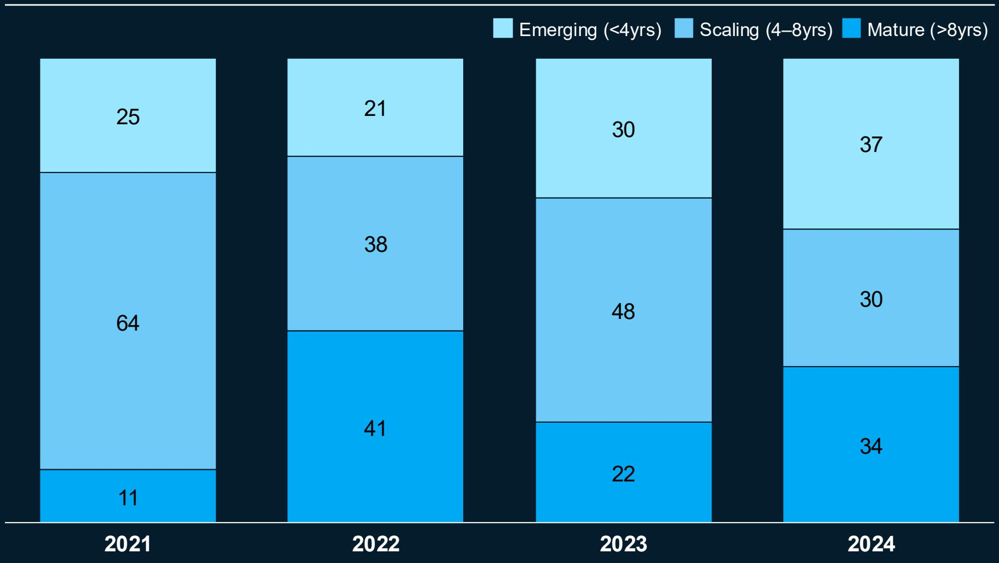

bar_stacked

| Year | Emerging (<4yrs) | Scaling (4–8yrs) | Mature (>8yrs) |
|------|------------------|------------------|----------------|
| 2021 | 25               | 64               | 11             |
| 2022 | 21               | 38               | 41             |
| 2023 | 30               | 48               | 22             |
| 2024 | 37               | 30               | 34             |

1. Limited information available on activity in China.   
Source: Expert interviews; press search; PitchBook; McKinsey analysis

# Key insights

Investments are shifting away from scaling start-ups toward emerging and mature startups:

 Investors are gravitating toward mature start-ups with validated technologies and revenue streams, reflecting a growing emphasis on risk mitigation and near-term returns

 Investors show strong appetite for emerging startups in Series A and B and those that are pioneering disruptive innovations, as investors seek first-mover advantages and higher expected ROI

# Contents

natural_image

Abstract illustration of a blue 3D chip surrounded by circuit board traces on a dark background (no text or symbols)

Introduction

Innovations and breakthroughs

Market size and value at stake

Investment landscape

 Private funding

# Public announcements

Clusters and start-ups

Value chain

Deep dive into QComm

QT impact on cutting-edge technologies

Methodology and acknowledgments

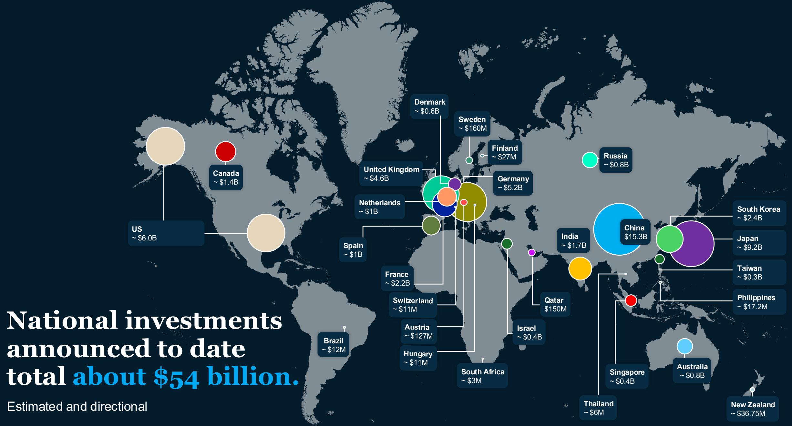

bubble

| Country       | Investment (USD billions) |
| ------------- | ------------------------- |
| US            | ~$6.0B                    |
| Canada        | ~$1.4B                    |
| United Kingdom| ~$4.6B                    |
| Netherlands   | ~$1B                      |
| Spain         | ~$1B                      |
| France        | ~$2.2B                    |
| Switzerland   | ~$11M                     |
| Austria       | ~$127M                    |
| Hungary       | ~$11M                     |
| Brazil        | ~$12M                     |
| Denmark       | ~$0.6B                    |
| Sweden        | ~$160M                    |
| Finland       | ~$27M                     |
| Germany       | ~$5.2B                    |
| India         | ~$1.7B                    |
| Israel        | ~$0.4B                    |
| South Africa  | ~$3M                      |
| Russia        | ~$0.8B                    |
| China         | ~$15.3B                   |
| Japan         | ~$9.2B                    |
| Taiwan        | ~$0.3B                    |
| South Korea   | ~$2.4B                    |
| Philippines   | ~$17.2M                   |
| Singapore     | ~$0.4B                    |
| Australia     | ~$0.8B                    |
| Thailand      | ~$6M                      |
| New Zealand   | ~$36.75M                  |

Note: Includes i nvestments through April 2025. Limite transparenc 136B annou nologies due o unclea elevance for QT. Excludes \$680M Swedish investments toward research and innovation, and US–Swedish investment of \$40M toward next-generation networks, AI, quantum technology, and educational science within STEM areas. The boundaries and names shown on maps do not imply official endorsement or acceptance by McKinsey & Compan

# Announcements of public investments in QT reached \$10 billion in early 2025, with Japan accounting for nearly 75 percent.

Announced in 2023

Announced in 2024

Announced in 2025 (Jan–Apr)

Announced government investments in QT, Jan 2023–Apr 2025, \$ billion   
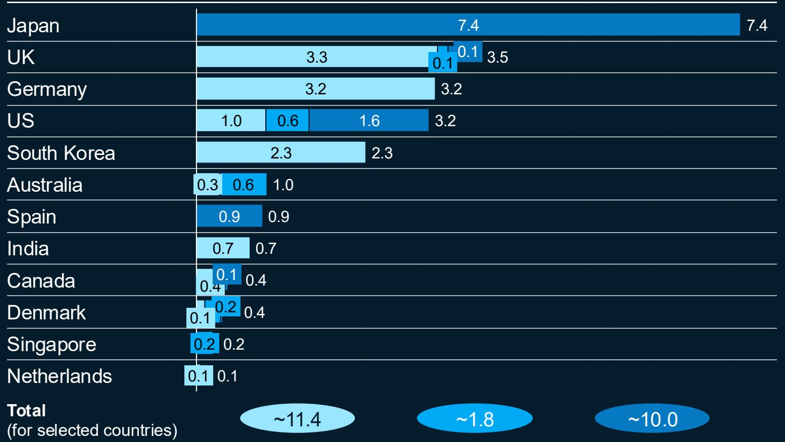

bar_stacked

| Country      | Segment 1 | Segment 2 |
| ------------ | --------- | --------- |
| Japan        | 7.4       | 7.4       |
| UK           | 3.3       | 0.1       |
| Germany      | 3.2       | 3.2       |
| US           | 1.0       | 0.6       |
| South Korea  | 2.3       | 2.3       |
| Australia    | 0.3       | 0.6       |
| Spain        | 0.9       | 0.9       |
| India        | 0.7       | 0.7       |
| Canada       | 0.4       | 0.1       |
| Denmark      | 0.1       | 0.2       |
| Singapore    | 0.2       | 0.2       |
| Netherlands  | 0.1       | 0.1       |

# Key insights

While UK, Germany, and South Korea had biggest investments in 2023, US and Australia had the biggest investments in 2024 (driven by few governmental fundings)   
Japan announced significant \$7.4B investment in 2025, illustrating an increased Asian interest in quantum technology   
Many public funding announcements included plans to attract private investment as part of overall program goals

Note: Figures may not sum to totals, because of rounding. Limited transparency on commercial activity in China; excludes the \$136B announced investment toward emerging technologies due to unclarity of relevance for QT; the \~\$15B investment is not shown here because it was announced before 2023. Excludes \$680M in Swedish investments toward research and innovation, and US–Swedish investment of \$40M toward next-generation networks, AI, quantum technology, and educational science within STEM areas. Also excludes Saudi Arabia’s \$6.4B investment in 2022 toward future tech because no breakdown for quantum technology is present; excludes Qatar’s (QIA) and Bpifrance’s investment in Alice & Bob in 2025 due to missing breakdown of investment. Japan’s investment is not exclusively directed toward quantum technology (includes next-generation chip design as well).

# Public announcements surged to about \$10 billion in early 2025, led by major initiatives in Japan, Spain, and the United States.

Largest national and regional funding announcements; includes investments through Apr 2025

Nonexhaustive

Announced in 2024 or Jan–Apr 2025

Announced before 2024

# UK

The UK government (Department of Science, Innovation, and Technology) announced \$130M in funding for five quantum research hubs in the UK

# US

US has multiple investments in QT, most significantly: \$500M from State of Illinois, \$625M from Department of Energy’s Office of Science, and State of Maryland aiming to secure \$1B

# Singapore

Singapore announced National Quantum Strategy, covering \~\$222M investment toward QT research and talent over the next 5 years

# Denmark

Novo Holdings announced \$213M to support the development of a global QT innovation hub in Denmark Note: Novo Holdings is an enterprise foundation with philanthropic objectives and thus not fully public

# China

China has boosted government funding for quantum research and development to over \$15B, with applications in security, defense, and AI

# UK

The United Kingdom’s National Quantum Strategy introduced new strategic goals for the next 10 years, including market growth stimulation, research, and talent, with additional investment worth \$3.1B

# Canada

The Canadian government launched its National Quantum Strategy with an announced \$360M investment in 2023

# India

The government of India announced the National Quantum Mission, which aims to seed, nurture, and scale up scientific and industrial R&D and create a vibrant and innovative ecosystem in QT, with \$730M in funding

# Spain

Spain announced its National Quantum Technology Strategy, dedicating \$900M toward 2030 to advance in quantum science

# Canada

Canada announced \$52M investment toward QT, covering QC, QComm, and QS

# Australia

The Australian Commonwealth and Queensland governments announced a \$620M financial package for PsiQuantum to build a utility-scale, faulttolerant quantum computer in Brisbane

# Japan

The Japanese government announced \$7.4B for next-generation chip and QC research as part of its pledge to support semiconductor and AI development toward 2030

# South Korea

The South Korean government plans to invest \$2.3B in quantum science and technology by 2035, with a goal to become a leading player in QT

# Netherlands

The Netherlands’ National Growth Fund allocated \$65M in funding to Quantum Delta NL in 2023. The organization is a main driver in the Netherlands’ national ecosystem for quantum innovation

# US

In 2018 the US announced the National Quantum Initiative, which provides \$1.2B over five years for QT development.

# France

France has committed to establishing a leading position in the international QT race, with a \$1.3B investment announced in 2021

# Contents

natural_image

Abstract illustration of a blue 3D chip surrounded by circuit board traces on a dark background (no text or symbols)

Introduction

Innovations and breakthroughs

Market size and value at stake

Investment landscape

 Private funding   
 Public announcements

# Clusters and start-ups

Value chain

Deep dive into QComm

QT impact on cutting-edge technologies

Methodology and acknowledgments

# Existing quantum clusters continue to grow; growing investments support the development of emerging clusters.

Existing clusters; example organizations

Emerging clusters; example organizations

# Key trends shaping the innovation of clusters for the quantum industry

# Clusters continue to grow …

Quantum clusters, usually anchored by research organizations, provide a critical mass of technology, talent, and infrastructure for cutting-edge advancements in QT

Existing larger (eg, Boston, Chicago) and smaller clusters are expected to continue to expand as the quantum industry matures

# … while new clusters emerge and develop

As QT matures, growing commercial and public interest further drives growth of existing clusters—and development of new, emerging clusters

Companies often form partnerships or sponsor R&D at innovation clusters, providing funding and direct infrastructure for innovation clusters

# Innovation clusters have a global footprint

# Example clusters (nonexhaustive)

<table><tr><td>Boston</td><td>Harvard University</td><td>MIT</td><td>QuEra Computing</td><td>AWS</td><td>Nvidia</td></tr><tr><td>Chicago</td><td>University of Chicago</td><td></td><td>University of Illinois</td><td>EeroQ</td><td>IBM</td></tr><tr><td>Delft</td><td>TU Delft</td><td>Qblox</td><td>Intel</td><td></td><td></td></tr></table>

<table><tr><td>Oxford</td><td>University of Oxford</td><td>Oxford Quantum Circuits</td><td>Element Six</td></tr></table>

<table><tr><td>Tel Aviv</td><td>Tel AvivUniversity</td><td>Classiq</td></tr></table>

<table><tr><td>Hefei</td><td>University of Science and Technology of China</td><td>CIQTEK</td><td>Tencent</td></tr></table>

<table><tr><td>Seoul</td><td>Sungkyunkwan University</td><td>Yonsei University</td><td>Seoul National University</td><td>Norma</td></tr></table>

# Five key enablers support innovation clusters; start-ups are consolidating in quantum hubs.

Nonexhaustive

# Accessibility and integration

Allow standardized platforms and easy quantum-classical integration

# Industry or government partnerships

Support QT players through collaboration

Key cluster enablers

# Capital investments

Fund research, scale-up, and commercialization

# Physical infrastructure and hardware

Provide advanced labs and quantum facilities

# Academic institutions and research organizations, including talent

Develop critical know-how, nurture and motivate talent, incubate start-ups

QC clusters consist of QC start-ups, incumbent companies, and public or government organizations; the trend is toward consolidation into quantum hubs across different regions

# Key insights

Healthy clusters require all five enablers in concert to be self-sustaining over time   
Significant investments are required to sufficiently support all required enablers, especially for newly emerging clusters   
Time is an essential factor, as all elements cannot be built immediately by funding alone   
Developing partnerships (eg, with universities, industry players) helps accelerate the development of existing and emerging clusters

# The most vibrant QC clusters are in the United States, evolving from newly founded start-ups toward a phase of consolidation into hubs.

Number of QC companies, by country

Deep dive to follow

Number of companies by end of 2023

Additional companies in 2024

Total number of companies

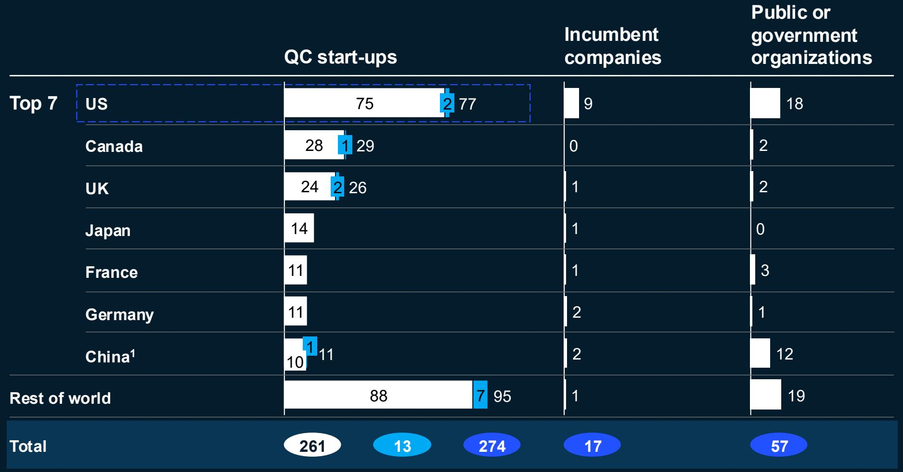

bar

| Category | Country | QC start-ups | Incumbent companies | Public or government organizations |
| :--- | :--- | :--- | :--- | :--- |
| Top 7 | US | 75 | 2 | 18 |
| Top 7 | Canada | 28 | 1 | 2 |
| Top 7 | UK | 24 | 2 | 2 |
| Top 7 | Japan | 14 | | 0 |
| Top 7 | France | 11 | | 3 |
| Top 7 | Germany | 11 | | 1 |
| Top 7 | China¹ | 10 | 1 | 12 |
| Top 7 | Rest of world | 88 | 7 | 19 |
Total: 261 (QC start-ups), 13 (Incumbent companies), 274 (Public or government organizations), 17 (Total). 
| Category | Count |
| :--- | :--- |
| Total | 261 |
| :--- | 13 |
| :--- | 274 |
| :--- | 17 |
| :--- | 57 |
| Incumbent companies | 9 |
| Incumbent companies | 0 |
| Incumbent companies | 1 |
| Incumbent companies | 2 |
| Incumbent companies | 1 |
| Incumbent companies | 2 |
| Incumbent companies | 1 |
| Incumbent companies | 2 |
| Incumbent companies | 1 |
| Incumbent companies | 2 |
| Incumbent companies | 1 |
| Incumbent companies | 2 |
| Incumbent companies | 1 |
| Incumbent companies | 2 |
| Incumbent companies | 2 |
| Incumbent companies | 2 |
| Incumbent companies | 2 |
| Incumbent companies | 2 |
| Incumbent companies | 2 |
| Incumbent companies | 2 |
| Incumbent companies | 2 |
| Incumbent companies | 2 |
| Incumbent companies | 2 |
| Incumbent companies | 2 |
| Incumbent companies | 2
| 
| Public or government organizations | Total |
| :--- | :--- |
| US: Incumbent companies: 9; Incumbent companies: 18; Public or government organizations: 277; Total: 75; Incumbent companies: 28; Incumbent companies: 29; Public or government organizations: 24; Total: 14; Incumbent companies: 11; Incumbent companies: 10; Public or government organizations: 7; Total: 95; Incumbent companies: 288; Incumbent companies: 77; Total: 95; Incumbent companies: 29; Incumbent companies: 261; Incumbent companies: 13; Incumbent companies: 274; Total: 57; Incumbent companies: 95; Total: 95; Incumbent companies: 17; Total: 57; Incumbent companies: 19; Total: 57; Total: 57; Total: 57; Total: 57; Total: 57; Total: 57; Total: 57; Total: 57; Total: 57; Total: 57; Total: 57; Total: 57; Total: 57; Total: 57; Total: 57; Total: 57; Total: 57; Total:

# Key insights

US leads with 77 out of 274 start-ups, but only 2 new US start-ups launched in 2024, indicating that the market is increasingly mature and focuses on production   
Recent national announcements (eg, Maryland and Illinois) indicate a shift toward state-level clusters rather than local clusters   
The rest of the world has 95 start-ups (\~35% of global), but top countries take almost all funding in 2024, particularly US with significant deals for PsiQuantum and Quantinuum   
Limited transparency on commercial activity in China

# Deep dive: Both federal and state-level efforts are shaping the attractiveness of US QT clusters.

<table><tr><td>Federal efforts</td><td>Federal cybersecurity:President Biden issued executive order to support US cybersecurity efforts</td><td>Federal R&amp;D funding:Launched national quantum initiative reauthorization act to push quantum R&amp;D</td><td>Federal legislation:Restricted investments in Chinese QC</td></tr><tr><td>Impact</td><td>Encourages transition to post-quantum cryptography (PQC)Strengthens security of US communication and identity management systemsPromotes cutting-edge development and the use of QT for cybersecurity</td><td>Proposes $2.7B for quantum R&amp;D (2025–29)Aims to accelerate practical quantum applicationsEstablishes 3 new NIST $^{1}$  quantum centers and 5 new NSF $^{2}$  centers, accelerating research within QT</td><td>Blocks US investments in Chinese QCAims to prevent improvement of China’s military capabilitiesRequires US investors to notify government of relevant transactions</td></tr><tr><td>Benefit to US QT start-ups</td><td>Boosts focus on cybersecurity-related QT start-ups</td><td>Boosts government funding in QT clusters</td><td>Pushes investors toward non-Chinese investments (and thus more US investments)</td></tr><tr><td>State-level efforts</td><td colspan="3">Multiple state-level efforts toward QT were published in 2024 and 2025, including the following:Illinois announced a $500M investment to the development of a quantum park (including $200M for cryogenic plant for PsiQuantum)Maryland announced the Capital of Quantum initiative, targeting $1B in investments in partnership with IonQ and University of Maryland</td></tr></table>

# Contents

natural_image

Abstract illustration of a blue 3D chip surrounded by circuit board traces and glowing nodes (no text or symbols)

# Introduction

Innovations and breakthroughs

Market size and value at stake

Investment landscape

 Private funding   
 Public announcements

Clusters and start-ups

# Value chain

Deep dive into QComm

QT impact on cutting-edge technologies

Methodology and acknowledgments

# Five major elements define the quantum value chain.

# Nonexhaustive

Equipment and components

Hardware

Systems software

Application software

Services

# Quantum control

Microwave or radio frequency

Devices that generate and deliver control pulses to manipulate quantum states

# Optical

Optical systems such as lasers to control qubits (eg, photonics)

# Superconducting

Current flowing in a ring of superconducting metal having two breaks or confinements

# Trapped ion

Internal energy levels of ions trapped by electromagnetic fields

# Environmental control

# Cryogenic

Cooling systems (eg, dilution refrigerators) required to maintain qubits at low temperature

# Vacuum chamber

Chambers needed for stable qubits to avoid noise and interaction with the environment

# Neutral atoms

Internal energy levels of neutral atoms trapped by highly focused laser beams

# Photonics

Occupation of a photonic waveguide with photons

# Other instruments

General-purpose equipment (eg, signal generators, amplifiers) used in supporting quantum experiments

# Spin

Electron spins of different materials; eg, an electron trapped in a silicon quantum dot controlled by laser light or microwave radiation

Quantum control system between quantum hardware and applications

# Cross-industry

Algorithms and software applicable across multiple sectors (eg, chemicals, finance, life sciences)

# Drug discovery and materials1

Quantum simulations for molecular modeling, new materials, and chemical reactions

# Finance and business1

Applications span across different business units (eg, portfolio optimization, fraud detection, risk analysis, and financial forecasting)

Majority of quantum start-ups provide hardware and software services

# Additional insights

Equipment and component players can be divided into three categories (quantum control, environmental control, and other instruments), and typically provide products for multiple modalities (eg, cryogenic equipment for both superconducting and spin qubits)   
Majority of big tech players (eg, Google, IBM) specialize mostly in hardware development, indicating the foundational importance of hardware and the significant investments required   
Application software companies mainly specialize in specific industries, driven by use case needs, in contrast to the remainder of categories, which are mainly industry-agnostic   
Majority of start-ups provide some quantum services because products are specialized in an early-stage technology

# A value shift from equipment and components to application software and services is expected over the next five to ten years.

<table><tr><td rowspan="2"></td><td rowspan="2">Equipment and components</td><td rowspan="2"></td><td rowspan="2">Hardware</td><td rowspan="2"></td><td rowspan="2">Systems software</td><td rowspan="2"></td><td rowspan="2">Application software</td><td rowspan="2"></td><td>Estimated market value captured per value chain segment1</td></tr><tr><td>Low</td></tr><tr><td>Today</td><td></td><td></td><td></td><td></td><td></td><td></td><td></td><td></td><td>Today, most QC-specific companies are not profitable; component manufacturers are getting most of the margins and realizing most of the value because they are producing components that can be installed in multiple hardware technologies, while hardware is still in development and few applications are available</td></tr><tr><td>In 5-10 years</td><td></td><td></td><td></td><td></td><td></td><td></td><td></td><td></td><td>Over the next 5-10 years, profitability is expected to increase. As components become more standardized, margins will likely decrease. Hardware will be more mature but scarce, likely generating most revenue. Players in hardware and services are expected to get the highest margins because standardized software will likely not exist yet</td></tr><tr><td>Full uptake</td><td></td><td></td><td></td><td></td><td></td><td></td><td></td><td></td><td>At full uptake, profitability will likely be significant. Most of the value is expected to be captured through cloud services and application software because the earlier parts of the value chain have become standardized and easily accessible, while end users have become quantum-native</td></tr></table>

# Most new start-ups in 2024 focus on application software or equipment and components.

Number of QC start-ups, by value chain segment

Number of start-ups founded in 2024 Deep dive to follow

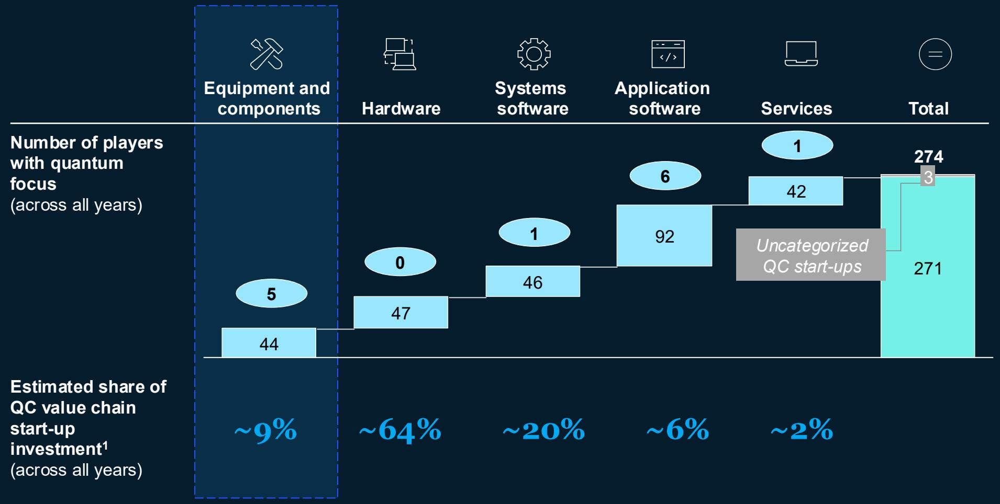

bar

| Category | Equipment and components | Hardware | Systems software | Application software | Services | Total |
| :--- | :--- | :--- | :--- | :--- | :--- | :--- |
| Number of players with quantum focus (across all years) | 5 | 0 | 1 | 6 | 1 | 274 |
| Estimated share of QC value chain start-up investment¹ (across all years) | ~9% | ~64% | ~20% | ~6% | ~2% | ~271 |

# Key insights

Equipment and components and application software segments are especially attractive for new start-ups (collectively accounting for 11 of 13 new start-ups)   
Equipment and components segment attracts investment attention because the hardware player–agnostic nature of the segment creates lowerrisk opportunities   
Some players—particularly professional-services firms providing quantum services in addition to their main business—may fall outside the start-up category here because of their lack of specialization

# Contents

natural_image

Abstract illustration of a blue 3D chip surrounded by circuit board patterns on a dark background (no text or symbols)

Introduction

Innovations and breakthroughs

Market size and value at stake

Investment landscape

 Private funding   
 Public announcements

Clusters and start-ups

Value chain

# Deep dive into QComm

QT impact on cutting-edge technologies

Methodology and acknowledgments

# Four key messages describe the state of QComm.

# 1. Market sizing

Leveraging product landscapes along with technological trends, the total QComm market was an estimated \~\$1.0B in 2023, and it projects to reach \$11B–\$15B by 2035 with a CAGR of 22–25%. While governments hold the largest customer share (62–66% as of 2023), private sector involvement is projected to grow rapidly— eg, telecoms are expected to grow to 16–26% in 2035 from 2–6% in 2023

# 2. QComm landscape

The QComm landscape has three key categories (security, networks, and services) and six key verticals: quantum key distribution (QKD) solutions, postquantum cryptography (PQC), modular interconnects, regional networks, quantum global internet, and QComm services. PQC, which has experienced the most commercialization, has the highest level of maturity

# 3. Value chain

The value chain includes components, hardware, application software, quantum network operators, and services. QComm hardware is still in development.

Long-distance communication requires the development of quantum repeaters, which amplify the signal. Start-ups and big players have entered the hardware market while the software market is still small

# 4. Q-Day implications

Q-Day could force a critical shift in security strategies, requiring potential partnerships between early movers in QKD, PQC, and networks to unlock longterm value

Many industries with sensitive data and high cryptographic requirements are facing large potential Q-Day impacts

Q-Day’s exact timing will determine the demand profile and competitive landscape

Key messages in quantum communication

# 1. The QComm market is projected to reach \$11 billion to \$15 billion by 2035.

bar

| Category | Value |
| -------- | ----- |
| Market size, $ billion | 500 |
| Academia | 100 |
| Government¹ | 100 |
| Telecommunications² and cybersecurity | 200 |
| Financial services | 100 |
| Healthcare | 100 |
| Other³ | 100 |

Market breakdown by customer type, 2023–35, %   
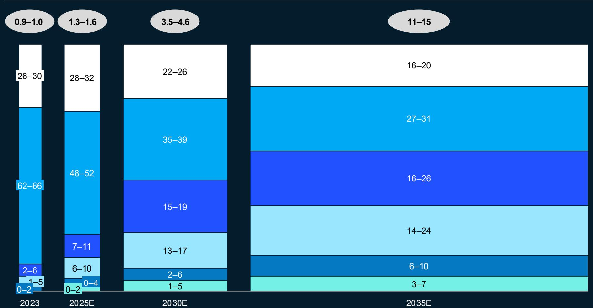

bar_stacked

| Year | Range | Value |
| :--- | :--- | :--- |
| 2023 | 0.9–1.0 | 26–30 |
| 2023 | 1.3–1.6 | 62–66 |
| 2023 | 3.5–4.6 | 28–32 |
| 2023 | 11–15 | 22–26 |
| 2025E | 0.9–1.0 | 2–6 |
| 2025E | 1.3–1.6 | 0–2 |
| 2025E | 3.5–4.6 | 7–11 |
| 2025E | 11–15 | 6–10 |
| 2030E | 0.9–1.0 | 0–4 |
| 2030E | 1.3–1.6 | 1–5 |
| 2030E | 3.5–4.6 | 2–6 |
| 2030E | 11–15 | 1–5 |
| 2035E | 0.9–1.0 | 6–20 |
| 2035E | 1.3–1.6 | 27–31 |
| 2035E | 3.5–4.6 | 16–26 |
| 2035E | 11–15 | 14–24 |
| 2035E | 11–15 | 6–10 |
| 2035E | 11–15 | 3–7 |

1. Includes civil government and defense.   
2. Includes public cloud providers.   
3. Includes manufacturing, automative, insurance, etc.

Source: McKinsey analysis; expert interviews; press search

# Key insights

The QComm market is expected to reach between \$11B and \$15B in 2035, with a CAGR of 22–25%   
Government (including defense) is the largest player in the current market, with 62– 66% estimated market share in 2023   
Telecommunications is estimated to have an increasing market share over the time horizon, increasing from 2–6% in 2023 to 16–26% in 2035, led by growth in networks markets   
Financial services is expected to be a major use case, with an estimated 14–24% market share in 2035, though there is significant uncertainty in the timing of its market growth

# 2. QComm applications span security, networking, and services.

Nonexhaustive

QComm 

<table><tr><td rowspan="2"></td><td></td><td></td><td></td></tr><tr><td>Quantum security</td><td>Quantum networking</td><td>QComm services</td></tr><tr><td>Description</td><td>Solutions such as QKD ensure provably secure encryption of quantum information, while PQC ensures safety against quantum attacks</td><td>Transfer of quantum information between nodes uses principles such as entanglement to enable applications over longer distances (eg, quantum global internet)</td><td>Services range from technical support for hardware devices to expert consulting for adoption</td></tr><tr><td>Example companies</td><td>ToshibaQuantum XchangeQuantumCTekID Quantique</td><td>AWSCiscoIonQQunnect</td><td>ToshibaNECID Quantique</td></tr></table>

# 2. Six key verticals shape QComm.

<table><tr><td colspan="3">Quantum security </td><td colspan="3">Quantum networks </td><td>Services </td></tr><tr><td>Verticals</td><td>QKD (including QRNG1)</td><td>PQC</td><td>Modular interconnect</td><td>Regional networks</td><td>Quantum global internet</td><td>QComm services</td></tr><tr><td>Description</td><td>Software and hardware products that enable detection of interception attempts (including  $\text{hardware QRNG}^1$  products). QKD consists of prepare-and-measure protocols and entanglement-based protocols</td><td>Classical algorithms (eg, hash-based, lattice-based, etc) designed to be secure against potential threats posed by quantum computers (but not quantum-secure)</td><td>Devices designed for connecting qubits, including switches and transducers (eg, for frequency conversion), to enable low-error and efficient computing and communication</td><td>Interconnected data center systems for QComm across municipalities and regions (&lt;1,000-km networks), leveraging repeaters and critical components such as entanglement sources and quantum memories</td><td>Technologies enabling intercontinental transfer of quantum information using repeaters involving both free-space and fiber-based systems (&gt;1,000 km)</td><td>Services ranging from technical support for hardware devices to expert consulting for adoption</td></tr><tr><td>Example industries (nonexhaustive)</td><td>Cybersecurity, finance, telecommunications, IoT, automotive</td><td>Cybersecurity, finance, telecommunications</td><td>Academia, finance, telecommunications, government, IoT</td><td>Finance, government, telecommunications</td><td>Finance, government, telecommunications</td><td>Finance, healthcare, telecommunications</td></tr></table>

# 2. PQC, QKD, and QComm services are already in (partial) production; modular interconnect and networks are less mature.

Nonexhaustive

Deep dive to follow

Production

Partial production

Near production

In development

# Quantum networks

# Services

# Verticals

# Quantum security

# Key use cases and drivers

# QKD (including QRNG)

Telecommunications players increase attention on QKD to improve communication security1 (eg, Toshiba and IDQ)

Key enabler is quantum repeaters, allowing longdistance QComm

# PQC

Tech companies prepare for a post-quantum world (eg, Apple has introduced PQC protocols for enhanced security in iMessage)

# Modular interconnect

Research institutions, data centers, and quantum computer companies leverage entanglementbased quantum components (eg, switches, interconnects) to synchronize systems and connect qubit chips in quantum computers

# Regional networks

Data centers and telecommunications players adopt regional quantum networks to securely transfer data (eg, EPB in Chattanooga, Tennessee, and BT and Toshiba network in London), while the military uses them for drone operations, driven by demand for efficient, confidential, and secure data exchange

# Quantum global internet

Government deploys satellite or fiber-based QComm to secure global data transmission, driven by the necessity to provide encrypted connectivity over large distances

# QComm services

Various industries (eg, financial services, telecommunications) use scalable platforms offered by emerging start-ups to incorporate quantum solutions

# Status of commercialization

Quantum networks, while promising to revolutionize secure communication and quantum information, depend on the progress of entanglement-based hardware to connect quantum sensors, quantum computers, and data centers. With each technological breakthrough, major networking market g rowth can be expected

# 2A. Deep dive: Quantum repeaters are the building blocks of QComm, enabling quantum key distribution through entanglement.

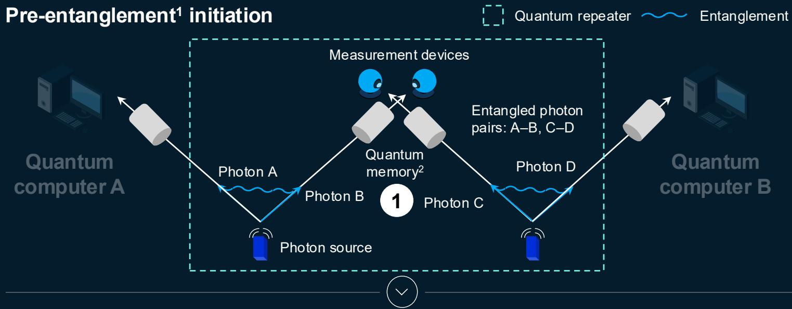

flowchart

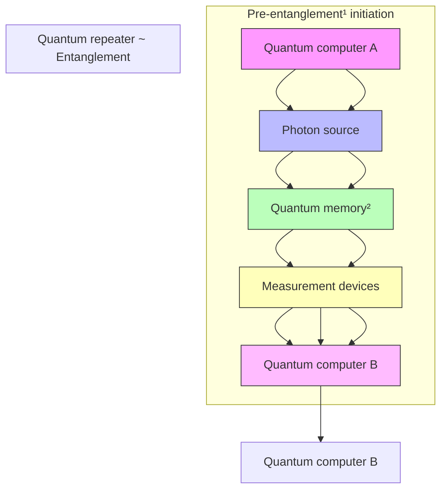
```mermaid
graph TD
    A["Quantum computer A"] --> B["Photon source"]
    B --> C["Quantum memory²"]
    C --> D["Measurement devices"]
    D --> E["Quantum computer B"]
    E --> F["Quantum computer B"]
    style A fill:#f9f,stroke:#333
    style B fill:#bbf,stroke:#333
    style C fill:#bfb,stroke:#333
    style D fill:#ffb,stroke:#333
    style E fill:#fbf,stroke:#333
    subgraph "Pre-entanglement¹ initiation"
        direction TB
        A --> B --> C --> D --> E
    end
    subgraph "Quantum repeater ~ Entanglement"
        direction LR
        D --> E
    end
```

Post-entanglement1 communication   
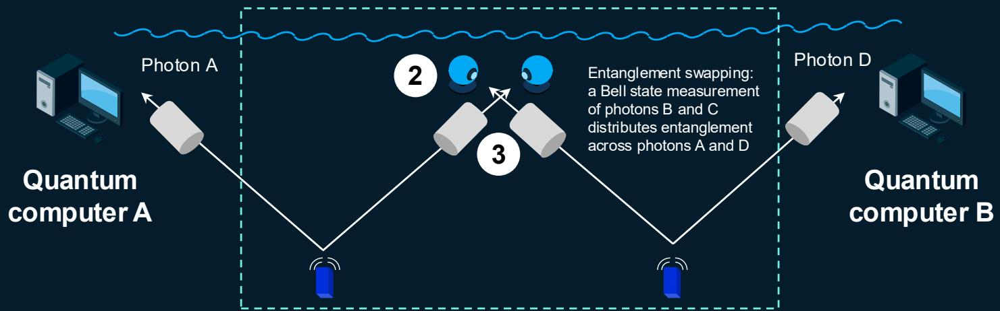

flowchart

```mermaid
graph TD
    A["Quantum computer A"] -->|Photon A| B["Quantum computer B"]
    B -->|Quantum A| C["Quantum computer B"]
    C -->|Quantum A| D["Quantum computer B"]
    D -->|Quantum A| E["Quantum computer B"]
    E -->|Quantum A| F["Quantum computer B"]
    F -->|Quantum A| G["Quantum computer B"]
    G -->|Quantum A| H["Quantum computer B"]
    H -->|Quantum A| I["Quantum computer B"]
    I -->|Quantum A| J["Quantum computer B"]
    J -->|Quantum A| K["Quantum computer B"]
    K -->|Quantum A| L["Quantum computer B"]
    L -->|Quantum A| M["Quantum computer B"]
    M -->|Quantum A| N["Quantum computer B"]
    N -->|Quantum A| O["Quantum computer B"]
    O -->|Quantum A| P["Quantum computer B"]
    P -->|Quantum A| Q["Quantum computer B"]
    Q -->|Quantum A| R["Quantum computer B"]
    R -->|Quantum A| S["Quantum computer B"]
    S -->|Quantum A| T["Quantum computer B"]
    T -->|Quantum A| U["Quantum computer B"]
    U -->|Quantum A| V["Quantum computer B"]
    V -->|Quantum A| W["Quantum computer B"]
    W -->|Quantum A| X["Quantum computer B"]
    X -->|Quantum A| Y["Quantum computer B"]
    Y -->|Quantum A| Z["Quantum computer B"]
    Z -->|Quantum A| AA["Quantum computer B"]
    AA -->|Quantum A| AB["Quantum computer B"]
    AB -->|Quantum A| AC["Quantum computer B"]
    AC -->|Quantum A| AD["Quantum computer B"]
    AD -->|Quantum A| AE["Quantum computer B"]
    AE -->|Quantum A| AF["Quantum computer B"]
    AF -->|Quantum A| AG["Quantum computer B"]
    AG -->|Quantum A| AH["Quantum computer B"]
    AH -->|Quantum A| AI["Quantum computer B"]
    AI -->|Quantum A| AJ["Quantum computer B"]
    AJ -->|Quantum A| AK["Quantum computer B"]
    AK -->|Quantum A| AL["Quantum computer B"]
    AL -->|Quantum A| AM["Quantum computer B"]
    AM -->|Quantum A| AN["Quantum computer B"]
    AN -->|Quantum A| AO["Quantum computer B"]
    AO -->|Quantum A| AP["Quantum computer B"]
    AP -->|Quantum A| AQ["Quantum computer B"]
    AQ -->|Quantum A| AR["Quantum computer B"]
    AR -->|Quantum A| AS["Quantum computer B"]
    AS -->|Quantum A| AT["Quantum computer B"]
    AT -->|Quantum A| AU["Quantum computer B"]
    AU -->|Quantum A| AV["Quantum computer B"]
    AV -->|Quantum A| AW["Quantum computer B"]
    AW -->|Quantum A| AX["Quantum computer B"]
    AX -->|Quantum A| AY["Quantum computer B"]
    AY -->|Quantum A| AZ["Quantum computer B"]
    AZ -->|Quantum A| BA["Quantum computer B"]
    BA -->|Quantum A| BB["Quantum computer B"]
    BB -->|Quantum A| BC["Quantum computer B"]
    BC -->|Quantum A| BD["Quantum computer B"]
    BD -->|Quantum A| BE["Quantum computer B"]
    BE -->|Quantum A| BF["Quantum computer B"]
    BF -->|Quantum A| BG["Quantum computer B"]
    BG -->|Quantum A| BH["Quantum computer B"]
    BH -->|Quantum A| BI["Quantum computer B"]
    BI -->|Quantum A| BJ["Quantum computer B"]
    BJ -->|Quantum A| BK["Quantum computer B"]
    BK -->|Quantum A| BL["Quantum computer B"]
    BL -->|Quantum A| BM["Quantum computer B"]
    BM -->|Quantum A| BN["Quantum computer B"]
    BN -->|Quantum A| BO["Quantum computer B"]
    BO -->|Quantum A| BP["Quantum computer B"]
    BP -->|Quantum A| BQ["Quantum computer B"]
    BQ -->|Quantum A| BR["Quantum computer B"]
    BR -->|Quantum A| BS["Quantum computer B"]
    BS -->|Quantum A| BT["Quantum computer B"]
    BT -->|Quantum A| BU["Quantum computer B"]
    BU -->|Quantum A| BV["Quantum computer B"]
    BV -->|Quantum A| BW["Quantum computer B"]
    BW -->|Quantum A| BX["Quantum computer B"]
    BX -->|Quantum A| BY["Quantum computer B"]
    BY -->|Quantum A| BZ["Quantum computer B"]
    BZ -->|Quantum A| CA["Quantum computer B"]
    CA -->|Quantum A| CB["Quantum computer B"]
    CB -->|Quantum A| CC["Quantum computer B"]
    CC -->|Quantum A| CD["Quantum computer B"]
    CD -->|Quantum A| CE["Quantum computer B"]
    CE -->|Quantum A| CF["Quantum computer B"]
    CF -->|Quantum A| CG["Quantum computer B"]
    CG -->|Quantum A| CH["Quantum computer B"]
    CH -->|Quantum A| CI["Quantum computer B"]
    CI -->|Quantum A| CJ["Quantum computer B"]
    CJ -->|Quantum A| CK["Quantum computer B"]
```

1. Entanglement is a key feature of quantum mechanics, connecting (or “entangling”) two physically separated quantum systems.   
2. Quantum memory stores the quantum state of a qubit (eg, encoded in a photon in the quantum network).   
Source: Expert interviews; press search; Gabriel Popkin, “The internet goes quantum,” Science, 2021, Volume 372, Number 6546; McKinsey analysis

# Key insights

1 Quantum repeaters distribute entanglement beyond the distance that one entangled photon source can reach   
2 Measurement devices at the repeater perform an entanglement swap, which distributes entanglement across the unmeasured pair of photons   
3 Quantum memories assist in the entanglement swap so that photons do not need to arrive simultaneously for measurement

# 2B. Deep dive: Quantum global internet can be achieved through satellite with photon source and quantum network infrastructure.

Schematic overview, illustrative

Satellite with photon source

Satellite is preferred for communication in remote locations and long-distance communication

3b

Q

natural_image

Geographic map with satellite dishes and connecting lines, no visible text or symbols

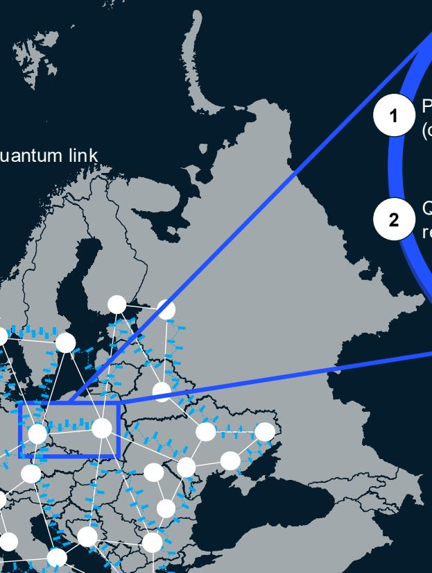

text_image

quantum link
1
2
P (c)
G
re

Fiber optic provides the most reliable signal but requires presence of infrastructure. This can be used to connect as many users as possible

Quantum network

Processing node (quantum computer)

Quantum epeater

3a

Quantum link

4

Classical link

# Key insights

1 Processing nodes can be future quantum computers (processors) connected through the network; these require sufficient storage time to enable communication   
2 Quantum repeaters amplify the signal and reduce error rates to enable communication over long distances   
3 Quantum links provide the infrastructure for the quantum information transfer. This is done through:

 3a

Fiber optic cables, connected with quantum repeaters—enabling mainly regional quantum networks

 3b

Free-space communication systems, based on satellite communication with a detector— enabling mainly global quantum networks

4

Classical links enable classical information transfer secured by quantum encryption protocols using quantum links

# 3. The QComm value chain is dominated by large, established technology players.

Nonexhaustive

<table><tr><td>Equipment and components</td><td>Hardware</td><td>Application software</td><td>Quantum network operator</td><td>Services</td></tr><tr><td>Supply of core elements—eg, lasers, single-photon sources, detectors—as building blocks for QComm devices</td><td>Devices for quantum protocols—eg, QKD systems, quantum repeaters, and quantum memories integrating components into functional systems</td><td>Software that controls and manages QComm systems, including encryption and networking, and serves as integration layer between hardware and network infrastructure</td><td>Infrastructure for QComm, such as QKD and networks, possibly in combination with classical telecom networks at the regional and national level</td><td>Support functions including consulting, deployment strategy, and maintenance for adoption and operationalization</td></tr></table>

# Key insights

QComm hardware is still in the development stage. Secure communication across short distances has been realized, yet (inter)continental connections require the development of quantum repeaters, which are expected in the next \~10 years   
Big global players have entered the hardware segment of the QComm market, yet mediumsize start-ups are more advanced in terms of technology. Therefore, big players are starting collaborations or even incubations   
The software market is relatively immature; various start-ups are scaling up   
Various telecommunications providers have started to invest in QComm; these are likely to fulfill the role of quantum network operators in the future

# 4. Quantum computers could break classical encryption, causing an inflection point for technology (known as Q-Day).

Illust ra tiv e

# Q-Day definition

The point at which quantum computers can break classical encryption, exposing sensitive data and creating an urgent need for quantum-safe security measures

# Impact post Q-Day1

Sensitive data using legacy encryption (including critical private information) becomes vulnerable, leading to potentially large economic and societal disruption   
Organizations and governments face immediate need to implement PQC and QKD to safeguard future operations   
Substantial investments may be made in PQC and QKD to enhance security and prevent data loss

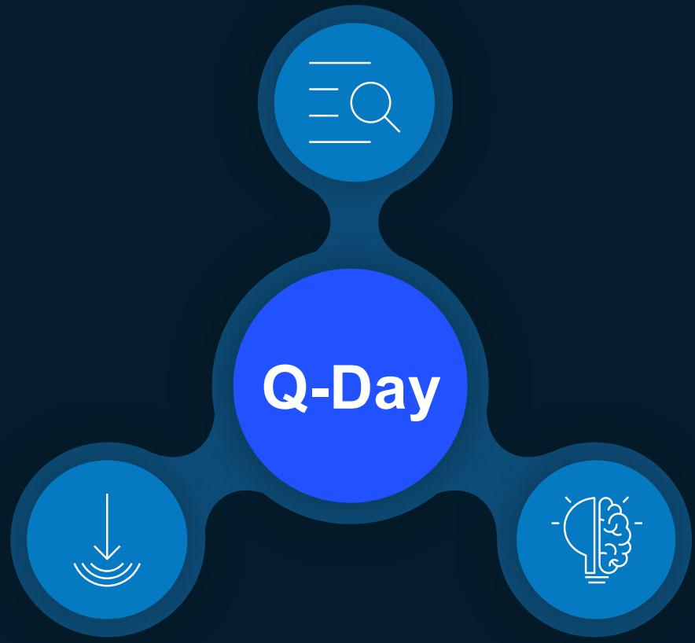

flowchart

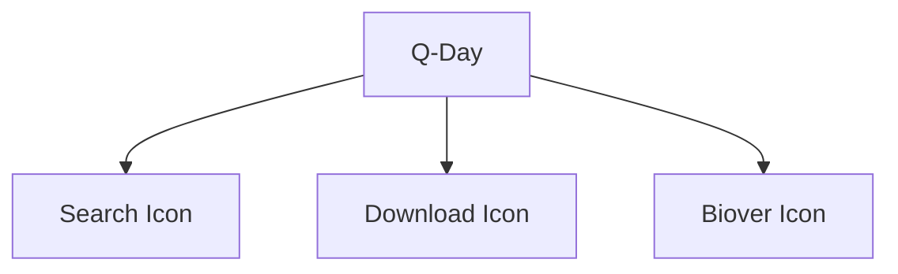
```mermaid
graph TD
    A["Q-Day"] --> B["Search Icon"]
    A --> C["Download Icon"]
    A --> D["Biover Icon"]
```

# Q-Day drivers

Breakthrough quantum algorithms that crack classical encryption standards   
Advances in error-correction techniques that drastically reduce the number of physical qubits needed to create a reliable logical qubit, making large-scale, fault-tolerant quantum computing practical   
Rapid hardware advances delivering stable, high-fidelity quantum systems

# 4. Classical security protocols could be susceptible to quantum attacks; business leaders may need to prepare for Q-Day.

Illust ra tiv e

# Quantum resource availability and requirements by year (illustrative), 2012–36

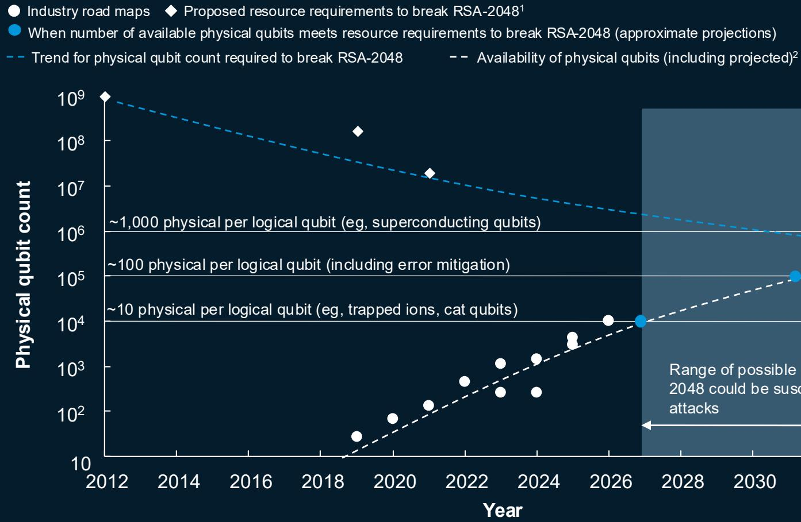

line

| Year | Industry road maps | Proposed resource requirements to break RSA-2048¹ | When number of available physical qubits meets resource requirements to break RSA-2048 (approximate projections) |
|------|---------------------|--------------------------------------------------|-----------------------------------------------------------------------------------|
| 2012 | -                   | 10⁹                                              | -                                                                                 |
| 2019 | -                   | -                                                | -                                                                                 |
| 2020 | ~10²                | -                                                | -                                                                                 |
| 2021 | ~10²                | ~10⁷                                             | -                                                                                 |
| 2022 | ~10³                | -                                                | -                                                                                 |
| 2023 | ~10³                | -                                                | -                                                                                 |
| 2024 | ~10³                | -                                                | -                                                                                 |
| 2025 | ~10⁴                | -                                                | -                                                                                 |
| 2026 | ~10⁴                | -                                                | ~10⁴                                                                              |
| 2030 | -                   | -                                                | ~10⁵                                                                              |

1. Craig Gidney and Martin Ekerå, “How to factor 2048-bit RSA integers in 8 hours using 20 million noisy qubits,” Quantum, April 2021.   
2. Historical for pre-2024, projected for post-2024.   
Source: Alice & Bob; Google; IBM; Microsoft; Quantinuum; QuEra; McKinsey analysis

# Key insights

. Once RSA-2048 is susceptible to quantum attacks (which could happen once \~1.000 logical qubits are reached), the first signs of Q-Day may show   
. However, timelines depend not only on number of qubits but also on the algorithms developed (ie, proposed resource requirement to break RSA-20481)   
Business leaders may need to prepare for Q-Day before RSA-2048 is susceptible to quantum attacks, eg, through PQC

# 4. Q-Day is expected to have a strong impact on verticals that are highly reliant on cryptography but have lower crypto-agility (1/2).

Low

Medium

High

<table><tr><td>Industry</td><td>Key segment</td><td>Cryptographic requirements1</td><td>Crypto- agility2</td><td>Q-Day impact3</td><td>Rationale</td><td>QKD adoption likelihood</td></tr><tr><td>Finance</td><td>Financial services</td><td>+++</td><td>+++</td><td>+++</td><td>High demand for secure communication and long-term storage; IT modernization efforts to help provide crypto- agility; high Q-Day impact due to diverse, highly distributed infrastructure</td><td>+++</td></tr><tr><td rowspan="3">Global energy and materials</td><td>Oil and gas</td><td>++</td><td>+</td><td>+</td><td>Limited secure communication requirements; low IT maturity; limited Q-Day impact</td><td>+</td></tr><tr><td>Sustainable energy</td><td>++</td><td>+</td><td>++</td><td>High security requirements for critical infrastructure; lower security requirements for other areas of segment</td><td>++</td></tr><tr><td>Chemicals</td><td>+</td><td>+</td><td>+</td><td>Limited secure communication requirements; lower IT maturity; limited Q-Day impact</td><td>+</td></tr><tr><td>Travel, transport, and logistics</td><td>Travel, transport, and logistics</td><td>++</td><td>++</td><td>++</td><td>Medium demand for secure communication and storage; digitalization efforts to enhance IT modernization to improve crypto-agility; medium Q-Day impact due to highly distributed infrastructure</td><td>++</td></tr><tr><td>Pharma and medical products</td><td>Healthcare</td><td>++</td><td>++</td><td>+++</td><td>IP and health records requiring secure communication and storage; some crypto-agility from digital technology influx; high Q-Day impact</td><td>++</td></tr></table>

Likely QKD adopters include industries with high Q-Day impact and low crypto-agility

1. “Cryptographic requirements” refers to degree of need for strict cryptographic standards.

2. High crypto-agility if software and hardware infrastructure are amenable to rapid updates of cryptographic systems.

3. Estimated degree to which Q-Day will affect operations.

Source: Expert interviews; press search; McKinsey analysis

# 4. Q-Day is expected to have a strong impact on verticals that are highly reliant on cryptography but have lower crypto-agility (2/2).

Low

Medium

High

<table><tr><td>Industry</td><td>Key segment</td><td>Cryptographic requirements1</td><td>Crypto-agility2</td><td>Q-Day impact3</td><td>Rationale</td><td>QKD adoption likelihood</td></tr><tr><td rowspan="4">Advanced industries</td><td>Automotive</td><td>++</td><td>++</td><td>++</td><td>Requires secure communication over long product lifetimes but limited compute</td><td>++</td></tr><tr><td>Aerospace and defense</td><td>+++</td><td>+++</td><td>+++</td><td>Strongly requires secure communication and storage, often with high crypto-agility</td><td>+++</td></tr><tr><td>Advanced electronics</td><td>++</td><td>++</td><td>++</td><td>Some security requirements (by customer) with digitalization; medium crypto-agility</td><td>++</td></tr><tr><td>Semiconductors</td><td>++</td><td>+</td><td>++</td><td>Some security requirements with complex value chain, some with low crypto-agility</td><td>++</td></tr><tr><td>Insurance</td><td>Insurance</td><td>+++</td><td>+++</td><td>+++</td><td>Strong requirements for security and privacy over long durations; growing digital presence helps enhance crypto-agility</td><td>+++</td></tr><tr><td rowspan="2">Telecom, media, and technology</td><td>Telecom</td><td>+++</td><td>++</td><td>+++</td><td>Strong security requirements with complex value chain, some with low crypto-agility</td><td>+++</td></tr><tr><td>Media</td><td>++</td><td>+++</td><td>++</td><td>Limited security and privacy requirements with high crypto-agility due to technology focus</td><td>++</td></tr><tr><td rowspan="2">Government</td><td>Defense</td><td>+++</td><td>+++</td><td>+++</td><td>Strong requirements for secure communication and storage; high crypto-agility</td><td>+++</td></tr><tr><td>Security</td><td>+++</td><td>+++</td><td>+++</td><td>Strongest requirements for secure communication and storage; high crypto-agility</td><td>+++</td></tr></table>

1. “Cryptographic requirements” refers to degree of need for strict cryptographic standards.

2. High crypto-agility if software and hardware infrastructure are amenable to rapid updates of cryptographic systems.

3. Estimated degree to which Q-Day will affect operations.

# 4. Signals that indicate acceleration or deceleration toward Q-Day can inform strategic decision-making.

<table><tr><td>Type</td><td>Signal</td><td>Description</td><td>Examples</td></tr><tr><td rowspan="5">Acceleration</td><td>Changes in investment patterns</td><td>Shifts in public or private investments could indicate imminent or achieved breakthroughs in QT</td><td>Increases in government funding for QT research</td></tr><tr><td>Major technological breakthroughs</td><td>Technological breakthroughs critical to the technology road map are announced, ideally by multiple players, indicating successful R&amp;D</td><td>Scaling of qubits, quantum repeaters</td></tr><tr><td>Adherence to announced timelines</td><td>Commitment and ability to remain on schedule indicate that major issues in R&amp;D and production are likely resolved</td><td>Achieving milestones for logical qubits (eg, gate fidelity)</td></tr><tr><td>Increased partnerships</td><td>Depending on partnership profiles, partnerships may indicate strong desire to grow quickly beyond local networks</td><td>Announcement of use case breakthroughs through partnership</td></tr><tr><td>Changes in publication, patent activity</td><td>Significant increase or abrupt decrease in publication or patent activity provides insights into maturity of emerging technologies</td><td>Published research showing improved fidelity, acceleration in patents awarded</td></tr><tr><td rowspan="4">Deceleration</td><td>Reduced investment</td><td>Reduced investment discourages new companies (especially those with large capital expenditure requirements) and may slow tech development</td><td>Fewer deals, leading to less investment in QT</td></tr><tr><td>Increasing adoption of competing technologies</td><td>Emergence of competing solutions may indicate the challenges of a competitive market</td><td>Widespread adoption of PQC, reducing demand for QKD</td></tr><tr><td>Redirected resources</td><td>Companies pivoting away from technologies such as fault-tolerant quantum computing may indicate that technology development has stalled or there are other commercially suitable alternatives</td><td>Pivoting from QC to AI; QKD companies refocusing on PQC</td></tr><tr><td>Slowing innovation</td><td>Technical obstacles prevent major breakthroughs in scaling quantum computers</td><td>QC players missing milestones for logical qubits</td></tr></table>

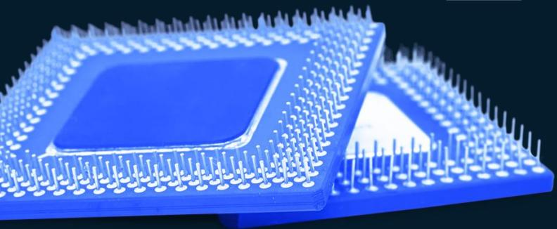

natural_image

Close-up of a blue integrated circuit chip with multiple pins, showing internal structure and mounting holes (no text or symbols visible)

# Contents

natural_image

Abstract illustration of a blue 3D chip surrounded by circuit board patterns on a dark background (no text or symbols)

Introduction

Innovations and breakthroughs

Market size and value at stake

Investment landscape

 Private funding   
 Public announcements

Clusters and start-ups

Value chain

Deep dive into QComm

QT impact on cutting-edge technologies

Methodology and acknowledgments

# QT has significant synergies and mutual impact with selected cutting-edge technologies.

Technologies selected from McKinsey Technology Trends Outlook

Nonexhaustive

Mutual impact between QT and cuttingedge technologies

natural_image

Abstract blue circular logo design on dark background (no text or symbols)

A

AI and machine learning

Play a central role in accelerating quantum software; benefit significantly from the computational power quantum computers could offer

B

Robotics

Drives automation in quantum manufacturing and potentially benefits from QT through enhanced computing power, optimized software applications, secure communication and authentication, and improved navigation and sensing precision

C

Sustainability and climate tech

Demand energy-efficient, high-impact solutions, making them both beneficiaries and drivers of innovation in quantum technologies— with significant benefits from boosted computing power, algorithm optimization, and molecular simulation

D

Cryptography and cybersecurity

Face both existential risks and transformative opportunities from quantum capabilities; potentially a critical area of impact

# QT is an essential catalyst—enabling and accelerating breakthroughs in a wide array of cutting-edge technologies.

Impact of QT on cutting-edge technologies, selected high-impact topics

Nonexhaustive

Relevance for QT pillars

Deep dives to follow

QC

# AI and machine learning

QC improves AI algorithm efficiency through quantum algorithms

QC increases memory size through quantum hardware

QC speeds up memory loading time through quantum hardware

QC enhances AI training through increased computing power

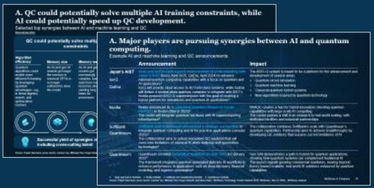

text_image

A. QC could potentially solve multiple AI training constraints, while AI could potentially speed up QC development.
A. Major players are pursuing synergies between AI and quantum computing.
Examples: 
GC could potentially solve various AI constraints
Japan's KST
G24
G25
G26
G27
G28
G29
G30
G31
G32
G33
G34
G35
G36
G37
G38
G39
G40
G41
G42
G43
G44
G45
G46
G47
G48
G49
G50
G51
G52
G53
G54
G55
G56
G57
G58
G59
G60
G61
G62
G63
G64
G65
G66
G67
G68
G69
G70
G71
G72
G73
G74
G75
G76
G77
G78
G79
G80
G81
G82
G83
G84
G85
G86
G87
G88
G89
G90
G91
G92
G93
G94
G95
G96
G97
G98
G99
G100
Japan's KST
G24
G25
G26
G27
G28
G29
G30
G31
G32
G33
G34
G35
G36
G37
G38
G39
G40
G41
G42
G43
G44
G45
G46
G 800 (in %) (in %) (in %) (in %) (in %) (in %) (in %) (in %) (in %) (in %) (in %) (in %) (in %) (in %) (in %) (in %) (in %) (in %) (in %) (in %) (in %) (in %) (in %) (in %)
Japan's KST - Can be able to use AI in the AI environment for AI and quantum computing. The AI is designed to perform AI in the AI environment for AI and quantum computing. To ensure AI is designed to use AI in the AI environment for AI and quantum computing. To ensure AI is designed to use AI in the AI environment for AI and quantum computing. To ensure AI is designed to use AI in the AI environment for AI and quantum computing. To ensure AI is designed to use AI in the AI environment for AI and quantum computing. To ensure AI is designed to use AI in the AI environment for AI and quantum computing. To ensure AI is designed to use AI in the AI environment for AI and quantum Computing. To ensure AI is designed to use AI in the AI environment for AI and quantum computing. To ensure AI is designed to use AI in the AI environment for AI and quantum computing. To ensure AI is designed to use AI in the AI environment for AI and quantum computing. To ensure AI is designed to use AI in the AI environment for AI and quantum computing. To ensure AI is designed to use AI in the AI environment for AI and quantum computing. To ensure AI is designed to use AI, I can be able to use AI in the AI environment for AI and quantum computing. To ensure AI is designed to use AI in the AI environment for AI and quantum computing. To ensure AI is designed to use AI in the AI environment for AI and quantum computing. To ensure AI is designed to use AI in the AI environment for AI and quantum computing. To ensure AI is designed to use AI in the AI environment for AI and quantum computing. To ensure AI is designed to use AI in the AI environment for AI, I can be able to use AI in the AI environment for AI and quantum computing. To ensure AI is designed to use AI in the AI environment for AI and quantum computing. To ensure AI is designed to use AI in the AI environment for AI and quantum computing. To ensure AI is designed to use AI in the AI environment for AI and quantum computing. To ensure AI is designed to use AI in the AI environment for AI and quantum computing. To ensure AI is designed to use AI, I can be able to run into an AI environment for each of the four levels of the four levels of the four levels of the four levels of the four levels of the four levels of the four levels of the four levels of the four levels of the four levels of the four levels of the four levels of the four levels of the four levels of the four levels of the four levels of the four levels of the four levels of the four levels of the four levels of the four levels of the four levels of the four levels of the four levels of the four levels of the four level of the four levels of the four levels of the four levels of the four levels of the four levels of the four levels of the four levels of the four levels of the four levels of the four levels of the four levels of the four levels of the four levels of the four levels of the four levels of the four levels of the four levels of the four levels of the four levels of the four levels of the four levels of the four levels of the four levels of the four levels of the four layers from each other layer. To ensure that all layers have been used, we will continue using a single layer with a multi-layered structure or multi-layered structure, which is used by using a multi-layered structure or multi-layered structure, which is used by using a multi-layered structure or multi-layered structure, which is used by using a multi-layered structure or multi-layered structure, which is used by using a multi-layered structure or multi-layered structure, which is used by using a multi-layered structure or multi-layered structure, which is used by using a multi-layered structure or multi-layered structure, which is used by using a multi-layering structure or multi-layered structure, which is used by using a multi-layered structure or multi-layered structure, which is used by using a multi-layered structure or multi-layered structure, which is used by using a multi-layered structure or multi-layered structure, which is used by using a multi-layered structure or multi-layered structure, which is used by using a multi-layered structure or multi-layered structure, which is used by using a multi-layered structure or multi-tiered structure, which is used by using a multi-layered structure or multi-layered structure, which is used by using a multi-layered structure or multi-layered structure, which is used by using a multi-layered structure or multi-layered structure, which is used by using a multi-layered structure or multi-layered structure, which is used by using a multi-layered structure or multi-layered structure, which is used by using a multi-layered structure or multi-layered structure, whereas using a multi-layered structure or multi-layered structure, which is used by using a multi-layered structure or multi-layered structure, which is used by using a multi-layered structure or multi-layered structure, which is used by using a multi-layered structure or multi-layered structure, which is used by using a multi-layered structure or multi-layered structure, which is used by using a multi-layered structure or multi-layered structure, which is used by using a multi-Layer model. To ensure that all layers have been run into an AI environment for each other layer, we will continue using a single layer with a multi-layered structure or multi-layered structure, which is used by using a multi-layered structure or multi-layered structure, which is used by using a multi-layered structure or multi-layered structure, which is used by using a multi-layered structure or multi-layered structure, which is used by using a multi-layered structure or multi-layered structure, which is used by using a multi-layered structure or multi-layered structure. To ensure that all layers have been run into an AI environment for each other layer, we will continue using a single layer with a multi-layered structure or multi-layered structure, which is used by using a multi-layered structure or multi-layered structure, which is used by using a multi-layered structure or multi-layered structure, which is used by using a multi-layered structure or multi-layered structure, which is used by using a multi-layered structure or multi-layered structures, which is used by using a multi-layered structure or multi-layered structures, which is used by using a multi-layered structures, which is used by using a multi-layered structures, which is used by using a multi-layered structures, which is used by using a multi-layered structures, which is used by using a multi-layered structures, which is used by using a multi-layered structures, which is used by using a multi-layered structures, which is used by using a multi-layered structures, which is used by using a multi-layered structures, which is used by using a three-tier system with one layer being done out at each other layer.

# Robotics

QC boosts computing power and optimizes software applications

QComm secures communication between robots and enables quantum authenticated access

QS enhances navigation and sensing precision

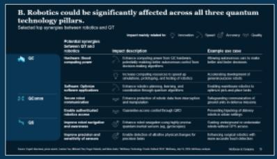

text_image

B. Robotics could be significantly affected across all three quantum technology pillars.
Selected for synergistic performance index and QT
Functional objectives
Solutions (QT) and QOT
Import description
Examples one case
Members: Broad computing power
1. Features the operating power from GC databases primarily working under autonomous control (GCP) systems
2. Features the operating power in space using GCP systems
3. Features the operating power in space using GCP systems
4. Features the operating power in space using GCP systems
5. Features the operating power in space using GCP systems
6. Features the operating power in space using GCP systems
7. Features the operating power in space using GCP systems
8. Features the operating power in space using GCP systems
9. Features the operating power in space using GCP systems
10. Features the operating power in space using GCP systems
11. Features the operating power in space using GCP systems
12. Features the operating power in space using GCP systems
13. Features the operating power in space using GCP systems
14. Features the operating power in space using GCP systems
15. Features the operating power in space using GCP systems
16. Features the operating power in space using GCP systems
17. Features the operating power in space using GCP systems
18. Features the operating power in space using GCP systems
19. Features the operating power in space using GCP systems
20. Features the operating power in space using GCP systems
21. Features the operating power in space using GCP systems
22. Features the operating power in space using GCP systems
23. Features the operating power in space using GCP systems
24. Features the operating power in space using GCP systems
25. Features the operating power in space using GCP systems
26. Features the operating power in space using GCP systems
27. Features the operating power in space using GCP systems
28. Features the operating power in space using GCP systems
29. Features the operating power in space using GCP systems
30. Features the operating power in space using GCP systems
31. Features the operating power in space using GCP systems
32. Features the operating power in space using GCP systems
33. Features the operating power in space using GCP systems
34. Features the operating power in space using GCP systems
35. Features the operating power in space using GCP systems
36. Features the operating power in space using GCP systems
37. Features the operating power in space using GCP systems
38. Features the operating power in space using GCP systems
39. Features the operating power in space using GCP systems
40. Features the operating power in space using GCP systems
41. Features the operating power in space using GCP systems
42. Features the operating power in space using GCP systems
43. Features the operating power in space using GCP systems
44. Features the operating power in space using GCP systems
45. Features the operating power in space using GCP systems
46. Features the operating power in space using GCP systems
47. Features the operating power in space using GCP systems
48. Features the operating power in space using GCP systems
49. Features the operating power in space using GCP systems
50. Features the operating power in space using GCP systems
51. Features the operating power in space using GCP systems
52. Features the operating power in space using GCP systems
53. Features the operating power in space using GCP systems
54. Features the operating power in space using GCP systems
55. Features the operating power in space using GCP systems
56. Features the operating power in space using GCP systems
57. Features the operating power in space using GCP systems
58. Features the operating power in space using GCP systems
59. Features the operating power in space using GCP systems
60. Features the operating power in space using GCP systems
61. Features the operating power in space using GCP systems
62. Features the operating power in space using GCP systems
63. Features the operating power in space using GCP systems
64. Features the operating power in space using GCP systems
65. Features the operating power in space using GCP systems
66. Features the operating power in space using GCP systems
67. Features the operating power in space using GCP systems
68. Features the operating power in space using GCP systems
69. Features the operating power in space using GCP systems
70. Features the operating power in space using GCP systems
71. Features the operating power in space using GCP systems
72. Features the operating power in space using GCP systems
73. Features the operating power in space using GCP systems
74. Features the operating power in space using GCP systems
75. Features the operating power in space using GCP systems
76. Features the operating power in space using GCP systems
77. Features the operating power in space using GCP systems
78. Features the operating power in space using GCP systems
79. Features the operating power in space using GCP systems
80. Features the operating power in space using GCP systems
81. Features the operating power in space using GCP systems
82. Features the operating power in space using GCP systems
83. Features the operating power in space using GCP systems
84. Features the operating power in space using GCP systems
85. Features the operating power in space using GCP systems
86. Features the operating power in space using GCP systems
87. Features the operating power in space using GCP systems
88. Features the operating power in space using GCP systems
89. Features the operating power in space using GCP systems
90. Features the operating power in space using GCP systems
91. Features the operating power in space using GCP systems
92. Features the operating power in space using GCP systems
93. Features the operating power in space using GCP systems
94. Features the operating power in space using GCP systems
95. Features the operating power in space using GCP systems
96. Features the operating power in space using GCP systems
97. Features the operating power in space using GCP systems
98. Features the operating power in space using GCP systems
99. Features the operating power in space using GCP systems
100. Features the operating power in space using GCP systems

QComm

# Sustainability and climate tech

QC improves computing power to accelerate material discovery

QC improves simulation of complex systems, specifically systems with quantum behavior

QC enhances optimization in production through quality and speed of optimization problems

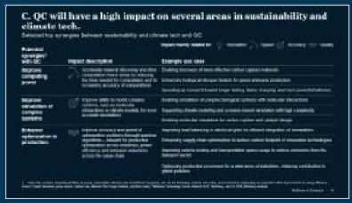

text_image

C: QC will have a high impact on several areas in sustainability and climate tech.
Subsequently, the impact between sustainability and climate tech and QC
Potential (expans) vs. Material (expans)
Import description
Examples for case
Importing materials of more efficient solar cells (optical material)
Importing solar cell or solar cell with more efficient solar cells (optical cells)
Importing solar cell or solar cell with more efficient solar cells (optical cells)
Importing materials of more efficient solar cells (optical cells)
Importing materials of more efficient solar cells (optical cells)
Importing materials of more efficient solar cells (optical cells)
Importing materials of more efficient solar cells (optical cells)
Importing materials of more efficient solar cells (optical cells)
Importing materials of more efficient solar cells (optical cells)
Importing materials of more efficient solar cells (optical cells)
Importing materials of more efficient solar cells (optical cells)

Importing materials of more efficient solar cells (optical cells)
Importing materials of more efficient solar cells (optical cells)
Importing materials of more efficient solar cells (optical cells)
Importing materials of more efficient solar cells (optical cells)
Importing materials of more efficient solar cells (optical cells)
Importing materials of more efficient solar cells (optical cells)
Importing materials of more efficient solar cells (optical cells)
Importing materials of more efficient solar cells
Importing materials of more efficient solar cells (optical cells)
Importing materials of more efficient solar cells (optical cells)
Importing materials of more efficient solar cells (optical cells)
Importing materials of more efficient solar cells (optical cells)
Importing materials of more efficient solar cells (optical cells)
Importing materials of more efficient solar cells (optical cells)
Importing materials of more efficient solar cells (optical cells)
Importing materials of more efficient solar cells( optical) 
Importing materials of more efficient solar cells( optical) 
Importing materials of more efficient solar cells( optical) 
Importing materials of more efficient solar cells( optical) 
Importing materials of more efficient solar cells( optical) 
Importing materials of more efficient solar cells( optical) 
Importing materials of more efficient solar cells( optical) 
Importing materials of more efficient solar cells( optical) 
Importing materials of more efficient solar cells ( optical) 
Importing materials of more efficient solar cells ( optical) 
Importing materials of more efficient solar cells ( optical) 
Importing materials of more efficient solar cells ( optical) 
Importing materials of more efficient solar cells ( optical) 
Importing materials of more efficient solar cells ( optical) 
Importing materials of more efficient solar cells ( optical) 
Importing materials of more efficient solar cells ( optical) 
Importing materials of less efficient solar cells ( optical) 
Importing materials of less efficient solar cells ( optical) 
Importing materials of less efficient solar cells ( optical) 
Importing materials of less efficient solar cells ( optical) 
Importing materials of less efficient solar cells ( optical) 
Importing materials of less efficient solar cells ( optical) 
Importing materials of less efficient solar cells ( optical) 
Importing materials of less efficient solar cells ( optical) 
imported to the use of these technologies for reducing the use of these technologies for reducing the use of these technologies for reducing the use of these technologies for reducing the use of these technologies for reducing the use of these technologies for reducing the use of these technologies for reducing the use of these technologies for reducing the use of these technologies for reducing the use of these technologies for reducing the use of these technologies for reducing the use of these technologies for reducing the use of these technologies for reducing the use of these technologies for reducing the use of these technologies for reducing theuse of these technologies for reducing theuse of these technologies for reducing theuse of these technologies for reducing theuse of these technologies for reducing theuse of these technologies for reducing theuse of these technologies for reducing theuse of these technologies for reducing theuse of these technologies for reducing theuse of these technologies for reducing theuse of these technologies for reducing theuse of these technologies for reducing theuse of these technologies for reducing theuse of these technologies for reducing theuse of these technologies for reducing theuse of this technology
1. Use an optimal temperature range from 0 to 25 degrees Celsius; Use an optimal temperature range from 25 to 50 degrees Celsius; Use an optimal temperature range from 50 to 100 degrees Celsius; Use an optimal temperature range from 100 to 200 degrees Celsius; Use an optimal temperature range from 200 to 500 degrees Celsius; Use an optimal temperature range from 500 to 1000 degrees Celsius; Use an optimal temperature range from 1000 to 2000 degrees Celsius; Use an optimal temperature range from 2000 to 5000 degrees Celsius; Use an optimal temperature range from 5000 to 10000 degrees Celsius; Use an optimal temperature range from 10000 to 20000 degrees Celsius; Use an optimal temperature range from 20000 to 50000 degrees Celsius; Use an optimal temperature range from 50000 to 100000 degrees Celsius; Use an optimal temperature range from 10000 to 20000 degrees Celsius; Use an optimal temperature range from 2000 to 50000 degrees Celsius; Use an optimal temperature range from 5000 to 100000 degrees Celsius; Use an optimal temperature range from 1000 to 20000 degrees Celsius; Use an optimal temperature range from 200 to 5000 degrees Celsius; Use an optimal temperature range from 50 to 100 degrees Celsius; Use an optimal temperature range from 10 to 20 degrees Celsius; Use an optimal temperature range from 2 to 50 degrees Celsius; Use an optimal temperature range from 5 to 10 degrees Celsius; Use an optimal temperature range from 1 to 2 degrees Celsius; Use an optimal temperature range from 2 to 5 degrees Celsius; Use an optimal temperature range from 5 to 10 degrees Celsius; Use an optimal temperature range from 1 to 2 degrees Celsius; Use an optimal temperature range from 2 to 5 degrees Celsius; Use an optimal temperature range from 5 to 10 degrees Celsius; Use an optimal temperature range from 1 to 2 degrees Celsius; Use an optimal temperature range from 2 to 5 degrees Celsius; Use an optimal temperature range from 5 to 2 degrees Celsius; Use an optimal temperature range from 1 to 2 degrees Celsius; Use an optimal temperature range from 2 to 5 degrees Celsius; Use an optimal temperature range from 5 to 10 degrees Celsius; Use an optimal temperature range from 1 to 2 degrees Celsius; Use an optimal temperature range from 2 to 5 degrees Celsius; Use an optimal temperature range from 5 to 10 degrees Celsius; Use an optimal temperature range from 1 to 3 degrees Celsius; Use an optimal temperature range from 2 to 5 degrees Celsius; Use an optimal temperature range from 5 to 10 degrees Celsius; Use an optimal temperature range from 1 to 3 degrees Celsius; Use an optimal temperature range from 2 to 5 degrees Celsius; Use an optimal temperature range from 5 to 10 degrees Celsius; Use an optimal temperature range from 1 to 3 degrees Celsius; Use an optimal temperature range from 2 to 6 degrees Celsius; Use an optimal temperature range from 5 to 10 degrees Celsius; Use an optimal temperature range from 1 to 3 degrees Celsius; Use an optimal temperature range from 2 to 6 degrees Celsius; Use an optimal temperature range from 5 to 10 degrees Celsius; Use an optimal temperature range from 1 to 3 degrees Celsius; Use an optimal temperature range from 2 to 6 degrees Celsius; Use an optimal temperature range from 5 to 2 degrees Celsius; Use an optimal temperature range from 1 to 4 degrees Celsius; Use an optimal temperature range from 2 to 6 degrees Celsius; Use an optimal temperature range from 5 to 10 degrees Celsius; Use an optimal temperature range from 1 to 4 degrees Celsius; Use an optimal temperature range from 2 to 6 degrees Celsius; Use an optimal temperature range from 5 to 10 degrees Celsius; Use an optimal temperature range from 1 to 4 degrees Celsius; Use an optimal temperature range from 2 to 6 degrees Celsius; Use an optimal temperature range from 5 to 10 degrees Celsius; Use an optimal temperature range from 1 to 3 degrees Celsius; Use an optimal temperature range from 2 to 6 degrees Celsius; Use an optimal temperature range from 5 to 10 degrees Celsius; Use an optimal temperature range from 1 to 3 degrees Celsius; Use an optimal temperature range from 2 to 4 degrees Celsius; Use an optimal temperature range from 5 to 10 degrees Celsius; Use an optimal temperature range from 1 to 3 degrees Celsius; Use an optimal temperature range from 2 to 6 degrees Celsius; Use an optimal temperature range from 5 to 10 degrees Celsius; Use an optimal temperature range from 1 to 3 degrees Celsius; Use an optimal temperature range from 2 to 6 degrees Celsius; Use an optimal temperature range from 5 to 3 degree Celsius; Use an optimal temperature range from 1 to 4 degree Celsius; Use an optimal temperature range from 2 to 6 degree Celsius; Use an optimal temperature range from 5 to 1 degree Celsius; Use an optimal temperature range from 1 to 3 degree Celsius; Use an optimal temperature range from 2 to 6 degree Celsius; Use an optimal temperature range from 5 to 1 degree Celsius; Use an optimal temperature range from 1 to 3 degree Celsius; Use an optimal temperature range from 2 to 6 degree Celsius; Use an optimal temperature range from 5 to 1 degree Celsius; Use an optimal temperature range from 1 to 3 degree Celsius; Use an optimal temperature range from 2 to 6 degree°C;
* The data is presented in Table C.

QS

# Cryptography and cybersecurity

QC threatens classical cryptography and provides new cybersecurity solutions

QComm enables new security protocols (eg, from classical to quantum-based QKD), and improves security standards through quantum random number generation

Deep dive in QComm section

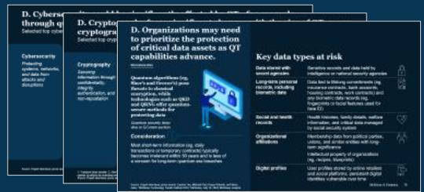

text_image

D. Cybersh
through of
Selected top types
Cybersecurity
Financing
system, networks, and
R&D & EQUITY
Organography
Emerging
Information through
the system, network, and
R&D & EQUITY
and acquisition
D. Cryptos
cycling
demonstrating the protection
of critical data assets as QT
capabilities advance.
Quantum algorithms (e.g.
Quantum algorithms, e.g.
Quantum algorithms, e.g.
Quantum algorithms, e.g.
Quantum algorithms, e.g.
Quantum algorithms, e.g.
Quantum algorithms, e.g.
Quantum algorithms, e.g.
Quantum algorithms, e.g.
Quantum algorithms, e.g.
Quantum algorithms, e.g.
Quantum algorithms, e.g.
Quantum algorithms, e.g.
Quantum algorithms, e.g.
Quantum algorithms, e.g.
Quantum algorithms, e.g. 
Key data types at risk
Data stored with
accessing datasets
Long-term personal
intra-organizational
Technical data
Data stored in training environment (e.g.
Intra-organizational data)
Data stored in training environment (e.g.
Intra-organizational data)
Data stored in training environment (e.g.
Intra-organizational data)
Data stored in training environment (e.g.
Intra-organizational data)
Data stored in training environment (e.g.
Intra-organizational data)
Data stored in training environment (e.g.
Intra-organizational data)
Data stored in training environment (e.g.
Intra-organizational data)
Data stored in the training environment (e.g.
Intra-organizational data)
Data stored in the training environment (e.g.
Intra-organizational data)
Data stored in the training environment (e.g.
Intra-organizational data)
Data stored in the training environment (e.g.
Intra-organizational data)
Data stored in the training environment (e.g.
Intra-organizational data)
Data stored in the training environment (e.g.
Intra-organizational data)
Data used to create a new data source
Data used to create a new data source
Data used to create a new data source
Data used to create a new data source
Data used to create a new data source
Data used to create a new data source
Data used to create a new data source
Data used to create a new data source
Data used to create a new data source
Data used to create a new data source
Data used to create a new data source
Data used to create a new data source
Key data types at risk
Data stored with
accessing datasets
Long-term personal
intra-organizational
Technical data
Data stored in training environment (e.g.
Intra-organizational data)
Data stored in training environment (e.g.
Intra-organizational data)
Data stored in training environment (e.g.
Intra-organizational data)
Data stored in the training environment (e.g.
Intra-organizational data)
Data used to create a new data source
Data used to create a new data source
Data used to create a new data source
Data used to create a new data source
Data used to create a new data source
Data used to create a new data source
Key data types at risk
Data stored with
accessing datasets
Long-term personal
intra-organizational
Technical data
Data stored in training environment (e.g.
Intra-organizational data)
Data stored within training environment (e.g.
intra-organizational data)
Data stored within training environment (e.g.
intra-organizational data)
Data stored within training environment (e.g.
intra-organizational data)
Data used to create a new data source
Data used to create a new data source
Data used to create a new data source
Data used to create a new data source
Key data types at risk
Data stored with
accessing datasets
Long-term personal
intra-organizational
Technical data
Data stored in training environment (e.g.
Intra-organizational data)
Data stored within training environment (e.g.
intra-organizational data)
Data stored within training environments (e.g.
intra-organizational data)
Data stored within training environment (e.g.
intra-organizational data)
Data used to create a new data source
Data used to create a new data source
Data used to create a new data source
Data used to create a new data source
Key data types at risk
Data stored with
accessing datasets
Long-term personal
intra-organizational
Technical data
Data stored in training environment (e.g.
intra-organizational data)
Data stored within training environment (e.g.
intra-organizational data)
Data stored within training environment (e.g.
intra-organizational data)
Data stored within training environment (e.g.
intra-organizational data)
Data used to create a new data source
Data used to create a new data source
Data used to create a new data source
Data used to create a new data source

# A. QC could potentially solve multiple AI training constraints, while AI could potentially speed up QC development.

Selected top synergies between AI and machine learning and QC

Nonexhaustive

# QC could potentially solve multiple AI training constraints

# Algorithm efficiency

Quantum algorithms could enable more efficient AI training by leveraging quantum advantages—eg, in linear algebra, search, and optimization routines

# Memory size

As AI and gen AI models get larger, the memory in classical GPUs is no longer sufficient to store the model

# Memory wall

As AI and gen AI models get increasingly complex, loading data from memory becomes slow, yielding long idling times for processors

# Compute power

The required compute power to train the largest AI an d gen AI models grows exponentially, but classical compute no longer exhibits this growth

natural_image

Illustration of a laptop with '3.0.10' displayed on screen, enclosed in concentric white circles (no text or symbols)

natural_image

Abstract icon of a blue server room inside a circular frame (no text or symbols)

natural_image

Abstract graphic of a human head silhouette with a brain inside, enclosed in concentric white circles (no text or symbols)

natural_image

Illustration of a blue integrated circuit chip with a colorful internal component, enclosed in concentric white circles (no text or symbols)

# AI could potentially speed up development of QC hardware and software

# QC hardware

AI can support discovery of enhanced materials (eg, superconductors) and improve fabrication by reducing defects through datadriven process optimization

# QC software and applications

AI can support the development of optimized quantum code and can potentially speed up certain quantum applications and algorithms

# Hybrid integration

Hybrid systems will combine classical computing and QC , with AI optimizing when and how tasks are offloaded to quantum processors to improve performance

# Error correction and calibration

AI and machine learning models could potentially identify noise patterns, optimize error-correction strategies, and automate calibration

natural_image

Abstract icon of a microchip with four small components inside a blue circular frame (no text or symbols)

natural_image

Abstract icon of a cloud with arrows inside concentric blue circles (no text or symbols)

natural_image

Abstract blue icon of a glowing sensor or sensor with concentric circular layers, no text or symbols present.

natural_image

Blue line icon of two wrenches inside a circular outline (no text or symbols)

Successful yield of synergies requires significant cross-collaboration between AI and machine learning and QC, including cross-cutting talent

# A. Major players are pursuing synergies between AI and quantum computing.

Example AI and machine learning and QC announcements

<table><tr><td></td><td>Announcement</td><td>Impact</td></tr><tr><td>Japan&#x27;s AIST</td><td>IonQ and QuEra each signed memorandum of understanding with Japan&#x27;s AIST (IonQ, April 2025; QuEra, April 2024) to advance national quantum computing capabilities with a focus on quantum and AI applications1</td><td rowspan="3">The ABCI-Q system is meant to be a platform for the advancement and development of several areas:• Quantum circuit simulation• Quantum machine learning• Classical-quantum hybrid systems• New algorithms inspired by quantum technology</td></tr><tr><td>IonQ</td><td rowspan="2">IonQ will provide cloud access to its Forte-class systems, while QuEra will deliver a neutral-atom quantum computer to integrate with AIST&#x27;s Nvidia-powered ABCI-Q supercomputer with the goal of creating a hybrid platform for simulations and quantum-AI applications1</td></tr><tr><td>QuEra</td></tr><tr><td>Nvidia</td><td>Nvidia announced its Accelerated Quantum Research Center (NVAQC) in Boston (March 2025)2The center will integrate quantum hardware with AI supercomputing infrastructure2</td><td>NVAQC creates a hub for hybrid innovation, blending quantum capabilities with large-scale AI computingThe center pushes a shift from research to real-world scaling, with dedicated facilities and industrial partnerships</td></tr><tr><td>SoftBank</td><td>SoftBank and Quantinuum announced a strategic partnership to integrate quantum computing and AI for practical applications (January 2025)3The collaboration aims to unlock innovative QC solutions that will overcome limitations of classical AI while realizing next-generation technologies3</td><td>The collaboration combines SoftBank&#x27;s scale with Quantinuum&#x27;s quantum capabilities. Partnership aims to achieve breakthroughs by developing QC solutions that surpass current limitations of AI</td></tr><tr><td>Quantinuum</td><td>Quantinuum unveiled Generative Quantum AI (Gen QAI) in February 20254The framework integrates quantum-generated data into AI workflows to enhance performance in applications such as drug discovery, financial modeling, and logistics optimization4</td><td>Gen QAI demonstrates a path to hybrid AI–quantum applications, showing how quantum systems can complement traditional AIThe launch signals growing commercial readiness, moving beyond theory toward scalable, real-world AI solutions enhanced by quantum capabilities</td></tr></table>

1. IonQ and QuEra websites. 2. Nvidia website. 3. SoftBank and Quantinuum websites. 4. Quantinuum website.   
Source: Expert interviews; press search; Lareina Yee, Michael Chui, Roger Roberts, and Mena Issler, “McKinsey Technology Trends Outlook 2024,” McKinsey, July 16, 2024; ; McKinsey analysis

# B. Robotics could be significantly affected across all three quantum technology pillars.

Selected top synergies between robotics and QT

Impact mainly related to:

Innovation

Speed

Accuracy

Quality

<table><tr><td colspan="2"></td><td>Potential synergies between QT and robotics</td><td colspan="2">Impact description</td><td>Example use case</td></tr><tr><td rowspan="3"></td><td rowspan="3">QC</td><td rowspan="2">Hardware: Boost computing power</td><td></td><td>Enhance computing power from QC hardware, potentially enabling better autonomous control from decision-making algorithms</td><td>Allowing autonomous cars to make better and faster decisions</td></tr><tr><td></td><td>Increase computing resources to speed up simulations, prototyping, and testing of robotics</td><td>Accelerating development of general-purpose robots</td></tr><tr><td>Software: Optimize software applications</td><td></td><td>Enhance robotics planning, learning, and coordination through quantum algorithms</td><td>Enabling warehouse robotics to optimize pick-and-place tasks</td></tr><tr><td rowspan="2"></td><td rowspan="2">QComm</td><td>Secure robot communication</td><td></td><td>Enhance protection of robotic data from interception and manipulation</td><td>Safeguarding communication of ground units in defense missions</td></tr><tr><td>Enable authenticated robotics access</td><td></td><td>Guarantee access control through QKD</td><td>Preventing hijacking of delivery robots in urban settings</td></tr><tr><td rowspan="2"></td><td rowspan="2">QS</td><td>Improve robot navigation and awareness</td><td></td><td>Enhance robot navigation using highly precise quantum inertial sensors (eg, gyroscopes)</td><td>Guiding underground or underwater robots without GPS access</td></tr><tr><td>Improve precision and sensitivity of sensors</td><td></td><td>Enable detection of ultrafine physical changes for precision tasks</td><td>Enhancing surgical robotics with more accurate touch detection</td></tr></table>

# C. QC will have a high impact on several areas in sustainability and climate tech.

Selected top synergies between sustainability and climate tech and QC

<table><tr><td rowspan="2">Potential synergies1with QC</td><td rowspan="2">Impact description</td><td>Impact mainly related to: Innovation Speed Accuracy Quality</td></tr><tr><td>Example use case</td></tr><tr><td rowspan="3">Improve computing power</td><td rowspan="3"></td><td>Enabling discovery of more effective carbon capture materials</td></tr><tr><td>Enhancing biological nitrogen fixation for green ammonia production</td></tr><tr><td>Speeding up research toward longer-lasting, faster-charging, and more powerful batteries</td></tr><tr><td rowspan="3">Improve simulation of complex systems</td><td rowspan="3"></td><td>Enabling simulation of complex biological systems with molecular interactions</td></tr><tr><td>Supporting climate modeling and scenario-based simulation with high complexity</td></tr><tr><td>Enabling molecular simulation for carbon capture and catalyst design</td></tr><tr><td rowspan="4">Enhance optimization in production</td><td rowspan="4"></td><td>Improving load balancing in electrical grids for efficient integration of renewables</td></tr><tr><td>Enhancing supply chain optimization to reduce carbon footprint of renewable technologies</td></tr><tr><td>Improving vehicle routing and transportation space usage to reduce emissions from the transport sector</td></tr><tr><td>Optimizing production processes for a wide array of industries, reducing contribution to global pollution</td></tr></table>

1. Early-state quantum computing will likely be energy consumption intensive (due to inefficient cryogenics, etc). As the technology matures an scales, advancements in engineering are expected to drive improvements in energy efficiency. Source: Expert interviews; press search; Lareina Yee, Michael Chui, Roger Roberts, and Mena Issler, “McKinsey Technology Trends Outlook 2024,” McKinsey, July 16, 2024; McKinsey analysis

# D. Cybersecurity could be significantly affected by QT—for example, through quantum algorithms.

Selected top cybersecurity areas affected by QT

# Cybersecurity

Protecting systems, networks, and data from attacks and disruptions

<table><tr><td>Top areas</td><td>Definition</td><td>Classical approach</td><td>Potential impact of QT</td></tr><tr><td>Incident management (including outlier detection)</td><td>Detects, analyzes, and mitigates suspicious or harmful activity</td><td>Uses heuristics or machine learning to flag abnormal patterns</td><td>Quantum algorithms could potentially detect subtle anomalies in large data sets more efficiently</td></tr><tr><td>Continuity management</td><td>Maintains essential functions during cyberattacks or system failures</td><td>Relies on scenario planning and manual contingency plans</td><td>Quantum optimization may improve real-time decision-making during disruptions</td></tr><tr><td>Recovery management</td><td>Restores systems, services, and data after a cyber-incident</td><td>Follows predefined recovery playbooks with static priorities</td><td>Quantum algorithms could potentially optimize recovery order for faster full restoration</td></tr><tr><td>Threat detection</td><td>Identifies unauthorized access, malware, or malicious behavior</td><td>Uses pattern matching and machine learning models to flag known or suspected threats</td><td>Quantum algorithms may increase detection accuracy and reduce false positives</td></tr><tr><td>Random number generation</td><td rowspan="2">Produces unpredictable numbers for secure encryption and system behavior</td><td rowspan="2">Uses pseudo-random number generators (eg, hardware noise)</td><td rowspan="2">Quantum-based generators can produce truly random values, strengthening both symmetric and asymmetric cryptographic schemes</td></tr><tr><td>Cross-cutting (ie, present in both QC and QComm)</td></tr></table>

# D. Cryptography faces significant changes with the rise of QT; many cryptography protocols could potentially be broken.

Selected top cryptography areas affected by QT

Deep dive to follow

# Cryptography

Securing information through confidentiality, integrity, authentication, and non-repudiation

<table><tr><td>Top areas</td><td>Definition</td><td>Classical approach</td><td>Potential impact of QC</td></tr><tr><td>Key exchange</td><td>Enables two parties to securely agree on a shared secret key for communication</td><td>Uses asymmetric encryption based on computationally hard mathematical problems (eg, RSA)</td><td rowspan="3">Quantum algorithms (eg, Shor&#x27;s2 and Grover&#x27;s3) can potentially break or weaken current cryptography (eg, AES4), thus requiring quantum-safe alternatives</td></tr><tr><td>Digital signatures</td><td>Confirms the authenticity of digital messages or documents and secures connections (eg, TLS1)</td><td>Built on asymmetric encryption (eg, RSA, ECDSA); widely used in software updates and certificates</td></tr><tr><td>Encryption and decryption</td><td>Analyzes and attempts to break cryptographic systems to uncover hidden data or vulnerabilities</td><td>Requires vast time or computing power to attack strong encryption; may not be feasible to break without quantum computing</td></tr></table>

# D. Organizations may need to prioritize the protection of critical data assets as QT capabilities advance.

Nonexhaustive

Quantum algorithms (eg, Shor’s and Grover’s) pose threats to classical encryption, while technologies such as QKD and QRNG offer quantumsecure methods for protecting data

Quantum security deep dive in QComm section

natural_image

Illustration of a person interacting with a large screen displaying padlock icons (no text or symbols present)

# Consideration

Most short-term information (eg, daily transactions or temporary contracts) typically becomes irrelevant within 50 years and is less of a concern for long-term quantum-era breaches

# Key data types at risk

<table><tr><td>Data stored with secret agencies</td><td>Sensitive records and data held by intelligence or national security agencies</td><td></td></tr><tr><td>Long-term personal records, including biometric data</td><td>Data tied to lifelong commitments (eg, insurance contracts, bank accounts, housing contracts, work contracts) and any biometric data records (eg, fingerprints or facial features used for face ID)</td><td></td></tr><tr><td>Social and health records</td><td>Health histories, family details, welfare information, and critical data managed by social security system</td><td></td></tr><tr><td>Organizational affiliations</td><td>Membership data from political parties, unions, and similar entities with long-term significanceIntellectual property of organizations (eg, recipes, blueprints)</td><td></td></tr><tr><td>Digital profiles</td><td>User profiles stored by online retailers and social platforms; persistent digital identities vulnerable over time</td><td></td></tr></table>

# Contents

natural_image

Abstract illustration of a blue 3D chip surrounded by circuit board traces and glowing nodes (no text or symbols)

Introduction

Innovations and breakthroughs

Market size and value at stake

Investment landscape

 Private funding   
 Public announcements

Clusters and start-ups

Value chain

Deep dive into QComm

QT impact on cutting-edge technologies

Methodology and acknowledgments

# Methodology

QT investments, patents, publications, revenue, market sizing, and player landscape

natural_image

Illustration of a server room with gears and a magnifying glass, accompanied by a red downward arrow (no text or symbols)

# Investment analysis

Start-up investment data was sourced from PitchBook and subsequently analyzed by the McKinsey team. This analysis includes deal size, stage, HQ location, and investor type to provide insight into capital flows within the QT landscape

# Public funding assessment

Public funding data was compiled through comprehensive press research and supplemented by PitchBook records, capturing government and institutional investments into quantum technologies

# Patent landscape evaluation

Patent data was extracted from Patsnap, filtered by QT and analyzed by the McKinsey team to assess the innovation pipeline across QC, QComm, and QS

# Scientific publications

Publication data was extracted from Nature Index, filtering for publications in physical sciences. Share per country is basedon share of publications (ie, fractional measure that splits credit among coauthoring institutions), while total count is based on count (ie, total count of publications). 2024 data includes data from Jan 1, 2024, to Dec 31, 2024, while 2023 data includes data from Sept 1, 2022, to Aug 31, 2023

# Revenue

Revenues are estimated based on the publicly announced revenues of QC start-ups and assume 30–40% of total revenue is distributed among private companies with less than \$1M in revenue according to market reports

# Market sizing approach

Market sizes were estimated across two scenarios based on growth rate, each reflecting different adoption trajectories of QC, QComm, and QS. These scenarios account for varying assumptions about both the pace of technological breakthroughs and the rate of commercial uptake

# QT player landscape

To map the QT ecosystem, the following definitions were applied:

 Start-ups: Companies founded within the past 25 years with estimated revenues below \$200M   
 Incumbents: Established companies generating revenues exceeding \$200M   
Component manufacturers: Included only if they produce components specifically designed for QT applications; suppliers of general-purpose components were excluded   
 Hardware developers: Included if they have either demonstrated a quantum computer or publicly committed to building one   
Telecommunications providers: Included if they are actively investing in QComm with the ambition to serve as quantum network operators

# Meet the team behind the Quantum Technology Monitor

This research was conducted in collaboration with the McKinsey Technology Council, which brings together a global group of scientists, entrepreneurs, researchers, and business leaders. Together, they research, debate, inform, and advise, helping executives from all sectors navigate the fast-changing technology landscape.

# Key contacts

  
Henning Soller

Partner Frankfurt

  
Martina Gschwendtner

Engagement manager Munich

  
Sara Shabani

Associate New York

  
Waldemar Svejstrup

Associate Copenhagen

  
Alex Zhang

Associate Bay Area

  
Jessica Cerdas

Senior capabilities and insights analyst San Jose

  
Philipp Hühne

Communications expert Düsseldorf

  
Kimberly Beals

Communications manager Chicago

# Collaborators

  
Michael Bogobowicz

Partner New York

  
Anna Heid

Associate partner Zurich

  
Scarlett Gao

Engagement manager London

  
Linshu Li

Engagement manager Stamford