# 量子深潜 - 计算篇:  -从比特到Qubit的范式转移

证券分析师：唐仁杰 S0370524080002

# 摘要

- 量子计算的四大核心要素包括：叠加态、波粒二象性与干涉、纠缠（Entanglement）、概率性系统与测量坍缩。量子比特凭借叠加与纠缠特性，实现了相对经典比特的指数级算力飞跃。经典比特处理确定性的0和1，而量子比特利用叠加和纠缠实现指数级并行计算。但是当前量子比特需要的工作温度需处于极低温度，以保证相干时间。此外，错误率较高，且计算结果是概率性的，测量会导致坍缩，需要冗余计算及编码（纠错）。  
- 物理量子比特是量子计算的物理基础，即承载量子信息的实际硬件设备，而逻辑量子比特是经过编码和保护处理后的逻辑量子比特，其主要是为了解决物理量子比特的错误问题。物理量子比特是信息的原始载体，但极其脆弱（受外部环境干扰），其核心是物理量子处理器，由格点阵列、物理量子比特以及谐振器等构成。而为了实现可靠计算，一般量子计算需要加入纠错层对多个不可靠的物理量子比特的集体状态进行编码，创造一个更稳定的逻辑量子比特，从而完成计算。  
- 实现量子计算的关键是量子比特的操作与延长相干时间（coherence time，T2）：量子比特在运行过程中会受到环境与操作本身带来的各种噪声与扰动（电磁、机械、邻近器件等），这些效应统称为“退相干”。  
- 量子计算性能的核心四要素：保真度、测量时间、门操作时间以及可扩展性。保真度即实际量子态/量子门与理想目标的相似度，公式表达为错误率 $\approx 1-$ 保真度。低保真度（高错误率）需要更大的“资源开销”，即更大数量的物理量子比特进行量子纠错；低测量时间大幅改善运行时间。研究表明，即使将误差率从 $10^{-3}$ 优化至 $10^{-9}$ 仅能带来一个数量级的加速，而将测量时间从 $100\mathrm{ns}$ 缩短至 $10\mathrm{ns}$ 则能直接线性降低总运行时间；门操作时间直接影响性能，同时保证满足相干时间需求；可扩展性指技术路线能够支持的物理量子比特数。  
- 量子优势是必然的吗？量子优势并非必然，关键掣肘在于测量的保真度（极低的物理误差，含读出错误）与测量时间。只有当保真度显著提升、并将测量时间缩短，量子曲线才在中等规模处超越经典计算机。量子霸权强调经典计算在任何合理资源下都难以在可行时间内完成的任务但能够通过量子计算完成，而由于量子计算机测量时间、保真度以及可扩展性的约束，我们认为未来或更倾向于经典计算机+量子计算机的模式，发挥量子优势，量子与经典计算机并非互斥  
- 当前量子计算机包括量子退火机、量子模拟机、量子仿真机等专用量子计算机过渡至通用NISQ，未来将发展至通用计算领域，技术路线上则包括超导、离子阱、光量子、中性/冷原子等。超导技术路线最为成熟，且具有：量子逻辑门操作时间短、有机会凭借半导体行业现有的知识和制造基础来帮助扩展量子比特数量等优势，但系统需要稀释制冷机来维持极低的温度，并且量子态容易坍缩。代表企业包括IBM、Google、中电信量子集团、北京量子信息科学研究院、本源量子、国盾量子、量旋科技等，其他技术路线中，量子阱、中性原子、光量子空间仍大。  
- 光子学（Photonics）对量子技术的发展至关重要，因为激光和其他光子器件被广泛应用于离子阱、光量子及中性原子等技术领域。具体而言，离子阱、冷原子和金刚石氮空位色心量子比特实现方案必需依赖激光系统尽管激光供应商数量众多，但商业现成的激光器无法直接应用于量子技术领域。低温技术是几乎所有量子比特技术的关键支撑，因为需要依靠它将量子比特稳定在接近绝对零度的环境下，但并非所有量子比特技术都需要稀释制冷机。例如，中性原子仅需在光镊中进行冷却，而不需要稀释制冷机。因此，其能耗要低得多（超导技术需40千瓦，而中性原子仅需3千瓦）  
- 我国量子技术领先，技术路线上仍以超导为主。根据中国信通院统计，全球量子计算科研论文数量从2015年的1000余篇增长至2024年的5000余篇。其中，2019年进入“加速期”，2020-2021年年增长量约500篇，2024年同比增长 $42\%$ 。从发文量区域划分来看，美国和中国占据前两位，远超其他国家。投融资角度，我国量子计算领域融资规模由2020年的13.8亿元增长至29.3亿元，按融资数量来看，2024年的超导量子计算仍然占据主导位置，占比达 $45.8\%$ 。值得关注的是，光量子计算融资规模位居第二名，有望加速落地。  
- 风险提示：1、技术风险：当前量子计算领域技术路线较多，且技术成熟度偏低，导致落地不及预期；2、政策风险：相关政策落地不及预期；3、需求风险：当前量子技术的绝对优势仍然不明显，导致需求不及预期。

一、什么是量子？  
二、什么是量子计算？  
三、量子计算技术  
四、国内量子技术发展  
五、国内量子相关产业政策  
六：风险提示

# 风险提示:

1、技术风险：当前量子计算领域技术路线较多，且技术成熟度偏低，导致落地不及预期；  
2、政策风险：相关政策落地不及预期；  
3、需求风险：当前量子技术的绝对优势仍然不明显，导致需求不及预期

# 什么是量子？

- 量子领域是解释若干微粒（如原子和电子等）行为而构造起的理论。通常看到的宏观事物是由数量级高达 $10^{23}$ 的原子构成的，这些事物的行为可以用经典物理学（如牛顿力学、经典电磁学等）解释。  
- 量子物理研究的是纳米世界：原子与亚原子粒子，以及电磁波与物质的相互作用。它不同于经典牛顿物理，后者在牛顿定律、麦克斯韦方程与统计物理（热力学）的框架下，可预测地描述从几微米以上到行星、恒星的宏观运动。当速度接近光速或质量极大时，相对论登场，以时空弯曲刻画引力，解释黑洞、中子星等极端现象，并为宇宙学提供关键线索。然而相对论并不只属于宇宙深处，它也潜伏在原子内部电子的运动中，催生出“相对论量子场论”。对于宏观世界的描述在微观的量子领域或并不符合。

图表：量子物理研究的是纳米的微观世界  
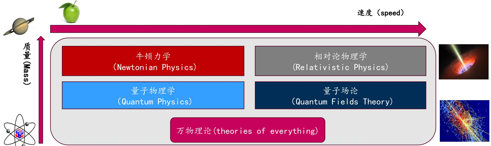

flowchart

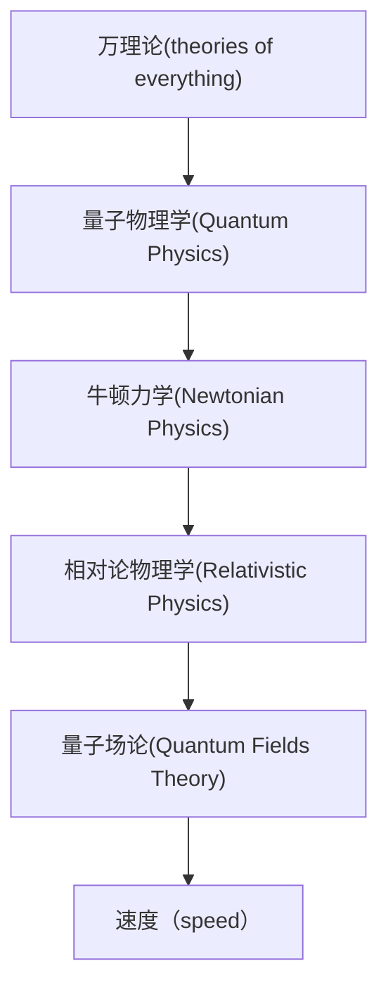
```mermaid
graph TD
    A["万理论(theories of everything)"] --> B["量子物理学(Quantum Physics)"]
    B --> C["牛顿力学(Newtonian Physics)"]
    C --> D["相对论物理学(Relativistic Physics)"]
    D --> E["量子场论(Quantum Fields Theory)"]
    E --> F["速度（speed）"]
```

# 什么是量子？

- 1900年，普朗克研究黑体辐射时提出能量只有特定大小的“能量子”才能避免紫外灾难（基于瑞利-金斯公式黑体应该在紫外端释放出无穷无尽的能量），首次引入能量量子化假设。1905年，爱因斯坦大胆假设光由粒子（光量子）组成，成功解释了光电效应现象，只有当单个光子的频率足够高（能量足够大）时才能击出电子，这说明光不仅是波，也是由离散粒子组成。  
- 卢瑟福的原子核模型（1911年）发现原子内部大量空间和小核，但按照经典电磁理论，绕核旋转的电子应连续辐射能量而掉入原子核，这与原子稳定性相矛盾。尼尔斯·玻尔在1913年提出电子只能处于特定离散轨道（能级），绕核运动时不辐射能量，只有跃迁轨道时才发出或吸收特定频率的光子（跃迁）。玻尔模型成功解释了氢原子谱线的离散频率——原子只能发出特定颜色的光，从而证实了能量的量子化假设。  
- 1920年代，更多实验进一步动摇经典观念：例如康普顿散射证明光子具有动量，德布罗意提出物质波并被实验证实，电子经过双缝也会产生干涉图案。最终，一套全新的理论量子力学逐步形成，由海森堡、薛定谔、狄拉克等人奠定其数学基础，用概率波函数来描述微观粒子状态。量子力学成功解释了原子结构、化学键、固体和光辐射等大量现象，标志着物理学革命性突破。

图表：瑞利-金斯指出能量密度 u 与频率的平方 $v^{2}$ 成正比，但与事实不符，能量并非连续，而是量子化的  
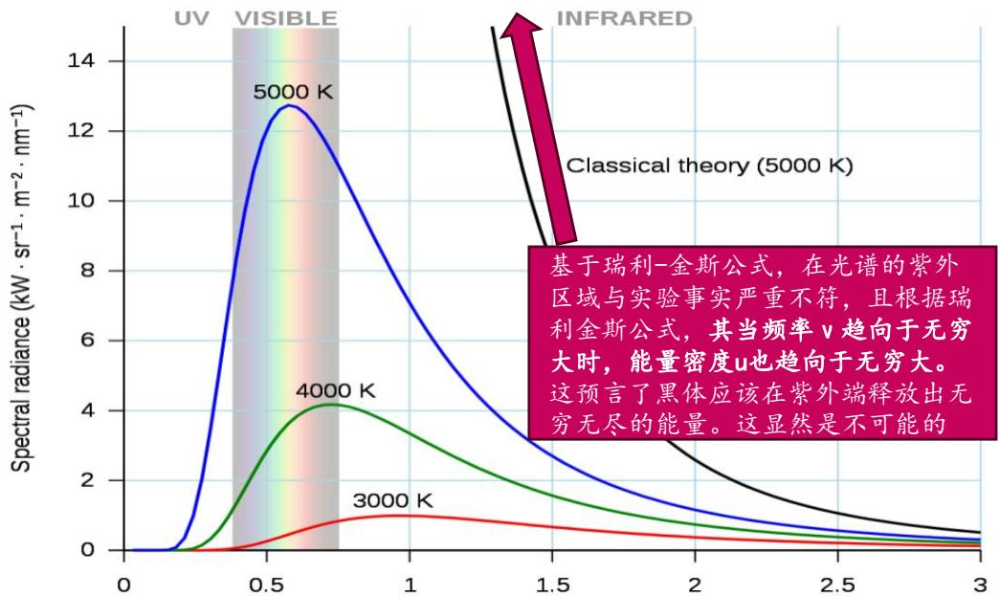

line

| Temperature (K) | Spectral Radiance (kW·sr⁻¹·m⁻²·nm⁻¹) |
| --------------- | ------------------------------------ |
| 5000            | 12.5                                 |
| 4000            | 4.0                                  |
| 3000            | 1.0                                  |

www.jyzq.cn

全国统一客服电话：95372

此文件版权归金元证券股份有限公司所有，未经许可任何单位或个人不得复制、翻印。

图表：尼尔斯玻尔解释了氢原子谱线的离散频率  
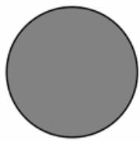  
实心小球模型（道尔顿）

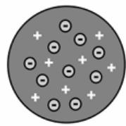  
葡萄干蛋糕模型（汤普森）

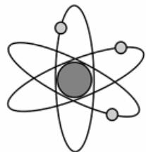

natural_image

Schematic diagram of an atom with nucleus and orbiting electrons (no labels or text)

行星模型（卢瑟福）

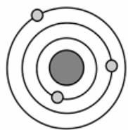  
玻尔模型
(玻尔)

# 什么是量子？

- 在量子力学中，能量量子化是一个基石性的概念，它彻底颠覆了经典物理中能量可以连续变化的观念。这一点在原子尺度上表现得尤为显著，正如氢原子的玻尔模型所示。该模型揭示，原子核外电子的能量状态是分立（量子化）的，只能存在于一系列特定的、不连续的稳定能级上（n=1, 2, 3... 的轨道）。电子在不同能级之间的跃迁，是能量量子化最直接的体现。当电子从高能级跃迁到低能级时，会释放一个能量完全特定的光子，其波长（如莱曼系的 122 nm、巴尔末系的 656 nm、帕邢系的 1875 nm）由两个能级的能量差精确决定，这解释了原子光谱为何是离散的线状谱，而非连续谱。  
- 能量的吸收与与发射：当一个能量恰好等于能级差的光子被原子吸收，驱使电子从基态“跳跃”到激发态；不稳定的激发态电子通过“弛豫”过程回落至低能级，并瞬时发射出一个相应能量的光子。关键在于，电子无法存在于两个允许能级之间的任何能量状态，其跃迁是“全有或全无”的，不存在中间过程。  
- 在经典计算机中，信息的基本单位是比特（Bit），其物理状态是0（低电平）或1（高电平）。计算需要一个同样具有两个离散状态的物理系统来充当量子比特。能量量子化恰好提供了这样一个系统。例如，一个超导电路或一个离子，其能级是分立的。我们可以将最低能级（基态）定义为 $|0\rangle$ ，将第一激发态定义为 $|1\rangle$ 。这两个能级是稳定且明确的，为编码量子信息提供了完美的“容器”。

图表：能量量子化，不连续的稳定能级  
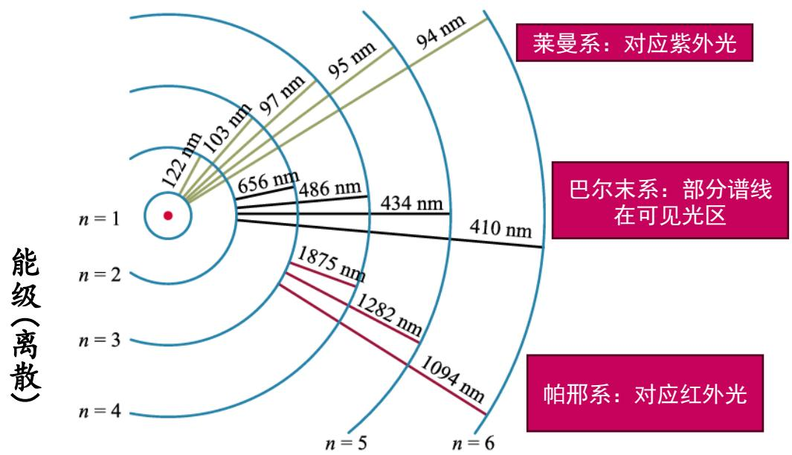

other

| 波谱线类型 | 宽度 (nm) |
| ---------- | --------- |
| 莱曼系     | 94        |
| 巴尔未系   | 410       |
| 帕邢系     | 1094      |

图表：能量的吸收与与发射  
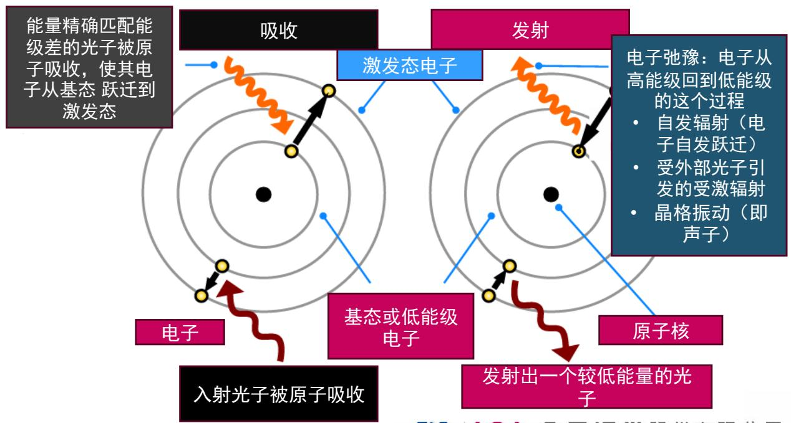

flowchart

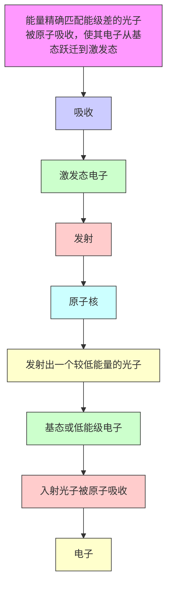
```mermaid
graph TD
    A["能量精确匹配能级差的光子被原子吸收，使其电子从基态跃迁到激发态"] --> B["吸收"]
    B --> C["激发态电子"]
    C --> D["发射"]
    D --> E["原子核"]
    E --> F["发射出一个较低能量的光子"]
    F --> G["基态或低能级电子"]
    G --> H["入射光子被原子吸收"]
    H --> I["电子"]
    style A fill:#f9f,stroke:#333
    style B fill:#ccf,stroke:#333
    style C fill:#cfc,stroke:#333
    style D fill:#fcc,stroke:#333
    style E fill:#cff,stroke:#333
    style F fill:#ffc,stroke:#333
    style G fill:#cfc,stroke:#333
    style H fill:#fcc,stroke:#333
    style I fill:#ffc,stroke:#333
```

# 什么是量子？

- 量子理论已成为现代科技的核心原理，包括固体能带理论、受激辐射光放大、电子显微镜、量子隧穿等。固体能带理论基于量子力学，布洛赫定理指出电子的波函数具有和晶格周期一样的周期分布，并且能级分布已经不再是单个原子中形成的能级，而是能带。半导体中的电子能量不是连续的，而是分布在分立的能带中。晶体中原子的价电子能级在量子力学作用下分裂形成价带，更高能量形成导带，两者之间存在电子无法驻留的能量范围，称为禁带或带隙（band gap）。半导体的导电特性正是由于价电子的能带正好处于导体和绝缘体之间，价带离导带较近，当外加电压或者光照射时，价电子能量升高，从价带进入导带，使其成为导体。这正是晶体管及LED的原理。  
- 激光（受激辐射光放大）依赖于光的粒子性（光子）和原子能级的量子特性。原子或分子被激发后，其电子处于高能态，若这时有一个频率匹配的光子经过，可以引发电子跃迁到低能态，并释放出与入射光子完全相同的新光子，这一过程称为受激辐射（stimulated emission）

图表：基于量子力学的固体能带理论解决半导体导电原理  
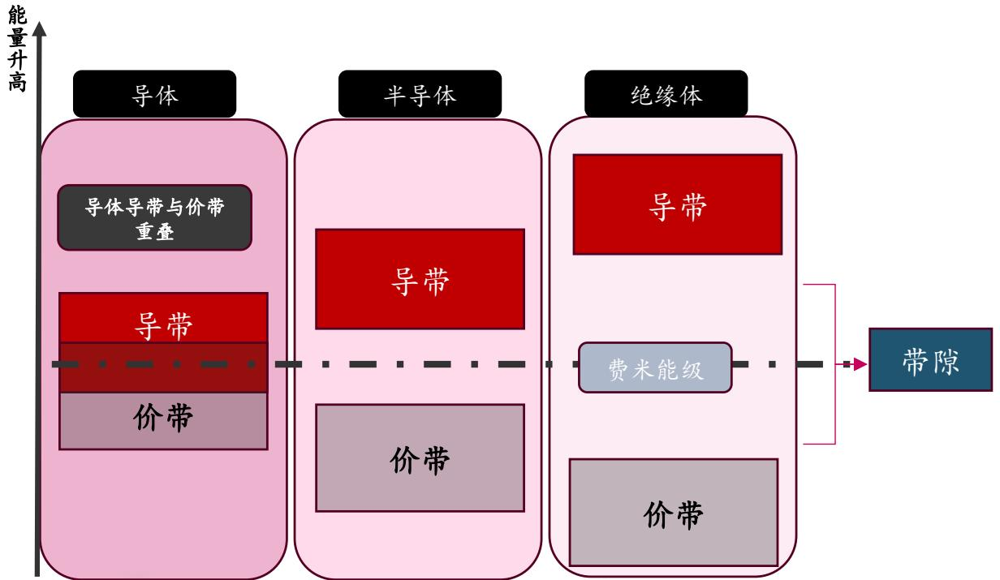

flowchart

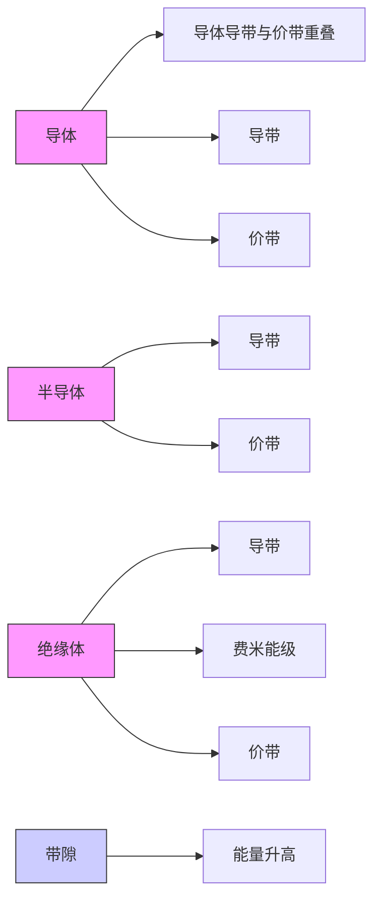
```mermaid
graph LR
    A["导体"] --> B["导体导带与价带重叠"]
    A --> C["导带"]
    A --> D["价带"]
    E["半导体"] --> F["导带"]
    E --> G["价带"]
    H["绝缘体"] --> I["导带"]
    H --> J["费米能级"]
    H --> K["价带"]
    L["带隙"] --> M["能量升高"]
    style A fill:#f9f,stroke:#333
    style E fill:#f9f,stroke:#333
    style H fill:#f9f,stroke:#333
    style L fill:#ccf,stroke:#333
```

图表：激光（受激辐射光放大）原理

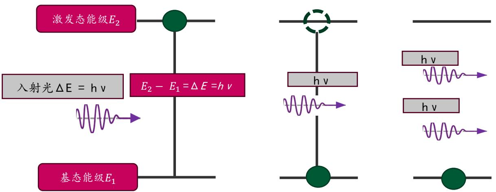

flowchart

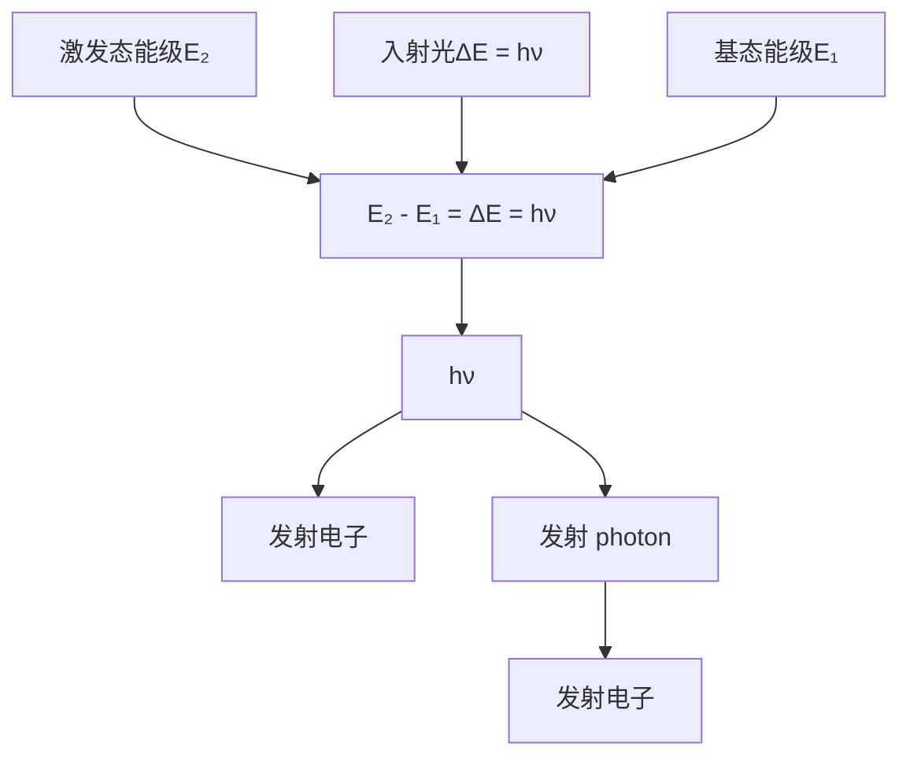
```mermaid
graph TD
    A["激发态能级E₂"] --> B["E₂ - E₁ = ΔE = hν"]
    C["入射光ΔE = hν"] --> B
    D["基态能级E₁"] --> B
    B --> E["hν"]
    E --> F["发射电子"]
    E --> G["发射 photon"]
    G --> H["发射电子"]
```

发射前：原子处于激发态，电子位于激发态能级（ $E_{2}$ ）上，光子的能量（h v）必须精确等于两个能级之间的能量差。

发射时：入射光子刺激或诱发处于激发态的电子，这种相互作用导致电子向下跌迁到基态能级（ $E_{1}$ ）。在跃迁过程中，电子释放出一个完全相同的光子。这就是发射发生的时刻

# 什么是量子？

电子显微镜利用电子的波动性突破了光学显微镜的分辨极限。根据量子力学的德布罗意假设，运动电子具有波长，其波长与动量成反比。加速到几万伏高能的电子波长可达0.01纳米级，远短于可见光的约500纳米波长。由于光学显微镜的分辨率受制于光的波长（衍射极限），可见光显微镜极限分辨率约0.2微米（200纳米）左右，而电子显微镜的有效分辨率可达0.1纳米量级（可观察原子级别结构）。电子在真空中由电场加速形成电子束，并通过电磁透镜（磁场线圈产生的聚焦作用）来聚焦成像或扫描。电子与样品相互作用发生散射，透射电子显微镜（TEM）利用透过样品的电子成像，而扫描电子显微镜（SEM）利用二次电子信号成像。  
- 电子显微镜的原理完全建立在电子的量子波动性：若按经典粒子模型，电子无法像光波那样“绕过”微小结构成像，而实际上电子波长极短，可以像光波一样发生衍射和成像，从而突破了光学极限。  
量子隧穿效应：在经典理论中，粒子如果没有足够的能量，是不可能越过势能垒的；但在量子力学中，存在一种量子隧穿效应，使粒子有一定概率“穿透”势垒出现在另一侧。这一现象源于粒子的波动本质，粒子的波函数在势垒中并非绝对为零，而是呈指数衰减，当势垒足够窄或粒子隧穿概率足够大时，就可能透射过去。隧穿效应是纯粹的量子现象，经典力学认为这是被禁止的。  
- 隧穿效应在众多现代技术中扮演关键角色。典型应用之一是闪存存储器（Flash Memory）的存/擦除过程：利用高场引发的 Fowler-Nordheim 隧穿将电子穿过绝缘的氧化层注入浮栅，实现信息存储，反向电场使电子隧穿返回沟道清除信息。另外，先进的逻辑晶体管栅氧层非常薄，电子也会通过隧穿产生漏电流（栅漏电）——这在早期CMOS技术中是个难题，促使业界引入高介电常数栅介质以增大物理厚度来压低隧穿电流  
- 另一重要应用是隧道磁阻（TMR）和自旋电子学器件。在磁隧道结（Magnetic Tunnel Junction）中，两层铁磁体夹着极薄的绝缘层，电子自一侧自旋极化后隧穿绝缘层进入另一侧。这种量子隧穿对两侧磁化方向非常敏感：平行时隧穿几率较高，反平行时较低，表现为电阻的变化。这种效应称为隧道磁阻，是典型的量子力学自旋相关隧穿现象，被用于硬盘读出头和新型存储器。基于磁隧道结的磁阻式内存（MRAM）利用隧穿电阻的高低表示“0”和“1”，其升级技术自旋转移力矩MRAM（STT-MRAM）直接用隧穿电流的自旋角动量翻转磁矩，实现写入操作。隧穿效应还催生了扫描隧道显微镜（STM）等突破分辨率极限的仪器（利用针尖与样品间的隧穿电流成像，获得原子级表面结构）。可以说，量子隧穿从基础物理怪现象发展为实用技术，在闪存存储、量子计算元件、能源（隧穿二极管太阳能电池）等领域发挥着不可或缺的作用。

# 什么是量子？

<table><tr><td></td><td>经典理论 vs 量子理论</td></tr><tr><td>确定性vs概率性</td><td>➢经典力学是拉普拉斯式确定论的,如果完全了解初始条件,理论上就能精确预测未来演化,偶然性不起作用➢量子力学的预测具有固有的概率性质,即使完全知道系统的量子态,也只能给出观测结果的概率分布,而非确定值。微观粒子的行为似乎由概率规律支配,例如原子核何时衰变、电子通过双缝会落在哪,都无法预知,只能计算概率。</td></tr><tr><td>连续 vs 离散</td><td>➢经典理论下,物理量(如能量、角动量)在原理上可以连续变化,取任意数值➢量子世界充满离散化的特征。原子的电子只能占据离散能级,光的能量也是以基本能量块(光子)为单位交换的。玻尔模型直观展示了这种离散性:电子只能存在于特定半径的轨道,半径和能量都被量子数限定,而不能处于任意距离。原子发射或吸收光子对应电子在不同能级间跃迁,因此只出现特定频率的光谱线,这一点经典电磁理论无法解释。</td></tr><tr><td>局域性 vs 非局域性</td><td>➢经典物理遵循局域性原则,物体只能通过接触或场的局部作用力影响彼此,信息传播速度有限(不超过光速)➢量子力学出现了爱因斯坦所谓的“幽灵般的超距作用”。通过量子纠缠,两个或多个粒子可以保持整体性的关联,无论相距多远,对一个粒子的测量会瞬时影响另一个的量子态。纠缠粒子好似结成一个整体,其性质只有在整体上才能描述,而无法视作独立个体</td></tr><tr><td>测不准原理(不确定性原理)</td><td>➢在经典理论中,我们观测仪器的精度是限制测量的唯一因素,理论上可同时无穷精确地测量粒子的位置和动量。➢海森堡的不确定性原理揭示了量子体系的测量极限:不可能同时精确确定粒子的位置和动量等一对共轭变量。测量其中一个量越精确,另一量就越不确定。这并非技术问题,而是量子系统的内在性质决定的——微观粒子没有确定的“轨迹”,精确的位置和精确的动量不能同时存在。这一原理彻底改变了人们对测量和客观实在的认识:在量子领域,测量本身会扰动被测系统,参与塑造测量结果。</td></tr><tr><td>量子叠加与测量塌缩</td><td>➢量子力学引入了全新的概念:叠加态。微观粒子可以同时处于多个经典状态的组合中,直到被观测前都以概率幅形式“同时存在”于这些状态。著名的思想实验“薛定谔的猫”就是为了说明叠加态的反直觉性。在双缝实验中,电子在未测量哪条缝时,相当于同时经过两条缝并产生自我干涉。然而,一旦尝试测定电子通过了哪一条缝,这种叠加态就坍缩为确定的结果,干涉条纹也随之消失。也就是说,观测行为本身改变了量子状态,将其从概率分布压缩成单一结果。这种测量塌缩和由观察引入的不可逆性是量子理论和经典理论的重要区别之一。</td></tr></table>

# 理论筑基期

量子力学诞生：马克斯·普朗克首次提出“量子”概念，这是量子力学的开端。

量子图灵机概念提出：保罗·贝尼奥夫首次提出了量子版的图灵机概念，为量子计算奠定了理论基础。

通用量子计算机概念提出：戴维·多伊奇提出“通用量子计算机”概念，能够模拟任何物理过程，是量子计算理论的进一步深化。

肖尔算法正式提出：彼得·肖尔提出了“肖尔算法”，该算法能够在量子计算机上以指数级速度执行因式分解，是量子计算领域的重大突破。

量子算法成功实现：1998年IBM研究员Isaac Chuang团队首次在两量子比特系统上实现了Grover算法2001年，该团队利用量子计算机成功实现了Shor算法。

首款商用量子计算机发布：加拿大D-Wave公司正式发布了全球首款商用型量子退火机“D-Wave One”，可应用于解决各种组合优化问题。

谷歌宣称实现量子霸权：利用53个量子比特在200秒内完成了传统超级计算机需1万年才能完成的计算，标志着量子霸权（量子优势）的实现。

中国量子计算机“九章”诞生：中国科学家构建了76个光子的量子计算原型机“九章”，实现了“高斯玻色取样”任务的快速求解，展示了量子计算在特定问题上的优越性。

谷歌推出最新的量子芯片Willow：使用更多量子比特进行拓展，可成倍减少错误，解决了量子纠错领域近30年来一直试图攻克的关键难题，同时在基准测试中展示了一流性能。

# 什么是量子计算？

\- 量子技术包括基于量子比特和基于其他量子效应的两类技术。基于量子比特的技术直接利用量子比特的叠加态进行计算和通信。量子比特可以同时处于 $|0\rangle$ 和 $|1\rangle$ 的叠加态，从而实现并行计算和指数级的信息处理能力。基于其他量子效应的技术不直接使用抽象的量子比特，而是利用原子、光子等物理系统固有的量子特性来制造超精密的测量仪器，即量子传感。

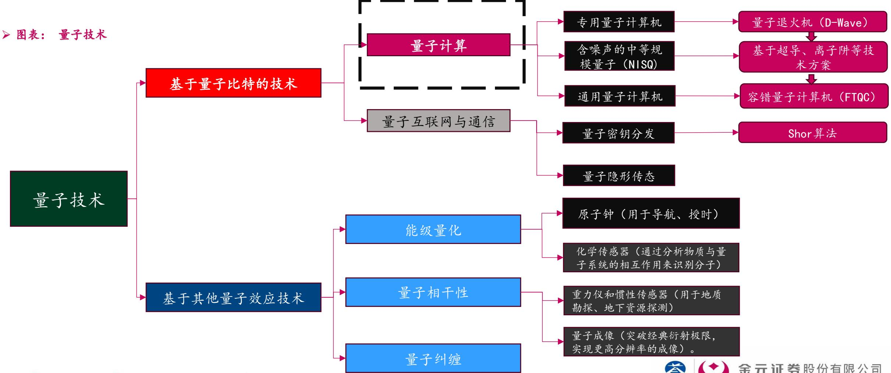

flowchart

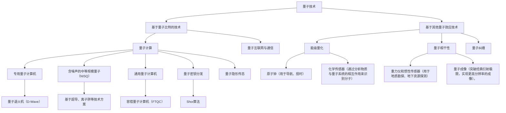
```mermaid
graph TD
    A["量子技术"] --> B["基于量子比特的技术"]
    A --> C["基于其他量子效应技术"]
    B --> D["量子计算"]
    B --> E["量子互联网与通信"]
    D --> F["专用量子计算机"]
    D --> G["含噪声的中等规模量子（NISQ）"]
    D --> H["通用量子计算机"]
    D --> I["量子密钥分发"]
    D --> J["量子隐形传态"]
    F --> K["量子退火机（D-Wave）"]
    G --> L["基于超导、离子阱等技术方案"]
    H --> M["容错量子计算机（FTQC）"]
    I --> N["Shor算法"]
    C --> O["能级量化"]
    C --> P["量子相干性"]
    C --> Q["量子纠缠"]
    O --> R["原子钟（用于导航、授时）"]
    O --> S["化学传感器（通过分析物质与量子系统的相互作用来识别分子）"]
    P --> T["重力仪和惯性传感器（用于地质勘探、地下资源探测）"]
    P --> U["量子成像（突破经典衍射极限，实现更高分辨率的成像）。"]
```

# 图表：量子计算的四大核心要素

# 叠加态（Superposed states）：

量子叠加态指的是微观粒子可以同时存在于多个状态的组合中，直到被观测为止。这意味着一个量子系统在测量前没有唯一确定的状态，就好比同时处于几种可能的状态。当进行观测时，叠加态瞬间“坍缩”成其中一个确定状态。在量子计算中，量子寄存器（量子比特的集合）可以同时处在所有可能的0/1组合的叠加态。单量子比特可写作 $|\psi\rangle = \alpha |0\rangle +\beta |1\rangle$ ，测到0/1的概率分别是 $|\alpha |^2,|\beta |^2$

# 纠缠（Entanglement）：

量子纠缠是指两个或多个粒子通过相互作用后，其性质紧密关联为一个整体，哪怕相隔遥远仍保持同步变化。纠缠粒子的状态不能独立描述，对一个粒子的测量结果瞬间反映在另一粒子上（仿佛超距传递信息，但实际上并不违背因果，只是相关性）。这种现象爱因斯坦曾称为“鬼魅般的超距作用”。

# 波粒二象性与干涉（Wave-particle duality）：

波粒二象性指微观粒子（如光子、电子）既能表现出波动性，又能表现出粒子性，两种属性取决于实验条件。例如，光子在某些实验中像波一样会发生干涉和衍射，但在另外一些实验中又像粒子（光子）那样一次只在一个位置被探测到。干涉现象则是波动性的直接证明，当两个或多个波叠加时会产生加强和相消的花纹（明暗条纹），微观粒子的干涉图样表明其具有波的行为。

# 概率性系统与测量坍缩（Probabilistic System & Measurement Collapse）

在量子世界中，粒子的行为具有概率性，并非经典物理那样确定。一个量子系统在测量前由波函数描述，它给出了各种结果的概率分布；测量坍缩指当我们对粒子进行观测时，波函数立刻从分布态“收缩”到某一个特定状态（测量值）。简单说，测量之前结果未定，只能说有几率为A或B；测量之后，系统随机且瞬时地选择了其中一个结果，其他可能性消失。

# 什么是量子计算？

量子叠加态：量子叠加态指的是微观粒子可以同时存在于多个状态的组合中，直到被观测为止。这意味着一个量子系统在测量前没有唯一确定的状态，就好比同时处于几种可能的状态。当进行观测时，叠加态瞬间“坍缩”成其中一个确定状态。薛定谔的猫也是著名比喻：把猫关在盒子里，通过量子机制使猫有一半几率死或活。在未打开盒子观察前，猫可以被认为同时处于“生”和“死”的叠加状态。

\- 经典实验：薛定谔提出的这个思想实验“薛定谔的猫”最形象地说明叠加态：只有打开盒子观察后，猫才变为确定的生或死状态，否则在量子角度猫处于两种状态叠加。真实实验中，电子的双缝干涉实验也体现叠加原理，单个电子可以同时通过两条缝，其概率波叠加产生干涉条纹（说明电子在未测量时处于“同时走两条路”的叠加态）。

量子纠缠：量子纠缠是指两个或多个粒子通过相互作用后，其性质紧密关联为一个整体，哪怕相隔遥远仍保持同步变化。纠缠粒子的状态不能独立描述，对一个粒子的测量结果瞬间反映在另一粒子上（仿佛超距传递信息，但实际上并不违背因果，只是相关性）。这种现象爱因斯坦曾称为“鬼魅般的超距作用”。

\- 经典实验：量子纠缠最著名的验证来自贝尔不等式实验。物理学家约翰·贝尔提出的方法能够区分“纠缠的真关联”与“预先商定好的巧合”。在20世纪后半叶，阿斯派等人通过实验违背了贝尔不等式，证明纠缠确实存在远距离的强关联效应。这一系列开创性实验也使得三位科学家在2022年获得诺贝尔物理学奖。另一个直观例子是量子通信/量子密钥分发，利用纠缠粒子的关联可以实现测量一方即时影响另一方的结果，从而进行保密通信。2016年8月，中国成功发射“墨子号”量子科学实验卫星，在国际上首次在上千千米的星地距离上利用量子纠缠分发检验贝尔不等式，获得了违反贝尔不等式的结果，验证了量子纠缠在跨越1200千米的距离上依然存在。

> 概率性系统与测量坍缩：粒子的行为具有概率性，并非经典物理那样确定。一个量子系统在测量前由波函数描述，它给出了各种结果的概率分布；测量坍缩指当我们对粒子进行观测时，波函数立刻从分布态“收缩”到某一个特定状态（测量值）。简单说，测量之前结果未定，只能说有几率为A或B；测量之后，系统随机且瞬时地选择了其中一个结果，其他可能性消失。

➢ 波粒二象性与干涉（Wave-Particle Duality & Interference）：波粒二象性指微观粒子（如光子、电子）既能表现出波动性，又能表现出粒子性，两种属性取决于实验条件。例如，光子在某些实验中像波一样会发生干涉和衍射，但在另外一些实验中又像粒子（光子）那样一次只在一个位置被探测到。干涉现象则是波动性的直接证明：当两个或多个波叠加时会产生加强和相消的花纹（明暗条纹），微观粒子的干涉图样表明其具有波的行为。

# 什么是量子计算？

量子比特（qubit）是什么？量子比特是量子计算的基本单元，它是一个量子物体的物理属性的载体，例如电子自旋、光子偏振、或者原子能级。但是它不同于经典比特，由于量子的叠加态特征，它的状态是基态 $|0\rangle$ 和 $|1\rangle$ 的线性叠加。这意味着在测量之前，它同时处于0和1的状态。也正因为这种叠加态使得其具有“原生”并行计算能力，比如N个量子比特可以同时表示 $2^{\mathrm{N}}$ 种状态，允许指数级的并行计算。  
希尔伯特空间（Hilbert Space）：量子态的舞台。一个量子比特的状态可以被表示为一个二维希尔伯特空间中的向量。希尔伯特空间就像一个巨大的“舞台”，所有可能的量子状态都在这个空间中存在和演化。对于一个量子比特，这个“舞台”是二维的。但对于N个量子比特，其状态空间会扩展到 $2^{\text{N}}$ 维。这种指数级的扩展能力是量子计算强大威力的根本来源。正是因为这个高维空间的存在，才允许叠加（Superposition）、纠缠（Entanglement）和量子操作（量子门）等特性得以实现，使得量子计算机能够处理经典计算机无法胜任的复杂问题。

图表：量子比特作为量子物体的物理属性的载体，比如电子自旋  
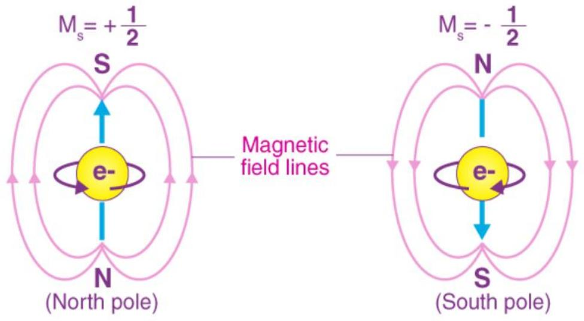

text_image

M_s = +\frac{1}{2}
S
N
(North pole)
Magnetic field lines
M_s = -\frac{1}{2}
N
e-
(South pole)

图表：一个量子比特的状态可以被表示为一个二维希尔伯特空间中的向量  
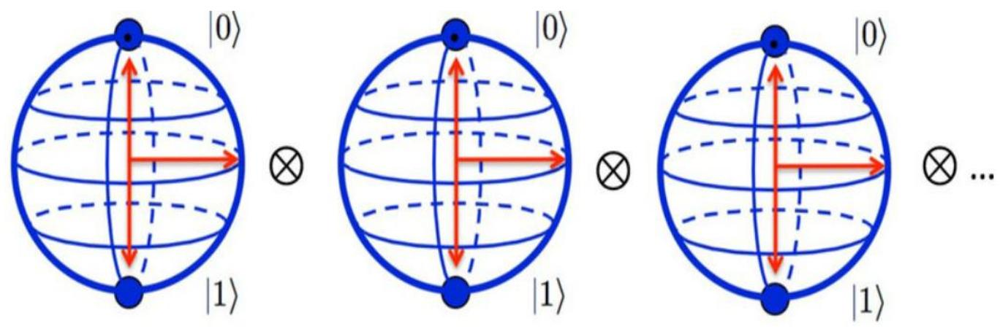

text_image

|0>
|1>
⊗
|0>
|1>
⊗
|0>
|1>
⊗ ...

# 什么是量子计算？

\- 量子比特凭借叠加与纠缠特性，实现了相对经典比特的指数级算力飞跃。经典比特处理确定性的0和1，而量子比特利用叠加和纠缠实现指数级并行计算。但是当前量子比特需要的工作温度需处于极低温度，以保证相干时间。此外，错误率较高，且计算结果是概率性的，测量会导致坍缩，需要冗余计算及编码（纠错）。

图表：经典比特 vs 量子比特

<table><tr><td>维度</td><td>经典比特</td><td>量子比特(Qubit)</td></tr><tr><td>物理形态</td><td>晶体管与电容(RAM)、磁畴(硬盘)、电压脉冲等。</td><td>量子物体的物理属性,如电子自旋、光子偏振或原子能级。</td></tr><tr><td>状态表示</td><td>确定性地处于0或1状态。</td><td>可处于|0&gt;和|1&gt;的线性叠加态(如α|0&gt;+β|1))。用布洛球面上的一个点表示,包含振幅和相位信息。</td></tr><tr><td>算力增长</td><td>算力与晶体管数量呈1:1的线性关系。</td><td>算力随量子比特数量呈指数增长(N个量子比特可同时表示 $2^{N}$ 个状态)。</td></tr><tr><td>工作温度</td><td>室温(约300K)。</td><td>需在极低温(通常&lt;1K)下工作,以隔离环境干扰。</td></tr><tr><td>计算操作</td><td>1个比特执行1次操作。N个比特并行执行N次操作。</td><td>1个量子比特可同时进行2个操作。N个量子比特可并行执行 $2^{N}$ 次操作(即处理 $2^{N}$ 个状态)。</td></tr><tr><td>计算结果</td><td>确定性的。计算后结果总是明确的0或1。</td><td>概率性的。测量会导致波函数坍缩,以一定概率得到|0&gt;或|1)。通常需要将算法运行成千上万次,通过统计结果来确定答案。</td></tr><tr><td>操作本质</td><td>基于晶体管的布尔逻辑(如与、或、非门)。</td><td>对量子态进行振幅调整、相位旋转和纠缠操作(通过量子逻辑门实现)。</td></tr><tr><td>错误来源</td><td>辐射、晶体管故障、电流泄漏等。</td><td>退相干(失去量子特性)、热噪声、电磁噪声、辐射等。</td></tr><tr><td>错误率</td><td>极低(示例: $2.5 \times 10^{-11}$ /小时/比特)。</td><td>目前较高(通常&gt;0.1%),对逻辑量子比特而言不可接受。</td></tr><tr><td>纠错方式</td><td>使用奇偶校验位等简单编码,开销小。</td><td>需要量子纠错码。需要大量物理量子比特(1,000-100,000个)来编码1个逻辑量子比特,以实现容错计算。</td></tr><tr><td>主要应用</td><td>处理日常计算任务的最佳选择。</td><td>优化问题、大数据分析、量子模拟(材料、药物)、机器学习等。</td></tr></table>

# 什么是量子计算？

一般情况下，一个单量子比特是双态系统，且是两个线性独立的态，一个单比特态由幅值（θ 由幅值比例决定，测量到 |0⟩, |1⟩|0⟩, |1⟩ 的概率）和相位）（相对相位，对应布洛赫球上的经度）共同决定，写作 |ψ⟩=α|0⟩ + β|1⟩|ψ⟩ = α|0⟩ + β|1⟩, |α|², |β|² （模长）是测到 |0⟩, |1⟩| 的概率，称为概率幅值的大小，所以一个量子比特实际上是整体叠加态，门操作（计算与处理）就是在球面上的旋转。  
一个量子比特的任意状态 | Ψ⟩都可以用两个角度参数 (θ, φ)在布洛赫球上唯一确定。布洛赫球是一个直径为2的球体，它将一个量子比特的状态表示为从球心出发、长度为1的向量）。这个球面模型使我们能直观地理解量子比特的振幅和相位角度θ决定了量子态在 |0⟩和 |1⟩之间的“权重”或概率振幅。相位 φ决定了量子态的相对相位。它不改变测得 |0⟩或 |1⟩的概率，但决定了叠加态中两个分量之间的干涉关系，是量子并行性和干涉效应的关键。  
当多个量子比特发生纠缠时，整体状态强相关而不可分解，使多比特门（如 CNOT/CZ）成为可能。纠缠让算法能够表达复杂相关性，并配合干涉实现速度优势。

图表：量子比特的表达  
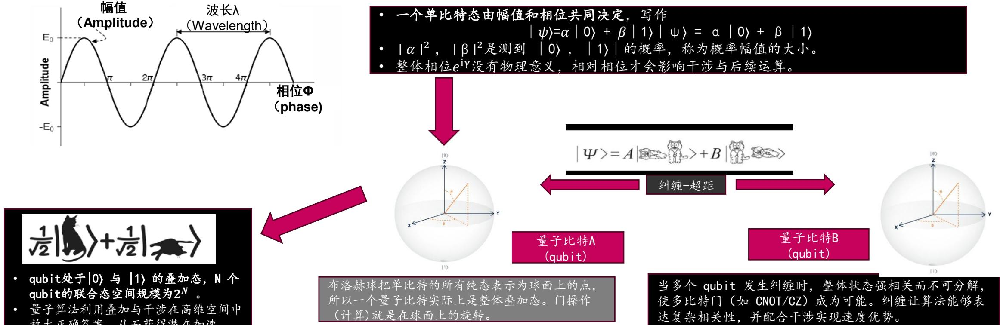

flowchart

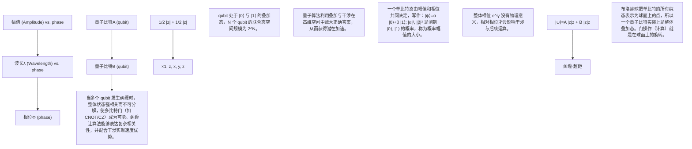
```mermaid
graph TD
    A["幅值 (Amplitude) vs. phase"] --> B["波长λ (Wavelength) vs. phase"]
    B --> C["相位Φ (phase)"]
    D["量子比特A (qubit)"] --> E["量子比特B (qubit)"]
    E --> F["当多个 qubit 发生纠缠时，整体状态强相关而不可分解，使多比特门（如 CNOT/CZ）成为可能。纠缠让算法能够表达复杂相关性，并配合干涉实现速度优势。"]
    G["1/2 |z| + 1/2 |z|"] --> H["×1, z, x, y, z"]
    I["qubit 处于 |0⟩ 与 |1⟩ 的叠加态，N 个 qubit 的联合态空间规模为 2^N。"]
    J["量子算法利用叠加与干涉在高维空间中放大正确答案，从而获得潜在加速。"]
    K["一个单比特态由幅值和相位共同决定，写作：|ψ⟩=α |0⟩+β |1⟩; |α|², |β|² 是测到 |0⟩, |1⟩ 的概率，称为概率幅值的大小。"]
    L["整体相位 e^iγ 没有物理意义，相对相位才会影响干涉与后续运算。"]
    M["|ψ⟩=A |z|z + B |z|z"] --> N["纠缠-超距"]
    O["布洛赫球把单比特的所有纯态表示为球面上的点，所以一个量子比特实际上是整体叠加态。门操作（计算）就是在球面上的旋转。"]
```

# 什么是量子计算？

\- 物理量子比特是量子计算的物理基础，即承载量子信息的实际硬件设备，而逻辑量子比特是经过编码和保护处理后的逻辑量子比特，其主要是为了解决物理量子比特的错误问题。物理量子比特是信息的原始载体，但极其脆弱（受外部环境干扰），其核心是物理量子处理器，由格点阵列、物理量子比特以及谐振器等构成。而为了实现可靠计算，一般量子计算需要加入纠错层对多个不可靠的物理量子比特的集体状态进行编码，创造一个更稳定的逻辑量子比特，从而完成计算。

# 图表：物理量子比特 vs 逻辑量子比特

最顶层是应用层，即量子算法的实现。在最顶层运行的是各种“量子算法”，例如用于大数质因数分解的Shor算法、用于数据库搜索的Grover算法，以及用于材料模拟和药物研发的量子模拟等。这些算法被编译成一系列逻辑量子门，在稳定的逻辑量子处理器上运行，最终解决经典计算机难以应对的复杂问题。

逻辑量子比特：在纠错层之上是逻辑量子处理器，它由经过编码和保护的逻辑量子比特构成。  
可以将其类比为经典计算机的CPU。在这一层，我们可以认为处理器是由稳定的逻辑量子比特组成的，从而能够执行可靠的量子运算。“控制”和“读出”模块在这里也相应地提升到逻辑层面，负责向逻辑量子处理器发送指令并读取其计算结果。

# 逻辑层

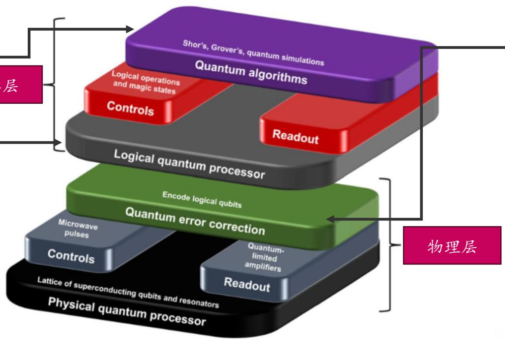

flowchart

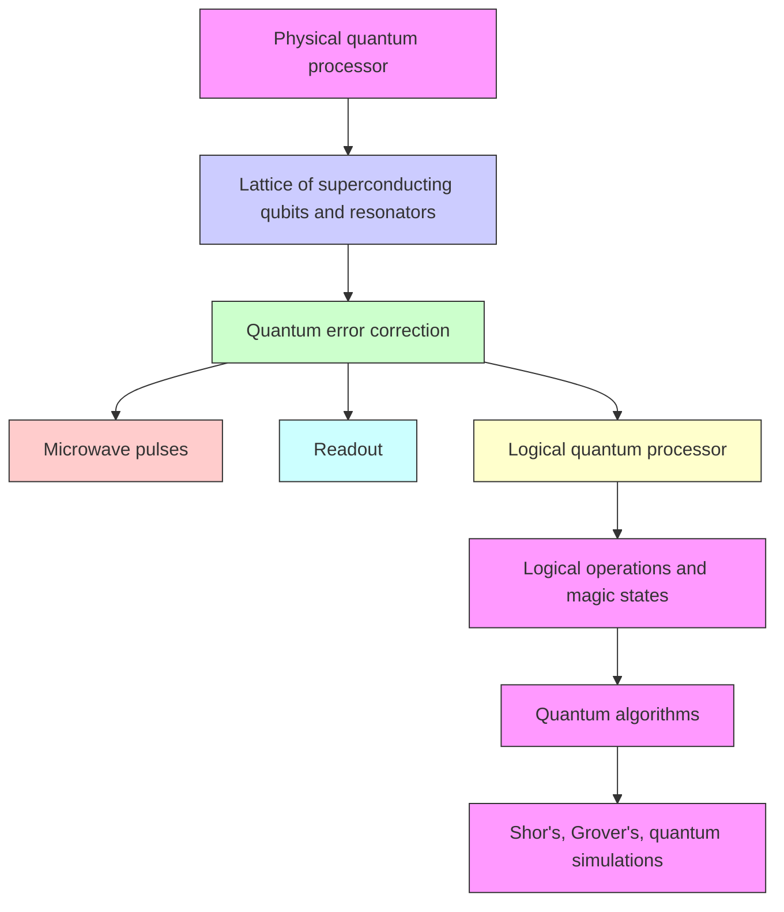
```mermaid
graph TD
    A["Physical quantum processor"] --> B["Lattice of superconducting qubits and resonators"]
    B --> C["Quantum error correction"]
    C --> D[" Microwave pulses "]
    C --> E[" Readout"]
    C --> F[" Logical quantum processor "]
    F --> G[" Logical operations and magic states "]
    G --> H[" Quantum algorithms "]
    H --> I[" Shor's, Grover's, quantum simulations "]
    style A fill:#f9f,stroke:#333
    style B fill:#ccf,stroke:#333
    style C fill:#cfc,stroke:#333
    style D fill:#fcc,stroke:#333
    style E fill:#cff,stroke:#333
    style F fill:#ffc,stroke:#333
    style G fill:#f9f,stroke:#333
    style H fill:#f9f,stroke:#333
    style I fill:#f9f,stroke:#333
```

纠错层：实现可靠计算的关键桥梁。由于物理量子比特错误率较高，直接用它进行计算是不现实的。量子纠错模块的作用，就是利用量子纠错码（如表面码），将多个不可靠的物理量子比特的集体状态进行编码，共同构建成一个受保护的、更稳定的信息单元。

- 物理层：量子计算机的硬件基础。该层以“物理量子处理器”为核心，通常由超导量子比特和谐振器组成的格点阵列构成。  
- 这些量子比特是信息的原始载体，但极其脆弱。对该层的操作通过控制模块实现，即向量子比特施加精确的微波脉冲来执行逻辑门；同时，读出模块则利用量子极限放大器等精密设备，测量量子比特的最终状态。物理量子比特就是指在这一层中存在的、真实的硬件量子系统。

# 什么是量子计算？

实现量子计算的关键是量子比特的操作与延长相干时间（coherence time，T2）：量子比特在运行过程中会受到环境与操作本身带来的各种噪声与扰动（电磁、机械、邻近器件等），这些效应统称为“退相干”。把器件降温到接近绝对零度能减轻噪声，但远远不够。矛盾在于量子比特只有在“不被打扰”时才能保持叠加/纠缠态；可是真正的量子计算必须频繁地对它们做门操作与读出，这些操作本身就会打扰它们。工程目标是同时把“退相干”和“门错误”压到尽可能低  
三条主要思路：其一，提高所有环节的保真度（制备/初始化、门操作、读出）；其二，改善“门时长与相干时间”的比值，既要把门做得更快（更短的门时长），也要让相干时间更长；其三，在算法层面减少需要的门数量，包括使用误差缓解技术、量子纠错码，以及各种电路优化。最终要求是算法结束时量子比特还能被可靠测量，且在这之前能完成足够多的门操作。

图表：量子比特操作与相干时间  
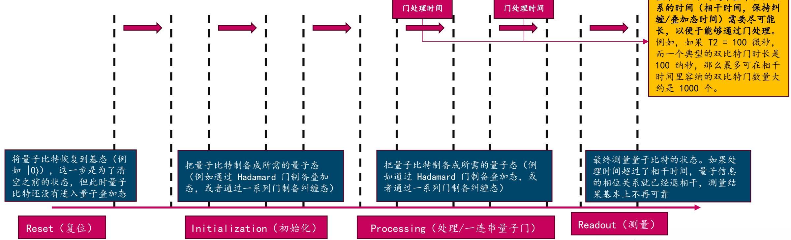

flowchart

```mermaid
graph LR
    A["Reset（复位）"] --> B["Initialization（初始化）"]
    B --> C["Processing（处理/一连串量子门）"]
    C --> D["Readout（测量）"]
    
    subgraph 初始化阶段
        E["将量子比特恢复到基态（例如 |0⟩），这一步是为了清空之前的状态，但此时量子比特还没有进入量子叠加态"]
    end
    
    subgraph Monitoring阶段
        F["把量子比特制备成所需的量子态（例如通过 Hadamard 门制备叠加态，或者通过一系列门制备纠缠态）"]
    end
    
    subgraph Testing阶段
        G["把量子比特制备成所需的量子态（例如通过 Hadamard 门制备叠加态，或者通过一系列门制备纠缠态）"]
    end
    
    subgraph Final Testing Stage
        H["最终测量量子比特的状态。如果处理时间超过了相干时间，量子信息的相位关系就已经退相干，测量结果基本上不再可靠"]
    end
    
    I["门处理时间"] --> J["门处理时间"]
    J --> K["系统的时间（相干时间，保持纠缠/叠加态时间）需要尽可能长，以便于能够通过门处理。例如，如果 T2 = 100 微秒，而一个典型的双比特门时长是 100 纳秒，那么最多可在相干时间里容纳的双比特门数量大约是 1000 个。"]
    end
```

# 什么是量子计算？

量子计算通常经过重置（reset）、初始化（initialization）、操作（operations）、读取（read out）。其中，量子门在操作过程中尤为重要，物理层面需要通过向量子比特发送精确控制的微波脉冲（如高功率激光、磁场）来实现。而读取则因量子的叠加态等物理特性导致其结果是概率性的，需要多次迭代，单次运行没有统计意义，是NISQ的典型作法。

图表：量子计算的典型步骤  
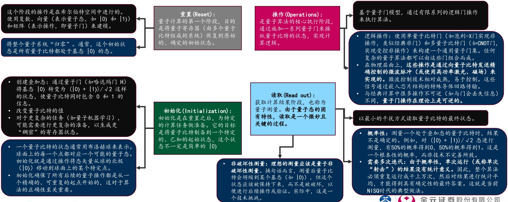

flowchart

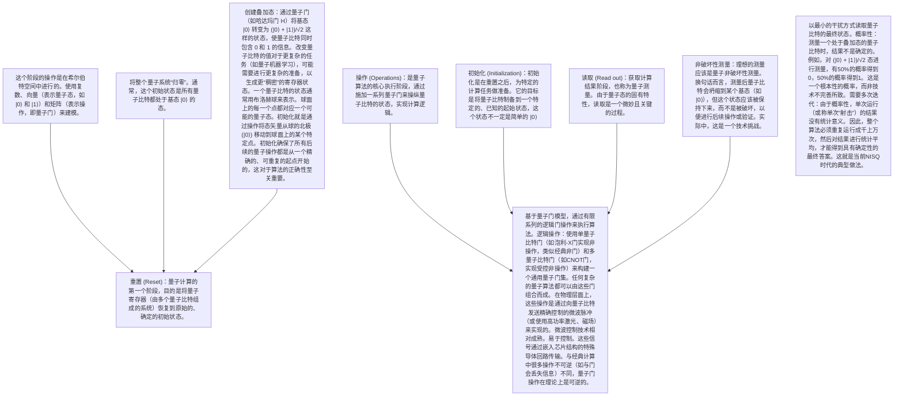
```mermaid
graph TD
    A["这个阶段的操作是在希尔伯特空间中进行的。使用复数、向量（表示量子态，如 |0⟩ 和 |1⟩）和矩阵（表示操作，即量子门）来建模。"] --> B["重置 (Reset)：量子计算的第一个阶段，目的是将量子寄存器（由多个量子比特组成的系统）恢复到原始的、确定的初始状态。"]
    C["将整个量子系统“归零”。通常，这个初始状态是所有量子比特都处于基态 |0⟩ 的态。"] --> B
    D["创建叠加态：通过量子门（如哈达玛门 H）将基态 |0⟩ 转变为 (|0⟩ + |1⟩)/√2 这样的状态，使量子比特同时包含 0 和 1 的信息。改变量子比特的值对于更复杂的任务（如量子机器学习），可能需要进行更复杂的准备，以生成更“稠密”的寄存器状态。一个量子比特的状态通常用布洛赫球来表示。球面上的每一个点都对应一个可能的量子态。初始化就是通过操作将态矢量从球的北极 (|0⟩) 移动到球面上的某个特定点。初始化确保了所有后续的量子操作都是从一个精确的、可重复的起点开始的，这对于算法的正确性至关重要。"] --> B
    E["操作 (Operations)：是量子算法的核心执行阶段，通过施加一系列量子门来操纵量子比特的状态，实现计算逻辑。"] --> F["基于量子门模型，通过有限系列的逻辑门操作来执行算法。逻辑操作：使用单量子比特门（如泡利-X门实现非操作，类似经典非门）和多量子比特门（如CNOT门，实现受控非操作）来构建一个通用量子门集。任何复杂的量子算法都可以由这些门组合而成。在物理层面上，这些操作是通过向量子比特发送精确控制的微波脉冲（或使用高功率激光、磁场）来实现的。微波控制技术相对成熟，易于控制。这些信号通过嵌入芯片结构的特殊导体回路传输。与经典计算中很多操作不可逆（如与门会丢失信息）不同，量子门操作在理论上是可逆的。"]
    G["初始化 (Initialization)：初始化是在重置之后，为特定的计算任务做准备。它的目标是将量子比特制备到一个特定的、已知的起始状态，这个状态不一定是简单的 |0⟩"] --> F
    H["读取 (Read out)：获取计算结果阶段，也称为量子测量。由于量子态的固有特性，读取是一个微妙且关键的过程。"] --> F
    I["非破坏性测量：理想的测量应该是量子非破坏性测量。换句话而言，测量后量子比特会坍缩到某个基态（如 |0⟩），但这个状态应该被保持下来，而不是被破坏，以便进行后续操作或验证。实际中，这是一个技术挑战。"] --> F
    J["以最小的干扰方式读取量子比特的最终状态。概率性：测量一个处于叠加态的量子比特时，结果不是确定的。例如，对 (|0⟩ + |1⟩)/√2 态进行测量，有50%的概率得到0，50%的概率得到1。这是一个根本性的概率，而非技术不完善所致。需要多次迭代：由于概率性，单次运行（或称单次“射击”）的结果没有统计意义。因此，整个算法必须重复运行成千上万次，然后对结果进行统计平均，才能得到具有确定性的最终答案。这就是当前NISQ时代的典型做法。"]
```

# 什么是量子计算？

量子寄存器（Registers）不同于经典计算机的寄存器，而是“并行处理器”。经典n位寄存器在任何时刻，它只能存储并代表一个确定的n位二进制数。例如，一个3位经典寄存器在某时刻只能存储101（即十进制数5）。如果需要同时处理8个不同的3位数，需要物理上添加8个这样的寄存器。但是量子寄存器存在于一个 $2^{n}$ 维的复数空间（希尔伯特空间）中。它的状态由 $2^{n}$ 个复数振幅共同描述，每个振幅对应一个计算基态（如3量子比特的8个状态：|000），|001），…，|111）。这意味着，一个n量子比特寄存器能够同时处于所有 $2^{n}$ 种可能性的叠加态中。这就是量子并行性的物理基础。  
但是这也意味着无法直接读取或利用这 $2^{n}$ 个振幅所包含的全部信息：

测量导致坍缩：当对量子寄存器进行测量时，其叠加态会立即坍缩到其中一个计算基态上。  
> 输出与经典计算机一致：测量的结果是一个n位的经典二进制字符串（例如1001），而不是那 $2^{\mathrm{n}}$ 个复数。所以，量子计算的终极目标不是一次性输出 $2^{\mathrm{n}}$ 。量子算法的主要目标是放大代表所求结果的那个计算基态的振幅，同时将其他所有振幅减小到接近零。

图表：4量子比特寄存器一般操作  
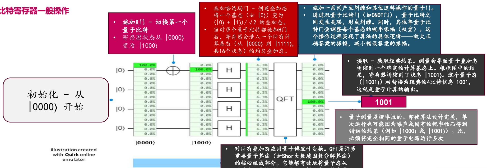

flowchart

量子通信系统初始化流程图，展示从0000开始到1001的量子交换过程及QFT调用机制

\- 对所有叠加态应用量子傅里叶变换。QFT是许多重要量子算法（如Shor大数质因数分解算法）的核心组成部分。它能够有效地将量子态从“时域”变换到“频域”，揭示出隐藏在量子态相位中的周期性信息。在这个例子中，QFT很可能负责将前一步计算产生的干涉效应转化为一个易于测量的结果。

# 什么是量子计算？

用布洛赫球来表示量子计算中量子的生命周期可以看出，操作/计算步骤需要施加一系列复杂的量子门操作来操控量子比特的状态来实现计算逻辑。N个量子比特的系统由 $2^{N}$ 个复数振幅来描述，其信息维度非常高（如下图多个箭头表示）

图表：用布洛赫球表达量子比特的生命周期  
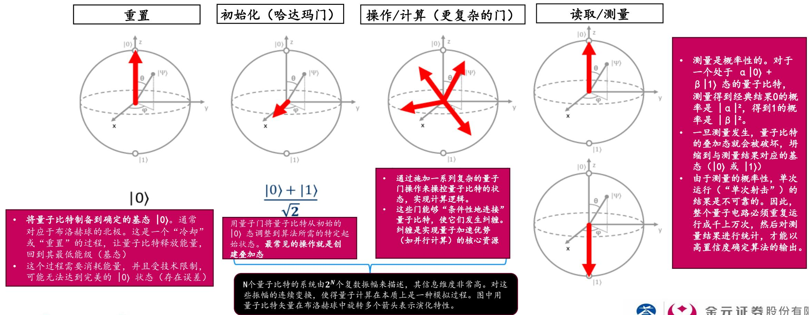

text_image

重置
|0⟩
初始化（哈达玛门）
|0⟩
操作/计算（更复杂的门）
|0⟩
读取/测量
|0⟩ + |1⟩
√2
用量子门将量子比特从初始的
|0⟩态调整到算法所需的特定起
始状态。最常见的操作就是创
建叠加态
N个量子比特的系统由2^N个复数振幅来描述，其信息维度非常高。对这
些振幅的连续变换，使得量子计算在本质上是一种模拟过程。图中用
量子比特矢量在布洛赫球中旋转多个箭头表示演化特性。
• 将量子比特制备到确定的基态 |0⟩。通常
对应于布洛赫球的北极。这是一个“冷却”
或“重置”的过程，让量子比特释放能量，
回到其最低能级（基态）
• 这个过程需要消耗能量，并且受技术限制，
可能无法达到完美的 |0⟩状态（存在误差）
• 通过施加一系列复杂的量子
门操作来操控量子比特的状
态，实现计算逻辑。
• 这些门能够“条件性地连接”
量子比特，使它们发生纠缠。
纠缠是实现量子加速优势
（如并行计算）的核心资源
• 测量是概率性的。对于
一个处于α|0⟩+β|1⟩态的量子比特，
测量得到经典结果0的概率
是|α|²，得到1的概率是|β|²。
• 一旦测量发生，量子比特
的叠加态就会被破坏，坍
缩到与测量结果对应的基
态（|0⟩或|1⟩）
• 由于测量的概率性，单次
运行（“单次射击”）的
结果是不可靠的。因此，
整个量子电路必须重复运
行成千上万次，然后对测
量结果进行统计，才能以
高置信度确定算法的输出。

# 经典比特逻辑门

# 基于1或2个比特的布尔代数

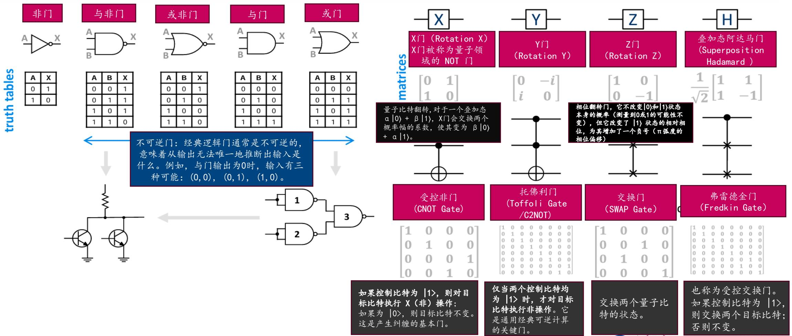

flowchart

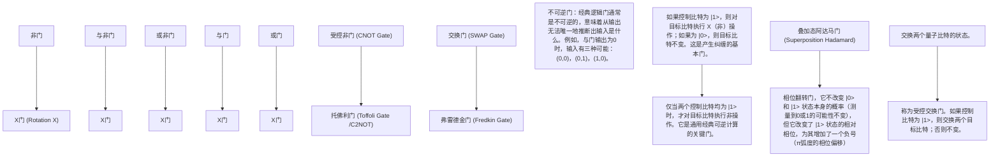
```mermaid
graph TD
    A["非门"] --> B["X门 (Rotation X)"]
    C["与非门"] --> D["X门"]
    E["或非门"] --> F["X门"]
    G["与门"] --> H["X门"]
    I["或门"] --> J["X门"]
    K["受控非门 (CNOT Gate)"] --> L["托佛利门 (Toffoli Gate /C2NOT)"]
    M["交换门 (SWAP Gate)"] --> N["弗雷德金门 (Fredkin Gate)"]
    O["不可逆门：经典逻辑门通常是不可逆的，意味着从输出无法唯一地推断出输入是什么。例如，与门输出为0时，输入有三种可能：(0,0)，(0,1)，(1,0)。"]
    P["如果控制比特为 |1>，则对目标比特执行 X（非）操作；如果为 |0>，则目标比特不变。这是产生纠缠的基本门。"] --> Q["仅当两个控制比特均为 |1> 时，才对目标比特执行非操作。它是通用经典可逆计算的关键门。"]
    R["叠加态阿达马门 (Superposition Hadamard)"] --> S["相位翻转门，它不改变 |0> 和 |1> 状态本身的概率（测量到0或1的可能性不变），但它改变了 |1> 状态的相对相位，为其增加了一个负号（π弧度的相位偏移）"]
    T["交换两个量子比特的状态。"] --> U["称为受控交换门。如果控制比特为 |1>，则交换两个目标比特；否则不变。"]
```

# 量子比特门

# 基于矩阵的可逆酉变换

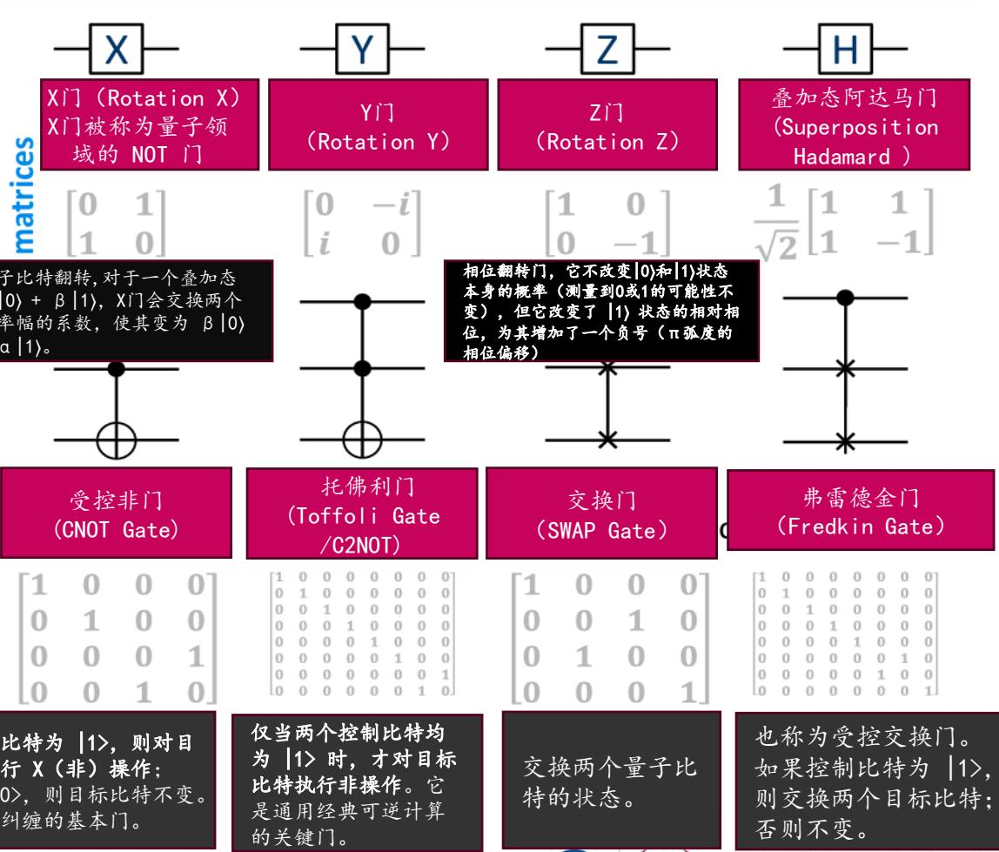

text_image

X
X门 (Rotation X)
X门被称为量子领域的 NOT 门
Y
Y门 (Rotation Y)
Z
Z门 (Rotation Z)
叠加态阿达马门 (Superposition Hadamard)
H
[0 1]
[1 0]
[0 -i]
[1 0]
[0 -1]
1/√2 [1 1]
[1 1]
子比特翻转, 对于一个叠加态 (0) + β |1), X门会交换两个率幅的系数, 使其变为 β |0) α |1)。
相位翻转门, 它不改变 |0) 和 |1) 状态本身的概率 (测量到0或1的可能性不变), 但它改变了 |1) 状态的相对相位, 为其增加了一个负号 (π弧度的相位偏移)
受控非门 (CNOT Gate)
托佛利门 (Toffoli Gate /C2NOT)
交换门 (SWAP Gate)
弗雷德金门 (Fredkin Gate)
[1 0 0 0 0]
[0 1 0 0 0 0 0 0 0]
[0 0 1 0 0 0 0 0 0]
[0 0 0 1 0 0 0 0 0]
[0 0 0 0 1 0 0 0 0]
[0 0 0 0 0 1 0 0 0]
[0 0 0 0 0 0 0 1]
[0 0 0 0 0 0 1]
[1 0 0 0 0 0 0 0]
[1 0 1 0 0 1 0 0 0]
[1 0 1 0 0 1 0 0 0]
[1 0 1 0 0 1 1 0]
[1 0 1 0 0 1 1 0]
[1 0 1 0 0 1 1 1]
仅当两个控制比特均为 |1>时, 才对目标比特执行非操作。它是通用经典可逆计算的关键门。
交换两个量子比特的状态。
也称为受控交换门。如果控制比特为 |1>, 则交换两个目标比特; 否则不变。

# 什么是量子计算？

- 基于门的量子计算（gate-based quantum computing）把一次量子运算视为“电路”。从若干量子比特的初态出发，依次施加一串量子门（本质是酉变换），最后进行测量得到经典比特，算法则是“如何挑选并排布这些门”。  
- 量子门可以分为单量子比特门、双量子比特门、多量子比特门、门分解方法以及Clifford门等

图表：单量子比特门

<table><tr><td colspan="5">单量子比特门(常规)</td></tr><tr><td>Pauli-I门(Identity)</td><td>-I-</td><td>初始状态</td><td>I = [1 0]0 1</td><td>单位操作,不改变量子比特的任何状态,用于电路中的空操作或占位符。</td></tr><tr><td>Pauli-X门</td><td>-X-</td><td></td><td>X = [0 1]1 0</td><td>类似于经典的非门(NOT),将|0&gt;变为|1&gt;,将|1&gt;变为|0&gt;。</td></tr><tr><td>Pauli-Y门</td><td>-Y-</td><td></td><td>Y = [0 -i]i 0</td><td>组合了比特翻转和相位翻转,将|0&gt;变为i|1&gt;,将|1&gt;变为-i|0&gt;。</td></tr><tr><td>Pauli-Z门</td><td>-Z-</td><td></td><td>Z = [1 0]0 -1</td><td>保持|0&gt;不变,将|1&gt;变为-|1&gt;,即翻转相位。</td></tr><tr><td>Hadamard门(H门)</td><td>-H-</td><td></td><td>H =  $\frac{1}{\sqrt{2}} \begin{bmatrix} 1 & 1 \\ 1 & -1 \end{bmatrix}$ </td><td>创建叠加态,将|0&gt;变为 $\frac{|0\rangle+|1\rangle}{\sqrt{2}}$ (记为|+) ,将|1&gt;变为 $\frac{|0\rangle-|1\rangle}{\sqrt{2}}$ (记为|-))</td></tr></table>

双量子比特门（常规）

<table><tr><td>CNOT门
(Controlled-NOT)</td><td>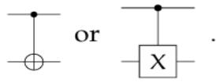</td><td> $CNot = \begin{pmatrix} 1 & 0 & 0 & 0 \\ 0 & 1 & 0 & 0 \\ 0 & 0 & 0 & 1 \\ 0 & 0 & 1 & 0 \end{pmatrix}$  $\sim Can(\frac{1}{2}, 0, 0)$ </td><td>第一个量子比特为控制位,第二个为目标位。若控制位为|1),则对目标位执行X翻转;若为|0),则目标位不变。最常用的纠缠门,是许多量子电路的基础构件。</td></tr><tr><td>CZ门
(Controlled-Z)</td><td>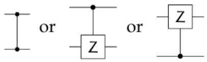</td><td> $CZ = \begin{pmatrix} 1 & 0 & 0 & 0 \\ 0 & 1 & 0 & 0 \\ 0 & 0 & 1 & 0 \\ 0 & 0 & 0 & -1 \end{pmatrix}$  $\sim Can(\frac{1}{2}, 0, 0)$ </td><td>当两个量子比特均为|1)时,施加一个相位翻转(-1因子)。在超导量子硬件中常作为原生门。</td></tr><tr><td>Swap门</td><td>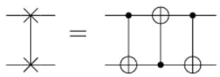</td><td> $Swap = \begin{pmatrix} 1 & 0 & 0 & 0 \\ 0 & 0 & 1 & 0 \\ 0 & 1 & 0 & 0 \\ 0 & 0 & 0 & 1 \end{pmatrix}$  $\simeq Can(\frac{1}{2}, \frac{1}{2}, \frac{1}{2})$  $H_{Swap} = \frac{\pi}{4}(X \otimes X + Y \otimes Y + Z \otimes Z + I \otimes I)$ </td><td>交换两个量子比特的状态。在硬件中,当需要执行非相邻量子比特操作时,用于“移动”量子信息。</td></tr><tr><td>iSwap门</td><td>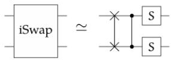</td><td> $iSwap = \begin{pmatrix} 1 & 0 & 0 & 0 \\ 0 & 0 & i & 0 \\ 0 & i & 0 & 0 \\ 0 & 0 & 0 & 1 \end{pmatrix}$  $\simeq Can(-\frac{1}{2}, -\frac{1}{2}, 0)$ </td><td>交换两个量子比特的状态,并引入一个相位(i)。出现在某些物理实现(如耦合谐振子)中。</td></tr></table>

# 什么是量子计算？

量子测量（读出）的本质是波函数坍缩过程，当对量子系统进行测量时，系统状态会坍缩到测量算符的某个本征态。在量子计算中，对量子比特的测量通常使其坍缩到计算基态|0>或|1>。由于量子态的概率性特性，单次测量结果具有随机性，需要多次重复实验（称为"shots")并对结果统计平均才能获得可靠值。  
➢ 投影测量是最基本的测量形式，它在布洛赫球上对应向量投影操作。与可逆的量子门操作不同，测量是不可逆的破坏性操作，使用自伴算符（如 $M_{0}=|0\rangle\langle0|$ 和 $M_{1}=|1\rangle\langle1|$ ）数学描述。  
实际量子硬件通常只支持计算基（Z轴）测量。通过预先施加量子门可实现不同基的测量：X基测量需先施加Hadamard门，Y基测量需先施加HS+门组合。这种技术广泛应用于量子纠错码，通过辅助量子比特进行非破坏性测量，在检测错误的同时保持数据量子比特的相干性。  
对于N量子比特寄存器，测量会从 $2^{\mathrm{N}}$ 个可能结果中返回一个经典比特串。通过大量重复实验，可以构建计算基态的概率分布直方图。当需要完整表征量子态时，需进行量子态层析，通过指数级增长的测量次数重构密度矩阵。  
先进测量技术包括：

- 非选择性与选择性测量：非选择性测量指执行了物理测量但未读取结果，使纯态退化为混合态；选择性测量则读取结果，将系统投影到特定纯态。  
- POVM（正算子值测量）：推广了投影测量，适用于非正交基测量，在量子密码学（如BB84协议）和unambiguous态鉴别中有重要应用。  
- 弱测量与后选择测量：弱测量以最小扰动获取少量信息，保持系统相干性；后选择测量则通过筛选特定结果进行条件操作，尽管效率较低但在基础物理研究中价值显著。

# 什么是量子计算？

图表：投影测量。在布洛赫球模型中，测量相当于将量子态矢量投影到特定的测量轴上。

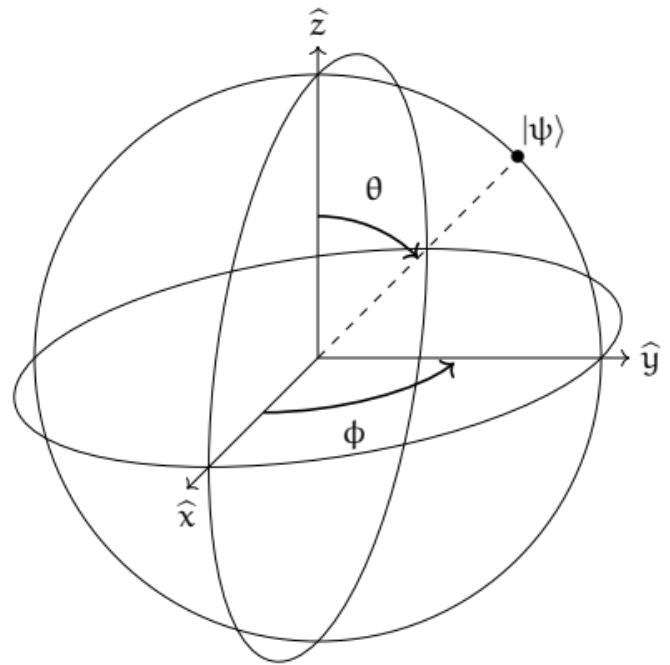

text_image

ẑ
θ
|ψ⟩
ŷ
φ
x̂

$$
| \psi \rangle \simeq \cos (\frac {1}{2} \theta) | 0 \rangle + e ^ {i \phi} \sin (\frac {1}{2} \theta) | 1 \rangle
$$

$$
\widehat {n} = (\sin \theta \cos \phi , \sin \theta \sin \phi , \cos \theta)
$$

图表：光量子系统量子态层析结果对比图，随着量子数增加放大测量偏差

A   
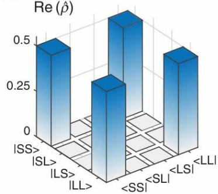

bar

| Category | Re (ρ̂) |
| -------- | ------ |
| ISS>     | 0.5    |
| ISL>     | 0.25   |
| ILS>     | 0.5    |
| ILL>     | 0.25   |
| <SSI>    | 0.5    |
| <SLI>    | 0.25   |
| <LLI>    | 0.5    |

2-Photon qubit

state - ideal   
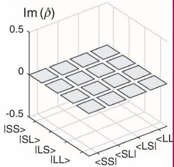

scatter_3d

| Category | Value |
| -------- | ----- |
| ISS      | 0.5   |
| ISL      | 0.0   |
| ILS      | -0.5  |
| ILL      | -0.5  |

B   
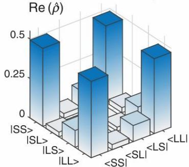

bar

| Category | Re (ρ̂) |
| -------- | ------ |
| ISS>     | 0.45   |
| ISL>     | 0.15   |
| ILS>     | 0.25   |
| ILL>     | 0.65   |
| <SSI>    | 0.35   |
| <SLI>    | 0.40   |
| <LLI>    | 0.30   |

2-Photon qubit state - measured

tate - measured   
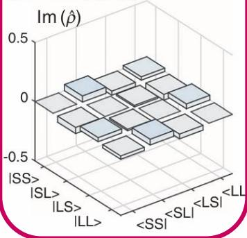

scatter_3d

| State | Im(ρ̂) |
|-------|--------|
| ISS   | 0.0    |
| ISL   | 0.0    |
| ILS   | 0.0    |
| ILL   | 0.0    |
| <SSI  | 0.0    |
| <SLI  | 0.0    |
| <LSI  | 0.0    |
| <LL   | 0.0    |

C   
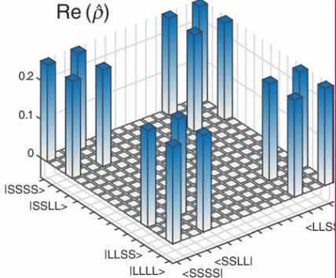

bar

| Category | Re(ρ̂) |
| -------- | ----- |
| |ISSSS> |
| |ISSLL> |
| |ILLSS> |
| |ILLLL> |
| |<SSSLI> |
| |<SSSLI> |
| |<LLS> |

4-Photon qubit state - ideal

ate - ideal   
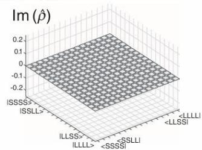

scatter_3d

| Category | Value |
| -------- | ----- |
| ISSSS    | 0.0   |
| ISLL     | 0.0   |
| <LLLLI   | 0.0   |
| <LSSSI   | 0.0   |
| <SSSSI   | 0.0   |

D   
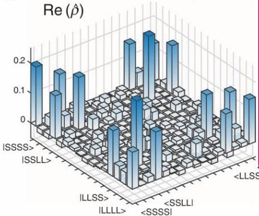

bar

| Category | Re(ρ̂) |
| -------- | ----- |
| | 0.2 |
| | 0.15 |
| | 0.1 |
| | 0.05 |
| | 0.0 |
| | 0.05 |
| | 0.1 |
| | 0.15 |
| | 0.2 |
| | 0.15 |
| | 0.1 |
| | 0.05 |
| | 0.0 |
| | 0.05 |
| | 0.1 |
| | 0.15 |
| | 0.2 |
| | 0.15 |
| | 0.1 |
| | 0.05 |
| | 0.0 |
| ILLSS>   | 0.2 |
| ILLSS>   | 0.15 |
| ILLSS>   | 0.1 |
| ILLSS>   | 0.05 |
| ILLSS>   | 0.0 |
| ILLSS>   | 0.05 |
| ILLSS>   | 0.1 |
| ILLSS>   | 0.15 |
| ILLSS>   | 0.2 |
| ILLSS>   | 0.15 |
| ILLSS>   | 0.1 |
| ILLSS>   | 0.05 |
| ILLSS>   | 0.0 |
| ILLSS>   | 0.05 |
| ILLSS>   | 0.1 |
| ILLSS>   | 0.125 |
| ILLSS>   | 0.15 |
| ILLSS>   | 0.2 |
| <SSSI    | 0.2 |
| <SSSI    | 0.15 |
| <SSSI    | 0.1 |
| <SSSI    | 0.05 |
| <SSSI    | 0.0 |
| <SSSI    | 0.05 |
| <SSSI    | 0.1 |
| <SSSI    | 0.15 |
| <SSSI    | 0.2 |
| <SSSI    | 0.15 |
| <SSSI    | 0.1 |
| <SSSI    | 0.05 |
| <SSSI    | 0.0 |
| <SSSI    | 0.05 |
| <SSSI    | 0.1 |
| <SSSI    | 0.125 |
| <SSSI    | 0.15 |
| <SSSI    | 0.2 |
| <LSS     | 0.2 |
| <LSS     | 0.15 |
| <LSS     | 0.1 |
| <LSS     | 0.05 |
| <LSS     | 0.0 |
| <LSS     | 0.05 |
| <LSS     | 0.1 |
| <LSS     | 0.15 |
| <LSS     | 0.2 |
| <LSS     | 0.15 |
| <LSS     | 0.1 |

4-Photon qubit state - measured   
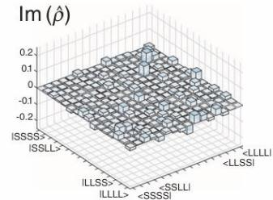

other

| Category | Value |
| -------- | ----- |
| <LLLLI  | 0.1   |
| <LLSSI  | 0.0   |
| <ISSLL  | -0.1  |
| <ISSLL>  | -0.2  |
| <SSSSI  | -0.1  |
| <LLLLI>  | 0.0   |
| <LLSSI  | 0.1   |
| <ISSLL>  | 0.0   |
| <ISSLL>  | -0.1  |
| <ISSLL>  | -0.2  |
| <SSSSI  | -0.1  |
| <LLLLI>  | 0.0   |
| <LLSSI  | 0.1   |
| <ISSLL>  | 0.0   |
| <ISSLL>  | -0.1  |
| <ISSLL>  | -0.2  |
| <ISSLL>  | -0.1  |
| <ISSLL>  | 0.0   |
| <ISSLL>  | 0.1   |
| <ISSLL>  | 0.0   |
| <ISSLL>  | -0.1  |
| <ISSLL>  | -0.2  |
| <ISSLL>  | -0.1  |
| <ISSLL>  | 0.0   |
| <ISSLL>  | 0.1   |
| <ISSLL>  | 0.0   |
|
| <ISSLL>  | -0.1  |
| <ISSLL>  | -0.2  |
| <ISSLL>  | -0.1  |
| <ISSLL>  | 0.0   |
| <ISSLL>  | 0.1   |
| <ISSLL>  | 0.0   |
| <ISSLL>  | -0.1  |
| <ISSLL>  | -OSSSI |
| <ISSLL>  | -OSSSI |
| <ISSLL>  | -OSSSI |
| <ISSLL>  | -OSSSI |
| <ISSLL>  | -OSSSI |
| <ISSLL>  | -OSSSI |
| <ISSLL>  | -OSSSI |
| <ISSLL>  | -OSSSI |
| <ISSLL>  | -OSSSI |
| <OSSSI   | -0.1  |
| <OSSSI   | -0.2  |
| <OSSSI   | -OSSSI |
| <OSSSI   | -OSSSI |
| <OSSSI   | -OSSSI |
| <OSSSI   | -OSSSI |
| <OSSSI   | -OSSSI |
| <OSSSI   | -OSSSI |
| <OSSSI   | -OSSSI |
| <OSSSI   | -OSSSI |
| <OSSSI   | -OSSSI |
| <SSSI    | -0.1  |
| <OSSSI   | -0.2  |
| <OSSSI   | -OSSSI |
| <OSSSI   | -OSSSI |
| <OSSSI   | -OSSSI |
| <OSSSI   | -OSSSI |
| <OSSSI   | -OSSSI |
| <OSSSI   | -OSSSI |
| <OSSSI   | OSSSI   |
| <OSSSI   | OSSSI   |
| <OSSSI   | OSSSI   |
| <OSSSI   | OSSSI   |
| <OSSSI   | OSSSI   |
| <OSSSI   | OSSSI   |
| <OSSSI   | OSSSI   |
| <OSSSI   | OSSSI   |
| <OSSSI   | OSSSI   |
| <SSSI    | -0.1  |
| <OSSSI   | -0.2  |
| <OSSSI   | -OSSSI |
| <OSSSI   | -OSSSI |
| <OSSSI   | -OSSSI |
| <OSSSI   | -OSSSI |
| <OSSSI   | -OSSSI |
| <OSSSI   | -OSSSI |
| <|x-axis label|

A（理想态）：显示理论上完美的量子态密度矩阵（ $\rho$ ）的实部（ $\mathrm{Re}(\rho)$ ）和虚部（ $\mathrm{Im}(\rho)$ ），使用三维柱状图表示。理想态通常是一个纯态（如Bell态），柱状图呈现对称和清晰的分布。  
B（实际测量态）：展示通过实验测量得到的密度矩阵。由于噪声、设备误差和测量精度限制，实际态会偏离理想态，柱状图可能出现不对称、振幅减小或相位偏差，反映的是混合态。  
C（理想态）：类似A，但用于更复杂的4光子系统，理想态可能涉及纠缠态。  
D（实际测量态）：实际测量结果，偏差更明显，因为光子数增加会放大误差（如退相干和测量不完美）。

# 什么是量子计算？

量子比特的质量（保真度）和测量/读取的速度（读出时间）直接决定了量子计算机解决实际问题的能力和性能。保真度指实际量子态/量子门与理想目标的相似度，公式表达为错误率≈1-保真度（Fidelity）。  
> 低保真度（高错误率）需要更大的“资源开销”，即更大数量的物理量子比特进行量子纠错，必须将多个不完美的物理量子比特编码为一个更稳定的“逻辑量子比特”。  
➢ 低测量时间大幅改善运行时间。研究表明，即使将误差率从 $10^{-3}$ 优化至 $10^{-9}$ 仅能带来一个数量级的加速，而将测量时间从 100 ns 缩短至 10 ns 则能直接线性降低总运行时间，这使得测量速度成为制约实际量子优势实现的主导因素。

图表：测量时间/保真度对于运行时间及资源开销极其重要

资源开销（物理量子比特数）：高错误率（error rate）需要更多的物理量子比特，导致较大资源开销

运行时间：可以看出，低测量时间带来的运行时间改善远大于错误率带来的优势

Estimated number of physical qubits and runtime   
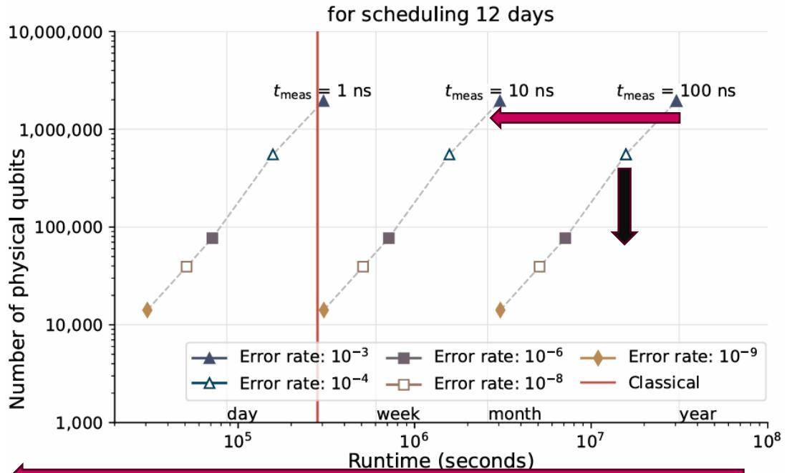

line

| Runtime (seconds) | Number of physical qubits | Error rate |
| ----------------- | -------------------------- | ---------- |
| day               | ~10,000                    | 10⁻⁹       |
| week              | ~100,000                   | 10⁻⁶       |
| month             | ~1,000,000                 | 10⁻⁴       |
| year              | ~1,000,000                 | 10⁻³       |

# 什么是量子计算？

➢ 量子优势是必然的吗？量子优势并非必然，关键掣肘在于测量的保真度（极低的物理误差，含读出错误）与测量时间。  
在常见的近端参数（物理误差约 $10^{-3} \sim 10^{-4}$ 、读出约 $100 \mathrm{~ns}$ ）下，量子求解的时间随规模迅速升高，始终慢于经典计算机（图中红线）；只有当保真度显著提升（物理误差 $\leq 10^{-8} \sim 10^{-9}$ 、并将测量时间缩短到 $10 \sim 1 \mathrm{~ns}$ 时），量子曲线才在中等规模处超越经典计算机。同时，为达到这一交叉点往往还需要 $10^{5} \sim 10^{6}$ 量级的物理比特，若保真度和读出时间达不到阈值，现实中的经典算法仍更具竞争力。

图表：量子优势并非必然，需要提高保真度、测量时间以及一定的资源开销才可能超越经典计算机  
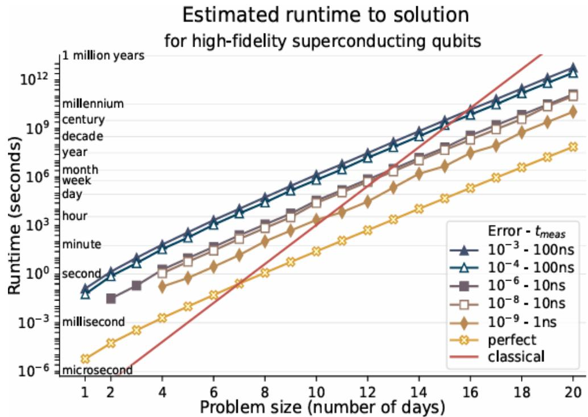

line

| Problem size (number of days) | 1 million years | millennium | century | decade | year | month | week | day | hour | minute | second | millisecond | microsecond |
| ----------------------------- | --------------- | ---------- | ------- | ------ | ---- | ----- | ---- | --- | ---- | ------ | ------ | ----------- | ----------- |
| 1                             | ~10^0           | ~10^0      | ~10^0   | ~10^0  | ~10^0| ~10^0 | ~10^-3| ~10^-3| ~10^-3| ~10^0  | ~10^0  | ~10^-3      | ~10^-6      |
| 2                             | ~10^1           | ~10^1      | ~10^1   | ~10^1  | ~10^1| ~10^1 | ~10^-2| ~10^-2| ~10^-2| ~10^1  | ~10^1  | ~10^-2      | ~10^-5      |
| 4                             | ~10^2           | ~10^2      | ~10^2   | ~10^2  | ~10^2| ~10^2 | ~10^-1| ~10^-1| ~10^-1| ~10^2  | ~10^2  | ~10^-1      | ~10^-4      |
| 6                             | ~10^3           | ~10^3      | ~10^3   | ~10^3  | ~10^3| ~10^3 | ~10^0| ~10^0| ~10^0| ~10^3  | ~10^3  | ~10^0       | ~10^-3      |
| 8                             | ~10^4           | ~10^4      | ~10^4   | ~10^4  | ~10^4| ~10^4 | ~10^1| ~10^1| ~10^1| ~10^4  | ~10^4  | ~10^1       | ~10^-2      |
| 10                            | ~10^5           | ~10^5      | ~10^5   | ~10^5  | ~10^5| ~10^5 | ~10^2| ~10^2| ~10^2| ~10^5  | ~10^5  | ~10^2       | ~10^-1      |
| 12                            | ~10^6           | ~10^6      | ~10^6   | ~10^6  | ~10^6| ~10^6 | ~10^3| ~10^3| ~10^3| ~10^6  | ~10^6  | ~10^3       | ~10^0       |
| 14                            | ~10^7           | ~10^7      | ~10^7   | ~10^7  | ~10^7| ~10^7 | ~10^4| ~10^4| ~10^4| ~10^7  | ~10^7  | ~10^4       | ~10^1       |
| 16                            | ~10^8           | ~10^8      | ~10^8   | ~10^8  | ~10^8| ~10^8 | ~10^5| ~10^5| ~10^5| ~10^8  | ~10^8  | ~10^5       | ~10^2       |
| 18                            | ~10^9           | ~10^9      | ~10^9   | ~10^9  | ~10^9| ~10^9 | ~10^6| ~10^6| ~10^6| ~10^9  | ~10^9  | ~10^6       | ~10^3       |
| 20                            | ~10^{12}        | ~10^{12}   | ~10^{12} | ~10^{12}| ~10^{12}|~    | ~    |     |     |      |      |             |             |
Error - tmeas          |
| Error - tmeas              | 1e-3            | 1e-4       | 1e-4    | 1e-4   | 1e-4 | 1e-4  | 1e-4 | 1e-4| 1e-4 | 1e-4   | 1e-4   | 1e-4        | 5e-5        |
| Error - tmeas              | 5e-3            | 5e-4       | 5e-4    | 5e-4   | 5e-4 | 5e-4  | 5e-4 | 5e-4| 5e-4 | 5e-4   | 5e-4   | 5e-4        | 2e-4        |
| Error - tmeas              | 2e-3            | 2e-4       | 2e-4    | 2e-4   | 2e-4 | 2e-4  | 2e-4 | 2e-4| 2e-4 | 2e-4   | 2e-4   | 2e-4        | 5e-5        |
| Error - tmeas              | 5e-3            | 5e-4       | 5e-4    | 5e-4   | 5e-4 | 5e-4  | 5e-4 | 5e-4| 5e-4 | 5e-4   | 5e-4   | 5e-4        |
| Error - tmeas              | 2e-3            | 2e-4       | 2e-4    | 2e-4   | 2e-4 | 2e-4  | 2e-4 | 2e-4| 2e-4 | 2e-4   | 2e-4   | 2e-4        |
| Error - tmeas              | 5e-3            | 5e-4       | 5e-4    | 5e-4   | 5e-4 | 5e-4  | 5e-4 | 5e-4| 5e-4 | 5e-4   | 5e-4   | 5e-4        |
| Error - tmeas              | 7.5e-3         | 7.5e-3     | 7.5e-3   | 7.5e-3 | 7.5e-3|    nan   |    nan   |    nan   |    nan   |      nan   |      nan   |    nan         |
| Error - tmeas              |               \    |            nan   |        nan   |        nan   |        nan   |    nan   |    nan   |    nan   |    nan   |      nan   |      nan   |    nan         |
| Error - tmeas              |               \    / classical / classical / classical / classical / classical / classical / classical / classical / classical / classical / classical / classical / classical / classical / classical / classical / classical / classical / classical / classical / classical / classical / classical / classical / classical / classical / classical / classical / classical / classical / classical / classical / classical / classical / classical / classical / classical / classical / classical / classical / classical / classical / classical / classical / classical / classical / classical / classical / classical / classical / classic / classical / classical / classical / classical / classical / classical / classical / classical / classical / classical / classical / classical / classical / classical / classical / classical / classical / classical / classical / classical / classical / classical / classical / classical / classical / classical / classical / classical / classical / classical / classical / classical / classical / classical / classical / classical / classical / classical / classical / classical / classical / classical / classical / classical / classical / classical / classical / classical / classical / general / classical / general |
    Note: The actual error values are not provided in the code. The actual error values may vary due to the random nature of the data generation. The actual error values may be calculated based on the formula used by applying the formula to the data generation. The actual error values may not be determined from the provided plot. The actual error values may not be determined from the generated plot. The actual error values may not be determined from the generated plot. The actual error values may not be determined from the generated plot. The actual error values may not be determined from the generated plot. The actual error values may not be determined from the generated plot. The actual error values may not be determined from the generated plot. The actual error values may not be determined from the generated plot. The actual error values may not be determined from the generated plot. The actual error values may not have been determined from the generated plot. The actual error values may not have been determined from the generated plot. The actual error values may not have been determined from the generated plot. The actual error values may not have been determined from the generated plot. The actual error values may not have been determined from the generated plot. The actual error values may not have been determined from the generated plot. The actual error values may not have been determined from the generated plot. The actual error values may not have been determined as a result of the generated plot size. The actual error values may not have been determined from the generated plot size. The actual error values may not have been determined from the generated plot size. The actual error values may not have been determined from the generated plot size. The actual error values may not have been determined from the generated plot size. The actual error values may not have been determined from the generated plot size. The actual error values may not have been determined from the generated plot size. The actual error values may not have been determined from the generated plot size. The actual error values are not known as 'classical' or 'general'.

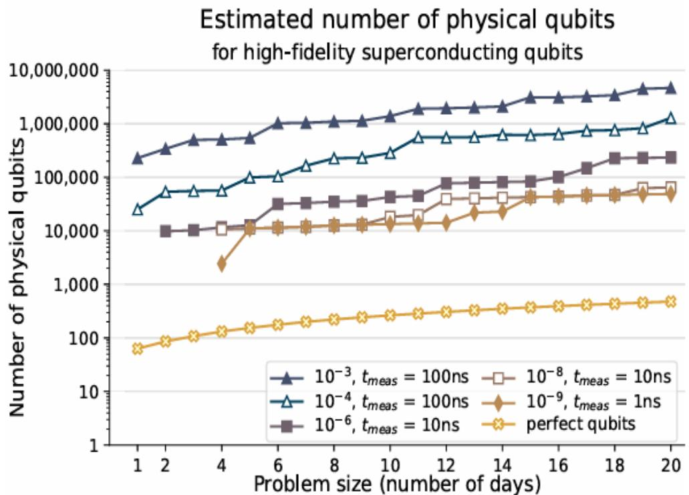

line

| Problem size (number of days) | 10⁻³, t_meas = 100ns | 10⁻⁴, t_meas = 100ns | 10⁻⁶, t_meas = 10ns | 10⁻⁸, t_meas = 10ns | 10⁻⁹, t_meas = 1ns | perfect qubits |
| ------------------------------ | --------------------- | --------------------- | ------------------- | ------------------- | ------------------ | -------------- |
| 1                              | ~300,000              | ~30,000               | ~10,000             | ~10,000             | ~10,000            | ~10            |
| 2                              | ~400,000              | ~50,000               | ~10,000             | ~10,000             | ~10,000            | ~10            |
| 4                              | ~600,000              | ~70,000               | ~15,000             | ~15,000             | ~3,000             | ~15            |
| 6                              | ~800,000              | ~100,000              | ~25,000             | ~25,000             | ~15,000            | ~25            |
| 8                              | ~900,000              | ~150,000              | ~35,000             | ~35,000             | ~25,000            | ~35            |
| 10                             | ~1,200,000            | ~25,000               | ~45,000             | ~45,000             | ~35,000            | ~45            |
| 12                             | ~1,500,000            | ~45,000               | ~65,000             | ~65,000             | ~45,000            | ~55            |
| 14                             | ~1,800,000            | ~65,000               | ~85,000             | ~85,000             | ~55,000            | ~65            |
| 16                             | ~2,200,000            | ~85,000               | ~1,25,000           | ~1,25,000           | ~65,000            | ~75            |
| 18                             | ~2,500,000            | ~1,25,000             | ~1,75,000           | ~1,75,000           | ~75,000            | ~85            |
| 20                             | ~3,562,876           | ~1,876,876            | ~2,25,876           | ~2,25,876           | ~85,876             | ~95            |

# 什么是量子计算？

从“量子霸权”过渡到量子优越：量子霸权强调经典计算在任何合理资源下都难以在可行时间内完成的任务但能够通过量子计算完成，而由于量子计算机测量时间、保真度以及可扩展性的约束，我们认为未来或更倾向于经典计算机+量子计算机的模式，发挥量子优势，量子与经典计算机并非互斥。

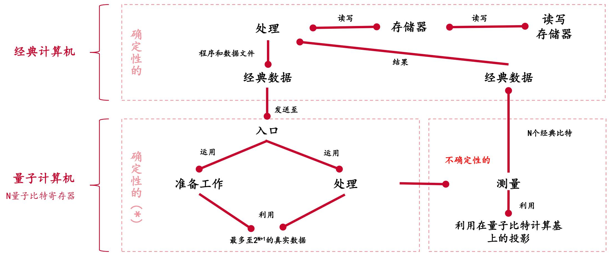

flowchart

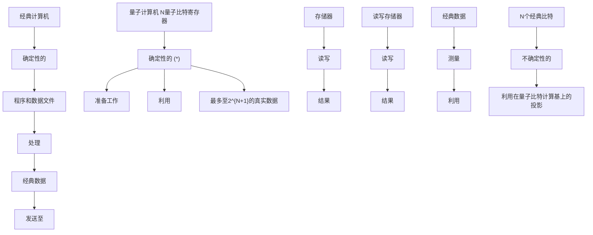
```mermaid
graph TD
    A["经典计算机"] --> B["确定性的"]
    B --> C["程序和数据文件"]
    C --> D["处理"]
    D --> E["经典数据"]
    E --> F["发送至"]
    G["量子计算机 N量子比特寄存器"] --> H["确定性的 (*)"]
    H --> I["准备工作"]
    H --> J["利用"]
    H --> K["最多至2^{N+1}的真实数据"]
    L["存储器"] --> M["读写"]
    M --> N["结果"]
    O["读写存储器"] --> P["读写"]
    P --> Q["结果"]
    R["经典数据"] --> S["测量"]
    S --> T["利用"]
    U["N个经典比特"] --> V["不确定性的"]
    V --> W["利用在量子比特计算基上的投影"]
```

(\*) 建模噪声与退相干效应，以及一些概率性量子门，例如在某些量子光子学  
系统中（如马赫－曾德尔干涉仪、KLM协议）等。   
此文件版权归金元证券股份有限公司所有，未经许可任何单位或个人不得复制、翻印。

多种物理量子比特类型：超导（谷歌、IBM等）、光子（PsiQuantum、Xanadu等采用）、离子阱、冷原子、自旋量子比特等

# 量子退火机（Quantum Annealer）

> 专用计算机，不运行通用量子门算法。它通过量子效应寻找复杂优化问题的最低能量状态（基态），类似于寻找山谷的最低点。目前已实现约5000个物理超导量子比特。  
其局限性体现在对复杂问题的优势仍有限，适用领域较窄。

基于量子比特

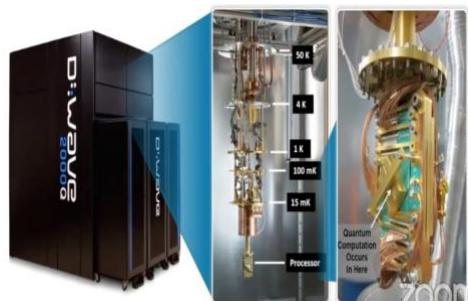

text_image

2002
O-VeV
50 k
4 k
3 k
100 mK
35 mK
Processor
Quantum
Computation
Occurs
In Here

# 量子模拟机（Quantum Simulators）

专用计算机，其设计目标是模拟特定的量子系统（如分子、新材料）。它是为解决特定物理、化学问题而量身定制的。

基于量子比特

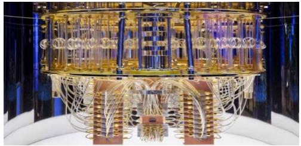

natural_image

Close-up of a large electronic device with metallic components and wiring, no visible text or symbols

# 含噪声的中等规模量子（NISQ）

当前主流通用量子计算机的研究阶段。它使用量子比特和量子门进行操作，但没有有效的纠错能力。  
拥有几十到几百个物理量子比特，受噪声影响严重。   
在某些特定任务上展现出超越经典超算的性能，但能力仍受限制。

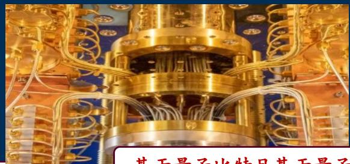

text_image

基于量子比特只 基于量子

基于量子比特且基于量子门

# 量子仿真机（Quantum Emulators）

使用经典计算机，通过软件模拟量子算法、量子门和量子比特的行为。用于优化、调试和验证量子算法，是算法开发的重要工具。

非基于量子比特

# 当前技术及研发方向

# 容错量子计算机（FTQC）

通过量子纠错码，将大量不完美的物理量子比特编码成少数高度稳定的逻辑量子比特。逻辑量子比特受到保护，能够进行任意长久的复杂计算而几乎不受底层物理错误的影响。  
100个逻辑量子比特起步。  
> 错误率：预期逻辑错误率低于 $10^{-6}$ ，这是实现可靠计算的门槛。  
1个逻辑量子比特可能需要多达1000个物理比特来实现量子纠错

基于量子比特且基于量子门

未来目标

# 量子计算技术

- 量子退火机利用超导回路（射频SQUID）作为量子比特，其“0/1”状态由环路中自发电流方向决定。例如，D-Wave系列处理器基于可调耦合的rf-SQUID量子比特（通过外加磁通偏置控制），在超低温（约20 mK）下工作。多个量子比特通过可编程耦合器互相影响，构成一个特殊的图连接结构。早期D-Wave 2000Q采用Chimera拓扑，每个8量子比特的单元格由4个横向量子比特连接4个纵向量子比特。最新Advantage系列采用Pegasus拓扑，单个量子比特连接度高达15个。退火芯片的内部包括大量晶体管和DAC控制电路，用于精确编程量子比特偏置和耦合强度  
- 量子态读出一般通过测量超导环路的磁通或量子比特的能级来实现（通常结合快速读出线圈，如DC SQUID）。目前退火机尚不具备完整的量子纠错机制，仅依赖物理冷却和参数优化来减小噪声影响。

图表：量子退火机结构（D-Wave Advantage系列）  
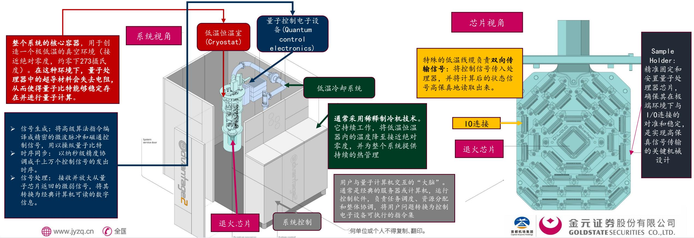

flowchart

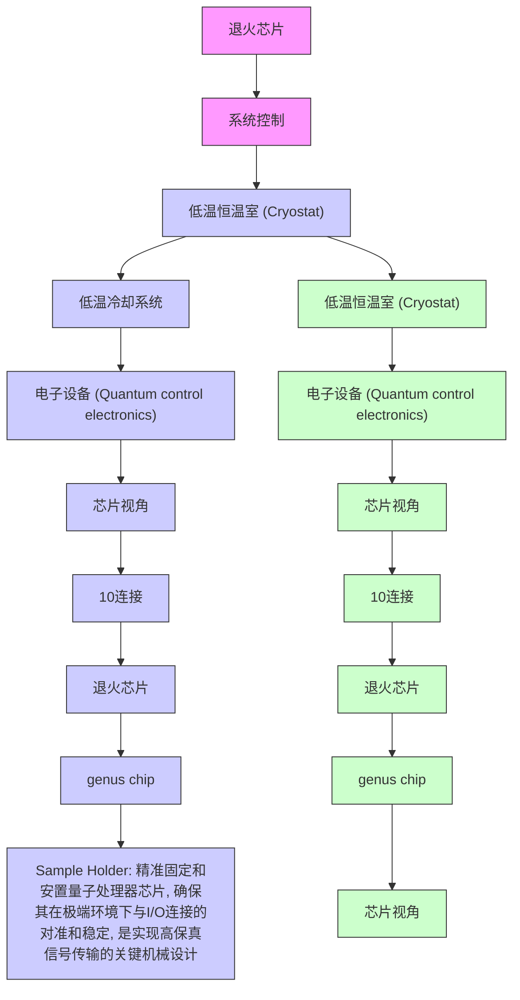
```mermaid
graph TD
    A["退火芯片"] --> B["系统控制"]
    B --> C["低温恒温室 (Cryostat)"]
    C --> D["低温冷却系统"]
    D --> E["电子设备 (Quantum control electronics)"]
    E --> F["芯片视角"]
    F --> G["10连接"]
    G --> H["退火芯片"]
    H --> I["genus chip"]
    I --> J["Sample Holder: 精准固定和安置量子处理器芯片, 确保其在极端环境下与I/O连接的对准和稳定, 是实现高保真信号传输的关键机械设计"]
    C --> K["低温恒温室 (Cryostat)"]
    K --> L["电子设备 (Quantum control electronics)"]
    L --> M["芯片视角"]
    M --> N["10连接"]
    N --> O["退火芯片"]
    O --> P["genus chip"]
    P --> Q["芯片视角"]
    style A fill:#f9f,stroke:#333
    style B fill:#f9f,stroke:#333
    style C fill:#ccf,stroke:#333
    style D fill:#ccf,stroke:#333
    style E fill:#ccf,stroke:#333
    style F fill:#ccf,stroke:#333
    style G fill:#ccf,stroke:#333
    style H fill:#ccf,stroke:#333
    style I fill:#ccf,stroke:#333
    style J fill:#ccf,stroke:#333
    style K fill:#cfc,stroke:#333
    style L fill:#cfc,stroke:#333
    style M fill:#cfc,stroke:#333
    style N fill:#cfc,stroke:#333
    style O fill:#cfc,stroke:#333
    style P fill:#cfc,stroke:#333
    style Q fill:#cfc,stroke:#333
```

# 量子计算技术

- 量子退火机采用退火计算模型：它将组合优化问题映射为Ising哈密顿量，系统从制备初态逐渐演化到目标哈密顿量的基态。运行结束后，每个量子比特坍缩到0/1态，表示优化问题的解。退火机特别适合解决组合优化问题（如物流路径规划、生产调度等）和概率采样问题  
例如，优化问题可表述为寻找能量最低的状态，而退火过程利用量子叠加和隧穿效应提高了搜索全局最优的概率。典型应用包括航班调度、车辆路径等；此外退火机还能用于量子马尔科夫链采样，用于训练概率模型和机器学习等。相比之下，退火机并非通用量子计算机，其只能解决特定形式的优化问题，而无法执行任意量子算法。

# 图表：量子退火模型

量子退火机在计算开始时，会构建一个特殊的初始哈密顿量（ $H_{0}$ ）。这个初始哈密顿量的设计使得系统的基态（能量最低态）是一个已知且易于制备的量子态。

通过量子控制电子设备施加特定的电磁脉冲，使所有超导量子比特进入一个一致的量子叠加态。在D-Wave系统中，通常是通过施加一个强大的横向磁场来实现的。

量子退火过程运行时，会产生一个能垒，将能量势垒分离单个最小能量分为两个谷（即双阱电位）导致两个谷值能量最小值相等。因此，量子比特有 50/50 的机会处于任一位置。退火结束时的谷值——即处于 0 或 1 的经典状态.

量子比特陷入 0 或 1 状态的概率可以通过施加外部磁场使量子比特偏置，使其以一个状态结束。另一种方式，磁场通过量子比特偏置以编程方式控制。
磁场应用于单个量子比特，因为能量垒被提高。磁场使山谷向首选方向倾斜，从而增加量子比特最终进入能量较低的山谷的概率，即为 1 的经典状态。

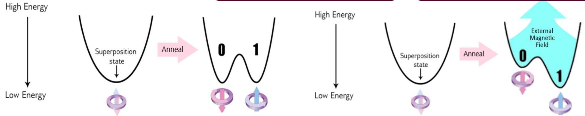

flowchart

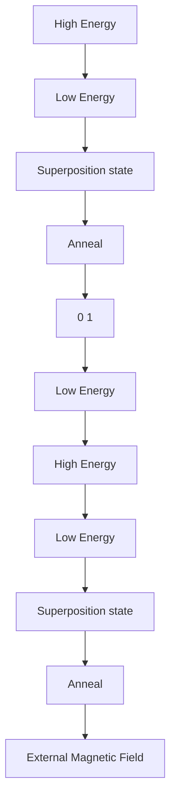
```mermaid
graph TD
    A["High Energy"] --> B["Low Energy"]
    B --> C["Superposition state"]
    C --> D["Anneal"]
    D --> E["0 1"]
    E --> F["Low Energy"]
    F --> G["High Energy"]
    G --> H["Low Energy"]
    H --> I["Superposition state"]
    I --> J["Anneal"]
    J --> K["External Magnetic Field"]
```

# 量子计算技术

量子模拟机是一类专用的类比量子系统，用于模拟其他量子体系的行为。常见平台包括中性原子和光量子阵列、离子阱以及超冷原子光学晶格等。例如，QuEra 和 Pasqal 等公司使用可编程tweezer阵列捕获中性原子，将原子激发到雷德伯态以产生相互作用；ColdQuanta 则利用玻色-爱因斯坦凝聚（BEC）作为模拟器平台  
这些系统不基于超导比特，而是直接利用冷原子自发的量子性质。操控手段主要是激光和微波场：通过激光冷却和聚焦束捕获原子，利用不同波长激发原子间的相互作用，实现可调节的哈密顿量。探测时通常使用荧光成像：通过激光使原子发光，摄取发光图像来读取量子态。  
量子模拟机的计算模型主要是模拟特定物理系统的哈密顿量演化。比如，利用光学晶格模拟固体中的电子运动或自旋模型，通过调节势阱和相互作用强度来再现凝聚态物理现象。模拟器可分为纯类比、数字-类比混合等模式  
量子模拟机常用于材料科学和物理问题：例如研究高温超导、量子磁体、自旋系统乃至高能物理和宇宙学相关问题。由于模拟任务本质是解决指数复杂的量子多体问题，因此量子模拟机在这些领域（如凝聚态物理、化学分子动力学）具备传统计算无法匹敌的优势。

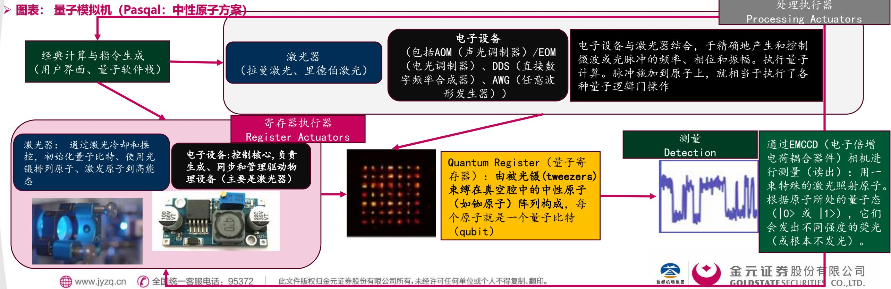

flowchart

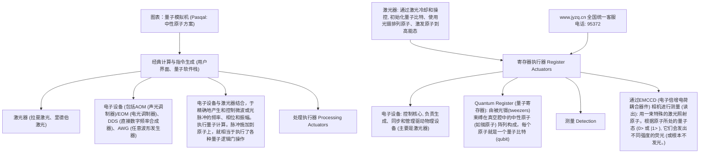
```mermaid
graph TD
    A["图表：量子模拟机 (Pasqal: 中性原子方案)"] --> B["经典计算与指令生成 (用户界面、量子软件栈)"]
    B --> C["激光器 (拉曼激光、里德伯激光)"]
    B --> D["电子设备 (包括AOM (声光调制器)/EOM (电光调制器)、DDS (直接数字频率合成器)、AWG (任意波形发生器)"]
    B --> E["电子设备与激光器结合，于精确地产生和控制微波或光脉冲的频率、相位和振幅。执行量子计算。脉冲施加到原子上，就相当于执行了各种量子逻辑门操作"]
    B --> F["处理执行器 Processing Actuators"]
    G["寄存器执行器 Register Actuators"] --> H["电子设备: 控制核心, 负责生成、同步和管理驱动物理设备 (主要是激光器)"]
    G --> I["Quantum Register (量子寄存器): 由被光镊(tweezers)束缚在真空腔中的中性原子 (如铷原子) 阵列构成，每个原子就是一个量子比特 (qubit)"]
    G --> J["测量 Detection"]
    G --> K["通过EMCCD (电子倍增电荷耦合器件) 相机进行测量 (读出): 用一束特殊的激光照射原子。根据原子所处的量子态 (0> 或 |1> ), 它们会发出不同强度的荧光 (或根本不发光。)"]
    L["激光器: 通过激光冷却和操控, 初始化量子比特、使用光镊排列原子、激发原子到高能态"] --> G
    M["www.jyzq.cn 全国统一客服电话: 95372"] --> G
```

# 量子计算技术

- NISQ原型机指的是当前可用的通用门阵列量子计算机，典型规模为几十到数百个量子比特，但噪声水平较高。常见物理实现包括超导量子电路和离子阱。常见物理实现包括超导量子电路和离子阱：例如，Google 的 Sycamore（54个超导Transmon）、IBM 的 Falcon（127个超导量子比特）、Rigetti 的 Aspen，以及离子阱公司 IonQ、Quantinuum 等的线性离子阵列。其他技术方案包括光子（Photon）、中性原子（冷原子）、氮空位中心（NV Centers）、硅锗（Silicon Spin）、拓扑等。  
- 以超导方案为例，整个系统的工作流程是控制指令从左侧的软件发出，经过电子元件转换为微波信号，再通过冷却和连接系统传递到处于极端低温环境下的量子芯片上执行。

# 图表：超导方案架构

服务器、网络、软件
软件层负责生成高级的量子算法指令，并通过服务器和网络将其发送给硬件系统

# 电子元件

微波控制量子门和测量量子比特状态的电子设备。将软件指令转换为精确的微波脉冲，这些脉冲用于操控（即执行量子逻辑门）和读取量子比特的状态。

# 冷却（稀释制冷机）/与连接（低温同轴线缆等）及QPU

连接室温环境和极低温环境的桥梁和瓶颈。它负责将微波信号从室温电子设备高效地传输到超低温的量子芯片，同时最大限度地减少热量传入和信号损耗。  
量子芯片（QPU）：量子比特在此处进行实际的量子计算。为了使其进入并保持超导状态（量子相干性），必须将其置于极高的真空、严格的磁屏蔽以及15毫开尔文到1开尔文的极低温环境中

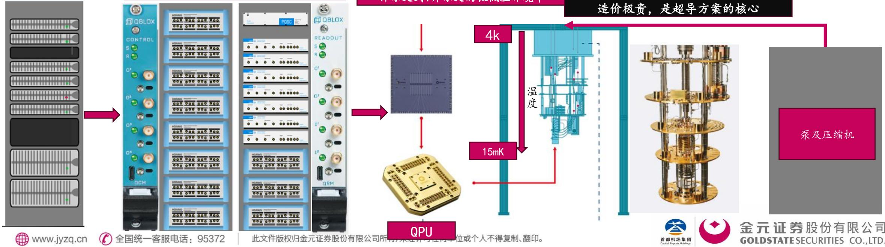

flowchart

```mermaid
graph LR
    A["服务器"] --> B["QCOM"]
    B --> C["QPL"]
    C --> D["4k"]
    D --> E["温度"]
    E --> F["泵及压缩机"]
    F --> G["QCOM"]
    
    subgraph 造价极贵，是超导方案的核心
        H["4k"] --> I["15mK"]
        I --> J["QPU"]
        J --> K["QCOM"]
    end
    
    style A fill:#f9f,stroke:#333
    style B fill:#ccf,stroke:#333
    style C fill:#cfc,stroke:#333
    style D fill:#fcc,stroke:#333
    style E fill:#cff,stroke:#333
    style F fill:#ffc,stroke:#333
    style G fill:#fcc,stroke:#333
    style H fill:#fff,stroke:#333
    style I fill:#fff,stroke:#333
    style J fill:#fff,stroke:#333
    style K fill:#fff,stroke:#333
```

# 量子计算技术

图表：主流技术方案架构  
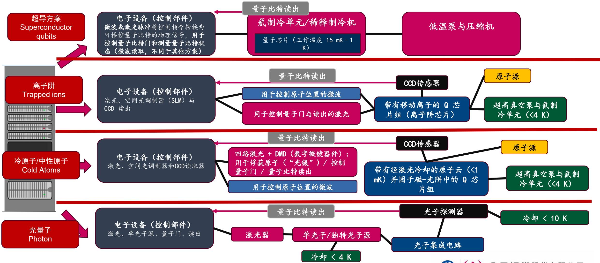

flowchart

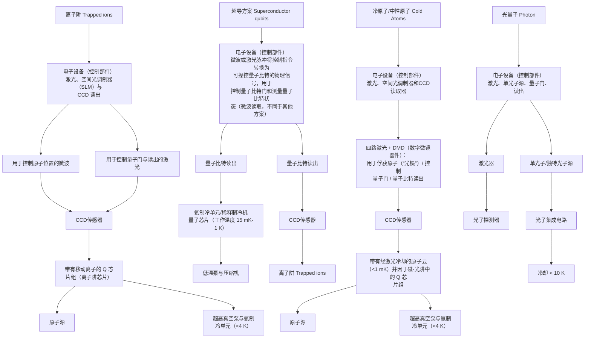
```mermaid
graph TD
    A["超导方案 Superconductor qubits"] --> B["电子设备（控制部件）\n微波或激光脉冲将控制指令转换为\n可操控量子比特的物理信号，用于\n控制量子比特门和测量量子比特状\n态（微波读取，不同于其他方案）"]
    B --> C["量子比特读出"]
    C --> D["氦制冷单元/稀释制冷机\n量子芯片（工作温度 15 mK-1 K）"]
    D --> E["低温泵与压缩机"]
    
    F["离子阱 Trapped ions"] --> G["电子设备（控制部件）\n激光、空间光调制器（SLM）与\nCCD 读出"]
    G --> H["用于控制原子位置的微波"]
    G --> I["用于控制量子门与读出的激光"]
    H --> J["CCD传感器"]
    I --> J
    J --> K["带有移动离子的 Q 芯\n片组（离子阱芯片）"]
    K --> L["原子源"]
    K --> M["超高真空泵与氦制\n冷单元（<4 K）"]
    
    N["冷原子/中性原子 Cold Atoms"] --> O["电子设备（控制部件）\n激光、空间光调制器和CCD读取器"]
    O --> P["四路激光 + DMD（数字微镜器件）：\n用于俘获原子（“光镊”）/ 控制\n量子门 / 量子比特读出"]
    P --> Q["CCD传感器"]
    Q --> R["带有经激光冷却的原子云（<1 mK）并因于磁-光阱中的 Q 芯\n片组"]
    R --> S["原子源"]
    R --> T["超高真空泵与氦制\n冷单元（<4 K）"]
    
    U["光量子 Photon"] --> V["电子设备（控制部件）\n激光、单光子源、量子门、读出"]
    V --> W["激光器"]
    V --> X["单光子/独特光子源"]
    W --> Y["光子探测器"]
    X --> Z["光子集成电路"]
    Z --> AA["冷却 < 10 K"]
    
    B --> AB["量子比特读出"]
    AB --> AC["CCD传感器"]
    AC --> AD["离子阱 Trapped ions"]
```

# 量子计算技术

光子学（Photonics）对量子技术的发展至关重要，因为激光和其他光子器件被广泛应用于离子阱、光量子及中性原子等技术领域。具体而言，离子阱、冷原子和金刚石氮空位色心量子比特实现方案必需依赖激光系统尽管激光供应商数量众多，但商业现成的激光器无法直接应用于量子技术领域，必须经过定制化改造才能满足量子系统的需求。具备敏捷调控、高可靠性、绝对频率控制和长使用寿命的激光系统至关重要。  
低温技术是几乎所有量子比特技术的关键支撑，因为需要依靠它将量子比特稳定在接近绝对零度的环境下，但并非所有量子比特技术都需要稀释制冷机。例如，中性原子仅需在光镊中进行冷却，而不需要稀释制冷机。因此，其能耗要低得多（超导技术需40千瓦，而中性原子仅需3千瓦）。

图表：主流技术方案架构

<table><tr><td>架构</td><td>量子比特控制电子单元</td><td>激光与微波单元</td><td>量子比特芯片组(QPU)</td><td>读取方式</td><td>真空/低温单元</td></tr><tr><td rowspan="2">超导量子比特</td><td rowspan="2">微波脉冲发生器(4-8GHz)</td><td rowspan="2">超导线缆(&lt;4K)</td><td rowspan="2">超导芯片组</td><td rowspan="2">超导线读出</td><td>硅组件:100mK-1K的氦单元</td></tr><tr><td>超导组件:15mK</td></tr><tr><td rowspan="2">离子阱量子比特</td><td rowspan="2">激光器、空间光调制器和CCD读取器</td><td rowspan="2">用于控制原子/量子比特的微波和激光</td><td rowspan="2">在芯片中传输的离子,经激光冷却至&lt;1μK</td><td rowspan="2">CCD</td><td>超高真空</td></tr><tr><td>温度&lt;4K的氦冷却单元</td></tr><tr><td rowspan="2">冷原子/中性原子量子比特</td><td rowspan="2">激光器、空间光调制器和CCD读取器</td><td rowspan="2">用于控制原子/量子比特的微波和激光</td><td rowspan="2">磁光阱中的原子云,温度&lt;1μK</td><td rowspan="2">CCD</td><td>超高真空</td></tr><tr><td>温度&lt;4K的氦冷却单元</td></tr><tr><td rowspan="2">光量子比特</td><td rowspan="2">激光器、单光子源</td><td rowspan="2">激光器、单光子源</td><td rowspan="2">光子集成电路</td><td rowspan="2">光子探测器</td><td>单光子源:冷却&lt;4K</td></tr><tr><td>光子探测器:冷却&lt;10K</td></tr></table>

# 量子计算技术

<table><tr><td></td><td colspan="3">原子</td><td colspan="5">受控电子</td><td colspan="2">飞行量子比特</td></tr><tr><td>量子比特类型</td><td>离子阱</td><td>冷/中性原子</td><td>核自旋(NMR)</td><td>量子退火</td><td>超导</td><td>硅及其他(硅锗,硅化砷)</td><td>氮空位中心</td><td>拓扑</td><td>光子</td><td>飞行量子比特</td></tr><tr><td>制备方法</td><td>离子在真空中被电磁力捕获,并通过激光进行冷却和稳定</td><td>类似于离子阱</td><td>基于原子和分子的集合,仅有一家中国公司(SpinQ)使用原子核自旋作为量子比特</td><td>超导回路,通过寻找复杂能量景观中的“最低能量状态”来解决优化问题</td><td>超导电流穿过薄势垒的震荡(Josephson效应。具有μ波光子腔的玻色子量子比特</td><td>电子在量子阱中被捕获(1个电子=1个量子比特,第2个电子用于测量)</td><td>人工钻石结构中,一个碳原子被氮原子取代。需要μ波和电磁场。与光子发生纠缠,存在磁性或耦合现象</td><td>准粒子</td><td>偏振实现,玻色子采样(多模光子)</td><td>单电子传输,量子点检测</td></tr><tr><td>尺寸</td><td>原子间距1μm</td><td>原子间距1μm</td><td>原子尺度(核自旋)</td><td>N/A</td><td>100 x 100 μm2</td><td>&lt;100 nm2</td><td>&lt;100 mm2</td><td>100 nm-1μm</td><td>约为微米级,具体取决于波长</td><td>N/A</td></tr><tr><td>门保真度</td><td>99.5% (QuEra)</td><td>99.9916%(Oxford Ionics)</td><td>&gt;99%</td><td>针对退火进行优化</td><td>99.965%(Google Willow)99.99%(Riken/Toshiba)</td><td>99.9%(Intel)</td><td>~99.9%</td><td>N/A</td><td>99.99%(Psi Q)</td><td>N/A</td></tr><tr><td>读取保真度</td><td>99.99%</td><td>97%</td><td>N/A</td><td>&gt;99%</td><td>99.4%</td><td>99%</td><td>98%</td><td>N/A</td><td>89%</td><td>N/A</td></tr><tr><td>门时间(单个量子比特)</td><td>1-10μs</td><td>1-10μs</td><td>N/A</td><td>无门操作</td><td>10-50ns</td><td>10-30ns</td><td>10-700ns</td><td>N/A</td><td>10fs</td><td>N/A</td></tr><tr><td>相干时间(T2)</td><td>&gt;1h(P. Wang et al. 2021)</td><td>&gt;10sec</td><td>~sec</td><td>~nsec</td><td>200-300μsec</td><td>200-300μsec(msec for C12)</td><td>&gt;1sec</td><td>N/A</td><td>取决于光损失</td><td>N/A</td></tr><tr><td>温度</td><td>&lt;1mK</td><td>&lt;1mK*</td><td>RT</td><td>15mK</td><td>15mK</td><td>100mK-1K</td><td>4K-RT</td><td>&lt;100mK</td><td>N/A</td><td>N/A</td></tr><tr><td>量子比特数量(2025年1月)</td><td>56(Quantinuum)</td><td>1600(Infleqtion)</td><td>3(SpinQ)</td><td>5000+</td><td>156(IBM)</td><td>6(QuTech, Delft, TNO)</td><td>5(Quantum Brilliance)</td><td>8(Microsoft)</td><td>256(玻色子采样,Xanadu)</td><td>N/A</td></tr><tr><td>可扩展性</td><td>&lt;100</td><td>最高可达1万</td><td>不可扩展</td><td>可扩展</td><td>百万级</td><td>百万级</td><td>100s</td><td>可扩展,使用半导体工艺</td><td>百万级</td><td>N/A</td></tr><tr><td>优点</td><td>保真度高、连接性好、相干时间长</td><td>量子比特数量多</td><td>低成本</td><td>较成熟,可应用于优化、机器学习及一些材料科学等特定问题</td><td>经最充分的验证、量子比特数量多、可扩展性强</td><td>尺寸小巧、可扩展性强</td><td>也用于感测温度</td><td>具有在量子比特级别实现错误校正的可能性</td><td>可在室温条件下运行,可扩展性强</td><td>N/A</td></tr><tr><td>缺点</td><td>可扩展性差、需超低温</td><td>可扩展性差(但优于离子阱)</td><td>不可扩展</td><td>无通用性,仅适用于特定问题,并且速度较慢</td><td>相干时间短</td><td>成熟度低、相干时间短</td><td>可扩展性差</td><td>仅在2025年2月经验证</td><td>会生成概率性光子</td><td>尚在实验研发阶段</td></tr></table>

# 量子计算技术

从产业链角度，由于量子计算需要较为苛刻的低温环境以确保量子比特的保真度和更长的相干时间，所以需要昂贵的稀释制冷机、低温组件、真空系统以及激光器。此外，由于量子计算的操控/测量难度较大，所以测控系统、光学探测器以及用于操控的激光器也尤为重要。

原型机方面，IBM、Google、富士通等公司集中于超导方案，而Quantinuum、IONQ等公司集中于离子阱方案，XANADU、PsiQuantum等公司专注于光量子方案，而以英特尔为代表的公司则侧重于硅半导体方案。

<table><tr><td rowspan="6">上游</td><td rowspan="6">环境与测控</td><td>稀释制冷机</td><td>BLUE FORS</td><td>OXFORD INSTRUMENTS</td><td>LT LAB</td><td>CryoConcept
an Air Liquide affiliate</td><td>JanisULT</td><td>FORMFACTOR
ULVAC
ULVAC CRYOGENICS INC.</td><td>…</td><td></td><td></td><td></td><td></td><td></td><td></td><td></td><td></td><td></td><td></td><td></td><td></td><td></td><td></td><td></td><td></td><td></td><td></td><td></td><td></td><td></td><td></td><td></td><td></td><td></td><td></td><td></td><td></td><td></td><td></td><td></td><td></td><td></td><td></td><td></td><td></td><td></td><td></td><td></td><td></td><td></td><td></td><td></td><td></td><td></td><td></td><td></td><td></td><td></td><td></td><td></td><td></td><td></td><td></td><td></td><td></td><td></td><td></td><td></td><td></td><td></td><td></td><td></td><td></td><td></td><td></td><td></td><td></td><td></td><td></td><td></td><td></td><td></td><td></td><td></td><td></td><td></td><td></td><td></td><td></td><td></td><td></td><td></td><td></td><td></td><td></td><td></td><td></td><td></td><td></td><td></td><td></td><td></td></tr><tr><td>测控系统</td><td>Zurich Instruments</td><td>QM QUANTUM MACHINES</td><td colspan="2">QBLOX</td><td>KEYSIGHT TECHNOLOGIES</td><td>MenloSystems</td><td>…</td><td></td><td></td><td></td><td></td><td></td><td></td><td></td><td></td><td></td><td></td><td></td><td></td><td></td><td></td><td></td><td></td><td></td><td></td><td></td><td></td><td></td><td></td><td></td><td></td><td></td><td></td><td></td><td></td><td></td><td></td><td></td><td></td><td></td><td></td><td></td><td></td><td></td><td></td><td></td><td></td><td></td><td></td><td></td><td></td><td></td><td></td><td></td><td></td><td></td><td></td><td></td><td></td><td></td><td></td><td></td><td></td><td></td><td></td><td></td><td></td><td></td><td></td><td></td><td></td><td></td><td></td><td></td><td></td><td></td><td></td><td></td><td></td><td></td><td></td><td></td><td></td><td></td><td></td><td></td><td></td><td></td><td></td><td></td><td></td><td></td><td></td><td></td><td></td><td></td><td></td><td></td><td></td><td></td></tr><tr><td>低温组件</td><td>STAR TECHNOLOGIES</td><td>Atlantic Microwave An ETL Systems Company</td><td colspan="2">Lake Shore CRYOTRONICS</td><td>COGX</td><td>AmpliTech</td><td>…</td><td></td><td></td><td></td><td></td><td></td><td></td><td></td><td></td><td></td><td></td><td></td><td></td><td></td><td></td><td></td><td></td><td></td><td></td><td></td><td></td><td></td><td></td><td></td><td></td><td></td><td></td><td></td><td></td><td></td><td></td><td></td><td></td><td></td><td></td><td></td><td></td><td></td><td></td><td></td><td></td><td></td><td></td><td></td><td></td><td></td><td></td><td></td><td></td><td></td><td></td><td></td><td></td><td></td><td></td><td></td><td></td><td></td><td></td><td></td><td></td><td></td><td></td><td></td><td></td><td></td><td></td><td></td><td></td><td></td><td></td><td></td><td></td><td></td><td></td><td></td><td></td><td></td><td></td><td></td><td></td><td></td><td></td><td></td><td></td><td></td><td></td><td></td><td></td><td></td><td></td><td></td><td></td><td></td></tr><tr><td>真空系统</td><td>John Sun Quantum</td><td>JVC Kurt J. Lesker Company Enabling Technology for a Better World</td><td>Leybold</td><td>Agilent</td><td>EDWARDS</td><td>PFEIFFER</td><td>VACUUM</td><td></td><td></td><td></td><td></td><td></td><td></td><td></td><td></td><td></td><td></td><td></td><td></td><td></td><td></td><td></td><td></td><td></td><td></td><td></td><td></td><td></td><td></td><td></td><td></td><td></td><td></td><td></td><td></td><td></td><td></td><td></td><td></td><td></td><td></td><td></td><td></td><td></td><td></td><td></td><td></td><td></td><td></td><td></td><td></td><td></td><td></td><td></td><td></td><td></td><td></td><td></td><td></td><td></td><td></td><td></td><td></td><td></td><td></td><td></td><td></td><td></td><td></td><td></td><td></td><td></td><td></td><td></td><td></td><td></td><td></td><td></td><td></td><td></td><td></td><td></td><td></td><td></td><td></td><td></td><td></td><td></td><td></td><td></td><td></td><td></td><td></td><td></td><td></td><td></td><td></td><td></td><td></td><td></td></tr><tr><td>激光器</td><td colspan="2">M NKT Photonics THORLABS</td><td colspan="2">TOPTICA PHOTONICS</td><td>nLIGHT</td><td>OEwaves</td><td>漫杰半导体 Origin of Excellence</td><td></td><td></td><td></td><td></td><td></td><td></td><td></td><td></td><td></td><td></td><td></td><td></td><td></td><td></td><td></td><td></td><td></td><td></td><td></td><td></td><td></td><td></td><td></td><td></td><td></td><td></td><td></td><td></td><td></td><td></td><td></td><td></td><td></td><td></td><td></td><td></td><td></td><td></td><td></td><td></td><td></td><td></td><td></td><td></td><td></td><td></td><td></td><td></td><td></td><td></td><td></td><td></td><td></td><td></td><td></td><td></td><td></td><td></td><td></td><td></td><td></td><td></td><td></td><td></td><td></td><td></td><td></td><td></td><td></td><td></td><td></td><td></td><td></td><td></td><td></td><td></td><td></td><td></td><td></td><td></td><td></td><td></td><td></td><td></td><td></td><td></td><td></td><td></td><td></td><td></td><td></td><td></td><td></td></tr><tr><td>光学探测器</td><td colspan="2">SINGLE QUANTUM Excellence in photon detection</td><td colspan="2">SCONTEL</td><td>Photon Spot</td><td>Pixel Photonics</td><td>attocube</td><td></td><td></td><td></td><td></td><td></td><td></td><td></td><td></td><td></td><td></td><td></td><td></td><td></td><td></td><td></td><td></td><td></td><td></td><td></td><td></td><td></td><td></td><td></td><td></td><td></td><td></td><td></td><td></td><td></td><td></td><td></td><td></td><td></td><td></td><td></td><td></td><td></td><td></td><td></td><td></td><td></td><td></td><td></td><td></td><td></td><td></td><td></td><td></td><td></td><td></td><td></td><td></td><td></td><td></td><td></td><td></td><td></td><td></td><td></td><td></td><td></td><td></td><td></td><td></td><td></td><td></td><td></td><td></td><td></td><td></td><td></td><td></td><td></td><td></td><td></td><td></td><td></td><td></td><td></td><td></td><td></td><td></td><td></td><td></td><td></td><td></td><td></td><td></td><td></td><td></td><td></td><td></td><td></td></tr><tr><td rowspan="7">中游</td><td rowspan="6">原型机</td><td>超导</td><td colspan="4">IBM Google rigetti QM OQC</td><td colspan="2">ATLANTIC quaytum seeqci FUJITSU</td><td>Nord Quantique</td><td></td><td></td><td></td><td></td><td></td><td></td><td></td><td></td><td></td><td></td><td></td><td></td><td></td><td></td><td></td><td></td><td></td><td></td><td></td><td></td><td></td><td></td><td></td><td></td><td></td><td></td><td></td><td></td><td></td><td></td><td></td><td></td><td></td><td></td><td></td><td></td><td></td><td></td><td></td><td></td><td></td><td></td><td></td><td></td><td></td><td></td><td></td><td></td><td></td><td></td><td></td><td></td><td></td><td></td><td></td><td></td><td></td><td></td><td></td><td></td><td></td><td></td><td></td><td></td><td></td><td></td><td></td><td></td><td></td><td></td><td></td><td></td><td></td><td></td><td></td><td></td><td></td><td></td><td></td><td></td><td></td><td></td><td></td><td></td><td></td><td></td><td></td><td></td><td></td><td></td><td></td><td></td><td></td></tr><tr><td>离子阱</td><td colspan="4">QUANTINUUM IONQ</td><td colspan="2">oxford ionics Universal Quantum</td><td>eletron</td><td></td><td></td><td></td><td></td><td></td><td></td><td></td><td></td><td></td><td></td><td></td><td></td><td></td><td></td><td></td><td></td><td></td><td></td><td></td><td></td><td></td><td></td><td></td><td></td><td></td><td></td><td></td><td></td><td></td><td></td><td></td><td></td><td></td><td></td><td></td><td></td><td></td><td></td><td></td><td></td><td></td><td></td><td></td><td></td><td></td><td></td><td></td><td></td><td></td><td></td><td></td><td></td><td></td><td></td><td></td><td></td><td></td><td></td><td></td><td></td><td></td><td></td><td></td><td></td><td></td><td></td><td></td><td></td><td></td><td></td><td></td><td></td><td></td><td></td><td></td><td></td><td></td><td></td><td></td><td></td><td></td><td></td><td></td><td></td><td></td><td></td><td></td><td></td><td></td><td></td><td></td><td></td><td></td></tr><tr><td>光量子</td><td colspan="4">XANADU PsiQuantum QUANDELA ORCA</td><td colspan="2">QCI QUIX NQCG QUANTUM SOURCE</td><td>…</td><td></td><td></td><td></td><td></td><td></td><td></td><td></td><td></td><td></td><td></td><td></td><td></td><td></td><td></td><td></td><td></td><td></td><td></td><td></td><td></td><td></td><td></td><td></td><td></td><td></td><td></td><td></td><td></td><td></td><td></td><td></td><td></td><td></td><td></td><td></td><td></td><td></td><td></td><td></td><td></td><td></td><td></td><td></td><td></td><td></td><td></td><td></td><td></td><td></td><td></td><td></td><td></td><td></td><td></td><td></td><td></td><td></td><td></td><td></td><td></td><td></td><td></td><td></td><td></td><td></td><td></td><td></td><td></td><td></td><td></td><td></td><td></td><td></td><td></td><td></td><td></td><td></td><td></td><td></td><td></td><td></td><td></td><td></td><td></td><td></td><td></td><td></td><td></td><td></td><td></td><td></td><td></td><td></td></tr><tr><td>硅半导体</td><td colspan="6">intel Silicon Quantum Computing NTT equal1 QUANTUM MOTION |EeroQ diraq C12 HITACHI photonic</td><td>…</td><td></td><td></td><td></td><td></td><td></td><td></td><td></td><td></td><td></td><td></td><td></td><td></td><td></td><td></td><td></td><td></td><td></td><td></td><td></td><td></td><td></td><td></td><td></td><td></td><td></td><td></td><td></td><td></td><td></td><td></td><td></td><td></td><td></td><td></td><td></td><td></td><td></td><td></td><td></td><td></td><td></td><td></td><td></td><td></td><td></td><td></td><td></td><td></td><td></td><td></td><td></td><td></td><td></td><td></td><td></td><td></td><td></td><td></td><td></td><td></td><td></td><td></td><td></td><td></td><td></td><td></td><td></td><td></td><td></td><td></td><td></td><td></td><td></td><td></td><td></td><td></td><td></td><td></td><td></td><td></td><td></td><td></td><td></td><td></td><td></td><td></td><td></td><td></td><td></td><td></td><td></td><td></td><td></td></tr><tr><td>中性原子</td><td colspan="6">atom computing Inflection PASQAL |QuEra&gt; COMPUTING INC. NanoQT planqc</td><td>…</td><td></td><td></td><td></td><td></td><td></td><td></td><td></td><td></td><td></td><td></td><td></td><td></td><td></td><td></td><td></td><td></td><td></td><td></td><td></td><td></td><td></td><td></td><td></td><td></td><td></td><td></td><td></td><td></td><td></td><td></td><td></td><td></td><td></td><td></td><td></td><td></td><td></td><td></td><td></td><td></td><td></td><td></td><td></td><td></td><td></td><td></td><td></td><td></td><td></td><td></td><td></td><td></td><td></td><td></td><td></td><td></td><td></td><td></td><td></td><td></td><td></td><td></td><td></td><td></td><td></td><td></td><td></td><td></td><td></td><td></td><td></td><td></td><td></td><td></td><td></td><td></td><td></td><td></td><td></td><td></td><td></td><td></td><td></td><td></td><td></td><td></td><td></td><td></td><td></td><td></td><td></td><td></td><td></td></tr><tr><td>其他</td><td colspan="6">Microsoft NTT D:WAVE The Quantum Computing Company NEC QUANTUM BRILLIANCE</td><td>…</td><td></td><td></td><td></td><td></td><td></td><td></td><td></td><td></td><td></td><td></td><td></td><td></td><td></td><td></td><td></td><td></td><td></td><td></td><td></td><td></td><td></td><td></td><td></td><td></td><td></td><td></td><td></td><td></td><td></td><td></td><td></td><td></td><td></td><td></td><td></td><td></td><td></td><td></td><td></td><td></td><td></td><td></td><td></td><td></td><td></td><td></td><td></td><td></td><td></td><td></td><td></td><td></td><td></td><td></td><td></td><td></td><td></td><td></td><td></td><td></td><td></td><td></td><td></td><td></td><td></td><td></td><td></td><td></td><td></td><td></td><td></td><td></td><td></td><td></td><td></td><td></td><td></td><td></td><td></td><td></td><td></td><td></td><td></td><td></td><td></td><td></td><td></td><td></td><td></td><td></td><td></td><td></td><td></td></tr><tr><td>软件</td><td colspan="7">IBM HORIZON software Q-CTRL ENTROPICALS QUBIT parityqc Quantrolox Light Soliver q(b) quantum benchmark Quantum-South Qdma Orange Quantum Systems SAVANTX river Lane 1QBit Quemix Qu&amp;Co HOS Quantum Intensification QCWARE GOOD CHEMISTRY ProteinOure QUANTUM ZAPATA QCI POLARISb HALTIVER Cogniframe inspiration QSIMULATE QunoSys QUNOVA COMPUTING Qubit Qubit</td><td>…</td><td></td><td></td><td></td><td></td><td></td><td></td><td></td><td></td><td></td><td></td><td></td><td></td><td></td><td></td><td></td><td></td><td></td><td></td><td></td><td></td><td></td><td></td><td></td><td></td><td></td><td></td><td></td><td></td><td></td><td></td><td></td><td></td><td></td><td></td><td></td><td></td><td></td><td></td><td></td><td></td><td></td><td></td><td></td><td></td><td></td><td></td><td></td><td></td><td></td><td></td><td></td><td></td><td></td><td></td><td></td><td></td><td></td><td></td><td></td><td></td><td></td><td></td><td></td><td></td><td></td><td></td><td></td><td></td><td></td><td></td><td></td><td></td><td></td><td></td><td></td><td></td><td></td><td></td><td></td><td></td><td></td><td></td><td></td><td></td><td></td><td></td><td></td><td></td><td></td><td></td><td></td><td></td><td></td></tr><tr><td rowspan="3">下游应用探索</td><td rowspan="3"></td><td colspan="8">IBM aws XANADU rigetti Quantum Inspire - By QuTech QM ware ...</td><td></td><td></td><td></td><td></td><td></td><td></td><td></td><td></td><td></td><td></td><td></td><td></td><td></td><td></td><td></td><td></td><td></td><td></td><td></td><td></td><td></td><td></td><td></td><td></td><td></td><td></td><td></td><td></td><td></td><td></td><td></td><td></td><td></td><td></td><td></td><td></td><td></td><td></td><td></td><td></td><td></td><td></td><td></td><td></td><td></td><td></td><td></td><td></td><td></td><td></td><td></td><td></td><td></td><td></td><td></td><td></td><td></td><td></td><td></td><td></td><td></td><td></td><td></td><td></td><td></td><td></td><td></td><td></td><td></td><td></td><td></td><td></td><td></td><td></td><td></td><td></td><td></td><td></td><td></td><td></td><td></td><td></td><td></td><td></td><td></td><td></td><td></td><td></td><td></td><td></td><td></td><td></td><td></td></tr><tr><td colspan="8">Google Microsoft QUANTINUUM IONQ |QuEra&gt; COMPUTING INC STRANGE WORKS PASQAL ...</td><td></td><td></td><td></td><td></td><td></td><td></td><td></td><td></td><td></td><td></td><td></td><td></td><td></td><td></td><td></td><td></td><td></td><td></td><td></td><td></td><td></td><td></td><td></td><td></td><td></td><td></td><td></td><td></td><td></td><td></td><td></td><td></td><td></td><td></td><td></td><td></td><td></td><td></td><td></td><td></td><td></td><td></td><td></td><td></td><td></td><td></td><td></td><td></td><td></td><td></td><td></td><td></td><td></td><td></td><td></td><td></td><td></td><td></td><td></td><td></td><td></td><td></td><td></td><td></td><td></td><td></td><td></td><td></td><td></td><td></td><td></td><td></td><td></td><td></td><td></td><td></td><td></td><td></td><td></td><td></td><td></td><td></td><td></td><td></td><td></td><td></td><td></td><td></td><td></td><td></td><td></td><td></td><td></td></tr><tr><td>J.P.Morgan Booz |Allen |Hamilton LOCKHEED MARTIN SAMSUNG JSR BCG BOSTON CONSULTING GROUP accenture AFORE BARCLAYS AIRBUS DAIMLER EVI 日立金属株式会社 NAGASE MS MS MS MS MS MS MS MS MS MS MS MS MS MS MS MS MS MS MS MS MS MS MS MS MS MS MS MS MS MS MS MS MS MS MS MS MS MS MS MS MS MS MS MS MS MS MS MS MS MS MS MS MS MS MS MS MS MS MS MS MS MS MS MS MS MS MS MS MS MS MS MS MS MS MS MS MS MS MS MS MS MS MS MS MS MS MS MS MS MS MS MS MS MS MS MS MS MS MS MSMSMSMSMSMSMSMSMSMSMSMSMSMSMSMSMSMSMSMSMSMSMSMSMSMSMSMSMSMSMSMSMSMSMSMSMSMSMSMSMSMSMSMSMSMSMSMSMSMSMSMSMSMSMSMSMSMSMSMSMSMSMSMSMSMSMSMSMSMSMSMSMSMSMSMSMSMSMSMSMSMSMSMSMSMSMSMSMSMSMSMSMSMSMSMSMSMSMSMSMSMs SS SS SS SS SS SS SS SS SS SS SS SS SS SS SS SS SS SS SS SS SS SS SS SS SS SS SS SS SS SS SS SS SS SS SS SS SS SS SS SS SS SS SS SS SS SS SS SS SS SS SS SS SS SS SS SS SS SS SS SS SS SS SS SS SS SS SS SS SS SS SS SS SS SS SS SS SS SS SS SS SS SS SS SS SS SS SS SS SS SS SS SS SS SS SS SS SS SS SS SS IISSSSSSSSSSSSSSSSSSSSSSSSSSSSSSSSSSSSSSSSSSSSSSSSSSSSSSSSSSSSSSSSSSSSSSSSSSSSSSSSSSSSSSSSSSSSSSSSSSSSSSSSSSSSSSSSSSSSSSSSSSSSSSSSSSSSSSSSSSSSSSSSSSSSSSSSSSSSSSSSsssssssssssssssssssssssssssssssssssssssssssssssssssssssssssssssssssssssssssssssssssssssssssssssssssssssssssssssssssssssssssssssssssssssssssssssssssssssssssssssssssssssssssssssssssssssssssssssss</td><td></td><td></td><td></td><td></td><td></td><td></td><td></td><td></td><td></td><td></td><td></td><td></td><td></td><td></td><td></td><td></td><td></td><td></td><td></td><td></td><td></td><td></td><td></td><td></td><td></td><td></td><td></td><td></td><td></td><td></td><td></td><td></td><td></td><td></td><td></td><td></td><td></td><td></td><td></td><td></td><td></td><td></td><td></td><td></td><td></td><td></td><td></td><td></td><td></td><td></td><td></td><td></td><td></td><td></td><td></td><td></td><td></td><td></td><td></td><td></td><td></td><td></td><td></td><td></td><td></td><td></td><td></td><td></td><td></td><td></td><td></td><td></td><td></td><td></td><td></td><td></td><td></td><td></td><td></td><td></td><td></td><td></td><td></td><td></td><td></td><td></td><td></td><td></td><td></td><td></td><td></td><td></td><td></td><td></td><td></td><td></td><td></td><td></td><td></td><td></td></tr></table>

# 量子计算技术

超导量子计算机基于在包含约瑟夫森结的超导电路中，无电阻电流沿相反方向流动的原理。量子比特状态通过微波和低频电信号进行控制，微波脉冲的持续时间决定了执行何种量子操作。  
目前的超导量子计算机不需要光学技术；但业界认为可能需要光纤技术来支撑更大的计算机互连。美国国家科学院、工程院和医学院估计，当前的稀释制冷技术最多可以处理约1000个量子比特。当超导系统规模超越此极限时，量子比特需要存储在通过光纤连接的独立稀释制冷机中。这就需要微波-光学转换器来将微波量子比特临时转换为"飞行"的光子量子比特。  
代表企业：IBM、Google、中电信量子集团、北京量子信息科学研究院、本源量子、国盾量子、量旋科技等。  
该方案优点：

\- 量子逻辑门操作时间短；有机会凭借半导体行业现有的知识和制造基础来帮助扩展量子比特数量。

挑战：

\- 系统需要稀释制冷机来维持极低的温度，并且量子态容易坍缩（即这些系统的相干时间相对较短）。当扩展到更多量子比特时，由于制造方法的差异，相干时间通常会进一步缩短。

图表：约瑟夫森结及超导电路  
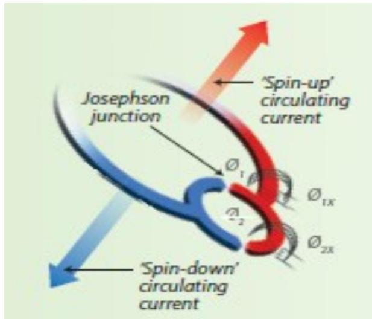

text_image

Josephson junction
'Spin-up' circulating current
'Spin-down' circulating current

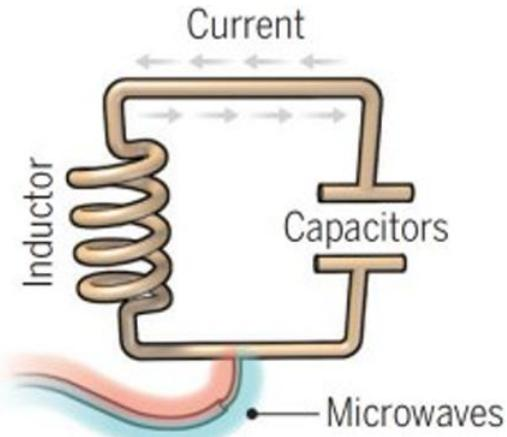

text_image

Current
Inductor
Capacitors
Microwaves

# 量子计算技术

离子阱涉及在真空室的电场中悬浮离子，使用激光冷却和制备离子（将它们置于明确的初始状态）。为了执行操作，施加共振光学或微波场以驱动量子比特进入不同状态，或在离子之间产生纠缠。计算后，通过检测与状态相关的荧光来测量状态。  
离子阱量子计算机需要多种光子学组件，包括：

- 调制量子态的激光器。  
- 冷却离子、执行量子门操作和测量的激光器。  
- 收集离子散射光子的收集和成像光学系统。  
• 通过检测离子散射的光子（即测量与状态相关的荧光）来测量离子状态的光子探测器

代表企业：Quantinuum、IONQ、启科量子等  
优势:

- 原子本质上是相同的，因此不易因制造缺陷而产生错误。  
- 这种方法能够实现高保真度的量子比特操作和长的量子比特寿命。  
- 离子链中的量子比特组是完全连接的（这允许在任何一对量子比特之间进行量子门操作），从而能够执行广泛的算法。

挑战:

- 主要挑战是扩展到更大的系统，需要集成许多激光器、真空系统等。需要更复杂的架构来扩展到超出单个链中排列的数十个离子的大规模系统。  
- 与其他系统相比，量子门操作时间也相对较长。

图表：离子阱方案（需要多种光学组件）  
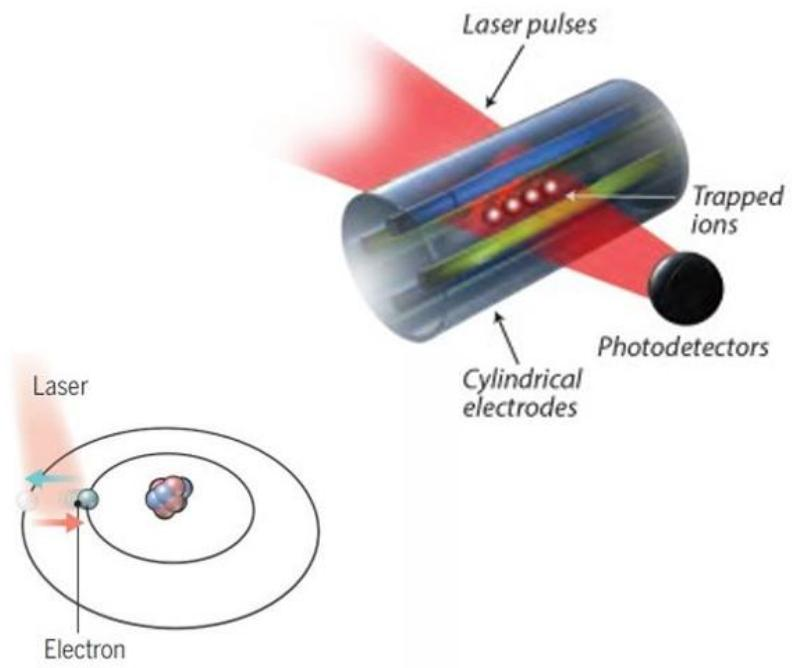

text_image

Laser pulses
Trapped ions
Photodetectors
Cylindrical electrodes
Laser
Electron

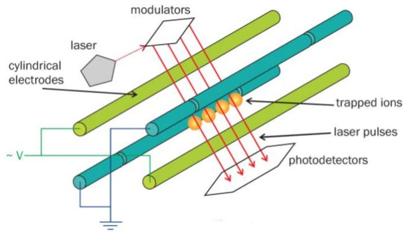

text_image

modulators
laser
cylindrical
electrodes
~ V
trapped ions
laser pulses
photodetectors

# 量子计算技术

> 中性（冷）原子基于中性原子的量子计算机是一项较新的技术，但其操作原理与离子阱量子计算机有许多相似之处，同样使用光学和微波脉冲来操纵量子比特的量子态。与使用离子不同，中性原子被囚禁在真空室的磁场或光场（激光束阵列）中，使用激光来冷却原子，这减少了计算噪声。开发基于原子的方法是为了解决与离子阱方法相关的一些挑战。由于离子带电，它们与磁场以及彼此之间会产生强相互作用，这对计算可能是有利的，但也使得扩展到更大系统变得困难，因为可能会发生不希望的相互作用，从而导致噪声。相比之下，中性原子不易发生串扰和噪声，并且更易于扩展；然而，更难让它们产生计算所需的相互作用。中性原子系统的另一个区别性特征是它们能够支持原子的多维阵列，而由于囚禁离子的强相互作用，这一点更难实现。

代表企业：Pasqal、Atom Computing、QuEra等  
优势:

- 中性原子系统受益于使用本质上完全相同的原子。  
- 量子比特相干时间长

\- 挑战:

\- 存在与离子阱类似的扩展性问题，因为需要将许多激光器和真空系统集成到整个系统中。中性原子系统对光学和光子学的总体要求与囚禁离子计算机相似——但是，需要不同的光波长来匹配原子/离子跃迁。与离子阱方法一样，需要光电探测器和收集光学器件。

图表：中性（冷）原子方案  
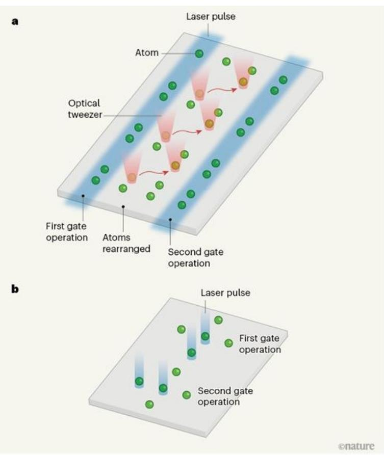

text_image

a
Laser pulse
Atom
Optical
tweezer
First gate
operation
Atoms
rearranged
Second gate
operation
b
Laser pulse
First gate
operation
Second gate
operation
©nature

# 量子计算技术

➢ 光子量子计算依托于成熟的硅光子学平台，亦称为"线性光学量子计算机"，其量子比特编码在平面波导或光纤中传播的光上。不同的研究团队采用略有不同的方法，有的使用单光子（即"离散态"），有的则使用压缩光态（即"连续态"）。  
代表企业：XANADU、PsiQuantum、玻色量子等  
优势:

\- 光子方法的一个关键优势在于光子通常与环境及其彼此之间的相互作用很弱，增强了其抗干扰能力。这些方法可以在室温下运行，并具有实现长相干、快速量子门操作时间和高单量子比特门保真度的潜力。

\- 此外，光子量子计算机还能轻松地与光纤通信网络集成。

挑战:

- 可连接的量子比特集合规模较小（这限制了能够在任意量子比特对之间进行门操作），从而限制了可执行算法的种类。  
- 与具有静止量子比特的其他系统不同，在向更大系统扩展时面临着独特的挑战，因为光子始终在运动（除非它们被存储在由吸收性原子集合构成的量子寄存器中）。许多量子比特需要沿着芯片或光纤进行路由，这可能会影响最终系统的规模。  
- 因此，光子量子计算方法严重依赖于光学和光子学技术。元件的进一步改进，特别是单光子源和高速/低损耗光学开关，对于提升这些系统的性能至关重要。其他需要的元件包括单光子探测器、波导、调制器、耦合器和滤波器。

图表：光子量子计算  
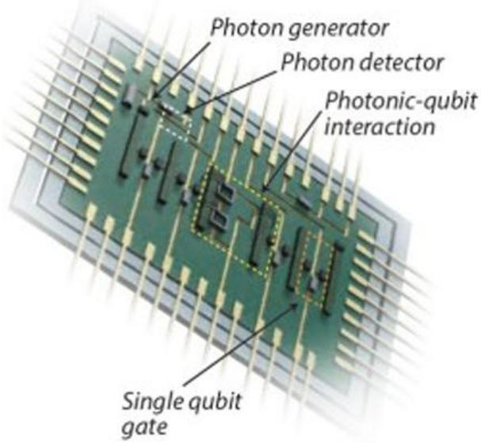

text_image

Photon generator
Photon detector
Photonic-qubit interaction
Single qubit gate

# 量子计算技术

硅自旋 / 量子点或能够受益于当前半导体工艺。硅自旋量子计算机通过操控限制在硅片上制造的量子点中的电子的自旋态来进行工作。可采用不同的材料/方法包括硅（Quoly公司采用）、硅锗鳍式场效应晶体管（英特尔公司采用）、旋涂氦技术（EeroQ公司采用）。  
代表企业：Intel、Quoly、EeroQ等  
优势：

- 硅自旋方法或可受益于现有的半导体制造专业知识，或允许快速规模化扩展。  
- 潜在优势包括相对较快的量子门操作时间和较小的尺寸。

挑战:

• 与超导量子计算机类似，需要极低温环境来保护量子态。  
- 较差的量子比特均匀性和背景无序，目前需要通过仔细调节栅极电压来补偿。自旋态对硅芯片上周围原子的磁噪声也高度敏感。必须降低噪声以提高量子门保真度。  
- 需要开发合适的结构以实现向二维阵列的扩展。

图表：intel 300mm 硅自旋量子比特晶圆  
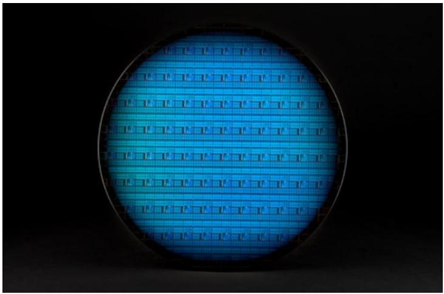

natural_image

Blue circular object with grid pattern, resembling a semiconductor or optical component (no text or symbols visible)

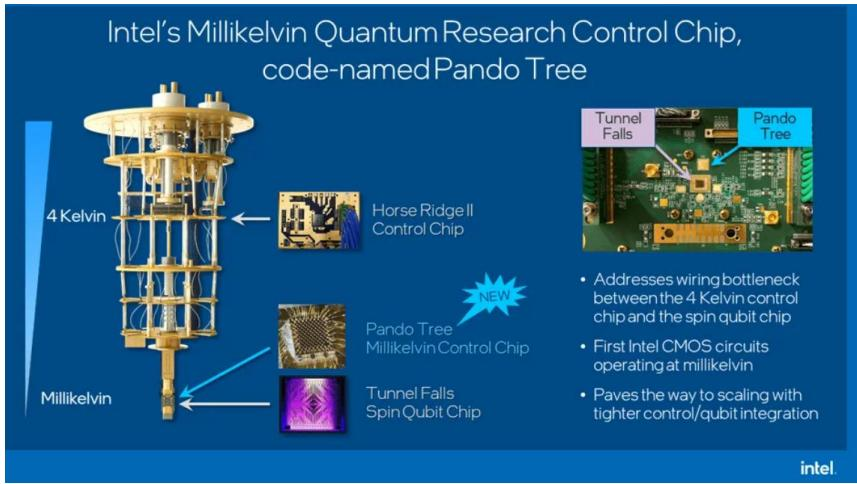

text_image

Intel's Millikelvin Quantum Research Control Chip,
code-named Pando Tree
4 Kelvin
Horse Ridge II
Control Chip
Pando Tree
Millikelvin Control Chip
Tunnel Falls
Spin Qubit Chip
new
Tunnel Falls
Pando Tree
• Addresses wiring bottleneck
between the 4 Kelvin control
chip and the spin qubit chip
• First Intel CMOS circuits
operating at millikelvin
• Paves the way to scaling with
tighter control/qubit integration
millikelvin

# 量子计算技术

> 拓扑量子计算机将量子态维持在非阿贝尔任意子中（这些准粒子出现在物质的特定拓扑相中，具有独特的辫子统计特性）。马约拉纳准粒子（一种任意子）可在基于纳米线的超导系统中涌现。量子态存储在这些准粒子的"编织"路径中，其拓扑性质提供了内在的错误保护功能。  
代表企业：微软  
由于量子比特受到微观层面实现的拓扑对称性保护，这类计算机更不易出错。具备实现极高保真度和长量子比特寿命的潜力。该技术仍处于早期阶段。不过一旦验证成功，将具备良好的可扩展性，且理想情况下无需纠错程序。2025年2月，微软宣布将八个拓扑量子比特集成到设计可扩展至百万量级的芯片中。

图表：微软拓扑量子方案  
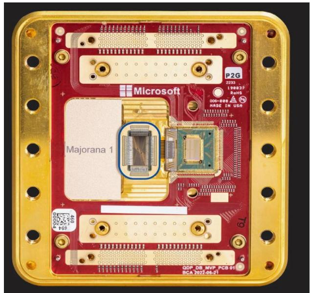

natural_image

Red electronic circuit board with Majorana 1 chip and P2G branding, mounted on a gold-colored base plate (no readable text or symbols beyond branding)

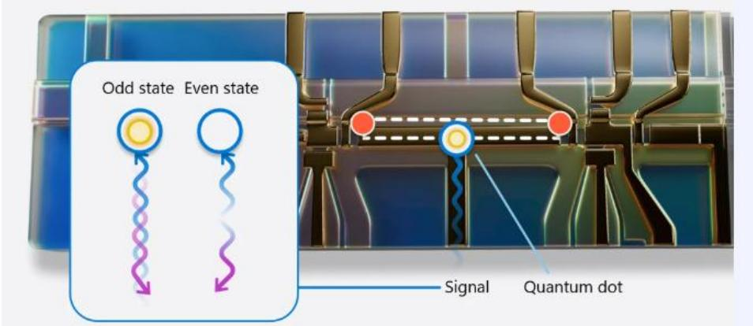

text_image

Odd state Even state
Signal Quantum dot

# 国内量子技术发展

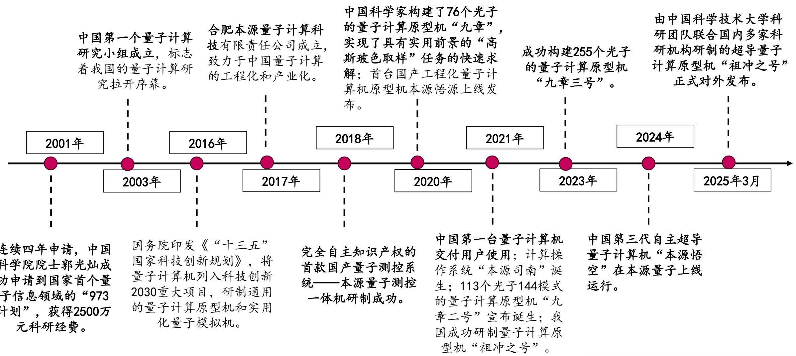

text_image

中国第一个量子计算研究小组成立，标志着我国的量子计算研究拉开序幕。
2001年
2003年
2016年
2017年
2018年
2020年
2021年
2023年
2024年
2025年3月
中国科学家构建了76个光子的量子计算原型机“九章”，实现了具有实用前景的“高斯玻色取样”任务的快速求解；首台国产工程化量子计算机原型机本源悟源上线发布。
成功构建255个光子的量子计算原型机“九章三号”。
由中国科学技术大学科研团队联合国内多家科研机构研制的超导量子计算原型机“祖冲之号”正式对外发布。
连续四年申请，中国科学院院士郭光灿成功申请到国家首个量子信息领域的“973计划”，获得2500万元科研经费。
国务院印发《“十三五”国家科技创新规划》，将量子计算机列入科技创新2030重大项目，研制通用的量子计算原型机和实用化量子模拟机。
完全自主知识产权的首款国产量子测控系统——本源量子测控一体机研制成功。
中国第一台量子计算机交付用户使用；计算操作系统“本源司南”诞生；113个光子144模式的量子计算原型机“九章二号”宣布诞生；我国成功研制量子计算原型机“祖冲之号”。
中国第三代自主超导量子计算机“本源悟空”在本源量子上线运行。

# 国内量子技术发展

当前国内量子计算机原型机主要集中在超导量子比特领域，包括中电信量子集团、北京量子信息科学研究院、本源量子、国盾量子以及量璇科技；离子阱技术包括启科量子以及光量子方案的玻色量子。

图表：全球及中国代表原型机及公司

<table><tr><td>硬件类型</td><td colspan="2">超导</td><td colspan="2">离子阱</td><td>光量子</td><td>半导体/超导</td><td>量子退火</td><td colspan="3">云平台集成服务</td></tr><tr><td>提供商</td><td>IBM</td><td>rigetti</td><td>IONQ</td><td>QUANTINUUM</td><td>XANADU</td><td>QuTech</td><td>D:WaveThe Quantum Computing CompanyTM</td><td>aws</td><td></td><td>STRANGEWORKS</td></tr><tr><td>平台名称</td><td>IBMQuantum</td><td>QuantumCloudServices</td><td>IonQQuantumCloud</td><td>Quantinuum Nexus</td><td>XanaduQuantumCloud</td><td>QuantumInspire</td><td>Leap</td><td>AmazonBraket</td><td>AzureQuantumCloud</td><td>Strangeworks</td></tr><tr><td>量子处理器</td><td>ibm fez、ibm torino、ibm brisbane、ibm brussels、ibm_kyiv、ibm nazca、ibm_quebec</td><td>Ankaa-2、Ankaa-3、Aspen-M-3、Aspen-M-2、Aspen-11、Aspen-10、Aspen-9</td><td>Forte、Aria1、Aria2、Harmony</td><td>Quantinuum H1、Quantinuum H2</td><td>Borealis、x8</td><td>Spin-2、Starmon-7</td><td>D-WaveAdvantage、D-Wave 2000Q、D-Wave 2X、D-WaveTwo、......</td><td>IonQ、IQM QuEra、Rigetti</td><td>Quantinuum、IonQ、QCI、Pasqal、...</td><td>IBM、IQM、QuEra、IonQ、Quantinuum、Rigetti、Xanadu、Atom Computing、NVIDIA、......</td></tr></table>

<table><tr><td>硬件类型</td><td colspan="5">超导</td><td>离子阱</td><td>光量子(CIM)</td><td colspan="2">云平台集成服务</td></tr><tr><td>提供商</td><td>中电信量子集团CHINA TELECOM QUANTUM GROUP</td><td>北京量子信息科学研究院Beijing Academy of Quantum Information Sciences</td><td>本源量子Origin Quantum</td><td>国盾量子QuantumCTek</td><td>SPINO量旋科技</td><td>QUDCOR启科量子</td><td>Doson玻色量子</td><td>移动云</td><td>ARC LIGHT弧光量子</td></tr><tr><td>平台名称</td><td>天衍量子计算云平台</td><td>Quafu</td><td>本源量子云</td><td>国盾量子计算云平台</td><td>量旋云平台</td><td></td><td>玻色量子云</td><td>五岳纪元量子云平台</td><td>弧光量子云平台</td></tr><tr><td>量子处理器</td><td>骁鸿;祖冲之2号</td><td>Baihua Dongling Haituo ScQ-P21</td><td>本源悟空</td><td>骁鸿1号</td><td>超导量子芯片</td><td>100</td><td>CPQC-1000</td><td>超导:天工1号超导:悟空102超导:五岳1/2/3号超导:夸父1/2/3/4/5号CIM:相干光量子计算机离子阱:100中性原子:汉原1号</td><td>超导量子芯片离子阱量子芯片</td></tr></table>

数据来源：中国信息通信研究院，金元证券研究所

# 国内量子技术发展

\- 科研领域，根据中国信通院统计，全球量子计算科研论文数量从2015年的1000余篇增长至2024年的5000余篇。其中，2019年进入“加速期”，2020-2021年年增长量约500篇，2024年同比增长 $42\%$ 。从发文量区域划分来看，美国和中国占据前两位，远超其他国家。但是从篇均被引用频次来看，加拿大最高（37次），美国紧随其后（32次），但是我国虽然在总量高居全球第二，但篇均引用频次相对偏低，反映出高质量研究成果仍待提升。

图表：全球量子领域科研进入加速期  
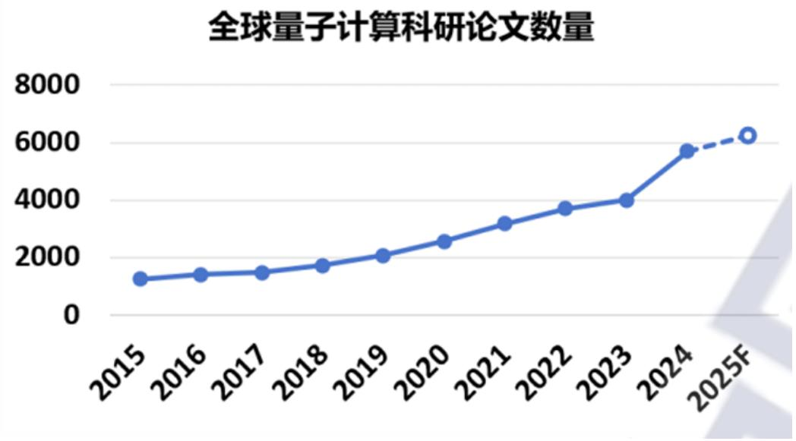

line

全球量子计算科研论文数量
| 年份 | 计算科研论文数量 |
| :--- | :--- |
| 2015 | 1200 |
| 2016 | 1300 |
| 2017 | 1400 |
| 2018 | 1600 |
| 2019 | 1900 |
| 2020 | 2400 |
| 2021 | 3100 |
| 2022 | 3700 |
| 2023 | 4000 |
| 2024 | 5700 |
| 2025F | 6200 |

图表：我国量子领域科研数量位居世界第二，但篇均引用频次偏低  
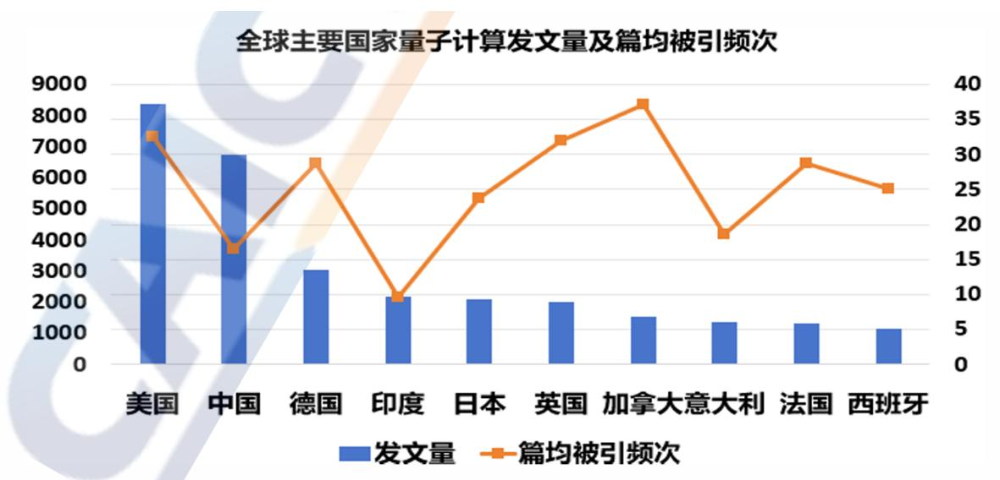

bar_line

| 国家     | 发文量 | 篇均被引频次 |
| -------- | ------ | ------------ |
| 美国     | 8300   | 34           |
| 中国     | 6700   | 17           |
| 德国     | 3000   | 30           |
| 印度     | 2100   | 10           |
| 日本     | 2000   | 25           |
| 英国     | 1900   | 32           |
| 加拿大   | 1500   | 37           |
| 意大利   | 1300   | 19           |
| 法国     | 1200   | 29           |
| 西班牙   | 1100   | 26           |

# 国内量子技术发展

➢ 从量子计算专利角度来看，美国和中国是量子计算专利的主要来源国，分别占比49.34%、24.36%，属于领先位置。  
分技术路线的专利数量来看，无论是在有效授权专利量还是专利申请量，超导技术路线专利远超其他技术方案。反映出当前超导量子比特的发展明显快于其他技术方案。与此同时，也意味着光量子、中性原子、硅半导体等领域的技术仍有一定空间。

图表：全球量子计算专利占比，我国位居第二名  
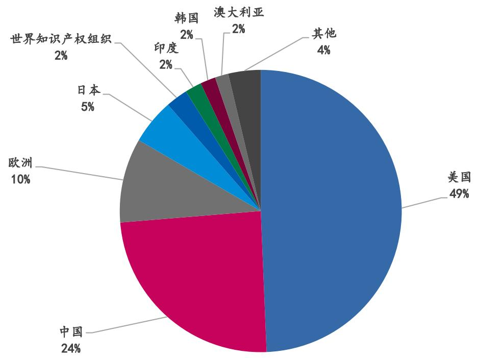

pie

| 类别 | 占比 (%) |
| :--- | :--- |
| 美国 | 49 |
| 中国 | 24 |
| 欧洲 | 10 |
| 日本 | 5 |
| 其他 | 4 |
| 印度 | 2 |
| 韩国 | 2 |
| 澳大利亚 | 2 |

图表：专利方面，超导方案领先于其他技术路线  
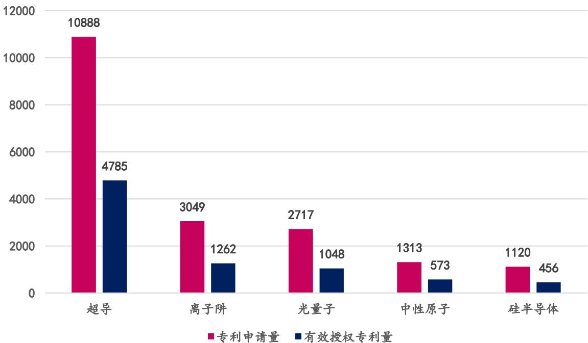

bar

| 类别 | 专利申请量 | 有效授权专利量 |
| :--- | :--- | :--- |
| 超导 | 10888 | 4785 |
| 离子阱 | 3049 | 1262 |
| 光量子 | 2717 | 1048 |
| 中性原子 | 1313 | 573 |
| 硅半导体 | 1120 | 456 |

# 国内量子技术发展

➢ 投融资角度，我国量子计算领域融资规模由2020年的13.8亿元增长至29.3亿元，按融资数量来看，2024年的超导量子计算仍然占据主导位置，占比达45.8%。值得关注的是，光量子计算融资规模位居第二名，有望加速落地。其他路线上，如中性原子、硅半导体/量子点等关注较低。

图表：2020-2024年中国量子计算领域融资规模  
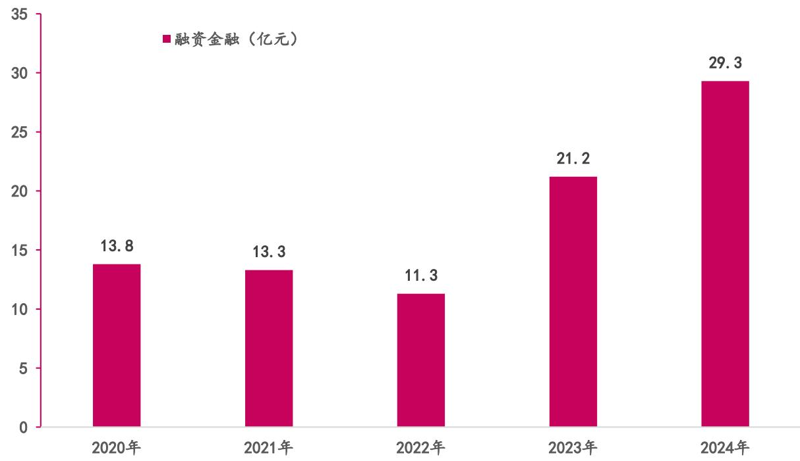

bar

| 年份   | 融资金融 (亿元) |
| ------ | -------------- |
| 2020年 | 13.8           |
| 2021年 | 13.3           |
| 2022年 | 11.3           |
| 2023年 | 21.2           |
| 2024年 | 29.3           |

图表：按融资数量划分，超导量子计算、光量子计算领先  
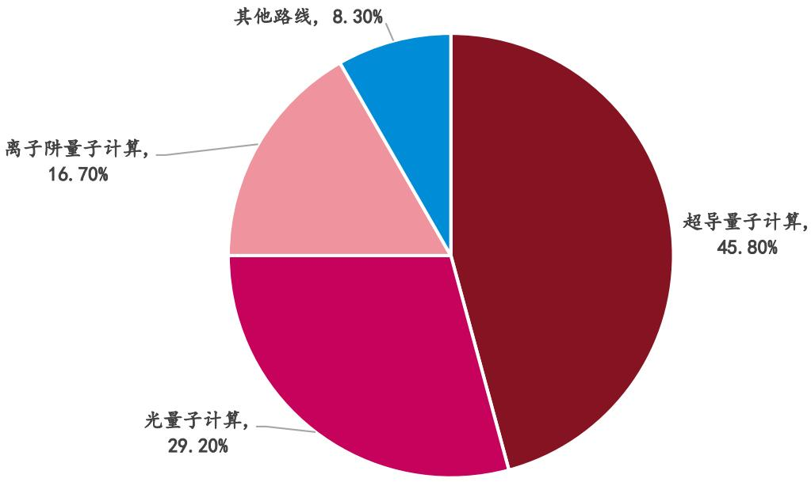

pie

| 类别 | 占比 (%) |
| :--- | :--- |
| 超导量子计算 | 45.80 |
| 光量子计算 | 29.20 |
| 离子阱量子计算 | 16.70 |
| 其他路线 | 8.30 |

# 国内量子技术发展

2024年以来中国量子计算领域重点融资事件

<table><tr><td>时间</td><td>企业</td><td>融资轮次</td><td>融资金融</td><td>投资方</td></tr><tr><td>2024年1月</td><td>华翊量子</td><td>战略投资</td><td>近亿人民币</td><td>中移创新产业基金(中国移动)</td></tr><tr><td>2024年1月</td><td>逻辑比特</td><td>种子轮</td><td>数千万人民币</td><td>浙大联创投资、藕舫天使</td></tr><tr><td>2024年3月</td><td>中微达信</td><td>A轮</td><td>未透露</td><td>乔贝资本、博佳资本、航空工业</td></tr><tr><td>2024年5月</td><td>玻色量子</td><td>A轮</td><td>未透露</td><td>长江国弘、国彤创丰</td></tr><tr><td>2024年5月</td><td>华翊量子</td><td>Pre-A轮</td><td>1亿人民币</td><td>海通创意资本、百度风投、联想创投、三七互娱</td></tr><tr><td>2024年6月</td><td>量旋科技</td><td>战略投资</td><td>3950万港元</td><td>国富创新</td></tr><tr><td>2024年6月</td><td>微观纪元</td><td>Pre-A轮</td><td>数千万人民币</td><td>昆仑资本、合肥高投</td></tr><tr><td>2024年7月</td><td>量旋科技</td><td>B轮</td><td>未透露</td><td>北航投资、华强资本</td></tr><tr><td>2024年7月</td><td>九章量子</td><td>A+轮</td><td>未透露</td><td>国科创投、济高控股</td></tr><tr><td>2024年8月</td><td>硅臻芯片</td><td>A+轮</td><td>未透露</td><td>本源量子</td></tr><tr><td>2024年10月</td><td>玻色量子</td><td>A轮</td><td>数亿人民币</td><td>啟赋资本、阿米巴资本、元和资本、盈富泰克</td></tr><tr><td>2025年1月</td><td>量旋科技</td><td>B+轮</td><td>未透露</td><td>建信股权、泓润资本、无锡交通产业</td></tr><tr><td>2025年2月</td><td>中科酷原</td><td>战略投资</td><td>未透露</td><td>武汉高科</td></tr><tr><td>2025年2月</td><td>相干科技</td><td>A轮</td><td>未透露</td><td>中科创星</td></tr><tr><td>2025年2月</td><td>玻色量子</td><td>A+轮</td><td>未透露</td><td>北工投资</td></tr><tr><td>2025年4月</td><td>微观纪元</td><td>战略投资</td><td>未透露</td><td>志特新材</td></tr><tr><td>2025年4月</td><td>九章量子</td><td>A+轮</td><td>未透露</td><td>科大国创、仁智资本、苏州胡杨林资本、西湖教育基金会</td></tr><tr><td>2025年4月</td><td>逻辑比特</td><td>天使轮</td><td>未透露</td><td>东方嘉富、西湖科创投、藕舫天使、浙江省科创母基金、华夏恒天</td></tr><tr><td>2025年5月</td><td>玻色量子</td><td>A+轮</td><td>未透露</td><td>电控产投</td></tr><tr><td>2025年5月</td><td>硅臻芯片</td><td>B轮</td><td>数千万人民币</td><td>祥峰投资Vertex Ventures</td></tr><tr><td>2025年6月</td><td>量旋科技</td><td>战略投资</td><td>未透露</td><td>九颂山河基金</td></tr><tr><td>2025年7月</td><td>华翊量子</td><td>A轮</td><td>数亿人民币</td><td>君联资本、北京国管</td></tr><tr><td>2025年7月</td><td>昆元量子</td><td>天使轮</td><td>未透露</td><td>浙创投</td></tr></table>

# 国内量子相关产业政策

# 量子计算相关政策（国家层面）

2024年1月

工信部等七部门联合印发《关于推动未来产业创新发展的实施意见》：加强可容错通用量子计算技术研发，提升物理硬件指标和算法纠错性能，推动量子软件、量子云平台协同布置，发挥量子计算的优越性，探索向垂直行业应用渗透。

2024年1月

工业和信息化部、科学技术部、北京市人民政府印发《中关村世界领先科技园区建设方案（2024—2027年）》：加快量子计算、量子通信等方向关键技术攻关，持续推进量子计算芯片和测控系统研发，支持量子算法、操作系统和应用软件开发。

2024年1月

工业和信息化部等十一部门发布《关于推动新型信息基础设施协调发展有关事项的通知》：合理布局量子计算云平台设施。

2025年3月

国务院公布《2025年政府工作报告》：培育壮大新兴产业、未来产业。建立未来产业投入增长机制，培育生物制造、量子科技、具身智能、6G等未来产业。

2025年7月

市场监管总局、工业和信息化部联合印发《计量支撑产业新质生产力发展行动方案（2025—2030年）》：面向量子通信、量子计算、量子精密测量高速发展的需求，开展量子传感、量子效应和量子调控关键技术研究，围绕时间频率、温度、磁场、电场、力学等物理量，攻克新一代计量基准量子化、计量标准小型化、量值传递扁平化等量子精密测量关键技术。

# 国内量子相关产业政策

<table><tr><td>地区</td><td>时间</td><td>政策名称</td><td>关键词/要点</td></tr><tr><td>安徽省</td><td>2024-02</td><td>《安徽省未来产业先导区建设方案(试行)》</td><td>将量子通信、量子计算、量子精密测量列为重点,提出加快关键技术突破与产业化,前瞻布局量子芯片、量子算法等。</td></tr><tr><td>山东省</td><td>2024-12</td><td>《关于科技创新引领未来产业布局培育发展新质生产力的实施方案》</td><td>聚焦量子通信、量子测量、量子计算;研制量子保密通信终端、光量子雷达、超导量子计算核心处理器等,推动在网络安全、能源电力等领域应用。</td></tr><tr><td>湖南省</td><td>2025-02</td><td>《湖南省绿色智能计算产业高质量发展规划(2025—2030年)》</td><td>前沿布局量子计算,加强量子纠错、量子比特扩展等基础技术攻关;探索建设量子计算与超算、智算融合互通系统级平台。</td></tr><tr><td>广东省</td><td>2025-02</td><td>《广东省建设现代化产业体系2025年行动计划》</td><td>量子科技以量子材料、量子计算、量子精密测量为主攻方向;研制技术领先且自主化程度高的量子产品;推进粤港澳大湾区量子科技和产业高地建设。</td></tr><tr><td>福建省</td><td>2025-02</td><td>《福建省加快推进数字化全面赋能经济社会高质量发展总体方案》</td><td>完善“揭榜挂帅”等机制,围绕前沿领域开展技术攻关,增强量子计算、元宇宙、6G网络等新兴领域前瞻性技术储备。</td></tr><tr><td>江苏省</td><td>2025-04</td><td>《江苏省数字经济高质量发展三年行动计划(2025—2027年)》</td><td>加强数字技术创新,支持量子科技等前沿技术研发与应用;推动产业先行集聚发展试点。</td></tr><tr><td>四川省</td><td>2025-07</td><td>《关于发展壮大新兴产业加快培育未来产业的实施方案(2025—2027年)》</td><td>明确量子通信、量子计算、量子精密测量三大方向;推动核心器件与装备研制,支持量子计算机原型、量子OS与算法验证。</td></tr><tr><td>北京市(经开区)</td><td>2025-07</td><td>《北京经开区关于推动量子科技和产业发展的若干措施》</td><td>围绕量子芯片、量子计算、量子通信与精密测量等方向提出扶持举措,推动形成量子科技产业集群。</td></tr><tr><td>上海市</td><td>2024-09/2025-01起</td><td>“科技创新行动计划”量子科学/超导专项(2024年度)</td><td>设立量子算法、拓扑量子计算、超导材料与器件等方向项目,2025—2027年执行期内给予经费资助。</td></tr><tr><td>浙江省</td><td>2022-08/2025-03</td><td>《浙江省量子科技发展“十四五”规划》及2025年工作思路</td><td>系统部署量子通信、量子计算与精密测量等方向;2025年继续实施量子科技重大科技专项。</td></tr><tr><td>湖北省/武汉</td><td>2024-06/2025-01</td><td>《湖北省加快未来产业发展实施方案(2024—2026年)》及光谷“量子十二条”</td><td>将量子科技列为未来产业重点,东湖高新区发布“量子十二条”,单个项目最高支持1000万元,筹建省量子产业基金。</td></tr><tr><td>重庆市</td><td>2024-09/2025-02</td><td>《重庆市未来产业培育行动计划(2024—2027年)》及2025年科技工作要点</td><td>将“光子与量子技术”纳入高潜力未来产业,提出聚焦量子科技实施基础研究引领与颠覆性技术突破计划。</td></tr></table>

# 风险提示

- 技术风险：当前量子计算领域技术路线较多，且技术成熟度偏低，导致落地不及预期；  
- 政策风险：相关政策落地不及预期；  
- 需求风险：当前量子技术的绝对优势仍然不明显，导致需求不及预期。

# 投资评级说明

# 金元证券行业投资评级标准：

增持：行业股票指数在未来6个月内超越大盘；

中性：行业股票指数在未来6个月内基本与大盘持平；

减持：行业股票指数在未来6个月内明显弱于大盘。

# 金元证券股票投资评级标准：

买入：股票价格在未来6个月内超越大盘15%以上；

增持：股票价格在未来6个月内相对大盘变动幅度为5%～15%;

中性：股票价格在未来6个月内相对大盘变动幅度为-5%～+5%;

减持：股票价格在未来6个月内相对大盘变动幅度为-5%～-15%；。

# 免责声明

本报告由金元证券股份有限公司（已具备中国证监会批复的证券投资咨询业务资格）制作。本报告所载资料的来源及观点的出处皆被金元证券认为可靠，但金元证券不保证其准确性或完整性。该等信息、意见并未考虑到获取本报告人员的具体投资目的、财务状况以及特定需求，在任何时候均不构成对任何人的个人推荐。投资者应当对本报告中的信息和意见进行独立评估，并应同时考量各自的投资目的、财务状况和特定需求，必要时就法律、商业、财务、税收等方面咨询专业财务顾问的意见。对依据或者使用本报告所造成的一切后果，金元证券及/或其关联人员均不承担任何法律责任。投资者需自主作出投资决策并自行承担投资风险，任何形式的分享证券投资收益或者分担证券投资损失的书面或口头承诺均为无效。

本报告所载的信息、材料或分析工具仅提供给阁下作参考用，不是也不应被视为出售、购买或认购证券或其他金融工具的要约或要约邀请。该等信息、材料及预测无需通知即可随时更改。过往的表现亦不应作为日后表现的预示和担保。在不同时期，金元证券可能会发出与本报告所载意见、评估及预测不一致的研究报告。

金元证券的销售人员、交易人员以及其他专业人士可能会依据不同假设和标准、采用不同的分析方法而口头或书面发表与本报告意见及建议不一致的市场评论和/或交易观点。金元证券没有将此意见及建议向报告所有接收者进行更新的义务。金元证券的自营部门以及其他投资业务部门可能独立做出与本报告中的意见或建议不一致的投资决策。

在法律许可的情况下，金元证券可能会持有本报告中提及公司所发行的证券头寸并进行交易，也可能为这些公司提供或争取提供投资银行业务服务。因此，投资者应当考虑到金元证券及/或其相关人员可能存在影响本报告观点客观性的潜在利益冲突。投资者请勿将本报告视为投资或其他决定的唯一信赖依据。

本报告的版权仅为金元证券所有，未经书面许可任何机构和个人不得以任何形式转发、翻版、复制、刊登、发表或引用。