# 量子信息技术发展与应用研究报告

(2025 年)

# 版权声明

本报告版权属于中国信息通信研究院，并受法律保护。转载、摘编或利用其它方式使用本报告文字或者观点的，应注明“来源：中国信息通信研究院”。违反上述声明者，本院将追究其相关法律责任。

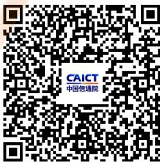

text_image

CAICT
中国信通院

# 前 言

以量子计算、量子通信和量子精密测量为代表的量子信息技术，是量子科技的重要组成部分，有望带来重大技术范式变革和颠覆性创新应用，已成为培育新质生产力、打造创新发展新动能的重要方向。量子信息发展已进入科技攻关、工程研发、应用探索与产业培育相互带动、一体化推进的关键期。全球30 余个国家和地区制定发布量子信息领域战略规划或法案，投资总额超350亿美元。

近年来，量子信息三大领域科技创新与应用成果不断涌现，企业数量和市场投融资增长迅速，量子计算明星企业成为市场追捧对象，突破量子纠错能力是未来竞争焦点，量子计算与人工智能的融合创新与双向赋能成为关注热点，量子保密通信在电信运营商和行业专网等推动应用探索，抗量子加密算法标准研制与升级迁移渐成趋势，量子精密测量在能源电力、生物医疗等领域加快应用落地。我国高度重视量子信息技术发展与应用，加快推动科技创新和产业创新深度融合，在政策布局、科研攻关、产品研发、应用示范和产业生态培育等方面，取得了 系列重要进展和成果。

自2018年起，中国信息通信研究院连续八年发布《量子信息技术发展与应用研究报告》，成为管理部门和业界掌握量子信息国内外发展动态的重要参考。本报告对近一年来全球量子信息领域总体发展态势、最新技术研究与应用进展、行业发展趋势和热点问题进行分析探讨，为凝聚业界发展共识合力持续贡献力量。

# 目 录

# 一、量子信息领域总体发展态势.

（一）量子科技为信息技术赋能，引领未来产业变革...  
（二）量子信息技术是全球关注热点，国际竞争激烈.  
（三）量子信息领域科技创新活跃，中美处第一梯队.  
（四）量子企业数量持续增长，市场投融资热度高涨...

# 二、量子计算研究与应用进展.. 13

（一）硬件多技术路线竞相发展，亮点成果不断涌现.. .13  
（二）量子纠错研究持续推进，距离实用化尚有差距. ..18  
（三）软件与云平台开放探索，技术成熟度仍需提升....... ..20  
（四）应用场景探索广泛开展，跨领域融合备受关注. .25  
（五）产业生态初步形成，基准测评体系是重要支撑. .28

# 三、量子通信研究与应用进展.. .33

（一）量子保密通信科研多方向探索，实验成果丰富. ..33  
（二）量子保密通信拓展应用场景，提质降本是关键.. ..36  
（三）抗量子加密迁移成为共识，我国启动标准研制.. .39  
（四）量子信息网络前沿研究活跃，实用化仍有差距. ..43

# 四、量子精密测量研究与应用进展. .47

（一）技术路线与应用领域丰富多样，战略价值突出. ..47  
（二）传感测量精度持续提升，物理量范围不断拓展.. ..50  
（三）应用探索多点开花，能源与医疗领域进展迅速. ..54  
（四）产业生态格局逐步完善，与AI融合受业界关注. ..58

# 五、量子信息领域发展前景展望. .61

（一）三大领域技术持续演进，应用场景进一步拓展.. ..61  
（二）量子信息技术与产业发展动能集聚，未来可期. ..63

# 图 目 录

图 1 美国 NQI 项目量子信息各领域投资分布.  
图 2 量子信息各领域（a）科研论文（b）发明专利年度增长趋势................... 6  
图 3 量子信息各领域全球科研论文数量前十位国家.  
图 4 量子信息各领域全球科研论文数量前十位机构...  
图 5 量子信息各领域我国专利申请数量前十位省市... 8  
图 6 全球量子信息企业（a）技术领域分布（b）年度增长趋势. 9  
图 7 全球量子信息企业（a）国家分布（b）技术领域分布.... 10  
图 8 量子信息领域企业投融资事件数量与金额年度变化趋势..  
图 9 量子计算主要技术路线核心指标发展趋势. 14  
图 10 谷歌Willow超导量子计算芯片表面码纠错实验.. 18  
图 11 量子计算软件技术体系架构.... .. . 21  
图 12 国内外开放服务的主要量子计算云平台概况... .23  
图 13 欧美量子计算产业生态体系概况.... .29  
图 14 中国信息通信研究院更新发布量子计算测评体系2.0.. .32  
图 15 新型协议 QKD 系统实验（a）TF-QKD（b）MP-QKD. .33  
图 16QKD 应用场景探索（a）英国现网实验（b）我国无人机实验. 37  
图 17 美国NIST 抗量子加密（PQC）标准化发展历程. . 40  
图 18 荷兰代尔夫特理工提出量子网络操作系统QNodeOS.. . 47  
图 19 量子精密测量主要技术路线和物理量. .48  
图 20 量子精密测量技术体系框架. .49  
图 21 量子精密测量技术在生物医疗领域应用场景.. 57  
图 22 量子精密测量产业发展成熟度. .58

# 表 目 录

表 1 全球主要国家量子信息领域战略规划与投资概况.  
表 2 全球量子信息领域 2025 年企业融资金额前十事件...  
表3 全球光钟领域代表性研究成果. .51  
表4 量子精密测量技术产品在电力行业典型应用.. .55

# 一、量子信息领域总体发展态势

# （一）量子科技为信息技术赋能，引领未来产业变革

量子科技基于量子力学原理，通过对微观物理系统量子态的精确制备、调控和测量，利用量子叠加、量子纠缠、量子隧穿等独特物理现象，助力发现新物态、构筑新结构、开发新材料，与信息、通信、材料、能源等领域交叉融合，催生颠覆性技术与应用创新。量子信息技术是量子科技重要组成部分，主要包括量子计算、量子通信和量子精密测量三大领域，利用量子调控技术实现信息的感知、计算与传输，在提升计算复杂问题运算处理能力、加强信息安全保护能力、提高传感测量精度等方面，具备超越经典信息技术潜力，有望成为重塑科学探索范式、变革信息技术体制、推动数字经济演进的发展新动能。

量子计算是以量子比特为基本单元，利用量子叠加与干涉等实现并行计算的新型计算范式，具备求解计算复杂问题实现指数级加速的潜力，是推动算力跨越式发展的重要方向。当前，多种技术路线并行发展，科研探索与原型机研发进展迅速，量子优越性获得实验演示，应用探索广泛开展但尚未实现“杀手级”应用突破。突破量子纠错构建可容错逻辑量子比特，明确通用量子计算技术路径，在实用化问题中验证量子计算加速能力并推动商业化落地是发展方向。

量子通信是基于量子叠加与纠缠等效应，在经典信道辅助下实现密钥分发或量子信息传输的新型通信方式。以量子密钥分发（QKD）、量子随机数发生器（QRNG）等为代表的量子保密通信初步实用化，样机产品与示范应用逐步落地，产业发展需推动产品服务提质降本。未来发展方向是基于量子隐形传态、量子存储中继和量子态转换等关键技术，构建连接量子计算机和量子传感器的量子信息网络，当前仍处于前沿探索和原型实验阶段，距离实用化有很大差距。

量子精密测量通过对物理量变化引起的量子态演化进行调控与观测，实现超越经典技术极限的高精度传感测量，测量分辨率、灵敏度与稳定性等指标带来数量级提升，主要包括时频基准、电磁场测量、重力测量、惯性测量、目标识别、痕量检测等技术方向。微波原子钟、冷原子重力仪、光量子雷达、量子磁力计等已实现商业化应用，光学原子钟、原子陀螺仪、原子天线等开展样机研发与应用验证，在国防军工、航空航天、生物医疗、资源勘测等领域应用前景广阔。

量子信息技术开辟未来产业新赛道。量子信息领域已进入科技攻关、工程研发、应用探索和产业培育相互带动、一体化发展关键阶段，推动核心技术攻关突破、加快科技成果落地转化、培育产业生态体系，是打造未来产业竞争力的核心。2025 年我国政府工作报告1提出：建立未来产业投入增长机制，培育生物制造、量子科技、具身智能、6G 等未来产业。量子科技与产业领域的发展规划、总体方案、产业行动与细分领域发展意见等政策体系持续完善，发展目标和重点任务进一步明确。合肥、北京、上海、粤港澳大湾区等地积极推动量子科技未来产业布局先行先试，打造量子产业聚集区。8月，北京市启动和发布了量子-人工智能协同创新联合体、北京量子计算产业创新中心、量子信息专利池、“量子星座”新质产业生态社区等协同创新平台2，打造资源整合、能力互补、开放共享的量子科技产业生态。

# （二）量子信息技术是全球关注热点，国际竞争激烈

量子信息技术挑战人类调控微观世界能力极限，兼具基础性、颠覆性特征，将对国防安全、信息安全等关键领域产生深远影响，已成为全球主要国家开展科技、经济等领域综合国力竞争，维护国家技术主权与发展主动权的战略重点之一。截至2025年8 月，全球30余个国家和地区制定或更新量子信息领域的发展战略规划或法案文件。据公开信息不完全统计，投资总额已超过350亿美元，如表1所示，量子信息领域的国际竞争日趋激烈。

来源：中国信息通信研究院（截至 2025年 8月）  
表 1 全球主要国家量子信息领域战略规划与投资概况

<table><tr><td>时间</td><td>战略/规划/法案</td><td>国家/地区</td><td>投资规模(美元)</td></tr><tr><td>2014</td><td>国家量子技术计划</td><td>英国</td><td>10年投资约12.15亿</td></tr><tr><td>2018</td><td>量子旗舰计划</td><td>欧盟</td><td>10年投资约11亿</td></tr><tr><td>2018</td><td>国家量子倡议法案</td><td>美国</td><td>7年累计投资达60.78亿</td></tr><tr><td>2019</td><td>量子技术发展国家计划</td><td>荷兰</td><td>7年投资约7.4亿</td></tr><tr><td>2019</td><td>国家量子技术计划</td><td>以色列</td><td>5年投资约3.3亿</td></tr><tr><td>2019</td><td>国家量子行动计划</td><td>俄罗斯</td><td>5年投资约5.3亿</td></tr><tr><td>2020</td><td>国家量子技术投资计划</td><td>法国</td><td>5年投资约19.6亿</td></tr><tr><td>2020</td><td>量子计算机研发计划</td><td>日本</td><td>10年投资约17.5亿</td></tr><tr><td>2021</td><td>量子系统研究计划</td><td>德国</td><td>5年投资约21.7亿</td></tr><tr><td>2022</td><td>国家量子计算平台</td><td>法国</td><td>投资约1.85亿</td></tr><tr><td>2022</td><td>芯片与科学法案</td><td>美国</td><td>4量子项目5年投资7.65亿</td></tr><tr><td>2023</td><td>国家量子战略</td><td>加拿大</td><td>7年投资约3.6亿</td></tr><tr><td>2023</td><td>国家量子战略</td><td>英国</td><td>未来10年投资31.8亿</td></tr><tr><td>2023</td><td>国家量子战略</td><td>澳大利亚</td><td>2030年前投资6.4亿</td></tr><tr><td>2023</td><td>国家量子技术战略</td><td>丹麦</td><td>5年投资约1亿</td></tr><tr><td>2023</td><td>量子科技发展战略</td><td>韩国</td><td>2035年前投资17.9亿</td></tr><tr><td>2023</td><td>量子2030</td><td>爱尔兰</td><td>已投资0.24亿</td></tr><tr><td>2024</td><td>国家量子任务</td><td>印度</td><td>2030年前投资7.26亿</td></tr><tr><td>2024</td><td>国家量子战略</td><td>新加坡</td><td>5年投资约2.19亿</td></tr><tr><td>2024</td><td>能源部量子领导法案</td><td>美国</td><td>5年计划投资约25亿</td></tr><tr><td>2025</td><td>国家量子技术战略</td><td>芬兰</td><td>10年投资4.69亿</td></tr><tr><td>2025</td><td>量子技术战略</td><td>西班牙</td><td>5年投资9.17亿</td></tr><tr><td>2025</td><td>量子欧洲战略</td><td>欧盟</td><td>投资规模未公布</td></tr></table>

美国在量子信息领域的投资规模全球领先。2018年，美国通过《国家量子倡议（NQI）》法案，在量子信息领域形成了科学研究探索、基础设施建设、公司部门合作、产业生态建设、人力资源培养、维护国家安全、促进国际合作七个方面的体系化布局，通过能源部、国家科学基金会、国家标准与技术研究院等机构开展项目部署。近七年来，仅NQI 项目在量子信息领域的累计投资已达60.78亿美元。

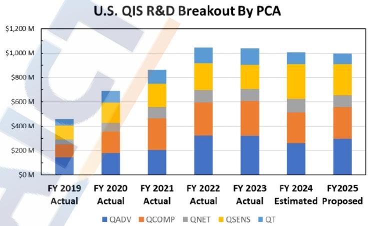

bar_stacked

| Fiscal Year | QADV   | QCOMP  | QNET   | QSENS  | QT     |
|-------------|--------|--------|--------|--------|--------|
| FY 2019 Actual | $100M  | $50M   | $20M   | $70M   | $30M   |
| FY 2020 Actual | $150M  | $100M  | $50M   | $100M  | $40M   |
| FY 2021 Actual | $200M  | $150M  | $70M   | $120M  | $50M   |
| FY 2022 Actual | $300M  | $200M  | $80M   | $150M  | $60M   |
| FY 2023 Actual | $300M  | $250M  | $80M   | $150M  | $70M   |
| FY 2024 Estimated | $250M  | $200M  | $70M   | $170M  | $60M   |
| FY2025 Proposed | $300M  | $250M  | $80M   | $170M  | $60M   |

来源：《NQI 项目 2025年度预算报告》

图 1 美国NQI 项目量子信息各领域投资分布

《NQI 项目 2025 年度预算报告》显示3，近四年来美国量子信息领域政府投资均达到 10亿美元/年，如图 1 所示，投资范围主要涉及五大领域：量子计算（QCOMP）和量子传感与计量（QSENS）两个领域投资规模最高，占比近三分之二；量子网络（QNET）重点支持连接量子计算机的量子信息网络前沿研究；量子基础促进（QADV）包括量子信息科学研究项目资助和基础设施平台投资；量子技术（QT）主要支持原型机工程化研发、供应链建设和应用场景开发，还包括推动抗量子加密（PQC）研究与应用投资。此外，《NQI再授权法案》4在美国会参议院持续讨论，计划未来进一步追加投资27亿美元。

欧洲是推动量子信息技术产业发展的另一重要力量。7月，欧盟发布《量子欧洲战略》5报告，指出过去五年间，欧盟成员国在量子信息领域的投资超过110亿欧元，其中20亿欧元支持量子科研项目，90亿欧元用于量子-经典计算中心建设、量子企业孵化、人才培育和国际合作等。报告指出，欧盟成员国量子领域政策与资金布局分散，在技术商用化方面处于落后，产业生态系统缺乏足够市场前景和持续资金支持。针对上述问题，报告提出量子欧洲战略愿景，重点推动以下五个领域工作：巩固欧洲量子科学领先地位，共建共享基础设施，加强欧盟量子生态系统、将量子技术纳入欧洲的空间、安全和防御战略，加强欧洲量子人才培养与区域内流动。

# （三）量子信息领域科技创新活跃，中美处第一梯队

量子信息已成为前沿科研与技术创新的热点方向。报告持续跟踪量子计算、量子通信、量子精密测量（图中简称量子测量）三大领域，以及与量子信息关系密切的PQC 领域，科研论文产出与发明专利申请进展，统计相关数据信息为业界提供参考。近十年来，四大领域的科研论文和发明专利申请数量保持逐年递增趋势，如图 2 所示。

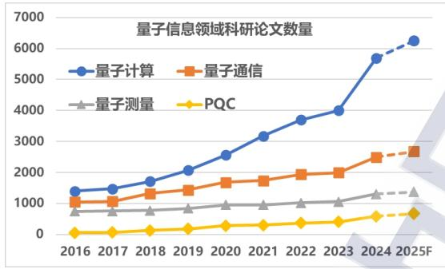

line

量子信息领域科研论文数量
| 年份 | 量子计算 | 量子通信 | 量子测量 | PQC |
|---|---|---|---|---|
| 2016 | 1400 | 1000 | 700 | 100 |
| 2017 | 1500 | 1050 | 750 | 120 |
| 2018 | 1700 | 1300 | 800 | 150 |
| 2019 | 2000 | 1500 | 850 | 200 |
| 2020 | 2500 | 1700 | 900 | 250 |
| 2021 | 3100 | 1800 | 950 | 300 |
| 2022 | 3700 | 1950 | 1000 | 350 |
| 2023 | 4000 | 2100 | 1100 | 450 |
| 2024 | 5700 | 2500 | 1300 | 600 |
| 2025F | 6200 | 2700 | 1400 | 700 |

（a）科研论文

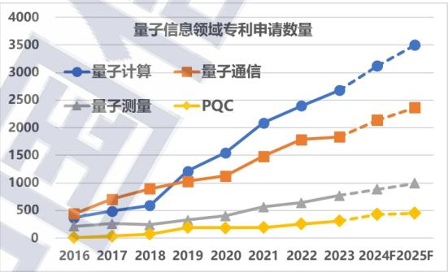

line

量子信息领域专利申请数量
| 年份 | 量子计算 | 量子通信 | 量子测量 | PQC |
|---|---|---|---|---|
| 2016 | 400 | 400 | 200 | 100 |
| 2017 | 500 | 600 | 300 | 150 |
| 2018 | 600 | 800 | 350 | 200 |
| 2019 | 1200 | 1000 | 400 | 250 |
| 2020 | 1500 | 1100 | 450 | 300 |
| 2021 | 2100 | 1400 | 550 | 350 |
| 2022 | 2400 | 1750 | 650 | 400 |
| 2023 | 2700 | 1850 | 750 | 450 |
| 2024F | 3100 | 2150 | 900 | 500 |
| 2025F | 3500 | 2400 | 1050 | 550 |

（b）专利申请  
来源：中国信息通信研究院整理

图 2 量子信息各领域（a）科研论文（b）发明专利年度增长趋势6

科研论文方面，量子计算在量子信息各领域中研究关注度最高，论文数量增长迅速，近四年来数量已超过其他领域总和，PQC 领域在2018年之后论文数量增长加快，关注热度上升明显。专利申请方面，量子通信在2018年之前数量保持领先，量子计算自2019 年起，专利数量增长迅速，在各领域中保持领先。PQC领域2018年之后专利数量有数量级增长，创新推动力度持续提升。

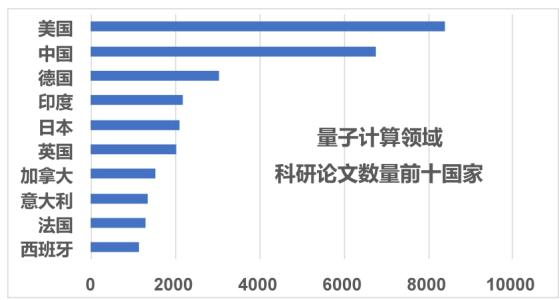

bar

量子计算领域
科研论文数量前十国家
| 国家 | 科研论文数量 |
|---|---|
| 美国 | 8500 |
| 中国 | 7000 |
| 德国 | 3200 |
| 印度 | 2400 |
| 日本 | 2300 |
| 英国 | 2200 |
| 加拿大 | 1600 |
| 意大利 | 1500 |
| 法国 | 1400 |
| 西班牙 | 1300 |

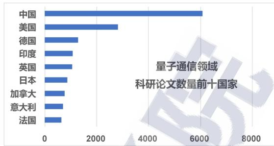

bar

量子通信领域
科研论文数量前十国家
| 国家 | 科研论文数量 |
|---|---|
| 中国 | 6000 |
| 美国 | 2800 |
| 德国 | 1200 |
| 印度 | 1000 |
| 英国 | 1000 |
| 日本 | 800 |
| 加拿大 | 700 |
| 意大利 | 600 |
| 法国 | 500 |

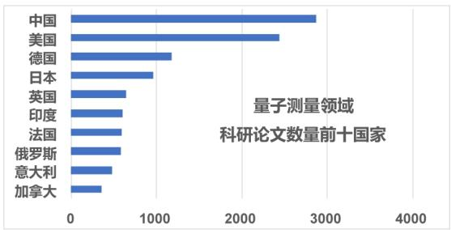

bar

量子测量领域
科研论文数量前十国家
| 国家 | 科研论文数量 |
|---|---|
| 中国 | 2900 |
| 美国 | 2500 |
| 德国 | 1200 |
| 日本 | 1000 |
| 英国 | 700 |
| 印度 | 700 |
| 法国 | 700 |
| 俄罗斯 | 700 |
| 意大利 | 600 |
| 加拿大 | 400 |

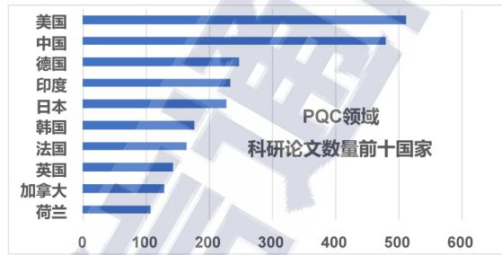

bar

PQC领域
科研论文数量前十国家
| 国家 | 科研论文数量 |
|---|---|
| 美国 | 510 |
| 中国 | 480 |
| 德国 | 250 |
| 印度 | 230 |
| 日本 | 220 |
| 韩国 | 170 |
| 法国 | 160 |
| 英国 | 150 |
| 加拿大 | 140 |
| 荷兰 | 110 |

来源：中国信息通信研究院整理（截至 2025年 8月）

图 3 量子信息各领域全球科研论文数量前十位国家

量子信息各领域的全球科研论文总量前十位的国家统计如图3所示。中、美、德三国在量子信息四大领域科研论文数量均占据前列，日本、英国、印度、法国等也具备较强科研实力。中美两国在量子计算、量子测量和PQC 领域论文数量领先优势明显，量子通信领域，我国论文数量全球占比接近40%，成为科研主要推动力量。

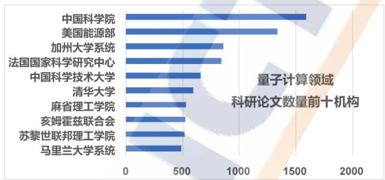

bar

| 机构 | 科研论文数量 |
|---|---|
| 中国科学院 | 1600 |
| 美国能源部 | 1350 |
| 加州大学系统 | 900 |
| 法国国家科学研究中心 | 850 |
| 中国科学技术大学 | 700 |
| 清华大学 | 650 |
| 麻省理工学院 | 550 |
| 亥姆霍兹联合会 | 500 |
| 苏黎世联邦理工学院 | 500 |
| 马里兰大学系统 | 450 |

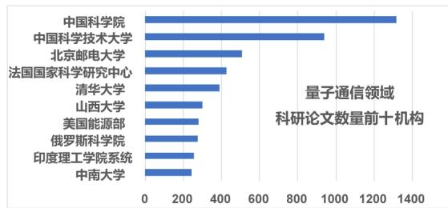

bar

| 机构 | 数量 |
|---|---|
| 中国科学院 | 1300 |
| 中国科学技术大学 | 950 |
| 北京邮电大学 | 500 |
| 法国国家科学研究中心 | 450 |
| 清华大学 | 400 |
| 山西大学 | 300 |
| 美国能源部 | 280 |
| 俄罗斯科学院 | 270 |
| 印度理工学院系统 | 260 |
| 中南大学 | 250 |

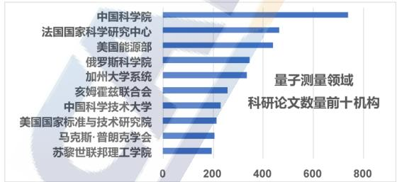

bar

| 机构 | 科研论文数量 |
|---|---|
| 中国科学院 | 750 |
| 法国国家科学研究中心 | 480 |
| 美国能源部 | 430 |
| 俄罗斯科学院 | 360 |
| 加州大学系统 | 320 |
| 亥姆霍兹联合会 | 280 |
| 中国科学技术大学 | 250 |
| 美国国家标准与技术研究院 | 230 |
| 马克斯·普朗克学会 | 210 |
| 苏黎世联邦理工学院 | 190 |

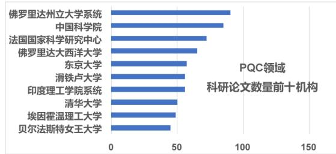

bar

| 科研论文数量 | PQC领域 |
| :--- | :--- |
| 佛罗里达州立大学系统 | 90 |
| 中国科学院 | 85 |
| 法国国家科学研究中心 | 75 |
| 佛罗里达大西洋大学 | 65 |
| 东京大学 | 55 |
| 滑铁卢大学 | 55 |
| 印度理工学院系统 | 55 |
| 清华大学 | 50 |
| 埃因霍温理工大学 | 45 |
| 贝尔法斯特女王大学 | 40 |

来源：中国信息通信研究院整理（截至 2025年 8月）

图 4 量子信息各领域全球科研论文数量前十位机构

量子信息各领域的全球科研论文总量前十位的机构统计如图4所示。中国科学院（含下属院所）、中科大、清华等研究机构和高校，是我国量子信息领域的代表性科研力量。美国能源部下属国家实验室、加州大学系统（含分校）、马里兰大学系统（含分校）、国家标准技术研究院（NIST）等机构是美国量子信息领域代表性科研力量。法国国家科学研究中心、瑞士联邦理工大学、德国马克斯·普朗克学会、亥姆霍兹联合会等机构是欧洲的量子信息领域科研重镇。

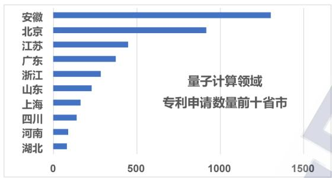

bar

量子计算领域
专利申请数量前十省市
| 省市 | 专利申请数量 |
|---|---|
| 安徽 | 1300 |
| 北京 | 900 |
| 江苏 | 450 |
| 广东 | 380 |
| 浙江 | 280 |
| 山东 | 220 |
| 上海 | 160 |
| 四川 | 140 |
| 河南 | 100 |
| 湖北 | 80 |

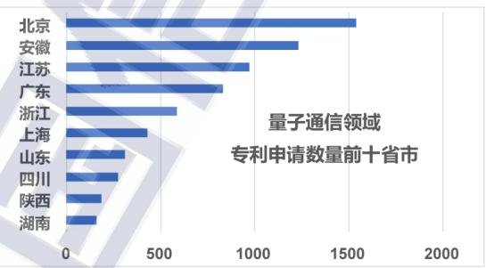

bar

量子通信领域
专利申请数量前十省市
| 省市 | 专利申请数量 |
|---|---|
| 北京 | 1550 |
| 安徽 | 1250 |
| 江苏 | 1000 |
| 广东 | 850 |
| 浙江 | 600 |
| 上海 | 450 |
| 山东 | 300 |
| 四川 | 250 |
| 陕西 | 200 |
| 湖南 | 150 |

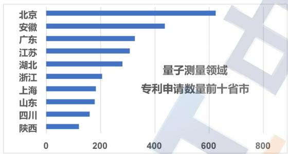

bar

| 地市 | 量子测量领域专利申请数量 |
|---|---|
| 北京 | 620 |
| 安徽 | 450 |
| 广东 | 330 |
| 江苏 | 310 |
| 湖北 | 280 |
| 浙江 | 210 |
| 上海 | 190 |
| 山东 | 180 |
| 四川 | 170 |
| 陕西 | 120 |

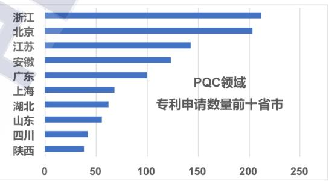

bar

PQC领域
专利申请数量前十省市
| 地区 | 专利申请数量 |
|---|---|
| 浙江 | 210 |
| 北京 | 205 |
| 江苏 | 145 |
| 安徽 | 125 |
| 广东 | 100 |
| 上海 | 70 |
| 湖北 | 65 |
| 山东 | 55 |
| 四川 | 45 |
| 陕西 | 40 |
The chart displays a horizontal bar chart with no explicit title or axis labels. The label '专利申请数量前十省市' (Patent States) is present in the top left corner.

来源：中国信息通信研究院整理（截至 2025年 8月）

图 5 量子信息各领域我国专利申请数量前十位省市

量子信息各领域我国专利申请数量前十位省市统计如图 5 所示。北京、安徽、江苏、广东、浙江、湖北等地已成为量子信息领域技术创新高地。其中，量子计算领域安徽院校和企业聚集度高，量子通信和量子测量领域，北京体现出科教资源和央企总部集中优势，PQC 领域浙江、北京企业专利布局较多。

# （四）量子企业数量持续增长，市场投融资热度高涨

企业已成为推动量子信息领域技术创新与产业发展的重要力量。报告对全球量子计算、量子通信、量子精密测量（图中简称量子测量）和PQC领域相关企业及投融资进行统计分析，为业界提供参考。

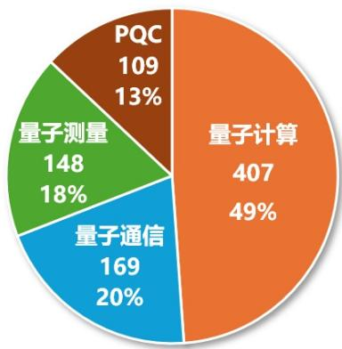

pie

| Category | Value | Percentage (%) |
|---|---|---|
| PQC | 109 | 13 |
| 量子测量 | 148 | 18 |
| 量子通信 | 169 | 20 |
| 量子计算 | 407 | 49 |

（a）技术领域分布

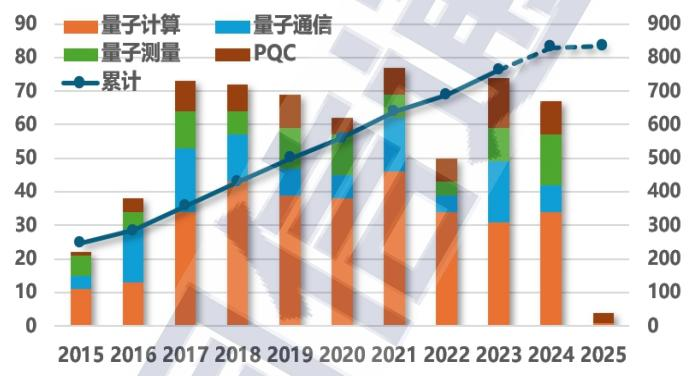

bar_stacked

| Year | 量子计算 | 量子通信 | 量子测量 | PQC | 累计 |
|---|---|---|---|---|---|
| 2015 | 10 | 5 | 5 | 0 | 250 |
| 2016 | 13 | 17 | 0 | 0 | 300 |
| 2017 | 33 | 24 | 13 | 8 | 370 |
| 2018 | 43 | 21 | 7 | 9 | 440 |
| 2019 | 38 | 19 | 10 | 10 | 500 |
| 2020 | 39 | 16 | 15 | 10 | 580 |
| 2021 | 45 | 18 | 5 | 12 | 640 |
| 2022 | 33 | 5 | 5 | 10 | 700 |
| 2023 | 30 | 19 | 10 | 18 | 760 |
| 2024 | 33 | 8 | 15 | 10 | 840 |
| 2025 | - | - | - | 3 | 850 |

（b）年度增长趋势  
来源：中国信息通信研究院（截至 2025年 8月）

图 6 全球量子信息企业7（a）技术领域分布（b）年度增长趋势

全球量子信息企业的技术领域分布和年度增长趋势如图 6 所示。量子信息相关企业数量突破 800 家，量子计算领域占主导地位，占比约50%，PQC领域发展迅速，相关企业已突破百家。量子信息企业数量逐年稳定增长，自 2017 年起进入初创企业快速增长期，在2022 年有所回落，但近五年仍保持约60 家/年的平均增速，反映出量子信息已成为全球各国发展新兴技术、培育未来产业的重要方向。

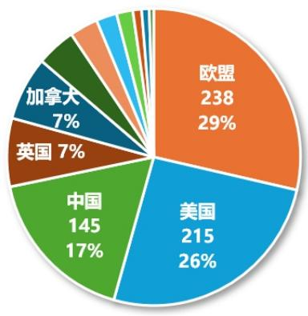

pie

| Region | Value | Percentage (%) |
|---|---|---|
| 欧盟 | 238 | 29 |
| 美国 | 215 | 26 |
| 中国 | 145 | 17 |
| 加拿大 | 7 | 7 |
| 英国 | 7 | 7 |
| 小计 | | |
The chart displays the total values for each region, with percentages indicating their relative shares. The legend is not explicitly labeled in the image.

（a）国家分布

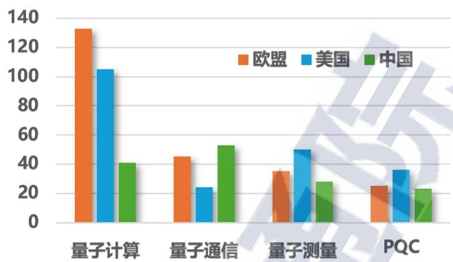

bar

| Category | 欧盟 | 美国 | 中国 |
|---|---|---|---|
| 量子计算 | 132 | 104 | 40 |
| 量子通信 | 45 | 23 | 52 |
| 量子测量 | 34 | 49 | 27 |
| PQC | 24 | 35 | 22 |

（b）领域分布  
来源：中国信息通信研究院（截至 2025年 8月）

图 7 全球量子信息企业（a）国家分布（b）技术领域分布

全球量子信息企业的国家分布和技术领域分布如图 7 所示。从企业国家分布看，欧盟有量子企业 230 余家，占比29%，其中德国量子企业数量超过 70 家。美国量子企业数量210余家，占比26%。我国有量子企业 140 余家，占比17%。此外，英国、加拿大、日韩和印度等也有较多量子企业。从技术领域分布看，欧美量子计算产业生态聚集度高，相关企业数量是我国的近 6 倍。量子通信领域我国企业数量领先，量子测量领域则是美国领先，PQC 多为初创企业和信息安全领域企业新增布局，我国企业数量相较欧美仍有一定差距。

在新兴技术领域，独角兽企业8常被视为创新能力和增长潜力的重要标志。根据胡润、CBInsights、桔子等多家独角兽榜单和估值数据综合分析，截至 2025 年 8 月，全球共有 12 家量子独角兽企业。从技术领域看，10家为量子计算企业，占比超 80%，量子通信和量子测量领域各有 1 家。从地区分布看，美国有 5 家，中国有4 家，加拿大、芬兰和法国各有1 家。从企业估值看，美国量子独角兽平均估值 41 亿美元，远超全球平均水平，PsiQuantum 公司以 67.5 亿美元估值居于首位。我国量子独角兽额平均估值 14亿美元，存在较大差距。此外，全球有10家量子准独角兽企业（估值超1 亿美元），全部集中在量子计算领域，其中美国占据 4 席，我国有 2 家，法国量子计算初创企业Alice&Bob以4 亿美元估值居于首位。

上市企业方面，全球共有11 家量子企业成功上市，其中加拿大4家、中美各有3 家。量子上市企业平均市值达到29亿美元，较去年有大幅提升，显示资本市场认可度。美国量子上市企业平均市值达到 67 亿美元，远高于其他国家和地区。截至 2025 年 8 月，美国IonQ 以 133 亿美元市值，成为全球首家市值超百亿美元的量子企业。2025 年上半年 IonQ 密集开展资本市场运作，收购了 Oxford Ionics、IDQ 等 5 家量子领域知名企业，进一步扩展多领域业务能力。

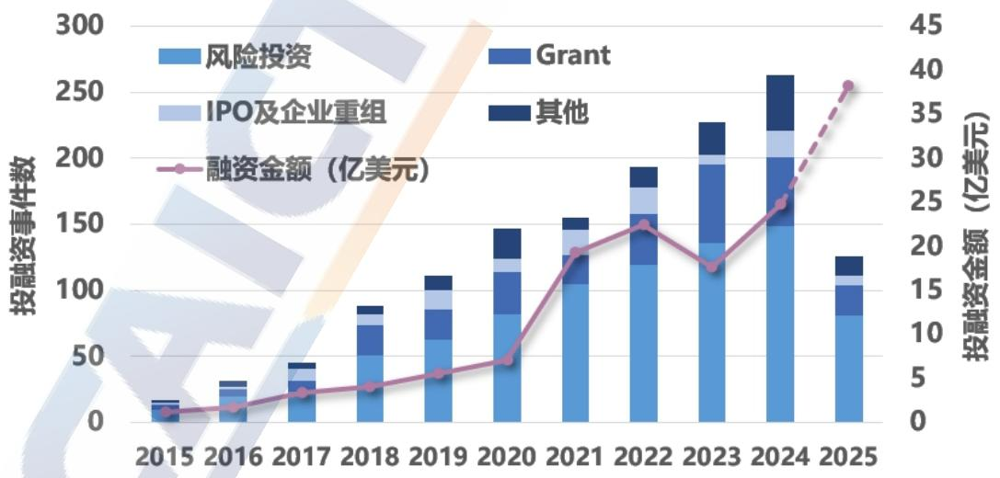

bar_line

| 年份 | 风险投资 (事件数) | Grant (事件数) | IPO及企业重组 (事件数) | 其他 (事件数) | 融资金额 (亿美元) |
|---|---|---|---|---|---|
| 2015 | 10 | 10 | 0 | 0 | 1.5 |
| 2016 | 15 | 15 | 0 | 0 | 2.0 |
| 2017 | 25 | 20 | 0 | 0 | 3.0 |
| 2018 | 45 | 30 | 10 | 10 | 4.0 |
| 2019 | 60 | 40 | 20 | 20 | 5.0 |
| 2020 | 80 | 50 | 30 | 30 | 7.0 |
| 2021 | 105 | 65 | 35 | 35 | 18.0 |
| 2022 | 115 | 75 | 40 | 40 | 22.0 |
| 2023 | 135 | 95 | 45 | 45 | 17.0 |
| 2024 | 155 | 110 | 50 | 60 | 25.0 |
| 2025 | 80 | 30 | 10 | 30 | 38.0 |

来源：中国信息通信研究院（截至 2025年 8月）

图 8 量子信息领域企业投融资事件数量与金额年度变化趋势

全球量子企业投融资事件数量与金额年度变化趋势如图 8 所示。近十年来全球量子信息领域产业投融资事件达1400 余笔，融资金融超 145 亿美元。从融资类型看，风险投资占比约67%，金额近百亿美元，占据主导地位，说明产业化仍处于起步早期阶段，政府和军方的赠予（Grant）类投资近年增长迅速。从地区分布看，美国企业和市场投融资活跃度最高，全球占比约50%，欧盟量子企业融资超20亿美元，我国约为14亿美元。从技术领域看，量子计算企业融资金额近百亿，占比约80%，是市场关注焦点，PQC企业近年来开始逐步成为投融资热点。从投资方看，欧美等国量子产业基金，如美国Duality和量子初创企业孵化器、英国量子技术企业中心、法国量子创新基金等，已成为支持量子初创企业成长的重要力量。

表 2 全球量子信息领域2025 年企业融资金额前十事件

<table><tr><td>企业</td><td>技术领域</td><td>国家</td><td>成立时间</td><td colspan="2">融资方式与金额(美元)</td></tr><tr><td>IonQ</td><td>量子计算</td><td>美国</td><td>2015</td><td>股权</td><td>10.00亿</td></tr><tr><td>PsiQuantum</td><td>量子计算</td><td>美国</td><td>2016</td><td>E轮</td><td>7.50亿</td></tr><tr><td>D-Wave Quantum</td><td>量子计算</td><td>加拿大</td><td>1999</td><td>股权</td><td>4.00亿</td></tr><tr><td>QuEra Computing</td><td>量子计算</td><td>美国</td><td>2018</td><td>B轮</td><td>2.30亿</td></tr><tr><td>Multiverse Computing</td><td>量子计算</td><td>西班牙</td><td>2019</td><td>B轮</td><td>2.15亿</td></tr><tr><td>Quantum Machines</td><td>量子计算</td><td>以色列</td><td>2018</td><td>C轮</td><td>1.70亿</td></tr><tr><td>SandboxAQ</td><td>PQC/量子计算</td><td>美国</td><td>2021</td><td>E轮</td><td>1.50亿</td></tr><tr><td>Classiq</td><td>量子计算</td><td>以色列</td><td>2020</td><td>C轮</td><td>1.10亿</td></tr><tr><td>Alice &amp; Bob</td><td>量子计算</td><td>法国</td><td>2020</td><td>B轮</td><td>1.04亿</td></tr><tr><td>Infleqtion</td><td>量子测量/计算</td><td>美国</td><td>2007</td><td>C轮</td><td>1.00亿</td></tr></table>

来源：中国信息通信研究院（截至 2025年 8月）

2025 年全球量子信息领域企业融资金额前十位事件如表2 所示。

量子计算明星企业已成为资本市场的追捧热点，3月美国PsiQuantum完成7.5亿美元E 轮融资，7 月IonQ完成10亿美元股权融资，成为量子企业单笔融资规模的最高纪录。欧美量子企业在前十融资事件中占据 8 席，另外 2 家以色列量子计算企业和欧美生态系统联系紧密。PsiQuantum、SandboxAQ 等领军企业已陆续进入风险投资后期轮次，反映出市场对其未来发展前景高度认可。我国量子企业的市场投融资今年以来也保持活跃，如5 月玻色量子完成数千万元A+轮融资，7 月华翊量子完成数亿元 A 轮融资，量旋科技完成数亿元 B轮系列融资，8月中科酷原宣布完成数千万元战略融资。

# 二、量子计算研究与应用进展

# （一）硬件多技术路线竞相发展，亮点成果不断涌现

量子计算处于前沿科学研究与原型样机开发的科技攻关关键期，超导、离子阱、中性原子、光量子、硅半导体、拓扑等多种技术路线并行发展、开放竞争。不同技术路线在物理实现体系、量子比特操控手段、比特规模可扩展性、系统环境保障要求等方面均存在明显不同，技术成熟度差异明显，同时也面临各自技术路线发展的科学问题挑战和工程技术瓶颈。近年来，超导、离子阱、中性原子、光量子等主要技术路线原理样机在实验室环境下，量子比特规模和逻辑门保真度等有明显提升，但距离实现大规模、可扩展通用量子计算的目标仍有很大差距，代表性研究成果和未来预期目标如图 9所示。

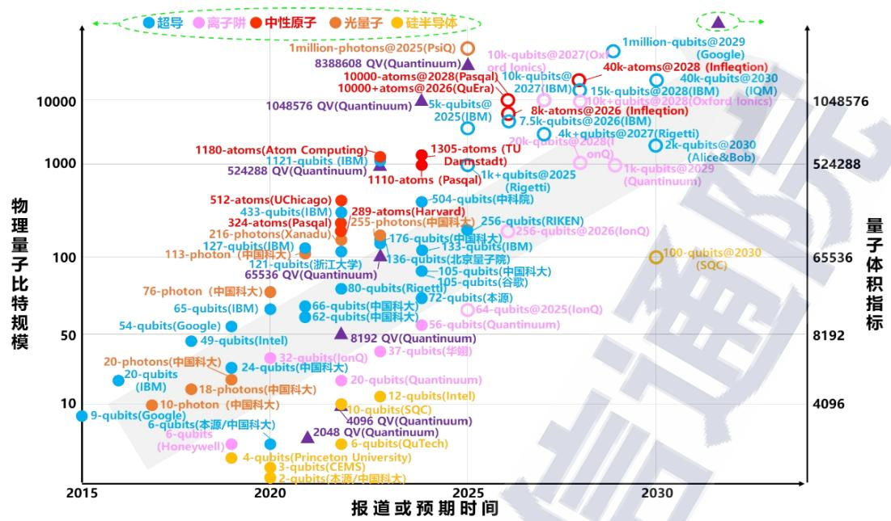

bubble

| 报道或预期时间 | 物理量子比特规模 | 科体名称 | 数量 |
| -------------- | ----------------- | -------- | ---- |
| 2015           | 10                | 9-qubits(Google) | 9 |
| 2015           | 20                | 20-qubits(Intel) | 20 |
| 2015           | 32                | 32-qubits(IonQ) | 32 |
| 2015           | 49                | 49-qubits(Intel) | 49 |
| 2015           | 62                | 62-qubits(IBM) | 62 |
| 2015           | 8192              | 8192 QV(Quantinuum) | 8192 |
| 2015           | 100               | 10-qubits(中国科大) | 10 |
| 2015           | 2048              | 20-qubits(Quantinuum) | 2048 |
| 2015           | 4096              | 4096 QV(Quantinuum) | 4096 |
| 2015           | 62                | 6-qubits(QuTech) | 6 |
| 2015           | 8192              | 8192 QV(Quantinuum) | 8192 |
| 2015           | 10                 | 18-photon(中国科大) | 18 |
| 2015           | 32                | 32-qubits(IonQ) | 32 |
| 2015           | 49                | 49-qubits(Intel) | 49 |
| 2015           | 62                | 62-qubits(IBM) | 62 |
| 2015           | 8192              | 8196 QV(Quantinuum) | 8196 |
| 2015           | 10                 | 18-photon(中国科大) | 18 |
| 2015           | 32                | 32-qubits(IonQ) | 32 |
| 2015           | 49                | 49-qubits(Intel) | 49 |
| 2015           | 62                | 62-qubit(IBM) | 62 |
| 2015           | 8192              | 8196 QV(Quantinuum) | 8196 |
| 2015           | 10                 | 18-photon(中国科大) | 18 |
| 2015           | 32                | 32-qubits(IonQ) | 32 |
| 15             | 10                | 18-photon(中国科大) | 18 |
| 15             | 32                | 32-qubits(IonQ) | 32 |
| 15             | 49                | 49-qubits(Intel) | 49 |
| 15             | 62                | 62-qubit(IBM) | 62 |
| 15             | 8192              | 8196 QV(Quantinuum) | 8196 |
| 15             | 10                 | 18-photon(中国科大) | 18 |
| 15             | 32                | 32-qubits(IonQ) | 32 |
| 15             | 49                | 49-qubits(Intel) | 49 |
| 15             | 62                | 62-qubit(IBM) | 62 |
| 15             | 8196              | 8196 QV(Quantinuum) | 8196 |
| 15             | 10                 | 18-photon(中国科大) | 18 |
| 15             | 32                | 32-qubits(IonQ) | 32 |
| 15             | 49                | 49-qubits(Intel) | 49 |
| 10             | 10                | 18-photon(中国科大) | 18 |
| 10             | 32                | 32-qubits(IonQ) | 32 |
| 10             | 49                | 49-qubits(Intel) | 49 |
| 10             | 62                | 62-qubit(IBM) | 62 |
| 10             | 8196              | 8196 QV(Quantinuum) | 8196 |
| 10             | 10                 | 18-photon(中国科大) | 18 |
| 10             | 32                | 32-qubits(IonQ) | 32 |
| 10             | 49                | 49-qubits(Intel) | 49 |
| 10             | 62                | 62-qubit(IBM) | 62 |
| 10             | 8198              | 8196 QV(Quantinuum) | 8196 |
| 10             | 10                 | 18-photon(中国科大) | 18 |
| 10             | 32                | 32-qubits(IonQ) | 32 |
| ... (approximate values shown on chart, data points not explicitly labeled as "hydrogen atom" in the table; y-axis values are estimated based on chart label and data point labels).)

来源：中国信息通信研究院整理（截至 2025年 8月）

图 9 量子计算主要技术路线核心指标发展趋势

超导量子计算是业界高度关注的技术路线，基于约瑟夫森效应形成二能级结构，具备易扩展、操控性好以及兼容半导体工艺等技术优势，在量子比特规模扩展、保真度提升、量子优越性验证等多方面持续取得突破。2024 年年底，谷歌发布105比特超导量子芯片Willow，关键指标较上一代Sycamore 有所提升，并基于该芯片再次验证量子优越性9。中科大联合团队10研制105 比特超导量子芯片“祖冲之三号”，单/双比特门和读取保真度分别达到99.90%、99.62%和99.18%。2025 年，中科大联合团队等基于“祖冲之三号”求解随机线路采样任务获得比超级计算机Frontier高15个数量级的求解速度11。日本理化学研究所与富士通合作研发具有可扩展架构的256 比特超导量子计算机12。近年来，超导量子计算相关科研成果不断涌现。中科院物理所等实验验证超导量子处理器高保真双量子比特门的脉冲校准方案，简化校准过程并提高磁通控制的精度和稳定性13。哈佛大学等14开发微波-光学量子转导器，可实现光学驱动超导量子比特相干操控，转换效率达到1.18%。浙江大学等基于“天目2号”百比特超导量子芯片，在非无序、存在热激发的有限温量子体系中展示拓扑边缘态的稳定性，拓扑边缘态为保护脆弱的量子信息提供新可能15。

离子阱量子计算是技术路线竞争的种子选手，利用电磁阱中捕获的带电离子作为量子比特，具有比特全同、相干时间长、保真度高、全连接性等优势，近年来囚禁离子数量、量子体积等指标稳步提升。2025 年，美国 Quantinuum 公司宣布16离子阱量子计算原型机系统模型H2量子体积达到8388608。华翊量子在中关村论坛年会发布具备百位量子比特二维阵列囚禁与独立寻址操控能力的原型机17。幺正量子完成4K低温量子电荷耦合架构（QCCD）芯片型离子阱量子计算系统组装调试。牛津大学实现相距 2 米的两个离子阱量子计算系统之间的预报式远程量子纠缠和受控Z（CZ）逻辑门传送，保真度为 86% 18。摩根大通联合 Quantinuum 在 56 比特 H2-1 离子阱量子处理器执行随机电路采样，实现可认证量子随机数生成19。

中性原子量子计算是竞争中的后起之秀，通过光镊捕获中性原子，利用里德堡态强相互作用实现门操作和模拟演化，具有可扩展性强、相干时间长、适合量子模拟等优势，近年来比特规模扩展、操控方案等方面科研成果亮点频出。2025 年，NIST基于超精细结构在光镊中捕获两原子之间共振-偶极子相互作用，为控制冷原子提供新思路20。哈佛大学联合团队21利用光腔实现中性原子量子操作的新方案，量子比特的读取保真度为99.96%，产生的Bell 纠缠态的保真度为91%。中科大等联合团队构建了2024个原子的无缺陷二维和三维原子阵列，单比特门保真度99.97%，双比特门保真度99.5%，读取保真度 99.92%，已追平国际最高水平，为大规模中性原子量子计算奠定重要基础22。法国 Pasqal 发布技术路线图23，预计 2025 年实现1000物理量子比特，2027年、2030年分别实现20个、200个逻辑量子比特。

光量子计算取得多项科研与芯片研发重要成果，可利用光子多个自由度进行量子态编码，优势在于可室温运行、光子相干性好、抗噪声能力强。2025 年，美国PsiQuantum公司报道24，与半导体巨头 GlobalFoundries 合作改造 300mm 硅光芯片生产线，引入超导材料、氮化硅波导等创新工艺，制备集成单光子源、超导探测器、低损耗波导等光量子计算系统核心组件，实现单量子比特制备测量保真度99.98%，双光子干涉可见度99.5%，双量子比特贝尔态保真度99.22%，为大规模光量子芯片制造奠定重要基础。加拿大 Xanadu公司构建 12 比特光量子计算机 Aurora，通过光子互连实现35 个光量子芯片和13公里光纤网络连接25。Xanadu还利用多层氮化硅晶体制造出超低损耗集成光子芯片，并结合高性能单光子探测器产生GKP 量子态26。北京大学实现基于集成光量子芯片的连续变量簇态量子纠缠，为光量子芯片扩展开辟新方向27。玻色量子在世界人工智能大会展示了千比特光量子相干伊辛机（CIM）原型研发成果，持续提升系统规模28。

硅半导体量子计算仍处于使能技术研究阶段，以电子自旋或核自旋作为载体构造量子比特，主要优势在于兼容半导体制造工艺，技术竞争力尚未完全显现。2025年，新南威尔士大学等基于硅半导体量子系统实现 97.17%的贝尔态保真度，为量子纠缠态存储和操作提供参考29。悉尼大学联合团队研发低温互补金属氧化物半导体电路控制技术，可高效执行自旋量子比特的通用逻辑操作，为芯片上硅半导体量子比特规模扩展提供技术路径30。

拓扑量子计算物理实现方案取得初步进展，依托拓扑能隙的物理保护机制，理论上拥有天然容错能力，具备打破技术路线竞争格局的巨大潜力。2025 年，微软报道31基于马约拉纳零模的拓扑量子比特制备和干涉测量，通过量子点耦合进行比特操控，采用奇偶校验微波干涉测量实现量子态读取，成为推动拓扑量子计算从理论走向实际实现的重要里程碑。虽然相关实验成果仍需经历学术界的审视与验证，但仍有望加速推动拓扑量子计算研究与发展进程。

# （二）量子纠错研究持续推进，距离实用化尚有差距

量子纠错是推动量子计算从实验研究迈向实际应用的关键支撑。量子计算机实用化的主要障碍源于量子态受环境等影响产生的退相干性，以及量子比特和量子逻辑门的操控、读取等环节引入的错误。量子纠错是对抗退相干和量子态错误的解决方案，通过物理量子比特冗余编码构造高维状态空间，通过特定的测量和修正机制来识别并校正由环境或操作噪声导致的量子态错误，在维持量子态信息完整性的同时确保量子计算过程的可控性和正确性。

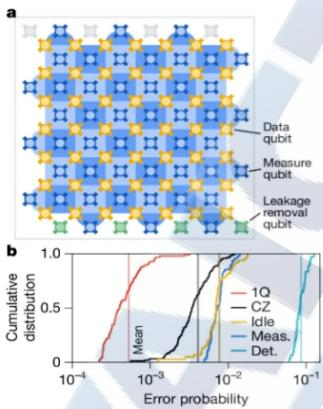

line

| Error probability | Cumulative distribution (1Q) | Cumulative distribution (CZ) | Cumulative distribution (Idle) | Cumulative distribution (Meas.) | Cumulative distribution (Det.) |
| ----------------- | ---------------------------- | ---------------------------- | ----------------------------- | ------------------------------ | ----------------------------- |
| 10⁻⁴              | 0                            | 0                            | 0                             | 0                              | 0                             |
| 10⁻³              | 1.0                          | 0.5                          | 0.3                           | 0.2                            | 0.1                           |
| 10⁻²              | 1.0                          | 1.0                          | 0.8                           | 0.6                            | 0.4                           |
| 10⁻¹              | 1.0                          | 1.0                          | 1.0                           | 1.0                            | 1.0                           |

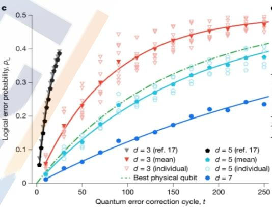

line

| Quantum error correction cycle, t | d = 3 (ref. 17) | d = 3 (mean) | d = 3 (individual) | d = 5 (ref. 17) | d = 5 (mean) | d = 5 (individual) | d = 7 |
| --------------------------------- | ---------------- | ------------ | ------------------ | ---------------- | ------------ | ------------------ | ----- |
| 0                                 | 0.0              | 0.0          | 0.0                | 0.0              | 0.0          | 0.0                | 0.0   |
| 50                                | 0.4              | 0.3          | 0.2                | 0.3              | 0.2          | 0.1                | 0.1   |
| 100                               | 0.45             | 0.35         | 0.25               | 0.35             | 0.25         | 0.15               | 0.15  |
| 150                               | 0.48             | 0.4          | 0.3                | 0.4              | 0.3          | 0.2                | 0.2   |
| 200                               | 0.5              | 0.45         | 0.35               | 0.45             | 0.35         | 0.25               | 0.25  |
| 250                               | 0.5              | 0.48         | 0.4                | 0.5              | 0.4          | 0.3                | 0.3   |

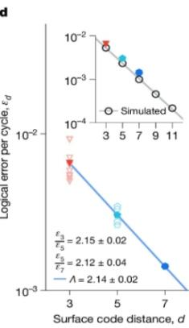

scatter

| Surface code distance, d | Logical error per cycle, ε_d |
| ------------------------ | ---------------------------- |
| 3                        | 10^-2                        |
| 5                        | 10^-3                        |
| 7                        | 10^-4                        |
| 9                        | 10^-4                        |
| 11                       | 10^-4                        |

来源：Nature 638, 920–926（2025）

图 10 谷歌Willow超导量子计算芯片表面码纠错实验

量子纠错在新型编码方案研究和逻辑量子比特构建等方面重要科研成果不断涌现。2024 年末，谷歌报道32在Willow芯片实现最高码距为7的物理量子比特表面码纠错，如图 10所示，实验实现了纠错码距每增加 2，错误率下降 2.14 倍，展示纠错能力扩展潜力。深圳量子院报道33实现对量子比特及其耦合器上泄露信息的同时抑制，并展示该方案与量子纠错的兼容性，以及抑制纠错线路中关联错误方面性能。2025 年，清华大学提出适用于量子模拟的量子错误缓解方法，可有效抑制幺正错误和随机错误对模拟量子计算能谱求解的影响34。亚马逊等报道35利用级联玻色子量子比特实现量子纠错编码，错误率从每个周期1.75%降低到 1.65%。耶鲁大学联合团队报道36基于 GKP 玻色子码构建高维量子存储器，实现了超过盈亏平衡的量子比特错误校正，纠错增益达到 1.87±0.03。谷歌提出37高密度级联奇偶校验表面纠错编码，在与算法相关的逻辑错误率下，耦合表面码每个逻辑量子比特所需的物理量子比特数量仅为标准表面码的1/3。QuEra 联合团队报道38在中性原子量子计算机演示利用物理量子比特实现魔态蒸馏，为实现量子纠错和逻辑量子比特提供关键支持。

当前，量子纠错技术处于编码方案探索与实验验证的攻关阶段。尽管部分量子纠错方案在逻辑比特错误率等关键性能参数上取得可喜进展，并初步实现了逻辑量子比特的原理性演示。但需要指出的是，逻辑量子比特所需的长时间相干保持能力和支持多级量子线路运行的低逻辑门错误率，例如 $1 0 ^ { - 1 0 }$ 及以下，仍未能达到。目前量子纠错的实验成果大多体现在构建逻辑量子比特可实现相较于物理量子比特错误率的降低，或是量子纠错能力突破盈亏平衡点等初级阶段，但在长相干时间和高保真度逻辑门等实用化关键指标方面，距离实用化要求仍有数量级差距。此外，逻辑量子比特也需要进一步实现规模化扩展才能有效支持量子算法运行。总体而言，基于量子纠错实现大规模可容错通用量子计算仍是需要长期艰苦努力的远景目标。

基于量子纠错实现实用化逻辑量子比特是未来发展的重要目标。量子纠错为量子计算机提供了可容错能力和可靠性保障，通过硬件自身性能提升和纠错编码技术优化的双向奔赴，最终实现量子计算机可有效运行复杂量子算法并输出正确结果的目标。未来，量子纠错需要进一步设计和优化高效纠错码和硬件实现方案，突破硬件资源消耗瓶颈，实现错误探测和纠错反馈等环节的高精度操作。

# （三）软件与云平台开放探索，技术成熟度仍需提升

量子计算软件是衔接量子计算机与实际应用的关键纽带，在推动技术实用化进程中发挥重要作用。量子计算软件技术体系架构如图 11 所示，主要包含面向应用场景开发的应用软件、实现量子指令集转换的编译软件、用于系统调控的测控软件、支持芯片设计的EDA工具、量子计算系统与云平台管理软件等。2025 年，各类型量子计算软件在国内外多元开放探索，研究与迭代取得一定进展。

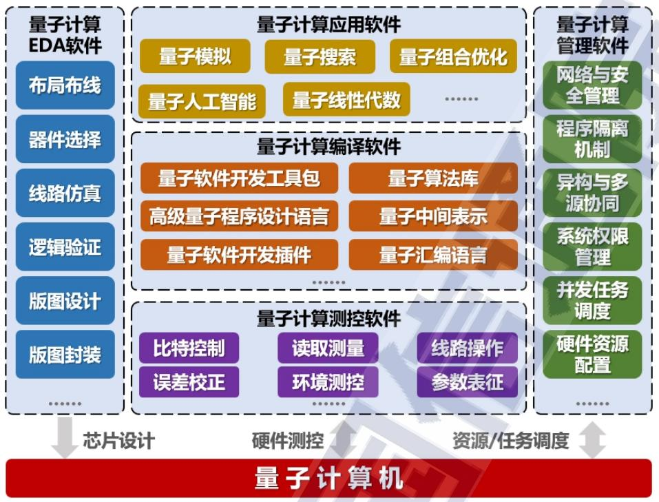

flowchart

```mermaid
graph TD
    A["量子计算EDA软件"] --> B["布局布线"]
    A --> C["器件选择"]
    A --> D["线路仿真"]
    A --> E["逻辑验证"]
    A --> F["版图设计"]
    A --> G["版图封装"]
    
    H["量子计算应用软件"] --> I["量子模拟"]
    H --> J["量子搜索"]
    H --> K["量子组合优化"]
    H --> L["量子人工智能"]
    H --> M["量子线性代数"]
    
    N["量子计算管理软件"] --> O["网络与安全管理"]
    N --> P["程序隔离机制"]
    N --> Q["异构与多源协同"]
    N --> R["系统权限管理"]
    N --> S["并发任务调度"]
    N --> T["硬件资源配置"]
    
    U["量子计算编译软件"] --> V["量子软件开发工具包"]
    U --> W["量子算法库"]
    U --> X["高级量子程序设计语言"]
    U --> Y["量子中间表示"]
    U --> Z["量子软件开发插件"]
    U --> AA["量子汇编语言"]
    
    AB["量子计算测控软件"] --> AC["比特控制"]
    AB --> AD["误差校正"]
    AB --> AE["读取测量"]
    AB --> AF["环境测控"]
    AB --> AG["线路操作"]
    AB --> AH["参数表征"]
    
    AI["芯片设计"] --> AJ["硬件测控"]
    AK["资源/任务调度"] --> AL["量子计算机"]
```

来源：中国信息通信研究院

图 11 量子计算软件技术体系架构

量子计算应用软件通过整合量子计算软硬件资源，针对具体应用场景实现问题求解功能的模块化封装。Quantinuum推出量子化学软件 InQuanto 的 4.0 版本，允许编译和执行更复杂的量子线路用于实现量子化学模拟39。Qunova 将HI-VQE 量子算法部署到IBM 的Qiskit函数目录中，可面向化学、制药及工业工程领域实现量子模拟40。

量子计算编译软件核心功能是实现量子程序从高级语言描述到底层硬件指令的转换与优化。IBM发布Qiskit SDKv2.1版本，扩展Qiskit SDK 对 C 语言 API 支持41。Welinq 公司推出分布式量子计算编译器 araQne，助力区分大规模算法并进行分布式处理42。

量子计算测控软件用于控制和调控量子硬件运行，支持量子线路控制、硬件反馈与校准以及同步实践控制等功能。QuantumMachines 推出专为量子计算机校准而设计的开源框架 QUAlibrate，可显著缩短校准时间43。中微达信推出岷江测控软件系统2.0版本，可实现自动化标定、可视化呈现和多体系兼容44。

量子计算 EDA 软件为量子芯片及关联硬件提供全流程设计支持，具备架构设计、性能仿真和参数优化等核心功能。中科院物理所推出超导量子芯片设计工具EDA-Q，集成了量子芯片拓扑设计、等效电路计算、GDS 布局与布线以及仿真等功能45。

量子计算管理软件提供管理量子计算资源并完成任务调度功能。Q-CTRL 公司联合IBM 发布Qiskit Functions Catalog 提供性能管理和优化求解器两项新功能46，还将量子计算性能管理软件 Fire Opal 集成到 IBM、Rigetti、OQC 以及 Diraq 等公司量子计算系统47。

总体来看，受限于量子计算硬件尚未成熟、标准化软件架构以及用户需求仍不明确等原因，量子计算软件还处于开放探索早期阶段。未来，量子计算软件发展需解决高级编程接口、异构硬件资源协调、算法优化能力、编程框架兼容性、可迁移性等方面问题，开发具备多技术路线实用性的软件平台，持续提升技术完备性和用户体验。

量子计算云平台已成为融合软硬件能力、支撑应用探索与生态培育的核心汇聚点，通过云端集成技术实现量子计算资源的网络化共享访问，具备灵活弹性的服务模式、便捷高效的用户接入界面以及丰富多元的实践应用场景等优势。未来量子计算云平台可能成为量子计算算力服务的主要形式。近年来，国内外企业和科研机构推出面向公众服务的量子计算云平台，汇聚多种技术路线通用和专用量子计算系统，开放服务的主要量子计算云平台概况如图 12所示。

<table><tr><td>硬件类型</td><td colspan="2">超导</td><td colspan="2">离子阱</td><td>光量子</td><td>半导体/超导</td><td>量子退火</td><td colspan="3">云平台集成服务</td></tr><tr><td>提供商</td><td>IBM</td><td>rigetti</td><td>IONQ</td><td>QUANTINUUM</td><td>XANADU</td><td>QuTech</td><td>D:WAVE</td><td>aws</td><td></td><td>STRANGE WORKS</td></tr><tr><td>平台名称</td><td>IBM Quantum</td><td>Quantum Cloud Services</td><td>IonQ Quantum Cloud</td><td>Quantinuum Nexus</td><td>Xanadu Quantum Cloud</td><td>Quantum Inspire</td><td>Leap</td><td>Amazon Braket</td><td>Azure Quantum Cloud</td><td>Strangeworks</td></tr><tr><td>量子 处理器</td><td>ibm_fez、 ibm_torino、 ibm_brisbane、 ibm_brussels、 ibm_kyiv、 ibm_nazca、 ibm_quebec 、......</td><td>Ankaa-2、 Ankaa-3、 Aspen-M-3、 Apen-M-2、 Aspen-11、 Aspen-10、 Aspen-9......</td><td>Forte、 Aria1、 Aria2、 Harmony 、......</td><td>Quantinuum H1、 Quantinuum H2</td><td>Borealis、 x8</td><td>Spin-2、 Starmon-7</td><td>D-Wave Advantage、 D-Wave 2000Q、D- Wave 2X、D- Wave Two、......</td><td>IonQ、 IQM、 QuEra、 Rigetti</td><td>Quantinuu m、IonQ、 QCI、 Pasqal、... ...</td><td>IBM、IQM、QuEra、 IonQ、Quantinuum、 Rigetti、Xanadu Atom Computing、 NVIDIA、......</td></tr><tr><td>硬件类型</td><td colspan="5">超导</td><td>离子阱</td><td>光量子(CIM)</td><td colspan="3">云平台集成服务</td></tr><tr><td>提供商</td><td></td><td>北京量子信息科学研究院 Jing-Chun@Cunlan@Nizao Sank</td><td>牵源量子 QINGYQUANTUM</td><td></td><td></td><td></td><td></td><td></td><td>移动云</td><td></td></tr><tr><td>平台名称</td><td>天衍量子计算 云平台</td><td>Quafu</td><td>本源 量子云</td><td>国盾量子 计算云平台</td><td>量旋 云平台</td><td></td><td>玻色量子云</td><td></td><td>五岳纪元 量子云平台</td><td></td></tr><tr><td>量子 处理器</td><td>骁鸿；祖冲之 2号</td><td>Baihua Dongling Haituo ScQ-P21</td><td>本源悟空</td><td>骁鸿1号</td><td>超导量子 芯片</td><td></td><td>CPQC-1000</td><td></td><td>超导：天工1号 超导：悟空102 超导：五岳1/2/3号 超导：夸父1/2/3/4/5号 CIM：相干光量子计算机 离子阱：100 中性原子：汉原1号</td><td></td></tr></table>

来源：中国信息通信研究院

图 12 国内外开放服务的主要量子计算云平台概况

欧美通过量子计算云平台积极推动多方生态合作。2025年，荷兰 Quantum Inspire 量子计算云平台发布 QuTech、TNO、QuantWare、Qblox、Orange Quantum Systems、Delft Circuits 等多家欧洲企业联合开发的开放式架构量子计算系统Tuna-5，集成可互操作的硬件和软件组件48。韩国Norma与美国Rigetti合作推出84量子比特超导量子云服务，依托 Ankaa-3 处理器与 Norma 的 Q Platform，构建服务于韩国国防研究领域的量子计算系统49。

推动量子-经典计算融合是量子计算云平台未来发展探索方向。法国 ColibriTD 公司发布 QUICK-PDE 多物理场求解器，基于量子-经典混合微分方程求解器算法在IBM量子计算云平台实现伯格斯方程和机械变形问题模拟，在流体动力学和材料科学等领域展现出效率优势50。NanoQT 与VeriQloud 合作开发基于硬件集成的可扩展盲量子计算架构，支持在分布式量子处理器上进行安全计算，通过加密协议实现客户端数据隐私保护，解决了量子云服务中委托计算的安全痛点，有望为金融、医疗等对数据隐私敏感行业提供可行服务方案51。

量子计算云平台是支撑商业化落地和产业发展的重要基础设施，未来推动技术发展与应用需三方面发力。技术创新方面，进一步提升量子计算系统硬件性能和可靠性，提供有效算力支撑服务。安全保障方面，建立数据加密机制与隐私防护架构，运用前沿安全技术确保云平台用户数据私密性和安全性。标准化方面，加快平台与多类型硬件系统的接口协议，以及平台间互操作性等研究。

# （四）应用场景探索广泛开展，跨领域融合备受关注

在具有实际应用价值的计算复杂问题中，展现量子计算原型机的加速求解优势，是产业界关注的重要目标。开展跨领域应用场景探索与验证是推动技术商业化落地和产业转化的重要动力。科技巨头和初创企业等积极推动行业应用场景探索，已延伸至金融服务、化学工程、生物制药、交通运输等多领域，研究方向主要包括量子模拟、量子组合优化、量子基础算法等类型和计算难题。

量子模拟通过调控量子计算机实现对微观粒子体系的精确复现与动态演化模拟，为揭示复杂量子系统的相互作用机制和演化规律提供了新手段，被认为是量子计算最具应用突破前景的方向。2025年，Classiq和三菱化学等探索化学领域的材料开发，利用QPE 算法和QAOA算法分别实现97%和54%的电路压缩，为化学领域计算资源的优化提供思路52。德国马普所与 Covestro 合作开发利用费米子量子模拟器来模拟化学模型的新方法，可以直接模拟分子行为53。Fermioniq和IBM 合作开发可预测mRNA 二级结构的量子算法，有望助力mRNA 类药物设计54。

量子组合优化利用量子计算并行性优势针对大规模、高复杂度的组合优化问题提供创新解法，应用探索方向覆盖金融服务、能源调度、物流运输等领域。2025 年，QuantumMotion公司与高盛合作探索在金融服务中使用量子计算执行期权定价等复杂计算，将算法分解为多个同时运行的小任务并有效减少运算时间55。 DATEV 公司与 IQM 合作利用 Markowitz 模型获得 DATEV 产品组合在给定预算情况下的最优资源配置，助力产品组合管理与优化56。

量子基础算法包含多种研究方向，有望为解决传统计算难以处理的复杂问题提供突破性方案。2025 年，电子科技大学提出用于连续域的新型Grover算法，将二次查询加速扩展至连续域，并严格证明了该算法的二次加速能力57。IonQ 与美国橡树岭国家实验室合作开发基于量子虚时演化原理的新型混合量子算法，在求解时间和电路深度方面均优于量子近似优化算法58。

虽然量子计算应用探索在多个行业领域持续开展，但量子计算的实用化落地尚未突破。现有的应用案例探索主要受到量子计算机硬件性能不足的限制，量子算法的指数加速优势难以验证，应用问题求解规模有限，难以展现出超越现有经典计算机的算力优势，基本停留在算法原理验证和场景可行性实验阶段。

推动量子-经典计算融合，协同处理计算复杂问题是应用突破的可能路径。近年来，量子-经典混合计算在体系架构研究和应用探索等方面不断取得进展。2025 年，加州理工学院、IBM等联合团队开发量子-经典混合架构59，调用Heron量子处理器共77个量子比特，结合富岳超级计算机完成铁硫分子簇的电子能级计算，综合电路深度达到 10570 个量子门，助力量子化学模拟探索。欧洲高性能计算联合体在波兰部署了PIAST-Q系统60，将20量子比特的离子阱量子计算机与 ALTAIR超级计算机集成，有望为解决复杂多体物理等应用问题的求解提供硬件基础。IonQ、阿斯利康、亚马逊合作将量子计算引入药物研发流程61，通过量子-经典混合算法将铃木-宫浦反应的模拟时间从数月缩短至数天，速度提升 20倍。北京量子院与清华大学合作在密码分析领域提出基于量子-经典混合架构的HAWI算法62，实验演示容错学习问题求解并有效提高成功率。量子-经典融合计算发挥二者互补优势，有望推动在实际应用场景中实现计算加速。

量子计算与人工智能（AI）交叉融合与双向赋能已成为前沿科技领域关注热点。量子计算的并行计算优势将成为AI时代满足算力爆炸式需求的有效解决方案，而大模型、机器学习等AI技术则可能为量子计算芯片和纠错编码设计和系统优化等方面提供助力。近年来，国内外企业、科研机构和高校在量子计算+AI 研究与应用方面开展了大量的创新性探索与应用实践。前沿研究方面，2025年，德国马普所提出机器学习算法构建物理状态的本征局域模型63，使实验预测最大限度接近量子力学预测，助力深化对量子多体系统的理解。RIKEN提出利用深度学习优化GKP 态的方法64，在保持纠错能力同时减少对大振幅压缩态的使用需求，有望提升量子纠错效率。应用探索方面，芝加哥大学通过训练量子启发式算法来区分癌症患者和健康个体的外泌体，实验结果表明分辨效果优于传统方法65。多伦多大学和 Insilico Medicine 通过结合量子计算、生成式 AI 及传统计算方法66，设计出癌症驱动蛋白 KRAS 分子，有望革新药物研发流程并为癌症治疗带来新希望。玻色量子发布量子玻尔兹曼机-变分自动编码器（QBM-VAE）深度学习框架67，利用CIM对波尔兹曼分布进行高效采样，为概率深度学习提供先验数据支持，提升生成模型保真度。虽然目前量子计算+AI 融合在多个领域展现出初步成果，但未来技术演讲仍面临着诸多挑战，主要体现在量子计算硬件能力限制，AI 算法与量子计算架构适配等方面，有待业界持续攻关探索。

# （五）产业生态初步形成，基准测评体系是重要支撑

科技巨头和初创企业成为量子计算产业创新重要力量。近年来，量子计算领域的科研机构孵化初创企业成为重要趋势，全球量子计算企业数量持续增长，上中下游相关企业已超过 400 家。欧美量子计算企业集中，生态高度活跃，产业链初步形成，如图 13所示。

<table><tr><td rowspan="6">上游</td><td rowspan="6">环境与测控</td><td>稀释制冷机</td><td>BLUEFORS</td><td>OXPORI</td><td>LTLAB</td><td>Cryo Concept</td><td>JenisULT</td><td>FORMFACTOR
ULVAC</td><td>...</td></tr><tr><td>测控系统</td><td>Zurich Instruments</td><td>QM</td><td>QUANTUM MACHINES</td><td>QBLOX</td><td>KEYSIGHT TECHNOLOGIES</td><td>MenloSystems</td><td>...</td></tr><tr><td>低温组件</td><td>STAR CRYO ELECTRONICS</td><td>Atlantic Microwave</td><td>Lake Shore</td><td>LEAD</td><td>COAX</td><td>AmpliTech</td><td>...</td></tr><tr><td>真空系统</td><td>JVC Kurt J. Lesker</td><td>Leybold</td><td>Agilent</td><td>EDWARDS</td><td>PFEIFFER</td><td>VACUUM</td><td>...</td></tr><tr><td>激光器</td><td>NKT Photonics</td><td>THOR LABS</td><td>TOPTICA</td><td colspan="2">nLIGHT</td><td>O E waves</td><td>...</td></tr><tr><td>光学探测器</td><td>SINGLE QUNITUM</td><td>SCONTEL</td><td>Photonic Spot</td><td colspan="2">Pixel Photonics</td><td>attocube</td><td>...</td></tr><tr><td rowspan="7">中游</td><td rowspan="6">原型机</td><td>超导</td><td colspan="7">IBM Google rigetti IQM OQC blexima ATLANTIC SEEQC qci FUTSU Nerd</td></tr><tr><td>离子阱</td><td colspan="7">QUANTINUUM IONQ AOT oxford Ionics eleqtron</td></tr><tr><td>光量子</td><td colspan="7">XANADU PsiQ QUANDELA ORCA QCI QUID NQCC QUANTUM POOL</td></tr><tr><td>硅半导体</td><td colspan="7">intel Silicon Quantum Computing NTT equal1 QUANTUM MOTION EeroQ diraq C12 HITACHI photonic</td></tr><tr><td>中性原子</td><td colspan="7">atom computing Inflection PASQAL 1QuEra&gt; Computing Inc. NanoQ planqc</td></tr><tr><td>其他</td><td colspan="7">Microsoft (拓扑) NTT(CIM) D:WAVE NEC(量子退火) QUANTUM BRILLIANCE (NV色心)</td></tr><tr><td>软件</td><td colspan="8">IBM HORIZON b|eQuantagonia MAXCLASSIQ RQUANTASTICA QUANTUM RY TRAP MS blueqat software Q-CTRL INTEPOCA QUBIT parity QC Quantrol Ox Light quorum benchmark Quantum-South SAVANTX river lane 1QBit Quemix Qu &amp; Co QuantFl QC WARE GOOD CHEMISTRY ProtellQure QUANTUM ZAPATA QC POLARIS® Cogniframe inspiration QSIMULATE QUNOVA Qubit</td></tr><tr><td>下游</td><td>云平台应用探索</td><td colspan="8">IBM aws XANADU rigetti Quantum Inspire By OurTech OM ware Google Microsoft QUANTINUUM IONQ lQuEra&gt; STRANGE WORKS PASQAL QJPMorgan Booz |Allen |Hamilton* SAMSUNG BCG accenture AFORE BARCLAYS AIRBUS DAIMLER M USG NAGASE MS ...</td></tr></table>

来源：中国信息通信研究院整理

图 13 欧美量子计算产业生态体系概况

产业生态上游是供应链基础支撑，主要包括环境测控系统、核心器件组件等方面，涵盖了超低温制冷设备、高真空维持系统、低温电子学器件、光/电学元件等核心技术装备，呈现出明显的技术路线分化和市场细分特征。欧美国家在上游产业生态具有一定先发优势，体现在企业数量和质量、产品创新能力、市场应用基础、产业链配套等多个方面。我国近年在量子计算上游组件和设备研发方面取得一定进展，稀释制冷机、高性能激光器等关键设备和器件实现国产化突破，但在关键技术指标、商业化供货能力和市场占有率等方面仍存在差距，需进一步推进基础材料与制造工艺研发，促进产学研协同创新，加快培育供应链关键环节专精特新企业。

产业生态中游是推动产业发展壮大的核心，企业数量较为集中，主要由量子计算整机制造商和量子软件开发商组成。整机研制方面，专注超导路线的企业数量最多，布局离子阱、中性原子、光量子等技术路线企业也在持续发展。软件研发方面，科技巨头和初创企业积极打造各具特色的编辑开发软件工具，通过开源软件社区建设加速技术扩散。欧美凭借庞大的企业集群、更高水平的整机研发能力、更为活跃软件开源社区等，在量子计算产业化方面处于领先。我国在量子计算整机研制方面基本实现了主流技术路线的全覆盖，出现一批量子计算软件研发企业，但仍面临研发投入强度不足，技术创新成果亮点少，产业各方缺乏协同合作等问题。

产业生态下游是推动应用转化和实现商业化落地的重点，主要由量子计算云服务提供商和行业应用企业构成。云平台建设方面，基于互联网架构搭建量子计算算力资源的共享服务平台，推动产业生态的培育并加速应用探索和产业化进程是发展重点。行业应用探索方面，不同行业领域头部企业高度重视量子计算赋能应用潜力，通过开放实际业务场景，联合研发定制化解决方案等方式验证量子计算实用价值。欧美科技巨头IBM、谷歌、亚马逊、微软等建立多元硬件接入的开放平台，具有丰富的算法和应用案例库，同时具备较为成熟的商业服务模式和跨行业用户合作网络，在量子计算产业生态方面占据先发优势。我国在量子计算云平台领域需提升硬件系统能力、提升研发和应用支持能力，探索构建商业化服务模式。行业应用探索方面需联合用户加大联合攻关项目的布局和推动力度，

促进产学研协同创新。

量子计算基准测评为技术路径选择、应用场景适配和产业投资决策等提供重要参考，不仅可以引导硬件系统的性能优化，同时也能促进算法开发和应用场景探索，加速产业化进程，将成为量子计算从实验研究走向市场的重要支撑。随着量子计算技术攻关和样机研发的快速迭代，构建科学完善的量子计算基准测评体系已成为业界关注重点。2025 年，美国国防高级研究计划局（DARPA）启动量子基准测试计划（QBI）第一阶段任务68，共选定 18 家涵盖超导、离子阱、光子等多技术路线公司参与评估，验证2033 年能否实现“价值超过成本”的实用化量子系统。工信部组织开展 2025 年未来产业创新任务揭榜挂帅工作69，布局量子计算基准测试公共服务平台建设，面向量子计算基准测评与产品服务测试验证，推动量子计算测评体系研究和服务平台建设。IBM发布 Benchpress 基准测试套件70，通过1000余项测试对7种量子计算软件开发工具包（SDK）进行系统性评估，结果表明各种SDK 软件性能差异明显，为用户选择工具提供参考。美国南加州大学提出用于量子门基准测试的新协议71，可更高效地识别相干和非相干误差，已在超导量子系统中验证协议可行性。

中国信息通信研究院在2024年发布量子计算测评体系1.0基础上，持续与科研机构及企业联合开展研究与测试验证，完善测试用例和方法，2025 年更新发布量子计算测评体系2.0，如图 14所示，覆盖硬件、测控系统、编译工具、算法、云平台和应用软件共6 个层级，可对量子计算全栈软硬件系统、产品和服务开展功能性能测评。

量子计算测评体系2.0

<table><tr><td>技术栈</td><td>测评对象</td><td colspan="4">测评维度</td><td>测评依据</td></tr><tr><td>应用软件</td><td>化学模拟软件 量化金融软件 图像识别软件 交通物流软件 ...</td><td colspan="4">功能测试 集成测试 性能测试 行业场景适配性测试 安全性测试 用户体验测试 软件成熟度评估</td><td></td></tr><tr><td>云平台</td><td>Q-SaaS平台 Q-PaaS平台 Q-IaaS平台</td><td colspan="4">功能完备性 接口一致性 硬件资源性能 服务性能 安全性 可靠性 软硬件兼容性</td><td>国际标准</td></tr><tr><td>算法</td><td>Shor算法 Grover算法 QAOA算法 VQA算法 QFT算法 HLL算法 ...</td><td colspan="4">问题求解性能 量子加速优势 软硬件兼容性 可扩展性 通用性 实用性 量子-经典混合框架兼容性</td><td>国家标准</td></tr><tr><td>编译工具</td><td>高级程序设计语言、中间表示、汇编 语言、量子线路编译器、指令集优化 器、量子 - 经典代码转换器等</td><td colspan="4">软硬件兼容性 编译速度 编译效率 资源占用 编译结果一致性 错误处理能力 可扩展性</td><td>行业标准</td></tr><tr><td>测控系统</td><td>测控软件、脉冲序列生成器及其他关 键测控组件等</td><td colspan="4">测控时延 测控精度 硬件兼容性 可靠性</td><td>企业标准</td></tr><tr><td>硬件</td><td>通用量子计算机、专用量子计算机、 量子线路经典模拟器</td><td colspan="4">核心指标(量子比特级、逻辑门级、线路级、系统级、应用级) 系统功耗测试 长期性能测试</td><td>定制化测试方案</td></tr></table>

来源：中国信息通信研究院

图 14 中国信息通信研究院更新发布量子计算测评体系2.0

硬件层面测评对象涵盖各技术路线的通用和专用量子计算原型机，以及基于经典计算实现的量子线路模拟器，核心测试指标包括量子比特级、逻辑门级、线路级、系统级、应用级等，此外还包括系统功耗和长期性能测试。测控系统层面从测控时延、测控精度、兼容性、可靠性等维度对测控软件、脉冲序列生成器等关键测控软硬件组件进行测评。编译工具层面关注量子高级程序设计语言、中间表示、汇编语言、编译器、指令集优化器、量子-经典代码转换器等对象的兼容性、编译速度、编译效率、资源占用情况、结果一致性、错误处理能力、可扩展性等功能性能指标。算法层面较1.0版本增加了量子-经典混合框架的兼容性，以适配日益受到关注的量子-经典融合计算应用场景。云平台层面增加服务性能的测试评估，重点关注任务响应时间、任务并发度、复杂均衡恢复时间、可用服务数量、吞吐量、新建连接速率等关键性能指标。应用软件层面除传统的功能测试、集成测试、性能测试、安全性测试、用户体验测试、软件成熟度评估以外，增加行业场景适配性测试，推动量子计算求解实际问题应用验证。

# 三、量子通信研究与应用进展

# （一）量子保密通信科研多方向探索，实验成果丰富

基于QKD、QRNG 和量子安全直接通信等技术方案的量子保密通信初步实用化，新型协议研究与实验持续推进，样机系统性能指标和技术实用化水平得到提升，量子加密应用设备类型不断丰富，为推动量子保密通信技术的应用奠定基础。

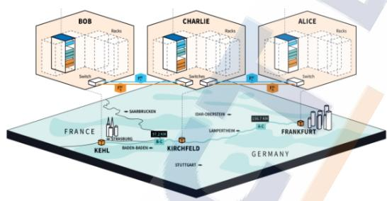

flowchart

```mermaid
graph TD
    subgraph Bob
        A["Switch"] --> B["KArdle"]
    end
    subgraph Charlie
        C["Switch"] --> D["KArdle"]
    end
    subgraph Alice
        E["Switch"] --> F["KArdle"]
    end
    subgraph France
        G["KEHL"] --> H["Känder-Baden"]
    end
    subgraph KEHL
        I["Kirchfeld"] --> J["Stuttgart"]
    end
    subgraph Kirchfeld
        K["GERMANY"]
    end
    style Bob fill:#f9f,stroke:#333
    style Charlie fill:#f9f,stroke:#333
    style Alice fill:#f9f,stroke:#333
    style France fill:#ccf,stroke:#333
    style KEHL fill:#cfc,stroke:#333
    style Kirchfeld fill:#fcc,stroke:#333
    style Frankfurt fill:#ffc,stroke:#333
```

（a）东芝 TF-QKD 现网实验

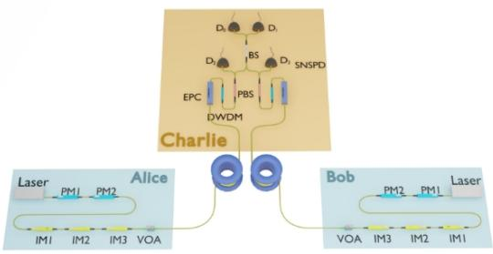

flowchart

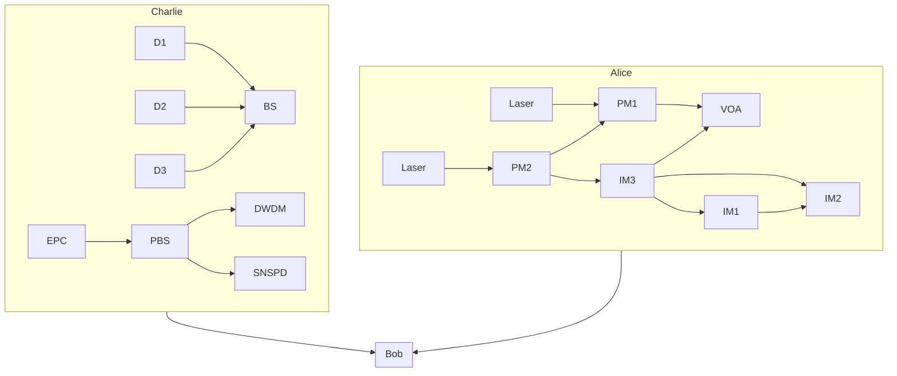
```mermaid
graph TD
    subgraph Charlie
        D1["D1"] --> BS["BS"]
        D2["D2"] --> BS
        D3["D3"] --> BS
        EPC["EPC"] --> PBS["PBS"]
        PBS --> DWDM["DWDM"]
        PBS --> SNSPD["SNSPD"]
    end
    subgraph Alice
        Laser1["Laser"] --> PM1["PM1"]
        Laser2["Laser"] --> PM2["PM2"]
        IM1["IM1"] --> IM2["IM2"]
        IM3["IM3"] --> VOA["VOA"]
    end
    subgraph Bob
        PM2["PM2"] --> PM1["PM1"]
        PM1 --> VOA["VOA"]
        PM2 --> IM3["IM3"]
        IM3 --> IM2["IM2"]
        IM3 --> IM1["IM1"]
    end
    Charlie --> Bob
    Alice --> Bob
```

（b）中科大 MP-QKD 实验  
来源：（a）Nature 640, 911–917 (2025)（b）Phys. Rev. X 15, 021037 (2025)

图 15 新型协议 QKD 系统实验（a）TF-QKD（b）MP-QKD

双光场（TF）、模式匹配（MP）等新型QKD协议成为发展方向。2025 年 4 月，东芝欧研所报道72TF-QKD 系统在 250 公里商用光纤网络中，实现110bit/s密钥生成速率，系统如图 15（a）所示。5 月，中科大报道73MP-QKD 系统完成 403 公里实验室光纤传输，密钥成码率 47.8 bit/s，系统如图 15（b）所示。相较于TF协议，MP协议系统无需全局相位参考，提升了系统实用化水平。采用芯片化器件提升QKD系统性能和可靠性也是探索重点，4月北京量子院报道74基于薄膜铌酸锂技术的 2.5GHz 工作频率芯片化 QKD 系统，在 25 公里距离实现 11Mbit/s 成码率。5 月，中科大报道75基于单光子源的QKD系统实验，在14.6dB损耗自由空间信道中，实现1.08e-3bit/脉冲的密钥成码率。星地量子通信成为关注热点，我国保持领先。3 月，中科大联合团队报道76基于“济南一号”量子微纳卫星和便携式地面接收站，实现卫星单次过境实时密钥成码1.07 Mbit，完成中国和南非的洲际量子保密通信实验。欧洲卫星制造商泰雷兹宣布投资 1 亿欧元开发 QKD 卫星，加拿大滑铁卢大学报道量子科学卫星QEYSSat即将发射，美国IonQ 公司收购Qubitekk 宣布构建空间量子安全网络计划77。

QRNG 提供不可预测的量子随机性，在信息安全、统计抽样、医学实验等领域具有重要应用价值，提升QRNG 可追溯性和可认证性是业界研究热点。3 月，摩根大通联合 Quantinuum 等报道78，在H2-1 离子阱量子计算机中执行基于随机电路采样算法的可认证

QRNG 协议，认证超 7 万比特量子随机数，认证速率达到每秒1.1×1018次浮点运算，展示量子计算机在生产高质量、可认证量子随机数方面的显著优势。6月，美国科罗拉多大学和NIST 等联合报道79，将 QRNG 与区块链结合开发全流程可追溯随机数生成系统，采用纠缠光子对偏振态检测生成量子随机数，可在20秒内生成512比特随机数，并结合区块链记录时间戳信息保证可追溯性。

量子安全直接通信是我国学者原创提出的协议方案，利用同一组光量子态同时实现信息的安全传输与密钥协商，借助量子态误码率监测实现窃听感知，以高噪高损信道编码、信道掩码增容、高速量子态调制解调等技术实现信息直接传输。2月，北京量子院与清华大学等联合报道80，量子安全直接通信实验系统在104.8公里光纤环境连续运行168小时，实现2.38 kbit/s的信息传输速率，提升了量子安全直接通信技术的实用化水平。对于量子安全直接通信的技术与应用发展前景，业界也存在一些不同观点和看法。

量子加密应用设备利用 QKD 和 QRNG 提供的量子密钥和量子随机数等实现数字签名、身份认证和信息加密等功能。随着量子保密通信应用基本要求和 IPSec、TSL/SSL、MACsec、OTNSec 等协议量子加密应用设备技术规范等标准体系逐步完善，面向各类场景的量子加密应用设备持续推出。中电信量子与华为、烽火、科大国盾等联合推出通密分离、通密一体等不同类型量子加密光传送网（OTN）

设备，以及IPSec、SSL等协议量子加密网关与终端设备，结合分布式量子密钥池和量子加密应用服务系统等支撑平台，为光通信网络和数据通信网络安全性保障提供量子安全解决方案。南瑞信通等面向电力行业推出量子加密与认证融合网关、终端、服务平台等多类型量子保密通信应用设备81，持续拓展电网量子保密通信应用场景。

# （二）量子保密通信拓展应用场景，提质降本是关键

量子保密通信的核心价值在于有效利用 QKD 和 QRNG 产生的量子密钥和量子随机数的高安全性和不可预测性，与对称加密、签名认证等加密应用融合，提升各类型 ICT系统和网络的安全保障能力。量子保密通信应用模式可分为在线式（紧耦合）与离线式（松耦合）两大类型。其中，紧耦合在线式应用通常希望 QKD、QRNG等量子设备与加密应用设备进行同机房部署，乃至实现同设备集成，从而保障量子密钥/随机数传输与加密应用服务的高安全性，但量子设备的本地化部署对成本、光纤资源、运营维护等提出很高要求，应用灵活性和覆盖面受限。松耦合离线式应用通过引入分布式量子密钥资源池、量子加密应用服务系统等密钥管理与服务中间层，与QKD 网络、QRNG 设备等对接集成，为上层加密应用提供量子熵源密钥，可提升量子加密应用灵活性和覆盖面，还可支持各类无线终端的量子加密应用，但量子密钥/随机数的存储、充注和在线传输等过程，不再具备基于量子力学原理的安全性保障，主要依靠传统密码学手段进行保护，应用安全性优势相比紧耦合在线方式有降低。

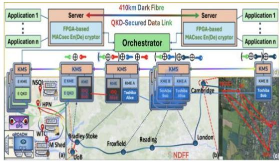

flowchart

```mermaid
graph TD
    A["Application 1"] --> B["Application n"]
    B --> C["Server"]
    C --> D["FPGA-based MACsec En(De) cryptor"]
    D --> E["410km Dark Fibre"]
    E --> F["QKD-Secured Data Link"]
    F --> G["Orchestrator"]
    G --> H["Application 1"]
    H --> I["Application n"]
    I --> J["KMS"]
    J --> K["E KME"]
    K --> L["E QKD"]
    L --> M["NSQ"]
    M --> N["HPN"]
    N --> O["KMS"]
    O --> P["E KME"]
    P --> Q["E QKD"]
    Q --> R["KMS"]
    R --> S["E KME"]
    S --> T["KME A"]
    T --> U["Toshiba Alice"]
    U --> V["KMS"]
    V --> W["E KME"]
    W --> X["Toshiba Bob"]
    X --> Y["KMS"]
    Y --> Z["E KME"]
    Z --> AA["Toshiba Bob"]
    AA --> AB["Cambridge"]
    AB --> AC["London"]
    AC --> AD["NDF"]
    AD --> AE["Reading"]
    AE --> AF["Froxfield"]
    AF --> AG["M Shed (a)"]
    AG --> AH["UoB"]
    AH --> AI["Bradley Stoke"]
    AI --> AJ["Edna"]
    AJ --> AK["Froxfield"]
    AK --> AL["Web Development"]
    AL --> AM["Location (b)"]
    AM --> AN["Location (c)"]
```

（a）英国 410公里现网 QKD 实验

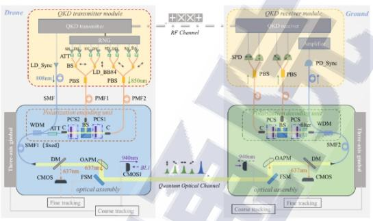

flowchart

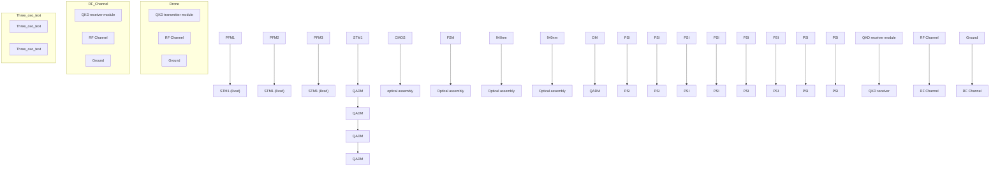
```mermaid
graph TD
    subgraph Drone
        A["QKD transmitter module"]
        B["RF Channel"]
        C["Ground"]
    end

    subgraph RF_Channel
        D["QKD receiver module"]
        E["RF Channel"]
        F["Ground"]
    end

    subgraph Three_oxo_text
        G["Three_oxo_text"]
        H["Three_oxo_text"]
    end

    I["PFM1"] --> J["STM1 (8xsd)"]
    K["PFM2"] --> L["STM1 (8xsd)"]
    M["PFM3"] --> N["STM1 (8xsd)"]

    O["STM1"] --> P["QADM"]
    P --> Q["QADM"]
    Q --> R["QADM"]
    R --> S["QADM"]

    T["CMOS"] --> U["optical assembly"]
    V["FSM"] --> W["Optical assembly"]
    X["940nm"] --> Y["Optical assembly"]
    Z["940nm"] --> AA["Optical assembly"]

    AB["DM"] --> AC["QADM"]
    AD["PSI"] --> AE["PSI"]
    AF["PSI"] --> AG["PSI"]
    AH["PSI"] --> AI["PSI"]
    AJ["PSI"] --> AK["PSI"]
    AL["PSI"] --> AM["PSI"]
    AN["PSI"] --> AO["PSI"]
    AP["PSI"] --> AQ["PSI"]
    AR["PSI"] --> AS["PSI"]
    AT["QKD receiver module"] --> AU["QKD receiver"]
    AV["RF Channel"] --> AW["RF Channel"]
    AX["Ground"] --> AY["RF Channel"]
```

（b）南京大学无人机 QKD 实验  
来源：（a）OFC2025 Th4C.7（b）Phys. Rev. Lett. 133, 200801

图 16QKD 应用场景探索（a）英国现网实验（b）我国无人机实验

量子保密通信网络试验与应用探索在多国持续开展，融合组网与加密应用验证受关注。英国剑桥大学和布里斯托大学报道82，在410 公里光纤链路中，如图 16（a）所示，实现基于单光子和纠缠光子两种 QKD 方案的量子加密视频会议和医疗数据加密传输等实验。美国普度大学报道83，与东芝公司及橡树岭国家实验室合作，在核反应堆环境中验证了 QKD 系统传输与加密应用，54 公里光纤距离密钥成码率达320kbit/s，可对核反应堆的68种测控信号实现一次一密加密。意大利网络安全公司QTI 报道84，与葡萄牙电信企业MEO 合作，在里斯本地区陆地光纤和海缆构建三节点网络中展示QKD组网和加密应用服务能力。日本东芝公司报道85，与KDDI 合作完成QKD系统与 33.4 Tbit/s 容量光通信系统在 80 公里光纤距离的 C+O 波段共纤传输试验，提升了QKD 共纤传输系统通信容量。印度电信发展中心报道86，完成基于距离超100 公里的四芯光纤QKD传输实验，通过使用多芯光纤方案可实现QKD 和业务光信号的低串扰共纤传输。

我国量子保密通信应用探索不断深化，电信运营商和行业专网成为重要推动力量。中电信量子报道87，与华为等合作在安徽合肥至内蒙古和林格尔 2000 公里光纤链路中，完成 400G 量子安全 OTN智算加密专线业务示范应用，推动OTN 网络与量子加密技术融合。南京大学与中科大报道88，基于无人机平台加载QKD模块，如图 16（b）所示，实现 200米距离的空地 QKD 传输实验，密钥成码率达到8.48 kbit/s，拓展了QKD 在自由空间环境下的应用场景。中电信量子开发量子安全加油站税控系统89，融合“量子密钥+定制终端+业务平台”，实现对加油站成品油从批发、仓储到零售的智能安全管控，在多地开展试点应用，助力提升成品油税收征管的智能化水平和安全可靠性。中国移动推出中移密讯业务90，以超级 SIM 卡作为量子密钥载体，打造量子安全办公通信解决方案，可实现量子加密即时消息、内部文件和量子加密音视频通话三大核心功能。国家电网首座量子应用示范变电站在安徽合肥建成投用91，采用量子保密通信技术为电力系统信号传输和通信业务加密提供安全性保障。

量子保密通信的推广与应用仍面临一系列挑战。一是技术工程化水平待提升。虽然近年来QKD、QRNG 和量子加密应用设备等产品的集成化能力逐步增强，但密钥成码率、光纤传输距离等核心性能指标变化不大，密钥速率和环境适应性较低带来的应用瓶颈始终存在。二是产品服务仍需提质降本。量子保密通信应用对于专用设备、光纤网络、运营管理等方面资源和能力要求很高，部署和运维成本短期内难以和传统加密解决方案竞争，推动产品和服务提质降本是破局关键。三是 PQC 产业竞争加剧。随着美国 PQC 标准推出和升级迁移逐步成为信息安全行业发展趋势，我国PQC标准化进程也开始加速。未来我国PQC标准出台并在关键信息基础设施等领域部署推进升级迁移，将对量子保密通信技术的商用化前景产生显著影响。

# （三）抗量子加密迁移成为共识，我国启动标准研制

随着量子计算技术的迅猛发展，其潜在的密码破解能力将对现行公钥密码体系构成系统性威胁。大规模可容错通用量子计算机运行Shor算法，可高效破解基于大数分解和离散对数问题的RSA、ECC等公钥密码核心算法，不仅会危及数字空间身份与行为信息真实性，敏感数据传输的机密性与完整性，更会对军事、外交等领域的需长期保密信息形成“先截获，后破解”的追溯性风险。5月，谷歌最新研究论文显示92，如果造出100万位量子比特规模的含噪声量子计算机，可在不到一周内破解RSA2048 公钥，量子硬件资源和时间需求相比2019 年大幅降低，突显量子计算破解公钥密码安全威胁日益迫近。

基于量子密钥分发（QKD）等物理学方案实现量子保密通信，以及基于格加密、纠错编码等新型数学难题，构建抗量子计算破解的新型公钥密码，也称抗量子加密（PQC），是应对量子计算破解公钥密码安全威胁的两种主要方案。近年来，加快推进PQC算法研发、标准制定、应用验证与升级迁移，逐步成为全球密码学界和信息安全领域应对量子计算破解密码安全威胁的共识。

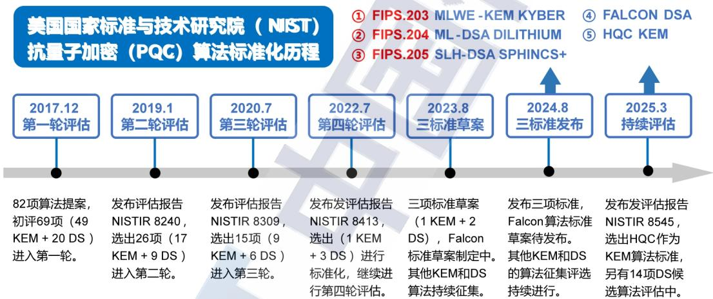

flowchart

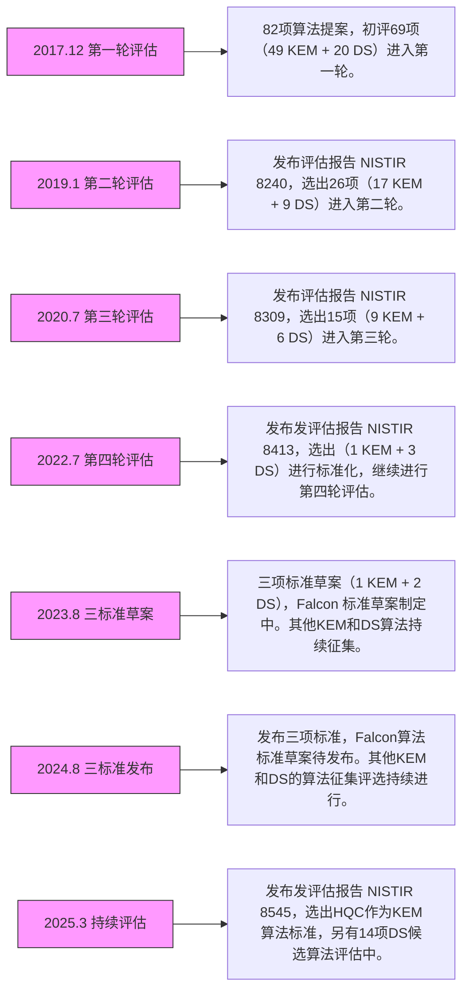
```mermaid
graph LR
    A["2017.12 第一轮评估"] --> B["82项算法提案，初评69项（49 KEM + 20 DS）进入第一轮。"]
    C["2019.1 第二轮评估"] --> D["发布评估报告 NISTIR 8240，选出26项（17 KEM + 9 DS）进入第二轮。"]
    E["2020.7 第三轮评估"] --> F["发布评估报告 NISTIR 8309，选出15项（9 KEM + 6 DS）进入第三轮。"]
    G["2022.7 第四轮评估"] --> H["发布发评估报告 NISTIR 8413，选出（1 KEM + 3 DS）进行标准化，继续进行第四轮评估。"]
    I["2023.8 三标准草案"] --> J["三项标准草案（1 KEM + 2 DS），Falcon 标准草案制定中。其他KEM和DS算法持续征集。"]
    K["2024.8 三标准发布"] --> L["发布三项标准，Falcon算法标准草案待发布。其他KEM和DS的算法征集评选持续进行。"]
    M["2025.3 持续评估"] --> N["发布发评估报告 NISTIR 8545，选出HQC作为KEM算法标准，另有14项DS候选算法评估中。"]
    style A fill:#f9f,stroke:#333
    style C fill:#f9f,stroke:#333
    style E fill:#f9f,stroke:#333
    style G fill:#f9f,stroke:#333
    style I fill:#f9f,stroke:#333
    style K fill:#f9f,stroke:#333
    style M fill:#f9f,stroke:#333
```

来源：中国信息通信研究院

图 17 美国NIST 抗量子加密（PQC）标准化发展历程

美国率先发布 PQC 算法标准并持续征集评估，我国启动 PQC算法全球征集与标准化。制定PQC 算法标准，是推动产品研发、应用验证和升级迁移的基础。美国NIST 于2016年启动 PQC算法全球征集，历经四轮评估验证，2024 年 8 月发布 FIPS.203（KYBER）、FIPS.204（DILITHIUM）、FIPS.205（SPHINCS+）三项 PQC 算法标准。其中，基于格加密的密钥交换（KEM）和数字签名（DSA）算法，在加密安全性和综合性能方面表现出众，成为业界PQC应用主流。为增加算法多样性以提升抗量子计算破解安全性保障，NIST 还选择了基于哈希的 Sphincs+ DSA 算法和基于纠错编码的 HQC KEM算法作为 PQC 标准的备份选项。此外，NIST 还在进行额外 14 项DSA 算法的安全性评估93，后续可能进一步扩充 PQC算法标准库。2月，商用密码标准研究院发布开展新一代商用密码算法征集活动公告94，为应对量子计算威胁，推动新一代商用密码算法标准制定。面向全球陆续开展新一代公钥密码算法、密码杂凑算法、分组密码算法征集，从安全性、性能、特点等方面组织评估，遴选出优胜算法开展标准化工作。

欧美信息安全管理机构力推PQC升级迁移，2035 年成重要节点。美国NIST 发布《PQC 迁移标准》95，重申 2035 年前完成联邦信息系统PQC升级迁移目标，并确定实施重点工作与时间表。法国、德国、荷兰等欧盟18 国信息安全管理部门发布联合声明96，呼吁欧盟成员国立即开展量子威胁分析、制定迁移计划和路线图，确保欧盟数字基础设施的量子韧性。英国国家网络安全中心发布《PQC 迁移时间表》指南97，部署2028年前探索验证，2031 年实质性推进，2035年全面落地的升级迁移计划。加拿大网络安全中心发布PQC迁移路计划98，要求联邦非机密 IT 系统在 2026 年制定迁移方案，2031 年前完成关键系统升级，2035 年覆盖全部系统。

欧美科技巨头和初创企业成为推动PQC技术产业化的先行者。继谷歌、苹果推出PQC加密服务之后，微软宣布将为WindowsInsider用户和Linux系统提供PQC功能99，支持PQC与传统密码混合使用，实现深度防御。亚马逊公布 PQC 迁移计划100，未来数年内在 AWS云平台和终端中集成PQC签名与密钥交换算法，提供更高安全性的身份认证与加密服务。韩国三星电子发布搭载PQC算法的安全芯片101，采用 FIPS204 数字签名标准，运算速度相比软件方案可提升17倍。瑞士SEALSQ 联合WISeKey发射通信卫星102，加载支持格密码算法的 PQC 安全硬件，可实现轨道间和星地量子安全通信。

PQC与QKD 有融合应用可能性，但未来应用推广前景不明确。PQC 可为 QKD 网络提供身份认证方案，QKD 可为PQC算法提供预共享密钥，理论上可提升加密安全性，二者存在融合应用的可能性。近年来，东芝公司103、新加坡电信104、中电信量子105等均有PQC+QKD融合加密应用方案探索。需要指出，在QKD 中融合 PQC 并不能解决密钥生成速率低、可信中继管理难、部署应用成本高等关键挑战。PQC作为端到端的完整密码学解决方案，对于绝大多数场景和用户而言，是可以满足信息系统安全应用合规性要求的低成本解决方案，融合QKD 并非刚需。在部分高安全性需求专网场景中，用户出于对PQC算法面对量子计算未来能力增长的安全性担忧，或可能会考虑采用 PQC+QKD 方案进一步强化安全保障能力。此外，PQC+QKD融合加密方案能否以及如何实现1+1>2 优势，也需要业界进一步探索。

# （四）量子信息网络前沿研究活跃，实用化仍有差距

量子信息网络（QIN），也称量子互联网，是量子通信、量子计算与量子精密测量三大领域发展融合的未来演进方向。基于量子隐形传态、量子存储中继和量子态转换等关键技术，QIN 可实现量子信息系统间的高效互联与协同，显著提升量子计算性能与量子传感测量精度。当前，QIN 前沿研究探索已成为量子通信乃至量子科技领域的关注热点，国内外研究机构和企业等在使能组件研发、存储中继方案设计、量子芯片互联、组网试验验证等方面开放探索，技术创新高度活跃，科研成果持续涌现。

高性能单光子源和光子纠缠源是QIN核心组件，我国在该领域研究取得多项进展。合肥国家实验室联合团队报道106，利用量子点与可调谐开放微腔耦合，结合激光脉冲整形技术，显著提高单光子产生效率和纯度，实现光子不可分辨率0.9856，多光子错误率为2.05%的高效率单光子源，优于光子损失纠错阈值要求。中山大学报道107，基于腔诱导自发双光子辐射方案和高品质的光学微腔，将双光子辐射效率提升至 50%，制备出保真度高达99.4%的新型微纳量子纠缠光源，为构建新型光量子信息处理系统提供思路。北京大学与浙江大学合作报道108，基于光量子芯片调控与片外光场整形技术，构建基于集成光量子芯片的涡旋光量子纠缠源，平均保真度达0.97，并可实现微秒级双涡旋纠缠态调控，为多自由度光量子信息处理提供支持。

突破量子存储中继和量子态转化等关键技术是实现QIN的前提，目前仍处于开放探索阶段。中科大报道109，基于新型稀土离子掺杂晶体和激光刻写制造技术，研制出光量子比特存储时间达到 1.021毫秒的固态集成光量子存储器，存储效率约为12%，性能优于传统光纤延迟线存储方案。法国量子初创企业Welinq发布集成化光子存储器110，基于光镊中性原子操控实现单光子存储，写入与读出效率超过90%，存储时间达 200 微秒，可室温运行和标准机架安装。麻省理工和哈佛大学发表超导量子线路中非线性光-物质耦合机制研究成果111，耦合接口的交叉克尔效应强度达到 580.3 MHz，有效提升了量子比特读取接口的相干耦合强度。奥地利科学家实现超导量子比特的全光学读出112，通过电光换能器将光信号转为微波频率，降低超导芯片信号传输热量，同时可实现超导量子芯片的光纤测控与互联扩展。

实现量子比特和芯片间互联成为量子计算与通信融合重要探索方向。IBM 与苏黎世理工等联合报道113，利用实时经典通信连接两个超导量子计算处理器，实现基于错误缓解的动态线路和线路切割，创建跨越 142 个量子比特的量子态，为量子计算模块化扩展提供了全新思路。北京大学和山西大学联合报道114，基于集成光量子频率梳芯片，成功制备不同结构的多模纠缠态，实现连续变量簇态量子纠缠，为集成光量子芯片扩展和光量子网络互联等应用奠定重要基础。牛津大学展示了分布式离子阱量子计算方案115，基于光子量子隐形传态互联完成跨越两个离子阱芯片的受控Z 门操作，保真度达86%，执行分布式Grover算法，测量成功率为71%，向模块化扩展迈出重要一步。合肥国家实验室报道116，基于硅光子芯片制备量子纠缠光源，实现两个光量子集成芯片之间的量子受控非门（CNOT门）隐形传输，在1公里传输距离下的CNOT门操作保真度高于93.04%。

开展QIN架构研究与组网实验探索是全球量子通信领域的前沿研究热点。荷兰代尔夫特理工等机构联合发布量子信息网络操作系统 QNodeOS117，如图 18 所示，该系统可支持量子网络架构编程控制和应用开发，允许多种量子处理器平台在网络中运行，计划在荷兰量子互联网实验床平台进行部署和验证。合肥国家实验室报道118，基于高性能量子点单光子源，与两侧干涉测量节点协同，提出并实现了五节点量子网络架构，向实现基于量子中继的量子信息网络迈出重要一步。清华大学实验演示了可纠错量子网络中继节点119，基于金刚石色心纠缠三种类型量子比特，使用混合编码实现量子比特存储和比特翻转错误纠正，验证了量子网络节点的纠错关键功能可行性。德国电信和Qunnect 公司合作报道120，在30公里现网光纤环境中，完成纠缠光子分发系统连续运行17 天，传输保真度达到99%，同时实现 82 公里光纤网络中纠缠光子与经典数据流量的 O+C 波段共纤传输和动态路由，传输保真度达到92%。网络设备供应商思科与加州大学联合开发量子网络纠缠芯片121， 基于光子集成技术实现纠缠光子对产生，产生速率达每秒 2 亿对光子纠缠，可实现标准电信波长和室温环境运行。

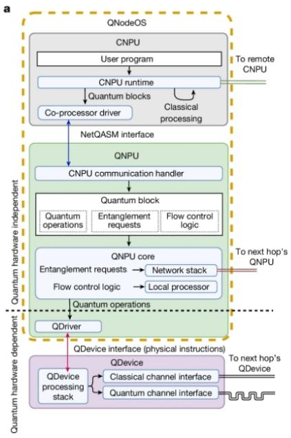

flowchart

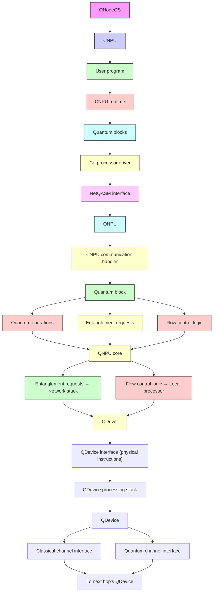
```mermaid
graph TD
    A["QNodeOS"] --> B["CNPU"]
    B --> C["User program"]
    C --> D["CNPU runtime"]
    D --> E["Quantum blocks"]
    E --> F["Co-processor driver"]
    F --> G["NetQASM interface"]
    G --> H["QNPU"]
    H --> I["CNPU communication handler"]
    I --> J["Quantum block"]
    J --> K["Quantum operations"]
    J --> L["Entanglement requests"]
    J --> M["Flow control logic"]
    K --> N["QNPU core"]
    L --> N
    M --> N
    N --> O["Entanglement requests → Network stack"]
    N --> P["Flow control logic → Local processor"]
    O --> Q["QDriver"]
    P --> Q
    Q --> R["QDevice interface (physical instructions)"]
    R --> S["QDevice processing stack"]
    S --> T["QDevice"]
    T --> U["Classical channel interface"]
    T --> V["Quantum channel interface"]
    U --> W["To next hop's QDevice"]
    V --> W
    style A fill:#f9f,stroke:#333
    style B fill:#ccf,stroke:#333
    style C fill:#cfc,stroke:#333
    style D fill:#fcc,stroke:#333
    style E fill:#cff,stroke:#333
    style F fill:#ffc,stroke:#333
    style G fill:#fcf,stroke:#333
    style H fill:#cff,stroke:#333
    style I fill:#ffc,stroke:#333
    style J fill:#cfc,stroke:#333
    style K fill:#fcc,stroke:#333
    style L fill:#ffc,stroke:#333
    style M fill:#fcc,stroke:#333
    style N fill:#ffc,stroke:#333
    style O fill:#cfc,stroke:#333
    style P fill:#fcc,stroke:#333
    style Q fill:#ffc,stroke:#333
```

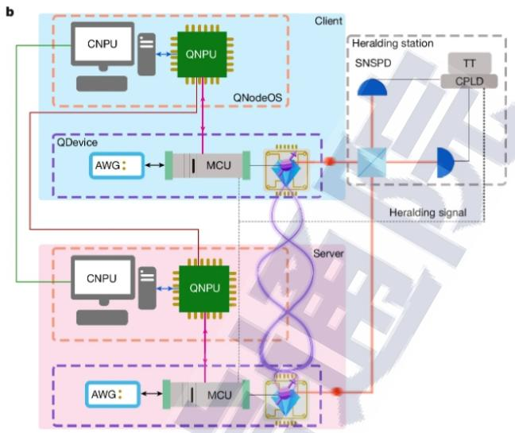

flowchart

```mermaid
graph TD
    subgraph Client
        A["CNPU"] --> B["QNPU"]
        B --> C["QNodeOS"]
        C --> D["MCU"]
        D --> E["AWG"]
        E --> F["QDevice"]
        F --> G["MCU"]
        G --> H["AWG"]
        H --> I["QNPU"]
        I --> J["MCU"]
        J --> K["AWG"]
    end

    subgraph Nerd immunity
        L["HERALDING STATION"] --> M["SNSPD"]
        M --> N["TTP"]
        N --> O["CPLD"]
        O --> P["Server"]
        P --> Q["MCU"]
        Q --> R["AWG"]
        R --> S["QNPU"]
        S --> T["MCU"]
        T --> U["AWG"]
    end

    style Client fill:#f9f9f9,stroke:#333
    style Nerd immunity fill:#e6f7ff,stroke:#333
```

来源：Nature 639, 321–328 (2025)

图 18 荷兰代尔夫特理工提出量子网络操作系统QNodeOS

QIN 关键技术成熟度有限，应用落地尚需时日。量子纠缠源、量子存储中继、量子态转换接口等QIN 使能组件仍处于前沿科研探索阶段，距离实用化还有明显差距，欧美高度关注并加快推动技术演进。2025 年，美国 DARPA 启动了量子增强网络（QuANET）项目，推动构建融合量子计算与通信能力的量子互联网，开发量子网卡等新概念原型。随着如德国电信、思科等产业界力量的加入，未来 QIN 技术产品研发和网络试验等有望进一步加速。

# 四、量子精密测量研究与应用进展

# （一）技术路线与应用领域丰富多样，战略价值突出

量子精密测量呈现出技术路线多、应用范围广的显著特点，通过对微观粒子系统中量子态制备、调控与观测，开发和运用量子叠加、量子纠缠、量子非经典关联等独特量子物理现象，实现对多种物理量更精准、更稳定、可溯源的测量与传感，测量精度、灵敏度和分辨率等核心指标相比传统技术显著提升。量子精密测量的技术路线或测量“探针”可分为原子、离子、固态自旋、超导、光子等，测量物理量可包括时间频率、磁场、重力、角速度、电场、温度、应力应变、位移/相位等，如图 19所示。

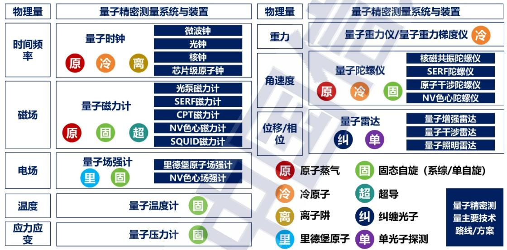

flowchart

```mermaid
graph TD
    A["物理量"] --> B["量子时钟"]
    B --> C["原 冷 离"]
    B --> D["微波钟"]
    B --> E["光钟"]
    B --> F["核钟"]
    B --> G["芯片级原子钟"]
    
    H["时间频率"] --> I["量子磁力计"]
    I --> J["原 固 超"]
    I --> K["光泵磁力计"]
    I --> L["SERF磁力计"]
    I --> M["CPT磁力计"]
    I --> N["NV色心磁力计"]
    I --> O["SQUID磁力计"]
    
    P["物理量"] --> Q["量子重力仪/量子重力梯度仪 冷"]
    P --> R["角速度"]
    R --> S["原子陀螺仪"]
    S --> T["原 冷 固"]
    S --> U["核磁共振陀螺仪"]
    S --> V["SERF陀螺仪"]
    S --> W["原子干涉陀螺仪"]
    S --> X["NV色心陀螺仪"]
    
    Y["磁场"] --> Z["量子磁场计"]
    Z --> AA["原 固 超"]
    Z --> AB["光泵磁力计"]
    Z --> AC["SERF磁力计"]
    Z --> AD["CPT磁力计"]
    Z --> AE["NV色心磁力计"]
    Z --> AF["SQUID磁力计"]
    
    AG["位移/相位"] --> AH["量子雷达"]
    AH --> AI["纠 单"]
    AH --> AJ["量子增强雷达"]
    AH --> AK["量子干涉雷达"]
    AH --> AL["量子照明雷达"]
    
    AM["电场"] --> AN["量子场强计"]
    AN --> AO["里 固"]
    AN --> AP["里德堡原子场强计"]
    AN --> AQ["NV色心场强计"]
    
    AR["温度"] --> AS["量子温度计 固"]
    
    AT["应力应变"] --> AU["量子压力计 固"]
    
    AV["原子蒸气 固 固态自旋（系综/单自旋）"] --> AW["冷 冷原子 超 超导"]
    AW --> AX["离子阱 纠 纠缠光子"]
    AX --> AY["里 里德堡原子 单 单光子探测"]
    
    AZ["量子精密测量主要技术路线/方案"] --> BA["量子增强雷达"]
```

来源：中国信息通信研究院

图 19 量子精密测量主要技术路线和物理量

量子精密测量技术具有军民两用特性，例如时间频率、电磁场、重力场等关键信息测量，以及目标探测识别和自主惯性导航等核心能力，对于高价值目标探测、战场态势感知和运载平台测控等方面具有重要价值。高精度重力测量和磁场测量等技术，将在深部资源勘探和心脑血管疾病诊断与治疗等领域带来深刻变革。

近年来，量子精密测量领域科技攻关突破测量性能极限，样机产品日趋完善，各领域应用探索步伐加快，产业化发展方兴未艾。量子精密测量技术体系框架如图 20所示。

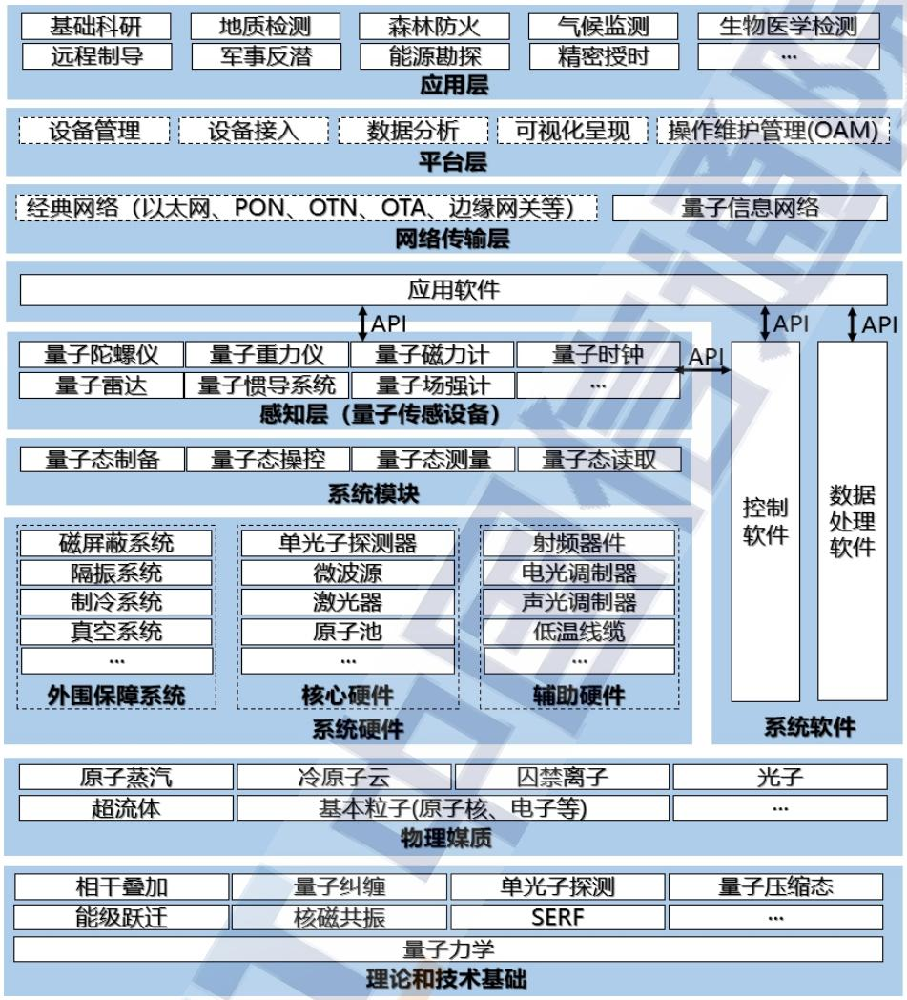

flowchart

```mermaid
graph TD
    A["基础科研"] --> B["地质检测"]
    C["远程制导"] --> D["军事反潜"]
    E["森林防火"] --> F["能源勘探"]
    G["气候监测"] --> H["精密授时"]
    I["生物医学检测"] --> J["..."]
    K["应用层"] --> L["设备管理"]
    M["设备接入"] --> N["数据分析"]
    O["可视化呈现"] --> P["操作维护管理(OAM)"]
    Q["平台层"] --> R["经典网络（以太网、PON、OTN、OTA、边缘网关等）"]
    S["量子信息网络"] --> T["网络传输层"]
    U["应用软件"] --> V["API"]
    W["感知层（量子传感设备）"] --> X["量子陀螺仪"]
    W --> Y["量子重力仪"]
    W --> Z["量子磁力计"]
    W --> AA["量子时钟"]
    W --> AB["量子雷达"]
    W --> AC["量子惯导系统"]
    W --> AD["量子场强计"]
    W --> AE["..."]
    AF["系统模块"] --> AG["磁屏蔽系统"]
    AF --> AH["隔振系统"]
    AF --> AI["制冷系统"]
    AF --> AJ["真空系统"]
    AF --> AK["..."]
    AF --> AL["外围保障系统"]
    AF --> AM["单光子探测器"]
    AF --> AN["微波源"]
    AF --> AO["激光器"]
    AF --> AP["原子池"]
    AF --> AQ["..."]
    AF --> AR["核心硬件"]
    AF --> AS["辅助硬件"]
    AT["控制软件"] --> AU["数据处理软件"]
    AV["系统软件"] --> AW["物理媒质"]
    AX["原子蒸汽"] --> AY["冷原子云"]
    AX --> AZ["囚禁离子"]
    AX --> BA["光子"]
    BB["超流体"] --> BC["基本粒子(原子核、电子等)"]
    BC --> BD["..."]
    BE["相干叠加"] --> BF["量子纠缠"]
    BE --> BG["单光子探测"]
    BE --> BH["量子压缩态"]
    BI["能级跃迁"] --> BJ["核磁共振"]
    BJ --> BK["SERF"]
    BL["量子力学"] --> BM["理论和技术基础"]
```

来源：中国信息通信研究院

图 20 量子精密测量技术体系框架

在硬件层面，根据测量物理量和技术方案不同，可选用原子、离子、光子，甚至电子、原子核等基本粒子作为物理媒质。例如，自旋原子核具有磁矩，天然具有测量电磁场和角速度的能力，而物理量“秒”采用铯原子同位素基态超精细能级之间的跃迁频率来定义，因此利用冷原子或囚禁离子等体系中的能级跃迁进行测量是理想方案。在软件层面，控制软件是实现量子精密测量全流程高效、精准运作的重要组成部分，贯穿于量子态的制备、调控、测量到各系统模块协同的全过程。数据处理软件实现量子态测量读取数据的后处理，最终输出被测物理量的测量结果。网络传输层将量子传感设备采集到据传输到平台层进行处理和储存，目前分布式量子传感主要通过经典网络进行互联，未来可通过量子信息网络进行纠缠互联。平台层负责量子传感设备的运行管理、数据处理、分析与存储，通过集中管控量子传感设备，实现统一网络监控与运维管理，同时可结合云计算与AI等技术，处理和分析采集的数据。应用层将处理后的数据转化为具体应用和服务，根据不同应用场景对测量数据进一步分析处理与可视化呈现，以满足不同场景个性化需求。

# （二）传感测量精度持续提升，物理量范围不断拓展

提升传感测量的精度是科研探索终极目标，也是技术进步基石。近年来，量子精密测量领域取得诸多令人瞩目的成就，为科学研究和实际应用开辟了新的可能性。科学家们开发出了一系列新颖的高精度量子测量工具和方法。例如，量子态精确操控和测量显著提高了测量的精度和可靠性，量子纠缠、量子非破坏测量等新技术出现，为提高测量精度提供了新途径。这些技术突破不仅推动量子精密测量领域发展，也为物理、化学、生物等多个学科研究提供有力支持。

原子钟精度持续突破奠定量子精密测量新基准。光钟的时间频率测量不确定度和不稳定性达到10-19量级，成下一代“秒”定义的有力候选者。中科院国家授时中心报道122，结合移动光晶格、法拉第笼、主动控温热屏腔等技术，解决传统锶光钟黑体辐射频移等难题，研制系统不确定度 $1 . 9 6 \times 1 0 ^ { - 1 8 }$ 的锶光晶格钟SrII，使中国成为继美国之后，第二个光晶格钟系统不确定度突破 $2 \times 1 0 ^ { - 1 8 }$ 的国家。美国NIST报道123，改进离子阱设计、优化真空系统并引入更稳定激光，使铝离子光钟的不确定度达到 $5 . 5 { \times } 1 0 ^ { - 1 9 }$ ，成为最精准时钟世界纪录。

表3 全球光钟领域代表性研究成果

<table><tr><td>国家</td><td>研究机构</td><td>光钟类型</td><td>不确定度指标</td></tr><tr><td>美国</td><td>国家标准与技术研究院(NIST)</td><td>离子光钟( $Al^{+}$ )</td><td> $5.50 \times 10^{-19}$ </td></tr><tr><td>美国</td><td>实验天体物理联合研究所(JILA)</td><td>光晶格钟(Sr)</td><td> $2.00 \times 10^{-18}$ </td></tr><tr><td>日本</td><td>东京大学/岛津制作所</td><td>光晶格钟(Sr)</td><td> $3.17 \times 10^{-19}$ </td></tr><tr><td>德国</td><td>联邦物理技术研究院(PTB)</td><td>离子光钟( $In^{+}-Yb^{+}$ )</td><td> $2.50 \times 10^{-18}$ </td></tr><tr><td>瑞士</td><td>苏黎世联邦理工学院(ETH Zurich)</td><td>离子光钟( $Al^{+}$ )</td><td> $1.00 \times 10^{-18}$ </td></tr><tr><td>中国</td><td>中国科学院国家授时中心</td><td>光晶格钟(Sr)</td><td> $1.96 \times 10^{-18}$ </td></tr><tr><td>中国</td><td>中国计量科学研究院(NIM)</td><td>光晶格钟(Sr)</td><td> $2.10 \times 10^{-18}$ </td></tr><tr><td>中国</td><td>中国科学院精密测量院</td><td>离子光钟( $Ca^{2+}$ )</td><td> $3.00 \times 10^{-18}$ </td></tr></table>

来源：中国信息通信研究院根据公开报道整理

近年来，全球主要国家在光钟领域的代表性研究成果如表3所示，这些成果不仅推动了国际重新定义“秒”进程，还为探索量子物理学新概念和地球测地学等提供了有力工具。此外，新型技术方案也推动原子钟逐步走向小型化和组网应用。中科院国家授时中心研制出基于单色光与铷原子相互作用的小型化高性能光钟，钟泡工作温度约 $4 0 \%$ ，可降低原子钟功耗并延长寿命，约100μW的激光光强则便于使用小型低功耗激光器124。北京大学利用不同量子跃迁之间的调制转移过程，在单原子系综中实现了双波长光学频率标准125，不仅验证了单一量子体系同步实现两种高稳定性光钟的可行性，还展现了在同一量子系统中构建多种光钟的潜力，为多光钟集成与量子传感网络奠定了技术基础。史蒂文斯理工学院、伊利诺伊大学和哈佛大学联合团队报道利用量子时钟网络研究弯曲时空的前沿探索126。

量子磁力计多条技术路线研究并进。原子自旋技术路线，中科大利用惰性气体核自旋体系作为磁场量子探测器实现超高灵敏极弱磁场探测127，该方案利用惰性气体核自旋共振增强待测磁场信号，实现了 145 倍的磁场信号放大，同时结合极弱磁信号的最优滤波技术，将系统信噪比提升至理论极限水平，有效抑制了环境噪声。复旦大学团队实现了稳态原子自旋压缩态，以及机器学习辅助的连续量子增强高灵敏度磁场测量128，测量灵敏度达到27.97fT/ Hz，超越标准量子极限。固态自旋技术路线，德国马克斯·普朗克研究所团队提出利用 1042nm 红外单重态跃迁吸收对金刚石中氮空位中心进行高灵敏度磁场测量的方法，其测量灵敏度为18pT/ Hz。英国剑桥大学等利用六方氮化硼中的单自旋缺陷实现矢量量子磁力仪129，其测量灵敏度达到 $\mu \mathrm { T } / \sqrt { \mathrm { H z } }$ 量级，并实现目标磁场三维空间分量的矢量测量。

量子惯性/引力测量开启地球与太空观测新窗口。麻省理工学院、美国本田研究所、美国陆军实验室等联合提出基于腔增强固态核自旋的量子陀螺仪130，结果表明该系统与之前类似方案相比，旋转测量灵敏度提高了 3 个数量级。东京科学大学在原子干涉陀螺中引入适当的拉曼光双光子失谐，有效地抵消原子速度相关的Sagnac相移，实现 1.0°/s 的大动态范围高精度角速度测量。中科院精密测量院在“天宫”空间站中利用自研的空间冷原子干涉仪在天和核心舱内开展了原子冷却、原子干涉、惯性量测量等系列实验研究，攻克了最优角度补偿、在轨转角自标定等关键技术，实现了空间微重力条件下基于原子干涉的量子惯性传感转动测量131。德国莱布尼茨大学等提出用于卫星测量重力任务的经典-量子组合加速度计132，通过构建全面的噪声模型，考虑卫星旋转、重力梯度和自重力的影响，理论模拟结果显示该系统的重力测量精度比传统方案提高一到两个数量级。德国汉诺威大学和德国宇航中心联合实现基于玻色-爱因斯坦凝聚的纠缠增强原子重力仪133，其测量灵敏度超出标准量子极限-1.7dB。

量子精密测量向温度、痕量物质检测等多方向延伸。温度测量方面，美国NIST提出一种基于里德伯原子的新型量子温度计134，通过监测电子跃迁速率与环境黑体辐射的关系可以精确测量温度变化，其温度测量范围可覆盖0 至 100 摄氏度，且无需接触被测物体。痕量检测方面，中科大和美国加州大学联合报道“全光原子阱痕量分析”方法135，对1 公斤南极古冰芯样品的氪-81定年，为研究百万年尺度古气候变化提供了全新工具。基本物理常数测量方面，南京大学、中科大和丹麦玻尔研究所等联合团队利用自旋量子传感器的应力效应在高频范围内测试了基本物理常数的变化136，团队在 0.1 至12GHz的高频率区间内，成功实现对精细结构常数和电子质量相对变化的精确测量，其测量精度分别达到低至5ppm和8ppm。

# （三）应用探索多点开花，能源与医疗领域进展迅速

量子精密测量技术创新应用不断拓展，为未来发展开辟新道路。原子钟凭借高精度的数据和解决方案，有望在卫星导航、航天、通信、金融科技等领域实现大规模应用。量子磁力传感器借高时间分辨率和高空间分辨率特性，有望为生物医疗和新能源领域带来新突破。量子电场强计高灵敏度捕捉微弱电场信号，在生物医学与工业检测等领域展现潜力。量子重力仪凭借其高精度、无漂移等特点，可以更精准地探测地下资源，如矿产、石油等，以及基础设施，如地下管道等，在能源环保、土木工程等领域具有广阔应用前景。单光子成像与量子雷达具有高分辨率和灵敏度，可以对特定气体成分、云雾等“软目标”进行探测，已在环保、气象、交通等领域开展示范应用。

# 量子精密测量技术赋能电力行业多种高精度传感测量需求场景。

新型电力系统在电源结构、电网形态、运行特性等方面与传统电力系统存在显著差异，具有高比例新能源接入、交直流混联、系统复杂程度大幅提升等特点，对电力测量技术的准确度、灵敏度、稳定性和响应速度等提出了严苛要求。量子精密测量技术为新型电力系统发展提供了有力支撑。2024年11月，220千伏合肥候店量子应用示范变电站于正式建成投用，是国内首座同步应用量子测量、量子通信和量子计算三大技术方向的在运变电站。该站位于合肥高新区，投运容量达2×240 兆伏安，为周边高新技术企业及科研机构提供电力保障。站内集成量子电流互感器、量子无损探伤仪等18 类 85 台套技术装备，验证了量子传感技术在电力生产中的实际效能。量子精密测量相关示范应用内容如表 4 所示。未来量子精密测量技术有望进一步在“发-输-变-配-用”电网全链条中展现技术与应用优势。

表 4 量子精密测量技术产品在电力行业典型应用

<table><tr><td>设备名称</td><td>核心技术</td><td>应用优势</td></tr><tr><td>量子电流互感器</td><td>基于NV色心的磁场测量技术</td><td>高精度</td></tr><tr><td>量子配网电流传感器</td><td rowspan="4">基于隧道磁阻效应的磁场测量技术</td><td>高灵活性</td></tr><tr><td>一体式量子直流电能表</td><td>高集成度</td></tr><tr><td>量子无损探伤仪</td><td>高效率</td></tr><tr><td>量子姿态传感器</td><td>高精度</td></tr><tr><td>量子点火灾传感器</td><td rowspan="2">量子点MEMS气体传感技术</td><td>极早期预警</td></tr><tr><td>量子点多参量传感器</td><td>多参量在线监测</td></tr><tr><td>光量子雷达</td><td>单光子探测技术</td><td>高灵敏</td></tr><tr><td>量子时间同步装置</td><td>天地一体化量子时间同步技术</td><td>高稳定性</td></tr></table>

来源：中国信息通信研究院根据公开报道整理

量子精密测量技术助力提升油气管网管道安全检测与防护能力。

石油、天然气作为重要的能源资源，安全、高效输送至关重要。油气管道作为油气输送的关键基础设施，广泛分布于陆地和海洋，承担着将油气资源从产地输送到消费地的重任。然而，由于长期服役、复杂的地质条件、腐蚀以及外力破坏等因素的影响，油气管道面临着诸多安全隐患，如管道泄漏、破裂等。传统的油气管道检测技术在检测精度、灵敏度以及对复杂环境的适应性等方面存在局限性，难以满足日益严格的管道安全检测要求。量子精密测量技术具有极高的测量精度和灵敏度，能够突破传统测量技术的极限，为油气管道检测提供全新解决方案。国家管网集团研究总院开展基于量子磁力计的管道微小缺陷检测应用研究，实验结果表明，量子磁传感器能够有效的检测开口宽度0.1mm，深度 0.2mm及以上的裂纹缺陷，大幅提升裂纹缺陷检测能力。此外，量子磁传感器探头可以提离2-3mm 进行无接触检测，可有效避免环焊对探头的影响。

量子重力与磁场高精度测量等提升深部矿产资源勘探开发能力。随着全球经济的快速发展，对矿产资源的需求持续增长，然而优质、易开采的矿产资源日益减少，使得探矿工作不得不向更深部、更复杂的地质区域拓展。传统的探矿技术，如地质填图、地球化学勘探、地球物理勘探等，在面对复杂地质条件时，其探测精度、灵敏度和深度往往受到限制，难以准确地定位和评估深部矿体及隐伏矿体。量子精密测量技术凭借其高灵敏度、高精度等特性，为探矿领域带来了新的突破方向。中冶武勘量子探矿研究院团队利用量子重力仪对重力进行矢量测量，通过数据反演可以探测地下矿产分布。同时，利用量子绝对重力仪和无人机搭载的铯原子光泵磁力计进行矿山现场实地勘测，数据反演结果与已探明矿山资料相吻合，验证了方案可行性。

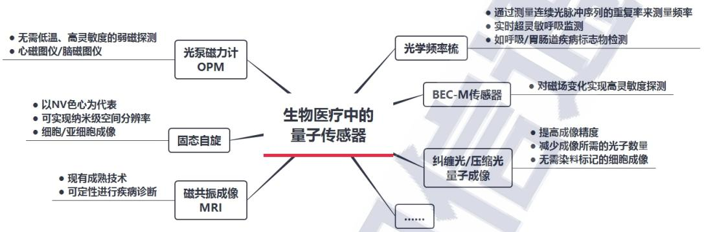

flowchart

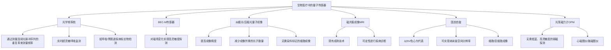
```mermaid
graph TD
    A["生物医疗中的量子传感器"] --> B["光学频率梳"]
    A --> C["BEC-M传感器"]
    A --> D["纠缠光/压缩光量子成像"]
    A --> E["磁共振成像MRI"]
    A --> F["固态自旋"]
    A --> G["光泵磁力计OPM"]
    B --> H["通过测量连续光脉冲序列的重复率来测量频率"]
    B --> I["实时超灵敏呼吸监测"]
    B --> J["如呼吸/胃肠道疾病标志物检测"]
    C --> K["对磁场变化实现高灵敏度探测"]
    D --> L["提高成像精度"]
    D --> M["减少成像所需的光子数量"]
    D --> N["无需染料标记的细胞成像"]
    E --> O["现有成熟技术"]
    E --> P["可定性进行疾病诊断"]
    F --> Q["以NV色心为代表"]
    F --> R["可实现纳米级空间分辨率"]
    F --> S["细胞/亚细胞成像"]
    G --> T["无需低温、高灵敏度的弱磁探测"]
    G --> U["心磁图仪/脑磁图仪"]
```

来源：QED-C《生物医学应用中的量子传感》

图 21 量子精密测量技术在生物医疗领域应用场景

量子极弱磁场探测等技术为心脑血管疾病诊断治疗带来新方案。量子精密测量在生物医疗领域可实现“可穿戴”、“非侵入”的新型病理检测和诊疗应用，主要技术方案和应用领域如图 21所示。量子磁场探测用于心磁、脑磁探测，为神经科学、脑科学研究、疾病早期诊断奠定基础，具有灵敏度高，对人体无损无创等优势。以金刚石 NV 色心为代表的固态自旋技术可实现高空间分辨率和非侵入式探测，用于活体细胞的检测与成像，对于细胞动力学、癌细胞标记与筛选、药物运输与代谢等方面的研究与应用提供了新的手段。此外，光学频率梳、玻色-爱因斯坦凝聚体微观（BEC-M）传感器、纠缠光/压缩光量子成像等技术具有广阔的应用前景，目前处于可行性验证阶段。

# （四）产业生态格局逐步完善，与 AI 融合受业界关注

量子精密测量产业链与生态已具雏形，相关企业数量近150家，但大规模商业化应用还需突破技术成熟度、成本、场景拓展与市场接受度等瓶颈。产业链上游涉及核心硬件，如激光器、探测器等，辅助器件及环境保障系统，欧美材料、器件和子系统供应商集中度较高。因材料器件种类多、技术路线需求差异大，供应链整合难。需产学研协作制定标准，推动模块化、标准化生产以降本提效。

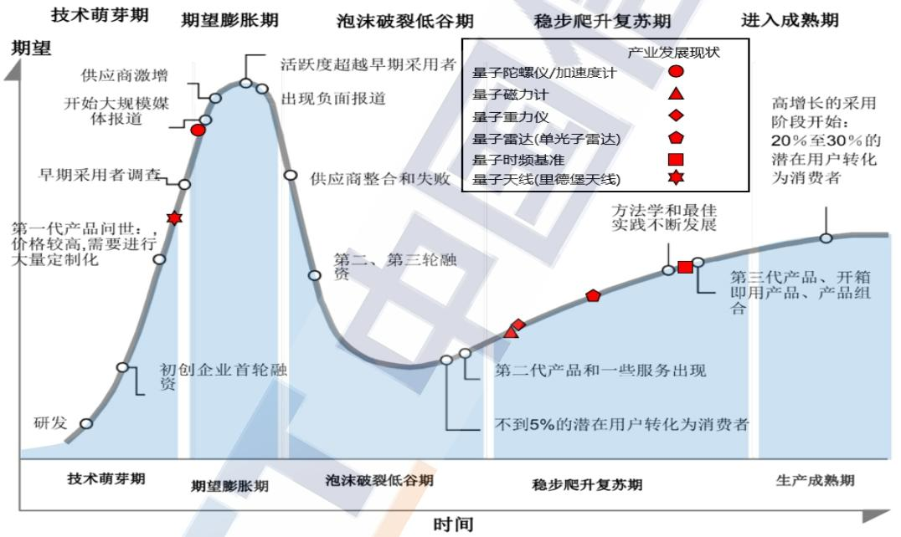

flowchart

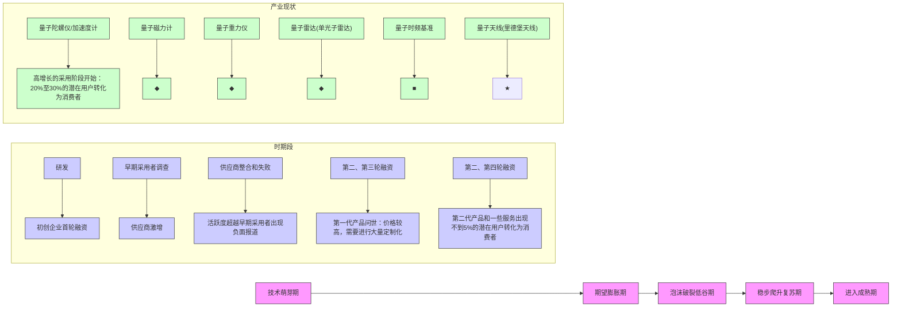
```mermaid
graph LR
    A["技术萌芽期"] --> B["期望膨胀期"]
    B --> C["泡沫破裂低谷期"]
    C --> D["稳步爬升复苏期"]
    D --> E["进入成熟期"]

    subgraph 时期段
        F["研发"] --> G["初创企业首轮融资"]
        H["早期采用者调查"] --> I["供应商激增"]
        J["供应商整合和失败"] --> K["活跃度超越早期采用者出现负面报道"]
        L["第二、第三轮融资"] --> M["第一代产品问世：价格较高，需要进行大量定制化"]
        N["第二、第四轮融资"] --> O["第二代产品和一些服务出现不到5%的潜在用户转化为消费者"]
    end

    subgraph 产业现状
        P["量子陀螺仪/加速度计"] --> Q["高增长的采用阶段开始：20%至30%的潜在用户转化为消费者"]
        R["量子磁力计"] --> S["◆"]
        T["量子重力仪"] --> U["◆"]
        V["量子雷达(单光子雷达)"] --> W["◆"]
        X["量子时频基准"] --> Y["■"]
        Z["量子天线(里德堡天线)"] --> AA["★"]
    end

    style A fill:#f9f,stroke:#333
    style B fill:#f9f,stroke:#333
    style C fill:#f9f,stroke:#333
    style D fill:#f9f,stroke:#333
    style E fill:#f9f,stroke:#333
    style F fill:#ccf,stroke:#333
    style G fill:#ccf,stroke:#333
    style H fill:#ccf,stroke:#333
    style I fill:#ccf,stroke:#333
    style J fill:#ccf,stroke:#333
    style K fill:#ccf,stroke:#333
    style L fill:#ccf,stroke:#333
    style M fill:#ccf,stroke:#333
    style N fill:#ccf,stroke:#333
    style O fill:#ccf,stroke:#333
    style P fill:#cfc,stroke:#333
    style Q fill:#cfc,stroke:#333
    style R fill:#cfc,stroke:#333
    style S fill:#cfc,stroke:#333
    style T fill:#cfc,stroke:#333
    style U fill:#cfc,stroke:#333
    style V fill:#cfc,stroke:#333
    style W fill:#cfc,stroke:#333
    style X fill:#cfc,stroke:#333
    style Y fill:#cfc,stroke:#333
    style Z fill:#cfc,stroke:#333
```

来源：中国信息通信研究院

图 22 量子精密测量产业发展成熟度

产业链中游的系统设备商是科技成果转化核心，量子精密测量各技术路线的产业化成熟度差异明显，如图 22所示。微波原子钟等量子时频基准产品相对成熟，并且已在秒定义、世界协调时、卫星定位导航等领域广泛应用。新一代光学原子钟、核钟研究蓬勃发展，有望进一步提升时间频率计量精度，成为时频计量新基准。原子磁力仪和重力仪等已有样机产品，在心脑磁医疗检测、地质资源勘测等领域开展示范应用。光量子雷达已完成新一代产品的更新迭代，并应用于环保、气象、交通、应急等领域。量子陀螺仪和加速度计组成的量子惯性导航系统，以及里德堡原子天线电场测量系统等技术，有望在国防军工领域带来自主定位导航、战场态势感知等方面带来颠覆性应用，目前正处于技术研究与原型验证的早期阶段。

下游应用覆盖诸多行业领域，科研、医疗、国防等领域潜力巨大。量子精密测量技术正成为传统传感测量的有效补充与增强方案，随着性能优化、工程化水平提升及成本降低，有望成为未来传感测量技术演进方向。但需要看到，部分技术路线成果转化难、商业价值未显、资本投入有限，需产学研协同并加大资金支持以推动产业化。

量子精密测量与AI融合发展成为业界关注的新热点。量子精密测量利用量子特性突破传统测量极限，但其在态制备、测量数据处理等方面存在挑战。以量子态的制备环节为例，实现高纯度、高纠缠度且具备良好稳定性的量子态，面临着来自量子系统固有噪声、外部环境干扰等多方面的阻碍，限制了量子精密测量设备实际应用中的鲁棒性。在测量数据的处理阶段，如何从海量且复杂的测量数据中精准、高效地提取出与待测物理量紧密相关的关键信息，同样成为阻碍量子精密测量设备产业化的一道难题。

借助机器学习、大模型、智能体等AI 技术优化测控系统参数，高效制备高保真量子态，能够提升量子精密测量的性能。科罗拉多大学博尔德分校报道137，通过将 AI 技术与原子干涉测量相结合，构建可编程的量子传感平台，使用通用可编程的“逻辑门”，实现软件定义量子精密测量设备，无需进行硬件改动就能执行加速度、旋转和重力梯度等多种物理量的精密测量。

将AI用于量子精密测量数据的后处理分析，如噪声抑制、信号提取和测量数据分类等，有望进一步提升性能和应用范围。国耀量子基于颗粒物光量子雷达环保监测网络，构建数据分析平台，借助AI 自动识别功能实现污染源的高精度定位，为用户在污染源传输监测和相关决策上提供预警支持和数据保障。美国量子人工智能公司SandboxAQ推出基于地磁导航系统AQNav，通过量子磁力计实时进行地磁测量，并通过AI算法与已知测地磁分布地图进行比较分析，实现精确的定位导航。SandboxAQ 还正在与梅奥诊所合作，将心电图、基于量子精密测量的心磁图和AI 技术相结合，用于淀粉样变性中的心血管疾病监测。德国“QuaLiProM”研究项目团队利用NV 色心磁场测量和AI技术相结合实现电池寿命预测。此外，复旦大学138、法国巴黎大学139等开展量子纠缠和AI 结合提升测量精度前沿研究。

未来，量子精密测量需进一步提升技术成熟度，突破体积、功耗、成本和任务环境适应性等瓶颈。通过产学研协同推进上游核心硬件标准化与模块化，缓解供应链整合难题。中游同步技术路线梯度化发展，成熟产品持续拓展应用，前沿技术加速工程化突破。量子精密测量与AI 融合有望成为引领技术与行业变革方向

# 五、量子信息领域发展前景展望

# （一）三大领域技术持续演进，应用场景进一步拓展

为纪念量子力学诞生和发展百年，联合国宣布2025年为国际量子科技年（IYQ）。站在百年历史的新起点，以量子计算、量子通信、量子精密测量为代表的量子信息技术快速发展，推动量子科技革命与产业变革加速演进，有望成为突破经典信息技术能力极限，赋能数字经济社会升级发展，增进人类共同福祉的重要驱动力。

量子计算领域，超导、离子阱、中性原子、光量子等主要技术路线并行发展，前沿科研亮点成果不断涌现，原型机性能指标持续提升。量子纠错是推动量子计算从实验室走向现实应用的关键支撑，新型编码方案研究和逻辑比特构建实验验证等方面进展迅速，但距离长相干时间、极低错误率的实用化要求仍有差距。量子计算软件技术体系初步形成，测控、编译和应用软件将是未来软件生态发展与竞争和核心。量子计算云平台在国内外快速发展并形成一定服务能力，未来有望成为支撑量子计算实现商业化落地和应用的重要基础设施。量子计算应用场景探索广泛开展，量子-经典计算融合，量子+AI 协同创新成为业界热点，跨域融合有望加快技术实用化突破进程。欧美量子计算企业高度集中，产业生态活跃，科技巨头和初创企业成为重要创新力量，我国需加大量子计算产学研协同和产业创新能力建设。

量子通信领域，QKD、QRNG 和量子安全直接通信等新型协议研究与实验持续推进，系统性能指标和实用化水平得到提升，量子加密应用设备类型不断丰富。量子保密通信网络试验与应用探索在多国持续开展，我国电信运营商和行业专网成为主要推动力量。未来，量子保密通信需进一步提升技术工程化水平，推动产品和服务提质降本，才能夯实应用推广基础。美国率先发布三项PQC算法标准并持续征集评估，我国启动 PQC 算法标准化工作，PQC+QKD 融合加密是未来探索的可能方向，但推广应用前景仍不明确。量子信息网络使能组件研发、存储中继方案设计、量子芯片互联、组网试验验证等前沿研究发展迅速，但距离实用化落地仍有很大差距。

量子精密测量领域多元技术路线并行发展推动多领域应用赋能，军民两用特性突出。时间频率、电磁场、重力场、惯性等高精度传感和高价值目标探测识别等技术在国防军工、航空航天、资源勘探、生物医疗等众多重要行业有望带来改变游戏规则的颠覆性创新应用。光学原子钟精度持续提升，为下一代秒定义更新奠定基础。量子磁场和惯性测量技术发展迅速，为深空、深地观测与勘探带来全新方案，温度和物质痕量等新型测量技术不断拓展应用边界。量子精密测量应用在生物医疗、工业检测、能源电力、油气管网、矿产开发等领域取得重要进展，产业生态格局逐步完善，与AI技术融合提升量子态制备测量精度和数据后处理能力等成为业界探索新方向。

# （二）量子信息技术与产业发展动能集聚，未来可期

我国量子信息技术与产业发展水平整体处于全球第一梯队，具备打造未来产业竞争力的良好基础。规划布局方面，“十四五”以来，量子科技和产业领域的发展规划、总体方案、产业行动、发展意见等政策布局不断完善，重大科技项目和大科学设施平台稳步推进。科技力量方面，合肥国家实验室、大湾区量子科学中心、北京量子院等成为量子科技创新的重要策源地，中国电信、中国电科等带动国内产业体系建设。创新成果方面，“祖冲之号”超导量子计算原型机、“九章”光量子计算原型机、“天元”量子模拟器、“墨子号”量子科学卫星等重要成果处于国际领先水平。供应链保障方面，高端激光器、高性能单光子探测器、稀释制冷机、电子束曝光机、高性能时间分析仪等重要器件装备实现国产化突破。科技产业集群方面，安徽、北京、上海、粤港澳大湾区等地方先行先试，积极推动量子科技发展与未来产业布局，打造量子科技中心与产业聚集地。人才支撑基础方面，全国已有17 所高校开设量子信息科学本科专业，清华、北大、中科大、北航等高校探索量子科技学院、量子信息班、本硕博贯通培养等模式，为未来产业发展提供有力支持。

未来五到十年将是量子信息领域技术路线竞争、应用转化赋能和产业化培育发展关键期，我国也面临激烈国际竞争和复杂外部环境，发展不进则退、慢进亦退。面对机遇与挑战，需加快推动科技创新和产业创新深度融合，进一步强化基础研究与核心技术攻关，推动重点产品研发与行业应用示范，构建基础设施与公共服务平台，促进产学研用深度协同合作，培育完善产业生态体系 。

中国信息通信研究院

地址：北京市海淀区花园北路52号

邮编：100191

电话：010-62300592

传真：010-62304980

网址：www.caict.ac.cn

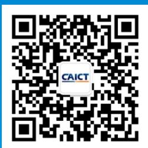

text_image

CAICT

