# 固态电池深度：从技术本征看固态电池产业发展趋势

# 引言

固态电近年来既得到市场广泛关注，也饱受争议。半固态电池到底是不是固态电池？全固态电池何时到来？固态电池技术将为产业链带来哪些变化？本篇报告旨在从技术本征角度回答以上问题，从而分析固态电池产业发展现状及趋势，以供市场参考。

# 报告要点

固态电池是锂电池理论上高能量密度+高安全性能的最佳体系。液态锂电池体系向高能量密度迭代的热安全矛盾凸显，固态电池在本征安全性和锂金属负极兼容性上潜力大，是锂电池理论上高能量密度+高安全性能的最佳体系。且固态电解质的离子电导率已实现 10-2S/cm 的突破，固态电池初步具备产业化理论基础。

全固态电池存在界面问题+成本问题卡点。全固态取消电解液，“固-固”界面硬接触将影响电池倍率和循环性能，并带来加压制造、干法混料等工艺难点。成本方面，目前固态电解质价格高昂，其中聚合物、氧化物体系远期降本相对清晰，硫化物体系由于前驱体硫化锂工艺尚未成熟，降本节奏将更缓慢。我们测算全固态电芯远期成本有望达到 0.69元/Wh。

半固态本质仍属于液态锂离子电池体系，在液态电池安全性仍有提升预期时，短期半固态在安全、性能、成本上优势不明显。半固态并非液态到全固态的线性迭代，而是固态电池产业化初期的尝试。虽然半固态电池可以一定程度延缓电池热失控，但牺牲了成本经济性和倍率性能，在液态体系仍可从系统主动安全、电解液改性、隔膜改良等手段提升安全性的前提下，半固态电池的产业逻辑还有待进一步验证。

产业进展：半固态进入量产，但由于性价比优势不明显，装车不及预期；全固态部分进入 A 样阶段，量产或将在 2030 年后。固态电池产能总规划超565.7GWh，已建成产能约 28.3GWh。半固态进入量产阶段，但由于性价比优势不明显，目前车端销售不及预期。全固态近期部分企业进入 A 样阶段，考虑全固态电池卡点仍较明显，我们预计全固态量产或将延迟至2030 年后。

固态电池产业突破后，将带来电池材料体系变化，并部分带动上游原材料需求。固态电池技术有望对高镍三元正极、硅碳负极、粘结剂、碳纳米管导电剂、LiTFSI/LiFSI添加剂等带来增量，电解液隔膜用量将有所减少。上游资源方面，有望对锆、镧、钛等金属形成一定带动。

[Table\_Invest] 电气设备

评级： 看好

日期： 2025.02.07

# [Table\_Autho分析师 张鹏

登记编码：S0950523070001

：18820232934

：zhangpeng1@wkzq.com.cn

# 联系人 吴依凡

：18328086469

：w uyf3@wkzq.com.cn

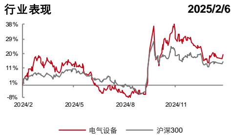  
资料来源：Wind，聚源

# [Table\_Do相关研究

 《碳资产怎么评估？》(2025/2/5)

 《2025 年全国碳市场健康平稳有序运行仍或是政策主旋律》(2025/1/22)

《储能 12 月招标创新高，预计 25 年景气度持续》(2025/1/20)

《电池厂进入招标期，铁锂材料或有较强涨价动力》(2025/1/2)

《极越深陷经营危机，新能源车品牌洗牌进行中》(2024/12/18)

《碳市场趋势跟踪（202411）：全球碳市场开启新征程》(2024/12/11)

《汽车报废更新申请超 200 万辆，以旧换新政策有望延续》(2024/12/4)

《弗迪电池发布会点评：携超混+快充+CTB技术进军工程机械电动化领域》(2024/12/2)

 《25 年锂价会涨么？》(2024/11/21)

《澳矿停产叠加 12 月锂电排产超预期，碳酸锂价格上行》(2024/11/19)

风险提示： 1.全固态电池界面问题技术突破进展不及预期；2.半固态电池在安全性、经济性上优势短期难以验证；3.固态电池下游需求情况不及预期。

# 内容目录

# 1. 固态电池的产业逻辑.

1.1 发展历程：锂金属与锂离子，液态与固态，锂电池发展路径的分化.  
1.2 液态电池困境：高能量密度趋势下，面临热安全+锂枝晶问题挑战. .5  
1.3 固态电池发展机会：锂电池理论上高能量密度+高安全性能的最佳体系. .6

# 2. 全固态电池——仍面临界面+成本问题..

2.1 全固态技术路径.  
2.2 全固态电池卡点一：界面问题.  
2.3 全固态电池卡点二：成本问题. ..8

# 3. 半固态电池——本质仍是液态锂离子电池体系............. .10

3.1 半固态电池技术路径.. ..10  
3.2 半固态 VS 液态：性能和成本对比，半固态短期未占优. .11  
3.3 全固态 VS 半固态 VS 液态：性能和成本对比.. ..13

# 4. 固态电池产业进程... ..14

4.1 固态电池企业技术路线.. ..14  
4.2 固态电池研发现状：从产品研发流程角度.. ..15  
4.3 固态电池产业规划：半固态装车不及预期，全固态预计2030 年后量产. .17

# 5. 固态电池对产业链的影响分析...... .18

5.1 固态电池对电池材料体系的影响. ..18  
5.2 固态电池对上游资源的影响. ..19

# 风险提示 .. .. 20

# 图表目录

图表 1：锂电池发展历程..............  
图表 2：液态锂离子电池热蔓延图. .. 5  
图表 3：锂金属负极与电解液的界面反应，金属锂负极的锂枝晶问题. 5  
图表 4：固态电池与液态电池结构对比图.... .... 6  
图表 5：固态电池在热失控抑制上的理论优势................... .... 6  
图表 6：固态电池应用于锂金属负极的理论优势.. .. 6  
图表 7：锂电池材料体系技术发展路线图.... .... 6  
图表 8：固态电池三种技术路径材料体系&性能优劣分析......  
图表 9：全固态电池产业化的关键点.................... ... 8  
图表 10：固态电解质成本测算.. .. 8  
图表 11：全固态电池制造工艺流程图（干法-锂金属负极） ......... .. 9  
图表 12：全固态电芯远期成本测算（硫化物体系）............... .. 9  
图表 13：液态、半固态、全固态技术路径下材料体系变化................. ........... ......10  
图表 14：极片固态化示意图.... ...... 11  
图表 15：隔膜涂覆固态电解质示意图（LATP） ...... 11  
图表 16：原位聚合技术制备半固态电池................... ...................... 11

图表 17：电池的安全分类形式.................... ......12

图表 18：宁德时代 NP 控制技术.................... ......... ......12

图表 19：2024 年《电动汽车用动力蓄电池安全要求征求意见稿》相比 21 年版本在安全性标准上进步较大.. ..12

图表 20：LATP+勃姆石涂覆在实验中可以提升热失控温度 . ..13

图表 21：无 EC 的电解液将 10Ah 高镍 811 电芯的热失控触发温度提高............... ......... ......13

图表 22：半固态电池中 LATP 的使用在经济性和性能等上相比液态电池隔膜涂覆并不明显占优............. .....13

图表 23：全固态电池是长期方向之一.. ..14

图表 24：主要固态电池企业主要产品技术路线&产业化现状汇总. ..14

图表 25：典型电池厂商研发流程图.. ...15

图表 26：SolidPower 固态电池研发流程 ................... ......................16

图表 27：SolidPower 公布的 Pre-A原型设计阶段电芯演变历程. ...16

图表 28：各企业固态电池产品所处研发阶段.... ..17

图表 29：各企业固态电池量产规划........................ .......... ......17

图表 30：固态电池关键材料体系发展图.. ..19

图表 31：100GWh 固态电池中固态电解质对应的原材料消耗-吨. ..19

图表 32：钛产业链示意图... ...20

图表 33：2019 年全球主要产锆国家锆精矿产量（万吨） ..20

# 1. 固态电池的产业逻辑

# 1.1 发展历程：锂金属与锂离子，液态与固态，锂电池发展路径的分化

1958年，锂金属因低比重、极低电势、极高质量能量密度被引入电池材料。锂电池发展早期也均以锂金属电池为研究对象，加拿大 Moli 公司于 80 年代末实现 Li/Mo2 锂金属电池的首次商用。然而在1989年，Li/Mo2电池因严重的锂枝晶问题起火，引发了锂电池安全性恐慌，锂金属二次电池发展陷入停滞。

在锂金属锂枝晶安全问题的十字路口，有两种主要方案：一是替代锂金属负极，即液态锂离子电池路线；二是替代电解液，即固态锂电池路线，锂电池产业发展路径开始分化。

液态锂电池：理论研究+材料体系+需求驱动其率先爆发。1980年，Armand提出锂离子电池模型，认为可以采用含锂离子的嵌入式材料替代锂金属。与此同时，钴酸锂正极、石墨负极等嵌入式正负极材料的突破进一步验证了锂离子模型的商业化可能性，再加之电解液体系发展相对成熟，1991年索尼首次实现了锂离子电池商业化。液态锂离子电池也在消费电池和新能源电池的浪潮中率先完成产业爆发。

固态锂电池：历经 30 年实现固态电解质突破，初步具备产业化逻辑。锂金属负极的锂枝晶问题第二种路线是替代电解液。1978年，固态电解质开始得到研究，1999年松下等企业对离子电导率不高的聚合物固态电池和凝胶半固态电池实现少量商用。直至 2011 年，科研发现Li10Ge2S12硫化物固态电解质离子电导率达到 12mS/cm（优于电解液），固态锂电池才开始得到产业更广泛的关注。对比液态锂离子电池的商业爆发逻辑，固态电池目前仍处于理论研究+材料体系发展阶段，但固态电解质离子电导率上的关键突破，使得固态锂电池的产业化具备一定理论前提。

图表 1：锂电池发展历程

<table><tr><td>锂金属一次电池(1960~1970)</td><td>锂金属二次电池(1972~1984)</td><td>方案一:替代锂金属负极,液态锂离子电池的蓬勃发展</td><td>方案二:替代液态电解质,固态电池的发展机遇</td></tr><tr><td>1958,锂金属作为电池材料概念首次被提出</td><td>1972,Exxon开发出Li/TiS2可循环锂电池</td><td>1980,摇椅式电池概念提出,锂离子电池模型建立</td><td>1978,PEO首次被作为锂电池聚合物电解质研究</td></tr><tr><td>1958,采用有机电解液作为电解质被提出</td><td>1978,Exxon推出锂合金电池缓解锂枝晶问题</td><td>1980,LCO层状正极材料发现</td><td>1990,凝胶电解质开发</td></tr><tr><td>1962,Li/CuCl2电池</td><td rowspan="2">1983,SEI膜理论建立,EC/PC/醚类等电解液体系研究</td><td>1982,石墨负极材料发现</td><td>1999,松下等企业开启锂离子聚合物电池商业化</td></tr><tr><td>1970,Li/(CF)n电池</td><td>1991,索尼首批商用18650圆柱锂离子电池问世</td><td>2000~2010,氧化物、硫化物等固态电解质研究不断推进</td></tr><tr><td>1976,Li/MnO2电池</td><td>80年代末,Moli公司Li/Mo2电池首次商用</td><td>1996,LFP电池首次开发</td><td>2011,固态电解质电导率突破Li10Ge2S12硫化物固态电解质离子电导率达12mS/cm,超过液态电解质</td></tr><tr><td></td><td>1989,Li/Mo2电池起火,锂金属二次电池发展陷入停滞</td><td>1997,首个三元锂电池诞生</td><td>2012,丰田开启车用全固态电池研究</td></tr><tr><td></td><td></td><td>2006,比亚迪推出首款纯电车</td><td>2017,宝马、丰田等主机厂及中国企业加入布局固态电池</td></tr><tr><td></td><td></td><td>2011,宁德时代成立</td><td>2022,清陶第一代半固态量产</td></tr><tr><td></td><td></td><td>2012,特斯拉Model S上市</td><td>2024,卫蓝半固态装车</td></tr><tr><td></td><td></td><td>2023,中国锂电出货占全球74%</td><td>2024,Quantum Scape锂金属全固态电池启动B样交付</td></tr></table>

资料来源：中国知网,中国粉体网，红木棉，EVTank，黄彦瑜《锂电池发展简史》，欧阳明高报告《全固态电池研发现状与 产学研协同创新前景展望》，中国电池工业协会，松湖之材，五矿证券研究所

# 1.2 液态电池困境：高能量密度趋势下，面临热安全+锂枝晶问题挑战

电解液和隔膜存在热安全短板，无法从本征层面缓解能量密度提升所带来的安全性矛盾。当前三元/磷酸铁锂正极+石墨负极材料体系下，液态锂离子电池已基本接近 300Wh/kg 能量密度瓶颈。能量密度进一步提升往往也意味着电池热失控强度和蔓延速度的提升，对电池体系的安全性提出了更高的要求。然而，从锂电池热失控蔓延图看，隔膜融化、电解液燃烧挥发等是触发热失控、加速热蔓延的关键因素。电解液和隔膜的安全短板效应加剧了高能量密度的安全矛盾。

图表 2：液态锂离子电池热蔓延图  
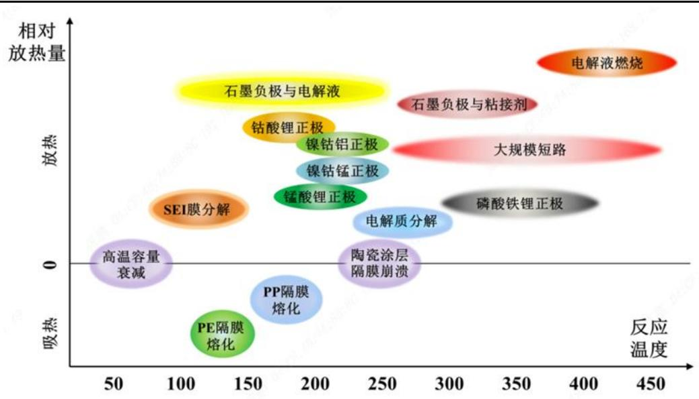  
资料来源：《锂离子电池热失控内部压力测试方法研究》，刘恩宏，五矿证券研究所

电解液对锂枝晶低抑制能力限制负极向锂金属方向迭代。低比重、极低电势、高比容的锂金属负极被视为锂电材料较终极的发展方向。在现有电解液体系中，锂金属负极会和电解液反应生成不稳定的SEI膜，循环过程产生的锂金属体积变化会导致严重的锂枝晶生长，最终刺穿隔膜引发短路。电解液对锂枝晶低抑制能力限制负极向锂金属方向迭代。

图表 3：锂金属负极与电解液的界面反应，金属锂负极的锂枝晶问题  
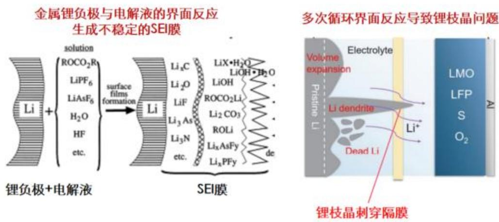  
资料来源：材料人，物理化学学报，五矿证券研究所

# 1.3 固态电池发展机会：锂电池理论上高能量密度+高安全性能的最佳体系

固态电池理论上可抑制、缓和热失控，提升本征安全性。固态电池用固态电解质替代电解液和隔膜，固态电解质高化学/热稳定性、高机械强度、固/固界面的低反应活性可抑制热失控的发生，而非挥发性、非流动性和非可燃性则能减轻热失控发生的危害，理论上可抑制、缓和热失控，提升本征安全性。

图表 4：固态电池与液态电池结构对比图  
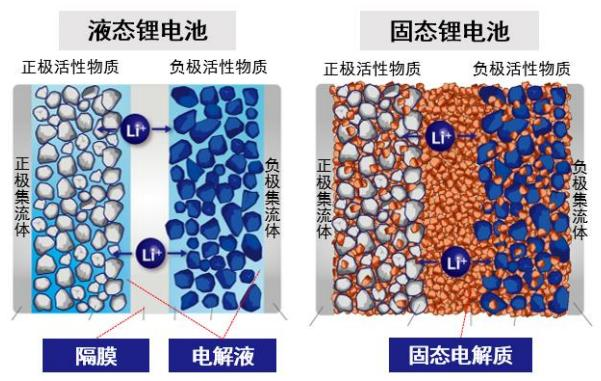  
资料来源：Maxell，五矿证券研究所

图表 5：固态电池在热失控抑制上的理论优势  
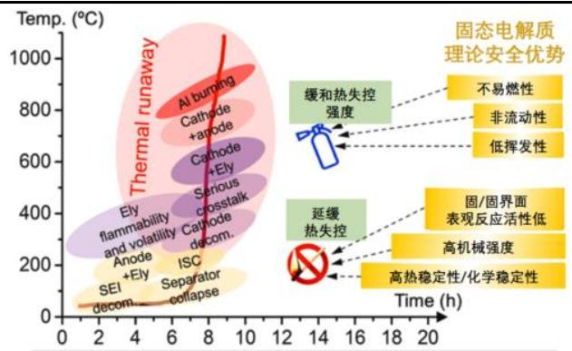  
资料来源：eTransportation，何向明团队，五矿证券研究所

固态电解质理论上抵御锂枝晶能力更强，具备向锂金属负极迭代潜力。固态电解质与锂金属负极界面反应相对弱，具备更高机械模量以抵御锂枝晶生长。从材料体系角度，固态电解质与锂金属负极更高的兼容性为电池材料向高比能迭代提供了更多空间。

图表 6：固态电池应用于锂金属负极的理论优势  
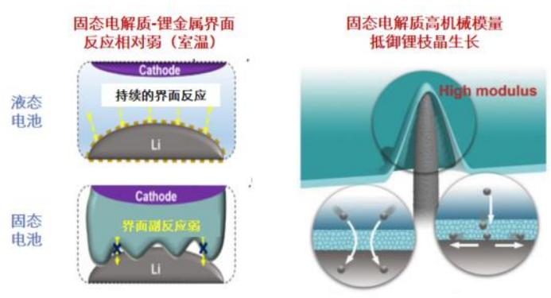  
资料来源：eTransportation，Adv anced Materials，五矿证券研究所

图表 7：锂电池材料体系技术发展路线图  
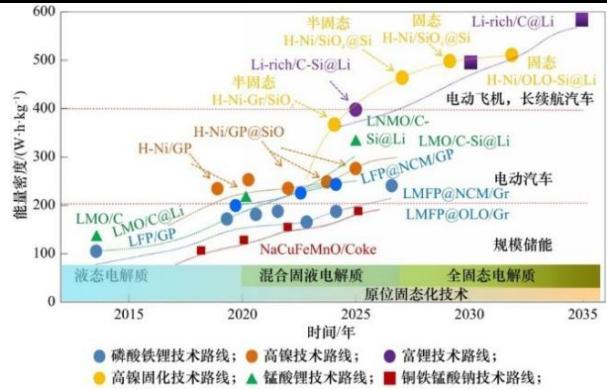  
资料来源：李泓《固态电池关键材料体系发展研究》,中国工程科学，五矿证券研究所

（1）当前液态锂电池体系向高能量密度迭代的矛盾凸显；（2）固态电池在本征安全性和锂金属负极兼容性上表现出较大潜力；（3）固态电解质材料在离子电导率关键性能上已有所突破。基于以上三点，尽管当前固态电池仍存在界面问题、高成本等问题需要解决，我们仍然认为固态电池是锂电池理论上高能量密度和高安全性能的理想体系。在关键材料、技术、工艺完善及下游需求逻辑顺畅后，固态电池有望爆发。

# 2. 全固态电池—— 仍面临界面+成本问题

# 2.1 全固态技术路径

全固态电池采用固态电解质实现对电解液和隔膜的完全替代。根据固态电解质类型的不同，全固态电池主要分为聚合物、氧化物、硫化物三大路线。

聚合物和氧化物路线率先应用。聚合物电解质柔性好、成本低，率先得到应用，但其离子电导率低的劣势明显。氧化物体系稳定性高，但材料脆性会恶化固-固界面的刚性接触，目前多与聚合物固态电解质等复合应用。

硫化物电解质兼具高离子电导率和材料柔性，长期潜力大。离子电导率是电解质的第一材料特性，硫化物固态电解质离子电导率可达到 10-2S/cm量级（与电解液相当），且材料柔性强可改善界面接触，是相对更有潜力的发展路线。但由于不稳定性和电压窗口低，目前仍在研发中。

图表 8：固态电池三种技术路径材料体系&性能优劣分析

<table><tr><td>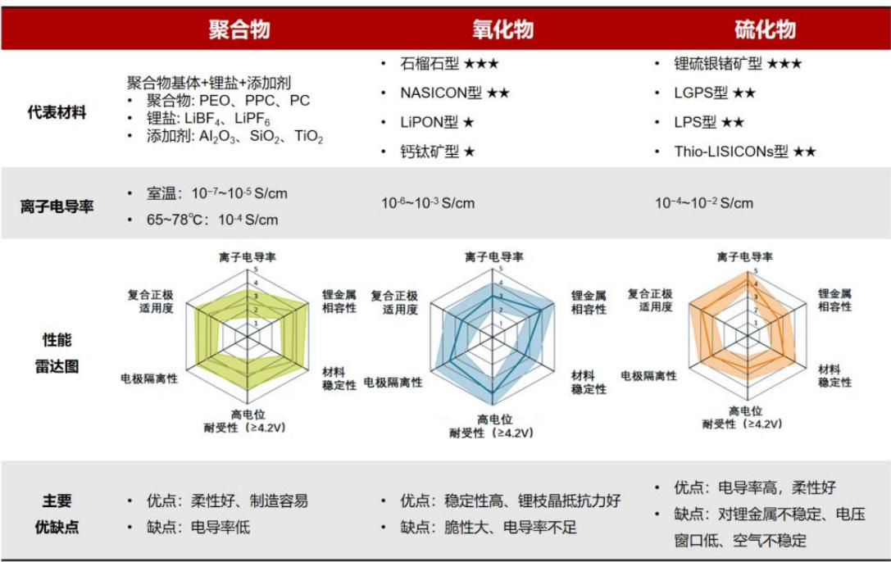</td></tr></table>

资料来源：《Toward better batteries: Solid-statebattery roadmap 2035+》，吴凡，《Solid-State Battery Roadmap 2035+》，Fraunhof er，元能科技， 中科战略新材研究院，五矿证券研究所

# 2.2 全固态电池卡点一：界面问题

界面问题会影响电池性能。全固态电池是用固态电解质对电解液完全替代，这使得正负极与电解质界面由“固-液”的软接触变为“固-固”的硬接触。界面问题的存在会导致：（1）界面电阻高，倍率性能差；（2）界面应力问题，循环性能差；（3）电解质与电极的副反应问题，循环受影响。

界面问题也为全固态的量产制造带来全新挑战。电芯层面，电极与电解质的复合成型、干法电极技术亟待开发；电池系统层面，全固态电池一般需要施加外压以保证循环过程中界面的紧密接触，将带来额外的制造难点。

图表 9：全固态电池产业化的关键点  
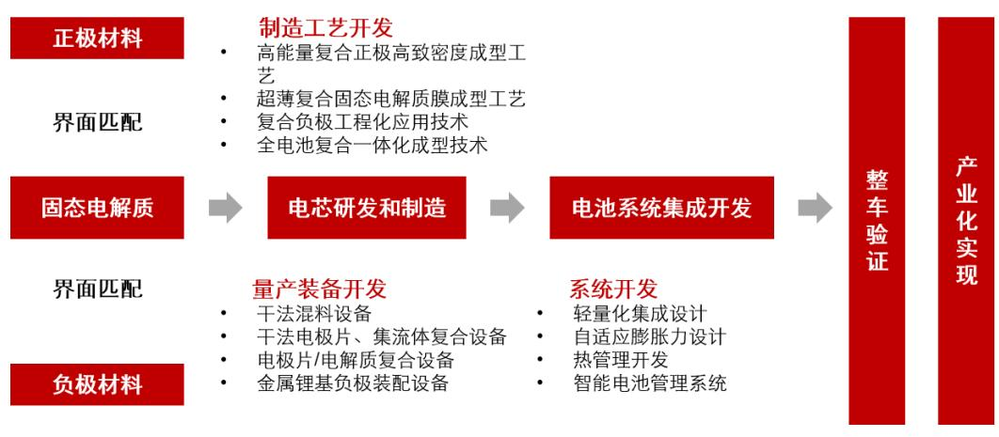  
资料来源：清陶电池，五矿证券研究所

# 2.3 全固态电池卡点二：成本问题

全固态电池关键材料固态电解质当前成本较高。三种路线除聚合物电解质外，氧化物和硫化物固态电解质仍需等待进一步降本。我们对三种路线电解质成本进行测算：

（1） 聚合物固态电解质：测算原材料成本在 1\~2 万元/吨，基本与电解液持平。  
（2） 氧化物固态电解质：LATP 型原材料成本测算约为 2 万元/吨，当前氧化物电解质销售价格约 10\~30 万元/吨，远期降本空间大。LLZO 型由于含有锆、镧等稀有金属和小金属，原材料成本会更高。  
（3） 硫化物固态电解质：目前售价高达数千万元/吨，主要是由于硫化锂前驱体Li2S 在合成工艺上尚未成熟。待前驱体工艺突破和规模化效应显现后，我们测算远期硫化物固态电解质原材料成本有望降至12.3万元/吨。

图表 10：固态电解质成本测算

<table><tr><td>电解质</td><td>原料</td><td>单耗(吨/吨)</td><td>价格(万元/吨)</td><td>单吨成本(万元/吨)</td></tr><tr><td rowspan="4">聚合物PEO</td><td>PEO</td><td>0.84</td><td>0.75</td><td>0.63</td></tr><tr><td>锂盐</td><td>0.16</td><td>5.4</td><td>0.87</td></tr><tr><td></td><td>原材料成本</td><td></td><td>1~2万元/吨</td></tr><tr><td></td><td>当前销售价格</td><td></td><td>/</td></tr><tr><td rowspan="6">氧化物LATP</td><td>磷酸二氢铵</td><td>0.9</td><td>0.55</td><td>0.5</td></tr><tr><td>碳酸锂</td><td>0.13</td><td>7.4</td><td>0.93</td></tr><tr><td>氧化铝</td><td>0.04</td><td>0.4</td><td>0.02</td></tr><tr><td>二氧化钛</td><td>0.35</td><td>1.5</td><td>0.53</td></tr><tr><td></td><td>原材料成本</td><td></td><td>2.0万元/吨</td></tr><tr><td></td><td>当前销售价格</td><td></td><td>约10~30万元/吨</td></tr><tr><td rowspan="5">硫化物LPSCI</td><td>硫化锂</td><td>0.34</td><td>远期27.5</td><td>远期9.5</td></tr><tr><td>五硫化二磷</td><td>0.58</td><td>1</td><td>0.6</td></tr><tr><td>氯化锂</td><td>0.24</td><td>8</td><td>2.3</td></tr><tr><td></td><td>原材料成本</td><td></td><td>远期12.3万元/吨</td></tr><tr><td></td><td>当前销售价格</td><td></td><td>数千万元/吨</td></tr></table>

资料来源：：中国知网，彭林峰《富氯型锂硫银锗矿电解质的合成改性与应用研究》，Energy Adv ances，Jiaxin Zhang，Wind，生意社，高工锂电，CBC 锂电新能源，粉体网，Gangtise，五矿证券研究所测算 注：聚合物按EO:Li摩尔比18:1，锂盐取 LiPF 6，PEO 价格参考环氧乙烷单体价格;氧化物按 Li1.3Al0.3Ti1.7(PO4)3，硫化物按 Li5.5PS4.5Cl1.5 测算，远期硫化锂按金属 锂 9 0 万元/吨测算。价格数据取值时间2024.10

全固态电池制造工艺不成熟，良率仍待进一步改善，带来额外制造成本。全固态电池制造面临的挑战主要在于：（1）全固态电池制造工艺的核心在于电解质与电极的复合成膜，相应制造工艺尚未成熟；（2）全固态的电解质制备和电芯制造过程需要加压，带来额外制造成本；（3）固体电极材料体积膨胀所带来的应力问题也将带来制造难度和良率缺陷。在当前的制造工艺不成熟和良率问题挑战下，全固态电芯成本较高。考虑远期良率改善后，我们预期远期全固态成本为0.69元/Wh。

图表 11：全固态电池制造工艺流程图（干法-锂金属负极）  
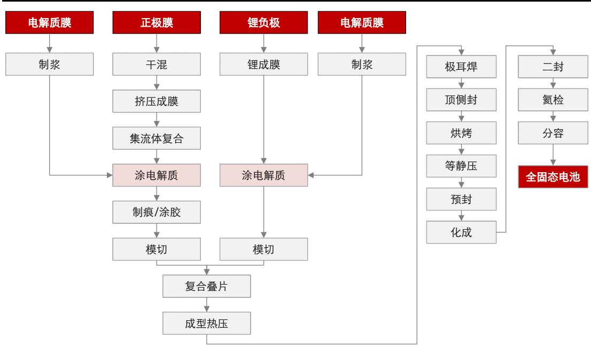  
资料来源：中国固态电池技术大会报告，锂电科学社，五矿证券研究所

图表 12：全固态电芯远期成本测算（硫化物体系）

<table><tr><td>组分</td><td>1GWh 单耗(吨)</td><td>单价(万元/吨)</td><td>成本(元/Wh)</td></tr><tr><td>正极</td><td>1450</td><td>14.2</td><td>0.21</td></tr><tr><td>负极(锂金属)</td><td>90</td><td>88</td><td>0.08</td></tr><tr><td>固态电解质</td><td>1200</td><td>14</td><td>0.17</td></tr><tr><td>铜箔</td><td>550</td><td>8</td><td>0.04</td></tr><tr><td>铝箔</td><td>450</td><td>3.0</td><td>0.01</td></tr><tr><td>其他</td><td></td><td></td><td>0.02</td></tr><tr><td>材料合计</td><td></td><td></td><td>0.53</td></tr><tr><td>制造等成本</td><td></td><td></td><td>0.16</td></tr><tr><td>良品率</td><td></td><td></td><td>100%</td></tr><tr><td>电芯远期成本合计</td><td></td><td></td><td>0.69</td></tr></table>

资料来源：每日经济新闻、FruanHof er《Solid-State Battery Roadmap 2035+》、SMM、wind、五矿证券 研究所测算

\*注： 1）采用高镍正极+金属锂负极测算，假设固态电解质是大规模应用状态；2）锂金属价格是按照 碳酸锂远期12万/吨测算；

3）假设液态电池未来在电解液和固态电解质环节和全固态不一致；4 ）固态电解质按照硫化物体系Li5.5PS4.5Cl1.5 测算，假设价

# 3. 半固态电池—— 本质仍是液态锂离子电池体系

# 3.1 半固态电池技术路径

半固态电池主要变化在电解液，是全固态技术成熟前的折中尝试。依据电解液质量含量不同，电池可细分为液态(25wt%) 、半固态(5-10wt%)、准固态(0-5wt%)和全固态(0wt%)四大类。由于全固态电池界面问题技术难度大，短期难以解决，半固态理念在中国率先展开。半固态案逐步降低电解液含量，同时引入固态电解质，以部分改善安全性能。由于仍有电解液存在，我们认为半固态并非液态到全固态的线性迭代，而是产业化初期的探索方向之一，其发展可以为固态电解质的产业化打好基础，但半固态电池产业逻辑本质还在于相较于液态电池在性能与成本上是否有改善。

图表 13：液态、半固态、全固态技术路径下材料体系变化  
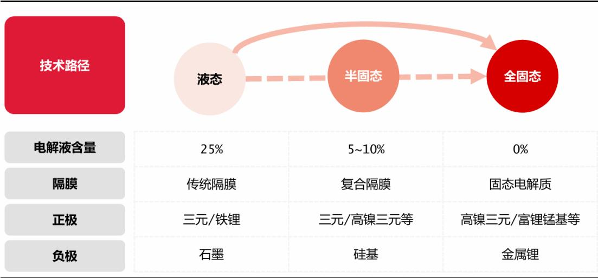  
资料来源：储能头条，五矿证券研究所

# 目前半固态主要方案包括：极片固态化、隔膜涂覆、原位聚合等。

（1） 极片固态化：正负极包覆固态电解质，是利用固态电解质对正负极进行孔隙填充和表面修饰的方案，将原本渗入多孔电极孔隙的电解液替代为固态电解质进行传导，以减少电解液的用量，部分提高电池安全性能。极片固态化技术关键点在于改善固态电解质离子电导率，固态电解质纳米化等。  
（2） 隔膜涂覆：是利用固态电解质离子传导、电子绝缘特性，将固态电解质涂覆于隔膜基膜复合使用的方案，可以减少电解液用量、提升安全性能，相较氧化铝涂覆可改善电解液与隔膜的浸润性。目前LATP 氧化物电解质涂覆隔膜应用较多，固态电解质要求纳米级。

图表 14：极片固态化示意图  
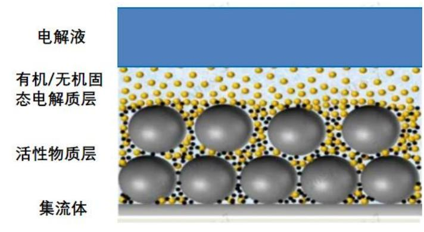  
资料来源：中科院苏州纳米研究所，先进电池材料，五矿证券研究所

图表 15：隔膜涂覆固态电解质示意图（LATP）  
(a)   
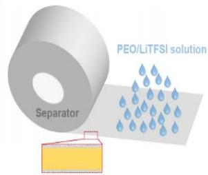

(b)   
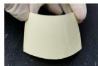  
（c）

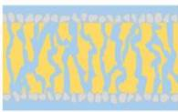  
资料来源：中科院国家纳米科学中心，深水科技咨询，金研会，五矿证券研究所

（3） 原位聚合：是将聚合物单体、交联剂、引发剂以及液态电解质混合，注入电池、真空焊封后，通过加热或UV 辐照聚合形成凝胶固态电解质网络的方案。由于还保留了部分电解液，充分浸润使凝胶与电极和隔膜能紧密接触，可减少界面阻抗。原位聚合技术关键点在于电解质的组成（包括液态电解液的配方，引发剂交联剂的结构设计），工艺流程中固化、化成工艺的工艺参数和工艺顺序等。

图表 16：原位聚合技术制备半固态电池  
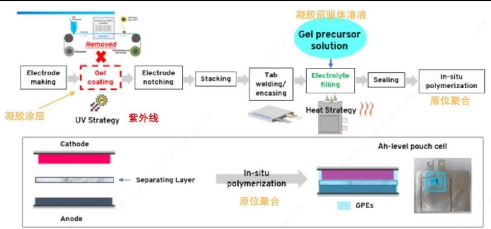  
资料来源：通用汽车，先进电池材料，五矿证券研究所

# 3.2 半固态 VS 液态：性能和成本对比，半固态短期未占优

安全性能方面，液态电池热蔓延控制技术进步明显，半固态电池的安全优势有待进一步验证。

（1） 电芯产品层面：近年来，液态电池通过本征安全+主动被动的安全措施，在热蔓延控制技术进步明显。除了从电芯材料层面提高本征热安全性外，电池包系统层面的泄压阀设计，电池包层级的热隔断、主动热管理，乘客舱层级的上盖防火毯、预警装置等措施近年来不断升级，可降低热失控后的热蔓延风险。以宁德时代为例，使用 NP2.0技术的电池在热失控时的峰值温度与 NP1.0 技术的峰值温度降低了 270℃。宁德时代23年初量产了NP 2.0技术，新的NP 3.0等技术更强大。

图表 17：电池的安全分类形式  
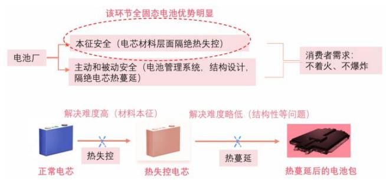  
资料来源：《动力电池热失控抑制研究进展》，白莹，五矿证券研究所

图表 18：宁德时代 NP 控制技术  
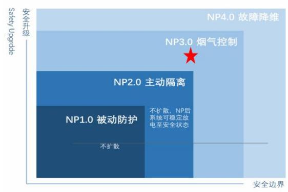  
资料来源：宁德时代，五矿证券研究所

（2） 电池标准层面，液态电池安全性仍有提升预期。2024年《电动汽车用动力蓄电池安全要求征求意见稿》相比21年版本在安全性标准上进步较大，几个重要的变化在于：①要求针刺或加热等热扩散试验后整个电池包不着火、不爆炸，该要求是首次被提出。②要求单个电芯热失控后试验环境之下保持两个小时，电池包温度不超过 60℃。③逃生时间方面，上一代国标要求单个电池热失控 5 分钟之内要有报警信号，这一代还要求后续 5 分钟内无可见烟气进入乘员舱。该意见稿由电池厂主要参与，后续预期液态电池安全性仍有明显提升空间。

图表 19：2024 年《电动汽车用动力蓄电池安全要求征求意见稿》相比 21年版本在安全性标准上进步较大  
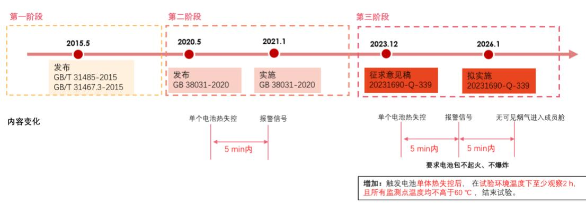  
资料来源：全国标准信息公共服务平台，五矿证券研究所

（3） 学术论文层面，半固态并非是改善热安全性唯一方式，勃姆石涂覆、电解液改性等方式均可改善电池热安全性。根据学术论文《High-Voltage and High-Safety PracticalLithium Batteries with Ethylene Carbonate-Free Electrolyte》，LATP 氧化物电解质隔膜涂覆半固态相比勃姆石隔膜涂覆的液态电池在热失控温度上提升了 15 度左右（从 147 度提到 162 度）。除了隔膜涂覆方式外，学术论文《Improving the Safetyof HED LIBs by Co-Coating Separators with Ceramics and Solid-State Electrolytes》中，在进行无 EC 电解液改性后，也可以将电池热失控温度从 196 度提到 260 度，提升幅度大。这意味着半固态电池的涂覆并非是改善热安全性唯一方式。

图表 20：LATP+勃姆石涂覆在实验中可以提升热失控温度  
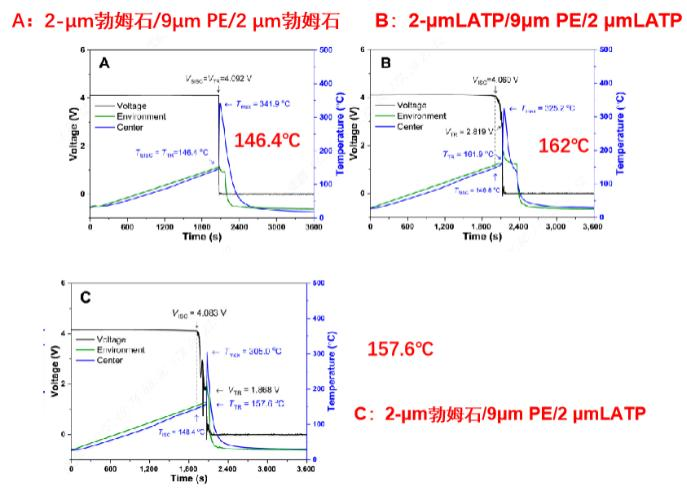  
资料来源：《High-Voltage and High-Saf ety Practical Lithium Batteries with Ethy leneCarbonate-Free Electroly te》，Yu Wu，五矿证券研究所

图表 21：无 EC的电解液将 10Ah 高镍811电芯的热失控触发温度提高  
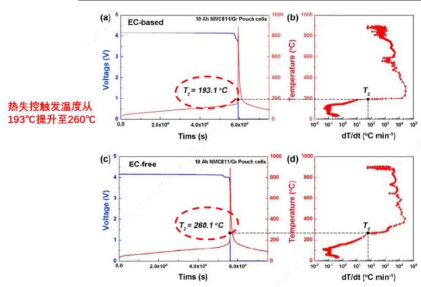  
资料来源：《Improv ing the Saf ety of HED LIBs by Co-Coating Separators with Ceramics and Solid-State Electroly tes》，TianHang Zhang，五矿证券研究所（a/ b 是采用EC，c/d是不采用EC 电解液的体系）

经济性、性能、制造综合比对，整体来看，半固态用更高成本、并牺牲部分倍率性能，换取一定安全性提升。

以 LATP 隔膜涂覆半固态电池为例，相比液态电池勃姆石涂覆，LATP 在短期经济性、工艺良率不占优，性能有优有劣；远期优势不够明显。半固态当前受制于良品率等因素成本较高，长期和勃姆石涂覆的液态电池处于同一水平。从性能、经济性、工艺等条件对比，以 LATP隔膜涂覆为代表的半固态电池在经济性和性能上相比液态电池隔膜涂覆尚未明显占优。

图表 22：半固态电池中LATP的使用在经济性和性能等上相比液态电池隔膜涂覆并不明显占优

<table><tr><td rowspan="2"></td><td colspan="4">液态体系</td><td colspan="3">半固态体系</td></tr><tr><td>单位</td><td>隔膜-勃姆石</td><td>隔膜-PVDF</td><td>隔膜-芳纶(当前)</td><td>隔膜-LATP当前</td><td>隔膜-LATP大规模</td><td>隔膜-LATP远期</td></tr><tr><td colspan="8">经济性对比</td></tr><tr><td>假设无涂覆电芯成本</td><td>元/wh</td><td>0.4</td><td>0.4</td><td>0.4</td><td>0.4</td><td>0.4</td><td>0.4</td></tr><tr><td>电芯成本理论提升幅度</td><td></td><td>1.3%</td><td>2.2%</td><td>9.0%</td><td>7.8%</td><td>2.5%</td><td>1.7%</td></tr><tr><td>电芯成本实际</td><td>元/wh</td><td></td><td></td><td></td><td>0.57</td><td>0.43</td><td>0.41</td></tr><tr><td>电芯成本实际提升幅度</td><td></td><td></td><td></td><td></td><td>43.7%</td><td>7.9%</td><td>1.7%</td></tr><tr><td colspan="8">性能对比</td></tr><tr><td>相比勃姆石T2提升幅度</td><td>°C</td><td>0</td><td>/</td><td>大于0*</td><td>10到15</td><td>10到15</td><td>10到15</td></tr><tr><td>减重</td><td></td><td></td><td>/</td><td></td><td></td><td>/</td><td></td></tr><tr><td>倍率性能</td><td></td><td></td><td>较好</td><td></td><td></td><td>一般</td><td></td></tr><tr><td colspan="8">工艺制造对比</td></tr><tr><td>涂覆工艺</td><td></td><td colspan="3">良品率高,涂布的速度为70-80米/min</td><td colspan="3">当前良品率低,涂布的速度不到液态的10分之一</td></tr></table>

资料来源：《High-Voltage and High-Saf ety Practical Lithium Batteries with Ethy lene Carbonate-Free Electroly te》、易车、远川、澎湃、同花顺、wind、中国塑料加工工业 协会、SMM、蓝科途、五矿证券研究所测算

# 3.3 全固态 VS 半固态VS 液态：性能和成本对比

从性能、经济性、工艺等条件对比，全固态电池远期性能潜力大。全固态电池适合对安全性和能量密度需求大的领域，是对现有高能量密度体系的升级方案。其牺牲了少部分性能，用更高成本换取了本征高安全性，且能量密度上限更大，是锂电池长期发展方向之一。

图表 23：全固态电池是长期方向之一

<table><tr><td></td><td>单位</td><td>全固态(硫化物)</td><td>半固态(氧化物)</td><td>液态(勃姆石涂覆)</td></tr><tr><td>成本(远期)</td><td>元/wh</td><td>0.69</td><td>0.52</td><td>0.51</td></tr><tr><td>成本(中短期)</td><td></td><td>很贵</td><td>贵</td><td>便宜</td></tr><tr><td colspan="5">性能</td></tr><tr><td>安全性</td><td></td><td>本征安全性高</td><td>本征安全略提升</td><td>/</td></tr><tr><td>电芯体积能量密度</td><td></td><td>提升约20%</td><td>/</td><td>/</td></tr><tr><td>电芯质量能量密度</td><td></td><td>提升空间大</td><td>/</td><td>/</td></tr><tr><td>稳定性等</td><td></td><td>/</td><td>/</td><td>/</td></tr><tr><td>倍率性</td><td></td><td>一般</td><td>一般</td><td>好</td></tr><tr><td colspan="5">制造</td></tr><tr><td></td><td></td><td>通过内串简化制造,提升效率</td><td>/</td><td>/</td></tr><tr><td></td><td></td><td>界面稳定性等难以处理</td><td>制造相对复杂</td><td>/</td></tr></table>

资料来源：每日经济新闻、《Solid-State Battery Roadmap 2035+》、SMM、wind、芝能汽车、江西广播电视台、五矿证券 研究所测算 备注：1）标绿的是相比液态的劣势，标红的是优势，颜色深代表程度大。2）全固态硫化物体系按照 Li5.5PS4.5Cl1. 5+金属锂负极+高镍正极；半固态采用氧化物固态电解质+硅负极+ 高镍正极。3）\*考虑实际良品率，未来半固态成本可能比理论的高 ；4）远期是指完全大规模化后；5）体积能量密度是只考虑固态电解质相比液态的变化，为粗算值。

# 4. 固态电池产业进程

# 4.1 固态电池企业技术路线

固态电池赛道涌入玩家众多，不同企业在技术路线选择上各不相同。

（1） 全固态/半固态的选择：中国、美国企业优先布局半固态，逐步过渡至全固态。清陶能源、卫蓝新能源、赣锋锂电等中国企业率先开启半固态的量产装车。日韩企业选择直接进行全固态研发。  
（2） 电解质路线的选择：目前半固态电池多选用氧化物和聚合物或两者复合的路线，全固态电池多采用硫化物路线。  
（3） 正负极材料的选择：正极材料方面，三元材料（尤其是高镍三元）是现阶段固态电池企业的主流选择。负极材料方面，以硅基负极为提高能量密度手段，长期转向锂金属负极。

图表 24：主要固态电池企业主要产品技术路线&产业化现状汇总

<table><tr><td>企业</td><td>电池类型</td><td>电解质</td><td>正极</td><td>负极</td><td>阶段</td><td>应用情况</td></tr><tr><td>清陶能源</td><td>半固态</td><td>氧化物+聚合物/卤化物复合</td><td>高镍三元</td><td>预锂硅氧</td><td>已量产</td><td>智己 L6 装车</td></tr><tr><td>辉能科技</td><td>半固态</td><td>氧化物</td><td>NCM811</td><td>预锂硅氧</td><td>已量产</td><td>奔驰合作</td></tr><tr><td>卫蓝新能源</td><td>半固态</td><td>氧化物+聚合物</td><td>NCM/LFP</td><td>预锂硅氧</td><td>已量产</td><td>蔚来装车</td></tr><tr><td>赣锋锂电</td><td>半固态</td><td>氧化物</td><td>高镍三元</td><td>石墨</td><td>已量产</td><td>东风 E70 装车赛力斯SERES-5 装车</td></tr><tr><td>宁德时代</td><td>全固态</td><td>硫化物</td><td>/</td><td>/</td><td>20Ah 试生产</td><td>/</td></tr><tr><td>鹏辉能源</td><td>全固态</td><td>氧化物复合</td><td>/</td><td>/</td><td>研发中</td><td></td></tr><tr><td>Solid Power</td><td>全固态</td><td>硫化物</td><td>NCM811</td><td>高硅负极</td><td>A 样验证</td><td>交付宝马</td></tr><tr><td>Quantum Scape</td><td>半固态</td><td>陶瓷电解质+部分正极电解液</td><td>NCM</td><td>无负极,充电后为锂金属</td><td>A 样验证</td><td>交付大众</td></tr><tr><td>SES</td><td>半固态</td><td>聚合物电解质+高浓度锂盐电解</td><td>高镍三元/LFP</td><td>锂金属</td><td>A 样量产B 样验证</td><td>本田、现代、通用合作</td></tr></table>

液 

<table><tr><td rowspan="2">Factorial Energy</td><td>半固态</td><td>FEST(自研)</td><td>/</td><td>锂金属</td><td>B样验证</td><td>奔驰合作</td></tr><tr><td>全固态</td><td>硫化物</td><td>/</td><td>/</td><td>A样验证</td><td>奔驰合作</td></tr><tr><td>丰田</td><td>全固态</td><td>硫化物</td><td>/</td><td>/</td><td>研发中</td><td></td></tr><tr><td>三星SDI</td><td>全固态</td><td>硫化物</td><td>NCA</td><td>无负极</td><td>研发中</td><td></td></tr><tr><td>SK On</td><td>全固态</td><td>硫化物/氧化物</td><td>/</td><td>/</td><td>研发中</td><td></td></tr><tr><td>LG</td><td>全固态</td><td>硫化物</td><td>NCM811</td><td>硅负极</td><td>研发中</td><td></td></tr></table>

资料来源：北极星电力网，集邦新能源网，36氪，新华财经，固态电池SSB，中国储能网，N E时代，集邦固态电池，光源资本，读创，盖世汽车，澎湃新闻，SolidPower，BMW，Quantumscape，大众，SES AI，新能源情报局，旺材锂电，电池中国，维科网锂电， 固态电池前沿，粉体网，五矿证券研究所整理

# 4.2 固态电池研发现状：从产品研发流程角度

# 电池新产品开发过程通常会经历“Pre-A样、A样、B样、C样、D样、发布”等几个阶段。

研发流程实际上是多次原型方案设计-测试验证的循环，整个过程需要充分考虑化学体系和电池结构、电池性能表现、生产工艺可行性和成本等各方面因素，考察新产品是否满足了客户对于安全性、能量密度、功率等方面的需求。电池公司在研发流程具备共性，以宁德时代和固态电池厂商Solid Power为例，其电池研发阶段划分和决策考虑基本一致。

电池新品在商业化发展早期需要预留较长开发时间。锂电池未达彻底商业爆发时，根据电池中国，宁德时代曾在2019 年度业绩交流会表示：“在国际市场，从和客户联合开发产品 A、B、C样到量产一般经历36\~48 个月不等，而客户一般而言在第二样品阶段时开始定点。”从 SolidPower 公开的固态电池产品研发规划来看，其预留的从 A 样到量产的研发周期至少在 48\~54 个月。

图表 25：典型电池厂商研发流程图  
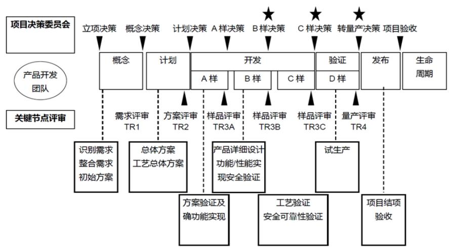  
资料来源：36氪，五矿证券研究所

图表 26：SolidPow er 固态电池研发流程

<table><tr><td>阶段</td><td>目标</td><td>说明</td><td>电芯规格</td><td>调整时间</td></tr><tr><td>Pre-A样</td><td>原型方案设计</td><td>设计电芯样品,证明可以满足产品基本功能需求</td><td>0.2Ah, 2Ah, 20Ah</td><td>根据研发进展</td></tr><tr><td>A样</td><td>电芯概念验证</td><td>原型电池设计开发,基于客户需求评估多种设计方案;供应商测试及筛选</td><td>EV规格</td><td>最短12个月</td></tr><tr><td>B样</td><td>电芯设计验证</td><td>电芯设计敲定;试验线生产样品;确保电芯表现满足客户需求;模组和PACK测试验证</td><td>EV规格</td><td>最短12~18个月</td></tr><tr><td>C样</td><td>电芯工艺验证</td><td>制造工艺敲定;确保电芯生产良率达到客户要求;继续PACK测试并进行原型车集成</td><td>EV规格</td><td>应予保留12个月适配</td></tr><tr><td>D样</td><td>电芯产品验证</td><td>确认完整的电芯批量生产能力;装车测试</td><td>EV规格</td><td>应予保留12个月磨合期</td></tr><tr><td>量产销售</td><td>销售产品</td><td>向客户批量出售产品</td><td>EV规格</td><td></td></tr></table>

资料来源：SolidPower，五矿证券研究所

产品规格方面，从实验室到试生产对电芯规格提出一定要求。以 SolidPower 为例，在 Pre-A 样品研发阶段，电芯规格从单层 0.2Ah 的模具电池逐步演变为 22 层 20Ah 的软包电池，并发展为 100AhEV 规格软包电池后进入 A 样测试。宁德时代近期进入试生产的全固态电池样品为 20Ah 软包电芯。

图表 27：SolidPow er 公布的Pre-A 原型设计阶段电芯演变历程  
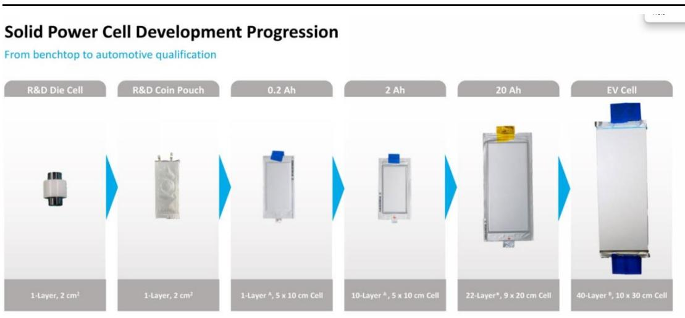  
资料来源：SolidPower，五矿证券研究所

半固态进入量产阶段，全固态处于 A样阶段。总结各主要企业固态电池产品开发情况，目前清陶、卫蓝等半固态电池企业已进入量产阶段，全固态多处于研发和送样阶段，进展较快的Factorial Energy、SolidPower 和宁德时代进入 A 样阶段。

图表 28：各企业固态电池产品所处研发阶段  
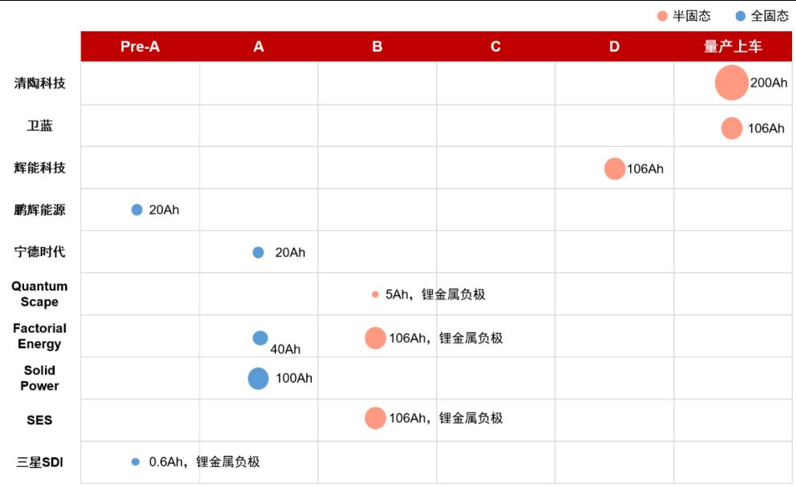  
资料来源：请陶发展，NE 时代新能源，DT 新材料，晚点 Auto，QuantumScape，SESAI，中国能源报，五矿证券研究所

# 4.3 固态电池产业规划：半固态装车不及预期，全固态预计2030年后量产

（1）产能布局：固态电池产能总规划超565.7GWh，已建成产能约 28.3GWh，建成产能主要来自中国半固态电池企业。  
（2）装车情况：已宣布装车量产的为清陶-智己、卫蓝-蔚来、赣锋-东风、赣锋-赛力斯，半固态电池率先进入装车量产阶段，但从实际车型销售情况来看，装车进展不及预期。  
（3）量产节奏：半固态已具备量产能力，但在在性能成本上的优势有待进一步验证。全固态电池厂商宣布的量产时间集中在 2027\~2028 年，但考虑全固态电池界面问题突破难度高，且全固态主流的硫化物路线在锂金属稳定性和成本上卡点仍较明显，预计量产延迟至 2030年后。

图表 29：各企业固态电池量产规划  
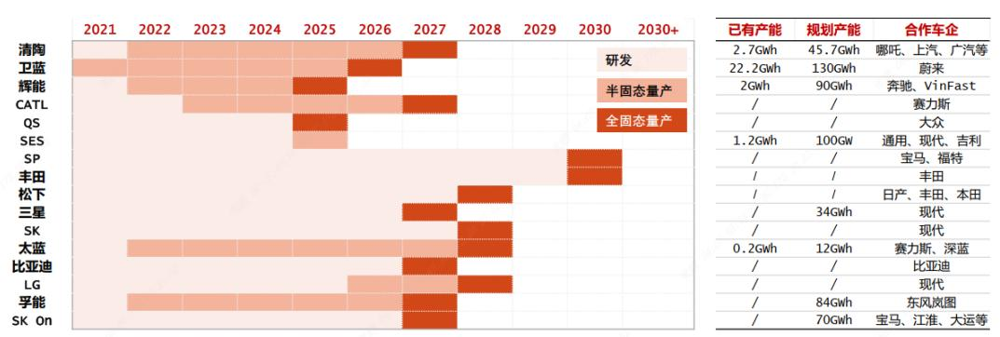  
资料来源：EV tank，五矿证券研究所  
注：截止2024年6月的统计

# 5. 固态电池对产业链的影响分析

# 5.1 固态电池对电池材料体系的影响

# （1）正极材料：向高电压、高压实升级，中短期高镍三元是主要增量

固态电池追求高能量密度，预计正极材料向高镍三元正极、富锂锰基正极、LMNO 正极、高电压钴酸锂正极、无锂正极等方向迭代。其中高镍三元正极材料发展较为成熟，预计是中短期主要增量。制造工艺上，是趋向高压实技术以提升体积能量密度。

# （2）负极材料：向高克容量升级，中短期硅碳负极为主要增量，长期转向锂金属负极

硅具备 4200mAh/g 克容，是提升电池能量密度的优选材料。但由于硅材料的高膨胀性，目前主要以硅碳负极掺混石墨的形式使用，将是中短期主要增量，目前已发展至第三代 CV D 气相硅碳。锂金属具备 3860mAh/g 克容和-3.04V 极低电势，是负极材料的理想方向，但锂金属负极面临锂枝晶问题和体积变化问题，现阶段研究方向之一是锂复合负极，以改善离子电导率。

# （3）固态电解质：固态电池带来从 0-1的增量

半固态隔膜涂覆、原位聚合、极片固化等技术中，固态电解质以氧化物和聚合物体系为主。全固态以硫化物体系为主。

# （4）隔膜：半固态带来部分固态电解质隔膜增量，但后续将取消隔膜使用

半固态隔膜涂覆技术使用固态电解质涂覆后的复合隔膜，短期将为复合隔膜带来一定增量。但考虑现阶段部分厂商已推出无隔膜半固态电池，远期全固态也将取消隔膜使用，预计固态电池技术仍将对隔膜造成部分冲击。

# （5）电解液：用量减少

根据固态电池定义，半固态电池中电解液含量将降低至<10wt%，全固态电池将不含电解液。

# （6）辅材：粘结剂、碳纳米管导电剂、LiTFSI/LiFSI 添加剂有所变化

粘结剂方面，干法工艺可能成为固态电池潜在方案，干法纤维化粘结剂聚四氟乙烯（P TFE）等或将产生增量；导电剂方面，固态电池界面抗阻提升，导电剂可能由传统炭黑升级为单壁/多壁碳纳米管、石墨烯等新材料；添加剂方面，半固态原位聚合工艺中需要使用新型锂盐LiTFSI/LiFSI 等作为添加剂。

图表 30：固态电池关键材料体系发展图  
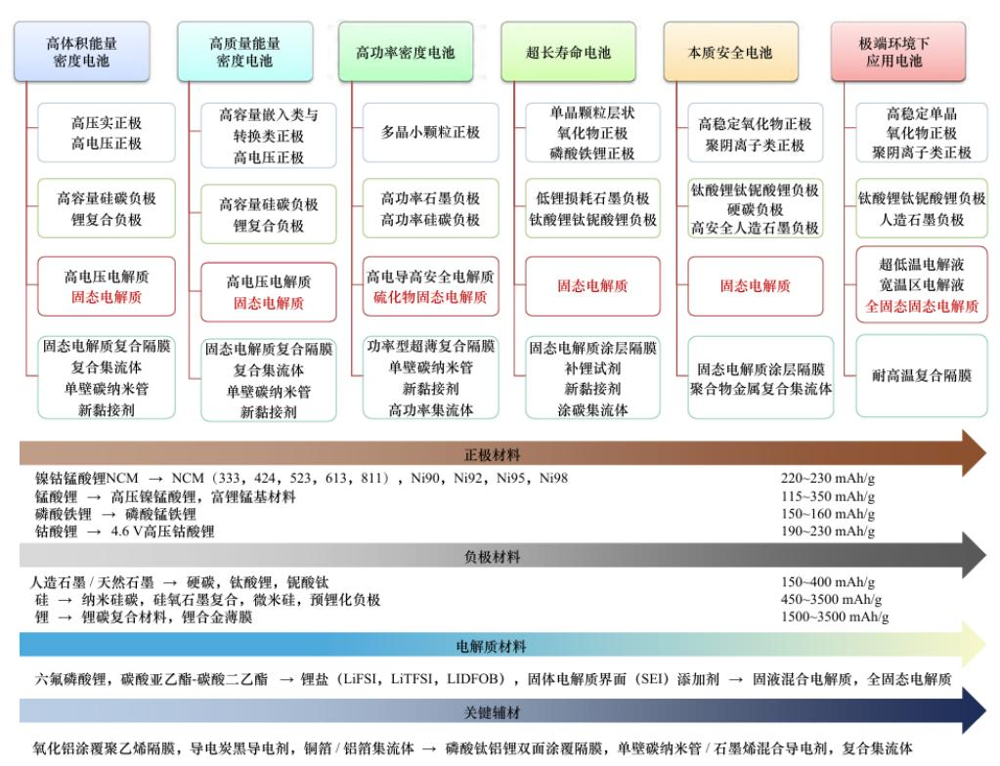  
资料来源：《固态电池关键材料体系发展研究》，李泓，陈立泉，五矿证券研究所

# 5.2 固态电池对上游资源的影响

固态电池的出货量有望逐步带动上游原材料的需求。锂电池的兴起带动了碳酸锂的行情，三元电池的兴起带动了上游钴的行情。未来固态电池的渗透率的提升对于上游的原材料也有一定的影响。

电解质层面：从常见的氧化物固态电解质 LLZO、LATP 等可以看出，有望对锆、镧、钛等金属形成一定的影响。按照100Gwh电池量，半固态和全固态下对固态电解质的消耗量级不同，以LLZO为例，100Gwh半固态电池预计消耗约0.58 万吨氧化镧，在全固态下需要约 5. 8 万吨氧化镧；100Gwh半固态电池预计消耗约 0.29 万吨氧化锆，在全固态下需要约 2.9 万吨氧化锆。

图表 31：100GWh 固态电池中固态电解质对应的原材料消耗-吨  
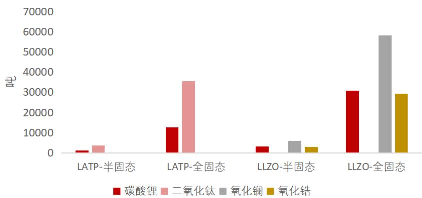  
资料来源：中国知网，王佳骏《石榴石型固态电解质Li7La3Zr2O12的研究进展》，嵇晨豪《纤维素纳米纤维和 LATP 修饰 的 PEO固体电解质的制备及其性能研究》，五矿证券研究所测算  
\*注：假设半固态按照1gwh电池需要 100 吨的LLZO 或LATP 等电解质为例；全固态假设1gwh 是1000吨

①钛：全球钛矿下游需求主要是钛白粉（白色颜料和功能性材料，主要成分为二氧化钛）、海绵钛等。

图表 32：钛产业链示意图  
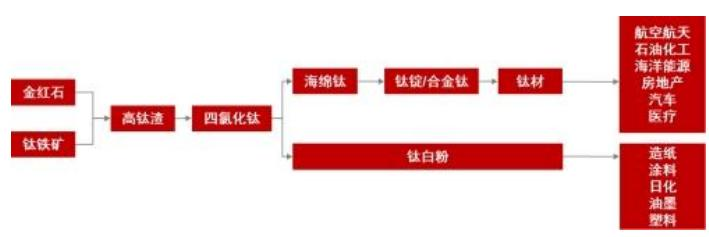  
资料来源：华经情报网、五矿证券研究所

图表 33：2019 年全球主要产锆国家锆精矿产量（万吨）  
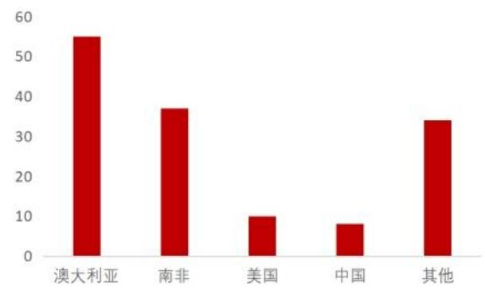  
资料来源：华经情报网、五矿证券研究所

②镧：氧化物固态电解质LLZO的原材料包括镧元素，属于稀土元素。2022年全球稀土产量为30万吨，同比增长3.4%。其中，中国稀土产量达21万吨，同比增长25%。对于氧化镧，根据中国稀土行业协会数据统计，截止到 2020 年，中国高纯氧化镧的年产量大约在 2.5 万吨左右，占据了全球高纯氧化镧产量的 80%以上。

③锆：氧化物固态电解质LLZO的原材料包括锆元素，据华经情报统计，2019年全球生产锆矿物精矿约为148万吨（以 ZrO2计），澳大利亚是生产锆精矿最多的国家，2019 年生产锆精矿55万吨，而我国生产锆精矿 8万吨，占世界总资源的5.4%。

# 风险提示

1. 全固态电池界面问题技术突破、干法工艺等进展不及预期；  
2. 半固态电池在安全性、经济性上优势短期难以验证；  
3. 固态电池下游需求情况不及预期。

# 分析师声明

作者在中国证券业协会登记为证券投资咨询(分析师)，以勤勉的职业态度，独立、客观地出具本报告。作者保证：（i）本报告所采用的数据均来自合规渠道；（ii）本报告分析逻辑基于作者的职业理解，并清晰准确地反映了作者的研究观点；（iii）本报告结论不受任何第三方的授意或影响；（iv）不存在任何利益冲突；（v）英文版翻译若与中文版有所歧义，以中文版报告为准；特此声明。

投资评级说明

<table><tr><td rowspan="9">投资建议的评级标准报告中投资建议所涉及的评级分为股票评级和行业评级(另有说明的除外)。评级标准为报告发布日后6到12个月内的相对市场表现,也即:以报告发布日后的6到12个月内的公司股价(或行业指数)相对同期相关证券市场代表性指数的涨跌幅作为基准。其中:A股市场以沪深300指数为基准;香港市场以恒生指数为基准;美国市场以纳斯达克综合指数或标普500指数为基准。</td><td></td><td>评级</td><td>说明</td></tr><tr><td rowspan="5">股票评级</td><td>买入</td><td>预期个股相对同期相关证券市场代表性指数的回报在20%及以上;</td></tr><tr><td>增持</td><td>预期个股相对同期相关证券市场代表性指数的回报介于5%~20%之间;</td></tr><tr><td>持有</td><td>预期个股相对同期相关证券市场代表性指数的回报介于-10%~5%之间;</td></tr><tr><td>卖出</td><td>预期个股相对同期相关证券市场代表性指数的回报在-10%及以下;</td></tr><tr><td>无评级</td><td>预期对于个股未来6个月市场表现与基准指数相比无明确观点。</td></tr><tr><td rowspan="3">行业评级</td><td>看好</td><td>预期行业整体回报高于基准指数整体水平10%以上;</td></tr><tr><td>中性</td><td>预期行业整体回报介于基准指数整体水平-10%~10%之间;</td></tr><tr><td>看淡</td><td>预期行业整体回报低于基准指数整体水平-10%以下。</td></tr></table>

# 一般声明

五矿证券有限公司（以下简称“本公司”）具有中国证监会批复的证券投资咨询业务资格。本公司不会因接收人收到本报告即视其为客户，本报告仅在相关法律许可的情况下发放，并仅为提供信息而发放，概不构成任何广告。本报告的版权仅为本公司所有，未经本公司书面许可，任何机构和个人不得以任何形式对本研究报告的任何部分以任何方式制作任何形式的翻版、复制或再次分发给任何其他人。如引用须联络五矿证券研究所获得许可后，再注明出处为五矿证券研究所，且不得对本报告进行有悖原意的删节和修改。在刊载或者转发本证券研究报告或者摘要的同时，也应注明本报告的发布人和发布日期及提示使用证券研究报告的风险。若未经授权刊载或者转发本报告的，本公司将保留向其追究法律责任的权利。若本公司以外的其他机构（以下简称“该机构”）发送本报告，则由该机构独自为此发送行为负责。

本报告所载的资料、意见及推测仅反映本公司于发布本报告当日的判断，本报告所指的证券或投资标的的价格、价值及投资收入或将产生波动；在不同时期，本公司可发出与本报告所载资料、意见及推测不一致的报告；本公司不保证本报告所含信息保持在最新状态。同时，本公司对本报告所含信息可在不发出通知的情形下做出修改，投资者应当自行关注相应的更新或修改。

本报告的作者是基于独立、客观、公正和审慎的原则制作本研究报告。本报告的信息均来源于公开资料，本公司对这些信息的准确性和完整性不作任何保证，也不保证所包含信息和建议不发生任何变更。本公司已力求报告内容的客观、公正，但文中的观点、结论和建议仅供参考，不包含作者对证券价格涨跌或市场走势的确定性判断。在任何情况下，报告中的信息或意见不构成对任何人的投资建议，投资者据此做出的任何投资决策与本公司和作者无关。在任何情况下，本公司、本公司员工或者关联机构不承诺投资者一定获利，不与投资者分享投资收益，也不对任何人因使用本报告中的任何内容所引致的任何损失负任何责任。本公司及作者在自身所知情范围内，与本报告中所评价或推荐的证券不存在法律法规要求披露或采取限制、静默措施的利益冲突。

五矿证券版权所有。保留一切权利。

# 特别声明

在法律许可的情况下，五矿证券可能会持有本报告中提及公司所发行的证券并进行交易，也可能为这些公司提供或争取提供投资银行、财务顾问和金融产品等各种金融服务。因此，投资者应当考虑到五矿证券及/或其相关人员可能存在影响本报告观点客观性的潜在利益冲突，投资者请勿将本报告视为投资或其他决定的唯一参考依据。

联系我们

<table><tr><td>上海</td><td>深圳</td><td>北京</td></tr><tr><td>地址:上海市浦东新区陆家嘴街道富城路99号震旦国际大厦30楼邮编:200120</td><td>地址:深圳市南山区滨海大道3165号五矿金融大厦23层邮编:518035</td><td>地址:北京市东城区朝阳门北大街3号五矿广场C座3F邮编:100010</td></tr></table>

# Analyst Certification

The research analyst is primarily responsible for the content of this report, in w hole or in part. The analyst has the Securities Investment Advisory Certification granted by the Securities Association of China. Besides, the analyst independently and objectively issues this report holding a diligent attitude. We hereby declare that (1) all the data used herein is gathered from legitimate sources; (2) the research is based on analyst’s professional understanding, and accurately reflects his/her views; (3) the analyst has not been placed under any undue influence or intervention from a third party in compiling this report; (4) there is no conf lict of interest; (5) in case of ambiguity due to the translation of the report, the original version in Chinese shall prevail.

Investment Rating Definitions 

<table><tr><td rowspan="9">The rating criteria of investment recommendationsThe ratings contained herein are classified into company ratings and sector ratings (unless otherwise stated). The rating criteria is the relative market performance between 6 and 12 months after the report&#x27;s date of issue, i.e. based on the range of rise and fall of the company&#x27;s stock price (or industry index) compared to the benchmark index. Specifically, the CSI 300 Index is the benchmark index of the A-share market. The Hang Seng Index is the benchmark index of the HK market. The NASDAQ Composite Index or the S&amp;P 500 Index is the benchmark index of the U.S. market.</td><td></td><td>Ratings</td><td>Definitions</td></tr><tr><td rowspan="5">Company Ratings</td><td>BUY</td><td>Stock return is expected to outperform the benchmark index by more than 20%;</td></tr><tr><td>ACCUMULATE</td><td>Stock relative performance is expected to range between 5% and 20%;</td></tr><tr><td>HOLD</td><td>Stock relative performance is expected to range between -10% and 5%;</td></tr><tr><td>SELL</td><td>Stock return is expected to underperform the benchmark index by more than 10%;</td></tr><tr><td>NOT RATED</td><td>No clear view of the stock relative performance over the next 6 months.</td></tr><tr><td rowspan="3">Sector Ratings</td><td>POSITIVE</td><td>Overall sector return is expected to outperform the benchmark index by more than 10%;</td></tr><tr><td>NEUTRAL</td><td>Overall sector expected relative performance ranges between -10% and 10%;</td></tr><tr><td>CAUTIOUS</td><td>Overall sector return is expected to underperform the benchmark index by more than 10%.</td></tr></table>

# General Disclaimer

Minmetals Securities Co., Ltd. (or “the company”) is licensed to carry on securities investment advisory business by the China Securities Regulatory Commission. The Company w ill not deem any person as its client notw ithstanding his/her receipt of this report. The report is issued only under permit of relevant law s and regulations, solely for the purpose of providing information. The report should not be used or considered as an offer or the solicitation of an offer to sell, buy or subscribe for securities or other financial instruments. The information presented in the report is under the copyright of the company. Without the w ritten permission of the company, none of the institutions or individuals shall duplic ate, copy, or redistribute any part of this report, in any form, to any other institutions or individuals. The party w ho quotes the report should contact the company directly to request permission, specify the source as Equity Research Department of Minmetals Securities, and should not make any change to the information in a manner contrary to the original intention. The party w ho re-publishes or forwards the research report or part of the report shall indicate the issuer, the date of issue, and the risk of using the report. Otherw ise, the company w ill reserve its right to taking legal action. If any other institution (or “this institution”) redistributes this report, this institution w ill be solely responsible f or its redistribution. The in f ormation, opinions, and inf erences herein only reflect the judgment of the company on the date of issue. Prices, values as well as the returns of securities or the underlying assets herein may fluctuate. At different periods, the company may issue reports with inconsistent information, opinions, and inferences, and does not guarantee the information contained herein is kept up to date. Meanw hile, the information contained herein is subject to change w ithout any prior notice. Investors should pay attention to the updates or modifications. The analyst w rote the report based on principles of independence, objectivity, fairness, and prudence. Information contained herein w as obtained from publicly available sources. How ever, the company makes no w arranty of accuracy or completeness of information, and does not guarantee the information and recommendations contained do not change. The company strives to be objective and fair in the report’s content. How ever, opinions, conclusions, and recommendations herein are only for reference, and do not contain any certain judgments about the changes in the stock price or the market. Under no circumstance shall the information contained or opinions expressed herein form investment recommendations to anyone. The company or analysts have no responsibility for any investment decision based on this report. Neither the company, nor its employees, or affiliates shall guarantee any certain return, share any profits with investors, and be liable to any investors for any losses caused by use of the content herein. The company and its analysts, to the extent of their aw areness, have no conflict of interest which is required to be disclosed, or taken restrictive or silent measures by the law s with the stock evaluated or recommended in this report.

Minmetals Securities Co. Ltd. 2019. All rights reserved.

# Special Disclaimer

Permitted by law s, Minmetals Securities Co., Ltd. may hold and trade the securities of companies mentioned herein, and may pr ovide or seek to provide investment banking, financial consulting, financial products, and other financial services for these companies. Therefore, investors should be aw are that Minmetals Securities Co., Ltd. or other related parties may have potential conflicts of interest which may affect the objectivity of the report. Investors should not make investment decisions solely based on this report.

Contact us 

<table><tr><td>Shanghai</td><td>Shenzhen</td><td>Beijing</td></tr><tr><td>Address: 30/F, Zhendan International Building, No.99 Fucheng Road, Lujiazui Street, Pudong New District, Shanghai Postcode: 200120</td><td>Address: 23F, Minmetals Financial Center, 3165 Binhai Avenue, Nanshan District, Shenzhen Postcode: 518035</td><td>Address: 3/F, Tower C, Minmetals Plaza, No.3 ChaoyangmenNorth Street, Dongcheng District, Beijing Postcode: 100010</td></tr></table>