# Presentation：固态电池深度报告系列1：必争的技术高地，产业化进程加速

# Solid-State Batteries Deep Dive Series 1: The Competitive Technological Frontier, Accelerating Industrialization

吴杰Jie Wu j.wu@htisec.com

陈昊飞Haofei Chen haofei.chen@htisec.com

5 Jan 2025

1.固态电池：产业化进程加速，未来市场空间广阔

1.1固态电池：技术路线进步，产业化进程加速   
1.2空间：固态电池远期空间广阔   
1.3复盘：行业发展早期，行情多为事件热点驱动

2.技术路线：固态电解质是核心，正负极向高性能方向迭代

2.1电解质：多技术路线并行，性能各有优劣  
2.1.1聚合物固态电解质：复合固态电解质开启新空间  
2.1.2氧化物固态电解质：种类丰富，性能各异  
2.1.3卤化物固态电解质：重回研究视野，加快研发进展  
2.1.4硫化物固态电解质：离子电导率高，力学性能良好

2.2正极：高镍三元、富锂锰基为当前主流方向  
2.3负极：高比能负极材料是主流趋势  
2.4铜箔：多孔铜箔能够适配固态电池特殊需求

3.产业化进行时：多线并行，研发竞速

3.1动力电池技术发展路线：液态—半固态—准固态—全固态  
3.2国内外格局：方向多元，研发竞速，关键材料体系尚未明确；头部引领，二三线仍有机会突围  
3.3难点：全固态电池产业化目前面临三大瓶颈   
3.4进程：全固态电池何时产业化落地？  
3.5设备端：固态电池产业化，专用设备先行

4.一级固态电池公司梳理  
5.标的及投资建议  
6.风险提示

# 1.1固态电池：技术路线进步，产业化进程加速

 固态电池多技术路线并进，产业化进程加速：24年4月智己L6搭载行业首个量产上车的准900V超快充固态电池，广汽、吉利、一汽、上汽等多家车企发布全固态电池布局，鹏辉、中航、亿纬、宁德、国轩等多家电池厂商全固态电池产品取得突破，固态电池从实验室走向产业化应用，产业化进程加速。目前多条技术路线齐头并进，产业化路径逐渐清晰。

表：固态电池产业化进程加速

<table><tr><td></td><td>车企/电池厂</td><td>发布时间</td><td>进展</td></tr><tr><td rowspan="5">车企</td><td>上汽集团</td><td>2024年4月</td><td>智己L6搭载行业首个量产上车的准900V超快充固态电池,采用纳米尺度固态电解质包覆超高镍正极材料+新一代高比能复合硅碳负极,以及行业首创的“干法固态电解质一体成型”工艺,突破1000公里CLTC续航。</td></tr><tr><td>广汽埃安</td><td>2024年4月</td><td>广汽全固态电池采用第三代海绵硅负极技术、高面容量固态正极技术实现能量密度400Wh/Kg,较当前量产液态锂电池体积能量密度提升52%以上,质量能量密度提升50%以上,实现超1000公里续航,相比传统液态锂离子电池,未来大规模量产下综合制造成本有望降低35%以上。广汽全固态电池目前已实现大尺寸多层堆叠全固态电芯制造,将于2026年实现全固态电池量产搭载,昊铂将率先采用。</td></tr><tr><td>吉利</td><td>2024年8月</td><td>全固态电池已经达成了400Wh/kg的能量密度,电芯制备已完成20AH,或将率先实现发布和量产装车。</td></tr><tr><td>一汽</td><td>2024年7月</td><td>完成核心材料20Ah级电芯的开发,预期2027年实现小批量示范运行,关键材料开发上,硫化物电解质达到了10mS/cm,电芯能量密度375Wh/kg,容量22Ah。</td></tr><tr><td>蔚来ET7</td><td>2021年1月</td><td>发布150kWh固态电池,能量密度达360Wh/kg,续航里程突破1000km,计划于2022年Q4开始交付</td></tr><tr><td rowspan="5">电池厂</td><td>鹏辉能源</td><td>2024年8月</td><td>发布第一代20Ah固态电池,采用自研的高离子电导率、高稳定性、低成本的氧化物符合固态电解质,实现工艺、材料双向突破,解决了氧化物固态电解质的工艺技术难题。整体成本相较常规锂电池成本仅高出15%左右,未来3-5年有望通过工艺优化和材料降本达到常规锂电相同成本。公司预计2025年启动中试研发并小规模生产,2026年将正式建立产线并批量生产。</td></tr><tr><td>中创新航</td><td>2024年8月</td><td>发布“无界”全固态电池,能量密度达430Wh/kg,容量超过50Ah,同时在电池运行压力、寿命、功率方面取得重要突破,计划于2027年装车。</td></tr><tr><td>亿纬锂能</td><td>2024年6月</td><td>两步走:公司预计在2026年实现生产工艺的突破,推出高功率、高环境耐受性及绝对安全的全固态电池,主要用于混合动力领域;2028年,进一步推出具有400Wh/Kg高比能量的全固态电池。</td></tr><tr><td>宁德时代</td><td>2023年4月</td><td>公司在固态电池研发深耕多年,2023年4月率先发布可应用在航空领域的凝聚态电池,实现高比能+高安全性能,单体能量密度达500Wh/kg。公司全固态电池当前处于4分左右(1-9表示固态电池的技术和制造成熟度,1是刚开始涉及这一领域,9是技术成熟,可以投入大规模生产),有望2027年实现小批量生产。</td></tr><tr><td>国轩高科</td><td>2024年5月</td><td>发布全固态金石电池,单体电芯可实现350Wh/kg,采用微纳化固体电解质、超薄膜包覆单晶正极和三维介孔硅负极。</td></tr></table>

# 上汽集团携手清陶能源，全力冲刺固态电池量产

 2024年5月上汽集团新能源技术发布会上正式发布上汽集团固态电池三步走战略，第一阶段产品液含量10%wt，第二阶段产品液含量5%wt，第三阶段产品液含量0。上汽集团与清陶能源成立上汽清陶合资公司，实现全固态电池产业化的目标。  
 上汽清陶首条全固态电池量产线2024年三季度正式开工，2025年底完工，一期规划产能0.5GWh，第一阶段产品能量密度>400wh/kg，第二阶段产品突破500wh/kg。目前上汽集团搭载全固态电池的整车项目已完成立项，全力冲刺2025年生产线贯通、2026年电池量产、2027年装车量产上市的目标！

图：上汽集团三步走战略  
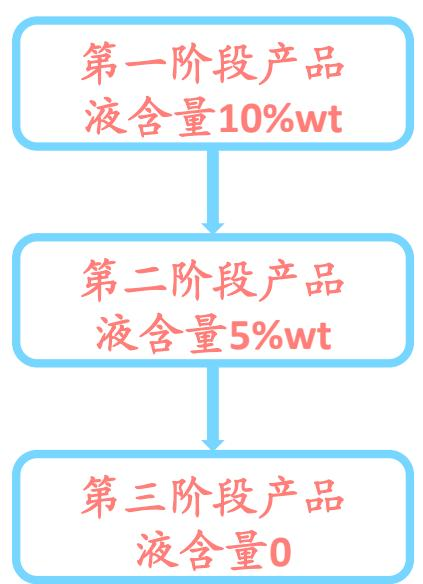

flowchart

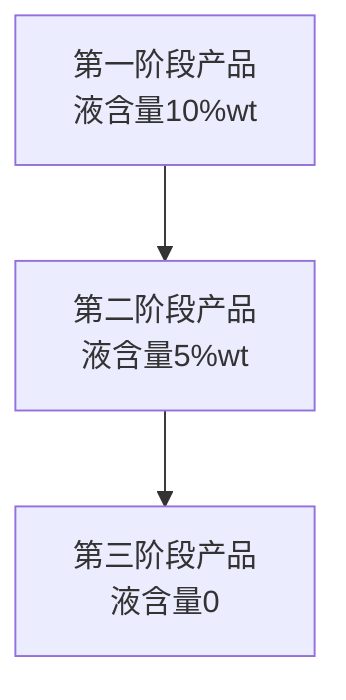
```mermaid
graph TD
    A["第一阶段产品\n液含量10%wt"] --> B["第二阶段产品\n液含量5%wt"]
    B --> C["第三阶段产品\n液含量0"]
```

图：上汽集团全固态电池量产及装车时间  
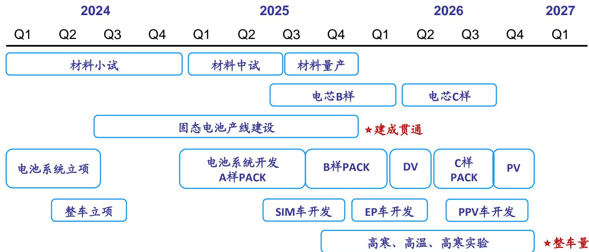

flowchart

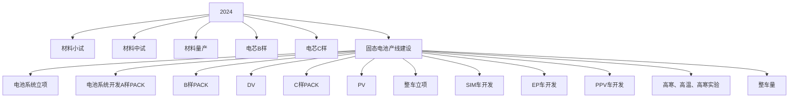
```mermaid
graph TD
    A["2024"] --> B["材料小试"]
    A --> C["材料中试"]
    A --> D["材料量产"]
    A --> E["电芯B样"]
    A --> F["电芯C样"]
    A --> G["固态电池产线建设"]
    G --> H["电池系统立项"]
    G --> I["电池系统开发A样PACK"]
    G --> J["B样PACK"]
    G --> K["DV"]
    G --> L["C样PACK"]
    G --> M["PV"]
    G --> N["整车立项"]
    G --> O["SIM车开发"]
    G --> P["EP车开发"]
    G --> Q["PPV车开发"]
    G --> R["高寒、高温、高寒实验"]
    G --> S["整车量"]
```

 2024年11月7号长安汽车与太蓝新能源联合发布无隔膜固态锂电池，通过极片复合固态电解质实现隔膜功能替代，有效抑制高温、过充、挤压等因素诱发的热失控，从根本上提升电池安全等级，公司预计2027年长安汽车实现全固态电池装车验证，2030年实现全固态电池量产装车。  
 太蓝无隔膜固态电池采用原位亚微米工业制膜技术（ISFD）多层良率＞99%，已实现量产，极片复合固态电解质层最薄＜1μm，可卷绕，离子电导率＞1.5mS/cm，相比传统液态电池减掉隔膜、减少电解液，原材料成本下降10%以上，能量密度灵活定制，实现新能源车、低空、储能、高速电摩等多场景应用。  
 太蓝全固态三年计划：2025年完成全固态电池原型验证和体系开发；2026年通过小批量生产持续验证；2027年实现批量生产和新能源汽车示范应用。

图：太蓝新能源固态电池4-3-2-1路线  
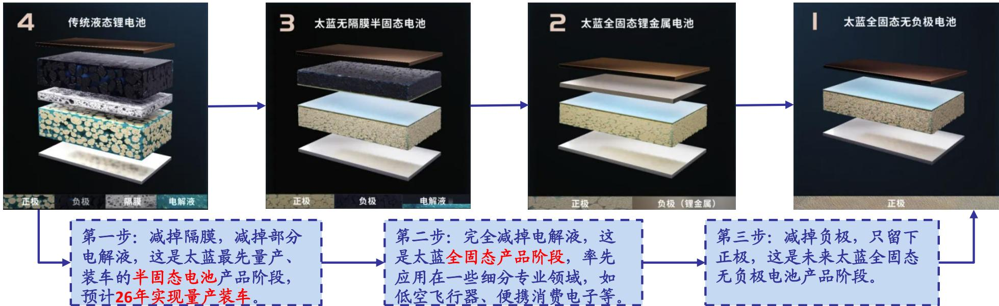

flowchart

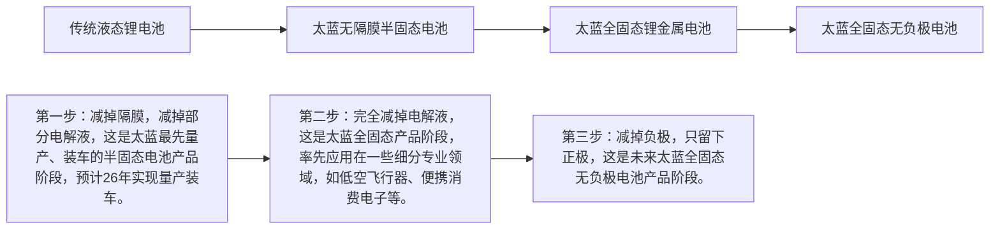
```mermaid
graph LR
    A["传统液态锂电池"] --> B["太蓝无隔膜半固态电池"]
    B --> C["太蓝全固态锂金属电池"]
    C --> D["太蓝全固态无负极电池"]
    
    E["第一步：减掉隔膜，减掉部分电解液，这是太蓝最先量产、装车的半固态电池产品阶段，预计26年实现量产装车。"] --> F["第二步：完全减掉电解液，这是太蓝全固态产品阶段，率先应用在一些细分专业领域，如低空飞行器、便携消费电子等。"]
    F --> G["第三步：减掉负极，只留下正极，这是未来太蓝全固态无负极电池产品阶段。"]
```

# 1.2空间：固态电池远期空间广阔

 固态电池远期空间广阔：固态电池处于行业前期技术积累阶段，目前产业化进程加速，根据车厂、电池厂、材料厂等在固态电池方面的布局，我们预计2027年固态电池产业化将完成从“0”到“1”的突破，渗透率将快速提升，预计2025年、2027年、2030年固态电池装机量分别达到3.33GWh、50.68GWh、538.09GWh。

表：固态电池需求测算

<table><tr><td></td><td>2020</td><td>2021</td><td>2022</td><td>2023</td><td>2024E</td><td>2025E</td><td>2026E</td><td>2027E</td><td>2028E</td><td>2029E</td><td>2030E</td></tr><tr><td>海外:新能源乘用车销量(万辆)</td><td>168</td><td>306</td><td>394</td><td>512</td><td>621</td><td>785</td><td>986</td><td>1218</td><td>1474</td><td>1753</td><td>2038</td></tr><tr><td>yoy</td><td></td><td>82%</td><td>29%</td><td>30%</td><td>21%</td><td>26%</td><td>26%</td><td>24%</td><td>21%</td><td>19%</td><td>16%</td></tr><tr><td>欧洲新能源乘用车销量(万辆)</td><td>126</td><td>219</td><td>251</td><td>295</td><td>339</td><td>400</td><td>460</td><td>524</td><td>593</td><td>664</td><td>730</td></tr><tr><td>yoy</td><td></td><td>74%</td><td>15%</td><td>18%</td><td>15%</td><td>18%</td><td>15%</td><td>14%</td><td>13%</td><td>12%</td><td>10%</td></tr><tr><td>美国新能源乘用车销量(万辆)</td><td>32</td><td>66</td><td>99</td><td>147</td><td>184</td><td>258</td><td>361</td><td>488</td><td>634</td><td>792</td><td>951</td></tr><tr><td>yoy</td><td></td><td>106%</td><td>50%</td><td>48%</td><td>25%</td><td>40%</td><td>40%</td><td>35%</td><td>30%</td><td>25%</td><td>20%</td></tr><tr><td>其他国家新能源乘用车销量(万辆)</td><td>10</td><td>21</td><td>44</td><td>70</td><td>98</td><td>127</td><td>165</td><td>206</td><td>248</td><td>297</td><td>357</td></tr><tr><td>yoy</td><td></td><td>110%</td><td>110%</td><td>59%</td><td>40%</td><td>30%</td><td>30%</td><td>25%</td><td>20%</td><td>20%</td><td>20%</td></tr><tr><td>国内:新能源乘用车销量(万辆)</td><td>132</td><td>351</td><td>687</td><td>945</td><td>1184</td><td>1397</td><td>1648</td><td>1896</td><td>2161</td><td>2442</td><td>2735</td></tr><tr><td>yoy</td><td></td><td>166%</td><td>96%</td><td>38%</td><td>25%</td><td>18%</td><td>18%</td><td>15%</td><td>14%</td><td>13%</td><td>12%</td></tr><tr><td>全球新能源乘用车销量合计(万辆)</td><td>300</td><td>657</td><td>1081</td><td>1457</td><td>1805</td><td>2182</td><td>2635</td><td>3114</td><td>3635</td><td>4195</td><td>4773</td></tr><tr><td>yoy</td><td></td><td>119%</td><td>65%</td><td>35%</td><td>24%</td><td>21%</td><td>21%</td><td>18%</td><td>17%</td><td>15%</td><td>14%</td></tr><tr><td>全球单车带电量/KWh</td><td>46</td><td>45</td><td>48</td><td>48</td><td>49</td><td>49</td><td>50</td><td>51</td><td>52</td><td>53</td><td>54</td></tr><tr><td>全球动力电池装机量(GWh)</td><td>137</td><td>297</td><td>518</td><td>706</td><td>884</td><td>1069</td><td>1317</td><td>1588</td><td>1890</td><td>2224</td><td>2577</td></tr><tr><td>yoy</td><td></td><td>117%</td><td>74%</td><td>36%</td><td>25%</td><td>21%</td><td>23%</td><td>21%</td><td>19%</td><td>18%</td><td>16%</td></tr><tr><td>全球动力电池出货量(GWh)</td><td>158</td><td>371</td><td>684</td><td>865</td><td>1106</td><td>1336</td><td>1647</td><td>1985</td><td>2363</td><td>2779</td><td>3222</td></tr><tr><td>yoy</td><td></td><td>135%</td><td>84%</td><td>26%</td><td>28%</td><td>21%</td><td>23%</td><td>21%</td><td>19%</td><td>18%</td><td>16%</td></tr><tr><td>出货/装机</td><td>1.15</td><td>1.25</td><td>1.32</td><td>1.23</td><td>1.25</td><td>1.25</td><td>1.25</td><td>1.25</td><td>1.25</td><td>1.25</td><td>1.25</td></tr><tr><td>海外动力电池装机量(GWh)</td><td>76.72</td><td>138.33</td><td>188.80</td><td>247.92</td><td>304.29</td><td>384.65</td><td>493.15</td><td>621.38</td><td>766.55</td><td>929.22</td><td>1100.26</td></tr><tr><td>其中:海外三元电池装机量(GWh)</td><td>76.72</td><td>138.33</td><td>188.80</td><td>247.92</td><td>292.12</td><td>353.88</td><td>433.97</td><td>521.96</td><td>613.24</td><td>696.91</td><td>770.18</td></tr><tr><td>海外三元渗透率(%)</td><td>100.0%</td><td>100.0%</td><td>100.0%</td><td>100.0%</td><td>96.0%</td><td>92.0%</td><td>88.0%</td><td>84.0%</td><td>80.0%</td><td>75.0%</td><td>70.0%</td></tr><tr><td>海外磷酸铁锂电池装机量(GWh)</td><td>0.00</td><td>0.00</td><td>0.00</td><td>0.00</td><td>12.17</td><td>30.77</td><td>59.18</td><td>99.42</td><td>153.31</td><td>232.30</td><td>330.08</td></tr><tr><td>国内动力电池装机量(GWh)</td><td>60.28</td><td>158.67</td><td>329.20</td><td>457.58</td><td>580.16</td><td>684.53</td><td>824.23</td><td>966.82</td><td>1123.79</td><td>1294.30</td><td>1476.97</td></tr><tr><td>其中:国内三元电池装机量(GWh)</td><td>37.98</td><td>76.64</td><td>128.39</td><td>149.63</td><td>174.05</td><td>212.20</td><td>272.00</td><td>348.06</td><td>449.52</td><td>582.44</td><td>738.48</td></tr><tr><td>国内三元渗透率(%)</td><td>63.0%</td><td>48.3%</td><td>39.0%</td><td>32.7%</td><td>30.0%</td><td>31.0%</td><td>33.0%</td><td>36.0%</td><td>40.0%</td><td>45.0%</td><td>50.0%</td></tr><tr><td>国内磷酸铁锂电池装机量(GWh)</td><td>22.30</td><td>82.03</td><td>200.81</td><td>307.95</td><td>406.11</td><td>472.33</td><td>552.23</td><td>618.77</td><td>674.27</td><td>711.87</td><td>738.48</td></tr><tr><td>全球三元电池装机合计(GWh)</td><td>114.70</td><td>214.97</td><td>317.19</td><td>397.55</td><td>466.17</td><td>566.08</td><td>705.97</td><td>870.02</td><td>1062.75</td><td>1279.35</td><td>1508.67</td></tr><tr><td>三元电池固态渗透率(%)</td><td></td><td>0.01%</td><td>0.02%</td><td>0.05%</td><td>0.10%</td><td>0.50%</td><td>1.00%</td><td>5.00%</td><td>10.00%</td><td>20.00%</td><td>30.00%</td></tr><tr><td>全球磷酸铁锂电池装机合计(GWh)</td><td>22.30</td><td>82.03</td><td>200.81</td><td>307.95</td><td>418.28</td><td>503.10</td><td>611.41</td><td>718.19</td><td>827.58</td><td>944.17</td><td>1068.56</td></tr><tr><td>磷酸铁锂固态电池渗透率</td><td></td><td>0.00%</td><td>0.00%</td><td>0.00%</td><td>0.01%</td><td>0.10%</td><td>0.20%</td><td>1.00%</td><td>2.00%</td><td>5.00%</td><td>8.00%</td></tr><tr><td>固态电池装机量(GWh)</td><td></td><td>0.02</td><td>0.06</td><td>0.20</td><td>0.51</td><td>3.33</td><td>8.28</td><td>50.68</td><td>122.83</td><td>303.08</td><td>538.09</td></tr><tr><td>固态电池渗透率(%)</td><td></td><td>0.01%</td><td>0.01%</td><td>0.03%</td><td>0.06%</td><td>0.31%</td><td>0.63%</td><td>3.19%</td><td>6.50%</td><td>13.63%</td><td>20.88%</td></tr></table>

资料来源：SNE、EVTank、Marklines、新浪财经、北极星储能网、HTI

# 1.3 复盘：行业发展早期，行情多为事件热点驱动

 目前看固态电池行业处于产业发展早期，我们进行复盘后发现，行情多为阶段性主题行情，受事件、热点驱动，固态电池技术进步、量产突破、定点上车等对行情有一定催化。

图：固态电池行情复盘  
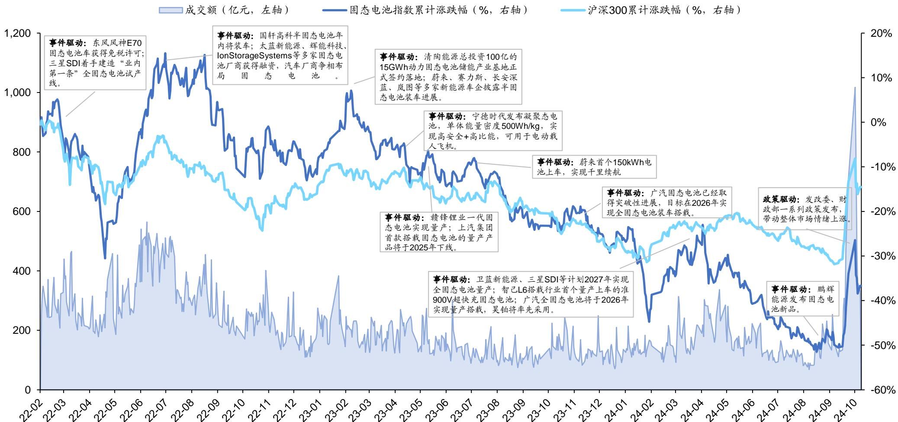

bar_line

| Date       | 成交额 (亿元) | 固态电池指数累计涨跌幅 (%) | 沪深300累计涨跌幅 (%) |
|------------|---------------|-----------------------------|------------------------|
| 22-02      | ~900          | ~85                         | ~80                    |
| 22-03      | ~850          | ~80                         | ~75                    |
| 22-04      | ~750          | ~70                         | ~65                    |
| 22-05      | ~650          | ~60                         | ~55                    |
| 22-06      | ~700          | ~65                         | ~60                    |
| 22-07      | ~800          | ~75                         | ~70                    |
| 22-08      | ~900          | ~85                         | ~75                    |
| 22-09      | ~1,100        | ~95                         | ~80                    |
| 22-10      | ~1,050        | ~90                         | ~75                    |
| 22-11      | ~950          | ~85                         | ~70                    |
| 22-12      | ~850          | ~80                         | ~65                    |
| 23-01      | ~800          | ~75                         | ~60                    |
| 23-02      | ~900          | ~85                         | ~65                    |
| 23-03      | ~850          | ~80                         | ~60                    |
| 23-04      | ~800          | ~75                         | ~55                    |
| 23-05      | ~750          | ~70                         | ~50                    |
| 23-06      | ~700          | ~65                         | ~45                    |
| 23-07      | ~650          | ~60                         | ~40                    |
| 23-08      | ~600          | ~55                         | ~35                    |
| 23-09      | ~550          | ~50                         | ~30                    |
| 23-10      | ~500          | ~45                         | ~25                    |
| 23-11      | ~450          | ~40                         | ~20                    |
| 23-12      | ~400          | ~35                         | ~15                    |
| 24-01      | ~350          | ~30                         | ~10                    |
| 24-02      | ~300          | ~25                         | ~5                     |
| 24-03      | ~250          | ~20                         | 0                      |
| 24-04      | ~200          | ~15                         | -5                     |
| 24-05      | ~150          | ~10                         | -10                    |
| 24-06      | ~100          | ~5                          | -15                    |
| 24-07      | ~50           | 0                           | -20                    |
| 24-08      | ~25           | -5                          | -25                    |
| 24-09      | ~10           | -10                         | -30                    |
| 24-10      | ~1,100        | -15                         | -35                    |

| Event Description              | Event Description                     |
| ------------------------------ | ---------------------------------- |
| 事件驱动: 东风风神E7O            |                        |
| 固态电池车获得免税许可; 三星SDI着手建造“业内第一条”全固态电池试产线.    |
| 固态电池车将装车; 太蓝新能源、辉能科技、IonStorageSystems等多家固态电池厂商获得融资, 汽车厂商争相布局固态电池.   |
| 固态电池车将装车; 太蓝新能源、辉能科技、 IonStorageSystems等多家固态电池厂商获得融资, 汽车厂商争相布局固态电池.   |
| 固态电池车将装车; 太蓝新能源、辉能科技、 IonStorageSystems等多家固态电池厂商获得融资, 汽车厂商争相布局固态电池.   |
| 固态电池车将装车; 太蓝新能源、辉能科技、 IonStorageSystems等多家固态电池厂商获得融资,汽车厂商争相布局固态电池.   |
| 固态电池车将装车; 太蓝新能源、辉能科技、 IonStorageSystems等多家固态电池厂商获得融资,汽车厂商争相布局固态电池.   |
| 固态电池车将装车; 太蓝新能源、辉能科技、 IonStorageSystems等多家固态电池厂商获得融资,汽车厂商争相布局固态电池.   |
| 固态电池车将装车型; 太蓝新能源、辉能科技、 IonStorageSystems等多家固态电池厂商获得融资,汽车厂商争相布局固态电池.   |
| 固态电池车将装车型; 太蓝新能源、辉能科技、 IonStorageSystems等多家固态电池厂商获得融资,汽车厂商争相布局固态电池.   |
| 固态电池车将装车型; 太蓝新能源、辉能科技、 IonStorageSystems等多家固态电 品厂获得融资,汽车厂商争相布局固态电池.   |
| 固态电池车将装车型; 太蓝新能源、辉能科技、 IonStorageSystems等多家固态电池厂商获得融资,汽车厂商争相布局固态电池.   |
| 固态电池车将装车型; 太蓝新能源、辉能科技、 IonStorageSystems等多家固态电池厂商获得融资,汽车厂商争相布局固态电池.   |
| 固态电机组: 清陶能源总投资100亿的15GWh动力固态电池储能产业基地正式签约落地; 蔚来、赛力斯、长安深蓝、岚图等多家新能源车企披露半固态电池装车进展.   |
| 固态电机组: 宁德时代发布凝聚态电池, 单体能量密度500Wh/kg, 实现高安全+高比能, 可用于电动载人飞机.   |
| 固态电机组: 蔡锋锂业一代固态电池实现量产; 上汽集团首款搭载固态电池的量产产品将于2025年下线.   |
| 固态电机组: 广汽固态电池已经取得突破性进展, 目标在2026年实现全固态电池装车搭载.   |
| 固态电机组: 广汽固态电池已经取得突破性进展, 目标在2026年实现全固态电池装车搭载.   |
| 固态电机组: 广汽固态电池已经取得突破性进展, 目标在2026年实现全固态电池装车搭载.   |
| 固态电机组: 广汽固态电池已经取得突破性进展(目标在2026年实现全固态电池装车搭载).   |
| 固态电机组: 广汽固态电池已经取得突破性进展(目标在2026年实现全固态电池装车搭载), 吴铂将率先采用.   |
| 固态电机组: 广汽固态电池已经取得突破性进展(目标在2026年实现全固态电池装车搭载), 吴铂将率先采用.   |
| 固态电机组: 广汽固态电池已经取得突破性进展(目标在2026年实现全固态电池装车搭载), 吴铂将率先采用.   |
| 固态电机组: 广气固态电池已经取得突破性进展(目标在2026年实现全固态电池装车搭载), 吴铂将率先采用.   |
| 固态电机组: 广气固态电池已经取得突破性进展(目标在2026年实现全固态电池装车搭载), 吴铂将率先采用.   |
| 固态电机组: 广气固态电池已经取得突破性进展(目标在不同时期, 目标在2026年实现全固态电池装车搭载), 吴铂将率先采用.   |
| 固态电机组: 广气固态电池已经取得突破性进展(目标在不同时期, 目标在2026年实现全固态电池装车搭载), 吴铂将率先采用.   |
| 固态电机组: 广气固态电池已经取得突破性进展(目标在不同时期末, 目标在不同时期末, 吴铂将率先采用)   |
| 固态电机组: 广气固态电池已经取得突破性进展(目标在不同时期末, 吴铂将率先采用)   |
| 固态电机组: 广气固态电池已经取得突破性进展(目标在不同时期末, 吴铂将率先采用)   |
| 固态电机组: 广气固态电池已经取得突破性进展(目标在不同时期末, 吴铂将率先采用)   |
| 固态电机组: 广气固态电池已经取得突破性进度(目标在不同时期末, 吴铂将率先采用)   |
| 固态电机组: 广气固态电池已经取得突破性进度(目标在不同时期末, 吴铂将率先采用)   |
| 固态电机组: 广气固态电池已经取得突破性进度(目标在不同时期末, 吴铂将率先采用)   |
| 固态电机组: 广气固态电池已经取得破除进度(目标在不同时期末, 吴铂将率先采用)   |
| 固态电机组: 广气固态电池已经取得破除进度(目标在不同时期末, 吴铂将率先采用)   |
| 固态电机组: 广气固态电池已经取得破除进度(目标在不同时期末, 吴铂将率先采用)   |
| 固态电机组: 广气固态电池已经得到突破性进展(目标在不同时期末, 吴铂将率先采用)   |
| 固态电机组: 广气固态电池已经得到突破性进展(目标在不同时期末, 吴铂将率先采用)   |
| 固态电机组: 广气固态电池已经得到突破性进展(目标在不同时期末, 吴铂将率先采用)   |
| 固态电机组: 广气固态电池已经得到破除进度(目标在不同时期末, 吴铂将率先采用)   |
| 固态电机组: 广气固态电池已经得到破除进度(目标在不同时期末, 吴铂将率先采用)   |
| 固态电机组: 广气固态电池已经得到破除进度(目标在不同时期末, 吴铂将率先采用)   |
| 固态电机组: 广气固态电池已经得到破损率(目标在不同时期末, 吴铂将率先采用)   |
| 固态电机组: 广气固态电池已经得到破损率(目标在不同时期末, 吴铂将率先采用)   |
| 固态电机组: 广气固态电池已经得到破损率(目标在不同时期末, 吴铂将率先采用)   |
| 固态电机组: 广气固态电池已经得到破损率/预估率(目标在不同时期末, 吴铂将率先采用)   |
| 固态电机组: 广气固态电池已经得到破损率/预估率(目标在不同时期末, 吴铂将率先采用)   |
| 固态电机组: 广气固态电池已经得到破损率/预估率(目标在不同时期末, 吴铂将率先采用)   |
| 固态电机组: 幹化新能源、三星SDI等计划2027年实现全固态电池量产; 智己L6搭载行业首个量产上车的准900V超快充固态电池; 广汽全固态电池将于2026年实现量产搭载, 吴铂将率先采用.   |
| 固态电机组: 风控新能源、三星SDI等计划2027年实现全固态电池量产; 智己L6搭载行业首个量产上车的准90V超快充固态电池; 广汽全固态电池将于2026年实现量产搭载, 吴铂将率先采用.   |
| 固态电机组: 风控新能源、三星SDI等计划2027年实现全固态电池量产; 智己L6搭载行业首个量产上车的准90V超快充固态电池; 广汽全固态电池将于2019年实现量产搭载, 吴铂将率先采用.   |
| 固态电机组: 风控新能源、三星SDI等计划2019年实现全固态电池量产; 智己L6搭载行业首个量产上车的准90V超快充固态电池; 广汽全固态电池将于1999年实现量产搭载, 吴铂将率先采用.   |
| 固态电机组: 风控新能源、三星SDI等计划2019年实现全固态电池量产; 智己L6搭载行业首个量产上车的准90V超快充固态电池; 广汽全固态电池将于1999年实现量产搭载, 吴铂将率先采用.   |
| 固态机组: 风控新能源、三星SDI等计划2019年实现全固态电池量产; 智己L6搭载行业首个量产上车的准90V超快充固态电池; 广汽全固态电池将于1999年实现量产搭载, 吴铂将率先采用.   |
| 固态机组: 风控新能源、三星SDI等计划2019年实现全部国产式量产; 智己L6搭载行业首个量产上车的准90V超快充固态电池; 广汽全固态电池将于1999年实现量产搭载, 吴铂将率先采用.   |
| 固态机组: 风控新能源、三星SDI等计划2019年实现全部国产式量产; 智己L6搭载行业首个量产上车的准9V超快充固态电池; 广汽全固态电池将于1999年实现量产搭载, 吴铂将率先采用.   |
| 固态机组: 风控新能源、三星SDI等计划2019年实现全部国产式量产; 智己L6搭载行业首个量产上车的准9V超快充固态电池; 广汽全固态电池将于1999年实施量产搭载, 吴铂将率先采用.   |
| 固态机组: 风控新能源、三星SDI等计划2019年实现全部国产式量产; 智己L6搭载行业首个量产上车的准9V超快充固态电池; 广汽全固态电池将于1999年实施量产搭载, 吴铂将率先采用.   |
| 固态机组: 飾控新能源、三星SDI等计划2019年实现全部国产式量产; 智己L6搭载行业首个量产上车的准9V超快充固态电池; 广汽全固态电池将于1999年实施量产搭载, 吴铂将率先采用.   |
| 固态机组: 风控新能源、三星SDI等计划2019年实现全部国产式量产; 晦己L6搭载行业首个量产上车的准9V超快充固态电池; 广汽全固态电池将于1999年实施量产搭载, 吴铂将率先采用.   |
| 固态机组: 风控新能源、三星SDI等计划2019年实现全部国产式量产; 晦己L6搭载行业首个量产上车的准9V超快充固态电池; 平汽全固态电池将于1999年实施量产搭载, 吴铂将率先采用.   |
| 固态机组: 风控新能源、三星SDI等计划2019年实现全部国产式量产; 晦己L6搭载行业首个量产上车的准9V超快充固态电池; 平汽全固态电池将于1999年实施量产搭载, 吴铂将率先采用 .< img src="boxplus(data) [min,i] position > 1</ img> [row,i]= 1</ img></tr>< img src="boxplus(data)</tr>< img src="boxplus(data)</tr>< img src="boxplus(data)</tr>< img src="boxplus(data)</tr>< img src="boxplus(data)</tr>< img src="boxplus(data)</tr>< img src="boxplus(data)</tr>< img src="boxplus(data)</tr>< img src="boxplus(data)</tr>< img src="boxplus(data)</tr>< img src="boxplus(data)</tr>< img src="boxplus(data)</td>

资料来源：电池工业网、财联社、国轩高科投资者问答、中国证券报、CATL宁德时代公众号、赣锋锂业投资者问答、财经网、第一电动网、

1.固态电池：产业化进程加速，未来市场空间广阔

1.1固态电池：技术路线进步，产业化进程加速   
1.2空间：固态电池远期空间广阔   
1.3复盘：行业发展早期，行情多为事件热点驱动

2.技术路线：固态电解质是核心，正负极向高性能方向迭代

2.1电解质：多技术路线并行，性能各有优劣

2.1.1聚合物固态电解质：复合固态电解质开启新空间  
2.1.2氧化物固态电解质：种类丰富，性能各异  
2.1.3 卤化物固态电解质：重回研究视野，加快研发进展  
2.1.4硫化物固态电解质：离子电导率高，力学性能良好

2.2正极：高镍三元、富锂锰基为当前主流方向  
2.3负极：高比能负极材料是主流趋势  
2.4铜箔：多孔铜箔能够适配固态电池特殊需求

3.产业化进行时：多线并行，研发竞速

3.1 动力电池技术发展路线：液态—半固态—准固态—全固态  
3.2国内外格局：方向多元，研发竞速，关键材料体系尚未明确；头部引领，二三线仍有机会突围  
3.3难点：全固态电池产业化目前面临三大瓶颈   
3.4进程：全固态电池何时产业化落地？  
3.5设备端：固态电池产业化，专用设备先行

4.一级固态电池公司梳理  
5.标的及投资建议  
6.风险提示

 固态电池发展进程中，固态电解质是最为核心的研究方向，正负极材料则向着高性能方向迭代。  
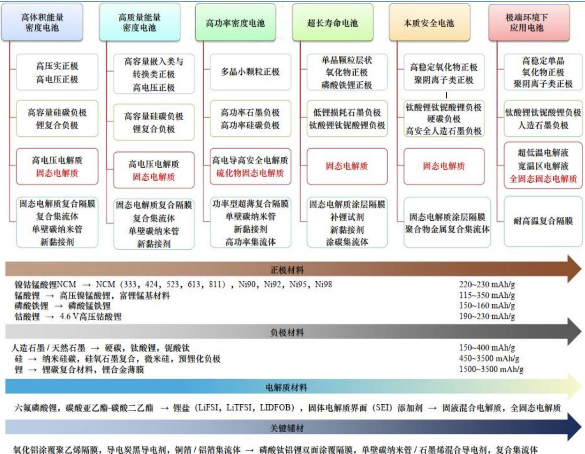

flowchart

```mermaid
graph TD
    A["高体积能量密度电池"] --> B["高压实正极"]
    A --> C["高压电压正极"]
    A --> D["高容量硅碳负极锂复合负极"]
    A --> E["高电压电解质固态电解质"]
    A --> F["固态电解质复合隔膜复合集流体单壁碳纳米管新黏接剂"]
    
    G["高质量能量密度电池"] --> H["高容量嵌入类与转换类正极"]
    G --> I["高容量硅碳负极锂复合负极"]
    G --> J["高电压电解质固态电解质"]
    G --> K["固态电解质复合隔膜复合集流体单壁碳纳米管新黏接剂"]
    
    L["高功率密度电池"] --> M["多晶小颗粒正极"]
    L --> N["高功率石墨负极"]
    L --> O["高电导高安全电解质硫化物固态电解质"]
    L --> P["功率型超薄复合隔膜单壁碳纳米管新黏接剂"]
    L --> Q["高功率集流体"]
    
    R["超长寿命电池"] --> S["单晶颗粒层状氧化物正极磷酸铁锂正极"]
    R --> T["低锂损耗石墨负极钛酸锂钛铌酸锂负极"]
    R --> U["固态电解质"]
    R --> V["固态电解质涂层隔膜补锂试剂"]
    R --> W["新黏接剂"]
    R --> X["涂碳集流体"]
    
    Y["本质安全电池"] --> Z["高稳定氧化物正极聚阴离子类正极"]
    Y --> AA["钛酸锂钛铌酸锂负极硬碳负极"]
    Y --> AB["高安全人造石墨负极"]
    Y --> AC["固态电解质"]
    Y --> AD["固态电解质涂层隔膜聚合物金属复合集流体"]
    
    AE["极端环境下应用电池"] --> AF["高稳定单晶氧化物正极聚阴离子类正极"]
    AE --> AG["钛酸锂钛铌酸锂负极人造石墨负极"]
    AE --> AH["超低温电解液宽温区电解液全固态固态电解质"]
    AE --> AI["耐高温复合隔膜"]
    
    J --> J1["正极材料"]
    K --> K1["负极材料"]
    
    L --> L1["镍钴锰酸锂NCM → NCM (333, 424, 523, 613, 811), Ni90, Ni92, Ni95, Ni98"]
    L --> L2["锰酸锂 → 高压镍锰酸锂, 富锂锰基材料"]
    L --> L3["磷酸铁锂 → 磷酸锰铁锂"]
    L --> L4["钴酸锂 → 4.6V高压钴酸锂"]
    
    M --> M1["正极材料"]
    N --> N1["负极材料"]
    
    O --> O1["电解质材料"]
    
    P --> P1["电解质材料"]
    
    Q --> Q1["电解质材料"]
    
    R --> R1["电解质材料"]
    
    S --> S1["电解质材料"]
    
    T --> T1["电解质材料"]
    
    U --> U1["电解质材料"]
    
    V --> V1["电解质材料"]
    
    W --> W1["电解质材料"]
    
    X --> X1["电解质材料"]
    
    Y --> Y1["电解质材料"]
    
    Z --> Z1["电解质材料"]
    
    AA --> AA1["电解质材料"]
    
    AB --> AB1["电解质材料"]
    
    AC --> AC1["电解质材料"]
    
    AD --> AD1["电解质材料"]
    
    AE --> AE1["电解质材料"]
    
    AF["电解质材料"] --> AF1["电解质材料"]
    
    AG["电解质材料"] --> AG1["电解质材料"]
    
    AH["电解质材料"] --> AH1["电解质材料"]
    
    AI["电解质材料"] --> AI1["电解质材料"]
    
    AJ["电解质材料"] --> AJ1["电解质材料"]
    
    AK["电解质材料"] --> AK1["电解质材料"]
    
    AL["电解质材料"] --> AL1["电解质材料"]
    
    AM["电解质材料"] --> AM1["电解质材料"]
    
    AN["电解质材料"] --> AN1["电解质材料"]
    
    AO["电解质材料"] --> AO1["电解质材料"]
    
    AP["电解质材料"] --> AP1["电解质材料"]
    
    AQ["电解质材料"] --> AQ1["电解质材料"]
    
    AR["电解质材料"] --> AR1["电解质材料"]
    
    AS["电解质材料"] --> AS1["电解质材料"]
    
    AT["电解质材料"] --> AT1["电解质材料"]
    
    AU["电解质材料"] --> AU1["电解质材料"]
    
    AV["电解质材料"] --> AV1["电解质材料"]
    
    AW["电解质材料"] --> AW1["电解质材料"]
    
    AX["电解质材料"] --> AX1["电解质材料"]
    
    AY["高压实正极"] & AZ["高压电压正极"] & BA["高容量硅碳负极锂复合负极"] & BB["高电压电解质固态电解质"] & BC["固态电解质复合隔膜复合集流体单壁碳纳米管新黏接剂"] & BD["固态电解质复合隔膜复合集流体单壁碳纳米管新黏接剂"] & BE["固态电解质复合隔膜复合集流体单壁碳纳米管新黏接剂"] & BF["固态电解质复合隔膜复合集流体单壁碳纳米管新黏接剂"] & BG["固态电解质复合隔膜复合集流体单壁碳纳米管新黏接剂"] & BH["固态电解质复合隔膜复合集流体单壁碳纳米管新黏接剂"] & BI["固态电解质复合隔膜复合集流体单壁碳纳米管新黏接剂"] & BJ["固态电解质复合隔膜复合集流体单壁碳纳米管新黏接剂"] & BK["固态电解质复合隔膜复合集流体单壁碳纳米管新黏接剂"] & BL["固态电解质复合隔膜复合集流体单壁碳纳米管新黏接剂"] & BM["固态电解质复合隔膜复合集流体单壁碳纳米管新黏接剂"] & BN["固态电解质复合隔膜复合集流体单壁碳纳米管新黏接剂"] & BO["固态电解质复合隔膜复合集流体单壁碳纳米管新黏接剂"] & BP["固态电解质复合隔膜复合集流体单壁碳纳米管新黏接剂"] & BPB["固态电解质复合隔膜复合集流体单壁碳纳米管新黏接剂"] & BPc["固态电解质复合隔膜复合集流体单壁碳纳米管新黏接剂"] & BPd["固态电解质复合隔膜复合集流体单壁碳纳米管新黏接剂"] & BPe["固态电解质复合隔膜复合集流体单壁碳纳米管新黏接剂"] & BPf["固态电解质复合隔膜复合集流体单壁碳纳米管新黏接剂"] & BPg["固态电解质复合隔膜复合集流体单壁碳纳米管新黏接剂"] & BPh["固态电解质复合隔膜复合集流体单壁碳纳米管新黏接剂"] & BPi["固态电解质复合隔膜复合集流体单壁碳纳米管新黏接剂"] & BPj["固态电解质复合隔膜复合集流体单壁碳纳米管新黏接剂"] & BPk["固态电解质复合隔膜复合集流体单壁碳纳米管新黏接剂"] & BPl["固态电解质复合隔膜复合集流体单壁碳纳米管新黏接剂"] & BPm["固态电解质复合隔膜复合集流体单壁碳纳米管新黏接剂"] & BPn["固态电解质复合隔膜复合集流体单壁碳纳米管新黏接剂"] & BPo["固态电解质复合隔膜复合集流体单壁碳纳米管新黏接剂"] & BPp["固态电解质复合隔膜复合集流体单壁碳纳米管新黏接剂"] & BPq["固态电解质复合隔膜复合集流体单壁碳纳米管新黏接剂"] & BPqb["固态电解质复合隔膜复合集流体单壁碳纳米管新黏接剂"] & BPqc["固态电解质复合隔膜复合集流体单壁碳纳米管新黏接剂"] & BPqd["固态电解质复合隔膜复合集流体单壁碳纳米管新黏接剂"] & BPqe["固态电解质复合隔膜复合集流体单壁碳纳米管新黏接剂"] & BPqf["固态电解质复合隔膜复合集流体单壁碳纳米管新黏接剂"] & BPqg["固态电解质复合隔膜复合集流体单壁碳纳米管新黏接剂"] & BPqh["固态电解质复合隔膜复合集流体单壁碳纳米管新黏接剂"] & BPqi["固态电解质复合隔膜复合集流体单壁碳纳米管新黏接剂"] & BPqj["固态电解质复合隔膜复合集流体单壁碳纳米管新黏接剂"] & BPqk["固态电解质复合隔膜复合集流体单壁碳纳米管新黏接剂"] & BPql["固态电解质复合隔膜复合集流体单壁碳纳米管新黏接剂"] & BPqm["固态电解质复合隔膜复合集流体单壁碳纳米管新黏接剂"] & BPqn["固态电解质复合隔膜复合集流体单壁碳纳米管新黏接剂"] & BPqo["固态电解质复合隔膜复合集流体单壁碳纳米管新黏接剂"] & BPqp["固态电解质复合隔膜复合集流体单壁碳纳米管新黏接剂"] & BPqq["固态电解质复合隔膜复合集流体单壁碳纳米管新黏接剂"] & BPqr["固态电解质复合隔膜复合集流体单壁碳纳米管新黏接剂"] & BPqs["固态电解质复合隔膜复合集流体单壁碳纳米管新黏接剂"] & BPqy["固态电解质复合隔膜复合集流体单壁碳纳米管新黏接剂"] & BPqz["固态电解质复合隔膜复合集流体单壁碳纳米管新黏接剂"] & BPqw["固态电解质复合隔膜复合集流体单壁碳纳米管新黏接剂"] & BPqx["固态电解质复合隔膜复合集流体单壁碳纳米管新黏接剂"] & BPqyq["固态电解质复合隔膜复合集流体单壁碳纳米管新黏接剂"] & BPqw["固态电解质复合隔膜复合集流体单壁碳纳米管新黏接剂"] & BPqx["固态电解质复合隔膜复合集流体单壁碳纳米管新黏接剂"] & BPqxj["固态电解质复合隔膜复合集流体单壁碳纳米管新黏接剂"] & BPqxk["固态电解质复合隔膜复合集流体单壁碳纳米管新黏接剂"] & BPqxl["kn"][n][n][n][n][n][n][n][n][n][n][n][n][n][n][n][n][n][n][n][n][n][n][n][n][n][n][n][n][n][n][n][n][n][n][n][n][n][n][n][n][n][n][n][n][n][n][n][n][n][n]
```

 固态电解质是固态电池的核心材料：固态电解质具有良好的锂离子传输性能，不挥发、一般不可燃、具有较宽的工作温区和电化学窗口，能够适配更高能量密度的正负极材料体系，是固态电池的核心材料，决定了固态电池的研发和产业化进程。  
多技术路线并行，性能各有优劣：按照组成成分，固态电解质可分为聚合物固态电解质和无机物固态电解质，无机物固态电解质又可以细分为氧化物固态电解质、卤化物固态电解质、硫化物固态电解质。四类电解质在离子电导率、机械性能、加工成本、界面接触、电化学窗口、化学稳定性等方面各有优劣，基于此我们认为短期看氧化物上量较快，中长期卤化物、硫化物更优。

图：四种典型固态电解质性能雷达图  
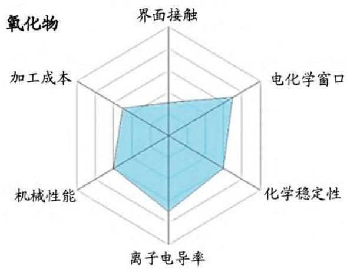

radar

| 指标         | 数值 |
| ------------ | ---- |
| 界面接触     | 0    |
| 电化学窗口   | 10   |
| 化学稳定性   | 8    |
| 离子电导率   | 9    |
| 机械性能     | 7    |
| 加工成本     | 6    |

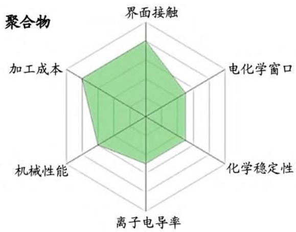

radar

聚合物
| 聚合物 | 评分 |
| :--- | :--- |
| 界面接触 | 85 |
| 电化学窗口 | 60 |
| 化学稳定性 | 55 |
| 离子电导率 | 65 |
| 机械性能 | 70 |
| 加工成本 | 80 |

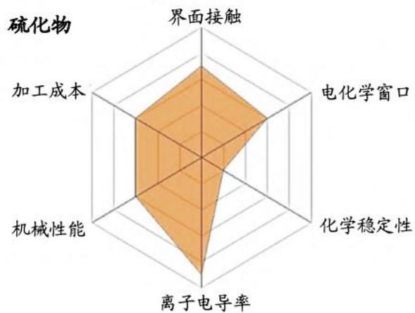

radar

硫化物
| 维度 | 界面接触 | 电化学窗口 | 化学稳定性 | 离子电导率 | 机械性能 | 加工成本 |
|---|---|---|---|---|---|---|
| 硫化物 | 0.85 | 0.72 | 0.15 | 0.95 | 0.65 | 0.45 |
| 界面接触 | 0.88 | 0.75 | 0.18 | 0.92 | 0.68 | 0.48 |
| 电化学窗口 | 0.82 | 0.78 | 0.20 | 0.88 | 0.62 | 0.42 |
| 化学稳定性 | 0.75 | 0.70 | 0.17 | 0.85 | 0.60 | 0.40 |
| 离子电导率 | 0.92 | 0.85 | 0.16 | 0.98 | 0.63 | 0.43 |
| 机械性能 | 0.78 | 0.73 | 0.14 | 0.82 | 0.61 | 0.41 |
| 加工成本 | 0.76 | 0.71 | 0.13 | 0.80 | 0.64 | 0.44 |
The chart displays a radar chart with six axes representing different environmental and chemical performance metrics, each labeled with its corresponding value in Chinese. The values are estimated from a single point (e.g., '碳化物' at 0.85).

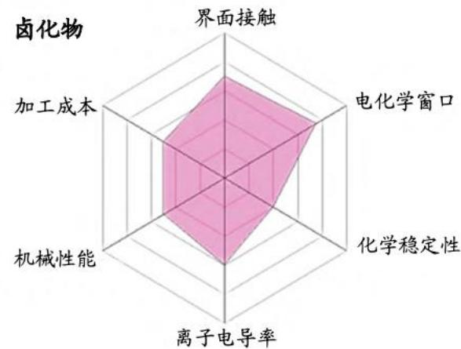

radar

卤化物
| Category | Value |
|---|---|
| 界面接触 | 85 |
| 电化学窗口 | 90 |
| 化学稳定性 | 60 |
| 离子电导率 | 75 |
| 机械性能 | 65 |
| 加工成本 | 55 |

# 2.1 电解质：多技术路线并行，性能各有优劣

表：四种固态电解质主要体系及性能对比

<table><tr><td>种类</td><td>名称及分子式</td><td>类型</td><td>性能优势</td><td>性能劣势</td></tr><tr><td>聚合物</td><td>聚环氧乙烷(PEO) $HO(CH_2CH_2O)_nH$ </td><td></td><td>对金属锂稳定,且可以更好地解离锂盐</td><td>室温下未改性的PEO结晶度高,导致离子电导率较低,处于 $10^{-7}S/cm$ 的数量级,离子迁移数低(0.2~0.3),严重影响电池大电流充放电。</td></tr><tr><td rowspan="4">氧化物</td><td>锂镧锆氧 $Li_7La_3Zr_2O_{12}$ (LLZO)</td><td>石榴石型电解质</td><td>1、立方相c-LLZO离子电导率较高, $10^{-3}S/cm$ ;2、电化学窗口宽,对锂金属稳定</td><td>1、四方相t-LLZO离子电导率低;2、与锂金属为点对点的固-固接触,接触面积小,两者界面不匹配使得不能实现润湿,会导致界面阻抗较大和界面处锂枝晶生长,需要优化界面接触;3、需要提高LLZO致密度,有利于锂均匀沉积从而抑制锂枝晶生长。</td></tr><tr><td> $Li_{3x}La_{2/3-x}TiO_3$ (LLTO)</td><td>钙钛矿型电解质</td><td>1、电导率较高;2、热稳定性好;3、力学性能好。</td><td>1、制备温度高,容易导致锂挥发和晶界阻抗提高;2、存在易被还原的 $Ti^{4+}$ ,对金属锂不稳定。</td></tr><tr><td>磷酸铝钛锂 $Li_{1.3}Al_{0.3}Ti_{1.7}(PO_4)_3$ (LATP)</td><td>NASICON型电解质</td><td>1、机械强度高;2、化学稳定性好;3、电化学窗口宽;4、制备工艺简单,易于加工处理;5、室温离子电导率好, $10^{-3} \sim 10^{-2}S/cm$ </td><td>LATP中 $Ti^{4+}$ 对锂不稳定,极易被锂还原</td></tr><tr><td>锂磷氧氮LiPON</td><td>LiPON型电解质</td><td>1、离子电导率高,室温约为 $2.3 \times 10^{-6}S/cm$ 2、电化学窗口宽,热稳定性好;3、和多种正极、金属锂负极的相容性好</td><td>制备过程生产率低,批量生产成本高</td></tr><tr><td rowspan="3">硫化物</td><td>L-P-S $Li_2S-P_2S_5$ </td><td>玻璃态电解质</td><td>1、室温离子电导率较高, $10^{-4} \sim 10^{-2}S/cm$ ;2、热稳定性高;3、安全性能好;4、电化学稳定窗口宽(达5V以上)</td><td>1、潮湿空气中不稳定,易生成 $H_2S$ ;2、与金属锂负极相容性较差</td></tr><tr><td>锂锗磷硫 $Li_{10}GeP_2S_{12}$ </td><td>晶态电解质</td><td>1、室温离子电导率高, $1.2 \times 10^{-2}S/cm$ ;2、电化学稳定窗口宽(5V以上)</td><td>1、锗元素成本高;2、对锂金属不稳定。</td></tr><tr><td>锂磷硫氯 $Li_{5.5}PS_{4.5}Cl_{1.5}$ </td><td>晶态电解质</td><td>离子电导率较高,冷压下298K时为 $(9.4 \pm 0.1) \times 10^{-3}S/cm$ ,烧结后为 $(12.0 \pm 0.2) \times 10^{-3}S/cm$ </td><td>1、化学稳定性一般;2、与金属锂负极相容性较差</td></tr><tr><td rowspan="3">卤化物</td><td> $Li_3YCl_6$ </td><td>III B族金属卤化物电解质</td><td>1、离子电导率高,室温下达 $0.51 \times 10^{-3}S/cm$ 2、高化学/电化学稳定性;3、可塑性强。</td><td>容易与金属锂负极不相容</td></tr><tr><td> $Li_3InBr_6$ </td><td>III A族金属卤化物电解质</td><td>室温离子电导率高,可达 $10^{-3}S/cm$ </td><td>1、热稳定性差,降温过程中高温相转为低温相,离子电导率降至 $10^{-7}S/cm$ ;2、对水/湿度极其敏感</td></tr><tr><td> $Li_2ZrCl_6$ </td><td>二/四价金属卤化物电解质</td><td>克服了成本高昂、不耐潮气的瓶颈</td><td>离子电导率不高,低于 $10^{-5}S/cm$ </td></tr></table>

资料来源：李杨等《全固态锂离子电池关键材料研究进展》，吴敬华等《固态锂电池十  
11 年回顾与展望》，黄飞等《固态电解质的研究及其优化策略》，HTI

# 2.1.1聚合物固态电解质：复合固态电解质开启新空间

 优劣势：聚合物固态电解质主要由有机聚合物基体和锂盐/钠盐组成，具有良好的柔韧性、易加工成型，有较好的电极界面兼容性，但室温离子电导率较低、机械强度差，难以单独应用。  
 复合固态电解质：通过对聚合物进行共混、共聚、交联或添加填料等制备复合固态电解质，可以促进锂盐/钠盐解离，破坏聚合物链段规则排列，降低聚合物结晶度，提升离子电导率。复合固态电解质一般由无机固态电解质和有机固态电解质复合制备而成，具有良好的界面兼容性、高离子电导率、优异电化学稳定性，目前产业内研究较多。

图：聚氧乙烯（PEO）基电解质锂离子传导机理示意  
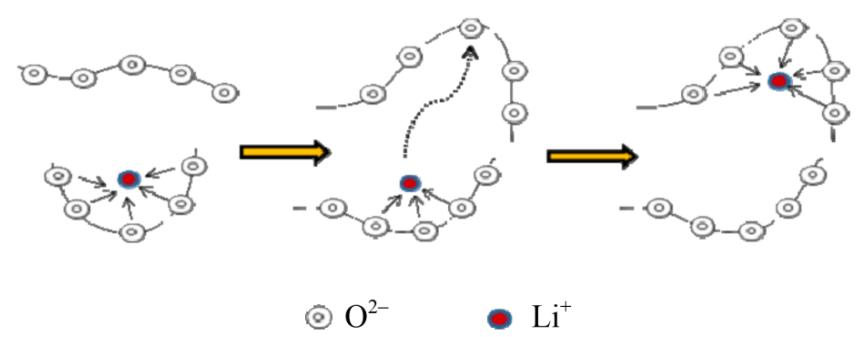

chemical

Diagram illustrating the formation of Li⁺ ions from O²⁻ and oxygen species, showing electron movement and structural changes.

资料来源：李杨等《全固态锂离子电池关键材料研究进展》；吴敬华等《固态锂电池十年回顾与展望》，HTI

图：不同电解质平均性能雷达图  
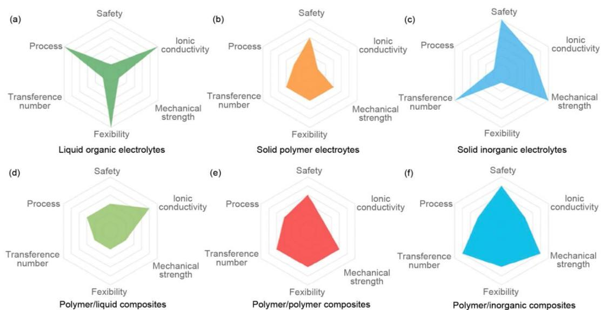

radar

| Electrode Type | Component | Safety | Flexibility | Process | Mechanical strength |
| --- | --- | --- | --- | --- | --- |
| Liquid organic electrolytes | Process | High | High | High | High |
| Liquid organic electrolytes | Transference number | Low | Low | Low | Low |
| Liquid organic electrolytes | Flexibility | High | High | High | High |
| Solid polymer electrolytes | Process | High | High | High | High |
| Solid polymer electrolytes | Transference number | Low | Low | Low | Low |
| Solid polymer electrolytes | Flexibility | High | High | High | High |
| Solid inorganic electrolytes | Process | High | High | High | High |
| Solid inorganic electrolytes | Transference number | Low | Low | Low | Low |
| Solid inorganic electrolytes | Flexibility | High | High | High | High |
| Polymer/liquid composites | Process | High | High | High | High |
| Polymer/liquid composites | Transference number | Low | Low | Low | Low |
| Polymer/liquid composites | Flexibility | High | High | High | High |
| Polymer/polymer composites | Process | High | High | High | High |
| Polymer/polymer composites | Transference number | Low | Low | Low | Low |
| Polymer/polymer composites | Flexibility | High | High | High | High |
| Polymer/inorganic composites | Process | High | High | High | High |
| Polymer/inorganic composites | Transference number | Low | Low | Low | Low |
| Polymer/inorganic composites | Flexibility | High | High | High | High |
| Polymer/inorganic composites | Process | High | High | High | High |
| Polymer/inorganic composites | Transference number | Low | Low | Low | Low |
| Polymer/inorganic composites | Flexibility | High | High | High | High |
| Polymer/inorganic composites (e) | Process | High | High | High | High |
| Polymer/inorganic composites (e) | Transference number | Low | Low | Low | Low |
| Polymer/inorganic composites (e) | Flexibility | High | High | High | High |
| Polymer/inorganic composites (f) | Process | High | High | High | High |
| Polymer/inorganic composites (f) | Transference number | Low | Low | Low | Low |
| Polymer/inorganic composites (f) | Flexibility | High | High | High | High |
| Polymer/inorganic composites (g) (d) | Process | High | High | High | High |
| Polymer/inorganic composites (g) (d) | Transference number | Low | Low | Low | Low |
| Polymer/inorganic composites (g) (d) | Flexibility | High | High | High | High |
| Polymer/inorganic composites (h) (c) | Process | High | High | High | High |
| Polymer/inorganic composites (h) (c) | Transference number | Low | Low | Low | Low |
| Polymer/inorganic composites (h) (c) | Flexibility | High | High | High | High |
| Polymer/inorganic composites (i) (d) (e) (f) (g) (h) (i) (g) (h) (i) (g) (h) (h) (i) (g) (h) (h) (i) (g) (h) (h) (i) (g) (h) (i) (g) (h) (i) (g) (h) (i) (g) (h) (i) (g) (h) (i) (g) (h) (i) (g) (h) (i) (g) (i) (i) (g) (i) (i) (g)

(a)有机电解质；(b)聚合物固体电解质；(c)无机固体电解质；(d)聚合物/液体复合电解质材料；(e)聚合物/聚合物复合材料；(f)聚合物/无机复合材料

单一电解质总是显示一定的弱点，复合电解质材料可以显著改善性能。

# 2.1.2氧化物固态电解质：种类丰富，性能各异

 优势：氧化物固态电解质按结构分类可分为NASICON结构、石榴石结构、钙钛矿结构、非晶态结构等，离子电导率良好，相较另外几种固态电解质具有成本优势，我国氧化物系固态电解质的研发非常活跃，NASICON结构$\mathsf { L i } _ { 1 . 3 } \mathsf { A l } _ { 0 . 3 } \mathsf { T i } _ { 1 . 7 } ( \mathsf { P O } _ { 4 } ) _ { 3 } ( \mathsf { L A T P } )$ 、石榴石结构 $\mathsf { L i } _ { 7 } \mathsf { L a } _ { 3 } \mathsf { Z r } _ { 2 } \mathsf { O } _ { 1 2 } ( \mathsf { L L } \mathsf { Z O } )$ 已有一定规模的生产,开始用于固态电池产业中。  
 缺点：晶界电导率有限、对 ${ \mathsf { H } } _ { 2 } { \mathsf { O } } \not \hbar ^ { \mathsf { a } } { \mathsf { C } } { \mathsf { O } } _ { 2 }$ 敏感、与电极之间固固界面相容性差等。  
 复合固态电解质：在聚合物质固态电解质中加入氧化物系固态电解质等无机填料合成复合固态电解质,具有高机械强度、良好柔韧性、低界面电阻的优点,可有效提高离子电导率，抑制电极-电解质界面上锂枝晶生长，增强电池化学稳定性。

图：氧化物固态电解质分类及性能

<table><tr><td>结构分类</td><td>典型材料</td><td>离子电导率(S/cm)</td><td>优点</td><td>缺点</td></tr><tr><td rowspan="3">NASICON结构</td><td> $Li_{1.3}Al_{0.3}Ti_{1.7}(PO_4)_3$ (LATP)</td><td> $1.4×10^{-4}$ </td><td rowspan="3">热稳定性好、对空气不敏感</td><td rowspan="3">低电势下 $Ti^{4+}$ 易被锂电极还原、与电极接触的固-固界面阻抗大、生产成本高难以量产</td></tr><tr><td> $Li_3Zr_2Si_2PO_{12}$ (LZSP)</td><td> $3.59×10^{-3}$ </td></tr><tr><td> $Li_{1+x}Al_xGe_{2-x}(PO_4)_3$ (LAGP)</td><td> $2.3×10^{-4}$ </td></tr><tr><td>石榴石结构</td><td> $Li_7La_3Zr_2O_{12}$ (LLZO)</td><td> $2.2×10^{-4}$ </td><td>高温下稳定、电化学窗口宽、对锂电极稳定</td><td>易在空气中产生钝化层、与电极接触的固-固界面阻抗大</td></tr><tr><td>钙钛矿结构</td><td> $Li_{0.33}La_{0.56}TiO_3$ (LLTO)</td><td> $1.31×10^{-4}$ </td><td>离子电导率高、对空气不敏感、电化学稳定窗口宽、断裂韧性高、易于加工</td><td>晶界电导率低、低电势下Ti4+易被锂电极还原、与电极接触的固-固界面阻抗大</td></tr><tr><td>非晶态结构</td><td> $Li_{3x}(PO_4)_yN_z$ </td><td> $4.91×10^{-6}$ </td><td>良好电化学窗口和热稳定性、对电极材料不敏感、界面相容性强、电子电导率极低</td><td>离子电导率有限、材料易碎裂、制备工艺复杂成本高</td></tr></table>

资料来源：王雅秋等《氧化物系锂离子固态电解质研究进展》，

图：氧化物固态电解质分类及发展  
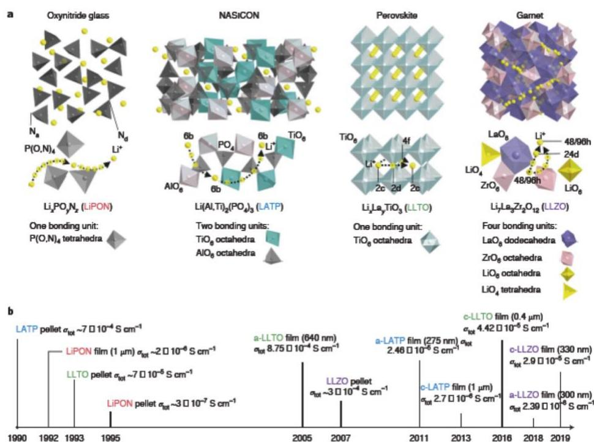

text_image

Oxynitride glass
NASICON
Perovskite
Garnet
Li3PO4N2 (LiPON)
One bonding unit:
P(O,N)4 tetrahedra
Li(Al,Ti)2(PO4)3 (LATP)
Two bonding units:
TiO6 octahedra
AlO6 octahedra
Li3La7TiO3 (LLTO)
One bonding unit:
TiO6 octahedra
Li7La8Zr2O12 (LLZO)
Four bonding units:
LaO6 dodecahedra
ZrO6 octahedra
LiO6 octahedra
LiO4 tetrahedra
b
LATP pellet σtot ~7 D 10-4 S cm-1
LiPON film (1 μm) σtot ~2 D 10-6 S cm-1
LLTO pellet σtot ~7 D 10-5 S cm-1
LiPON pellet σtot ~3 D 10-7 S cm-1
a-LLTO film (640 nm)
σtot 8.75 D 10-4 S cm-1
a-LATP film (275 nm) σtot
2.46 D 10-6 S cm-1
c-LATP film (1 μm)
σtot 2.7 D 10-8 S cm-1
c-LLTO film (0.4 μm)
σtot 4.42 D 10-6 S cm-1
c-LLZO film (330 nm)
σtot 2.9 D 10-5 S cm-1
a-LLZO film (300 nm)
σtot 2.39 D 10-8 S cm-1

请务必阅读正文之后的信息披露和法律声明

# 2.1.3卤化物固态电解质：重回研究视野，加快研发进展

 优势：（1）宽电化学窗口，氯基固态电解质可超过4V，氟基固态电解质氧化电位达6V，电化学窗口宽能够匹配高压正极材料；（2）质地柔软，在一定压力下可以实现与电极材料良好的界面接触；（3）可通过机械混合球磨、高温烧结、液相法等多种方式合成，满足商业化制备需求；（4）室温锂离子电导率较高。  
 缺点：多数卤化物固态电解质仍存在对水汽敏感、易发生结构相变、对锂金属负极稳定性差等问题。  
 目前卤化物固态电解质研究集中在：（1）优化电解质组分、结构，提高离子电导率；（2）提高与负极材料兼容性；（3）改善与正极材料的浸润性。规模化应用主要存在极片制备难度较高、固态电解质生产成本高的问题。

图：部分金属卤化物电解质的电导率及晶体结构特性

<table><tr><td>Materials</td><td>Conductivities/(S·cm-1)</td><td>Structures</td></tr><tr><td>LiI</td><td>10-7at RT</td><td>Cubic (Fm 3 m)</td></tr><tr><td>LiAlCL4</td><td>10-6at RT</td><td>Monoclinic (pw1/c)</td></tr><tr><td>Li2TiCl4</td><td>5 × 10-2at 400 °C</td><td>Inverse spinel</td></tr><tr><td>Li2MnCl4</td><td>4 × 10-6at 25 °C</td><td>Inverse spinel</td></tr><tr><td>Li1.52Mn1.24Cl4</td><td>1.5 × 10-5at 25 °C</td><td>Phase transition at 37–57 °C</td></tr><tr><td>Li6FeCl8</td><td>4.5 × 10-2at 400 °C</td><td>Suzuki structure, cubic</td></tr><tr><td>Li2CdCl4</td><td>5.9 × 10-5at 200 °C</td><td>Inverse spinel</td></tr><tr><td>Li2MgCl4</td><td>4.5 × 10-3at 200 °C</td><td>Inverse spinel</td></tr><tr><td>Li1.9Cd1.05Cl4</td><td>0.01 at 200 °C</td><td>Deficient inverse spinel</td></tr><tr><td>Li2FeCl4</td><td>1.9 × 10-5at 200 °C</td><td>Distorted orthorhombic structure, Imma</td></tr><tr><td>Li4PbI6</td><td>7 × 10-2at 297 °C</td><td>Deficient NaCl type</td></tr><tr><td>Li2PbI4</td><td>3 × 10-2at 297 °C</td><td>Deficient NaCl type</td></tr><tr><td>Li2MgBr4</td><td>2 × 10-2at 300 °C</td><td>Inverse spinel</td></tr><tr><td>Li3InCl6</td><td>1 × 10-3at 200 °C</td><td>Monoclinic (C2/m)</td></tr><tr><td>Li3InBr6</td><td>High temperature phase 1 × 10-3</td><td>Monoclinic (C2/m)</td></tr><tr><td>Li3InBr3Cl3</td><td>1 × 10-3at RT</td><td>Phase transition at 12 °C</td></tr><tr><td>LiInBr4</td><td>High temperature phase 1 × 10-3</td><td>Defect cubic spinel structure (Fd3m)</td></tr></table>

资料来源：陈帅等《卤化物固态电解质研究进展》，王凯《基于第四副族金属卤化物的

图：卤化物固态电解质的主要发展历程  
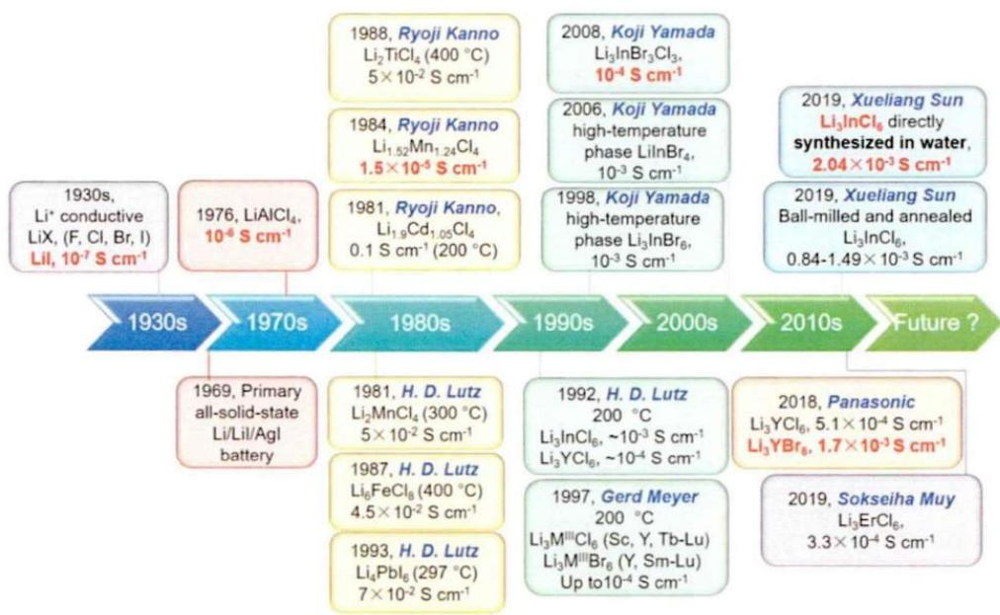

flowchart

```mermaid
graph LR
    A["1930s, Li+ conductive LiX, (F, Cl, Br, I) Lil, 10⁻⁷ S cm⁻¹"] --> B["1976, LiAlCl₄, 10⁻⁶ S cm⁻¹"]
    B --> C["1981, Ryoji Kanno, Li₁.₉Cd₁.₀₅Cl₄ 0.1 S cm⁻¹ (200 °C)"]
    C --> D["1984, Ryoji Kanno Li₁.₅₂Mn₁.₂₄Cl₄ 1.5 × 10⁻⁵ S cm⁻¹"]
    D --> E["1988, Ryoji Kanno Li₂TiCl₄ (400 °C) 5 × 10⁻² S cm⁻¹"]
    E --> F["2008, Koji Yamada Li₃InBr₃Cl₃, 10⁻⁴ S cm⁻¹"]
    F --> G["2006, Koji Yamada high-temperature phase LiInBr₄, 10⁻³ S cm⁻¹"]
    G --> H["1998, Koji Yamada high-temperature phase Li₃InBr₆, 10⁻³ S cm⁻¹"]
    H --> I["2006, Koji Yamada high-temperature phase Li₃InBr₆, 10⁻³ S cm⁻¹"]
    I --> J["2000s"]
    J --> K["2019, Xueliang Sun Li₃InCl₆ directly synthesized in water, 2.04 × 10⁻³ S cm⁻¹"]
    K --> L["2010s"]
    L --> M["Future ?"]
    M --> N["2018, Panasonic Li₃YCl₆, 5.1 × 10⁻⁴ S cm⁻¹ Li₃YBr₆, 1.7 × 10⁻³ S cm⁻¹"]
    N --> O["2019, Sokseiha Muy Li₃ErCl₆, 3.3 × 10⁻⁴ S cm⁻¹"]
    O --> P["2018, Panasonic Li₃YCl₆, 5.1 × 10⁻⁴ S cm⁻¹ Li₃YBr₆, 1.7 × 10⁻³ S cm⁻¹"]
    P --> Q["2019, Xueliang Sun Ball-milled and annealed Li₃InCl₆, 0.84 - 1.49 × 10⁻³ S cm⁻¹"]
    Q --> R["2019, Xueliang Sun Li₃InCl₆ directly synthesized in water, 2.04 × 10⁻³ S cm⁻¹"]
    R --> S["2018, Panasonic Li₃YCl₆, 5.1 × 10⁻⁴ S cm⁻¹ Li₃YBr₆, 1.7 × 10⁻³ S cm⁻¹"]
    S --> T["2019, Sokseiha Muy Li₃ErCl₆, 3.3 × 10⁻⁴ S cm⁻¹"]
    T --> U["2018, Panasonic Li₃YCl₆, 5.1 × 10⁻⁴ S cm⁻¹ Li₃YBr₆, 1.7 × 10⁻³ S cm⁻¹"]
    U --> V["2019, Xueliang Sun Li₃InCl₆ directly synthesized in water, 2.04 × 10⁻³ S cm⁻¹"]
    V --> W["2019, Xueliang Sun Ball-milled and annealed Li₃InCl₆, 0.84 - 1.49 × 10⁻³ S cm⁻¹"]
    W --> X["2019, Xueliang Sun Li₃InCl₆ directly synthesized in water, 2.04 × 10⁻³ S cm⁻¹"]
    X --> Y["2019, Xueliang Sun Ball-milled and annealed Li₃InCl₆"]
```

# 2.1.4 硫化物固态电解质：离子电导率高，力学性能良好

 硫化物优势显著：（1）离子电导率较高，通常在10-4\~10-2S/cm，原因在于硫原子半径较大、电负性小且具有相对较低的Li+结合能；（2）密度较小，有利于提升电池的整体能量密度；（3）机械性能较出色，具有良好的延展性和较低的硬度，有利于改善与电极材料的界面接触性。  
 缺点：较差的电化学与化学稳定性、差的空气稳定性、电解质与正负极界面易发生副反应、高成本等。  
 目前硫化物电解质研究以加速推进，但大规模商业化仍存在困难：（1）现有的电解质制备方法成本过高，且有较大的局限性，低成本的制备技术尚待开发；（2）硫化物电解质各方面性能的提升无法同时兼顾，需要研究新的提升策略；（3）全固态锂离子电池中，电极与电解质之间的界面问题仍是一大难点，需要进一步优化调控。

表：常用硫化物固态电解质的室温离子电导率

<table><tr><td>电解质</td><td>结晶形态</td><td>25°C离子电导率(S/cm)</td></tr><tr><td> $60Li_{2}S \cdot 40P_{2}S_{5}$ </td><td>玻璃态</td><td> $3.2 \times 10^{-6}$ </td></tr><tr><td> $80Li_{2}S \cdot 20P_{2}S_{5}$ </td><td>玻璃态</td><td> $1.3 \times 10^{-4}$ </td></tr><tr><td> $40Li_{2}S \cdot 28SiS_{2} \cdot 30LiI$ </td><td>玻璃陶瓷态</td><td> $1.8 \times 10^{-3}$ </td></tr><tr><td> $Li_{7}P_{2.9}Mn_{0.1}S_{10.7}I_{0.3}$ </td><td>玻璃陶瓷态</td><td> $5.6 \times 10^{-3}$ </td></tr><tr><td> $Li_{10}GeP_{2}S_{12}$ </td><td>晶态</td><td> $1.2 \times 10^{-2}$ </td></tr><tr><td> $Li_{10}SiP_{2}S_{12}$ </td><td>晶态</td><td> $2.3 \times 10^{-3}$ </td></tr><tr><td> $Li_{6}PS_{5}Cl$ </td><td>晶态</td><td> $1.9 \times 10^{-3}$ </td></tr><tr><td> $Li_{7}Ge_{3}PS_{12}$ </td><td>晶态</td><td> $1.1 \times 10^{-4}$ </td></tr><tr><td> $Li_{6.6}P_{0.4}Ge_{0.6}S_{5}I$ </td><td>晶态</td><td> $5.4 \times 10^{-3}$ </td></tr><tr><td> $\beta -Li_{3}PS_{4}-Li_{7}La_{3}Zr_{2}O_{12}$ </td><td>晶态</td><td> $2.4 \times 10^{-4}$ </td></tr></table>

图：硫化物电解质基固态电池中的界面问题  
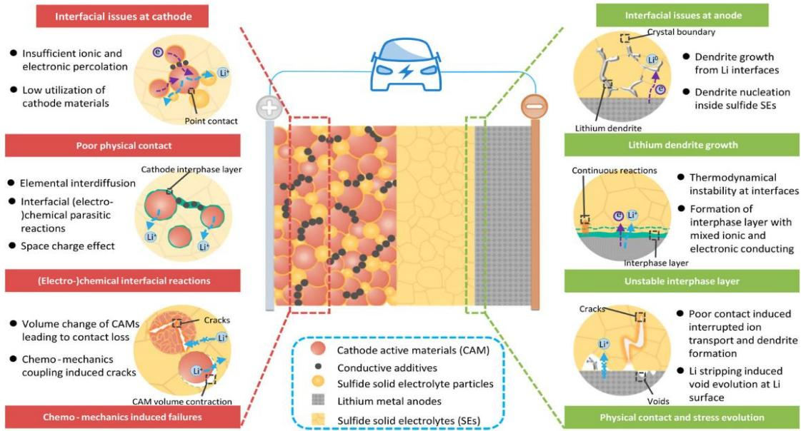

flowchart

```mermaid
graph TD
    A["Interfacial issues at cathode"] --> B["Point contact"]
    C["Poor physical contact"] --> D["Cathode interphase layer"]
    E["(Electro-)chemical interfacial reactions"] --> F["Volume change of CAMs leading to contact loss"]
    G["Chemo-mechanics induced failures"] --> H["Charm tube with cracks"]
    I["Interfacial issues at anode"] --> J["Lithium dendrite growth"]
    K["Unstable interphase layer"] --> L["Physical contact and stress evolution"]
    M["Interfacial issues at cathode"] --> N["Insufficient ionic and electronic percolation"]
    M --> O["Low utilization of cathode materials"]
    P["Interfacial issues at anode"] --> Q["Dendrite growth from Li interfaces"]
    P --> R["Dendrite nucleation inside sulfide SEs"]
    S["Interfacial issues at anode"] --> T["Lithium dendrite"]
    U["Unstable interphase layer"] --> V["Poor contact induced interrupted ion transport and dendrite formation"]
    U --> W["Li stripping induced void evolution at Li surface"]
```

# 硫化锂：硫化物固态电解质降本的关键

 硫化锂是硫化物固态电解质的关键原材料之一，纯度直接影响硫化物固态电解质性能。硫化锂制备合成所需的锂源、硫源价格并不贵，但硫化锂在空气中不稳定，易水解产生有毒硫化氢气体，且电池级硫化锂需要高纯度，其制备工艺对温度、水分、能耗等均有较高要求，因此硫化锂市场价格居高不下，占硫化物固态电解质成本接近80%，硫化锂降本也是硫化物固态电解质降本的重中之重。

 硫化锂合成方法主要包括机械球磨法（固相法、机械合成法等）、液相法（溶剂法）、高温还原法等。机械球磨、高温工艺由于长研磨时间、高温熔融温度，制造成本较高，工况控制、设备选型难度大幅增加；液相法工艺相对简单，可减少生产成本，适合大规模连续制备，但纯度、含水量较难控制，反应过程中会产生有毒硫化氢气体。

 根据高工锂电公众号，硫化锂现有工艺难以兼顾成本、规模、品质要求，参照每吨480万元售价，硫化物固态电解质生产成本超200万元/吨，全固态电芯材料成本约为2.2元/Wh。

图：硫化物固态电解质成本  
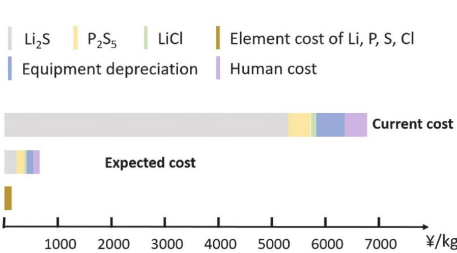

bar_stacked

| Component                  | Current cost (¥/kg) | Expected cost (¥/kg) |
| -------------------------- | ------------------- | -------------------- |
| Li₂S                       | ~5300               | ~400                 |
| P₂S₅                       | ~5700               | ~200                 |
| LiCl                       | ~600                | ~100                 |
| Equipment depreciation     | ~6200               | ~150                 |
| Element cost of Li, P, S, Cl | ~6500               | ~100                 |
| Human cost                 | ~6700               | ~150                 |

表：硫化锂研发进展

<table><tr><td>公司</td><td>进展</td></tr><tr><td>恩捷股份</td><td>2021年12月成立控股子公司湖南恩捷,布局全固态电池电解质相关产品,目前固态用高纯硫化锂产品已完成小试吨级年产能建设和运行,百吨级硫化锂中试正加快推进相关试生产工作。</td></tr><tr><td>有研新材</td><td>固态电解质用高纯硫化锂项目在持续研发阶段,可实现产品小批量稳定制备。</td></tr><tr><td>天齐锂业</td><td>已完成下一代固态电池关键原材料硫化锂产业化相关支持工作,累计与十余家下游客户进行打样。</td></tr><tr><td>厦钨新能</td><td>凭借深厚的技术沉淀,开发出新的硫化锂合成工艺,目前从小试、中试结果来看,技术指标良好,降本空间较大。</td></tr><tr><td>泰和科技</td><td>“硫化锂的合成技术研究”项目已完成小试,转入中试状态,尚未完成中试。</td></tr></table>

# 2.2 正极：高镍三元、富锂锰基为当前主流方向

高比能、高能量密度是主要方向：固态电池正极材料方面相比传统液态锂离子电池变化较小，关键是要与固态电解质进行配套，固态电解质能够承受更高电压，因此可使用高电压平台正极材料，提升工作电压以提高能量密度。固态电池中正极材料向高比能、高能量密度的方向发展，当前固态电池正极材料开发主要集中在高镍三元、镍锰酸锂、富锂锰基等路线。

 富锂锰基是全固态电池可选用的理想正极材料，具有高电压、高放电比容量的优势，且成本较低，限制其商业化的原因是首次库伦效率低、容量和电压衰减严重、倍率性能差等缺陷，可通过掺杂、包覆、表面处理等方式对其进行改性。

表：商用锂电正极与富锂锰基（LRMOs）性能对比

<table><tr><td>正极材料</td><td>结构类型</td><td>放电平均对锂电位(V)</td><td>理论放电比容量(mAh/g)</td><td>实际平均放电比容量(mAh/g)</td></tr><tr><td> $Li_{2}Mn_{2}O_{4}$ </td><td>尖晶石</td><td>4.0</td><td>148</td><td>110</td></tr><tr><td> $LiFePO_{4}$ </td><td>橄榄石</td><td>2.3-2.5</td><td>170</td><td>150</td></tr><tr><td> $LiCoO_{2}$ </td><td>层状</td><td>3.7-3.9</td><td>274</td><td>150</td></tr><tr><td> $LiNi_{1/3}Co_{1/3}Mn_{1/3}O_{2}$ </td><td>层状</td><td>3.8-4.0</td><td>275</td><td>160</td></tr><tr><td> $LiNi_{0.80}Co_{0.15}Al_{0.05}$ </td><td>层状</td><td>3.8</td><td>279</td><td>200</td></tr><tr><td> $LiNi_{0.80}Co_{0.10}Mn_{0.10}O_{2}$ </td><td>层状</td><td>3.8</td><td>275</td><td>200</td></tr><tr><td> $xLi_{2}MnO_{3}\cdot(1-x)LiTMO_{2}$ </td><td>层状</td><td>3.6</td><td>-</td><td>&gt;250</td></tr></table>

资料来源：高工锂电，童汇等《富锂锰基正极材料研究进展》，各公司投资者问答，HTI

表：正极材料厂研发进度梳理

<table><tr><td>正极、前驱体</td><td>进展</td></tr><tr><td>容百科技</td><td>24年1-3Q公司半固态电池用超高镍三元正极材料保持稳定出货。全固态电池用超高镍三元正极材料及硫化物电解质材料得到多家海内外客户的认证,容量与循环性能保持领先,前三季度持续稳定出货;硫化物、卤化物及氧化物固态电解质等关键材料在国内外多家整车及电芯客户测试中性能领先。</td></tr><tr><td>当升科技</td><td>系统布局氧化物、硫化物等固态电解质和双相复合高能量固态正极材料关键技术路线,同清陶辉能、卫蓝、赣锋等客户建立紧密战略合作关系并实现装车应用;高电化学活性、超高镍固态专用大尺寸单晶正极材料,获得固态电池龙头企业高度认可,率先实现批量装车应用;高容量高密度富锂锰基材料性能指标在行业领先,已完成关键客户导入并逐步放量。</td></tr><tr><td>天力锂能</td><td>9系高镍产品目前在固态电池的头部公司完成小试及中试测试,搭配固态及半固态电池体系发挥出了良好的电池性能,电池包能量密度≥400wh/kg,预计在2025年中旬有突破性应用进展。</td></tr><tr><td>五矿新能/长远锂科</td><td>积极着手布局固态电池技术,与行业内主流固态电池企业合作的项目进展顺利,参与固态电池正极相关行业标准的立项工作。</td></tr><tr><td>厦钨新能</td><td>1、固态电池正极材料:(1)开发出适配于新型卤化物全固态电池的高电压钴酸锂及高电压三元材料;(2)积极配合国内外客户开发适用于硫化物全固态的单晶正极材料,在低应变掺杂和均匀化离子导体包覆技术上取得重大突破;(3)与日韩客户合作开发硫化物全固态高镍多晶正极材料,湿法化学方法实现表面固态电解质均匀包覆。2、固态电解质方面:(1)成功开发出第二代低残碱、高比表的锂镧锆氧LLZO,应用在正极材料包覆、正负极添加剂;(2)开发出磷酸钛铝锂LATP粉体和浆料等两种规格体系,应用在正极材料包覆、隔膜涂覆,有效改善安全性。</td></tr><tr><td>华友钴业</td><td>超高镍三元正极材料已百吨级批量用于eVTOL低空飞行器和半固态汽车动力电池;超高镍三元富锂锰基双路径固态电池材料齐头并进。</td></tr><tr><td>格林美</td><td>固态电池前驱体方面,9系超高镍前驱体小规模量产,开发出3-4微米尺寸小粒径高BET固态电池前驱体材料,目前在多家企业进行认证,进展顺利,9系某款固态电池用前驱体产品已实现小批量量产,富锂锰基与镍锰尖晶石类进入吨级认证。</td></tr></table>

# 2.3 负极：高比能负极材料是主流趋势

 负极材料发展与应用遵循着从石墨到硅碳，再到硅氧，最终迈向金属锂的清晰路径。采用金属锂作为负极，有望提升电池40-50%的能量密度，为电池性能带来显著的改善。  
固态电池负极材料主要有碳族负极、硅基负极、金属锂负极3类。

 石墨负极理论比容量有限，不能进一步提升电池能量密度，硅基负极、金属锂负极比容量更高；硅基负极电子电导较低，锂离子扩散系数较低，嵌锂过程体积膨胀巨大，循环过程中伴随着SEI重复生成、电极粉化，最终导致电极失效；锂金属负极难点在于界面反应、锂枝晶生长、体积膨胀。

 目前固态电池研发中，硅碳负极、硅基负极、锂金属负极是主流趋势，锂金属负极具有高比容量、低电位、低密度等优点，是全固态电池的终极目标。

图：硅负极失效机理（a）硅颗粒的体积变化和粉碎失活，（b）硅电极的形貌变化,（c）SEI膜的形成  
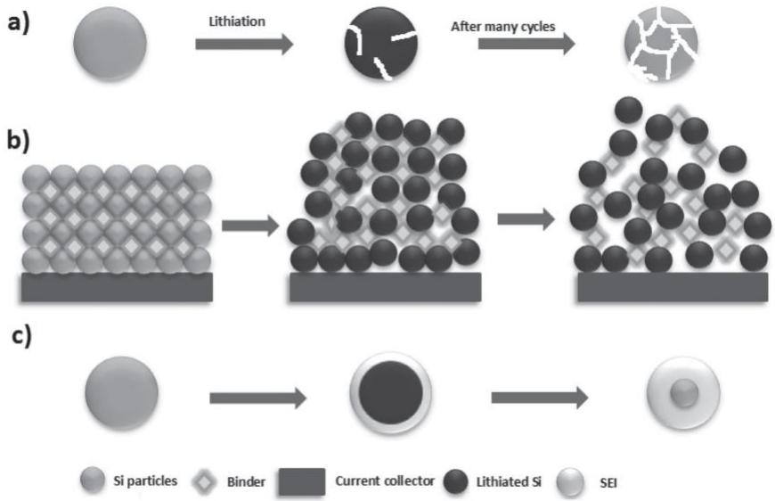

flowchart

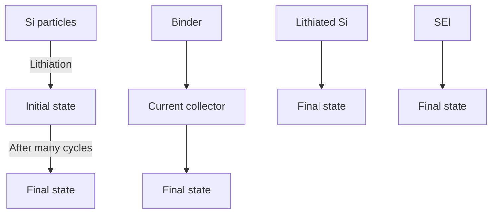
```mermaid
graph TD
    A["Si particles"] -->|Lithiation| B["Initial state"]
    B -->|After many cycles| C["Final state"]
    D["Binder"] --> E["Current collector"]
    E --> F["Final state"]
    G["Lithiated Si"] --> H["Final state"]
    I["SEI"] --> J["Final state"]
```

资料来源：闫汶琳《含硅负极构筑高性能硫化物全固态电池》，M.H. Rahman, et al. Nanostructured Silicon Anodes for High-Performance Lithium-Io Batteries，各公司投资者问答，HTI 18

表：负极材料厂研发进度梳理

<table><tr><td>负极厂商</td><td>进展</td></tr><tr><td>尚太科技</td><td>硅碳负极是公司年重点研发方向之一,已组建成熟技术团队,并构建相应中试生产线。</td></tr><tr><td>贝特瑞</td><td>1、公司在固态电池领域优先开发半固态关键材料(氧化物、聚合物固态电解质),布局全固态关键材料(硫化物固态电解质),同时储备相应工艺技术。已开发出多款新型固态电解质材料,其中低成本、高离子电导率的LATP(磷酸钛铝锂)氧化物固态电解质已实现吨级出货。2、公司硅基负极材料已实现大规模产业化,2024年上半年,公司硅基负极材料市占率在70%左右,出货量持续行业领先。3、公司已给半固态电池厂商小批量供应高镍正极材料。</td></tr><tr><td>中科电气</td><td>公司对硅基类负极(包括面向固态电池的硅碳负极)有持续进行投入,目前已建设完成中试产线,且有产品向客户送样测试并获得认可。公司在固态电池相关硅碳负极、锂金属负极等方面均有开发和产品布局。</td></tr><tr><td>翔丰华</td><td>公司是清陶能源的战略合作供应商,一直批量供货给清陶能源石墨负极材料,硅碳负极材料正在跟客户配套中试;并与清陶能源签署战略合作协议,双方约定将在固态/半固态电池高比容负极材料关键技术研发、供应等方面达成全面战略合作。</td></tr><tr><td>璞泰来n</td><td>公司于2024年6-7月与北京恩力、中科固能签订了战略合作协议。在前述固态电池领域的合作项目中,公司提供先进的相关材料和设备技术支持,包括负极材料(含硅碳负极、锂金属负极)、复合极板材料、固态电解质、固态电解质复合膜等材料以及固态电池全线设备和新设备的开发等,为战略合作提供最直接、最充分的先进材料、设备、工艺技术及研发力量的支持。</td></tr></table>

 传统液态锂电池与全固态锂电池集流体要求不同：传统锂电池集流体需要具有高的机械强度支撑，同时厚度减薄有利于提高电池能量密度。全固态锂电池呈现全新的界面相互作用和化学机械行为，传统集流体的强度、化学和电化学性能不能满足全固态电池需求，全固态电池集流体要求有较高强度防止断裂、高界面相容性防止活性材料脱离、良好的弹性-塑性释放应力。  
 固态电池需特殊铜箔适配：复合集流体是目前的研发方向；德福科技、诺德股份等铜箔厂商也已研发出高强度锂电铜箔、多孔铜箔、双面毛锂电铜箔、泡沫铜箔等产品，相比传统铜箔，能够更好的匹配金属氧化物负极和锂金属负极，适应固态电池对铜箔集流体的特殊需求。

图：传统液态电池与全固态电池集流体选择原则   
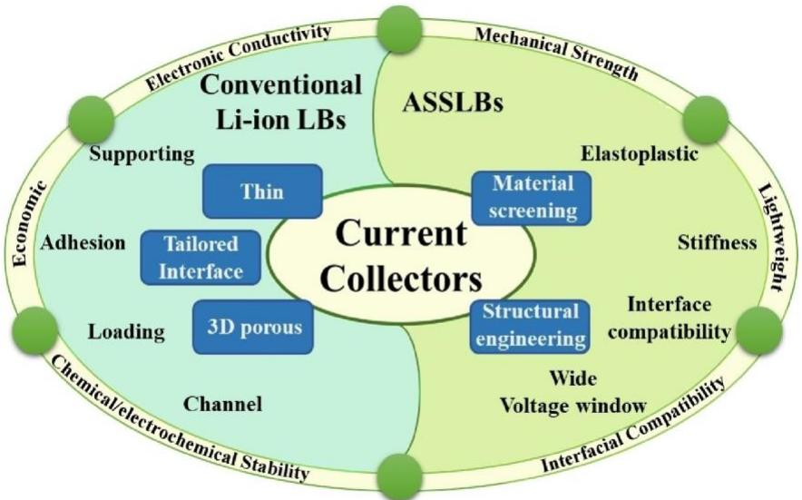

flowchart

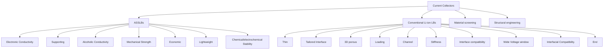
```mermaid
graph TD
    A["Current Collectors"] --> B["ASSLBs"]
    A --> C["Conventional Li-ion LBs"]
    A --> D["Material screening"]
    A --> E["Structural engineering"]
    B --> F["Electronic Conductivity"]
    B --> G["Supporting"]
    B --> H["Alcoholic Conductivity"]
    B --> I["Mechanical Strength"]
    B --> J["Economic"]
    B --> K["Lightweight"]
    B --> L["Chemical/electrochemical Stability"]
    C --> M["Thin"]
    C --> N["Tailored Interface"]
    C --> O["3D porous"]
    C --> P["Loading"]
    C --> Q["Channel"]
    C --> R["Stiffness"]
    C --> S["Interface compatibility"]
    C --> T["Wide Voltage window"]
    C --> U["Interfacial Compatibility"]
    C --> V["End"]
```

资料来源：Y.Zhang, et al. Developments, Novel Concepts, and Challenges of Current Collectors: From Conventional Lithium Batteries to All-Solid-State Batteries 德福科技专利及招股说明书，HTI 19

图：德福科技不同类型多孔铜箔产品  
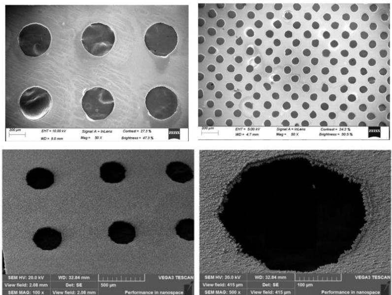  
请务必阅读正文之后的信息披露和法律声明

1.固态电池：产业化进程加速，未来市场空间广阔

1.1固态电池：技术路线进步，产业化进程加速   
1.2空间：固态电池远期空间广阔   
1.3复盘：行业发展早期，行情多为事件热点驱动

2.技术路线：固态电解质是核心，正负极向高性能方向迭代

2.1电解质：多技术路线并行，性能各有优劣

2.1.1聚合物固态电解质：复合固态电解质开启新空间  
2.1.2氧化物固态电解质：种类丰富，性能各异  
2.1.3卤化物固态电解质：重回研究视野，加快研发进展  
2.1.4硫化物固态电解质：离子电导率高，力学性能良好

2.2正极：高镍三元、富锂锰基为当前主流方向  
2.3负极：高比能负极材料是主流趋势  
2.4铜箔：多孔铜箔能够适配固态电池特殊需求

3.产业化进行时：多线并行，研发竞速

3.1 动力电池技术发展路线：液态—半固态—准固态—全固态  
3.2国内外格局：方向多元，研发竞速，关键材料体系尚未明确；头部引领，二三线仍有机会突围  
3.3难点：全固态电池产业化目前面临三大瓶颈   
3.4进程：全固态电池何时产业化落地？  
3.5设备端：固态电池产业化，专用设备先行

4.一级固态电池公司梳理  
5.标的及投资建议  
6.风险提示

# 3.1 动力电池技术发展路线：液态—半固态—准固态—全固态

半固态、全固态齐头并进，产业化进程加速：受制于技术发展因素，高能量密度全固态锂电池实现产业化还需要一定时间。首先能够实现规模化量产的是介于液态锂离子与全固态锂电池之间的电池类型，目前半固态电池、全固态电池齐头并进，半固态电池成本及技术难度低于全固态电池，目前已实现装车，产业化进程稍快于全固态电池。

固态电池，大势所趋：从液态电池向固态电池的转化，是电池技术发展的长期趋势，主要推动力在于电池安全性及能量密度。安全性主要是热稳定性、锂枝晶两大问题；能量密度可通过引入新型负极材料及正极材料得到提升。固态电池发展备受重视，根据中国日报报道，中国或将投入约60亿元用于全固态电池研发，包括宁德时代、比亚迪、一汽、上汽、卫蓝新能源和吉利共六家企业或获得政府基础研发支持。

图：动力电池从液态-半固态-准固态-全固态的发展路径  
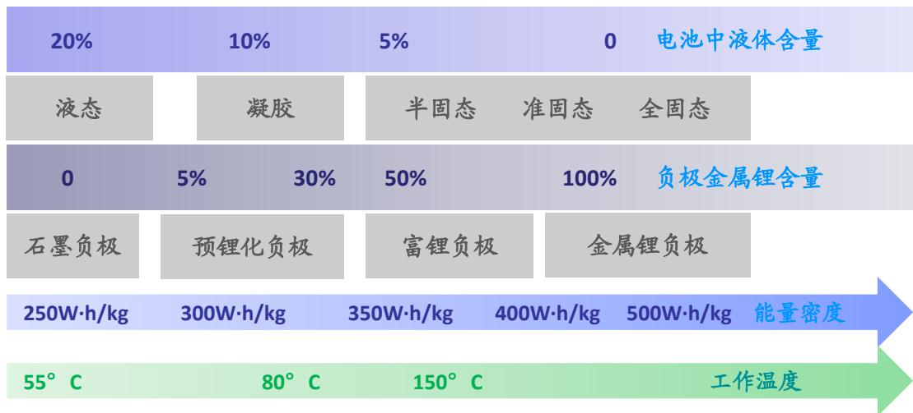

other

| Category | Value |
| -------- | ----- |
| 液态 | 20% |
| 凝胶 | 10% |
| 半固态 | 5% |
| 准固态 | 0 |
| 全固态 | 0 |
| 负极金属锂含量 | 0 |
| 石墨负极 | 5% |
| 预锂化负极 | 30% |
| 富锂负极 | 50% |
| 金属锂负极 | 100% |
| 250W·h/kg | 250W·h/kg |
| 300W·h/kg | 300W·h/kg |
| 350W·h/kg | 350W·h/kg |
| 400W·h/kg | 400W·h/kg |
| 500W·h/kg | 500W·h/kg |
| 能量密度 | 500W·h/kg |
| 55°C | 80°C |
| 工作温度 | 150°C |

资料来源：李泓等《固态锂电池研发愿景和策略》，李泓、陈立泉《固态电池关键材料体系发展研究》，HTI

图：从液态到全固态电池的技术发展路线  
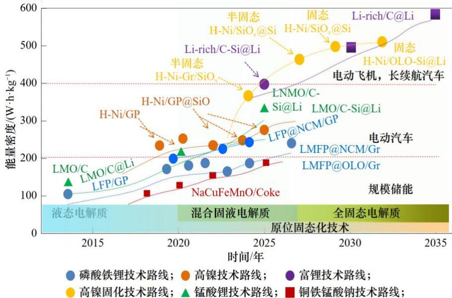  
请务必阅读正文之后的信息披露和法律声明

# 3.2国内外格局：方向多元，研发竞速，关键材料体系尚未明确

 固态电池技术作为锂电池未来必争的技术高地，目前美国、日本、韩国、欧洲等全球主要国家均在加快固态电池布局，固态电池技术的发展在未来将重塑全球电池体系新格局。  
 日本：日本固态电池企业起步较早，主流技术路线采用硫化物固态电解质，关键材料及下游车企积极参与固态固态电池研发，松下电器计划2025年实现固态电池市场化应用，丰田、本田等车企计划2028-2030年实现固态电池规模化、商业化应用；  
 韩国：韩国固态电池发展思路为重量轻的硫化物全固态电池以及高安全性的氧化物全固态电池，韩国电池企业初步规划在2027年实现全固态电池商业化应用；  
 欧美：欧美多选择聚合物、氧化物路线。美国电池企业关键材料大多依赖进口，QuantumScape、SolidPower等固态电池主要企业计划在2025年前后实现装车示范应用，目前美国固态电池在航空领域的应用处于世界前列。欧洲目前正在积极推动包括固态电池在内的先进电池技术发展，但整体尚未形成完善的电池产业体系。

表：国外典型企业固态电池技术路线

<table><tr><td>国家</td><td>企业名称</td><td>技术路线</td></tr><tr><td rowspan="8">日本</td><td>丰田汽车</td><td>硫化物</td></tr><tr><td>三菱化学/日产汽车公司联盟</td><td>硫化物</td></tr><tr><td>松下电器</td><td>卤化物</td></tr><tr><td>富士电气化学有限公司</td><td>氧化物</td></tr><tr><td>小原股份有限公司</td><td>氧化物</td></tr><tr><td>日立造船公司</td><td>硫化物</td></tr><tr><td>三洋化成工业股份有限公司</td><td>聚合物</td></tr><tr><td>日本出光兴产股份有限公司</td><td>硫化物</td></tr><tr><td rowspan="2">德国</td><td>宝马集团</td><td>硫化物</td></tr><tr><td>大众集团</td><td>氧化物</td></tr></table>

资料来源：李泓、陈立泉《固态电池关键材料体系发展研  
究》，HTI

<table><tr><td>国家</td><td>企业名称</td><td>技术路线</td></tr><tr><td rowspan="4">韩国</td><td>LG新能源</td><td>硫化物</td></tr><tr><td>现代汽车</td><td>聚合物/硫化物</td></tr><tr><td>SKOn</td><td>硫化物/氧化物</td></tr><tr><td>三星SDI</td><td>聚合物/硫化物</td></tr><tr><td>法国</td><td>博洛雷集团</td><td>聚合物</td></tr><tr><td rowspan="2">英国</td><td>Ilika</td><td>氧化物</td></tr><tr><td>LiNaEnergy</td><td>氧化物</td></tr><tr><td rowspan="4">美国</td><td>QuantumScape</td><td>氧化物</td></tr><tr><td>IonicMaterials</td><td>聚合物</td></tr><tr><td>SolidPower</td><td>硫化物</td></tr><tr><td>FactorialEnergy</td><td>聚合物</td></tr></table>

请务必阅读正文之后的信息披露和法律声明

# 3.2国内外格局：头部引领，二三线仍有机会突围

 目前国内外主要国家、地区加速固态电池研发布局，但还未形成完整的固态电池产业链，关键材料体系还未明确，全固态电池的瓶颈还未突破，仍存在固固界面接触不良、成本较高等问题，全固态电池的商业化应用任重道远。

 我们认为，从企业端看，头部企业引领，在技术研发、资金支持、上下游协同等方面具有优势，但目前关键材料体系未明确，二三线企业仍有机会在固态电池这项新技术上实现突围。

表：我国典型企业固态电池技术路线及进展

<table><tr><td>企业名称</td><td>技术路线</td><td>进展</td></tr><tr><td>卫蓝新能源</td><td>氧化物/聚合物</td><td>360Wh/kg高能量密度动力电芯2023年底量产交付蔚来汽车,并获多家知名整车厂定点。280Ah超高安全储能电芯已于2023年下半年量产交付,为三峡、海博思创、国电投等多个储能项目供货。320Wh/kg高能量密度低空经济动力电芯目前已为多家国内外无人机、机器人、便携电源等客户供货。</td></tr><tr><td>清陶能源</td><td>氧化物/复合物</td><td>第一代半固态电池已上车智己L6,采用氧聚复合路线;第二代准固态电池电解液含量将降低至5%以下,实现20%降本,公司预计2025年开始规模搭载于上汽MG等车型上;第三代全固态电池可实现超过500Wh/kg的能量密度,并计划于2026年四季度以40%的降本实现量产、2027年实现装车交付。</td></tr><tr><td>赣锋锂业</td><td>氧化物</td><td>赣锋锂电生产的固态电池已于2022年搭载在东风E70型汽车上;公司第一代固液混合电池已初步实现量产,第二代固液混合电池目前尚处于研发阶段,开发的高比能电池能量密度达到420Wh/kg,循环寿命超700次,并开发出能量密度达到500Wh/kg的样品,可通过200°C热箱与针刺等严苛的安全测试。</td></tr><tr><td>辉能科技</td><td>氧化物</td><td>全球首条固态电池生产线已正式投产,固态电池的样品已发到各大新能源车企进行测试、开发模块,此次工厂生产的固态电池是大型锂陶瓷电池(LLCB),其在性能方面可做到充电12分钟可达80%的电量,且在充满电状态下,可实现电动汽车超1000km的续航里程。</td></tr><tr><td>蜂巢能源</td><td>硫化物</td><td>聚焦硫化物路线,已具备20Ah全固态电池的制备能力,能量密度达到380Wh/kg公司全固态定位400Wh/kg以上,主要覆盖800公里及1000公里以上高端车型,预估将在2030年后实现装车。</td></tr><tr><td>宁德时代</td><td>硫化物</td><td>如果用技术和制造成熟度作为评价体系(以1-9打分),宁德时代的全固态电池研发目前处于4分的水平,目标是到2027年达到7-8分的水平,届时可小批量生产全固态电池,硫化物路线是公司目前投入研发较多的技术路线,目标全固态电池占电池市场份额1%。</td></tr><tr><td>弗迪电池</td><td>氧化物/硫化物</td><td>采用高镍三元(单晶)+硅基负极(低膨胀)+硫化物电解质(复合卤化物)的技术路线,电池包能量密度超过280Wh/kg。2027年或将小批量生产,搭载于比亚迪高端车型,示范项目约1000台。2030年公司预计将有4万台车辆搭载全固态电池。2033年预计将有12万台车辆搭载全固态电池。</td></tr><tr><td>国轩高科</td><td>硫化物</td><td>24年5月推出首款全固态电池金石电池,该电池可实现350Wh/kg的能量密度,基于金石电池的电池包系统能量密度可达到280Wh/kg。公司全固态电池计划2027年小批量上车实验。</td></tr><tr><td>中科深蓝汇泽</td><td>聚合物</td><td>技术传承于中科院青能所,第一代固态电池能量密度达220-250Wh/kg,已实现稳定量产;第二代能量密度300-360Wh/kg,已具备量产条件;到第四代固态电池能量密度达到500-600Wh/kg,已实现装机验证。</td></tr><tr><td>太蓝新能源</td><td>氧化物</td><td>与长安汽车联合发布无隔膜固态电池。4-3-2-1路线:传统液态电池基础上首先减掉隔膜和部分电解液,这是太蓝最先量产、装车的半固态电池产品阶段;其次是完全减掉电解液的全固态电池,将率先应用在一些细分专业领域,比如低空飞行器、便携消费电子产品等;最后减掉负极,只留下正极。</td></tr><tr><td>恩力动力</td><td>硫化物</td><td>恩力动力固态电池PACK工厂项目落户廊坊广阳,公司预计2024年实现GWh级产能达产,并且在2026年实现10GWh级产线量产。</td></tr><tr><td>屹锂新能源</td><td>硫化物</td><td>公司硫化物全固态电池已成功研发并制备出2Ah及5Ah的全固态电池软包电芯,能量密度达410Wh/kg,充放电循环寿命达2000次以上;硫化物固态电解质主要为LPSCI,离子电导率突破17mS/cm。上海临港中试基地一期产能100MWh/年,二期产能300MWh/年,规划在江西于都投建500MWh/年消费电子产线。目前公司固态电解质已形成订单向国内头部电池及主机厂供应,小Ah全固态电池会率先在消费电子领域实现商用。</td></tr><tr><td>高能时代</td><td>硫化物</td><td>高能时代硫化物全固态电池已经完成20Ah级全固态电芯A样开发,正在搭建中试线,公司预计2024年底实现5Ah以内硫化物全固态电池量产。</td></tr><tr><td>孚能科技</td><td>氧化物/硫化物</td><td>公司半固态电池从2018年开始开发,2022年9月开始投产,第一代半固态已装车岚图追光、梦想家。</td></tr></table>

资料来源：卫蓝新能源、清陶能源官网，高工锂电公众号，CATL宁德时代、中国国际电池展公众号，Voltaplus公众号，

# 界面问题：广泛存在于各种体系固态电池，仍未完全解决

电极-电解质界面问题广泛存在于目前正在研发的各种体系固态电池中，根据产生原因分为两类：

 化学/电化学界面问题：主要包括电解质电化学稳定窗口窄、界面处元素互相扩散、空间电荷层等；  
 物理界面问题：主要源于固态电解质的刚性界面接触、循环过程中材料体积变化和应力积累导致的材料破碎和粉化。

一个电池系统中往往多个界面问题同时存在，影响电池的性能，界面化学/电化学稳定性是影响固态电池电化学性能的重要因素，决定全固态电池能否长期循环，良好的物理界面接触能够确保有足够的接触面积和离子传输路径，对各类固态电解质至关重要。  
 目前针对固固界面接触带来的稳定性和电导率问题，还未能找到较好的解决办法。

图：固态电池界面问题示意图

（a）化学/电化学界面问题示意图；

（b）物理界面问题示意图

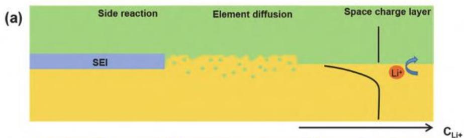

text_image

(a)
Side reaction
Element diffusion
Space charge layer
SEI
Li+
C_Li+

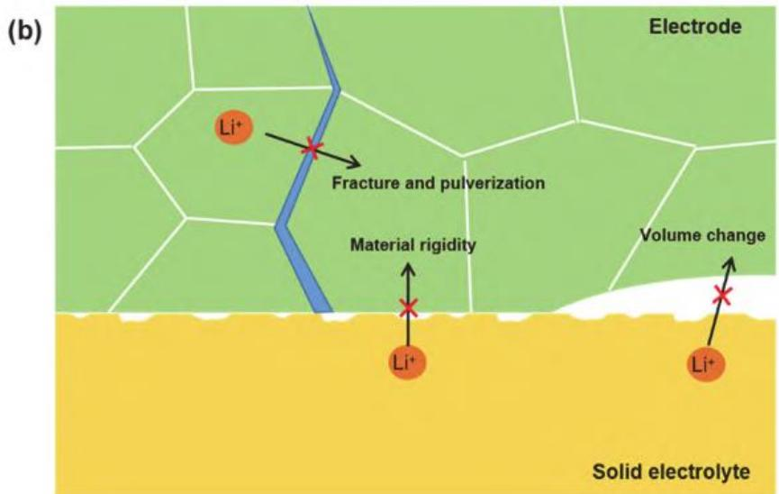

text_image

(b)
Electrode
Li+
Fracture and pulverization
Material rigidity
Volume change
Li+
Li+
Solid electrolyte

# 锂枝晶问题：造成短路，导致电池失效

锂枝晶易造成电池短路，严重情况下回引发热失控：锂离子在负极沉积过程中，会自发形成树枝状的锂枝晶，其尖锐结构易刺破隔膜，导致电池短路，造成安全隐患。  
 固态电池中同样存在锂枝晶问题：由于固态介质的问题，固态电池在充放电过程中容易出现不均匀沉积的现象，进而导致空穴和极化现象，影响固态电池的性能和使用寿命，即使在较低的电流密度下锂枝晶仍然能够刺穿固态电解质并引发短路。

图：（b）虚拟截面图像片显示了裂纹在最初原始电解质中的生长过程图；（c）树枝状突起在镀锂（顶部）表面(i)-(iii)，形成一个横向裂缝，直至电池短路(iv)-(ix)。

b Plated electrode   
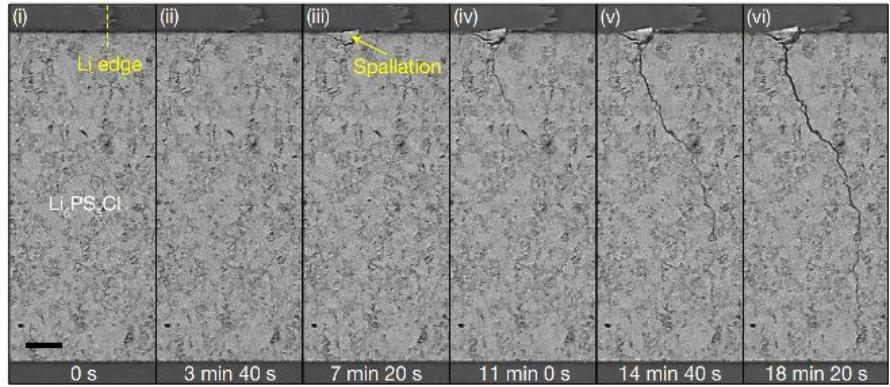

text_image

(i)
Li edge
Li2PS2Cl
0 s
(ii)
(iii)
Spallation
(iv)
(v)
(vi)
3 min 40 s
7 min 20 s
11 min 0 s
14 min 40 s
18 min 20 s

Stripped electrode   
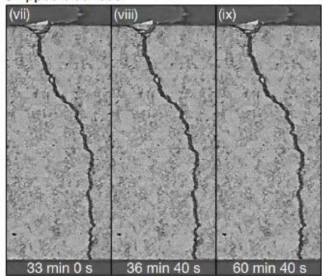

text_image

(vii)
(viii)
(ix)
33 min 0 s
36 min 40 s
60 min 40 s

C   
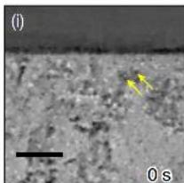

natural_image

Microscopic surface image with yellow arrow and scale bar, labeled (i) and 0 s (no readable text or symbols)

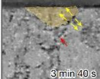

natural_image

Grayscale image showing a textured surface with a yellow arrow and red marker, labeled '3 min 40 s' at bottom (no other text or symbols)

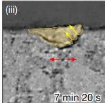

natural_image

Close-up of a small, irregularly shaped object on a textured surface with directional arrows and time label (7 min 20 s), no readable text or symbols beyond annotations.

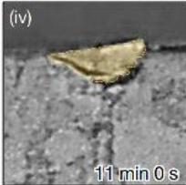

natural_image

Microscopic view of a yellowish particle on a textured surface, labeled (iv) and 11 min 0 s (no other text or symbols)

# 3.3难点：全固态电池产业化目前面临三大瓶颈

# 成本问题：目前固态电池材料成本高昂，成本结构失衡

 目前固态电池还处于密集研发阶段，材料成本高昂：根据高工锂电公众号，仅硫化物固态电解质成本就达到2万元/kg，产业链初期行业尚未形成稳定透明的成本结构，材料价格波动较大，总体成本受固态电池技术影响很大。  
 随着技术成熟以及规模效应，远期固态电池综合成本有望大幅下降：根据TrendForce集邦咨询公众号，目前半固态电池在电动车的装车量已达GWh等级，由于制造规模小，制造工艺不成熟，半固态电池量产初期的电芯价格高于1元/Wh，预计随着制造规模扩大、技术成熟度提升，半固态电池综合成本有望降于2035年降至0.4元/Wh。全固态电池正从样品电芯进入工程化，同样将面临量产初期成本高而垫高产品价格的问题。TrendForce集邦咨询预估，2030年后当全固态电池应用规模大于10GWh，电芯价格将降至1元人民币/Wh左右；2035年经过市场大规模快速推广，电芯价格将有机会降至0.6-0.7元人民币/Wh。

图：固态电池成本随着工艺成熟、规模化将会大幅降低（弗迪电池）  
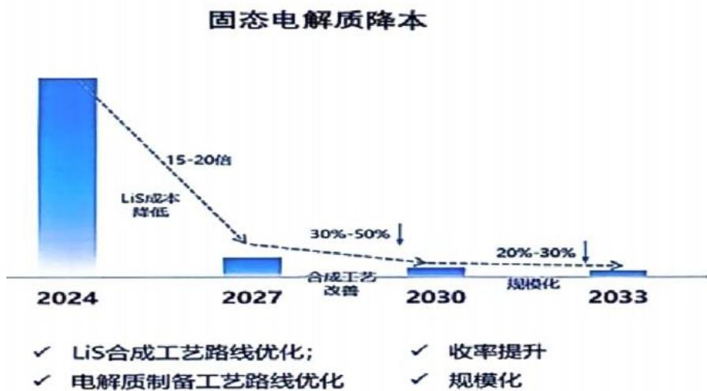

bar_line

| Year | LiS成本降低倍数 | 合成工艺改善 | 规模化 | 收率提升 | 规模化 |
|------|------------------|--------------|--------|----------|--------|
| 2024 | 15-20倍          | -            | -      | -        | -      |
| 2027 | -                | -            | -      | -        | -      |
| 2030 | -                | -            | -      | -        | -      |
| 2033 | -                | -            | -      | -        | -      |

固态电池降本  
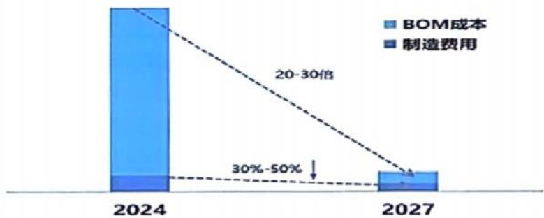

bar_line

| 年份 | BOM成本 (倍) | 制造费用 (倍) |
|---|---|---|
| 2024 | 20-30 | 30%-50% |
| 2027 | - | - |

低制造费用途径：产品良率+规模化+工艺优化等

低BOM成本途径：电解质降本、低电解质用量设计等

# 3.4进程：全固态电池何时产业化落地？

# 预计2027年全固态电池实现量产上车，迎来产业化元年

 目前车端半固态电池已上车，多家车企、电池厂商加速全固态电池研发，全固态电池产业化进程加速，我们预计2027年全固态电池或实现量产上车，迎来产业化元年。

表：全球主要企业固态电池规划情况  
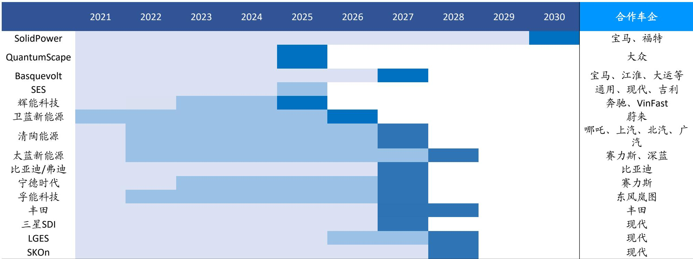

全固态量产

半固态量产

研发

\*产能包括半固态和全固态产能

# 3.5 设备端：固态电池产业化，专用设备先行

 固态电池在制造工艺上与传统液态电池有相通之处，但在成膜、电极材料和电池封装等环节更为复杂，核心区别主要是：  
 固态电解质膜制备是核心：湿法成膜操作简单，工艺成熟，易于规模化生产，但溶剂毒性大、成本高，残留溶剂会降低离子电导率；干法工艺将固态电解质与聚合物粘结剂分散成高粘度混合物，施加足够压力成膜，不采用溶剂，不需要烘干，成本更有优势，无溶剂残留，离子电导率更高。  
 固态电池更适用叠片工艺：从工艺成熟度、成本、效率等方面考虑，叠片可以通过正极、固态电解质膜、负极简单堆叠实现电芯各组件集成。考虑到固态电解质膜与极片固固接触界面问题，堆叠时需要增加加压设备，由此催生出等静压设备。  
 全固态电池不需要注液：全固态电池通常采用软包集成，与液态电池相比，不需要电解液注液，需要高压化成和分容。

图：全固态电池（左）与传统液态电池（右）工艺对比  
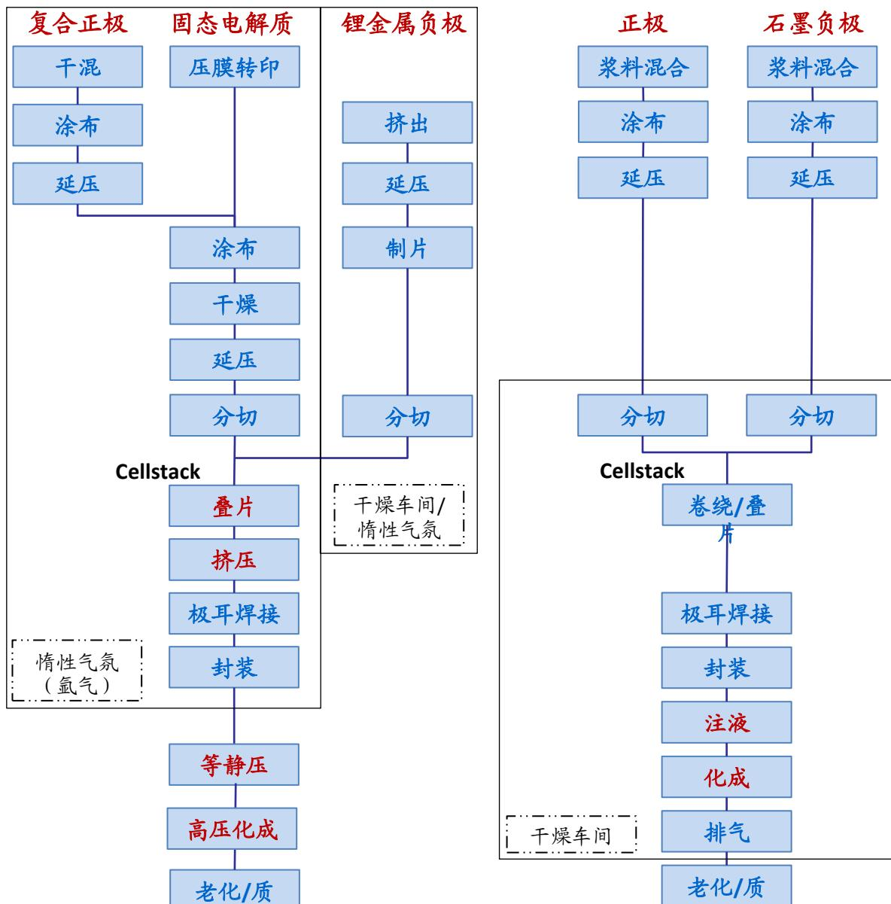

flowchart

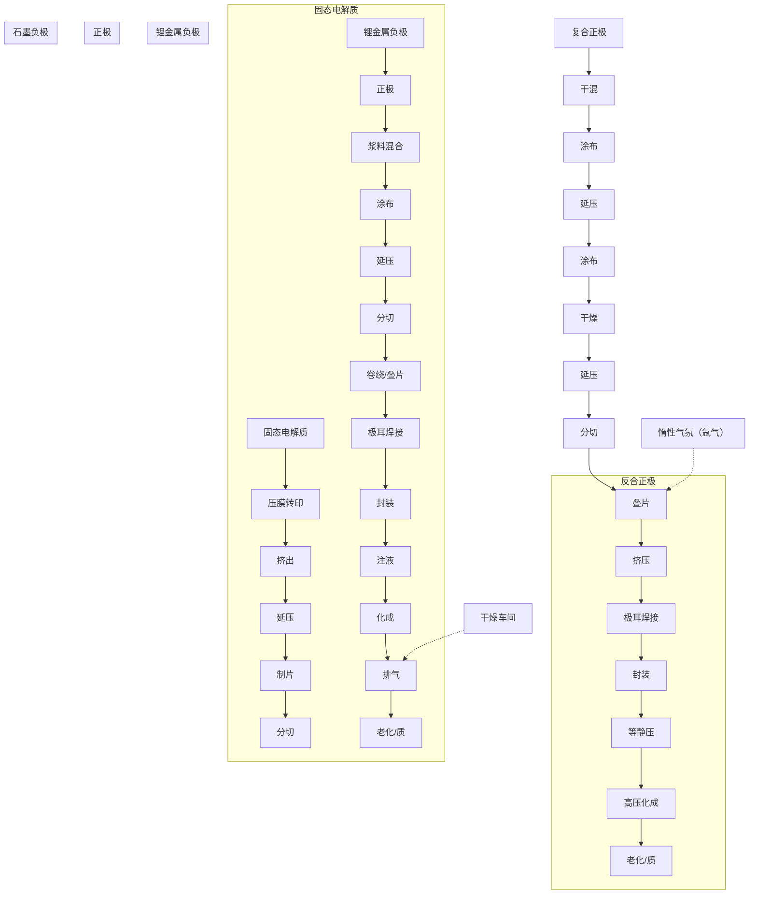
```mermaid
graph TD
    A["复合正极"] --> B["干混"]
    B --> C["涂布"]
    C --> D["延压"]
    D --> E["涂布"]
    E --> F["干燥"]
    F --> G["延压"]
    G --> H["分切"]
    H --> I["叠片"]
    I --> J["挤压"]
    J --> K["极耳焊接"]
    K --> L["封装"]
    L --> M["等静压"]
    M --> N["高压化成"]
    N --> O["老化/质"]
    
    P["固态电解质"] --> Q["压膜转印"]
    Q --> R["挤出"]
    R --> S["延压"]
    S --> T["制片"]
    T --> U["分切"]
    
    V["锂金属负极"] --> W["正极"]
    W --> X["浆料混合"]
    X --> Y["涂布"]
    Y --> Z["延压"]
    Z --> AA["分切"]
    AA --> AB["卷绕/叠片"]
    AB --> AC["极耳焊接"]
    AC --> AD["封装"]
    AD --> AE["注液"]
    AE --> AF["化成"]
    AF --> AG["排气"]
    AG --> AH["老化/质"]
    
    subgraph 反合正极
        I
        J
        K
        L
        M
        N
        O
    end
    
    subgraph 固态电解质
        P
        Q
        R
        S
        T
        U
        V
        W
        X
        Y
        Z
        AA
        AB
        AC
        AD
        AE
        AF
        AG
        AH
    end
    
    subgraph 锂金属负极
        V
        W
        X
        Y
        Z
        AA
        AB
        AC
        AD
        AE
        AF
        AG
        AH
    end
    
    subgraph 正极
        W
        X
        Y
        Z
        AA
        AB
        AC
        AD
        AE
        AF
        AG
        AH
    end
    
    subgraph 石墨负极
        W
        X
        Y
        Z
        AA
        AB
        AC
        AD
        AE
        AF
        AG
        AH
    end
    
    note1["惰性气氛（氩气）"] -.-> I
    note2["干燥车间"] -.-> AG
```

# 3.5 设备端：固态电池产业化，专用设备先行

 固态电池产业化进程加速，专用设备乘势而上：固态电池发展过程中，材料端路线逐渐明确，不断更新推进，部分路线已在实验室实现，但产业化进程还有较长的路要走，设备端是固态电池实现产业化的重要因素，固态电池材料端发生变化，与之对应的生产工艺需要进行定制配套，电极、电解质、封装等调整，中后段加压、烧结、注液、卷绕等也需调整，其中电解质膜制造尤为关键。

表：固态电池专用设备进展梳理

<table><tr><td>设备厂商</td><td>固态电池设备</td><td>进展</td></tr><tr><td>纳科诺尔</td><td>干法电极、超高压、等静压设备</td><td>1、2023年公司与清研电子合资成立深圳清研纳科,推出干法电极设备四辊、五辊、八辊、十辊等系列产品。公司已与国内头部客户签订干法电极设备采购合同,目前已陆续交付十多套干法电极设备。2、固态电池生产设备,已推出高精度锂带压延、负极补锂、材料覆合一体机等设备,超高压设备、等静压设备正在加快研发。</td></tr><tr><td>曼恩斯特</td><td>涂布机、干法电极设备</td><td>完善“湿法+干法”工艺装备双线布局,在固态电解质涂布、干法电极膜片成型、干法电极膜片与集流体复合等关键工艺方面储备优势技术</td></tr><tr><td>利元亨</td><td>干法电极、固态电解质压制转印、高压化成分容设备</td><td>已经成功开发干法电极、固态电解质压制转印、锂铜复合设备等关键设备样机,极片绝缘胶框成形设备、高压化成分容设备取得阶段性成果。</td></tr><tr><td>海目星</td><td>激光设备、特种叠片设备</td><td>公司准固态电池生产设备已形成交付,与欣界合作生产的准固态电池,能量密度高、安全、充放电倍率高。</td></tr><tr><td>先导智能</td><td>电极制备、涂布、电解质膜制备、组装、化成分容等设备</td><td>已成功打通全固态电池量产的全线工艺环节,实现了从整线解决方案到各工段的关键设备覆盖,涉及正负极电极制备、电解质膜制备、锂金属电极制备、固态电池切叠和电芯致密化、组装、化成分容等工艺整线。目前已获国内外知名汽车及固态电池企业的全固态生产线订单。为韩国头部电池企业客户定制的固态干法电极涂布设备已顺利发货至客户现场。</td></tr><tr><td>璞泰来</td><td>固态电解质复合膜、锂金属负极成型设备</td><td>2024年6-7月与北京恩力、中科固能签订了战略合作协议,公司提供先进的相关材料和设备技术支持,包括负极材料(含硅碳负极、锂金属负极)、复合极板材料、固态电解质、固态电解质复合膜等材料以及固态电池全线设备和新设备的开发等。</td></tr><tr><td>赢合科技</td><td>干法电极制备、涂布机</td><td>24年推出了第三代干法搅拌纤维化+干法成膜全固态工艺,公司开发的固态极片涂覆设备已成功发货到国内头部客户现场。</td></tr><tr><td>杭可科技</td><td>杭可科技</td><td>目前公司已与国内外多家相关厂商就半固态电池的中试线展开合作,并积极开展固态电池后处理设备相关的技术研发。</td></tr><tr><td>骄成超声</td><td>超声波焊接</td><td>公司超声波焊接设备可用于固态电池极耳焊接,并已形成小批量订单,对固态电池所需材料制备的相关超声波设备进行了研究开发。</td></tr><tr><td>信宇人</td><td>干法涂布</td><td>干法涂布设备,应用到干法正极和干法负极的制备。硫化物、氧化物和聚合物固态电解质尚处于研发阶段。</td></tr></table>

资料来源：各公司投资者问答，HTI

1.固态电池：产业化进程加速，未来市场空间广阔

1.1固态电池：技术路线进步，产业化进程加速   
1.2空间：固态电池远期空间广阔   
1.3复盘：行业发展早期，行情多为事件热点驱动

2.技术路线：固态电解质是核心，正负极向高性能方向迭代

2.1电解质：多技术路线并行，性能各有优劣

2.1.1聚合物固态电解质：复合固态电解质开启新空间  
2.1.2氧化物固态电解质：种类丰富，性能各异  
2.1.3 卤化物固态电解质：重回研究视野，加快研发进展  
2.1.4硫化物固态电解质：离子电导率高，力学性能良好

2.2正极：高镍三元、富锂锰基为当前主流方向  
2.3负极：高比能负极材料是主流趋势  
2.4铜箔：多孔铜箔能够适配固态电池特殊需求

3.产业化进行时：多线并行，研发竞速

3.1动力电池技术发展路线：液态—半固态—准固态—全固态  
3.2国内外格局：方向多元，研发竞速，关键材料体系尚未明确；头部引领，二三线仍有机会突围  
3.3难点：全固态电池产业化目前面临三大瓶颈   
3.4进程：全固态电池何时产业化落地？  
3.5设备端：固态电池产业化，专用设备先行

4.一级固态电池公司梳理

5.标的及投资建议  
6.风险提示

# 清陶能源：深度绑定上汽，半固态电池已上车，全固态加速

 2016年成立后快速发展，在江苏、北京、上海、广东、浙江、四川、江西、贵州等地建设研发生产基地，获上汽、北汽、广汽等战略投资，上汽2020-2023年通过基金投资成为公司第一大投资人，目前公司估值超200亿。  
 半固态电池上车智己L6：24年5月上汽集团旗下智己L6搭载清陶光年固态电池上市，清陶能源第一代半固态电池为聚合物-氧化物复合固态电解质路线，保留隔膜与10wt%以内电解液，正极为纳米尺寸固态电解质包覆的高镍三元，负极为复合硅碳，结构上则采用方形铝壳而非软包电池设计。  
 上汽清陶全力发力全固态电池产业化：上汽集团全固态电池整车项目已立项，目标是2025年全固态电池生产线贯通，2026年电池量产并完成样车测试，2027年装车量产上市，率先搭载在智己汽车上。为实现全固态电池产业化目标与清陶能源成立合资公司上汽清陶，计划建设上汽清陶首条全固态电池量产线，采用聚合物-无机物复合固态电解质路线，一期规划产能0.5GWh，24年三季度正式开工，2025年内建成贯通。

图：上汽清陶聚合物-无机物复合材料路线  
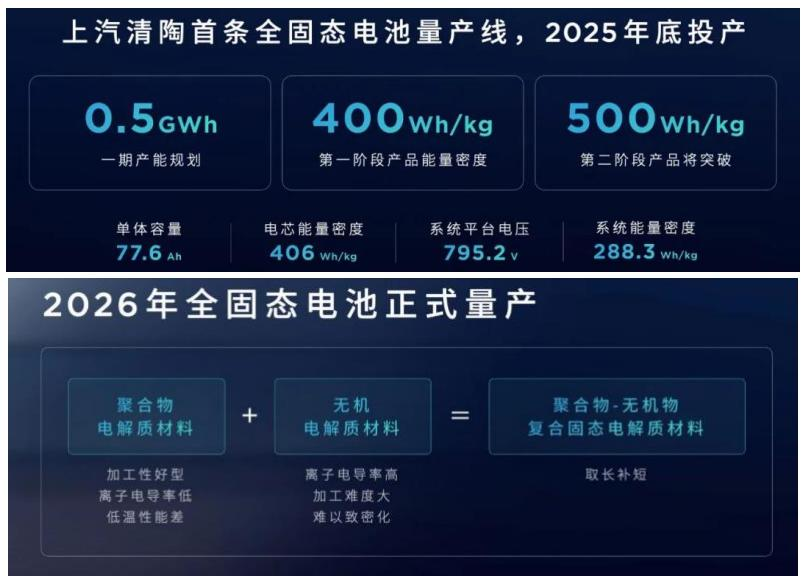

text_image

上汽清陶首条全固态电池量产线，2025年底投产
0.5GWh
一期产能规划
400Wh/kg
第一阶段产品能量密度
500Wh/kg
第二阶段产品将突破
单体容量
77.6 Ah
电芯能量密度
406 Wh/kg
系统平台电压
795.2 v
系统能量密度
288.3 Wh/kg
2026年全固态电池正式量产
聚合物
电解质材料
加工性好型
离子电导率低
低温性能差
+
无机
电解质材料
离子电导率高
加工难度大
难以致密化
=
聚合物-无机物
复合固态电解质材料
取长补短

图 清陶能源产能规划情况  
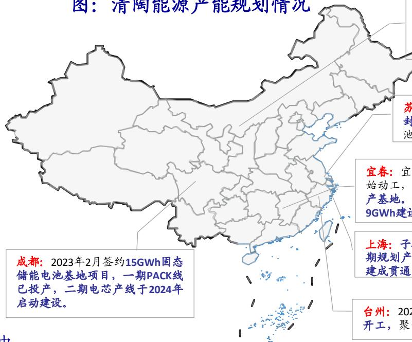

text_image

图：清陶能源产能规划情况
苏
封
池
宜春：宜
始动工，
产基地。
9GWh建设
成都：2023年2月签约15GWh固态
储能电池基地项目，一期PACK线
已投产，二期电芯产线于2024年
启动建设。
上海：子
期规划产
建成贯通
台州：202
开工，聚

乌海市：2023年10月签约固态电池零碳产业园区项目，投资70亿分三期，建成后将拥有年产5万吨零碳制造的固态电池正极材料、10GWh固态电池电芯及PACK相关业务。  
苏州：2023年8月昆山10GWh固态锂电池项目顶，2024年正式投产，为新能源汽车固态电池“十万辆级”提供保障。  
春清陶固态动力锂电池项目2019年8月开总投资55亿，建设年产10GWh固态电池生一期1GWh固态动力电池已投产，二期设中。  
公司上汽清陶首条全固态电池量产线，一能0.5GWh，24年三季度开工，2025年内。  
23年8月台州10GWh固态锂电池项目正式焦固态动力电池，预计2025年正式投产。

专注氧化物路线，动力储能齐头并进：公司成立于2016年，创始人包括中国工程院院士陈立泉、中科院物理所李泓，产品涵盖新能源车、储能、低空三大部分。  
 新能源车：360Wh/kg高能量密度动力电芯单次续航超1000km，已于2023年底量产交付蔚来汽车，并获多家知名整车厂定点；  
 储能：280Ah超高安全储能电芯已于2023年现半年量产交付，为三峡、海博思创、国电投等多个储能项目供货；  
 低空：320Wh/kg高能量密度低空动力电芯已为国内外多家无人机、机器人、便携电源等客户供货。

图：卫蓝新能源产品性能参数

<table><tr><td></td><td colspan="4">汽车动力电池</td><td colspan="2">储能固态电池</td></tr><tr><td>产品参数</td><td>46大圆柱动力电芯</td><td>SHE 360S</td><td>SHE 360C</td><td>产品参数</td><td>280Ah SHS165</td><td>45Ah SHS150</td></tr><tr><td>技术路线</td><td>NCM固液混合</td><td>NCM固液混合</td><td>NCM固液混合</td><td>技术路线</td><td>LFP固液混合</td><td>LFP固液混合</td></tr><tr><td>质量能量密度</td><td>≥300Wh/kg@0.33C</td><td>≥360Wh/kg@0.33C</td><td>≥350Wh/kg@0.33C</td><td>质量能量密度</td><td>≥165Wh/kg</td><td>≥150Wh/kg</td></tr><tr><td>体积能量密度</td><td>≥800Wh/L@0.33C</td><td>≥775Wh/L@0.33C</td><td>≥745Wh/L@0.33C</td><td>标称容量</td><td>280Ah</td><td>45Ah</td></tr><tr><td>标称容量</td><td>35Ah</td><td>111Ah</td><td>106Ah</td><td>标称电压</td><td>3.2V</td><td>3.2V</td></tr><tr><td>标称电压</td><td>3.58V</td><td>3.51V</td><td>3.55V</td><td>标准充/放电倍率</td><td>0.5P</td><td>0.5P</td></tr><tr><td>工作温度范围</td><td>-20°C~60°C</td><td>/</td><td>/</td><td>尺寸</td><td>173.6*71.6*207mm</td><td>359*117*11.7mm</td></tr><tr><td>充电时间</td><td>≤20min(10%~80%SOC)</td><td>≤60min(10%~80%SOC)</td><td>≤35min(10%~80%SOC)</td><td rowspan="2">循环寿命</td><td rowspan="2">≥6000 cycles(0.5P/0.5P,100%DOD@25%)</td><td rowspan="2">≥8000 cycles(100%DOD@0.5P)</td></tr><tr><td>低温放电能力</td><td>-20°C/0.33C容量保持率&gt;80%</td><td>/</td><td>/</td></tr><tr><td>尺寸</td><td>Φ46*95mm</td><td>359*118*11.9mm</td><td>359*118*11.9mm</td><td>工作温度范围</td><td>-20°C~60°C</td><td>-20°C~60°C</td></tr><tr><td>循环寿命</td><td>≥1200 cycles@90%DOD</td><td>≥600 cycles</td><td>≥1000 cycles</td><td>重量</td><td>5450g</td><td>960g</td></tr></table>

图：卫蓝新能源产业布局

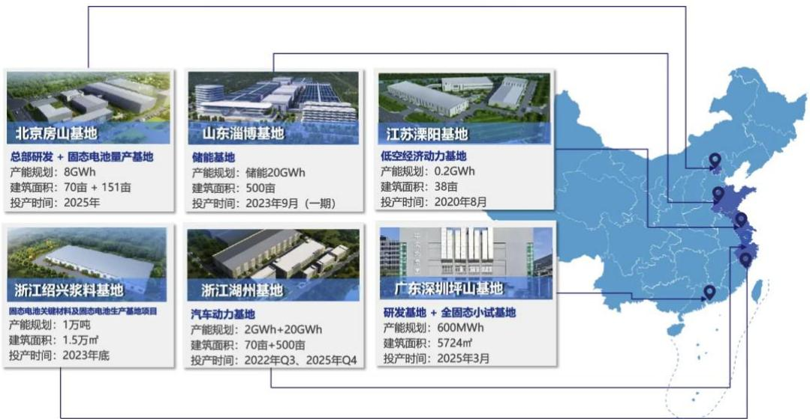

text_image

北京房山基地
总部研发 + 固态电池量产基地
产能规划：8GWh
建筑面积：70亩 + 151亩
投产时间：2025年
山东淄博基地
储能基地
产能规划：储能20GWh
建筑面积：500亩
投产时间：2023年9月（一期）
江苏溧阳基地
低空经济动力基地
产能规划：0.2GWh
建筑面积：38亩
投产时间：2020年8月
浙江绍兴浆料基地
固态电池关键材料及固态电池生产基地项目
产能规划：1万吨
建筑面积：1.5万㎡
投产时间：2023年底
浙江湖州基地
汽车动力基地
产能规划：2GWh+20GWh
建筑面积：70亩+500亩
投产时间：2022年Q3、2025年Q4
广东深圳坪山基地
研发基地 + 全固态小试基地
产能规划：600MWh
建筑面积：5724㎡
投产时间：2025年3月

# 太蓝新能源：专注氧化物路线，发布无隔膜半固态电池

 专注氧化物固态电池，联合长安汽车发布无隔膜半固态电池：公司成立于2018年，专注氧化物固态电池开发，拥有复合陶瓷电解质超薄膜制备技术、界面柔性层和无隔膜技术。第一代半固态电池产品液态电解质含量5%-10%，能量密度最大到400Wh/kg；第二代准固态电池产品，液态电解质含量降至5%以下，能量密度达到400Wh/kg～500Wh/kg，在2023年底量产。2024年4月发布车规级单体120Ah，实测能量密度720Wh/kg全固态锂金属电池原型，正极采高克容量富锂锰基，负极为复合锂金属基，搭配公司高性能氧化物复合固态电解质；2024年8月长安汽车战略入股；2024年11月联合长安汽车发布无隔膜半固态电池。  
 已投产+规划建设产能已达12.2GWh：重庆一期0.2GWh，国内首条量产的半固态锂电池产线已于2022年率先推出半固态动力电池，产品已分批交付客户；重庆二期2GWh工厂2023年正式开工建设，24年6月已完成主体施工，公司预计四季度实现投产；安徽淮南10GWh动力电池产业园区项目也正在稳步建设中。

图：太蓝新能源高比能固态电池、超快充固态电池、全固态锂金属电池

<table><tr><td>项目/参数</td><td colspan="3">软包高比能固态电池</td><td colspan="2">软包快充固态电池</td></tr><tr><td>电池类型</td><td>三元锂电池</td><td>三元锂电池</td><td>三元锂电池</td><td>三元锂电池</td><td>三元锂电池</td></tr><tr><td>工作电压(V)</td><td>2.7~4.2</td><td>2.7~4.2</td><td>2.7~4.2</td><td>2.7~4.2</td><td>2.7~4.2</td></tr><tr><td>标称容量(Ah)</td><td>56</td><td>60</td><td>105</td><td>15</td><td>40</td></tr><tr><td>能量密度(Wh/kg)</td><td>290</td><td>310</td><td>330</td><td>265</td><td>265</td></tr><tr><td>最大持续充电倍率</td><td>≥2C</td><td>≥2C</td><td>≥2.5C</td><td>≥4C</td><td>≥4C</td></tr><tr><td>工作温度(°C)</td><td>-20~60°C</td><td>-20~60°C</td><td>-20~60°C</td><td>-20~60°C</td><td>-20~60°C</td></tr><tr><td>循环寿命(@25°C)</td><td>1500次</td><td>1500次</td><td>1000次</td><td>1500次</td><td>1500次</td></tr></table>

<table><tr><td>项目/参数</td><td colspan="2">方形铝壳快充固态电池</td></tr><tr><td>电池类型</td><td>三元锂电池</td><td>磷酸铁锂电池</td></tr><tr><td>工作电压(V)</td><td>2.75~4.35</td><td>2.0~3.65</td></tr><tr><td>标称容量(Ah)</td><td>120</td><td>89</td></tr><tr><td>能量密度(Wh/kg)</td><td>255</td><td>180</td></tr><tr><td>最大持续充电倍率</td><td> $\geqslant$  4C</td><td> $\geqslant$  4C</td></tr><tr><td>工作温度(°C)</td><td>-20~60°C</td><td>-20~60°C</td></tr><tr><td>循环寿命(@25°C)</td><td>1500次</td><td>3000次</td></tr></table>

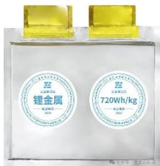

text_image

锂金属
720Wh/kg

图：太蓝新能源产业布局  
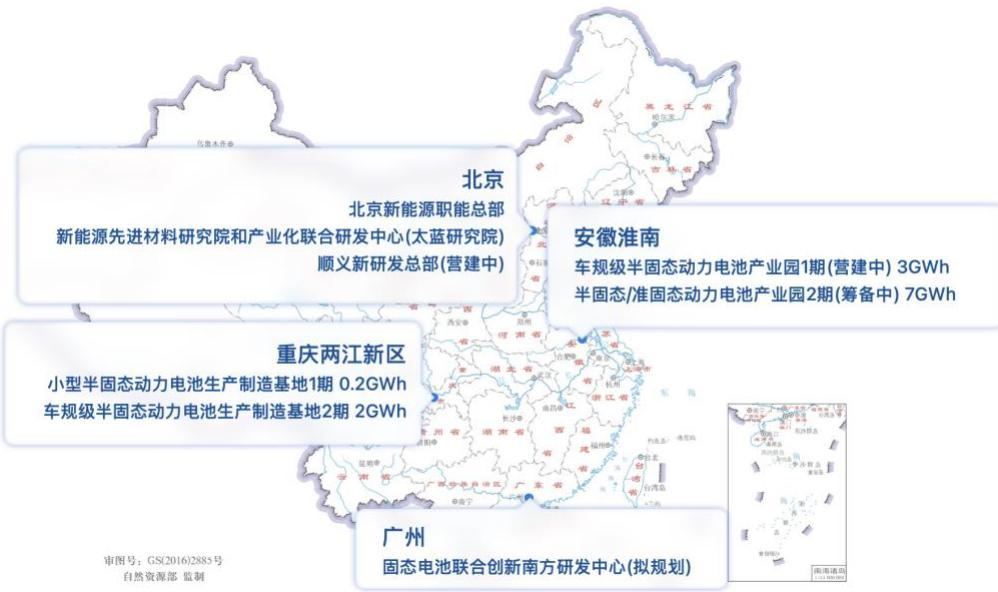

text_image

北京
北京新能源职能总部
新能源先进材料研究院和产业化联合研发中心(太蓝研究院)
顺义新研发总部(营建中)
安徽淮南
车规级半固态动力电池产业园1期(营建中) 3GWh
半固态/准固态动力电池产业园2期(筹备中) 7GWh
重庆两江新区
小型半固态动力电池生产制造基地1期 0.2GWh
车规级半固态动力电池生产制造基地2期 2GWh
广州
固态电池联合创新南方研发中心(拟规划)
审图号: GS(2016)2885号
自然资源部 监制

资料来源：太蓝新能源公众号、公司官网，重庆两江新区公众号，HTI

# 欣界能源：锂金属固态电池技术领先，已实现量产交付

 技术领先，量产交付：公司成立于2020年，2023年9月公司建成200MWh锂金属固态电池中试线，已实现小批量交付移动电源和无人机；今年在常州启动建设的一期2GWh电池量产线公司预计2025年投产，主要面向eVTOL、无人机及消费电子，同年二期3GWh生产线也将启动建设，加快动力电池市场布局。目前，欣界能源已与全球领先的EV主机厂达成深度合作，现已进入B样阶段，预计至2027年公司实现固态电池整车装载。  
 发布“猎鹰”高能量锂金属固态电池，成功搭载亿航智能eVTOL：2024年11月15日公司发布“猎鹰”高能量锂金属固态电池，采用金属锂负极+氧化物陶瓷电解质，单体能量密度达到480Wh/kg，并率先应用在eVTOL领域，搭载亿航智能载人eVTOL完成不间断飞行测试，续航达48分10秒。亿航智能与欣界能源深入合作，目标在2025年底前实现固态电池在EH216-S的认证和装机量产。

图：欣界能源产品性能及产线规划  
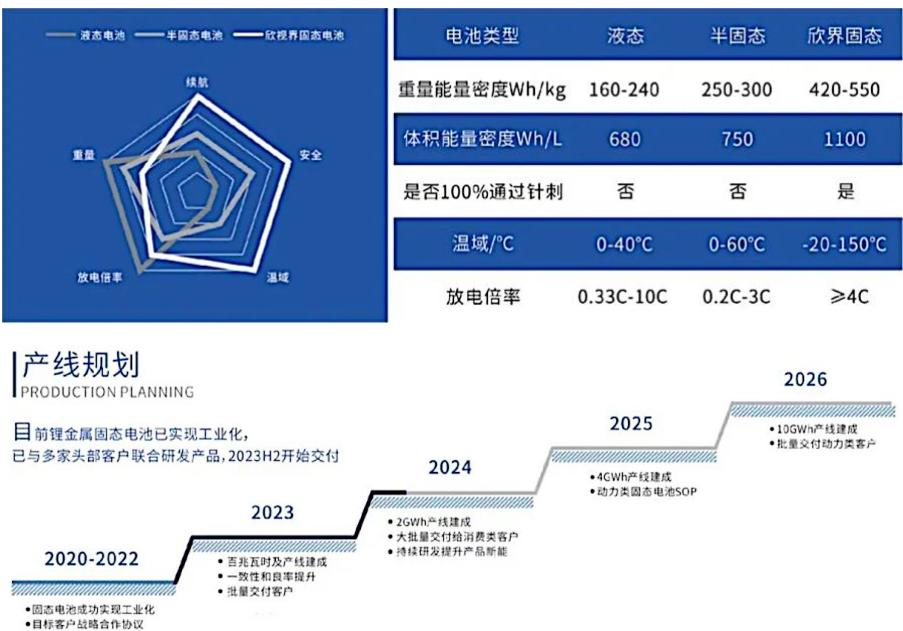  
资料来源：欣界能源公众号，HTI

图：欣界能源产品应用规划  
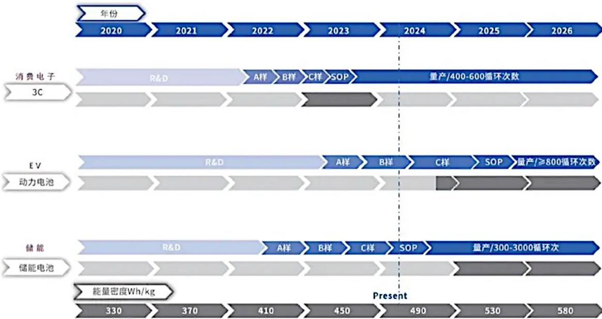

锂陶瓷电池技术领先，加速全球产能扩张：公司成立于2006年，专注于锂陶瓷电池研发制造，独家技术涵盖超900件全球专利，已向全球车企提供超8000颗固态电池样品用于测试和模组开发。23年5月，公司宣布计划在法国敦刻尔克建立锂陶瓷电池工厂，投资52亿欧元分阶段建设48GWh产能，最快可于24年底或25年初开工，预计27年开始量产。24年公司首条位于中国台湾桃园的超级工厂(Giga Factory)量产示范线开始供应车企，设计产能2GWh，将为2.6万辆电动车提供电池。24年5月首座海外研发中心落址巴黎-萨克雷。  
2024年10月公司推出100%硅复合负极电池，兼具高能量密度及快充性能，5分钟实现充电5%至60%，8.5分钟充电至80%，体积能 量 密 度 749Wh/L ， 质 量 能 量 密 度321Wh/kg ， 预 计 到 2024 年 底 提 升 至823Wh/L、355Wh/kg。

图：辉能科技锂陶瓷电池结构  
ProLogium Li-metal Anode LCB ProLogium SiOx Anode LCB   
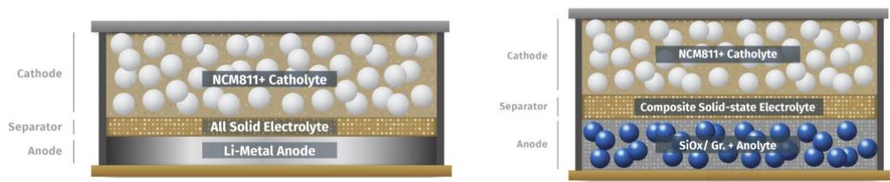

text_image

Cathode
NCMB11+ Catholyte
Separator
Li-Metal Anode
All Solid Electrolyte
Cathode
NCMB11+ Catholyte
Separator
Composite Solid-state Electrolyte
Anode
SiOx/ Gr. + Anolyte

图：辉能科技电池性能

EV Battery Performance Evolution   
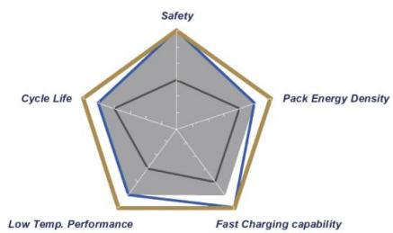

radar

| Category               | Value |
| ---------------------- | ----- |
| Safety                 | 100   |
| Cycle Life             | 80    |
| Low Temp. Performance   | 70    |
| Fast Charging capability| 90    |
| Pack Energy Density     | 60    |

Exceeding market expectations

MarketRequirement

OTraditional LiB

. ProLogium'sCurrentLCB

OProLogium's LCB in 2025

<table><tr><td>Safety</td><td>√ Fundamentally safe</td></tr><tr><td>Cell Energy Density</td><td>750 - 770 Wh/L in 2024330 - 350 Wh/kg in 2024</td></tr><tr><td>Fast Charging</td><td>5%~60% 5 mins5%~80% 8.5 mins</td></tr><tr><td>Low Temp. Operation</td><td>-30° discharge &gt;89% (0.1C)</td></tr><tr><td>Cycle Life</td><td>&gt;1000 times</td></tr></table>

# 中科深蓝汇泽：立足聚合物，首创“刚柔并济、原位固化”

 立足聚合物路线，国际首创“刚柔并济”新型固态电解质材料及“原位固化”工艺：公司成立于2022年4月，技术传承于崔光磊研究团队，国际首创“刚柔并济-三相渗流”与“原位固化-界面融合”新型固态电池电解质材料工艺，解决固-固界面、室温离子电导、电压窗口等难题，已开发4代不同能量密度固态电池体系，建成国际首条规模化的聚合物全固态电池中试生产线，并在深海、深空、大规模储能、新能源汽车等方面得到了长期可靠性验证。此外公司在硫化物、氧化物路线也有布局，在聚合物/硫化物复合全固态电池干法制备和混合传输的均质正极上去的重大突破，目前公司正在规划建设国内首条1GWh聚合物硫化物复合电解质的固态电池产线。

 高比能固态电池技术取得多项重大突破：公司能量密度350Wh/kg的77Ah聚合物固态电池已完成国际知名车企A样送样；能量密度500Wh/kg固态电池完成实际应用示范验证；世界首次实现高比能二次亚硫酰氯原型电池制备，能量密度700Wh/kg以上。

图：“刚柔并济-三相渗流”快离子导体电解质  
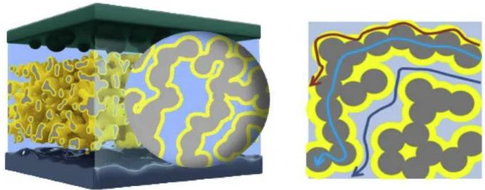

natural_image

Illustration of a container with yellow liquid molecules and a spherical structure, alongside a magnified view of a network of interconnected nodes (no text or symbols)

图：中科深蓝汇泽超薄硫化物/聚合物复合电解质膜  
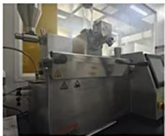

natural_image

Industrial machine in a factory setting, no visible text or symbols on the equipment or background

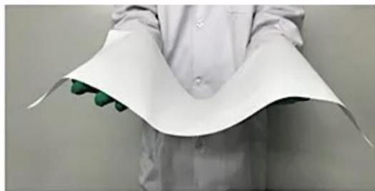

natural_image

Close-up of a person wearing a white coat with green accessories, partially covered by a large white pleated garment (no text or symbols visible)

资料来源：深蓝汇泽公众号，高工锂电，HTI

图：中科深蓝汇泽固态电池示范应用  
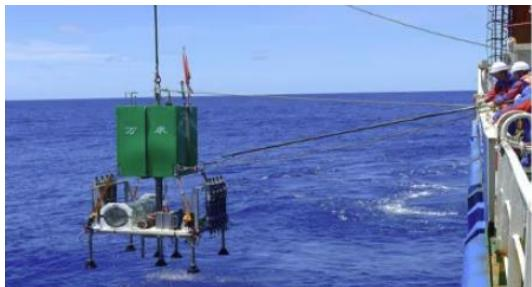

natural_image

Exterior view of a green floating platform with a flag, situated on open blue sea near a ship's deck (no visible text or symbols)

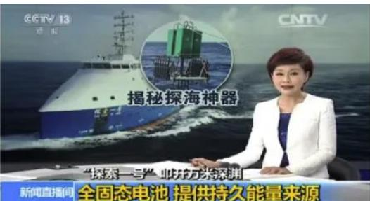

text_image

CCTV 13
新闻
CMTV
揭秘探海神器
“探索一马”此时万米探测
新闻直播间 全固态电池 提供持久能量来源

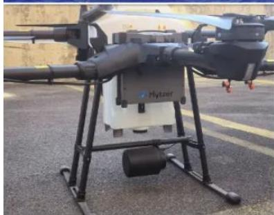

natural_image

Drone mounted on a wheeled platform with a visible internal component labeled 'Hytzer' (no additional text or symbols)

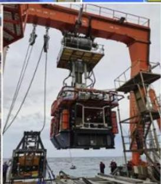

natural_image

Large orange crane lifting a shipping container over water, with workers visible in the background (no text or symbols)

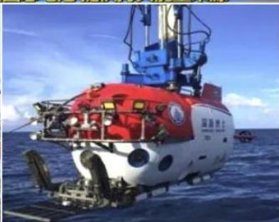

natural_image

Submersible underwater vehicle with red hull and blue rig, floating on open sea under clear sky (no visible text or symbols)

# 中科固能：硫系电解质-电解质膜-电极膜-电芯全产品矩阵

 专注硫化物路线，打造硫系电解质-电解质膜-电极膜-电芯纵向产品矩阵：公司成立于2022年10月，核心团队为中科院物理所吴凡教授团队，2024年1月正式运营以来专注于全固态电池相关产品，涵盖硫化物电解质、硫化物固态电解质膜、全固态电池电芯等领域。中科固能一期总投资10亿元建设世界首条百吨级固态电解质产线，公司预计2025-2026年具备满产能力。  
 硫化物固态电解质材料：以高离子电导率、粒径尺寸控制为重点，研制多款不同应用场景硫化物固态电解质材料，离子电导率4-18mS/cm，D50可控为350nm，均处行业领先。  
 硫化物固态电解质膜：开发出创新型硫化物固态电解质膜，厚度25μm以下，室温下离子电导率2mS/cm，引入湿法成膜工艺，成功开发8cm×15cm、18cm×18cm超薄、高离子电导率硫化物电解质膜。

图：中科固能硫化物固态电解质及固态电解质膜  
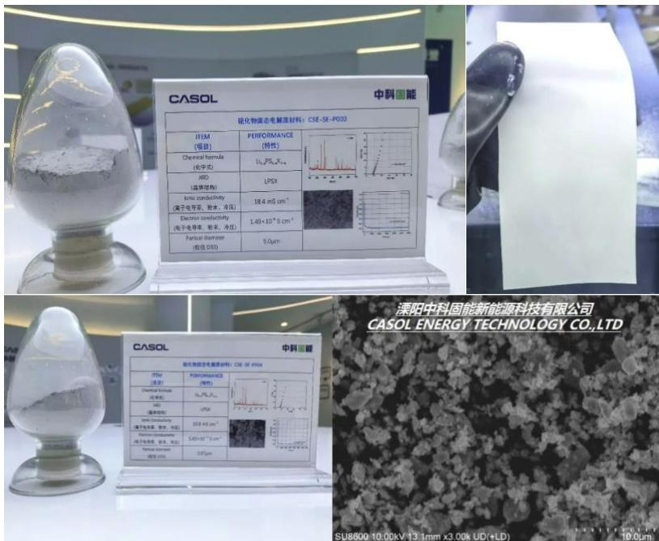

text_image

CASOL
中科■能
碳化物固态电解质材料：CSE-SE-P033
ITEM
(项目)
PERFORMANCE
(特性)
Chemical formula
(化学式)
U2PSX·X10-
XPO
(晶单结构)
LPGX
Ionic conductivity
(离子电导率、耐水、冷压)
18.4 mS cm-1
Electron conductivity
(电子电路带、耐水、冷压)
1.40×10^5 S cm-1
Partial diameter
(粒径D10)
5.0μm
溧阳中科国能新能源科技有限公司
CASOL ENERGY TECHNOLOGY CO.,LTD
碳化物固态电解质材料：CSE-SE-P034
ITEM
(项目)
PERFORMANCE
(特性)
Chemical formula
(化学式)
U2PSX·X10-
XPO
(晶单结构)
LPGX
Ionic conductivity
(离子电导率、耐水、冷压)
18.4 mS cm-1
Electron conductivity
(电子电路带、耐水、冷压)
5.40×10^5 S cm-1
Partial diameter
(粒径D10)
5.0μm
SU8600 10.00kV 13.1mm x3.00k UD(+LD)
10.0μm

图：中科固能产业布局  
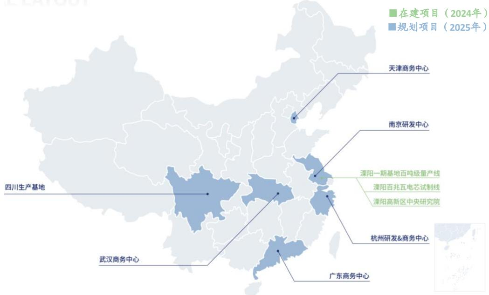

text_image

在建项目（2024年）
规划项目（2025年）
天津商务中心
南京研发中心
濮阳一期基地百吨级量产线
濮阳百兆瓦电芯试制线
濮阳高新区中央研究院
四川生产基地
武汉商务中心
广东商务中心
杭州研发&商务中心

\*四川生产基地（2025年）：规划建设年产5000吨硫化锂、硫化物固态电解质生产线

# 恩力动力：硫化物路线进展顺利，下游应用多点开花

 专注硫化物路线，半固态/全固态研发顺利：公司创立于2012年7月，2017年起致力于硫化物全固态电池研发，包括全固态电解质及锂金属负极等；2019年建成第一条固态电池试验线和材料线；2021年10月成功研发能量密度520Wh/kg的锂金属固态电池；2023年面向小动力成功推出多款能量密度300-350Wh/kg半固态电芯并实现量产，24年5月开发符合新国标要求的半固态电芯，能量密度260-300wh/kg，与领先电动自行车企深度合作，公司预计24年Q3完成电芯测试验证并导入量产；2024年7月携手软银成功开发硫化物固态电解质及锂金属负极、能量密度350Wh/kg的全固态电池，助力软银24财年电池能量密度提升至400Wh/kg，26财年实现循环超1000次目标。

 下游多点开花，产能布局加速：公司利用小动力量产优势开发出的车规级电池已获得国际车企及eVTOL客户测试、验证，24年8月获得美国知名商用车企业的定点，25Q1交付C样，年底实现量产；24年6月Softbank发布的搭载恩力动力锂金属固态电池的HAPS试飞成功。23年11月北京大兴GWh示范工厂正式建成投产，24年5月10GWh先进电池制造项目在安徽滁州正式开工，公司预计今年实现GWh级产能达产，2026年实现10GWh产线量产，2030年前实现100GWh+全球产业基地布局。

图：恩力动力350KW/kg全固态电芯充放电曲线  
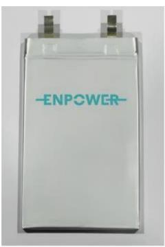

text_image

ENPOWER-

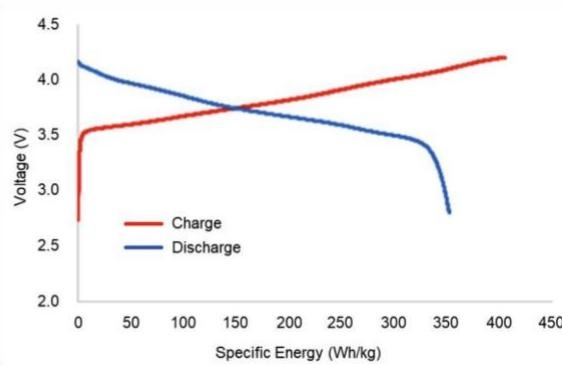

line

| Specific Energy (Wh/kg) | Charge Voltage (V) | Discharge Voltage (V) |
| ----------------------- | ------------------ | --------------------- |
| 0                       | 2.8                | 4.1                   |
| 50                      | 3.6                | 4.0                   |
| 100                     | 3.7                | 3.9                   |
| 150                     | 3.8                | 3.8                   |
| 200                     | 3.9                | 3.7                   |
| 250                     | 4.0                | 3.6                   |
| 300                     | 4.1                | 3.5                   |
| 350                     | 4.2                | 2.8                   |
| 400                     | 4.3                | -                     |

图：恩力动力Fleet系列、Swift系列电池

<table><tr><td>Series Capacity</td><td>Size (mm)</td><td>Nominal Voltage</td><td>Energy</td><td>Mass</td><td>Density</td><td>C. Charge Discharge</td><td>M. Charge Discharge</td><td>Cycle Life @ 25°C</td><td>Op. Temps</td></tr><tr><td>Fleet 3.5Ah</td><td>3.2 x 63 x 109</td><td>3.8V</td><td>13.4Wh</td><td>33g</td><td>410 Wh/kg790 Wh/L</td><td>0.2Cc / 3Cd</td><td>0.5Cc (30s)5Cd (5s)</td><td rowspan="2">&gt;400</td><td rowspan="2">-30°C to 55°C</td></tr><tr><td>Fleet 12Ah</td><td>5.7 x 83 x 150</td><td>4.0V</td><td>48.0Wh</td><td>128g</td><td>375 Wh/kg860 Wh/L</td><td>0.2Cc / 5Cd</td><td>0.5Cc (30s)7Cd (5s)</td></tr><tr><td>Swift 12Ah</td><td>5.2 x 83 x 150</td><td>3.6V</td><td>43Wh</td><td>155g</td><td>295 Wh/kg600 Wh/L</td><td>2Cc / 5Cd</td><td>2.5Cc (30s)10Cd (10s)</td><td rowspan="2">&gt;800</td><td rowspan="2">-40°C to 60°C</td></tr><tr><td>Swift 35Ah</td><td>10.4 x 87 x 187</td><td>3.6V</td><td>126Wh</td><td>397g</td><td>320 Wh/kg700 Wh/L</td><td>1Cc / 3Cd</td><td>2Cc (30s)10Cd (10s)</td></tr></table>

 专注硫化物全固态电池，全固态量产试验线已建成：公司2021年成立，专注于硫化物全固态电池开发，在中国珠海、深圳、日本横滨拥有研发基地，持有硫化物全固态电池专利数量全球领先，国内第一。公司已成功开发20mAh-20Ah多容量规格硫化物全固态电池产品，1.46Ah全固态电芯300圈循环保持率84%，5Ah全固态电芯循环200圈性能维持90%以上。公司研发的硫化物全固态电芯能量密度高达400Wh/kg，充放电倍率、应用温度等性能指标世界领先。电解质材料方面，公司具备吨级高纯度硫化锂原材料量产能力，硫化物电解质（LiPSCl）离子电导率世界顶尖。进入2024年，公司首批商业化全固态电池产品已定型，并建有全国第一条完整的全固态量产试验线，目前进入产品中试阶段。目前，高能时代高安全高比能全固态电池已在3C消费电子、两轮动力、特种储能等领域得到客户验证。

# 图：高能时代公司发展历程

# 2019

⊚ 创始人罗明与中国、日本专家商讨筹备成立先进电池公司

# 2020

⊚ 6月，确定公司名字：“高能时代”，寓意打造高能（高安全性能，高能量密度）时代；

⊚ 12月，先后引进国内多家知名战略合作伙伴，布局优质产业链资源及行业专家人才加盟。

# 2021

⊚ 5月，高能时代日本先进电池研发中心（GTC-Power株式会社）正式成立；  
⊚ 8月，与东京大学、东京工业大学达成战略合作，联合研发先进电池及材料；  
⊚ 12月，成功完成1.5Ah、5Ah、20Ah全固态锂电池样品制作。

# 2022

⊚ 1月，完成天使轮超5500万元融资，由同创伟业领投，中金资本、欣旺达、珠海科创投、亿宸资本跟投；  
⊚ 7月，材料实验室、电芯研发实验室启动，总面积合计超3000平方米，是目前国内最大的硫化物全固态电池研发中心；  
⊚ 12月，先后获得大湾区硬科技联盟副理事长、科技型中小企业、碳中和创新企业Top30等荣誉奖项。

# 2023

⊚ 1月，新增多项专利授权，在硫化物全固态电池领域专利数量处于国内领先；  
⊚ 4月，与吉林大学达成战略合作。

图：高能时代硫化物全固态电池参数性能  
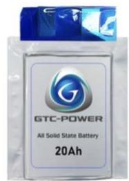

text_image

GTC-POWER
All Solid State Battery
20Ah

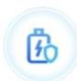  
高安全性

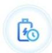  
长续航

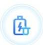  
高能量密度

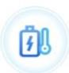  
温度适配广

<table><tr><td>安全性好</td><td>通过针刺和350°C热失控实验</td></tr><tr><td>能量密度高</td><td>大于400 Wh/Kg</td></tr><tr><td>循环寿命长</td><td>循环使用次数大于1200次</td></tr><tr><td>温度范围适应性强</td><td>零下40~150°C均能使用</td></tr></table>

 公司2023年1月成立，主营固态锂离子电池产品研发生产及销售，总部位于苏州工业园区，在武汉、淮安等地设有分子公司，创始团队来自东风汽车前瞻技术研究院、中国地质大学（武汉）及新能源相关产业公司。  
 十年磨剑，快速发展：公司已成功研制出高比能、高倍率、高安全等特点的高性能固态锂离子电芯产品，能量密度覆盖350Wh/kg\~600Wh/kg，并通过GBT38031测试及严苛针刺测试，相关产品可广泛应用于乘用车、无人机、无人船、户外电源等场景，苏州总部建成100MWh固态电池中试线，江苏淮安计划分三期建设10GWh固态电芯量产产能，目前已启动一期1GWh固态电芯量产线建设。24年6月，公司自主研发的能量密度350Wh/kg固态电池产品已经逐步下线并完成了第三方检测和送样。

图：合源锂创发展历程  
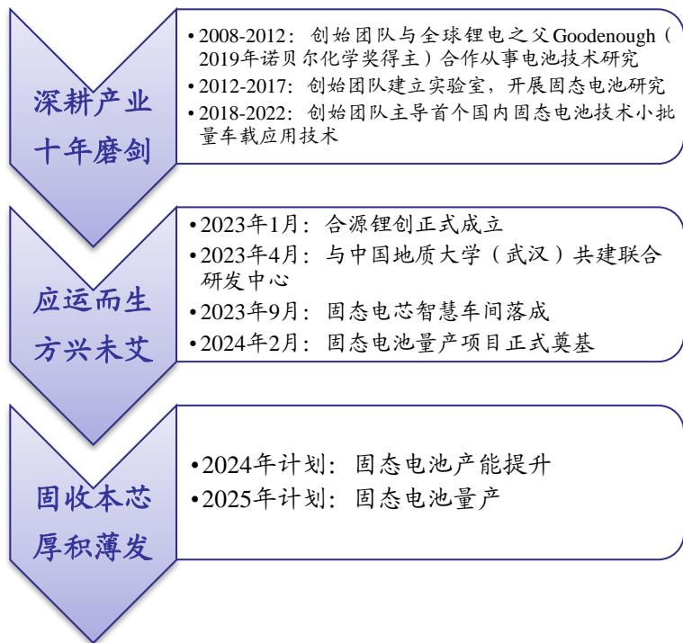

flowchart

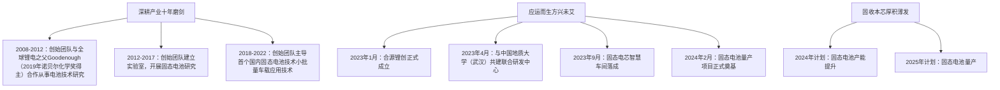
```mermaid
graph TD
    A["深耕产业十年磨剑"] --> B["2008-2012：创始团队与全球锂电之父Goodenough（2019年诺贝尔化学奖得主）合作从事电池技术研究"]
    A --> C["2012-2017：创始团队建立实验室，开展固态电池研究"]
    A --> D["2018-2022：创始团队主导首个国内固态电池技术小批量车载应用技术"]
    E["应运而生方兴未艾"] --> F["2023年1月：合源锂创正式成立"]
    E --> G["2023年4月：与中国地质大学（武汉）共建联合研发中心"]
    E --> H["2023年9月：固态电芯智慧车间落成"]
    E --> I["2024年2月：固态电池量产项目正式奠基"]
    J["固收本芯厚积薄发"] --> K["2024年计划：固态电池产能提升"]
    J --> L["2025年计划：固态电池量产"]
```

图：合源锂创业务布局  
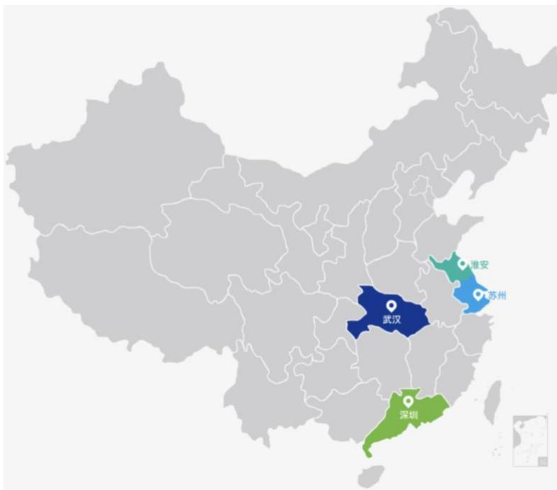

text_image

武汉
淮安
苏州
深圳

# 总部基地（苏州）

集研发、生产与销售职能于一体，建成一批固态电池研发实验室及一条领先的100MWh固态电池中试线

# 研发中心

武汉：在武汉与中国地质大学（武汉）共建一所新型电池材料联合研发中心，聚焦新型固态电解质材料的开发与应用

深圳：以模组、BMS及电池包系统为主要方向，提供固态电池全面解决方案

# 生产基地（淮安）

计划分三期建设10GWh固态电芯量产产能，目前已启动一期1GWh量产线建设，为新能源汽车、eVTOL、无人机、无人船、无人车、航空航天、便携式储能等领域客户提供定制化固态电芯及PACK产品。

# 博粤新材：氧化锂、氧化物固态电解质均实现批量导入

 专注氧化锂及氧化物固态电解质，已实现批量出货导入：公司成立于2021年9月，专业从事氧化锂及氧化物固态电解质研发、生产和销售，技术来源于中南大学蒋良兴团队，公司在佛山拥有5000㎡标准化厂房，拥有氧化锂专业生产线和LATP生产线，目前正在规划千吨级生产基地。公司先进锂电材料补锂剂前驱体已经批量出货导入，预计2024年产值将超过千万，氧化物固态电解质LATP、LLZO已具备吨级制备能力，目前公司固态电解质材料已完成十余家客户认证，并批量导入知名上市公司。公司计划在今年完成100吨固态电解质、100吨锂电补锂剂前驱体的投产，预计完全投产的产值规模将达到5000万以上。

图：博粤新材产品  
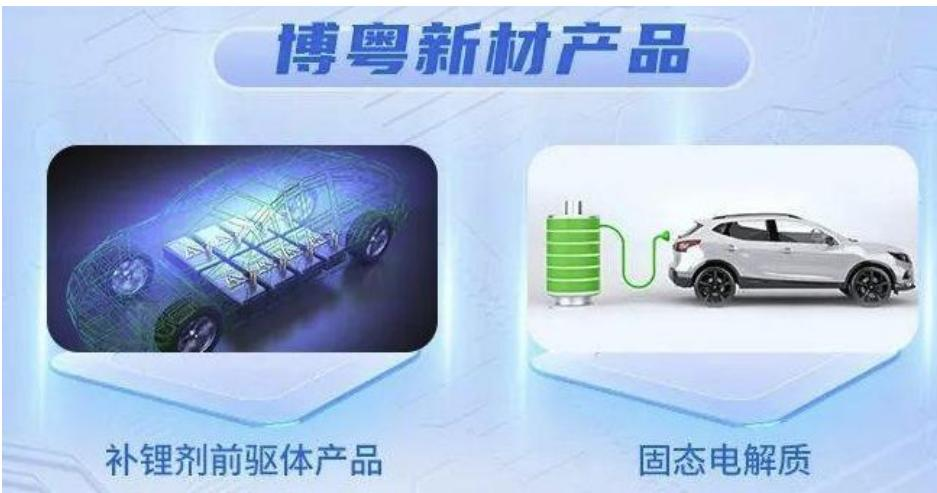

text_image

博粤新材产品
补锂剂前驱体产品
固态电解质

图：博粤新材发明专利情况

<table><tr><td>发明专利</td><td>申请时间</td></tr><tr><td>一种高分散性LATP粉体的制备方法</td><td>20240919</td></tr><tr><td>一种LATP粉体制备工艺及固态电解质</td><td>20240529</td></tr><tr><td>一种碳包覆氧化锂的制备方法</td><td>20230627</td></tr><tr><td>一种磷酸盐固态电解质及其批量制备方法</td><td>20221020</td></tr><tr><td>一种正极补锂剂及其制备方法</td><td>20220729</td></tr><tr><td>通过有机气体裂解还原硫酸锂制备硫化锂方法</td><td>20220729</td></tr><tr><td>一种硫化物电解质制备方法</td><td>20220721</td></tr><tr><td>一种多孔铁系补锂剂及其制备方法</td><td>20220711</td></tr><tr><td>一种LLZO固体电解质粉体干法混料烧结工艺</td><td>20220708</td></tr><tr><td>一种含补锂剂的正极材料及其制备方法</td><td>20220630</td></tr><tr><td>一种提高固态电解质LATP离子电导率的方法</td><td>20220617</td></tr><tr><td>一种正极补锂剂、正极片以及制备正极补锂剂的方法</td><td>20211110</td></tr><tr><td>一种高容量复合型正极补锂剂及其制备方法</td><td>20211110</td></tr></table>

聚焦聚合物路线，逐步迈向产业化：公司聚焦聚合物固态电池领域，重点开发聚合物电解质。  
 产业布局方面，公司2023年投资1.5亿，历经一年建设0.5GWh储能电池示范线，2024年与冠盛股份成立合资公司冠盛东驰，投资20亿元建设4GWh半固态储能电池生产线。产品规划方面，公司不断完善磷酸铁锂、三元材料体系固态电池矩阵，其中半固态磷酸铁锂铁锂电池已通过动储双国标认证，安全性好、循环寿命长，应用于工商业储能、电动船、重卡等领域，正在大规模产业化；金属锂基聚合物准固态电池具备高安全性和高能量密度，能量密度达420-500Wh/kg，应用于无人机、电动驾车等领域，今年即将实现规模产业化。

图：东驰能源半固态磷酸铁锂电池  
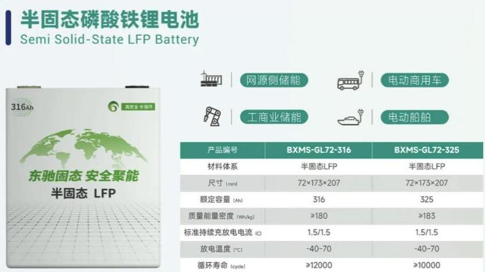

text_image

半固态磷酸铁锂电池
Semi Solid-State LFP Battery
316Ah
东驰固态 安全聚能
半固态 LFP
产品编号 BXMS-GL72-316 BXMS-GL72-325
材料体系 半固态LFP 半固态LFP
尺寸 (mm) 72×173×207 72×173×207
额定容量(Ah) 316 325
质量能量密度(Wh/kg) ≥180 ≥183
标准持续充放电电流(C) 1.5/1.5 1.5/1.5
放电温度(℃) -40~70 -40~70
循环寿命(cycle) ≥12000 ≥10000

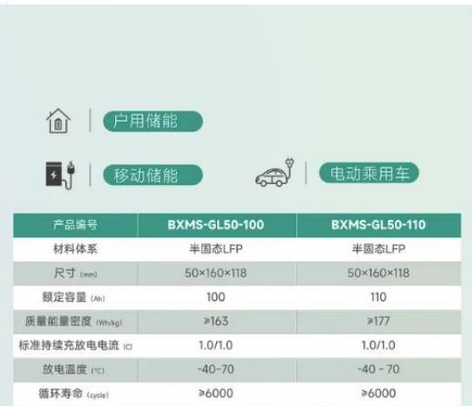

text_image

户用储能
移动储能
电动乘用车
产品编号	BXMS-GL50-100	BXMS-GL50-110
材料体系	半固态LFP	半固态LFP
尺寸（mm）	50×160×118	50×160×118
额定容量（Ah）	100	110
质量能量密度（Wh/kg）	≥163	≥177
标准持续充放电电流（℃）	1.0/1.0	1.0/1.0
放电温度（℃）	-40~70	-40~70
循环寿命（cycle）	≥6000	≥6000

图：东驰能源聚合物固态电解质性能  
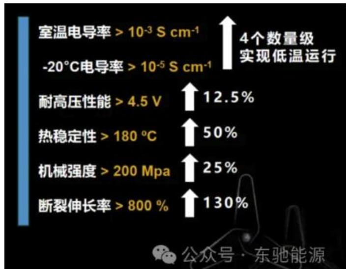

other

| 指标 | 数值 | 变化 (%) |
| :--- | :--- | :--- |
| 室温电导率 > 10⁻³ S cm⁻¹ | ↑ | |
| -20°C电导率 > 10⁻⁵ S cm⁻¹ | ↑ | ↑ |
| 耐高压性能 > 4.5 V | ↑ | 12.5 |
| 热稳定性 > 180 °C | ↑ | 50 |
| 机械强度 > 200 Mpa | ↑ | 25 |
| 断裂伸长率 > 800 % | ↑ | 130 |
公众号·东驰能源

图：东驰能源准固态三元锂电池  
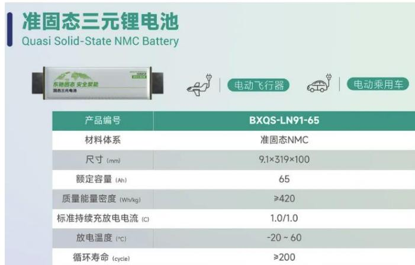

text_image

准固态三元锂电池
Quasi Solid-State NMC Battery
产品编号 BXQS-LN91-65
材料体系 准固态NMC
尺寸 (mm) 9.1×319×100
额定容量 (Ah) 65
质量能量密度 (Wh/kg) ≥420
标准持续充放电电流 (C) 1.0/1.0
放电温度 (℃) -20 ~ 60
循环寿命 (cycle) ≥200

1.固态电池：产业化进程加速，未来市场空间广阔

1.1固态电池：技术路线进步，产业化进程加速   
1.2空间：固态电池远期空间广阔   
1.3复盘：行业发展早期，行情多为事件热点驱动

2.技术路线：固态电解质是核心，正负极向高性能方向迭代

2.1电解质：多技术路线并行，性能各有优劣

2.1.1聚合物固态电解质：复合固态电解质开启新空间  
2.1.2氧化物固态电解质：种类丰富，性能各异  
2.1.3 卤化物固态电解质：重回研究视野，加快研发进展  
2.1.4硫化物固态电解质：离子电导率高，力学性能良好

2.2正极：高镍三元、富锂锰基为当前主流方向  
2.3负极：高比能负极材料是主流趋势  
2.4铜箔：多孔铜箔能够适配固态电池特殊需求

3.产业化进行时：多线并行，研发竞速

3.1动力电池技术发展路线：液态—半固态—准固态—全固态  
3.2国内外格局：方向多元，研发竞速，关键材料体系尚未明确；头部引领，二三线仍有机会突围  
3.3难点：全固态电池产业化目前面临三大瓶颈   
3.4进程：全固态电池何时产业化落地？  
3.5设备端：固态电池产业化，专用设备先行

4.一级固态电池公司梳理  
5.标的及投资建议  
6.风险提示

 材料端固态电解质是关键，正极、负极等其他材料进行配套以提升固态电池能量密度；设备端对于固态电池产业化至关重要。

图：固态电池产业链  
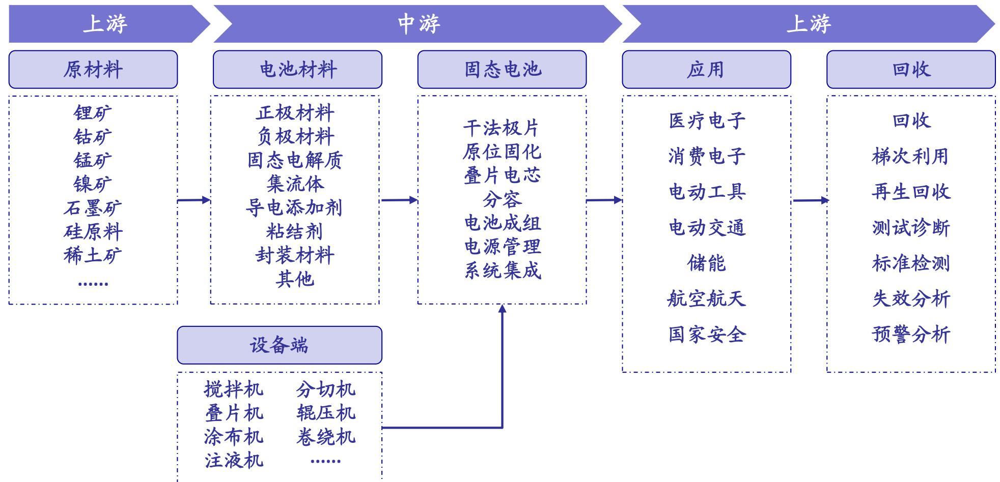

flowchart

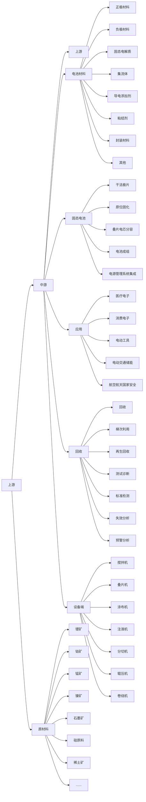
```mermaid
graph LR
    A["上游"] --> B["中游"]
    B --> C["上游"]
    A --> D["原材料"]
    D --> E["锂矿"]
    D --> F["钴矿"]
    D --> G["锰矿"]
    D --> H["镍矿"]
    D --> I["石墨矿"]
    D --> J["硅原料"]
    D --> K["稀土矿"]
    D --> L["......"]
    B --> M["电池材料"]
    M --> N["正极材料"]
    M --> O["负极材料"]
    M --> P["固态电解质"]
    M --> Q["集流体"]
    M --> R["导电添加剂"]
    M --> S["粘结剂"]
    M --> T["封装材料"]
    M --> U["其他"]
    B --> V["固态电池"]
    V --> W["干法极片"]
    V --> X["原位固化"]
    V --> Y["叠片电芯分容"]
    V --> Z["电池成组"]
    V --> AA["电源管理系统集成"]
    B --> AB["应用"]
    AB --> AC["医疗电子"]
    AB --> AD["消费电子"]
    AB --> AE["电动工具"]
    AB --> AF["电动交通储能"]
    AB --> AG["航空航天国家安全"]
    B --> AH["回收"]
    AH --> AI["回收"]
    AH --> AJ["梯次利用"]
    AH --> AK["再生回收"]
    AH --> AL["测试诊断"]
    AH --> AM["标准检测"]
    AH --> AN["失效分析"]
    AH --> AO["预警分析"]
    B --> AP["设备端"]
    AP --> AQ["搅拌机"]
    AP --> AR["叠片机"]
    AP --> AS["涂布机"]
    AP --> AT["注液机"]
    AP --> AU["分切机"]
    AP --> AV["辊压机"]
    AP --> AW["卷绕机"]
```

 固态电池产业化进程加速，技术进步、量产突破、定点上车等对行情有一定催化，建议持续跟踪已上市、未上市固态电池相关公司进展，关注设备端及中游材料环节：

 设备端：建议关注纳科诺尔、曼恩斯特、利元亨、海目星、先导智能；  
 材料端：建议关注（1）电池：宁德时代、国轩高科、鹏辉能源、中创新航、亿纬锂能；（2）锂电中游：三祥新材、容百科技、当升科技、天力锂能、五矿新能、厦钨新能、尚太科技、贝特瑞、中科电气、翔丰华、璞泰来、恩捷股份、天赐材料、振华新材、冠盛股份、帕瓦股份、星源材质、上海洗霸。

新技术研发不及预期的风险  
降本程度不及预期的风险   
 产业化进程不及预期的风险  
 专利壁垒的风险   
 行业政策变化的风险

# 重要信息披露

本研究报告由海通国际分销，海通国际是由海通国际研究有限公司(HTIRL)，Haitong Securities India Private Limited (HSIPL)，Haitong International Japan K.K. (HTIJKK)和海通国际证券有限公司(HTISCL)的证券研究团队所组成的全球品牌，海通国际证券集团(HTISG)各成员分别在其许可的司法管辖区内从事证券活动。

# IMPORTANT DISCLOSURES

This research report is distributed by Haitong International, a global brand name for the equity research teams of Haitong International Research Limited (“HTIRL”), Haitong Securities India Private Limited (“HSIPL”), Haitong International Japan K.K. (“HTIJKK”), Haitong International Securities Company Limited (“HTISCL”), and any other members within the Haitong International Securities Group of Companies (“HTISG”), each authorized to engage in securities activities in its respective jurisdiction.

# HTIRL分析师认证Analyst Certification:

我， 吴杰，在此保证（i）本研究报告中的意见准确反映了我们对本研究中提及的任何或所有目标公司或上市公司的个人观点，并且（ii）我的报酬中没有任何部分与本研究报告中表达的具体 建议或观点直接或间接相关；及就此报告中所讨论目标公司的证券，我们（包括我们的家属）在其中均不持有任何财务利益。我和我的家属（我已经告知他们）将不会在本研究报告发布后的 3个工作日内交易此研究报告所讨论目标公司的证券。I, Jie Wu, certify that (i) the views expressed in this research report accurately reflect my personal views about any or all of the subject companies or issuers referred to in this research and (ii) no part of my compensation was, is or will be directly or indirectly related to the specific recommendations or views expressed in this research report; and that I (including members of my household) have no financial interest in the security or securities of the subject companies discussed. I and my household, whom I have already notified of this, will not deal in or trade any securities in respect of the issuer that I review within 3 business days after the research report is published.

我， 陈昊飞，在此保证（i）本研究报告中的意见准确反映了我们对本研究中提及的任何或所有目标公司或上市公司的个人观点，并且（ii）我的报酬中没有任何部分与本研究报告中表达的具 体建议或观点直接或间接相关；及就此报告中所讨论目标公司的证券，我们（包括我们的家属）在其中均不持有任何财务利益。我和我的家属（我已经告知他们）将不会在本研究报告发布后 的3个工作日内交易此研究报告所讨论目标公司的证券。I, Haofei Chen, certify that (i) the views expressed in this research report accurately reflect my personal views about any or all of the subject companies or issuers referred to in this research and (ii) no part of my compensation was, is or will be directly or indirectly related to the specific recommendations or views expressed in this research report; and that I (including members of my household) have no financial interest in the security or securities of the subject companies discussed. I and my household, whom I have already notified of this, will not deal in or trade any securities in respect of the issuer that I review within 3 business days after the research report is published.

# 利益冲突披露Conflict of Interest Disclosures

海通国际及其某些关联公司可从事投资银行业务和/或对本研究中的特定股票或公司进行做市或持有自营头寸。就本研究报告而言，以下是有关该等关系的披露事项（以下披露不能保证及时无遗漏，如需了解及时全面信息，请发邮件至ERD-Disclosure@htisec.com）

HTI and some of its affiliates may engage in investment banking and / or serve as a market maker or hold proprietary trading positions of certain stocks or companies in this research report. As far as this research report is concerned, the following are the disclosure matters related to such relationship (As the following disclosure does not ensure timeliness and completeness, please send an email to ERD-Disclosure@htisec.com if timely and comprehensive information is needed).

海通证券股份有限公司和/或其子公司（统称“海通”）在过去12个月内参与了002074.CH and 002594.CH的投资银行项目。投资银行项目包括：1、海通担任上市前辅导机构、保荐人或主承销商的首次公开发行项目；2、海通作为保荐人、主承销商或财务顾问的股权或债务再融资项目；3、海通作为主经纪商的新三板上市、目标配售和并购项目。

Haitong Securities Co., Ltd. and/or its subsidiaries (collectively, the "Haitong") have a role in investment banking projects of 002074.CH and 002594.CH within the past 12 months. The investment banking projects include 1. IPO projects in which Haitong acted as pre-listing tutor, sponsor, or leadunderwriter; 2. equity or debt refinancing projects of 002074.CH and 002594.CH for which Haitong acted as sponsor, lead-underwriter or financial advisor; 3. listing by introduction in the new three board, target placement, M&A projects in which Haitong acted as lead-brokerage firm.

002074.CH及002594.CH目前或过去12个月内是海通的投资银行业务客户。

002074.CH and 002594.CH are/were an investment bank clients of Haitong currently or within the past 12 months.

002074.CH,002812.CH及001301.CH目前或过去12个月内是海通的客户。海通向客户提供非投资银行业务的证券相关业务服务。

002074.CH, 002812.CH and 001301.CH are/were a client of Haitong currently or within the past 12 months. The client has been provided for non-investment-banking securities-related services.

海通在过去的12个月中从002074.CH及002812.CH获得除投资银行服务以外之产品或服务的报酬。

Haitong has received compensation in the past 12 months for products or services other than investment banking from 002074.CH and 002812.CH.

# 评级定义（从2020年7月1日开始执行）：

海通国际（以下简称“HTI”）采用相对评级系统来为投资者推荐我们覆盖的公司：优于大市、中性或弱于大市。投资者应仔细阅读HTI的评级定义。并且HTI发布分析师观点的完整信息，投资者应仔细阅读全文而非仅看评级。在任何情况下，分析师的评级和研究都不能作为投资建议。投资者的买卖股票的决策应基于各自情况（比如投资者的现有持仓）以及其他因素。

# 分析师股票评级

优于大市，未来12-18个月内预期相对基准指数涨幅在10%以上，基准定义如下

中性，未来12-18个月内预期相对基准指数变化不大，基准定义如下。根据FINRA/NYSE的评级分布规则，我们会将中性评级划入持有这一类别。

弱于大市，未来12-18个月内预期相对基准指数跌幅在10%以上，基准定义如下

各地股票基准指数：日本 – TOPIX, 韩国 – KOSPI, 台湾 – TAIEX, 印度 – Nifty100, 美国 – SP500; 其他所有中国概念股 – MSCI China.

# Ratings Definitions (from 1 Jul 2020):

Haitong International uses a relative rating system using Outperform, Neutral, or Underperform for recommending the stocks we cover to investors. Investors should carefully read the definitions of all ratings used in Haitong International Research. In addition, since Haitong International Research contains more complete information concerning the analyst's views, investors should carefully read Haitong International Research, in its entirety, and not infer the contents from the rating alone. In any case, ratings (or research) should not be used or relied upon as investment advice. An investor's decision to buy or sell a stock should depend on individual circumstances (such as the investor's existing holdings) and other considerations.

# Analyst Stock Ratings

Outperform: The stock’s total return over the next 12-18 months is expected to exceed the return of its relevant broad market benchmark, as indicated below.

Neutral: The stock’s total return over the next 12-18 months is expected to be in line with the return of its relevant broad market benchmark, as indicated below. For purposes only of FINRA/NYSE ratings distribution rules, our Neutral rating falls into a hold rating category.

Underperform: The stock’s total return over the next 12-18 months is expected to be below the return of its relevant broad market benchmark, as indicated below.

Benchmarks for each stock’s listed region are as follows: Japan – TOPIX, Korea – KOSPI, Taiwan – TAIEX, India – Nifty100, US – SP500; for all other China-concept stocks – MSCI China.

评级分布Rating Distribution

Ratings Distribution   
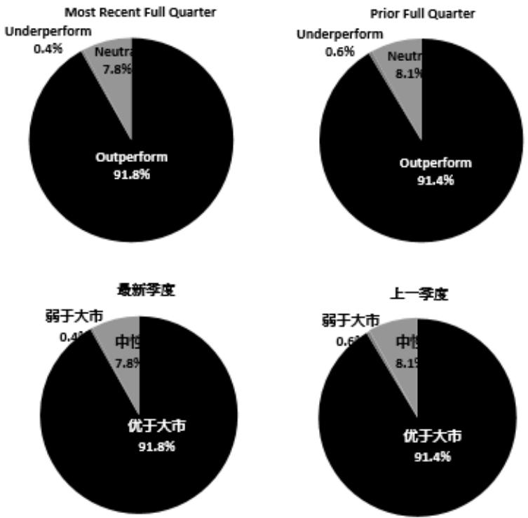

截至2024年9月30日海通国际股票研究评级分布

<table><tr><td></td><td>优于大市</td><td>中性(持有)</td><td>弱于大市</td></tr><tr><td>海通国际股票研究覆盖率</td><td>91.8%</td><td>7.8%</td><td>0.4%</td></tr><tr><td>投资银行客户*</td><td>3.5%</td><td>4.4%</td><td>0.0%</td></tr></table>

\*在每个评级类别里投资银行客户所占的百分比。  
上述分布中的买入，中性和卖出分别对应我们当前优于大市，中性和落后大市评级。  
只有根据FINRA/NYSE的评级分布规则，我们才将中性评级划入持有这一类别。请注意在上表中不包含非评级的股票。

# 此前的评级系统定义（直至2020年6月30日）：

买入，未来12-18个月内预期相对基准指数涨幅在10%以上，基准定义如下

中性，未来12-18个月内预期相对基准指数变化不大，基准定义如下。根据FINRA/NYSE的评级分布规则，我们会将中性评级划入持有这一类别。

卖出，未来12-18个月内预期相对基准指数跌幅在10%以上，基准定义如下

各地股票基准指数：日本 – TOPIX, 韩国 – KOSPI, 台湾 – TAIEX, 印度 – Nifty100; 其他所有中国概念股 – MSCI China.

Haitong International Equity Research Ratings Distribution, as of September 30, 2024 

<table><tr><td></td><td>Outperform</td><td>Neutral(hold)</td><td>Underperform</td></tr><tr><td>HTI Equity Research Coverage</td><td>91.8%</td><td>7.8%</td><td>0.4%</td></tr><tr><td>IB clients*</td><td>3.5%</td><td>4.4%</td><td>0.0%</td></tr></table>

\*Percentage of investment banking clients in each rating category.   
BUY, Neutral, and SELL in the above distribution correspond to our current ratings of Outperform, Neutral, and Underperform.   
For purposes only of FINRA/NYSE ratings distribution rules, our Neutral rating falls into a hold rating category. Please note that stocks with an NR designation are not included in the table above.

# Previous rating system definitions (until 30 Jun 2020):

BUY: The stock’s total return over the next 12-18 months is expected to exceed the return of its relevant broad market benchmark, as indicated below.

NEUTRAL: The stock’s total return over the next 12-18 months is expected to be in line with the return of its relevant broad market benchmark, as indicated below. For purposes only of FINRA/NYSE ratings distribution rules, our Neutral rating falls into a hold rating category.

SELL: The stock’s total return over the next 12-18 months is expected to be below the return of its relevant broad market benchmark, as indicated below.

Benchmarks for each stock’s listed region are as follows: Japan – TOPIX, Korea – KOSPI, Taiwan – TAIEX, India – Nifty100; for all other China-concept stocks – MSCI China.

海通国际非评级研究：海通国际发布计量、筛选或短篇报告，并在报告中根据估值和其他指标对股票进行排名，或者基于可能的估值倍数提出建议价格。这种排名或建议价格并非为了进行股票评级、提出目标价格或进行基本面估值，而仅供参考使用。

Haitong International Non-Rated Research: Haitong International publishes quantitative, screening or short reports which may rank stocks according to valuation and other metrics or may suggest prices based on possible valuation multiples. Such rankings or suggested prices do not purport to be stock ratings or target prices or fundamental values and are for information only.

海通国际A股覆盖：海通国际可能会就沪港通及深港通的中国A股进行覆盖及评级。海通证券（600837.CH），海通国际于上海的母公司，也会于中国发布中国A股的研究报告。但是，海通国际使用与海通证券不同的评级系统，所以海通国际与海通证券的中国A股评级可能有所不同。

Haitong International Coverage of A-Shares: Haitong International may cover and rate A-Shares that are subject to the Hong Kong Stock Connect scheme with Shanghai and Shenzhen. Haitong Securities (HS; 600837 CH), the ultimate parent company of HTISG based in Shanghai, covers and publishes research on these same A-Shares for distribution in mainland China. However, the rating system employed by HS differs from that used by HTI and as a result there may be a difference in the HTI and HS ratings for the same A-share stocks.

海通国际优质100 A股（Q100）指数：海通国际Q100指数是一个包括100支由海通证券覆盖的优质中国A股的计量产品。这些股票是通过基于质量的筛选过程，并结合对海通证券 A股团队自下而上的研究。海通国际每季对Q100指数成分作出复审。

Haitong International Quality 100 A-share (Q100) Index: HTI’s Q100 Index is a quant product that consists of 100 of the highest-quality A-shares under coverage at HS in Shanghai. These stocks are carefully selected through a quality-based screening process in combination with a review of the HS A-share team’s bottom-up research. The Q100 constituent companies are reviewed quarterly.

盟浪义利（FIN-ESG）数据通免责声明条款：在使用盟浪义利（FIN-ESG）数据之前，请务必仔细阅读本条款并同意本声明：

第一条 义利（FIN-ESG）数据系由盟浪可持续数字科技有限责任公司（以下简称“本公司”）基于合法取得的公开信息评估而成，本公司对信息的准确性及完整性不作任何保证。对公司的评估结果仅供参考，并不构成对任何个人或机构投资建议，也不能作为任何个人或机构购买、出售或持有相关金融产品的依据。本公司不对任何个人或机构投资者因使用本数据表述的评估结果造成的任何直接或间接损失负责。

第二条 盟浪并不因收到此评估数据而将收件人视为客户，收件人使用此数据时应根据自身实际情况作出自我独立判断。本数据所载内容反映的是盟浪在最初发布本数据日期当日的判断，盟浪有权在不发出通知的情况下更新、修订与发出其他与本数据所载内容不一致或有不同结论的数据。除非另行说明，本数据（如财务业绩数据等）仅代表过往表现，过往的业绩表现不作为日后回报的预测。

第三条 本数据版权归本公司所有，本公司依法保留各项权利。未经本公司事先书面许可授权，任何个人或机构不得将本数据中的评估结果用于任何营利性目的，不得对本数据进行修改、复制、编译、汇编、再次编辑、改编、删减、缩写、节选、发行、出租、展览、表演、放映、广播、信息网络传播、摄制、增加图标及说明等，否则因此给盟浪或其他第三方造成损失的，由用户承担相应的赔偿责任，盟浪不承担责任。

第四条 如本免责声明未约定，而盟浪网站平台载明的其他协议内容（如《盟浪网站用户注册协议》《盟浪网用户服务（含认证）协议》《盟浪网隐私政策》等）有约定的，则按其他协议的约定执行；若本免责声明与其他协议约定存在冲突或不一致的，则以本免责声明约定为准。

SusallWave FIN-ESG Data Service Disclaimer: Please read these terms and conditions below carefully and confirm your agreement and acceptance with these terms before using SusallWave FIN-ESG Data Service.

1. FIN-ESG Data is produced by SusallWave Digital Technology Co., Ltd. (In short, SusallWave)’s assessment based on legal publicly accessible information. SusallWave shall not be responsible for any accuracy and completeness of the information. The assessment result is for reference only. It is not for any investment advice for any individual or institution and not for basis of purchasing, selling or holding any relative financial products. We will not be liable for any direct or indirect loss of any individual or institution as a result of using SusallWave FIN-ESG Data.   
2. SusallWave do not consider recipients as customers for receiving these data. When using the data, recipients shall make your own independent judgment according to your practical individual status. The contents of the data reflect the judgment of us only on the release day. We have right to update and amend the data and release other data that contains inconsistent contents or different conclusions without notification. Unless expressly stated, the data (e.g., financial performance data) represents past performance only and the past performance cannot be viewed as the prediction of future return.   
3. The copyright of this data belongs to SusallWave, and we reserve all rights in accordance with the law. Without the prior written permission of our company, none of individual or institution can use these data for any profitable purpose. Besides, none of individual or institution can take actions such as amendment, replication, translation, compilation, re-editing, adaption, deletion, abbreviation, excerpts, issuance, rent, exhibition, performance, projection, broadcast, information network transmission, shooting, adding icons and instructions. If any loss of SusallWave or any third-party is caused by those actions, users shall bear the corresponding compensation liability. SusallWave shall not be responsible for any loss.   
4. If any term is not contained in this disclaimer but written in other agreements on our website (e.g. User Registration Protocol of SusallWave Website, User Service (including authentication) Agreement of SusallWave Website, Privacy Policy of Susallwave Website), it should be executed according to other agreements. If there is any difference between this disclaim and other agreements, this disclaimer shall be applied.

# 重要免责声明：

非印度证券的研究报告：本报告由海通国际证券集团有限公司（“HTISGL”）的全资附属公司海通国际研究有限公司（“HTIRL”）发行，该公司是根据香港证券及期货条例（第571章）持有第4类受规管活动（就证券提供意见）的持牌法团。该研究报告在HTISGL的全资附属公司Haitong International (Japan)K.K.（“HTIJKK”）的协助下发行，HTIJKK是由日本关东财务局监管为投资顾问。

印度证券的研究报告：本报告由从事证券交易、投资银行及证券分析及受Securities and Exchange Board of India（“SEBI”）监管的Haitong Securities IndiaPrivate Limited（“HTSIPL”）所发行，包括制作及发布涵盖BSE Limited（“BSE”）和National Stock Exchange of India Limited（“NSE”）上市公司（统称为「印度交易所」）的研究报告。HTSIPL于2016年12月22日被收购并成为海通国际证券集团有限公司（“HTISG”）的一部分。

所有研究报告均以海通国际为名作为全球品牌，经许可由海通国际证券股份有限公司及/或海通国际证券集团的其他成员在其司法管辖区发布。

本文件所载信息和观点已被编译或源自可靠来源，但HTIRL、HTISCL或任何其他属于海通国际证券集团有限公司（“HTISG”）的成员对其准确性、完整性和正确性不做任何明示或暗示的声明或保证。本文件中所有观点均截至本报告日期，如有更改，恕不另行通知。本文件仅供参考使用。文件中提及的任何公司或其股票的说明并非意图展示完整的内容，本文件并非/不应被解释为对证券买卖的明示或暗示地出价或征价。在某些司法管辖区，本文件中提及的证券可能无法进行买卖。如果投资产品以投资者本国货币以外的币种进行计价，则汇率变化可能会对投资产生不利影响。过去的表现并不一定代表将来的结果。某些特定交易，包括设计金融衍生工具的，有产生重大风险的可能性，因此并不适合所有的投资者。您还应认识到本文件中的建议并非为您量身定制。分析师并未考虑到您自身的财务情况，如您的财务状况和风险偏好。因此您必须自行分析并在适用的情况下咨询自己的法律、税收、会计、金融和其他方面的专业顾问，以期在投资之前评估该项建议是否适合于您。若由于使用本文件所载的材料而产生任何直接或间接的损失，HTISG及其董事、雇员或代理人对此均不承担任何责任。

除对本文内容承担责任的分析师除外，HTISG及我们的关联公司、高级管理人员、董事和雇员，均可不时作为主事人就本文件所述的任何证券或衍生品持有长仓或短仓以及进行买卖。HTISG的销售员、交易员和其他专业人士均可向HTISG的相关客户和公司提供与本文件所述意见相反的口头或书面市场评论意见或交易策略。HTISG可做出与本文件所述建议或意见不一致的投资决策。但HTIRL没有义务来确保本文件的收件人了解到该等交易决定、思路或建议。

请访问海通国际网站www.equities.htisec.com ，查阅更多有关海通国际为预防和避免利益冲突设立的组织和行政安排的内容信息。

非美国分析师披露信息：本项研究首页上列明的海通国际分析师并未在FINRA进行注册或者取得相应的资格，并且不受美国FINRA有关与本项研究目标公司进行沟通、公开露面和自营证券交易的第2241条规则之限制。

# IMPORTANT DISCLAIMER

For research reports on non-Indian securities: The research report is issued by Haitong International Research Limited (“HTIRL”), a wholly owned subsidiary of Haitong International Securities Group Limited (“HTISGL”) and a licensed corporation to carry on Type 4 regulated activity (advising on securities) for the purpose of the Securities and Futures Ordinance (Cap. 571) of Hong Kong, with the assistance of Haitong International (Japan) K.K. (“HTIJKK”), a wholly owned subsidiary of HTISGL and which is regulated as an Investment Adviser by the Kanto Finance Bureau of Japan.

For research reports on Indian securities: The research report is issued by Haitong Securities India Private Limited (“HSIPL”), an Indian company and a Securities and Exchange Board of India (“SEBI”) registered Stock Broker, Merchant Banker and Research Analyst that, inter alia, produces and distributes research reports covering listed entities on the BSE Limited (“BSE”) and the National Stock Exchange of India Limited (“NSE”) (collectively referred to as “Indian Exchanges”). HSIPL was acquired and became part of the Haitong International Securities Group of Companies (“HTISG”) on 22 December 2016.

All the research reports are globally branded under the name Haitong International and approved for distribution by Haitong International Securities Company Limited (“HTISCL”) and/or any other members within HTISG in their respective jurisdictions.

The information and opinions contained in this research report have been compiled or arrived at from sources believed to be reliable and in good faith but no representation or warranty, express or implied, is made by HTIRL, HTISCL, HSIPL, HTIJKK or any other members within HTISG from which this research report may be received, as to their accuracy, completeness or correctness. All opinions expressed herein are as of the date of this research report and are subject to change without notice. This research report is for information purpose only. Descriptions of any companies or their securities mentioned herein are not intended to be complete and this research report is not, and should not be construed expressly or impliedly as, an offer to buy or sell securities. The securities referred to in this research report may not be eligible for purchase or sale in some jurisdictions. If an investment product is denominated in a currency other than an investor's home currency, a change in exchange rates may adversely affect the investment. Past performance is not necessarily indicative of future results. Certain transactions, including those involving derivatives, give rise to substantial risk and are not suitable for all investors. You should also bear in mind that recommendations in this research report are not tailor-made for you. The analyst has not taken into account your unique financial circumstances, such as your financial situation and risk appetite. You must, therefore, analyze and should, where applicable, consult your own legal, tax, accounting, financial and other professional advisers to evaluate whether the recommendations suits you before investment. Neither HTISG nor any of its directors, employees or agents accepts any liability whatsoever for any direct or consequential loss arising from any use of the materials contained in this research report.

HTISG and our affiliates, officers, directors, and employees, excluding the analysts responsible for the content of this document, will from time to time have long or short positions in, act as principal in, and buy or sell, the securities or derivatives, if any, referred to in this research report. Sales, traders, and other professionals of HTISG may provide oral or written market commentary or trading strategies to the relevant clients and the companies within HTISG that reflect opinions that are contrary to the opinions expressed in this research report. HTISG may make investment decisions that are inconsistent with the recommendations or views expressed in this research report. HTI is under no obligation to ensure that such other trading decisions, ideas or recommendations are brought to the attention of any recipient of this research report.

Please refer to HTI’s website www.equities.htisec.com for further information on HTI’s organizational and administrative arrangements set up for the prevention and avoidance of conflicts of interest with respect to Research.

Non U.S. Analyst Disclosure: The HTI analyst(s) listed on the cover of this Research is (are) not registered or qualified as a research analyst with FINRA and are not subject to U.S. FINRA Rule 2241 restrictions on communications with companies that are the subject of the Research; public appearances; and trading securities by a research analyst.

# 分发和地区通知：

除非下文另有规定，否则任何希望讨论本报告或者就本项研究中讨论的任何证券进行任何交易的收件人均应联系其所在国家或地区的海通国际销售人员。

香港投资者的通知事项：海通国际证券股份有限公司(“HTISCL”)负责分发该研究报告，HTISCL是在香港有权实施第1类受规管活动（从事证券交易）的持牌公司。该研究报告并不构成《证券及期货条例》（香港法例第571章）（以下简称“SFO”）所界定的要约邀请，证券要约或公众要约。本研究报告仅提供给SFO所界定的“专业投资者”。本研究报告未经过证券及期货事务监察委员会的审查。您不应仅根据本研究报告中所载的信息做出投资决定。本研究报告的收件人就研究报告中产生或与之相关的任何事宜请联系HTISCL销售人员。

美国投资者的通知事项：本研究报告由HTIRL，HSIPL或HTIJKK编写。 HTIRL，HSIPL，HTIJKK以及任何非HTISG美国联营公司，均未在美国注册，因此不受美国关于研究报告编制和研究分析人员独立性规定的约束。本研究报告提供给依照1934年“美国证券交易法”第15a-6条规定的豁免注册的「美国主要机构投资者」（“Major U.S. Institutional Investor”）和「机构投资者」（”U.S. Institutional Investors”）。在向美国机构投资者分发研究报告时，HaitongInternational Securities (USA) Inc. （“HTI USA”） 将对报告的内容负责。任何收到本研究报告的美国投资者，希望根据本研究报告提供的信息进行任何证券或相关金融工具买卖的交易，只能通过HTI USA。HTI USA位于340 Madison Avenue, 12th Floor, New York, NY 10173，电话（212）351-6050。 HTI USA是在美国于U.S. Securities and Exchange Commission（“SEC”）注册的经纪商，也是Financial Industry Regulatory Authority, Inc.（“FINRA”）的成员。 HTIUSA不负责编写本研究报告，也不负责其中包含的分析。在任何情况下，收到本研究报告的任何美国投资者，不得直接与分析师直接联系，也不得通过HSIPL，HTIRL或HTIJKK直接进行买卖证券或相关金融工具的交易。本研究报告中出现的HSIPL，HTIRL或HTIJKK分析师没有注册或具备FINRA的研究分析师资格，因此可能不受FINRA第2241条规定的与目标公司的交流，公开露面和分析师账户持有的交易证券等限制。投资本研究报告中讨论的任何非美国证券或相关金融工具（包括ADR）可能存在一定风险。非美国发行的证券可能没有注册，或不受美国法规的约束。有关非美国证券或相关金融工具的信息可能有限制。外国公司可能不受审计和汇报的标准以及与美国境内生效相符的监管要求。本研究报告中以美元以外的其他货币计价的任何证券或相关金融工具的投资或收益的价值受汇率波动的影响，可能对该等证券或相关金融工具的价值或收入产生正面或负面影响。美国收件人的所有问询请联系：

Haitong International Securities (USA) Inc.

340 Madison Avenue, 12th Floor

New York, NY 10173

联系人电话：(212) 351 6050

# DISTRIBUTION AND REGIONAL NOTICES

Except as otherwise indicated below, any Recipient wishing to discuss this research report or effect any transaction in any security discussed in HTI’s research should contact the Haitong International salesperson in their own country or region.

Notice to Hong Kong investors: The research report is distributed by Haitong International Securities Company Limited (“HTISCL”), which is a licensed corporation to carry on Type 1 regulated activity (dealing in securities) in Hong Kong. This research report does not constitute a solicitation or an offer of securities or an invitation to the public within the meaning of the SFO. This research report is only to be circulated to "Professional Investors" as defined in the SFO. This research report has not been reviewed by the Securities and Futures Commission. You should not make investment decisions solely on the basis of the information contained in this research report. Recipients of this research report are to contact HTISCL salespersons in respect of any matters arising from, or in connection with, the research report.

Notice to U.S. investors: As described above, this research report was prepared by HTIRL, HSIPL or HTIJKK. Neither HTIRL, HSIPL, HTIJKK, nor any of the non U.S. HTISG affiliates is registered in the United States and, therefore, is not subject to U.S. rules regarding the preparation of research reports and the independence of research analysts. This research report is provided for distribution to “major U.S. institutional investors” and “U.S. institutional investors” in reliance on the exemption from registration provided by Rule 15a-6 of the U.S. Securities Exchange Act of 1934, as amended. When distributing research reports to “U.S. institutional investors,” HTI USA will accept the responsibilities for the content of the reports. Any U.S. recipient of this research report wishing to effect any transaction to buy or sell securities or related financial instruments based on the information provided in this research report should do so only through Haitong International Securities (USA) Inc. (“HTI USA”), located at 340 Madison Avenue, 12th Floor, New York, NY 10173, USA; telephone (212) 351 6050. HTI USA is a brokerdealer registered in the U.S. with the U.S. Securities and Exchange Commission (the “SEC”) and a member of the Financial Industry Regulatory Authority, Inc. (“FINRA”). HTI USA is not responsible for the preparation of this research report nor for the analysis contained therein. Under no circumstances should any U.S. recipient of this research report contact the analyst directly or effect any transaction to buy or sell securities or related financial instruments directly through HSIPL, HTIRL or HTIJKK. The HSIPL, HTIRL or HTIJKK analyst(s) whose name appears in this research report is not registered or qualified as a research analyst with FINRA and, therefore, may not be subject to FINRA Rule 2241 restrictions on communications with a subject company, public appearances and trading securities held by a research analyst account. Investing in any non-U.S. securities or related financial instruments (including ADRs) discussed in this research report may present certain risks. The securities of non-U.S. issuers may not be registered with, or be subject to U.S. regulations. Information on such non-U.S. securities or related financial instruments may be limited. Foreign companies may not be subject to audit and reporting standards and regulatory requirements comparable to those in effect within the U.S. The value of any investment or income from any securities or related financial instruments discussed in this research report denominated in a currency other than U.S. dollars is subject to exchange rate fluctuations that may have a positive or adverse effect on the value of or income from such securities or related financial instruments. All inquiries by U.S. recipients should be directed to:

Haitong International Securities (USA) Inc.

340 Madison Avenue, 12th Floor

New York, NY 10173

Attn: Sales Desk at (212) 351 6050

中华人民共和国的通知事项：在中华人民共和国（下称“中国”，就本报告目的而言，不包括香港特别行政区、澳门特别行政区和台湾）只有根据适用的中国法律法规而收到该材料的人员方可使用该材料。并且根据相关法律法规，该材料中的信息并不构成“在中国从事生产、经营活动”。本文件在中国并不构成相关证券的公共发售或认购。无论根据法律规定或其他任何规定，在取得中国政府所有的批准或许可之前，任何法人或自然人均不得直接或间接地购买本材料中的任何证券或任何实益权益。接收本文件的人员须遵守上述限制性规定。

加拿大投资者的通知事项：在任何情况下该等材料均不得被解释为在任何加拿大的司法管辖区内出售证券的要约或认购证券的要约邀请。本材料中所述证券在加拿大的任何要约或出售行为均只能在豁免向有关加拿大证券监管机构提交招股说明书的前提下由Haitong International Securities (USA) Inc. （“HTIUSA”）予以实施，该公司是一家根据National Instrument 31-103 Registration Requirements, Exemptions and Ongoing Registrant Obligations（“NI 31-103”）的规定得到「国际交易商豁免」（“International Dealer Exemption” ）的交易商，位于艾伯塔省、不列颠哥伦比亚省、安大略省和魁北克省。在加拿大，该等材料在任何情况下均不得被解释为任何证券的招股说明书、发行备忘录、广告或公开发行。加拿大的任何证券委员会或类似的监管机构均未审查或以任何方式批准该等材料、其中所载的信息或所述证券的优点，任何与此相反的声明即属违法。在收到该等材料时，每个加拿大的收件人均将被视为属于National Instrument 45-106 Prospectus Exemptions第1.1节或者Securities Act (Ontario)第73.3(1)节所规定的「认可投资者」（“Accredited Investor”），或者在适用情况下National Instrument 31-103第1.1节所规定的「许可投资者」（“Permitted Investor”）。

新加坡投资者的通知事项：本研究报告由Haitong International Securities (Singapore) Pte Ltd（“HTISSPL”）于新加坡提供。HTISSPL是符合《财务顾问法》2001（“FAA”）定义的豁免财务顾问，可（a）提供关于证券，集体投资计划的部分，交易所衍生品合约和场外衍生品合约的建议（b）发行或公布有关证券、交易所衍生品合约和场外衍生品合约的研究分析或研究报告。本研究报告仅提供给符合《证券及期货法》2001第4A条项下规定的机构投资者。对于因本研究报告而产生的或与之相关的任何问题，本研究报告的收件人应通过以下信息与HTISSPL联系：

Haitong International Securities (Singapore) Pte. Ltd

10 Collyer Quay, #19-01 - #19-05 Ocean Financial Centre, Singapore 049315

电话: (65) 6713 0473

日本投资者的通知事项：本研究报告由海通国际证券有限公司所发布，旨在分发给从事投资管理的金融服务提供商或注册金融机构（根据日本金融机构和交易法（“FIEL”））第61（1）条，第17-11（1）条的执行及相关条款）。

英国及欧盟投资者的通知事项：本报告由从事投资顾问的Haitong International Securities Company Limited所发布，本报告只面向有投资相关经验的专业客户发布。任何投资或与本报告相关的投资行为只面对此类专业客户。没有投资经验或相关投资经验的客户不得依赖本报告。Haitong International SecuritiesCompany Limited的分支机构的净长期或短期金融权益可能超过本研究报告中提及的实体已发行股本总额的0.5％。特别提醒有些英文报告有可能此前已经通过中文或其它语言完成发布。

澳大利亚投资者的通知事项：Haitong International Securities (Singapore) Pte Ltd, Haitong International Securities Company Limited和Haitong InternationalSecurities (UK) Limited分别根据澳大利亚证券和投资委员会（以下简称“ASIC”）第03/1102、03/1103或03/1099号规章在澳大利亚分发本项研究，该等规章免除了根据2001年《公司法》在澳大利亚为批发客户提供金融服务时海通国际需持有澳大利亚金融服务许可的要求。ASIC的规章副本可在以下网站获取：www.legislation.gov.au。海通国际提供的金融服务受外国法律法规规定的管制，该等法律与在澳大利亚所适用的法律存在差异。

印度投资者的通知事项：本报告由从事证券交易、投资银行及证券分析及受Securities and Exchange Board of India（“SEBI”）监管的Haitong Securities IndiaPrivate Limited（“HTSIPL”）所发布，包括制作及发布涵盖BSE Limited（“BSE”）和National Stock Exchange of India Limited（“NSE”）（统称为「印度交易所」）研究报告。

研究机构名称: Haitong Securities India Private Limited

SEBI 研究分析师注册号: INH000002590

地址: 1203A, Floor 12A, Tower 2A, One World Center

841 Senapati Bapat Marg, Elphinstone Road, Mumbai 400 013, India

CIN U74140MH2011FTC224070

电话: +91 22 43156800 传真:+91 22 24216327

合规和申诉办公室联系人： Prasanna Chandwaskar ；电话: +91 22 43156803; 电子邮箱: prasanna.chandwaskar@htisec.com

“请注意，SEBI授予的注册和NISM的认证并不保证中介的表现或为投资者提供任何回报保证”。

本项研究仅供收件人使用，未经海通国际的书面同意不得予以复制和再次分发。

版权所有：海通国际证券集团有限公司2019年。保留所有权利。

People’s Republic of China (PRC): In the PRC, the research report is directed for the sole use of those who receive the research report in accordance with the applicable PRC laws and regulations. Further, the information on the research report does not constitute "production and business activities in the PRC" under relevant PRC laws. This research report does not constitute a public offer of the security, whether by sale or subscription, in the PRC. Further, no legal or natural persons of the PRC may directly or indirectly purchase any of the security or any beneficial interest therein without obtaining all prior PRC government approvals or licenses that are required, whether statutorily or otherwise. Persons who come into possession of this research are required to observe these restrictions.

Notice to Canadian Investors: Under no circumstances is this research report to be construed as an offer to sell securities or as a solicitation of an offer to buy securities in any jurisdiction of Canada. Any offer or sale of the securities described herein in Canada will be made only under an exemption from the requirements to file a prospectus with the relevant Canadian securities regulators and only by Haitong International Securities (USA) Inc., a dealer relying on the “international dealer exemption” under National Instrument 31-103 Registration Requirements, Exemptions and Ongoing Registrant Obligations (“NI 31-103”) in Alberta, British Columbia, Ontario and Quebec. This research report is not, and under no circumstances should be construed as, a prospectus, an offering memorandum, an advertisement or a public offering of any securities in Canada. No securities commission or similar regulatory authority in Canada has reviewed or in any way passed upon this research report, the information contained herein or the merits of the securities described herein and any representation to the contrary is an offence. Upon receipt of this research report, each Canadian recipient will be deemed to have represented that the investor is an “accredited investor” as such term is defined in section 1.1 of National Instrument 45-106 Prospectus Exemptions or, in Ontario, in section 73.3(1) of the Securities Act (Ontario), as applicable, and a “permitted client” as such term is defined in section 1.1 of NI 31-103, respectively.

Notice to Singapore investors: This research report is provided in Singapore by or through Haitong International Securities (Singapore) Pte Ltd (“HTISSPL”). HTISSPL is an Exempt Financial Adviser under the Financial Advisers Act 2001 (“FAA”) to (a) advise on securities, units in a collective investment scheme, exchange-traded derivatives contracts and over-the-counter derivatives contracts and (b) issue or promulgate research analyses or research reports on securities, exchange-traded derivatives contracts and over-the-counter derivatives contracts. This research report is only provided to institutional investors, within the meaning of Section 4A of the Securities and Futures Act 2001. Recipients of this research report are to contact HTISSPL via the details below in respect of any matters arising from, or in connection with, the research report:

Haitong International Securities (Singapore) Pte. Ltd.

10 Collyer Quay, #19-01 - #19-05 Ocean Financial Centre, Singapore 049315

Telephone: (65) 6713 0473

Notice to Japanese investors: This research report is distributed by Haitong International Securities Company Limited and intended to be distributed to Financial Services Providers or Registered Financial Institutions engaged in investment management (as defined in the Japan Financial Instruments and Exchange Act ("FIEL") Art. 61(1), Order for Enforcement of FIEL Art. 17-11(1), and related articles).

Notice to UK and European Union investors: This research report is distributed by Haitong International Securities Company Limited. This research is directed at persons having professional experience in matters relating to investments. Any investment or investment activity to which this research relates is available only to such persons or will be engaged in only with such persons. Persons who do not have professional experience in matters relating to investments should not rely on this research. Haitong International Securities Company Limited’s affiliates may have a net long or short financial interest in excess of 0.5% of the total issued share capital of the entities mentioned in this research report. Please be aware that any report in English may have been published previously in Chinese or another language.

Notice to Australian investors: The research report is distributed in Australia by Haitong International Securities (Singapore) Pte Ltd, Haitong International Securities Company Limited, and Haitong International Securities (UK) Limited in reliance on ASIC Class Order 03/1102, 03/1103 or 03/1099, respectively, which exempts those HTISG entities from the requirement to hold an Australian financial services license under the Corporations Act 2001 in respect of the financial services it provides to wholesale clients in Australia. A copy of the ASIC Class Orders may be obtained at the following website, www.legislation.gov.au. Financial services provided by Haitong International Securities (Singapore) Pte Ltd, Haitong International Securities Company Limited, and Haitong International Securities (UK) Limited are regulated under foreign laws and regulatory requirements, which are different from the laws applying in Australia.

Notice to Indian investors: The research report is distributed by Haitong Securities India Private Limited (“HSIPL”), an Indian company and a Securities and Exchange Board of India (“SEBI”) registered Stock Broker, Merchant Banker and Research Analyst that, inter alia, produces and distributes research reports covering listed entities on the BSE Limited (“BSE”) and the National Stock Exchange of India Limited (“NSE”) (collectively referred to as “Indian Exchanges”).

Name of the entity: Haitong Securities India Private Limited

SEBI Research Analyst Registration Number: INH000002590

Address : 1203A, Floor 12A, Tower 2A, One World Center

841 Senapati Bapat Marg, Elphinstone Road, Mumbai 400 013, India

CIN U74140MH2011FTC224070

Ph: +91 22 43156800 Fax:+91 22 24216327

Details of the Compliance Officer and Grievance Officer : Prasanna Chandwaskar : Ph: +91 22 43156803; Email id: prasanna.chandwaskar@htisec.com

“Please note that Registration granted by SEBI and Certification from NISM in no way guarantee performance of the intermediary or provide any assurance of returns to investors”.

This research report is intended for the recipients only and may not be reproduced or redistributed without the written consent of an authorized signatory of HTISG.

Copyright: Haitong International Securities Group Limited 2019. All rights reserved.

http://equities.htisec.com/x/legal.html