# 新能源 New Energy

固态电池系列1：全球政策与各国发展路径全景对比——政策风起，产业破晓

A Global Comparison of Policies and National Development Paths — Policies Gather Momentum, Industry Dawns

观点聚焦 Investment Focus

<table><tr><td colspan="5">市盈率 P/E</td></tr><tr><td>股票名称</td><td>评级</td><td>目标价</td><td>PE(2025E)</td><td>PE(2026E)</td></tr><tr><td>阳光电源</td><td>Outperform</td><td>129.78</td><td>21</td><td>18</td></tr><tr><td>天合光能</td><td>Outperform</td><td>29.40</td><td>7</td><td>6</td></tr><tr><td>TCL中环</td><td>Outperform</td><td>11.68</td><td>12</td><td>10</td></tr><tr><td>大金重工</td><td>Outperform</td><td>55.25</td><td>52</td><td>36</td></tr><tr><td>鹏辉能源</td><td>Outperform</td><td>36.60</td><td>29</td><td>n.a.</td></tr><tr><td>爱旭股份</td><td>Outperform</td><td>19.60</td><td>18</td><td>45</td></tr><tr><td>科华数据</td><td>Outperform</td><td>52.64</td><td>24</td><td>n.a.</td></tr><tr><td>南网科技</td><td>Outperform</td><td>33.31</td><td>40</td><td>33</td></tr><tr><td>华明装备</td><td>Outperform</td><td>20.70</td><td>36</td><td>30</td></tr><tr><td>江苏新能</td><td>Outperform</td><td>14.56</td><td>15</td><td>n.a.</td></tr><tr><td>宝新能源</td><td>Outperform</td><td>8.54</td><td>3</td><td>n.a.</td></tr><tr><td>贝特瑞</td><td>Outperform</td><td>34.94</td><td>0</td><td>0</td></tr></table>

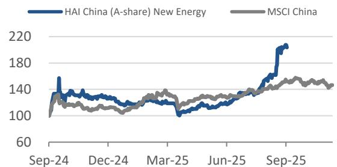

line

| Date   | HAI China (A-share) New Energy | MSCI China |
|--------|----------------------------------|----------|
| Sep-24 | ~140                             | ~130     |
| Dec-24 | ~130                             | ~120     |
| Mar-25 | ~100                             | ~130     |
| Jun-25 | ~130                             | ~130     |
| Sep-25 | ~210                             | ~140     |

资料来源： Factset, HTI

# Related Reports

各地新政限制售电盈利，有利电价企稳

New Policies Across Regions Limit Electricity Sales Profits, Stabilizing Prices (27 Nov 2025)

风光储电力政策频出，预计估值有望提升

Frequent Policies on Wind Power and PV Storage Expected to Boost Valuation (18 Nov 2025)

国投电力(600886 CH): 燃料成本对冲来水波动，现金流显著改善—维持优于大市; 下调目标价 13%(SDIC Power Holdings: Fuel Cost Hedging Mitigates

Water Flow Variability, Significantly Improves Cash Flows—Maintain OP & Cut TP by 13%) (17 Nov 2025)

(Please see APPENDIX 1 for English summary)

# 固态电池：突破能量密度与安全双重瓶颈

传统液锂电池能量密度已逼近理论极限，难以满足市场对续航提升的需求。同时，其液态电解液易燃易爆，导致热失控风险。固态电池通过采用固态电解质，从根本上解决安全问题，并将能量密度提升至 500 Wh/kg。2024 年全球（半）固态电池出货量达 5.3GWh，渗透率约 0.2%，未来增速有望加快提升。

# 中国：全产业链优势与政策驱动，头部企业明确量产时间

中国作为全球最大动力电池生产国，在固态电池领域已形成“国家战略+地方产业+多元政策”的支持体系。龙头企业进展显著：宁德时代 2025 年已在合肥投产 5GWh 硫化物全固态中试线，计划 2027年小批量产；比亚迪 2024 年下线 60Ah 全固态样品，计划 2027 年实现批量示范装车。中国凭借全产业链与市场需求双重优势，正从制造大国迈向创新策源地。

# 美国：初创企业引领、资本驱动，技术路线分化明确

美国固态电池产业以初创公司为核心，政策通过《通胀削减法案》等提供电芯 35 美元/kWh 的税收抵免，并累计拨付超 2.5 亿美元研发资金支持。QuantumScape 2025 年交付的 QSE-5 B 样能量密度达844 Wh/L，支持 12 分钟快充；Solid Power 硅负极样品达 390Wh/kg，并与宝马、三星 SDI 达成三方合作，计划 2027 年量产。

# 日韩：技术深耕与量产提速，依托本土产业链协同

日本以材料创新为本，丰田在全球硫化物固态电池专利中占比高达68%，计划 2027 年推出续航超 1000 公里的全固态电动车；出光兴产计划 2027 年建成 1000 吨/年硫化锂产能。韩国则凭借三星 SDI、LGES 等巨头整合产业链。三星 SDI 已建成全固态试点线；LG 新能源采取渐进路线，计划 2026 年量产半固态电池，2028 年实现全固态。日韩企业依托深厚的技术积累和车企联盟，力图在 2027–2030年实现全固态电池的商业化反超。

# 投资建议

建议重点关注技术领先、产业化进程明确的企业：宁德时代（ 300750 CH / 3750 HK ） 、 比 亚 迪 （ 002594 CH ） 、 亿 纬 锂 能（300014 CH）、先导智能（ 300450 CH）、国轩高科（ 002074CH）、厦钨新能（688778 CH）、天赐材料（002709 CH）、新宙邦（ 300037 CH ） 、 璞 泰 来 （ 603659 CH ） 、 QuantumScape （ QSUS ） 、 Solid Power （ SLDP US ） 、 丰 田 （ TM US ） 、 三 星 SDI（006400 KS）、LGES（373220 KS）。

# 风险

产业化进展不及预期；原材料价格波动；宏观与政策不确定；地缘政治变化等风险。

[Table\_Author] 徐柏乔 Baiqiao Xu

bq.xu@htisec.com

Rosy Hou

rx.hou@htisec.com

# 目录

# 1. 续航焦虑与安全隐忧共驱，固态电池成破局新希望.

1.1 液态锂电池的带来续航与安全的担忧.  
1.2 固态电池对于安全性能与能量密度的提升

# 2. 全球政策加码推动固态电池行业发展....

2.1 政策纵览：各国博弈.  
2.2 中国：背靠全球最大市场，迈向全球创新策源地 ..  
2.4 美国：初创公司先行，资本注入快速撬动产业化进程 12  
2.3 日韩：技术深耕与产业化加速双轨并进.. 17

2.3.1 日本：以材料创新为本，稳步构筑技术壁垒. 17  
2.3.1 韩国：整合产业链优势，加速量产布局.... .21

# 3. 投资建议 ........ 27

# 4. 风险提示 ....... 27

# 1. 续航焦虑与安全隐忧共驱，固态电池成破局新希望

# 1.1 液态锂电池的带来续航与安全的担忧

传统液态锂离子电池历经数十年发展，其产业化体系已相当成熟。作为其主要应用领域之一，中国电动汽车的渗透率从 2020 年的不足 10%，迅速提升至 2024 年全年超过40%。根据中汽协数据，2025 年 1–6 月，国内新能源汽车渗透率进一步攀升至46.8%，整体增速较前期略有放缓。

图表: 中国新能源汽车渗透率  
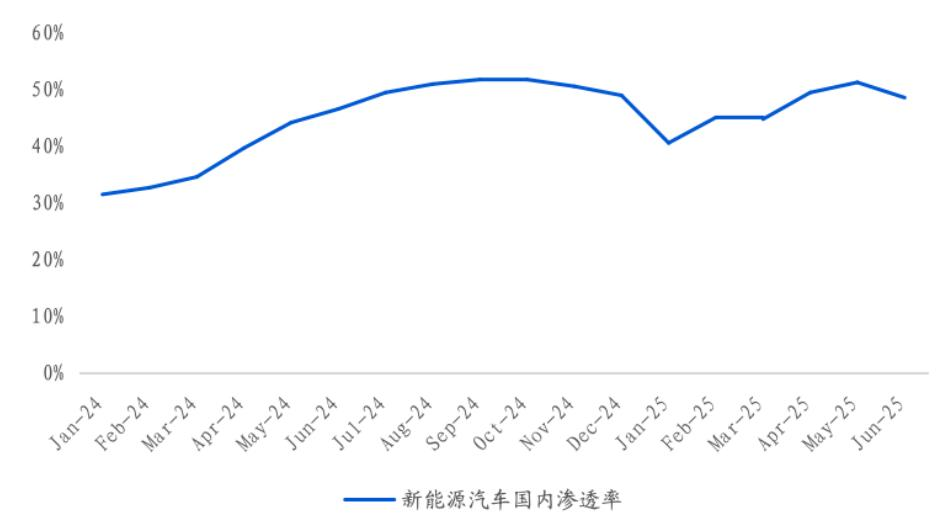

line

| Month    | 新能源汽车国内渗透率 |
| -------- | ------------------- |
| Jan-24   | 31%                 |
| Feb-24   | 33%                 |
| Mar-24   | 35%                 |
| Apr-24   | 38%                 |
| May-24   | 43%                 |
| Jun-24   | 46%                 |
| Jul-24   | 49%                 |
| Aug-24   | 51%                 |
| Sep-24   | 52%                 |
| Oct-24   | 52%                 |
| Nov-24   | 51%                 |
| Dec-24   | 49%                 |
| Jan-25   | 40%                 |
| Feb-25   | 45%                 |
| Mar-25   | 45%                 |
| Apr-25   | 48%                 |
| May-25   | 51%                 |
| Jun-25   | 49%                 |

资料来源：中汽协，HTI

在电动汽车产业高速发展的背景下，传统液态锂电池的能量密度问题愈发成为其发展桎梏。当前，无论是磷酸铁锂还是三元锂电池，其能量密度均已接近现有材料体系的理论天花板（铁锂 160-220Wh/Kg、三元 200-300Wh/kg），导致电动汽车续航里程的提升陷入停滞，无法满足市场的持续期待，进而成为行业与终端用户的核心焦虑。

图表: 电池能量密度与电池技术路线  
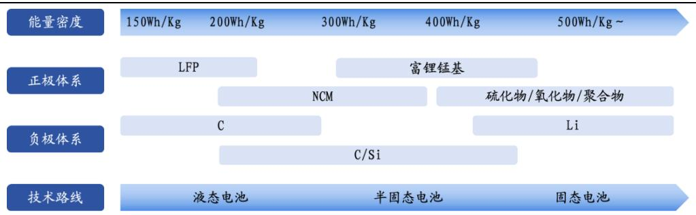

flowchart

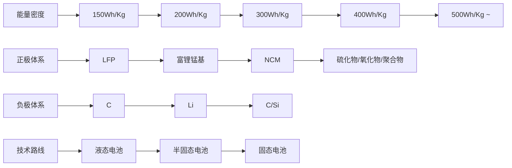
```mermaid
graph LR
    A["能量密度"] --> B["150Wh/Kg"]
    B --> C["200Wh/Kg"]
    C --> D["300Wh/Kg"]
    D --> E["400Wh/Kg"]
    E --> F["500Wh/Kg ~"]
    
    G["正极体系"] --> H["LFP"]
    H --> I["富锂锰基"]
    I --> J["NCM"]
    J --> K["硫化物/氧化物/聚合物"]
    
    L["负极体系"] --> M["C"]
    M --> N["Li"]
    N --> O["C/Si"]
    
    P["技术路线"] --> Q["液态电池"]
    Q --> R["半固态电池"]
    R --> S["固态电池"]
```

资料来源：工信部，中科院，HTI

除了能量密度瓶颈之外，传统液态锂电池的安全忧虑同样严峻，核心在于其所使用的电解液，这类有机溶剂易挥发且高度易燃，在电池遭遇挤压或短路时，热量积聚可能瞬间触发不可控的“热失控”链式反应，从而导致起火。热失控是目前绝大多数电动车安全事故的直接原因。

图表: 锂离子电池热失控致灾历程  
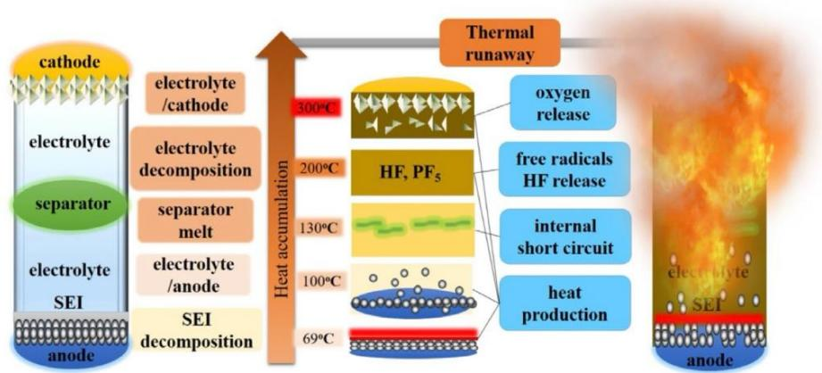

flowchart

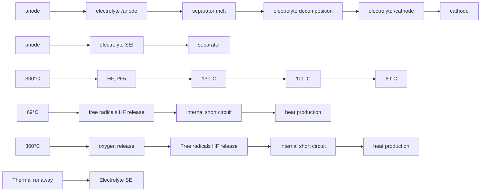
```mermaid
graph LR
    A["anode"] --> B["electrolyte /anode"]
    B --> C["separator melt"]
    C --> D["electrolyte decomposition"]
    D --> E["electrolyte /cathode"]
    E --> F["cathode"]
    
    G["anode"] --> H["electrolyte SEI"]
    H --> I["separator"]
    
    J["300°C"] --> K["HF, PF5"]
    K --> L["130°C"]
    L --> M["100°C"]
    M --> N["69°C"]
    
    O["69°C"] --> P["free radicals HF release"]
    P --> Q["internal short circuit"]
    Q --> R["heat production"]
    
    S["300°C"] --> T["oxygen release"]
    T --> U["Free radicals HF release"]
    U --> V["internal short circuit"]
    V --> W["heat production"]
    
    X["Thermal runaway"] --> Y["Electrolyte SEI"]
```

Science HTI

# 1.2 固态电池对于安全性能与能量密度的提升

固态电池沿用了传统液态锂电池的充放电基本原理，但其核心突破在于以固态电解质替代了传统的液态电解液与隔膜。这一关键材料变革，同步解决了能量密度与安全性两大瓶颈：固态电解质不可燃、耐高温，从根本上杜绝了热失控风险；其高机械强度允许使用锂金属/硅负极，从而大幅提升电池的能量密度。

图表: 传统锂电池与全固态锂电池的构造结构图  
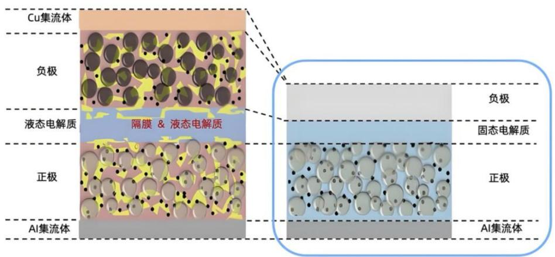

text_image

Cu集流体
负极
液态电解质
隔膜 & 液态电解质
正极
Al集流体
负极
固态电解质
正极
Al集流体

CNKI HTI

固态电池的能量密度可达500 Wh/kg，远超当前主流液态锂离子电池，这一优势主要源于其在材料与结构层面的多重突破。根据能量密度公式，提升路径主要包括增加电极容量、优化系统结构及减少非活性物质质量等：

1）拓宽电压窗口并适配高能量电极材料：固态电解质具备 5V 以上的宽电化学窗口，可匹配高电压正极材料，从而提升整体工作电压与能量输出。同时，其高机械模量可有效抑制锂枝晶穿刺，使得高容量、高反应活性的锂金属负极的应用成为可能，从根本上突破现有石墨负极的能量密度瓶颈。  
2）结构紧凑与系统集成简化：固态电解质兼具隔膜与离子传导功能，支持将电极间距压缩至微米级，大大提升了体积能量密度。  
3）拓展新型高容量材料体系：固态电解质为下一代超高能量密度电池体系提供了关键载体。例如在锂-硫电池中，可有效阻隔多硫化物的穿梭效应，提升循环稳定性，为更高能量体系的工程化奠定基础。

图表: （a）锂电池原理及其参数（b）材料体系变化实现高能量密度的原理  
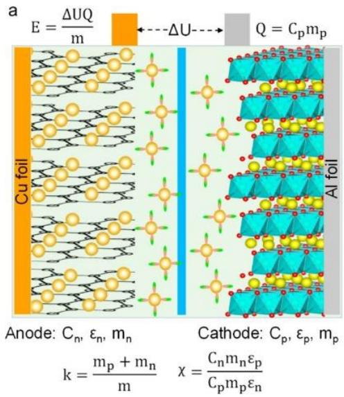

chemical

Diagram comparing Cu foil and Al foil structures with labeled parameters for anode, cathode, and thermal conductivity

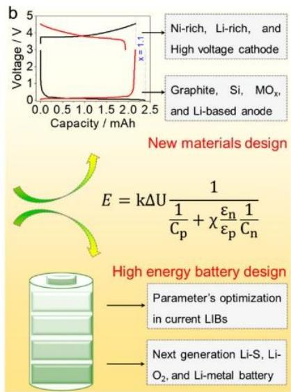

text_image

b
Voltage / V
Ni-rich, Li-rich, and
High voltage cathode
Graphite, Si, MOₓ,
and Li-based anode
0.0 0.5 1.0 1.5 2.0 2.5
Capacity / mAh
x = 1.1
New materials design
E = kΔU (1/(Cp) + χεn/Cn) / (1/(Cp) + χεn/Cn)
High energy battery design
Parameter's optimization
in current LIBs
Next generation Li-S, Li-
O₂, and Li-metal battery

ACS Energy Letters HTI

固态电池技术已实现从实验室走向产业化的关键突破，正式迈入商业化前夜。在材料体系上，硫化物电解质、硅碳复合负极等技术已率先在半固态电池中实现应用，而锂金属负极的循环稳定性等核心难题也取得显著进展。在产业化路径上，行业已形成“先半固态，后全固态”的务实共识。目前，半固态电池已成功实现批量装机，为全固态电池的供应链成熟与工艺优化打下了坚实基础。

图表: 固态电池技术发展历史  
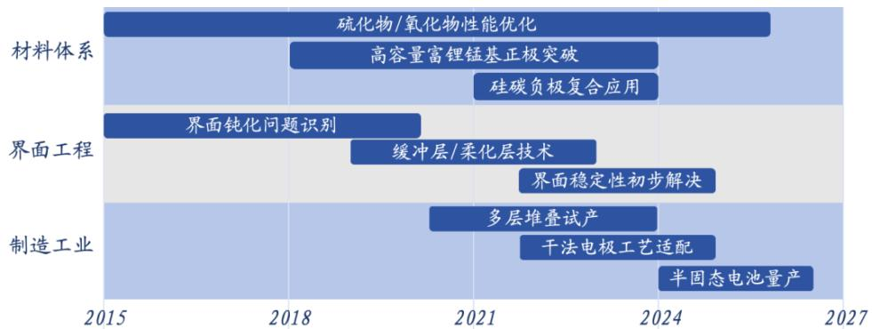

bar

| 类别 | 项目 | 数值 |
|---|---|---|
| 材料体系 | 硫化物/氧化物性能优化 | 26.0 |
| 材料体系 | 高容量富锂锰基正极突破 | 24.0 |
| 材料体系 | 硅碳负极复合应用 | 24.0 |
| 界面工程 | 界面钝化问题识别 | 19.0 |
| 界面工程 | 缓冲层/柔化层技术 | 23.0 |
| 界面工程 | 界面稳定性初步解决 | 24.0 |
| 制造工业 | 多层堆叠试产 | 24.0 |
| 制造工业 | 干法电极工艺适配 | 24.0 |
| 制造工业 | 半固态电池量产 | 26.0 |

HTI

# 2. 全球政策加码推动固态电池行业发展

# 2.1 政策纵览：各国博弈

固态电池的发展已超越技术竞争，上升为主要经济体国家战略。在此背景下，政策扶持成为争夺技术与市场主导权的核心抓手。全球研发格局呈现出多元化的竞争路径：日本以丰田为代表，依托深厚的产业积淀追求技术领先；中国凭借宁德时代等企业，在产业化与商用落地速度上占据先机；韩国依靠三星 SDI 等巨头，通过紧密绑定国际车企进行重点投入；美国则以 QuantumScape 等初创企业为先锋，倚重资本驱动并与车企合作，探索颠覆性技术路线。

图表: 固态电池全球产业发展时间线  
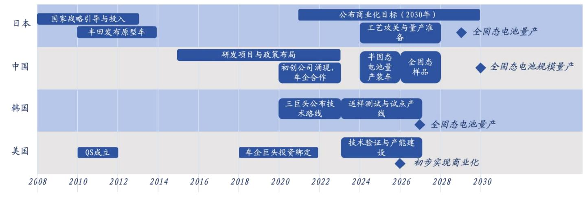

flowchart

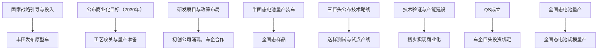
```mermaid
graph TD
    A["国家战略引导与投入"] --> B["丰田发布原型车"]
    C["公布商业化目标（2030年）"] --> D["工艺攻关与量产准备"]
    E["研发项目与政策布局"] --> F["初创公司涌现，车企合作"]
    G["半固态电池量产装车"] --> H["全固态样品"]
    I["三巨头公布技术路线"] --> J["送样测试与试点产线"]
    K["技术验证与产能建设"] --> L["初步实现商业化"]
    M["QS成立"] --> N["车企巨头投资绑定"]
    O["全固态电池量产"] --> P["全固态电池规模量产"]
```

HTI

围绕固态电池的产业化竞赛正沿多条技术路径同步推进。在硫化物路线上，宁德时代、比亚迪、丰田及三星 SDI 均入场布局，计划在 2027 年前后实现试产或小批量上车。氧化物路线则以 QuantumScape 为代表，计划在 2027 年前向大众交付样品。而作为过渡方案的半固态电池，LG 新能源将于 2026 年率先装车，为全固态技术的最终商业化铺平道路。这标志着全球固态电池发展已从研发竞赛迈入量产验证的新阶段。

图表: 全球部分企业固态电池技术路线与商业化进展

<table><tr><td>企业</td><td>技术路线</td><td>阶段目标</td></tr><tr><td>宁德时代</td><td>硫化物全固态+凝聚态半固态并行</td><td>2025 20 Ah样品验证;2027小批量上车</td></tr><tr><td>比亚迪(弗迪)</td><td>硫化物复合电解质+高镍三元+硅负极</td><td>2024 60 Ah中试;2027高端车型批量示范</td></tr><tr><td>QuantumScape</td><td>氧化物陶瓷隔膜+无负极锂金属</td><td>2025 QSE-5 844 Wh/L B样交付;2027与大众小批量</td></tr><tr><td>Solid Power</td><td>硫化物电解质+硅负极/锂金属可选</td><td>2025 20 Ah样品;2026硅390 Wh/kg、锂金属440 Wh/kg</td></tr><tr><td>丰田</td><td>硫化物全固态+高镍+锂金属负极</td><td>2026固态电池量产;2027-2028大规模应用</td></tr><tr><td>三星SDI</td><td>硫化物+干法高镍正极</td><td>2027量产线出样</td></tr><tr><td>LGES</td><td>聚合物-氧化物复合(先半固态)</td><td>2026聚合物半固态量产;2028-2030转全固态</td></tr></table>

CATL BYD QS Solid Power Toyota Samsung SDI LGES HTI

2024 年全球固态电池出货量达到 5.3GWh，同比大幅增长 4.3 倍，全部为半固态电池贡献。根据 EV Tank，预计 2025 年全球固态电池出货量将达 36GWh，到 2030 年出货量将超过 600GWh。目前固态电池仍处于初期，市场渗透率低。2023 年全球固态电池渗透率约为 0.1%，2024 年渗透率约为 0.2%。预计到 2030 年固态电池技术将进入商业化阶段，渗透率将达 10%。

图表: 全球固态电池装机量及预测/GWh  
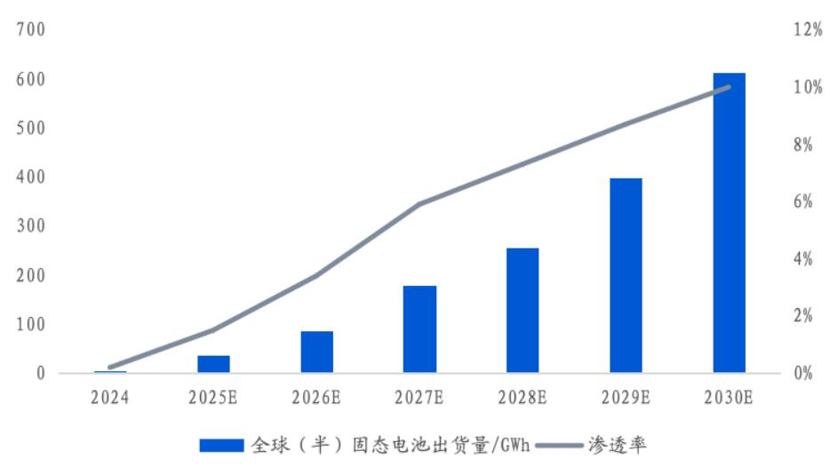

bar_line

| Year   | 全球（半）固态电池出货量/GWh | 渗透率 |
| ------ | ---------------------------- | ------ |
| 2024   | 5                            | 0.5%   |
| 2025E  | 35                           | 1.5%   |
| 2026E  | 85                           | 3.0%   |
| 2027E  | 180                          | 5.5%   |
| 2028E  | 255                          | 7.0%   |
| 2029E  | 400                          | 8.5%   |
| 2030E  | 610                          | 10.0%  |

EV Tank HTI

# 2.2 中国：背靠全球最大市场，迈向全球创新策源地

中国已崛起为全球锂电池领域的领跑者，在全球电池产业中占据着“绝对主导”和“一超多强”的地位，不仅是最大的制造国，更是技术创新的重要策源地和成本下降的主要驱动者。2024 年，中国动力电池装机量为 531 GWh，同比增长 48%，占全球份额的59%。

图表: 全球动力和储能电池装机量/GWh  
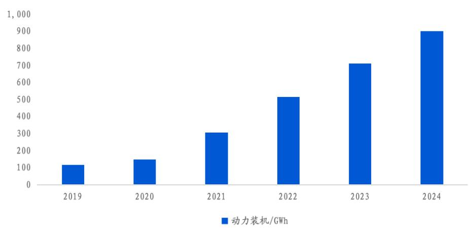

bar

| 年份 | 动力装机/GWh |
|---|---|
| 2019 | 110 |
| 2020 | 150 |
| 2021 | 300 |
| 2022 | 510 |
| 2023 | 710 |
| 2024 | 900 |

SNE Research HTI

凭借庞大的本土需求、强大的供应链和积极的政策支持，中国正从“汽车大国”迈向“汽车强国”。2025 年 10 月，中国电动汽车销量为 130 万辆，同比+6%。2025 年初至今，全球电动汽车销量为 1650 万辆，同比+23%，其中中国电动车销量为 1030 万辆，同比+22%，占全球销量的 62%。2025 年 10 月，中国电动汽车销量为 130 万辆，同比增长 6%。

图表: 全球新能源汽车销量  
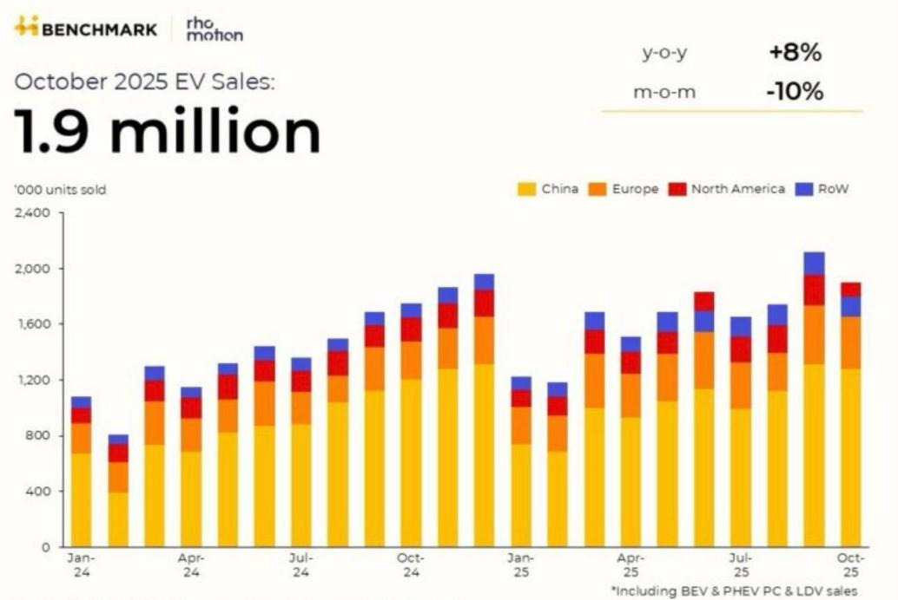

bar_stacked

October 2025 EV Sales: 1.9 million
| Month | China (k units sold) | Europe (k units sold) | North America (k units sold) | RoW (k units sold) |
| :--- | :--- | :--- | :--- | :--- |
| Jan-24 | 730 | 260 | 140 | 80 |
| Feb-24 | 760 | 300 | 150 | 90 |
| Mar-24 | 750 | 280 | 160 | 80 |
| Apr-24 | 800 | 280 | 170 | 80 |
| May-24 | 830 | 310 | 180 | 90 |
| Jun-24 | 840 | 310 | 180 | 90 |
| Jul-24 | 850 | 320 | 190 | 90 |
| Aug-24 | 910 | 350 | 200 | 100 |
| Sep-24 | 950 | 380 | 210 | 110 |
| Oct-24 | 1000 | 400 | 220 | 120 |
| Nov-24 | 1050 | 420 | 230 | 130 |
| Dec-24 | 1150 | 450 | 250 | 140 |
| Jan-25 | 770 | 270 | 130 | 110 |
| Feb-25 | 740 | 260 | 130 | 110 |
| Mar-25 | 910 | 380 | 190 | 130 |
| Apr-25 | 870 | 360 | 180 | 130 |
| May-25 | 930 | 390 | 200 | 140 |
| Jun-25 | 970 | 410 | 210 | 150 |
| Jul-25 | 960 | 420 | 220 | 160 |
| Aug-25 | 980 | 430 | 230 | 170 |
| Sep-25 | 1250 | 480 | 260 | 190 |
| Oct-25 | 1230 | 470 | 270 | 190 |
y-o-y +8% m-o-m -10%

Rho Motion HTI

作为全球动力电池行业的绝对领导者，宁德时代在 2024 年继续保持其市场领先地位。公司 2024 年动力电池装机量约为 339 GWh，占全球市场份额的 37.6%，位居全球首位。

图表: 宁德时代锂电池销量/GWh  
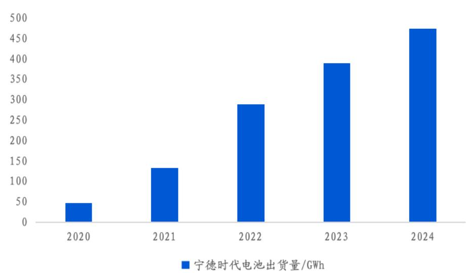

bar

| 年份 | 宁德时代电池出货量/GWh |
| :--- | :--- |
| 2020 | 50 |
| 2021 | 135 |
| 2022 | 290 |
| 2023 | 390 |
| 2024 | 475 |

CATL HTI

中国企业已在现有锂电产业链中建立起全球领先优势，不仅拥有全球最大的电池制造企业、最完整的材料供应链，还坐拥规模最大的新能源汽车应用市场，行业渗透率更是率先突破 50%。然而，当前主流液态锂离子电池的能量密度正逐渐逼近理论极限，难以满足市场对更长续航里程的迫切需求。在这一背景下，固态电池技术被视为突破续航瓶颈的关键路径。中国政府已将固态电池研发提升至战略高度，构建起以“国家战略引领、地方产业落地、多元政策协同”为特征的立体化支持体系，核心目标在于抢占下一代动力电池的技术制高点与全球产业主导权。

图表: 中国固态电池产业支持政策

<table><tr><td>政策名称</td><td>发布单位</td><td>固态电池相关内容</td><td>时间节点</td></tr><tr><td>《2025年汽车标准化工作要点》</td><td>工业和信息化部</td><td>加快全固态电池、动力电池在役检测等标准研制。</td><td>2025年</td></tr><tr><td>《新型储能制造业高质量发展行动方案》</td><td>工信部等八部门</td><td>将固态电池列为重点攻关方向,支持锂电池、钠电池向固态化发展。</td><td>2027年前打造3-5家全球龙头企业</td></tr><tr><td>《新型储能规模化建设专项行动方案(2025—2027年)》</td><td>国家发展改革委、国家能源局</td><td>将固态电池列为重点发展技术。</td><td>2027年实现半固态电池大规模应用,全固态电池技术定型</td></tr><tr><td>《电子信息制造业2025—2026年稳增长行动方案》</td><td>工业和信息化部</td><td>支持全固态电池等前沿技术方向的基础研究。</td><td>2025-2026年</td></tr></table>

资料来源：工信部，发改委，国家能源局，HTI

宁德时代作为无可争议的锂电池行业巨头，于 2016 年启动硫化物全固态电池预研，历经材料、界面与设备攻关。2023 年推出保留隔膜的半固态“凝聚态”电池路线，同年7 月，与中国商飞合资成立商飞时代，宁德时代迈入“电动飞机”业务领域，或将为凝聚态电池拓展新的应用场景。2025 年，宁德时代全球首条硫化物全固态电池中试线在合肥正式投产，规划产能5GWh。公司预计2027年有望实现全固态电池小批量生产。

图表: 宁德时代固态电池/凝聚态电池发展时间轴  
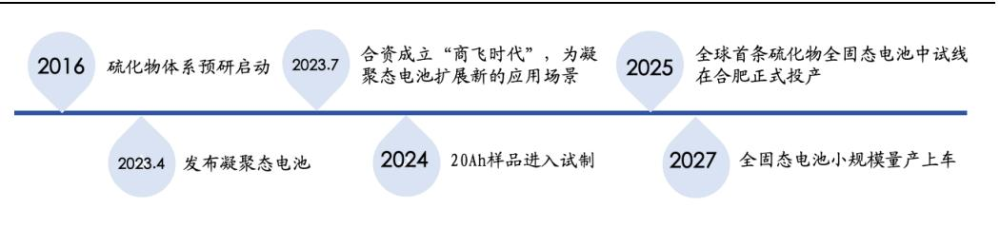

flowchart

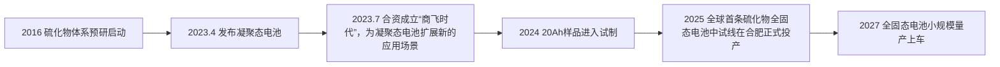
```mermaid
graph LR
    A["2016 硫化物体系预研启动"] --> B["2023.4 发布凝聚态电池"]
    B --> C["2023.7 合资成立“商飞时代”，为凝聚态电池扩展新的应用场景"]
    C --> D["2024 20Ah样品进入试制"]
    D --> E["2025 全球首条硫化物全固态电池中试线在合肥正式投产"]
    E --> F["2027 全固态电池小规模量产上车"]
```

CATL HTI

其凝聚态电池采用固液混合态电解质，能量密度达 500Wh/kg，同时凭借固态电解质的特性从根本上解决传统液态电池的安全隐患。作为全球首款实现量产的超高能量密度的准固态电池，有望率先应用于 EVtol 等领域，并将逐步装载至高端电动车。

图表: 宁德时代凝聚态电池  
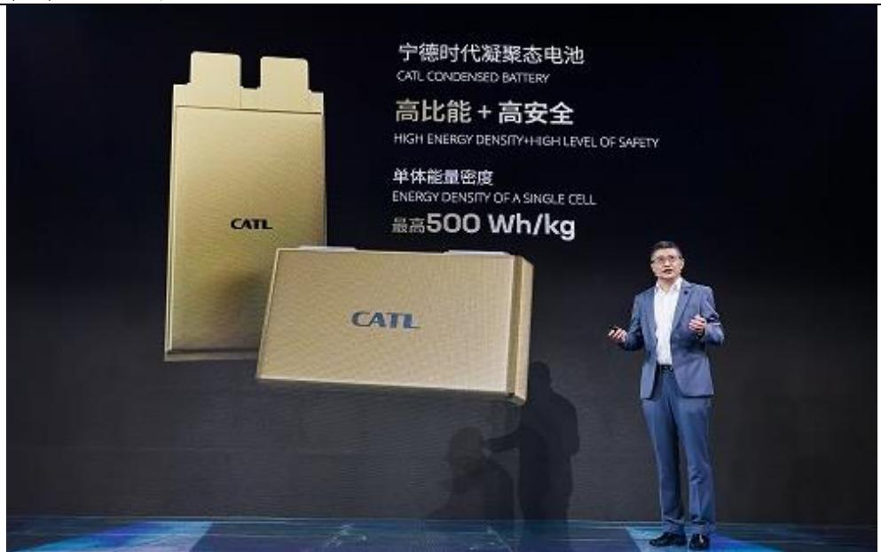

text_image

宁德时代凝聚态电池
CATL CONDENSED BATTERY
高比能 + 高安全
HIGH ENERGY DENSITY+HIGH LEVEL OF SAFETY
单体能量密度
ENERGY DENSITY OF A SINGLE CELL
最高500 Wh/kg

CATL HTI

公司采用“车企联合定义+材料设备协同+科研检测支撑”三位一体的合作模式，已覆盖欧美中头部整车厂、核心材料供应商及国家级科研平台，为 2027 年硫化物全固态小批量量产构建完整生态。

图表: 宁德时代固态电池部分合作项目

<table><tr><td>合作类别</td><td>合作方</td><td>时间</td><td>合作内容</td></tr><tr><td>车企</td><td>奔驰&amp;宝马</td><td>2025</td><td>联合测试</td></tr><tr><td>车企</td><td>理想</td><td>2025</td><td>MEGA等车型定点</td></tr><tr><td>材料</td><td>贝特瑞</td><td>2025</td><td>合资实验室+合资公司,硅碳负极+硫化物电解质</td></tr><tr><td>材料</td><td>嘉元科技</td><td>2026</td><td>新型电池用负极集流体材料(包括但不限于固态电池用铜箔)合作</td></tr><tr><td>设备</td><td>先导智能</td><td>2024</td><td>在电芯核心生产设备等领域开展合作</td></tr><tr><td>材料</td><td>当升科技</td><td>2025</td><td>高镍正极+复合正极,已导入样品线</td></tr><tr><td>航空</td><td>中国商飞</td><td>2023</td><td>成立合资公司</td></tr></table>

CATL HTI

作为全球新能源汽车行业的领导者和中国制造业的标杆，比亚迪已建立起覆盖整车制造--动力电池的全产业链垂直整合体系，凭借电池技术突破与规模化成本优势，其新能源车销量稳居全球前列，不仅在国内市场占据主导地位，更通过全球化布局加速重塑全球汽车产业格局。2024 年比亚迪新能源汽车销量达 427.21 万辆，同比+41%。2025 年 10 月，比亚迪新能源汽车销量达 42.98 万辆，同比+10.5%，占全球市场份额23%。

图表: 2018-2024 年比亚迪新能源汽车销量/万辆  
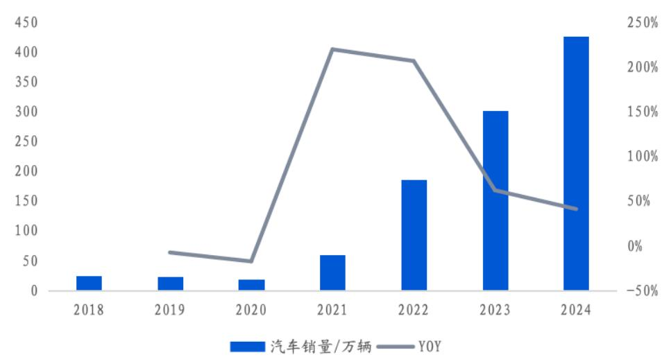

bar_line

| Year | 汽车销量/万辆 | YOY   |
|------|---------------|-------|
| 2018 | 25            | -     |
| 2019 | 25            | -     |
| 2020 | 15            | -     |
| 2021 | 60            | 220%  |
| 2022 | 185           | 190%  |
| 2023 | 300           | 60%   |
| 2024 | 430           | 40%   |

BYD HTI

基于行业趋势与其自身战略，比亚迪发展固态电池是一项必然且关键的战略选择。其核心优势在于其构建的独特体系竞争力：凭借全产业链垂直整合能力，实现了从材料研发到整车应用的高效协同；其创新的"刀片电池"结构平台为固态电池的集成奠定了技术基础；同时采取务实的渐进式路线，通过清晰的量产规划确保技术平稳落地--2027 年示范装车、2030 年大规模应用。

图表: 比亚迪固态电池发展时间轴

<table><tr><td>时间</td><td>关键事件/指标</td></tr><tr><td>2013年</td><td>内部立项,开始材料与路线摸索</td></tr><tr><td>2016年</td><td>确定“低密度软包+钢制夹具”技术方案</td></tr><tr><td>2023年</td><td>通过电芯、产线、系统级可行性验证</td></tr><tr><td>2024年</td><td>60 Ah全固态电池中试样品下线</td></tr><tr><td>2025年</td><td>完成样车Pack装配,进入实验验证</td></tr><tr><td>2027年</td><td>高端车型批量示范</td></tr><tr><td>2030年</td><td>大规模量产装车</td></tr></table>

BYD HTI

2024 年，比亚迪成功下线 60Ah 全固态电池中试产品，能量密度突破 400Wh/kg、体积能量密度达 800Wh/L。2025 年 11 月，弗迪电池更新消费类电池相关技术信息，首次公布固态电解质，并展示了搭配钢壳封装、多种正极负极材料的完整技术路线。

图表: 比亚迪固态电池结构与化学创新  
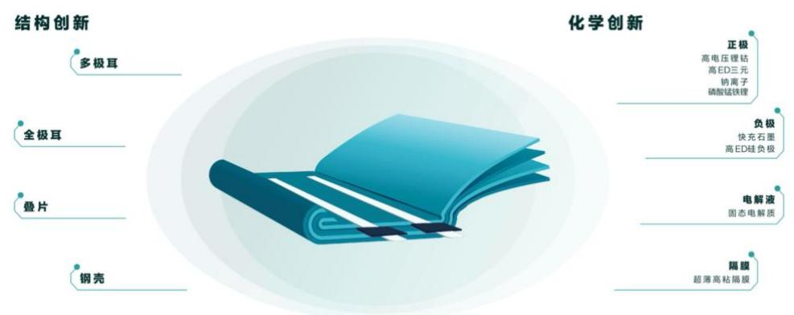

text_image

结构创新
多极耳
全极耳
叠片
钢壳
化学创新
正极
高电压锂钴
高ED三元
钠离子
磷酸锰铁锂
负极
快充石墨
高ED硅负极
电解液
固态电解质
隔膜
超薄高粘隔膜

BYD HTI

比亚迪凭借其强大的内部垂直整合体系，构建了从核心材料、电芯制造到整车集成的完整技术闭环，实现了固态电池从研发到验证的全流程自主可控。在此基础上，公司积极与顶尖科研机构开展合作，聚焦前沿基础科学问题的协同攻关。这种“以内为主、外部协同”的战略布局，既确保了比亚迪在固态电池领域的核心技术自主权，又高效整合了全球顶尖研发资源，为技术从实验室向产业化平稳过渡提供了有力支撑。

图表: 比亚迪固态电池主要合作项目

<table><tr><td>合作方/项目</td><td>节点</td><td>合作内容与目标</td></tr><tr><td>国家级科研平台</td><td>2024</td><td>参与“中国全固态电池产学研协同创新平台”,与宁德时代、国轩高科等企业共同探索技术标准化与供应链协同</td></tr><tr><td>中科院深圳先进院</td><td>2024</td><td>推动固态电池、锂电辅材等前沿领域的发展</td></tr></table>

BYD HTI

# 2.4 美国：初创公司先行，资本注入快速撬动产业化进程

美国作为全球第三大新能源汽车市场，其政策演变对行业影响深远。自 2008 年首次推出 7500 美元电动汽车税收减免政策，到 2022 年将补贴扩大至租赁车辆，再到2025 年《大而美法案》通过后新车及二手车税收抵免于 9 月 30 日正式终止，美国电动车补贴政策完成了一个完整周期。根据 ANL，2024 年美国电动车销量超 150 万辆，同比增长 8%，BEV 占全体电动车（BEV+PHEV）销量的 80%以上。2025 年 Q3，或受补贴到期前抢装潮的影响，美国新能源汽车销量大 43.85 万辆，创历史新高，渗透率约 11%。

图表: 美国电动汽车销量/辆  
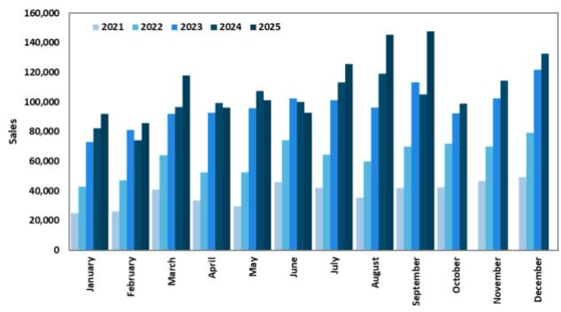

bar

| Month | 2021 | 2022 | 2023 | 2024 | 2025 |
|---|---|---|---|---|---|
| January | 25,000 | 43,000 | 73,000 | 74,000 | 93,000 |
| February | 26,000 | 47,000 | 81,000 | 83,000 | 87,000 |
| March | 41,000 | 64,000 | 91,000 | 97,000 | 119,000 |
| April | 34,000 | 53,000 | 93,000 | 99,000 | 101,000 |
| May | 29,000 | 53,000 | 95,000 | 101,000 | 111,000 |
| June | 45,000 | 73,000 | 102,000 | 103,000 | 93,000 |
| July | 42,000 | 64,000 | 101,000 | 126,000 | 126,000 |
| August | 35,000 | 61,000 | 96,000 | 121,000 | 147,000 |
| September | 42,000 | 69,000 | 113,000 | 111,000 | 148,000 |
| October | 42,000 | 71,000 | 92,000 | 99,000 | 118,000 |
| November | 46,000 | 69,000 | 102,000 | 115,000 | 133,000 |
| December | 51,000 | 79,000 | 122,000 | 133,000 | 133,000 |

ANL, HTI

图表: 美国电动汽车销量-分车型/辆  
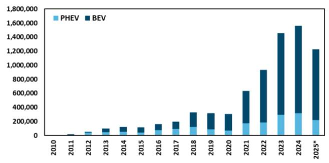

bar_stacked

| Year | PHEV | BEV |
|---|---|---|
| 2010 | 0 | 0 |
| 2011 | 0 | 10000 |
| 2012 | 30000 | 40000 |
| 2013 | 0 | 80000 |
| 2014 | 0 | 100000 |
| 2015 | 0 | 100000 |
| 2016 | 70000 | 120000 |
| 2017 | 70000 | 140000 |
| 2018 | 140000 | 280000 |
| 2019 | 120000 | 260000 |
| 2020 | 80000 | 280000 |
| 2021 | 180000 | 480000 |
| 2022 | 180000 | 680000 |
| 2023 | 320000 | 880000 |
| 2024 | 340000 | 980000 |
| 2025* | 220000 | 760000 |

ANL, HTI

图表: 美国电动汽车销量-累计/辆  
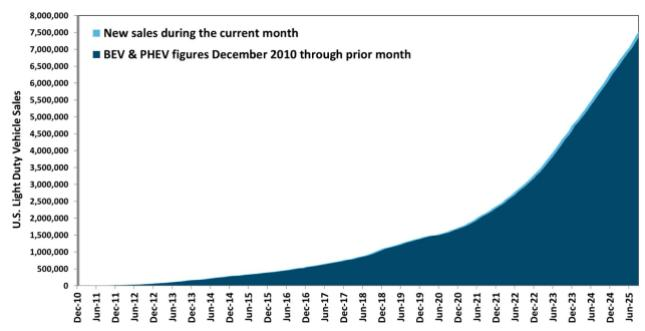

area

| Date | New sales during the current month | BEV & PHEV figures December 2010 through prior month |
|---|---|---|
| Dec-10 | 0 | 0 |
| Jun-11 | 0 | 0 |
| Dec-11 | 0 | 0 |
| Jun-12 | 0 | 0 |
| Dec-12 | 0 | 0 |
| Jun-13 | 0 | 0 |
| Dec-13 | 0 | 0 |
| Jun-14 | 0 | 0 |
| Dec-14 | 0 | 0 |
| Jun-15 | 0 | 0 |
| Dec-15 | 0 | 0 |
| Jun-16 | 0 | 0 |
| Dec-16 | 0 | 0 |
| Jun-17 | 0 | 0 |
| Dec-17 | 0 | 0 |
| Jun-18 | 0 | 0 |
| Dec-18 | 0 | 0 |
| Jun-19 | 0 | 0 |
| Dec-19 | 0 | 0 |
| Jun-20 | 0 | 0 |
| Dec-20 | 0 | 0 |
| Jun-21 | 0 | 0 |
| Dec-21 | 0 | 0 |
| Jun-22 | 0 | 0 |
| Dec-22 | 0 | 0 |
| Jun-23 | 0 | 0 |
| Dec-23 | 0 | 0 |
| Jun-24 | 0 | 0 |
| Dec-24 | 0 | 0 |
| Jun-25 | 0 | 7,500,000 |

ANL, HTI

图表: 美国电动汽车渗透率  
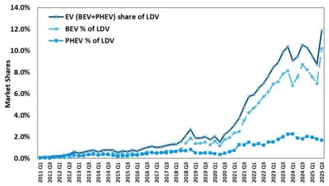

line

| Year-Quarter | EV (BEV+PHEV) share of LDV | BEV % of LDV | PHEV % of LDV |
| ------------ | -------------------------- | ------------ | ------------- |
| 2011 Q1      | 0.0%                       | 0.0%         | 0.0%          |
| 2011 Q3      | 0.0%                       | 0.0%         | 0.0%          |
| 2012 Q1      | 0.0%                       | 0.0%         | 0.0%          |
| 2012 Q3      | 0.0%                       | 0.0%         | 0.0%          |
| 2013 Q1      | 0.0%                       | 0.0%         | 0.0%          |
| 2013 Q3      | 0.0%                       | 0.0%         | 0.0%          |
| 2014 Q1      | 0.0%                       | 0.0%         | 0.0%          |
| 2014 Q3      | 0.0%                       | 0.0%         | 0.0%          |
| 2015 Q1      | 0.0%                       | 0.0%         | 0.0%          |
| 2015 Q3      | 0.0%                       | 0.0%         | 0.0%          |
| 2016 Q1      | 0.0%                       | 0.0%         | 0.0%          |
| 2016 Q3      | 0.0%                       | 0.0%         | 0.0%          |
| 2017 Q1      | 0.0%                       | 0.0%         | 0.0%          |
| 2017 Q3      | 0.0%                       | 0.0%         | 0.0%          |
| 2018 Q1      | 0.0%                       | 0.0%         | 0.0%          |
| 2018 Q3      | 0.0%                       | 0.0%         | 0.0%          |
| 2019 Q1      | 2.5%                       | 1.5%         | 1.5%          |
| 2019 Q3      | 2.5%                       | 1.5%         | 1.5%          |
| 2020 Q1      | 2.5%                       | 1.5%         | 1.5%          |
| 2020 Q3      | 2.5%                       | 1.5%         | 1.5%          |
| 2021 Q1      | 5.5%                       | 4.5%         | 4.5%          |
| 2021 Q3      | 6.5%                       | 5.5%         | 5.5%          |
| 2022 Q1      | 8.5%                       | 7.5%         | 7.5%          |
| 2022 Q3      | 9.5%                       | 8.5%         | 8.5%          |
| 2023 Q1      | 11.5%                      | 9.5%         | 9.5%          |
| 2023 Q3      | 12.5%                      | 11.5%        | 11.5%         |
| 2024 Q1      | 13.5%                      | 13.5%        | 13.5%         |
| 2024 Q3      | 14.5%                      | 14.5%        | 14.5%         |
| 2025 Q1      | 15.5%                      | 15.5%        | 15.5%         |
| 2025 Q3      | 16.5%                      | 16.5%        | 16.5%         |

ANL, HTI

在当前电动汽车产业转型的关键阶段，美国联邦补贴退坡虽带来短期阵痛，却推动着产业链的深度调整。在此背景下，发展固态电池已成为美国的国家战略重点，旨在突破传统锂电池领域的海外供应链依赖，通过颠覆性技术创新实现产业"弯道超车"。通过攻克这一下一代技术，美国力图建立全新的技术标准与供应链体系，应对国际竞争，解决市场痛点，从而重塑全球新能源产业格局，确保未来的能源安全与产业领导权。

图表:美国固态电池产业支持政策

<table><tr><td>政策/法案名称</td><td>年度/阶段</td><td>补贴情况</td><td>覆盖范围/目标</td></tr><tr><td>DOE 年度项目招标+SBIR/STTR</td><td>2020-2025 累计</td><td>已拨付&gt;2.5 亿美元</td><td>基础材料、界面工程、制造工艺、测试标准</td></tr><tr><td>DOE 固态/液流制造专项</td><td>2023 起</td><td>1,600 万美元</td><td>5 个&quot;固态-液流&quot;试点产线</td></tr><tr><td>《两党基础设施法》Battery Materials &amp; Manufacturing</td><td>2022-2026</td><td>60 亿美元(电池全链条)</td><td>固态电池中试及量产线、配套设备</td></tr><tr><td>《通胀削减法案》Section 45X Advanced Manufacturing Credit</td><td>2023-2032</td><td>35 美元/kWh(电芯)+10 美元/kWh(模组)</td><td>在美生产的固态电芯/模组</td></tr><tr><td>《National Blueprint for Lithium Batteries 2021-2030》</td><td>2021 发布</td><td></td><td>2030 年达成≥500Wh/kg</td></tr></table>

DOE IRA HTI

美国固态电池赛道呈现“两超多强”格局：QuantumScape 与 Solid Power 领跑技术验证与车厂绑定，Ion Storage Systems、Amprius、Microvast 等则在军工、电动航空、商用车等细分场景加速送样。总体来看，美国固态电池产业仍处于“实验室→B 样→小试”的过渡阶段。

图表: 美国主要固态电池企业发展时间线

<table><tr><td>公司</td><td>技术路线</td><td>产线&amp;时间表</td></tr><tr><td>QuantumScape</td><td>氧化物陶瓷隔膜+无阳极锂金属</td><td>2026 C样→2027小批量;Cobra工艺热处理提速25倍</td></tr><tr><td>Solid Power</td><td>硫化物电解质+硅负极(可向锂金属演进)</td><td>2025下半年完成产线FAT,2026年C样</td></tr><tr><td>Ion Storage Systems</td><td>3D陶瓷+无阳极</td><td>马里兰大学孵化,2028年实现500MWh的产能</td></tr><tr><td>Amprius Technologies</td><td>硅纳米线负极+固态界面层(混合固液)</td><td>加州弗里蒙特MWh级产线运行,计划扩至GWh</td></tr><tr><td>Microvast Holdings</td><td>双极堆叠+固态隔膜</td><td>已进入试生产研究,2027年批量生产</td></tr></table>

Quantum Scape Solid Power Ion Storage Systems Amprius Microvast HTI

QuantumScape 主攻氧化物陶瓷隔膜+ 无阳极锂金属路线。计划2026 年交付C 样并装车路试，2027–2028 年小批量上车。

图表:Quantum Scape 固态电池进展

<table><tr><td>维度</td><td>当前状态</td><td>关键数据/下一步目标</td></tr><tr><td>技术路线</td><td>氧化物陶瓷隔膜+无阳极锂金属设计</td><td>844 Wh/L,10%-80%充电&lt;15 min</td></tr><tr><td>产品阶段</td><td>2024 Q3起交付B样(QSE-5),2025 Q3完成B1版本出样</td><td>24层单堆循环1000次容量保持95%</td></tr><tr><td>量产工艺</td><td>“Cobra”陶瓷隔膜烧结设备已替代Raptor,成为基线工艺</td><td>热处理速度提升25倍,设备占地缩小,已集成到基准生产线</td></tr><tr><td>产能规划</td><td>正在加州圣何塞总部建设高度自动化的Eagle Line中试线,以推进汽车级可靠性验证</td><td>授权大众PowerCo最多40 GWh/年(可扩80 GWh),德/西/加三大基地可接入</td></tr><tr><td>资本与合作</td><td>2025年与康宁、村田签署陶瓷隔膜供应链协议;持续与OEM洽谈JDA</td><td>采用许可+样品模式,减少自建资本开支</td></tr><tr><td>车规验证</td><td>2025慕尼黑车展首次公开搭载于Ducati V21L电动摩托;大众集团多品牌同步测试QSE-5</td><td>目标2026年完成整车集成验证</td></tr></table>

DOE IRA HTI

目前公司 QSE-5 型样品已向客户交付 B 样，24 层电芯 1000 次循环容量保持 95%，能量密度 844 Wh/L，10–80% 快充 12–15 min，-30 ℃ 仍可工作。

图表: Quantum Scape QSE-5 电池 B 样  
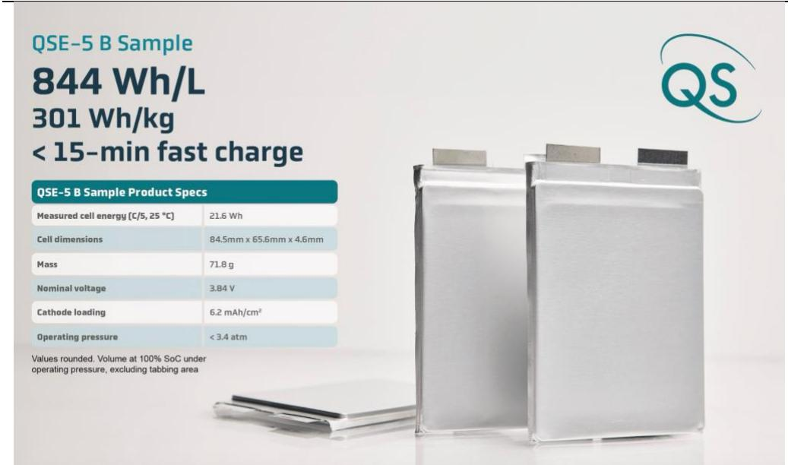

text_image

QSE-5 B Sample
844 Wh/L
301 Wh/kg
< 15-min fast charge
QSE-5 B Sample Product Specs
Measured cell energy [C/5, 25 °C]	21.6 Wh
Cell dimensions	84.5mm x 65.6mm x 4.6mm
Mass	71.8 g
Nominal voltage	3.84 V
Cathode loading	6.2 mAh/cm²
Operating pressure	< 3.4 atm
Values rounded. Volume at 100% SoC under
operating pressure, excluding tabbing area

Quantum Scape HTI

QuantumScape 的“无阳极+锂金属”设计省去负极材料，锂离子在集流体表面原位沉积，陶瓷隔膜耐高温不可燃，兼具安全与成本潜力，被视为车规固态电池最具颠覆性的路径之一。

图表: Quantum Scape 无阳极+锂金属技术  
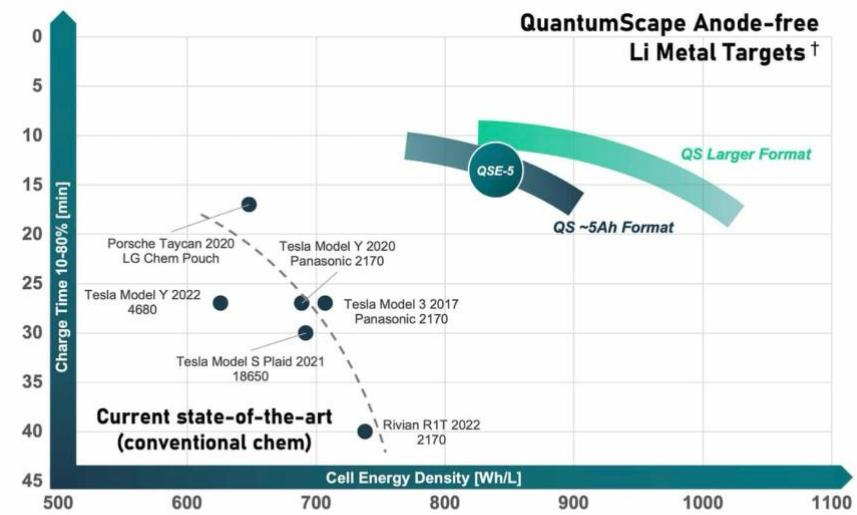

scatter

QuantumScape Anode-free Li Metal Targets †
| Model | Cell Energy Density [Wh/L] | Charge Time 10-80% [min] |
| :--- | :--- | :--- |
| QSE-5 | 820 | 10 |
| QSE-5 Large Format | 900 | 10 |
| QSE-5 ~5Ah Format | 900 | 10 |
| Tesla Model 3 2017 Panasonic 2170 | 695 | 30 |
| Tesla Model Y 2020 Panasonic 2170 | 695 | 30 |
| Tesla Model Y 2020 LG Chem Pouch | 645 | 22 |
| Tesla Model S Plaid 2021 | 695 | 30 |
| Tesla Model Y 2022 | 625 | 33 |
| Rivian R1T 2022 | 740 | 40 |
Current state-of-the-art (conventional chem)

+QS projectionsand targets based on existing estimatesand model assumptions Sources:Liioncellenergydensityfrombatemo.comdatabasehargetimesfromevdatabaseorgandnsideevscomforRivianR1T）   
Quantum Scape HTI

Quantum Scape 通过“技术许可 + 联合工艺开发”快速绑定下游，大众-PowerCo 提供车规级落地场景与资金，康宁+村田解决陶瓷隔膜规模化制造，预计 2026 年完成C 样，2027 年实现首批量产上车。

图表:Quantum Scape 与其他企业共同研发固态电池主要项目

<table><tr><td>合作方</td><td>合作模式</td><td>产能/技术规模</td><td>时间节点</td><td>主要任务与目标</td></tr><tr><td>大众集团 PowerCo</td><td>非独占技术许可+联合开发</td><td>40 GWh/年(可扩80 GWh)</td><td>2025 Q3 启动,2027 起量产</td><td>在加拿大、德国、西班牙三地工厂导入 QSE-5,大众追加 1.31 亿美元共建圣何塞中试线</td></tr><tr><td>康宁 Corning</td><td>战略供应商</td><td>隔膜毛坯烧结</td><td>2025-09 签约,分阶段放大</td><td>利用康宁精密陶瓷成型与热处理平台,将 Cobra 陶瓷隔膜从基线产线放大到千兆瓦时级量产。</td></tr><tr><td>村田 Murata</td><td>联合开发协议</td><td>材料级合作</td><td>2025-04 启动</td><td>借助村田 MLCC 微膜技术优化陶瓷隔膜晶粒尺寸和界面阻抗,提升一致性和成本竞争力。</td></tr></table>

Quantum Scape HTI

作为目前在固态电池领域备受关注的企业之一，Solid Power 以其独特的商业模式和扎实的技术进展，尤其在与宝马、三星 SDI 等行业巨头的合作中，成绩表现斐然。

图表: Solid Power 固态电池布局情况

<table><tr><td>维度</td><td>当前状态</td><td>关键数据/下一步目标</td></tr><tr><td>技术路线</td><td>硫化物电解质+硅负极(可升级锂金属)</td><td>390 Wh/kg(硅)/440 Wh/kg(锂金属),体积能量930 Wh/L;循环1000次容量保持≥80%</td></tr><tr><td>产品阶段</td><td>100 Ah B样持续交付;宝马i7测试车已上路</td><td>2026年C样→2027年SOP(与宝马、三星SDI三方协议)</td></tr><tr><td>产线建设</td><td>科罗拉多试点线完成FAT;韩国SK On中试线2025年内SAT</td><td>2028年建成4万吨硫化物电解质工厂,可配套80万辆车</td></tr></table>

Solid Power HTI

Solid Power 的“硫化物固态电解质+ 高镍三元正极+ 硅/锂金属负极”路线，核心参数390/440 Wh/kg、930 Wh/L，循环 ≥1000 次。公司采用卷对卷干法电极，将固态电解质与粘结剂混合后直接成膜，省去溶剂回收，目标降本30 %。

图表: Solid Power 固态电池技术路线对比  
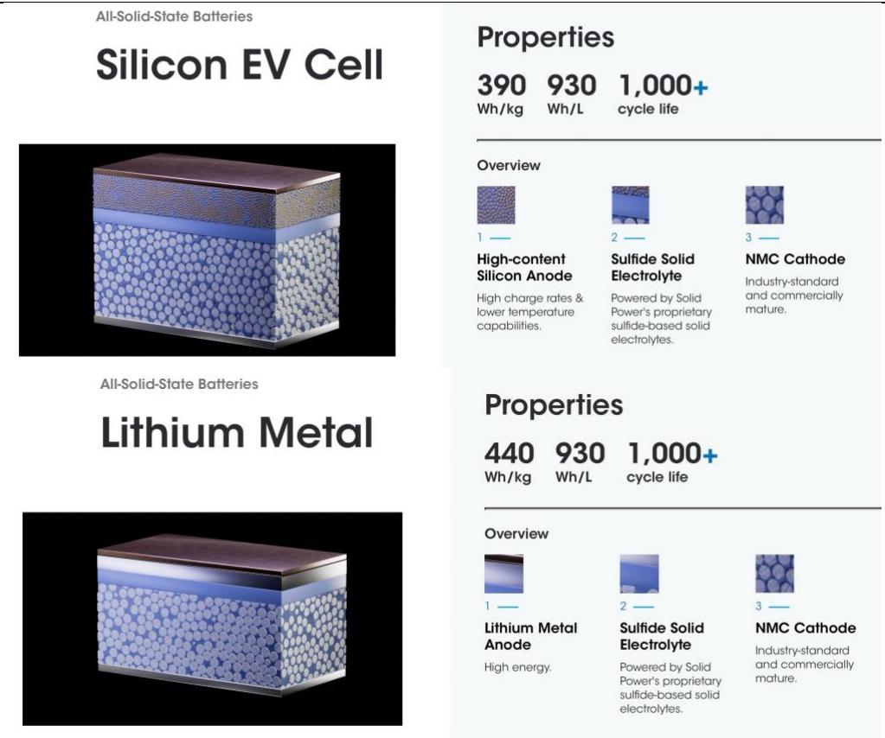

other

All-Solid-State Batteries
| Material | Property | Cycle Life (Cycle) |
| :--- | :--- | :--- |
| Silicon EV Cell | Properties | 390 Wh/kg 930 Wh/L 1,000+ cycle life |
| Lithium Metal | Overview | 1 — High-content Silicon Anode 2 — Sulfide Solid Electrolyte 3 — NMC Cathode Industry-standard and commercially mature. |
| Lithium Metal Anode | Properties | 440 Wh/kg 930 Wh/L 1,000+ cycle life |
| Lithium Metal Anode | Overview | 1 — Lithium Metal Anode 2 — Sulfide Solid Electrolyte 3 — NMC Cathode Industry-standard and commercially mature. |
The chart displays two sets of battery types: 'All-Solid-State Batteries' and 'Lithium Metal'. The 'Overview' table provides a breakdown of the properties by their specific energy and cycle life values.

Solid Power HTI

Solid Power 与福特、宝马及三星 SDI 等建立了深度产业联盟：通过向宝马授权技术并支持其完成固态电池实车测试，同时为三星 SDI 供应核心固态电解质材料，形成了“技术授权+材料供应”的双轨模式。这种合作体系有效整合了车企的终端应用场景与电池巨头的制造能力，加速了其硫化物技术路线的产业化进程

图表:Solid Power 固态电池合作项目

<table><tr><td>合作方</td><td>合作模式</td><td>合作内容与规模</td><td>时间节点</td></tr><tr><td>宝马集团</td><td>联合开发协议(JDA)+股权投资</td><td>2017年起共同开发全固态电池;2025年启动BMW i7 100 Ah B样车规验证,并规划2027年SOP</td><td>2025年C样→2027年量产</td></tr><tr><td>三星SDI</td><td>三方协议(与宝马)+材料供应</td><td>Solid Power提供硫化物固态电解质,三星SDI负责电芯制造与模组集成,宝马做包装车验证</td><td>2025签约,2026年C样,2027年示范车</td></tr><tr><td>SK On</td><td>谅解备忘录+联合开发</td><td>SK On采用Solid Power电解质、设计与工艺,在韩国建中试线生产汽车级全固态电芯</td><td>2021签约,2025年内完成产线SAT</td></tr><tr><td>Umicore</td><td>联合开发协议</td><td>优美科提供高镍正极活性材料(CAM),与Solid Power共同开发全固态电芯</td><td>2025启动样品验证</td></tr><tr><td>福特汽车</td><td>股权投资+技术评估</td><td>参与2021年B轮1.35亿美元融资,持续评估硫化物固态电池在福特电动车平台的应用潜力</td><td>融资完成,阶段评估中</td></tr></table>

Solid Power HTI

# 2.3 日韩：技术深耕与产业化加速双轨并进

# 2.3.1 日本：以材料创新为本，稳步构筑技术壁垒

日本新能源产业发展至今，已形成独具特色的发展路径：在国家战略层面将氢能作为主攻方向，并在研发与基础设施建设方面给予强力支持。与此同时，混合动力（HEV）凭借其与日本资源禀赋的高度契合，成为当前阶段最具成本效益与风险可控的过渡路径。日本汽车产业凭借其在精益制造与电控技术方面的传统优势，成功构建了 HEV 领域的技术壁垒与市场护城河。市场数据印证了这一趋势：2024年日本HEV新车注册量占比已达 61.1%，而 BEV 销量却同比下降 33%至 59,736 辆，为四年来首次下滑，BEV与 PHEV 合计渗透率不足 3%。2025 年 9 月，日本 BEV+PHEV 的份额为 3.5%，其中 BEV份额为 2.4%；HEV 份额为 50.3%。

图表: 2018-2024 年日本电动车销量及市占率（台）  
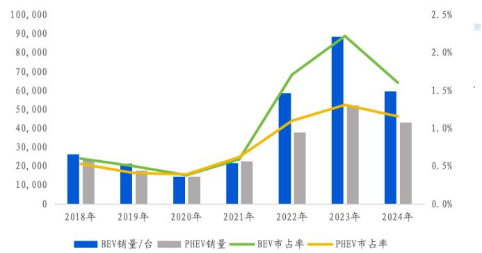

bar_line

| 年份 | BEV销量/台 | PHEV销量 | BEV市占率 (%) | PHEV市占率 (%) |
|---|---|---|---|---|
| 2018年 | 26,000 | 22,000 | 2.3 | 1.9 |
| 2019年 | 18,000 | 17,000 | 2.1 | 1.5 |
| 2020年 | 15,000 | 15,000 | 1.6 | 1.3 |
| 2021年 | 22,000 | 22,000 | 2.4 | 1.7 |
| 2022年 | 59,000 | 38,000 | 2.7 | 1.1 |
| 2023年 | 89,000 | 51,000 | 2.3 | 1.3 |
| 2024年 | 60,000 | 43,000 | 1.6 | 1.2 |

ECO Revolution, HTI

图表: 2025 年 9 月日本乘用车销量结构  
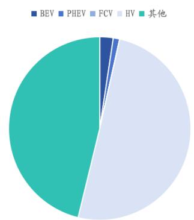

pie

| Category | Value |
|---|---|
| BEV | 1.0 |
| PHEV | 0.5 |
| FCV | 0.3 |
| HV | 60.0 |
| 其他 | 70.0 |

ECO Revolution, HTI

日本作为曾经的液态锂电池商业化先驱，近年来在车用动力电池市场的份额已大幅下滑至不足 6%。因此日本将固态电池视为实现"弯道超车"，重塑其在电池领域主导地位的关键筹码。2022 年日本发布《蓄电池产业战略》，提出到 2030 年建立 150 GWh/年的国内制造基地，全球生产能力达 600 GWh/年；2024 年宣布《电池供应保证计划》，计划 2030 年实现固态电池商业化目标。

图表: 日本固态电池产业政策

<table><tr><td>政策</td><td>时间</td><td>目标</td><td>举措</td></tr><tr><td>蓄电池产业战略</td><td>2022</td><td>2030年建立150GWh/年的国内制造基地,全球生产能力达600GWh/年;实现2050年碳中和目标;全固态电池在2030年前后全面商业化</td><td>通过补贴方式,支持包括“原材料”、“冶炼·加工·材料”、“电池制造”和“回收”在内的整个供应链的国内投资</td></tr><tr><td>电池供应保证计划</td><td>2024</td><td>加速日本电动汽车产业链的扩张与升级;2030年实现固态电池商业化</td><td>提供约3500亿日元扶持建立本国电动汽车产业链</td></tr></table>

METI, HTI

《电池供应保证计划》批准丰田、出光兴产等企业的研发项目，补贴总额高达3500亿日元，用于投资开发固态电池和其他电动汽车技术，以支持全固态电池相关材料研发和生产技术突破。

图表: 电池供应保证计划认证的部分名单

<table><tr><td>企业名称</td><td>供应保障计划认证编号</td><td>供应保障计划的概要·备注</td></tr><tr><td rowspan="3">本田技研工业株式会社</td><td rowspan="3">2023蓄电池第2号-2</td><td>令和5年4月28日认定</td></tr><tr><td>令和5年12月22日变更认定</td></tr><tr><td>※最大资助金额约为1,587亿日元</td></tr><tr><td rowspan="2">丰田汽车股份有限公司</td><td rowspan="2">2023蓄电池第9号-1</td><td>令和5年6月16日认定</td></tr><tr><td>※最高资助额约为1,178亿日元</td></tr><tr><td rowspan="2">松下能源股份有限公司</td><td rowspan="2">2023蓄电池第3号-1</td><td>令和5年4月28日认定</td></tr><tr><td>※最高资助额约为46亿日元</td></tr><tr><td rowspan="2">松下能源股份有限公司</td><td rowspan="2">2024蓄电池第1号-1</td><td>令和6年9月6日认定</td></tr><tr><td>※最大资助金额约为1,564亿日元</td></tr><tr><td rowspan="3">松下能源股份有限公司</td><td rowspan="3">2024蓄电池第2号-2</td><td>令和6年9月6日认定</td></tr><tr><td>令和7年7月31日变更认定</td></tr><tr><td>※最大资助金额约为283亿日元</td></tr><tr><td rowspan="2">丰田汽车股份有限公司</td><td rowspan="2">2024蓄电池第4号-1</td><td>令和6年9月6日认定</td></tr><tr><td>※最高补助金额约为856亿日元</td></tr><tr><td rowspan="2">出光兴产股份有限公司</td><td rowspan="2">2024蓄电池第14号-1</td><td>令和6年12月20日认定</td></tr><tr><td>※最高补助金额约为71亿日元</td></tr><tr><td rowspan="2">三井金属矿业股份有限公司</td><td rowspan="2">2024蓄电池第15号-1</td><td>令和6年12月20日认定</td></tr><tr><td>※最大补助金额约为99亿日元</td></tr><tr><td rowspan="2">出光兴产股份有限公司</td><td rowspan="2">2025蓄电池第1号-1</td><td>令和7年6月13日认定</td></tr><tr><td>※最高资助金额约为6亿日元</td></tr></table>

METI HTI

丰田与本田作为日本汽车工业的双核，在全球汽车产业中占据举足轻重的地位。丰田凭借卓越的可靠性、成熟的供应链体系与领先的混合动力技术，持续引领全球汽车产业变革；本田则依托深厚的发动机技术积淀与独特的品牌魅力，在全球主流市场保持强劲竞争力。两家企业共同构成了日本汽车工业的技术标杆与产业支柱。2024 年，丰田与本田在日本的乘用车销量份额合计为 56.6%，其中丰田日本市场份额为 38.7%，是绝对龙头。

图表: 丰田/本田汽车在日本销量（台）  
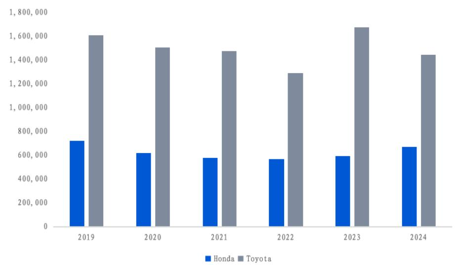

bar

| Year | Honda | Toyota |
| :--- | :--- | :--- |
| 2019 | 720,000 | 1,600,000 |
| 2020 | 620,000 | 1,500,000 |
| 2021 | 580,000 | 1,480,000 |
| 2022 | 570,000 | 1,300,000 |
| 2023 | 600,000 | 1,680,000 |
| 2024 | 670,000 | 1,450,000 |

Toyota Honda HTI

2024 年，丰田 BEV 与 PHEV 销量合计为 2.25 万辆，日本市场市占率为 22%。在电动化浪潮席卷全球的背景下，日本汽车巨头正以差异化的技术路径应对行业变局。丰田正推动一场深刻的战略转型：从混合动力时代的领导者，转向纯电与下一代电池技术的开拓者。其凭借在固态电池领域的前瞻布局，正试图为行业设立新的技术标杆。与此同时，本田选择了一条协同发展之路——通过整合其在动力总成与移动生态的深厚积累，积极构建开放的电动化联盟网络

图表: 2018-2024 年丰田电动车日本市场销量（台）  
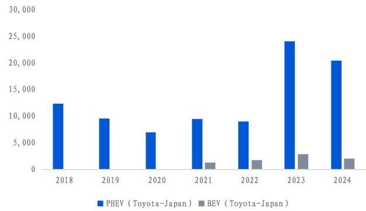

bar

| Year | PHEV (Toyota-Japan) | BEV (Toyota-Japan) |
| :--- | :--- | :--- |
| 2018 | 12300 | 0 |
| 2019 | 9600 | 0 |
| 2020 | 7000 | 0 |
| 2021 | 9500 | 1200 |
| 2022 | 9000 | 1600 |
| 2023 | 24000 | 3000 |
| 2024 | 20500 | 1800 |

Toyota, HTI

图表: 2018-2024 年丰田电动车日本市场市占率  
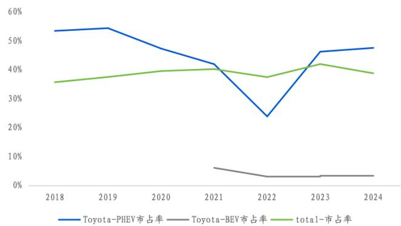

line

| Year | Toyota-PHEV市占率 | Toyota-BEV市占率 | total-市占率 |
|------|-------------------|------------------|--------------|
| 2018 | 53%               | -                | 35%          |
| 2019 | 54%               | -                | 37%          |
| 2020 | 48%               | -                | 39%          |
| 2021 | 42%               | 6%               | 40%          |
| 2022 | 23%               | 3%               | 37%          |
| 2023 | 46%               | 3%               | 42%          |
| 2024 | 47%               | 3%               | 38%          |

Toyota, HTI

在固态电池领域，丰田是全球最早开始研发的车企之一。早在 2008 年左右丰田便押注硫化物电解质路线，通过长期研发与专利布局奠定了全球领先的技术底蕴。2023 年丰田宣布，已经在固态电池的耐久性问题上取得了 "突破性"的解决方案，通过新的材料技术，大幅改善了电池的寿命，并简化了制造工艺。并进一步明确量产时间，将于2027 年推出搭载高性能全固态电池的电动汽车，实现充电 10 分钟内，续航达 1000公里以上的目标；在 2027-2028 年实现大规模生产并将其应用于市售车型。

图表: 丰田电池技术发展时间线

<table><tr><td></td><td>2023</td><td>2026</td><td>2026-2027</td><td>2027-2028</td><td>2027-2028</td><td>TBD</td></tr><tr><td></td><td>Battery for bZ4X</td><td>Performance</td><td>Popularisation</td><td>High- Performance</td><td>Solid-State 1</td><td>Solid-State 2</td></tr><tr><td></td><td colspan="2">Monopolar</td><td colspan="2">Bipolar</td><td>N/A</td><td>N/A</td></tr><tr><td>Electrolyte type</td><td colspan="4">Liquid</td><td colspan="2">Solid</td></tr><tr><td>Chemistry</td><td colspan="2">Li-Ion</td><td>LiFePO*1</td><td colspan="3">Li-Ion</td></tr><tr><td>Driving range (WLTP)</td><td>500km</td><td>&gt;800km</td><td>&gt;600km</td><td>&gt;1,000km</td><td>&gt;1,000km</td><td>&gt;1,200km</td></tr><tr><td>Cost</td><td>-</td><td>-20% vs bZ4X</td><td>-40% vs Bz4x</td><td>-10% vs NG performance version</td><td>TBD</td><td>TBD</td></tr><tr><td>Fast charge time*2</td><td>~30 min.</td><td>~20 min.</td><td>~30 min.</td><td>~20 min.</td><td>~10 min.</td><td>TBD</td></tr></table>

Toyota HTI

2024 年，丰田宣布其下一代电池（性能版）和全固态电池的开发和生产计划已获得METI 的认证，作为日本政府“电池供应保证计划”的一部分。丰田积极推进全固态电池的研发与生产，预计在 2026 年启动固态电池生产。

图表: 丰田固态电池量产规划

<table><tr><td></td><td>项目</td><td>申请人公司</td><td>生产开始年</td><td>生产规模</td></tr><tr><td>(1)</td><td rowspan="2">下一代电池(性能版本)</td><td>PPES,丰田</td><td rowspan="3">从2026年开始,逐渐实施</td><td rowspan="3">9吉瓦时/年</td></tr><tr><td>(2)</td><td> $PEVE^{*1}$ ,丰田</td></tr><tr><td>(3)</td><td>全固态电池</td><td>丰田</td></tr></table>

Toyota HTI

作为日本领先的能源材料企业，出光兴产自2001年便启动了固态电解质的研发工作。2013 年，公司与丰田达成战略合作，共同攻关全固态电池核心材料——硫化物固态电解质。凭借持续深耕，双方在该领域的专利布局已跻身全球顶尖阵营。经过长达十年的技术磨合与工艺迭代，两家企业最终成功开发出兼具柔韧性、高密合性与抗破裂特性的创新型固态电解质材料，为产业化应用奠定了坚实基础。

图表: 丰田与出光兴产在固态电解质的专利数量  
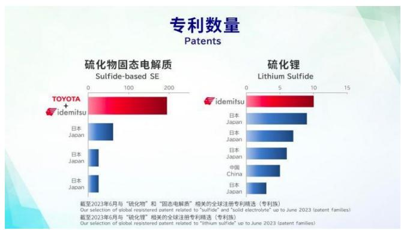

bar

专利数量 Patents
| 刀术 | 刀术 | 特别 | 数量 |
|---|---|---|---|
| 硫化物固态电解质 Sulfide-based SE | Toyota + idemitsu | | 200 |
| 硫化物固态电解质 Sulfide-based SE | Japan | | 100 |
| 硫化物固态电解质 Sulfide-based SE | Japan | | 50 |
| 硫化物固态电解质 Sulfide-based SE | Japan | | 20 |
| 硫化物固态电解质 Lithium Sulfide | idemitsu | | 10 |
| 硫化物固态电解质 Lithium Sulfide | Japan | | 8 |
| 硫化物固态电解质 Lithium Sulfide | Japan | | 6 |
| 硫化物固态电解质 Lithium Sulfide | Japan | | 4 |
| 硫化物固态电解质 Lithium Sulfide | China | | 3 |
| 硫化物固态电解质 Lithium Sulfide | Japan | | 2 |
截至2023年6月与“硫化物”和“固态电解质”的全球注册专利精选（专利族）；自2023年6月起，按“sulfide”和“solid electrolyte”分类至2023年6月；自2023年6月，按“ lithium sulfide”分类至2023年6月。该部分专利数均超过100个，其中：中国、日本、日本、日本、日本、日本、日本、日本、日本、日本、日本、日本、日本、日本、日本、日本、日本、日本、日本、日本、日本、日本、日本、日本、日本、日本、日本、日本、日本、日本、日本、日本、日本、日本、日本、日本、日本、日本、日本、日本、日本、日本、日本、日本、日本、日本、日本、日本、日本、日本、日本、日
专利数：截至2023年6月与“硫化物”相关的全球注册专利精选（专利族）。该部分专利数均为100个。该部分专利数为10个。该部分专利数为5个。该部分专利数为4个。该部分专利数为3个。该部分专利数为2个。该部分专利数为1个。该部分专利数为0。该部分专利数为5个。该部分专利数为4个。该部分专利数为3个。该部分专利数为2个。该部分专利数为1个。该部分专利数为5个。该部分专利数为4个。该部分专利数为3个。该部分专利数为2个。该部分专利数为1个。

Toyota, HTI

图表: 出光兴产固态电解质发展时间线  
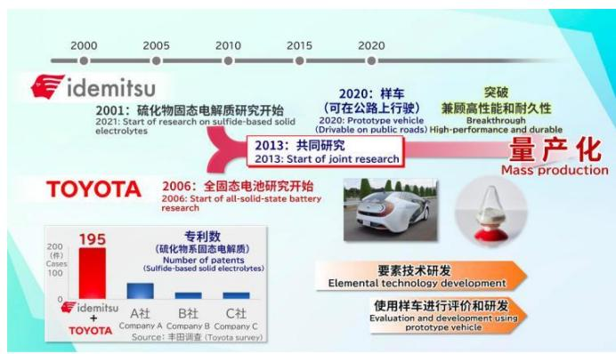

text_image

2000
2005
2010
2015
2020
idemitsu
2001: 硫化物固态电解质研究开始
2021: Start of research on sulfide-based solid
electrolytes
2020: 样车
(可在公路上行驶)
2020: Prototype vehicle
(Drivable on public roads) High-performance and durable
突破
兼顾高性能和耐久性
Breakthrough
TOYOTA
2013: 共同研究
2013: Start of joint research
TOYO6: 全固态电池研究开始
2006: Start of all-solid-state battery
research
量产化
Mass production
专利数
(硫化物系固态电解质)
Number of patents
(Sulfide-based solid electrolytes)
ad A社 B社 C社
idemitsu
+
TOYOTA
专利数
(硫化物系固态电解质)
Number of patents
(Sulfide-based solid electrolytes)
Source: 丰田调查 (Toyota survey)
要素技术研发
Elemental technology development
使用样车进行评价和研发
Evaluation and development using
prototype vehicle

Toyota Idemitsu HTI

出光兴产在硫化物固态电解质产业化进程中取得了系列实质性进展：2021 年，其首条吨级小试产线（1 号工厂）建成投产，开启小批量验证阶段。2023 年，公司与丰田进一步深化供应链合作，共同推进硫化锂及硫化物电解质的联合开发与量产布局。至2025年，公司产能建设进入加速期：2月宣布将投资213亿日元（获政府补贴71亿）建设年产千吨级硫化锂量产设施，预计2027年投产后可满足5–6万辆电动汽车需求；4 月，完成 1 号工厂扩产，年产能由数吨提升至十数吨规模；6 月，2 号工厂扩建再获政府“蓄电池供应保障计划”认证，拟投入11亿日元（最高补贴6亿）将样品年产能同步提升至十数吨级，为规模化供应奠定基础。

图表: 出光兴产固态电解质项目建设时间轴  
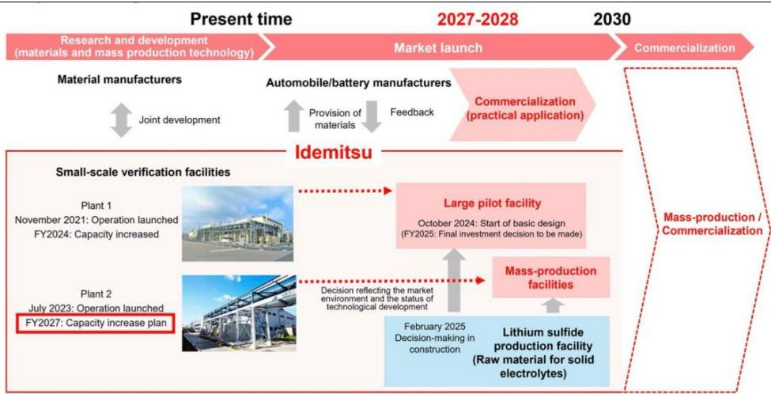

flowchart

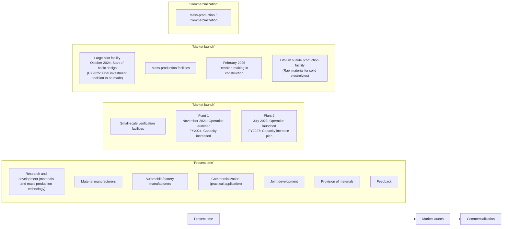
```mermaid
graph LR
    A["Present time"] --> B["Market launch"]
    B --> C["Commercialization"]
    
    subgraph 'Present time'
        D["Research and development (materials and mass production technology)"]
        E["Material manufacturers"]
        F["Automobile/battery manufacturers"]
        G["Commercialization (practical application)"]
        H["Joint development"]
        I["Provision of materials"]
        J["Feedback"]
    end
    
    subgraph 'Market launch'
        K["Small-scale verification facilities"]
        L["Plant 1\nNovember 2021: Operation launched\nFY2024: Capacity increased"]
        M["Plant 2\nJuly 2023: Operation launched\nFY2027: Capacity increase plan"]
    end
    
    subgraph 'Market launch'
        N["Large pilot facility\nOctober 2024: Start of basic design\n(FY2025: Final investment decision to be made)"]
        O["Mass-production facilities"]
        P["February 2025\nDecision-making in construction"]
        Q["Lithium sulfide production facility\n(Raw material for solid electrolytes)"]
    end
    
    subgraph 'Commercialization'
        R["Mass-production / Commercialization"]
    end
```

Idemitsu HTI

在正极材料领域，丰田与住友金属矿山于 年 月宣布达成全固态电池正极材料量产合作协议，标志着双方合作进入产业化推进阶段。两家企业的技术协作可追溯至2021 年，当时已围绕全固态电池正极材料展开联合研发，重点攻克充放电循环过程中材料劣化等关键技术瓶颈。住友金属矿山凭借其逾20年电动汽车正极材料供应经验，将为合作提供产业化保障，加速新型正极材料的量产进程。

图表: 固态电池结构与住友金属固态电池正极材料  
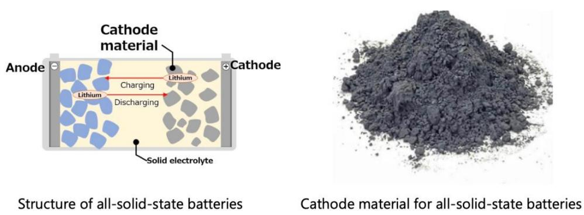

text_image

Cathode material
Anode
Lithium
Charging
Lithium
Discharging
Solid electrolyte
Cathode
Structure of all-solid-state batteries
Cathode material for all-solid-state batteries

Sumitomo Metal Mining HTI

# 2.3.1 韩国：整合产业链优势，加速量产布局

韩国电动汽车市场在2024年企稳回升（销量12.25万辆，电动化率8.9%）的基础上，于 2025 年增长势头显著加速。2025 上半年销量达 92,235 辆，同比大幅增长 42.4%；其中5月单月销量突破2万辆，为近14个月来的首次，显示出市场需求的强劲反弹。

图表: 2021-2025H1 韩国电动汽车销量及增速（辆）  
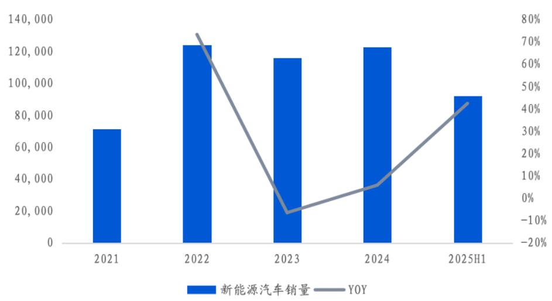

bar_line

| Year     | 新能源汽车销量 | YOY   |
| -------- | -------------- | ----- |
| 2021     | 70,000         | -     |
| 2022     | 125,000        | 75%   |
| 2023     | 115,000        | -10%  |
| 2024     | 120,000        | 5%    |
| 2025H1   | 90,000         | 45%   |

Marklines HTI

2024 年，以 LGES、SK On 与三星 SDI 为代表的韩国三大电池企业全球动力电池市场份额合计为18.4%，较去年同期下降4.7个百分点，整体竞争力面临挑战。从个体表现来看，三家企业增长路径出现明显分化：LGES凭借1.3%的电池装机量增长，市占率维持在 10.8%，稳居前列；SK On 实现 12.4%的较快增长，市占率为 4.4%；而三星 SDI 装机量同比下降 10.6%，主要受其欧洲与北美核心客户需求阶段性调整的影响。

图表:2017-2024 年全球 TOP6 动力电池企业市占率  
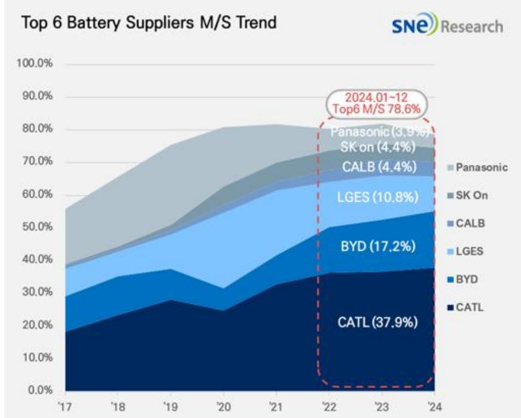

area

| Year | Panasonic | SK On | CALB | LGES | BYD | BYD | CATL |
|------|-----------|-------|------|------|-----|-----|------|
| '24  | 37.9%     | 4.4%  | 4.4% | 10.8%| 17.2%| 37.9% | 37.9% |
| 2024 | 3.9%      | 4.4%  | 4.4% | 10.8%| 17.2%| 37.9% | 37.9% |

SNE Research HTI

韩国作为仅次于中国的电池装机量国家，近年来份额有所下滑。2021 年韩国政府提出“K 电池”发展战略，旨在 2030 年成为下一代二次电池领域世界引领者，计划到 2030年在动力电池领域投资 40.6 万亿韩元（约合人民币 2290 亿元），其中 20.1 万亿韩元将用于研制新一代蓄电池。且政府将于 2023 年至 2028 年投入 3066 亿韩元争取提前实现固态电池、锂硫电池、锂金属电池的商用化。

图表: K 电池发展战略主要内容

<table><tr><td>维度</td><td>核心目标与具体措施</td></tr><tr><td>总体愿景</td><td>到2030年,将韩国打造成为全球电池领域的绝对领导者。</td></tr><tr><td>具体目标</td><td>市场份额:占据全球电池市场的40%。产能目标:将本土电池产能提升至150GWh。技术领先:实现全固态电池等下一代技术的全球领先与商业化。</td></tr><tr><td>研发与创新</td><td>巨额投资:到2030年投入约40万亿韩元用于电池研发与设施。攻克下一代技术:将全固态电池列为国家核心项目,设定成本目标(75美元/kWh以下),并支持锂硫电池等前沿技术。税收激励:为电池企业的研发与设备投资提供最高达20%-50%的税收减免。</td></tr><tr><td>供应链与生态</td><td>材料本土化:大幅提升核心电池材料的国产化率,稳定获取海外关键矿物(锂、镍、钴)。技术多元化:鼓励开发磷酸铁锂等多元化技术路线。构建循环经济:大力支持电池回收与再利用技术,建立循环体系。基金支持:设立规模达50万亿韩元的“尖端战略产业基金”,以低息贷款等方式支持产业。</td></tr></table>

资料来源：韩国政府，HTI

为在下一代动力电池领域重塑竞争优势，三星 SDI、LGES 与 SK On 三大韩系电池企业正将固态电池视为实现“换道超车”的战略支点，并依自身禀赋选择了差异化发展路径。三星 SDI 凭借其深厚技术积淀，采取最为激进的硫化物全固态路线，直接瞄准最高能量密度目标，并依托与宝马等高端车企的深度绑定，加速推动技术落地与车规级验证；LGES 则发挥其在规模化制造与材料整合方面的优势，选择从聚合物-氧化物复合半固态电池逐步过渡至全固态的渐进式路线，以平衡技术风险与商业化节奏；SKOn 将固态电池研发定位为核心破局方向，通过与美国福特等车企建立深度联盟，力图在下一轮市场竞争中实现技术超越与份额提升。

图表:三星 SDI、LGES、SK On在固态电池领域布局对比

<table><tr><td>对比维度</td><td>三星 SDI</td><td>LGES</td><td>SK On</td></tr><tr><td>技术路线</td><td>硫化物全固态电池</td><td>从聚合物/氧化物半固态逐步过渡到硫化物全固态</td><td>硫化物全固态电池</td></tr><tr><td>主要合作伙伴</td><td>宝马、现代(已送样)</td><td>与多家车企(如通用)联合开发</td><td>福特(合资公司)</td></tr><tr><td>里程碑</td><td>1. 已建成全固态电池试生产线2. 向宝马、现代等送出 A 样3. 与宝马、Solid Power 达成三方合作,目标 2027 年前生产示范车用电池</td><td>1. 2026 年实现聚合物+氧化物半固态电池量产2. 全固态电池目标在 2028-2030 年左右</td><td>1. 与福特合资建设美国固态电池试生产线2. 目标在 2028 年后实现量产应用</td></tr></table>

Samsung SDI LGES SK On HTI

三星 SDI 是韩国高端电池的领导者，与在高端方形电池领域占据领先地位，特别是在高镍电池领域，是宝马、奥迪等品牌的核心供应商。在韩国政府推动的“K-电池”发展战略中，三星 SDI 与 LG新能源、SK On 形成三足鼎立局面。早在 2012 年，三星 SDI 入场固态电池研究，选择聚合物电解质路线；于 2013 年推出固态电池原型，能量密度约 250Wh/kg；2022 年，三星 SDI 推出韩国第一条全固态电池试点线；2023 年，三星SDI 向客户提供了 S-line 生产的 ASB 样品，并计划在 2027 年批量生产；2024 年 SNE 电池日期间，三星 SDI 展示了其下一代固态电池，能量密度超 900Wh/L，续航里程高达600 英里，9 分钟快速充电，寿命长达 20 年。

图表: 锂离子电池、固态电池（锂金属负极）、三星 SDI 固态电池对比  
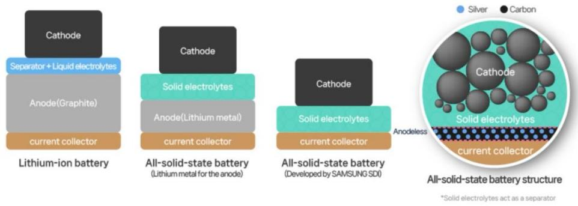

text_image

Lithium-ion battery
Cathode
Separator + Liquid electrolytes
Anode(Graphite)
current collector
All-solid-state battery
(Lithium metal for the anode)
Cathode
Solid electrolytes
Anode(Lithium metal)
current collector
All-solid-state battery
(Developed by SAMSUNG SDI)
Cathode
Solid electrolytes
current collector
Anodeless
Cathode
Solid electrolytes
current collector
All-solid-state battery structure
*Solid electrolytes act as a separator

Samsung SDI HTI

近日，Solid Power宣布与三星SDI和宝马集团签订联合评估协议，标志着 ASSB技术商业化的关键一步。根据协议，Solid Power 将向三星 SDI 提供基于硫化物的固体电解质，三星 SDI 将其用于构建电池。Solid Power、Samsung SDI 和 BMW 合作旨在开发和供应ASSB 电池。

图表: 宝马、三星 SDI、Solid Power 三方协议主要内容

<table><tr><td>合作方面</td><td>具体内容</td></tr><tr><td>合作目标</td><td>联合开发全固态电池,并为宝马规划中的下一代电动车型储备核心技术,最终在宝马的示范车辆上进行搭载和性能验证。</td></tr><tr><td rowspan="3">各方职责</td><td>Solid Power:提供其核心的硫化物固态电解质材料。</td></tr><tr><td>三星 SDI:利用 Solid Power 提供的电解质,生产大容量的全固态电池电芯。</td></tr><tr><td>宝马集团:负责将三星 SDI 提供的电芯集成为电池模块和电池包,并进行严格的整车层级测试与验证。</td></tr></table>

Samsung SDI HTI

宝马与三星 SDI 的合作历史悠久且深入，是汽车行业与电池巨头强强联合的经典案例。其两家合作始于内燃机时代，并全面贯穿至电动化转型的每一个阶段。三星 SDI 的电池几乎覆盖了宝马所有类型的电动车型，从纯电到插电混动，从紧凑型的 i3 到高端的iX 和 i7。

图表: 宝马与三星 SDI 合作项目

<table><tr><td>时间节点</td><td>合作阶段/项目</td><td>合作内容</td></tr><tr><td>2009年</td><td>合作开端</td><td>三星SDI开始为宝马的混合动力车型提供电芯,这标志着双方合作的起点。</td></tr><tr><td>2013年</td><td>首款量产电动车</td><td>为宝马划时代的纯电动车型i3(以及插电混动跑车i8)供应电池。i3的成功奠定了三星SDI作为宝马核心电池供应商的地位。</td></tr><tr><td>2014年</td><td>战略升级</td><td>双方签署了一份长期电池供应合同,将合作范围扩大到宝马更多的插电混动车型,如X5 xDrive40e等。</td></tr><tr><td>2018年</td><td>合作深化</td><td>三星SDI的电池被广泛应用于宝马的主力新能源车型,包括纯电iX3,以及插电混动版的3系、5系、7系、X3等。</td></tr><tr><td>2019年</td><td>扩大产能</td><td>为了满足宝马巨大的电池需求,三星SDI扩建了其匈牙利工厂的产能,宝马为此提供了资金支持。</td></tr><tr><td>2021年</td><td>技术迭代</td><td>三星SDI为宝马iX和i4等新一代电动车型提供第五代动力电池,支持了宝马新一代车型在续航和性能上的大幅提升。</td></tr><tr><td>2022年</td><td>锁定未来</td><td>宝马集团宣布,从2025年起,其“新世代”(Neue Klasse)平台车型将采用新一代圆柱形电池,而三星SDI正是其核心供应商之一。</td></tr><tr><td>2024年</td><td>扩大合作</td><td>宝马集团进一步授予三星SDI价值数十亿欧元的电池生产合同,为其在欧洲的“新世代”车型平台供应电池。</td></tr><tr><td>2025年</td><td>面向未来技术</td><td>与Solid Power共同宣布固态电池研发合作,三星SDI负责生产大容量全固态电池电芯,共同瞄准下一代电池技术。</td></tr></table>

Samsung SDI BMW HTI

相较于三星 SDI 激进的全固态电池布局，LGES 在固态电池的竞赛中采取了独具特色的渐进式路径。LGES 并未押注单一的硫化物体系，而是从复合型路线入手，其核心是使用一种聚合物作为基底，掺入氧化物陶瓷作为填料。这种 “聚合物+氧化物” 的混合体系，构成了LGES半固态/准固态电池的基础。其目标是2026年量产半固态电池，能量密度比当前最高性能的液态电池提升 50%以上。2028-2030 年左右实现全固态电池的商业化。

图表: LGES全固态电池研发  
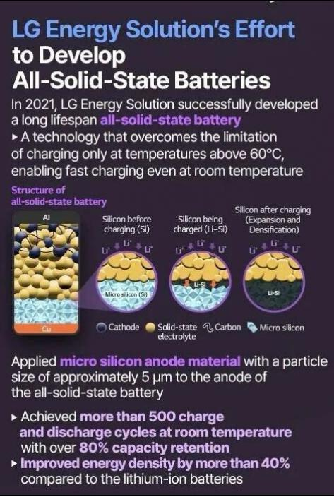

text_image

LG Energy Solution's Effort to Develop
All-Solid-State Batteries
In 2021, LG Energy Solution successfully developed
a long lifespan all-solid-state battery
► A technology that overcomes the limitation
of charging only at temperatures above 60°C,
enabling fast charging even at room temperature
Structure of
all-solid-state battery
Siemens before
charging (Si)
Li + Li + Li+
Micro silicon (Si)
Silicon being
charged (Li–Si)
Li+ Li+ Li+
Silicon after charging
(Expansion and
Densification)
Li+ Li+ Li+
Lu-Si
Cathode Solid-state
electrolyte Carbon Micro silicon
Applied micro silicon anode material with a particle
size of approximately 5 µm to the anode of
the all-solid-state battery
► Achieved more than 500 charge
and discharge cycles at room temperature
with over 80% capacity retention
► Improved energy density by more than 40%
compared to the lithium-ion batteries

图表: LGES双极结构应用于半固态电池  
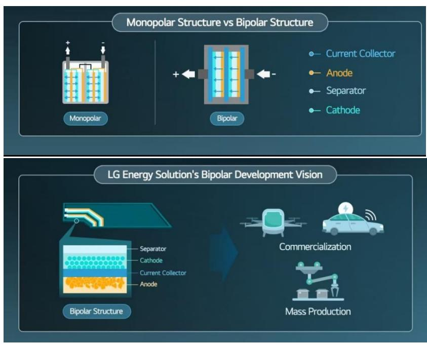

flowchart

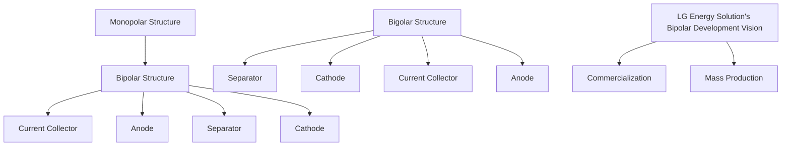
```mermaid
graph TD
    A["Monopolar Structure"] --> B["Bipolar Structure"]
    B --> C["Current Collector"]
    B --> D["Anode"]
    B --> E["Separator"]
    B --> F["Cathode"]
    G["Bigolar Structure"] --> H["Separator"]
    G --> I["Cathode"]
    G --> J["Current Collector"]
    G --> K["Anode"]
    L["LG Energy Solution's Bipolar Development Vision"] --> M["Commercialization"]
    L --> N["Mass Production"]
```

LGES, HTI   
LGES HTI

2024 年，LG 化学与 Factorial 签署 MOU，共研固态电池。Factorial 专注 FEST 聚合物电解质，已获奔驰、Stellantis、现代/起亚投资，2023 年推出 100Ah 原型，计划 2026 年量产，并正于马萨诸塞州建设 200MWh 固态电池装配线。

图表: Factorial 固态电池技术  
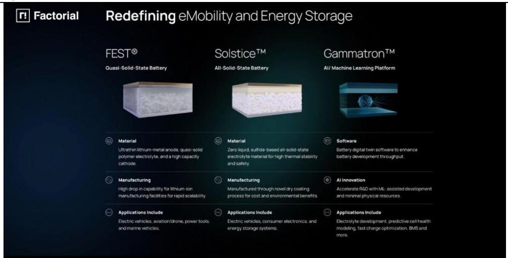

text_image

Factorial
Redefining eMobility and Energy Storage
FEST®
Quasi-Solid-State Battery
Solstice™
All-Solid-State Battery
Gammatron™
AI/ Machine Learning Platform
Material
Ultrathin lithium-metal anode, quasi-solid polymer electrolyte, and a high capacity cathode.
Material
Zero liquid, sulfide-based all-solid-state electrolyte material for high thermal stability and safety.
Software
Battery digital twin software to enhance battery development throughput.
Manufacturing
High drop in capability for lithium-ion manufacturing facilities for rapid scalability.
Manufacturing
Manufactured through novel dry coating process for cost and environmental benefits.
AI innovation
Accelerate R&D with ML - assisted development and minimal physical resources.
Applications Include
Electric vehicles, aviation/drone, power tools, and marine vehicles.
Applications Include
Electric vehicles, consumer electronics, and energy storage systems.
Applications Include
Electrolyte development, predictive cell health modeling, fast charge optimization, BMS and more.

Factorial HTI

同样作为韩国电池三巨头之一的 SK On，2025 年 9 月宣布建成了全固态电池试点工厂，SK On 将在新试点生产线中开发硫化物系全固态电池。此外 SK On 计划于 2029 年在另一处工厂启动全固态电池的商业化生产。公司首批量产电池的能量密度将达到 800Wh/L，后续将进一步提升至 1000 Wh/L。

# 3. 投资建议

1）宁德时代（300750 CH / 3750 HK）：20Ah 样品已达 450-500Wh/kg，合肥 5GWh 中试线已投产。公司预计 2027 年小规模量产固态电池，2030 年前后有望实现更大的规模化生产。  
2）比亚迪（002594 CH）：2027 年启动全固态电池装车示范，2030 年大规模上车。重庆 100GWh 基地预留固态专线，成本目标≤70\$/kWh。  
3）亿纬锂能（300014 CH）：2025 年成都基地揭牌，“龙泉二号”全固态电池已下线，能量密度 300 Wh/kg、体积密度 700 Wh/L；公司预计 2026 年形成 100 MWh 年产能。  
4）先导智能（300450 CH）锂电设备龙头，干法电极设备精度与国产化率领先，固态电池扩产将直接放大设备订单弹性。  
5）国轩高科（002074 CH）：“金石电池”已进入中试量产阶段，良品率 90%，已启动2 GWh 量产线设计。  
6）厦钨新能（688778 CH）：可吨级供应氧化物电解质，硫化锂纯度>99.9%。  
7）天赐材料（002709 CH）：同步布局氧化物+硫化物双体系，硫化锂路线固态电解质已进入中试阶段。  
8）新宙邦（300037 CH）：已有氧化物体系、硫化物体系和聚合物体系的固态电解质成熟产品，其中氧化物电解质已实现小批量产销售。  
9）璞泰来（603659 CH）：固态电解质 LLZO 已完成中试，产品离子电导率达到 10-3S/cm。  
10）Quantum Scape（QS US）：2025 年 QSE-5 B1 样品已交付，实测 844Wh/L+10C 快充+12min 补电 80%，加州 Eagle Line 中试线将隔膜烧结速度提升 25 倍，2026 年 C 样路试、2027-2028 年小批量上车确定性高，技术壁垒最深。  
11）Solid Power（SLDP US）：20Ah 硅负极样 390Wh/kg、锂金属样 440Wh/k。宝马搭载 Solid Power 全固态电池的电动汽车已开始路测。公司预计 2027 开始量产。  
12）Toyota（TM US）：全球硫化物固态电池专利占比 68%，技术成熟度领先行业，2026 年混动小批量、2027-2028 年 BEV 版本 500Wh/kg 上车。  
13）三星 SDI（006400 KS）：实验室原型已达 900 Wh/L，比现有高镍体系提升 40%，目标2027 年量。已与宝马签订2027 年小批量供货协议，需求端可见度高。  
14）LGES（373220 KS）：能量密度 500 Wh/kg（体积密度 930 Wh/L），支持 10 分钟快充，循环寿命>1000 次，与主流车企同步开发测试。2026 年启动硫化物固态电池试生产，2028 年进入大规模量产。

# 4. 风险提示

产业化进展不及预期；原材料价格波动；宏观与政策不确定；地缘政治变化等风险。

# APPENDIX 1

# Solid-State Batteries: Breaking Through the Dual Bottlenecks of Energy Density and Safety

Traditional liquid lithium-ion batteries are approaching their theoretical energy density limits, struggling to meet market demands for extended range. Additionally, their flammable and explosive liquid electrolytes pose thermal runaway risks. Solid-state batteries fundamentally address these safety concerns by adopting solid electrolytes while boosting energy density to 500 Wh/kg. In 2024, global shipments of solid-state batteries reached 5.3 GWh, representing a penetration rate of approximately 0.2%, with growth expected to accelerate significantly in the future.

# China: Full Industry Chain Advantages and Policy-Driven Leadership, with Clear Timelines from Leading Enterprises

As the world's largest power battery producer, China has established a comprehensive support system integrating national strategy, local industrial policies, and diversified initiatives in the solid-state battery sector. Leading enterprises have made significant progress: CATL commissioned a 5 GWh sulfide-based all-solid-state pilot line in Hefei in 2025, targeting small-scale vehicle integration by 2027. BYD launched a 60 Ah all-solid-state prototype in 2024 with an energy density exceeding 400 Wh/kg and plans to demonstrate the technology in thousands of vehicles by 2027. Leveraging its full industrial chain and robust market demand, China is transitioning from a manufacturing powerhouse to a hub of innovation.

# United States: Startup-Led, Capital-Driven, with Clearly Diversified Technical Pathways

The U.S. solid-state battery landscape is dominated by startups, supported by policies such as the Inflation Reduction Act, which provides a tax credit of \$35 per kWh for battery cells and has allocated over \$250 million in R&D funding. QuantumScape's QSE-5 B-sample delivered in 2025 achieves an energy density of 844 Wh/L and supports 12-minute fast charging, with plans for smallvolume delivery to Volkswagen by 2027. Solid Power has developed silicon anode samples reaching 390 Wh/kg and has established a tripartite collaboration with BMW and Samsung SDI, aiming for mass production in 2027.

# Japan and South Korea: Technological Depth and Accelerated Production, Leveraging Local Industry Chain Synergies

Japan focuses on materials innovation, with Toyota holding 68% of global patents in sulfide-based solid-state batteries and planning to launch all-solid-state electric vehicles with over 1,000 km range by 2027. Idemitsu Kosan aims to complete a 1,000-ton annual lithium sulfide production capacity by 2027. South Korea relies on giants like Samsung SDI and LG Energy Solution to integrate industrial chains. Samsung SDI has built a full-scale solid-state pilot line, with sample energy density exceeding 900 Wh/L, and has signed a small-volume supply agreement with BMW for 2027. LG Energy Solution follows a incremental approach, planning semi-solid battery mass production in 2026 and full-solid-state commercialization by 2028. With deep technological expertise and automaker alliances, Japanese and Korean firms aim to achieve a commercial breakthrough in all-solid-state batteries between 2027 and 2030.

# Investment Advice

Focus on companies with leading technology and clear industrialization roadmaps: CATL (300750 CH / 3750 HK), BYD (002594 CH), EVE Energy (300014 CH), Lead Intelligent (300450 CH), Gotion (002074 CH), XTC (688778 CH), Tinci (002709 CH), Capchem (300037 CH), PTL (603659 CH), QuantumScape (QS US), Solid Power (SLDP US), Toyota (TM US), Samsung SDI (006400 KS), and LG Energy Solution (373220 KS).

# Risks

Slower-than-expected industrialization progress; Volatility in raw material prices; Macroeconomic and policy uncertainties; Geopolitical changes and related risks

# 附录[Table\_disclaimAPPENDIX

# 重要信息披露

本研究报告由海通国际分销，海通国际是由海通国际研究有限公司(HTIRL)，Haitong Securities India Private Limited (HSIPL)，Haitong International Japan K.K. (HTIJKK)和海通国际证券有限公司(HTISCL)的证券研究团队所组成的全球品牌，海通国际证券集团(HTISG)各成员分别在其许可的司法管辖区内从事证券活动。

# IMPORTANT DISCLOSURES

This research report is distributed by Haitong International, a global brand name for the equity research teams of Haitong International Research Limited (“HTIRL”), Haitong Securities India Private Limited (“HSIPL”), Haitong International Japan K.K. (“HTIJKK”), Haitong International Securities Company Limited (“HTISCL”), and any other members within the Haitong International Securities Group of Companies (“HTISG”), each authorized to engage in securities activities in its respective jurisdiction.

# HTIRL 分析师认证 Analyst Certification:

我， 徐柏乔，在此保证（i）本研究报告中的意见准确反映了我们对本研究中提及的任何或所有目标公司或上市公司的个人观点，并且（ii）我的报酬中没有任何部分与本研究报告中 表达的具体建议或观点直接或间接相关；及就此报告中所讨论目标公司的证券，我们（包括我们的家属）在其中均不持有任何财务利益。我和我的家属（我已经告知他们）将不会在 本研究报告发布后的 30 个自然日内交易此研究报告所讨论目标公司的证券。I, Baiqiao Xu, certify that (i) the views expressed in this research report accurately reflect my personal views about any or all of the subject companies or issuers referred to in this research and (ii) no part of my compensation was, is or will be directly or indirectly related to the specific recommendations or views expressed in this research report; and that I (including members of my household) have no financial interest in the security or securities of the subject companies discussed. I and my household, whom I have already notified of this, will not deal in or trade any securities in respect of the issuer that I review within 30 calendar days after the research report is published.

我， Rosy Hou，在此保证（i）本研究报告中的意见准确反映了我们对本研究中提及的任何或所有目标公司或上市公司的个人观点，并且（ii）我的报酬中没有任何部分与本研究报告 中表达的具体建议或观点直接或间接相关；及就此报告中所讨论目标公司的证券，我们（包括我们的家属）在其中均不持有任何财务利益。我和我的家属（我已经告知他们）将不会 在本研究报告发布后的 30 个自然日内交易此研究报告所讨论目标公司的证券。I, Rosy Hou, certify that (i) the views expressed in this research report accurately reflect my personal views about any or all of the subject companies or issuers referred to in this research and (ii) no part of my compensation was, is or will be directly or indirectly related to the specific recommendations or views expressed in this research report; and that I (including members of my household) have no financial interest in the security or securities of the subject companies discussed. I and my household, whom I have already notified of this, will not deal in or trade any securities in respect of the issuer that I review within 30 calendar days after the research report is published.

# 利益冲突披露 Conflict of Interest Disclosures

海通国际及其某些关联公司可从事投资银行业务和/或对本研究中的特定股票或公司进行做市或持有自营头寸。就本研究报告而言，以下是有关该等关系的披露事项（以下披露不能保证及时无遗漏，如需了解及时全面信息，请发邮件至 ERD-Disclosure@htisec.com）

HTI and some of its affiliates may engage in investment banking and / or serve as a market maker or hold proprietary trading positions of certain stocks or companies in this research report. As far as this research report is concerned, the following are the disclosure matters related to such relationship (As the following disclosure does not ensure timeliness and completeness, please send an email to ERD-Disclosure@htisec.com if timely and comprehensive information is needed).

国泰海通证券股份有限公司和/或其子公司（统称“国泰海通”）在过去12个月内参与了002594.CH的投资银行项目。投资银行项目包括：1、国泰海通担任上市前辅导机构、保荐人或主承销商的首次公开发行项目；2、国泰海通作为保荐人、主承销商或财务顾问的股权或债务再融资项目；3、国泰海通作为主经纪商的新三板上市、目标配售和并购项目。

Guotai Haitong Securities Co., Ltd. and/or its subsidiaries (collectively, the "Guotai Haitong") have a role in investment banking projects of 002594.CH within the past 12 months. The investment banking projects include 1. IPO projects in which Guotai Haitong acted as pre-listing tutor, sponsor, or lead-underwriter; 2. equity or debt refinancing projects of 002594.CH for which Guotai Haitong acted as sponsor, lead-underwriter or financial advisor; 3. listing by introduction in the new three board, target placement, M&A projects in which Guotai Haitong acted as lead-brokerage firm.

002594.CH 及 300750.CH 目前或过去 12 个月内是国泰海通的投资银行业务客户。

002594.CH and 300750.CH are/were an investment bank clients of Guotai Haitong currently or within the past 12 months.

及 目前或过去 个月内是国泰海通的客户。国泰海通向客户提供非投资银行业务的证券相关业务服务。

300438.CH, 002270.CH and 002335.CH are/were a client of Guotai Haitong currently or within the past 12 months. The client has been provided for non-investment-banking securities-related services.

300438.CH 目前或过去 12 个月内是国泰海通的客户。国泰海通向客户提供非证券业务服务。

300438.CH is/was a client of Guotai Haitong currently or within the past 12 months. The client has been provided for non-securities services.

国泰海通在过去 12 个月中获得对 002594.CH 及300750.CH 提供投资银行服务的报酬。

Guotai Haitong received in the past 12 months compensation for investment banking services provided to 002594.CH and 300750.CH.

国泰海通预计将（或者有意向）在未来三个月内从 002594.CH 获得投资银行服务报酬。

Guotai Haitong expects to receive, or intends to seek, compensation for investment banking services in the next three months from 002594.CH.

国泰海通在过去的 12 个月中从 300438.CH 获得除投资银行服务以外之产品或服务的报酬。

Guotai Haitong has received compensation in the past 12 months for products or services other than investment banking from 300438.CH.

国泰海通担任 688599.CH, 002594.CH 及 688248.CH 有关证券的做市商或流通量提供者。

Guotai Haitong acts as a market maker or liquidity provider in the securities of 688599.CH, 002594.CH and 688248.CH.

Compendium disclosure：For disclosures associated with each company mentioned herein, including disclosure of risks, valuation methodologies and target price formation, if any, please refer to the full report on our website (equities.htisec.com).

# 评级定义（从 2020 年 7月 1日开始执行）：

海通国际（以下简称“HTI”）采用相对评级系统来为投资者推荐我们覆盖的公司：优于大市、中性或弱于大市。投资者应仔细阅读 HTI 的评级定义。并且 HTI 发布分析师观点的完整信息，投资者应仔细阅读全文而非仅看评级。在任何情况下，分析师的评级和研究都不能作为投资建议。投资者的买卖股票的决策应基于各自情况（比如投资者的现有持仓）以及其他因素。

# 分析师股票评级

优于大市，未来 12-18 个月内预期相对基准指数涨幅在 10%以上，基准定义如下

中性，未来 个月内预期相对基准指数变化不大，基准定义如下。根据 的评级分布规则，我们会将中性评级划入持有这一类别。

弱于大市，未来 12-18 个月内预期相对基准指数跌幅在 10%以上，基准定义如下

各地股票基准指数：日本 – TOPIX, 韩国 – KOSPI, 台湾 – TAIEX, 印度 – Nifty100, 美国 – SP500; 其他所有中国概念股 – MSCI China.

# Ratings Definitions (from 1 Jul 2020):

Haitong International uses a relative rating system using Outperform, Neutral, or Underperform for recommending the stocks we cover to investors. Investors should carefully read the definitions of all ratings used in Haitong International Research. In addition, since Haitong International Research contains more complete information concerning the analyst's views, investors should carefully read Haitong International Research, in its entirety, and not infer the contents from the rating alone. In any case, rat ings (or research) should not be used or relied upon as investment advice. An investor's decision to buy or sell a stock should dep end on individual circumstances (such as the investor's existing holdings) and other considerations.

# Analyst Stock Ratings

Outperform: The stock’s total return over the next 12-18 months is expected to exceed the return of its relevant broad market benchmark, as indicated below.

Neutral: The stock’s total return over the next 12-18 months is expected to be in line with the return of its relevant broad market benchmark, as indicated below. For purposes only of FINRA/NYSE ratings distribution rules, our Neutral rating falls into a hold rating category.

Underperform: The stock’s total return over the next 12-18 months is expected to be below the return of its relevant broad market benchmark, as indicated below.

Benchmarks for each stock’s listed region are as follows: Japan – TOPIX, Korea – KOSPI, Taiwan – TAIEX, India – Nifty100, US – SP500; for all other China-concept stocks – MSCI China.

<table><tr><td rowspan="2"></td><td colspan="3">截至2025年9月30日海通国际股票研究评级分布</td><td colspan="3">截至2025年6月30日海通国际股票研究评级分布</td></tr><tr><td>优于大市</td><td>中性(持有)</td><td>弱于大市</td><td>优于大市</td><td>中性(持有)</td><td>弱于大市</td></tr><tr><td>海通国际股票研究覆盖率</td><td>92.3%</td><td>7.5%</td><td>0.2%</td><td>92.6%</td><td>7.2%</td><td>0.2%</td></tr><tr><td>投资银行客户*</td><td>3.3%</td><td>3.9%</td><td>0.0%</td><td>2.9%</td><td>4.1%</td><td>0.0%</td></tr></table>

\*在每个评级类别里投资银行客户所占的百分比。

上述分布中的买入，中性和卖出分别对应我们当前优于大市，中性和落后大市评级。

只有根据 FINRA/NYSE 的评级分布规则，我们才将中性评级划入持有这一类别。请注意在上表中不包含非评级的股票。

# 此前的评级系统定义（直至 年 月 日）：

买入，未来 12-18 个月内预期相对基准指数涨幅在 10%以上，基准定义如下

中性，未来 12-18 个月内预期相对基准指数变化不大，基准定义如下。根据 FINRA/NYSE 的评级分布规则，我们会将中性评级划入持有这一类别。

卖出，未来 12-18 个月内预期相对基准指数跌幅在 10%以上，基准定义如下

各地股票基准指数：日本 – TOPIX, 韩国 – KOSPI, 台湾 – TAIEX, 印度 – Nifty100; 其他所有中国概念股 – MSCI China.

Haitong International Equity Research Ratings Distribution, as of September 30, 2025 

<table><tr><td></td><td>Outperform</td><td>Neutral(hold)</td><td>Underperform</td><td>Outperform</td><td>Neutral(hold)</td><td>Underperform</td></tr><tr><td>HTI Equity Research Coverage</td><td>92.3%</td><td>7.5%</td><td>0.2%</td><td>92.6%</td><td>7.2%</td><td>0.2%</td></tr><tr><td>IB clients*</td><td>3.3%</td><td>3.9%</td><td>0.0%</td><td>2.9%</td><td>4.1%</td><td>0.0%</td></tr></table>

Haitong International Equity Research Ratings Distribution, as of June 30, 2025   
\*Percentage of investment banking clients in each rating category.

BUY, Neutral, and SELL in the above distribution correspond to our current ratings of Outperform, Neutral, and Underperform.

For purposes only of FINRA/NYSE ratings distribution rules, our Neutral rating falls into a hold rating category. Please note that stocks with an NR designation are not included in the table above.

# Previous rating system definitions (until 30 Jun 2020):

BUY: The stock’s total return over the next 12-18 months is expected to exceed the return of its relevant broad market benchmark, as indicated below.

NEUTRAL: The stock’s total return over the next 12-18 months is expected to be in line with the return of its relevant broad market benchmark, as indicated below. For purposes

only of FINRA/NYSE ratings distribution rules, our Neutral rating falls into a h old rating category.

SELL: The stock’s total return over the next 12-18 months is expected to be below the return of its relevant broad market benchmark, as indicated below.

Benchmarks for each stock’s listed region are as follows: Japan – TOPIX, Korea – KOSPI, Taiwan – TAIEX, India – Nifty100; for all other China-concept stocks – MSCI China.

海通国际非评级研究：海通国际发布计量、筛选或短篇报告，并在报告中根据估值和其他指标对股票进行排名，或者基于可能的估值倍数提出建议价格。这种排名或建议价格并非为了进行股票评级、提出目标价格或进行基本面估值，而仅供参考使用。

Haitong International Non-Rated Research: Haitong International publishes quantitative, screening or short reports which may rank stocks according to valuation and other metrics or may suggest prices based on possible valuation multiples. Such rankings or suggested prices do not purport to be stock ratings or target prices or fundamental values and are for information only.

海通国际 A 股覆盖：海通国际可能会就沪港通及深港通的中国 A 股进行覆盖及评级。国泰海通证券（601211.CH），海通国际于上海的母公司，也会于中国发布中国 A 股的研究报告。但是，海通国际使用与国泰海通证券不同的评级系统，所以海通国际与国泰海通证券的中国 A 股评级可能有所不同。

Haitong International Coverage of A-Shares: Haitong International may cover and rate A-Shares that are subject to the Hong Kong Stock Connect scheme with Shanghai and Shenzhen. GUOTAI HAITONG SECURITIES (601211 CH), the ultimate parent company of HTISG based in Shanghai, covers and publishes research on these same A-Shares for distribution in mainland China. However, the rating system employed by GTHS differs from that used by HTI and as a result there may be a difference in the HTI and GTHS ratings for the same A-share stocks.

海通国际优质 100 A 股（Q100）指数：海通国际 Q100 指数是一个包括 100 支由国泰海通证券覆盖的优质中国 A 股的计量产品。这些股票是通过基于质量的筛选过程，并结合对国泰海通证券A 股团队自下而上的研究。海通国际每季对 Q100 指数成分作出复审。

Haitong International Quality 100 A-share (Q100) Index: HTI’s Q100 Index is a quant product that consists of 100 of the highest-quality A-shares under coverage at GTHS in Shanghai. These stocks are carefully selected through a quality-based screening process in combination with a review of the GTHS A-share team’s bottom-up research. The Q100 constituent companies are reviewed quarterly.

盟浪义利（ ）数据通免责声明条款：在使用盟浪义利（ ）数据之前，请务必仔细阅读本条款并同意本声明：

第一条 义利（ ）数据系由盟浪可持续数字科技有限责任公司（以下简称 本公司 ）基于合法取得的公开信息评估而成，本公司对信息的准确性及完整性不作任何保证。对公司的评估结果仅供参考，并不构成对任何个人或机构投资建议，也不能作为任何个人或机构购买、出售或持有相关金融产品的依据。本公司不对任何个人或机构投资者因使用本数据表述的评估结果造成的任何直接或间接损失负责。

第二条 盟浪并不因收到此评估数据而将收件人视为客户，收件人使用此数据时应根据自身实际情况作出自我独立判断。本数据所载内容反映的是盟浪在最初发布本数据日期当日的判断，盟浪有权在不发出通知的情况下更新、修订与发出其他与本数据所载内容不一致或有不同结论的数据。除非另行说明，本数据（如财务业绩数据等）仅代表过往表现，过往的业绩表现不作为日后回报的预测。

第三条 本数据版权归本公司所有，本公司依法保留各项权利。未经本公司事先书面许可授权，任何个人或机构不得将本数据中的评估结果用于任何营利性目的，不得对本数据进行修改、复制、编译、汇编、再次编辑、改编、删减、缩写、节选、发行、出租、展览、表演、放映、广播、信息网络传播、摄制、增加图标及说明等，否则因此给盟浪或其他第三方造成损失的，由用户承担相应的赔偿责任，盟浪不承担责任。

第四条 如本免责声明未约定，而盟浪网站平台载明的其他协议内容（如《盟浪网站用户注册协议》《盟浪网用户服务（含认证）协议》《盟浪网隐私政策》等）有约定的，则按其他协议的约定执行；若本免责声明与其他协议约定存在冲突或不一致的，则以本免责声明约定为准。

SusallWave FIN-ESG Data Service Disclaimer: Please read these terms and conditions below carefully and confirm your agreement and acceptance with these terms before using SusallWave FIN-ESG Data Service.

1. FIN-ESG Data is produced by SusallWave Digital Technology Co., Ltd. (In short, SusallWave)’s assessment based on legal publicly accessible information. SusallWave shall not be responsible for any accuracy and completeness of the information. The assessment result is for reference only. It is not for any investment advice for any individual or institution and not for basis of purchasing, selling or holding any relative financial products. We will not be liable for any direct or indirect loss of any individual or institution as a result of using SusallWave FIN-ESG Data.

2. SusallWave do not consider recipients as customers for receiving these data. When using the data, recipients shall make your own independent judgment according to your practical individual status. The contents of the data reflect the judgment of us only on the release day. We have right to update and amend the data and release other data that contains inconsistent contents or different conclusions without notification. Unless expressly stated, the data (e.g., financial performance data) represents past performance only and the past performance cannot be viewed as the prediction of future return.

3. The copyright of this data belongs to SusallWave, and we reserve all rights in accordance with the law. Without the prior written permission of our company, none of individual or institution can use these data for any profitable purpose. Besides, none of individual or institution can take actions such as amendment, replication, translation, compilation, re-editing, adaption, deletion, abbreviation, excerpts, issuance, rent, exhibition, performance, projection, broadcast, information network transmission, shooting, adding icons and instructions. If any loss of SusallWave or any third-party is caused by those actions, users shall bear the corresponding compensation liability. SusallWave shall not be responsible for any loss.

4. If any term is not contained in this disclaimer but written in other agreements on our website (e.g. User Registration Protocol of SusallWave Website, User Service (including authentication) Agreement of SusallWave Website, Privacy Policy of Susallwave Website), it should be executed according to other agreements. If there is any difference between this disclaim and other agreements, this disclaimer shall be applied.

# 重要免责声明：

非印度证券的研究报告：本报告由海通国际证券集团有限公司（“HTISGL”）的全资附属公司海通国际研究有限公司（“HTIRL”）发行，该公司是根据香港证券及期货条例（第 571 章）持有第 4 类受规管活动（就证券提供意见）的持牌法团。该研究报告在 HTISGL 的全资附属公司 Haitong International (Japan) K.K.（“HTIJKK”）的协助下发行，HTIJKK 是由日本关东财务局监

管为投资顾问。

印度证券的研究报告：本报告由从事证券交易、投资银行及证券分析及受 Securities and Exchange Board of India（“SEBI”）监管的 Haitong Securities India Private Limited（“HTSIPL”）所发行，包括制作及发布涵盖 BSE Limited（“BSE”）和 National Stock Exchange of India Limited（“NSE”）上市公司（统称为「印度交易所」）的研究报告。HTSIPL 于 2016 年 12 月 22 日被收购并成为海通国际证券集团有限公司（“HTISG”）的一部分。

所有研究报告均以海通国际为名作为全球品牌，经许可由海通国际证券股份有限公司及 或海通国际证券集团的其他成员在其司法管辖区发布。

本文件所载信息和观点已被编译或源自可靠来源，但 HTIRL、HTISCL 或任何其他属于海通国际证券集团有限公司（“HTISG”）的成员对其准确性、完整性和正确性不做任何明示或暗示的声明或保证。本文件中所有观点均截至本报告日期，如有更改，恕不另行通知。本文件仅供参考使用。文件中提及的任何公司或其股票的说明并非意图展示完整的内容，本文件并非/不应被解释为对证券买卖的明示或暗示地出价或征价。在某些司法管辖区，本文件中提及的证券可能无法进行买卖。如果投资产品以投资者本国货币以外的币种进行计价，则汇率变化可能会对投资产生不利影响。过去的表现并不一定代表将来的结果。某些特定交易，包括设计金融衍生工具的，有产生重大风险的可能性，因此并不适合所有的投资者。您还应认识到本文件中的建议并非为您量身定制。分析师并未考虑到您自身的财务情况，如您的财务状况和风险偏好。因此您必须自行分析并在适用的情况下咨询自己的法律、税收、会计、金融和其他方面的专业顾问，以期在投资之前评估该项建议是否适合于您。若由于使用本文件所载的材料而产生任何直接或间接的损失，HTISG 及其董事、雇员或代理人对此均不承担任何责任。

除对本文内容承担责任的分析师除外，HTISG 及我们的关联公司、高级管理人员、董事和雇员，均可不时作为主事人就本文件所述的任何证券或衍生品持有长仓或短仓以及进行买卖。HTISG 的销售员、交易员和其他专业人士均可向 HTISG 的相关客户和公司提供与本文件所述意见相反的口头或书面市场评论意见或交易策略。HTISG 可做出与本文件所述建议或意见不一致的投资决策。但 HTIRL 没有义务来确保本文件的收件人了解到该等交易决定、思路或建议。

请访问海通国际网站 www.equities.htisec.com ，查阅更多有关海通国际为预防和避免利益冲突设立的组织和行政安排的内容信息。

非美国分析师披露信息：本项研究首页上列明的海通国际分析师并未在 FINRA 进行注册或者取得相应的资格，并且不受美国FINRA有关与本项研究目标公司进行沟通、公开露面和自营证券交易的第 2241 条规则之限制。

# IMPORTANT DISCLAIMER

For research reports on non-Indian securities: The research report is issued by Haitong International Research Limited (“HTIRL”), a wholly owned subsidiary of Haitong International Securities Group Limited (“HTISGL”) and a licensed corporation to carry on Type 4 regulated activity (advising on securities) for the purpose of the Securities and Futures Ordinance (Cap. 571) of Hong Kong, with the assistance of Haitong International (Japan) K.K. (“HTIJKK”), a wholly owned subsidiary of HTISGL and which is regulated as an Investment Adviser by the Kanto Finance Bureau of Japan.

For research reports on Indian securities: The research report is issued by Haitong Securities India Private Limited (“HSIPL”), an Indian company and a Securities and Exchange Board of India (“SEBI”) registered Stock Broker, Merchant Banker and Research Analyst that, inter alia, produces and distributes research reports covering listed entities on the BSE Limited (“BSE”) and the National Stock Exchange of India Limited (“NSE”) (collectively referred to as “Indian Exchanges”). HSIPL was acquired and became part of the Haitong International Securities Group of Companies (“HTISG”) on 22 December 2016.

All the research reports are globally branded under the name Haitong International and approved for distribution by Haitong International Securities Company Limited (“HTISCL”) and/or any other members within HTISG in their respective jurisdictions.

The information and opinions contained in this research report have been compiled or arrived at from sources believed to be reliable and in good faith but no representation or warranty, express or implied, is made by HTIRL, HTISCL, HSIPL, HTIJKK or any other members within HTISG from which this research report may be received, as to their accuracy, completeness or correctness. All opinions expressed herein are as of the date of this research report and are subject to change without notice. This research report is for information purpose only. Descriptions of any companies or their securities mentioned herein are not intended to be complete and this research report is not, and should not be construed expressly or impliedly as, an offer to buy or sell securities. The securities referred to in this research report may not be eligible for purchase or sale in some jurisdictions. If an investment product is denominated in a currency other than an investor's home currency, a change in exchange rates may adversely affect the investment. Past performance is not necessarily indicative of future results. Certain transactions, including those involving derivatives, give rise to substantial risk and are not suitable for all investors. You should also bear in mind that recommendations in this research report are not tailor-made for you. The analyst has not taken into account your unique financial circumstances, such as your financial situation and risk appetite. You must, therefore, analyze and should, where applicable, consult your own legal, tax, accounting, financial and other professional advisers to evaluate whether the recommendations suits you before investment. Neither HTISG nor any of its directors, employees or agents accepts any liability whatsoever for any direct or consequential loss arising from any use of the materials contained in this research report.

HTISG and our affiliates, officers, directors, and employees, excluding the analysts responsible for the content of this document, will from time to time have long or short positions in, act as principal in, and buy or sell, the securities or derivatives, if any, referred to in this research report. Sales, traders, and other professionals of HTISG may provide oral or written market commentary or trading strategies to the relevant clients and the companies within HTISG that reflect opinions that are contrary to the opinions expressed in this research report. HTISG may make investment decisions that are inconsistent with the recommendations or views expressed in this research report. HTI is under no obligation to ensure that such other trading decisions, ideas or recommendations are brought to the attention of any recipient of this research report.

Please refer to HTI’s website www.equities.htisec.com for further information on HTI’s organizational and administrative arrangements set up for the prevention and avoidance of conflicts of interest with respect to Research.

Non U.S. Analyst Disclosure: The HTI analyst(s) listed on the cover of this Research is (are) not registered or qualified as a research analyst with FINRA and are not subject to U.S. FINRA Rule 2241 restrictions on communications with companies that are the subject of the Research; public appearances; and trading securities by a research analyst.

# 分发和地区通知：

除非下文另有规定，否则任何希望讨论本报告或者就本项研究中讨论的任何证券进行任何交易的收件人均应联系其所在国家或地区的海通国际销售人员。

香港投资者的通知事项：海通国际证券股份有限公司(“HTISCL”)负责分发该研究报告，HTISCL 是在香港有权实施第 1 类受规管活动（从事证券交易）的持牌公司。该研究报告并不构成《证券及期货条例》（香港法例第 571 章）（以下简称“SFO”）所界定的要约邀请，证券要约或公众要约。本研究报告仅提供给 SFO 所界定的“专业投资者”。本研究报告未经过证券及期货事务监察委员会的审查。您不应仅根据本研究报告中所载的信息做出投资决定。本研究报告的收件人就研究报告中产生或与之相关的任何事宜请联系 HTISCL 销售人员。

美国投资者的通知事项：本研究报告由 HTIRL，HSIPL 或 HTIJKK 编写。 HTIRL，HSIPL，HTIJKK 以及任何非 HTISG 美国联营公司，均未在美国注册，因此不受美国关于研究报告编制和研究分析人员独立性规定的约束。本研究报告提供给依照 1934 年“美国证券交易法”第 15a-6 条规定的豁免注册的「美国主要机构投资者」（“Major U.S. Institutional Investor”）和「机构投资者」（”U.S. Institutional Investors”）。在向美国机构投资者分发研究报告时，Haitong International Securities (USA) Inc. （“HTI USA”） 将对报告的内容负责。任何收到本研究报告的美国投资者，希望根据本研究报告提供的信息进行任何证券或相关金融工具买卖的交易，只能通过 HTI USA。HTI USA 位于 130 West 42nd Street, FL 18, New York, NY 10036 USA，电话+1 212-351-6052。 HTI USA 是在美国于 U.S. Securities and Exchange Commission（“SEC”）注册的经纪商，也是 Financial Industry Regulatory Authority, Inc.（“FINRA”）的成员。 HTIUSA 不负责编写本研究报告，也不负责其中包含的分析。在任何情况下，收到本研究报告的任何美国投资者，不得直接与分析师直接联系，也不得通过 HSIPL，HTIRL 或 HTIJKK 直接进行买卖证券或相关金融工具的交易。本研究报告中出现的 HSIPL，HTIRL 或 HTIJKK 分析师没有注册或具备 FINRA 的研究分析师资格，因此可能不受 FINRA 第 2241 条规定的与目标公司的交流，公开露面和分析师账户持有的交易证券等限制。投资本研究报告中讨论的任何非美国证券或相关金融工具（包括 ADR）可能存在一定风险。非美国发行的证券可能没有注册，或不受美国法规的约束。有关非美国证券或相关金融工具的信息可能有限制。外国公司可能不受审计和汇报的标准以及与美国境内生效相符的监管要求。本研究报告中以美元以外的其他货币计价的任何证券或相关金融工具的投资或收益的价值受汇率波动的影响，可能对该等证券或相关金融工具的价值或收入产生正面或负面影响。美国收件人的所有问询请联系：

Haitong International Securities (USA) Inc.

130 West 42nd Street, FL 18

New York, NY 10036

联系人电话：+1 212-351-6052

# DISTRIBUTION AND REGIONAL NOTICES

Except as otherwise indicated below, any Recipient wishing to discuss this research report or effect any transaction in any security discussed in HTI’s research should contact the Haitong International salesperson in their own country or region.

Notice to Hong Kong investors: The research report is distributed by Haitong International Securities Company Limited (“HTISCL”), which is a licensed corporation to carry on Type 1 regulated activity (dealing in securities) in Hong Kong. This research report does not constitute a solicitation or an offer of securities or an invitation to the public within the meaning of the SFO. This research report is only to be circulated to "Professional Investors" as defined in the SFO. This research report has not been reviewed by the Securities and Futures Commission. You should not make investment decisions solely on the basis of the information contained in this research report. Recipients of this research report are to contact HTISCL salespersons in respect of any matters arising from, or in connection with, the research report.

Notice to U.S. investors: As described above, this research report was prepared by HTIRL, HSIPL or HTIJKK. Neither HTIRL, HSIPL, HTIJKK, nor any of the non U.S. HTISG affiliates is registered in the United States and, therefore, is not subject to U.S. rules regarding the preparation of research reports and the independence of research analysts. This research report is provided for distribution to “major U.S. institutional investors” and “U.S. institutional investors” in reliance on the exemption from registration provided by Rule 15a-6 of the U.S. Securities Exchange Act of 1934, as amended. When distributing research reports to “U.S. institutional investors,” HTI USA will accept the responsibilities for the content of the reports. Any U.S. recipient of this research report wishing to effect any transaction to buy or sell securities or related financial instruments based on the information provided in this research report should do so only through Haitong International Securities (USA) Inc. (“HTI USA”), located at 130 West 42nd Street, FL 18, New York, NY 10036 USA; telephone +1 212-351-6052. HTI USA is a broker-dealer registered in the U.S. with the U.S. Securities and Exchange Commission (the “SEC”) and a member of the Financial Industry Regulatory Authority, Inc. (“FINRA”). HTI USA is not responsible for the preparation of this research report nor for the analysis contained therein. Under no circumstances should any U.S. recipient of this research report contact the analyst directly or effect any transaction to buy or sell securities or related financial instruments directly through HSIPL, HTIRL or HTIJKK. The HSIPL, HTIRL or HTIJKK analyst(s) whose name appears in this research report is not registered or qualified as a research analyst with FINRA and, therefore, may not be subject to FINRA Rule 2241 restrictions on communications with a subject company, public appearances and trading securities held by a research analyst account. Investing in any non-U.S. securities or related financial instruments (including ADRs) discussed in this research report may present certain risks. The securities of non-U.S. issuers may not be registered with, or be subject to U.S. regulations. Information on such non-U.S. securities or related financial instruments may be limited. Foreign companies may not be subject to audit and reporting standards and regulatory requirements comparable to those in effect within the U.S. The value of any investment or income from any securities or related financial instruments discussed in this research report denominated in a currency other than U.S. dollars is subject to exchange rate fluctuations that may have a positive or adverse effect on the value of or income from such securities or related financial instruments. All inquiries by U.S. recipients should be directed to:

Haitong International Securities (USA) Inc.

130 West 42nd Street, FL 18

New York, NY 10036

Attn: Sales Desk at +1 212-351-6052

中华人民共和国的通知事项：在中华人民共和国（下称 中国 ，就本报告目的而言，不包括香港特别行政区、澳门特别行政区和台湾）只有根据适用的中国法律法规而收到该材料的人员方可使用该材料。并且根据相关法律法规，该材料中的信息并不构成“在中国从事生产、经营活动”。本文件在中国并不构成相关证券的公共发售或认购。无论根据法律规定或其他任何规定，在取得中国政府所有的批准或许可之前，任何法人或自然人均不得直接或间接地购买本材料中的任何证券或任何实益权益。接收本文件的人员须遵守上述限制性规定。

加拿大投资者的通知事项：在任何情况下该等材料均不得被解释为在任何加拿大的司法管辖区内出售证券的要约或认购证券的要约邀请。本材料中所述证券在加拿大的任何要约或出售行为均只能在豁免向有关加拿大证券监管机构提交招股说明书的前提下由 Haitong International Securities (USA) Inc. （“HTI USA”）予以实施，该公司是一家根据 National Instrument 31-103 Registration Requirements, Exemptions and Ongoing Registrant Obligations（“NI 31-103”）的规定得到「国际交易商豁免」（“International Dealer Exemption” ）的交易商，位于艾伯塔省、不列颠哥伦比亚省、安大略省和魁北克省。在加拿大，该等材料在任何情况下均不得被解释为任何证券的招股说明书、发行备忘录、广告或公开发行。加拿大的任何证券委员会或类似的监管机构均未审查或以任何方式批准该等材料、其中所载的信息或所述证券的优点，任何与此相反的声明即属违法。在收到该等材料时，每个加拿大的收件人均将被视为属于National Instrument 45-106 Prospectus Exemptions 第 1.1 节或者 Securities Act (Ontario)第 73.3(1)节所规定的「认可投资者」（“Accredited Investor”），或者在适用情况下 NationalInstrument 31-103 第 1.1 节所规定的「许可投资者」（“Permitted Investor”）。

新加坡投资者的通知事项：本研究报告由 Haitong International Securities (Singapore) Pte Ltd（“HTISSPL”）于新加坡提供。HTISSPL 是符合《财务顾问法》2001（“FAA”）定义的豁免财务顾问，可（a）提供关于证券，集体投资计划的部分，交易所衍生品合约和场外衍生品合约的建议（b）发行或公布有关证券、交易所衍生品合约和场外衍生品合约的研究分析或研究报告。本研究报告仅提供给符合《证券及期货法》2001 第 4A 条项下规定的机构投资者。对于因本研究报告而产生的或与之相关的任何问题，本研究报告的收件人应通过以下信息与HTISSPL 联系：

Haitong International Securities (Singapore) Pte. Ltd

10 Collyer Quay, #19-01 - #19-05 Ocean Financial Centre, Singapore 049315

电话: (65) 6713 0473

日本投资者的通知事项：本研究报告由海通国际证券有限公司所发布，旨在分发给从事投资管理的金融服务提供商或注册金融机构（根据日本金融机构和交易法（“FIEL”））第 61（1）条，第 17-11（1）条的执行及相关条款）。

英国及欧盟投资者的通知事项：本报告由从事投资顾问的 Haitong International Securities Company Limited 所发布，本报告只面向有投资相关经验的专业客户发布。任何投资或与本报告相关的投资行为只面对此类专业客户。没有投资经验或相关投资经验的客户不得依赖本报告。Haitong International Securities Company Limited 的分支机构的净长期或短期金融权益可能超过本研究报告中提及的实体已发行股本总额的 0.5％。特别提醒有些英文报告有可能此前已经通过中文或其它语言完成发布。

澳大利亚投资者的通知事项：Haitong International Securities (Singapore) Pte Ltd, Haitong International Securities Company Limited 和 Haitong International Securities (UK) Limited 分别根据澳大利亚证券和投资委员会（以下简称“ASIC”）公司（废除及过度性）文书第 2016/396 号规章在澳大利亚分发本项研究，该等规章免除了根据 2001 年《公司法》在澳大利亚为批发客户提供金融服务时海通国际需持有澳大利亚金融服务许可的要求。ASIC 的规章副本可在以下网站获取：www.legislation.gov.au。海通国际提供的金融服务受外国法律法规规定的管制，该等法律与在澳大利亚所适用的法律存在差异。

印度投资者的通知事项：本报告由从事证券交易、投资银行及证券分析及受 Securities and Exchange Board of India（“SEBI”）监管的 Haitong Securities India Private Limited（“HTSIPL”）所发布，包括制作及发布涵盖 BSE Limited（“BSE”）和 National Stock Exchange of India Limited（“NSE”）（统称为「印度交易所」）研究报告。

（条款链接：https://www.htisec.com/sites/all/themes/hitong/files/india/Terms%20and%20Conditions%20for%20Research%20Analyst.pdf）

研究机构名称: Haitong Securities India Private Limited

SEBI 研究分析师注册号: INH000002590

地址: 1203A, Floor 12A, Tower 2A, One World Center

841 Senapati Bapat Marg, Elphinstone Road, Mumbai 400 013, India

CIN U74140MH2011FTC224070

电话: +91 22 43156800 传真:+91 22 24216327

合规和申诉办公室联系人： Prasanna Chandwaskar ；电话: +91 22 43156803; 电子邮箱: prasanna.chandwaskar@htisec.com

“请注意，SEBI 授予的注册和NISM 的认证并不保证中介的表现或为投资者提供任何回报保证”。

本项研究仅供收件人使用，未经海通国际的书面同意不得予以复制和再次分发。

版权所有：海通国际证券集团有限公司 2019 年。保留所有权利。

People’s Republic of China (PRC): In the PRC, the research report is directed for the sole use of those who receive the research report in accordance with the applicable PRC laws and regulations. Further, the information on the research report does not constitute "production and business activities in the PRC" under relevant PRC laws. This research report does not constitute a public offer of the security, whether by sale or subscription, in the PRC. Further, no legal or natural persons of the PRC may dire ctly or indirectly purchase any of the security or any beneficial interest therein without obtaining all prior PRC government approvals or licenses that are required, whether statutorily or otherwise. Persons who come into possession of this research are required to observe these restrictions.

Notice to Canadian Investors: Under no circumstances is this research report to be construed as an offer to sell securities or as a solicitation of an offer to buy securities in any jurisdiction of Canada. Any offer or sale of the securities described herein in Canada will be made only under an exemption from the requirements to file a prospectus with the relevant Canadian securities regulators and only by Haitong International Securities (USA) Inc., a dealer relying on the “international dealer exemption” under National Instrument 31-103 Registration Requirements, Exemptions and Ongoing Registrant Obligations (“NI 31-103”) in Alberta, British Columbia, Ontario and Quebec. This research report is not, and under no circumstances should be construed as, a prospectus, an offering memorandum, an advertisement or a public offering of any securities in Canada. No securities commission or similar regulatory authority in Canada has reviewed or in any way passed upon this research report, the information contained herein or the merits of the securities described herein and any representation to the contrary is an offence. Upon receipt of this research report, each Canadian recipient will be deemed to have represented that the investor is an “accredited investor” as such term is defined in section 1.1 of National Instrument 45-106 Prospectus Exemptions or, in Ontario, in section 73.3(1) of the Securities Act (Ontario), as applicable, and a “permitted client” as such term is defined in section 1.1 of NI 31-103, respectively.

Notice to Singapore investors: This research report is provided in Singapore by or through Haitong International Securities (Singapore) Pte Ltd (“HTISSPL”). HTISSPL is an Exempt Financial Adviser under the Financial Advisers Act 2001 (“FAA”) to (a) advise on securities, units in a collective investment scheme, exchange-traded derivatives contracts and over-the-counter derivatives contracts and (b) issue or promulgate research analyses or research reports on securities, exchange-traded derivatives contracts and over-the-counter derivatives contracts. This research report is only provided to institutional investors, within the meaning of Section 4A of the Securities and Futures Act 2001. Recipients of this research report are to contact HTISSPL via the details below in respect of any matters arising from, or in connection with, the research report:

Haitong International Securities (Singapore) Pte. Ltd.

10 Collyer Quay, #19-01 - #19-05 Ocean Financial Centre, Singapore 049315

Telephone: (65) 6713 0473

Notice to Japanese investors: This research report is distributed by Haitong International Securities Company Limited and intended to be distributed to Financial Services Providers or Registered Financial Institutions engaged in investment management (as defined in the Japan Financial Instruments and Exchange Act ("FIEL") Art. 61(1), Order for Enforcement of FIEL Art. 17-11(1), and related articles).

Notice to UK and European Union investors: This research report is distributed by Haitong International Securities Company Limited. This research is directed at persons having professional experience in matters relating to investments. Any investment or investment activity to which this research relates is available only to such persons or will be engaged in only with such persons. Persons who do not have professional experience in matters relating to investments should not rely on this research. Haitong International Securities Company Limited’s affiliates may have a net long or short financial interest in excess of 0.5% of the total issued share capital of the entities mentioned in this research report. Please be aware that any report in English may have been published previously in Chinese or another language.

Notice to Australian investors: The research report is distributed in Australia by Haitong International Securities (Singapore) Pte Ltd, Haitong International Securities Company Limited, and Haitong International Securities (UK) Limited in reliance on ASIC Corporations (Repeal and Transitional) Instrument 2016/396, which exempts those HTISG entities from the requirement to hold an Australian financial services license under the Corporations Act 2001 in respect of the financial services it provides to wholesale clients in Australia. A copy of the ASIC Class Orders may be obtained at the following website, www.legislation.gov.au. Financial services provided by Haitong International Securities (Singapore) Pte Ltd, Haitong International Securities Company Limited, and Haitong International Securities (UK) Limited are regulated under foreign laws and regulatory requirements, which are different from the laws applying in Australia.

Notice to Indian investors: The research report is distributed by Haitong Securities India Private Limited (“HSIPL”), an Indian company and a Securities and Exchange Board of India (“SEBI”) registered Stock Broker, Merchant Banker and Research Analyst that, inter alia, produces and distributes research reports covering listed entities on the BSE Limited (“BSE”) and the National Stock Exchange of India Limited (“NSE”) (collectively referred to as “Indian Exchanges”).

(Link to the Terms and Conditions document: https://www.htisec.com/sites/all/themes/hitong/files/india/Terms%20and%20Conditions%20for%20Research%20Analyst.pdf)

Name of the entity: Haitong Securities India Private Limited

SEBI Research Analyst Registration Number: INH000002590

Address : 1203A, Floor 12A, Tower 2A, One World Center

841 Senapati Bapat Marg, Elphinstone Road, Mumbai 400 013, India

CIN U74140MH2011FTC224070

Ph: +91 22 43156800 Fax:+91 22 24216327

Details of the Compliance Officer and Grievance Officer : Prasanna Chandwaskar : Ph: +91 22 43156803; Email id: prasanna.chandwaskar@htisec.com

“Please note that Registration granted by SEBI and Certification from NISM in no way guarantee performance of the intermediary or provide any assurance of returns to investors”.

This research report is intended for the recipients only and may not be reproduced or redistributed without the written consent of an authorized signatory of HTISG.

Copyright: Haitong International Securities Group Limited 2019. All rights reserved.

http://equities.htisec.com/x/legal.html