# 锂电设备

# 固态电池设备专题报告

产业量产加速可期，关注设备端投资机会

领先大市-A(首次)

2026 年 3 月 27 日

行业研究/行业专题报告

锂电设备板块近一年市场表现  
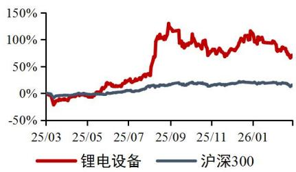

line

| Date   | 锂电设备 | 沪深300 |
|--------|----------|---------|
| 25/03  | -10%     | 0%      |
| 25/05  | 0%       | 0%      |
| 25/07  | 20%      | 0%      |
| 25/09  | 120%     | 10%     |
| 25/11  | 80%      | 15%     |
| 26/01  | 60%      | 15%     |

资料来源：常闻

首选股票

评级

# 相关报告：

分析师：

姚健

执业登记编码：S0760525040001

邮箱：yaojian@sxzq.com

杨晶晶

执业登记编码：S0760519120001

邮箱：yangjingjing@sxzq.com

# 投资要点：

 固态电池技术路线逐步聚焦。固态电解质多路线并行，硫化物成主流选择。全球固态电池研发厂商集中在中日韩及美国，硫化物技术路线占比最高。负极材料方面，硅基负极和含锂金属负极是当前固态电池的主要材料，在更高能量密度固态电池上主要选择锂金属负极。正极材料方面，目前以高镍三元为主导，未来将逐步向更高比能富锂锰基发展。

需求端：利好政策持续加码，新兴场景潜力广阔。我国围绕固态电池技术已构建起“中央政策引领—地方产业配套落地—财政金融支持”的立体化推进体系。《新型储能制造业高质量发展行动方案》明确将固态电池列为重点攻关方向，并提出到 2027年前打造 3—5 家龙头企业的目标。除新能源汽车领域的刚需外，低空经济、人形机器人等新兴场景正为全固态电池打开增量空间。

 供给端：正处于规模化量产的关键过渡期。预计全固态电池最快可于2030年实现规模化量产，硫化物电解质将成主流。综合来看，全球头部电池厂与车企已形成统一时间规划——2027年实现全固态电池小批量装车，2030年进入规模化量产阶段。EVTank预计到 2030 年全球固态电池出货量将达到614.1GWh，固态电池在整体锂电池市场的渗透率预计约为 10%。

 固态电池新工艺带来新增设备+升级改造需求。从生产制造工艺流程来看，与液态锂电池相比，全固态电池的变化集中在前段和中段，尤其在电极制备、电解质复合、防短路封装、叠片、等静压和高压化成等环节，全固态电池对设备提出了更高要求。

 设备价值量显著增加，千亿赛道有望开启。与传统液态电池相比，固态电池设备投入显著增加。液态电池单 GWh 设备成本约 1 亿元，而全固态电池单 GWh 设备价值量高达 4-5 亿元。预计到 2030年全球固态电池设备市场规模将达到 1079.4亿元。

 行业投资建议：固态电池产业正加速迈入装备竞赛的关键阶段。设备环节凭借高壁垒与不可替代性，成为率先受益且确定性最强的核心赛道。干法电极、等静压、高精度叠片等核心工艺设备是固态电池量产的关键。

 重点公司关注：建议关注布局固态电池整线设备的先导智能和利元亨，以及在特定细分领域或者关键设备上具有优势的宏工科技、联赢激光等。

风险提示：固态电池技术路线的不确定性；固态电池技术研发不及预期；固态电池扩产节奏不及预期等。

# 目录

# 1. 固态电池概述...

1.1 固态电池简介及核心优势.. 5  
1.2 固态电池的发展脉络. 6

# 2. 技术路线逐步聚焦...

2.1 固态电解质多路线并行，硫化物成主流选择.  
2.2 正负极材料发展趋势基本形成共识. . 9  
2.3 全球固态电池企业技术路线选择. . 10

# 3. 需求端：利好政策持续加码，新兴场景潜力广阔.. 12

3.1 全球政策大力支持固态电池发展. . 12  
3.2 下游应用场景多元，新兴产业激发新增长点. . 14

# 4. 供给端：正处于规模化量产的关键过渡期.. . 17

4.1 全固态电池 2030年有望量产，硫化物电解质将成主流. 17  
4.2 预计 2030 年全球固态电池出货量 614GWh. . 20

# 5. 固态电池工艺设备拆解.. . 21

5.1 新工艺带来新增设备+升级改造需求. .21  
5.2 设备环节拆解. . 22

5.2.1 前段：干法成膜工艺为核心新增环节. .22  
5.2.2 中段：叠片工艺取代卷绕，增加等静压环节. .24  
5.2.3 后段：新增高压化成分容设备. .27

5.3 设备价值量显著增加，千亿赛道有望开启. . 28

# 6. 相关公司进展：整线解决方案服务商 VS 细分环节龙头... .. 30

# 7. 投资建议.. . 32

# 8. 风险提示.. . 32

# 图表目录

图 1： 传统液态锂离子电池与全固态锂离子电池示意图...

图 2： 固态电池相对传统液态电池的比较优势.... 6

图 3： 锂电池发展史（时间轴上方）与固态锂电池发展史（时间轴下方）.

图 4： 各种固态电解质特性比较雷达图.. 8

图 5： 全固态电池技术构成.... . 8

图 6： 全球固态电池企业技术路线选择... 11

图 7： 我国主要企业全固态电池技术路线、目标能量密度及预计产业化年份... 11

图 8： 2023-2035 全球低空飞行(eVToL/UAM)市场固态电池需求预测（单位：GWh）. . 15

图 9： 亿航智能 EH216系列无人驾驶航空器（eVTOL）搭载高能量固态电池首次实现跨省飞行.. .. 16

图 10： 孚能科技自主研发的 eVTOL 动力电池解决方案具有高安全性、高能量密度等优势. .16

图 11： 众擎 T800人形机器人搭载固态动力电池，可实现 4-5小时的稳定续航.. 17

图 12： 中国全固态电池技术发展尚处于初始阶段，当前阶段面临多重挑战和问题.. .18

图 13： 2024年中国不同技术路线出货量占比.. . 19

图 14： 2030年中国硫化物电解质出货量将占到 30%..... . 19

图 15： 2024-2030 年全球固态电池出货量（单位：GWh）..... . 20

图 16： 2024-2030年全球固态电池市场规模（单位：亿元） .20

图 17： 固态电池生产制造工艺流程及设备变化... . 21

图 18： 液态电池、半固态电池、全固态电池工序及设备对比.... .22

图 19： 干法电极工艺与硫化物全固态锂电池契合度分析.... .23

图 20： 全固态电池干法制备工艺.. . 24

图 21： 全固态电池不同叠片工艺示意图.. . 25

图 22： 全球固态电池叠片机市场前 16 强生产商排名及市场占有率.... .26

图 23： 全固态电池等静压示意图：叠片后需对固-固界面进行加热、加压的优化处理... 27

图 24： 利元亨高压化成分容设备.... . 28

图 25： 固态电池设备前、中段价值量占比将显著提升.... 29

图 26： 2024-2030E 全球半固态和全固态电池设备市场规模（单位：亿元）....... .29

表 1： 固态电解质 4 种技术路线对比.... . 8

表 2： 全球主要地区固态电池技术路线代表厂商梳理.. 0

表 3： 国外固态电池产业政策趋势梳理.. . 12

表 4： 我国固态电池重大利好政策梳理. . 13

表 5： 机器人要求电池容量大、体积小、重量轻、充电快.. .16

表 6： 头部电池企业规划 2027 年实现全固态电池小批量装车，2030年以后进入规模化量产阶段... .19

表 7： 我国固态电池设备上市公司重点布局领域、核心优势与最新进展梳理. .31

# 1. 固态电池概述

# 1.1 固态电池简介及核心优势

固态电池是一种新型储能技术，其工作原理与液态锂离子电池相似。固态锂离子电池的主要材料包括正极材料、负极材料和固态电解质等，其核心在于将液态电池的电解液与隔膜替换成固态电解质，实现不用或者少用隔膜及电解液。固态电解质本身不可燃、且热分解温度高，固态特性完全避免了电解液腐蚀、挥发、漏液等问题，安全性能大幅提高。

图 1：传统液态锂离子电池与全固态锂离子电池示意图  
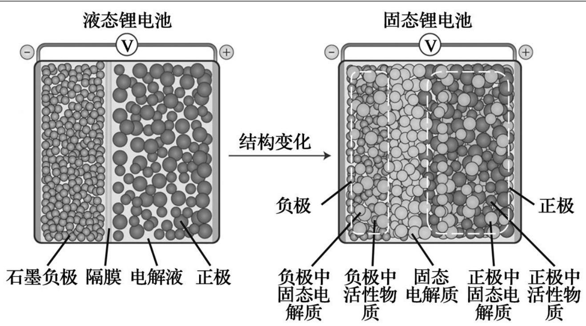

text_image

液态锂电池
V
+
结构变化
石墨负极 隔膜 电解液 正极
固态锂电池
V
+
正极
负极中固态电解质 负极中活性物质 固态电解质 正极中固态电解质 正极中活性物质

资料来源：《固态电池技术发展现状综述》，山西证券研究所

固态电池凭借高能量密度、高安全性等核心优势，已成为新能源汽车、低空飞行器、人形机器人等领域的重点发展方向。虽然液态动力电池的能量密度仍有发展空间，但运行安全性存在较大风险，其综合性能难以满足行业发展的高质量要求。相较于传统锂离子电池，固态电池具备更高能量密度（单位体积╱重量下存储更多电能）、更快的充电速度、更长的使用寿命、宽温度范围，以及更高的安全性（避免液态电解液泄漏、燃烧风险），被视为下一代电池技术的重要发展方向。但目前这项技术仍面临电解质材料成本高、界面阻抗大、规模化生产工艺不成熟等挑战。

图 2：固态电池相对传统液态电池的比较优势  
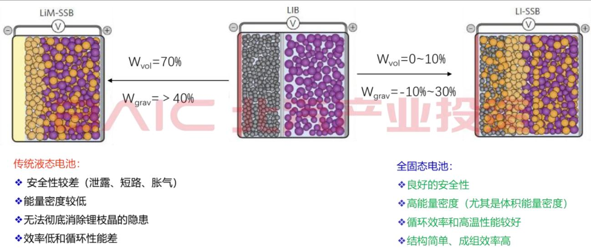

flowchart

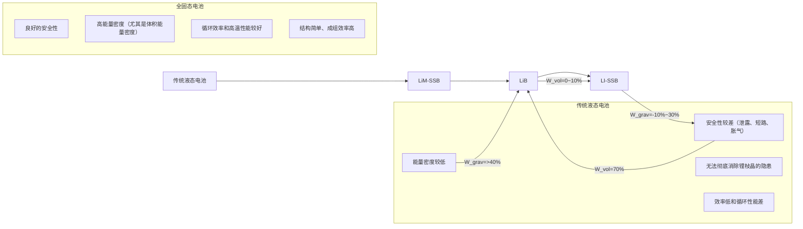
```mermaid
graph LR
    A["传统液态电池"] --> B["LiM-SSB"]
    B --> C["LiB"]
    C --> D["LI-SSB"]
    subgraph 传统液态电池
        E["安全性较差（泄露、短路、胀气）"]
        F["能量密度较低"]
        G["无法彻底消除锂枝晶的隐患"]
        H["效率低和循环性能差"]
    end

    subgraph 全固态电池
        I["良好的安全性"]
        J["高能量密度（尤其是体积能量密度）"]
        K["循环效率和高温性能较好"]
        L["结构简单、成组效率高"]
    end

    E -->|W_vol=70%| C
    F -->|W_grav=>40%| C
    C -->|W_vol=0~10%| D
    D -->|W_grav=-10%~30%| E
```

资料来源：北京汽车集团产业投资有限公司微信公众号，山西证券研究所

# 1.2 固态电池的发展脉络

固态电池的发展历程可追溯至上世纪中叶。1950 年，英国科学家发现硫化银具备较高的离子电导率，为固态电解质研究奠定基础。1969年，首款以LiI 为电解质的薄膜型全固态锂离子电池问世，但因容量低且不可充电，应用受限。1983 年，东芝公司成功开发出可使用的二次薄膜电池，有力推动了无机全固态薄膜锂电池的进一步研究。

1990 年以来，美国橡树岭国家实验室研制出锂磷氧氮（LiPON）无机固态薄膜电解质，并构建出 Li/LiPON/LiCoO₂等多种薄膜锂电池体系。该电解质循环性能优异，成为推动全固态薄膜锂电池走向商业化的重要里程碑。1993 年，索尼首次将锂离子电池商用化，开启了电池技术的新时代。2000年以来，全球各大车企与科研机构纷纷加大对固态电池的研发投入，氧化物、硫化物、聚合物等多种电解质体系相继得到开发与系统研究。

进入21 世纪，固态电解质不断取得新的研究进展，越来越多的科研机构和企业不断加大对全固态锂电池相关技术的研发力度，固态电池技术迎来多项重大突破，产业化进程显著提速。2010 年，随着日产纯电 LEAF 的问世，锂电池开始在新能源汽车领域崭露头角。随后，特斯拉 Model S 的推出，更是将锂电池在动力电池领域的应用推向了新的高度。2022 年，卫蓝新能源车规级半固态电池成功下线，电池包能量密度达 360Wh/kg；2024年，重庆太蓝新能源宣布研发出全球首款符合车规标准的全固态锂金属电池。丰田、东风、上汽等多家主流车企和电池厂商也已明确固态电池装车时间表与量产计划。

图 3：锂电池发展史（时间轴上方）与固态锂电池发展史（时间轴下方）  
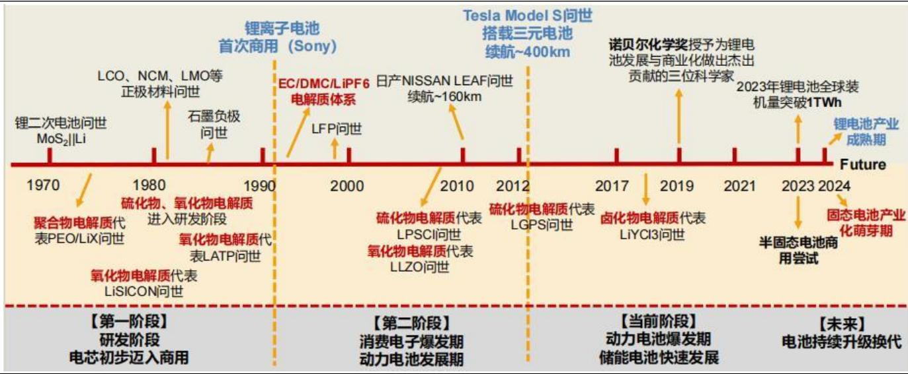

flowchart

```mermaid
graph LR
    A["1970: 锂二次电池问世 MoS₂||Li"] --> B["1980: 聚合物电解质代表PEO/LiX问世"]
    B --> C["1980: 硫化物、氧化物电解质进入研发阶段"]
    C --> D["1990: 石墨负极问世"]
    D --> E["1990: 氧化物电解质代表LATP问世"]
    E --> F["1990: 硫化物电解质体系 LFP问世"]
    F --> G["2000: EC/DMC/LiPF6 电解质体系"]
    G --> H["2000: 日产NISSAN LEAF问世 续航~160km"]
    H --> I["2010: 硫化物电解质代表 LPSCI问世"]
    I --> J["2010: 氧化物电解质代表 LLZO问世"]
    J --> K["2012: 硫化物电解质代表 LGPS问世"]
    K --> L["2012: 新建 Tesla Model S问世 搭载三元电池续航~400km"]
    L --> M["2017: 卤化物电解质代表 LiYCI3问世"]
    M --> N["2019: 诺贝尔化学奖授予为锂电池发展与商业化做出杰出贡献的三位科学家"]
    N --> O["2021: 2023年锂电池全球装机量突破1TWh"]
    O --> P["2023: 半固态电池商用尝试"]
    P --> Q["2024: 固态电池产业化萌芽期"]
    Q --> R["Future: 锂电池产业成熟期"]
    R --> S["未来: 电池持续升级换代"]
    
    style A fill:#f9f,stroke:#333
    style B fill:#f9f,stroke:#333
    style C fill:#f9f,stroke:#333
    style D fill:#f9f,stroke:#333
    style E fill:#f9f,stroke:#333
    style F fill:#f9f,stroke:#333
    style G fill:#f9f,stroke:#333
    style H fill:#f9f,stroke:#333
    style I fill:#f9f,stroke:#333
    style J fill:#f9f,stroke:#333
    style K fill:#f9f,stroke:#333
    style L fill:#f9f,stroke:#333
    style M fill:#f9f,stroke:#333
    style N fill:#f9f,stroke:#333
    style O fill:#f9f,stroke:#333
    style P fill:#f9f,stroke:#333
    style Q fill:#f9f,stroke:#333
    style R fill:#f9f,stroke:#333
```

资料来源：投中网、元禾控股研究中心，山西证券研究所

# 2. 技术路线逐步聚焦

# 2.1 固态电解质多路线并行，硫化物成主流选择

固态电解质为全固态电池的核心增量。固态电池本质上是采用固态电解质替代电解液和隔膜，从而提高电池的安全性和能量密度。固态电解质作为全固态锂电池的核心组成部分，其离子传导性能、氧化还原稳定性和机械变形性等性质将直接影响全固态电池的综合性能。

当前流行的固态电解质硫化物、卤化物、氧化物和聚合物等 4 大技术路线各有其优缺点和局限性。氧化物电解质具有较高的电化学和热稳定性，但其固有的高机械刚性导致电极与电解质之间较差的界面接触，容易在电池循环过程出现裂纹或机械失效。在半固态领域，当前较为成熟的是复合电解质（氧化物和聚合物）路线。而在真正意义上的全固态电池中，硫化物路线凭借高离子电导率、宽工作温度范围、优界面兼容性的核心优势，成为最具量产潜力的主流选择，然而其本征较差的电化学稳定性使其与高电压正极材料不兼容，而且暴露潮湿空气易产生有毒的硫化氢目气前体硫。化物固态电池设备还存在高成本与量产难的问题，主要原因在于技术路线未完全固化、专用设备与环境要求苛刻、核心设备技术壁垒高、规模效应尚未形成四大原因。相比而言，卤化物电解质一定程度结合了氧化物和硫化物离子导体材料的优势，表现出了高氧化稳定性和优异机械变形性而受到广泛关注。目前卤化物电解质面临的挑战在于其离子传导性相比硫化物和液态电解质仍有差距亟需进一步提升，在实际应用中面临更多技术和工艺挑战，目前仍处于实验室阶段。

图 4：各种固态电解质特性比较雷达图  
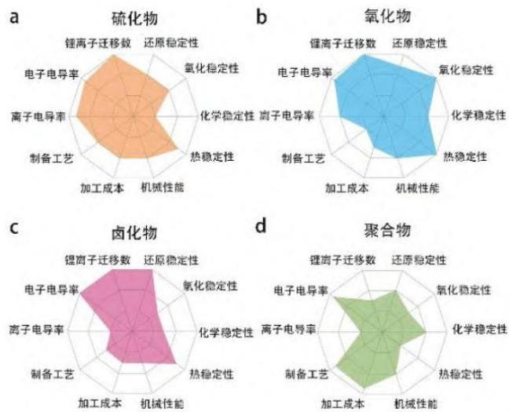

radar

| Category | 锂离子迁移数 | 还原稳定性 | 氧化稳定性 | 化学稳定性 | 热稳定性 | 加工成本 | 机械性能 |
|---|---|---|---|---|---|---|---|
| 硫化物 | 镀离子迁移数 | 还原稳定性 | 氧化稳定性 | 化学稳定性 | 热稳定性 | 加工成本 | 机械性能 |
| 氧化物 | 锂离子迁移数 | 还原稳定性 | 氧化稳定性 | 化学稳定性 | 热稳定性 | 加工成本 | 机械性能 |
| 卤化物 | 锂离子迁移数 | 还原稳定性 | 氧化稳定性 | 化学稳定性 | 热稳定性 | 加工成本 | 机械性能 |
| 聚合物 | 锂离子迁移数 | 还原稳定性 | 氧化稳定性 | 化学稳定性 | 热稳定性 | 加工成本 | 机械性能 |

资料来源：《固态锂电池研究现状与进展》，山西证券研究所

图 5：全固态电池技术构成  
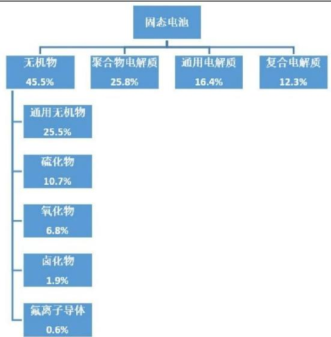

flowchart

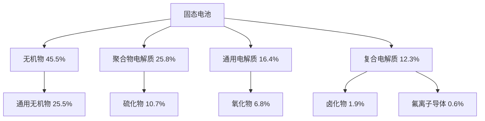
```mermaid
graph TD
    A["固态电池"] --> B["无机物 45.5%"]
    A --> C["聚合物电解质 25.8%"]
    A --> D["通用电解质 16.4%"]
    A --> E["复合电解质 12.3%"]
    B --> F["通用无机物 25.5%"]
    C --> G["硫化物 10.7%"]
    D --> H["氧化物 6.8%"]
    E --> I["卤化物 1.9%"]
    E --> J["氟离子导体 0.6%"]
```

资料来源：《全固态电池技术专利分析》，山西证券研究所

表 1：固态电解质 4 种技术路线对比

<table><tr><td>技术路线</td><td>离子电导率(S/cm)</td><td>特点</td><td>存在问题或挑战</td><td>现有发展水平</td></tr><tr><td>硫化物</td><td> $1 \times 10^{-4} \sim 1 \times 10^{-2}$ </td><td>高离子电导率、倍率性能佳、能量密度高</td><td>对水汽敏感,易氧化产生有毒气体;界面稳定性差;成本相对较高</td><td>电池原型验证、材料开发等</td></tr><tr><td>氧化物</td><td> $1 \times 10^{-5} \sim 1 \times 10^{-3}$ </td><td>耐受高电压、理论比容量高、安全性能优异</td><td>电解质陶瓷片易脆裂,界面接触差,电阻高,难以制备大容量电芯</td><td>以固液混合为重点发展方向</td></tr><tr><td>聚合物</td><td> $1 \times 10^{-7} \sim 1 \times 10^{-5}$ </td><td>电解质软、固—固界面接触好、易加工,可制备大容量电芯、循环寿命长</td><td>导电率低,工作温度较高,需要专门的热管理系统;电化学窗口窄</td><td>以固液混合为重点发展方向</td></tr><tr><td>卤化物</td><td> $1 \times 10^{-5} \sim 1 \times 10^{-3}$ </td><td>高电压稳定性、热稳定性较好</td><td>与金属锂负极不兼容、离子电导率低</td><td>实验验证阶段</td></tr></table>

资料来源：《我国固态电池产业发展思考》，山西证券研究所

历经多年多路线的并行验证，固态电池的技术路线之争逐步明朗，硫化物成为动力电池主攻方向。硫化物的电导率非常高，从发展的前景上看，仍将是主流方向。根据高工锂电的产业链反馈，硫化物路线凭借“室温离子电导率高（达10⁻ ³S/cm）、与现有锂电产业链兼容性好、能量密度潜力大（理论值500Wh/kg）”三大核心优势，已成为行业公认的主流方向。头部电池企业如宁德时代、中创新航、亿纬锂能等电解质环节明确锁定硫化物。

全球固态电池研发厂商集中在中日韩及美国，硫化物技术路线占比最高。其中，日本、韩国在全固态电池发展方面较为领先，在技术路线上更加聚焦硫化物路线的发展。欧美地区的厂商早期侧重聚合物与氧化物路线，近年来硫化物路线也成为主流。中国早期半固态电池阶段以氧化物以及氧化物+聚合物复合电解质为主要路线，全固态电池阶段则聚焦卤化物路线。

表 2：全球主要地区固态电池技术路线代表厂商梳理

<table><tr><td>技术路线</td><td>中国</td><td>日韩</td><td>美国</td><td>欧洲</td></tr><tr><td>聚合物</td><td>欣旺达、派能科技、蔚蓝锂芯、北京纯锂新能源、万向一二三、浙江金羽、中固时代、深蓝汇泽、领新新能源、东驰新能源、合源锂创、久森安高等</td><td>LG新能源(半固态)</td><td>Microvast、SES、Solidion Technology、Ionic Materials</td><td>博洛雷、Ensurge Micropower</td></tr><tr><td>氧化物</td><td>复合电解质:卫蓝新能源、清陶能源、国轩高科、蜂巢能源、赣锋锂业、太蓝新能源、天能股份、安瓦新能源、北京固芯、深圳比克等单一电解质:辉能科技、正力新能、瑞浦兰钧、鹏辉能源、珠海冠宇、耀宁新能源、金龙羽、南都电源、欣界能源等</td><td>富士电气、三星电机、IL Science</td><td>Ouantum Scape</td><td>Ilika、ITEN</td></tr><tr><td>硫化物</td><td>宁德时代、卫蓝新能源、孚能科技、比亚迪、国轩高科、亿纬锂能、蜂巢能源、中创新航、欣旺达、正力新能、上海屹锂、蔚蓝锂芯、珠海冠宇、耀宁新能源、金龙羽、安瓦新能源、恩力动力、万向一二三、赛科动力、中科固能、浙江金羽、中固时代、复阳固态、马车动力、久森安高、中科源本、成科国重、北京固芯等</td><td>日本:丰田、松下、本田、日产、三菱化学集团、日立麦克赛尔、Kanadevia、三洋化成工业韩国:LG新能源、SK On、三星SDI、Athena</td><td>Solid Power、Factorial Energy、Adden Energy、24M Technologies</td><td>OSO AVESTA</td></tr><tr><td>卤化物</td><td>宁德时代、比亚迪、清陶能源、亿纬锂能等</td><td>松下</td><td></td><td></td></tr></table>

资料来源：深企投产业研究院微信公众号，山西证券研究所

# 2.2 正负极材料发展趋势基本形成共识

正极材料：目前以高镍三元为主导，未来将逐步向更高比能的富锂锰基发展。正极材料方面，短期内在沿用现有高镍三元/铁锂体系的同时，通过单晶化、氧化物包裹、金属掺杂等手段，进一步提升电池能量密度。在固态电池各项技术逐渐成熟后，正极材料预计向以富锂锰基为代表的新型体系迭代。相对于高镍三元材料，富锂锰基材料具有更高的电压平台和克容量，更适用于固态电池。同时，富锂锰基材料以锰元素为主，贵金属含量少，成本更低且安全性更好。

国内多家正极材料企业已实现富锂锰基材料的小批量出货，产业化进展有望持续推进。其中，容百科技高镍及超高镍全固态正极材料均已实现吨级出货，客户端测评可满足 400Wh/kg电芯开发需求，同时已针对全固态电池开发高能量密度富锂锰基材料，已有百公斤级出货，并拿到批量订单。当升科技全固态电池专用钴酸锂、富锂锰基正极材料成功卡位比亚迪、一汽、中科固能等国内顶级车企和电池客户。厦钨新能匹配氧化物路线固态电池的正极材料已实现供货，同时在硫线化固物态路电池正极材料领域与下游客户在技术研发上保持密切交流合作。

负极材料：预计将从当下的石墨负极过渡到硅碳负极，最后到金属锂负极。负极材料方面，随着石墨负极接近理论比容量，为进一步提高固态电池能量密度，负极材料将向高比容量方向迭代，中短期将发展以硅碳、硅氧为代表的硅基负极，应用于半固态及准固态电池体系；长期有望切换至锂金属负极。目前，美国、日本等固态电池领先企业均已布局锂金属负极，但由于其安全性与稳定性等问题尚未完全解决，距离稳定量产尚需时日。

负极材料方面，杉杉股份已开发针对固态电池用的石墨产品和硅碳产品，并已在客户处进行多轮测试。贝特瑞开发了行业内首款匹配全固态电池的锂碳复合负极材料，具备低体积膨胀、长循环寿命等特点，已获客户技术认可。中科电气针对固态电池已布局了硅碳负极、锂金属负极等产品，其中硅碳负极已建设完成中试产线，且有产品进入多家客户测评和平台开发阶段。

# 2.3 全球固态电池企业技术路线选择

全球固态电池企业布局呈现百花齐放的格局。根据 EVTank，在电解质选择方面，硫化物技术仍是更多企业（38%）的远期路线选择，其次为氧化物路线（含复合路线）占37%。负极材料方面，硅基负极和含锂金属负极是当前固态电池的主要材料，在更高能量密度固态电池上主要选择锂金属负极。正极材料方面，目前以高镍三元为主导，未来将逐步向更高比能富锂锰基发展。

图 6：全球固态电池企业技术路线选择  
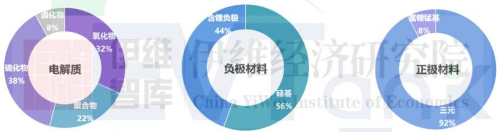

pie

| 材料类型 | 占比 (%) |
| :--- | :--- |
| 电解质 | 32 |
| 硫化物 | 38 |
| 聚合物 | 22 |
| 含锂负极 | 44 |
| 负极材料 | 56 |
| 正极材料 | 92 |

资料来源：EVTank 微信公众号、《中国固态电池行业发展白皮书（2025 年）》，山西证券研究所

我国企业全固态电池技术路线主要目标能量密度为 400W-h/kg，其中硫化物为主流量产趋势，正极沿用高镍三元材料，负极可选硅碳/锂金属。国内头部电池企业如宁德时代、中创新航、亿纬锂能等均已冻结全固态电池技术路线，电解质环节明确锁定硫化物，正极材料则采用“短期高镍三元过渡、远期富锂锰基升级”的阶梯式方案。

图 7：我国主要企业全固态电池技术路线、目标能量密度及预计产业化年份

<table><tr><td rowspan="2">公司</td><td colspan="3">技术路线</td><td rowspan="2">目标能量密度/(W·h·kg-1)</td><td rowspan="2">预计产业化年份</td></tr><tr><td>正极</td><td>负极</td><td>主体电解质</td></tr><tr><td>宁德时代</td><td>高镍三元</td><td>锂金属/硅碳负极</td><td>硫化物</td><td>400</td><td>2027</td></tr><tr><td>比亚迪</td><td>高镍三元</td><td>硅碳负极</td><td>卤化物/硫化物</td><td>400</td><td>2027</td></tr><tr><td>一汽</td><td>高镍三元</td><td>硅碳负极</td><td>硫化物</td><td>400</td><td>2027</td></tr><tr><td>卫蓝科技</td><td>高镍三元</td><td>硅碳负极</td><td>聚合物/氧化物/硫化物</td><td>400</td><td>2027</td></tr><tr><td>国轩高科</td><td>高镍三元</td><td>硅碳负极</td><td>硫化物</td><td>350</td><td>2027—2030</td></tr><tr><td>上汽/清陶能源</td><td>锰基正极</td><td>锂金属/硅碳负极</td><td>聚合物/氧化物/卤化物</td><td>400</td><td>2026</td></tr><tr><td>亿纬锂能</td><td>高镍三元</td><td>硅碳负极</td><td>硫化物/卤化物/聚合物</td><td>400</td><td>2028</td></tr><tr><td>吉利</td><td>高镍三元</td><td>硅碳负极</td><td>聚合物/硫化物</td><td>400</td><td>2027</td></tr><tr><td>中创新航</td><td>高镍三元</td><td>硅碳负极</td><td>硫化物</td><td>430</td><td>2027—2028</td></tr><tr><td>孚能科技</td><td>高镍三元</td><td>硅碳负极</td><td>硫化物</td><td>400</td><td>2032</td></tr><tr><td>恩力动力</td><td>高镍三元</td><td>锂金属负极</td><td>硫化物</td><td>400</td><td>2026</td></tr><tr><td>上海屹锂</td><td>高镍三元</td><td>锂金属负极</td><td>硫化物</td><td>450</td><td>2026</td></tr><tr><td>赛科动力</td><td>高镍三元</td><td>硅碳负极</td><td>硫化物</td><td>400</td><td>2027—2028</td></tr><tr><td>高能时代</td><td>高镍三元</td><td>硅碳负极/石墨负极</td><td>硫化物</td><td>220/420</td><td></td></tr><tr><td>潍柴动力</td><td>高镍三元</td><td>硅碳负极</td><td>硫化物</td><td>400</td><td>2027</td></tr><tr><td>长安汽车</td><td>高镍三元</td><td>硅碳负极</td><td>硫化物</td><td>400</td><td>2027</td></tr></table>

资料来源：《2025年我国锂离子电池产业发展形势》，山西证券研究所

# 3. 需求端：利好政策持续加码，新兴场景潜力广阔

# 3.1 全球政策大力支持固态电池发展

美国、欧盟、日本等海外地区大力支持固态电池产业发展。早在 2018 年，欧盟与日本就已发布相关政策，欧盟发布《电池 2030+》，日本发布《日本汽车电动化的基本政策和具体行动》，对产业做出发展规划。目前，美国 “Battery 500”计划、日本“RISING”计划、欧盟“Battery2030+”计划均聚焦固态电池研发，其中全固态锂金属电池因其在能量密度提升与安全性方面展现出的巨大潜力而备受瞩目。

表 3：国外固态电池产业政策趋势梳理

<table><tr><td>国家/区域</td><td>政策特点</td><td>主要内容</td></tr><tr><td>美国</td><td>产学研协同模式</td><td>能源部通过 Battery500 Consortium 联盟投入 2.09 亿美元,联合太平洋西北国家实验室等机构攻关硫化物电解质,要求 2030 年成本降至$100/KWh 以下,并且配套提供 30%税收抵免</td></tr><tr><td>欧盟</td><td>全产业链扶持</td><td>批准 32 亿欧元&#x27;欧洲电池创新项目&quot;,重点支持法国 Bollore 集团聚合物固态电池量产,德国巴斯夫主导的氧化物电解质供应链建设,要求 2030 年本土产能覆盖欧盟电动车需求的 40%</td></tr><tr><td>日韩</td><td>技术联盟战略</td><td>日本经济产业省发布《电池产业战略》,联合丰田、松下等 23 家企业成立“锂电材料评价研究中心”,计划 2028 年实现硫化物全固态电池装车;韩国 SK On 联合首尔大学开发卤化物电解质,获政府研发补贴超 3 亿美元</td></tr></table>

资料来源：起点研究院，山西证券研究所

我国围绕固态电池技术已构建起“中央政策引领—地方产业配套落地—财政金融支持”的立体化推进体系。近年来，我国有关固态电池产业的利好政策频频发布，固态电池上升为国家重点攻关方向。

中央层面：通过标准制定、补贴支持、产业布局等措施，推动固态电池技术的研发、产业化和应用。2020年 10月，国务院通过了《新能源汽车产业发展规划（2021—2035年）》这一里程碑式文件，首次将固态电池明确为新能源汽车产业的重点发展方向。2025 年 2 月，工信部等八部门联合印发《新型储能制造业高质量发展行动方案》，明确将固态电池列为重点攻关方向，并提出到 2027年前打造3—5家龙头企业的目标。

2025年9月，工信部、国家市场监督管理总局联合印发的《电子信息制造业2025—2026年稳增长行动方案》明确指出，通过国家重点研发计划相关领域重点专项，持续支持全固态电池等前沿技术方向的基础研究；工信部等八部门联合印发《有色金属行业稳增长工作方案（2025—2026年）》，明确加快全固态电池材料等高端产品应用验证，从国家战略高度明确发展路径。

2025年12月，全国汽车标准化技术委员会发布《电动汽车用固态电池第 1部分：术语和分类》（征求意见稿）。作为全球首部电动汽车用固态电池国家标准草案，其不仅明确了固态电池的技术术语与分类体系，更标志着我国固态电池技术正式迈入产业化落地的关键阶段。

表 4：我国固态电池重大利好政策梳理

<table><tr><td>发布时间</td><td>发布单位</td><td>文件名称</td><td>主要内容</td></tr><tr><td>2020年10月</td><td>国务院办公厅</td><td>《新能源汽车产业发展规划(2021—2035年)》</td><td>首次明确将固态电池列为重点攻关技术,提出到2030年实现能量密度500Wh/kg的目标</td></tr><tr><td>2023年1月</td><td>工信部等六部门</td><td>《关于推动能源电子产业发展的指导意见》</td><td>加强固态电池标准研究体系,推动新型储能电池产业化技术攻关</td></tr><tr><td>2024年4月</td><td>工信部等七部门</td><td>《推动工业领域设备更新实施方案》</td><td>鼓励固态电池在工业领域的应用</td></tr><tr><td>2024年6月</td><td>工信部</td><td>《汽车标准化工作要点》</td><td>明确提出围绕固态电池等前瞻研究相应标准子体系,支撑新技术、新业态、新模式创新发展</td></tr><tr><td>2025年2月</td><td>工信部等八部门</td><td>《新型储能制造业高质量发展行动方案》</td><td>将固态电池列为重点攻关方向,支持锂钠电池向固态化发展,提出2027年前打造3-5家全球龙头企业</td></tr><tr><td>2025年4月</td><td>工信部</td><td>《2025年汽车标准化工作要点》</td><td>提出加快全固态电池、动力电池在役检测、动力电池标识标签等标准研制,优化动力电池性能要求</td></tr><tr><td>2025年4月</td><td>工信部科技司</td><td>《2025年工业和信息化标准工作要点》</td><td>提出建立健全全固态电池标准体系,以高水平标准建设服务行业高质量发展</td></tr><tr><td>2025年9月</td><td>工信部、国家市场监督管理总局</td><td>《电子信息制造业2025—2026年稳增长行动方案》</td><td>通过国家重点研发计划相关领域重点专项,持续支持全固态电池等前沿技术方向的基础研究</td></tr><tr><td>2025年9月</td><td>工信部等八部门</td><td>《有色金属行业稳增长工作方案(2025—2026年)》</td><td>明确加快全固态电池材料等高端产品应用验证</td></tr><tr><td>2025年12月</td><td>全国汽车标准化技术委员会</td><td>《电动汽车用固态电池第1部分:术语和分类》(征求意见稿)</td><td>作为全球首部电动汽车用固态电池国家标准草案,明确了固态电池的技术术语与分类体系</td></tr></table>

资料来源：新华网、人民日报海外版、起点研究院、中华网、证券时报、央广网、驱动中国，山西证券研究所

地方层面：深圳、上海等地积极跟进，出台专项产业行动方案，通过培育区域产业集群、提供税收优惠、设立研发专项等多元化举措，加速形成有利于固态电池技术孵化与产业集聚的良好生态。工信部在《先进动力电池创新发展行动计划（2025-2030）》中明确，对固态电池中试线给予 30%的设备购置补贴。长三角、珠三角等地也推出了“固态电池示范运营项目”，车企搭载国产半固态电池的车型可获补贴。

财政与金融支持：2024年，我国工信部重大研发专项投资 60亿元，包括宁德时代、比亚迪、一汽、上汽、卫蓝新能源和吉利共六家企业或获得政府基础研发支持，从资金层面支持电池企业与车企共同承担固态电池研发项目，此外支持知识产权体系构建和表征体系的构建，目标为 2027年单项目实现1000辆示范性装车应用，推动我国全固态电池产业发展提速。该专项项目于 2025年11月迎来中期审查，通过审查的项目将获得后续拨款，第二轮补贴申报窗口也有望同步启动，中期审查有助于根据头部企业进展尽早确定设备的技术方案。

2025 年以来，以政府引导基金、产业资本为代表的耐心资本开始主导早期投资。国家制造业转型升级基金定向投资固态电池项目，2023年设立50亿元专项贷款贴息计划，优先支持氧化物电解质、硫化物电解质等关键材料量产技术突破。

# 3.2 下游应用场景多元，新兴产业激发新增长点

固态电池应用从单一领域向多元场景拓展。除新能源汽车领域的刚需外，低空经济、人形机器人等新兴场景正为全固态电池打开增量空间。由于高能量密度、高安全性和长使用寿命，固态电池被应用在新能源汽车（高端乘用车、长途重卡等）、低空经济（无人机、电动垂直起降飞行器 (eVTOL)）、人形机器人、大规模储能以及军工航天、外骨骼等特种领域。根据前瞻产业研究院，在新能源汽车领域，预计到 2030年固态电池渗透率将达到 10%；未来储能领域固态电池渗透率也会呈现上升趋势，但是速度会相对较缓慢，到2030年渗透率将达到1.5%。

固态/半固态电池具备多重优势，在 eVTOL领域的应用前景广阔。固态电池技术以其高能量密度、出色的安全性和宽温度范围工作能力，为电动垂直起降飞行器提供了更长的续航能力和更高的安全保障。固态电池的能量密度可达 400-500Wh/kg，远超现有锂电技术，同时其固态电解质显著降低了过热和着火风险。在极端气候条件下，固态电池的可靠性保证了 eVTOL的稳定性。CIBF2025 发布的《低空飞行器电池标准化白皮书》指出，eVTOL电池需满足能量密度≥400Wh/kg，固态电池凭借安全、轻量、高倍率等特性成为优选。

eVTOL（电动垂直起降飞行器）的爆发为固态电池开辟了高价值增量市场。低空经济产业在《通用航空装备创新应用实施方案（2024-2030 年）》等政策推动下迅速发展，其对电池能量密度和安全性也提出了更高要求。根据TrendForce 集邦咨询预测，全球低空飞行市场对固态电池的需求将于 2030年达到86 GWh，2035 年将进一步增至 302GWh，驱动固态电池进入需求爆发期。

图 8：2023-2035 全球低空飞行(eVToL/UAM)市场固态电池需求预测（单位：GWh）  
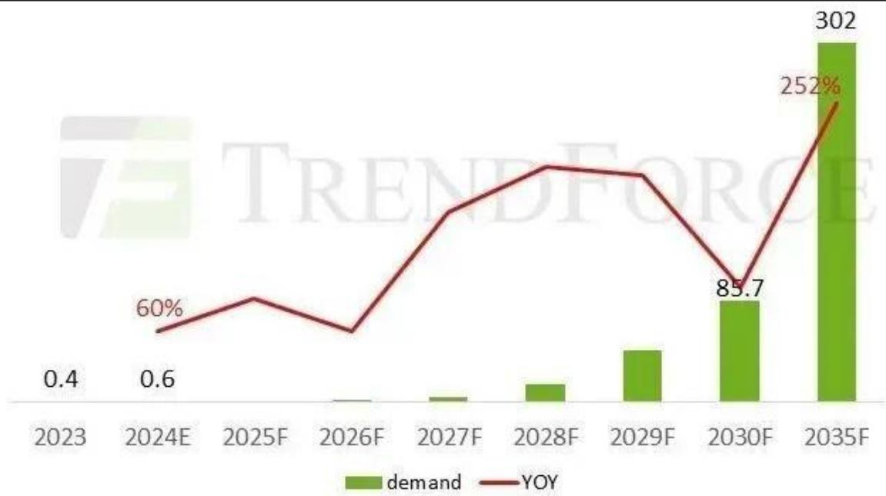

bar_line

| Year | demand | YOY (%) |
| :--- | :--- | :--- |
| 2023 | 0.4 | |
| 2024E | 0.6 | 60 |
| 2025F | | |
| 2026F | | |
| 2027F | | |
| 2028F | | |
| 2029F | | |
| 2030F | 85.7 | |
| 2035F | 302 | 252 |

资料来源：深圳市电池行业协会微信公众号、TrendForce集邦咨询，山西证券研究所

目前，国内宁德时代、孚能科技、正力新能、国轩高科、中创新航、力神等锂电池企业已经开展了航空级电池的技术攻关，且部分企业已经推出了航空级电池产品，其中宁德时代凝聚态电池能量密度已突破 500Wh/kg，并计划于2027年量产。

2025年1月，湖南久森安高举行了无人机固态电池量产下线仪式；5月，金龙羽新能源与客户签订无人机用高能量密度固态电芯采购合同；6月，合源锂创实现高性能无人机固态电池的批量交付；7月，孚能科技斩获 10亿美元eVTOL订单，独家提供半固态电池配套。这些事件标志着固态电池在空中出行与无人机应用上的产业化进程进一步加速。

图 9：亿航智能 EH216 系列无人驾驶航 空器（eVTOL）搭载高能量固态电池首次实现跨省飞行  
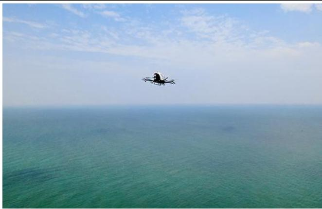

natural_image

Aerial view of a person flying over the ocean under a partly cloudy sky (no text or symbols visible)

资料来源：亿航智能公司官网，山西证券研究所

图 10：孚能科技自主研发的 eVTOL 动力电池解决方案具有高安全性、高能量密度等优势  

natural_image

Futuristic aerial drone flying above a helicopter helipad with a marked number 1 (no text or symbols on the drone or helicopter)

资料来源：孚能科技微信公众号，山西证券研究所

人形机器人对锂电池提出更为严苛的性能要求，固态电池应用潜力广阔。人形机器人对锂电池有着更高的性能要求：（1）高能量密度：因其本体空间有限和对工作时长及效率的需求，对锂电池能量密度有更高的要求（向 300Wh/kg 以上发展）；（2）高倍率性能：工业场景对瞬时放电的要求，需要锂电池有高放电倍率（≥2C）；（3）快充性能：各作业场景期望减少“停工”时长，提高生产效率，对锂电池有快充性能的需求；（4）安全性能和宽温性能：人形机器人对安全的需求较高，另外由于特殊场景如救援、探索等对工作温域的需求较高。因此，固态电池更加符合人形机器人的需求，但由于全固态技术尚不成熟，行业目前更多仍以高端液态或半固态进行测试试验，未来再逐步向全固态过渡。

表 5：机器人要求电池容量大、体积小、重量轻、充电快

<table><tr><td>性能要求</td><td>电池进展</td><td>具体参数</td></tr><tr><td>大电池容量</td><td>整体上要求充电续航能够达到2小时及以上,其中服务型机器人对续航要求较高</td><td>巡逻:电池容量需求6-10Ah 预期运行2-4小时运输:电池容量需求12-15Ah 预期运行4-6小时服务:电池容量需求20-30Ah 预期运行9-12小时</td></tr><tr><td>轻量化</td><td>整体上要求轻量化设计,人形机器人电池重量的容忍度相对较高</td><td>四足机器狗:体积要求 $1000-2500cm^{3}$  重量要求2-3kg人形机器人:体积要求 $2500-6000cm^{3}$  重量要求3-6kg</td></tr><tr><td>具有快充能力</td><td>基本均要求3C及以上充电倍率,1-3小时内能够充满</td><td>优必选 WalkerX3C 充电倍率 充电2h宇树 GO23C 充电倍率 充电1.5h</td></tr></table>

资料来源：亿欧智库、世界电池及储能产业博览会暨亚太电池展微信公众号，山西证券研究所

EVTank预计 2025年人形机器人用锂电池的市场规模将超过 1亿元。随着人形机器人在工业领域、服务和家庭领域等多场景应用的加深，2035 年将同步带动人形机器人用锂电池出货量达到 72GWh，市场规模达到 360亿元。

截至目前，已有多家锂电产业链企业涉足人形机器人领域，且多以固态电池技术切入。例如，孚能科技生产的软包电池具备高能量密度、高安全性、轻量化等优势，与人形机器人的需求高度契合。2025年，孚能科技已完成向某头部人形机器人客户送样硫化物全固态电池。

图 11：众擎 T800 人形机器人搭载固态动力电池，可实现 4-5 小时的稳定续航  
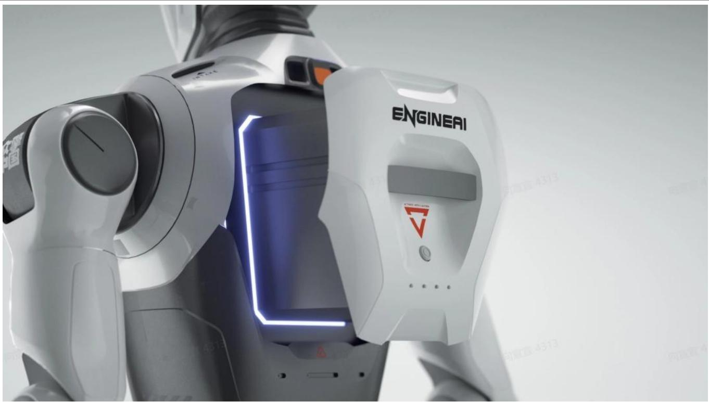

natural_image

Exterior view of a white EngineAI robotic device with glowing blue light and control panel (no readable text or symbols)

资料来源：IT 之家，山西证券研究所

# 4. 供给端：正处于规模化量产的关键过渡期

# 4.1 全固态电池 2030年有望量产，硫化物电解质将成主流

固态电池目前处于科学突破的阶段，仍面临多重制约因素。全固态技电术池方在面主要需要解决材料性能和界面接触问题，在生产制造方面主要需要解决工艺不成熟、制造设备和产业链不完善的问题。

从技术维度来看，固态电解质离子输运迟缓、充放电体积膨胀、固-固界面阻抗大及锂枝晶生长等核心问题，严重阻碍电池性能提升与产业化步伐，同时产业链上下游在材料适配、设备标准化及测试规范等方面亦存在诸多短板，亟待协同攻克。

从成本端来看，受固态电解质、电极材料及生产工艺等因素制约，固态电池成本显著高于传统锂离子电池，且产品良率尚待提升，规模效应难以施展。

图 12：中国全固态电池技术发展尚处于初始阶段，当前阶段面临多重挑战和问题  
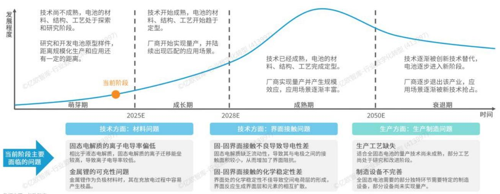

flowchart

```mermaid
graph LR
    A["萌芽期"] --> B["当前阶段"]
    B --> C["成熟期"]
    C --> D["衰退期"]

    subgraph 技术方面：材料问题
        E["固态电解质的离子电导率偏低<br>相比于液态电解质，固态电解质的离子迁移能垒较高，导致离子电导率较低。"]
        F["金属锂的可充性问题<br>金属锂作为负极材料时，其在充放电过程中容易产生枝晶。"]
    end

    subgraph 技术方面：界面接触问题
        G["固-固界面接触不良导致导电性差<br>固态电解质缺乏流动性，导致其与电极之间的接触面积较小，从而增加了界面阻抗。"]
        H["固-固界面接触的化学稳定性差<br>界面处的化学稳定性不佳导致空间电荷层的形成，界面反应生成界面层和元素的相互扩散。"]
    end

    subgraph 生产方面：生产制造问题
        I["生产工艺缺失<br>适合全固态电池的量产技术尚未成熟，部分工艺尚处于研究和改进阶段。"]
        J["制造设备不完善<br>全固态电池需要的部分独特环节需要特定的制造设备，部分设备尚未实现量产。"]
    end

    A -->|萌芽期| B
    B -->|成长期| C
    C -->|成熟期| D
    D -->|衰退期| E
    E -->|当前阶段主要面临的问题|
```

资料来源：亿欧智库、世界电池及储能产业博览会暨亚太电池展微信公众号，山西证券研究所

固态电池技术正处于从实验室走向规模化商业应用的关键过渡期。根据高工锂电统计，2025 年中国固态电池新增规划项目约 60个，规划产能189GWh。根据TrendForce 集邦咨询统计，全球已有近百家企业规划固态电池产能，其中，含半固态电池在内的部分产能已率先量产，目前扩大至 GWh级。全固态电池则进入百MWh级小规模试产的验证和制程优化阶段。

预计全固态电池最快可于 2030年实现规模化量产。在国际上，韩国目标在 2028年实现氧化物-聚合物复合全固态电池的商业化，而日本的丰田和日产明确了其硫化物全固态电池的量产时间表，将在 2026-2028 年实现产业化，美国企业如 QuantumScape、Solid Power 已向企交付全固态电池样品，目标在未来两年实现小批量量产。综合来看，全球头部电池厂与车企已形成统一时间规划——2027年实现全固态电池小批量装车，2030年进入规模化量产阶段。根据中国科学院院士欧阳明高预测，第1代全固态电池（能量密度250\~300Wh/kg）有望在2025-2027年实现量产，而第 2 代高能量密度全固态电池产品（能量密度 400\~500 Wh/kg）预计将在2027-2030 年完成技术突破，为全固态电池行业发展提供了清晰路线图。

表 6：头部电池企业规划 2027年实现全固态电池小批量装车，2030年以后进入规模化量产阶段

<table><tr><td>企业</td><td>电池进展</td><td>量产计划</td></tr><tr><td>宁德时代</td><td>500Wh/kg,硫化物</td><td>2027年小规模生产</td></tr><tr><td>比亚迪</td><td>400Wh/kg</td><td>2027年示范,2030年大规模</td></tr><tr><td>中创新航</td><td>430Wh/kg,容量50Ah</td><td>2027年小批量</td></tr><tr><td>亿纬锂能</td><td>400Wh/kg,硫化/卤化/聚合</td><td>2028年推出</td></tr><tr><td>国轩高科</td><td>硫化物,350 Wh/kg</td><td>2027-2030年推出</td></tr><tr><td>欣旺达</td><td>第4代锂金属负极全固态电池</td><td>2026年商业化量产</td></tr><tr><td>上汽/清陶能源</td><td>400Wh/kg,硫化/卤化/聚合</td><td>2026年量产</td></tr><tr><td>太蓝新能源</td><td>720Wh/kg,氧化物复合电解质</td><td>2027年批量生产</td></tr><tr><td>卫蓝科技</td><td>400Wh/kg,硫化/卤化/聚合</td><td>2027年量产</td></tr><tr><td>松下</td><td>硫化物,450Wh/kg</td><td>2029年前量产</td></tr><tr><td>三星SDI</td><td>600Wh/kg</td><td>2027年量产</td></tr><tr><td>SK On</td><td>混合固体电解质</td><td>2028年商业化</td></tr><tr><td>LG新能源</td><td>锂硫全固态电池</td><td>2030年量产</td></tr></table>

资料来源：高工锂电微信公众号，山西证券研究所

从目前产业趋势来看，氧化物半固态或者类固态电池预计会率先放量，而硫化物的全固态电池也将会随着技术瓶颈的突破和规模化成本的下降随后放量。根据高工锂电《2025 中国固态锂电池产业链发展蓝皮书》，当前已经量产的车规级固态电池技术路线主要为复合电解质及少部分聚合物电解质体系，硫化物车规级全固态电池预计2027年后有望实现小批量装车。

图 13：2024年中国不同技术路线出货量占比  
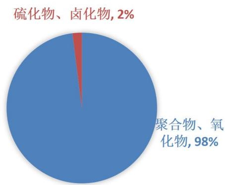

pie

| 类别 | 占比 (%) |
|---|---|
| 硫化物、卤化物 | 2 |
| 聚合物、氧化物 | 98 |

资料来源：EVTank 微信公众号、《中国固态电池行业发展白皮书（2025 年）》，山西证券研究所

图 14：2030 年中国硫化物电解质出货量将占到30%  
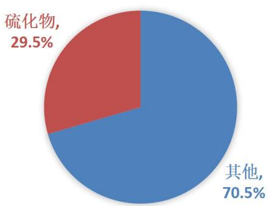

pie

| 类别 | 占比 (%) |
|---|---|
| 硫化物 | 29.5 |
| 其他 | 70.5 |

资料来源：EVTank 微信公众号、《中国固态电池行业发展白皮书（2025 年）》，山西证券研究所

根据EVTank，2024年中国聚合物和氧化物电解质出货量占比超过98%，少量使用硫化物和卤化物。预计随着全固态电池的逐步产业化，硫化物电解质的出货量占比会逐步提升，预计到 2030年，硫化物电解质的总体出货量占比将达到 29.5%，其中在全固态电池电解质中，硫化物电解质的市场份额将达到 65%。

# 4.2 预计 2030年全球固态电池出货量 614GWh

根据EVTank数据显示，2024年全球固态电池出货量达到 5.3GWh，同比大幅增长 4.3倍，全部为半固态电池，主要为中国企业生产。预计全固态电池将在2027年实现小规模量产，到2030 年将实现较大规模的出货。在电动汽车、固定式储能、消费电子、人形机器人、eVTOL/UAM、工业用途等对高能量密度或高可靠性应用需求的推动下，预计到 2030年全球固态电池出货量将达到 614.1GWh，固态电池在整体锂电池市场的渗透率预计约为 10%。

根据前瞻产业研究院《2025 年固态电池高质量发展蓝皮书》显示，2024 年全球固态电池市场规模为 20 亿元，预计到 2030 年，固态电池市场规模将达到 1163 亿元，其中，全固态电池市场规模将达到 172亿元。

图 15：2024-2030 年全球固态电池出货量（单位：GWh）  
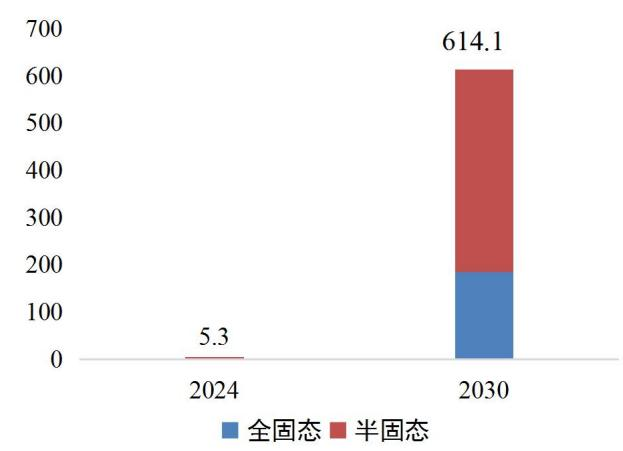

bar_stacked

| Year | 全固态 | 半固态 |
|---|---|---|
| 2024 | 0 | 5.3 |
| 2030 | 180 | 464.1 |
| Total | 0 | 614.1 |

资料来源：EVTank 微信公众号、《中国固态电池行业发展白皮书（2025 年）》，山西证券研究所

图 16：2024-2030年全球固态电池市场规模（单位：亿元）  
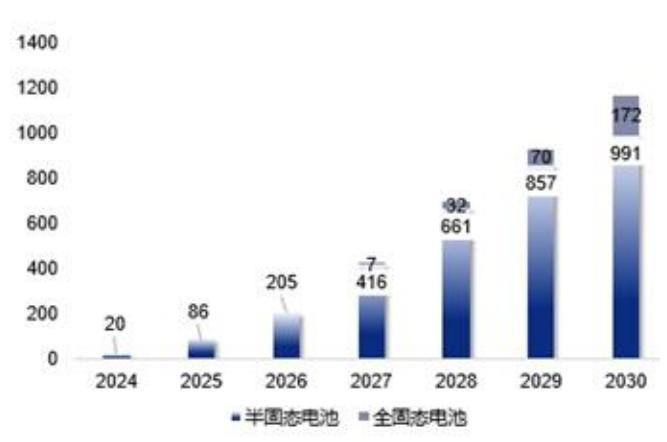

bar

| 年份 | 半固态电池 | 全固态电池 |
|---|---|---|
| 2024 | 20 | |
| 2025 | 86 | |
| 2026 | 205 | |
| 2027 | 416 | -7 |
| 2028 | 661 | 92 |
| 2029 | 857 | 70 |
| 2030 | 991 | 172 |

资料来源：前瞻经济学人微信公众号、中国电池产业研究院、SNE Research、动力电池联盟、前瞻产业研究院，山西证券研究所

# 5. 固态电池工艺设备拆解

# 5.1 新工艺带来新增设备+升级改造需求

从生产制造工艺流程来看，与液态锂电池相比，全固态电池的变化集中在前段和中段。全固态电池在制造工艺上与传统液态电池、半固态电池存在显著差异，尤其在电极制备、电解质复合、防短路封装、叠片、等静压和高压化成等环节，全固态电池对设备提出了更高要求。其中，固体电解质的成膜工艺根据是否采用溶剂分为湿法工艺和干法工艺；全固态电池装配工艺主要包括组装和堆叠、致密化，正极、固体电解质膜和负极的堆叠，叠片后需对全固态电池的固-固界面进行加热、加化压处的理优。

图 17：固态电池生产制造工艺流程及设备变化  
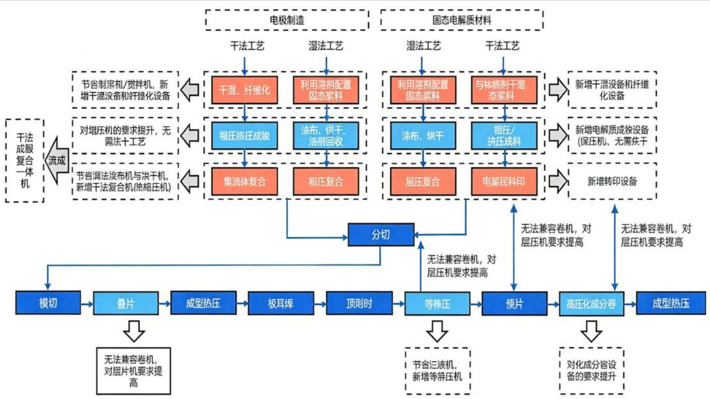

flowchart

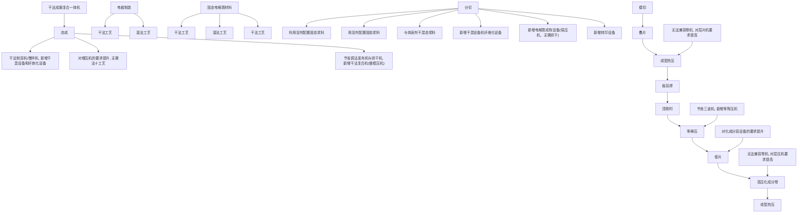
```mermaid
graph TD
    A["干法成服复合一体机"] --> B["流成"]
    B --> C["干法制溶机/搅拌机, 新增干混设备和纤炼化设备"]
    B --> D["对增压机的要求提升, 无需法十工艺"]
    B --> E["节省调法发布机与烘干机, 新增干法复合机(做辊压机)"]
    F["电极制造"] --> G["干法工艺"]
    F --> H["湿法工艺"]
    I["固态电解质材料"] --> J["干法工艺"]
    I --> K["湿法工艺"]
    I --> L["干法工艺"]
    M["分切"] --> N["利用溶剂配置固态浆料"]
    M --> O["用溶剂配置固态浆料"]
    M --> P["与体液剂干混态浆料"]
    M --> Q["新增干混设备机纤维化设备"]
    M --> R["新增电解质成牧设备(保压机、无需烘干)"]
    M --> S["新增转印设备"]
    T["模切"] --> U["叠片"]
    U --> V["成型热压"]
    V --> W["板耳焊"]
    W --> X["顶刚时"]
    X --> Y["等棒压"]
    Y --> Z["使片"]
    Z --> AA["高压化成分卷"]
    AA --> AB["成型热压"]
    AC["无法兼容卷机, 对层片机要求提高"] --> V
    AD["节舍三波机, 新增等筛压机"] --> Y
    AE["对化成分容设备的要求提升"] --> Z
    AF["无法兼容卷机, 对层压机要求提高"] --> AA
```

资料来源：翟喜民等《全固态电池生产工艺分析》、深企投研究微信公众号，山西证券研究所

先导智能预计，固态电池产线的整体更新幅度达 80%至 90%，和传统液态电池近乎形成两条完全不同的生产路径，且未来全固态电池生产线大概率需要达到现有半导体设备级别的洁净度与密封标准。固态电池设备需要更高精度的堆叠式叠片机、高压封装设备（等静压设备）、高压化成分容夹具等，以达到提升电池循环性能与倍率性能的核心目的。此外，固态电解质天然易碎也更易产生粉尘，对生产配套工具提出了定制化要求，不但需要全流程高精度抓取与极平稳流转设备，还必须构建高等级空气隔绝系统与严格的安全管控体系。

固态电池与液态电池在设备环节的核心变化主要体现：（1）前段设备：干法工艺对湿法工艺的逐步替代，新增的设备主要包括干混机、纤维化设备、造粒机、干法成膜设备（电解质膜制备）、辊压设备升级且功能会扩展至成膜和热复合；（2）中段设备：全固态需要改善固固界面，软包叠片将成为主流，衍生一体化叠片机以及等静压设备，同时取消了烘干机和注液机；（3）后段设备：新增了高压化成分容设备。

相比传统的液态电池产线，固态电池生产线面临着现有设备的升级改造、新设备的引进和定制开发等。全固态电池在纤维化、胶框印刷、等静压环节需要引进全新的定制设备，在干混、辊压、叠片和化成分容环节，需要对设备进行精细化升级改造，在其他工序段则对现有设备进行适当改造。

图 18：液态电池、半固态电池、全固态电池工序及设备对比

<table><tr><td rowspan="2" colspan="3">工序</td><td rowspan="2">设备名称</td><td>液态</td><td colspan="2">半固态</td><td colspan="3">全固态</td><td rowspan="2">全固态设备变化</td></tr><tr><td>液态电池</td><td>固液混合工艺</td><td>原位固化工艺</td><td>氧化物</td><td>聚合物</td><td>硫化物</td></tr><tr><td rowspan="7">前段</td><td rowspan="2">湿法</td><td>匀浆搅拌</td><td>搅拌机</td><td>√</td><td>√</td><td>√</td><td>可采用</td><td>可采用</td><td>可采用</td><td>适当改造</td></tr><tr><td>涂布烘干</td><td>涂布机</td><td>√</td><td>√</td><td>√</td><td>可采用</td><td>可采用</td><td>可采用</td><td>适当改造</td></tr><tr><td rowspan="2">干法</td><td>干混</td><td>干混机</td><td></td><td></td><td></td><td>可采用</td><td>可采用</td><td>可采用</td><td>升级</td></tr><tr><td>纤维化</td><td>纤维化设备</td><td></td><td></td><td></td><td>可采用</td><td>可采用</td><td>可采用</td><td>新增</td></tr><tr><td rowspan="3"></td><td>辊压</td><td>辊压机</td><td>√</td><td>√</td><td>√</td><td>√</td><td>√</td><td>√</td><td>升级</td></tr><tr><td>分切/模切</td><td>分切/模切机</td><td>√</td><td>√</td><td>√</td><td>√</td><td>√</td><td>√</td><td>适当改造</td></tr><tr><td>制片</td><td>制片机</td><td>√</td><td>√</td><td>√</td><td>√</td><td>√</td><td>√</td><td>适当改造</td></tr><tr><td rowspan="6" colspan="2">中段</td><td>胶框印刷</td><td>胶框印刷机</td><td></td><td></td><td></td><td>√</td><td>√</td><td>√</td><td>新增</td></tr><tr><td>叠片</td><td>叠片机</td><td>可采用</td><td>可采用</td><td>可采用</td><td>√</td><td>√</td><td>√</td><td>升级</td></tr><tr><td>极耳焊接&amp;包装</td><td>组装设备</td><td>√</td><td>√</td><td>√</td><td>√</td><td>√</td><td>√</td><td>适当改造</td></tr><tr><td>干燥</td><td>烘干机</td><td>√</td><td>√</td><td>√</td><td></td><td></td><td></td><td></td></tr><tr><td>注液</td><td>注液机</td><td>√</td><td>√</td><td>√</td><td></td><td></td><td></td><td></td></tr><tr><td>等静压</td><td>等静压机</td><td></td><td></td><td></td><td>√</td><td>√</td><td>√</td><td>新增</td></tr><tr><td rowspan="3" colspan="2">后段</td><td>原位固化</td><td>烘烤设备</td><td></td><td></td><td>√</td><td></td><td></td><td></td><td></td></tr><tr><td>化成分容</td><td>化成分容机</td><td>√</td><td>√</td><td>√</td><td></td><td></td><td></td><td></td></tr><tr><td>高压化成分容</td><td>高压化成分容机</td><td></td><td></td><td></td><td>√</td><td>√</td><td>√</td><td>升级</td></tr></table>

资料来源：EVTank微信公众号、《中国固态电池行业发展白皮书（2025年）》，山西证券研究所

# 5.2 设备环节拆解

# 5.2.1 前段：干膜法工成艺为核心新增环节

固体电解质的成膜工艺是全固态电池制造的核心。固体电解质膜为全固态电池独有结构，取代了液态电池的隔膜和电解液，主体为固体电解质。不同的工艺会影响固体电解质膜的厚度和离子电导率，固体电解质膜过厚会降低全固态电池的质量能量密度和体积能量密度，同时也会提高电池的内阻；固体电解质膜过薄机械性能会变差，有可能引起短路。根据对全固态电池的性能要求适选的择成合膜工艺，得到所需厚度和离子电导率的固体电解质膜。

电解质膜制备工艺包括湿法制膜和干法制膜，各有优劣势。湿法制膜具有高效率、低成本、改善固-固接触等优势，该工艺与现有液态电池产线兼容性更强，技术成熟度高、产品一致性好，但存在溶剂问题、环境影响、界面副反应、运行成本高、电芯性能欠佳等诸多棘手问题；干法制膜作为无溶剂的制膜技术，具有能耗较低、硫化物电解质膜电导率高、成本更低、保持硫化物电解质结构完整、减少粘结剂使用等优点，但同样面临混料均匀性、超薄膜制备、聚四氟乙烯(PTFE)转化为烯碳等挑战。干法工艺不需要使用溶剂，省去了环保处理设备的配套建设，但需要新增混料、纤维化、辊压成膜等环节，相比液态电池产线需添置部分新设备，目前产品一致性还有待提升。这些问题限制了电解质膜制备工艺的广泛应用与大规模生产。

干法电极技术因与硫化物电解质的高度适配性，或将成为硫化物全固态锂电池最优解。目前硫化物路线的商业化仍面临多重挑战：工艺复杂、界面稳定性不足、成本居高不下等痛点，亟需设备端技术突破提供解决方案。相较于湿法电极工艺，干法电极无需液态溶剂，从根源上避免了溶剂与硫化物电解质的副反应，同时具备显著的工艺与成本优势。具体来看，干法电极工艺通过物理混合与机械加工生产极片，可直接省去极片烘烤、NMP 溶剂回收系统，带动能耗降低超 30%，生产线长度缩短 100米左右，材料压实密度提升 5-10%，极片面密度提升100%。此前制约干法电极发展的均一性、一致性问题，已被头部设备企业攻克。个别优质企业将极片厚度波动控制在±0.3%，误差低于湿法电极，意味着干法电极工艺已进入实用阶段。从工艺逻辑来看，干法电极制备所产极片致密无空隙，能大幅提升离子电导率，同时可用于固态电解质膜生产，与硫化物全固态电池形成完美适配。

图 19：干法电极工艺与硫化物全固态锂电池契合度分析

<table><tr><td>工艺环节</td><td>核心难点</td><td>对一致性的具体影响</td></tr><tr><td>预纤维化</td><td>固-固分散不均;PTFE 预纤维化程度不一</td><td>导电网络、粘结网络初始不均</td></tr><tr><td>纤维化</td><td>PTFE 主纤维化程度和网络结构不均</td><td>电极膜力学强度、离子/电子传输通道不均</td></tr><tr><td>制膜(压延)</td><td>厚度、面密度、孔隙率控制波动(最核心难点)</td><td>活性物质载量、离子扩散效率不均</td></tr><tr><td>热压复合</td><td>界面结合力和接触阻抗不均</td><td>倍率性能、循环寿命表现不一</td></tr></table>

资料来源：高工锂电微信公众号，山西证券研究所

根据经济观察报，当前干法与湿法路线在市场中各占50%的份额，而行业更倾向于选择干法路线。电池厂家积极在干法工艺方面进行研究布局，主要企业包括宏工科技、曼恩斯特、纳科诺尔、先惠技术、利元亨、先导智能等。由于硫化物电解质与溶剂的化学反应具有物理化学层面的不可逆性，干法电极工艺在硫化物路线中具备不可替代的技术地位。即便氧化物、聚合物电解质与湿法工艺存在部分兼容性，但受限于能量密度偏低、成本居高不下的短板，干法路线仍然具有很大的优势。

干法电极制备工艺包含原料预混合、纤维化、制膜、压延、收卷等核心环节。干法工艺主要包括混料、纤维化和辊压成膜环节，与传统湿法电极的设备相比，取消涂布、烘干、溶剂回收设备，增加干法混料、纤维化和辊压成膜设备。

图 20：全固态电池干法制备工艺  
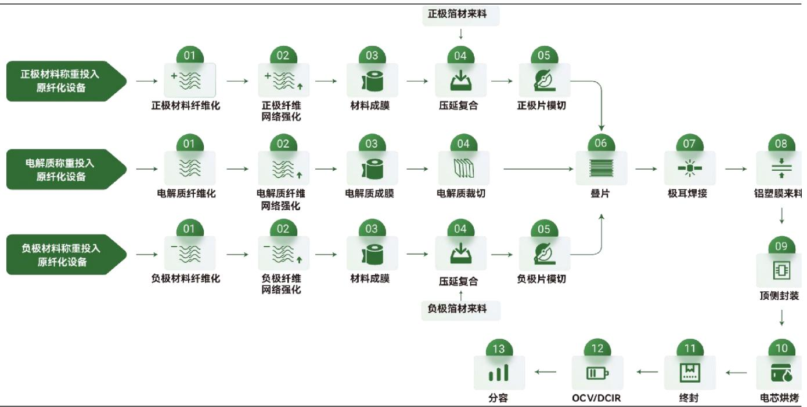

flowchart

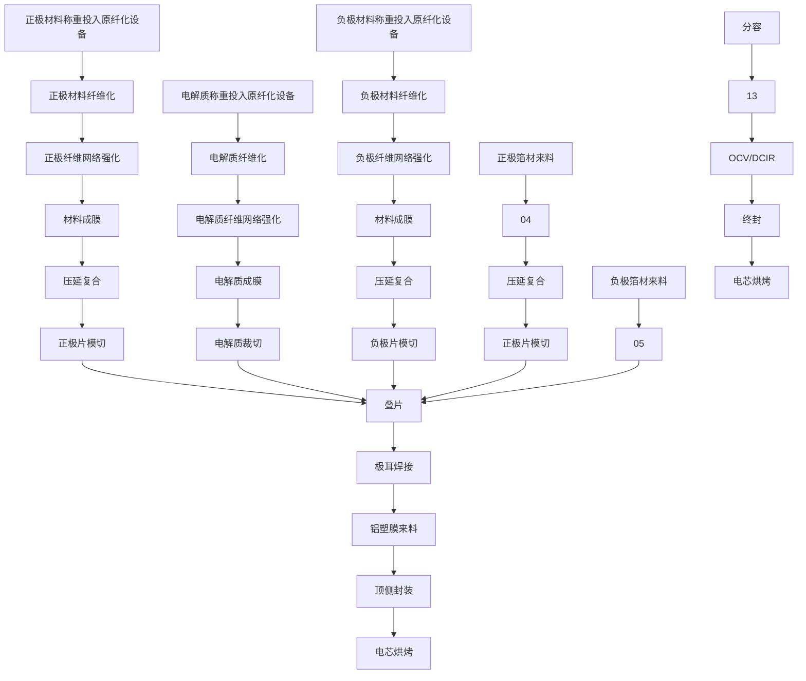
```mermaid
graph TD
    A["正极材料称重投入原纤化设备"] --> B["正极材料纤维化"]
    B --> C["正极纤维网络强化"]
    C --> D["材料成膜"]
    D --> E["压延复合"]
    E --> F["正极片模切"]
    F --> G["叠片"]
    G --> H["极耳焊接"]
    H --> I["铝塑膜来料"]
    I --> J["顶侧封装"]
    J --> K["电芯烘烤"]
    
    L["电解质称重投入原纤化设备"] --> M["电解质纤维化"]
    M --> N["电解质纤维网络强化"]
    N --> O["电解质成膜"]
    O --> P["电解质裁切"]
    P --> G
    Q["负极材料称重投入原纤化设备"] --> R["负极材料纤维化"]
    R --> S["负极纤维网络强化"]
    S --> T["材料成膜"]
    T --> U["压延复合"]
    U --> V["负极片模切"]
    V --> G
    W["正极箔材来料"] --> X["04"]
    X --> Y["压延复合"]
    Y --> Z["正极片模切"]
    Z --> G
    AA["负极箔材来料"] --> AB["05"]
    AB --> G
    AC["分容"] --> AD["13"]
    AD --> AE["OCV/DCIR"]
    AE --> AF["终封"]
    AF --> AG["电芯烘烤"]
```

资料来源：高能数造公司官网，山西证券研究所

# 5.2.2 中段：叠片工艺取代卷绕，增加等静压环节

叠片工艺取代卷绕：中段设备制作过程中，因为固态电解质硬度高韧性差，卷绕工艺容易导致电解质层开裂或界面分离，因此叠片工艺或取代卷绕工艺。

从工艺成熟度、成本、效率等方面考虑，叠片可以通过正极，固体电解质膜和负极的简单堆叠实现电池各组件的集成是最适用于全固态电池制备的工艺。分段叠片沿用液态电池叠片工艺，将正极、固体电解质层和负极裁切成指定尺寸后按顺序依次叠片后进行包装；一体化叠片是在裁切前将正极，固体电解质膜和负极压延成 3层结构，按尺寸需求将该3层结构裁切成多个"正极-固体电解质膜-负极"单元，并将其堆叠在一起后进行包装。

图 21：全固态电池不同叠片工艺示意图  
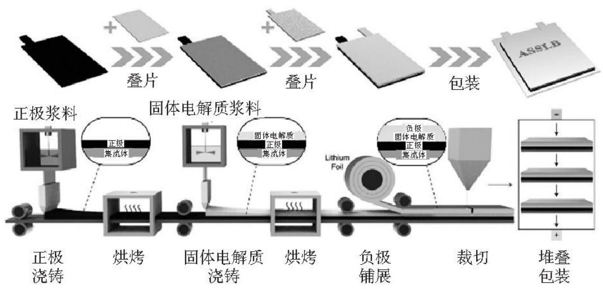

flowchart

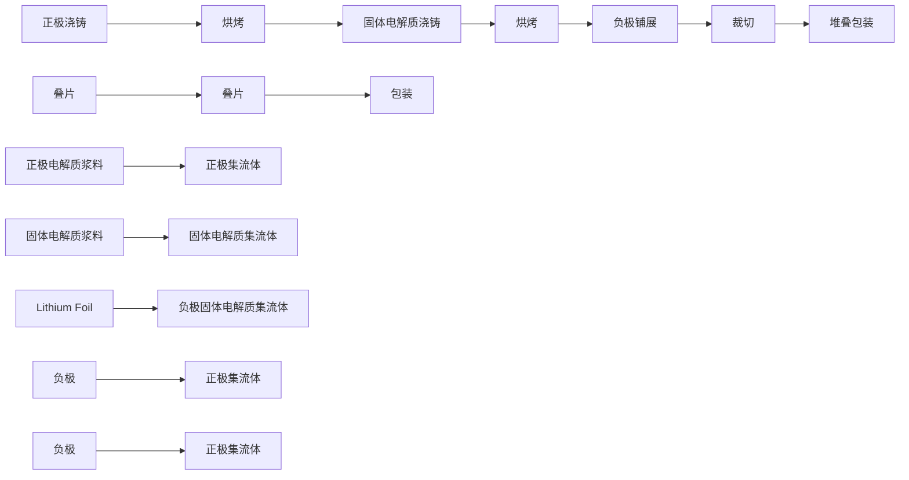
```mermaid
graph LR
    A["正极浇铸"] --> B["烘烤"]
    B --> C["固体电解质浇铸"]
    C --> D["烘烤"]
    D --> E["负极铺展"]
    E --> F["裁切"]
    F --> G["堆叠包装"]
    
    H["叠片"] --> I["叠片"]
    I --> J["包装"]
    
    K["正极电解质浆料"] --> L["正极集流体"]
    M["固体电解质浆料"] --> N["固体电解质集流体"]
    O["Lithium Foil"] --> P["负极固体电解质集流体"]
    Q["负极"] --> R["正极集流体"]
    S["负极"] --> T["正极集流体"]
```

（a)分段叠片工艺示意  
(b)一体化叠片工艺示意   
资料来源：《全固态电池生产工艺分析》，山西证券研究所

固态电池叠片机的产业分布呈现出“亚洲领先、欧美跟进”的格局，全球化协作趋势明显。根据 QYResearch 数据显示，全球范围内，固态电池叠片机主要生产商包括 Manz, 赢合科技, 利元亨, 先导智能等，其中前五大厂商占有大约 44.93%的市场份额。固态电池叠片机的全球分布主要集中在东亚、欧洲和北美等地区，其中中国、日本和韩国是核心生产与应用市场，依托庞大的动力电池产业链和新能源汽车产业集群，设备需求量大；欧洲则以德国、法国为代表，重点布局固态电池研发和产业化生产线，推动本地设备制造与应用；北美地区以美国为主，聚焦高端固态电池技术研发和中试生产，相关设备供应逐步形成。

图 22：全球固态电池叠片机市场前 16强生产商排名及市场占有率  
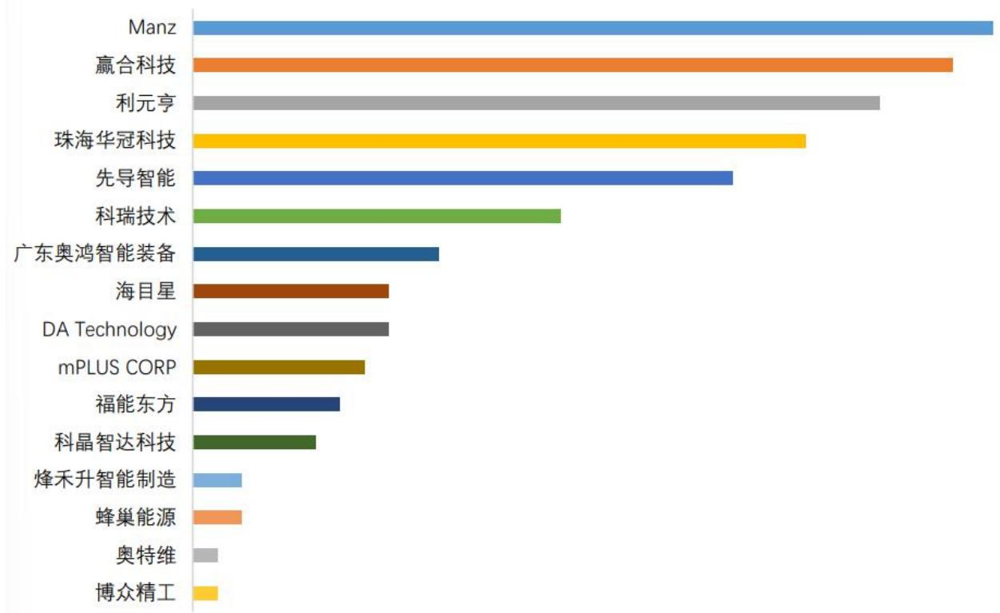

bar

| Company | Value |
| :--- | :--- |
| Manz | 100 |
| 赢合科技 | 95 |
| 利元亨 | 85 |
| 珠海华冠科技 | 75 |
| 先导智能 | 65 |
| 科瑞技术 | 55 |
| 广东奥鸿智能装备 | 45 |
| 海目星 | 40 |
| DA Technology | 38 |
| mPLUS CORP | 32 |
| 福能东方 | 30 |
| 科晶智达科技 | 25 |
| 烽禾升智能制造 | 15 |
| 蜂巢能源 | 12 |
| 奥特维 | 8 |
| 博众精工 | 7 |

资料来源：wind、QYResearch《全球固态电池叠片机市场研究报告 2025-2031》，山西证券研究所

增加等静压环节：在全固态电池的堆叠过程中，致密化是一个关键步骤，目的是减少电池内的孔隙率并增强电极与固态电解质之间的接触。常见的致密化方法包括连续线压制、单轴面压制和等静压。由于固态电池存在“固固”界面问题，会影响电池性能，固态电池中段制备过程中需要加压达到理想性能，而传统锂电生产中常规的的热压、辊压等方式，提供压力有限且无法进行均匀施压，因此等压设备有望在未来成为量产固态电池的关键设备之一。

从技术原理来看，固态电池的核心难题之一是固固界面的致密性与均匀性问题，这直接影响电池能量密度、循环寿命与安全性。传统热压与辊压因压力方向单一且分布不均，易产生边缘效应和层间滑移，难以实现三维致密化与一致性，从而限制性能提升，而等静压技术基于帕斯卡原理，能够提高界面致密度、消除内部空隙，改善组件接触效果，从而有效降低内阻、减少孔隙率、延长循环寿命并提升库仑效率，这一显著优势推动等静压机成为固态电池生产的核心增量设备。

从产业适配来看，等静压技术契合固态电池产业化进程，头部企业例如韩国三星已在生产时成功应用等静压设备，伴随固态电池产业化推进，更多电池企业加速固态电池布局，等静压

设备需求也有期迎来显著增长。

图 23：全固态电池等静压示意图：叠片后需对固-固界面进行加热、加压的优化处理  
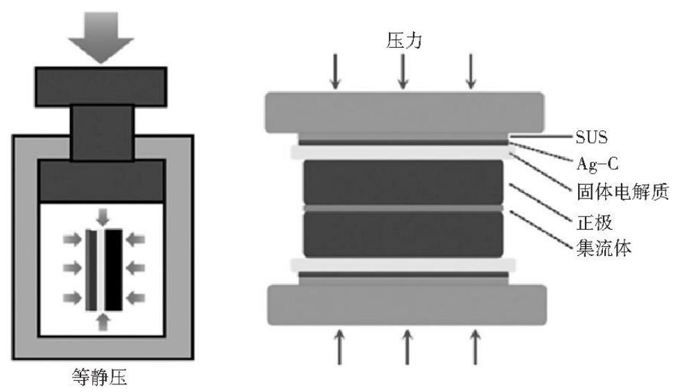

text_image

等静压
压力
SUS
Ag-C
固体电解质
正极
集流体

资料来源：《全固态电池生产工艺分析》，山西证券研究所

# 5.2.3 后段：新增高压化成分容设备

高压化成分容设备是锂电池生产后段的核心装备，通过充电活化测量电芯容量，技术趋势向高精度发展。常规电池化成压力在 3\~10吨，而固态电池化成分容环节需要超高压力（60\~80吨）和高电压平台，借助高压消除固-固界面微隙，推动锂离子在固态电解质与电极间形成稳定导电路径，由此产生高压化成分容设备需求。电池的化成分容设备主要承担电池性能激活、参数检测与质量筛选的核心任务，化成是对新生产的未激活电池进行首次充放电处理的过程，分容即容量分选，是在化成之后对电池进行的多轮充放电循环测试，剔除不合格的电池，并对电池按性能进行筛选分级。分容化成设备以分容柜、化成柜为载体，集成充放电、温压控制及数据管理系统。

高压化成分容设备的作用在于使电池在特定的工况下(电流、电压、温度、时间、压力)进行第一次充电，形成SEI膜，激活电极材料。在化成之后，对电池进行一次或多次完整的充放电循环，并精确测量每个电池在放电过程中释放出的实际容量、内阻、充放电曲线平台电压等关键性能参数。高压夹具采用卧式层推结构，压力验证/校准采用薄膜压力测试仪及压敏纸多种方式进行验证校准，使层板的压力均匀性达到最佳。

图 24：利元亨高压化成分容设备  
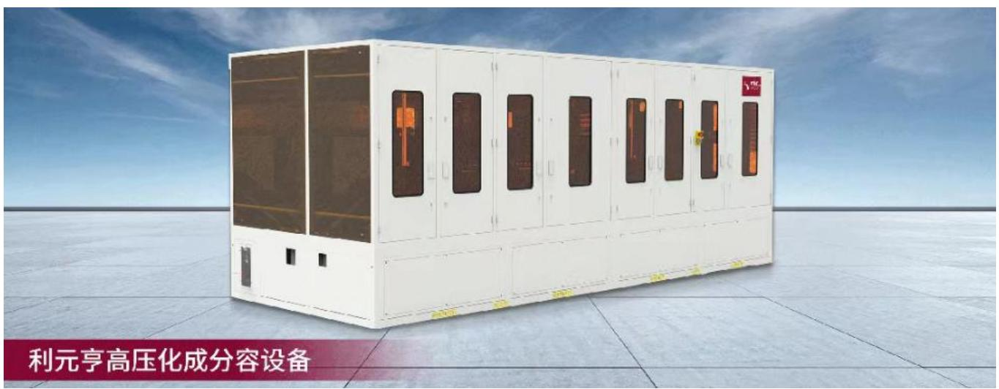

text_image

利元亨高压化成分容设备

资料来源：利元亨智能装备微信公众号，山西证券研究所

# 5.3 设备价值量显著增加，千亿赛道有望开启

与传统液态电池相比，固态电池设备投入显著增加。全固态电池设备价值量高于液态电池设备，主要系干法电极、等静压、高压化成等突破性工艺带来设备体系的重构，这种重构赋予了设备更高的技术创新价值。全固态电池的核心瓶颈在于固-固界面的阻抗与稳定性问题，这不仅是材料科学的难题，更直接转化为极其苛刻的制造工艺要求。

根据高工产研（GGII）《2025中国固态锂电池产业链发展蓝皮书》，固态电池单GWh 设备价值量达 5亿元，是传统液态电池的 3 倍，核心源于固态电池产线对干法电极、等静压等致密化专用设备的刚需，且工艺复杂度提升推高单条产线造价。

全固态电池设备端价值核心的转移，预计将推动前中后段价值量占比发生显著变化：（1）前段设备价值占比将从 35%提升至35%—40%，核心增量来自干法电极工艺，其技术壁垒和成本远高于传统涂布；（2）中段设备价值跃升至 40%—45%，叠片工艺全面替代卷绕，等静压设备成为保证界面贴合的关键；（3）后段设备占比虽下降，但技术内涵升级，高压化成柜等设备价值显著提升。

图 25：固态电池设备前、中段价值量占比将显著提升  
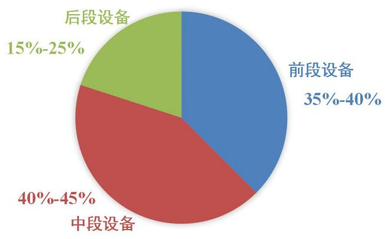

pie

| 设备类型 | 占比 (%) |
| :--- | :--- |
| 前段设备 | 35%-40% |
| 中段设备 | 40%-45% |
| 后段设备 | 15%-25% |

资料来源：证券时报、海目星激光，山西证券研究所

随着固态电池的产业化进程逐步推进，固态电池设备行业市场规模将显著提升，预计到2030 年全球固态电池设备市场规模将达到 1079.4亿元。全固态电池生产的新工艺如干法电极工艺、等静压工艺、叠片工艺和高压化成工艺等，将带动干法电极设备、辊压设备、等静压设备、叠片机、高压化成分容设备等关键设备的市场规模飙升。根据 EVTank 数据显示，2024年全球固态电池设备市场规模达到 40.0亿元，其中半固态电池设备市场规模 38.4亿元，全固态电池设备市场规模 1.6 亿元，其中全固态电池产线主要为实验室中试线。随着未来固态电池生产线进入大规模的建设和投产期，设备端有望成为固态电池产业化进程中最先受益的环节。

图 26：2024-2030E全球半固态和全固态电池设备市场规模（单位：亿元）  
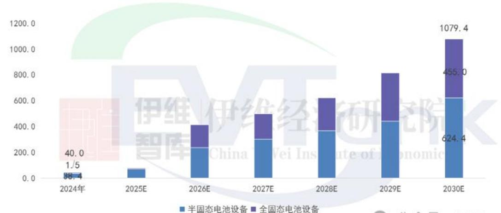

bar_stacked

| 年份 | 半固态电池设备 | 全固态电池设备 |
| :--- | :--- | :--- |
| 2024年 | 89.4 | 1.5 |
| 2025E | 70.0 | - |
| 2026E | 230.0 | 180.0 |
| 2027E | 300.0 | 190.0 |
| 2028E | 370.0 | 250.0 |
| 2029E | 440.0 | 350.0 |
| 2030E | 624.4 | 455.0 |
The chart displays a stacked bar chart with the total values labeled on each bar (e.g., 1079.4 for 2030E). The legend distinguishes between 半固态电池设备 and 全固态电池设备.

资料来源：EVTank微信公众号、《中国固态电池行业发展白皮书（2025年）》，山西证券研究所

# 6. 相关公司进展：整线解决方案服务商 VS 细分环节龙头

我国固态电池设备厂商在干法电极、精密辊压、激光加工、封装等关键环节已取得显著突破。前段工艺中，干法电极设备是关键，主要包括干混设备和干涂设备等，重点企业有先导智能、宏工科技、赢合科技、曼恩斯特、利元亨等；中段主要涉及电芯组装，如胶框印制机、高精度叠片机、等静压设备等，重点企业包括先导智能、利元亨、纳科诺尔等；后段的高压化成分容设备企业主要包括先导智能、杭可科技、利元亨等。

相关上市公司已形成“整线解决方案服务商+细分环节龙头”的竞争格局。从竞争格局来看，先导智能、利元亨和海目星布局整线，技术实力强，宏工科技、联赢激光、纳科诺尔、曼恩斯特等企业在特定细分领域或者关键设备上具有优势。其中，宏工科技针对干法电极工艺的研发了混合均质一体机、干法研磨机等设备，联赢激光专注于固态激光焊接设备，杭可科技作为后段高压化成分容设备的龙头企业，纳科诺尔在干法辊压设备领域处于领先地位，都有望在固态电池产业化的进程中受益。头部企业通过多技术路线适配、全球化布局及产学研合作，加速推进设备量产交付，部分企业已实现商业闭环与海外订单突破，为固态电池规模化应用奠定基础。

利元亨已成功打通全固态电池全线量产工艺，具备硫化物/氧化物/聚合物/卤化物全体系设备适配能力，并已向头部车企交付固态电池整线项目，并创新性推出多级辊压－等静压复合工艺，有效平衡了量产效率与材料性能。2025 年 12 月，利元亨与瑞典 Quintus Technologies AB公司正式签署战略合作协议，双方将聚焦固态电池等静压装备的联合开发与深度创新，携手攻克行业技术壁垒。

先导智能作为拥有完全自主知识产权的全固态电池整线解决方案服务商，已成功打通全固态电池量产的全线工艺环节，整线产品可柔性适配多种电解质材料体系（聚合物、氧化物、硫化物等），实现了从全固态电极制备（涵盖混料及干法、湿法极片复合设备）、全固态电解质膜制备及转印复合设备，到裸电芯组装（包括新一代固态叠片机、胶框印刷设备）、致密化设备（等静压设备和其他致密化设备）及高压化成分容等全固态电池制造关键设备的覆盖，并在核心环节取得多项技术突破。

海目星已打造出覆盖“氧化物+锂金属”和“硫化物+硅碳”的双技术路线整线装备体系，通过超快激光技术与自动化工艺深度融合，具备从电极制备到电芯组装的全流程交付能力，率先斩获行业首个固态电池设备商业量产订单，与欣界能源签订4亿元2GWh 量产线设备合同。

表 7：我国固态电池设备上市公司重点布局领域、核心优势与最新进展梳理

<table><tr><td>厂商名称</td><td>核心优势与最新进展</td></tr><tr><td>利元亨</td><td>已成功打通全固态电池全线量产工艺,具备硫化物/氧化物/聚合物/卤化物全体系设备适配能力,并已向头部车企交付固态电池整线项目。已攻克包括电极干法涂布设备、电极辊压及电解质热复合一体机、胶框印刷及叠片一体机和高压化成分容设备等在内的关键技术。</td></tr><tr><td>先导智能</td><td>公司是拥有完全自主知识产权的全固态电池整线解决方案服务商,已成功打通全固态电池量产的全线工艺环节,实现了从整线解决方案到各工段的关键设备覆盖。</td></tr><tr><td>海目星</td><td>海目星布局干法电极、等静压、高压化成等核心增量工艺,构建起了覆盖前、中、后段的整线装备能力。行业内最早实现“氧化物+锂金属负极”技术路线,并完成锂金属固态电池商业闭环,应用于低空飞行器上的固态电池设备公司。目前锂金属固态电池设备正在批量交付当中。在“硫化物+硅碳负极”的技术路线上,公司也已拿到多家全球领先的新能源科技企业中试线订单。</td></tr><tr><td>先惠技术</td><td>公司与清陶能源携手开展关于全固态电池核心关键装备的联合研发与产业化布局。2025年6月,公司成功向清陶能源交付干法辊压设备,目前该设备已进入精细调试阶段。</td></tr><tr><td>赢合科技</td><td>公司现已推出覆盖湿法与干法工艺的固态电池最新解决方案:湿法设备具备高精度涂布、优异工艺控制性与运行稳定性的技术软薄工艺领域,第三代设备通过集成粉体搅拌、纤维化、干法辊压等七大核心工艺技术。目前多家客户交付了核心固态电池相关设备,产品涵盖湿法全自动制浆、湿法涂布、辊压、电解质转印和干法搅拌纤维化、多辊连轧成膜复合等设备。</td></tr><tr><td>纳科诺尔</td><td>公司掌握了干法电极、锂带压延、电解质成膜、转印等设备制造的多项技术,同时加快等静压设备的研发及验证工作,目前部分产品已交付客户。其合资公司清研纳科已成功推出干法成膜设备4-22辊系列产品,最大幅宽达1200mm,速度达100m/min。公司自主研发的等静压设备已完成设计并进入验证测试阶段,设备设计压力达600MPa。</td></tr><tr><td>曼恩斯特</td><td>25H1,公司推出固态电池极片制造解决方案,其中固态电池极片制造方案通过干湿法工艺的创新结合,基于陶瓷双螺杆纤维化、预成膜机构、14辊双面成膜以及狭缝薄层涂布与砂磨机处理等技术的综合应用。</td></tr><tr><td>华亚智能</td><td>冠鸿智能新研发的智能干法电极生产装备系统主要应用于固态电池生产过程,是固态电池生产的核心装备,直接影响电池的电化学性能。</td></tr><tr><td>宏工科技</td><td>公司研发或联合研发了混合均质一体机、干法研磨机、适用于干法电极的双螺杆挤出机、适用于固态电池的全自动吨袋拆包系统等。25年2月,公司与清研电子合资成立清研宏工,共同研发的干法电极前段工序核心设备——混合均质一体机,其性能指标已达到国际一流水平。</td></tr><tr><td>荣旗科技</td><td>公司拟持有四川力能19.81%股份,四川力能公司在冷等静压机、温等静压机领域拥有国内领先的技术实力。目前在固态电池领域主要客户有宁德时代、比亚迪、潍柴动力等。</td></tr><tr><td>联赢激光</td><td>公司研发了多台用于固态电池生产的激光焊接设备及激光清洗机和涂胶机,为行业头部客户研制的首条全固态电池装配线成功交付,目前正在配合客户进行验证。</td></tr><tr><td>华自科技</td><td>公司在固态电池领域可提供固态电池化成容量机及测试自动物流系统、温等静压端自动物流系统(匹配等静压工艺环节)。</td></tr></table>

资料来源：利元亨公司官网、上海证券报、先导智能 2025半年报、极目新闻、海目星接待投资者调研纪要（2025-09-18）、先惠技术 2025 半年报、赢合科技接待投资者调研纪要（2025-09-25）、纳科诺尔 2025 半年报、纳科诺尔接待投资者调研纪要（2025-09-15、2025-11-11）、曼恩斯特 2025半年报、华亚智能 25半年报、宏工科技 2025 半年报、中华网、荣旗科技接待投资者调研纪要（2025-10-23）、联赢激光 2025半年报、证券之星，山西证券研究所

# 7. 投资建议

政策支持与头部企业布局，正对全固态电池产业发展形成“双重催化”。同时，低空经济、具身智能等新兴产业处于快速发展期，对动力电池的性能要求显著提升，有望打开广阔的增量市场空间。

随着2025-2026 年固态电池中试线建设高峰临近、2027年GWh 级量产线落地预期升温，固态电池产业正加速迈入装备竞赛的关键阶段。2026 年固态电池产业已经驶入快车道。随着车规级国标草案公示、宁德时代送样升级、广汽长安等车企锁定量产时间，固态电池已从概念迈入量产倒计时。

设备领域作为全固态电池量产落地的核心支撑，其技术先进性与工艺成熟度直接关系到电池性能、成本与规模化速度。目前固态电池技术未定型、资本开支启动，为设备龙头提供了珍贵的战略卡位窗口。在固态电池“材料—设备—电芯—终端”全产业链中，设备环节凭借高壁垒与不可替代性，成为率先受益且确定性最强的核心赛道。

干法电极、等静压、高精度叠片等核心工艺设备是固态电池量产的关键。固态电池产线对干法电极、等静压等致密化专用设备的刚工需艺，复且杂度提升推高单条产线造价。建议关注布局固态电池整线设备的先导智能和利元亨，以及在特定细分领域或者关键设备上具有优势的宏工科技、联赢激光等企业。

# 8. 风险提示

固态电池技术路线的不确定性：尤其是硫化物体系固态电池的量产进度可能受限于界面稳定性与工艺兼容性等技术瓶颈。

固态电池技术研发不及预期：复杂的生产工艺导致当前固态电池制造成本显著高于传统锂电池，规模化降本路径尚不清晰。

固态电池扩产节奏不及预期：固态电池的产业化节奏会受到固态电池关键技术瓶颈的突破节奏、规模化成本的可控性、规模化的应用场景的爆发速度以及新的技术和设备与现有的锂电产线适配性等相关因素的影响。

# 分析师承诺：

本人已在中国证券业协会登记为证券分析师，本人承诺，以勤勉的职业态度，独立、客观地出具本报告。本人对证券研究报告的内容和观点负责，保证信息来源合法合规，研究方法专业审慎，分析结论具有合理依据。本报告清晰准确地反映本人的研究观点。本人不曾因，不因，也将不会因本报告中的具体推荐意见或观点直接或间接受到任何形式的补偿。本人承诺不利用自己的身份、地位或执业过程中所掌握的信息为自己或他人谋取私利。

# 投资评级的说明：

以报告发布日后的 6--12 个月内公司股价（或行业指数）相对同期基准指数的涨跌幅为基准。其中：A 股以沪深 300 指数为基准；新三板以三板成指或三板做市指数为基准；港股以恒生指数为基准；美股以纳斯达克综合指数或标普 500指数为基准。

无评级：因无法获取必要的资料，或者公司面临无法预见的结果的重大不确定事件，或者其他原因，致使无法给出明确的投资评级。（新股覆盖、新三板覆盖报告及转债报告默认无评级）

# 评级体系：

公司评级

买入： 预计涨幅领先相对基准指数 15%以上；

增持： 预计涨幅领先相对基准指数介于 5%-15%之间；

中性： 预计涨幅领先相对基准指数介于-5%-5%之间；

减持： 预计涨幅落后相对基准指数介于-5%- -15%之间；

卖出： 预计涨幅落后相对基准指数-15%以上。

行业评级

领先大市： 预计涨幅超越相对基准指数 10%以上；

同步大市： 预计涨幅相对基准指数介于-10%-10%之间；

落后大市： 预计涨幅落后相对基准指数-10%以上。

风险评级

A： 预计波动率小于等于相对基准指数；

B： 预计波动率大于相对基准指数。

# 免责声明：

山西证券股份有限公司(以下简称“公司”)具备证券投资咨询业务资格。本报告是基于公司认为可靠的已公开信息，但公司不保证该等信息的准确性和完整性。入市有风险，投资需谨慎。在任何情况下，本报告中的信息或所表述的意见并不构成对任何人的投资建议。在任何情况下，公司不对任何人因使用本报告中的任何内容引致的损失责负任任。何本报告所载的资料、意见及推测仅反映发布当日的判断。在不同时期，公司可发出与本报告所载资料、意见及推测不一致的报告。公司或其关联机构在法律许可的情况下可能持有或交易本报告中提到的上市公司发行的证券或投资标的，还可能为或争取为这些公司提供投资银行或财务顾问服务。客户应当考虑到公司可能存在可能影响本报告客观性的利益冲突。公司在知晓范围内履行披露义务。本报告版权归公司所有。公司对本报告保留一切权利。未经公司事先书面授权，本报告的任何部分均不得以任何方式制作任何形式的拷贝、复印件或复制品，或再次分发给任何其他人，或以任何侵犯公司版权的其他方式使用。否则，公司将保留随时追究其法律责任的权利。

依据《发布证券研究报告执业规范》规定特此声明，禁止公司员工将公司证券研究报告私自提供给未经公司授权的任何媒体或机构；禁止任何媒体或机构未经授权私自刊载或转发公司证券研究报告。刊载或转发公司证券研究报告的授权必须通过签署协议约定，且明确由被授权机构承担相关刊载或者转发责任。

依据《发布证券研究报告执业规范》规定特此提示公司证券研究业务客户不得将公司证券研究报告转发给他人，提示公司证券研究业务客户及公众投资者慎重使用公众媒体刊载的证券研究报告。

依据《证券期货经营机构及其工作人员廉洁从业规定》和《证券经营机构及其工作人员廉洁从业实施细则》规定特此告知公司证券研究业务客户遵守廉洁从业规定。

# 山西证券研究所：

上海

上海市浦东新区滨江大道 5159 号陆家嘴滨江中心 N5 座 3 楼

太原

太原市府西街69号国贸中心A座28层电话：0351-8686981

http://www.i618.com.cn

深圳

广东省深圳市南山区科苑南路 2700 号华润金融大厦 23楼

北京

北京市丰台区金泽西路 2 号院 1 号楼丽泽平安金融中心 A 座 25层

text_image

山西证券

