# 信宇人（688573）

# 锂电干燥设备龙头，差异化布局卤化物电解质解决方案

增持（首次）

<table><tr><td>盈利预测与估值</td><td>2023A</td><td>2024A</td><td>2025E</td><td>2026E</td><td>2027E</td></tr><tr><td>营业总收入(百万元)</td><td>593.62</td><td>621.84</td><td>583.50</td><td>708.64</td><td>840.46</td></tr><tr><td>同比(%)</td><td>(11.33)</td><td>4.75</td><td>(6.17)</td><td>21.45</td><td>18.60</td></tr><tr><td>归母净利润(百万元)</td><td>58.35</td><td>(63.26)</td><td>8.51</td><td>54.68</td><td>79.38</td></tr><tr><td>同比(%)</td><td>(12.55)</td><td>(208.41)</td><td>113.46</td><td>542.19</td><td>45.18</td></tr><tr><td>EPS-最新摊薄(元/股)</td><td>0.60</td><td>(0.65)</td><td>0.09</td><td>0.56</td><td>0.81</td></tr><tr><td>P/E(现价&amp;最新摊薄)</td><td>50.54</td><td>(46.62)</td><td>346.39</td><td>53.94</td><td>37.15</td></tr></table>

# [Table\_S投资要点

# ◼ 锂电干燥设备龙头，积极拓展新能源与新兴领域

信宇人专注于锂离子电池智能制造装备领域，主要从事以干燥设备和涂布设备为核心的高端装备研发、生产与销售。作为“国家级重点专精特新‘小巨人’企业”，公司产品涵盖锂离子电池生产设备及其关键零部件，并积极拓展氢燃料电池、光电、医疗等新兴领域，为客户提供高端装备和自动化整体解决方案。近年来，公司在持续夯实锂电领域竞争优势的基础上，持续向设备核心零部件延伸，构建了“高端装备+工艺+新材料”三位一体的研发体系，形成了较强的技术优势和市场竞争力。

# 业务拓展至液态锂电制造全环节，开创性推出 SDC涂布机

公司产品矩阵完善，覆盖锂电制造中、后道设备。公司产品涵盖锂电池干燥设备、涂布设备、辊压分切设备、电芯装配线以及氢燃料电池设备等多个领域，能够为客户提供多元化的智能制造高端装备及自动化解决方案。公司 SDC 涂布机具备涂布速度快、涂膜均匀性好、涂布窗口宽、涂液粘度范围广、涂布缺陷少、涂液利用率高等优势，在行业内具有较强竞争力。此外，公司全自动真空烘烤线采用隧道式高真空除水技术，节能高效、温控均匀，广泛应用于极片及电芯干燥环节，市场认可度较高。

# ◼ 公司推出卤化物电解质干法解决方案，差异化布局固态电池设备&材料

信宇人固态电池材料项目未来将围绕低成本、高离子电导率卤化物固态电解质，开发“能量型+快充型”双路线布局，计划 3 年内建成量产中试线，推动能量型电解质装车验证与快充型适配无人机与超充桩场景。公司开发的“能量型+快充型”两条固态电解质路线，均采用公司自研、自产干法成膜一体机。（1）能量型：重点开发稀土替代型卤化物，通过水相合成工艺降低材料成本至 20万元/吨以下，并实现室温离子电导率>1 mS/cm，固态电池能量密度>400 Wh/kg。（2）快充型：优化其与高镍正极的界面适配性，设计卤化物-硫化物梯度复合电解质，引入锂离子高速传输通道结构，降低迁移能垒从而提高离子电导率，支持 5C 级快充。

盈利预测与投资评级：信宇人深耕锂电设备领域，差异化布局固态电池前道设备。我们预测公司 2025-2027 年归母净利润为 8.5/54.7/79.4 百万元，当前股价对应 PE 估值水平分别为 346/54/37x。考虑到公司差异化布局固态电池前道解决方案，有望充分受益于固态电池产业化，首次覆盖给予公司“增持”评级。

风险提示：下游扩产不及预期，新业务拓展不及预期，业绩扭亏为盈不及预期。

2025 年 07 月 26 日

证券分析师 周尔双

执业证书：S0600515110002

021-60199784

zhouersh@dwzq.com.cn

证券分析师 李文意

执业证书：S0600524080005

liwenyi@dwzq.com.cn

股价走势   
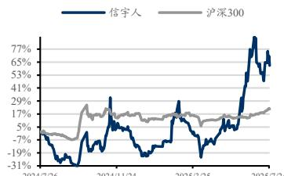

line

| Date       | 信宇人 | 沪深300 |
| ---------- | ------ | ------- |
| 2024/7/26  | -19%   | 5%      |
| 2024/11/24 | 29%    | 17%     |
| 2025/3/25  | -19%   | 17%     |
| 2025/7/24  | 77%    | 17%     |

市场数据

<table><tr><td>收盘价(元)</td><td>30.17</td></tr><tr><td>一年最低/最高价</td><td>12.69/36.98</td></tr><tr><td>市净率(倍)</td><td>3.85</td></tr><tr><td>流通A股市值(百万元)</td><td>1,568.67</td></tr><tr><td>总市值(百万元)</td><td>2,949.25</td></tr></table>

基础数据

<table><tr><td>每股净资产(元,LF)</td><td>7.84</td></tr><tr><td>资产负债率(%,LF)</td><td>63.57</td></tr><tr><td>总股本(百万股)</td><td>97.75</td></tr><tr><td>流通A股(百万股)</td><td>51.99</td></tr></table>

# 相关研究

# 内容目录

# 1. 深耕设备行业二十年，覆盖锂电制造全环节...

1.1. 专注锂电干燥与涂布设备，积极拓展新能源与新兴领域.   
1.2. 业务覆盖液态锂电制造全环节，开创性推出 SDC 涂布机.  
1.3. 股权结构集中稳定，子公司布局完善产业链.  
1.4. 业绩短期承压，持续加大研发投入...

# 2. 公司差异化布局卤化物电解质干法解决方案，有望充分受益于固态电池产业化............... ... 7

2.1. 固态电池采用固体电解质，具备能量密度、安全性高等优势.  
2.2. 半固态电池已导入消费电子领域，随着全固态成本降低&成熟度提升有望加速产业化.9  
2.3. 政策层面推进固态电池研发，固态电池产业化加速. 10  
2.4. 固态电池兴起，带来设备工艺新需求.. 10  
2.5. 公司推出卤化物电解质干法解决方案，差异化布局固态电池设备&材料 12

# 3. 盈利预测&投资评级. 13

# 4. 风险提示 ......................... .................... .14

# 图表目录

图 1： 公司锂电设备业务发展历程与技术升级路径.  
图 2： 公司锂电设备核心产品及应用领域.. 4  
图 3： 公司股权结构集中且多元化，实际控制人为杨志明先生（截至 2025Q1 末）.............. ..... 6  
图 4： 2025Q1 公司实现营收 0.55 亿元，同比+3.9% .... . 6  
图 5： 2025Q1 公司实现归母净利润-0.26 亿元. 6  
图 6： 2025Q1 公司毛利率为 9.4% ....  
图 7： 2025Q1 公司期间费用率为 52.16%，同比-23.93pct ..  
图 8： 2020-2024 公司分产品收入情况 ...  
图 9： 2020-2024 公司分产品毛利率 ..  
图 10： 全固态电池相较于液态&半固态电池完全去除电解液与隔膜 8  
图 11： 各类电池对比.. 8  
图 12： 全固态电池能量密度显著高于液态&半固态电池，是多种新兴应用的最优解（2025 年及之后为预测）. . 9  
图 13： 固态电池电解质材质热失控温度均高于液态电解质，其中氧化物与硫化物最高.............9  
图 14： 当前固态电池主要应用在成本敏感度低的高端消费领域，后续随着稳定性&性价比陆续突破，将加速导入动力&储能领域应用. .. 9  
图 15： 国家对固态电池的扶持计划情况... 10  
图 16： 全固态电池工艺与液态电池工艺主要区别. 11  
图 17： 全固态电池湿法&干法工艺对比，在前道主要是极片制造和成膜环节依靠干混挤压，无需溶剂及烘干环节.. ... 11  
图 18： 全固态电池中湿法&干法工艺制造电极片对比图 12  
图 19： 公司开发“能量型+快充型”两条固态电解质路线，匹配不同应用场景下的固态电池需求... .13  
图 20： 公司干法成膜复合一体机.. 13  
图 21： 可比公司估值（截至 2025年7月25日收盘价）. 13

# 1. 深耕设备行业二十年，覆盖锂电制造全环节

# 1.1. 专注锂电干燥与涂布设备，积极拓展新能源与新兴领域

公司专注于锂离子电池智能制造装备领域，主要从事以干燥设备和涂布设备为核心的高端装备研发、生产与销售。作为“国家级重点专精特新‘小巨人’企业”，公司产品涵盖锂离子电池生产设备及其关键零部件，并积极拓展氢燃料电池、光电、医疗等新兴领域，为客户提供高端装备和自动化整体解决方案。近年来，公司在持续夯实锂电领域竞争优势的基础上，持续向设备核心零部件延伸，构建了“高端装备+工艺+新材料”三位一体的研发体系，形成了较强的技术优势和市场竞争力。

图1：公司锂电设备业务发展历程与技术升级路径  
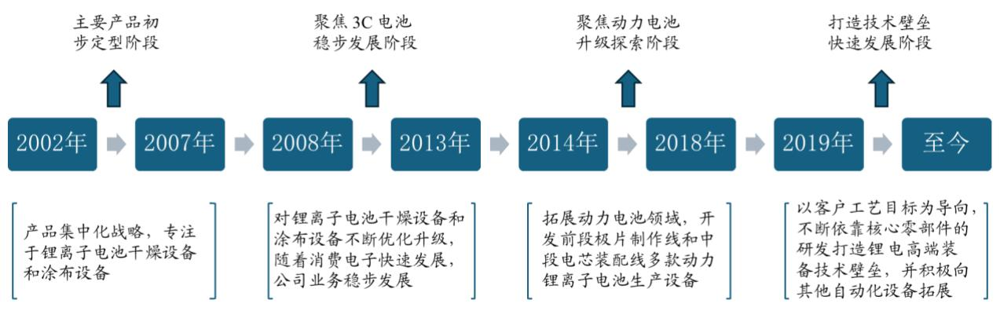

flowchart

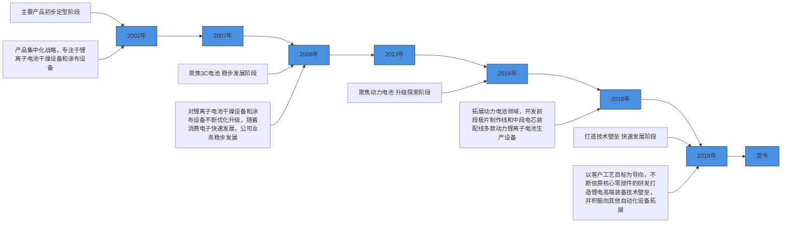

数据来源：公司招股说明书，东吴证券研究所

# 公司发展经历四个核心阶段：

（1）产品初步定型（2002-2007年）：公司成立初期，集中资源聚焦锂离子电池干燥设备，推出自动真空烤箱等干燥设备。同时，公司积极开展锂电涂布设备技术研发，并向上游核心零部件延伸，研发激光测厚仪，初步形成了锂电设备领域的技术积累。  
（2）聚焦3C电池，稳步发展（2008-2013年）：随着智能手机等消费电子产品需求增长，公司业务稳步发展。公司掌握双循环快速升温与真空保温技术等核心技术，推出自动真空烤箱（内外双循环）等干燥设备，在节能、升温速度、温度均匀性等指标上实现显著提升。同时，公司运用三辊转移涂布技术等，推出单面转移涂布机、双面转移涂布机等涂布设备，并将自主研发的激光测厚仪应用于涂布设备，提升涂布精度和产品附加值。  
（3）聚焦动力电池，转型升级（2014-2018年）：公司抓住新能源汽车产业快速发展机遇，将业务重心聚焦于动力锂电池生产装备领域，加大研发投入，相继推出多款锂

电池制造创新设备，实现产品转型升级，进一步巩固了公司在锂电设备领域的市场地位。

（4）打造技术壁垒，快速发展（2019-2024年）：公司持续巩固锂电设备领域优势，并积极拓展光电、医疗、氢燃料电池等新兴领域，成功研发涂布机模头、测厚仪等核心零部件，推出智能高真空烤箱、全自动高真空烘烤线、SDC 涂布机等优势产品，构建了“高端装备+工艺+新材料”三位一体的研发体系，逐步形成较强的技术壁垒和市场竞争力。2024年，公司基于行业痛点创新性研发了分辊分一体机，解决了行业内的多个痛点问题，极大提高了生产效率。公司设立了电池智能制造规划设计院，聘请了业内资深专家博士及专业人员，完成了团队的初步搭建。

# 1.2. 业务覆盖液态锂电制造全环节，开创性推出 SDC涂布机

公司产品矩阵完善，覆盖锂电制造中、后道设备。公司专注于智能制造高端装备的研发、生产和销售，产品涵盖锂电池干燥设备、涂布设备、辊压分切设备、电芯装配线以及氢燃料电池设备等多个领域，能够为客户提供多元化的智能制造高端装备及自动化解决方案。公司 SDC 涂布机具备涂布速度快、涂膜均匀性好、涂布窗口宽、涂液粘度范围广、涂布缺陷少、涂液利用率高等优势，在行业内具有较强竞争力。2024年，公司创新推出分辊分一体机，将辊压、分切、再分切工艺集成于一体，有效解决极片褶皱、流纹等行业痛点，进一步提升生产效率与产品一致性。此外，公司全自动真空烘烤线采用隧道式高真空除水技术，节能高效、温控均匀，广泛应用于极片及电芯干燥环节，市场认可度较高。

图2：公司锂电设备核心产品及应用领域

<table><tr><td>产品名称</td><td>产品品类</td><td>图片</td><td>用途及特点</td></tr><tr><td>SDC涂布机</td><td>锂离子电池涂布设备</td><td>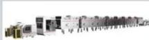</td><td>单向双面同时涂布设备,适用于锂电池极片高效涂布工艺,具备涂布精度高、能耗低、效率快等特点,有效提升极片质量与一致性。</td></tr><tr><td>全自动真空烘烤线</td><td>锂离子电池干燥设备</td><td>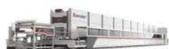</td><td>采用隧道式高真空除水技术,主要用于锂电池极片及电芯干燥环节,具有节能省时、温度均匀、自动化程度高等特点。</td></tr><tr><td>分辊分一体机</td><td>锂离子电池辊压、分切设备</td><td>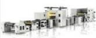</td><td>将辊压、分切、再分切整合于一台设备,适用于多幅极片连续加工,解决极片褶皱、流纹等问题,提升生产效率与成品率。</td></tr><tr><td>智能双级辊压机</td><td>锂离子电池辊压、分切设备</td><td>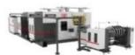</td><td>采用双级辊压工艺,适用于高压实密度极片制备,具备压实密度高、厚度均匀、反弹率低等特点。</td></tr><tr><td>铝壳电池自动化装配线</td><td>其他锂电设备及关键零部件</td><td>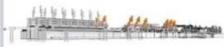</td><td>集电芯入壳、焊接、检漏等工序于一体,适用于方形铝壳电池电芯装配,支持多规格兼容,自动化程度高,提升装配效率与一致性。</td></tr></table>

数据来源：公司官网，东吴证券研究所

# 1.3. 股权结构集中稳定，子公司布局完善产业链

公司股权结构集中，实际控制人为杨志明先生。截至 2025Q1 末，公司控股股东、实际控制人杨志明先生直接持股 29.77%，公司第二大股东曾芳女士持股 10.83%，二人合计持股 40.60%。公司股东还包括多家股权投资基金及机构投资者，股东结构多元化。子公司布局方面，公司拥有惠州市信宇人科技有限公司、惠州华科技术研究院有限公司、深圳市氢科智能技术有限公司、华科技术（淮南）有限公司等 4家子公司，并控股深圳市上立德新材料有限公司、深圳市亚微新材料有限公司、东莞市见信天蓝科技有限公司等多家企业，业务涵盖智能制造、新能源、新材料、智能技术等多个领域，实现产业链上下游的广泛布局。

图3：公司股权结构集中且多元化，实际控制人为杨志明先生（截至 2025Q1 末）  
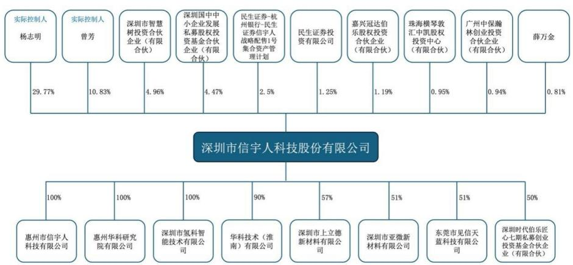

flowchart

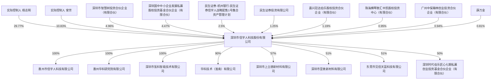

数据来源：公司官网，东吴证券研究所

# 1.4. 业绩短期承压，持续加大研发投入

公司营收稳步增长，利润受行业影响短期承压。收入方面，2024 年实现营业收入6.22 亿元，同比增长 4.8%；2019-2024 年 CAGR 为 37.2%。2025Q1 营收 0.55 亿元，同比增长 3.9%。利润方面，2024 年和 2025Q1 归母净利润分别为-0.63 亿元和-0.26 亿元，同比分别-208%和-9.3%。行业竞争加剧导致公司短期盈利承压，但公司积极布局整线项目并取得订单，长期成长逻辑清晰。

图4：2025Q1 公司实现营收 0.55 亿元，同比+3.9%  
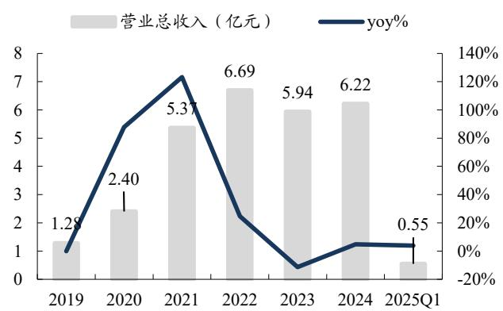

bar_line

| 年份 | 营业总收入 (亿元) | yoy (%) |
| :--- | :--- | :--- |
| 2019 | 1.28 | 16.4 |
| 2020 | 2.40 | 73.6 |
| 2021 | 5.37 | 124.4 |
| 2022 | 6.69 | 23.6 |
| 2023 | 5.94 | -5.7 |
| 2024 | 6.22 | 10.8 |
| 2025Q1 | 0.55 | 5.5 |

数据来源：Wind，东吴证券研究所

图5：2025Q1 公司实现归母净利润-0.26 亿元  
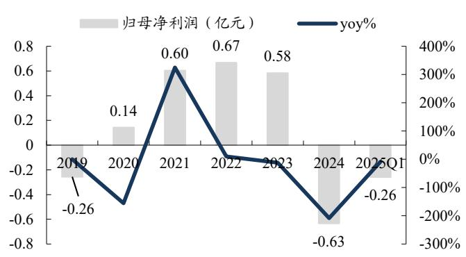

bar_line

| Year   | 归母净利润（亿元） | yoy%   |
| ------ | ------------------ | ------ |
| 2019   | -0.26              |        |
| 2020   | 0.14               | -100%  |
| 2021   | 0.60               | 300%   |
| 2022   | 0.67               | 0%     |
| 2023   | 0.58               | -50%   |
| 2024   | -0.63              | -200%  |
| 2025Q1 | -0.26              | -150%  |

数据来源：Wind，东吴证券研究所

公司毛利率有所下降，净利率短期承压，研发投入持续加大。盈利能力方面，2025Q1，公司销售毛利率为 9.40%，同比-4.10pct，归母净利率为-50.20%，同比+4.50pct；自 2019年来，公司毛利率震荡下行，2024年为20.30%，同比-10.90pct，主要系锂电行业竞争加剧；2024 年公司销售净利率为-10.00%，同比-19.80pct。费用端，2025Q1 公司期间费用率 为 52.16% ， 同 比 -23.93pct ， 其 中 销 售 / 管 理 / 财 务 / 研 发 费 用 率 分 别 为8.75/18.97/2.99/21.45%，同比分别-12.55/+2.01/+2.32/-15.71pct。公司控费能力显著改善的同时，持续加大研发投入，研发费用率维持在10%以上，体现了对技术创新的重视。

图6：2025Q1 公司毛利率为 9.4%  
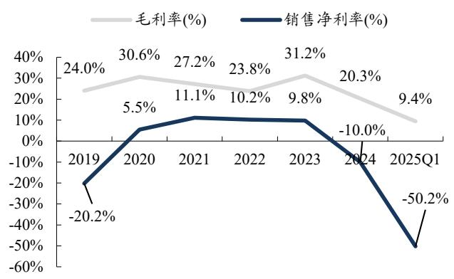

line

| Year | 毛利率(%) (%) | 销售净利率(%) (%) |
|---|---|---|
| 2019 | 24.0 | -20.2 |
| 2020 | 30.6 | 5.5 |
| 2021 | 27.2 | 11.1 |
| 2022 | 23.8 | 10.2 |
| 2023 | 31.2 | 9.8 |
| 2024 | 20.3 | -10.0 |
| 2025Q1 | 9.4 | -50.2 |

数据来源：Wind，东吴证券研究所

图7：2025Q1 公司期间费用率为 52.16%，同比-23.93pct  
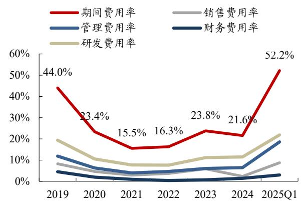

line

| Year     | 期间费用率 | 管理费用率 | 销售费用率 | 财务费用率 | 研发费用率 |
| -------- | ---------- | ---------- | ---------- | ---------- | ---------- |
| 2019     | 44.0%      | -          | -          | -          | -          |
| 2020     | 23.4%      | -          | -          | -          | -          |
| 2021     | 15.5%      | -          | -          | -          | -          |
| 2022     | 16.3%      | -          | -          | -          | -          |
| 2023     | 23.8%      | -          | -          | -          | -          |
| 2024     | 21.6%      | -          | -          | -          | -          |
| 2025Q1   | 52.2%      | -          | -          | -          | -          |

数据来源：Wind，东吴证券研究所

公司营收结构清晰，核心产品突出。公司主要产品为锂电池生产设备系列，2024年干燥设备、涂布设备、辊压/分切设备和其他锂电设备分别实现收入 1.67、1.02、0.59和2.61 亿元，占比分别为 26.93%、16.36%、9.44%和 41.94%，同比分别-32%、-56%、-17%和+770%。其他锂电设备收入的猛增主要系公司承接单一重大客户的 EPC 整线打包业务，该客户占公司 2024年销售总额的 61%。

图8：2020-2024 公司分产品收入情况  
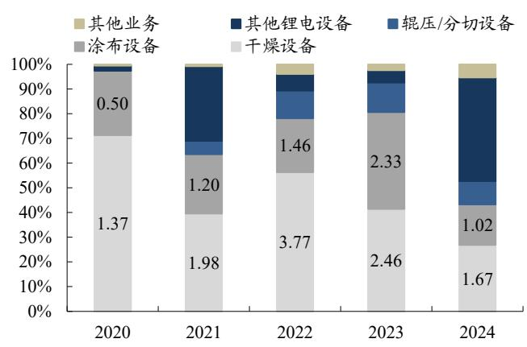

bar_stacked

| 年份 | 干燥设备 | 涂布设备 | 辊压/分切设备 | 其他锂电设备 | 其他业务 |
| :--- | :--- | :--- | :--- | :--- | :--- |
| 2020 | 1.37 | 0.50 | 0.00 | 0.00 | 0.00 |
| 2021 | 1.98 | 1.20 | 0.00 | 0.00 | 0.00 |
| 2022 | 3.77 | 1.46 | 0.00 | 0.00 | 0.00 |
| 2023 | 2.46 | 2.33 | 0.00 | 0.00 | 0.00 |
| 2024 | 1.67 | 1.02 | 0.00 | 0.00 | 0.00 |

数据来源：Wind，东吴证券研究所

图9：2020-2024 公司分产品毛利率  
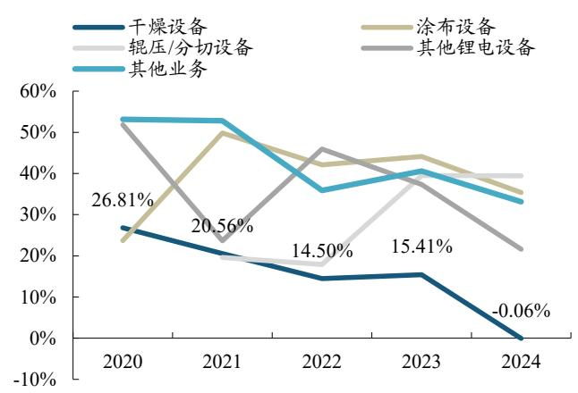

line

| Year | 干燥设备 | 辊压/分切设备 | 涂布设备 | 其他锂电设备 | 其他业务 |
|------|----------|---------------|----------|--------------|----------|
| 2020 | 26.81%   |               |          |              | 53%      |
| 2021 | 20.56%   |               | 50%      |              | 53%      |
| 2022 | 14.50%   |               | 42%      | 45%          | 35%      |
| 2023 | 15.41%   |               | 44%      | 38%          | 40%      |
| 2024 | -0.06%   |               | 35%      | 21%          | 33%      |

数据来源：Wind，东吴证券研究所

# 2. 公司差异化布局卤化物电解质干法解决方案，有望充分受益于固态电池产业化

# 2.1. 固态电池采用固体电解质，具备能量密度、安全性高等优势

固态电池与液态电池的本质区别在于电解质的形态。液态电池使用液态电解质，隔膜用于防止正负极短路并允许离子通过。当发展到半固态电池，电解质部分变为固态，但仍保留电解液与隔膜。当进一步发展到全固态电池，电解质完全变为固态，隔膜也一同取消。

当前液态电池存在能量密度低、电解质易燃易爆、低温衰减等问题：1）能量密度较低：液态电池难以突破 350Wh/kg 的极限，目前主流的磷酸铁锂电池的能量密度在200Wh/kg 以下，三元锂电池的能量密度在200-300Wh/kg之间，无法满足重大发展的需求，限制了多场景的应用；2）液态电解质易燃易爆：液态电解质中的有机溶剂具有易燃性、高腐蚀性，在过度充电、内部短路等异常时电解液发热，有自燃甚至爆炸的危险；3）低温衰减：在低温条件下，电解液的粘度增加，导致锂离子的迁移速率降低，进而影响电池的充放电效率；同时电解液的电导率也会随着温度的降低而显著下降，这进一步加剧了电池性能的衰减。

图10：全固态电池相较于液态&半固态电池完全去除电解液与隔膜  
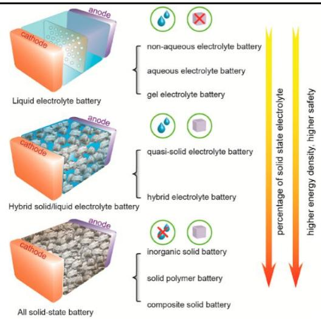

text_image

anode
cathode
liquid electrolyte battery
non-aqueous electrolyte battery
aqueous electrolyte battery
gel electrolyte battery
anode
cathode
quasi-solid electrolyte battery
hybrid electrolyte battery
anode
cathode
All solid-state battery
inorganic solid battery
solid polymer battery
composite solid battery
percentage of solid state electrolyte
higher energy density, higher safety

数据来源：Quintus，东吴证券研究所

图11：各类电池对比

<table><tr><td></td><td>磷酸铁锂电池</td><td>三元锂电池</td><td>半固态</td><td>全固态</td></tr><tr><td>单体标称电压</td><td>3.2V</td><td>3.7V/3.8V</td><td>3.8-4.5V</td><td>4-6V</td></tr><tr><td>能量密度</td><td>160-180wh/kg</td><td>200-280wh/kg</td><td>280-320wh/kg</td><td>&gt;500wh/kg</td></tr><tr><td>循环寿命</td><td>2500圈</td><td>1500圈</td><td>800圈</td><td>&gt;2000圈</td></tr><tr><td>量产最大倍率</td><td>4.5C</td><td>5C</td><td>2C</td><td>5-10C</td></tr><tr><td>充电环境</td><td>-10°C-55°C</td><td>-0°C-45°C</td><td>-0°C-45°C</td><td>-30°C-60°C</td></tr><tr><td>放电环境</td><td>-20°C-55°C</td><td>-10°C-60°C</td><td>-10°C-60°C</td><td>-40°C-70°C</td></tr><tr><td>耐高温</td><td>500°C</td><td>200°C</td><td>200°C</td><td>800°C</td></tr><tr><td>耐低温</td><td>-20°C</td><td>-10°C</td><td>-10°C</td><td>-40°C</td></tr><tr><td>针刺</td><td>几率通过,约80%</td><td>100%无法通过</td><td>几率通过,约70%</td><td>100%通过</td></tr><tr><td>锂枝晶</td><td>存在</td><td>存在</td><td>存在</td><td>不存在</td></tr></table>

数据来源：高工锂电，东吴证券研究所

# 固态电池具备高能量密度、高安全性、不存在低温衰减问题。（1）高能量密度：

传统液态锂电池能量密度小于 300Wh/kg，而固态电池的能量密度能达到 300-500Wh/kg。电池的能量密度是由电池的工作电压及比容量决定的，固体电解质不仅具有较宽的电化学窗口，能适配高电压的正极材料，还能兼容高容量的金属锂负极；此外，传统液态电池需将单体先进行封装再进行串联组装，全固态电池可以先串联后封装，这能减少封装材料的使用，降低电池系统的重量和体积，从而使得固态电池的能量密度得到进一步提升。（2）高安全性：传统液态电池的电解液使用可燃性有机溶剂，在受到外力或封装不善时容易发生漏液现象，而固态电解质不存在液体泄漏的问题，在针刺、挤压测试中不易短路或起火，抗物理损伤性能优于液态电池；另外，液态电解液在 150-200℃即可分解，甚至有自燃和爆炸风险，而固态电池热失控温度通常在 200-600℃，电池安全性得到有效提升。（3）解决低温衰减问题：全固态电池由于采用全固态电解质，不会出现电解液在低温环境下充放电效率衰减问题。

图12：全固态电池能量密度显著高于液态&半固态电池，是多种新兴应用的最优解（2025 年及之后为预测）  
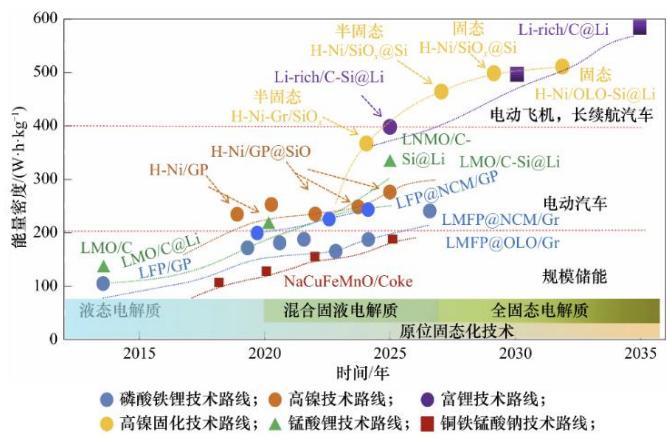

line

| 时间/年 | 磷酸铁锂技术路线; | 高镍技术路线; | 富锂技术路线; | 高镍固化技术路线; | 锰酸锂技术路线; | 铜铁锰酸钠技术路线; |
| ------- | ----------------- | -------------- | -------------- | ----------------- | ---------------- | --------------------- |
| 2015    | ~100              | ~100           | ~100           | ~100              | ~100             | ~100                  |
| 2020    | ~180              | ~240           | ~380           | ~220              | ~180             | ~160                  |
| 2025    | ~240              | ~280           | ~480           | ~360              | ~240             | ~220                  |
| 2030    | ~280              | ~320           | ~500           | ~420              | ~280             | ~260                  |
| 2035    | ~320              | ~360           | ~580           | ~480              | ~320             | ~300                  |

数据来源：清华大学，东吴证券研究所

图13：固态电池电解质材质热失控温度均高于液态电解质，其中氧化物与硫化物最高  
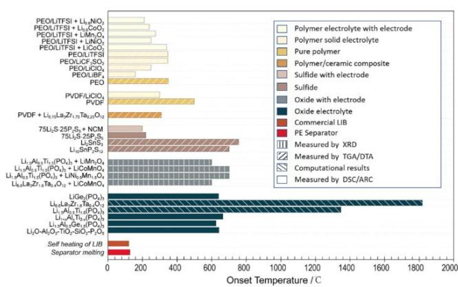

bar

| Material | Onset Temperature / C |
|---|---|
| PEOLITFSI + Li₃NiO₄ | 25 |
| PEOLITFSI + Li₁₀CoO₃ | 30 |
| PEOLITFSI + LiMnO₃ | 28 |
| PEOLITFSI + LiNiO₃ | 32 |
| PEOLITFSI + LiCO₂O₃ | 35 |
| PEOLITFSI | 36 |
| PEOLICF-SiO₂ | 34 |
| PEOLICF-O₂ | 20 |
| PEOLIBF₂ | 30 |
| PEO | 35 |
| PVDF/LiClO₄ | 50 |
| PVDF | 55 |
| PVDF + Li₁₃LaZr₁.₇₅Ta₈.₃O₁₂ | 35 |
| 75Li₃S 25P,S₂ + NCM | 20 |
| 75Li₃S 25P,S₂ + Li₃SnS₂ | 75 |
| Li₁₆SnP₂S₁₂ | 70 |
| Li₁₆Al₁₉Ti₁.₅(PO₄)₃ + LiMnO₄ | 65 |
| Li₁₆Al₁₉Ti₁.₅(PO₃)₃ + LiCoMnO₄ | 68 |
| Li₁₆Al₁₉Ti₁.₅(PO₃)₃ + LiNi₆Mn₁₀O₄ | 65 |
| Li₁₆LaZr₁.₇₅Ta₈.₃O₁₂ + LiCoMnO₄ | 68 |
| LiGe₃(PO₄)₂ | 1800 |
| Li₁₀LaZr₂.₇₅Ta₈.₃O₁₂ | 1400 |
| Li₁₀Al₂Ti₁.₅(PO₃)₂ | 65 |
| Li₁₀Al₁Ti₁.₅(PO₃)₃ | 68 |
| Li₁₀Al₂Ge₁.₅(PO₃)₂ | 65 |
| Li₂O-Al₂O₂-TiO₂-SiO₂-PiO₃ | 65 |
| Self heating of LIB | 10 |
| Separator melting | 10 |
The chart displays the onset temperatures for various electrolytes and materials, with a legend indicating components such as Polymer, Pure polymer, Sulfide, Oxide, Commercial LIB, PE Separator, and Measured by XRD, Measured by TGA/DTA, and Measured by DSC/ARC. The data is presented in a grid format with color coding for each material.

数据来源：Battery-news，东吴证券研究所

# 2.2. 半固态电池已导入消费电子领域，随着全固态成本降低&成熟度提升有望加速产业化

固态电池高安全与高比能优势显著，有望率先于无人机等成本敏感度低的高端消费领域实现小批量产。相较液态电池，固态电池作为轻量化高比能电源更适配无人机长续航要求，此外作为高安全&高电容量便携式电源已在手机、可穿戴设备、儿童消费电子等对安全性要求较高的消费电子产品上实现应用。全固态电池仍受性能、成本制约，目前仅半固态电池开启规模化装车。我们预计全固态电池有望跟随国家激励政策于 2027年开始小批量上车，2030年后规模化应用于储能领域。

图14：当前固态电池主要应用在成本敏感度低的高端消费领域，后续随着稳定性&性价比陆续突破，将加速导入动力&储能领域应用  
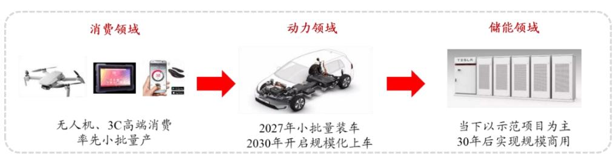

flowchart

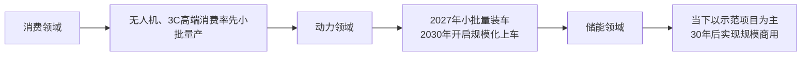

数据来源：东吴证券研究所绘制

# 2.3. 政策层面推进固态电池研发，固态电池产业化加速

为保持我国新能源产业竞争力，国家多部门重点支持固态电池，目标 2027 年实现千量上车计划。国资委成立固态电池产业创新联合体。由中国一汽牵头，有研广东院、国联研究院、东风汽车、长安汽车等 27家单位联合组建，目标 26年实现硫化物全固态装车示范应用，能量密度400wh/kg，循环寿命1000次。

工信部推出 60亿元重大研发专项，预计2025年完成小试（工信部项目中期审查），2026年中试，2027年完成小规模量产。宁德时代、比亚迪、一汽、上汽、卫蓝和吉利共六家企业获得政府基础研发支持，计划最终分为七大项目，涵盖聚合物和硫化物等不同技术路线。我国项目支持力度空前，固态电池产业化加速，目标 27 年小批量量产全固态电池，实现千辆级别的示范运营。

发改委发布超长期国债。对布局固态电池的企业和机构给予实际投资额 15%的资助，企业自行进行申报，由当地发改委推荐至国家发改委审核发放。

图15：国家对固态电池的扶持计划情况

<table><tr><td>国家部委</td><td>固态电池扶持计划</td></tr><tr><td>国务院国有资产监督管理委员会State-owned Assets Supervision and Administration Commission of the State Council</td><td>牵头成立固态电池产业创新联合体。由中国一汽牵头,有研广东院、国联研究院、东风汽车、长安汽车等27家单位联合组建,目标26年实现硫化物全固态装车示范应用,能量密度400wh/kg,循环寿命1000次。</td></tr><tr><td>中华人民共和国工业和信息化部Ministry of Industry and Information Technology of the People&#x27;s Republic of China</td><td>推出60亿元重大研发专项,预计2025年完成小试(工信部项目中期审查),2026年中试,2027年完成小规模量产。宁德时代、比亚迪、一汽、上汽、卫蓝和吉利共六家企业获得政府基础研发支持,计划最终分为七大项目,涵盖聚合物和硫化物等不同技术路线。</td></tr><tr><td>中华人民共和国国家发展和改革委员会National Development and Reform Commission</td><td>发布长期国债,对布局固态电池的企业和机构给予实际投资额15%的资助。</td></tr></table>

数据来源：国资委，工信部，发改委，东吴证券研究所

# 2.4. 固态电池兴起，带来设备工艺新需求

全固态电池工艺相对液态电池工艺的主要区别在于：（1）前段变化最大，主要在于电解质膜和极片制作工艺上，全固态电池干法工艺增加了干法混合、干法涂布环节实现固态电解质膜制备，不再需要使用溶剂，也不存在烘干环节；全固态电池湿法工艺仍然保留了利用溶剂制备电解质与粘结剂溶液后涂布蒸干制备电解质膜的工序。（2）中段电芯装配环节：全固态电池采用“叠片+极片胶框印刷+等静压技术”取代传统的液态电池卷绕工艺，并删减了注液工序；（3）后段化成分容环节：从液态电池化成分容转向全固态电池所需的高压化成分容。

图16：全固态电池工艺与液态电池工艺主要区别

<table><tr><td>工艺环节</td><td>液态电池湿法工艺</td><td>全固态电池湿法工艺</td><td>全固态电池干法工艺</td></tr><tr><td>前道电解质膜制作工艺</td><td>采用湿法合浆和涂布技术将活性材料、导电剂和黏结剂混合成浆料后涂布在集流体上,随后进行干燥和辊压。</td><td>利用低极性溶剂将粘结剂和电解质颗粒配成均匀浆料后进行涂布,再蒸干溶剂得到电解质膜,经过辊压后形成固态电解质层。</td><td>省去溶剂使用,直接通过干法合浆和涂布工艺制备极片。此外,还需进行电解质膜的干法涂布与辊压,以形成固态电解质层。</td></tr><tr><td>中道电芯装配工艺</td><td>采用卷绕或叠片工艺,将正负极片和隔膜卷绕成电芯,随后注入电解液并进行封装</td><td colspan="2">采用叠片工艺,结合极片胶框印刷和等静压技术,确保固态电解质与电极之间紧密接触。固态电池无需电解液,省去注液工序</td></tr><tr><td>后道化成分容工艺</td><td>封装后通过低压化成激活电池</td><td colspan="2">由于固态电解质的高离子电导率需求和固固界面接触问题,化成过程趋向高压化,需要引入高压化成设备,以优化电池性能</td></tr></table>

数据来源：高工锂电，东吴证券研究所

全固态电池的前道制造关键在于电极片制造环节和固态电解质成膜环节，两者均可以采用湿法/干法工艺。其中电解质成膜工艺会影响电解质厚度及离子电导率，厚度偏薄，会导致其机械性能相对较差，容易引发破损和内部短路；偏厚则内阻增加，并由于电解质本身不含活性物质，会降低电池单体和系统的能量密度。

（1）极片的干法工艺避免了溶剂的使用和干燥环节。①湿法工艺：将活性物质、导电剂、粘结剂分散在液态溶剂中形成浆料，然后将浆料涂布在集流体上，再经过干燥、辊压、蒸发等工序制成电极极片。②干法工艺：不使用液态溶剂，将活性物质、导电剂、粘结剂（通常是 PTFE）的干粉混合均匀，然后通过热压延工艺直接压制成连续的电极膜后与集流体复合，或者将干粉混合物直接沉积/压制在集流体上，避免溶剂的使用和干燥过程。（2）固态电解质成膜环节中湿法路线相对成熟，干法路线潜力更大，为未来发展大趋势。全固态电池中硫化物电解质对极性有机溶剂较为敏感，此外金属锂负极容易与溶剂反应，主流思路为切换干法电极工艺，但目前干法工艺刚刚起步，难点在于厚度、压实、幅宽、跑速等，主流厂商仍以湿法工艺为主，选取特定溶剂，实现较薄的固态电解质膜厚度，但干法仍为未来发展大趋势。

图17：全固态电池湿法&干法工艺对比，在前道主要是极片制造和成膜环节依靠干混挤压，无需溶剂及烘干环节  
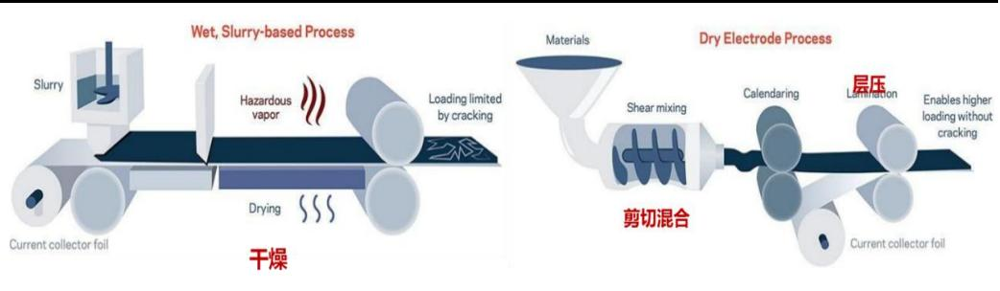

text_image

Wet, Slurry-based Process
Hazardous vapor
Loading limited by cracking
Drying
Current collector foil
干燥
Dry Electrode Process
Materials
Shear mixing
Calendaring
层压
Lamination
Enables higher loading without cracking
剪切混合
Current collector foil

数据来源：公司官网，东吴证券研究所

干法技术制造电极片最大的优势在于能够提高电极的压实密度，从而提高电池能量密度，更适合全固态电池生产。（1）湿法电极制造需要使用溶剂将活性材料、导电剂和黏结剂混合后涂布在集流体上，然后再进行干燥、NMP 溶剂回收和辊压，仍然需要溶剂参与、需要干燥和溶剂回收环节，工艺相对复杂；（2）干法电极制造则将活性材料、导电剂和黏结剂混合成干粉，通过辊压机热压延的方式机械压到集流体上形成电极片。极片制造采用干法工艺可以提高电极的压实密度，意味着在相同体积下可以容纳更多的正负极材料，从而提高电池的能量密度。同时省去溶剂干燥、避免了溶剂残留导致的导电性下降问题。因此干法技术更加适合于固态电池生产。

图18：全固态电池中湿法&干法工艺制造电极片对比图  
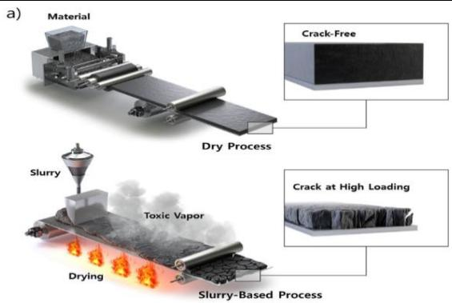

text_image

a)
Material
Dry Process
Slurry
Toxic Vapor
Drying
Slurry-Based Process
Crack-Free
Crack at High Loading

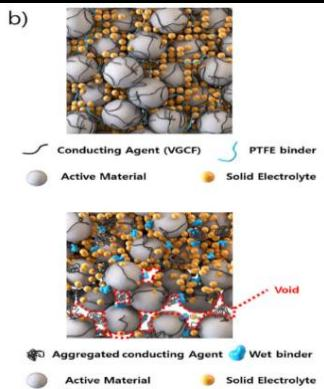

text_image

b)
Conducting Agent (VGCF) PTFE binder
Active Material Solid Electrolyte
Void
Aggregated conducting Agent Wet binder
Active Material Solid Electrolyte

数据来源：公司官网，东吴证券研究所

# 2.5. 公司推出卤化物电解质干法解决方案，差异化布局固态电池设备&材料

信宇人固态电池材料项目未来将围绕低成本、高离子电导率卤化物固态电解质，开发“能量型+快充型”双路线布局，计划 3 年内建成量产中试线，推动能量型电解质装车验证与快充型适配无人机与超充桩场景。

公司开发“能量型+快充型”两条固态电解质路线，均采用公司自研、自产干法成膜一体机。（1）能量型：重点开发稀土替代型卤化物，通过水相合成工艺降低材料成本至 20 万元/吨以下，并实现室温离子电导率>1 mS/cm，固态电池能量密度>400 Wh/kg。（2）快充型：优化其与高镍正极的界面适配性，设计卤化物-硫化物梯度复合电解质，引入锂离子高速传输通道结构，降低迁移能垒从而提高离子电导率，支持 5C级快充。

公司固态电池材料解决方案采用自主研发的干法成膜一体机，可实现高能量密度隔膜的高效生产。该方案具有以下优势：（1）无需干燥烘箱，显著降低厂房占地面积及生产采购成本；（2）无需处理NMP溶剂，减少VOC排放并降低产线能耗；（3）突破湿法涂布厚度极限，有效提升电池能量密度。

图19：公司开发“能量型+快充型”两条固态电解质路线，匹配不同应用场景下的固态电池需求

<table><tr><td>电解质类型</td><td>未来应用场景</td><td>未来目标</td></tr><tr><td>能量型卤化物电解质</td><td>动力电池</td><td>重点开发稀土替代型卤化物,通过水相合成工艺降低材料成本至20万元/吨以下,并实现室温离子电导率&gt;1mS/cm,固态电池能量密度&gt;400Wh/kg。</td></tr><tr><td>快充型卤化物电解质</td><td>无人机等应用场景</td><td>优化其与高镍正极的界面适配性,设计卤化物-硫化物梯度复合电解质,引入锂离子高速传输通道结构,降低迁移能垒从而提高离子电导率,支持5C级快充。</td></tr></table>

数据来源：公司公众号，东吴证券研究所

图20：公司干法成膜复合一体机  
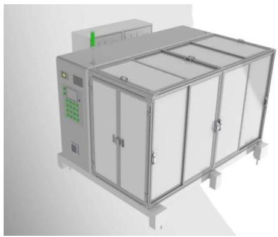

natural_image

3D rendering of a stainless steel industrial machine with multiple doors and control panel (no visible text or symbols)

数据来源：公司官网，东吴证券研究所

# 3. 盈利预测&投资评级

信宇人深耕锂电设备领域，差异化布局固态电池前道设备。考虑到锂电行业回暖，我们预计公司 2025-2027 营业收入分别为 5.8/7.1/8.4 亿元，同比-6.2%/+21.5%/+18.6%。同时，锂电设备行业竞争格局向龙头集中，公司综合盈利能力有望提升，我们预计公司2025-2027 年综合毛利率为 25.3%/26.0%/26.7%。

信宇人主要涉及锂电设备业务，故我们选取了同行业设备公司先导智能、曼恩斯特、纳科诺尔、利元亨及先惠技术作为可比公司。我们预计公司 2025-2027年归母净利润为8.5/54.7/79.4 百万元，当前股价对应 PE估值水平分别为346/54/37x。考虑到公司差异化布局固态电池前道解决方案，有望充分受益于固态电池产业化，因此给予一定估值溢价，首次覆盖给予公司“增持”评级。

图21：可比公司估值（截至 2025年 7 月 25 日收盘价）

<table><tr><td rowspan="2">股票代码</td><td rowspan="2">公司</td><td rowspan="2">市值(亿元)</td><td colspan="4">归母净利润(亿元)</td><td colspan="4">PE</td></tr><tr><td>2024</td><td>2025E</td><td>2026E</td><td>2027E</td><td>2024</td><td>2025E</td><td>2026E</td><td>2027E</td></tr><tr><td>300450.SZ</td><td>先导智能</td><td>415.3</td><td>2.9</td><td>10.6</td><td>17.0</td><td>22.3</td><td>145.2</td><td>39.3</td><td>24.4</td><td>18.6</td></tr><tr><td>301325.SZ</td><td>曼恩斯特</td><td>88.8</td><td>0.3</td><td>1.2</td><td>2.1</td><td>3.4</td><td>289.3</td><td>74.0</td><td>42.5</td><td>26.1</td></tr><tr><td>832522.BJ</td><td>纳科诺尔</td><td>89.7</td><td>1.6</td><td>1.8</td><td>2.4</td><td>3.2</td><td>55.4</td><td>49.8</td><td>36.8</td><td>27.8</td></tr><tr><td>688499.SH</td><td>利元亨</td><td>88.7</td><td>-10.4</td><td>0.6</td><td>1.3</td><td>1.6</td><td>-8.5</td><td>156.8</td><td>69.4</td><td>54.0</td></tr><tr><td>688155.SH</td><td>先惠技术</td><td>69.7</td><td>2.2</td><td>3.3</td><td>4.4</td><td>5.5</td><td>31.3</td><td>21.2</td><td>15.9</td><td>12.8</td></tr><tr><td colspan="7">行业均值</td><td>102.5</td><td>68.2</td><td>37.8</td><td>27.9</td></tr><tr><td>688573.SH</td><td>信宇人</td><td>31.9</td><td>-0.6</td><td>0.1</td><td>0.6</td><td>0.8</td><td>-46.6</td><td>346.4</td><td>53.9</td><td>37.2</td></tr></table>

数据来源：Wind，东吴证券研究所

# 4. 风险提示

1. 下游扩产不及预期：若锂电设备企业的扩产规模低于预期，则对应锂电设备采购金额低于预期，导致公司的新签锂电设备订单低于预期，对业绩产生不利影响。  
2. 新业务拓展不及预期：若公司固态电池新业务的产品研发订单获取低于预期，对公司总体订单产生不利影响。  
3. 业绩扭亏为盈不及预期：公司2024年处于亏损状态；由于设备行业订单确认收入通常具有滞后性，因此公司扭亏为盈的节奏可能不及预期。

信宇人三大财务预测表

<table><tr><td>资产负债表(百万元)</td><td>2024A</td><td>2025E</td><td>2026E</td><td>2027E</td></tr><tr><td>流动资产</td><td>1,409</td><td>1,117</td><td>1,318</td><td>1,555</td></tr><tr><td>货币资金及交易性金融资产</td><td>175</td><td>377</td><td>436</td><td>598</td></tr><tr><td>经营性应收款项</td><td>543</td><td>127</td><td>162</td><td>192</td></tr><tr><td>存货</td><td>382</td><td>162</td><td>215</td><td>253</td></tr><tr><td>合同资产</td><td>53</td><td>204</td><td>255</td><td>261</td></tr><tr><td>其他流动资产</td><td>256</td><td>248</td><td>249</td><td>251</td></tr><tr><td>非流动资产</td><td>633</td><td>658</td><td>671</td><td>677</td></tr><tr><td>长期股权投资</td><td>0</td><td>0</td><td>0</td><td>0</td></tr><tr><td>固定资产及使用权资产</td><td>362</td><td>380</td><td>374</td><td>354</td></tr><tr><td>在建工程</td><td>65</td><td>37</td><td>24</td><td>17</td></tr><tr><td>无形资产</td><td>35</td><td>68</td><td>101</td><td>134</td></tr><tr><td>商誉</td><td>0</td><td>0</td><td>0</td><td>0</td></tr><tr><td>长期待摊费用</td><td>6</td><td>6</td><td>6</td><td>6</td></tr><tr><td>其他非流动资产</td><td>166</td><td>166</td><td>166</td><td>166</td></tr><tr><td>资产总计</td><td>2,042</td><td>1,775</td><td>1,988</td><td>2,233</td></tr><tr><td>流动负债</td><td>1,098</td><td>822</td><td>982</td><td>1,148</td></tr><tr><td>短期借款及一年内到期的非流动负债</td><td>186</td><td>31</td><td>41</td><td>64</td></tr><tr><td>经营性应付款项</td><td>670</td><td>566</td><td>692</td><td>812</td></tr><tr><td>合同负债</td><td>105</td><td>93</td><td>111</td><td>131</td></tr><tr><td>其他流动负债</td><td>137</td><td>134</td><td>138</td><td>142</td></tr><tr><td>非流动负债</td><td>119</td><td>119</td><td>119</td><td>119</td></tr><tr><td>长期借款</td><td>89</td><td>89</td><td>89</td><td>89</td></tr><tr><td>应付债券</td><td>0</td><td>0</td><td>0</td><td>0</td></tr><tr><td>租赁负债</td><td>24</td><td>24</td><td>24</td><td>24</td></tr><tr><td>其他非流动负债</td><td>6</td><td>6</td><td>6</td><td>6</td></tr><tr><td>负债合计</td><td>1,217</td><td>941</td><td>1,100</td><td>1,266</td></tr><tr><td>归属母公司股东权益</td><td>820</td><td>829</td><td>884</td><td>963</td></tr><tr><td>少数股东权益</td><td>5</td><td>5</td><td>4</td><td>4</td></tr><tr><td>所有者权益合计</td><td>825</td><td>834</td><td>888</td><td>966</td></tr><tr><td>负债和股东权益</td><td>2,042</td><td>1,775</td><td>1,988</td><td>2,233</td></tr></table>

<table><tr><td>利润表(百万元)</td><td>2024A</td><td>2025E</td><td>2026E</td><td>2027E</td></tr><tr><td>营业总收入</td><td>622</td><td>583</td><td>709</td><td>840</td></tr><tr><td>营业成本(含金融类)</td><td>495</td><td>436</td><td>524</td><td>616</td></tr><tr><td>税金及附加</td><td>8</td><td>9</td><td>11</td><td>13</td></tr><tr><td>销售费用</td><td>14</td><td>29</td><td>32</td><td>38</td></tr><tr><td>管理费用</td><td>40</td><td>35</td><td>39</td><td>42</td></tr><tr><td>研发费用</td><td>71</td><td>64</td><td>71</td><td>80</td></tr><tr><td>财务费用</td><td>9</td><td>6</td><td>8</td><td>8</td></tr><tr><td>加:其他收益</td><td>16</td><td>18</td><td>21</td><td>25</td></tr><tr><td>投资净收益</td><td>11</td><td>12</td><td>14</td><td>17</td></tr><tr><td>公允价值变动</td><td>0</td><td>0</td><td>0</td><td>0</td></tr><tr><td>减值损失</td><td>(85)</td><td>(24)</td><td>0</td><td>0</td></tr><tr><td>资产处置收益</td><td>0</td><td>0</td><td>0</td><td>0</td></tr><tr><td>营业利润</td><td>(74)</td><td>9</td><td>59</td><td>86</td></tr><tr><td>营业外净收支</td><td>0</td><td>0</td><td>0</td><td>0</td></tr><tr><td>利润总额</td><td>(73)</td><td>9</td><td>59</td><td>86</td></tr><tr><td>减:所得税</td><td>(11)</td><td>1</td><td>5</td><td>8</td></tr><tr><td>净利润</td><td>(62)</td><td>8</td><td>54</td><td>79</td></tr><tr><td>减:少数股东损益</td><td>1</td><td>0</td><td>(1)</td><td>(1)</td></tr><tr><td>归属母公司净利润</td><td>(63)</td><td>9</td><td>55</td><td>79</td></tr><tr><td>每股收益-最新股本摊薄(元)</td><td>(0.65)</td><td>0.09</td><td>0.56</td><td>0.81</td></tr><tr><td>EBIT</td><td>(77)</td><td>10</td><td>32</td><td>52</td></tr><tr><td>EBITDA</td><td>(55)</td><td>56</td><td>82</td><td>106</td></tr><tr><td>毛利率(%)</td><td>20.33</td><td>25.28</td><td>26.02</td><td>26.73</td></tr><tr><td>归母净利率(%)</td><td>(10.17)</td><td>1.46</td><td>7.72</td><td>9.44</td></tr><tr><td>收入增长率(%)</td><td>4.75</td><td>(6.17)</td><td>21.45</td><td>18.60</td></tr><tr><td>归母净利润增长率(%)</td><td>(208.41)</td><td>113.46</td><td>542.19</td><td>45.18</td></tr></table>

<table><tr><td>现金流量表(百万元)</td><td>2024A</td><td>2025E</td><td>2026E</td><td>2027E</td></tr><tr><td>经营活动现金流</td><td>(94)</td><td>416</td><td>98</td><td>183</td></tr><tr><td>投资活动现金流</td><td>(123)</td><td>(59)</td><td>(49)</td><td>(43)</td></tr><tr><td>筹资活动现金流</td><td>83</td><td>(155)</td><td>10</td><td>23</td></tr><tr><td>现金净增加额</td><td>(134)</td><td>202</td><td>59</td><td>162</td></tr><tr><td>折旧和摊销</td><td>22</td><td>46</td><td>50</td><td>53</td></tr><tr><td>资本开支</td><td>(106)</td><td>(70)</td><td>(63)</td><td>(60)</td></tr><tr><td>营运资本变动</td><td>(124)</td><td>349</td><td>8</td><td>67</td></tr></table>

<table><tr><td>重要财务与估值指标</td><td>2024A</td><td>2025E</td><td>2026E</td><td>2027E</td></tr><tr><td>每股净资产(元)</td><td>8.39</td><td>8.48</td><td>9.04</td><td>9.85</td></tr><tr><td>最新发行在外股份(百万股)</td><td>98</td><td>98</td><td>98</td><td>98</td></tr><tr><td>ROIC(%)</td><td>(5.82)</td><td>0.90</td><td>2.89</td><td>4.36</td></tr><tr><td>ROE-摊薄(%)</td><td>(7.71)</td><td>1.03</td><td>6.19</td><td>8.24</td></tr><tr><td>资产负债率(%)</td><td>59.59</td><td>53.03</td><td>55.35</td><td>56.72</td></tr><tr><td>P/E (现价&amp;最新股本摊薄)</td><td>(46.62)</td><td>346.39</td><td>53.94</td><td>37.15</td></tr><tr><td>P/B (现价)</td><td>3.60</td><td>3.56</td><td>3.34</td><td>3.06</td></tr></table>

数据来源:Wind,东吴证券研究所，全文如无特殊注明，相关数据的货币单位均为人民币，预测均为东吴证券研究所预测。

# 免责声明

东吴证券股份有限公司经中国证券监督管理委员会批准，已具备证券投资咨询业务资格。

本研究报告仅供东吴证券股份有限公司（以下简称“本公司”）的客户使用。本公司不会因接收人收到本报告而视其为客户。在任何情况下，本报告中的信息或所表述的意见并不构成对任何人的投资建议，本公司及作者不对任何人因使用本报告中的内容所导致的任何后果负任何责任。任何形式的分享证券投资收益或者分担证券投资损失的书面或口头承诺均为无效。

在法律许可的情况下，东吴证券及其所属关联机构可能会持有报告中提到的公司所发行的证券并进行交易，还可能为这些公司提供投资银行服务或其他服务。

市场有风险，投资需谨慎。本报告是基于本公司分析师认为可靠且已公开的信息，本公司力求但不保证这些信息的准确性和完整性，也不保证文中观点或陈述不会发生任何变更，在不同时期，本公司可发出与本报告所载资料、意见及推测不一致的报告。

本报告的版权归本公司所有，未经书面许可，任何机构和个人不得以任何形式翻版、复制和发布。经授权刊载、转发本报告或者摘要的，应当注明出处为东吴证券研究所，并注明本报告发布人和发布日期，提示使用本报告的风险，且不得对本报告进行有悖原意的引用、删节和修改。未经授权或未按要求刊载、转发本报告的，应当承担相应的法律责任。本公司将保留向其追究法律责任的权利。

# 东吴证券投资评级标准

投资评级基于分析师对报告发布日后 6 至 12 个月内行业或公司回报潜力相对基准表现的预期（A 股市场基准为沪深 300 指数，香港市场基准为恒生指数，美国市场基准为标普500 指数，新三板基准指数为三板成指（针对协议转让标的）或三板做市指数（针对做市转让标的），北交所基准指数为北证 50指数），具体如下：

公司投资评级：

买入：预期未来 6个月个股涨跌幅相对基准在15%以上；

增持：预期未来 6个月个股涨跌幅相对基准介于5%与15%之间；

中性：预期未来 6个月个股涨跌幅相对基准介于-5%与 5%之间；

减持：预期未来 6个月个股涨跌幅相对基准介于-15%与-5%之间；

卖出：预期未来 6个月个股涨跌幅相对基准在-15%以下。

行业投资评级：

增持： 预期未来 6个月内，行业指数相对强于基准5%以上；

中性： 预期未来 6个月内，行业指数相对基准-5%与5%；

减持： 预期未来 6个月内，行业指数相对弱于基准5%以上。

我们在此提醒您，不同证券研究机构采用不同的评级术语及评级标准。我们采用的是相对评级体系，表示投资的相对比重建议。投资者买入或者卖出证券的决定应当充分考虑自身特定状况，如具体投资目的、财务状况以及特定需求等，并完整理解和使用本报告内容，不应视本报告为做出投资决策的唯一因素。

东吴证券研究所

苏州工业园区星阳街 5 号

邮政编码：215021

传真：（0512）62938527

公司网址： http://www.dwzq.com.cn